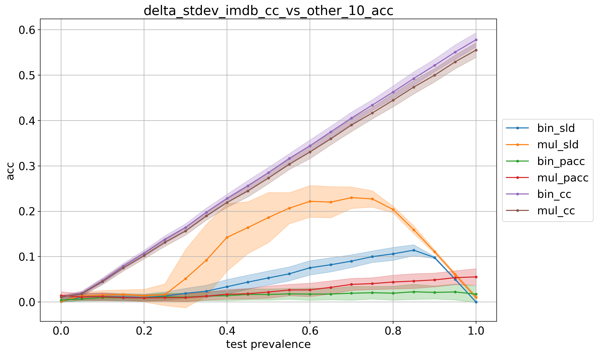
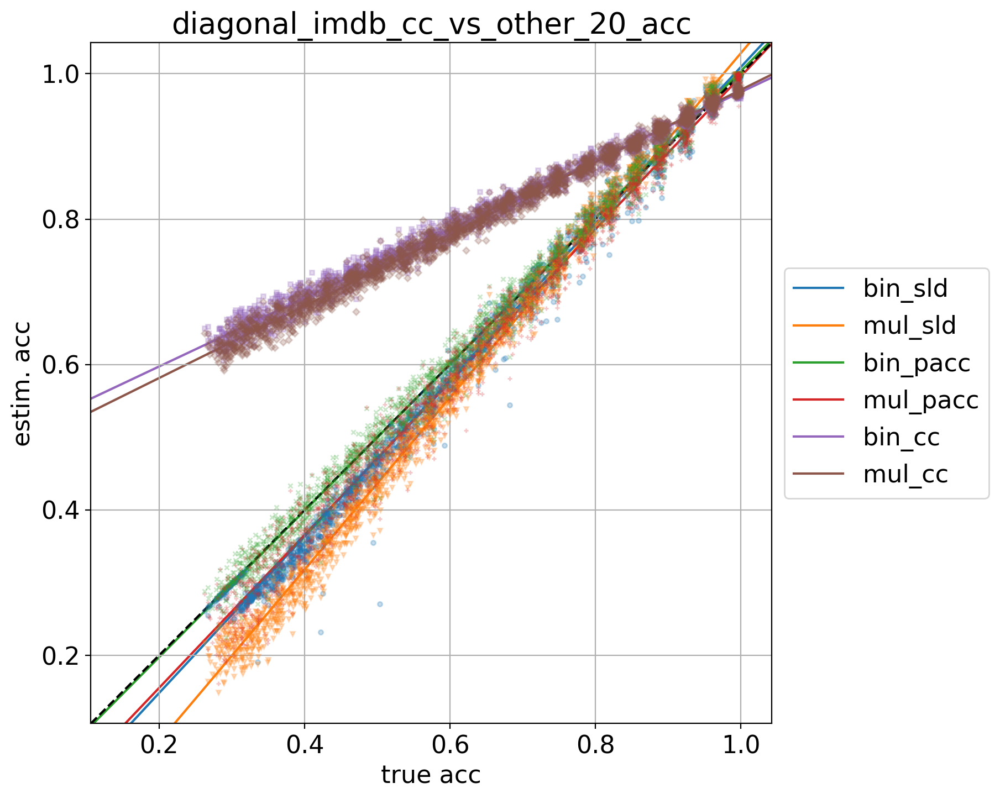
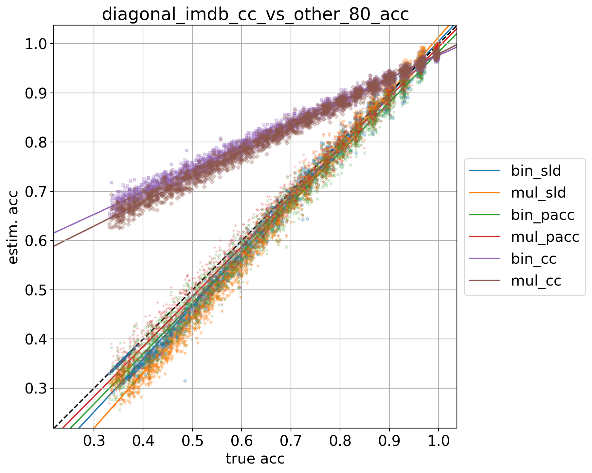

# imdb_9prevs

## 10% positives
> train: [0.89991359 0.10008641]  
> validation: [0.9000576 0.0999424]  
> bin_sld: 249.048s  
> mul_sld: 71.459s  
> mul_sld_gs: 455.993s  
> bin_pacc: 244.563s  
> mul_pacc: 43.016s  
> binmc_pacc: 240.469s  
> mulmc_pacc: 41.750s  
> binne_pacc: 236.217s  
> mulne_pacc: 34.041s  
> bin_cc: 241.914s  
> mul_cc: 40.328s  
> kfcv: 24.723s  
> ref: 18.562s  
> atc_mc: 27.491s  
> atc_ne: 25.568s  
> doc_feat: 11.526s  
> tot: 456.775s  

<table border="1" class="dataframe">
  <thead>
    <tr style="text-align: right;">
      <th></th>
      <th>bin_sld</th>
      <th>mul_sld</th>
      <th>bin_pacc</th>
      <th>mul_pacc</th>
      <th>bin_cc</th>
      <th>mul_cc</th>
    </tr>
  </thead>
  <tbody>
    <tr>
      <th>0.0</th>
      <td>0.0012</td>
      <td>0.0015</td>
      <td>0.0046</td>
      <td>0.0144</td>
      <td>0.0108</td>
      <td>0.0110</td>
    </tr>
    <tr>
      <th>0.05</th>
      <td>0.0119</td>
      <td>0.0138</td>
      <td>0.0070</td>
      <td>0.0112</td>
      <td>0.0195</td>
      <td>0.0181</td>
    </tr>
    <tr>
      <th>0.1</th>
      <td>0.0123</td>
      <td>0.0156</td>
      <td>0.0098</td>
      <td>0.0118</td>
      <td>0.0473</td>
      <td>0.0449</td>
    </tr>
    <tr>
      <th>0.15</th>
      <td>0.0112</td>
      <td>0.0169</td>
      <td>0.0094</td>
      <td>0.0098</td>
      <td>0.0791</td>
      <td>0.0754</td>
    </tr>
    <tr>
      <th>0.2</th>
      <td>0.0101</td>
      <td>0.0142</td>
      <td>0.0091</td>
      <td>0.0090</td>
      <td>0.1074</td>
      <td>0.1026</td>
    </tr>
    <tr>
      <th>0.25</th>
      <td>0.0132</td>
      <td>0.0162</td>
      <td>0.0116</td>
      <td>0.0096</td>
      <td>0.1376</td>
      <td>0.1317</td>
    </tr>
    <tr>
      <th>0.3</th>
      <td>0.0193</td>
      <td>0.0516</td>
      <td>0.0107</td>
      <td>0.0099</td>
      <td>0.1643</td>
      <td>0.1567</td>
    </tr>
    <tr>
      <th>0.35</th>
      <td>0.0239</td>
      <td>0.0923</td>
      <td>0.0131</td>
      <td>0.0130</td>
      <td>0.1978</td>
      <td>0.1898</td>
    </tr>
    <tr>
      <th>0.4</th>
      <td>0.0338</td>
      <td>0.1427</td>
      <td>0.0140</td>
      <td>0.0171</td>
      <td>0.2283</td>
      <td>0.2195</td>
    </tr>
    <tr>
      <th>0.45</th>
      <td>0.0439</td>
      <td>0.1641</td>
      <td>0.0169</td>
      <td>0.0184</td>
      <td>0.2559</td>
      <td>0.2449</td>
    </tr>
    <tr>
      <th>0.5</th>
      <td>0.0532</td>
      <td>0.1864</td>
      <td>0.0167</td>
      <td>0.0220</td>
      <td>0.2855</td>
      <td>0.2735</td>
    </tr>
    <tr>
      <th>0.55</th>
      <td>0.0622</td>
      <td>0.2069</td>
      <td>0.0180</td>
      <td>0.0266</td>
      <td>0.3166</td>
      <td>0.3037</td>
    </tr>
    <tr>
      <th>0.6</th>
      <td>0.0756</td>
      <td>0.2220</td>
      <td>0.0175</td>
      <td>0.0269</td>
      <td>0.3444</td>
      <td>0.3308</td>
    </tr>
    <tr>
      <th>0.65</th>
      <td>0.0822</td>
      <td>0.2203</td>
      <td>0.0177</td>
      <td>0.0323</td>
      <td>0.3751</td>
      <td>0.3597</td>
    </tr>
    <tr>
      <th>0.7</th>
      <td>0.0902</td>
      <td>0.2301</td>
      <td>0.0195</td>
      <td>0.0390</td>
      <td>0.4056</td>
      <td>0.3902</td>
    </tr>
    <tr>
      <th>0.75</th>
      <td>0.1000</td>
      <td>0.2274</td>
      <td>0.0206</td>
      <td>0.0406</td>
      <td>0.4340</td>
      <td>0.4166</td>
    </tr>
    <tr>
      <th>0.8</th>
      <td>0.1062</td>
      <td>0.2041</td>
      <td>0.0195</td>
      <td>0.0441</td>
      <td>0.4628</td>
      <td>0.4448</td>
    </tr>
    <tr>
      <th>0.85</th>
      <td>0.1143</td>
      <td>0.1594</td>
      <td>0.0226</td>
      <td>0.0463</td>
      <td>0.4928</td>
      <td>0.4738</td>
    </tr>
    <tr>
      <th>0.9</th>
      <td>0.0982</td>
      <td>0.1112</td>
      <td>0.0213</td>
      <td>0.0488</td>
      <td>0.5215</td>
      <td>0.4998</td>
    </tr>
    <tr>
      <th>0.95</th>
      <td>0.0499</td>
      <td>0.0605</td>
      <td>0.0222</td>
      <td>0.0538</td>
      <td>0.5510</td>
      <td>0.5295</td>
    </tr>
    <tr>
      <th>1.0</th>
      <td>0.0000</td>
      <td>0.0106</td>
      <td>0.0174</td>
      <td>0.0554</td>
      <td>0.5780</td>
      <td>0.5553</td>
    </tr>
    <tr>
      <th>avg</th>
      <td>0.0482</td>
      <td>0.1127</td>
      <td>0.0152</td>
      <td>0.0267</td>
      <td>0.2864</td>
      <td>0.2749</td>
    </tr>
  </tbody>
</table>

## 20% positives
> train: [0.7999712 0.2000288]  
> validation: [0.7999712 0.2000288]  
> bin_sld: 312.036s  
> mul_sld: 63.355s  
> bin_sld_gs: 1039.328s  
> mul_sld_gs: 562.297s  
> bin_sld_gsq: 402.075s  
> bin_pacc: 297.187s  
> mul_pacc: 36.589s  
> binmc_pacc: 296.718s  
> mulmc_pacc: 36.777s  
> binne_pacc: 285.556s  
> mulne_pacc: 47.832s  
> bin_pacc_gs: 636.796s  
> mul_pacc_gs: 141.445s  
> bin_cc: 293.873s  
> mul_cc: 46.722s  
> kfcv: 30.476s  
> ref: 26.348s  
> atc_mc: 22.299s  
> atc_ne: 41.782s  
> doc_feat: 11.276s  
> tot: 1040.077s  

<table border="1" class="dataframe">
  <thead>
    <tr style="text-align: right;">
      <th></th>
      <th>bin_sld</th>
      <th>mul_sld</th>
      <th>bin_pacc</th>
      <th>mul_pacc</th>
      <th>bin_cc</th>
      <th>mul_cc</th>
    </tr>
  </thead>
  <tbody>
    <tr>
      <th>0.0</th>
      <td>0.0017</td>
      <td>0.0023</td>
      <td>0.0018</td>
      <td>0.0078</td>
      <td>0.0229</td>
      <td>0.0196</td>
    </tr>
    <tr>
      <th>0.05</th>
      <td>0.0107</td>
      <td>0.0130</td>
      <td>0.0105</td>
      <td>0.0104</td>
      <td>0.0057</td>
      <td>0.0053</td>
    </tr>
    <tr>
      <th>0.1</th>
      <td>0.0136</td>
      <td>0.0154</td>
      <td>0.0119</td>
      <td>0.0129</td>
      <td>0.0140</td>
      <td>0.0150</td>
    </tr>
    <tr>
      <th>0.15</th>
      <td>0.0148</td>
      <td>0.0159</td>
      <td>0.0126</td>
      <td>0.0135</td>
      <td>0.0328</td>
      <td>0.0338</td>
    </tr>
    <tr>
      <th>0.2</th>
      <td>0.0141</td>
      <td>0.0143</td>
      <td>0.0126</td>
      <td>0.0147</td>
      <td>0.0509</td>
      <td>0.0501</td>
    </tr>
    <tr>
      <th>0.25</th>
      <td>0.0127</td>
      <td>0.0123</td>
      <td>0.0132</td>
      <td>0.0165</td>
      <td>0.0694</td>
      <td>0.0689</td>
    </tr>
    <tr>
      <th>0.3</th>
      <td>0.0129</td>
      <td>0.0135</td>
      <td>0.0118</td>
      <td>0.0178</td>
      <td>0.0875</td>
      <td>0.0849</td>
    </tr>
    <tr>
      <th>0.35</th>
      <td>0.0133</td>
      <td>0.0166</td>
      <td>0.0138</td>
      <td>0.0214</td>
      <td>0.1081</td>
      <td>0.1054</td>
    </tr>
    <tr>
      <th>0.4</th>
      <td>0.0142</td>
      <td>0.0217</td>
      <td>0.0153</td>
      <td>0.0234</td>
      <td>0.1266</td>
      <td>0.1226</td>
    </tr>
    <tr>
      <th>0.45</th>
      <td>0.0165</td>
      <td>0.0238</td>
      <td>0.0143</td>
      <td>0.0217</td>
      <td>0.1446</td>
      <td>0.1403</td>
    </tr>
    <tr>
      <th>0.5</th>
      <td>0.0181</td>
      <td>0.0321</td>
      <td>0.0151</td>
      <td>0.0240</td>
      <td>0.1629</td>
      <td>0.1576</td>
    </tr>
    <tr>
      <th>0.55</th>
      <td>0.0206</td>
      <td>0.0412</td>
      <td>0.0134</td>
      <td>0.0282</td>
      <td>0.1824</td>
      <td>0.1766</td>
    </tr>
    <tr>
      <th>0.6</th>
      <td>0.0273</td>
      <td>0.0514</td>
      <td>0.0154</td>
      <td>0.0291</td>
      <td>0.1990</td>
      <td>0.1922</td>
    </tr>
    <tr>
      <th>0.65</th>
      <td>0.0289</td>
      <td>0.0573</td>
      <td>0.0150</td>
      <td>0.0310</td>
      <td>0.2177</td>
      <td>0.2106</td>
    </tr>
    <tr>
      <th>0.7</th>
      <td>0.0368</td>
      <td>0.0676</td>
      <td>0.0140</td>
      <td>0.0335</td>
      <td>0.2400</td>
      <td>0.2306</td>
    </tr>
    <tr>
      <th>0.75</th>
      <td>0.0380</td>
      <td>0.0730</td>
      <td>0.0129</td>
      <td>0.0299</td>
      <td>0.2566</td>
      <td>0.2471</td>
    </tr>
    <tr>
      <th>0.8</th>
      <td>0.0447</td>
      <td>0.0835</td>
      <td>0.0148</td>
      <td>0.0372</td>
      <td>0.2743</td>
      <td>0.2638</td>
    </tr>
    <tr>
      <th>0.85</th>
      <td>0.0508</td>
      <td>0.0948</td>
      <td>0.0150</td>
      <td>0.0412</td>
      <td>0.2931</td>
      <td>0.2816</td>
    </tr>
    <tr>
      <th>0.9</th>
      <td>0.0534</td>
      <td>0.1011</td>
      <td>0.0168</td>
      <td>0.0446</td>
      <td>0.3093</td>
      <td>0.2975</td>
    </tr>
    <tr>
      <th>0.95</th>
      <td>0.0482</td>
      <td>0.1026</td>
      <td>0.0147</td>
      <td>0.0418</td>
      <td>0.3309</td>
      <td>0.3186</td>
    </tr>
    <tr>
      <th>1.0</th>
      <td>0.0022</td>
      <td>0.0820</td>
      <td>0.0098</td>
      <td>0.0416</td>
      <td>0.3468</td>
      <td>0.3321</td>
    </tr>
    <tr>
      <th>avg</th>
      <td>0.0235</td>
      <td>0.0445</td>
      <td>0.0131</td>
      <td>0.0258</td>
      <td>0.1655</td>
      <td>0.1597</td>
    </tr>
  </tbody>
</table>

## 30% positives
> train: [0.7000288 0.2999712]  
> validation: [0.7000288 0.2999712]  
> bin_sld: 302.903s  
> mul_sld: 59.883s  
> bin_sld_gs: 1013.188s  
> mul_sld_gs: 556.087s  
> bin_sld_gsq: 413.115s  
> bin_pacc: 294.712s  
> mul_pacc: 45.954s  
> binmc_pacc: 300.950s  
> mulmc_pacc: 45.939s  
> binne_pacc: 289.350s  
> mulne_pacc: 38.137s  
> bin_pacc_gs: 643.072s  
> mul_pacc_gs: 149.582s  
> bin_cc: 298.684s  
> mul_cc: 43.908s  
> kfcv: 37.403s  
> ref: 28.756s  
> atc_mc: 39.420s  
> atc_ne: 24.347s  
> doc_feat: 22.815s  
> tot: 1014.314s  

<table border="1" class="dataframe">
  <thead>
    <tr style="text-align: right;">
      <th></th>
      <th>bin_sld</th>
      <th>mul_sld</th>
      <th>bin_pacc</th>
      <th>mul_pacc</th>
      <th>bin_cc</th>
      <th>mul_cc</th>
    </tr>
  </thead>
  <tbody>
    <tr>
      <th>0.0</th>
      <td>0.0016</td>
      <td>0.0036</td>
      <td>0.0069</td>
      <td>0.0108</td>
      <td>0.0108</td>
      <td>0.0054</td>
    </tr>
    <tr>
      <th>0.05</th>
      <td>0.0103</td>
      <td>0.0143</td>
      <td>0.0120</td>
      <td>0.0123</td>
      <td>0.0061</td>
      <td>0.0129</td>
    </tr>
    <tr>
      <th>0.1</th>
      <td>0.0172</td>
      <td>0.0203</td>
      <td>0.0134</td>
      <td>0.0130</td>
      <td>0.0153</td>
      <td>0.0267</td>
    </tr>
    <tr>
      <th>0.15</th>
      <td>0.0171</td>
      <td>0.0212</td>
      <td>0.0142</td>
      <td>0.0121</td>
      <td>0.0279</td>
      <td>0.0394</td>
    </tr>
    <tr>
      <th>0.2</th>
      <td>0.0172</td>
      <td>0.0197</td>
      <td>0.0152</td>
      <td>0.0132</td>
      <td>0.0389</td>
      <td>0.0519</td>
    </tr>
    <tr>
      <th>0.25</th>
      <td>0.0175</td>
      <td>0.0168</td>
      <td>0.0175</td>
      <td>0.0134</td>
      <td>0.0520</td>
      <td>0.0649</td>
    </tr>
    <tr>
      <th>0.3</th>
      <td>0.0176</td>
      <td>0.0185</td>
      <td>0.0169</td>
      <td>0.0134</td>
      <td>0.0639</td>
      <td>0.0776</td>
    </tr>
    <tr>
      <th>0.35</th>
      <td>0.0167</td>
      <td>0.0157</td>
      <td>0.0230</td>
      <td>0.0158</td>
      <td>0.0777</td>
      <td>0.0922</td>
    </tr>
    <tr>
      <th>0.4</th>
      <td>0.0154</td>
      <td>0.0159</td>
      <td>0.0244</td>
      <td>0.0160</td>
      <td>0.0915</td>
      <td>0.1062</td>
    </tr>
    <tr>
      <th>0.45</th>
      <td>0.0136</td>
      <td>0.0150</td>
      <td>0.0237</td>
      <td>0.0152</td>
      <td>0.1031</td>
      <td>0.1184</td>
    </tr>
    <tr>
      <th>0.5</th>
      <td>0.0160</td>
      <td>0.0192</td>
      <td>0.0274</td>
      <td>0.0182</td>
      <td>0.1159</td>
      <td>0.1318</td>
    </tr>
    <tr>
      <th>0.55</th>
      <td>0.0150</td>
      <td>0.0192</td>
      <td>0.0282</td>
      <td>0.0168</td>
      <td>0.1295</td>
      <td>0.1456</td>
    </tr>
    <tr>
      <th>0.6</th>
      <td>0.0153</td>
      <td>0.0232</td>
      <td>0.0304</td>
      <td>0.0171</td>
      <td>0.1396</td>
      <td>0.1555</td>
    </tr>
    <tr>
      <th>0.65</th>
      <td>0.0170</td>
      <td>0.0261</td>
      <td>0.0327</td>
      <td>0.0193</td>
      <td>0.1524</td>
      <td>0.1693</td>
    </tr>
    <tr>
      <th>0.7</th>
      <td>0.0237</td>
      <td>0.0352</td>
      <td>0.0372</td>
      <td>0.0222</td>
      <td>0.1663</td>
      <td>0.1834</td>
    </tr>
    <tr>
      <th>0.75</th>
      <td>0.0239</td>
      <td>0.0384</td>
      <td>0.0366</td>
      <td>0.0205</td>
      <td>0.1790</td>
      <td>0.1969</td>
    </tr>
    <tr>
      <th>0.8</th>
      <td>0.0265</td>
      <td>0.0416</td>
      <td>0.0400</td>
      <td>0.0234</td>
      <td>0.1889</td>
      <td>0.2084</td>
    </tr>
    <tr>
      <th>0.85</th>
      <td>0.0314</td>
      <td>0.0504</td>
      <td>0.0442</td>
      <td>0.0233</td>
      <td>0.2022</td>
      <td>0.2216</td>
    </tr>
    <tr>
      <th>0.9</th>
      <td>0.0329</td>
      <td>0.0522</td>
      <td>0.0458</td>
      <td>0.0246</td>
      <td>0.2141</td>
      <td>0.2329</td>
    </tr>
    <tr>
      <th>0.95</th>
      <td>0.0339</td>
      <td>0.0540</td>
      <td>0.0452</td>
      <td>0.0227</td>
      <td>0.2285</td>
      <td>0.2493</td>
    </tr>
    <tr>
      <th>1.0</th>
      <td>0.0030</td>
      <td>0.0222</td>
      <td>0.0406</td>
      <td>0.0226</td>
      <td>0.2394</td>
      <td>0.2594</td>
    </tr>
    <tr>
      <th>avg</th>
      <td>0.0182</td>
      <td>0.0259</td>
      <td>0.0274</td>
      <td>0.0174</td>
      <td>0.1163</td>
      <td>0.1309</td>
    </tr>
  </tbody>
</table>

## 40% positives
> train: [0.5999424 0.4000576]  
> validation: [0.60008641 0.39991359]  
> bin_sld: 298.351s  
> mul_sld: 51.270s  
> bin_sld_gs: 1033.280s  
> mul_sld_gs: 546.452s  
> bin_sld_gsq: 421.394s  
> bin_pacc: 298.508s  
> mul_pacc: 34.186s  
> binmc_pacc: 289.145s  
> mulmc_pacc: 42.455s  
> binne_pacc: 296.554s  
> mulne_pacc: 45.269s  
> bin_pacc_gs: 645.096s  
> mul_pacc_gs: 145.337s  
> bin_cc: 300.133s  
> mul_cc: 42.690s  
> kfcv: 36.406s  
> ref: 22.353s  
> atc_mc: 38.798s  
> atc_ne: 34.811s  
> doc_feat: 13.850s  
> tot: 1034.124s  

<table border="1" class="dataframe">
  <thead>
    <tr style="text-align: right;">
      <th></th>
      <th>bin_sld</th>
      <th>mul_sld</th>
      <th>bin_pacc</th>
      <th>mul_pacc</th>
      <th>bin_cc</th>
      <th>mul_cc</th>
    </tr>
  </thead>
  <tbody>
    <tr>
      <th>0.0</th>
      <td>0.0016</td>
      <td>0.0042</td>
      <td>0.0057</td>
      <td>0.0137</td>
      <td>0.0523</td>
      <td>0.0567</td>
    </tr>
    <tr>
      <th>0.05</th>
      <td>0.0082</td>
      <td>0.0106</td>
      <td>0.0129</td>
      <td>0.0148</td>
      <td>0.0579</td>
      <td>0.0632</td>
    </tr>
    <tr>
      <th>0.1</th>
      <td>0.0137</td>
      <td>0.0151</td>
      <td>0.0150</td>
      <td>0.0154</td>
      <td>0.0668</td>
      <td>0.0716</td>
    </tr>
    <tr>
      <th>0.15</th>
      <td>0.0173</td>
      <td>0.0181</td>
      <td>0.0180</td>
      <td>0.0182</td>
      <td>0.0731</td>
      <td>0.0786</td>
    </tr>
    <tr>
      <th>0.2</th>
      <td>0.0184</td>
      <td>0.0204</td>
      <td>0.0201</td>
      <td>0.0194</td>
      <td>0.0791</td>
      <td>0.0851</td>
    </tr>
    <tr>
      <th>0.25</th>
      <td>0.0167</td>
      <td>0.0204</td>
      <td>0.0173</td>
      <td>0.0172</td>
      <td>0.0868</td>
      <td>0.0930</td>
    </tr>
    <tr>
      <th>0.3</th>
      <td>0.0208</td>
      <td>0.0247</td>
      <td>0.0204</td>
      <td>0.0207</td>
      <td>0.0940</td>
      <td>0.1005</td>
    </tr>
    <tr>
      <th>0.35</th>
      <td>0.0181</td>
      <td>0.0191</td>
      <td>0.0263</td>
      <td>0.0253</td>
      <td>0.1002</td>
      <td>0.1073</td>
    </tr>
    <tr>
      <th>0.4</th>
      <td>0.0175</td>
      <td>0.0178</td>
      <td>0.0294</td>
      <td>0.0275</td>
      <td>0.1098</td>
      <td>0.1172</td>
    </tr>
    <tr>
      <th>0.45</th>
      <td>0.0188</td>
      <td>0.0181</td>
      <td>0.0293</td>
      <td>0.0279</td>
      <td>0.1143</td>
      <td>0.1226</td>
    </tr>
    <tr>
      <th>0.5</th>
      <td>0.0206</td>
      <td>0.0183</td>
      <td>0.0346</td>
      <td>0.0321</td>
      <td>0.1210</td>
      <td>0.1295</td>
    </tr>
    <tr>
      <th>0.55</th>
      <td>0.0183</td>
      <td>0.0173</td>
      <td>0.0342</td>
      <td>0.0315</td>
      <td>0.1308</td>
      <td>0.1394</td>
    </tr>
    <tr>
      <th>0.6</th>
      <td>0.0178</td>
      <td>0.0165</td>
      <td>0.0400</td>
      <td>0.0354</td>
      <td>0.1349</td>
      <td>0.1445</td>
    </tr>
    <tr>
      <th>0.65</th>
      <td>0.0158</td>
      <td>0.0153</td>
      <td>0.0411</td>
      <td>0.0375</td>
      <td>0.1416</td>
      <td>0.1510</td>
    </tr>
    <tr>
      <th>0.7</th>
      <td>0.0176</td>
      <td>0.0173</td>
      <td>0.0455</td>
      <td>0.0393</td>
      <td>0.1511</td>
      <td>0.1611</td>
    </tr>
    <tr>
      <th>0.75</th>
      <td>0.0173</td>
      <td>0.0189</td>
      <td>0.0475</td>
      <td>0.0421</td>
      <td>0.1556</td>
      <td>0.1671</td>
    </tr>
    <tr>
      <th>0.8</th>
      <td>0.0178</td>
      <td>0.0206</td>
      <td>0.0496</td>
      <td>0.0438</td>
      <td>0.1622</td>
      <td>0.1742</td>
    </tr>
    <tr>
      <th>0.85</th>
      <td>0.0210</td>
      <td>0.0266</td>
      <td>0.0547</td>
      <td>0.0480</td>
      <td>0.1699</td>
      <td>0.1812</td>
    </tr>
    <tr>
      <th>0.9</th>
      <td>0.0214</td>
      <td>0.0267</td>
      <td>0.0543</td>
      <td>0.0468</td>
      <td>0.1757</td>
      <td>0.1875</td>
    </tr>
    <tr>
      <th>0.95</th>
      <td>0.0236</td>
      <td>0.0307</td>
      <td>0.0581</td>
      <td>0.0500</td>
      <td>0.1842</td>
      <td>0.1967</td>
    </tr>
    <tr>
      <th>1.0</th>
      <td>0.0037</td>
      <td>0.0109</td>
      <td>0.0447</td>
      <td>0.0509</td>
      <td>0.1894</td>
      <td>0.2025</td>
    </tr>
    <tr>
      <th>avg</th>
      <td>0.0165</td>
      <td>0.0185</td>
      <td>0.0333</td>
      <td>0.0313</td>
      <td>0.1215</td>
      <td>0.1300</td>
    </tr>
  </tbody>
</table>

## 50% positives
> train: [0.5 0.5]  
> validation: [0.5 0.5]  
> bin_sld: 303.489s  
> mul_sld: 50.183s  
> bin_sld_gs: 1015.361s  
> mul_sld_gs: 552.539s  
> bin_sld_gsq: 418.096s  
> bin_pacc: 296.283s  
> mul_pacc: 32.547s  
> binmc_pacc: 299.487s  
> mulmc_pacc: 40.506s  
> binne_pacc: 293.984s  
> mulne_pacc: 39.974s  
> bin_pacc_gs: 643.158s  
> mul_pacc_gs: 146.732s  
> bin_cc: 292.672s  
> mul_cc: 37.348s  
> kfcv: 29.093s  
> ref: 16.306s  
> atc_mc: 25.874s  
> atc_ne: 28.890s  
> doc_feat: 11.601s  
> tot: 1016.064s  

<table border="1" class="dataframe">
  <thead>
    <tr style="text-align: right;">
      <th></th>
      <th>bin_sld</th>
      <th>mul_sld</th>
      <th>bin_pacc</th>
      <th>mul_pacc</th>
      <th>bin_cc</th>
      <th>mul_cc</th>
    </tr>
  </thead>
  <tbody>
    <tr>
      <th>0.0</th>
      <td>0.0010</td>
      <td>0.0037</td>
      <td>0.0117</td>
      <td>0.0112</td>
      <td>0.1202</td>
      <td>0.1232</td>
    </tr>
    <tr>
      <th>0.05</th>
      <td>0.0085</td>
      <td>0.0101</td>
      <td>0.0152</td>
      <td>0.0123</td>
      <td>0.1203</td>
      <td>0.1228</td>
    </tr>
    <tr>
      <th>0.1</th>
      <td>0.0082</td>
      <td>0.0110</td>
      <td>0.0151</td>
      <td>0.0137</td>
      <td>0.1195</td>
      <td>0.1226</td>
    </tr>
    <tr>
      <th>0.15</th>
      <td>0.0105</td>
      <td>0.0135</td>
      <td>0.0160</td>
      <td>0.0154</td>
      <td>0.1180</td>
      <td>0.1209</td>
    </tr>
    <tr>
      <th>0.2</th>
      <td>0.0132</td>
      <td>0.0159</td>
      <td>0.0158</td>
      <td>0.0152</td>
      <td>0.1182</td>
      <td>0.1211</td>
    </tr>
    <tr>
      <th>0.25</th>
      <td>0.0150</td>
      <td>0.0170</td>
      <td>0.0141</td>
      <td>0.0153</td>
      <td>0.1177</td>
      <td>0.1210</td>
    </tr>
    <tr>
      <th>0.3</th>
      <td>0.0192</td>
      <td>0.0218</td>
      <td>0.0156</td>
      <td>0.0162</td>
      <td>0.1165</td>
      <td>0.1192</td>
    </tr>
    <tr>
      <th>0.35</th>
      <td>0.0178</td>
      <td>0.0203</td>
      <td>0.0162</td>
      <td>0.0138</td>
      <td>0.1157</td>
      <td>0.1193</td>
    </tr>
    <tr>
      <th>0.4</th>
      <td>0.0166</td>
      <td>0.0200</td>
      <td>0.0154</td>
      <td>0.0144</td>
      <td>0.1168</td>
      <td>0.1201</td>
    </tr>
    <tr>
      <th>0.45</th>
      <td>0.0187</td>
      <td>0.0237</td>
      <td>0.0147</td>
      <td>0.0142</td>
      <td>0.1154</td>
      <td>0.1181</td>
    </tr>
    <tr>
      <th>0.5</th>
      <td>0.0179</td>
      <td>0.0201</td>
      <td>0.0177</td>
      <td>0.0174</td>
      <td>0.1147</td>
      <td>0.1166</td>
    </tr>
    <tr>
      <th>0.55</th>
      <td>0.0185</td>
      <td>0.0226</td>
      <td>0.0168</td>
      <td>0.0183</td>
      <td>0.1148</td>
      <td>0.1175</td>
    </tr>
    <tr>
      <th>0.6</th>
      <td>0.0201</td>
      <td>0.0229</td>
      <td>0.0172</td>
      <td>0.0191</td>
      <td>0.1146</td>
      <td>0.1174</td>
    </tr>
    <tr>
      <th>0.65</th>
      <td>0.0201</td>
      <td>0.0219</td>
      <td>0.0166</td>
      <td>0.0178</td>
      <td>0.1123</td>
      <td>0.1151</td>
    </tr>
    <tr>
      <th>0.7</th>
      <td>0.0171</td>
      <td>0.0165</td>
      <td>0.0154</td>
      <td>0.0197</td>
      <td>0.1136</td>
      <td>0.1161</td>
    </tr>
    <tr>
      <th>0.75</th>
      <td>0.0183</td>
      <td>0.0166</td>
      <td>0.0165</td>
      <td>0.0227</td>
      <td>0.1110</td>
      <td>0.1136</td>
    </tr>
    <tr>
      <th>0.8</th>
      <td>0.0173</td>
      <td>0.0151</td>
      <td>0.0164</td>
      <td>0.0230</td>
      <td>0.1109</td>
      <td>0.1132</td>
    </tr>
    <tr>
      <th>0.85</th>
      <td>0.0171</td>
      <td>0.0134</td>
      <td>0.0159</td>
      <td>0.0248</td>
      <td>0.1111</td>
      <td>0.1137</td>
    </tr>
    <tr>
      <th>0.9</th>
      <td>0.0140</td>
      <td>0.0105</td>
      <td>0.0146</td>
      <td>0.0236</td>
      <td>0.1093</td>
      <td>0.1111</td>
    </tr>
    <tr>
      <th>0.95</th>
      <td>0.0175</td>
      <td>0.0146</td>
      <td>0.0135</td>
      <td>0.0291</td>
      <td>0.1089</td>
      <td>0.1119</td>
    </tr>
    <tr>
      <th>1.0</th>
      <td>0.0062</td>
      <td>0.0076</td>
      <td>0.0111</td>
      <td>0.0279</td>
      <td>0.1086</td>
      <td>0.1105</td>
    </tr>
    <tr>
      <th>avg</th>
      <td>0.0149</td>
      <td>0.0161</td>
      <td>0.0153</td>
      <td>0.0184</td>
      <td>0.1147</td>
      <td>0.1174</td>
    </tr>
  </tbody>
</table>

## 60% positives
> train: [0.39991359 0.60008641]  
> validation: [0.4000576 0.5999424]  
> bin_sld: 296.102s  
> mul_sld: 56.083s  
> bin_sld_gs: 1060.976s  
> mul_sld_gs: 551.619s  
> bin_sld_gsq: 425.664s  
> bin_pacc: 293.321s  
> mul_pacc: 44.690s  
> binmc_pacc: 296.400s  
> mulmc_pacc: 38.640s  
> binne_pacc: 288.195s  
> mulne_pacc: 44.768s  
> bin_pacc_gs: 645.660s  
> mul_pacc_gs: 146.232s  
> bin_cc: 299.198s  
> mul_cc: 41.642s  
> kfcv: 21.885s  
> ref: 26.261s  
> atc_mc: 37.391s  
> atc_ne: 35.750s  
> doc_feat: 19.963s  
> tot: 1061.773s  

<table border="1" class="dataframe">
  <thead>
    <tr style="text-align: right;">
      <th></th>
      <th>bin_sld</th>
      <th>mul_sld</th>
      <th>bin_pacc</th>
      <th>mul_pacc</th>
      <th>bin_cc</th>
      <th>mul_cc</th>
    </tr>
  </thead>
  <tbody>
    <tr>
      <th>0.0</th>
      <td>0.0006</td>
      <td>0.0046</td>
      <td>0.0103</td>
      <td>0.0234</td>
      <td>0.1648</td>
      <td>0.1842</td>
    </tr>
    <tr>
      <th>0.05</th>
      <td>0.0227</td>
      <td>0.0210</td>
      <td>0.0211</td>
      <td>0.0316</td>
      <td>0.1570</td>
      <td>0.1765</td>
    </tr>
    <tr>
      <th>0.1</th>
      <td>0.0223</td>
      <td>0.0205</td>
      <td>0.0186</td>
      <td>0.0290</td>
      <td>0.1517</td>
      <td>0.1710</td>
    </tr>
    <tr>
      <th>0.15</th>
      <td>0.0226</td>
      <td>0.0198</td>
      <td>0.0218</td>
      <td>0.0323</td>
      <td>0.1406</td>
      <td>0.1593</td>
    </tr>
    <tr>
      <th>0.2</th>
      <td>0.0183</td>
      <td>0.0186</td>
      <td>0.0218</td>
      <td>0.0334</td>
      <td>0.1356</td>
      <td>0.1550</td>
    </tr>
    <tr>
      <th>0.25</th>
      <td>0.0160</td>
      <td>0.0154</td>
      <td>0.0206</td>
      <td>0.0318</td>
      <td>0.1287</td>
      <td>0.1468</td>
    </tr>
    <tr>
      <th>0.3</th>
      <td>0.0140</td>
      <td>0.0156</td>
      <td>0.0196</td>
      <td>0.0325</td>
      <td>0.1213</td>
      <td>0.1395</td>
    </tr>
    <tr>
      <th>0.35</th>
      <td>0.0165</td>
      <td>0.0166</td>
      <td>0.0222</td>
      <td>0.0370</td>
      <td>0.1129</td>
      <td>0.1320</td>
    </tr>
    <tr>
      <th>0.4</th>
      <td>0.0141</td>
      <td>0.0148</td>
      <td>0.0224</td>
      <td>0.0379</td>
      <td>0.1084</td>
      <td>0.1264</td>
    </tr>
    <tr>
      <th>0.45</th>
      <td>0.0138</td>
      <td>0.0151</td>
      <td>0.0214</td>
      <td>0.0348</td>
      <td>0.0992</td>
      <td>0.1171</td>
    </tr>
    <tr>
      <th>0.5</th>
      <td>0.0161</td>
      <td>0.0165</td>
      <td>0.0250</td>
      <td>0.0389</td>
      <td>0.0919</td>
      <td>0.1098</td>
    </tr>
    <tr>
      <th>0.55</th>
      <td>0.0150</td>
      <td>0.0165</td>
      <td>0.0224</td>
      <td>0.0381</td>
      <td>0.0838</td>
      <td>0.1027</td>
    </tr>
    <tr>
      <th>0.6</th>
      <td>0.0174</td>
      <td>0.0183</td>
      <td>0.0244</td>
      <td>0.0415</td>
      <td>0.0785</td>
      <td>0.0960</td>
    </tr>
    <tr>
      <th>0.65</th>
      <td>0.0184</td>
      <td>0.0196</td>
      <td>0.0219</td>
      <td>0.0375</td>
      <td>0.0704</td>
      <td>0.0878</td>
    </tr>
    <tr>
      <th>0.7</th>
      <td>0.0184</td>
      <td>0.0152</td>
      <td>0.0253</td>
      <td>0.0451</td>
      <td>0.0622</td>
      <td>0.0794</td>
    </tr>
    <tr>
      <th>0.75</th>
      <td>0.0196</td>
      <td>0.0153</td>
      <td>0.0241</td>
      <td>0.0440</td>
      <td>0.0551</td>
      <td>0.0721</td>
    </tr>
    <tr>
      <th>0.8</th>
      <td>0.0198</td>
      <td>0.0178</td>
      <td>0.0216</td>
      <td>0.0417</td>
      <td>0.0467</td>
      <td>0.0644</td>
    </tr>
    <tr>
      <th>0.85</th>
      <td>0.0206</td>
      <td>0.0140</td>
      <td>0.0219</td>
      <td>0.0435</td>
      <td>0.0436</td>
      <td>0.0591</td>
    </tr>
    <tr>
      <th>0.9</th>
      <td>0.0194</td>
      <td>0.0114</td>
      <td>0.0212</td>
      <td>0.0420</td>
      <td>0.0328</td>
      <td>0.0492</td>
    </tr>
    <tr>
      <th>0.95</th>
      <td>0.0240</td>
      <td>0.0119</td>
      <td>0.0242</td>
      <td>0.0468</td>
      <td>0.0257</td>
      <td>0.0411</td>
    </tr>
    <tr>
      <th>1.0</th>
      <td>0.0113</td>
      <td>0.0075</td>
      <td>0.0214</td>
      <td>0.0459</td>
      <td>0.0189</td>
      <td>0.0349</td>
    </tr>
    <tr>
      <th>avg</th>
      <td>0.0172</td>
      <td>0.0155</td>
      <td>0.0216</td>
      <td>0.0375</td>
      <td>0.0919</td>
      <td>0.1097</td>
    </tr>
  </tbody>
</table>

## 70% positives
> train: [0.2999712 0.7000288]  
> validation: [0.2999712 0.7000288]  
> bin_sld: 303.930s  
> mul_sld: 40.110s  
> bin_sld_gs: 1015.962s  
> mul_sld_gs: 557.286s  
> bin_sld_gsq: 414.452s  
> bin_pacc: 292.176s  
> mul_pacc: 47.800s  
> binmc_pacc: 302.570s  
> mulmc_pacc: 44.408s  
> binne_pacc: 293.019s  
> mulne_pacc: 43.783s  
> bin_pacc_gs: 648.943s  
> mul_pacc_gs: 150.210s  
> bin_cc: 288.613s  
> mul_cc: 38.672s  
> kfcv: 32.153s  
> ref: 34.374s  
> atc_mc: 38.938s  
> atc_ne: 40.313s  
> doc_feat: 20.243s  
> tot: 1016.774s  

<table border="1" class="dataframe">
  <thead>
    <tr style="text-align: right;">
      <th></th>
      <th>bin_sld</th>
      <th>mul_sld</th>
      <th>bin_pacc</th>
      <th>mul_pacc</th>
      <th>bin_cc</th>
      <th>mul_cc</th>
    </tr>
  </thead>
  <tbody>
    <tr>
      <th>0.0</th>
      <td>0.0005</td>
      <td>0.0048</td>
      <td>0.0045</td>
      <td>0.0155</td>
      <td>0.2153</td>
      <td>0.2294</td>
    </tr>
    <tr>
      <th>0.05</th>
      <td>0.0316</td>
      <td>0.0345</td>
      <td>0.0099</td>
      <td>0.0135</td>
      <td>0.2044</td>
      <td>0.2170</td>
    </tr>
    <tr>
      <th>0.1</th>
      <td>0.0315</td>
      <td>0.0352</td>
      <td>0.0107</td>
      <td>0.0137</td>
      <td>0.1950</td>
      <td>0.2078</td>
    </tr>
    <tr>
      <th>0.15</th>
      <td>0.0317</td>
      <td>0.0331</td>
      <td>0.0100</td>
      <td>0.0127</td>
      <td>0.1804</td>
      <td>0.1937</td>
    </tr>
    <tr>
      <th>0.2</th>
      <td>0.0279</td>
      <td>0.0283</td>
      <td>0.0121</td>
      <td>0.0155</td>
      <td>0.1697</td>
      <td>0.1834</td>
    </tr>
    <tr>
      <th>0.25</th>
      <td>0.0242</td>
      <td>0.0239</td>
      <td>0.0106</td>
      <td>0.0151</td>
      <td>0.1579</td>
      <td>0.1710</td>
    </tr>
    <tr>
      <th>0.3</th>
      <td>0.0204</td>
      <td>0.0199</td>
      <td>0.0106</td>
      <td>0.0140</td>
      <td>0.1466</td>
      <td>0.1588</td>
    </tr>
    <tr>
      <th>0.35</th>
      <td>0.0223</td>
      <td>0.0208</td>
      <td>0.0100</td>
      <td>0.0144</td>
      <td>0.1346</td>
      <td>0.1472</td>
    </tr>
    <tr>
      <th>0.4</th>
      <td>0.0186</td>
      <td>0.0198</td>
      <td>0.0112</td>
      <td>0.0175</td>
      <td>0.1250</td>
      <td>0.1373</td>
    </tr>
    <tr>
      <th>0.45</th>
      <td>0.0151</td>
      <td>0.0163</td>
      <td>0.0125</td>
      <td>0.0160</td>
      <td>0.1131</td>
      <td>0.1254</td>
    </tr>
    <tr>
      <th>0.5</th>
      <td>0.0150</td>
      <td>0.0166</td>
      <td>0.0123</td>
      <td>0.0176</td>
      <td>0.1018</td>
      <td>0.1127</td>
    </tr>
    <tr>
      <th>0.55</th>
      <td>0.0131</td>
      <td>0.0146</td>
      <td>0.0108</td>
      <td>0.0182</td>
      <td>0.0888</td>
      <td>0.1007</td>
    </tr>
    <tr>
      <th>0.6</th>
      <td>0.0115</td>
      <td>0.0139</td>
      <td>0.0106</td>
      <td>0.0195</td>
      <td>0.0793</td>
      <td>0.0907</td>
    </tr>
    <tr>
      <th>0.65</th>
      <td>0.0139</td>
      <td>0.0187</td>
      <td>0.0126</td>
      <td>0.0205</td>
      <td>0.0662</td>
      <td>0.0767</td>
    </tr>
    <tr>
      <th>0.7</th>
      <td>0.0108</td>
      <td>0.0130</td>
      <td>0.0096</td>
      <td>0.0249</td>
      <td>0.0528</td>
      <td>0.0638</td>
    </tr>
    <tr>
      <th>0.75</th>
      <td>0.0125</td>
      <td>0.0133</td>
      <td>0.0101</td>
      <td>0.0249</td>
      <td>0.0433</td>
      <td>0.0545</td>
    </tr>
    <tr>
      <th>0.8</th>
      <td>0.0141</td>
      <td>0.0169</td>
      <td>0.0113</td>
      <td>0.0245</td>
      <td>0.0314</td>
      <td>0.0417</td>
    </tr>
    <tr>
      <th>0.85</th>
      <td>0.0152</td>
      <td>0.0166</td>
      <td>0.0132</td>
      <td>0.0280</td>
      <td>0.0210</td>
      <td>0.0312</td>
    </tr>
    <tr>
      <th>0.9</th>
      <td>0.0152</td>
      <td>0.0160</td>
      <td>0.0139</td>
      <td>0.0263</td>
      <td>0.0106</td>
      <td>0.0189</td>
    </tr>
    <tr>
      <th>0.95</th>
      <td>0.0135</td>
      <td>0.0090</td>
      <td>0.0214</td>
      <td>0.0325</td>
      <td>0.0066</td>
      <td>0.0074</td>
    </tr>
    <tr>
      <th>1.0</th>
      <td>0.0033</td>
      <td>0.0038</td>
      <td>0.0178</td>
      <td>0.0332</td>
      <td>0.0146</td>
      <td>0.0070</td>
    </tr>
    <tr>
      <th>avg</th>
      <td>0.0172</td>
      <td>0.0185</td>
      <td>0.0117</td>
      <td>0.0199</td>
      <td>0.1028</td>
      <td>0.1132</td>
    </tr>
  </tbody>
</table>

## 80% positives
> train: [0.2000288 0.7999712]  
> validation: [0.2000288 0.7999712]  
> bin_sld: 302.697s  
> mul_sld: 51.427s  
> bin_sld_gs: 1033.432s  
> mul_sld_gs: 553.840s  
> bin_sld_gsq: 405.825s  
> bin_pacc: 296.888s  
> mul_pacc: 34.390s  
> binmc_pacc: 300.681s  
> mulmc_pacc: 44.972s  
> binne_pacc: 284.115s  
> mulne_pacc: 37.204s  
> bin_pacc_gs: 637.277s  
> mul_pacc_gs: 146.708s  
> bin_cc: 297.171s  
> mul_cc: 42.941s  
> kfcv: 27.967s  
> ref: 32.469s  
> atc_mc: 22.965s  
> atc_ne: 39.769s  
> doc_feat: 19.964s  
> tot: 1034.198s  

<table border="1" class="dataframe">
  <thead>
    <tr style="text-align: right;">
      <th></th>
      <th>bin_sld</th>
      <th>mul_sld</th>
      <th>bin_pacc</th>
      <th>mul_pacc</th>
      <th>bin_cc</th>
      <th>mul_cc</th>
    </tr>
  </thead>
  <tbody>
    <tr>
      <th>0.0</th>
      <td>0.0010</td>
      <td>0.0300</td>
      <td>0.0310</td>
      <td>0.0233</td>
      <td>0.3248</td>
      <td>0.3023</td>
    </tr>
    <tr>
      <th>0.05</th>
      <td>0.0467</td>
      <td>0.0759</td>
      <td>0.0392</td>
      <td>0.0290</td>
      <td>0.3068</td>
      <td>0.2864</td>
    </tr>
    <tr>
      <th>0.1</th>
      <td>0.0525</td>
      <td>0.0770</td>
      <td>0.0297</td>
      <td>0.0212</td>
      <td>0.2911</td>
      <td>0.2718</td>
    </tr>
    <tr>
      <th>0.15</th>
      <td>0.0512</td>
      <td>0.0755</td>
      <td>0.0324</td>
      <td>0.0231</td>
      <td>0.2722</td>
      <td>0.2541</td>
    </tr>
    <tr>
      <th>0.2</th>
      <td>0.0465</td>
      <td>0.0678</td>
      <td>0.0310</td>
      <td>0.0226</td>
      <td>0.2561</td>
      <td>0.2404</td>
    </tr>
    <tr>
      <th>0.25</th>
      <td>0.0418</td>
      <td>0.0623</td>
      <td>0.0316</td>
      <td>0.0243</td>
      <td>0.2363</td>
      <td>0.2215</td>
    </tr>
    <tr>
      <th>0.3</th>
      <td>0.0351</td>
      <td>0.0539</td>
      <td>0.0316</td>
      <td>0.0231</td>
      <td>0.2207</td>
      <td>0.2071</td>
    </tr>
    <tr>
      <th>0.35</th>
      <td>0.0330</td>
      <td>0.0500</td>
      <td>0.0302</td>
      <td>0.0207</td>
      <td>0.2028</td>
      <td>0.1897</td>
    </tr>
    <tr>
      <th>0.4</th>
      <td>0.0296</td>
      <td>0.0454</td>
      <td>0.0289</td>
      <td>0.0214</td>
      <td>0.1872</td>
      <td>0.1741</td>
    </tr>
    <tr>
      <th>0.45</th>
      <td>0.0213</td>
      <td>0.0340</td>
      <td>0.0251</td>
      <td>0.0193</td>
      <td>0.1695</td>
      <td>0.1582</td>
    </tr>
    <tr>
      <th>0.5</th>
      <td>0.0194</td>
      <td>0.0297</td>
      <td>0.0267</td>
      <td>0.0189</td>
      <td>0.1518</td>
      <td>0.1428</td>
    </tr>
    <tr>
      <th>0.55</th>
      <td>0.0167</td>
      <td>0.0240</td>
      <td>0.0245</td>
      <td>0.0170</td>
      <td>0.1350</td>
      <td>0.1273</td>
    </tr>
    <tr>
      <th>0.6</th>
      <td>0.0140</td>
      <td>0.0214</td>
      <td>0.0267</td>
      <td>0.0181</td>
      <td>0.1184</td>
      <td>0.1118</td>
    </tr>
    <tr>
      <th>0.65</th>
      <td>0.0133</td>
      <td>0.0178</td>
      <td>0.0239</td>
      <td>0.0171</td>
      <td>0.0988</td>
      <td>0.0935</td>
    </tr>
    <tr>
      <th>0.7</th>
      <td>0.0111</td>
      <td>0.0154</td>
      <td>0.0232</td>
      <td>0.0168</td>
      <td>0.0817</td>
      <td>0.0772</td>
    </tr>
    <tr>
      <th>0.75</th>
      <td>0.0108</td>
      <td>0.0127</td>
      <td>0.0230</td>
      <td>0.0160</td>
      <td>0.0651</td>
      <td>0.0617</td>
    </tr>
    <tr>
      <th>0.8</th>
      <td>0.0121</td>
      <td>0.0127</td>
      <td>0.0235</td>
      <td>0.0152</td>
      <td>0.0479</td>
      <td>0.0455</td>
    </tr>
    <tr>
      <th>0.85</th>
      <td>0.0135</td>
      <td>0.0136</td>
      <td>0.0203</td>
      <td>0.0127</td>
      <td>0.0308</td>
      <td>0.0308</td>
    </tr>
    <tr>
      <th>0.9</th>
      <td>0.0148</td>
      <td>0.0133</td>
      <td>0.0179</td>
      <td>0.0114</td>
      <td>0.0132</td>
      <td>0.0138</td>
    </tr>
    <tr>
      <th>0.95</th>
      <td>0.0110</td>
      <td>0.0090</td>
      <td>0.0188</td>
      <td>0.0103</td>
      <td>0.0065</td>
      <td>0.0056</td>
    </tr>
    <tr>
      <th>1.0</th>
      <td>0.0037</td>
      <td>0.0028</td>
      <td>0.0143</td>
      <td>0.0077</td>
      <td>0.0218</td>
      <td>0.0179</td>
    </tr>
    <tr>
      <th>avg</th>
      <td>0.0238</td>
      <td>0.0354</td>
      <td>0.0264</td>
      <td>0.0185</td>
      <td>0.1542</td>
      <td>0.1444</td>
    </tr>
  </tbody>
</table>

## 90% positives
> train: [0.0999424 0.9000576]  
> validation: [0.10008641 0.89991359]  
> bin_sld: 170.505s  
> mul_sld: 31.294s  
> mul_sld_gs: 380.780s  
> bin_cc: 164.518s  
> mul_cc: 20.620s  
> kfcv: 15.634s  
> ref: 13.757s  
> atc_mc: 18.010s  
> atc_ne: 18.026s  
> doc_feat: 10.161s  
> tot: 381.531s  

<table border="1" class="dataframe">
  <thead>
    <tr style="text-align: right;">
      <th></th>
      <th>bin_sld</th>
      <th>mul_sld</th>
      <th>bin_cc</th>
      <th>mul_cc</th>
    </tr>
  </thead>
  <tbody>
    <tr>
      <th>0.0</th>
      <td>0.0007</td>
      <td>0.0344</td>
      <td>0.5311</td>
      <td>0.4681</td>
    </tr>
    <tr>
      <th>0.05</th>
      <td>0.0505</td>
      <td>0.0911</td>
      <td>0.5065</td>
      <td>0.4477</td>
    </tr>
    <tr>
      <th>0.1</th>
      <td>0.1002</td>
      <td>0.1437</td>
      <td>0.4802</td>
      <td>0.4253</td>
    </tr>
    <tr>
      <th>0.15</th>
      <td>0.1469</td>
      <td>0.1731</td>
      <td>0.4521</td>
      <td>0.3997</td>
    </tr>
    <tr>
      <th>0.2</th>
      <td>0.1547</td>
      <td>0.1852</td>
      <td>0.4277</td>
      <td>0.3787</td>
    </tr>
    <tr>
      <th>0.25</th>
      <td>0.1487</td>
      <td>0.1871</td>
      <td>0.3987</td>
      <td>0.3526</td>
    </tr>
    <tr>
      <th>0.3</th>
      <td>0.1367</td>
      <td>0.1780</td>
      <td>0.3701</td>
      <td>0.3259</td>
    </tr>
    <tr>
      <th>0.35</th>
      <td>0.1300</td>
      <td>0.1780</td>
      <td>0.3440</td>
      <td>0.3045</td>
    </tr>
    <tr>
      <th>0.4</th>
      <td>0.1164</td>
      <td>0.1688</td>
      <td>0.3190</td>
      <td>0.2821</td>
    </tr>
    <tr>
      <th>0.45</th>
      <td>0.1031</td>
      <td>0.1328</td>
      <td>0.2886</td>
      <td>0.2537</td>
    </tr>
    <tr>
      <th>0.5</th>
      <td>0.0899</td>
      <td>0.1178</td>
      <td>0.2629</td>
      <td>0.2320</td>
    </tr>
    <tr>
      <th>0.55</th>
      <td>0.0780</td>
      <td>0.0932</td>
      <td>0.2354</td>
      <td>0.2070</td>
    </tr>
    <tr>
      <th>0.6</th>
      <td>0.0632</td>
      <td>0.0811</td>
      <td>0.2108</td>
      <td>0.1862</td>
    </tr>
    <tr>
      <th>0.65</th>
      <td>0.0542</td>
      <td>0.0624</td>
      <td>0.1795</td>
      <td>0.1575</td>
    </tr>
    <tr>
      <th>0.7</th>
      <td>0.0422</td>
      <td>0.0456</td>
      <td>0.1539</td>
      <td>0.1355</td>
    </tr>
    <tr>
      <th>0.75</th>
      <td>0.0311</td>
      <td>0.0315</td>
      <td>0.1267</td>
      <td>0.1118</td>
    </tr>
    <tr>
      <th>0.8</th>
      <td>0.0214</td>
      <td>0.0207</td>
      <td>0.0985</td>
      <td>0.0863</td>
    </tr>
    <tr>
      <th>0.85</th>
      <td>0.0127</td>
      <td>0.0123</td>
      <td>0.0730</td>
      <td>0.0646</td>
    </tr>
    <tr>
      <th>0.9</th>
      <td>0.0098</td>
      <td>0.0098</td>
      <td>0.0449</td>
      <td>0.0387</td>
    </tr>
    <tr>
      <th>0.95</th>
      <td>0.0075</td>
      <td>0.0090</td>
      <td>0.0182</td>
      <td>0.0159</td>
    </tr>
    <tr>
      <th>1.0</th>
      <td>0.0014</td>
      <td>0.0014</td>
      <td>0.0090</td>
      <td>0.0083</td>
    </tr>
    <tr>
      <th>avg</th>
      <td>0.0714</td>
      <td>0.0932</td>
      <td>0.2634</td>
      <td>0.2325</td>
    </tr>
  </tbody>
</table>

## avg
### avg on train
<table border="1" class="dataframe">
  <thead>
    <tr style="text-align: right;">
      <th></th>
      <th>bin_sld</th>
      <th>mul_sld</th>
      <th>bin_pacc</th>
      <th>mul_pacc</th>
      <th>bin_cc</th>
      <th>mul_cc</th>
    </tr>
  </thead>
  <tbody>
    <tr>
      <th>0.0</th>
      <td>0.0011</td>
      <td>0.0099</td>
      <td>0.0096</td>
      <td>0.0150</td>
      <td>0.1614</td>
      <td>0.1555</td>
    </tr>
    <tr>
      <th>0.05</th>
      <td>0.0223</td>
      <td>0.0316</td>
      <td>0.0160</td>
      <td>0.0169</td>
      <td>0.1538</td>
      <td>0.1500</td>
    </tr>
    <tr>
      <th>0.1</th>
      <td>0.0302</td>
      <td>0.0393</td>
      <td>0.0155</td>
      <td>0.0163</td>
      <td>0.1534</td>
      <td>0.1507</td>
    </tr>
    <tr>
      <th>0.15</th>
      <td>0.0359</td>
      <td>0.0430</td>
      <td>0.0168</td>
      <td>0.0171</td>
      <td>0.1529</td>
      <td>0.1506</td>
    </tr>
    <tr>
      <th>0.2</th>
      <td>0.0356</td>
      <td>0.0427</td>
      <td>0.0172</td>
      <td>0.0179</td>
      <td>0.1537</td>
      <td>0.1520</td>
    </tr>
    <tr>
      <th>0.25</th>
      <td>0.0340</td>
      <td>0.0413</td>
      <td>0.0170</td>
      <td>0.0179</td>
      <td>0.1539</td>
      <td>0.1524</td>
    </tr>
    <tr>
      <th>0.3</th>
      <td>0.0329</td>
      <td>0.0442</td>
      <td>0.0172</td>
      <td>0.0185</td>
      <td>0.1539</td>
      <td>0.1523</td>
    </tr>
    <tr>
      <th>0.35</th>
      <td>0.0324</td>
      <td>0.0477</td>
      <td>0.0193</td>
      <td>0.0202</td>
      <td>0.1549</td>
      <td>0.1542</td>
    </tr>
    <tr>
      <th>0.4</th>
      <td>0.0307</td>
      <td>0.0519</td>
      <td>0.0201</td>
      <td>0.0219</td>
      <td>0.1570</td>
      <td>0.1562</td>
    </tr>
    <tr>
      <th>0.45</th>
      <td>0.0294</td>
      <td>0.0492</td>
      <td>0.0197</td>
      <td>0.0209</td>
      <td>0.1560</td>
      <td>0.1554</td>
    </tr>
    <tr>
      <th>0.5</th>
      <td>0.0296</td>
      <td>0.0508</td>
      <td>0.0219</td>
      <td>0.0236</td>
      <td>0.1565</td>
      <td>0.1563</td>
    </tr>
    <tr>
      <th>0.55</th>
      <td>0.0286</td>
      <td>0.0506</td>
      <td>0.0211</td>
      <td>0.0243</td>
      <td>0.1575</td>
      <td>0.1578</td>
    </tr>
    <tr>
      <th>0.6</th>
      <td>0.0291</td>
      <td>0.0523</td>
      <td>0.0228</td>
      <td>0.0259</td>
      <td>0.1577</td>
      <td>0.1584</td>
    </tr>
    <tr>
      <th>0.65</th>
      <td>0.0293</td>
      <td>0.0510</td>
      <td>0.0227</td>
      <td>0.0266</td>
      <td>0.1571</td>
      <td>0.1579</td>
    </tr>
    <tr>
      <th>0.7</th>
      <td>0.0298</td>
      <td>0.0507</td>
      <td>0.0237</td>
      <td>0.0301</td>
      <td>0.1586</td>
      <td>0.1597</td>
    </tr>
    <tr>
      <th>0.75</th>
      <td>0.0302</td>
      <td>0.0497</td>
      <td>0.0239</td>
      <td>0.0301</td>
      <td>0.1585</td>
      <td>0.1601</td>
    </tr>
    <tr>
      <th>0.8</th>
      <td>0.0311</td>
      <td>0.0481</td>
      <td>0.0246</td>
      <td>0.0316</td>
      <td>0.1582</td>
      <td>0.1603</td>
    </tr>
    <tr>
      <th>0.85</th>
      <td>0.0330</td>
      <td>0.0446</td>
      <td>0.0260</td>
      <td>0.0335</td>
      <td>0.1597</td>
      <td>0.1619</td>
    </tr>
    <tr>
      <th>0.9</th>
      <td>0.0310</td>
      <td>0.0391</td>
      <td>0.0257</td>
      <td>0.0335</td>
      <td>0.1590</td>
      <td>0.1611</td>
    </tr>
    <tr>
      <th>0.95</th>
      <td>0.0255</td>
      <td>0.0335</td>
      <td>0.0273</td>
      <td>0.0359</td>
      <td>0.1623</td>
      <td>0.1640</td>
    </tr>
    <tr>
      <th>1.0</th>
      <td>0.0039</td>
      <td>0.0165</td>
      <td>0.0221</td>
      <td>0.0357</td>
      <td>0.1696</td>
      <td>0.1698</td>
    </tr>
    <tr>
      <th>avg</th>
      <td>0.0279</td>
      <td>0.0423</td>
      <td>0.0205</td>
      <td>0.0244</td>
      <td>0.1574</td>
      <td>0.1570</td>
    </tr>
  </tbody>
</table>

### avg on test
<table border="1" class="dataframe">
  <thead>
    <tr style="text-align: right;">
      <th></th>
      <th>bin_sld</th>
      <th>mul_sld</th>
      <th>bin_pacc</th>
      <th>mul_pacc</th>
      <th>bin_cc</th>
      <th>mul_cc</th>
    </tr>
  </thead>
  <tbody>
    <tr>
      <th>0.1</th>
      <td>0.0482</td>
      <td>0.1127</td>
      <td>0.0152</td>
      <td>0.0267</td>
      <td>0.2864</td>
      <td>0.2749</td>
    </tr>
    <tr>
      <th>0.2</th>
      <td>0.0235</td>
      <td>0.0445</td>
      <td>0.0131</td>
      <td>0.0258</td>
      <td>0.1655</td>
      <td>0.1597</td>
    </tr>
    <tr>
      <th>0.3</th>
      <td>0.0182</td>
      <td>0.0259</td>
      <td>0.0274</td>
      <td>0.0174</td>
      <td>0.1163</td>
      <td>0.1309</td>
    </tr>
    <tr>
      <th>0.4</th>
      <td>0.0165</td>
      <td>0.0185</td>
      <td>0.0333</td>
      <td>0.0313</td>
      <td>0.1215</td>
      <td>0.1300</td>
    </tr>
    <tr>
      <th>0.5</th>
      <td>0.0149</td>
      <td>0.0161</td>
      <td>0.0153</td>
      <td>0.0184</td>
      <td>0.1147</td>
      <td>0.1174</td>
    </tr>
    <tr>
      <th>0.6</th>
      <td>0.0172</td>
      <td>0.0155</td>
      <td>0.0216</td>
      <td>0.0375</td>
      <td>0.0919</td>
      <td>0.1097</td>
    </tr>
    <tr>
      <th>0.7</th>
      <td>0.0172</td>
      <td>0.0185</td>
      <td>0.0117</td>
      <td>0.0199</td>
      <td>0.1028</td>
      <td>0.1132</td>
    </tr>
    <tr>
      <th>0.8</th>
      <td>0.0238</td>
      <td>0.0354</td>
      <td>0.0264</td>
      <td>0.0185</td>
      <td>0.1542</td>
      <td>0.1444</td>
    </tr>
    <tr>
      <th>0.9</th>
      <td>0.0714</td>
      <td>0.0932</td>
      <td>NaN</td>
      <td>NaN</td>
      <td>0.2634</td>
      <td>0.2325</td>
    </tr>
    <tr>
      <th>avg</th>
      <td>0.0279</td>
      <td>0.0423</td>
      <td>0.0205</td>
      <td>0.0244</td>
      <td>0.1574</td>
      <td>0.1570</td>
    </tr>
  </tbody>
</table>

### avg dataset shift

