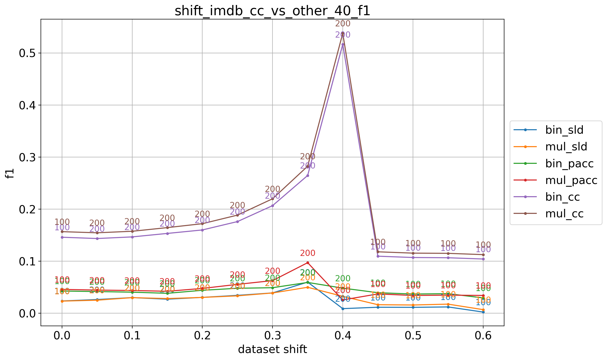

# imdb_9prevs

## 10% positives
> train: [0.89991359 0.10008641]  
> validation: [0.9000576 0.0999424]  
> bin_sld: 249.048s  
> mul_sld: 71.459s  
> mul_sld_gs: 455.993s  
> bin_pacc: 244.563s  
> mul_pacc: 43.016s  
> binmc_pacc: 240.469s  
> mulmc_pacc: 41.750s  
> binne_pacc: 236.217s  
> mulne_pacc: 34.041s  
> bin_cc: 241.914s  
> mul_cc: 40.328s  
> kfcv: 24.723s  
> ref: 18.562s  
> atc_mc: 27.491s  
> atc_ne: 25.568s  
> doc_feat: 11.526s  
> tot: 456.775s  

<table border="1" class="dataframe">
  <thead>
    <tr style="text-align: right;">
      <th></th>
      <th>bin_sld</th>
      <th>mul_sld</th>
      <th>bin_pacc</th>
      <th>mul_pacc</th>
      <th>bin_cc</th>
      <th>mul_cc</th>
    </tr>
  </thead>
  <tbody>
    <tr>
      <th>0.0</th>
      <td>0.0555</td>
      <td>0.0259</td>
      <td>0.0194</td>
      <td>0.2076</td>
      <td>0.0134</td>
      <td>0.0000</td>
    </tr>
    <tr>
      <th>0.05</th>
      <td>0.0109</td>
      <td>0.0225</td>
      <td>0.0113</td>
      <td>0.0499</td>
      <td>0.0162</td>
      <td>0.0240</td>
    </tr>
    <tr>
      <th>0.1</th>
      <td>0.0067</td>
      <td>0.0138</td>
      <td>0.0089</td>
      <td>0.0305</td>
      <td>0.0226</td>
      <td>0.0244</td>
    </tr>
    <tr>
      <th>0.15</th>
      <td>0.0062</td>
      <td>0.0108</td>
      <td>0.0095</td>
      <td>0.0247</td>
      <td>0.0263</td>
      <td>0.0228</td>
    </tr>
    <tr>
      <th>0.2</th>
      <td>0.0037</td>
      <td>0.0114</td>
      <td>0.0092</td>
      <td>0.0240</td>
      <td>0.0281</td>
      <td>0.0245</td>
    </tr>
    <tr>
      <th>0.25</th>
      <td>0.0030</td>
      <td>0.0143</td>
      <td>0.0061</td>
      <td>0.0202</td>
      <td>0.0298</td>
      <td>0.0246</td>
    </tr>
    <tr>
      <th>0.3</th>
      <td>0.0023</td>
      <td>0.0192</td>
      <td>0.0071</td>
      <td>0.0217</td>
      <td>0.0314</td>
      <td>0.0266</td>
    </tr>
    <tr>
      <th>0.35</th>
      <td>0.0029</td>
      <td>0.0214</td>
      <td>0.0062</td>
      <td>0.0202</td>
      <td>0.0315</td>
      <td>0.0248</td>
    </tr>
    <tr>
      <th>0.4</th>
      <td>0.0024</td>
      <td>0.0217</td>
      <td>0.0049</td>
      <td>0.0174</td>
      <td>0.0298</td>
      <td>0.0230</td>
    </tr>
    <tr>
      <th>0.45</th>
      <td>0.0033</td>
      <td>0.0250</td>
      <td>0.0065</td>
      <td>0.0181</td>
      <td>0.0329</td>
      <td>0.0257</td>
    </tr>
    <tr>
      <th>0.5</th>
      <td>0.0035</td>
      <td>0.0259</td>
      <td>0.0072</td>
      <td>0.0218</td>
      <td>0.0340</td>
      <td>0.0264</td>
    </tr>
    <tr>
      <th>0.55</th>
      <td>0.0028</td>
      <td>0.0238</td>
      <td>0.0064</td>
      <td>0.0180</td>
      <td>0.0316</td>
      <td>0.0239</td>
    </tr>
    <tr>
      <th>0.6</th>
      <td>0.0034</td>
      <td>0.0247</td>
      <td>0.0058</td>
      <td>0.0192</td>
      <td>0.0326</td>
      <td>0.0248</td>
    </tr>
    <tr>
      <th>0.65</th>
      <td>0.0036</td>
      <td>0.0246</td>
      <td>0.0072</td>
      <td>0.0174</td>
      <td>0.0329</td>
      <td>0.0247</td>
    </tr>
    <tr>
      <th>0.7</th>
      <td>0.0033</td>
      <td>0.0239</td>
      <td>0.0060</td>
      <td>0.0180</td>
      <td>0.0319</td>
      <td>0.0239</td>
    </tr>
    <tr>
      <th>0.75</th>
      <td>0.0031</td>
      <td>0.0255</td>
      <td>0.0050</td>
      <td>0.0175</td>
      <td>0.0339</td>
      <td>0.0255</td>
    </tr>
    <tr>
      <th>0.8</th>
      <td>0.0031</td>
      <td>0.0242</td>
      <td>0.0057</td>
      <td>0.0173</td>
      <td>0.0323</td>
      <td>0.0242</td>
    </tr>
    <tr>
      <th>0.85</th>
      <td>0.0030</td>
      <td>0.0239</td>
      <td>0.0056</td>
      <td>0.0172</td>
      <td>0.0321</td>
      <td>0.0240</td>
    </tr>
    <tr>
      <th>0.9</th>
      <td>0.0029</td>
      <td>0.0255</td>
      <td>0.0062</td>
      <td>0.0186</td>
      <td>0.0342</td>
      <td>0.0256</td>
    </tr>
    <tr>
      <th>0.95</th>
      <td>0.0015</td>
      <td>0.0223</td>
      <td>0.0046</td>
      <td>0.0187</td>
      <td>0.0332</td>
      <td>0.0246</td>
    </tr>
    <tr>
      <th>1.0</th>
      <td>0.0001</td>
      <td>0.0208</td>
      <td>0.0046</td>
      <td>0.0180</td>
      <td>0.0327</td>
      <td>0.0246</td>
    </tr>
    <tr>
      <th>avg</th>
      <td>0.0061</td>
      <td>0.0215</td>
      <td>0.0073</td>
      <td>0.0303</td>
      <td>0.0297</td>
      <td>0.0234</td>
    </tr>
  </tbody>
</table>

## 20% positives
> train: [0.7999712 0.2000288]  
> validation: [0.7999712 0.2000288]  
> bin_sld: 312.036s  
> mul_sld: 63.355s  
> bin_sld_gs: 1039.328s  
> mul_sld_gs: 562.297s  
> bin_sld_gsq: 402.075s  
> bin_pacc: 297.187s  
> mul_pacc: 36.589s  
> binmc_pacc: 296.718s  
> mulmc_pacc: 36.777s  
> binne_pacc: 285.556s  
> mulne_pacc: 47.832s  
> bin_pacc_gs: 636.796s  
> mul_pacc_gs: 141.445s  
> bin_cc: 293.873s  
> mul_cc: 46.722s  
> kfcv: 30.476s  
> ref: 26.348s  
> atc_mc: 22.299s  
> atc_ne: 41.782s  
> doc_feat: 11.276s  
> tot: 1040.077s  

<table border="1" class="dataframe">
  <thead>
    <tr style="text-align: right;">
      <th></th>
      <th>bin_sld</th>
      <th>mul_sld</th>
      <th>bin_pacc</th>
      <th>mul_pacc</th>
      <th>bin_cc</th>
      <th>mul_cc</th>
    </tr>
  </thead>
  <tbody>
    <tr>
      <th>0.0</th>
      <td>0.1705</td>
      <td>0.3756</td>
      <td>0.3041</td>
      <td>0.5277</td>
      <td>0.2207</td>
      <td>0.2159</td>
    </tr>
    <tr>
      <th>0.05</th>
      <td>0.2206</td>
      <td>0.1554</td>
      <td>0.1646</td>
      <td>0.1447</td>
      <td>0.0471</td>
      <td>0.0498</td>
    </tr>
    <tr>
      <th>0.1</th>
      <td>0.1383</td>
      <td>0.1079</td>
      <td>0.0968</td>
      <td>0.0978</td>
      <td>0.0816</td>
      <td>0.0585</td>
    </tr>
    <tr>
      <th>0.15</th>
      <td>0.0971</td>
      <td>0.1115</td>
      <td>0.0725</td>
      <td>0.0792</td>
      <td>0.1063</td>
      <td>0.0846</td>
    </tr>
    <tr>
      <th>0.2</th>
      <td>0.0581</td>
      <td>0.0995</td>
      <td>0.0513</td>
      <td>0.0705</td>
      <td>0.1220</td>
      <td>0.0921</td>
    </tr>
    <tr>
      <th>0.25</th>
      <td>0.0336</td>
      <td>0.0906</td>
      <td>0.0373</td>
      <td>0.0634</td>
      <td>0.1308</td>
      <td>0.1044</td>
    </tr>
    <tr>
      <th>0.3</th>
      <td>0.0298</td>
      <td>0.0919</td>
      <td>0.0274</td>
      <td>0.0634</td>
      <td>0.1383</td>
      <td>0.1085</td>
    </tr>
    <tr>
      <th>0.35</th>
      <td>0.0205</td>
      <td>0.1001</td>
      <td>0.0280</td>
      <td>0.0672</td>
      <td>0.1451</td>
      <td>0.1158</td>
    </tr>
    <tr>
      <th>0.4</th>
      <td>0.0178</td>
      <td>0.1043</td>
      <td>0.0272</td>
      <td>0.0673</td>
      <td>0.1496</td>
      <td>0.1178</td>
    </tr>
    <tr>
      <th>0.45</th>
      <td>0.0208</td>
      <td>0.0928</td>
      <td>0.0235</td>
      <td>0.0588</td>
      <td>0.1525</td>
      <td>0.1220</td>
    </tr>
    <tr>
      <th>0.5</th>
      <td>0.0133</td>
      <td>0.0907</td>
      <td>0.0171</td>
      <td>0.0559</td>
      <td>0.1543</td>
      <td>0.1239</td>
    </tr>
    <tr>
      <th>0.55</th>
      <td>0.0134</td>
      <td>0.0953</td>
      <td>0.0170</td>
      <td>0.0598</td>
      <td>0.1573</td>
      <td>0.1268</td>
    </tr>
    <tr>
      <th>0.6</th>
      <td>0.0170</td>
      <td>0.0957</td>
      <td>0.0165</td>
      <td>0.0575</td>
      <td>0.1575</td>
      <td>0.1263</td>
    </tr>
    <tr>
      <th>0.65</th>
      <td>0.0150</td>
      <td>0.0953</td>
      <td>0.0121</td>
      <td>0.0554</td>
      <td>0.1592</td>
      <td>0.1288</td>
    </tr>
    <tr>
      <th>0.7</th>
      <td>0.0227</td>
      <td>0.0971</td>
      <td>0.0137</td>
      <td>0.0586</td>
      <td>0.1630</td>
      <td>0.1297</td>
    </tr>
    <tr>
      <th>0.75</th>
      <td>0.0181</td>
      <td>0.0909</td>
      <td>0.0106</td>
      <td>0.0493</td>
      <td>0.1639</td>
      <td>0.1315</td>
    </tr>
    <tr>
      <th>0.8</th>
      <td>0.0222</td>
      <td>0.0969</td>
      <td>0.0106</td>
      <td>0.0562</td>
      <td>0.1639</td>
      <td>0.1308</td>
    </tr>
    <tr>
      <th>0.85</th>
      <td>0.0215</td>
      <td>0.0968</td>
      <td>0.0094</td>
      <td>0.0560</td>
      <td>0.1649</td>
      <td>0.1314</td>
    </tr>
    <tr>
      <th>0.9</th>
      <td>0.0218</td>
      <td>0.0976</td>
      <td>0.0100</td>
      <td>0.0575</td>
      <td>0.1641</td>
      <td>0.1316</td>
    </tr>
    <tr>
      <th>0.95</th>
      <td>0.0193</td>
      <td>0.0958</td>
      <td>0.0079</td>
      <td>0.0551</td>
      <td>0.1671</td>
      <td>0.1353</td>
    </tr>
    <tr>
      <th>1.0</th>
      <td>0.0027</td>
      <td>0.1049</td>
      <td>0.0073</td>
      <td>0.0561</td>
      <td>0.1665</td>
      <td>0.1327</td>
    </tr>
    <tr>
      <th>avg</th>
      <td>0.0473</td>
      <td>0.1136</td>
      <td>0.0459</td>
      <td>0.0885</td>
      <td>0.1465</td>
      <td>0.1190</td>
    </tr>
  </tbody>
</table>

## 30% positives
> train: [0.7000288 0.2999712]  
> validation: [0.7000288 0.2999712]  
> bin_sld: 302.903s  
> mul_sld: 59.883s  
> bin_sld_gs: 1013.188s  
> mul_sld_gs: 556.087s  
> bin_sld_gsq: 413.115s  
> bin_pacc: 294.712s  
> mul_pacc: 45.954s  
> binmc_pacc: 300.950s  
> mulmc_pacc: 45.939s  
> binne_pacc: 289.350s  
> mulne_pacc: 38.137s  
> bin_pacc_gs: 643.072s  
> mul_pacc_gs: 149.582s  
> bin_cc: 298.684s  
> mul_cc: 43.908s  
> kfcv: 37.403s  
> ref: 28.756s  
> atc_mc: 39.420s  
> atc_ne: 24.347s  
> doc_feat: 22.815s  
> tot: 1014.314s  

<table border="1" class="dataframe">
  <thead>
    <tr style="text-align: right;">
      <th></th>
      <th>bin_sld</th>
      <th>mul_sld</th>
      <th>bin_pacc</th>
      <th>mul_pacc</th>
      <th>bin_cc</th>
      <th>mul_cc</th>
    </tr>
  </thead>
  <tbody>
    <tr>
      <th>0.0</th>
      <td>0.0199</td>
      <td>0.1538</td>
      <td>0.1919</td>
      <td>0.5442</td>
      <td>0.5751</td>
      <td>0.6815</td>
    </tr>
    <tr>
      <th>0.05</th>
      <td>0.1334</td>
      <td>0.1346</td>
      <td>0.0921</td>
      <td>0.1161</td>
      <td>0.1355</td>
      <td>0.1999</td>
    </tr>
    <tr>
      <th>0.1</th>
      <td>0.1017</td>
      <td>0.1009</td>
      <td>0.0642</td>
      <td>0.0682</td>
      <td>0.1198</td>
      <td>0.1679</td>
    </tr>
    <tr>
      <th>0.15</th>
      <td>0.0725</td>
      <td>0.0709</td>
      <td>0.0519</td>
      <td>0.0455</td>
      <td>0.1190</td>
      <td>0.1565</td>
    </tr>
    <tr>
      <th>0.2</th>
      <td>0.0540</td>
      <td>0.0505</td>
      <td>0.0436</td>
      <td>0.0373</td>
      <td>0.1153</td>
      <td>0.1502</td>
    </tr>
    <tr>
      <th>0.25</th>
      <td>0.0482</td>
      <td>0.0407</td>
      <td>0.0459</td>
      <td>0.0330</td>
      <td>0.1187</td>
      <td>0.1476</td>
    </tr>
    <tr>
      <th>0.3</th>
      <td>0.0381</td>
      <td>0.0344</td>
      <td>0.0357</td>
      <td>0.0283</td>
      <td>0.1194</td>
      <td>0.1461</td>
    </tr>
    <tr>
      <th>0.35</th>
      <td>0.0316</td>
      <td>0.0271</td>
      <td>0.0467</td>
      <td>0.0287</td>
      <td>0.1232</td>
      <td>0.1481</td>
    </tr>
    <tr>
      <th>0.4</th>
      <td>0.0235</td>
      <td>0.0233</td>
      <td>0.0430</td>
      <td>0.0253</td>
      <td>0.1264</td>
      <td>0.1492</td>
    </tr>
    <tr>
      <th>0.45</th>
      <td>0.0197</td>
      <td>0.0219</td>
      <td>0.0389</td>
      <td>0.0234</td>
      <td>0.1262</td>
      <td>0.1474</td>
    </tr>
    <tr>
      <th>0.5</th>
      <td>0.0177</td>
      <td>0.0237</td>
      <td>0.0388</td>
      <td>0.0250</td>
      <td>0.1272</td>
      <td>0.1474</td>
    </tr>
    <tr>
      <th>0.55</th>
      <td>0.0158</td>
      <td>0.0225</td>
      <td>0.0396</td>
      <td>0.0216</td>
      <td>0.1293</td>
      <td>0.1480</td>
    </tr>
    <tr>
      <th>0.6</th>
      <td>0.0117</td>
      <td>0.0243</td>
      <td>0.0379</td>
      <td>0.0203</td>
      <td>0.1274</td>
      <td>0.1444</td>
    </tr>
    <tr>
      <th>0.65</th>
      <td>0.0123</td>
      <td>0.0249</td>
      <td>0.0381</td>
      <td>0.0218</td>
      <td>0.1284</td>
      <td>0.1454</td>
    </tr>
    <tr>
      <th>0.7</th>
      <td>0.0172</td>
      <td>0.0314</td>
      <td>0.0419</td>
      <td>0.0246</td>
      <td>0.1301</td>
      <td>0.1460</td>
    </tr>
    <tr>
      <th>0.75</th>
      <td>0.0144</td>
      <td>0.0311</td>
      <td>0.0377</td>
      <td>0.0204</td>
      <td>0.1307</td>
      <td>0.1463</td>
    </tr>
    <tr>
      <th>0.8</th>
      <td>0.0153</td>
      <td>0.0318</td>
      <td>0.0388</td>
      <td>0.0219</td>
      <td>0.1291</td>
      <td>0.1453</td>
    </tr>
    <tr>
      <th>0.85</th>
      <td>0.0166</td>
      <td>0.0353</td>
      <td>0.0401</td>
      <td>0.0211</td>
      <td>0.1302</td>
      <td>0.1453</td>
    </tr>
    <tr>
      <th>0.9</th>
      <td>0.0173</td>
      <td>0.0352</td>
      <td>0.0396</td>
      <td>0.0217</td>
      <td>0.1302</td>
      <td>0.1441</td>
    </tr>
    <tr>
      <th>0.95</th>
      <td>0.0172</td>
      <td>0.0348</td>
      <td>0.0375</td>
      <td>0.0186</td>
      <td>0.1317</td>
      <td>0.1464</td>
    </tr>
    <tr>
      <th>1.0</th>
      <td>0.0025</td>
      <td>0.0182</td>
      <td>0.0345</td>
      <td>0.0194</td>
      <td>0.1312</td>
      <td>0.1445</td>
    </tr>
    <tr>
      <th>avg</th>
      <td>0.0334</td>
      <td>0.0462</td>
      <td>0.0514</td>
      <td>0.0565</td>
      <td>0.1478</td>
      <td>0.1761</td>
    </tr>
  </tbody>
</table>

## 40% positives
> train: [0.5999424 0.4000576]  
> validation: [0.60008641 0.39991359]  
> bin_sld: 298.351s  
> mul_sld: 51.270s  
> bin_sld_gs: 1033.280s  
> mul_sld_gs: 546.452s  
> bin_sld_gsq: 421.394s  
> bin_pacc: 298.508s  
> mul_pacc: 34.186s  
> binmc_pacc: 289.145s  
> mulmc_pacc: 42.455s  
> binne_pacc: 296.554s  
> mulne_pacc: 45.269s  
> bin_pacc_gs: 645.096s  
> mul_pacc_gs: 145.337s  
> bin_cc: 300.133s  
> mul_cc: 42.690s  
> kfcv: 36.406s  
> ref: 22.353s  
> atc_mc: 38.798s  
> atc_ne: 34.811s  
> doc_feat: 13.850s  
> tot: 1034.124s  

<table border="1" class="dataframe">
  <thead>
    <tr style="text-align: right;">
      <th></th>
      <th>bin_sld</th>
      <th>mul_sld</th>
      <th>bin_pacc</th>
      <th>mul_pacc</th>
      <th>bin_cc</th>
      <th>mul_cc</th>
    </tr>
  </thead>
  <tbody>
    <tr>
      <th>0.0</th>
      <td>0.0071</td>
      <td>0.0516</td>
      <td>0.0586</td>
      <td>0.0153</td>
      <td>0.9221</td>
      <td>0.9554</td>
    </tr>
    <tr>
      <th>0.05</th>
      <td>0.1082</td>
      <td>0.0865</td>
      <td>0.0793</td>
      <td>0.1568</td>
      <td>0.4160</td>
      <td>0.4420</td>
    </tr>
    <tr>
      <th>0.1</th>
      <td>0.0651</td>
      <td>0.0651</td>
      <td>0.0586</td>
      <td>0.0883</td>
      <td>0.2956</td>
      <td>0.3130</td>
    </tr>
    <tr>
      <th>0.15</th>
      <td>0.0558</td>
      <td>0.0545</td>
      <td>0.0570</td>
      <td>0.0723</td>
      <td>0.2339</td>
      <td>0.2498</td>
    </tr>
    <tr>
      <th>0.2</th>
      <td>0.0451</td>
      <td>0.0465</td>
      <td>0.0482</td>
      <td>0.0566</td>
      <td>0.1983</td>
      <td>0.2126</td>
    </tr>
    <tr>
      <th>0.25</th>
      <td>0.0353</td>
      <td>0.0394</td>
      <td>0.0394</td>
      <td>0.0466</td>
      <td>0.1782</td>
      <td>0.1910</td>
    </tr>
    <tr>
      <th>0.3</th>
      <td>0.0367</td>
      <td>0.0400</td>
      <td>0.0391</td>
      <td>0.0447</td>
      <td>0.1632</td>
      <td>0.1748</td>
    </tr>
    <tr>
      <th>0.35</th>
      <td>0.0286</td>
      <td>0.0280</td>
      <td>0.0441</td>
      <td>0.0478</td>
      <td>0.1513</td>
      <td>0.1625</td>
    </tr>
    <tr>
      <th>0.4</th>
      <td>0.0237</td>
      <td>0.0234</td>
      <td>0.0428</td>
      <td>0.0459</td>
      <td>0.1461</td>
      <td>0.1568</td>
    </tr>
    <tr>
      <th>0.45</th>
      <td>0.0243</td>
      <td>0.0224</td>
      <td>0.0395</td>
      <td>0.0414</td>
      <td>0.1360</td>
      <td>0.1468</td>
    </tr>
    <tr>
      <th>0.5</th>
      <td>0.0237</td>
      <td>0.0202</td>
      <td>0.0421</td>
      <td>0.0429</td>
      <td>0.1303</td>
      <td>0.1404</td>
    </tr>
    <tr>
      <th>0.55</th>
      <td>0.0190</td>
      <td>0.0172</td>
      <td>0.0375</td>
      <td>0.0380</td>
      <td>0.1287</td>
      <td>0.1382</td>
    </tr>
    <tr>
      <th>0.6</th>
      <td>0.0161</td>
      <td>0.0146</td>
      <td>0.0403</td>
      <td>0.0390</td>
      <td>0.1220</td>
      <td>0.1317</td>
    </tr>
    <tr>
      <th>0.65</th>
      <td>0.0132</td>
      <td>0.0126</td>
      <td>0.0392</td>
      <td>0.0389</td>
      <td>0.1185</td>
      <td>0.1274</td>
    </tr>
    <tr>
      <th>0.7</th>
      <td>0.0132</td>
      <td>0.0131</td>
      <td>0.0398</td>
      <td>0.0374</td>
      <td>0.1180</td>
      <td>0.1269</td>
    </tr>
    <tr>
      <th>0.75</th>
      <td>0.0117</td>
      <td>0.0135</td>
      <td>0.0393</td>
      <td>0.0377</td>
      <td>0.1135</td>
      <td>0.1230</td>
    </tr>
    <tr>
      <th>0.8</th>
      <td>0.0109</td>
      <td>0.0136</td>
      <td>0.0381</td>
      <td>0.0361</td>
      <td>0.1111</td>
      <td>0.1205</td>
    </tr>
    <tr>
      <th>0.85</th>
      <td>0.0117</td>
      <td>0.0165</td>
      <td>0.0396</td>
      <td>0.0372</td>
      <td>0.1097</td>
      <td>0.1181</td>
    </tr>
    <tr>
      <th>0.9</th>
      <td>0.0115</td>
      <td>0.0160</td>
      <td>0.0370</td>
      <td>0.0343</td>
      <td>0.1072</td>
      <td>0.1156</td>
    </tr>
    <tr>
      <th>0.95</th>
      <td>0.0123</td>
      <td>0.0176</td>
      <td>0.0377</td>
      <td>0.0349</td>
      <td>0.1067</td>
      <td>0.1152</td>
    </tr>
    <tr>
      <th>1.0</th>
      <td>0.0024</td>
      <td>0.0071</td>
      <td>0.0296</td>
      <td>0.0343</td>
      <td>0.1043</td>
      <td>0.1127</td>
    </tr>
    <tr>
      <th>avg</th>
      <td>0.0274</td>
      <td>0.0295</td>
      <td>0.0441</td>
      <td>0.0489</td>
      <td>0.1957</td>
      <td>0.2083</td>
    </tr>
  </tbody>
</table>

## 50% positives
> train: [0.5 0.5]  
> validation: [0.5 0.5]  
> bin_sld: 303.489s  
> mul_sld: 50.183s  
> bin_sld_gs: 1015.361s  
> mul_sld_gs: 552.539s  
> bin_sld_gsq: 418.096s  
> bin_pacc: 296.283s  
> mul_pacc: 32.547s  
> binmc_pacc: 299.487s  
> mulmc_pacc: 40.506s  
> binne_pacc: 293.984s  
> mulne_pacc: 39.974s  
> bin_pacc_gs: 643.158s  
> mul_pacc_gs: 146.732s  
> bin_cc: 292.672s  
> mul_cc: 37.348s  
> kfcv: 29.093s  
> ref: 16.306s  
> atc_mc: 25.874s  
> atc_ne: 28.890s  
> doc_feat: 11.601s  
> tot: 1016.064s  

<table border="1" class="dataframe">
  <thead>
    <tr style="text-align: right;">
      <th></th>
      <th>bin_sld</th>
      <th>mul_sld</th>
      <th>bin_pacc</th>
      <th>mul_pacc</th>
      <th>bin_cc</th>
      <th>mul_cc</th>
    </tr>
  </thead>
  <tbody>
    <tr>
      <th>0.0</th>
      <td>0.0041</td>
      <td>0.0125</td>
      <td>0.0727</td>
      <td>0.0999</td>
      <td>0.9337</td>
      <td>0.9449</td>
    </tr>
    <tr>
      <th>0.05</th>
      <td>0.0882</td>
      <td>0.0677</td>
      <td>0.0546</td>
      <td>0.0591</td>
      <td>0.5598</td>
      <td>0.5671</td>
    </tr>
    <tr>
      <th>0.1</th>
      <td>0.0510</td>
      <td>0.0458</td>
      <td>0.0370</td>
      <td>0.0421</td>
      <td>0.3957</td>
      <td>0.4030</td>
    </tr>
    <tr>
      <th>0.15</th>
      <td>0.0382</td>
      <td>0.0377</td>
      <td>0.0356</td>
      <td>0.0352</td>
      <td>0.3037</td>
      <td>0.3095</td>
    </tr>
    <tr>
      <th>0.2</th>
      <td>0.0273</td>
      <td>0.0326</td>
      <td>0.0294</td>
      <td>0.0293</td>
      <td>0.2480</td>
      <td>0.2531</td>
    </tr>
    <tr>
      <th>0.25</th>
      <td>0.0250</td>
      <td>0.0272</td>
      <td>0.0237</td>
      <td>0.0241</td>
      <td>0.2082</td>
      <td>0.2135</td>
    </tr>
    <tr>
      <th>0.3</th>
      <td>0.0259</td>
      <td>0.0302</td>
      <td>0.0223</td>
      <td>0.0237</td>
      <td>0.1783</td>
      <td>0.1820</td>
    </tr>
    <tr>
      <th>0.35</th>
      <td>0.0220</td>
      <td>0.0248</td>
      <td>0.0221</td>
      <td>0.0194</td>
      <td>0.1560</td>
      <td>0.1606</td>
    </tr>
    <tr>
      <th>0.4</th>
      <td>0.0192</td>
      <td>0.0225</td>
      <td>0.0185</td>
      <td>0.0191</td>
      <td>0.1407</td>
      <td>0.1445</td>
    </tr>
    <tr>
      <th>0.45</th>
      <td>0.0197</td>
      <td>0.0245</td>
      <td>0.0163</td>
      <td>0.0169</td>
      <td>0.1256</td>
      <td>0.1285</td>
    </tr>
    <tr>
      <th>0.5</th>
      <td>0.0183</td>
      <td>0.0193</td>
      <td>0.0179</td>
      <td>0.0194</td>
      <td>0.1138</td>
      <td>0.1158</td>
    </tr>
    <tr>
      <th>0.55</th>
      <td>0.0174</td>
      <td>0.0203</td>
      <td>0.0160</td>
      <td>0.0188</td>
      <td>0.1048</td>
      <td>0.1073</td>
    </tr>
    <tr>
      <th>0.6</th>
      <td>0.0170</td>
      <td>0.0191</td>
      <td>0.0151</td>
      <td>0.0184</td>
      <td>0.0967</td>
      <td>0.0991</td>
    </tr>
    <tr>
      <th>0.65</th>
      <td>0.0159</td>
      <td>0.0172</td>
      <td>0.0135</td>
      <td>0.0157</td>
      <td>0.0882</td>
      <td>0.0905</td>
    </tr>
    <tr>
      <th>0.7</th>
      <td>0.0129</td>
      <td>0.0124</td>
      <td>0.0119</td>
      <td>0.0169</td>
      <td>0.0835</td>
      <td>0.0854</td>
    </tr>
    <tr>
      <th>0.75</th>
      <td>0.0133</td>
      <td>0.0117</td>
      <td>0.0124</td>
      <td>0.0182</td>
      <td>0.0765</td>
      <td>0.0784</td>
    </tr>
    <tr>
      <th>0.8</th>
      <td>0.0116</td>
      <td>0.0100</td>
      <td>0.0114</td>
      <td>0.0172</td>
      <td>0.0721</td>
      <td>0.0737</td>
    </tr>
    <tr>
      <th>0.85</th>
      <td>0.0105</td>
      <td>0.0081</td>
      <td>0.0104</td>
      <td>0.0175</td>
      <td>0.0682</td>
      <td>0.0700</td>
    </tr>
    <tr>
      <th>0.9</th>
      <td>0.0081</td>
      <td>0.0060</td>
      <td>0.0091</td>
      <td>0.0158</td>
      <td>0.0636</td>
      <td>0.0648</td>
    </tr>
    <tr>
      <th>0.95</th>
      <td>0.0094</td>
      <td>0.0080</td>
      <td>0.0081</td>
      <td>0.0185</td>
      <td>0.0603</td>
      <td>0.0621</td>
    </tr>
    <tr>
      <th>1.0</th>
      <td>0.0036</td>
      <td>0.0043</td>
      <td>0.0064</td>
      <td>0.0168</td>
      <td>0.0574</td>
      <td>0.0585</td>
    </tr>
    <tr>
      <th>avg</th>
      <td>0.0218</td>
      <td>0.0220</td>
      <td>0.0221</td>
      <td>0.0268</td>
      <td>0.1969</td>
      <td>0.2006</td>
    </tr>
  </tbody>
</table>

## 60% positives
> train: [0.39991359 0.60008641]  
> validation: [0.4000576 0.5999424]  
> bin_sld: 296.102s  
> mul_sld: 56.083s  
> bin_sld_gs: 1060.976s  
> mul_sld_gs: 551.619s  
> bin_sld_gsq: 425.664s  
> bin_pacc: 293.321s  
> mul_pacc: 44.690s  
> binmc_pacc: 296.400s  
> mulmc_pacc: 38.640s  
> binne_pacc: 288.195s  
> mulne_pacc: 44.768s  
> bin_pacc_gs: 645.660s  
> mul_pacc_gs: 146.232s  
> bin_cc: 299.198s  
> mul_cc: 41.642s  
> kfcv: 21.885s  
> ref: 26.261s  
> atc_mc: 37.391s  
> atc_ne: 35.750s  
> doc_feat: 19.963s  
> tot: 1061.773s  

<table border="1" class="dataframe">
  <thead>
    <tr style="text-align: right;">
      <th></th>
      <th>bin_sld</th>
      <th>mul_sld</th>
      <th>bin_pacc</th>
      <th>mul_pacc</th>
      <th>bin_cc</th>
      <th>mul_cc</th>
    </tr>
  </thead>
  <tbody>
    <tr>
      <th>0.0</th>
      <td>0.0004</td>
      <td>0.0002</td>
      <td>0.0129</td>
      <td>0.0047</td>
      <td>0.7988</td>
      <td>0.8471</td>
    </tr>
    <tr>
      <th>0.05</th>
      <td>0.1371</td>
      <td>0.1108</td>
      <td>0.0626</td>
      <td>0.1122</td>
      <td>0.5483</td>
      <td>0.5897</td>
    </tr>
    <tr>
      <th>0.1</th>
      <td>0.1027</td>
      <td>0.0815</td>
      <td>0.0488</td>
      <td>0.0845</td>
      <td>0.4075</td>
      <td>0.4428</td>
    </tr>
    <tr>
      <th>0.15</th>
      <td>0.0826</td>
      <td>0.0628</td>
      <td>0.0454</td>
      <td>0.0760</td>
      <td>0.3101</td>
      <td>0.3408</td>
    </tr>
    <tr>
      <th>0.2</th>
      <td>0.0571</td>
      <td>0.0464</td>
      <td>0.0374</td>
      <td>0.0646</td>
      <td>0.2507</td>
      <td>0.2790</td>
    </tr>
    <tr>
      <th>0.25</th>
      <td>0.0429</td>
      <td>0.0326</td>
      <td>0.0320</td>
      <td>0.0543</td>
      <td>0.2052</td>
      <td>0.2291</td>
    </tr>
    <tr>
      <th>0.3</th>
      <td>0.0315</td>
      <td>0.0276</td>
      <td>0.0275</td>
      <td>0.0490</td>
      <td>0.1695</td>
      <td>0.1915</td>
    </tr>
    <tr>
      <th>0.35</th>
      <td>0.0309</td>
      <td>0.0261</td>
      <td>0.0292</td>
      <td>0.0504</td>
      <td>0.1405</td>
      <td>0.1617</td>
    </tr>
    <tr>
      <th>0.4</th>
      <td>0.0235</td>
      <td>0.0205</td>
      <td>0.0257</td>
      <td>0.0469</td>
      <td>0.1211</td>
      <td>0.1396</td>
    </tr>
    <tr>
      <th>0.45</th>
      <td>0.0180</td>
      <td>0.0172</td>
      <td>0.0230</td>
      <td>0.0398</td>
      <td>0.1008</td>
      <td>0.1179</td>
    </tr>
    <tr>
      <th>0.5</th>
      <td>0.0189</td>
      <td>0.0175</td>
      <td>0.0246</td>
      <td>0.0403</td>
      <td>0.0854</td>
      <td>0.1014</td>
    </tr>
    <tr>
      <th>0.55</th>
      <td>0.0150</td>
      <td>0.0150</td>
      <td>0.0204</td>
      <td>0.0366</td>
      <td>0.0719</td>
      <td>0.0877</td>
    </tr>
    <tr>
      <th>0.6</th>
      <td>0.0152</td>
      <td>0.0151</td>
      <td>0.0206</td>
      <td>0.0362</td>
      <td>0.0624</td>
      <td>0.0762</td>
    </tr>
    <tr>
      <th>0.65</th>
      <td>0.0144</td>
      <td>0.0148</td>
      <td>0.0172</td>
      <td>0.0311</td>
      <td>0.0521</td>
      <td>0.0651</td>
    </tr>
    <tr>
      <th>0.7</th>
      <td>0.0140</td>
      <td>0.0111</td>
      <td>0.0189</td>
      <td>0.0345</td>
      <td>0.0429</td>
      <td>0.0551</td>
    </tr>
    <tr>
      <th>0.75</th>
      <td>0.0139</td>
      <td>0.0104</td>
      <td>0.0169</td>
      <td>0.0317</td>
      <td>0.0357</td>
      <td>0.0471</td>
    </tr>
    <tr>
      <th>0.8</th>
      <td>0.0129</td>
      <td>0.0113</td>
      <td>0.0143</td>
      <td>0.0282</td>
      <td>0.0284</td>
      <td>0.0398</td>
    </tr>
    <tr>
      <th>0.85</th>
      <td>0.0124</td>
      <td>0.0083</td>
      <td>0.0136</td>
      <td>0.0277</td>
      <td>0.0251</td>
      <td>0.0346</td>
    </tr>
    <tr>
      <th>0.9</th>
      <td>0.0112</td>
      <td>0.0065</td>
      <td>0.0126</td>
      <td>0.0254</td>
      <td>0.0176</td>
      <td>0.0273</td>
    </tr>
    <tr>
      <th>0.95</th>
      <td>0.0130</td>
      <td>0.0063</td>
      <td>0.0137</td>
      <td>0.0269</td>
      <td>0.0130</td>
      <td>0.0217</td>
    </tr>
    <tr>
      <th>1.0</th>
      <td>0.0060</td>
      <td>0.0040</td>
      <td>0.0115</td>
      <td>0.0251</td>
      <td>0.0089</td>
      <td>0.0175</td>
    </tr>
    <tr>
      <th>avg</th>
      <td>0.0321</td>
      <td>0.0260</td>
      <td>0.0252</td>
      <td>0.0441</td>
      <td>0.1665</td>
      <td>0.1863</td>
    </tr>
  </tbody>
</table>

## 70% positives
> train: [0.2999712 0.7000288]  
> validation: [0.2999712 0.7000288]  
> bin_sld: 303.930s  
> mul_sld: 40.110s  
> bin_sld_gs: 1015.962s  
> mul_sld_gs: 557.286s  
> bin_sld_gsq: 414.452s  
> bin_pacc: 292.176s  
> mul_pacc: 47.800s  
> binmc_pacc: 302.570s  
> mulmc_pacc: 44.408s  
> binne_pacc: 293.019s  
> mulne_pacc: 43.783s  
> bin_pacc_gs: 648.943s  
> mul_pacc_gs: 150.210s  
> bin_cc: 288.613s  
> mul_cc: 38.672s  
> kfcv: 32.153s  
> ref: 34.374s  
> atc_mc: 38.938s  
> atc_ne: 40.313s  
> doc_feat: 20.243s  
> tot: 1016.774s  

<table border="1" class="dataframe">
  <thead>
    <tr style="text-align: right;">
      <th></th>
      <th>bin_sld</th>
      <th>mul_sld</th>
      <th>bin_pacc</th>
      <th>mul_pacc</th>
      <th>bin_cc</th>
      <th>mul_cc</th>
    </tr>
  </thead>
  <tbody>
    <tr>
      <th>0.0</th>
      <td>0.0003</td>
      <td>0.0000</td>
      <td>0.0208</td>
      <td>0.0112</td>
      <td>0.6847</td>
      <td>0.7141</td>
    </tr>
    <tr>
      <th>0.05</th>
      <td>0.1263</td>
      <td>0.1132</td>
      <td>0.0385</td>
      <td>0.0461</td>
      <td>0.5279</td>
      <td>0.5515</td>
    </tr>
    <tr>
      <th>0.1</th>
      <td>0.1016</td>
      <td>0.0917</td>
      <td>0.0319</td>
      <td>0.0378</td>
      <td>0.4199</td>
      <td>0.4410</td>
    </tr>
    <tr>
      <th>0.15</th>
      <td>0.0849</td>
      <td>0.0747</td>
      <td>0.0258</td>
      <td>0.0342</td>
      <td>0.3348</td>
      <td>0.3545</td>
    </tr>
    <tr>
      <th>0.2</th>
      <td>0.0645</td>
      <td>0.0551</td>
      <td>0.0256</td>
      <td>0.0309</td>
      <td>0.2742</td>
      <td>0.2926</td>
    </tr>
    <tr>
      <th>0.25</th>
      <td>0.0489</td>
      <td>0.0408</td>
      <td>0.0192</td>
      <td>0.0267</td>
      <td>0.2264</td>
      <td>0.2426</td>
    </tr>
    <tr>
      <th>0.3</th>
      <td>0.0369</td>
      <td>0.0297</td>
      <td>0.0165</td>
      <td>0.0226</td>
      <td>0.1881</td>
      <td>0.2020</td>
    </tr>
    <tr>
      <th>0.35</th>
      <td>0.0350</td>
      <td>0.0281</td>
      <td>0.0145</td>
      <td>0.0245</td>
      <td>0.1562</td>
      <td>0.1693</td>
    </tr>
    <tr>
      <th>0.4</th>
      <td>0.0265</td>
      <td>0.0233</td>
      <td>0.0139</td>
      <td>0.0246</td>
      <td>0.1320</td>
      <td>0.1439</td>
    </tr>
    <tr>
      <th>0.45</th>
      <td>0.0191</td>
      <td>0.0173</td>
      <td>0.0131</td>
      <td>0.0194</td>
      <td>0.1098</td>
      <td>0.1209</td>
    </tr>
    <tr>
      <th>0.5</th>
      <td>0.0165</td>
      <td>0.0158</td>
      <td>0.0121</td>
      <td>0.0202</td>
      <td>0.0911</td>
      <td>0.1004</td>
    </tr>
    <tr>
      <th>0.55</th>
      <td>0.0133</td>
      <td>0.0126</td>
      <td>0.0100</td>
      <td>0.0197</td>
      <td>0.0738</td>
      <td>0.0833</td>
    </tr>
    <tr>
      <th>0.6</th>
      <td>0.0098</td>
      <td>0.0111</td>
      <td>0.0083</td>
      <td>0.0182</td>
      <td>0.0613</td>
      <td>0.0699</td>
    </tr>
    <tr>
      <th>0.65</th>
      <td>0.0109</td>
      <td>0.0136</td>
      <td>0.0098</td>
      <td>0.0172</td>
      <td>0.0479</td>
      <td>0.0555</td>
    </tr>
    <tr>
      <th>0.7</th>
      <td>0.0080</td>
      <td>0.0089</td>
      <td>0.0075</td>
      <td>0.0197</td>
      <td>0.0358</td>
      <td>0.0433</td>
    </tr>
    <tr>
      <th>0.75</th>
      <td>0.0082</td>
      <td>0.0085</td>
      <td>0.0069</td>
      <td>0.0178</td>
      <td>0.0276</td>
      <td>0.0349</td>
    </tr>
    <tr>
      <th>0.8</th>
      <td>0.0086</td>
      <td>0.0104</td>
      <td>0.0073</td>
      <td>0.0164</td>
      <td>0.0188</td>
      <td>0.0252</td>
    </tr>
    <tr>
      <th>0.85</th>
      <td>0.0088</td>
      <td>0.0097</td>
      <td>0.0080</td>
      <td>0.0174</td>
      <td>0.0117</td>
      <td>0.0178</td>
    </tr>
    <tr>
      <th>0.9</th>
      <td>0.0083</td>
      <td>0.0089</td>
      <td>0.0080</td>
      <td>0.0155</td>
      <td>0.0055</td>
      <td>0.0101</td>
    </tr>
    <tr>
      <th>0.95</th>
      <td>0.0070</td>
      <td>0.0047</td>
      <td>0.0116</td>
      <td>0.0179</td>
      <td>0.0038</td>
      <td>0.0037</td>
    </tr>
    <tr>
      <th>1.0</th>
      <td>0.0017</td>
      <td>0.0019</td>
      <td>0.0092</td>
      <td>0.0174</td>
      <td>0.0079</td>
      <td>0.0038</td>
    </tr>
    <tr>
      <th>avg</th>
      <td>0.0307</td>
      <td>0.0276</td>
      <td>0.0152</td>
      <td>0.0227</td>
      <td>0.1638</td>
      <td>0.1752</td>
    </tr>
  </tbody>
</table>

## 80% positives
> train: [0.2000288 0.7999712]  
> validation: [0.2000288 0.7999712]  
> bin_sld: 302.697s  
> mul_sld: 51.427s  
> bin_sld_gs: 1033.432s  
> mul_sld_gs: 553.840s  
> bin_sld_gsq: 405.825s  
> bin_pacc: 296.888s  
> mul_pacc: 34.390s  
> binmc_pacc: 300.681s  
> mulmc_pacc: 44.972s  
> binne_pacc: 284.115s  
> mulne_pacc: 37.204s  
> bin_pacc_gs: 637.277s  
> mul_pacc_gs: 146.708s  
> bin_cc: 297.171s  
> mul_cc: 42.941s  
> kfcv: 27.967s  
> ref: 32.469s  
> atc_mc: 22.965s  
> atc_ne: 39.769s  
> doc_feat: 19.964s  
> tot: 1034.198s  

<table border="1" class="dataframe">
  <thead>
    <tr style="text-align: right;">
      <th></th>
      <th>bin_sld</th>
      <th>mul_sld</th>
      <th>bin_pacc</th>
      <th>mul_pacc</th>
      <th>bin_cc</th>
      <th>mul_cc</th>
    </tr>
  </thead>
  <tbody>
    <tr>
      <th>0.0</th>
      <td>0.0002</td>
      <td>0.0000</td>
      <td>0.0556</td>
      <td>0.0701</td>
      <td>0.6701</td>
      <td>0.6631</td>
    </tr>
    <tr>
      <th>0.05</th>
      <td>0.1273</td>
      <td>0.1196</td>
      <td>0.0345</td>
      <td>0.0436</td>
      <td>0.5580</td>
      <td>0.5515</td>
    </tr>
    <tr>
      <th>0.1</th>
      <td>0.1246</td>
      <td>0.1176</td>
      <td>0.0310</td>
      <td>0.0399</td>
      <td>0.4724</td>
      <td>0.4654</td>
    </tr>
    <tr>
      <th>0.15</th>
      <td>0.1053</td>
      <td>0.1040</td>
      <td>0.0216</td>
      <td>0.0251</td>
      <td>0.3993</td>
      <td>0.3923</td>
    </tr>
    <tr>
      <th>0.2</th>
      <td>0.0819</td>
      <td>0.0836</td>
      <td>0.0241</td>
      <td>0.0277</td>
      <td>0.3412</td>
      <td>0.3351</td>
    </tr>
    <tr>
      <th>0.25</th>
      <td>0.0665</td>
      <td>0.0700</td>
      <td>0.0218</td>
      <td>0.0228</td>
      <td>0.2886</td>
      <td>0.2825</td>
    </tr>
    <tr>
      <th>0.3</th>
      <td>0.0501</td>
      <td>0.0545</td>
      <td>0.0195</td>
      <td>0.0189</td>
      <td>0.2478</td>
      <td>0.2422</td>
    </tr>
    <tr>
      <th>0.35</th>
      <td>0.0427</td>
      <td>0.0472</td>
      <td>0.0186</td>
      <td>0.0160</td>
      <td>0.2108</td>
      <td>0.2050</td>
    </tr>
    <tr>
      <th>0.4</th>
      <td>0.0341</td>
      <td>0.0391</td>
      <td>0.0186</td>
      <td>0.0160</td>
      <td>0.1806</td>
      <td>0.1743</td>
    </tr>
    <tr>
      <th>0.45</th>
      <td>0.0230</td>
      <td>0.0272</td>
      <td>0.0156</td>
      <td>0.0139</td>
      <td>0.1527</td>
      <td>0.1474</td>
    </tr>
    <tr>
      <th>0.5</th>
      <td>0.0192</td>
      <td>0.0220</td>
      <td>0.0168</td>
      <td>0.0132</td>
      <td>0.1280</td>
      <td>0.1241</td>
    </tr>
    <tr>
      <th>0.55</th>
      <td>0.0150</td>
      <td>0.0169</td>
      <td>0.0154</td>
      <td>0.0113</td>
      <td>0.1069</td>
      <td>0.1035</td>
    </tr>
    <tr>
      <th>0.6</th>
      <td>0.0115</td>
      <td>0.0138</td>
      <td>0.0160</td>
      <td>0.0108</td>
      <td>0.0883</td>
      <td>0.0854</td>
    </tr>
    <tr>
      <th>0.65</th>
      <td>0.0102</td>
      <td>0.0118</td>
      <td>0.0148</td>
      <td>0.0109</td>
      <td>0.0697</td>
      <td>0.0675</td>
    </tr>
    <tr>
      <th>0.7</th>
      <td>0.0080</td>
      <td>0.0095</td>
      <td>0.0141</td>
      <td>0.0104</td>
      <td>0.0546</td>
      <td>0.0526</td>
    </tr>
    <tr>
      <th>0.75</th>
      <td>0.0070</td>
      <td>0.0072</td>
      <td>0.0136</td>
      <td>0.0093</td>
      <td>0.0413</td>
      <td>0.0398</td>
    </tr>
    <tr>
      <th>0.8</th>
      <td>0.0073</td>
      <td>0.0076</td>
      <td>0.0135</td>
      <td>0.0088</td>
      <td>0.0289</td>
      <td>0.0279</td>
    </tr>
    <tr>
      <th>0.85</th>
      <td>0.0076</td>
      <td>0.0079</td>
      <td>0.0114</td>
      <td>0.0071</td>
      <td>0.0176</td>
      <td>0.0179</td>
    </tr>
    <tr>
      <th>0.9</th>
      <td>0.0079</td>
      <td>0.0074</td>
      <td>0.0097</td>
      <td>0.0061</td>
      <td>0.0072</td>
      <td>0.0076</td>
    </tr>
    <tr>
      <th>0.95</th>
      <td>0.0057</td>
      <td>0.0047</td>
      <td>0.0099</td>
      <td>0.0054</td>
      <td>0.0035</td>
      <td>0.0030</td>
    </tr>
    <tr>
      <th>1.0</th>
      <td>0.0018</td>
      <td>0.0014</td>
      <td>0.0072</td>
      <td>0.0039</td>
      <td>0.0111</td>
      <td>0.0091</td>
    </tr>
    <tr>
      <th>avg</th>
      <td>0.0360</td>
      <td>0.0368</td>
      <td>0.0192</td>
      <td>0.0186</td>
      <td>0.1942</td>
      <td>0.1903</td>
    </tr>
  </tbody>
</table>

## 90% positives
> train: [0.0999424 0.9000576]  
> validation: [0.10008641 0.89991359]  
> bin_sld: 170.505s  
> mul_sld: 31.294s  
> mul_sld_gs: 380.780s  
> bin_cc: 164.518s  
> mul_cc: 20.620s  
> kfcv: 15.634s  
> ref: 13.757s  
> atc_mc: 18.010s  
> atc_ne: 18.026s  
> doc_feat: 10.161s  
> tot: 381.531s  

<table border="1" class="dataframe">
  <thead>
    <tr style="text-align: right;">
      <th></th>
      <th>bin_sld</th>
      <th>mul_sld</th>
      <th>bin_cc</th>
      <th>mul_cc</th>
    </tr>
  </thead>
  <tbody>
    <tr>
      <th>0.0</th>
      <td>0.0001</td>
      <td>0.0000</td>
      <td>0.7245</td>
      <td>0.6929</td>
    </tr>
    <tr>
      <th>0.05</th>
      <td>0.1008</td>
      <td>0.1010</td>
      <td>0.6428</td>
      <td>0.6128</td>
    </tr>
    <tr>
      <th>0.1</th>
      <td>0.1910</td>
      <td>0.1895</td>
      <td>0.5699</td>
      <td>0.5420</td>
    </tr>
    <tr>
      <th>0.15</th>
      <td>0.2661</td>
      <td>0.2388</td>
      <td>0.5041</td>
      <td>0.4773</td>
    </tr>
    <tr>
      <th>0.2</th>
      <td>0.2564</td>
      <td>0.2559</td>
      <td>0.4481</td>
      <td>0.4231</td>
    </tr>
    <tr>
      <th>0.25</th>
      <td>0.2231</td>
      <td>0.2454</td>
      <td>0.3944</td>
      <td>0.3707</td>
    </tr>
    <tr>
      <th>0.3</th>
      <td>0.1857</td>
      <td>0.2215</td>
      <td>0.3465</td>
      <td>0.3238</td>
    </tr>
    <tr>
      <th>0.35</th>
      <td>0.1615</td>
      <td>0.2125</td>
      <td>0.3049</td>
      <td>0.2846</td>
    </tr>
    <tr>
      <th>0.4</th>
      <td>0.1319</td>
      <td>0.1868</td>
      <td>0.2680</td>
      <td>0.2492</td>
    </tr>
    <tr>
      <th>0.45</th>
      <td>0.1072</td>
      <td>0.1287</td>
      <td>0.2311</td>
      <td>0.2132</td>
    </tr>
    <tr>
      <th>0.5</th>
      <td>0.0860</td>
      <td>0.1060</td>
      <td>0.2003</td>
      <td>0.1845</td>
    </tr>
    <tr>
      <th>0.55</th>
      <td>0.0690</td>
      <td>0.0759</td>
      <td>0.1711</td>
      <td>0.1566</td>
    </tr>
    <tr>
      <th>0.6</th>
      <td>0.0519</td>
      <td>0.0623</td>
      <td>0.1461</td>
      <td>0.1336</td>
    </tr>
    <tr>
      <th>0.65</th>
      <td>0.0414</td>
      <td>0.0441</td>
      <td>0.1193</td>
      <td>0.1082</td>
    </tr>
    <tr>
      <th>0.7</th>
      <td>0.0301</td>
      <td>0.0297</td>
      <td>0.0979</td>
      <td>0.0885</td>
    </tr>
    <tr>
      <th>0.75</th>
      <td>0.0208</td>
      <td>0.0194</td>
      <td>0.0773</td>
      <td>0.0697</td>
    </tr>
    <tr>
      <th>0.8</th>
      <td>0.0134</td>
      <td>0.0122</td>
      <td>0.0577</td>
      <td>0.0515</td>
    </tr>
    <tr>
      <th>0.85</th>
      <td>0.0075</td>
      <td>0.0070</td>
      <td>0.0410</td>
      <td>0.0368</td>
    </tr>
    <tr>
      <th>0.9</th>
      <td>0.0054</td>
      <td>0.0054</td>
      <td>0.0243</td>
      <td>0.0212</td>
    </tr>
    <tr>
      <th>0.95</th>
      <td>0.0039</td>
      <td>0.0047</td>
      <td>0.0095</td>
      <td>0.0083</td>
    </tr>
    <tr>
      <th>1.0</th>
      <td>0.0007</td>
      <td>0.0007</td>
      <td>0.0045</td>
      <td>0.0041</td>
    </tr>
    <tr>
      <th>avg</th>
      <td>0.0930</td>
      <td>0.1023</td>
      <td>0.2563</td>
      <td>0.2406</td>
    </tr>
  </tbody>
</table>

## avg
### avg on train
<table border="1" class="dataframe">
  <thead>
    <tr style="text-align: right;">
      <th></th>
      <th>bin_sld</th>
      <th>mul_sld</th>
      <th>bin_pacc</th>
      <th>mul_pacc</th>
      <th>bin_cc</th>
      <th>mul_cc</th>
    </tr>
  </thead>
  <tbody>
    <tr>
      <th>0.0</th>
      <td>0.0287</td>
      <td>0.0689</td>
      <td>0.0920</td>
      <td>0.1851</td>
      <td>0.6159</td>
      <td>0.6350</td>
    </tr>
    <tr>
      <th>0.05</th>
      <td>0.1170</td>
      <td>0.1012</td>
      <td>0.0672</td>
      <td>0.0911</td>
      <td>0.3835</td>
      <td>0.3987</td>
    </tr>
    <tr>
      <th>0.1</th>
      <td>0.0981</td>
      <td>0.0904</td>
      <td>0.0472</td>
      <td>0.0611</td>
      <td>0.3095</td>
      <td>0.3175</td>
    </tr>
    <tr>
      <th>0.15</th>
      <td>0.0899</td>
      <td>0.0851</td>
      <td>0.0399</td>
      <td>0.0490</td>
      <td>0.2597</td>
      <td>0.2653</td>
    </tr>
    <tr>
      <th>0.2</th>
      <td>0.0720</td>
      <td>0.0757</td>
      <td>0.0336</td>
      <td>0.0426</td>
      <td>0.2251</td>
      <td>0.2292</td>
    </tr>
    <tr>
      <th>0.25</th>
      <td>0.0585</td>
      <td>0.0668</td>
      <td>0.0282</td>
      <td>0.0364</td>
      <td>0.1978</td>
      <td>0.2007</td>
    </tr>
    <tr>
      <th>0.3</th>
      <td>0.0486</td>
      <td>0.0610</td>
      <td>0.0244</td>
      <td>0.0341</td>
      <td>0.1758</td>
      <td>0.1775</td>
    </tr>
    <tr>
      <th>0.35</th>
      <td>0.0418</td>
      <td>0.0573</td>
      <td>0.0262</td>
      <td>0.0343</td>
      <td>0.1577</td>
      <td>0.1592</td>
    </tr>
    <tr>
      <th>0.4</th>
      <td>0.0336</td>
      <td>0.0517</td>
      <td>0.0243</td>
      <td>0.0328</td>
      <td>0.1438</td>
      <td>0.1442</td>
    </tr>
    <tr>
      <th>0.45</th>
      <td>0.0284</td>
      <td>0.0419</td>
      <td>0.0220</td>
      <td>0.0290</td>
      <td>0.1297</td>
      <td>0.1300</td>
    </tr>
    <tr>
      <th>0.5</th>
      <td>0.0241</td>
      <td>0.0379</td>
      <td>0.0221</td>
      <td>0.0298</td>
      <td>0.1183</td>
      <td>0.1182</td>
    </tr>
    <tr>
      <th>0.55</th>
      <td>0.0201</td>
      <td>0.0333</td>
      <td>0.0203</td>
      <td>0.0280</td>
      <td>0.1084</td>
      <td>0.1084</td>
    </tr>
    <tr>
      <th>0.6</th>
      <td>0.0171</td>
      <td>0.0312</td>
      <td>0.0201</td>
      <td>0.0274</td>
      <td>0.0994</td>
      <td>0.0991</td>
    </tr>
    <tr>
      <th>0.65</th>
      <td>0.0152</td>
      <td>0.0288</td>
      <td>0.0190</td>
      <td>0.0260</td>
      <td>0.0907</td>
      <td>0.0903</td>
    </tr>
    <tr>
      <th>0.7</th>
      <td>0.0144</td>
      <td>0.0263</td>
      <td>0.0192</td>
      <td>0.0275</td>
      <td>0.0842</td>
      <td>0.0835</td>
    </tr>
    <tr>
      <th>0.75</th>
      <td>0.0123</td>
      <td>0.0242</td>
      <td>0.0178</td>
      <td>0.0252</td>
      <td>0.0778</td>
      <td>0.0774</td>
    </tr>
    <tr>
      <th>0.8</th>
      <td>0.0117</td>
      <td>0.0242</td>
      <td>0.0175</td>
      <td>0.0253</td>
      <td>0.0714</td>
      <td>0.0710</td>
    </tr>
    <tr>
      <th>0.85</th>
      <td>0.0111</td>
      <td>0.0237</td>
      <td>0.0173</td>
      <td>0.0251</td>
      <td>0.0667</td>
      <td>0.0662</td>
    </tr>
    <tr>
      <th>0.9</th>
      <td>0.0105</td>
      <td>0.0231</td>
      <td>0.0165</td>
      <td>0.0244</td>
      <td>0.0616</td>
      <td>0.0609</td>
    </tr>
    <tr>
      <th>0.95</th>
      <td>0.0099</td>
      <td>0.0221</td>
      <td>0.0164</td>
      <td>0.0245</td>
      <td>0.0587</td>
      <td>0.0578</td>
    </tr>
    <tr>
      <th>1.0</th>
      <td>0.0024</td>
      <td>0.0181</td>
      <td>0.0138</td>
      <td>0.0239</td>
      <td>0.0583</td>
      <td>0.0564</td>
    </tr>
    <tr>
      <th>avg</th>
      <td>0.0364</td>
      <td>0.0473</td>
      <td>0.0288</td>
      <td>0.0420</td>
      <td>0.1664</td>
      <td>0.1689</td>
    </tr>
  </tbody>
</table>

### avg on test
<table border="1" class="dataframe">
  <thead>
    <tr style="text-align: right;">
      <th></th>
      <th>bin_sld</th>
      <th>mul_sld</th>
      <th>bin_pacc</th>
      <th>mul_pacc</th>
      <th>bin_cc</th>
      <th>mul_cc</th>
    </tr>
  </thead>
  <tbody>
    <tr>
      <th>0.1</th>
      <td>0.0061</td>
      <td>0.0215</td>
      <td>0.0073</td>
      <td>0.0303</td>
      <td>0.0297</td>
      <td>0.0234</td>
    </tr>
    <tr>
      <th>0.2</th>
      <td>0.0473</td>
      <td>0.1136</td>
      <td>0.0459</td>
      <td>0.0885</td>
      <td>0.1465</td>
      <td>0.1190</td>
    </tr>
    <tr>
      <th>0.3</th>
      <td>0.0334</td>
      <td>0.0462</td>
      <td>0.0514</td>
      <td>0.0565</td>
      <td>0.1478</td>
      <td>0.1761</td>
    </tr>
    <tr>
      <th>0.4</th>
      <td>0.0274</td>
      <td>0.0295</td>
      <td>0.0441</td>
      <td>0.0489</td>
      <td>0.1957</td>
      <td>0.2083</td>
    </tr>
    <tr>
      <th>0.5</th>
      <td>0.0218</td>
      <td>0.0220</td>
      <td>0.0221</td>
      <td>0.0268</td>
      <td>0.1969</td>
      <td>0.2006</td>
    </tr>
    <tr>
      <th>0.6</th>
      <td>0.0321</td>
      <td>0.0260</td>
      <td>0.0252</td>
      <td>0.0441</td>
      <td>0.1665</td>
      <td>0.1863</td>
    </tr>
    <tr>
      <th>0.7</th>
      <td>0.0307</td>
      <td>0.0276</td>
      <td>0.0152</td>
      <td>0.0227</td>
      <td>0.1638</td>
      <td>0.1752</td>
    </tr>
    <tr>
      <th>0.8</th>
      <td>0.0360</td>
      <td>0.0368</td>
      <td>0.0192</td>
      <td>0.0186</td>
      <td>0.1942</td>
      <td>0.1903</td>
    </tr>
    <tr>
      <th>0.9</th>
      <td>0.0930</td>
      <td>0.1023</td>
      <td>NaN</td>
      <td>NaN</td>
      <td>0.2563</td>
      <td>0.2406</td>
    </tr>
    <tr>
      <th>avg</th>
      <td>0.0364</td>
      <td>0.0473</td>
      <td>0.0288</td>
      <td>0.0420</td>
      <td>0.1664</td>
      <td>0.1689</td>
    </tr>
  </tbody>
</table>

### avg dataset shift

