# imdb_9prevs

## 10% positives
> train: [0.89991359 0.10008641]  
> validation: [0.9000576 0.0999424]  
> mul_sld_gs: 400.766s  
> mul_sld_gsq: 294.681s  
> ref: 11.412s  
> atc_mc: 14.822s  
> atc_ne: 14.836s  
> tot: 401.321s  

<table border="1" class="dataframe">
  <thead>
    <tr style="text-align: right;">
      <th></th>
      <th>mul_sld_gs</th>
      <th>mul_sld_gsq</th>
      <th>atc_mc</th>
      <th>atc_ne</th>
    </tr>
  </thead>
  <tbody>
    <tr>
      <th>0.0</th>
      <td>0.0220</td>
      <td>0.0151</td>
      <td>0.0370</td>
      <td>0.0370</td>
    </tr>
    <tr>
      <th>0.05</th>
      <td>0.0151</td>
      <td>0.0046</td>
      <td>0.0155</td>
      <td>0.0155</td>
    </tr>
    <tr>
      <th>0.1</th>
      <td>0.0114</td>
      <td>0.0152</td>
      <td>0.0067</td>
      <td>0.0067</td>
    </tr>
    <tr>
      <th>0.15</th>
      <td>0.0072</td>
      <td>0.0318</td>
      <td>0.0255</td>
      <td>0.0255</td>
    </tr>
    <tr>
      <th>0.2</th>
      <td>0.0088</td>
      <td>0.0449</td>
      <td>0.0457</td>
      <td>0.0457</td>
    </tr>
    <tr>
      <th>0.25</th>
      <td>0.0145</td>
      <td>0.0603</td>
      <td>0.0664</td>
      <td>0.0664</td>
    </tr>
    <tr>
      <th>0.3</th>
      <td>0.0199</td>
      <td>0.0720</td>
      <td>0.0858</td>
      <td>0.0858</td>
    </tr>
    <tr>
      <th>0.35</th>
      <td>0.0276</td>
      <td>0.0872</td>
      <td>0.1100</td>
      <td>0.1100</td>
    </tr>
    <tr>
      <th>0.4</th>
      <td>0.0348</td>
      <td>0.0999</td>
      <td>0.1302</td>
      <td>0.1302</td>
    </tr>
    <tr>
      <th>0.45</th>
      <td>0.0394</td>
      <td>0.1103</td>
      <td>0.1477</td>
      <td>0.1477</td>
    </tr>
    <tr>
      <th>0.5</th>
      <td>0.0455</td>
      <td>0.1227</td>
      <td>0.1697</td>
      <td>0.1697</td>
    </tr>
    <tr>
      <th>0.55</th>
      <td>0.0518</td>
      <td>0.1346</td>
      <td>0.1922</td>
      <td>0.1922</td>
    </tr>
    <tr>
      <th>0.6</th>
      <td>0.0542</td>
      <td>0.1433</td>
      <td>0.2117</td>
      <td>0.2117</td>
    </tr>
    <tr>
      <th>0.65</th>
      <td>0.0595</td>
      <td>0.1525</td>
      <td>0.2314</td>
      <td>0.2314</td>
    </tr>
    <tr>
      <th>0.7</th>
      <td>0.0653</td>
      <td>0.1648</td>
      <td>0.2566</td>
      <td>0.2566</td>
    </tr>
    <tr>
      <th>0.75</th>
      <td>0.0678</td>
      <td>0.1715</td>
      <td>0.2750</td>
      <td>0.2750</td>
    </tr>
    <tr>
      <th>0.8</th>
      <td>0.0695</td>
      <td>0.1786</td>
      <td>0.2944</td>
      <td>0.2944</td>
    </tr>
    <tr>
      <th>0.85</th>
      <td>0.0697</td>
      <td>0.1836</td>
      <td>0.3139</td>
      <td>0.3139</td>
    </tr>
    <tr>
      <th>0.9</th>
      <td>0.0681</td>
      <td>0.1879</td>
      <td>0.3317</td>
      <td>0.3317</td>
    </tr>
    <tr>
      <th>0.95</th>
      <td>0.0683</td>
      <td>0.1949</td>
      <td>0.3558</td>
      <td>0.3558</td>
    </tr>
    <tr>
      <th>1.0</th>
      <td>0.0568</td>
      <td>0.1926</td>
      <td>0.3755</td>
      <td>0.3755</td>
    </tr>
    <tr>
      <th>avg</th>
      <td>0.0418</td>
      <td>0.1128</td>
      <td>0.1752</td>
      <td>0.1752</td>
    </tr>
  </tbody>
</table>

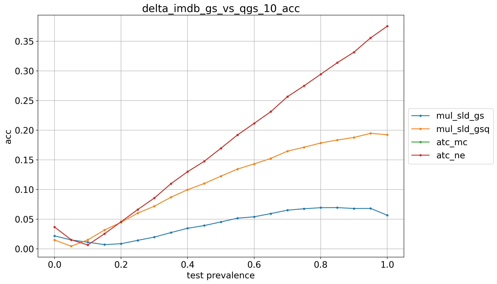
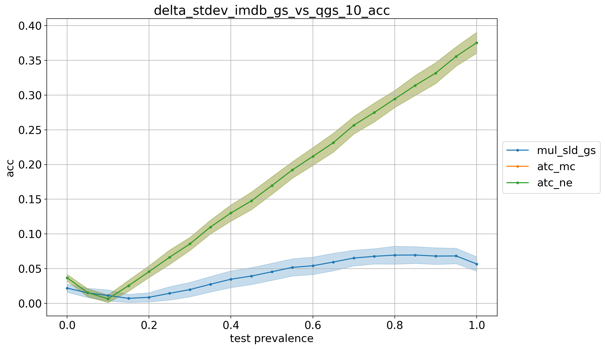
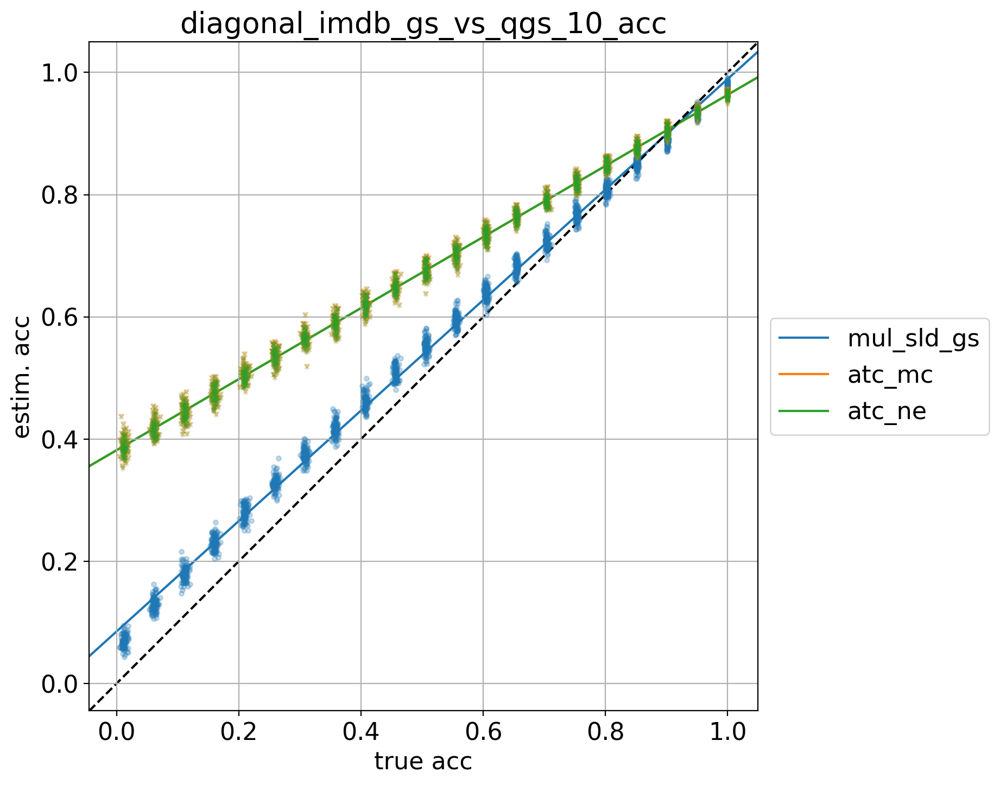
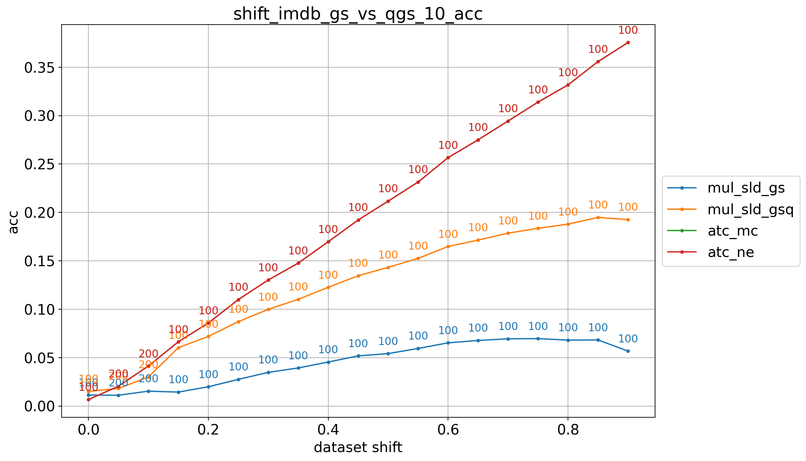

## 20% positives
> train: [0.7999712 0.2000288]  
> validation: [0.7999712 0.2000288]  
> bin_sld_gs: 921.600s  
> mul_sld_gs: 459.585s  
> bin_sld_gsq: 296.879s  
> mul_sld_gsq: 312.459s  
> ref: 11.167s  
> atc_mc: 14.448s  
> atc_ne: 14.863s  
> tot: 922.095s  

<table border="1" class="dataframe">
  <thead>
    <tr style="text-align: right;">
      <th></th>
      <th>bin_sld_gs</th>
      <th>mul_sld_gs</th>
      <th>bin_sld_gsq</th>
      <th>mul_sld_gsq</th>
      <th>atc_mc</th>
      <th>atc_ne</th>
    </tr>
  </thead>
  <tbody>
    <tr>
      <th>0.0</th>
      <td>0.0094</td>
      <td>0.0149</td>
      <td>0.0096</td>
      <td>0.0151</td>
      <td>0.0286</td>
      <td>0.0286</td>
    </tr>
    <tr>
      <th>0.05</th>
      <td>0.0106</td>
      <td>0.0135</td>
      <td>0.0110</td>
      <td>0.0060</td>
      <td>0.0195</td>
      <td>0.0195</td>
    </tr>
    <tr>
      <th>0.1</th>
      <td>0.0112</td>
      <td>0.0126</td>
      <td>0.0136</td>
      <td>0.0128</td>
      <td>0.0114</td>
      <td>0.0114</td>
    </tr>
    <tr>
      <th>0.15</th>
      <td>0.0121</td>
      <td>0.0112</td>
      <td>0.0132</td>
      <td>0.0265</td>
      <td>0.0075</td>
      <td>0.0075</td>
    </tr>
    <tr>
      <th>0.2</th>
      <td>0.0130</td>
      <td>0.0115</td>
      <td>0.0146</td>
      <td>0.0403</td>
      <td>0.0108</td>
      <td>0.0108</td>
    </tr>
    <tr>
      <th>0.25</th>
      <td>0.0129</td>
      <td>0.0120</td>
      <td>0.0149</td>
      <td>0.0537</td>
      <td>0.0177</td>
      <td>0.0177</td>
    </tr>
    <tr>
      <th>0.3</th>
      <td>0.0132</td>
      <td>0.0119</td>
      <td>0.0167</td>
      <td>0.0663</td>
      <td>0.0238</td>
      <td>0.0238</td>
    </tr>
    <tr>
      <th>0.35</th>
      <td>0.0142</td>
      <td>0.0119</td>
      <td>0.0190</td>
      <td>0.0796</td>
      <td>0.0367</td>
      <td>0.0367</td>
    </tr>
    <tr>
      <th>0.4</th>
      <td>0.0142</td>
      <td>0.0105</td>
      <td>0.0221</td>
      <td>0.0908</td>
      <td>0.0448</td>
      <td>0.0448</td>
    </tr>
    <tr>
      <th>0.45</th>
      <td>0.0137</td>
      <td>0.0099</td>
      <td>0.0218</td>
      <td>0.1034</td>
      <td>0.0538</td>
      <td>0.0538</td>
    </tr>
    <tr>
      <th>0.5</th>
      <td>0.0157</td>
      <td>0.0117</td>
      <td>0.0242</td>
      <td>0.1135</td>
      <td>0.0640</td>
      <td>0.0640</td>
    </tr>
    <tr>
      <th>0.55</th>
      <td>0.0144</td>
      <td>0.0108</td>
      <td>0.0273</td>
      <td>0.1240</td>
      <td>0.0729</td>
      <td>0.0729</td>
    </tr>
    <tr>
      <th>0.6</th>
      <td>0.0166</td>
      <td>0.0107</td>
      <td>0.0322</td>
      <td>0.1330</td>
      <td>0.0810</td>
      <td>0.0810</td>
    </tr>
    <tr>
      <th>0.65</th>
      <td>0.0165</td>
      <td>0.0118</td>
      <td>0.0316</td>
      <td>0.1426</td>
      <td>0.0895</td>
      <td>0.0895</td>
    </tr>
    <tr>
      <th>0.7</th>
      <td>0.0173</td>
      <td>0.0120</td>
      <td>0.0362</td>
      <td>0.1532</td>
      <td>0.1031</td>
      <td>0.1031</td>
    </tr>
    <tr>
      <th>0.75</th>
      <td>0.0158</td>
      <td>0.0093</td>
      <td>0.0377</td>
      <td>0.1608</td>
      <td>0.1092</td>
      <td>0.1092</td>
    </tr>
    <tr>
      <th>0.8</th>
      <td>0.0177</td>
      <td>0.0114</td>
      <td>0.0432</td>
      <td>0.1663</td>
      <td>0.1170</td>
      <td>0.1170</td>
    </tr>
    <tr>
      <th>0.85</th>
      <td>0.0222</td>
      <td>0.0117</td>
      <td>0.0500</td>
      <td>0.1714</td>
      <td>0.1265</td>
      <td>0.1265</td>
    </tr>
    <tr>
      <th>0.9</th>
      <td>0.0199</td>
      <td>0.0111</td>
      <td>0.0536</td>
      <td>0.1773</td>
      <td>0.1322</td>
      <td>0.1322</td>
    </tr>
    <tr>
      <th>0.95</th>
      <td>0.0231</td>
      <td>0.0115</td>
      <td>0.0578</td>
      <td>0.1843</td>
      <td>0.1443</td>
      <td>0.1443</td>
    </tr>
    <tr>
      <th>1.0</th>
      <td>0.0141</td>
      <td>0.0121</td>
      <td>0.0366</td>
      <td>0.1813</td>
      <td>0.1494</td>
      <td>0.1494</td>
    </tr>
    <tr>
      <th>avg</th>
      <td>0.0151</td>
      <td>0.0116</td>
      <td>0.0279</td>
      <td>0.1049</td>
      <td>0.0687</td>
      <td>0.0687</td>
    </tr>
  </tbody>
</table>

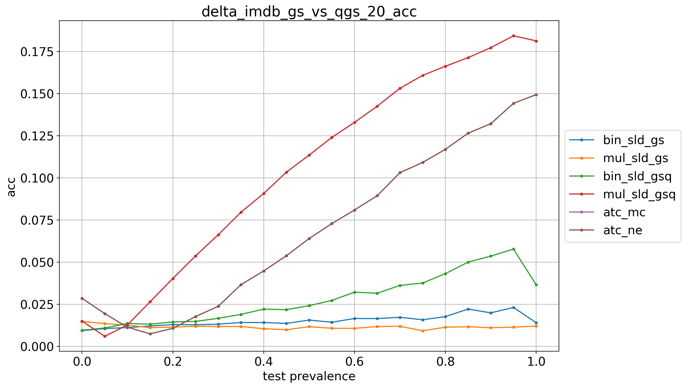
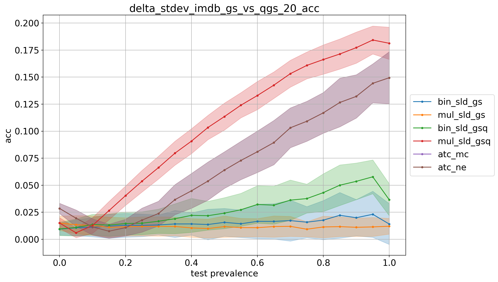
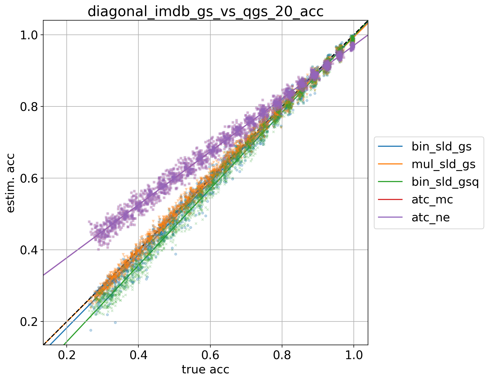
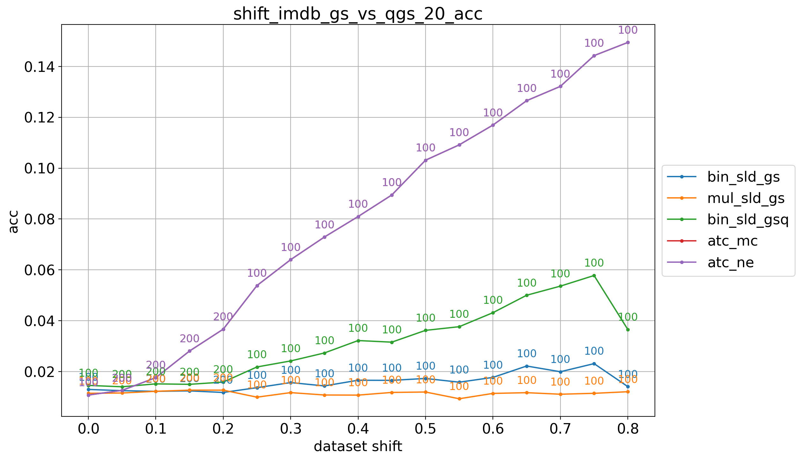

## 30% positives
> train: [0.7000288 0.2999712]  
> validation: [0.7000288 0.2999712]  
> bin_sld_gs: 898.905s  
> mul_sld_gs: 456.235s  
> bin_sld_gsq: 313.118s  
> mul_sld_gsq: 311.989s  
> ref: 11.583s  
> atc_mc: 14.859s  
> atc_ne: 15.309s  
> tot: 899.678s  

<table border="1" class="dataframe">
  <thead>
    <tr style="text-align: right;">
      <th></th>
      <th>bin_sld_gs</th>
      <th>mul_sld_gs</th>
      <th>bin_sld_gsq</th>
      <th>mul_sld_gsq</th>
      <th>atc_mc</th>
      <th>atc_ne</th>
    </tr>
  </thead>
  <tbody>
    <tr>
      <th>0.0</th>
      <td>0.0060</td>
      <td>0.0135</td>
      <td>0.0055</td>
      <td>0.0067</td>
      <td>0.0279</td>
      <td>0.0279</td>
    </tr>
    <tr>
      <th>0.05</th>
      <td>0.0101</td>
      <td>0.0130</td>
      <td>0.0107</td>
      <td>0.0104</td>
      <td>0.0220</td>
      <td>0.0220</td>
    </tr>
    <tr>
      <th>0.1</th>
      <td>0.0120</td>
      <td>0.0123</td>
      <td>0.0130</td>
      <td>0.0207</td>
      <td>0.0157</td>
      <td>0.0157</td>
    </tr>
    <tr>
      <th>0.15</th>
      <td>0.0126</td>
      <td>0.0118</td>
      <td>0.0164</td>
      <td>0.0306</td>
      <td>0.0111</td>
      <td>0.0111</td>
    </tr>
    <tr>
      <th>0.2</th>
      <td>0.0136</td>
      <td>0.0128</td>
      <td>0.0210</td>
      <td>0.0396</td>
      <td>0.0108</td>
      <td>0.0108</td>
    </tr>
    <tr>
      <th>0.25</th>
      <td>0.0163</td>
      <td>0.0144</td>
      <td>0.0261</td>
      <td>0.0477</td>
      <td>0.0106</td>
      <td>0.0106</td>
    </tr>
    <tr>
      <th>0.3</th>
      <td>0.0146</td>
      <td>0.0120</td>
      <td>0.0249</td>
      <td>0.0573</td>
      <td>0.0105</td>
      <td>0.0105</td>
    </tr>
    <tr>
      <th>0.35</th>
      <td>0.0185</td>
      <td>0.0132</td>
      <td>0.0358</td>
      <td>0.0665</td>
      <td>0.0143</td>
      <td>0.0143</td>
    </tr>
    <tr>
      <th>0.4</th>
      <td>0.0197</td>
      <td>0.0137</td>
      <td>0.0410</td>
      <td>0.0752</td>
      <td>0.0199</td>
      <td>0.0199</td>
    </tr>
    <tr>
      <th>0.45</th>
      <td>0.0189</td>
      <td>0.0125</td>
      <td>0.0435</td>
      <td>0.0856</td>
      <td>0.0235</td>
      <td>0.0235</td>
    </tr>
    <tr>
      <th>0.5</th>
      <td>0.0226</td>
      <td>0.0141</td>
      <td>0.0493</td>
      <td>0.0919</td>
      <td>0.0301</td>
      <td>0.0301</td>
    </tr>
    <tr>
      <th>0.55</th>
      <td>0.0225</td>
      <td>0.0117</td>
      <td>0.0546</td>
      <td>0.1009</td>
      <td>0.0355</td>
      <td>0.0355</td>
    </tr>
    <tr>
      <th>0.6</th>
      <td>0.0247</td>
      <td>0.0129</td>
      <td>0.0603</td>
      <td>0.1062</td>
      <td>0.0404</td>
      <td>0.0404</td>
    </tr>
    <tr>
      <th>0.65</th>
      <td>0.0271</td>
      <td>0.0136</td>
      <td>0.0654</td>
      <td>0.1128</td>
      <td>0.0442</td>
      <td>0.0442</td>
    </tr>
    <tr>
      <th>0.7</th>
      <td>0.0315</td>
      <td>0.0145</td>
      <td>0.0743</td>
      <td>0.1193</td>
      <td>0.0517</td>
      <td>0.0517</td>
    </tr>
    <tr>
      <th>0.75</th>
      <td>0.0325</td>
      <td>0.0147</td>
      <td>0.0779</td>
      <td>0.1248</td>
      <td>0.0584</td>
      <td>0.0584</td>
    </tr>
    <tr>
      <th>0.8</th>
      <td>0.0353</td>
      <td>0.0164</td>
      <td>0.0841</td>
      <td>0.1294</td>
      <td>0.0608</td>
      <td>0.0608</td>
    </tr>
    <tr>
      <th>0.85</th>
      <td>0.0409</td>
      <td>0.0168</td>
      <td>0.0935</td>
      <td>0.1341</td>
      <td>0.0669</td>
      <td>0.0669</td>
    </tr>
    <tr>
      <th>0.9</th>
      <td>0.0436</td>
      <td>0.0188</td>
      <td>0.0995</td>
      <td>0.1364</td>
      <td>0.0698</td>
      <td>0.0698</td>
    </tr>
    <tr>
      <th>0.95</th>
      <td>0.0455</td>
      <td>0.0203</td>
      <td>0.1028</td>
      <td>0.1402</td>
      <td>0.0804</td>
      <td>0.0804</td>
    </tr>
    <tr>
      <th>1.0</th>
      <td>0.0415</td>
      <td>0.0296</td>
      <td>0.0992</td>
      <td>0.1362</td>
      <td>0.0817</td>
      <td>0.0817</td>
    </tr>
    <tr>
      <th>avg</th>
      <td>0.0243</td>
      <td>0.0149</td>
      <td>0.0523</td>
      <td>0.0844</td>
      <td>0.0374</td>
      <td>0.0374</td>
    </tr>
  </tbody>
</table>

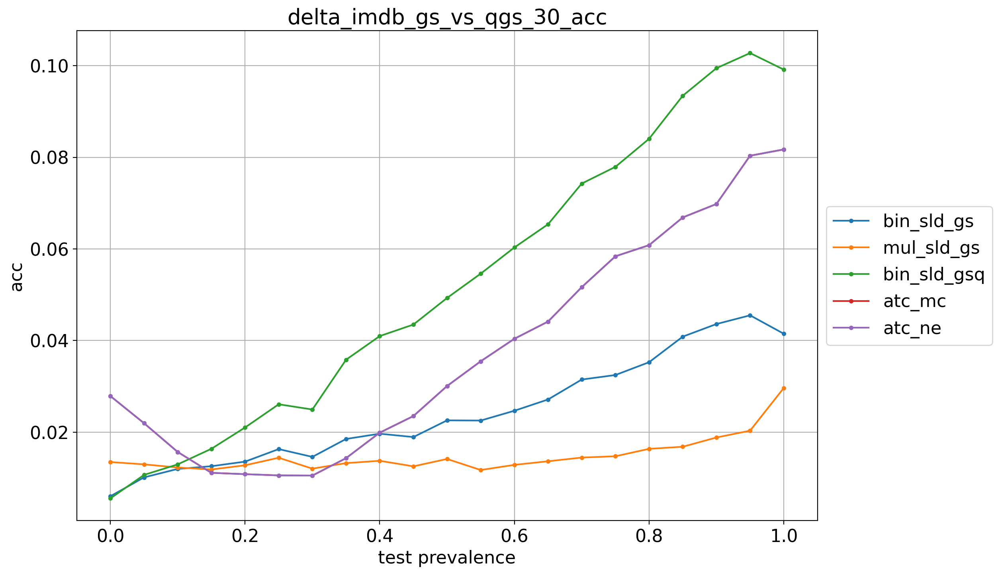
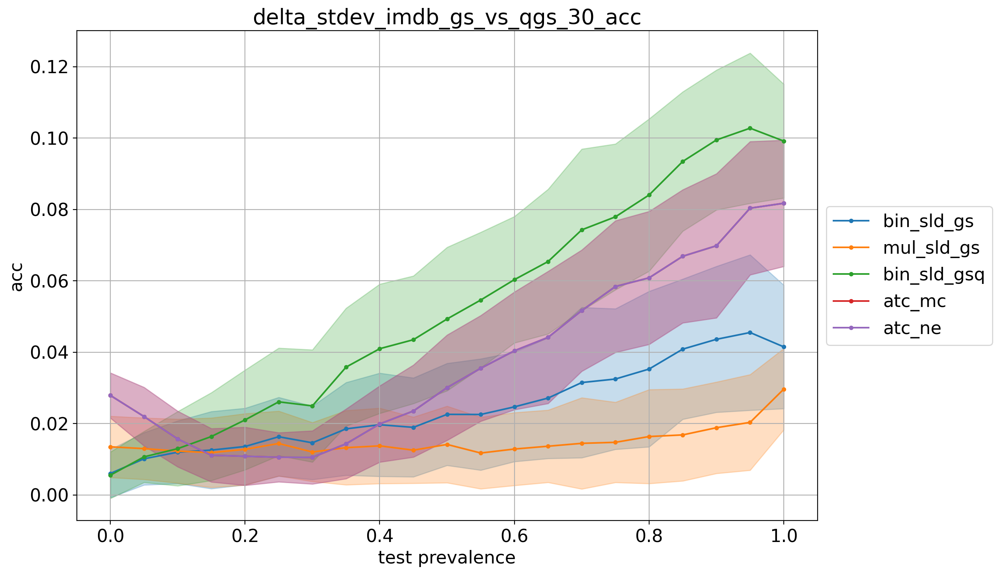
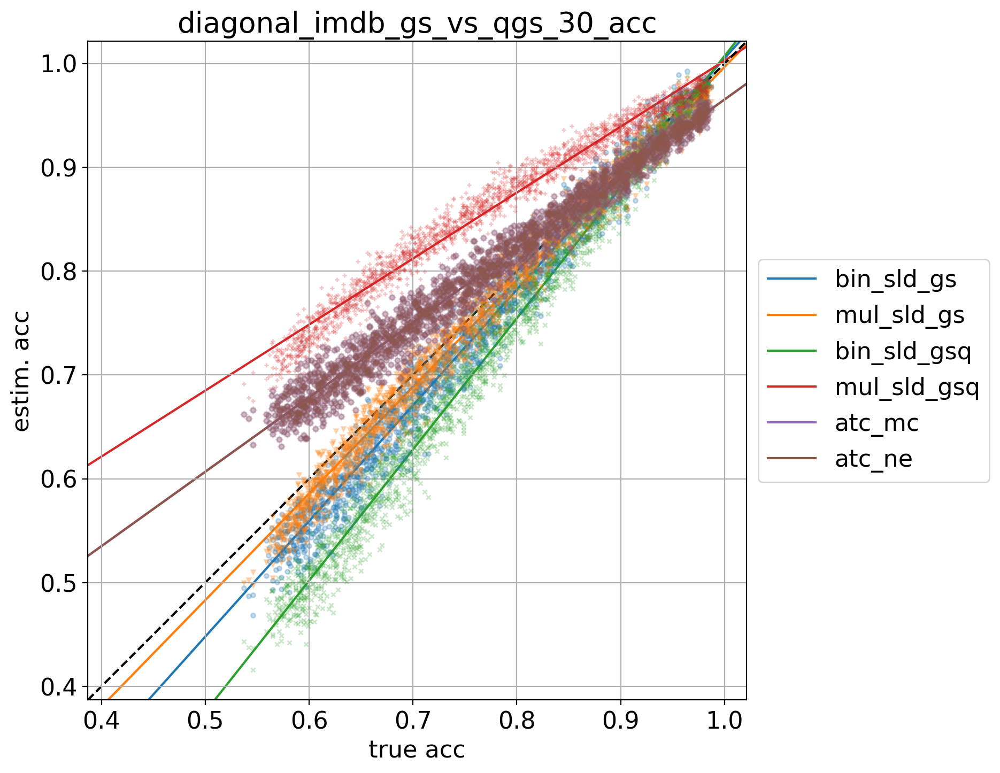
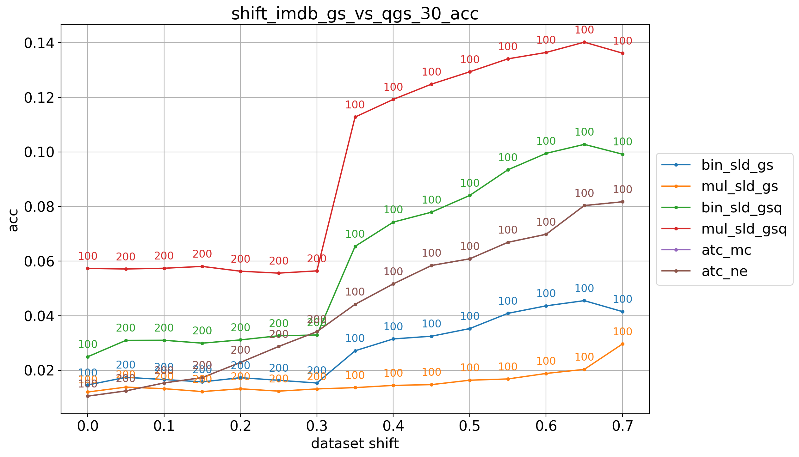

## 40% positives
> train: [0.5999424 0.4000576]  
> validation: [0.60008641 0.39991359]  
> bin_sld_gs: 915.491s  
> mul_sld_gs: 447.110s  
> bin_sld_gsq: 315.586s  
> mul_sld_gsq: 313.380s  
> ref: 11.060s  
> atc_mc: 14.959s  
> atc_ne: 14.880s  
> tot: 916.119s  

<table border="1" class="dataframe">
  <thead>
    <tr style="text-align: right;">
      <th></th>
      <th>bin_sld_gs</th>
      <th>mul_sld_gs</th>
      <th>bin_sld_gsq</th>
      <th>mul_sld_gsq</th>
      <th>atc_mc</th>
      <th>atc_ne</th>
    </tr>
  </thead>
  <tbody>
    <tr>
      <th>0.0</th>
      <td>0.0088</td>
      <td>0.0137</td>
      <td>0.0373</td>
      <td>0.0365</td>
      <td>0.0207</td>
      <td>0.0207</td>
    </tr>
    <tr>
      <th>0.05</th>
      <td>0.0135</td>
      <td>0.0159</td>
      <td>0.0413</td>
      <td>0.0455</td>
      <td>0.0204</td>
      <td>0.0204</td>
    </tr>
    <tr>
      <th>0.1</th>
      <td>0.0148</td>
      <td>0.0169</td>
      <td>0.0442</td>
      <td>0.0551</td>
      <td>0.0160</td>
      <td>0.0160</td>
    </tr>
    <tr>
      <th>0.15</th>
      <td>0.0163</td>
      <td>0.0197</td>
      <td>0.0468</td>
      <td>0.0604</td>
      <td>0.0151</td>
      <td>0.0151</td>
    </tr>
    <tr>
      <th>0.2</th>
      <td>0.0180</td>
      <td>0.0204</td>
      <td>0.0489</td>
      <td>0.0667</td>
      <td>0.0133</td>
      <td>0.0133</td>
    </tr>
    <tr>
      <th>0.25</th>
      <td>0.0159</td>
      <td>0.0203</td>
      <td>0.0497</td>
      <td>0.0723</td>
      <td>0.0099</td>
      <td>0.0099</td>
    </tr>
    <tr>
      <th>0.3</th>
      <td>0.0176</td>
      <td>0.0199</td>
      <td>0.0495</td>
      <td>0.0787</td>
      <td>0.0107</td>
      <td>0.0107</td>
    </tr>
    <tr>
      <th>0.35</th>
      <td>0.0218</td>
      <td>0.0242</td>
      <td>0.0571</td>
      <td>0.0817</td>
      <td>0.0089</td>
      <td>0.0089</td>
    </tr>
    <tr>
      <th>0.4</th>
      <td>0.0233</td>
      <td>0.0250</td>
      <td>0.0599</td>
      <td>0.0904</td>
      <td>0.0099</td>
      <td>0.0099</td>
    </tr>
    <tr>
      <th>0.45</th>
      <td>0.0234</td>
      <td>0.0242</td>
      <td>0.0599</td>
      <td>0.0932</td>
      <td>0.0109</td>
      <td>0.0109</td>
    </tr>
    <tr>
      <th>0.5</th>
      <td>0.0270</td>
      <td>0.0273</td>
      <td>0.0650</td>
      <td>0.0954</td>
      <td>0.0115</td>
      <td>0.0115</td>
    </tr>
    <tr>
      <th>0.55</th>
      <td>0.0249</td>
      <td>0.0238</td>
      <td>0.0637</td>
      <td>0.1020</td>
      <td>0.0117</td>
      <td>0.0117</td>
    </tr>
    <tr>
      <th>0.6</th>
      <td>0.0299</td>
      <td>0.0271</td>
      <td>0.0699</td>
      <td>0.1058</td>
      <td>0.0135</td>
      <td>0.0135</td>
    </tr>
    <tr>
      <th>0.65</th>
      <td>0.0291</td>
      <td>0.0266</td>
      <td>0.0700</td>
      <td>0.1094</td>
      <td>0.0142</td>
      <td>0.0142</td>
    </tr>
    <tr>
      <th>0.7</th>
      <td>0.0313</td>
      <td>0.0268</td>
      <td>0.0730</td>
      <td>0.1141</td>
      <td>0.0168</td>
      <td>0.0168</td>
    </tr>
    <tr>
      <th>0.75</th>
      <td>0.0335</td>
      <td>0.0282</td>
      <td>0.0761</td>
      <td>0.1150</td>
      <td>0.0182</td>
      <td>0.0182</td>
    </tr>
    <tr>
      <th>0.8</th>
      <td>0.0326</td>
      <td>0.0277</td>
      <td>0.0760</td>
      <td>0.1165</td>
      <td>0.0198</td>
      <td>0.0198</td>
    </tr>
    <tr>
      <th>0.85</th>
      <td>0.0376</td>
      <td>0.0304</td>
      <td>0.0818</td>
      <td>0.1174</td>
      <td>0.0229</td>
      <td>0.0229</td>
    </tr>
    <tr>
      <th>0.9</th>
      <td>0.0350</td>
      <td>0.0281</td>
      <td>0.0795</td>
      <td>0.1183</td>
      <td>0.0272</td>
      <td>0.0272</td>
    </tr>
    <tr>
      <th>0.95</th>
      <td>0.0388</td>
      <td>0.0298</td>
      <td>0.0845</td>
      <td>0.1196</td>
      <td>0.0283</td>
      <td>0.0283</td>
    </tr>
    <tr>
      <th>1.0</th>
      <td>0.0358</td>
      <td>0.0376</td>
      <td>0.0876</td>
      <td>0.1147</td>
      <td>0.0310</td>
      <td>0.0310</td>
    </tr>
    <tr>
      <th>avg</th>
      <td>0.0252</td>
      <td>0.0244</td>
      <td>0.0629</td>
      <td>0.0909</td>
      <td>0.0167</td>
      <td>0.0167</td>
    </tr>
  </tbody>
</table>

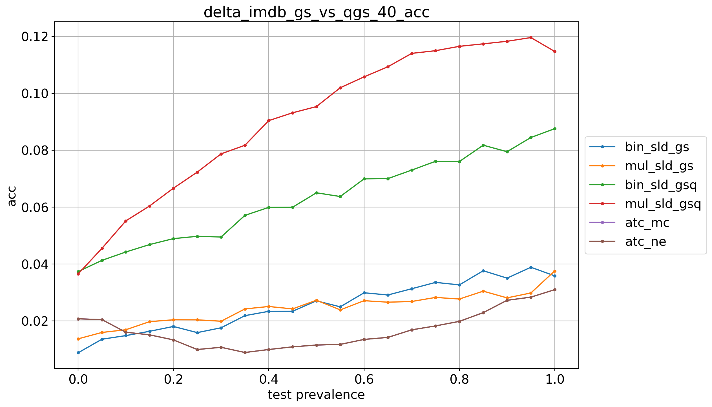
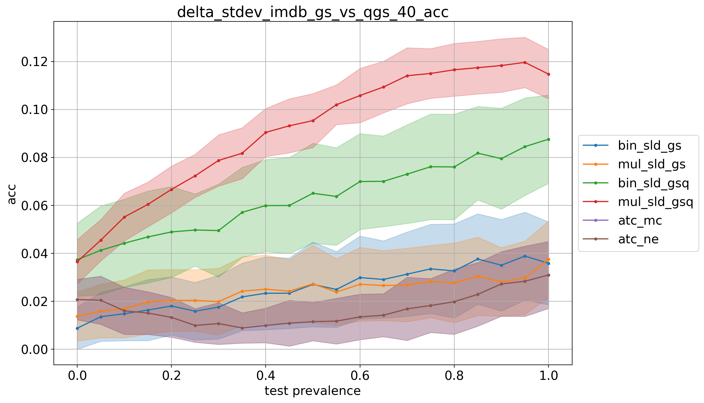
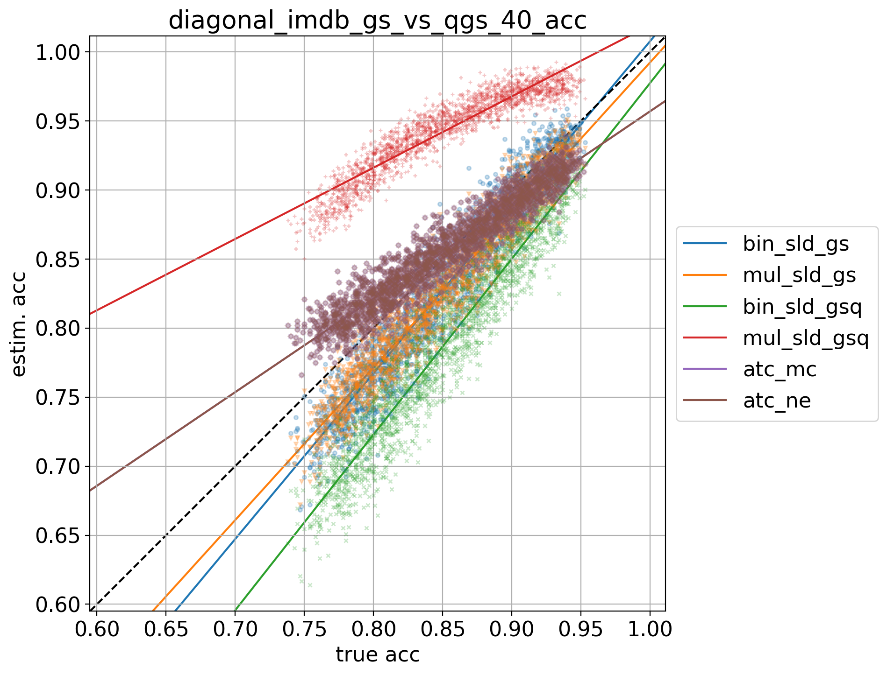
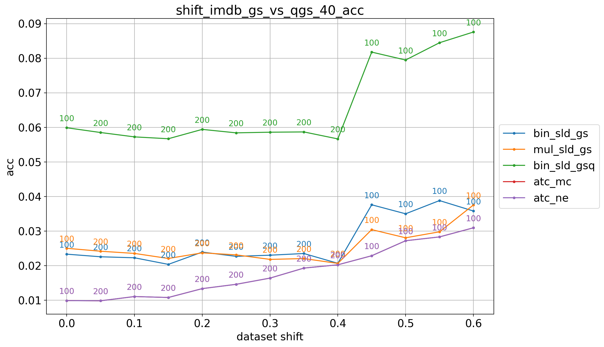

## 50% positives
> train: [0.5 0.5]  
> validation: [0.5 0.5]  
> bin_sld_gs: 898.790s  
> mul_sld_gs: 463.224s  
> bin_sld_gsq: 314.307s  
> mul_sld_gsq: 322.103s  
> ref: 10.921s  
> atc_mc: 14.924s  
> atc_ne: 14.924s  
> tot: 899.292s  

<table border="1" class="dataframe">
  <thead>
    <tr style="text-align: right;">
      <th></th>
      <th>bin_sld_gs</th>
      <th>mul_sld_gs</th>
      <th>bin_sld_gsq</th>
      <th>mul_sld_gsq</th>
      <th>atc_mc</th>
      <th>atc_ne</th>
    </tr>
  </thead>
  <tbody>
    <tr>
      <th>0.0</th>
      <td>0.0085</td>
      <td>0.0080</td>
      <td>0.0119</td>
      <td>0.0605</td>
      <td>0.0100</td>
      <td>0.0100</td>
    </tr>
    <tr>
      <th>0.05</th>
      <td>0.0114</td>
      <td>0.0086</td>
      <td>0.0145</td>
      <td>0.0661</td>
      <td>0.0090</td>
      <td>0.0090</td>
    </tr>
    <tr>
      <th>0.1</th>
      <td>0.0145</td>
      <td>0.0093</td>
      <td>0.0160</td>
      <td>0.0712</td>
      <td>0.0096</td>
      <td>0.0096</td>
    </tr>
    <tr>
      <th>0.15</th>
      <td>0.0154</td>
      <td>0.0106</td>
      <td>0.0173</td>
      <td>0.0726</td>
      <td>0.0085</td>
      <td>0.0085</td>
    </tr>
    <tr>
      <th>0.2</th>
      <td>0.0151</td>
      <td>0.0108</td>
      <td>0.0159</td>
      <td>0.0742</td>
      <td>0.0086</td>
      <td>0.0086</td>
    </tr>
    <tr>
      <th>0.25</th>
      <td>0.0156</td>
      <td>0.0108</td>
      <td>0.0180</td>
      <td>0.0732</td>
      <td>0.0094</td>
      <td>0.0094</td>
    </tr>
    <tr>
      <th>0.3</th>
      <td>0.0161</td>
      <td>0.0128</td>
      <td>0.0184</td>
      <td>0.0735</td>
      <td>0.0098</td>
      <td>0.0098</td>
    </tr>
    <tr>
      <th>0.35</th>
      <td>0.0188</td>
      <td>0.0131</td>
      <td>0.0204</td>
      <td>0.0736</td>
      <td>0.0094</td>
      <td>0.0094</td>
    </tr>
    <tr>
      <th>0.4</th>
      <td>0.0188</td>
      <td>0.0128</td>
      <td>0.0187</td>
      <td>0.0763</td>
      <td>0.0101</td>
      <td>0.0101</td>
    </tr>
    <tr>
      <th>0.45</th>
      <td>0.0183</td>
      <td>0.0132</td>
      <td>0.0191</td>
      <td>0.0743</td>
      <td>0.0103</td>
      <td>0.0103</td>
    </tr>
    <tr>
      <th>0.5</th>
      <td>0.0231</td>
      <td>0.0173</td>
      <td>0.0220</td>
      <td>0.0732</td>
      <td>0.0124</td>
      <td>0.0124</td>
    </tr>
    <tr>
      <th>0.55</th>
      <td>0.0198</td>
      <td>0.0172</td>
      <td>0.0201</td>
      <td>0.0748</td>
      <td>0.0113</td>
      <td>0.0113</td>
    </tr>
    <tr>
      <th>0.6</th>
      <td>0.0209</td>
      <td>0.0176</td>
      <td>0.0223</td>
      <td>0.0735</td>
      <td>0.0110</td>
      <td>0.0110</td>
    </tr>
    <tr>
      <th>0.65</th>
      <td>0.0196</td>
      <td>0.0167</td>
      <td>0.0208</td>
      <td>0.0719</td>
      <td>0.0112</td>
      <td>0.0112</td>
    </tr>
    <tr>
      <th>0.7</th>
      <td>0.0222</td>
      <td>0.0189</td>
      <td>0.0216</td>
      <td>0.0722</td>
      <td>0.0109</td>
      <td>0.0109</td>
    </tr>
    <tr>
      <th>0.75</th>
      <td>0.0227</td>
      <td>0.0203</td>
      <td>0.0248</td>
      <td>0.0691</td>
      <td>0.0109</td>
      <td>0.0109</td>
    </tr>
    <tr>
      <th>0.8</th>
      <td>0.0215</td>
      <td>0.0192</td>
      <td>0.0223</td>
      <td>0.0678</td>
      <td>0.0100</td>
      <td>0.0100</td>
    </tr>
    <tr>
      <th>0.85</th>
      <td>0.0246</td>
      <td>0.0210</td>
      <td>0.0248</td>
      <td>0.0663</td>
      <td>0.0107</td>
      <td>0.0107</td>
    </tr>
    <tr>
      <th>0.9</th>
      <td>0.0211</td>
      <td>0.0204</td>
      <td>0.0242</td>
      <td>0.0621</td>
      <td>0.0114</td>
      <td>0.0114</td>
    </tr>
    <tr>
      <th>0.95</th>
      <td>0.0252</td>
      <td>0.0243</td>
      <td>0.0280</td>
      <td>0.0587</td>
      <td>0.0119</td>
      <td>0.0119</td>
    </tr>
    <tr>
      <th>1.0</th>
      <td>0.0266</td>
      <td>0.0292</td>
      <td>0.0286</td>
      <td>0.0499</td>
      <td>0.0107</td>
      <td>0.0107</td>
    </tr>
    <tr>
      <th>avg</th>
      <td>0.0190</td>
      <td>0.0158</td>
      <td>0.0205</td>
      <td>0.0693</td>
      <td>0.0103</td>
      <td>0.0103</td>
    </tr>
  </tbody>
</table>

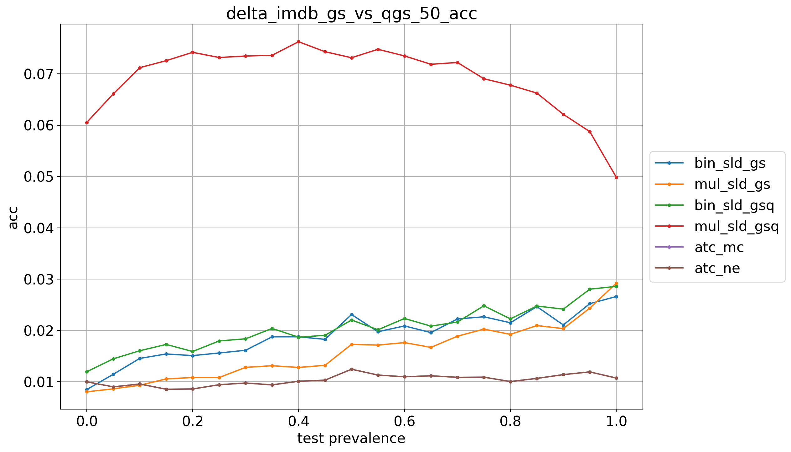
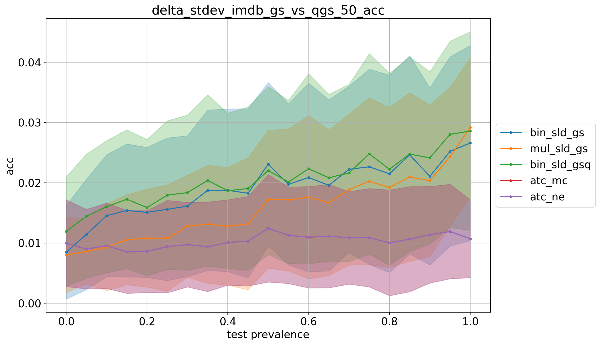
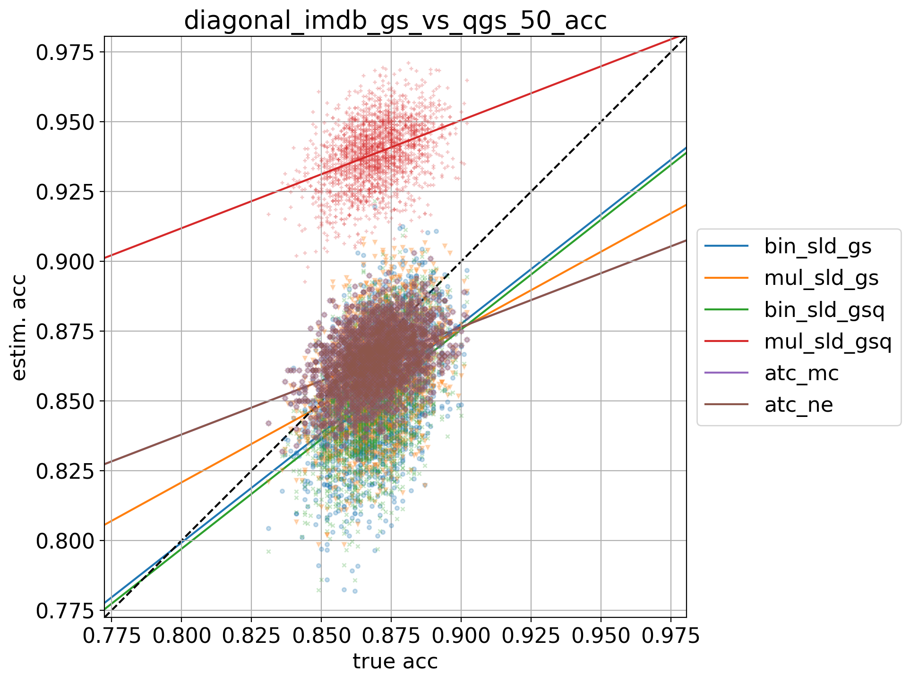
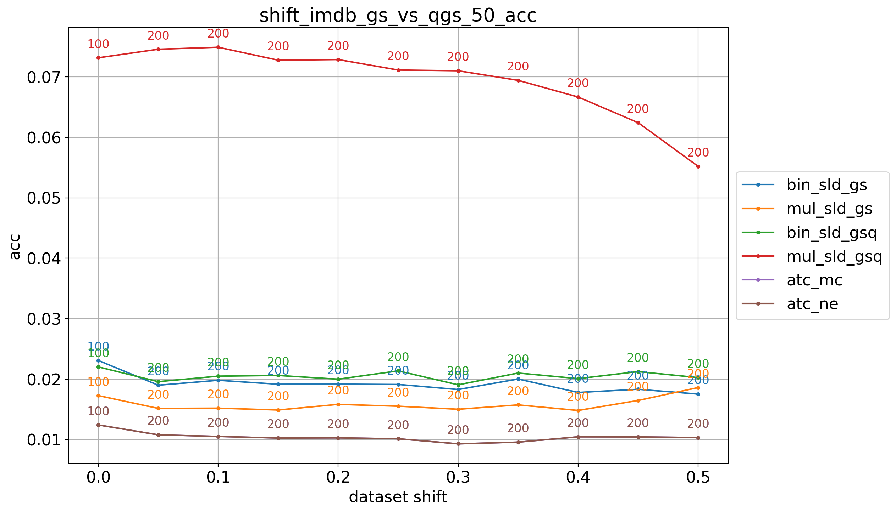

## 60% positives
> train: [0.39991359 0.60008641]  
> validation: [0.4000576 0.5999424]  
> bin_sld_gs: 940.163s  
> mul_sld_gs: 460.634s  
> bin_sld_gsq: 323.142s  
> mul_sld_gsq: 325.230s  
> ref: 11.981s  
> atc_mc: 15.716s  
> atc_ne: 15.951s  
> tot: 940.602s  

<table border="1" class="dataframe">
  <thead>
    <tr style="text-align: right;">
      <th></th>
      <th>bin_sld_gs</th>
      <th>mul_sld_gs</th>
      <th>bin_sld_gsq</th>
      <th>mul_sld_gsq</th>
      <th>atc_mc</th>
      <th>atc_ne</th>
    </tr>
  </thead>
  <tbody>
    <tr>
      <th>0.0</th>
      <td>0.0028</td>
      <td>0.0064</td>
      <td>0.0037</td>
      <td>0.0973</td>
      <td>0.0238</td>
      <td>0.0238</td>
    </tr>
    <tr>
      <th>0.05</th>
      <td>0.0139</td>
      <td>0.0081</td>
      <td>0.0283</td>
      <td>0.0970</td>
      <td>0.0205</td>
      <td>0.0205</td>
    </tr>
    <tr>
      <th>0.1</th>
      <td>0.0161</td>
      <td>0.0098</td>
      <td>0.0273</td>
      <td>0.0973</td>
      <td>0.0209</td>
      <td>0.0209</td>
    </tr>
    <tr>
      <th>0.15</th>
      <td>0.0188</td>
      <td>0.0111</td>
      <td>0.0279</td>
      <td>0.0950</td>
      <td>0.0139</td>
      <td>0.0139</td>
    </tr>
    <tr>
      <th>0.2</th>
      <td>0.0194</td>
      <td>0.0131</td>
      <td>0.0256</td>
      <td>0.0939</td>
      <td>0.0166</td>
      <td>0.0166</td>
    </tr>
    <tr>
      <th>0.25</th>
      <td>0.0199</td>
      <td>0.0137</td>
      <td>0.0238</td>
      <td>0.0919</td>
      <td>0.0133</td>
      <td>0.0133</td>
    </tr>
    <tr>
      <th>0.3</th>
      <td>0.0189</td>
      <td>0.0152</td>
      <td>0.0206</td>
      <td>0.0861</td>
      <td>0.0127</td>
      <td>0.0127</td>
    </tr>
    <tr>
      <th>0.35</th>
      <td>0.0242</td>
      <td>0.0195</td>
      <td>0.0243</td>
      <td>0.0826</td>
      <td>0.0116</td>
      <td>0.0116</td>
    </tr>
    <tr>
      <th>0.4</th>
      <td>0.0257</td>
      <td>0.0214</td>
      <td>0.0236</td>
      <td>0.0795</td>
      <td>0.0120</td>
      <td>0.0120</td>
    </tr>
    <tr>
      <th>0.45</th>
      <td>0.0235</td>
      <td>0.0206</td>
      <td>0.0209</td>
      <td>0.0741</td>
      <td>0.0118</td>
      <td>0.0118</td>
    </tr>
    <tr>
      <th>0.5</th>
      <td>0.0288</td>
      <td>0.0257</td>
      <td>0.0237</td>
      <td>0.0690</td>
      <td>0.0122</td>
      <td>0.0122</td>
    </tr>
    <tr>
      <th>0.55</th>
      <td>0.0266</td>
      <td>0.0247</td>
      <td>0.0198</td>
      <td>0.0664</td>
      <td>0.0127</td>
      <td>0.0127</td>
    </tr>
    <tr>
      <th>0.6</th>
      <td>0.0296</td>
      <td>0.0272</td>
      <td>0.0212</td>
      <td>0.0625</td>
      <td>0.0134</td>
      <td>0.0134</td>
    </tr>
    <tr>
      <th>0.65</th>
      <td>0.0272</td>
      <td>0.0265</td>
      <td>0.0197</td>
      <td>0.0566</td>
      <td>0.0147</td>
      <td>0.0147</td>
    </tr>
    <tr>
      <th>0.7</th>
      <td>0.0325</td>
      <td>0.0329</td>
      <td>0.0194</td>
      <td>0.0498</td>
      <td>0.0193</td>
      <td>0.0193</td>
    </tr>
    <tr>
      <th>0.75</th>
      <td>0.0316</td>
      <td>0.0328</td>
      <td>0.0185</td>
      <td>0.0458</td>
      <td>0.0206</td>
      <td>0.0206</td>
    </tr>
    <tr>
      <th>0.8</th>
      <td>0.0285</td>
      <td>0.0315</td>
      <td>0.0174</td>
      <td>0.0397</td>
      <td>0.0241</td>
      <td>0.0241</td>
    </tr>
    <tr>
      <th>0.85</th>
      <td>0.0292</td>
      <td>0.0333</td>
      <td>0.0151</td>
      <td>0.0360</td>
      <td>0.0237</td>
      <td>0.0237</td>
    </tr>
    <tr>
      <th>0.9</th>
      <td>0.0281</td>
      <td>0.0332</td>
      <td>0.0140</td>
      <td>0.0284</td>
      <td>0.0286</td>
      <td>0.0286</td>
    </tr>
    <tr>
      <th>0.95</th>
      <td>0.0320</td>
      <td>0.0382</td>
      <td>0.0128</td>
      <td>0.0193</td>
      <td>0.0316</td>
      <td>0.0316</td>
    </tr>
    <tr>
      <th>1.0</th>
      <td>0.0286</td>
      <td>0.0395</td>
      <td>0.0086</td>
      <td>0.0127</td>
      <td>0.0343</td>
      <td>0.0343</td>
    </tr>
    <tr>
      <th>avg</th>
      <td>0.0241</td>
      <td>0.0231</td>
      <td>0.0198</td>
      <td>0.0658</td>
      <td>0.0187</td>
      <td>0.0187</td>
    </tr>
  </tbody>
</table>

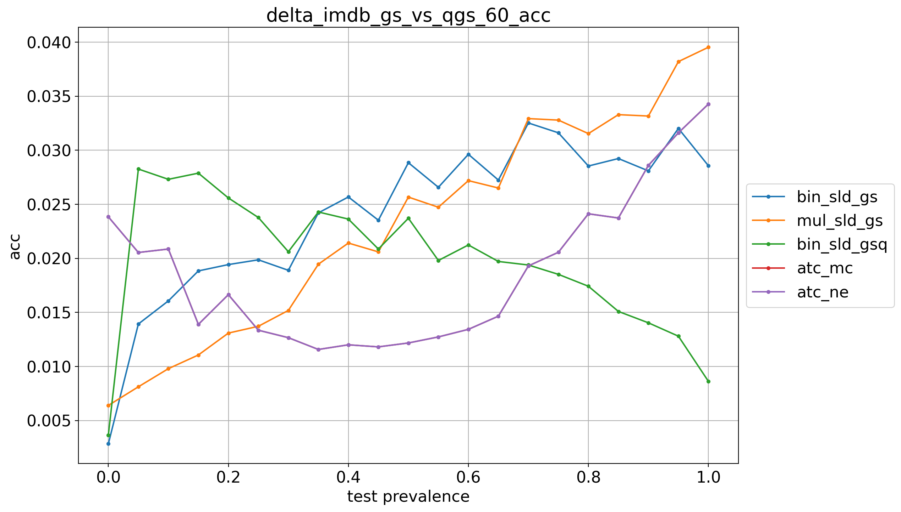
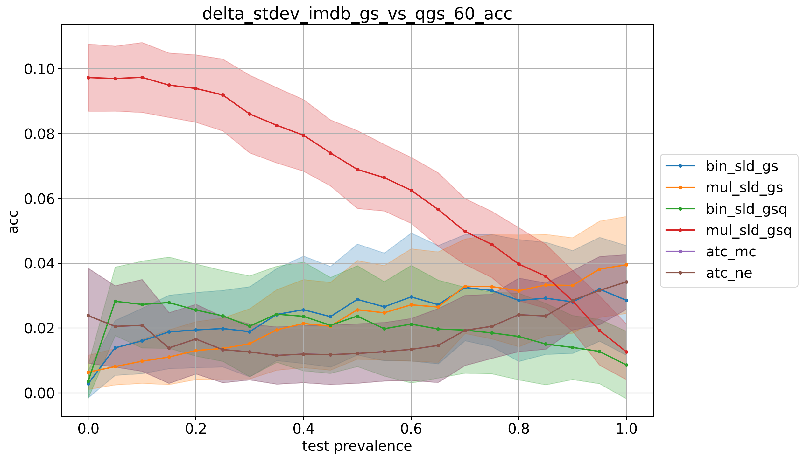
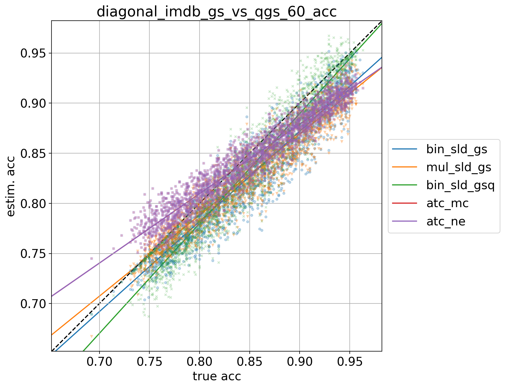
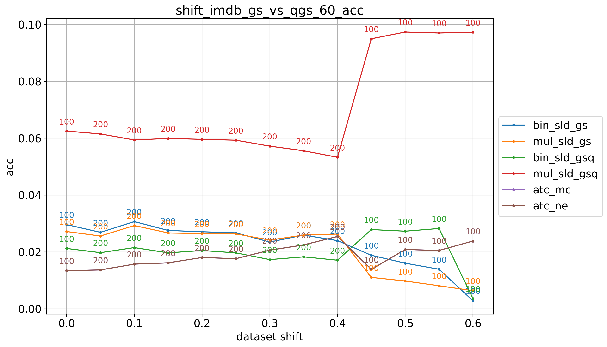

## 70% positives
> train: [0.2999712 0.7000288]  
> validation: [0.2999712 0.7000288]  
> bin_sld_gs: 882.220s  
> mul_sld_gs: 471.468s  
> bin_sld_gsq: 308.364s  
> mul_sld_gsq: 330.333s  
> ref: 11.174s  
> atc_mc: 14.752s  
> atc_ne: 14.815s  
> tot: 882.817s  

<table border="1" class="dataframe">
  <thead>
    <tr style="text-align: right;">
      <th></th>
      <th>bin_sld_gs</th>
      <th>mul_sld_gs</th>
      <th>bin_sld_gsq</th>
      <th>mul_sld_gsq</th>
      <th>atc_mc</th>
      <th>atc_ne</th>
    </tr>
  </thead>
  <tbody>
    <tr>
      <th>0.0</th>
      <td>0.0371</td>
      <td>0.0064</td>
      <td>0.0012</td>
      <td>0.1246</td>
      <td>0.0699</td>
      <td>0.0699</td>
    </tr>
    <tr>
      <th>0.05</th>
      <td>0.0384</td>
      <td>0.0087</td>
      <td>0.0133</td>
      <td>0.1235</td>
      <td>0.0635</td>
      <td>0.0635</td>
    </tr>
    <tr>
      <th>0.1</th>
      <td>0.0392</td>
      <td>0.0089</td>
      <td>0.0127</td>
      <td>0.1223</td>
      <td>0.0617</td>
      <td>0.0617</td>
    </tr>
    <tr>
      <th>0.15</th>
      <td>0.0361</td>
      <td>0.0109</td>
      <td>0.0134</td>
      <td>0.1177</td>
      <td>0.0528</td>
      <td>0.0528</td>
    </tr>
    <tr>
      <th>0.2</th>
      <td>0.0337</td>
      <td>0.0112</td>
      <td>0.0118</td>
      <td>0.1128</td>
      <td>0.0507</td>
      <td>0.0507</td>
    </tr>
    <tr>
      <th>0.25</th>
      <td>0.0313</td>
      <td>0.0105</td>
      <td>0.0123</td>
      <td>0.1098</td>
      <td>0.0430</td>
      <td>0.0430</td>
    </tr>
    <tr>
      <th>0.3</th>
      <td>0.0280</td>
      <td>0.0100</td>
      <td>0.0118</td>
      <td>0.1031</td>
      <td>0.0386</td>
      <td>0.0386</td>
    </tr>
    <tr>
      <th>0.35</th>
      <td>0.0219</td>
      <td>0.0104</td>
      <td>0.0136</td>
      <td>0.0957</td>
      <td>0.0338</td>
      <td>0.0338</td>
    </tr>
    <tr>
      <th>0.4</th>
      <td>0.0190</td>
      <td>0.0106</td>
      <td>0.0156</td>
      <td>0.0904</td>
      <td>0.0306</td>
      <td>0.0306</td>
    </tr>
    <tr>
      <th>0.45</th>
      <td>0.0177</td>
      <td>0.0115</td>
      <td>0.0139</td>
      <td>0.0837</td>
      <td>0.0265</td>
      <td>0.0265</td>
    </tr>
    <tr>
      <th>0.5</th>
      <td>0.0144</td>
      <td>0.0128</td>
      <td>0.0159</td>
      <td>0.0772</td>
      <td>0.0207</td>
      <td>0.0207</td>
    </tr>
    <tr>
      <th>0.55</th>
      <td>0.0101</td>
      <td>0.0117</td>
      <td>0.0156</td>
      <td>0.0680</td>
      <td>0.0167</td>
      <td>0.0167</td>
    </tr>
    <tr>
      <th>0.6</th>
      <td>0.0096</td>
      <td>0.0111</td>
      <td>0.0148</td>
      <td>0.0626</td>
      <td>0.0144</td>
      <td>0.0144</td>
    </tr>
    <tr>
      <th>0.65</th>
      <td>0.0107</td>
      <td>0.0135</td>
      <td>0.0172</td>
      <td>0.0536</td>
      <td>0.0118</td>
      <td>0.0118</td>
    </tr>
    <tr>
      <th>0.7</th>
      <td>0.0106</td>
      <td>0.0136</td>
      <td>0.0193</td>
      <td>0.0441</td>
      <td>0.0100</td>
      <td>0.0100</td>
    </tr>
    <tr>
      <th>0.75</th>
      <td>0.0113</td>
      <td>0.0130</td>
      <td>0.0197</td>
      <td>0.0376</td>
      <td>0.0090</td>
      <td>0.0090</td>
    </tr>
    <tr>
      <th>0.8</th>
      <td>0.0135</td>
      <td>0.0128</td>
      <td>0.0210</td>
      <td>0.0290</td>
      <td>0.0125</td>
      <td>0.0125</td>
    </tr>
    <tr>
      <th>0.85</th>
      <td>0.0171</td>
      <td>0.0151</td>
      <td>0.0248</td>
      <td>0.0219</td>
      <td>0.0141</td>
      <td>0.0141</td>
    </tr>
    <tr>
      <th>0.9</th>
      <td>0.0190</td>
      <td>0.0145</td>
      <td>0.0240</td>
      <td>0.0140</td>
      <td>0.0185</td>
      <td>0.0185</td>
    </tr>
    <tr>
      <th>0.95</th>
      <td>0.0283</td>
      <td>0.0181</td>
      <td>0.0306</td>
      <td>0.0068</td>
      <td>0.0250</td>
      <td>0.0250</td>
    </tr>
    <tr>
      <th>1.0</th>
      <td>0.0404</td>
      <td>0.0202</td>
      <td>0.0263</td>
      <td>0.0092</td>
      <td>0.0288</td>
      <td>0.0288</td>
    </tr>
    <tr>
      <th>avg</th>
      <td>0.0232</td>
      <td>0.0122</td>
      <td>0.0166</td>
      <td>0.0718</td>
      <td>0.0311</td>
      <td>0.0311</td>
    </tr>
  </tbody>
</table>

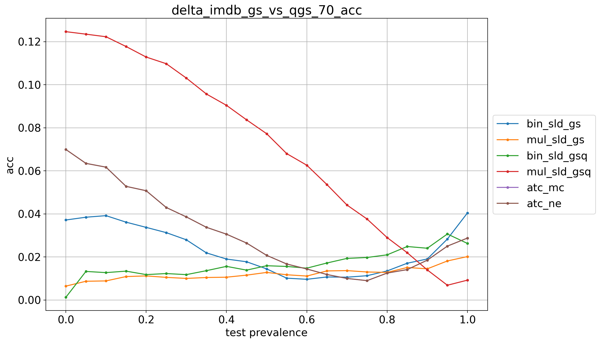
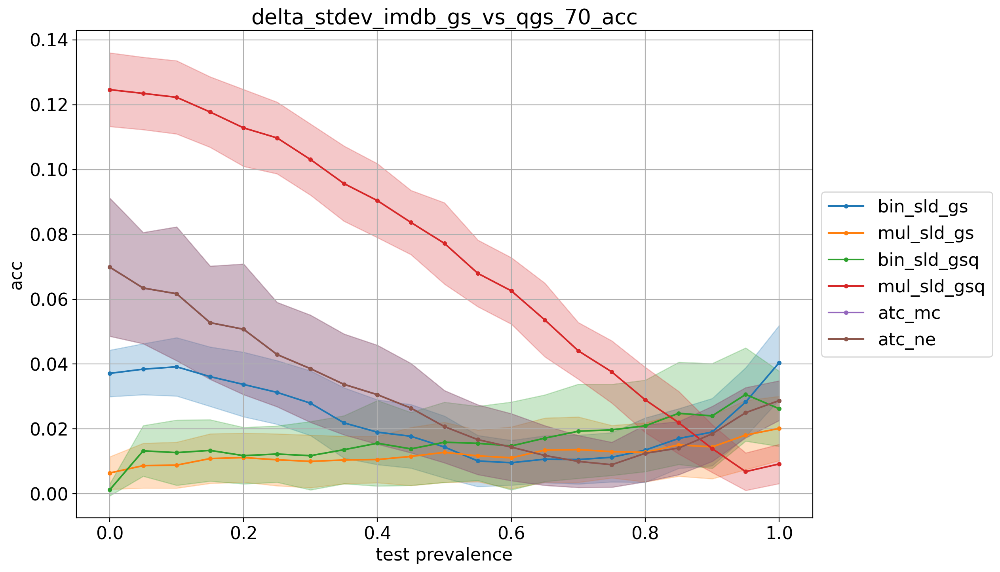
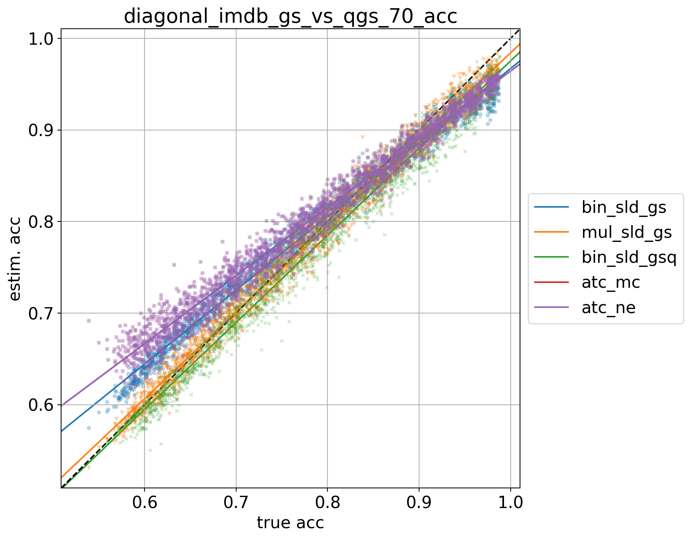
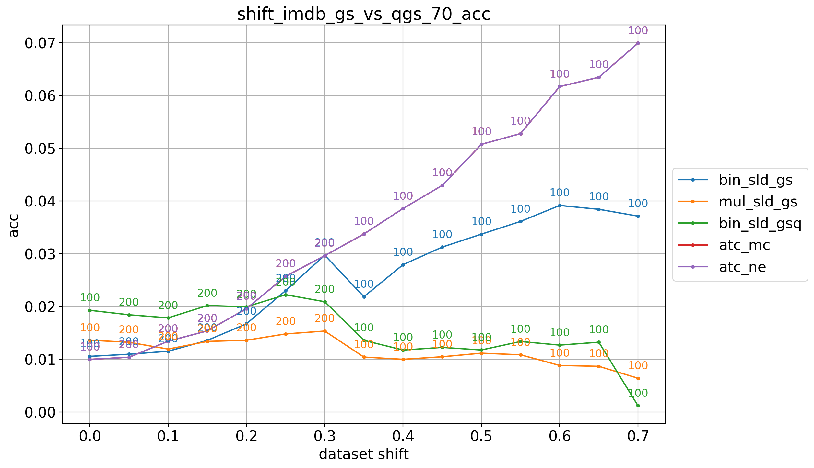

## 80% positives
> train: [0.2000288 0.7999712]  
> validation: [0.2000288 0.7999712]  
> bin_sld_gs: 918.734s  
> mul_sld_gs: 452.727s  
> bin_sld_gsq: 302.185s  
> mul_sld_gsq: 313.546s  
> ref: 11.064s  
> atc_mc: 14.738s  
> atc_ne: 14.770s  
> tot: 919.298s  

<table border="1" class="dataframe">
  <thead>
    <tr style="text-align: right;">
      <th></th>
      <th>bin_sld_gs</th>
      <th>mul_sld_gs</th>
      <th>bin_sld_gsq</th>
      <th>mul_sld_gsq</th>
      <th>atc_mc</th>
      <th>atc_ne</th>
    </tr>
  </thead>
  <tbody>
    <tr>
      <th>0.0</th>
      <td>0.0147</td>
      <td>0.0059</td>
      <td>0.0418</td>
      <td>0.1664</td>
      <td>0.1270</td>
      <td>0.1270</td>
    </tr>
    <tr>
      <th>0.05</th>
      <td>0.0332</td>
      <td>0.0087</td>
      <td>0.0512</td>
      <td>0.1625</td>
      <td>0.1198</td>
      <td>0.1198</td>
    </tr>
    <tr>
      <th>0.1</th>
      <td>0.0221</td>
      <td>0.0082</td>
      <td>0.0417</td>
      <td>0.1635</td>
      <td>0.1165</td>
      <td>0.1165</td>
    </tr>
    <tr>
      <th>0.15</th>
      <td>0.0242</td>
      <td>0.0091</td>
      <td>0.0427</td>
      <td>0.1554</td>
      <td>0.1057</td>
      <td>0.1057</td>
    </tr>
    <tr>
      <th>0.2</th>
      <td>0.0245</td>
      <td>0.0106</td>
      <td>0.0379</td>
      <td>0.1520</td>
      <td>0.0976</td>
      <td>0.0976</td>
    </tr>
    <tr>
      <th>0.25</th>
      <td>0.0240</td>
      <td>0.0119</td>
      <td>0.0360</td>
      <td>0.1428</td>
      <td>0.0873</td>
      <td>0.0873</td>
    </tr>
    <tr>
      <th>0.3</th>
      <td>0.0232</td>
      <td>0.0101</td>
      <td>0.0349</td>
      <td>0.1362</td>
      <td>0.0804</td>
      <td>0.0804</td>
    </tr>
    <tr>
      <th>0.35</th>
      <td>0.0250</td>
      <td>0.0103</td>
      <td>0.0348</td>
      <td>0.1284</td>
      <td>0.0719</td>
      <td>0.0719</td>
    </tr>
    <tr>
      <th>0.4</th>
      <td>0.0238</td>
      <td>0.0121</td>
      <td>0.0321</td>
      <td>0.1191</td>
      <td>0.0668</td>
      <td>0.0668</td>
    </tr>
    <tr>
      <th>0.45</th>
      <td>0.0221</td>
      <td>0.0121</td>
      <td>0.0293</td>
      <td>0.1097</td>
      <td>0.0571</td>
      <td>0.0571</td>
    </tr>
    <tr>
      <th>0.5</th>
      <td>0.0240</td>
      <td>0.0128</td>
      <td>0.0262</td>
      <td>0.1009</td>
      <td>0.0507</td>
      <td>0.0507</td>
    </tr>
    <tr>
      <th>0.55</th>
      <td>0.0239</td>
      <td>0.0118</td>
      <td>0.0246</td>
      <td>0.0902</td>
      <td>0.0430</td>
      <td>0.0430</td>
    </tr>
    <tr>
      <th>0.6</th>
      <td>0.0295</td>
      <td>0.0132</td>
      <td>0.0257</td>
      <td>0.0815</td>
      <td>0.0363</td>
      <td>0.0363</td>
    </tr>
    <tr>
      <th>0.65</th>
      <td>0.0214</td>
      <td>0.0134</td>
      <td>0.0223</td>
      <td>0.0697</td>
      <td>0.0247</td>
      <td>0.0247</td>
    </tr>
    <tr>
      <th>0.7</th>
      <td>0.0260</td>
      <td>0.0149</td>
      <td>0.0210</td>
      <td>0.0576</td>
      <td>0.0184</td>
      <td>0.0184</td>
    </tr>
    <tr>
      <th>0.75</th>
      <td>0.0307</td>
      <td>0.0149</td>
      <td>0.0218</td>
      <td>0.0464</td>
      <td>0.0119</td>
      <td>0.0119</td>
    </tr>
    <tr>
      <th>0.8</th>
      <td>0.0308</td>
      <td>0.0152</td>
      <td>0.0197</td>
      <td>0.0352</td>
      <td>0.0099</td>
      <td>0.0099</td>
    </tr>
    <tr>
      <th>0.85</th>
      <td>0.0330</td>
      <td>0.0144</td>
      <td>0.0170</td>
      <td>0.0245</td>
      <td>0.0101</td>
      <td>0.0101</td>
    </tr>
    <tr>
      <th>0.9</th>
      <td>0.0311</td>
      <td>0.0128</td>
      <td>0.0149</td>
      <td>0.0115</td>
      <td>0.0152</td>
      <td>0.0152</td>
    </tr>
    <tr>
      <th>0.95</th>
      <td>0.0336</td>
      <td>0.0146</td>
      <td>0.0157</td>
      <td>0.0055</td>
      <td>0.0224</td>
      <td>0.0224</td>
    </tr>
    <tr>
      <th>1.0</th>
      <td>0.0293</td>
      <td>0.0125</td>
      <td>0.0118</td>
      <td>0.0144</td>
      <td>0.0294</td>
      <td>0.0294</td>
    </tr>
    <tr>
      <th>avg</th>
      <td>0.0262</td>
      <td>0.0119</td>
      <td>0.0287</td>
      <td>0.0940</td>
      <td>0.0572</td>
      <td>0.0572</td>
    </tr>
  </tbody>
</table>

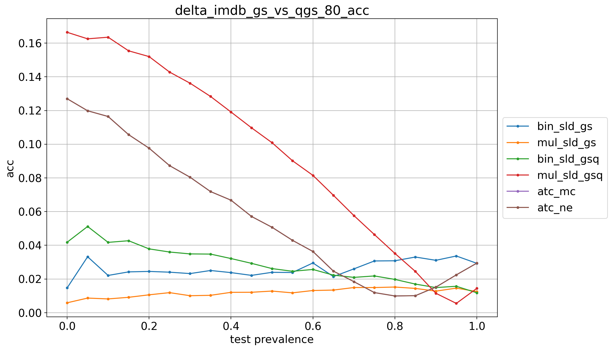
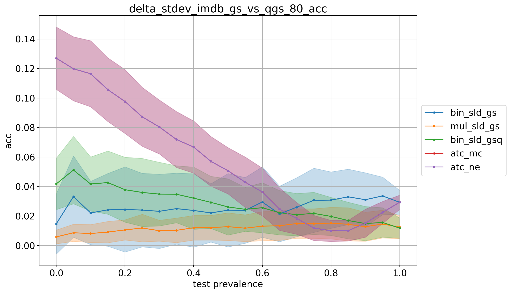
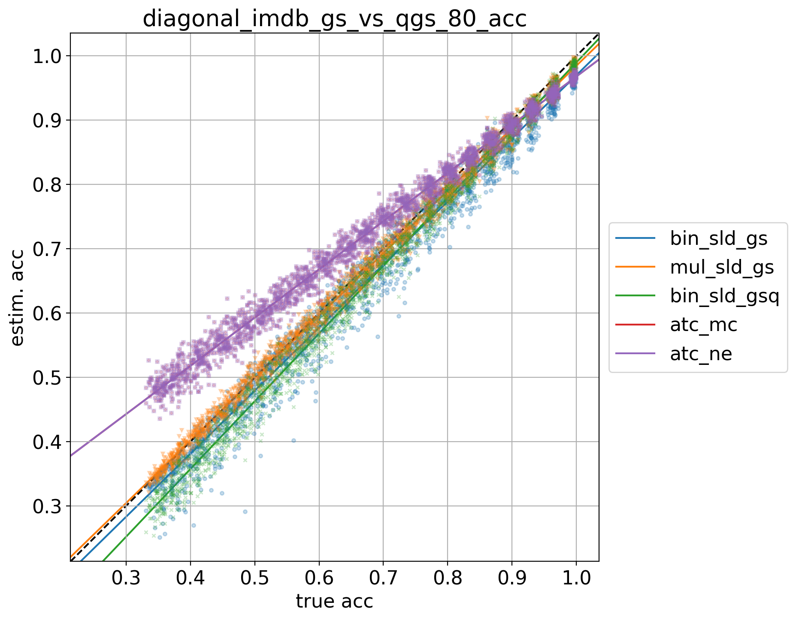
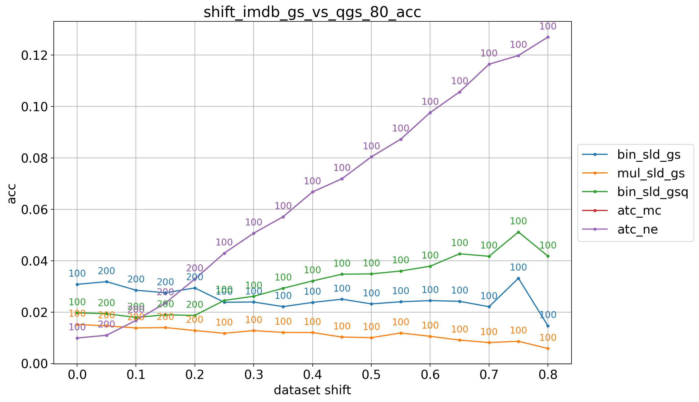

## 90% positives
> train: [0.0999424 0.9000576]  
> validation: [0.10008641 0.89991359]  
> mul_sld_gs: 365.928s  
> ref: 9.138s  
> atc_mc: 12.160s  
> atc_ne: 12.348s  
> tot: 366.493s  

<table border="1" class="dataframe">
  <thead>
    <tr style="text-align: right;">
      <th></th>
      <th>mul_sld_gs</th>
      <th>atc_mc</th>
      <th>atc_ne</th>
    </tr>
  </thead>
  <tbody>
    <tr>
      <th>0.0</th>
      <td>0.0502</td>
      <td>0.2957</td>
      <td>0.2957</td>
    </tr>
    <tr>
      <th>0.05</th>
      <td>0.0550</td>
      <td>0.2812</td>
      <td>0.2812</td>
    </tr>
    <tr>
      <th>0.1</th>
      <td>0.0580</td>
      <td>0.2658</td>
      <td>0.2658</td>
    </tr>
    <tr>
      <th>0.15</th>
      <td>0.0561</td>
      <td>0.2470</td>
      <td>0.2470</td>
    </tr>
    <tr>
      <th>0.2</th>
      <td>0.0549</td>
      <td>0.2327</td>
      <td>0.2327</td>
    </tr>
    <tr>
      <th>0.25</th>
      <td>0.0514</td>
      <td>0.2133</td>
      <td>0.2133</td>
    </tr>
    <tr>
      <th>0.3</th>
      <td>0.0490</td>
      <td>0.1958</td>
      <td>0.1958</td>
    </tr>
    <tr>
      <th>0.35</th>
      <td>0.0448</td>
      <td>0.1800</td>
      <td>0.1800</td>
    </tr>
    <tr>
      <th>0.4</th>
      <td>0.0421</td>
      <td>0.1661</td>
      <td>0.1661</td>
    </tr>
    <tr>
      <th>0.45</th>
      <td>0.0370</td>
      <td>0.1473</td>
      <td>0.1473</td>
    </tr>
    <tr>
      <th>0.5</th>
      <td>0.0324</td>
      <td>0.1307</td>
      <td>0.1307</td>
    </tr>
    <tr>
      <th>0.55</th>
      <td>0.0276</td>
      <td>0.1150</td>
      <td>0.1150</td>
    </tr>
    <tr>
      <th>0.6</th>
      <td>0.0237</td>
      <td>0.0995</td>
      <td>0.0995</td>
    </tr>
    <tr>
      <th>0.65</th>
      <td>0.0171</td>
      <td>0.0798</td>
      <td>0.0798</td>
    </tr>
    <tr>
      <th>0.7</th>
      <td>0.0108</td>
      <td>0.0650</td>
      <td>0.0650</td>
    </tr>
    <tr>
      <th>0.75</th>
      <td>0.0084</td>
      <td>0.0479</td>
      <td>0.0479</td>
    </tr>
    <tr>
      <th>0.8</th>
      <td>0.0084</td>
      <td>0.0312</td>
      <td>0.0312</td>
    </tr>
    <tr>
      <th>0.85</th>
      <td>0.0087</td>
      <td>0.0160</td>
      <td>0.0160</td>
    </tr>
    <tr>
      <th>0.9</th>
      <td>0.0111</td>
      <td>0.0060</td>
      <td>0.0060</td>
    </tr>
    <tr>
      <th>0.95</th>
      <td>0.0168</td>
      <td>0.0171</td>
      <td>0.0171</td>
    </tr>
    <tr>
      <th>1.0</th>
      <td>0.0167</td>
      <td>0.0339</td>
      <td>0.0339</td>
    </tr>
    <tr>
      <th>avg</th>
      <td>0.0324</td>
      <td>0.1365</td>
      <td>0.1365</td>
    </tr>
  </tbody>
</table>

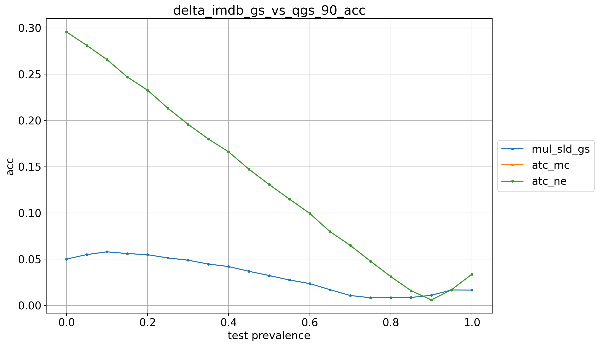
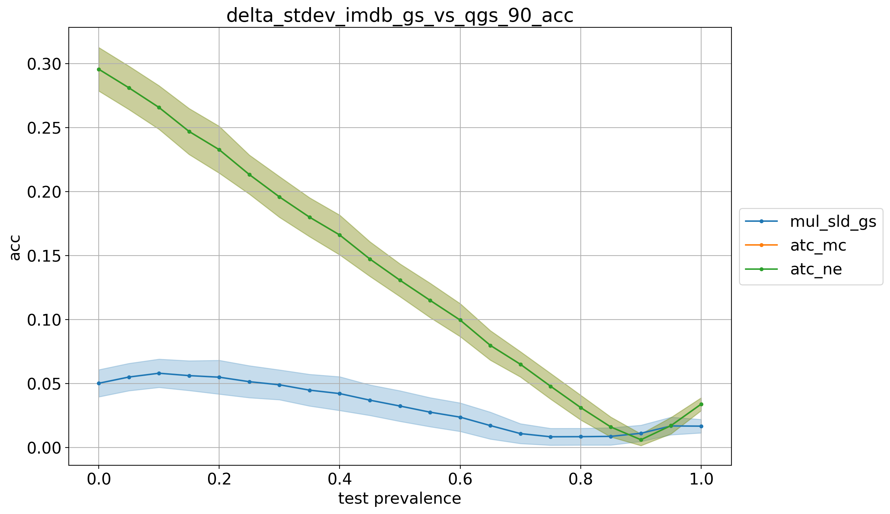
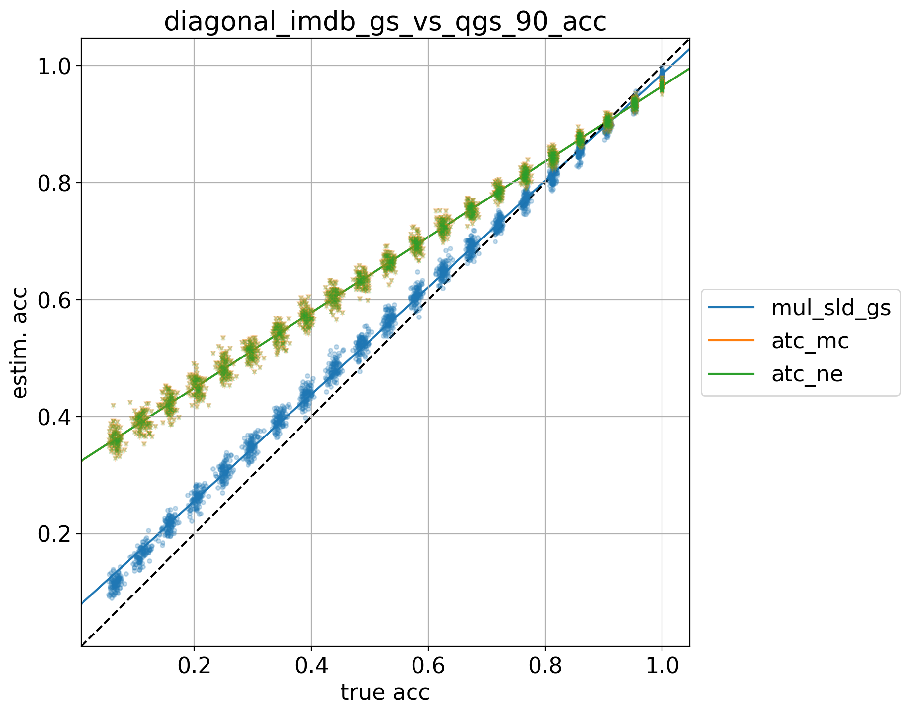
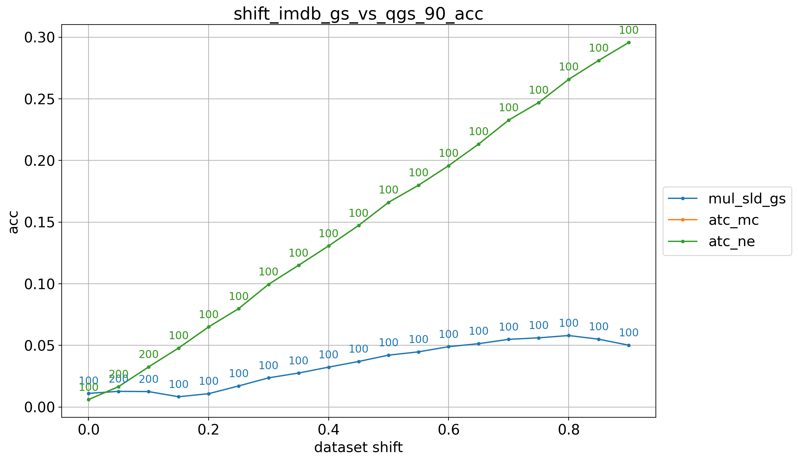

## avg
### avg on train
<table border="1" class="dataframe">
  <thead>
    <tr style="text-align: right;">
      <th></th>
      <th>bin_sld_gs</th>
      <th>mul_sld_gs</th>
      <th>bin_sld_gsq</th>
      <th>mul_sld_gsq</th>
      <th>atc_mc</th>
      <th>atc_ne</th>
    </tr>
  </thead>
  <tbody>
    <tr>
      <th>0.0</th>
      <td>0.0125</td>
      <td>0.0157</td>
      <td>0.0159</td>
      <td>0.0653</td>
      <td>0.0712</td>
      <td>0.0712</td>
    </tr>
    <tr>
      <th>0.05</th>
      <td>0.0188</td>
      <td>0.0163</td>
      <td>0.0243</td>
      <td>0.0644</td>
      <td>0.0635</td>
      <td>0.0635</td>
    </tr>
    <tr>
      <th>0.1</th>
      <td>0.0186</td>
      <td>0.0164</td>
      <td>0.0241</td>
      <td>0.0698</td>
      <td>0.0582</td>
      <td>0.0582</td>
    </tr>
    <tr>
      <th>0.15</th>
      <td>0.0194</td>
      <td>0.0164</td>
      <td>0.0254</td>
      <td>0.0738</td>
      <td>0.0541</td>
      <td>0.0541</td>
    </tr>
    <tr>
      <th>0.2</th>
      <td>0.0196</td>
      <td>0.0171</td>
      <td>0.0251</td>
      <td>0.0781</td>
      <td>0.0541</td>
      <td>0.0541</td>
    </tr>
    <tr>
      <th>0.25</th>
      <td>0.0194</td>
      <td>0.0177</td>
      <td>0.0258</td>
      <td>0.0815</td>
      <td>0.0523</td>
      <td>0.0523</td>
    </tr>
    <tr>
      <th>0.3</th>
      <td>0.0188</td>
      <td>0.0179</td>
      <td>0.0253</td>
      <td>0.0841</td>
      <td>0.0520</td>
      <td>0.0520</td>
    </tr>
    <tr>
      <th>0.35</th>
      <td>0.0206</td>
      <td>0.0194</td>
      <td>0.0293</td>
      <td>0.0869</td>
      <td>0.0529</td>
      <td>0.0529</td>
    </tr>
    <tr>
      <th>0.4</th>
      <td>0.0206</td>
      <td>0.0203</td>
      <td>0.0304</td>
      <td>0.0902</td>
      <td>0.0545</td>
      <td>0.0545</td>
    </tr>
    <tr>
      <th>0.45</th>
      <td>0.0197</td>
      <td>0.0201</td>
      <td>0.0298</td>
      <td>0.0918</td>
      <td>0.0543</td>
      <td>0.0543</td>
    </tr>
    <tr>
      <th>0.5</th>
      <td>0.0222</td>
      <td>0.0222</td>
      <td>0.0323</td>
      <td>0.0930</td>
      <td>0.0558</td>
      <td>0.0558</td>
    </tr>
    <tr>
      <th>0.55</th>
      <td>0.0203</td>
      <td>0.0212</td>
      <td>0.0322</td>
      <td>0.0951</td>
      <td>0.0568</td>
      <td>0.0568</td>
    </tr>
    <tr>
      <th>0.6</th>
      <td>0.0230</td>
      <td>0.0220</td>
      <td>0.0352</td>
      <td>0.0960</td>
      <td>0.0579</td>
      <td>0.0579</td>
    </tr>
    <tr>
      <th>0.65</th>
      <td>0.0217</td>
      <td>0.0221</td>
      <td>0.0353</td>
      <td>0.0961</td>
      <td>0.0579</td>
      <td>0.0579</td>
    </tr>
    <tr>
      <th>0.7</th>
      <td>0.0245</td>
      <td>0.0233</td>
      <td>0.0378</td>
      <td>0.0969</td>
      <td>0.0613</td>
      <td>0.0613</td>
    </tr>
    <tr>
      <th>0.75</th>
      <td>0.0254</td>
      <td>0.0233</td>
      <td>0.0395</td>
      <td>0.0964</td>
      <td>0.0623</td>
      <td>0.0623</td>
    </tr>
    <tr>
      <th>0.8</th>
      <td>0.0257</td>
      <td>0.0236</td>
      <td>0.0405</td>
      <td>0.0953</td>
      <td>0.0644</td>
      <td>0.0644</td>
    </tr>
    <tr>
      <th>0.85</th>
      <td>0.0292</td>
      <td>0.0246</td>
      <td>0.0438</td>
      <td>0.0944</td>
      <td>0.0672</td>
      <td>0.0672</td>
    </tr>
    <tr>
      <th>0.9</th>
      <td>0.0283</td>
      <td>0.0242</td>
      <td>0.0442</td>
      <td>0.0920</td>
      <td>0.0712</td>
      <td>0.0712</td>
    </tr>
    <tr>
      <th>0.95</th>
      <td>0.0324</td>
      <td>0.0269</td>
      <td>0.0475</td>
      <td>0.0912</td>
      <td>0.0796</td>
      <td>0.0796</td>
    </tr>
    <tr>
      <th>1.0</th>
      <td>0.0309</td>
      <td>0.0282</td>
      <td>0.0427</td>
      <td>0.0889</td>
      <td>0.0861</td>
      <td>0.0861</td>
    </tr>
    <tr>
      <th>avg</th>
      <td>0.0225</td>
      <td>0.0209</td>
      <td>0.0327</td>
      <td>0.0867</td>
      <td>0.0613</td>
      <td>0.0613</td>
    </tr>
  </tbody>
</table>

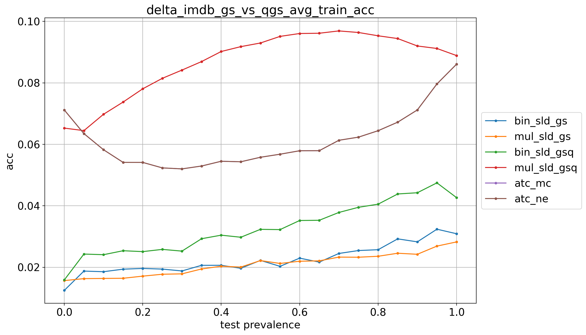
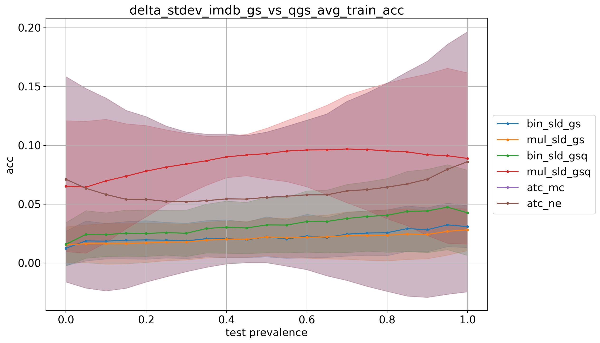
### avg on test
<table border="1" class="dataframe">
  <thead>
    <tr style="text-align: right;">
      <th></th>
      <th>bin_sld_gs</th>
      <th>mul_sld_gs</th>
      <th>bin_sld_gsq</th>
      <th>mul_sld_gsq</th>
      <th>atc_mc</th>
      <th>atc_ne</th>
    </tr>
  </thead>
  <tbody>
    <tr>
      <th>0.1</th>
      <td>NaN</td>
      <td>0.0418</td>
      <td>NaN</td>
      <td>0.1128</td>
      <td>0.1752</td>
      <td>0.1752</td>
    </tr>
    <tr>
      <th>0.2</th>
      <td>0.0151</td>
      <td>0.0116</td>
      <td>0.0279</td>
      <td>0.1049</td>
      <td>0.0687</td>
      <td>0.0687</td>
    </tr>
    <tr>
      <th>0.3</th>
      <td>0.0243</td>
      <td>0.0149</td>
      <td>0.0523</td>
      <td>0.0844</td>
      <td>0.0374</td>
      <td>0.0374</td>
    </tr>
    <tr>
      <th>0.4</th>
      <td>0.0252</td>
      <td>0.0244</td>
      <td>0.0629</td>
      <td>0.0909</td>
      <td>0.0167</td>
      <td>0.0167</td>
    </tr>
    <tr>
      <th>0.5</th>
      <td>0.0190</td>
      <td>0.0158</td>
      <td>0.0205</td>
      <td>0.0693</td>
      <td>0.0103</td>
      <td>0.0103</td>
    </tr>
    <tr>
      <th>0.6</th>
      <td>0.0241</td>
      <td>0.0231</td>
      <td>0.0198</td>
      <td>0.0658</td>
      <td>0.0187</td>
      <td>0.0187</td>
    </tr>
    <tr>
      <th>0.7</th>
      <td>0.0232</td>
      <td>0.0122</td>
      <td>0.0166</td>
      <td>0.0718</td>
      <td>0.0311</td>
      <td>0.0311</td>
    </tr>
    <tr>
      <th>0.8</th>
      <td>0.0262</td>
      <td>0.0119</td>
      <td>0.0287</td>
      <td>0.0940</td>
      <td>0.0572</td>
      <td>0.0572</td>
    </tr>
    <tr>
      <th>0.9</th>
      <td>NaN</td>
      <td>0.0324</td>
      <td>NaN</td>
      <td>NaN</td>
      <td>0.1365</td>
      <td>0.1365</td>
    </tr>
    <tr>
      <th>avg</th>
      <td>0.0225</td>
      <td>0.0209</td>
      <td>0.0327</td>
      <td>0.0867</td>
      <td>0.0613</td>
      <td>0.0613</td>
    </tr>
  </tbody>
</table>

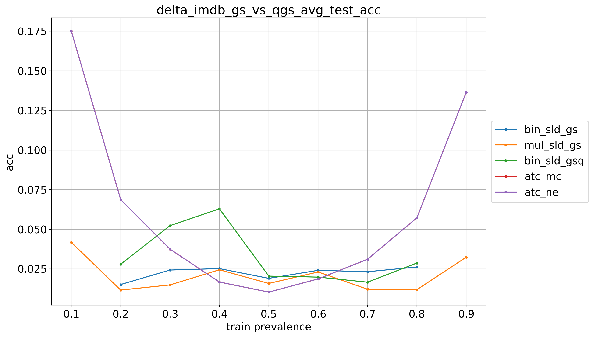
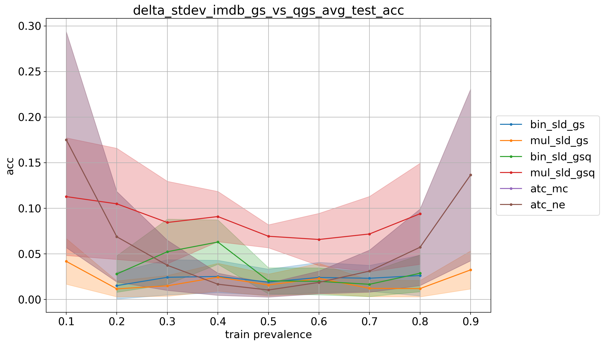
### avg dataset shift
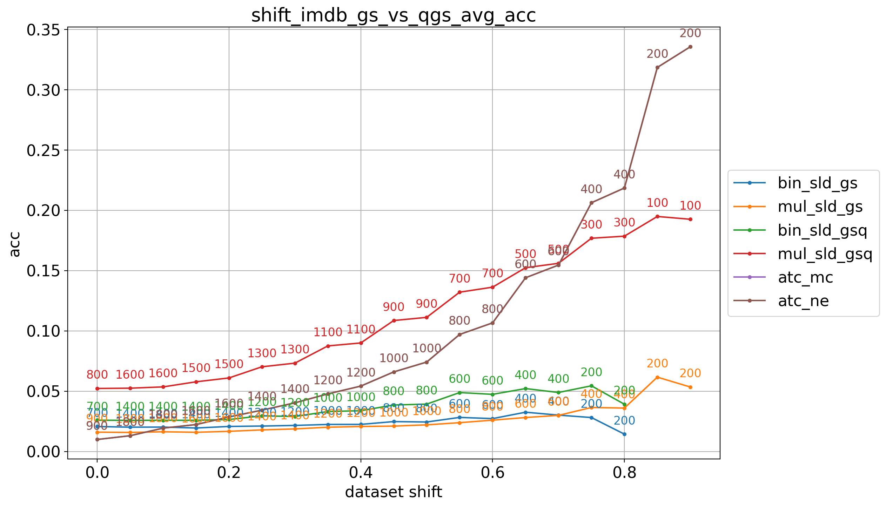
