# imdb_9prevs

## 10% positives
> train: [0.89991359 0.10008641]  
> validation: [0.9000576 0.0999424]  
> mul_sld_gs: 400.766s  
> mul_sld_gsq: 294.681s  
> ref: 11.412s  
> atc_mc: 14.822s  
> atc_ne: 14.836s  
> tot: 401.321s  

<table border="1" class="dataframe">
  <thead>
    <tr style="text-align: right;">
      <th></th>
      <th>mul_sld_gs</th>
      <th>mul_sld_gsq</th>
      <th>atc_mc</th>
      <th>atc_ne</th>
    </tr>
  </thead>
  <tbody>
    <tr>
      <th>0.0</th>
      <td>0.0000</td>
      <td>0.0047</td>
      <td>0.0000</td>
      <td>0.0000</td>
    </tr>
    <tr>
      <th>0.05</th>
      <td>0.0195</td>
      <td>0.0193</td>
      <td>0.0240</td>
      <td>0.0240</td>
    </tr>
    <tr>
      <th>0.1</th>
      <td>0.0200</td>
      <td>0.0200</td>
      <td>0.0244</td>
      <td>0.0244</td>
    </tr>
    <tr>
      <th>0.15</th>
      <td>0.0170</td>
      <td>0.0160</td>
      <td>0.0228</td>
      <td>0.0228</td>
    </tr>
    <tr>
      <th>0.2</th>
      <td>0.0203</td>
      <td>0.0193</td>
      <td>0.0245</td>
      <td>0.0245</td>
    </tr>
    <tr>
      <th>0.25</th>
      <td>0.0211</td>
      <td>0.0205</td>
      <td>0.0246</td>
      <td>0.0246</td>
    </tr>
    <tr>
      <th>0.3</th>
      <td>0.0217</td>
      <td>0.0210</td>
      <td>0.0266</td>
      <td>0.0266</td>
    </tr>
    <tr>
      <th>0.35</th>
      <td>0.0217</td>
      <td>0.0213</td>
      <td>0.0248</td>
      <td>0.0248</td>
    </tr>
    <tr>
      <th>0.4</th>
      <td>0.0188</td>
      <td>0.0184</td>
      <td>0.0230</td>
      <td>0.0230</td>
    </tr>
    <tr>
      <th>0.45</th>
      <td>0.0220</td>
      <td>0.0215</td>
      <td>0.0257</td>
      <td>0.0257</td>
    </tr>
    <tr>
      <th>0.5</th>
      <td>0.0224</td>
      <td>0.0218</td>
      <td>0.0264</td>
      <td>0.0264</td>
    </tr>
    <tr>
      <th>0.55</th>
      <td>0.0205</td>
      <td>0.0201</td>
      <td>0.0239</td>
      <td>0.0239</td>
    </tr>
    <tr>
      <th>0.6</th>
      <td>0.0211</td>
      <td>0.0208</td>
      <td>0.0248</td>
      <td>0.0248</td>
    </tr>
    <tr>
      <th>0.65</th>
      <td>0.0215</td>
      <td>0.0213</td>
      <td>0.0247</td>
      <td>0.0247</td>
    </tr>
    <tr>
      <th>0.7</th>
      <td>0.0212</td>
      <td>0.0208</td>
      <td>0.0239</td>
      <td>0.0239</td>
    </tr>
    <tr>
      <th>0.75</th>
      <td>0.0224</td>
      <td>0.0217</td>
      <td>0.0255</td>
      <td>0.0255</td>
    </tr>
    <tr>
      <th>0.8</th>
      <td>0.0207</td>
      <td>0.0201</td>
      <td>0.0242</td>
      <td>0.0242</td>
    </tr>
    <tr>
      <th>0.85</th>
      <td>0.0208</td>
      <td>0.0205</td>
      <td>0.0240</td>
      <td>0.0240</td>
    </tr>
    <tr>
      <th>0.9</th>
      <td>0.0223</td>
      <td>0.0220</td>
      <td>0.0256</td>
      <td>0.0256</td>
    </tr>
    <tr>
      <th>0.95</th>
      <td>0.0214</td>
      <td>0.0212</td>
      <td>0.0246</td>
      <td>0.0246</td>
    </tr>
    <tr>
      <th>1.0</th>
      <td>0.0217</td>
      <td>0.0212</td>
      <td>0.0246</td>
      <td>0.0246</td>
    </tr>
    <tr>
      <th>avg</th>
      <td>0.0199</td>
      <td>0.0197</td>
      <td>0.0234</td>
      <td>0.0234</td>
    </tr>
  </tbody>
</table>

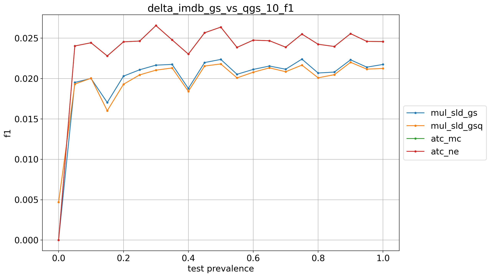
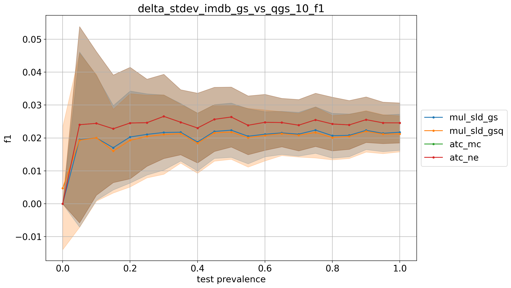
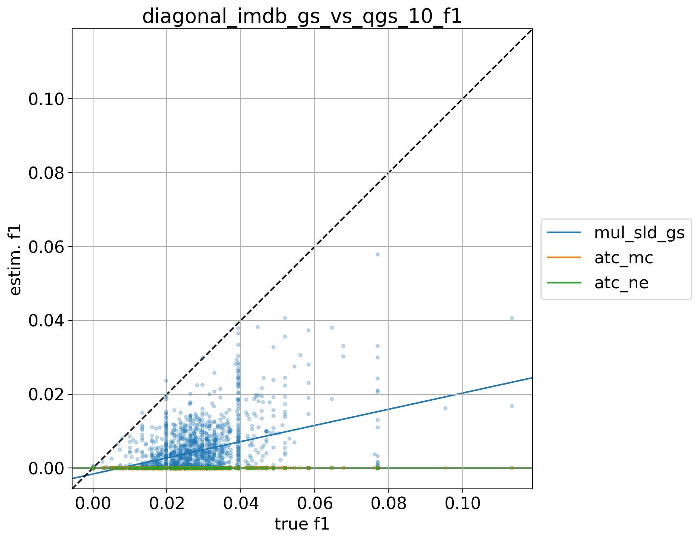
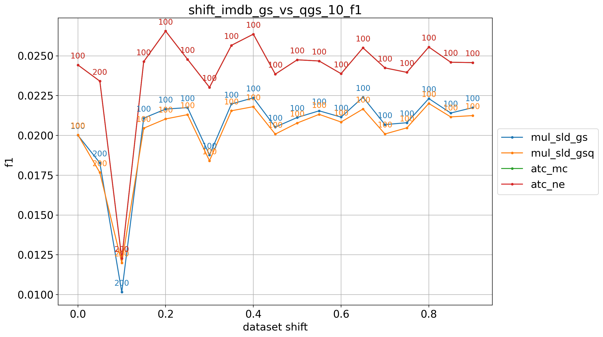

## 20% positives
> train: [0.7999712 0.2000288]  
> validation: [0.7999712 0.2000288]  
> bin_sld_gs: 921.600s  
> mul_sld_gs: 459.585s  
> bin_sld_gsq: 296.879s  
> mul_sld_gsq: 312.459s  
> ref: 11.167s  
> atc_mc: 14.448s  
> atc_ne: 14.863s  
> tot: 922.095s  

<table border="1" class="dataframe">
  <thead>
    <tr style="text-align: right;">
      <th></th>
      <th>bin_sld_gs</th>
      <th>mul_sld_gs</th>
      <th>bin_sld_gsq</th>
      <th>mul_sld_gsq</th>
      <th>atc_mc</th>
      <th>atc_ne</th>
    </tr>
  </thead>
  <tbody>
    <tr>
      <th>0.0</th>
      <td>0.1236</td>
      <td>0.1631</td>
      <td>0.2101</td>
      <td>0.2574</td>
      <td>0.0183</td>
      <td>0.0183</td>
    </tr>
    <tr>
      <th>0.05</th>
      <td>0.1279</td>
      <td>0.0831</td>
      <td>0.0961</td>
      <td>0.0610</td>
      <td>0.2921</td>
      <td>0.2921</td>
    </tr>
    <tr>
      <th>0.1</th>
      <td>0.0823</td>
      <td>0.0477</td>
      <td>0.0719</td>
      <td>0.0707</td>
      <td>0.2745</td>
      <td>0.2745</td>
    </tr>
    <tr>
      <th>0.15</th>
      <td>0.0690</td>
      <td>0.0361</td>
      <td>0.0616</td>
      <td>0.0832</td>
      <td>0.2661</td>
      <td>0.2661</td>
    </tr>
    <tr>
      <th>0.2</th>
      <td>0.0565</td>
      <td>0.0299</td>
      <td>0.0554</td>
      <td>0.0909</td>
      <td>0.2539</td>
      <td>0.2539</td>
    </tr>
    <tr>
      <th>0.25</th>
      <td>0.0369</td>
      <td>0.0276</td>
      <td>0.0447</td>
      <td>0.0955</td>
      <td>0.2445</td>
      <td>0.2445</td>
    </tr>
    <tr>
      <th>0.3</th>
      <td>0.0341</td>
      <td>0.0232</td>
      <td>0.0457</td>
      <td>0.0988</td>
      <td>0.2483</td>
      <td>0.2483</td>
    </tr>
    <tr>
      <th>0.35</th>
      <td>0.0362</td>
      <td>0.0209</td>
      <td>0.0517</td>
      <td>0.0980</td>
      <td>0.2419</td>
      <td>0.2419</td>
    </tr>
    <tr>
      <th>0.4</th>
      <td>0.0332</td>
      <td>0.0205</td>
      <td>0.0542</td>
      <td>0.0960</td>
      <td>0.2441</td>
      <td>0.2441</td>
    </tr>
    <tr>
      <th>0.45</th>
      <td>0.0299</td>
      <td>0.0155</td>
      <td>0.0470</td>
      <td>0.0992</td>
      <td>0.2362</td>
      <td>0.2362</td>
    </tr>
    <tr>
      <th>0.5</th>
      <td>0.0264</td>
      <td>0.0158</td>
      <td>0.0457</td>
      <td>0.0966</td>
      <td>0.2307</td>
      <td>0.2307</td>
    </tr>
    <tr>
      <th>0.55</th>
      <td>0.0259</td>
      <td>0.0161</td>
      <td>0.0496</td>
      <td>0.0948</td>
      <td>0.2358</td>
      <td>0.2358</td>
    </tr>
    <tr>
      <th>0.6</th>
      <td>0.0258</td>
      <td>0.0157</td>
      <td>0.0513</td>
      <td>0.0926</td>
      <td>0.2318</td>
      <td>0.2318</td>
    </tr>
    <tr>
      <th>0.65</th>
      <td>0.0235</td>
      <td>0.0150</td>
      <td>0.0468</td>
      <td>0.0911</td>
      <td>0.2306</td>
      <td>0.2306</td>
    </tr>
    <tr>
      <th>0.7</th>
      <td>0.0237</td>
      <td>0.0171</td>
      <td>0.0512</td>
      <td>0.0890</td>
      <td>0.2291</td>
      <td>0.2291</td>
    </tr>
    <tr>
      <th>0.75</th>
      <td>0.0210</td>
      <td>0.0146</td>
      <td>0.0485</td>
      <td>0.0876</td>
      <td>0.2291</td>
      <td>0.2291</td>
    </tr>
    <tr>
      <th>0.8</th>
      <td>0.0211</td>
      <td>0.0160</td>
      <td>0.0515</td>
      <td>0.0836</td>
      <td>0.2310</td>
      <td>0.2310</td>
    </tr>
    <tr>
      <th>0.85</th>
      <td>0.0244</td>
      <td>0.0178</td>
      <td>0.0531</td>
      <td>0.0801</td>
      <td>0.2303</td>
      <td>0.2303</td>
    </tr>
    <tr>
      <th>0.9</th>
      <td>0.0205</td>
      <td>0.0186</td>
      <td>0.0532</td>
      <td>0.0779</td>
      <td>0.2295</td>
      <td>0.2295</td>
    </tr>
    <tr>
      <th>0.95</th>
      <td>0.0241</td>
      <td>0.0184</td>
      <td>0.0543</td>
      <td>0.0766</td>
      <td>0.2301</td>
      <td>0.2301</td>
    </tr>
    <tr>
      <th>1.0</th>
      <td>0.0176</td>
      <td>0.0182</td>
      <td>0.0452</td>
      <td>0.0699</td>
      <td>0.2308</td>
      <td>0.2308</td>
    </tr>
    <tr>
      <th>avg</th>
      <td>0.0421</td>
      <td>0.0310</td>
      <td>0.0614</td>
      <td>0.0948</td>
      <td>0.2314</td>
      <td>0.2314</td>
    </tr>
  </tbody>
</table>

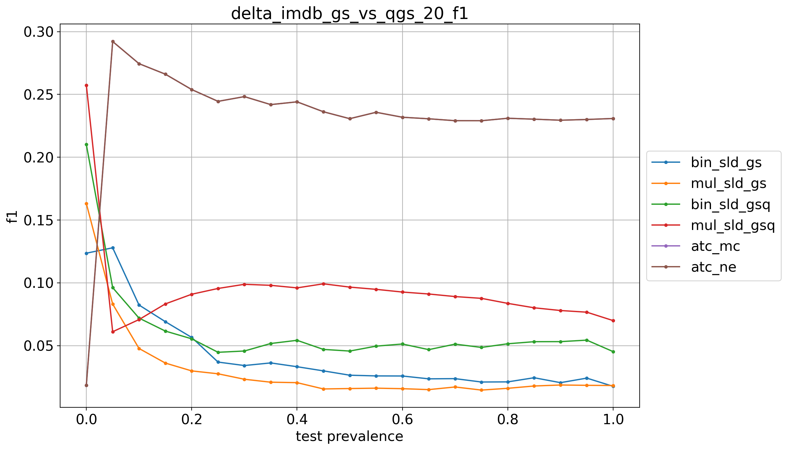
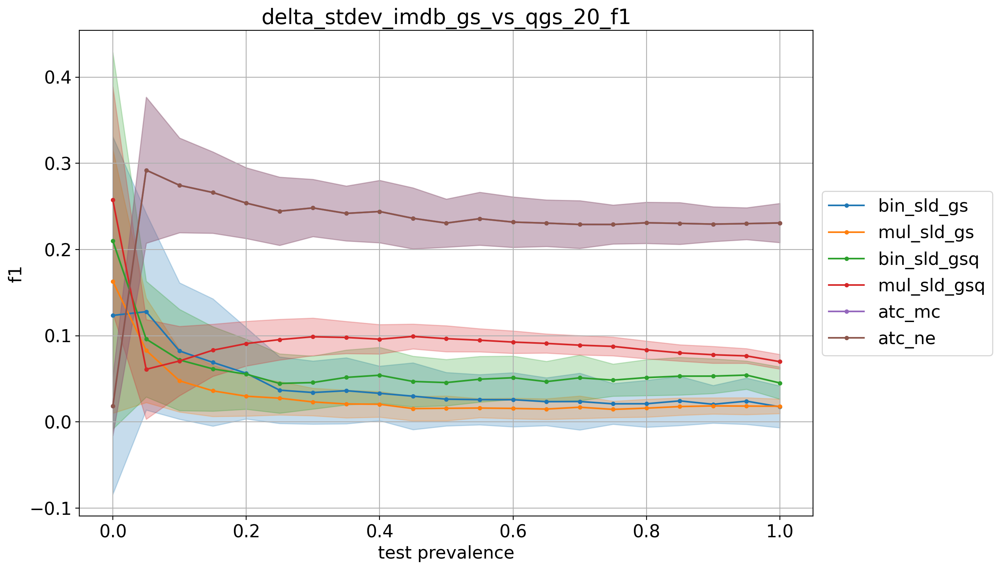
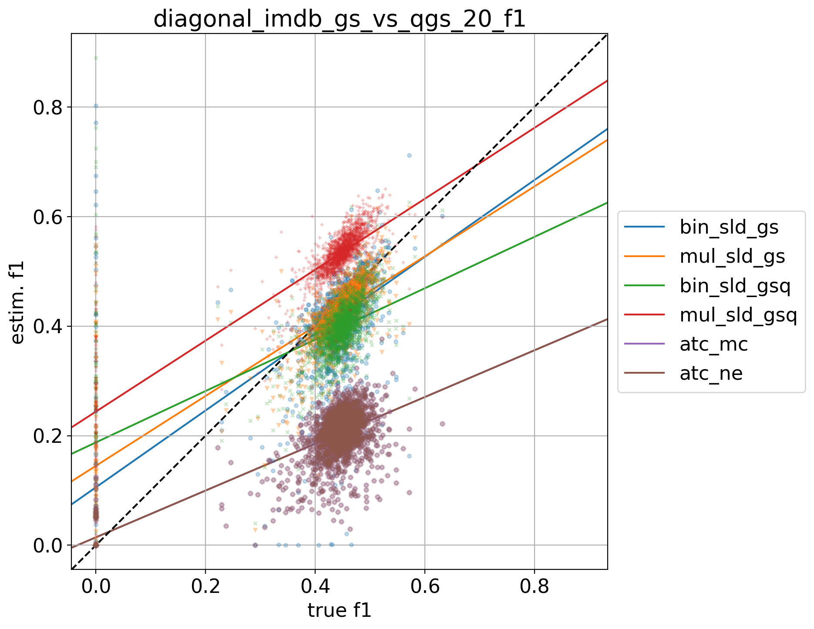
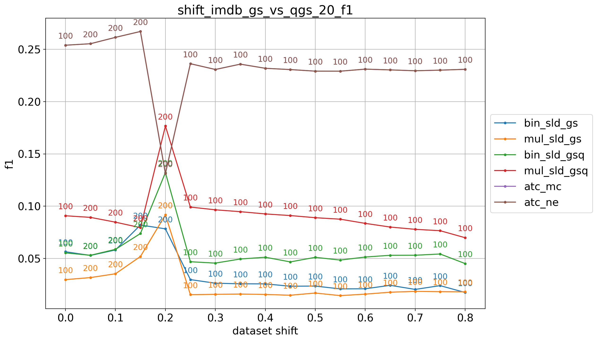

## 30% positives
> train: [0.7000288 0.2999712]  
> validation: [0.7000288 0.2999712]  
> bin_sld_gs: 898.905s  
> mul_sld_gs: 456.235s  
> bin_sld_gsq: 313.118s  
> mul_sld_gsq: 311.989s  
> ref: 11.583s  
> atc_mc: 14.859s  
> atc_ne: 15.309s  
> tot: 899.678s  

<table border="1" class="dataframe">
  <thead>
    <tr style="text-align: right;">
      <th></th>
      <th>bin_sld_gs</th>
      <th>mul_sld_gs</th>
      <th>bin_sld_gsq</th>
      <th>mul_sld_gsq</th>
      <th>atc_mc</th>
      <th>atc_ne</th>
    </tr>
  </thead>
  <tbody>
    <tr>
      <th>0.0</th>
      <td>0.1008</td>
      <td>0.1383</td>
      <td>0.1035</td>
      <td>0.6324</td>
      <td>0.2272</td>
      <td>0.2272</td>
    </tr>
    <tr>
      <th>0.05</th>
      <td>0.0884</td>
      <td>0.0792</td>
      <td>0.0960</td>
      <td>0.1656</td>
      <td>0.1227</td>
      <td>0.1227</td>
    </tr>
    <tr>
      <th>0.1</th>
      <td>0.0620</td>
      <td>0.0511</td>
      <td>0.0788</td>
      <td>0.1386</td>
      <td>0.1024</td>
      <td>0.1024</td>
    </tr>
    <tr>
      <th>0.15</th>
      <td>0.0489</td>
      <td>0.0384</td>
      <td>0.0783</td>
      <td>0.1263</td>
      <td>0.0885</td>
      <td>0.0885</td>
    </tr>
    <tr>
      <th>0.2</th>
      <td>0.0418</td>
      <td>0.0334</td>
      <td>0.0806</td>
      <td>0.1170</td>
      <td>0.0813</td>
      <td>0.0813</td>
    </tr>
    <tr>
      <th>0.25</th>
      <td>0.0463</td>
      <td>0.0359</td>
      <td>0.0850</td>
      <td>0.1098</td>
      <td>0.0713</td>
      <td>0.0713</td>
    </tr>
    <tr>
      <th>0.3</th>
      <td>0.0320</td>
      <td>0.0234</td>
      <td>0.0682</td>
      <td>0.1083</td>
      <td>0.0552</td>
      <td>0.0552</td>
    </tr>
    <tr>
      <th>0.35</th>
      <td>0.0402</td>
      <td>0.0253</td>
      <td>0.0863</td>
      <td>0.1062</td>
      <td>0.0572</td>
      <td>0.0572</td>
    </tr>
    <tr>
      <th>0.4</th>
      <td>0.0371</td>
      <td>0.0230</td>
      <td>0.0852</td>
      <td>0.1044</td>
      <td>0.0500</td>
      <td>0.0500</td>
    </tr>
    <tr>
      <th>0.45</th>
      <td>0.0336</td>
      <td>0.0201</td>
      <td>0.0824</td>
      <td>0.1048</td>
      <td>0.0469</td>
      <td>0.0469</td>
    </tr>
    <tr>
      <th>0.5</th>
      <td>0.0342</td>
      <td>0.0209</td>
      <td>0.0825</td>
      <td>0.1003</td>
      <td>0.0429</td>
      <td>0.0429</td>
    </tr>
    <tr>
      <th>0.55</th>
      <td>0.0338</td>
      <td>0.0172</td>
      <td>0.0850</td>
      <td>0.0997</td>
      <td>0.0411</td>
      <td>0.0411</td>
    </tr>
    <tr>
      <th>0.6</th>
      <td>0.0328</td>
      <td>0.0176</td>
      <td>0.0835</td>
      <td>0.0957</td>
      <td>0.0383</td>
      <td>0.0383</td>
    </tr>
    <tr>
      <th>0.65</th>
      <td>0.0338</td>
      <td>0.0183</td>
      <td>0.0846</td>
      <td>0.0934</td>
      <td>0.0383</td>
      <td>0.0383</td>
    </tr>
    <tr>
      <th>0.7</th>
      <td>0.0368</td>
      <td>0.0186</td>
      <td>0.0895</td>
      <td>0.0910</td>
      <td>0.0372</td>
      <td>0.0372</td>
    </tr>
    <tr>
      <th>0.75</th>
      <td>0.0353</td>
      <td>0.0182</td>
      <td>0.0867</td>
      <td>0.0885</td>
      <td>0.0335</td>
      <td>0.0335</td>
    </tr>
    <tr>
      <th>0.8</th>
      <td>0.0356</td>
      <td>0.0189</td>
      <td>0.0875</td>
      <td>0.0858</td>
      <td>0.0340</td>
      <td>0.0340</td>
    </tr>
    <tr>
      <th>0.85</th>
      <td>0.0372</td>
      <td>0.0196</td>
      <td>0.0896</td>
      <td>0.0832</td>
      <td>0.0327</td>
      <td>0.0327</td>
    </tr>
    <tr>
      <th>0.9</th>
      <td>0.0377</td>
      <td>0.0208</td>
      <td>0.0903</td>
      <td>0.0796</td>
      <td>0.0326</td>
      <td>0.0326</td>
    </tr>
    <tr>
      <th>0.95</th>
      <td>0.0365</td>
      <td>0.0207</td>
      <td>0.0881</td>
      <td>0.0770</td>
      <td>0.0284</td>
      <td>0.0284</td>
    </tr>
    <tr>
      <th>1.0</th>
      <td>0.0343</td>
      <td>0.0254</td>
      <td>0.0849</td>
      <td>0.0703</td>
      <td>0.0295</td>
      <td>0.0295</td>
    </tr>
    <tr>
      <th>avg</th>
      <td>0.0438</td>
      <td>0.0326</td>
      <td>0.0856</td>
      <td>0.1275</td>
      <td>0.0615</td>
      <td>0.0615</td>
    </tr>
  </tbody>
</table>

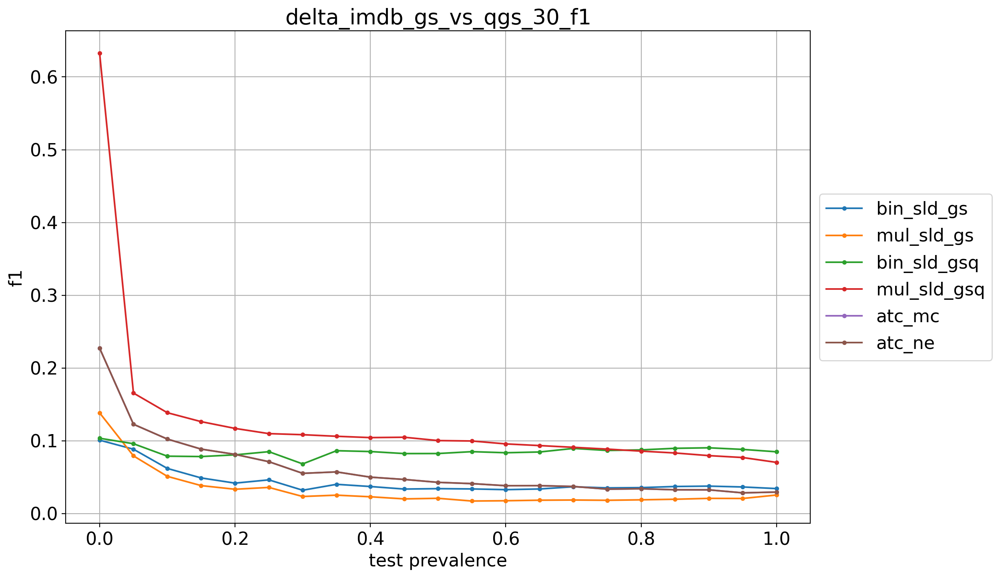
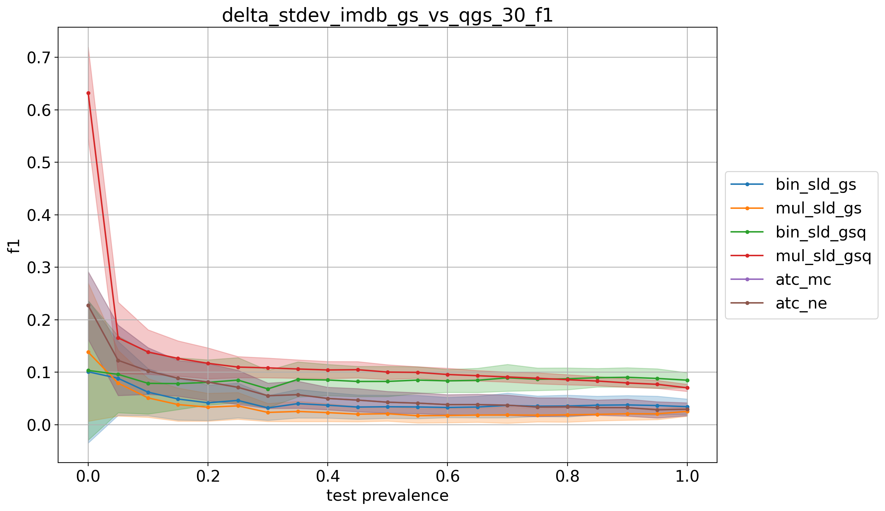
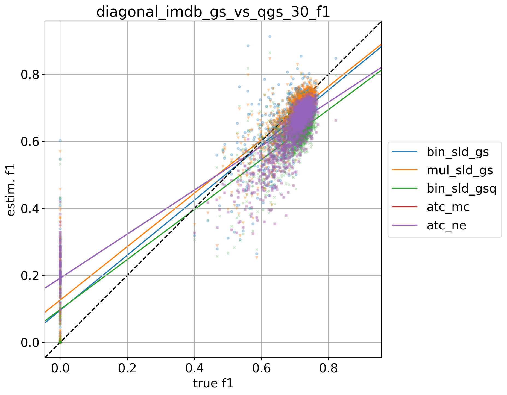
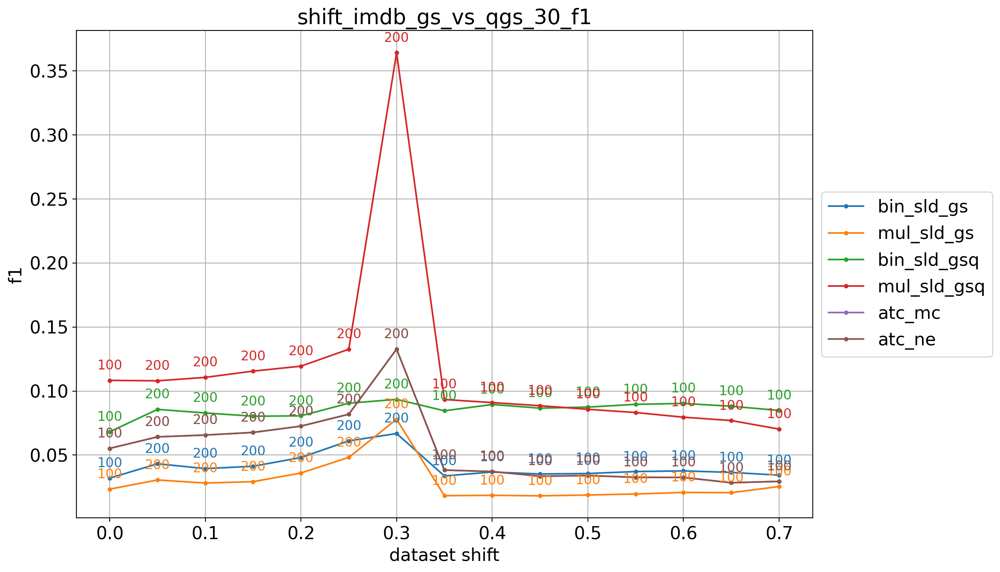

## 40% positives
> train: [0.5999424 0.4000576]  
> validation: [0.60008641 0.39991359]  
> bin_sld_gs: 915.491s  
> mul_sld_gs: 447.110s  
> bin_sld_gsq: 315.586s  
> mul_sld_gsq: 313.380s  
> ref: 11.060s  
> atc_mc: 14.959s  
> atc_ne: 14.880s  
> tot: 916.119s  

<table border="1" class="dataframe">
  <thead>
    <tr style="text-align: right;">
      <th></th>
      <th>bin_sld_gs</th>
      <th>mul_sld_gs</th>
      <th>bin_sld_gsq</th>
      <th>mul_sld_gsq</th>
      <th>atc_mc</th>
      <th>atc_ne</th>
    </tr>
  </thead>
  <tbody>
    <tr>
      <th>0.0</th>
      <td>0.1047</td>
      <td>0.1559</td>
      <td>0.0566</td>
      <td>0.7821</td>
      <td>0.4335</td>
      <td>0.4335</td>
    </tr>
    <tr>
      <th>0.05</th>
      <td>0.0657</td>
      <td>0.0586</td>
      <td>0.1356</td>
      <td>0.3518</td>
      <td>0.0606</td>
      <td>0.0606</td>
    </tr>
    <tr>
      <th>0.1</th>
      <td>0.0502</td>
      <td>0.0510</td>
      <td>0.1254</td>
      <td>0.2533</td>
      <td>0.0339</td>
      <td>0.0339</td>
    </tr>
    <tr>
      <th>0.15</th>
      <td>0.0460</td>
      <td>0.0498</td>
      <td>0.1211</td>
      <td>0.1984</td>
      <td>0.0263</td>
      <td>0.0263</td>
    </tr>
    <tr>
      <th>0.2</th>
      <td>0.0398</td>
      <td>0.0427</td>
      <td>0.1064</td>
      <td>0.1697</td>
      <td>0.0248</td>
      <td>0.0248</td>
    </tr>
    <tr>
      <th>0.25</th>
      <td>0.0327</td>
      <td>0.0395</td>
      <td>0.0979</td>
      <td>0.1501</td>
      <td>0.0213</td>
      <td>0.0213</td>
    </tr>
    <tr>
      <th>0.3</th>
      <td>0.0313</td>
      <td>0.0351</td>
      <td>0.0864</td>
      <td>0.1376</td>
      <td>0.0219</td>
      <td>0.0219</td>
    </tr>
    <tr>
      <th>0.35</th>
      <td>0.0345</td>
      <td>0.0378</td>
      <td>0.0899</td>
      <td>0.1239</td>
      <td>0.0195</td>
      <td>0.0195</td>
    </tr>
    <tr>
      <th>0.4</th>
      <td>0.0321</td>
      <td>0.0355</td>
      <td>0.0846</td>
      <td>0.1206</td>
      <td>0.0164</td>
      <td>0.0164</td>
    </tr>
    <tr>
      <th>0.45</th>
      <td>0.0304</td>
      <td>0.0323</td>
      <td>0.0792</td>
      <td>0.1107</td>
      <td>0.0191</td>
      <td>0.0191</td>
    </tr>
    <tr>
      <th>0.5</th>
      <td>0.0321</td>
      <td>0.0336</td>
      <td>0.0787</td>
      <td>0.1022</td>
      <td>0.0164</td>
      <td>0.0164</td>
    </tr>
    <tr>
      <th>0.55</th>
      <td>0.0270</td>
      <td>0.0274</td>
      <td>0.0716</td>
      <td>0.0997</td>
      <td>0.0133</td>
      <td>0.0133</td>
    </tr>
    <tr>
      <th>0.6</th>
      <td>0.0299</td>
      <td>0.0292</td>
      <td>0.0727</td>
      <td>0.0949</td>
      <td>0.0131</td>
      <td>0.0131</td>
    </tr>
    <tr>
      <th>0.65</th>
      <td>0.0280</td>
      <td>0.0276</td>
      <td>0.0693</td>
      <td>0.0906</td>
      <td>0.0124</td>
      <td>0.0124</td>
    </tr>
    <tr>
      <th>0.7</th>
      <td>0.0276</td>
      <td>0.0258</td>
      <td>0.0676</td>
      <td>0.0879</td>
      <td>0.0116</td>
      <td>0.0116</td>
    </tr>
    <tr>
      <th>0.75</th>
      <td>0.0282</td>
      <td>0.0262</td>
      <td>0.0670</td>
      <td>0.0826</td>
      <td>0.0104</td>
      <td>0.0104</td>
    </tr>
    <tr>
      <th>0.8</th>
      <td>0.0258</td>
      <td>0.0241</td>
      <td>0.0633</td>
      <td>0.0784</td>
      <td>0.0107</td>
      <td>0.0107</td>
    </tr>
    <tr>
      <th>0.85</th>
      <td>0.0279</td>
      <td>0.0253</td>
      <td>0.0641</td>
      <td>0.0742</td>
      <td>0.0084</td>
      <td>0.0084</td>
    </tr>
    <tr>
      <th>0.9</th>
      <td>0.0247</td>
      <td>0.0225</td>
      <td>0.0594</td>
      <td>0.0704</td>
      <td>0.0080</td>
      <td>0.0080</td>
    </tr>
    <tr>
      <th>0.95</th>
      <td>0.0260</td>
      <td>0.0228</td>
      <td>0.0602</td>
      <td>0.0673</td>
      <td>0.0082</td>
      <td>0.0082</td>
    </tr>
    <tr>
      <th>1.0</th>
      <td>0.0235</td>
      <td>0.0260</td>
      <td>0.0594</td>
      <td>0.0611</td>
      <td>0.0072</td>
      <td>0.0072</td>
    </tr>
    <tr>
      <th>avg</th>
      <td>0.0366</td>
      <td>0.0395</td>
      <td>0.0817</td>
      <td>0.1575</td>
      <td>0.0380</td>
      <td>0.0380</td>
    </tr>
  </tbody>
</table>

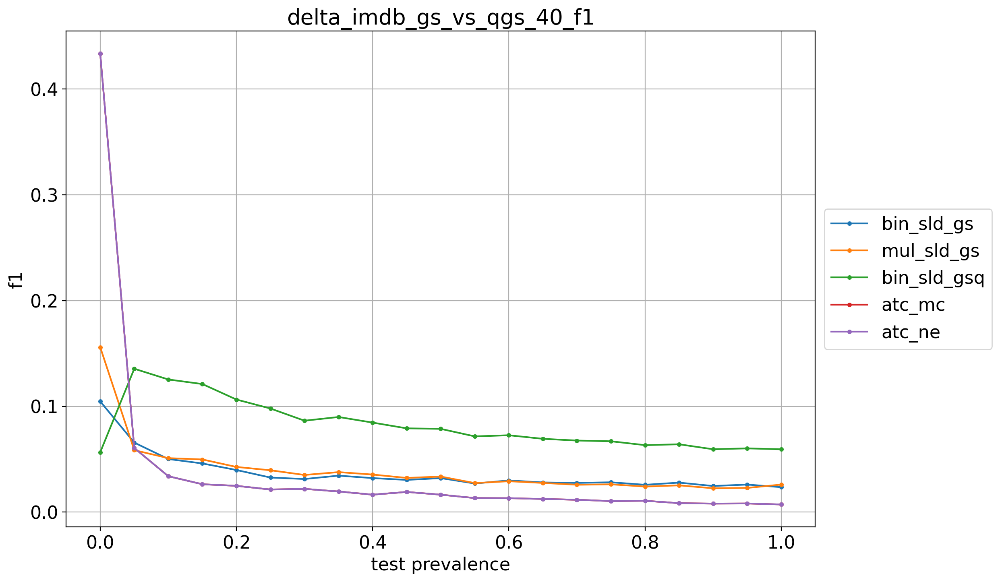
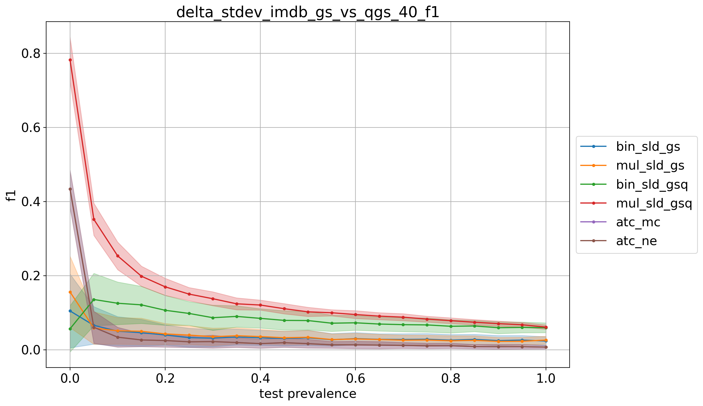
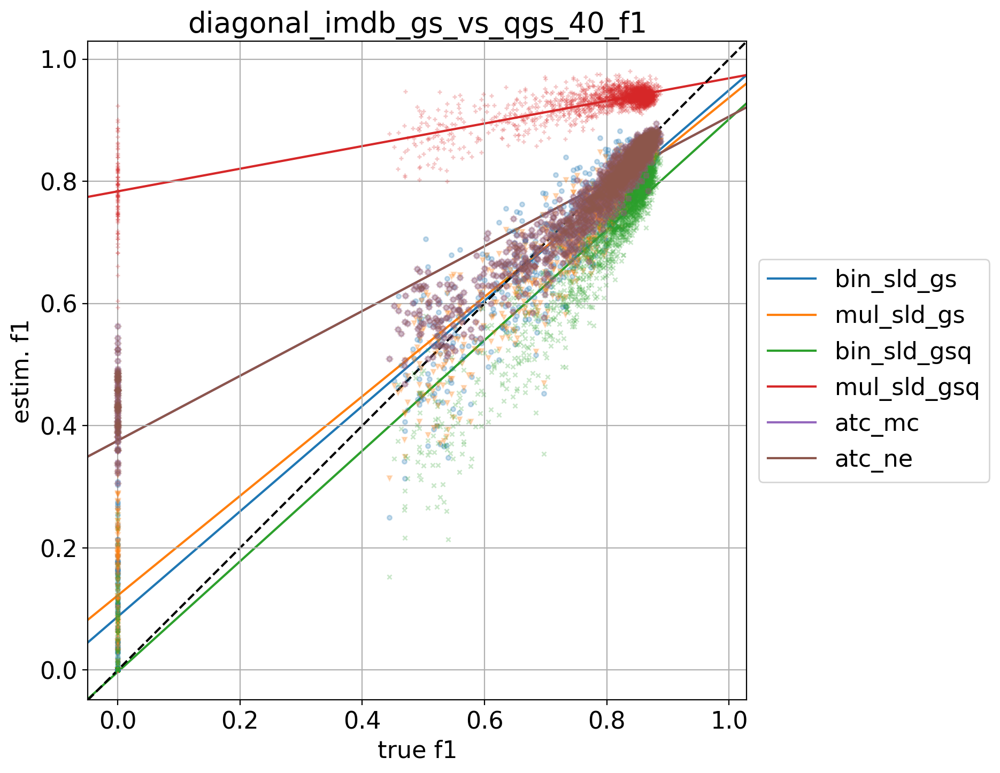
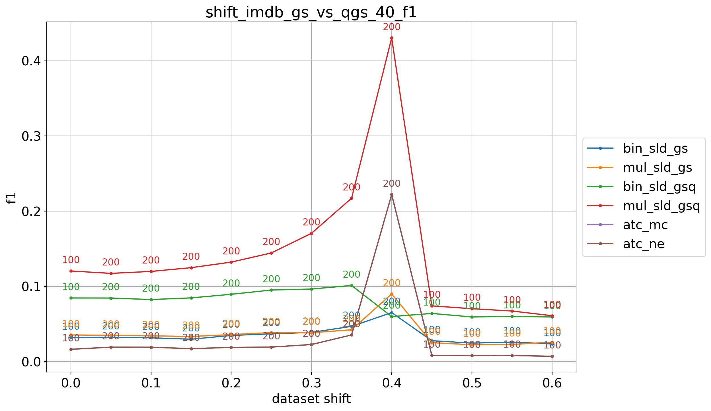

## 50% positives
> train: [0.5 0.5]  
> validation: [0.5 0.5]  
> bin_sld_gs: 898.790s  
> mul_sld_gs: 463.224s  
> bin_sld_gsq: 314.307s  
> mul_sld_gsq: 322.103s  
> ref: 10.921s  
> atc_mc: 14.924s  
> atc_ne: 14.924s  
> tot: 899.292s  

<table border="1" class="dataframe">
  <thead>
    <tr style="text-align: right;">
      <th></th>
      <th>bin_sld_gs</th>
      <th>mul_sld_gs</th>
      <th>bin_sld_gsq</th>
      <th>mul_sld_gsq</th>
      <th>atc_mc</th>
      <th>atc_ne</th>
    </tr>
  </thead>
  <tbody>
    <tr>
      <th>0.0</th>
      <td>0.0358</td>
      <td>0.1582</td>
      <td>0.0291</td>
      <td>0.6264</td>
      <td>0.5313</td>
      <td>0.5313</td>
    </tr>
    <tr>
      <th>0.05</th>
      <td>0.0482</td>
      <td>0.0654</td>
      <td>0.0509</td>
      <td>0.3637</td>
      <td>0.2320</td>
      <td>0.2320</td>
    </tr>
    <tr>
      <th>0.1</th>
      <td>0.0442</td>
      <td>0.0383</td>
      <td>0.0474</td>
      <td>0.2607</td>
      <td>0.1230</td>
      <td>0.1230</td>
    </tr>
    <tr>
      <th>0.15</th>
      <td>0.0393</td>
      <td>0.0284</td>
      <td>0.0422</td>
      <td>0.1997</td>
      <td>0.0683</td>
      <td>0.0683</td>
    </tr>
    <tr>
      <th>0.2</th>
      <td>0.0320</td>
      <td>0.0227</td>
      <td>0.0335</td>
      <td>0.1627</td>
      <td>0.0417</td>
      <td>0.0417</td>
    </tr>
    <tr>
      <th>0.25</th>
      <td>0.0295</td>
      <td>0.0194</td>
      <td>0.0331</td>
      <td>0.1338</td>
      <td>0.0278</td>
      <td>0.0278</td>
    </tr>
    <tr>
      <th>0.3</th>
      <td>0.0259</td>
      <td>0.0189</td>
      <td>0.0293</td>
      <td>0.1147</td>
      <td>0.0169</td>
      <td>0.0169</td>
    </tr>
    <tr>
      <th>0.35</th>
      <td>0.0287</td>
      <td>0.0180</td>
      <td>0.0310</td>
      <td>0.1002</td>
      <td>0.0129</td>
      <td>0.0129</td>
    </tr>
    <tr>
      <th>0.4</th>
      <td>0.0249</td>
      <td>0.0159</td>
      <td>0.0251</td>
      <td>0.0923</td>
      <td>0.0113</td>
      <td>0.0113</td>
    </tr>
    <tr>
      <th>0.45</th>
      <td>0.0223</td>
      <td>0.0151</td>
      <td>0.0233</td>
      <td>0.0806</td>
      <td>0.0107</td>
      <td>0.0107</td>
    </tr>
    <tr>
      <th>0.5</th>
      <td>0.0249</td>
      <td>0.0183</td>
      <td>0.0244</td>
      <td>0.0721</td>
      <td>0.0121</td>
      <td>0.0121</td>
    </tr>
    <tr>
      <th>0.55</th>
      <td>0.0201</td>
      <td>0.0170</td>
      <td>0.0207</td>
      <td>0.0675</td>
      <td>0.0109</td>
      <td>0.0109</td>
    </tr>
    <tr>
      <th>0.6</th>
      <td>0.0199</td>
      <td>0.0165</td>
      <td>0.0213</td>
      <td>0.0611</td>
      <td>0.0105</td>
      <td>0.0105</td>
    </tr>
    <tr>
      <th>0.65</th>
      <td>0.0171</td>
      <td>0.0147</td>
      <td>0.0185</td>
      <td>0.0555</td>
      <td>0.0105</td>
      <td>0.0105</td>
    </tr>
    <tr>
      <th>0.7</th>
      <td>0.0182</td>
      <td>0.0157</td>
      <td>0.0180</td>
      <td>0.0520</td>
      <td>0.0106</td>
      <td>0.0106</td>
    </tr>
    <tr>
      <th>0.75</th>
      <td>0.0175</td>
      <td>0.0161</td>
      <td>0.0193</td>
      <td>0.0465</td>
      <td>0.0107</td>
      <td>0.0107</td>
    </tr>
    <tr>
      <th>0.8</th>
      <td>0.0156</td>
      <td>0.0144</td>
      <td>0.0165</td>
      <td>0.0429</td>
      <td>0.0105</td>
      <td>0.0105</td>
    </tr>
    <tr>
      <th>0.85</th>
      <td>0.0168</td>
      <td>0.0149</td>
      <td>0.0170</td>
      <td>0.0395</td>
      <td>0.0100</td>
      <td>0.0100</td>
    </tr>
    <tr>
      <th>0.9</th>
      <td>0.0137</td>
      <td>0.0138</td>
      <td>0.0158</td>
      <td>0.0349</td>
      <td>0.0111</td>
      <td>0.0111</td>
    </tr>
    <tr>
      <th>0.95</th>
      <td>0.0154</td>
      <td>0.0155</td>
      <td>0.0173</td>
      <td>0.0312</td>
      <td>0.0114</td>
      <td>0.0114</td>
    </tr>
    <tr>
      <th>1.0</th>
      <td>0.0155</td>
      <td>0.0173</td>
      <td>0.0167</td>
      <td>0.0249</td>
      <td>0.0102</td>
      <td>0.0102</td>
    </tr>
    <tr>
      <th>avg</th>
      <td>0.0250</td>
      <td>0.0274</td>
      <td>0.0262</td>
      <td>0.1268</td>
      <td>0.0569</td>
      <td>0.0569</td>
    </tr>
  </tbody>
</table>

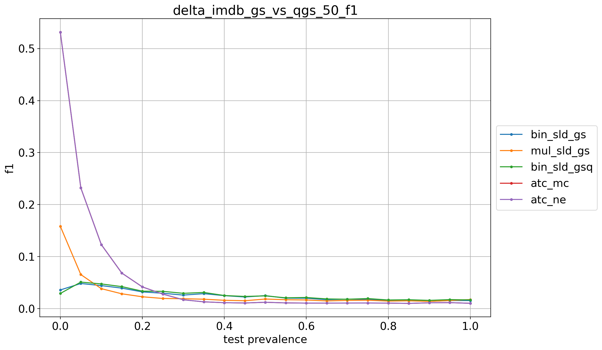
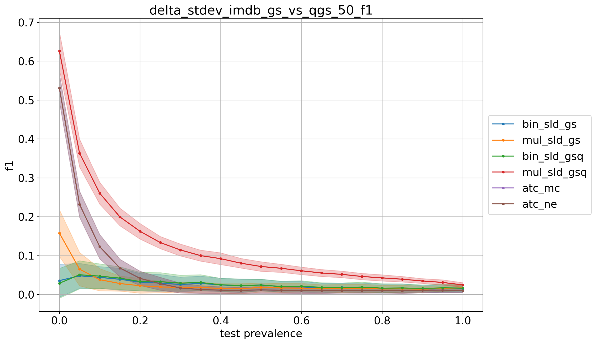
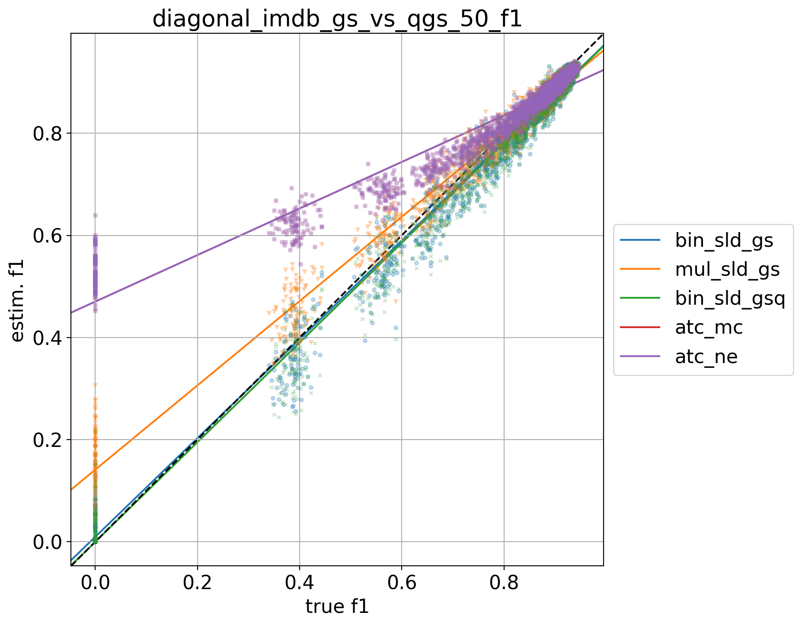
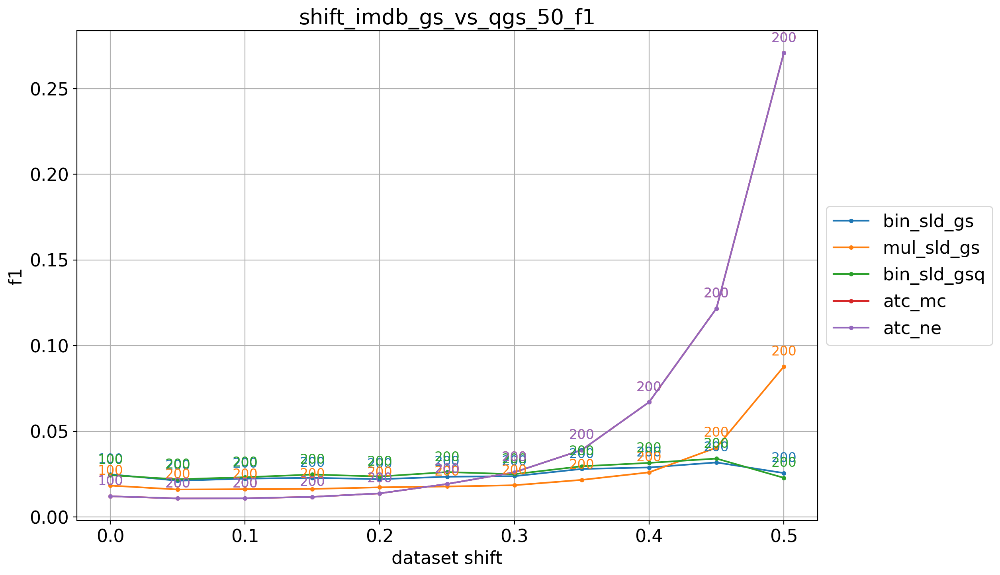

## 60% positives
> train: [0.39991359 0.60008641]  
> validation: [0.4000576 0.5999424]  
> bin_sld_gs: 940.163s  
> mul_sld_gs: 460.634s  
> bin_sld_gsq: 323.142s  
> mul_sld_gsq: 325.230s  
> ref: 11.981s  
> atc_mc: 15.716s  
> atc_ne: 15.951s  
> tot: 940.602s  

<table border="1" class="dataframe">
  <thead>
    <tr style="text-align: right;">
      <th></th>
      <th>bin_sld_gs</th>
      <th>mul_sld_gs</th>
      <th>bin_sld_gsq</th>
      <th>mul_sld_gsq</th>
      <th>atc_mc</th>
      <th>atc_ne</th>
    </tr>
  </thead>
  <tbody>
    <tr>
      <th>0.0</th>
      <td>0.0035</td>
      <td>0.0528</td>
      <td>0.0004</td>
      <td>0.5522</td>
      <td>0.5686</td>
      <td>0.5686</td>
    </tr>
    <tr>
      <th>0.05</th>
      <td>0.0714</td>
      <td>0.0314</td>
      <td>0.1475</td>
      <td>0.3770</td>
      <td>0.3422</td>
      <td>0.3422</td>
    </tr>
    <tr>
      <th>0.1</th>
      <td>0.0638</td>
      <td>0.0266</td>
      <td>0.1077</td>
      <td>0.2813</td>
      <td>0.2281</td>
      <td>0.2281</td>
    </tr>
    <tr>
      <th>0.15</th>
      <td>0.0607</td>
      <td>0.0253</td>
      <td>0.0868</td>
      <td>0.2199</td>
      <td>0.1475</td>
      <td>0.1475</td>
    </tr>
    <tr>
      <th>0.2</th>
      <td>0.0488</td>
      <td>0.0257</td>
      <td>0.0626</td>
      <td>0.1793</td>
      <td>0.1066</td>
      <td>0.1066</td>
    </tr>
    <tr>
      <th>0.25</th>
      <td>0.0431</td>
      <td>0.0235</td>
      <td>0.0492</td>
      <td>0.1497</td>
      <td>0.0747</td>
      <td>0.0747</td>
    </tr>
    <tr>
      <th>0.3</th>
      <td>0.0358</td>
      <td>0.0238</td>
      <td>0.0364</td>
      <td>0.1222</td>
      <td>0.0515</td>
      <td>0.0515</td>
    </tr>
    <tr>
      <th>0.35</th>
      <td>0.0391</td>
      <td>0.0282</td>
      <td>0.0373</td>
      <td>0.1035</td>
      <td>0.0344</td>
      <td>0.0344</td>
    </tr>
    <tr>
      <th>0.4</th>
      <td>0.0357</td>
      <td>0.0278</td>
      <td>0.0313</td>
      <td>0.0892</td>
      <td>0.0235</td>
      <td>0.0235</td>
    </tr>
    <tr>
      <th>0.45</th>
      <td>0.0291</td>
      <td>0.0243</td>
      <td>0.0242</td>
      <td>0.0751</td>
      <td>0.0169</td>
      <td>0.0169</td>
    </tr>
    <tr>
      <th>0.5</th>
      <td>0.0315</td>
      <td>0.0273</td>
      <td>0.0246</td>
      <td>0.0638</td>
      <td>0.0121</td>
      <td>0.0121</td>
    </tr>
    <tr>
      <th>0.55</th>
      <td>0.0266</td>
      <td>0.0244</td>
      <td>0.0189</td>
      <td>0.0566</td>
      <td>0.0087</td>
      <td>0.0087</td>
    </tr>
    <tr>
      <th>0.6</th>
      <td>0.0268</td>
      <td>0.0248</td>
      <td>0.0183</td>
      <td>0.0493</td>
      <td>0.0082</td>
      <td>0.0082</td>
    </tr>
    <tr>
      <th>0.65</th>
      <td>0.0226</td>
      <td>0.0227</td>
      <td>0.0154</td>
      <td>0.0415</td>
      <td>0.0093</td>
      <td>0.0093</td>
    </tr>
    <tr>
      <th>0.7</th>
      <td>0.0253</td>
      <td>0.0258</td>
      <td>0.0145</td>
      <td>0.0341</td>
      <td>0.0122</td>
      <td>0.0122</td>
    </tr>
    <tr>
      <th>0.75</th>
      <td>0.0228</td>
      <td>0.0241</td>
      <td>0.0129</td>
      <td>0.0294</td>
      <td>0.0135</td>
      <td>0.0135</td>
    </tr>
    <tr>
      <th>0.8</th>
      <td>0.0194</td>
      <td>0.0217</td>
      <td>0.0113</td>
      <td>0.0240</td>
      <td>0.0156</td>
      <td>0.0156</td>
    </tr>
    <tr>
      <th>0.85</th>
      <td>0.0184</td>
      <td>0.0214</td>
      <td>0.0092</td>
      <td>0.0205</td>
      <td>0.0152</td>
      <td>0.0152</td>
    </tr>
    <tr>
      <th>0.9</th>
      <td>0.0168</td>
      <td>0.0203</td>
      <td>0.0082</td>
      <td>0.0152</td>
      <td>0.0178</td>
      <td>0.0178</td>
    </tr>
    <tr>
      <th>0.95</th>
      <td>0.0181</td>
      <td>0.0220</td>
      <td>0.0071</td>
      <td>0.0096</td>
      <td>0.0189</td>
      <td>0.0189</td>
    </tr>
    <tr>
      <th>1.0</th>
      <td>0.0154</td>
      <td>0.0214</td>
      <td>0.0046</td>
      <td>0.0060</td>
      <td>0.0197</td>
      <td>0.0197</td>
    </tr>
    <tr>
      <th>avg</th>
      <td>0.0321</td>
      <td>0.0260</td>
      <td>0.0347</td>
      <td>0.1190</td>
      <td>0.0831</td>
      <td>0.0831</td>
    </tr>
  </tbody>
</table>

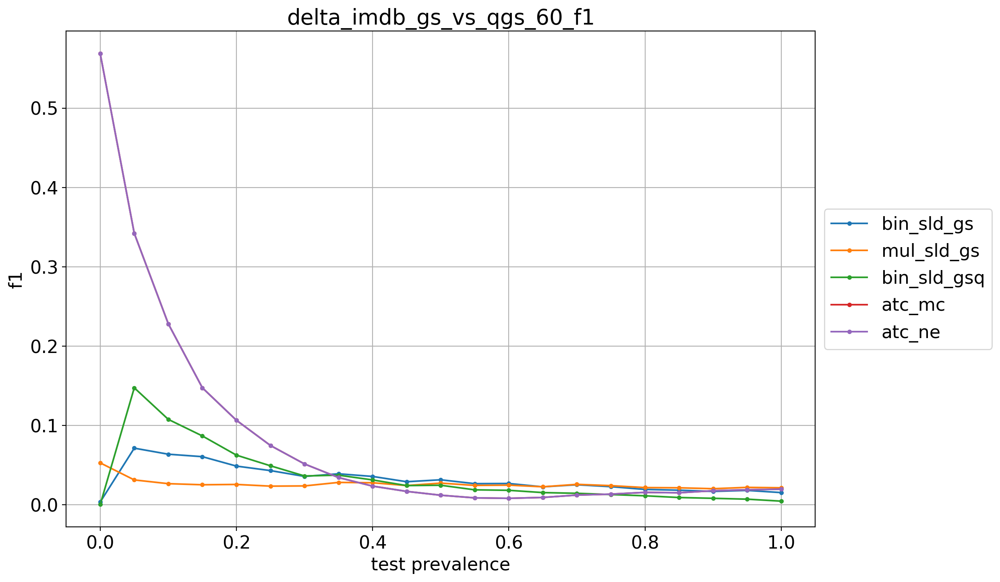
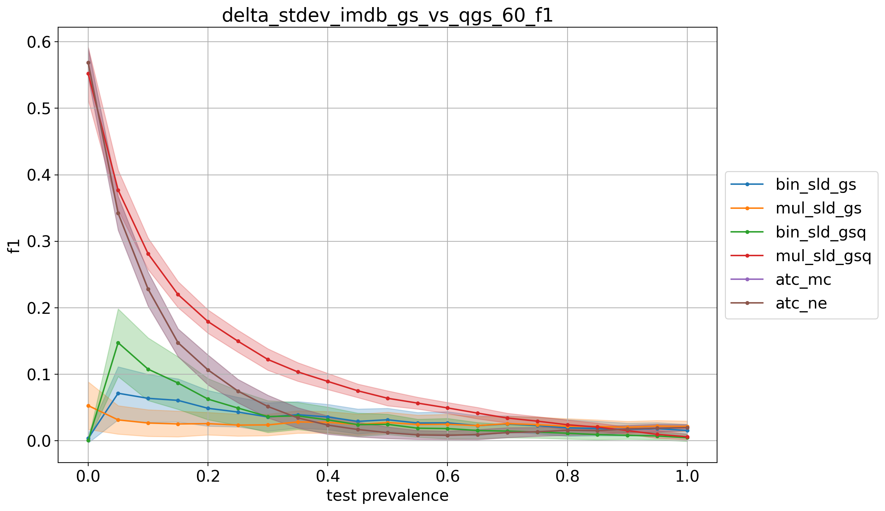
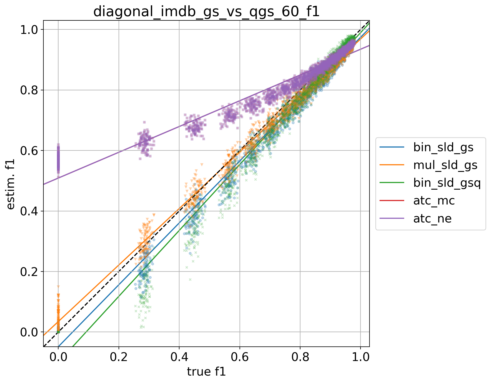
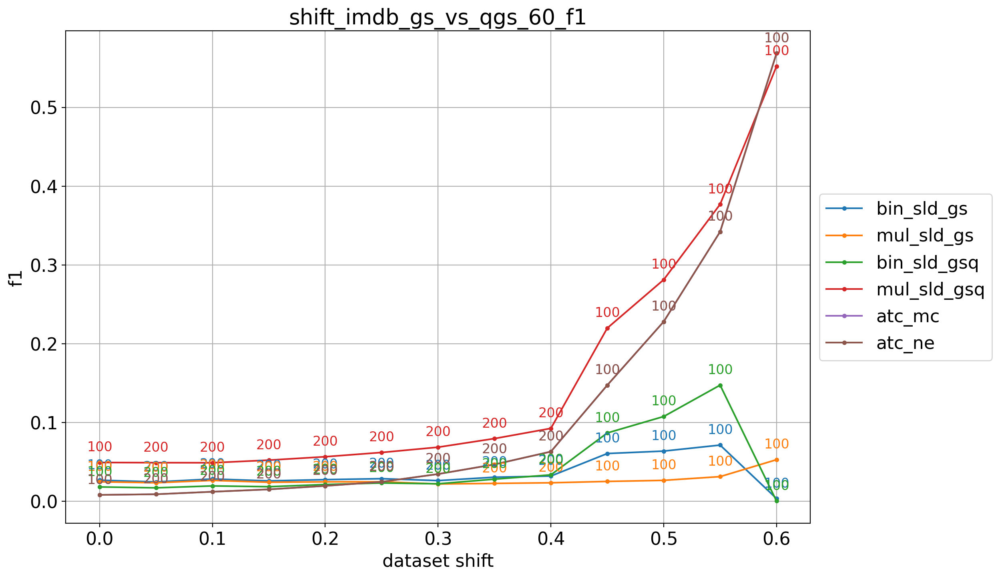

## 70% positives
> train: [0.2999712 0.7000288]  
> validation: [0.2999712 0.7000288]  
> bin_sld_gs: 882.220s  
> mul_sld_gs: 471.468s  
> bin_sld_gsq: 308.364s  
> mul_sld_gsq: 330.333s  
> ref: 11.174s  
> atc_mc: 14.752s  
> atc_ne: 14.815s  
> tot: 882.817s  

<table border="1" class="dataframe">
  <thead>
    <tr style="text-align: right;">
      <th></th>
      <th>bin_sld_gs</th>
      <th>mul_sld_gs</th>
      <th>bin_sld_gsq</th>
      <th>mul_sld_gsq</th>
      <th>atc_mc</th>
      <th>atc_ne</th>
    </tr>
  </thead>
  <tbody>
    <tr>
      <th>0.0</th>
      <td>0.1647</td>
      <td>0.0423</td>
      <td>0.0010</td>
      <td>0.4561</td>
      <td>0.5833</td>
      <td>0.5833</td>
    </tr>
    <tr>
      <th>0.05</th>
      <td>0.1277</td>
      <td>0.0335</td>
      <td>0.0470</td>
      <td>0.3545</td>
      <td>0.4272</td>
      <td>0.4272</td>
    </tr>
    <tr>
      <th>0.1</th>
      <td>0.1021</td>
      <td>0.0274</td>
      <td>0.0375</td>
      <td>0.2863</td>
      <td>0.3236</td>
      <td>0.3236</td>
    </tr>
    <tr>
      <th>0.15</th>
      <td>0.0772</td>
      <td>0.0237</td>
      <td>0.0333</td>
      <td>0.2323</td>
      <td>0.2429</td>
      <td>0.2429</td>
    </tr>
    <tr>
      <th>0.2</th>
      <td>0.0598</td>
      <td>0.0211</td>
      <td>0.0263</td>
      <td>0.1910</td>
      <td>0.1899</td>
      <td>0.1899</td>
    </tr>
    <tr>
      <th>0.25</th>
      <td>0.0474</td>
      <td>0.0174</td>
      <td>0.0230</td>
      <td>0.1629</td>
      <td>0.1453</td>
      <td>0.1453</td>
    </tr>
    <tr>
      <th>0.3</th>
      <td>0.0366</td>
      <td>0.0143</td>
      <td>0.0185</td>
      <td>0.1358</td>
      <td>0.1125</td>
      <td>0.1125</td>
    </tr>
    <tr>
      <th>0.35</th>
      <td>0.0247</td>
      <td>0.0132</td>
      <td>0.0210</td>
      <td>0.1132</td>
      <td>0.0875</td>
      <td>0.0875</td>
    </tr>
    <tr>
      <th>0.4</th>
      <td>0.0188</td>
      <td>0.0121</td>
      <td>0.0197</td>
      <td>0.0968</td>
      <td>0.0688</td>
      <td>0.0688</td>
    </tr>
    <tr>
      <th>0.45</th>
      <td>0.0162</td>
      <td>0.0120</td>
      <td>0.0160</td>
      <td>0.0818</td>
      <td>0.0528</td>
      <td>0.0528</td>
    </tr>
    <tr>
      <th>0.5</th>
      <td>0.0122</td>
      <td>0.0123</td>
      <td>0.0164</td>
      <td>0.0694</td>
      <td>0.0385</td>
      <td>0.0385</td>
    </tr>
    <tr>
      <th>0.55</th>
      <td>0.0083</td>
      <td>0.0105</td>
      <td>0.0151</td>
      <td>0.0565</td>
      <td>0.0281</td>
      <td>0.0281</td>
    </tr>
    <tr>
      <th>0.6</th>
      <td>0.0074</td>
      <td>0.0094</td>
      <td>0.0131</td>
      <td>0.0484</td>
      <td>0.0209</td>
      <td>0.0209</td>
    </tr>
    <tr>
      <th>0.65</th>
      <td>0.0084</td>
      <td>0.0103</td>
      <td>0.0137</td>
      <td>0.0387</td>
      <td>0.0125</td>
      <td>0.0125</td>
    </tr>
    <tr>
      <th>0.7</th>
      <td>0.0089</td>
      <td>0.0102</td>
      <td>0.0149</td>
      <td>0.0298</td>
      <td>0.0077</td>
      <td>0.0077</td>
    </tr>
    <tr>
      <th>0.75</th>
      <td>0.0088</td>
      <td>0.0091</td>
      <td>0.0138</td>
      <td>0.0238</td>
      <td>0.0053</td>
      <td>0.0053</td>
    </tr>
    <tr>
      <th>0.8</th>
      <td>0.0097</td>
      <td>0.0084</td>
      <td>0.0138</td>
      <td>0.0173</td>
      <td>0.0065</td>
      <td>0.0065</td>
    </tr>
    <tr>
      <th>0.85</th>
      <td>0.0113</td>
      <td>0.0093</td>
      <td>0.0151</td>
      <td>0.0123</td>
      <td>0.0075</td>
      <td>0.0075</td>
    </tr>
    <tr>
      <th>0.9</th>
      <td>0.0117</td>
      <td>0.0084</td>
      <td>0.0138</td>
      <td>0.0074</td>
      <td>0.0101</td>
      <td>0.0101</td>
    </tr>
    <tr>
      <th>0.95</th>
      <td>0.0161</td>
      <td>0.0099</td>
      <td>0.0166</td>
      <td>0.0036</td>
      <td>0.0136</td>
      <td>0.0136</td>
    </tr>
    <tr>
      <th>1.0</th>
      <td>0.0213</td>
      <td>0.0104</td>
      <td>0.0136</td>
      <td>0.0049</td>
      <td>0.0151</td>
      <td>0.0151</td>
    </tr>
    <tr>
      <th>avg</th>
      <td>0.0381</td>
      <td>0.0155</td>
      <td>0.0192</td>
      <td>0.1154</td>
      <td>0.1143</td>
      <td>0.1143</td>
    </tr>
  </tbody>
</table>

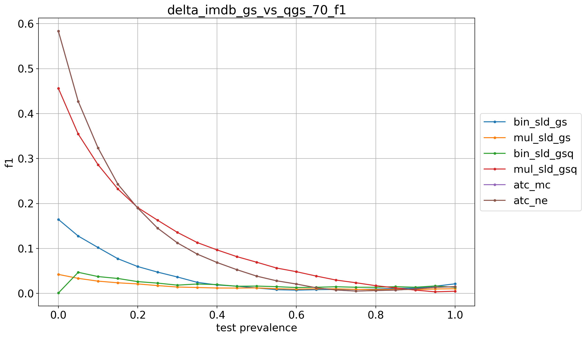
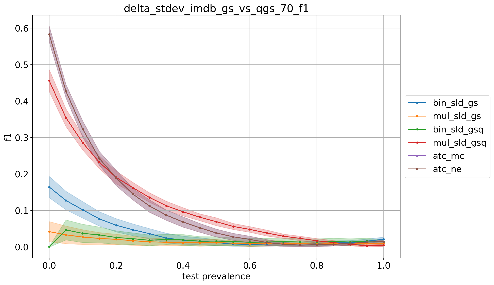
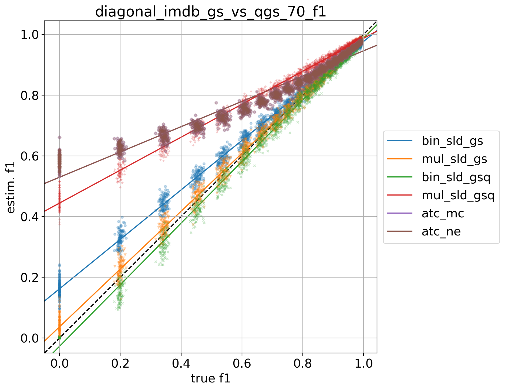
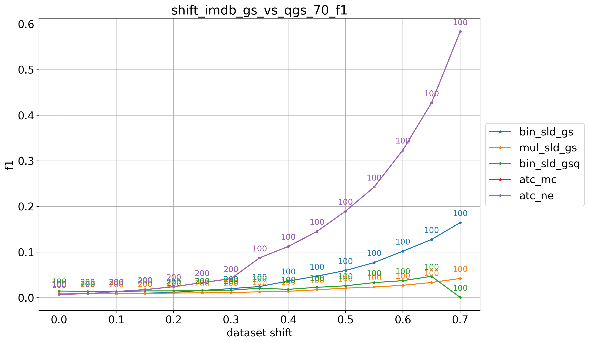

## 80% positives
> train: [0.2000288 0.7999712]  
> validation: [0.2000288 0.7999712]  
> bin_sld_gs: 918.734s  
> mul_sld_gs: 452.727s  
> bin_sld_gsq: 302.185s  
> mul_sld_gsq: 313.546s  
> ref: 11.064s  
> atc_mc: 14.738s  
> atc_ne: 14.770s  
> tot: 919.298s  

<table border="1" class="dataframe">
  <thead>
    <tr style="text-align: right;">
      <th></th>
      <th>bin_sld_gs</th>
      <th>mul_sld_gs</th>
      <th>bin_sld_gsq</th>
      <th>mul_sld_gsq</th>
      <th>atc_mc</th>
      <th>atc_ne</th>
    </tr>
  </thead>
  <tbody>
    <tr>
      <th>0.0</th>
      <td>0.0014</td>
      <td>0.0280</td>
      <td>0.0066</td>
      <td>0.4198</td>
      <td>0.5690</td>
      <td>0.5690</td>
    </tr>
    <tr>
      <th>0.05</th>
      <td>0.0291</td>
      <td>0.0244</td>
      <td>0.0238</td>
      <td>0.3516</td>
      <td>0.4617</td>
      <td>0.4617</td>
    </tr>
    <tr>
      <th>0.1</th>
      <td>0.0227</td>
      <td>0.0221</td>
      <td>0.0227</td>
      <td>0.3051</td>
      <td>0.3805</td>
      <td>0.3805</td>
    </tr>
    <tr>
      <th>0.15</th>
      <td>0.0204</td>
      <td>0.0180</td>
      <td>0.0261</td>
      <td>0.2583</td>
      <td>0.3102</td>
      <td>0.3102</td>
    </tr>
    <tr>
      <th>0.2</th>
      <td>0.0209</td>
      <td>0.0168</td>
      <td>0.0241</td>
      <td>0.2243</td>
      <td>0.2550</td>
      <td>0.2550</td>
    </tr>
    <tr>
      <th>0.25</th>
      <td>0.0200</td>
      <td>0.0164</td>
      <td>0.0233</td>
      <td>0.1906</td>
      <td>0.2072</td>
      <td>0.2072</td>
    </tr>
    <tr>
      <th>0.3</th>
      <td>0.0168</td>
      <td>0.0118</td>
      <td>0.0220</td>
      <td>0.1650</td>
      <td>0.1705</td>
      <td>0.1705</td>
    </tr>
    <tr>
      <th>0.35</th>
      <td>0.0185</td>
      <td>0.0118</td>
      <td>0.0219</td>
      <td>0.1421</td>
      <td>0.1388</td>
      <td>0.1388</td>
    </tr>
    <tr>
      <th>0.4</th>
      <td>0.0178</td>
      <td>0.0119</td>
      <td>0.0205</td>
      <td>0.1215</td>
      <td>0.1144</td>
      <td>0.1144</td>
    </tr>
    <tr>
      <th>0.45</th>
      <td>0.0162</td>
      <td>0.0115</td>
      <td>0.0185</td>
      <td>0.1037</td>
      <td>0.0909</td>
      <td>0.0909</td>
    </tr>
    <tr>
      <th>0.5</th>
      <td>0.0163</td>
      <td>0.0112</td>
      <td>0.0165</td>
      <td>0.0884</td>
      <td>0.0727</td>
      <td>0.0727</td>
    </tr>
    <tr>
      <th>0.55</th>
      <td>0.0161</td>
      <td>0.0094</td>
      <td>0.0153</td>
      <td>0.0738</td>
      <td>0.0569</td>
      <td>0.0569</td>
    </tr>
    <tr>
      <th>0.6</th>
      <td>0.0183</td>
      <td>0.0098</td>
      <td>0.0155</td>
      <td>0.0623</td>
      <td>0.0441</td>
      <td>0.0441</td>
    </tr>
    <tr>
      <th>0.65</th>
      <td>0.0144</td>
      <td>0.0097</td>
      <td>0.0139</td>
      <td>0.0501</td>
      <td>0.0297</td>
      <td>0.0297</td>
    </tr>
    <tr>
      <th>0.7</th>
      <td>0.0166</td>
      <td>0.0102</td>
      <td>0.0126</td>
      <td>0.0391</td>
      <td>0.0198</td>
      <td>0.0198</td>
    </tr>
    <tr>
      <th>0.75</th>
      <td>0.0184</td>
      <td>0.0097</td>
      <td>0.0127</td>
      <td>0.0297</td>
      <td>0.0119</td>
      <td>0.0119</td>
    </tr>
    <tr>
      <th>0.8</th>
      <td>0.0180</td>
      <td>0.0094</td>
      <td>0.0113</td>
      <td>0.0213</td>
      <td>0.0068</td>
      <td>0.0068</td>
    </tr>
    <tr>
      <th>0.85</th>
      <td>0.0186</td>
      <td>0.0084</td>
      <td>0.0095</td>
      <td>0.0141</td>
      <td>0.0049</td>
      <td>0.0049</td>
    </tr>
    <tr>
      <th>0.9</th>
      <td>0.0170</td>
      <td>0.0071</td>
      <td>0.0081</td>
      <td>0.0063</td>
      <td>0.0076</td>
      <td>0.0076</td>
    </tr>
    <tr>
      <th>0.95</th>
      <td>0.0179</td>
      <td>0.0078</td>
      <td>0.0083</td>
      <td>0.0030</td>
      <td>0.0117</td>
      <td>0.0117</td>
    </tr>
    <tr>
      <th>1.0</th>
      <td>0.0150</td>
      <td>0.0064</td>
      <td>0.0060</td>
      <td>0.0073</td>
      <td>0.0150</td>
      <td>0.0150</td>
    </tr>
    <tr>
      <th>avg</th>
      <td>0.0176</td>
      <td>0.0129</td>
      <td>0.0161</td>
      <td>0.1275</td>
      <td>0.1419</td>
      <td>0.1419</td>
    </tr>
  </tbody>
</table>

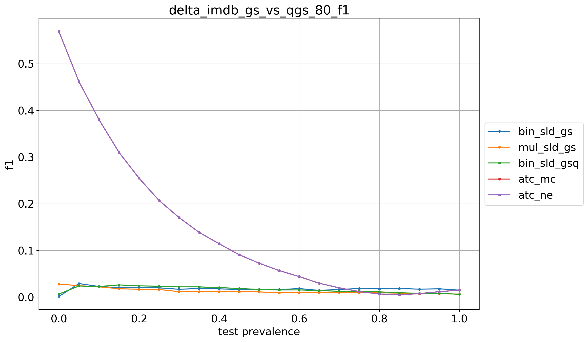
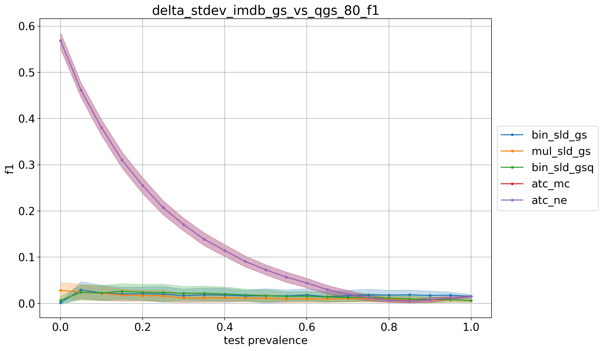
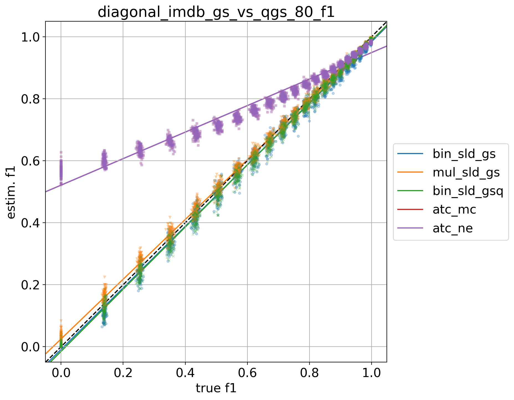
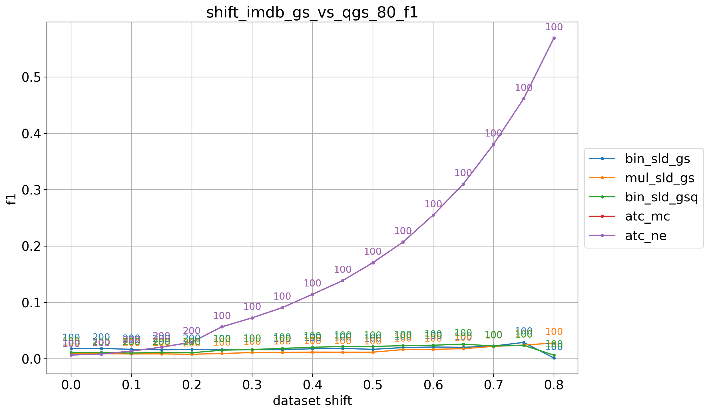

## 90% positives
> train: [0.0999424 0.9000576]  
> validation: [0.10008641 0.89991359]  
> mul_sld_gs: 365.928s  
> ref: 9.138s  
> atc_mc: 12.160s  
> atc_ne: 12.348s  
> tot: 366.493s  

<table border="1" class="dataframe">
  <thead>
    <tr style="text-align: right;">
      <th></th>
      <th>mul_sld_gs</th>
      <th>atc_mc</th>
      <th>atc_ne</th>
    </tr>
  </thead>
  <tbody>
    <tr>
      <th>0.0</th>
      <td>0.1206</td>
      <td>0.5298</td>
      <td>0.5298</td>
    </tr>
    <tr>
      <th>0.05</th>
      <td>0.1149</td>
      <td>0.4611</td>
      <td>0.4611</td>
    </tr>
    <tr>
      <th>0.1</th>
      <td>0.1069</td>
      <td>0.4018</td>
      <td>0.4018</td>
    </tr>
    <tr>
      <th>0.15</th>
      <td>0.0931</td>
      <td>0.3476</td>
      <td>0.3476</td>
    </tr>
    <tr>
      <th>0.2</th>
      <td>0.0827</td>
      <td>0.3036</td>
      <td>0.3036</td>
    </tr>
    <tr>
      <th>0.25</th>
      <td>0.0713</td>
      <td>0.2600</td>
      <td>0.2600</td>
    </tr>
    <tr>
      <th>0.3</th>
      <td>0.0621</td>
      <td>0.2236</td>
      <td>0.2236</td>
    </tr>
    <tr>
      <th>0.35</th>
      <td>0.0521</td>
      <td>0.1920</td>
      <td>0.1920</td>
    </tr>
    <tr>
      <th>0.4</th>
      <td>0.0455</td>
      <td>0.1657</td>
      <td>0.1657</td>
    </tr>
    <tr>
      <th>0.45</th>
      <td>0.0371</td>
      <td>0.1389</td>
      <td>0.1389</td>
    </tr>
    <tr>
      <th>0.5</th>
      <td>0.0304</td>
      <td>0.1160</td>
      <td>0.1160</td>
    </tr>
    <tr>
      <th>0.55</th>
      <td>0.0240</td>
      <td>0.0962</td>
      <td>0.0962</td>
    </tr>
    <tr>
      <th>0.6</th>
      <td>0.0194</td>
      <td>0.0783</td>
      <td>0.0783</td>
    </tr>
    <tr>
      <th>0.65</th>
      <td>0.0132</td>
      <td>0.0599</td>
      <td>0.0599</td>
    </tr>
    <tr>
      <th>0.7</th>
      <td>0.0079</td>
      <td>0.0461</td>
      <td>0.0461</td>
    </tr>
    <tr>
      <th>0.75</th>
      <td>0.0056</td>
      <td>0.0323</td>
      <td>0.0323</td>
    </tr>
    <tr>
      <th>0.8</th>
      <td>0.0052</td>
      <td>0.0201</td>
      <td>0.0201</td>
    </tr>
    <tr>
      <th>0.85</th>
      <td>0.0050</td>
      <td>0.0099</td>
      <td>0.0099</td>
    </tr>
    <tr>
      <th>0.9</th>
      <td>0.0061</td>
      <td>0.0033</td>
      <td>0.0033</td>
    </tr>
    <tr>
      <th>0.95</th>
      <td>0.0089</td>
      <td>0.0090</td>
      <td>0.0090</td>
    </tr>
    <tr>
      <th>1.0</th>
      <td>0.0084</td>
      <td>0.0172</td>
      <td>0.0172</td>
    </tr>
    <tr>
      <th>avg</th>
      <td>0.0438</td>
      <td>0.1672</td>
      <td>0.1672</td>
    </tr>
  </tbody>
</table>

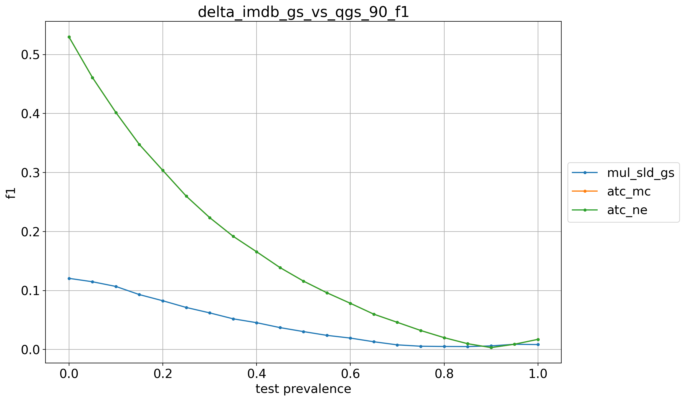
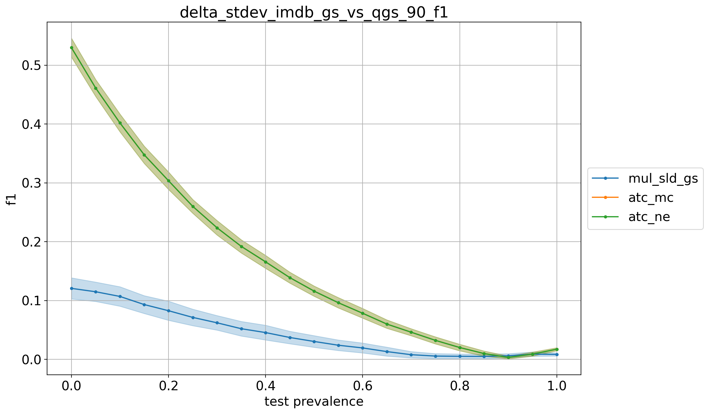
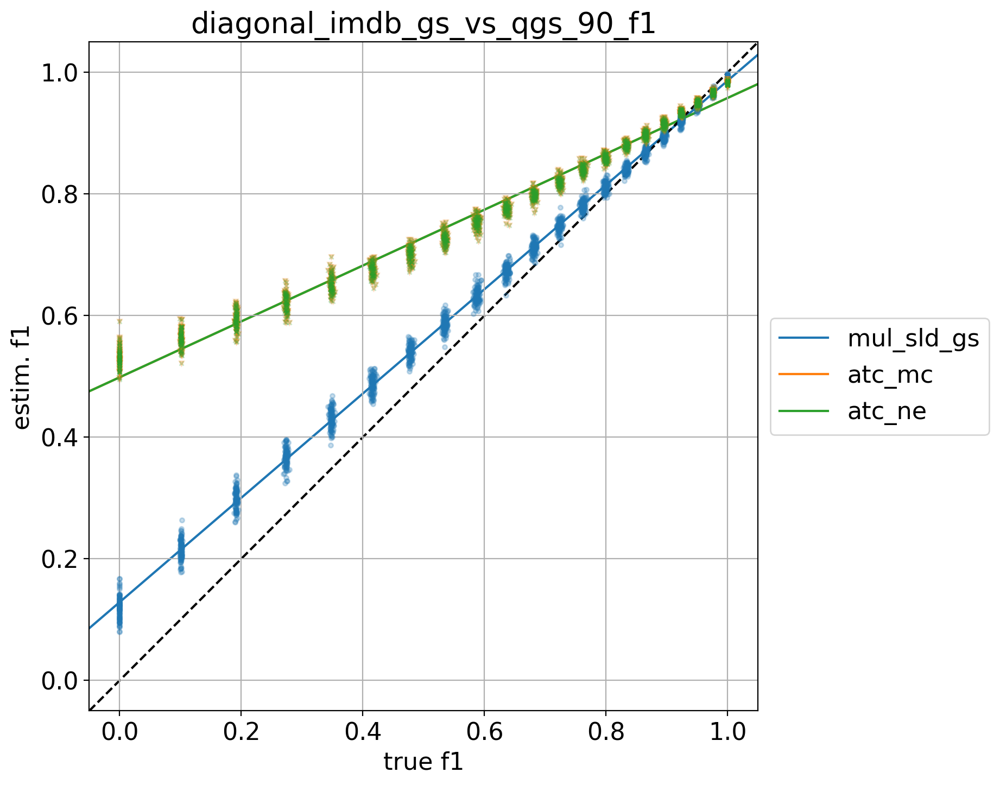
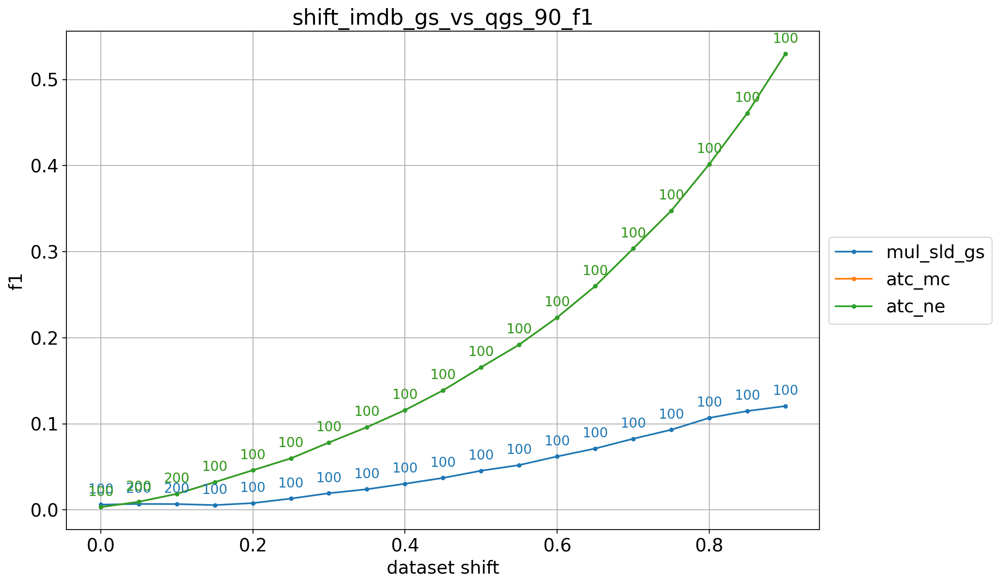

## avg
### avg on train
<table border="1" class="dataframe">
  <thead>
    <tr style="text-align: right;">
      <th></th>
      <th>bin_sld_gs</th>
      <th>mul_sld_gs</th>
      <th>bin_sld_gsq</th>
      <th>mul_sld_gsq</th>
      <th>atc_mc</th>
      <th>atc_ne</th>
    </tr>
  </thead>
  <tbody>
    <tr>
      <th>0.0</th>
      <td>0.0764</td>
      <td>0.0955</td>
      <td>0.0582</td>
      <td>0.4664</td>
      <td>0.3846</td>
      <td>0.3846</td>
    </tr>
    <tr>
      <th>0.05</th>
      <td>0.0798</td>
      <td>0.0567</td>
      <td>0.0853</td>
      <td>0.2556</td>
      <td>0.2693</td>
      <td>0.2693</td>
    </tr>
    <tr>
      <th>0.1</th>
      <td>0.0610</td>
      <td>0.0435</td>
      <td>0.0702</td>
      <td>0.2020</td>
      <td>0.2102</td>
      <td>0.2102</td>
    </tr>
    <tr>
      <th>0.15</th>
      <td>0.0516</td>
      <td>0.0366</td>
      <td>0.0642</td>
      <td>0.1668</td>
      <td>0.1689</td>
      <td>0.1689</td>
    </tr>
    <tr>
      <th>0.2</th>
      <td>0.0428</td>
      <td>0.0328</td>
      <td>0.0556</td>
      <td>0.1443</td>
      <td>0.1424</td>
      <td>0.1424</td>
    </tr>
    <tr>
      <th>0.25</th>
      <td>0.0365</td>
      <td>0.0302</td>
      <td>0.0509</td>
      <td>0.1266</td>
      <td>0.1196</td>
      <td>0.1196</td>
    </tr>
    <tr>
      <th>0.3</th>
      <td>0.0304</td>
      <td>0.0260</td>
      <td>0.0438</td>
      <td>0.1129</td>
      <td>0.1030</td>
      <td>0.1030</td>
    </tr>
    <tr>
      <th>0.35</th>
      <td>0.0317</td>
      <td>0.0254</td>
      <td>0.0485</td>
      <td>0.1011</td>
      <td>0.0899</td>
      <td>0.0899</td>
    </tr>
    <tr>
      <th>0.4</th>
      <td>0.0285</td>
      <td>0.0234</td>
      <td>0.0458</td>
      <td>0.0924</td>
      <td>0.0797</td>
      <td>0.0797</td>
    </tr>
    <tr>
      <th>0.45</th>
      <td>0.0254</td>
      <td>0.0211</td>
      <td>0.0415</td>
      <td>0.0847</td>
      <td>0.0709</td>
      <td>0.0709</td>
    </tr>
    <tr>
      <th>0.5</th>
      <td>0.0254</td>
      <td>0.0214</td>
      <td>0.0412</td>
      <td>0.0768</td>
      <td>0.0631</td>
      <td>0.0631</td>
    </tr>
    <tr>
      <th>0.55</th>
      <td>0.0225</td>
      <td>0.0185</td>
      <td>0.0394</td>
      <td>0.0711</td>
      <td>0.0572</td>
      <td>0.0572</td>
    </tr>
    <tr>
      <th>0.6</th>
      <td>0.0230</td>
      <td>0.0182</td>
      <td>0.0394</td>
      <td>0.0656</td>
      <td>0.0522</td>
      <td>0.0522</td>
    </tr>
    <tr>
      <th>0.65</th>
      <td>0.0211</td>
      <td>0.0170</td>
      <td>0.0375</td>
      <td>0.0603</td>
      <td>0.0476</td>
      <td>0.0476</td>
    </tr>
    <tr>
      <th>0.7</th>
      <td>0.0224</td>
      <td>0.0169</td>
      <td>0.0383</td>
      <td>0.0555</td>
      <td>0.0443</td>
      <td>0.0443</td>
    </tr>
    <tr>
      <th>0.75</th>
      <td>0.0217</td>
      <td>0.0162</td>
      <td>0.0373</td>
      <td>0.0512</td>
      <td>0.0413</td>
      <td>0.0413</td>
    </tr>
    <tr>
      <th>0.8</th>
      <td>0.0207</td>
      <td>0.0154</td>
      <td>0.0364</td>
      <td>0.0467</td>
      <td>0.0399</td>
      <td>0.0399</td>
    </tr>
    <tr>
      <th>0.85</th>
      <td>0.0221</td>
      <td>0.0158</td>
      <td>0.0368</td>
      <td>0.0431</td>
      <td>0.0381</td>
      <td>0.0381</td>
    </tr>
    <tr>
      <th>0.9</th>
      <td>0.0203</td>
      <td>0.0156</td>
      <td>0.0355</td>
      <td>0.0392</td>
      <td>0.0384</td>
      <td>0.0384</td>
    </tr>
    <tr>
      <th>0.95</th>
      <td>0.0220</td>
      <td>0.0164</td>
      <td>0.0360</td>
      <td>0.0362</td>
      <td>0.0395</td>
      <td>0.0395</td>
    </tr>
    <tr>
      <th>1.0</th>
      <td>0.0204</td>
      <td>0.0173</td>
      <td>0.0329</td>
      <td>0.0332</td>
      <td>0.0410</td>
      <td>0.0410</td>
    </tr>
    <tr>
      <th>avg</th>
      <td>0.0336</td>
      <td>0.0276</td>
      <td>0.0464</td>
      <td>0.1110</td>
      <td>0.1020</td>
      <td>0.1020</td>
    </tr>
  </tbody>
</table>

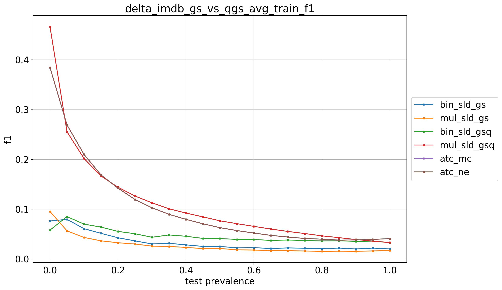
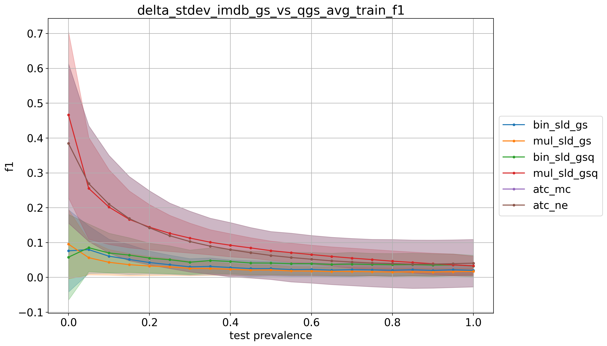
### avg on test
<table border="1" class="dataframe">
  <thead>
    <tr style="text-align: right;">
      <th></th>
      <th>bin_sld_gs</th>
      <th>mul_sld_gs</th>
      <th>bin_sld_gsq</th>
      <th>mul_sld_gsq</th>
      <th>atc_mc</th>
      <th>atc_ne</th>
    </tr>
  </thead>
  <tbody>
    <tr>
      <th>0.1</th>
      <td>NaN</td>
      <td>0.0199</td>
      <td>NaN</td>
      <td>0.0197</td>
      <td>0.0234</td>
      <td>0.0234</td>
    </tr>
    <tr>
      <th>0.2</th>
      <td>0.0421</td>
      <td>0.0310</td>
      <td>0.0614</td>
      <td>0.0948</td>
      <td>0.2314</td>
      <td>0.2314</td>
    </tr>
    <tr>
      <th>0.3</th>
      <td>0.0438</td>
      <td>0.0326</td>
      <td>0.0856</td>
      <td>0.1275</td>
      <td>0.0615</td>
      <td>0.0615</td>
    </tr>
    <tr>
      <th>0.4</th>
      <td>0.0366</td>
      <td>0.0395</td>
      <td>0.0817</td>
      <td>0.1575</td>
      <td>0.0380</td>
      <td>0.0380</td>
    </tr>
    <tr>
      <th>0.5</th>
      <td>0.0250</td>
      <td>0.0274</td>
      <td>0.0262</td>
      <td>0.1268</td>
      <td>0.0569</td>
      <td>0.0569</td>
    </tr>
    <tr>
      <th>0.6</th>
      <td>0.0321</td>
      <td>0.0260</td>
      <td>0.0347</td>
      <td>0.1190</td>
      <td>0.0831</td>
      <td>0.0831</td>
    </tr>
    <tr>
      <th>0.7</th>
      <td>0.0381</td>
      <td>0.0155</td>
      <td>0.0192</td>
      <td>0.1154</td>
      <td>0.1143</td>
      <td>0.1143</td>
    </tr>
    <tr>
      <th>0.8</th>
      <td>0.0176</td>
      <td>0.0129</td>
      <td>0.0161</td>
      <td>0.1275</td>
      <td>0.1419</td>
      <td>0.1419</td>
    </tr>
    <tr>
      <th>0.9</th>
      <td>NaN</td>
      <td>0.0438</td>
      <td>NaN</td>
      <td>NaN</td>
      <td>0.1672</td>
      <td>0.1672</td>
    </tr>
    <tr>
      <th>avg</th>
      <td>0.0336</td>
      <td>0.0276</td>
      <td>0.0464</td>
      <td>0.1110</td>
      <td>0.1020</td>
      <td>0.1020</td>
    </tr>
  </tbody>
</table>

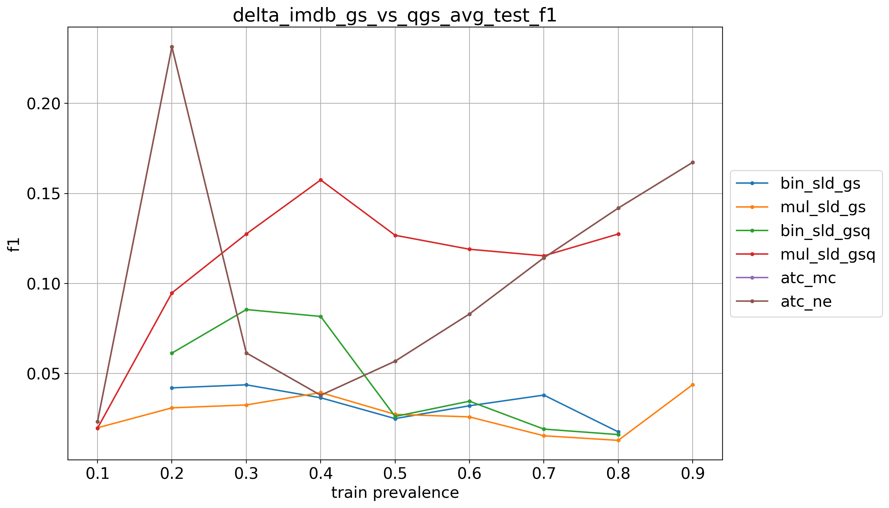
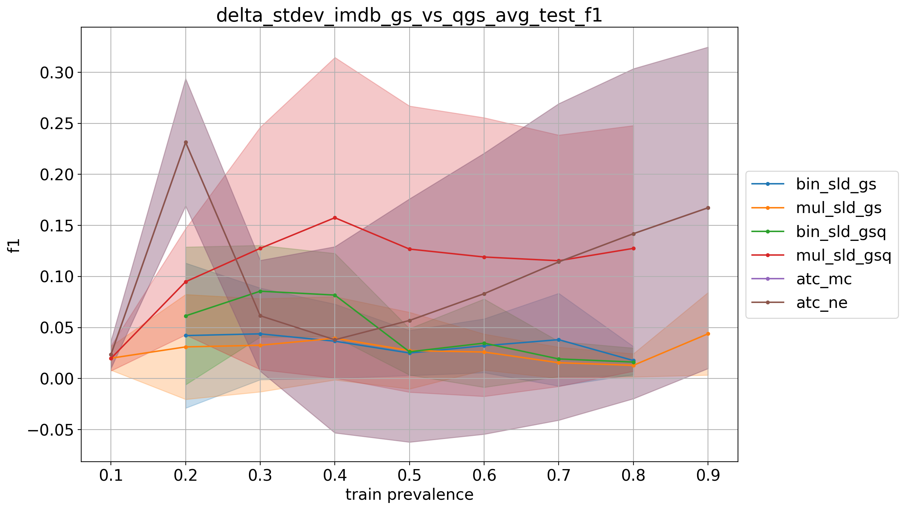
### avg dataset shift
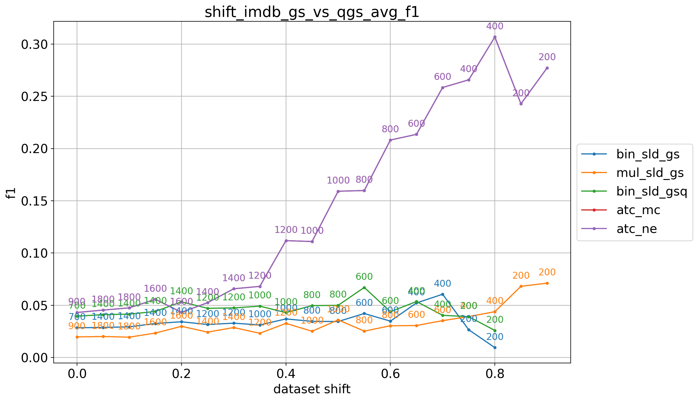
