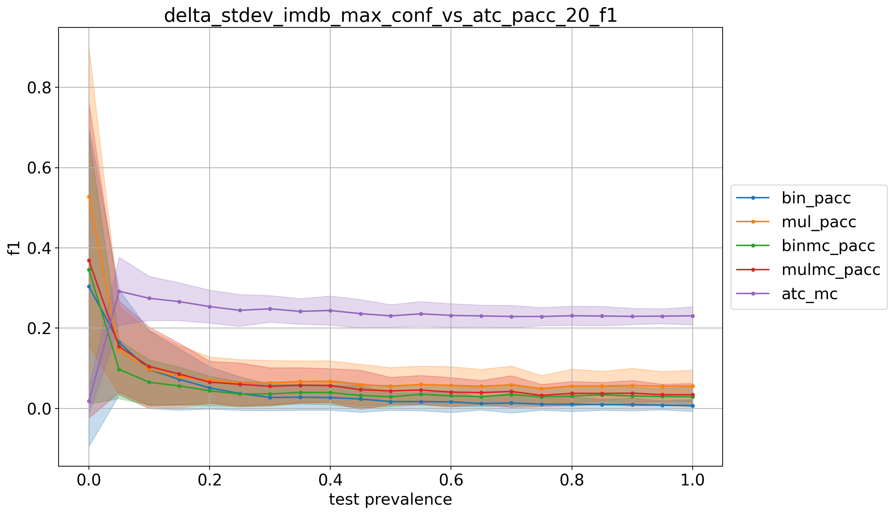
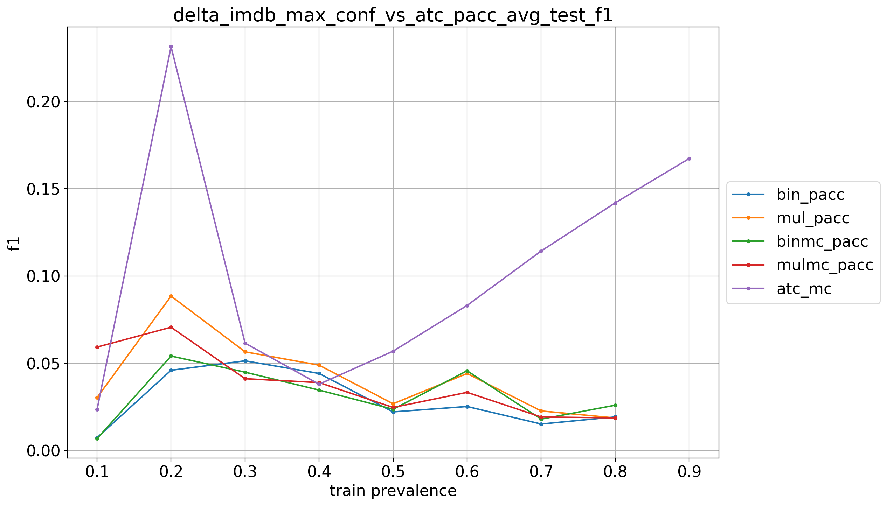

# imdb_9prevs

## 10% positives
> train: [0.89991359 0.10008641]  
> validation: [0.9000576 0.0999424]  
> bin_sld: 249.048s  
> mul_sld: 71.459s  
> mul_sld_gs: 455.993s  
> bin_pacc: 244.563s  
> mul_pacc: 43.016s  
> binmc_pacc: 240.469s  
> mulmc_pacc: 41.750s  
> binne_pacc: 236.217s  
> mulne_pacc: 34.041s  
> bin_cc: 241.914s  
> mul_cc: 40.328s  
> kfcv: 24.723s  
> ref: 18.562s  
> atc_mc: 27.491s  
> atc_ne: 25.568s  
> doc_feat: 11.526s  
> tot: 456.775s  

<table border="1" class="dataframe">
  <thead>
    <tr style="text-align: right;">
      <th></th>
      <th>bin_pacc</th>
      <th>mul_pacc</th>
      <th>binmc_pacc</th>
      <th>mulmc_pacc</th>
      <th>atc_mc</th>
    </tr>
  </thead>
  <tbody>
    <tr>
      <th>0.0</th>
      <td>0.0194</td>
      <td>0.2076</td>
      <td>0.0000</td>
      <td>0.1036</td>
      <td>0.0000</td>
    </tr>
    <tr>
      <th>0.05</th>
      <td>0.0113</td>
      <td>0.0499</td>
      <td>0.0088</td>
      <td>0.0574</td>
      <td>0.0240</td>
    </tr>
    <tr>
      <th>0.1</th>
      <td>0.0089</td>
      <td>0.0305</td>
      <td>0.0081</td>
      <td>0.0631</td>
      <td>0.0244</td>
    </tr>
    <tr>
      <th>0.15</th>
      <td>0.0095</td>
      <td>0.0247</td>
      <td>0.0093</td>
      <td>0.0635</td>
      <td>0.0228</td>
    </tr>
    <tr>
      <th>0.2</th>
      <td>0.0092</td>
      <td>0.0240</td>
      <td>0.0079</td>
      <td>0.0614</td>
      <td>0.0245</td>
    </tr>
    <tr>
      <th>0.25</th>
      <td>0.0061</td>
      <td>0.0202</td>
      <td>0.0082</td>
      <td>0.0497</td>
      <td>0.0246</td>
    </tr>
    <tr>
      <th>0.3</th>
      <td>0.0071</td>
      <td>0.0217</td>
      <td>0.0078</td>
      <td>0.0552</td>
      <td>0.0266</td>
    </tr>
    <tr>
      <th>0.35</th>
      <td>0.0062</td>
      <td>0.0202</td>
      <td>0.0081</td>
      <td>0.0506</td>
      <td>0.0248</td>
    </tr>
    <tr>
      <th>0.4</th>
      <td>0.0049</td>
      <td>0.0174</td>
      <td>0.0052</td>
      <td>0.0557</td>
      <td>0.0230</td>
    </tr>
    <tr>
      <th>0.45</th>
      <td>0.0065</td>
      <td>0.0181</td>
      <td>0.0059</td>
      <td>0.0528</td>
      <td>0.0257</td>
    </tr>
    <tr>
      <th>0.5</th>
      <td>0.0072</td>
      <td>0.0218</td>
      <td>0.0077</td>
      <td>0.0609</td>
      <td>0.0264</td>
    </tr>
    <tr>
      <th>0.55</th>
      <td>0.0064</td>
      <td>0.0180</td>
      <td>0.0060</td>
      <td>0.0558</td>
      <td>0.0239</td>
    </tr>
    <tr>
      <th>0.6</th>
      <td>0.0058</td>
      <td>0.0192</td>
      <td>0.0066</td>
      <td>0.0594</td>
      <td>0.0248</td>
    </tr>
    <tr>
      <th>0.65</th>
      <td>0.0072</td>
      <td>0.0174</td>
      <td>0.0073</td>
      <td>0.0557</td>
      <td>0.0247</td>
    </tr>
    <tr>
      <th>0.7</th>
      <td>0.0060</td>
      <td>0.0180</td>
      <td>0.0071</td>
      <td>0.0591</td>
      <td>0.0239</td>
    </tr>
    <tr>
      <th>0.75</th>
      <td>0.0050</td>
      <td>0.0175</td>
      <td>0.0056</td>
      <td>0.0531</td>
      <td>0.0255</td>
    </tr>
    <tr>
      <th>0.8</th>
      <td>0.0057</td>
      <td>0.0173</td>
      <td>0.0064</td>
      <td>0.0535</td>
      <td>0.0242</td>
    </tr>
    <tr>
      <th>0.85</th>
      <td>0.0056</td>
      <td>0.0172</td>
      <td>0.0057</td>
      <td>0.0603</td>
      <td>0.0240</td>
    </tr>
    <tr>
      <th>0.9</th>
      <td>0.0062</td>
      <td>0.0186</td>
      <td>0.0076</td>
      <td>0.0601</td>
      <td>0.0256</td>
    </tr>
    <tr>
      <th>0.95</th>
      <td>0.0046</td>
      <td>0.0187</td>
      <td>0.0058</td>
      <td>0.0611</td>
      <td>0.0246</td>
    </tr>
    <tr>
      <th>1.0</th>
      <td>0.0046</td>
      <td>0.0180</td>
      <td>0.0073</td>
      <td>0.0520</td>
      <td>0.0246</td>
    </tr>
    <tr>
      <th>avg</th>
      <td>0.0073</td>
      <td>0.0303</td>
      <td>0.0068</td>
      <td>0.0592</td>
      <td>0.0234</td>
    </tr>
  </tbody>
</table>

## 20% positives
> train: [0.7999712 0.2000288]  
> validation: [0.7999712 0.2000288]  
> bin_sld: 312.036s  
> mul_sld: 63.355s  
> bin_sld_gs: 1039.328s  
> mul_sld_gs: 562.297s  
> bin_sld_gsq: 402.075s  
> bin_pacc: 297.187s  
> mul_pacc: 36.589s  
> binmc_pacc: 296.718s  
> mulmc_pacc: 36.777s  
> binne_pacc: 285.556s  
> mulne_pacc: 47.832s  
> bin_pacc_gs: 636.796s  
> mul_pacc_gs: 141.445s  
> bin_cc: 293.873s  
> mul_cc: 46.722s  
> kfcv: 30.476s  
> ref: 26.348s  
> atc_mc: 22.299s  
> atc_ne: 41.782s  
> doc_feat: 11.276s  
> tot: 1040.077s  

<table border="1" class="dataframe">
  <thead>
    <tr style="text-align: right;">
      <th></th>
      <th>bin_pacc</th>
      <th>mul_pacc</th>
      <th>binmc_pacc</th>
      <th>mulmc_pacc</th>
      <th>atc_mc</th>
    </tr>
  </thead>
  <tbody>
    <tr>
      <th>0.0</th>
      <td>0.3041</td>
      <td>0.5277</td>
      <td>0.3456</td>
      <td>0.3689</td>
      <td>0.0183</td>
    </tr>
    <tr>
      <th>0.05</th>
      <td>0.1646</td>
      <td>0.1447</td>
      <td>0.0974</td>
      <td>0.1541</td>
      <td>0.2921</td>
    </tr>
    <tr>
      <th>0.1</th>
      <td>0.0968</td>
      <td>0.0978</td>
      <td>0.0652</td>
      <td>0.1047</td>
      <td>0.2745</td>
    </tr>
    <tr>
      <th>0.15</th>
      <td>0.0725</td>
      <td>0.0792</td>
      <td>0.0560</td>
      <td>0.0856</td>
      <td>0.2661</td>
    </tr>
    <tr>
      <th>0.2</th>
      <td>0.0513</td>
      <td>0.0705</td>
      <td>0.0440</td>
      <td>0.0656</td>
      <td>0.2539</td>
    </tr>
    <tr>
      <th>0.25</th>
      <td>0.0373</td>
      <td>0.0634</td>
      <td>0.0359</td>
      <td>0.0601</td>
      <td>0.2445</td>
    </tr>
    <tr>
      <th>0.3</th>
      <td>0.0274</td>
      <td>0.0634</td>
      <td>0.0362</td>
      <td>0.0554</td>
      <td>0.2483</td>
    </tr>
    <tr>
      <th>0.35</th>
      <td>0.0280</td>
      <td>0.0672</td>
      <td>0.0398</td>
      <td>0.0578</td>
      <td>0.2419</td>
    </tr>
    <tr>
      <th>0.4</th>
      <td>0.0272</td>
      <td>0.0673</td>
      <td>0.0396</td>
      <td>0.0571</td>
      <td>0.2441</td>
    </tr>
    <tr>
      <th>0.45</th>
      <td>0.0235</td>
      <td>0.0588</td>
      <td>0.0322</td>
      <td>0.0468</td>
      <td>0.2362</td>
    </tr>
    <tr>
      <th>0.5</th>
      <td>0.0171</td>
      <td>0.0559</td>
      <td>0.0291</td>
      <td>0.0437</td>
      <td>0.2307</td>
    </tr>
    <tr>
      <th>0.55</th>
      <td>0.0170</td>
      <td>0.0598</td>
      <td>0.0352</td>
      <td>0.0458</td>
      <td>0.2358</td>
    </tr>
    <tr>
      <th>0.6</th>
      <td>0.0165</td>
      <td>0.0575</td>
      <td>0.0315</td>
      <td>0.0408</td>
      <td>0.2318</td>
    </tr>
    <tr>
      <th>0.65</th>
      <td>0.0121</td>
      <td>0.0554</td>
      <td>0.0294</td>
      <td>0.0395</td>
      <td>0.2306</td>
    </tr>
    <tr>
      <th>0.7</th>
      <td>0.0137</td>
      <td>0.0586</td>
      <td>0.0346</td>
      <td>0.0423</td>
      <td>0.2291</td>
    </tr>
    <tr>
      <th>0.75</th>
      <td>0.0106</td>
      <td>0.0493</td>
      <td>0.0292</td>
      <td>0.0325</td>
      <td>0.2291</td>
    </tr>
    <tr>
      <th>0.8</th>
      <td>0.0106</td>
      <td>0.0562</td>
      <td>0.0310</td>
      <td>0.0376</td>
      <td>0.2310</td>
    </tr>
    <tr>
      <th>0.85</th>
      <td>0.0094</td>
      <td>0.0560</td>
      <td>0.0339</td>
      <td>0.0375</td>
      <td>0.2303</td>
    </tr>
    <tr>
      <th>0.9</th>
      <td>0.0100</td>
      <td>0.0575</td>
      <td>0.0311</td>
      <td>0.0380</td>
      <td>0.2295</td>
    </tr>
    <tr>
      <th>0.95</th>
      <td>0.0079</td>
      <td>0.0551</td>
      <td>0.0297</td>
      <td>0.0342</td>
      <td>0.2301</td>
    </tr>
    <tr>
      <th>1.0</th>
      <td>0.0073</td>
      <td>0.0561</td>
      <td>0.0294</td>
      <td>0.0344</td>
      <td>0.2308</td>
    </tr>
    <tr>
      <th>avg</th>
      <td>0.0459</td>
      <td>0.0885</td>
      <td>0.0541</td>
      <td>0.0706</td>
      <td>0.2314</td>
    </tr>
  </tbody>
</table>

## 30% positives
> train: [0.7000288 0.2999712]  
> validation: [0.7000288 0.2999712]  
> bin_sld: 302.903s  
> mul_sld: 59.883s  
> bin_sld_gs: 1013.188s  
> mul_sld_gs: 556.087s  
> bin_sld_gsq: 413.115s  
> bin_pacc: 294.712s  
> mul_pacc: 45.954s  
> binmc_pacc: 300.950s  
> mulmc_pacc: 45.939s  
> binne_pacc: 289.350s  
> mulne_pacc: 38.137s  
> bin_pacc_gs: 643.072s  
> mul_pacc_gs: 149.582s  
> bin_cc: 298.684s  
> mul_cc: 43.908s  
> kfcv: 37.403s  
> ref: 28.756s  
> atc_mc: 39.420s  
> atc_ne: 24.347s  
> doc_feat: 22.815s  
> tot: 1014.314s  

<table border="1" class="dataframe">
  <thead>
    <tr style="text-align: right;">
      <th></th>
      <th>bin_pacc</th>
      <th>mul_pacc</th>
      <th>binmc_pacc</th>
      <th>mulmc_pacc</th>
      <th>atc_mc</th>
    </tr>
  </thead>
  <tbody>
    <tr>
      <th>0.0</th>
      <td>0.1919</td>
      <td>0.5442</td>
      <td>0.2315</td>
      <td>0.2162</td>
      <td>0.2272</td>
    </tr>
    <tr>
      <th>0.05</th>
      <td>0.0921</td>
      <td>0.1161</td>
      <td>0.0894</td>
      <td>0.0994</td>
      <td>0.1227</td>
    </tr>
    <tr>
      <th>0.1</th>
      <td>0.0642</td>
      <td>0.0682</td>
      <td>0.0597</td>
      <td>0.0644</td>
      <td>0.1024</td>
    </tr>
    <tr>
      <th>0.15</th>
      <td>0.0519</td>
      <td>0.0455</td>
      <td>0.0449</td>
      <td>0.0470</td>
      <td>0.0885</td>
    </tr>
    <tr>
      <th>0.2</th>
      <td>0.0436</td>
      <td>0.0373</td>
      <td>0.0380</td>
      <td>0.0396</td>
      <td>0.0813</td>
    </tr>
    <tr>
      <th>0.25</th>
      <td>0.0459</td>
      <td>0.0330</td>
      <td>0.0403</td>
      <td>0.0398</td>
      <td>0.0713</td>
    </tr>
    <tr>
      <th>0.3</th>
      <td>0.0357</td>
      <td>0.0283</td>
      <td>0.0302</td>
      <td>0.0309</td>
      <td>0.0552</td>
    </tr>
    <tr>
      <th>0.35</th>
      <td>0.0467</td>
      <td>0.0287</td>
      <td>0.0371</td>
      <td>0.0331</td>
      <td>0.0572</td>
    </tr>
    <tr>
      <th>0.4</th>
      <td>0.0430</td>
      <td>0.0253</td>
      <td>0.0327</td>
      <td>0.0284</td>
      <td>0.0500</td>
    </tr>
    <tr>
      <th>0.45</th>
      <td>0.0389</td>
      <td>0.0234</td>
      <td>0.0300</td>
      <td>0.0261</td>
      <td>0.0469</td>
    </tr>
    <tr>
      <th>0.5</th>
      <td>0.0388</td>
      <td>0.0250</td>
      <td>0.0306</td>
      <td>0.0264</td>
      <td>0.0429</td>
    </tr>
    <tr>
      <th>0.55</th>
      <td>0.0396</td>
      <td>0.0216</td>
      <td>0.0286</td>
      <td>0.0235</td>
      <td>0.0411</td>
    </tr>
    <tr>
      <th>0.6</th>
      <td>0.0379</td>
      <td>0.0203</td>
      <td>0.0270</td>
      <td>0.0216</td>
      <td>0.0383</td>
    </tr>
    <tr>
      <th>0.65</th>
      <td>0.0381</td>
      <td>0.0218</td>
      <td>0.0278</td>
      <td>0.0220</td>
      <td>0.0383</td>
    </tr>
    <tr>
      <th>0.7</th>
      <td>0.0419</td>
      <td>0.0246</td>
      <td>0.0306</td>
      <td>0.0245</td>
      <td>0.0372</td>
    </tr>
    <tr>
      <th>0.75</th>
      <td>0.0377</td>
      <td>0.0204</td>
      <td>0.0275</td>
      <td>0.0208</td>
      <td>0.0335</td>
    </tr>
    <tr>
      <th>0.8</th>
      <td>0.0388</td>
      <td>0.0219</td>
      <td>0.0278</td>
      <td>0.0216</td>
      <td>0.0340</td>
    </tr>
    <tr>
      <th>0.85</th>
      <td>0.0401</td>
      <td>0.0211</td>
      <td>0.0286</td>
      <td>0.0204</td>
      <td>0.0327</td>
    </tr>
    <tr>
      <th>0.9</th>
      <td>0.0396</td>
      <td>0.0217</td>
      <td>0.0281</td>
      <td>0.0210</td>
      <td>0.0326</td>
    </tr>
    <tr>
      <th>0.95</th>
      <td>0.0375</td>
      <td>0.0186</td>
      <td>0.0258</td>
      <td>0.0182</td>
      <td>0.0284</td>
    </tr>
    <tr>
      <th>1.0</th>
      <td>0.0345</td>
      <td>0.0194</td>
      <td>0.0258</td>
      <td>0.0183</td>
      <td>0.0295</td>
    </tr>
    <tr>
      <th>avg</th>
      <td>0.0514</td>
      <td>0.0565</td>
      <td>0.0449</td>
      <td>0.0411</td>
      <td>0.0615</td>
    </tr>
  </tbody>
</table>

## 40% positives
> train: [0.5999424 0.4000576]  
> validation: [0.60008641 0.39991359]  
> bin_sld: 298.351s  
> mul_sld: 51.270s  
> bin_sld_gs: 1033.280s  
> mul_sld_gs: 546.452s  
> bin_sld_gsq: 421.394s  
> bin_pacc: 298.508s  
> mul_pacc: 34.186s  
> binmc_pacc: 289.145s  
> mulmc_pacc: 42.455s  
> binne_pacc: 296.554s  
> mulne_pacc: 45.269s  
> bin_pacc_gs: 645.096s  
> mul_pacc_gs: 145.337s  
> bin_cc: 300.133s  
> mul_cc: 42.690s  
> kfcv: 36.406s  
> ref: 22.353s  
> atc_mc: 38.798s  
> atc_ne: 34.811s  
> doc_feat: 13.850s  
> tot: 1034.124s  

<table border="1" class="dataframe">
  <thead>
    <tr style="text-align: right;">
      <th></th>
      <th>bin_pacc</th>
      <th>mul_pacc</th>
      <th>binmc_pacc</th>
      <th>mulmc_pacc</th>
      <th>atc_mc</th>
    </tr>
  </thead>
  <tbody>
    <tr>
      <th>0.0</th>
      <td>0.0586</td>
      <td>0.0153</td>
      <td>0.2227</td>
      <td>0.1463</td>
      <td>0.4335</td>
    </tr>
    <tr>
      <th>0.05</th>
      <td>0.0793</td>
      <td>0.1568</td>
      <td>0.0700</td>
      <td>0.0804</td>
      <td>0.0606</td>
    </tr>
    <tr>
      <th>0.1</th>
      <td>0.0586</td>
      <td>0.0883</td>
      <td>0.0478</td>
      <td>0.0543</td>
      <td>0.0339</td>
    </tr>
    <tr>
      <th>0.15</th>
      <td>0.0570</td>
      <td>0.0723</td>
      <td>0.0421</td>
      <td>0.0465</td>
      <td>0.0263</td>
    </tr>
    <tr>
      <th>0.2</th>
      <td>0.0482</td>
      <td>0.0566</td>
      <td>0.0334</td>
      <td>0.0371</td>
      <td>0.0248</td>
    </tr>
    <tr>
      <th>0.25</th>
      <td>0.0394</td>
      <td>0.0466</td>
      <td>0.0241</td>
      <td>0.0271</td>
      <td>0.0213</td>
    </tr>
    <tr>
      <th>0.3</th>
      <td>0.0391</td>
      <td>0.0447</td>
      <td>0.0247</td>
      <td>0.0298</td>
      <td>0.0219</td>
    </tr>
    <tr>
      <th>0.35</th>
      <td>0.0441</td>
      <td>0.0478</td>
      <td>0.0241</td>
      <td>0.0307</td>
      <td>0.0195</td>
    </tr>
    <tr>
      <th>0.4</th>
      <td>0.0428</td>
      <td>0.0459</td>
      <td>0.0219</td>
      <td>0.0306</td>
      <td>0.0164</td>
    </tr>
    <tr>
      <th>0.45</th>
      <td>0.0395</td>
      <td>0.0414</td>
      <td>0.0215</td>
      <td>0.0283</td>
      <td>0.0191</td>
    </tr>
    <tr>
      <th>0.5</th>
      <td>0.0421</td>
      <td>0.0429</td>
      <td>0.0219</td>
      <td>0.0298</td>
      <td>0.0164</td>
    </tr>
    <tr>
      <th>0.55</th>
      <td>0.0375</td>
      <td>0.0380</td>
      <td>0.0184</td>
      <td>0.0270</td>
      <td>0.0133</td>
    </tr>
    <tr>
      <th>0.6</th>
      <td>0.0403</td>
      <td>0.0390</td>
      <td>0.0193</td>
      <td>0.0286</td>
      <td>0.0131</td>
    </tr>
    <tr>
      <th>0.65</th>
      <td>0.0392</td>
      <td>0.0389</td>
      <td>0.0176</td>
      <td>0.0277</td>
      <td>0.0124</td>
    </tr>
    <tr>
      <th>0.7</th>
      <td>0.0398</td>
      <td>0.0374</td>
      <td>0.0187</td>
      <td>0.0281</td>
      <td>0.0116</td>
    </tr>
    <tr>
      <th>0.75</th>
      <td>0.0393</td>
      <td>0.0377</td>
      <td>0.0183</td>
      <td>0.0281</td>
      <td>0.0104</td>
    </tr>
    <tr>
      <th>0.8</th>
      <td>0.0381</td>
      <td>0.0361</td>
      <td>0.0175</td>
      <td>0.0275</td>
      <td>0.0107</td>
    </tr>
    <tr>
      <th>0.85</th>
      <td>0.0396</td>
      <td>0.0372</td>
      <td>0.0172</td>
      <td>0.0282</td>
      <td>0.0084</td>
    </tr>
    <tr>
      <th>0.9</th>
      <td>0.0370</td>
      <td>0.0343</td>
      <td>0.0150</td>
      <td>0.0263</td>
      <td>0.0080</td>
    </tr>
    <tr>
      <th>0.95</th>
      <td>0.0377</td>
      <td>0.0349</td>
      <td>0.0162</td>
      <td>0.0273</td>
      <td>0.0082</td>
    </tr>
    <tr>
      <th>1.0</th>
      <td>0.0296</td>
      <td>0.0343</td>
      <td>0.0139</td>
      <td>0.0271</td>
      <td>0.0072</td>
    </tr>
    <tr>
      <th>avg</th>
      <td>0.0441</td>
      <td>0.0489</td>
      <td>0.0346</td>
      <td>0.0389</td>
      <td>0.0380</td>
    </tr>
  </tbody>
</table>

## 50% positives
> train: [0.5 0.5]  
> validation: [0.5 0.5]  
> bin_sld: 303.489s  
> mul_sld: 50.183s  
> bin_sld_gs: 1015.361s  
> mul_sld_gs: 552.539s  
> bin_sld_gsq: 418.096s  
> bin_pacc: 296.283s  
> mul_pacc: 32.547s  
> binmc_pacc: 299.487s  
> mulmc_pacc: 40.506s  
> binne_pacc: 293.984s  
> mulne_pacc: 39.974s  
> bin_pacc_gs: 643.158s  
> mul_pacc_gs: 146.732s  
> bin_cc: 292.672s  
> mul_cc: 37.348s  
> kfcv: 29.093s  
> ref: 16.306s  
> atc_mc: 25.874s  
> atc_ne: 28.890s  
> doc_feat: 11.601s  
> tot: 1016.064s  

<table border="1" class="dataframe">
  <thead>
    <tr style="text-align: right;">
      <th></th>
      <th>bin_pacc</th>
      <th>mul_pacc</th>
      <th>binmc_pacc</th>
      <th>mulmc_pacc</th>
      <th>atc_mc</th>
    </tr>
  </thead>
  <tbody>
    <tr>
      <th>0.0</th>
      <td>0.0727</td>
      <td>0.0999</td>
      <td>0.0841</td>
      <td>0.0569</td>
      <td>0.5313</td>
    </tr>
    <tr>
      <th>0.05</th>
      <td>0.0546</td>
      <td>0.0591</td>
      <td>0.0540</td>
      <td>0.0638</td>
      <td>0.2320</td>
    </tr>
    <tr>
      <th>0.1</th>
      <td>0.0370</td>
      <td>0.0421</td>
      <td>0.0364</td>
      <td>0.0413</td>
      <td>0.1230</td>
    </tr>
    <tr>
      <th>0.15</th>
      <td>0.0356</td>
      <td>0.0352</td>
      <td>0.0329</td>
      <td>0.0363</td>
      <td>0.0683</td>
    </tr>
    <tr>
      <th>0.2</th>
      <td>0.0294</td>
      <td>0.0293</td>
      <td>0.0279</td>
      <td>0.0325</td>
      <td>0.0417</td>
    </tr>
    <tr>
      <th>0.25</th>
      <td>0.0237</td>
      <td>0.0241</td>
      <td>0.0218</td>
      <td>0.0249</td>
      <td>0.0278</td>
    </tr>
    <tr>
      <th>0.3</th>
      <td>0.0223</td>
      <td>0.0237</td>
      <td>0.0219</td>
      <td>0.0248</td>
      <td>0.0169</td>
    </tr>
    <tr>
      <th>0.35</th>
      <td>0.0221</td>
      <td>0.0194</td>
      <td>0.0217</td>
      <td>0.0240</td>
      <td>0.0129</td>
    </tr>
    <tr>
      <th>0.4</th>
      <td>0.0185</td>
      <td>0.0191</td>
      <td>0.0183</td>
      <td>0.0210</td>
      <td>0.0113</td>
    </tr>
    <tr>
      <th>0.45</th>
      <td>0.0163</td>
      <td>0.0169</td>
      <td>0.0163</td>
      <td>0.0180</td>
      <td>0.0107</td>
    </tr>
    <tr>
      <th>0.5</th>
      <td>0.0179</td>
      <td>0.0194</td>
      <td>0.0185</td>
      <td>0.0210</td>
      <td>0.0121</td>
    </tr>
    <tr>
      <th>0.55</th>
      <td>0.0160</td>
      <td>0.0188</td>
      <td>0.0170</td>
      <td>0.0195</td>
      <td>0.0109</td>
    </tr>
    <tr>
      <th>0.6</th>
      <td>0.0151</td>
      <td>0.0184</td>
      <td>0.0168</td>
      <td>0.0180</td>
      <td>0.0105</td>
    </tr>
    <tr>
      <th>0.65</th>
      <td>0.0135</td>
      <td>0.0157</td>
      <td>0.0147</td>
      <td>0.0157</td>
      <td>0.0105</td>
    </tr>
    <tr>
      <th>0.7</th>
      <td>0.0119</td>
      <td>0.0169</td>
      <td>0.0148</td>
      <td>0.0158</td>
      <td>0.0106</td>
    </tr>
    <tr>
      <th>0.75</th>
      <td>0.0124</td>
      <td>0.0182</td>
      <td>0.0152</td>
      <td>0.0160</td>
      <td>0.0107</td>
    </tr>
    <tr>
      <th>0.8</th>
      <td>0.0114</td>
      <td>0.0172</td>
      <td>0.0136</td>
      <td>0.0150</td>
      <td>0.0105</td>
    </tr>
    <tr>
      <th>0.85</th>
      <td>0.0104</td>
      <td>0.0175</td>
      <td>0.0135</td>
      <td>0.0147</td>
      <td>0.0100</td>
    </tr>
    <tr>
      <th>0.9</th>
      <td>0.0091</td>
      <td>0.0158</td>
      <td>0.0119</td>
      <td>0.0125</td>
      <td>0.0111</td>
    </tr>
    <tr>
      <th>0.95</th>
      <td>0.0081</td>
      <td>0.0185</td>
      <td>0.0129</td>
      <td>0.0139</td>
      <td>0.0114</td>
    </tr>
    <tr>
      <th>1.0</th>
      <td>0.0064</td>
      <td>0.0168</td>
      <td>0.0113</td>
      <td>0.0120</td>
      <td>0.0102</td>
    </tr>
    <tr>
      <th>avg</th>
      <td>0.0221</td>
      <td>0.0268</td>
      <td>0.0236</td>
      <td>0.0246</td>
      <td>0.0569</td>
    </tr>
  </tbody>
</table>

## 60% positives
> train: [0.39991359 0.60008641]  
> validation: [0.4000576 0.5999424]  
> bin_sld: 296.102s  
> mul_sld: 56.083s  
> bin_sld_gs: 1060.976s  
> mul_sld_gs: 551.619s  
> bin_sld_gsq: 425.664s  
> bin_pacc: 293.321s  
> mul_pacc: 44.690s  
> binmc_pacc: 296.400s  
> mulmc_pacc: 38.640s  
> binne_pacc: 288.195s  
> mulne_pacc: 44.768s  
> bin_pacc_gs: 645.660s  
> mul_pacc_gs: 146.232s  
> bin_cc: 299.198s  
> mul_cc: 41.642s  
> kfcv: 21.885s  
> ref: 26.261s  
> atc_mc: 37.391s  
> atc_ne: 35.750s  
> doc_feat: 19.963s  
> tot: 1061.773s  

<table border="1" class="dataframe">
  <thead>
    <tr style="text-align: right;">
      <th></th>
      <th>bin_pacc</th>
      <th>mul_pacc</th>
      <th>binmc_pacc</th>
      <th>mulmc_pacc</th>
      <th>atc_mc</th>
    </tr>
  </thead>
  <tbody>
    <tr>
      <th>0.0</th>
      <td>0.0129</td>
      <td>0.0047</td>
      <td>0.0002</td>
      <td>0.0090</td>
      <td>0.5686</td>
    </tr>
    <tr>
      <th>0.05</th>
      <td>0.0626</td>
      <td>0.1122</td>
      <td>0.1583</td>
      <td>0.0788</td>
      <td>0.3422</td>
    </tr>
    <tr>
      <th>0.1</th>
      <td>0.0488</td>
      <td>0.0845</td>
      <td>0.1162</td>
      <td>0.0585</td>
      <td>0.2281</td>
    </tr>
    <tr>
      <th>0.15</th>
      <td>0.0454</td>
      <td>0.0760</td>
      <td>0.0959</td>
      <td>0.0512</td>
      <td>0.1475</td>
    </tr>
    <tr>
      <th>0.2</th>
      <td>0.0374</td>
      <td>0.0646</td>
      <td>0.0756</td>
      <td>0.0452</td>
      <td>0.1066</td>
    </tr>
    <tr>
      <th>0.25</th>
      <td>0.0320</td>
      <td>0.0543</td>
      <td>0.0613</td>
      <td>0.0363</td>
      <td>0.0747</td>
    </tr>
    <tr>
      <th>0.3</th>
      <td>0.0275</td>
      <td>0.0490</td>
      <td>0.0508</td>
      <td>0.0334</td>
      <td>0.0515</td>
    </tr>
    <tr>
      <th>0.35</th>
      <td>0.0292</td>
      <td>0.0504</td>
      <td>0.0515</td>
      <td>0.0351</td>
      <td>0.0344</td>
    </tr>
    <tr>
      <th>0.4</th>
      <td>0.0257</td>
      <td>0.0469</td>
      <td>0.0450</td>
      <td>0.0338</td>
      <td>0.0235</td>
    </tr>
    <tr>
      <th>0.45</th>
      <td>0.0230</td>
      <td>0.0398</td>
      <td>0.0364</td>
      <td>0.0282</td>
      <td>0.0169</td>
    </tr>
    <tr>
      <th>0.5</th>
      <td>0.0246</td>
      <td>0.0403</td>
      <td>0.0371</td>
      <td>0.0307</td>
      <td>0.0121</td>
    </tr>
    <tr>
      <th>0.55</th>
      <td>0.0204</td>
      <td>0.0366</td>
      <td>0.0319</td>
      <td>0.0276</td>
      <td>0.0087</td>
    </tr>
    <tr>
      <th>0.6</th>
      <td>0.0206</td>
      <td>0.0362</td>
      <td>0.0314</td>
      <td>0.0284</td>
      <td>0.0082</td>
    </tr>
    <tr>
      <th>0.65</th>
      <td>0.0172</td>
      <td>0.0311</td>
      <td>0.0248</td>
      <td>0.0244</td>
      <td>0.0093</td>
    </tr>
    <tr>
      <th>0.7</th>
      <td>0.0189</td>
      <td>0.0345</td>
      <td>0.0278</td>
      <td>0.0292</td>
      <td>0.0122</td>
    </tr>
    <tr>
      <th>0.75</th>
      <td>0.0169</td>
      <td>0.0317</td>
      <td>0.0242</td>
      <td>0.0265</td>
      <td>0.0135</td>
    </tr>
    <tr>
      <th>0.8</th>
      <td>0.0143</td>
      <td>0.0282</td>
      <td>0.0205</td>
      <td>0.0245</td>
      <td>0.0156</td>
    </tr>
    <tr>
      <th>0.85</th>
      <td>0.0136</td>
      <td>0.0277</td>
      <td>0.0190</td>
      <td>0.0246</td>
      <td>0.0152</td>
    </tr>
    <tr>
      <th>0.9</th>
      <td>0.0126</td>
      <td>0.0254</td>
      <td>0.0173</td>
      <td>0.0234</td>
      <td>0.0178</td>
    </tr>
    <tr>
      <th>0.95</th>
      <td>0.0137</td>
      <td>0.0269</td>
      <td>0.0183</td>
      <td>0.0256</td>
      <td>0.0189</td>
    </tr>
    <tr>
      <th>1.0</th>
      <td>0.0115</td>
      <td>0.0251</td>
      <td>0.0152</td>
      <td>0.0246</td>
      <td>0.0197</td>
    </tr>
    <tr>
      <th>avg</th>
      <td>0.0252</td>
      <td>0.0441</td>
      <td>0.0457</td>
      <td>0.0333</td>
      <td>0.0831</td>
    </tr>
  </tbody>
</table>

## 70% positives
> train: [0.2999712 0.7000288]  
> validation: [0.2999712 0.7000288]  
> bin_sld: 303.930s  
> mul_sld: 40.110s  
> bin_sld_gs: 1015.962s  
> mul_sld_gs: 557.286s  
> bin_sld_gsq: 414.452s  
> bin_pacc: 292.176s  
> mul_pacc: 47.800s  
> binmc_pacc: 302.570s  
> mulmc_pacc: 44.408s  
> binne_pacc: 293.019s  
> mulne_pacc: 43.783s  
> bin_pacc_gs: 648.943s  
> mul_pacc_gs: 150.210s  
> bin_cc: 288.613s  
> mul_cc: 38.672s  
> kfcv: 32.153s  
> ref: 34.374s  
> atc_mc: 38.938s  
> atc_ne: 40.313s  
> doc_feat: 20.243s  
> tot: 1016.774s  

<table border="1" class="dataframe">
  <thead>
    <tr style="text-align: right;">
      <th></th>
      <th>bin_pacc</th>
      <th>mul_pacc</th>
      <th>binmc_pacc</th>
      <th>mulmc_pacc</th>
      <th>atc_mc</th>
    </tr>
  </thead>
  <tbody>
    <tr>
      <th>0.0</th>
      <td>0.0208</td>
      <td>0.0112</td>
      <td>0.0560</td>
      <td>0.0339</td>
      <td>0.5833</td>
    </tr>
    <tr>
      <th>0.05</th>
      <td>0.0385</td>
      <td>0.0461</td>
      <td>0.0414</td>
      <td>0.0355</td>
      <td>0.4272</td>
    </tr>
    <tr>
      <th>0.1</th>
      <td>0.0319</td>
      <td>0.0378</td>
      <td>0.0349</td>
      <td>0.0295</td>
      <td>0.3236</td>
    </tr>
    <tr>
      <th>0.15</th>
      <td>0.0258</td>
      <td>0.0342</td>
      <td>0.0238</td>
      <td>0.0233</td>
      <td>0.2429</td>
    </tr>
    <tr>
      <th>0.2</th>
      <td>0.0256</td>
      <td>0.0309</td>
      <td>0.0235</td>
      <td>0.0232</td>
      <td>0.1899</td>
    </tr>
    <tr>
      <th>0.25</th>
      <td>0.0192</td>
      <td>0.0267</td>
      <td>0.0187</td>
      <td>0.0185</td>
      <td>0.1453</td>
    </tr>
    <tr>
      <th>0.3</th>
      <td>0.0165</td>
      <td>0.0226</td>
      <td>0.0154</td>
      <td>0.0158</td>
      <td>0.1125</td>
    </tr>
    <tr>
      <th>0.35</th>
      <td>0.0145</td>
      <td>0.0245</td>
      <td>0.0133</td>
      <td>0.0171</td>
      <td>0.0875</td>
    </tr>
    <tr>
      <th>0.4</th>
      <td>0.0139</td>
      <td>0.0246</td>
      <td>0.0129</td>
      <td>0.0172</td>
      <td>0.0688</td>
    </tr>
    <tr>
      <th>0.45</th>
      <td>0.0131</td>
      <td>0.0194</td>
      <td>0.0128</td>
      <td>0.0146</td>
      <td>0.0528</td>
    </tr>
    <tr>
      <th>0.5</th>
      <td>0.0121</td>
      <td>0.0202</td>
      <td>0.0120</td>
      <td>0.0158</td>
      <td>0.0385</td>
    </tr>
    <tr>
      <th>0.55</th>
      <td>0.0100</td>
      <td>0.0197</td>
      <td>0.0101</td>
      <td>0.0147</td>
      <td>0.0281</td>
    </tr>
    <tr>
      <th>0.6</th>
      <td>0.0083</td>
      <td>0.0182</td>
      <td>0.0087</td>
      <td>0.0133</td>
      <td>0.0209</td>
    </tr>
    <tr>
      <th>0.65</th>
      <td>0.0098</td>
      <td>0.0172</td>
      <td>0.0104</td>
      <td>0.0139</td>
      <td>0.0125</td>
    </tr>
    <tr>
      <th>0.7</th>
      <td>0.0075</td>
      <td>0.0197</td>
      <td>0.0100</td>
      <td>0.0155</td>
      <td>0.0077</td>
    </tr>
    <tr>
      <th>0.75</th>
      <td>0.0069</td>
      <td>0.0178</td>
      <td>0.0098</td>
      <td>0.0156</td>
      <td>0.0053</td>
    </tr>
    <tr>
      <th>0.8</th>
      <td>0.0073</td>
      <td>0.0164</td>
      <td>0.0103</td>
      <td>0.0145</td>
      <td>0.0065</td>
    </tr>
    <tr>
      <th>0.85</th>
      <td>0.0080</td>
      <td>0.0174</td>
      <td>0.0118</td>
      <td>0.0168</td>
      <td>0.0075</td>
    </tr>
    <tr>
      <th>0.9</th>
      <td>0.0080</td>
      <td>0.0155</td>
      <td>0.0114</td>
      <td>0.0154</td>
      <td>0.0101</td>
    </tr>
    <tr>
      <th>0.95</th>
      <td>0.0116</td>
      <td>0.0179</td>
      <td>0.0150</td>
      <td>0.0190</td>
      <td>0.0136</td>
    </tr>
    <tr>
      <th>1.0</th>
      <td>0.0092</td>
      <td>0.0174</td>
      <td>0.0150</td>
      <td>0.0200</td>
      <td>0.0151</td>
    </tr>
    <tr>
      <th>avg</th>
      <td>0.0152</td>
      <td>0.0227</td>
      <td>0.0180</td>
      <td>0.0192</td>
      <td>0.1143</td>
    </tr>
  </tbody>
</table>

## 80% positives
> train: [0.2000288 0.7999712]  
> validation: [0.2000288 0.7999712]  
> bin_sld: 302.697s  
> mul_sld: 51.427s  
> bin_sld_gs: 1033.432s  
> mul_sld_gs: 553.840s  
> bin_sld_gsq: 405.825s  
> bin_pacc: 296.888s  
> mul_pacc: 34.390s  
> binmc_pacc: 300.681s  
> mulmc_pacc: 44.972s  
> binne_pacc: 284.115s  
> mulne_pacc: 37.204s  
> bin_pacc_gs: 637.277s  
> mul_pacc_gs: 146.708s  
> bin_cc: 297.171s  
> mul_cc: 42.941s  
> kfcv: 27.967s  
> ref: 32.469s  
> atc_mc: 22.965s  
> atc_ne: 39.769s  
> doc_feat: 19.964s  
> tot: 1034.198s  

<table border="1" class="dataframe">
  <thead>
    <tr style="text-align: right;">
      <th></th>
      <th>bin_pacc</th>
      <th>mul_pacc</th>
      <th>binmc_pacc</th>
      <th>mulmc_pacc</th>
      <th>atc_mc</th>
    </tr>
  </thead>
  <tbody>
    <tr>
      <th>0.0</th>
      <td>0.0556</td>
      <td>0.0701</td>
      <td>0.1046</td>
      <td>0.0556</td>
      <td>0.5690</td>
    </tr>
    <tr>
      <th>0.05</th>
      <td>0.0345</td>
      <td>0.0436</td>
      <td>0.0721</td>
      <td>0.0396</td>
      <td>0.4617</td>
    </tr>
    <tr>
      <th>0.1</th>
      <td>0.0310</td>
      <td>0.0399</td>
      <td>0.0634</td>
      <td>0.0405</td>
      <td>0.3805</td>
    </tr>
    <tr>
      <th>0.15</th>
      <td>0.0216</td>
      <td>0.0251</td>
      <td>0.0464</td>
      <td>0.0272</td>
      <td>0.3102</td>
    </tr>
    <tr>
      <th>0.2</th>
      <td>0.0241</td>
      <td>0.0277</td>
      <td>0.0410</td>
      <td>0.0305</td>
      <td>0.2550</td>
    </tr>
    <tr>
      <th>0.25</th>
      <td>0.0218</td>
      <td>0.0228</td>
      <td>0.0313</td>
      <td>0.0245</td>
      <td>0.2072</td>
    </tr>
    <tr>
      <th>0.3</th>
      <td>0.0195</td>
      <td>0.0189</td>
      <td>0.0249</td>
      <td>0.0207</td>
      <td>0.1705</td>
    </tr>
    <tr>
      <th>0.35</th>
      <td>0.0186</td>
      <td>0.0160</td>
      <td>0.0210</td>
      <td>0.0170</td>
      <td>0.1388</td>
    </tr>
    <tr>
      <th>0.4</th>
      <td>0.0186</td>
      <td>0.0160</td>
      <td>0.0202</td>
      <td>0.0165</td>
      <td>0.1144</td>
    </tr>
    <tr>
      <th>0.45</th>
      <td>0.0156</td>
      <td>0.0139</td>
      <td>0.0167</td>
      <td>0.0147</td>
      <td>0.0909</td>
    </tr>
    <tr>
      <th>0.5</th>
      <td>0.0168</td>
      <td>0.0132</td>
      <td>0.0151</td>
      <td>0.0125</td>
      <td>0.0727</td>
    </tr>
    <tr>
      <th>0.55</th>
      <td>0.0154</td>
      <td>0.0113</td>
      <td>0.0121</td>
      <td>0.0104</td>
      <td>0.0569</td>
    </tr>
    <tr>
      <th>0.6</th>
      <td>0.0160</td>
      <td>0.0108</td>
      <td>0.0102</td>
      <td>0.0093</td>
      <td>0.0441</td>
    </tr>
    <tr>
      <th>0.65</th>
      <td>0.0148</td>
      <td>0.0109</td>
      <td>0.0110</td>
      <td>0.0103</td>
      <td>0.0297</td>
    </tr>
    <tr>
      <th>0.7</th>
      <td>0.0141</td>
      <td>0.0104</td>
      <td>0.0091</td>
      <td>0.0095</td>
      <td>0.0198</td>
    </tr>
    <tr>
      <th>0.75</th>
      <td>0.0136</td>
      <td>0.0093</td>
      <td>0.0090</td>
      <td>0.0094</td>
      <td>0.0119</td>
    </tr>
    <tr>
      <th>0.8</th>
      <td>0.0135</td>
      <td>0.0088</td>
      <td>0.0091</td>
      <td>0.0093</td>
      <td>0.0068</td>
    </tr>
    <tr>
      <th>0.85</th>
      <td>0.0114</td>
      <td>0.0071</td>
      <td>0.0079</td>
      <td>0.0086</td>
      <td>0.0049</td>
    </tr>
    <tr>
      <th>0.9</th>
      <td>0.0097</td>
      <td>0.0061</td>
      <td>0.0072</td>
      <td>0.0082</td>
      <td>0.0076</td>
    </tr>
    <tr>
      <th>0.95</th>
      <td>0.0099</td>
      <td>0.0054</td>
      <td>0.0072</td>
      <td>0.0090</td>
      <td>0.0117</td>
    </tr>
    <tr>
      <th>1.0</th>
      <td>0.0072</td>
      <td>0.0039</td>
      <td>0.0046</td>
      <td>0.0088</td>
      <td>0.0150</td>
    </tr>
    <tr>
      <th>avg</th>
      <td>0.0192</td>
      <td>0.0186</td>
      <td>0.0259</td>
      <td>0.0187</td>
      <td>0.1419</td>
    </tr>
  </tbody>
</table>

## 90% positives
> train: [0.0999424 0.9000576]  
> validation: [0.10008641 0.89991359]  
> bin_sld: 170.505s  
> mul_sld: 31.294s  
> mul_sld_gs: 380.780s  
> bin_cc: 164.518s  
> mul_cc: 20.620s  
> kfcv: 15.634s  
> ref: 13.757s  
> atc_mc: 18.010s  
> atc_ne: 18.026s  
> doc_feat: 10.161s  
> tot: 381.531s  

<table border="1" class="dataframe">
  <thead>
    <tr style="text-align: right;">
      <th></th>
      <th>atc_mc</th>
    </tr>
  </thead>
  <tbody>
    <tr>
      <th>0.0</th>
      <td>0.5298</td>
    </tr>
    <tr>
      <th>0.05</th>
      <td>0.4611</td>
    </tr>
    <tr>
      <th>0.1</th>
      <td>0.4018</td>
    </tr>
    <tr>
      <th>0.15</th>
      <td>0.3476</td>
    </tr>
    <tr>
      <th>0.2</th>
      <td>0.3036</td>
    </tr>
    <tr>
      <th>0.25</th>
      <td>0.2600</td>
    </tr>
    <tr>
      <th>0.3</th>
      <td>0.2236</td>
    </tr>
    <tr>
      <th>0.35</th>
      <td>0.1920</td>
    </tr>
    <tr>
      <th>0.4</th>
      <td>0.1657</td>
    </tr>
    <tr>
      <th>0.45</th>
      <td>0.1389</td>
    </tr>
    <tr>
      <th>0.5</th>
      <td>0.1160</td>
    </tr>
    <tr>
      <th>0.55</th>
      <td>0.0962</td>
    </tr>
    <tr>
      <th>0.6</th>
      <td>0.0783</td>
    </tr>
    <tr>
      <th>0.65</th>
      <td>0.0599</td>
    </tr>
    <tr>
      <th>0.7</th>
      <td>0.0461</td>
    </tr>
    <tr>
      <th>0.75</th>
      <td>0.0323</td>
    </tr>
    <tr>
      <th>0.8</th>
      <td>0.0201</td>
    </tr>
    <tr>
      <th>0.85</th>
      <td>0.0099</td>
    </tr>
    <tr>
      <th>0.9</th>
      <td>0.0033</td>
    </tr>
    <tr>
      <th>0.95</th>
      <td>0.0090</td>
    </tr>
    <tr>
      <th>1.0</th>
      <td>0.0172</td>
    </tr>
    <tr>
      <th>avg</th>
      <td>0.1672</td>
    </tr>
  </tbody>
</table>

## avg
### avg on train
<table border="1" class="dataframe">
  <thead>
    <tr style="text-align: right;">
      <th></th>
      <th>bin_pacc</th>
      <th>mul_pacc</th>
      <th>binmc_pacc</th>
      <th>mulmc_pacc</th>
      <th>atc_mc</th>
    </tr>
  </thead>
  <tbody>
    <tr>
      <th>0.0</th>
      <td>0.0920</td>
      <td>0.1851</td>
      <td>0.1306</td>
      <td>0.1238</td>
      <td>0.3846</td>
    </tr>
    <tr>
      <th>0.05</th>
      <td>0.0672</td>
      <td>0.0911</td>
      <td>0.0739</td>
      <td>0.0761</td>
      <td>0.2693</td>
    </tr>
    <tr>
      <th>0.1</th>
      <td>0.0472</td>
      <td>0.0611</td>
      <td>0.0540</td>
      <td>0.0570</td>
      <td>0.2102</td>
    </tr>
    <tr>
      <th>0.15</th>
      <td>0.0399</td>
      <td>0.0490</td>
      <td>0.0439</td>
      <td>0.0476</td>
      <td>0.1689</td>
    </tr>
    <tr>
      <th>0.2</th>
      <td>0.0336</td>
      <td>0.0426</td>
      <td>0.0364</td>
      <td>0.0419</td>
      <td>0.1424</td>
    </tr>
    <tr>
      <th>0.25</th>
      <td>0.0282</td>
      <td>0.0364</td>
      <td>0.0302</td>
      <td>0.0351</td>
      <td>0.1196</td>
    </tr>
    <tr>
      <th>0.3</th>
      <td>0.0244</td>
      <td>0.0341</td>
      <td>0.0265</td>
      <td>0.0332</td>
      <td>0.1030</td>
    </tr>
    <tr>
      <th>0.35</th>
      <td>0.0262</td>
      <td>0.0343</td>
      <td>0.0271</td>
      <td>0.0332</td>
      <td>0.0899</td>
    </tr>
    <tr>
      <th>0.4</th>
      <td>0.0243</td>
      <td>0.0328</td>
      <td>0.0245</td>
      <td>0.0325</td>
      <td>0.0797</td>
    </tr>
    <tr>
      <th>0.45</th>
      <td>0.0220</td>
      <td>0.0290</td>
      <td>0.0215</td>
      <td>0.0287</td>
      <td>0.0709</td>
    </tr>
    <tr>
      <th>0.5</th>
      <td>0.0221</td>
      <td>0.0298</td>
      <td>0.0215</td>
      <td>0.0301</td>
      <td>0.0631</td>
    </tr>
    <tr>
      <th>0.55</th>
      <td>0.0203</td>
      <td>0.0280</td>
      <td>0.0199</td>
      <td>0.0281</td>
      <td>0.0572</td>
    </tr>
    <tr>
      <th>0.6</th>
      <td>0.0201</td>
      <td>0.0274</td>
      <td>0.0189</td>
      <td>0.0274</td>
      <td>0.0522</td>
    </tr>
    <tr>
      <th>0.65</th>
      <td>0.0190</td>
      <td>0.0260</td>
      <td>0.0179</td>
      <td>0.0262</td>
      <td>0.0476</td>
    </tr>
    <tr>
      <th>0.7</th>
      <td>0.0192</td>
      <td>0.0275</td>
      <td>0.0191</td>
      <td>0.0280</td>
      <td>0.0443</td>
    </tr>
    <tr>
      <th>0.75</th>
      <td>0.0178</td>
      <td>0.0252</td>
      <td>0.0174</td>
      <td>0.0253</td>
      <td>0.0413</td>
    </tr>
    <tr>
      <th>0.8</th>
      <td>0.0175</td>
      <td>0.0253</td>
      <td>0.0170</td>
      <td>0.0254</td>
      <td>0.0399</td>
    </tr>
    <tr>
      <th>0.85</th>
      <td>0.0173</td>
      <td>0.0251</td>
      <td>0.0172</td>
      <td>0.0264</td>
      <td>0.0381</td>
    </tr>
    <tr>
      <th>0.9</th>
      <td>0.0165</td>
      <td>0.0244</td>
      <td>0.0162</td>
      <td>0.0256</td>
      <td>0.0384</td>
    </tr>
    <tr>
      <th>0.95</th>
      <td>0.0164</td>
      <td>0.0245</td>
      <td>0.0164</td>
      <td>0.0260</td>
      <td>0.0395</td>
    </tr>
    <tr>
      <th>1.0</th>
      <td>0.0138</td>
      <td>0.0239</td>
      <td>0.0153</td>
      <td>0.0247</td>
      <td>0.0410</td>
    </tr>
    <tr>
      <th>avg</th>
      <td>0.0288</td>
      <td>0.0420</td>
      <td>0.0317</td>
      <td>0.0382</td>
      <td>0.1020</td>
    </tr>
  </tbody>
</table>

### avg on test
<table border="1" class="dataframe">
  <thead>
    <tr style="text-align: right;">
      <th></th>
      <th>bin_pacc</th>
      <th>mul_pacc</th>
      <th>binmc_pacc</th>
      <th>mulmc_pacc</th>
      <th>atc_mc</th>
    </tr>
  </thead>
  <tbody>
    <tr>
      <th>0.1</th>
      <td>0.0073</td>
      <td>0.0303</td>
      <td>0.0068</td>
      <td>0.0592</td>
      <td>0.0234</td>
    </tr>
    <tr>
      <th>0.2</th>
      <td>0.0459</td>
      <td>0.0885</td>
      <td>0.0541</td>
      <td>0.0706</td>
      <td>0.2314</td>
    </tr>
    <tr>
      <th>0.3</th>
      <td>0.0514</td>
      <td>0.0565</td>
      <td>0.0449</td>
      <td>0.0411</td>
      <td>0.0615</td>
    </tr>
    <tr>
      <th>0.4</th>
      <td>0.0441</td>
      <td>0.0489</td>
      <td>0.0346</td>
      <td>0.0389</td>
      <td>0.0380</td>
    </tr>
    <tr>
      <th>0.5</th>
      <td>0.0221</td>
      <td>0.0268</td>
      <td>0.0236</td>
      <td>0.0246</td>
      <td>0.0569</td>
    </tr>
    <tr>
      <th>0.6</th>
      <td>0.0252</td>
      <td>0.0441</td>
      <td>0.0457</td>
      <td>0.0333</td>
      <td>0.0831</td>
    </tr>
    <tr>
      <th>0.7</th>
      <td>0.0152</td>
      <td>0.0227</td>
      <td>0.0180</td>
      <td>0.0192</td>
      <td>0.1143</td>
    </tr>
    <tr>
      <th>0.8</th>
      <td>0.0192</td>
      <td>0.0186</td>
      <td>0.0259</td>
      <td>0.0187</td>
      <td>0.1419</td>
    </tr>
    <tr>
      <th>0.9</th>
      <td>NaN</td>
      <td>NaN</td>
      <td>NaN</td>
      <td>NaN</td>
      <td>0.1672</td>
    </tr>
    <tr>
      <th>avg</th>
      <td>0.0288</td>
      <td>0.0420</td>
      <td>0.0317</td>
      <td>0.0382</td>
      <td>0.1020</td>
    </tr>
  </tbody>
</table>

### avg dataset shift

