# imdb_9prevs

## 10% positives
> train: [0.89991359 0.10008641]  
> validation: [0.9000576 0.0999424]  
> bin_sld: 189.173s  
> mul_sld: 40.710s  
> binmc_sld: 186.824s  
> mulmc_sld: 25.516s  
> binne_sld: 187.658s  
> mulne_sld: 23.672s  
> bin_pacc: 176.373s  
> mul_pacc: 20.080s  
> ref: 13.306s  
> atc_mc: 17.351s  
> tot: 189.603s  

<table border="1" class="dataframe">
  <thead>
    <tr style="text-align: right;">
      <th></th>
      <th>bin_sld</th>
      <th>mul_sld</th>
      <th>bin_pacc</th>
      <th>mul_pacc</th>
      <th>atc_mc</th>
    </tr>
  </thead>
  <tbody>
    <tr>
      <th>0.0</th>
      <td>0.0012</td>
      <td>0.0015</td>
      <td>0.0042</td>
      <td>0.0091</td>
      <td>0.0370</td>
    </tr>
    <tr>
      <th>0.05</th>
      <td>0.0119</td>
      <td>0.0138</td>
      <td>0.0066</td>
      <td>0.0067</td>
      <td>0.0155</td>
    </tr>
    <tr>
      <th>0.1</th>
      <td>0.0123</td>
      <td>0.0156</td>
      <td>0.0092</td>
      <td>0.0092</td>
      <td>0.0067</td>
    </tr>
    <tr>
      <th>0.15</th>
      <td>0.0112</td>
      <td>0.0169</td>
      <td>0.0106</td>
      <td>0.0093</td>
      <td>0.0255</td>
    </tr>
    <tr>
      <th>0.2</th>
      <td>0.0101</td>
      <td>0.0142</td>
      <td>0.0111</td>
      <td>0.0098</td>
      <td>0.0457</td>
    </tr>
    <tr>
      <th>0.25</th>
      <td>0.0132</td>
      <td>0.0162</td>
      <td>0.0140</td>
      <td>0.0109</td>
      <td>0.0664</td>
    </tr>
    <tr>
      <th>0.3</th>
      <td>0.0193</td>
      <td>0.0516</td>
      <td>0.0136</td>
      <td>0.0125</td>
      <td>0.0858</td>
    </tr>
    <tr>
      <th>0.35</th>
      <td>0.0239</td>
      <td>0.0923</td>
      <td>0.0197</td>
      <td>0.0157</td>
      <td>0.1100</td>
    </tr>
    <tr>
      <th>0.4</th>
      <td>0.0338</td>
      <td>0.1427</td>
      <td>0.0234</td>
      <td>0.0195</td>
      <td>0.1302</td>
    </tr>
    <tr>
      <th>0.45</th>
      <td>0.0439</td>
      <td>0.1641</td>
      <td>0.0237</td>
      <td>0.0204</td>
      <td>0.1477</td>
    </tr>
    <tr>
      <th>0.5</th>
      <td>0.0532</td>
      <td>0.1864</td>
      <td>0.0259</td>
      <td>0.0241</td>
      <td>0.1697</td>
    </tr>
    <tr>
      <th>0.55</th>
      <td>0.0622</td>
      <td>0.2069</td>
      <td>0.0302</td>
      <td>0.0273</td>
      <td>0.1922</td>
    </tr>
    <tr>
      <th>0.6</th>
      <td>0.0756</td>
      <td>0.2220</td>
      <td>0.0295</td>
      <td>0.0295</td>
      <td>0.2117</td>
    </tr>
    <tr>
      <th>0.65</th>
      <td>0.0822</td>
      <td>0.2203</td>
      <td>0.0323</td>
      <td>0.0324</td>
      <td>0.2314</td>
    </tr>
    <tr>
      <th>0.7</th>
      <td>0.0902</td>
      <td>0.2301</td>
      <td>0.0383</td>
      <td>0.0381</td>
      <td>0.2566</td>
    </tr>
    <tr>
      <th>0.75</th>
      <td>0.1000</td>
      <td>0.2274</td>
      <td>0.0376</td>
      <td>0.0410</td>
      <td>0.2750</td>
    </tr>
    <tr>
      <th>0.8</th>
      <td>0.1062</td>
      <td>0.2041</td>
      <td>0.0396</td>
      <td>0.0425</td>
      <td>0.2944</td>
    </tr>
    <tr>
      <th>0.85</th>
      <td>0.1143</td>
      <td>0.1594</td>
      <td>0.0436</td>
      <td>0.0438</td>
      <td>0.3139</td>
    </tr>
    <tr>
      <th>0.9</th>
      <td>0.0982</td>
      <td>0.1112</td>
      <td>0.0424</td>
      <td>0.0479</td>
      <td>0.3317</td>
    </tr>
    <tr>
      <th>0.95</th>
      <td>0.0499</td>
      <td>0.0605</td>
      <td>0.0472</td>
      <td>0.0547</td>
      <td>0.3558</td>
    </tr>
    <tr>
      <th>1.0</th>
      <td>0.0000</td>
      <td>0.0106</td>
      <td>0.0441</td>
      <td>0.0562</td>
      <td>0.3755</td>
    </tr>
    <tr>
      <th>avg</th>
      <td>0.0482</td>
      <td>0.1127</td>
      <td>0.0260</td>
      <td>0.0267</td>
      <td>0.1752</td>
    </tr>
  </tbody>
</table>

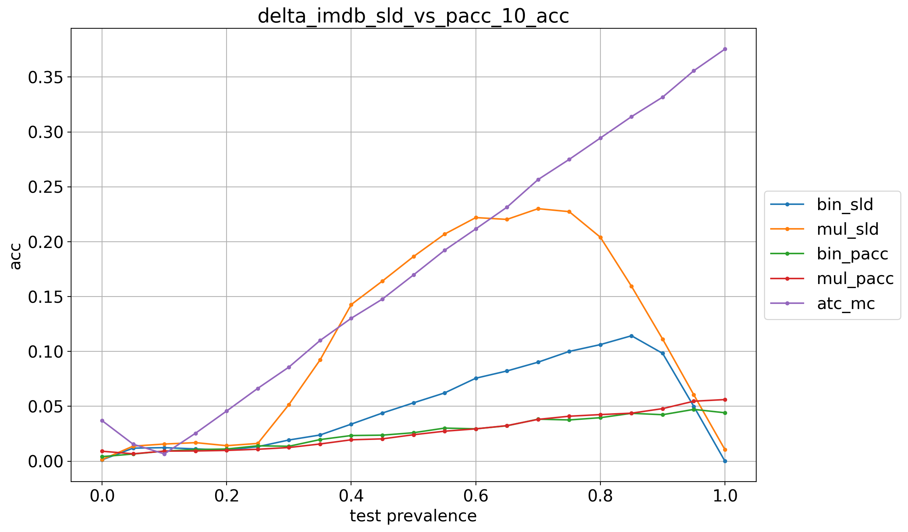
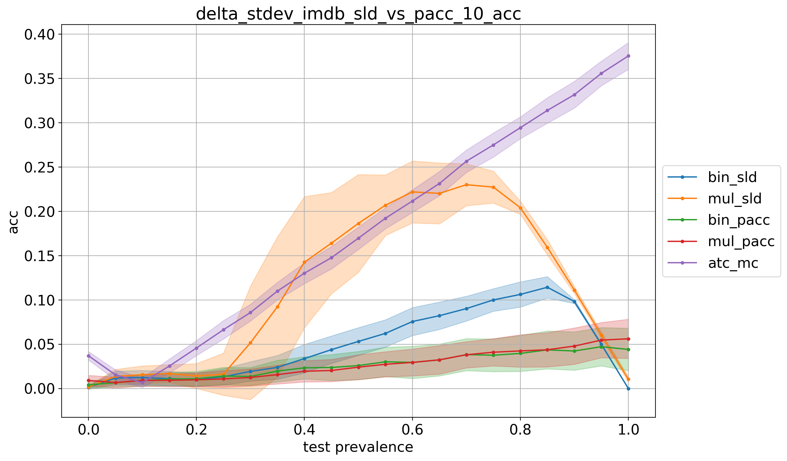
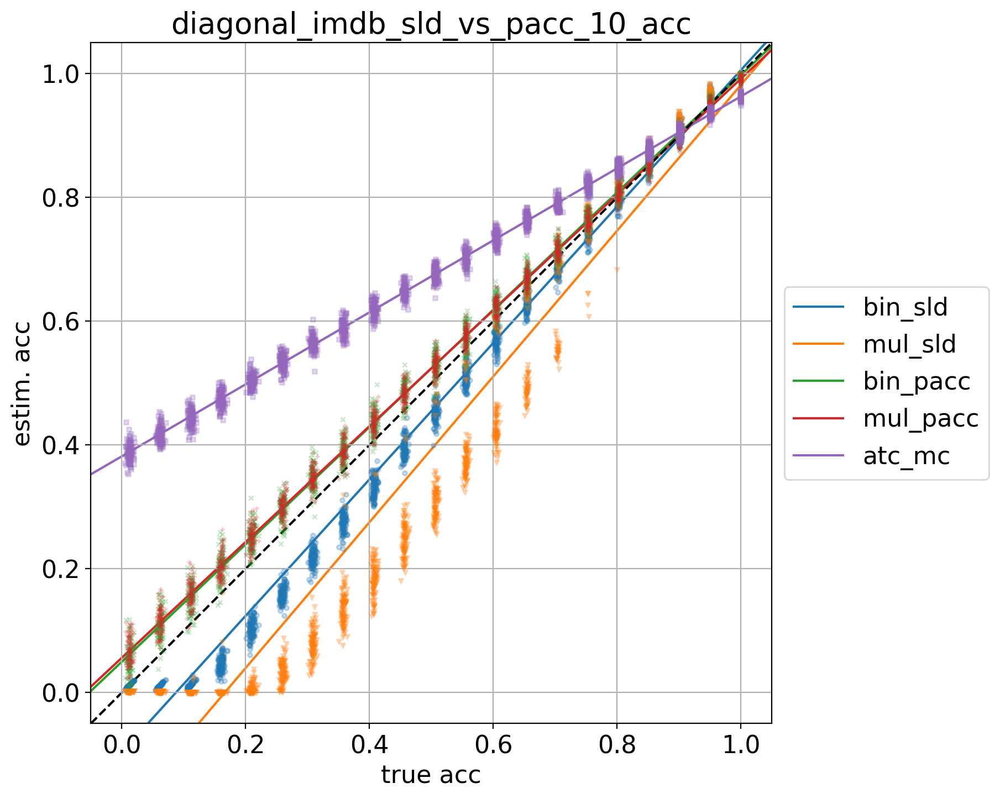
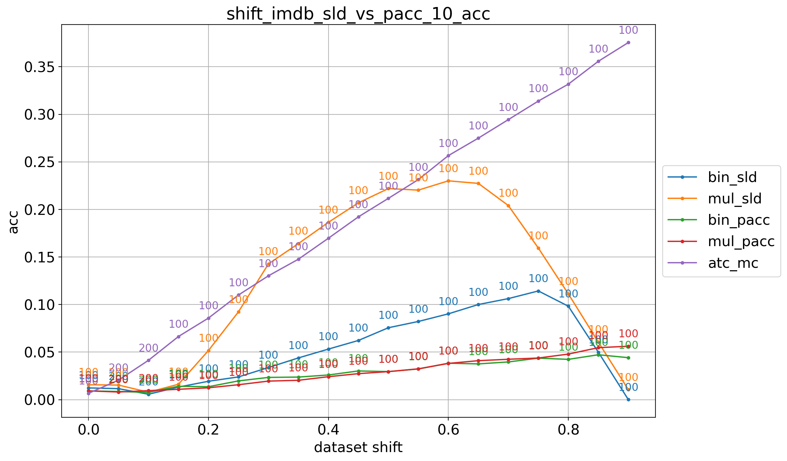

## 20% positives
> train: [0.7999712 0.2000288]  
> validation: [0.7999712 0.2000288]  
> bin_sld: 187.104s  
> mul_sld: 36.250s  
> binmc_sld: 185.481s  
> mulmc_sld: 31.669s  
> binne_sld: 187.316s  
> mulne_sld: 35.209s  
> bin_pacc: 177.023s  
> mul_pacc: 19.936s  
> ref: 13.278s  
> atc_mc: 17.449s  
> tot: 188.478s  

<table border="1" class="dataframe">
  <thead>
    <tr style="text-align: right;">
      <th></th>
      <th>bin_sld</th>
      <th>mul_sld</th>
      <th>bin_pacc</th>
      <th>mul_pacc</th>
      <th>atc_mc</th>
    </tr>
  </thead>
  <tbody>
    <tr>
      <th>0.0</th>
      <td>0.0017</td>
      <td>0.0023</td>
      <td>0.0029</td>
      <td>0.0059</td>
      <td>0.0286</td>
    </tr>
    <tr>
      <th>0.05</th>
      <td>0.0107</td>
      <td>0.0130</td>
      <td>0.0095</td>
      <td>0.0095</td>
      <td>0.0195</td>
    </tr>
    <tr>
      <th>0.1</th>
      <td>0.0136</td>
      <td>0.0154</td>
      <td>0.0126</td>
      <td>0.0122</td>
      <td>0.0114</td>
    </tr>
    <tr>
      <th>0.15</th>
      <td>0.0148</td>
      <td>0.0159</td>
      <td>0.0147</td>
      <td>0.0137</td>
      <td>0.0075</td>
    </tr>
    <tr>
      <th>0.2</th>
      <td>0.0141</td>
      <td>0.0143</td>
      <td>0.0160</td>
      <td>0.0157</td>
      <td>0.0108</td>
    </tr>
    <tr>
      <th>0.25</th>
      <td>0.0127</td>
      <td>0.0123</td>
      <td>0.0162</td>
      <td>0.0179</td>
      <td>0.0177</td>
    </tr>
    <tr>
      <th>0.3</th>
      <td>0.0129</td>
      <td>0.0135</td>
      <td>0.0197</td>
      <td>0.0211</td>
      <td>0.0238</td>
    </tr>
    <tr>
      <th>0.35</th>
      <td>0.0133</td>
      <td>0.0166</td>
      <td>0.0244</td>
      <td>0.0261</td>
      <td>0.0367</td>
    </tr>
    <tr>
      <th>0.4</th>
      <td>0.0142</td>
      <td>0.0217</td>
      <td>0.0267</td>
      <td>0.0284</td>
      <td>0.0448</td>
    </tr>
    <tr>
      <th>0.45</th>
      <td>0.0165</td>
      <td>0.0238</td>
      <td>0.0244</td>
      <td>0.0280</td>
      <td>0.0538</td>
    </tr>
    <tr>
      <th>0.5</th>
      <td>0.0181</td>
      <td>0.0321</td>
      <td>0.0254</td>
      <td>0.0308</td>
      <td>0.0640</td>
    </tr>
    <tr>
      <th>0.55</th>
      <td>0.0206</td>
      <td>0.0412</td>
      <td>0.0314</td>
      <td>0.0354</td>
      <td>0.0729</td>
    </tr>
    <tr>
      <th>0.6</th>
      <td>0.0273</td>
      <td>0.0514</td>
      <td>0.0332</td>
      <td>0.0387</td>
      <td>0.0810</td>
    </tr>
    <tr>
      <th>0.65</th>
      <td>0.0289</td>
      <td>0.0573</td>
      <td>0.0335</td>
      <td>0.0425</td>
      <td>0.0895</td>
    </tr>
    <tr>
      <th>0.7</th>
      <td>0.0368</td>
      <td>0.0676</td>
      <td>0.0369</td>
      <td>0.0458</td>
      <td>0.1031</td>
    </tr>
    <tr>
      <th>0.75</th>
      <td>0.0380</td>
      <td>0.0730</td>
      <td>0.0345</td>
      <td>0.0439</td>
      <td>0.1092</td>
    </tr>
    <tr>
      <th>0.8</th>
      <td>0.0447</td>
      <td>0.0835</td>
      <td>0.0421</td>
      <td>0.0520</td>
      <td>0.1170</td>
    </tr>
    <tr>
      <th>0.85</th>
      <td>0.0508</td>
      <td>0.0948</td>
      <td>0.0466</td>
      <td>0.0578</td>
      <td>0.1265</td>
    </tr>
    <tr>
      <th>0.9</th>
      <td>0.0534</td>
      <td>0.1011</td>
      <td>0.0466</td>
      <td>0.0624</td>
      <td>0.1322</td>
    </tr>
    <tr>
      <th>0.95</th>
      <td>0.0482</td>
      <td>0.1026</td>
      <td>0.0476</td>
      <td>0.0612</td>
      <td>0.1443</td>
    </tr>
    <tr>
      <th>1.0</th>
      <td>0.0022</td>
      <td>0.0820</td>
      <td>0.0454</td>
      <td>0.0641</td>
      <td>0.1494</td>
    </tr>
    <tr>
      <th>avg</th>
      <td>0.0235</td>
      <td>0.0445</td>
      <td>0.0281</td>
      <td>0.0339</td>
      <td>0.0687</td>
    </tr>
  </tbody>
</table>

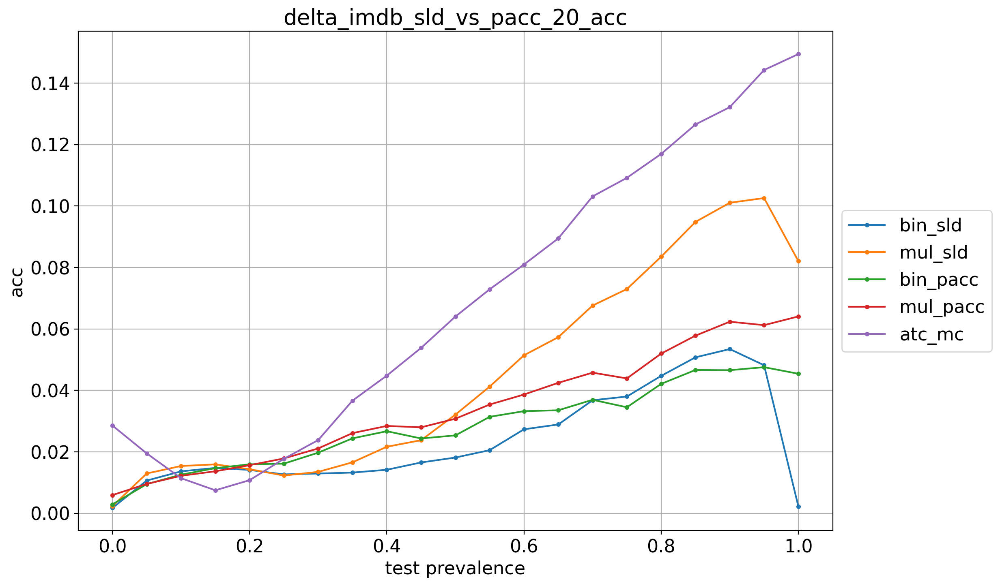
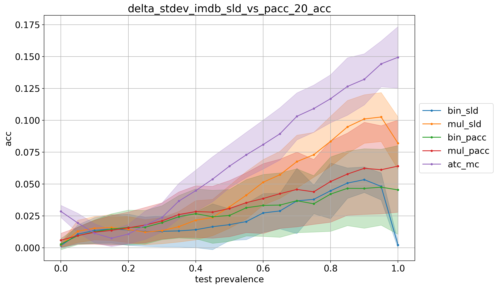
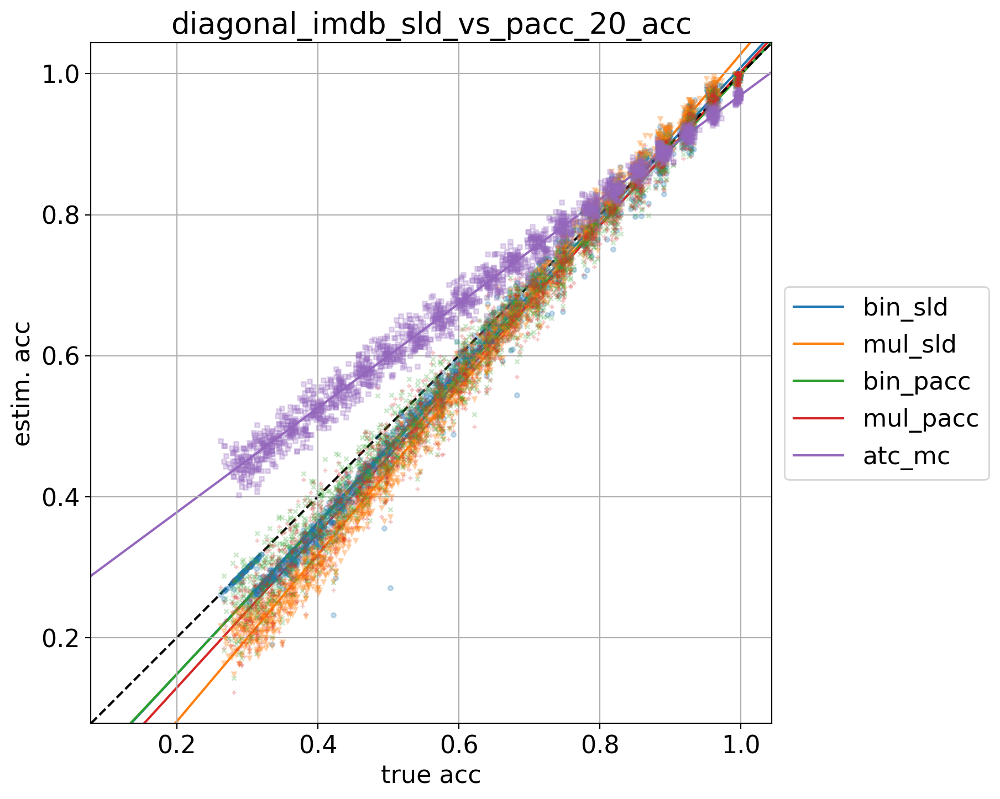
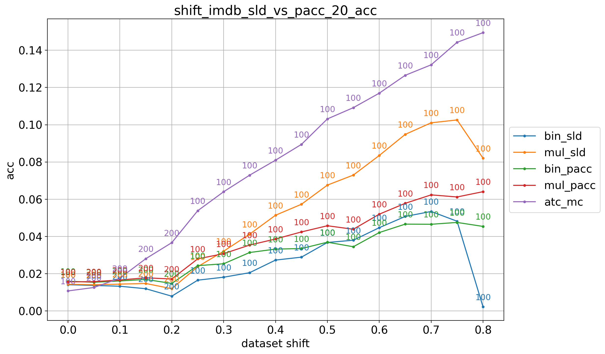

## 30% positives
> train: [0.7000288 0.2999712]  
> validation: [0.7000288 0.2999712]  
> bin_sld: 182.167s  
> mul_sld: 29.557s  
> binmc_sld: 180.200s  
> mulmc_sld: 28.430s  
> binne_sld: 181.220s  
> mulne_sld: 28.868s  
> bin_pacc: 174.026s  
> mul_pacc: 20.400s  
> ref: 13.451s  
> atc_mc: 18.102s  
> tot: 183.051s  

<table border="1" class="dataframe">
  <thead>
    <tr style="text-align: right;">
      <th></th>
      <th>bin_sld</th>
      <th>mul_sld</th>
      <th>bin_pacc</th>
      <th>mul_pacc</th>
      <th>atc_mc</th>
    </tr>
  </thead>
  <tbody>
    <tr>
      <th>0.0</th>
      <td>0.0016</td>
      <td>0.0036</td>
      <td>0.0062</td>
      <td>0.0096</td>
      <td>0.0279</td>
    </tr>
    <tr>
      <th>0.05</th>
      <td>0.0103</td>
      <td>0.0143</td>
      <td>0.0120</td>
      <td>0.0123</td>
      <td>0.0220</td>
    </tr>
    <tr>
      <th>0.1</th>
      <td>0.0172</td>
      <td>0.0203</td>
      <td>0.0132</td>
      <td>0.0129</td>
      <td>0.0157</td>
    </tr>
    <tr>
      <th>0.15</th>
      <td>0.0171</td>
      <td>0.0212</td>
      <td>0.0139</td>
      <td>0.0132</td>
      <td>0.0111</td>
    </tr>
    <tr>
      <th>0.2</th>
      <td>0.0172</td>
      <td>0.0197</td>
      <td>0.0144</td>
      <td>0.0145</td>
      <td>0.0108</td>
    </tr>
    <tr>
      <th>0.25</th>
      <td>0.0175</td>
      <td>0.0168</td>
      <td>0.0169</td>
      <td>0.0165</td>
      <td>0.0106</td>
    </tr>
    <tr>
      <th>0.3</th>
      <td>0.0176</td>
      <td>0.0185</td>
      <td>0.0159</td>
      <td>0.0156</td>
      <td>0.0105</td>
    </tr>
    <tr>
      <th>0.35</th>
      <td>0.0167</td>
      <td>0.0157</td>
      <td>0.0214</td>
      <td>0.0196</td>
      <td>0.0143</td>
    </tr>
    <tr>
      <th>0.4</th>
      <td>0.0154</td>
      <td>0.0159</td>
      <td>0.0220</td>
      <td>0.0203</td>
      <td>0.0199</td>
    </tr>
    <tr>
      <th>0.45</th>
      <td>0.0136</td>
      <td>0.0150</td>
      <td>0.0214</td>
      <td>0.0202</td>
      <td>0.0235</td>
    </tr>
    <tr>
      <th>0.5</th>
      <td>0.0160</td>
      <td>0.0192</td>
      <td>0.0251</td>
      <td>0.0231</td>
      <td>0.0301</td>
    </tr>
    <tr>
      <th>0.55</th>
      <td>0.0150</td>
      <td>0.0192</td>
      <td>0.0252</td>
      <td>0.0222</td>
      <td>0.0355</td>
    </tr>
    <tr>
      <th>0.6</th>
      <td>0.0153</td>
      <td>0.0232</td>
      <td>0.0264</td>
      <td>0.0229</td>
      <td>0.0404</td>
    </tr>
    <tr>
      <th>0.65</th>
      <td>0.0170</td>
      <td>0.0261</td>
      <td>0.0286</td>
      <td>0.0257</td>
      <td>0.0442</td>
    </tr>
    <tr>
      <th>0.7</th>
      <td>0.0237</td>
      <td>0.0352</td>
      <td>0.0332</td>
      <td>0.0284</td>
      <td>0.0517</td>
    </tr>
    <tr>
      <th>0.75</th>
      <td>0.0239</td>
      <td>0.0384</td>
      <td>0.0323</td>
      <td>0.0276</td>
      <td>0.0584</td>
    </tr>
    <tr>
      <th>0.8</th>
      <td>0.0265</td>
      <td>0.0416</td>
      <td>0.0354</td>
      <td>0.0305</td>
      <td>0.0608</td>
    </tr>
    <tr>
      <th>0.85</th>
      <td>0.0314</td>
      <td>0.0504</td>
      <td>0.0393</td>
      <td>0.0326</td>
      <td>0.0669</td>
    </tr>
    <tr>
      <th>0.9</th>
      <td>0.0329</td>
      <td>0.0522</td>
      <td>0.0405</td>
      <td>0.0335</td>
      <td>0.0698</td>
    </tr>
    <tr>
      <th>0.95</th>
      <td>0.0339</td>
      <td>0.0540</td>
      <td>0.0394</td>
      <td>0.0325</td>
      <td>0.0804</td>
    </tr>
    <tr>
      <th>1.0</th>
      <td>0.0030</td>
      <td>0.0222</td>
      <td>0.0332</td>
      <td>0.0345</td>
      <td>0.0817</td>
    </tr>
    <tr>
      <th>avg</th>
      <td>0.0182</td>
      <td>0.0259</td>
      <td>0.0246</td>
      <td>0.0223</td>
      <td>0.0374</td>
    </tr>
  </tbody>
</table>

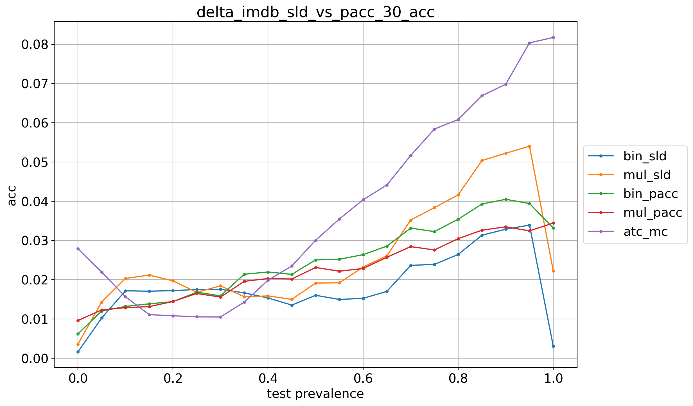
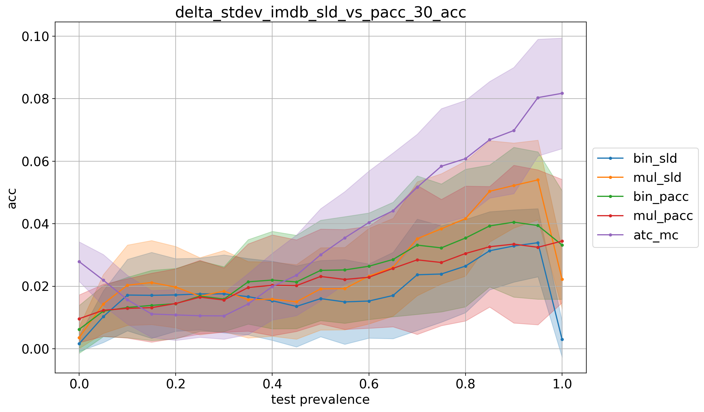

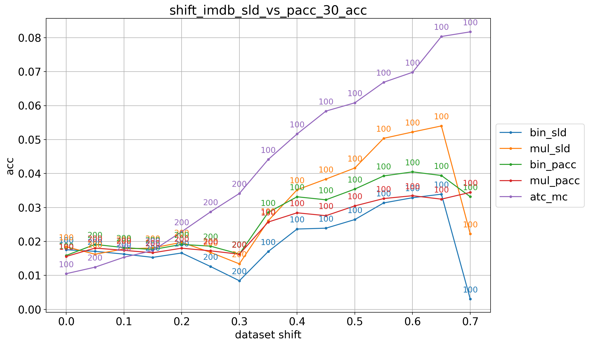

## 40% positives
> train: [0.5999424 0.4000576]  
> validation: [0.60008641 0.39991359]  
> bin_sld: 181.684s  
> mul_sld: 30.343s  
> binmc_sld: 179.998s  
> mulmc_sld: 29.275s  
> binne_sld: 182.085s  
> mulne_sld: 29.662s  
> bin_pacc: 176.735s  
> mul_pacc: 20.744s  
> ref: 13.516s  
> atc_mc: 17.986s  
> tot: 183.203s  

<table border="1" class="dataframe">
  <thead>
    <tr style="text-align: right;">
      <th></th>
      <th>bin_sld</th>
      <th>mul_sld</th>
      <th>bin_pacc</th>
      <th>mul_pacc</th>
      <th>atc_mc</th>
    </tr>
  </thead>
  <tbody>
    <tr>
      <th>0.0</th>
      <td>0.0016</td>
      <td>0.0042</td>
      <td>0.0073</td>
      <td>0.0112</td>
      <td>0.0207</td>
    </tr>
    <tr>
      <th>0.05</th>
      <td>0.0082</td>
      <td>0.0106</td>
      <td>0.0121</td>
      <td>0.0144</td>
      <td>0.0204</td>
    </tr>
    <tr>
      <th>0.1</th>
      <td>0.0137</td>
      <td>0.0151</td>
      <td>0.0137</td>
      <td>0.0157</td>
      <td>0.0160</td>
    </tr>
    <tr>
      <th>0.15</th>
      <td>0.0173</td>
      <td>0.0181</td>
      <td>0.0156</td>
      <td>0.0178</td>
      <td>0.0151</td>
    </tr>
    <tr>
      <th>0.2</th>
      <td>0.0184</td>
      <td>0.0204</td>
      <td>0.0158</td>
      <td>0.0181</td>
      <td>0.0133</td>
    </tr>
    <tr>
      <th>0.25</th>
      <td>0.0167</td>
      <td>0.0204</td>
      <td>0.0127</td>
      <td>0.0154</td>
      <td>0.0099</td>
    </tr>
    <tr>
      <th>0.3</th>
      <td>0.0208</td>
      <td>0.0247</td>
      <td>0.0154</td>
      <td>0.0177</td>
      <td>0.0107</td>
    </tr>
    <tr>
      <th>0.35</th>
      <td>0.0181</td>
      <td>0.0191</td>
      <td>0.0177</td>
      <td>0.0200</td>
      <td>0.0089</td>
    </tr>
    <tr>
      <th>0.4</th>
      <td>0.0175</td>
      <td>0.0178</td>
      <td>0.0189</td>
      <td>0.0207</td>
      <td>0.0099</td>
    </tr>
    <tr>
      <th>0.45</th>
      <td>0.0188</td>
      <td>0.0181</td>
      <td>0.0192</td>
      <td>0.0207</td>
      <td>0.0109</td>
    </tr>
    <tr>
      <th>0.5</th>
      <td>0.0206</td>
      <td>0.0183</td>
      <td>0.0229</td>
      <td>0.0231</td>
      <td>0.0115</td>
    </tr>
    <tr>
      <th>0.55</th>
      <td>0.0183</td>
      <td>0.0173</td>
      <td>0.0220</td>
      <td>0.0212</td>
      <td>0.0117</td>
    </tr>
    <tr>
      <th>0.6</th>
      <td>0.0178</td>
      <td>0.0165</td>
      <td>0.0252</td>
      <td>0.0240</td>
      <td>0.0135</td>
    </tr>
    <tr>
      <th>0.65</th>
      <td>0.0158</td>
      <td>0.0153</td>
      <td>0.0251</td>
      <td>0.0232</td>
      <td>0.0142</td>
    </tr>
    <tr>
      <th>0.7</th>
      <td>0.0176</td>
      <td>0.0173</td>
      <td>0.0274</td>
      <td>0.0245</td>
      <td>0.0168</td>
    </tr>
    <tr>
      <th>0.75</th>
      <td>0.0173</td>
      <td>0.0189</td>
      <td>0.0290</td>
      <td>0.0256</td>
      <td>0.0182</td>
    </tr>
    <tr>
      <th>0.8</th>
      <td>0.0178</td>
      <td>0.0206</td>
      <td>0.0307</td>
      <td>0.0262</td>
      <td>0.0198</td>
    </tr>
    <tr>
      <th>0.85</th>
      <td>0.0210</td>
      <td>0.0266</td>
      <td>0.0339</td>
      <td>0.0276</td>
      <td>0.0229</td>
    </tr>
    <tr>
      <th>0.9</th>
      <td>0.0214</td>
      <td>0.0267</td>
      <td>0.0321</td>
      <td>0.0262</td>
      <td>0.0272</td>
    </tr>
    <tr>
      <th>0.95</th>
      <td>0.0236</td>
      <td>0.0307</td>
      <td>0.0356</td>
      <td>0.0282</td>
      <td>0.0283</td>
    </tr>
    <tr>
      <th>1.0</th>
      <td>0.0037</td>
      <td>0.0109</td>
      <td>0.0317</td>
      <td>0.0268</td>
      <td>0.0310</td>
    </tr>
    <tr>
      <th>avg</th>
      <td>0.0165</td>
      <td>0.0185</td>
      <td>0.0221</td>
      <td>0.0213</td>
      <td>0.0167</td>
    </tr>
  </tbody>
</table>

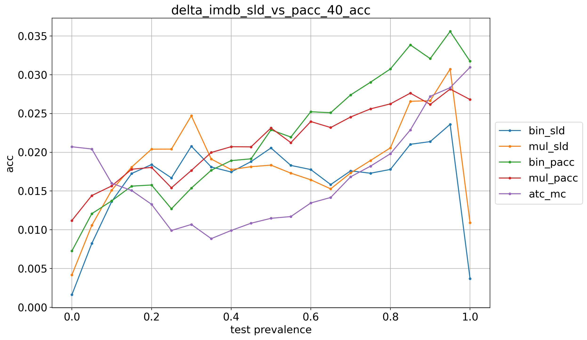
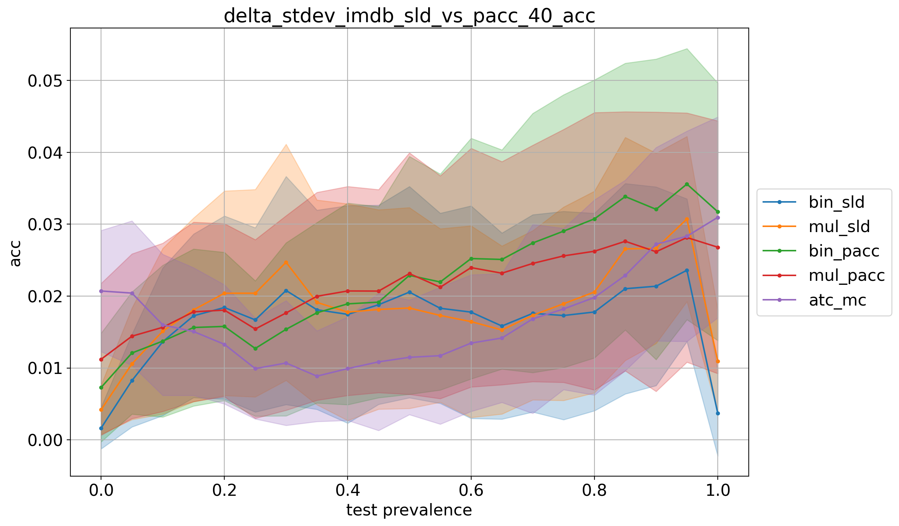
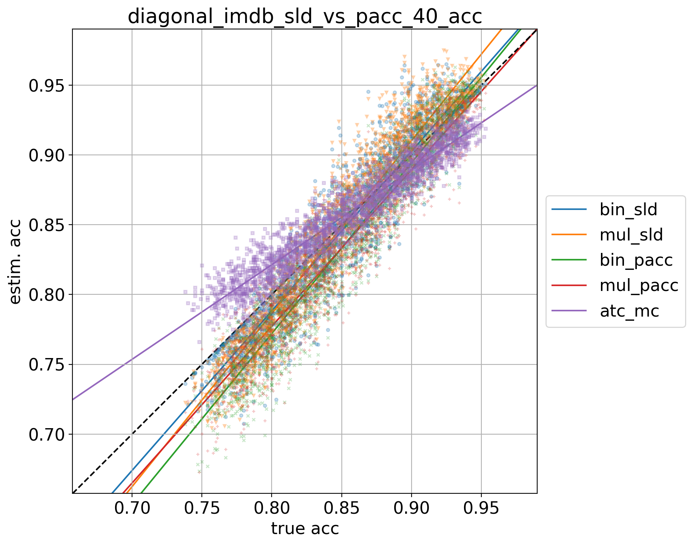
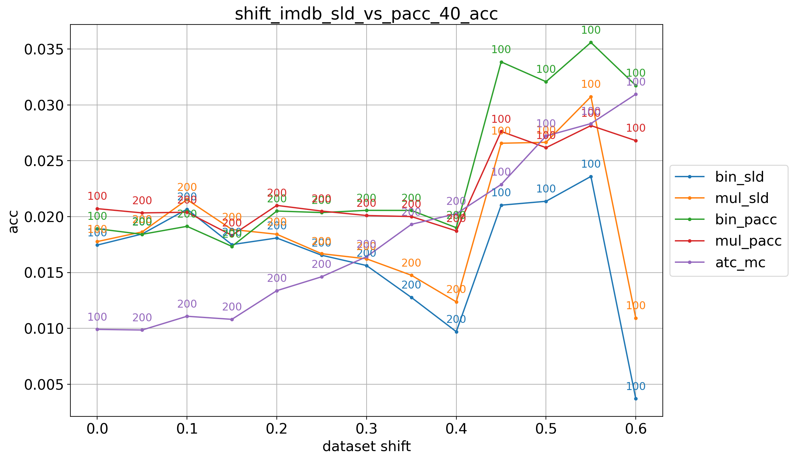

## 50% positives
> train: [0.5 0.5]  
> validation: [0.5 0.5]  
> bin_sld: 183.289s  
> mul_sld: 29.440s  
> binmc_sld: 180.043s  
> mulmc_sld: 29.019s  
> binne_sld: 182.581s  
> mulne_sld: 29.161s  
> bin_pacc: 175.513s  
> mul_pacc: 20.580s  
> ref: 13.469s  
> atc_mc: 18.022s  
> tot: 183.861s  

<table border="1" class="dataframe">
  <thead>
    <tr style="text-align: right;">
      <th></th>
      <th>bin_sld</th>
      <th>mul_sld</th>
      <th>bin_pacc</th>
      <th>mul_pacc</th>
      <th>atc_mc</th>
    </tr>
  </thead>
  <tbody>
    <tr>
      <th>0.0</th>
      <td>0.0010</td>
      <td>0.0037</td>
      <td>0.0097</td>
      <td>0.0168</td>
      <td>0.0100</td>
    </tr>
    <tr>
      <th>0.05</th>
      <td>0.0085</td>
      <td>0.0101</td>
      <td>0.0115</td>
      <td>0.0183</td>
      <td>0.0090</td>
    </tr>
    <tr>
      <th>0.1</th>
      <td>0.0082</td>
      <td>0.0110</td>
      <td>0.0134</td>
      <td>0.0196</td>
      <td>0.0096</td>
    </tr>
    <tr>
      <th>0.15</th>
      <td>0.0105</td>
      <td>0.0135</td>
      <td>0.0145</td>
      <td>0.0208</td>
      <td>0.0085</td>
    </tr>
    <tr>
      <th>0.2</th>
      <td>0.0132</td>
      <td>0.0159</td>
      <td>0.0139</td>
      <td>0.0214</td>
      <td>0.0086</td>
    </tr>
    <tr>
      <th>0.25</th>
      <td>0.0150</td>
      <td>0.0170</td>
      <td>0.0137</td>
      <td>0.0212</td>
      <td>0.0094</td>
    </tr>
    <tr>
      <th>0.3</th>
      <td>0.0192</td>
      <td>0.0218</td>
      <td>0.0150</td>
      <td>0.0212</td>
      <td>0.0098</td>
    </tr>
    <tr>
      <th>0.35</th>
      <td>0.0178</td>
      <td>0.0203</td>
      <td>0.0136</td>
      <td>0.0243</td>
      <td>0.0094</td>
    </tr>
    <tr>
      <th>0.4</th>
      <td>0.0166</td>
      <td>0.0200</td>
      <td>0.0132</td>
      <td>0.0255</td>
      <td>0.0101</td>
    </tr>
    <tr>
      <th>0.45</th>
      <td>0.0187</td>
      <td>0.0237</td>
      <td>0.0138</td>
      <td>0.0243</td>
      <td>0.0103</td>
    </tr>
    <tr>
      <th>0.5</th>
      <td>0.0179</td>
      <td>0.0201</td>
      <td>0.0164</td>
      <td>0.0283</td>
      <td>0.0124</td>
    </tr>
    <tr>
      <th>0.55</th>
      <td>0.0185</td>
      <td>0.0226</td>
      <td>0.0168</td>
      <td>0.0274</td>
      <td>0.0113</td>
    </tr>
    <tr>
      <th>0.6</th>
      <td>0.0201</td>
      <td>0.0229</td>
      <td>0.0173</td>
      <td>0.0288</td>
      <td>0.0110</td>
    </tr>
    <tr>
      <th>0.65</th>
      <td>0.0201</td>
      <td>0.0219</td>
      <td>0.0165</td>
      <td>0.0258</td>
      <td>0.0112</td>
    </tr>
    <tr>
      <th>0.7</th>
      <td>0.0171</td>
      <td>0.0165</td>
      <td>0.0169</td>
      <td>0.0294</td>
      <td>0.0109</td>
    </tr>
    <tr>
      <th>0.75</th>
      <td>0.0183</td>
      <td>0.0166</td>
      <td>0.0187</td>
      <td>0.0308</td>
      <td>0.0109</td>
    </tr>
    <tr>
      <th>0.8</th>
      <td>0.0173</td>
      <td>0.0151</td>
      <td>0.0189</td>
      <td>0.0297</td>
      <td>0.0100</td>
    </tr>
    <tr>
      <th>0.85</th>
      <td>0.0171</td>
      <td>0.0134</td>
      <td>0.0195</td>
      <td>0.0310</td>
      <td>0.0107</td>
    </tr>
    <tr>
      <th>0.9</th>
      <td>0.0140</td>
      <td>0.0105</td>
      <td>0.0187</td>
      <td>0.0288</td>
      <td>0.0114</td>
    </tr>
    <tr>
      <th>0.95</th>
      <td>0.0175</td>
      <td>0.0146</td>
      <td>0.0213</td>
      <td>0.0331</td>
      <td>0.0119</td>
    </tr>
    <tr>
      <th>1.0</th>
      <td>0.0062</td>
      <td>0.0076</td>
      <td>0.0200</td>
      <td>0.0306</td>
      <td>0.0107</td>
    </tr>
    <tr>
      <th>avg</th>
      <td>0.0149</td>
      <td>0.0161</td>
      <td>0.0159</td>
      <td>0.0256</td>
      <td>0.0103</td>
    </tr>
  </tbody>
</table>

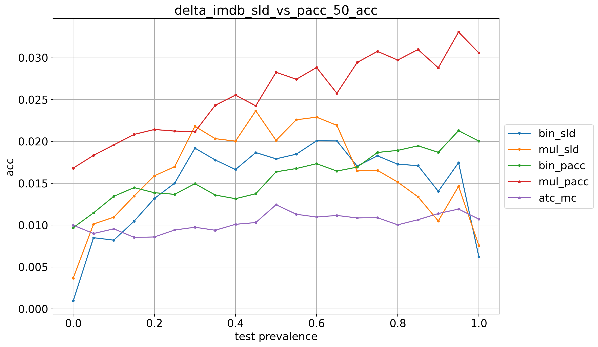
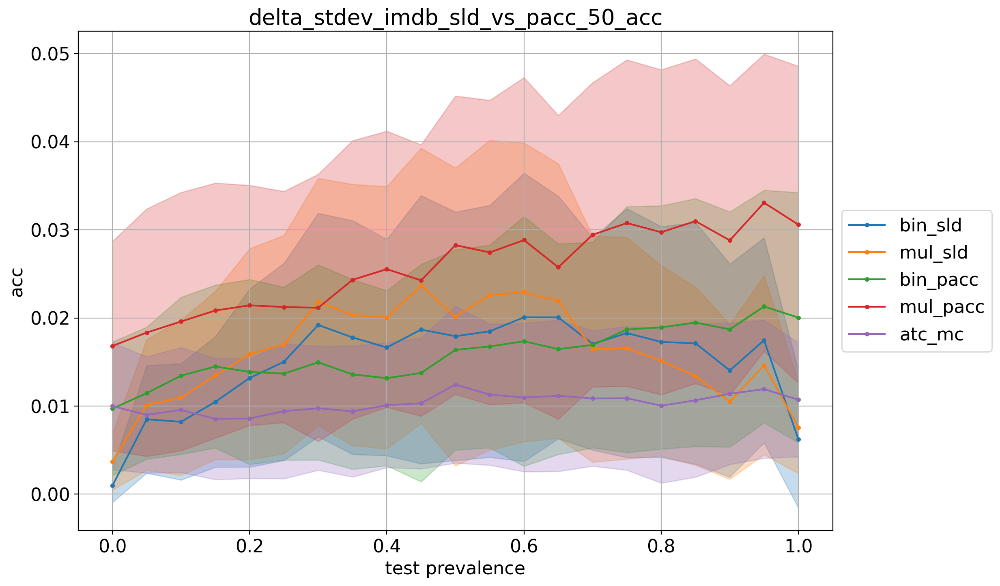
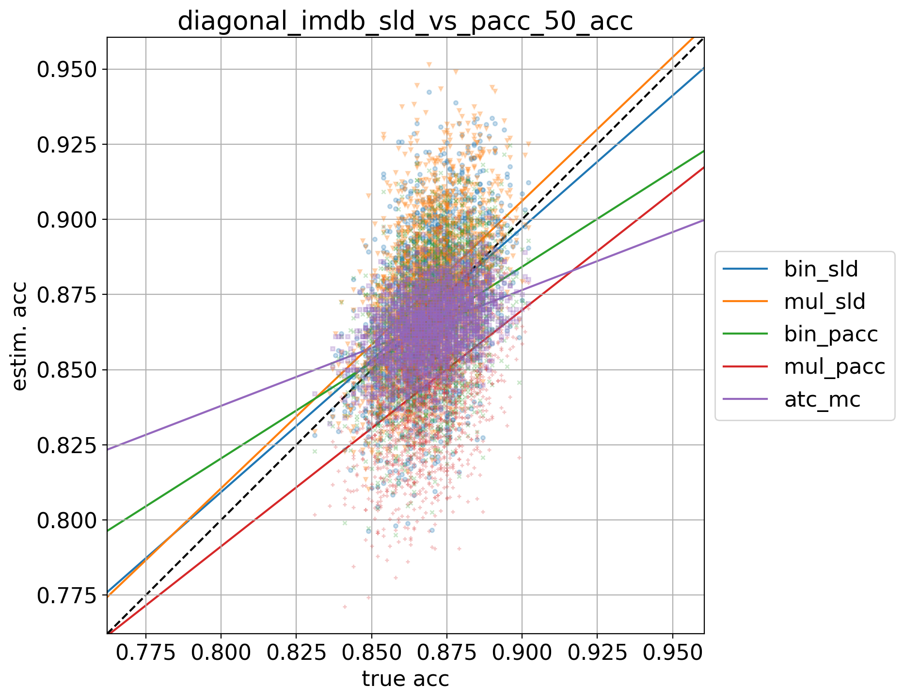
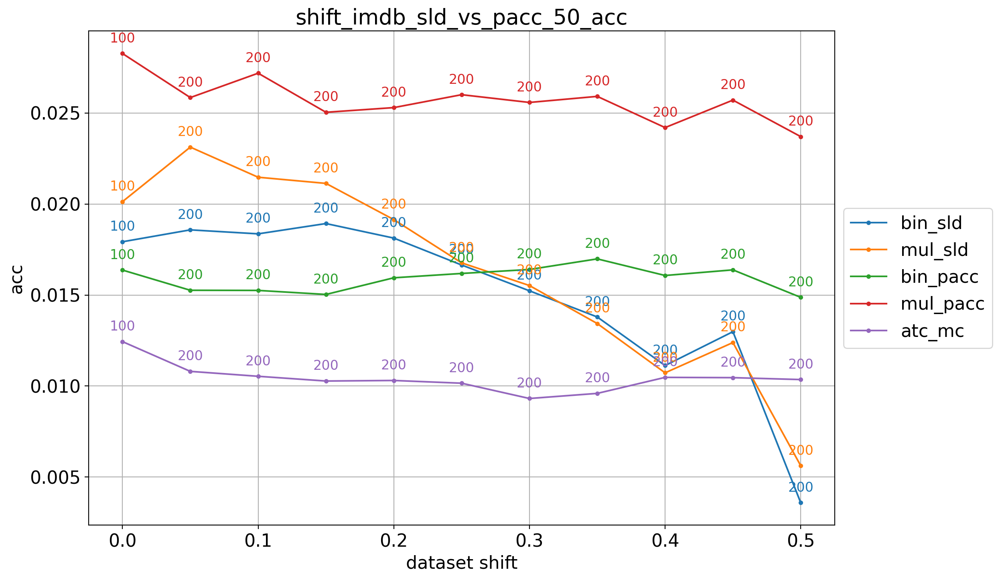

## 60% positives
> train: [0.39991359 0.60008641]  
> validation: [0.4000576 0.5999424]  
> bin_sld: 181.668s  
> mul_sld: 29.617s  
> binmc_sld: 180.480s  
> mulmc_sld: 28.823s  
> binne_sld: 182.053s  
> mulne_sld: 28.654s  
> bin_pacc: 176.533s  
> mul_pacc: 20.753s  
> ref: 13.464s  
> atc_mc: 17.977s  
> tot: 183.024s  

<table border="1" class="dataframe">
  <thead>
    <tr style="text-align: right;">
      <th></th>
      <th>bin_sld</th>
      <th>mul_sld</th>
      <th>bin_pacc</th>
      <th>mul_pacc</th>
      <th>atc_mc</th>
    </tr>
  </thead>
  <tbody>
    <tr>
      <th>0.0</th>
      <td>0.0006</td>
      <td>0.0046</td>
      <td>0.0079</td>
      <td>0.0111</td>
      <td>0.0238</td>
    </tr>
    <tr>
      <th>0.05</th>
      <td>0.0227</td>
      <td>0.0210</td>
      <td>0.0259</td>
      <td>0.0169</td>
      <td>0.0205</td>
    </tr>
    <tr>
      <th>0.1</th>
      <td>0.0223</td>
      <td>0.0205</td>
      <td>0.0233</td>
      <td>0.0157</td>
      <td>0.0209</td>
    </tr>
    <tr>
      <th>0.15</th>
      <td>0.0226</td>
      <td>0.0198</td>
      <td>0.0263</td>
      <td>0.0168</td>
      <td>0.0139</td>
    </tr>
    <tr>
      <th>0.2</th>
      <td>0.0183</td>
      <td>0.0186</td>
      <td>0.0262</td>
      <td>0.0189</td>
      <td>0.0166</td>
    </tr>
    <tr>
      <th>0.25</th>
      <td>0.0160</td>
      <td>0.0154</td>
      <td>0.0257</td>
      <td>0.0169</td>
      <td>0.0133</td>
    </tr>
    <tr>
      <th>0.3</th>
      <td>0.0140</td>
      <td>0.0156</td>
      <td>0.0249</td>
      <td>0.0182</td>
      <td>0.0127</td>
    </tr>
    <tr>
      <th>0.35</th>
      <td>0.0165</td>
      <td>0.0166</td>
      <td>0.0292</td>
      <td>0.0209</td>
      <td>0.0116</td>
    </tr>
    <tr>
      <th>0.4</th>
      <td>0.0141</td>
      <td>0.0148</td>
      <td>0.0296</td>
      <td>0.0215</td>
      <td>0.0120</td>
    </tr>
    <tr>
      <th>0.45</th>
      <td>0.0138</td>
      <td>0.0151</td>
      <td>0.0273</td>
      <td>0.0205</td>
      <td>0.0118</td>
    </tr>
    <tr>
      <th>0.5</th>
      <td>0.0161</td>
      <td>0.0165</td>
      <td>0.0322</td>
      <td>0.0252</td>
      <td>0.0122</td>
    </tr>
    <tr>
      <th>0.55</th>
      <td>0.0150</td>
      <td>0.0165</td>
      <td>0.0305</td>
      <td>0.0237</td>
      <td>0.0127</td>
    </tr>
    <tr>
      <th>0.6</th>
      <td>0.0174</td>
      <td>0.0183</td>
      <td>0.0339</td>
      <td>0.0266</td>
      <td>0.0134</td>
    </tr>
    <tr>
      <th>0.65</th>
      <td>0.0184</td>
      <td>0.0196</td>
      <td>0.0301</td>
      <td>0.0239</td>
      <td>0.0147</td>
    </tr>
    <tr>
      <th>0.7</th>
      <td>0.0184</td>
      <td>0.0152</td>
      <td>0.0363</td>
      <td>0.0302</td>
      <td>0.0193</td>
    </tr>
    <tr>
      <th>0.75</th>
      <td>0.0196</td>
      <td>0.0153</td>
      <td>0.0353</td>
      <td>0.0298</td>
      <td>0.0206</td>
    </tr>
    <tr>
      <th>0.8</th>
      <td>0.0198</td>
      <td>0.0178</td>
      <td>0.0328</td>
      <td>0.0290</td>
      <td>0.0241</td>
    </tr>
    <tr>
      <th>0.85</th>
      <td>0.0206</td>
      <td>0.0140</td>
      <td>0.0344</td>
      <td>0.0312</td>
      <td>0.0237</td>
    </tr>
    <tr>
      <th>0.9</th>
      <td>0.0194</td>
      <td>0.0114</td>
      <td>0.0339</td>
      <td>0.0308</td>
      <td>0.0286</td>
    </tr>
    <tr>
      <th>0.95</th>
      <td>0.0240</td>
      <td>0.0119</td>
      <td>0.0384</td>
      <td>0.0369</td>
      <td>0.0316</td>
    </tr>
    <tr>
      <th>1.0</th>
      <td>0.0113</td>
      <td>0.0075</td>
      <td>0.0361</td>
      <td>0.0367</td>
      <td>0.0343</td>
    </tr>
    <tr>
      <th>avg</th>
      <td>0.0172</td>
      <td>0.0155</td>
      <td>0.0295</td>
      <td>0.0239</td>
      <td>0.0187</td>
    </tr>
  </tbody>
</table>

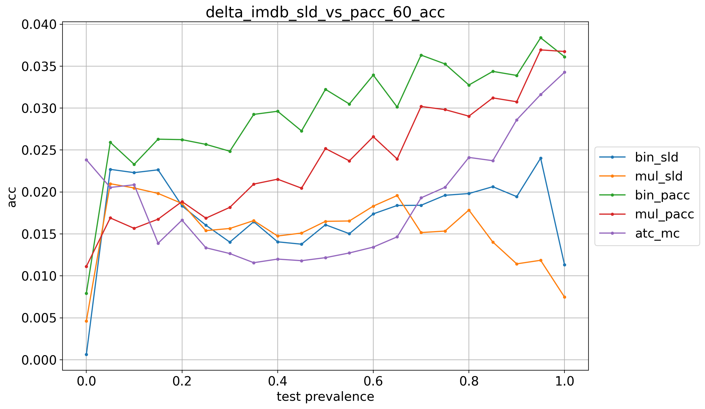
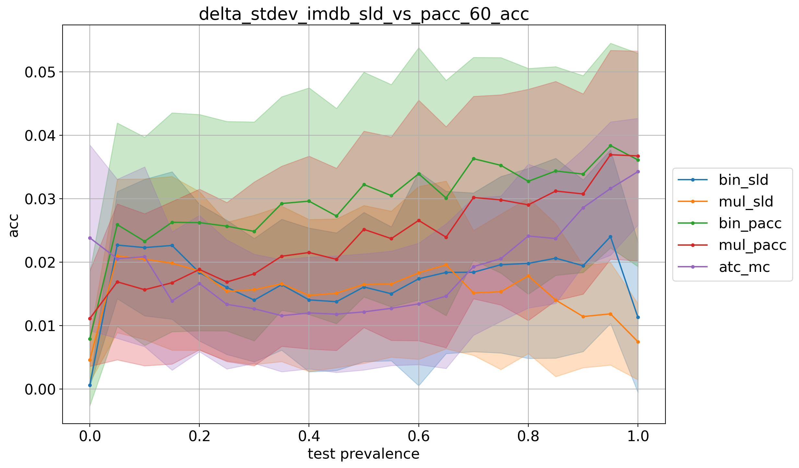
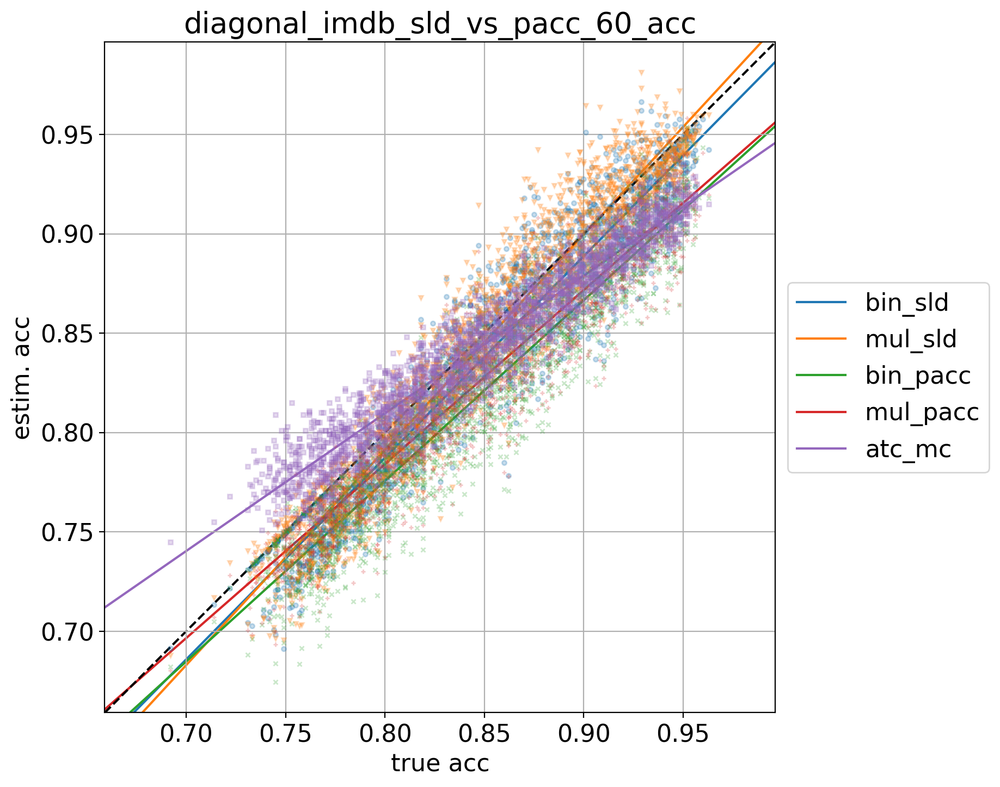
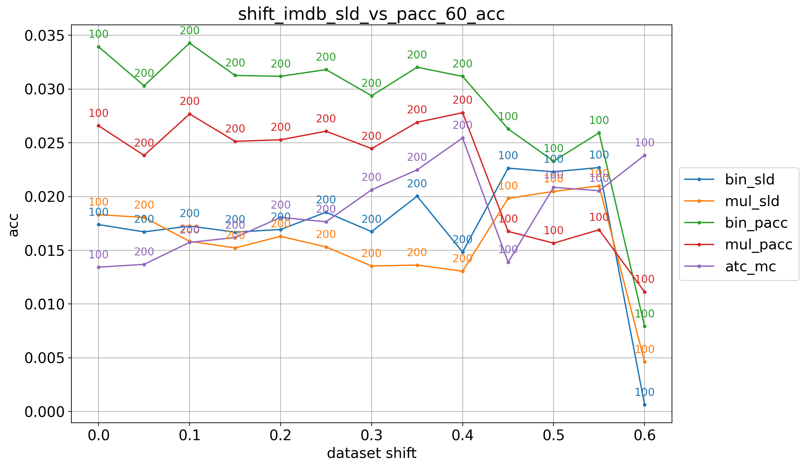

## 70% positives
> train: [0.2999712 0.7000288]  
> validation: [0.2999712 0.7000288]  
> bin_sld: 183.652s  
> mul_sld: 28.322s  
> binmc_sld: 181.431s  
> mulmc_sld: 27.437s  
> binne_sld: 182.010s  
> mulne_sld: 28.139s  
> bin_pacc: 175.741s  
> mul_pacc: 20.586s  
> ref: 13.757s  
> atc_mc: 17.949s  
> tot: 184.200s  

<table border="1" class="dataframe">
  <thead>
    <tr style="text-align: right;">
      <th></th>
      <th>bin_sld</th>
      <th>mul_sld</th>
      <th>bin_pacc</th>
      <th>mul_pacc</th>
      <th>atc_mc</th>
    </tr>
  </thead>
  <tbody>
    <tr>
      <th>0.0</th>
      <td>0.0005</td>
      <td>0.0048</td>
      <td>0.0066</td>
      <td>0.0236</td>
      <td>0.0699</td>
    </tr>
    <tr>
      <th>0.05</th>
      <td>0.0316</td>
      <td>0.0345</td>
      <td>0.0099</td>
      <td>0.0178</td>
      <td>0.0635</td>
    </tr>
    <tr>
      <th>0.1</th>
      <td>0.0315</td>
      <td>0.0352</td>
      <td>0.0109</td>
      <td>0.0181</td>
      <td>0.0617</td>
    </tr>
    <tr>
      <th>0.15</th>
      <td>0.0317</td>
      <td>0.0331</td>
      <td>0.0096</td>
      <td>0.0161</td>
      <td>0.0528</td>
    </tr>
    <tr>
      <th>0.2</th>
      <td>0.0279</td>
      <td>0.0283</td>
      <td>0.0120</td>
      <td>0.0175</td>
      <td>0.0507</td>
    </tr>
    <tr>
      <th>0.25</th>
      <td>0.0242</td>
      <td>0.0239</td>
      <td>0.0103</td>
      <td>0.0165</td>
      <td>0.0430</td>
    </tr>
    <tr>
      <th>0.3</th>
      <td>0.0204</td>
      <td>0.0199</td>
      <td>0.0109</td>
      <td>0.0151</td>
      <td>0.0386</td>
    </tr>
    <tr>
      <th>0.35</th>
      <td>0.0223</td>
      <td>0.0208</td>
      <td>0.0102</td>
      <td>0.0136</td>
      <td>0.0338</td>
    </tr>
    <tr>
      <th>0.4</th>
      <td>0.0186</td>
      <td>0.0198</td>
      <td>0.0115</td>
      <td>0.0139</td>
      <td>0.0306</td>
    </tr>
    <tr>
      <th>0.45</th>
      <td>0.0151</td>
      <td>0.0163</td>
      <td>0.0125</td>
      <td>0.0155</td>
      <td>0.0265</td>
    </tr>
    <tr>
      <th>0.5</th>
      <td>0.0150</td>
      <td>0.0166</td>
      <td>0.0133</td>
      <td>0.0147</td>
      <td>0.0207</td>
    </tr>
    <tr>
      <th>0.55</th>
      <td>0.0131</td>
      <td>0.0146</td>
      <td>0.0118</td>
      <td>0.0126</td>
      <td>0.0167</td>
    </tr>
    <tr>
      <th>0.6</th>
      <td>0.0115</td>
      <td>0.0139</td>
      <td>0.0112</td>
      <td>0.0124</td>
      <td>0.0144</td>
    </tr>
    <tr>
      <th>0.65</th>
      <td>0.0139</td>
      <td>0.0187</td>
      <td>0.0134</td>
      <td>0.0162</td>
      <td>0.0118</td>
    </tr>
    <tr>
      <th>0.7</th>
      <td>0.0108</td>
      <td>0.0130</td>
      <td>0.0126</td>
      <td>0.0112</td>
      <td>0.0100</td>
    </tr>
    <tr>
      <th>0.75</th>
      <td>0.0125</td>
      <td>0.0133</td>
      <td>0.0143</td>
      <td>0.0113</td>
      <td>0.0090</td>
    </tr>
    <tr>
      <th>0.8</th>
      <td>0.0141</td>
      <td>0.0169</td>
      <td>0.0153</td>
      <td>0.0128</td>
      <td>0.0125</td>
    </tr>
    <tr>
      <th>0.85</th>
      <td>0.0152</td>
      <td>0.0166</td>
      <td>0.0180</td>
      <td>0.0129</td>
      <td>0.0141</td>
    </tr>
    <tr>
      <th>0.9</th>
      <td>0.0152</td>
      <td>0.0160</td>
      <td>0.0178</td>
      <td>0.0142</td>
      <td>0.0185</td>
    </tr>
    <tr>
      <th>0.95</th>
      <td>0.0135</td>
      <td>0.0090</td>
      <td>0.0250</td>
      <td>0.0120</td>
      <td>0.0250</td>
    </tr>
    <tr>
      <th>1.0</th>
      <td>0.0033</td>
      <td>0.0038</td>
      <td>0.0215</td>
      <td>0.0113</td>
      <td>0.0288</td>
    </tr>
    <tr>
      <th>avg</th>
      <td>0.0172</td>
      <td>0.0185</td>
      <td>0.0133</td>
      <td>0.0147</td>
      <td>0.0311</td>
    </tr>
  </tbody>
</table>

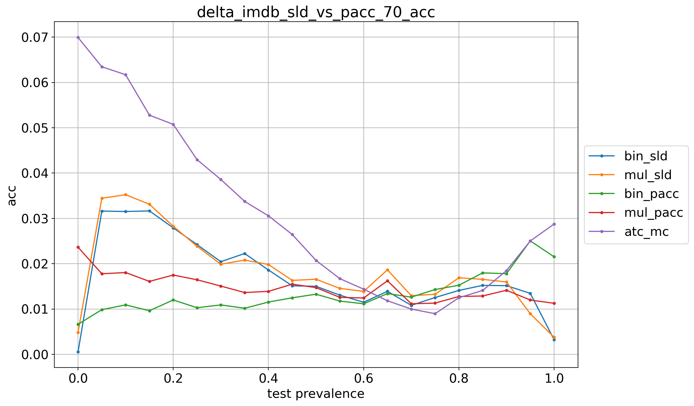
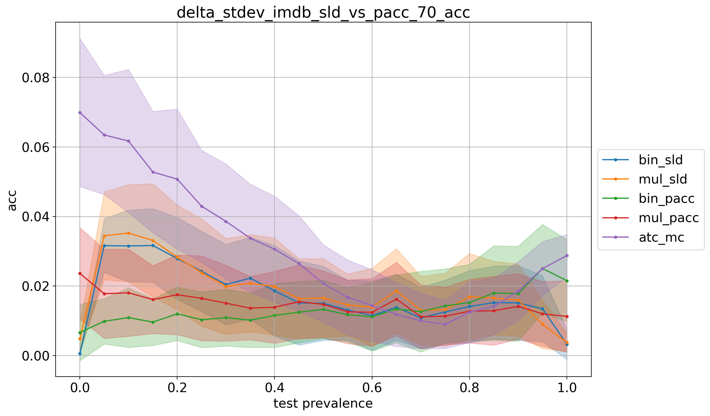
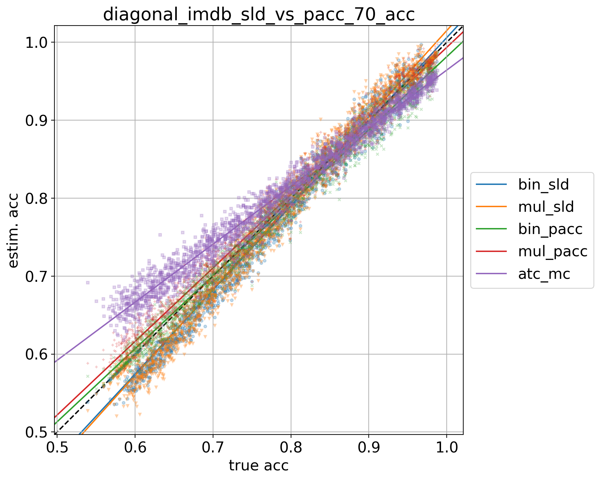
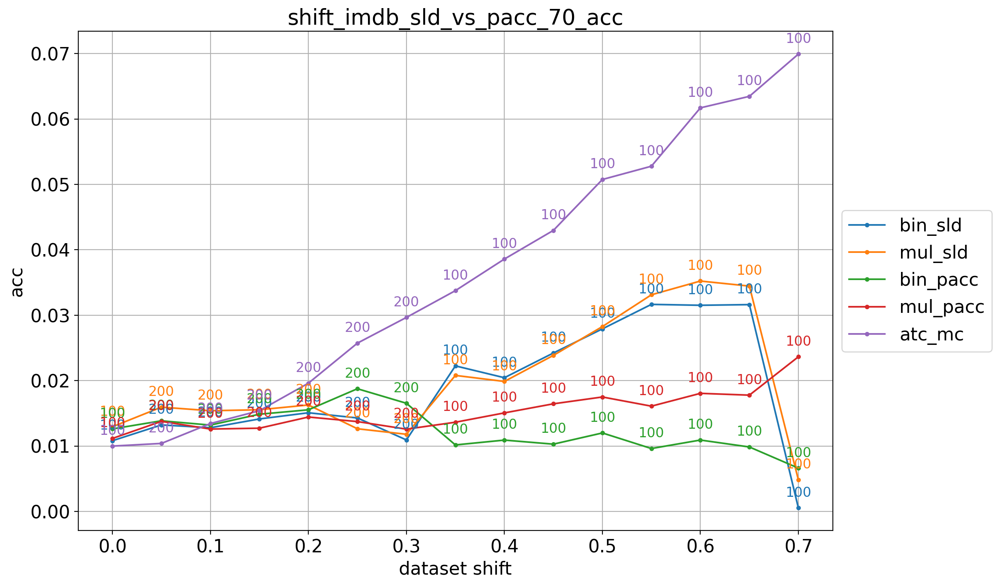

## 80% positives
> train: [0.2000288 0.7999712]  
> validation: [0.2000288 0.7999712]  
> bin_sld: 184.106s  
> mul_sld: 28.336s  
> binmc_sld: 183.242s  
> mulmc_sld: 27.274s  
> binne_sld: 184.907s  
> mulne_sld: 27.269s  
> bin_pacc: 175.764s  
> mul_pacc: 20.476s  
> ref: 13.542s  
> atc_mc: 17.815s  
> tot: 186.258s  

<table border="1" class="dataframe">
  <thead>
    <tr style="text-align: right;">
      <th></th>
      <th>bin_sld</th>
      <th>mul_sld</th>
      <th>bin_pacc</th>
      <th>mul_pacc</th>
      <th>atc_mc</th>
    </tr>
  </thead>
  <tbody>
    <tr>
      <th>0.0</th>
      <td>0.0010</td>
      <td>0.0300</td>
      <td>0.0157</td>
      <td>0.0391</td>
      <td>0.1270</td>
    </tr>
    <tr>
      <th>0.05</th>
      <td>0.0467</td>
      <td>0.0759</td>
      <td>0.0188</td>
      <td>0.0443</td>
      <td>0.1198</td>
    </tr>
    <tr>
      <th>0.1</th>
      <td>0.0525</td>
      <td>0.0770</td>
      <td>0.0159</td>
      <td>0.0327</td>
      <td>0.1165</td>
    </tr>
    <tr>
      <th>0.15</th>
      <td>0.0512</td>
      <td>0.0755</td>
      <td>0.0149</td>
      <td>0.0344</td>
      <td>0.1057</td>
    </tr>
    <tr>
      <th>0.2</th>
      <td>0.0465</td>
      <td>0.0678</td>
      <td>0.0183</td>
      <td>0.0375</td>
      <td>0.0976</td>
    </tr>
    <tr>
      <th>0.25</th>
      <td>0.0418</td>
      <td>0.0623</td>
      <td>0.0187</td>
      <td>0.0411</td>
      <td>0.0873</td>
    </tr>
    <tr>
      <th>0.3</th>
      <td>0.0351</td>
      <td>0.0539</td>
      <td>0.0167</td>
      <td>0.0381</td>
      <td>0.0804</td>
    </tr>
    <tr>
      <th>0.35</th>
      <td>0.0330</td>
      <td>0.0500</td>
      <td>0.0146</td>
      <td>0.0349</td>
      <td>0.0719</td>
    </tr>
    <tr>
      <th>0.4</th>
      <td>0.0296</td>
      <td>0.0454</td>
      <td>0.0183</td>
      <td>0.0360</td>
      <td>0.0668</td>
    </tr>
    <tr>
      <th>0.45</th>
      <td>0.0213</td>
      <td>0.0340</td>
      <td>0.0157</td>
      <td>0.0325</td>
      <td>0.0571</td>
    </tr>
    <tr>
      <th>0.5</th>
      <td>0.0194</td>
      <td>0.0297</td>
      <td>0.0162</td>
      <td>0.0335</td>
      <td>0.0507</td>
    </tr>
    <tr>
      <th>0.55</th>
      <td>0.0167</td>
      <td>0.0240</td>
      <td>0.0141</td>
      <td>0.0295</td>
      <td>0.0430</td>
    </tr>
    <tr>
      <th>0.6</th>
      <td>0.0140</td>
      <td>0.0214</td>
      <td>0.0136</td>
      <td>0.0353</td>
      <td>0.0363</td>
    </tr>
    <tr>
      <th>0.65</th>
      <td>0.0133</td>
      <td>0.0178</td>
      <td>0.0153</td>
      <td>0.0306</td>
      <td>0.0247</td>
    </tr>
    <tr>
      <th>0.7</th>
      <td>0.0111</td>
      <td>0.0154</td>
      <td>0.0135</td>
      <td>0.0298</td>
      <td>0.0184</td>
    </tr>
    <tr>
      <th>0.75</th>
      <td>0.0108</td>
      <td>0.0127</td>
      <td>0.0138</td>
      <td>0.0349</td>
      <td>0.0119</td>
    </tr>
    <tr>
      <th>0.8</th>
      <td>0.0121</td>
      <td>0.0127</td>
      <td>0.0137</td>
      <td>0.0323</td>
      <td>0.0099</td>
    </tr>
    <tr>
      <th>0.85</th>
      <td>0.0135</td>
      <td>0.0136</td>
      <td>0.0128</td>
      <td>0.0301</td>
      <td>0.0101</td>
    </tr>
    <tr>
      <th>0.9</th>
      <td>0.0148</td>
      <td>0.0133</td>
      <td>0.0109</td>
      <td>0.0285</td>
      <td>0.0152</td>
    </tr>
    <tr>
      <th>0.95</th>
      <td>0.0110</td>
      <td>0.0090</td>
      <td>0.0101</td>
      <td>0.0293</td>
      <td>0.0224</td>
    </tr>
    <tr>
      <th>1.0</th>
      <td>0.0037</td>
      <td>0.0028</td>
      <td>0.0050</td>
      <td>0.0290</td>
      <td>0.0294</td>
    </tr>
    <tr>
      <th>avg</th>
      <td>0.0238</td>
      <td>0.0354</td>
      <td>0.0146</td>
      <td>0.0340</td>
      <td>0.0572</td>
    </tr>
  </tbody>
</table>

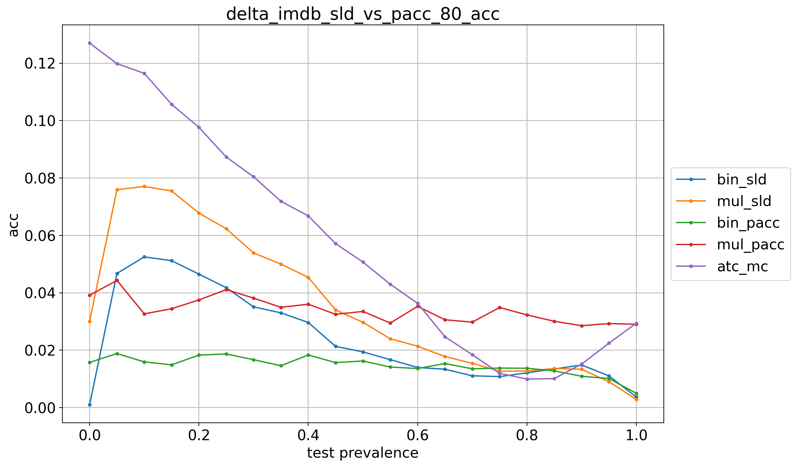
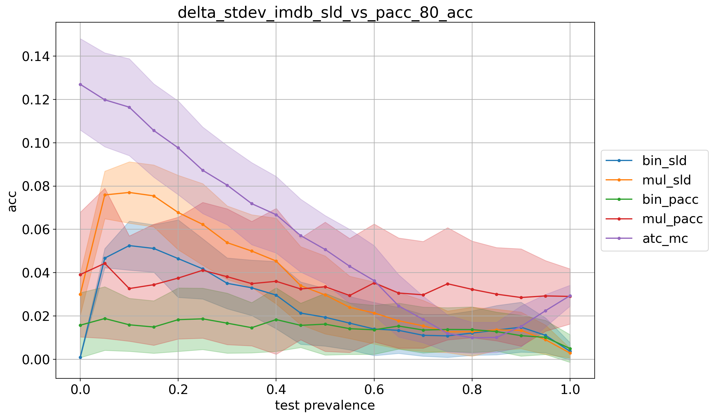
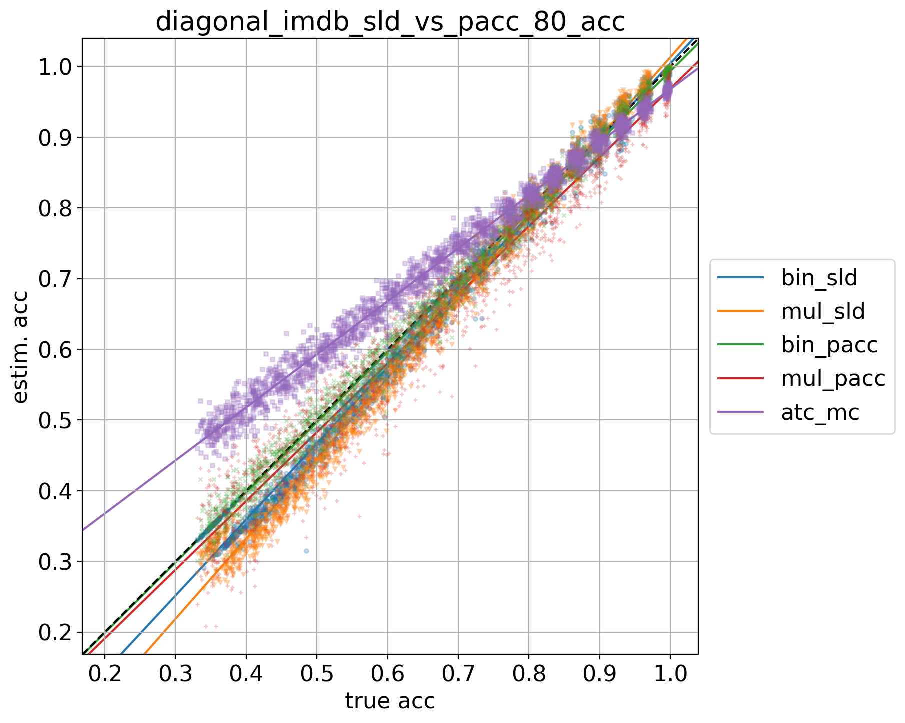
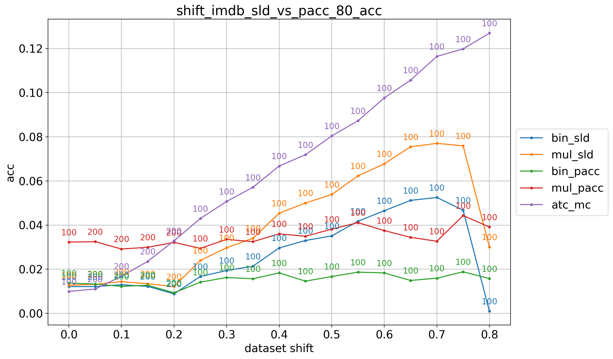

## 90% positives
> train: [0.0999424 0.9000576]  
> validation: [0.10008641 0.89991359]  
> bin_sld: 172.471s  
> mul_sld: 27.815s  
> binmc_sld: 172.819s  
> mulmc_sld: 22.238s  
> binne_sld: 171.872s  
> mulne_sld: 21.113s  
> ref: 11.632s  
> atc_mc: 15.307s  
> tot: 173.441s  

<table border="1" class="dataframe">
  <thead>
    <tr style="text-align: right;">
      <th></th>
      <th>bin_sld</th>
      <th>mul_sld</th>
      <th>atc_mc</th>
    </tr>
  </thead>
  <tbody>
    <tr>
      <th>0.0</th>
      <td>0.0007</td>
      <td>0.0344</td>
      <td>0.2957</td>
    </tr>
    <tr>
      <th>0.05</th>
      <td>0.0505</td>
      <td>0.0911</td>
      <td>0.2812</td>
    </tr>
    <tr>
      <th>0.1</th>
      <td>0.1002</td>
      <td>0.1437</td>
      <td>0.2658</td>
    </tr>
    <tr>
      <th>0.15</th>
      <td>0.1469</td>
      <td>0.1731</td>
      <td>0.2470</td>
    </tr>
    <tr>
      <th>0.2</th>
      <td>0.1547</td>
      <td>0.1852</td>
      <td>0.2327</td>
    </tr>
    <tr>
      <th>0.25</th>
      <td>0.1487</td>
      <td>0.1871</td>
      <td>0.2133</td>
    </tr>
    <tr>
      <th>0.3</th>
      <td>0.1367</td>
      <td>0.1780</td>
      <td>0.1958</td>
    </tr>
    <tr>
      <th>0.35</th>
      <td>0.1300</td>
      <td>0.1780</td>
      <td>0.1800</td>
    </tr>
    <tr>
      <th>0.4</th>
      <td>0.1164</td>
      <td>0.1688</td>
      <td>0.1661</td>
    </tr>
    <tr>
      <th>0.45</th>
      <td>0.1031</td>
      <td>0.1328</td>
      <td>0.1473</td>
    </tr>
    <tr>
      <th>0.5</th>
      <td>0.0899</td>
      <td>0.1178</td>
      <td>0.1307</td>
    </tr>
    <tr>
      <th>0.55</th>
      <td>0.0780</td>
      <td>0.0932</td>
      <td>0.1150</td>
    </tr>
    <tr>
      <th>0.6</th>
      <td>0.0632</td>
      <td>0.0811</td>
      <td>0.0995</td>
    </tr>
    <tr>
      <th>0.65</th>
      <td>0.0542</td>
      <td>0.0624</td>
      <td>0.0798</td>
    </tr>
    <tr>
      <th>0.7</th>
      <td>0.0422</td>
      <td>0.0456</td>
      <td>0.0650</td>
    </tr>
    <tr>
      <th>0.75</th>
      <td>0.0311</td>
      <td>0.0315</td>
      <td>0.0479</td>
    </tr>
    <tr>
      <th>0.8</th>
      <td>0.0214</td>
      <td>0.0207</td>
      <td>0.0312</td>
    </tr>
    <tr>
      <th>0.85</th>
      <td>0.0127</td>
      <td>0.0123</td>
      <td>0.0160</td>
    </tr>
    <tr>
      <th>0.9</th>
      <td>0.0098</td>
      <td>0.0098</td>
      <td>0.0060</td>
    </tr>
    <tr>
      <th>0.95</th>
      <td>0.0075</td>
      <td>0.0090</td>
      <td>0.0171</td>
    </tr>
    <tr>
      <th>1.0</th>
      <td>0.0014</td>
      <td>0.0014</td>
      <td>0.0339</td>
    </tr>
    <tr>
      <th>avg</th>
      <td>0.0714</td>
      <td>0.0932</td>
      <td>0.1365</td>
    </tr>
  </tbody>
</table>

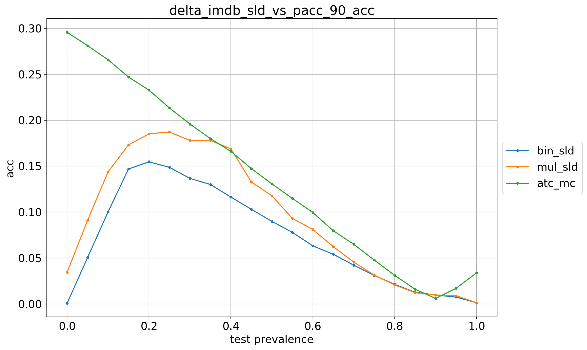
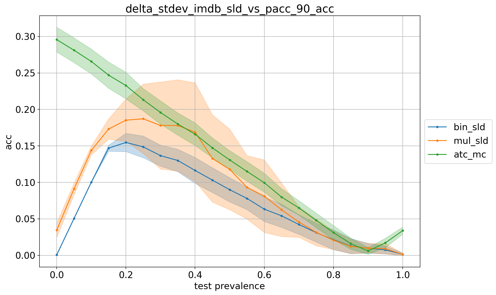
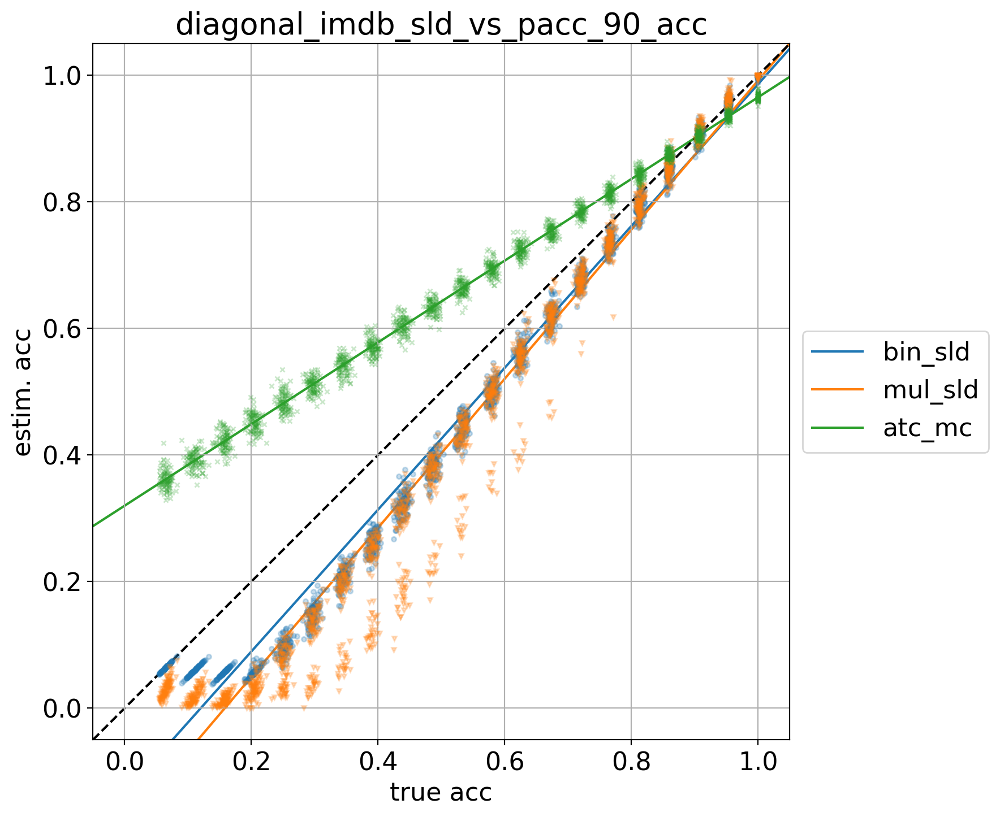
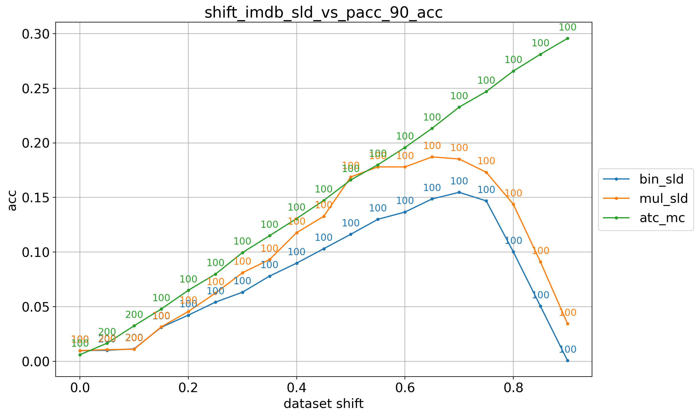

## avg
### avg on train
<table border="1" class="dataframe">
  <thead>
    <tr style="text-align: right;">
      <th></th>
      <th>bin_sld</th>
      <th>mul_sld</th>
      <th>bin_pacc</th>
      <th>mul_pacc</th>
      <th>atc_mc</th>
    </tr>
  </thead>
  <tbody>
    <tr>
      <th>0.0</th>
      <td>0.0011</td>
      <td>0.0099</td>
      <td>0.0076</td>
      <td>0.0158</td>
      <td>0.0712</td>
    </tr>
    <tr>
      <th>0.05</th>
      <td>0.0223</td>
      <td>0.0316</td>
      <td>0.0133</td>
      <td>0.0175</td>
      <td>0.0635</td>
    </tr>
    <tr>
      <th>0.1</th>
      <td>0.0302</td>
      <td>0.0393</td>
      <td>0.0140</td>
      <td>0.0170</td>
      <td>0.0582</td>
    </tr>
    <tr>
      <th>0.15</th>
      <td>0.0359</td>
      <td>0.0430</td>
      <td>0.0150</td>
      <td>0.0178</td>
      <td>0.0541</td>
    </tr>
    <tr>
      <th>0.2</th>
      <td>0.0356</td>
      <td>0.0427</td>
      <td>0.0160</td>
      <td>0.0192</td>
      <td>0.0541</td>
    </tr>
    <tr>
      <th>0.25</th>
      <td>0.0340</td>
      <td>0.0413</td>
      <td>0.0160</td>
      <td>0.0195</td>
      <td>0.0523</td>
    </tr>
    <tr>
      <th>0.3</th>
      <td>0.0329</td>
      <td>0.0442</td>
      <td>0.0165</td>
      <td>0.0199</td>
      <td>0.0520</td>
    </tr>
    <tr>
      <th>0.35</th>
      <td>0.0324</td>
      <td>0.0477</td>
      <td>0.0188</td>
      <td>0.0219</td>
      <td>0.0529</td>
    </tr>
    <tr>
      <th>0.4</th>
      <td>0.0307</td>
      <td>0.0519</td>
      <td>0.0205</td>
      <td>0.0232</td>
      <td>0.0545</td>
    </tr>
    <tr>
      <th>0.45</th>
      <td>0.0294</td>
      <td>0.0492</td>
      <td>0.0197</td>
      <td>0.0227</td>
      <td>0.0543</td>
    </tr>
    <tr>
      <th>0.5</th>
      <td>0.0296</td>
      <td>0.0508</td>
      <td>0.0222</td>
      <td>0.0254</td>
      <td>0.0558</td>
    </tr>
    <tr>
      <th>0.55</th>
      <td>0.0286</td>
      <td>0.0506</td>
      <td>0.0227</td>
      <td>0.0249</td>
      <td>0.0568</td>
    </tr>
    <tr>
      <th>0.6</th>
      <td>0.0291</td>
      <td>0.0523</td>
      <td>0.0238</td>
      <td>0.0273</td>
      <td>0.0579</td>
    </tr>
    <tr>
      <th>0.65</th>
      <td>0.0293</td>
      <td>0.0510</td>
      <td>0.0244</td>
      <td>0.0275</td>
      <td>0.0579</td>
    </tr>
    <tr>
      <th>0.7</th>
      <td>0.0298</td>
      <td>0.0507</td>
      <td>0.0269</td>
      <td>0.0297</td>
      <td>0.0613</td>
    </tr>
    <tr>
      <th>0.75</th>
      <td>0.0302</td>
      <td>0.0497</td>
      <td>0.0269</td>
      <td>0.0306</td>
      <td>0.0623</td>
    </tr>
    <tr>
      <th>0.8</th>
      <td>0.0311</td>
      <td>0.0481</td>
      <td>0.0286</td>
      <td>0.0319</td>
      <td>0.0644</td>
    </tr>
    <tr>
      <th>0.85</th>
      <td>0.0330</td>
      <td>0.0446</td>
      <td>0.0310</td>
      <td>0.0334</td>
      <td>0.0672</td>
    </tr>
    <tr>
      <th>0.9</th>
      <td>0.0310</td>
      <td>0.0391</td>
      <td>0.0304</td>
      <td>0.0340</td>
      <td>0.0712</td>
    </tr>
    <tr>
      <th>0.95</th>
      <td>0.0255</td>
      <td>0.0335</td>
      <td>0.0331</td>
      <td>0.0360</td>
      <td>0.0796</td>
    </tr>
    <tr>
      <th>1.0</th>
      <td>0.0039</td>
      <td>0.0165</td>
      <td>0.0296</td>
      <td>0.0361</td>
      <td>0.0861</td>
    </tr>
    <tr>
      <th>avg</th>
      <td>0.0279</td>
      <td>0.0423</td>
      <td>0.0218</td>
      <td>0.0253</td>
      <td>0.0613</td>
    </tr>
  </tbody>
</table>

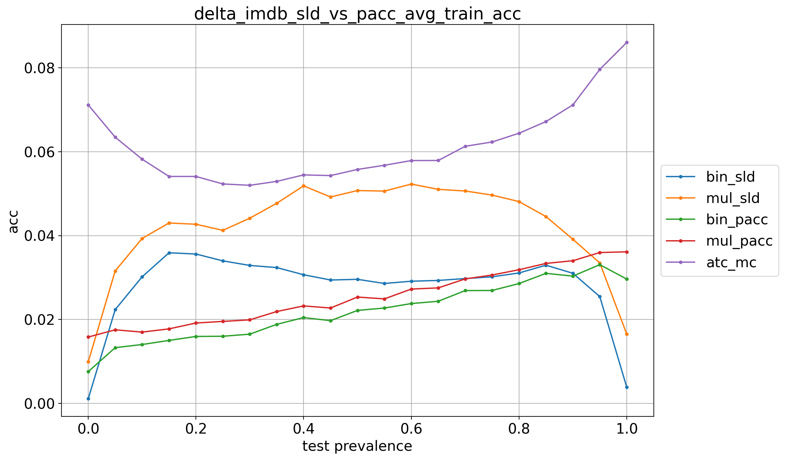
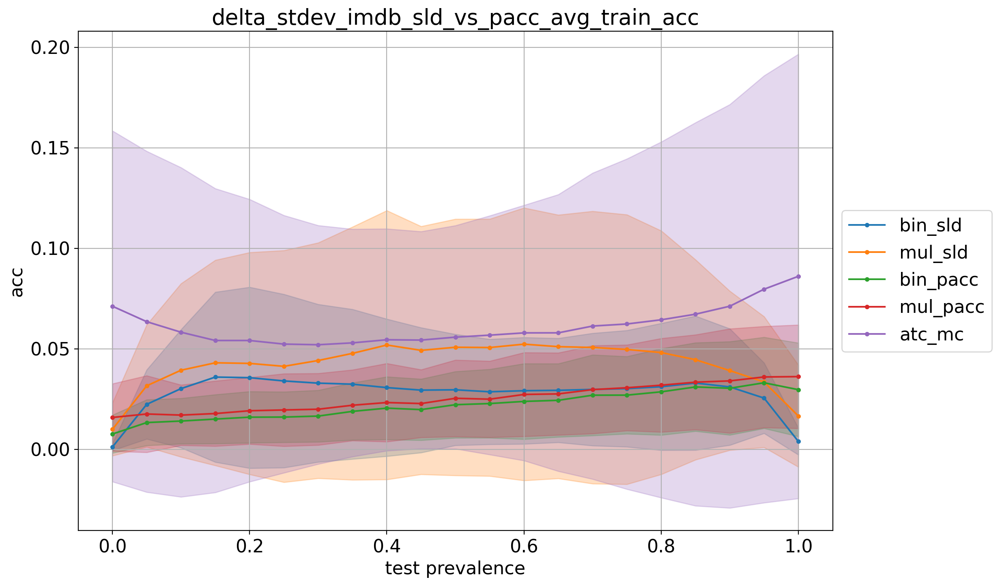
### avg on test
<table border="1" class="dataframe">
  <thead>
    <tr style="text-align: right;">
      <th></th>
      <th>bin_sld</th>
      <th>mul_sld</th>
      <th>bin_pacc</th>
      <th>mul_pacc</th>
      <th>atc_mc</th>
    </tr>
  </thead>
  <tbody>
    <tr>
      <th>0.1</th>
      <td>0.0482</td>
      <td>0.1127</td>
      <td>0.0260</td>
      <td>0.0267</td>
      <td>0.1752</td>
    </tr>
    <tr>
      <th>0.2</th>
      <td>0.0235</td>
      <td>0.0445</td>
      <td>0.0281</td>
      <td>0.0339</td>
      <td>0.0687</td>
    </tr>
    <tr>
      <th>0.3</th>
      <td>0.0182</td>
      <td>0.0259</td>
      <td>0.0246</td>
      <td>0.0223</td>
      <td>0.0374</td>
    </tr>
    <tr>
      <th>0.4</th>
      <td>0.0165</td>
      <td>0.0185</td>
      <td>0.0221</td>
      <td>0.0213</td>
      <td>0.0167</td>
    </tr>
    <tr>
      <th>0.5</th>
      <td>0.0149</td>
      <td>0.0161</td>
      <td>0.0159</td>
      <td>0.0256</td>
      <td>0.0103</td>
    </tr>
    <tr>
      <th>0.6</th>
      <td>0.0172</td>
      <td>0.0155</td>
      <td>0.0295</td>
      <td>0.0239</td>
      <td>0.0187</td>
    </tr>
    <tr>
      <th>0.7</th>
      <td>0.0172</td>
      <td>0.0185</td>
      <td>0.0133</td>
      <td>0.0147</td>
      <td>0.0311</td>
    </tr>
    <tr>
      <th>0.8</th>
      <td>0.0238</td>
      <td>0.0354</td>
      <td>0.0146</td>
      <td>0.0340</td>
      <td>0.0572</td>
    </tr>
    <tr>
      <th>0.9</th>
      <td>0.0714</td>
      <td>0.0932</td>
      <td>NaN</td>
      <td>NaN</td>
      <td>0.1365</td>
    </tr>
    <tr>
      <th>avg</th>
      <td>0.0279</td>
      <td>0.0423</td>
      <td>0.0218</td>
      <td>0.0253</td>
      <td>0.0613</td>
    </tr>
  </tbody>
</table>

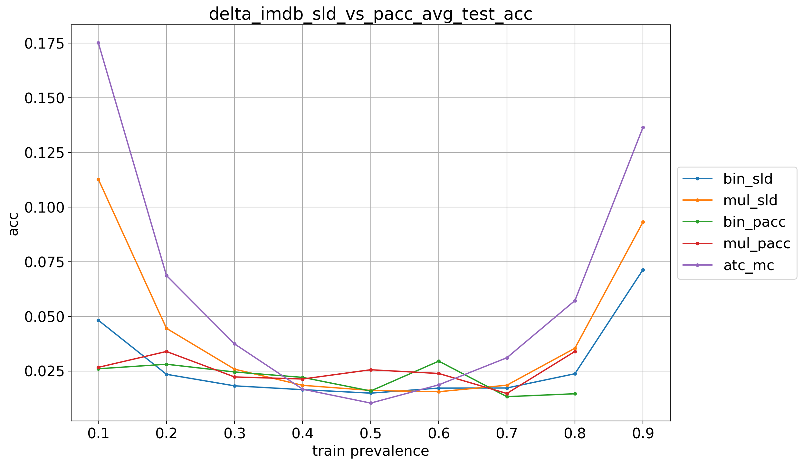
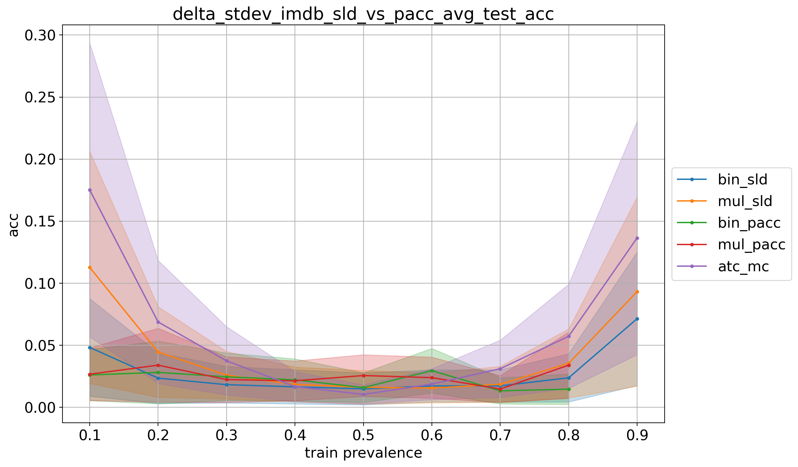
### avg dataset shift
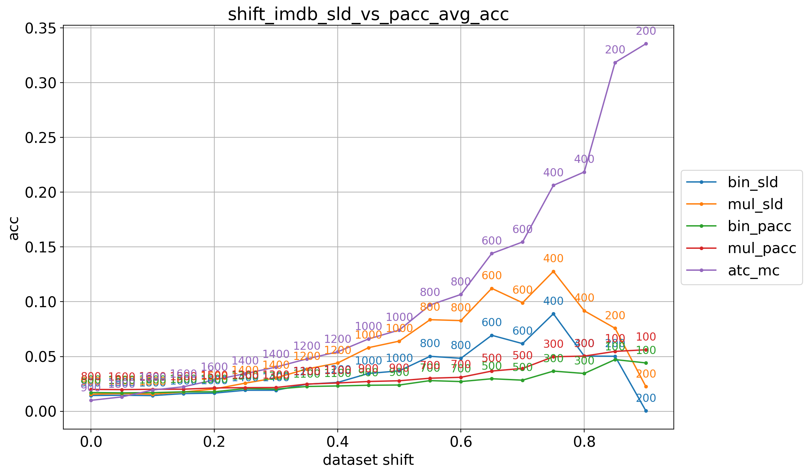
