# imdb_9prevs

## 10% positives
> train: [0.89991359 0.10008641]  
> validation: [0.9000576 0.0999424]  
> bin_sld: 189.173s  
> mul_sld: 40.710s  
> binmc_sld: 186.824s  
> mulmc_sld: 25.516s  
> binne_sld: 187.658s  
> mulne_sld: 23.672s  
> bin_pacc: 176.373s  
> mul_pacc: 20.080s  
> ref: 13.306s  
> atc_mc: 17.351s  
> tot: 189.603s  

<table border="1" class="dataframe">
  <thead>
    <tr style="text-align: right;">
      <th></th>
      <th>bin_sld</th>
      <th>mul_sld</th>
      <th>bin_pacc</th>
      <th>mul_pacc</th>
      <th>atc_mc</th>
    </tr>
  </thead>
  <tbody>
    <tr>
      <th>0.0</th>
      <td>0.0555</td>
      <td>0.0259</td>
      <td>0.0050</td>
      <td>0.0763</td>
      <td>0.0000</td>
    </tr>
    <tr>
      <th>0.05</th>
      <td>0.0109</td>
      <td>0.0225</td>
      <td>0.0113</td>
      <td>0.0517</td>
      <td>0.0240</td>
    </tr>
    <tr>
      <th>0.1</th>
      <td>0.0067</td>
      <td>0.0138</td>
      <td>0.0107</td>
      <td>0.0501</td>
      <td>0.0244</td>
    </tr>
    <tr>
      <th>0.15</th>
      <td>0.0062</td>
      <td>0.0108</td>
      <td>0.0118</td>
      <td>0.0439</td>
      <td>0.0228</td>
    </tr>
    <tr>
      <th>0.2</th>
      <td>0.0037</td>
      <td>0.0114</td>
      <td>0.0113</td>
      <td>0.0429</td>
      <td>0.0245</td>
    </tr>
    <tr>
      <th>0.25</th>
      <td>0.0030</td>
      <td>0.0143</td>
      <td>0.0123</td>
      <td>0.0366</td>
      <td>0.0246</td>
    </tr>
    <tr>
      <th>0.3</th>
      <td>0.0023</td>
      <td>0.0192</td>
      <td>0.0115</td>
      <td>0.0457</td>
      <td>0.0266</td>
    </tr>
    <tr>
      <th>0.35</th>
      <td>0.0029</td>
      <td>0.0214</td>
      <td>0.0121</td>
      <td>0.0363</td>
      <td>0.0248</td>
    </tr>
    <tr>
      <th>0.4</th>
      <td>0.0024</td>
      <td>0.0217</td>
      <td>0.0091</td>
      <td>0.0380</td>
      <td>0.0230</td>
    </tr>
    <tr>
      <th>0.45</th>
      <td>0.0033</td>
      <td>0.0250</td>
      <td>0.0114</td>
      <td>0.0418</td>
      <td>0.0257</td>
    </tr>
    <tr>
      <th>0.5</th>
      <td>0.0035</td>
      <td>0.0259</td>
      <td>0.0136</td>
      <td>0.0426</td>
      <td>0.0264</td>
    </tr>
    <tr>
      <th>0.55</th>
      <td>0.0028</td>
      <td>0.0238</td>
      <td>0.0106</td>
      <td>0.0377</td>
      <td>0.0239</td>
    </tr>
    <tr>
      <th>0.6</th>
      <td>0.0034</td>
      <td>0.0247</td>
      <td>0.0114</td>
      <td>0.0422</td>
      <td>0.0248</td>
    </tr>
    <tr>
      <th>0.65</th>
      <td>0.0036</td>
      <td>0.0246</td>
      <td>0.0119</td>
      <td>0.0352</td>
      <td>0.0247</td>
    </tr>
    <tr>
      <th>0.7</th>
      <td>0.0033</td>
      <td>0.0239</td>
      <td>0.0124</td>
      <td>0.0332</td>
      <td>0.0239</td>
    </tr>
    <tr>
      <th>0.75</th>
      <td>0.0031</td>
      <td>0.0255</td>
      <td>0.0118</td>
      <td>0.0370</td>
      <td>0.0255</td>
    </tr>
    <tr>
      <th>0.8</th>
      <td>0.0031</td>
      <td>0.0242</td>
      <td>0.0119</td>
      <td>0.0367</td>
      <td>0.0242</td>
    </tr>
    <tr>
      <th>0.85</th>
      <td>0.0030</td>
      <td>0.0239</td>
      <td>0.0116</td>
      <td>0.0333</td>
      <td>0.0240</td>
    </tr>
    <tr>
      <th>0.9</th>
      <td>0.0029</td>
      <td>0.0255</td>
      <td>0.0130</td>
      <td>0.0394</td>
      <td>0.0256</td>
    </tr>
    <tr>
      <th>0.95</th>
      <td>0.0015</td>
      <td>0.0223</td>
      <td>0.0117</td>
      <td>0.0409</td>
      <td>0.0246</td>
    </tr>
    <tr>
      <th>1.0</th>
      <td>0.0001</td>
      <td>0.0208</td>
      <td>0.0127</td>
      <td>0.0405</td>
      <td>0.0246</td>
    </tr>
    <tr>
      <th>avg</th>
      <td>0.0061</td>
      <td>0.0215</td>
      <td>0.0114</td>
      <td>0.0420</td>
      <td>0.0234</td>
    </tr>
  </tbody>
</table>

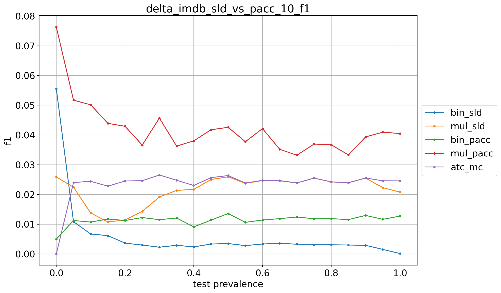
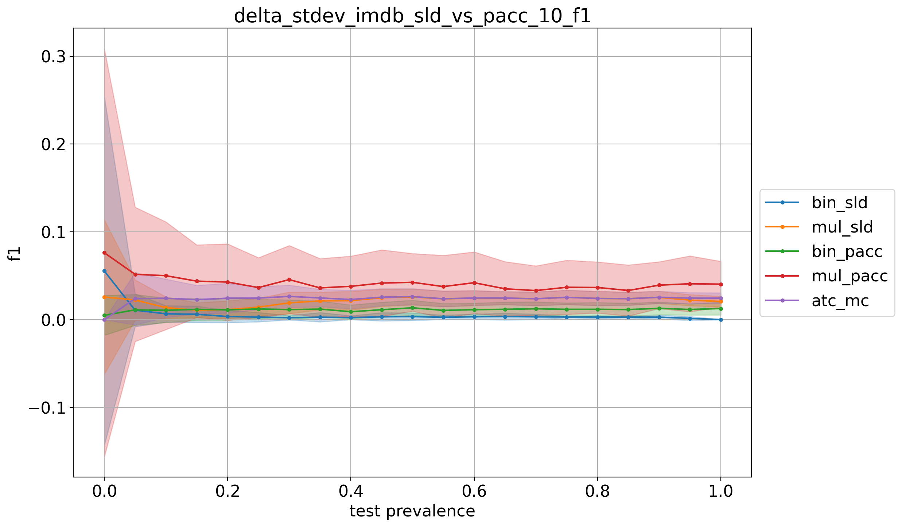
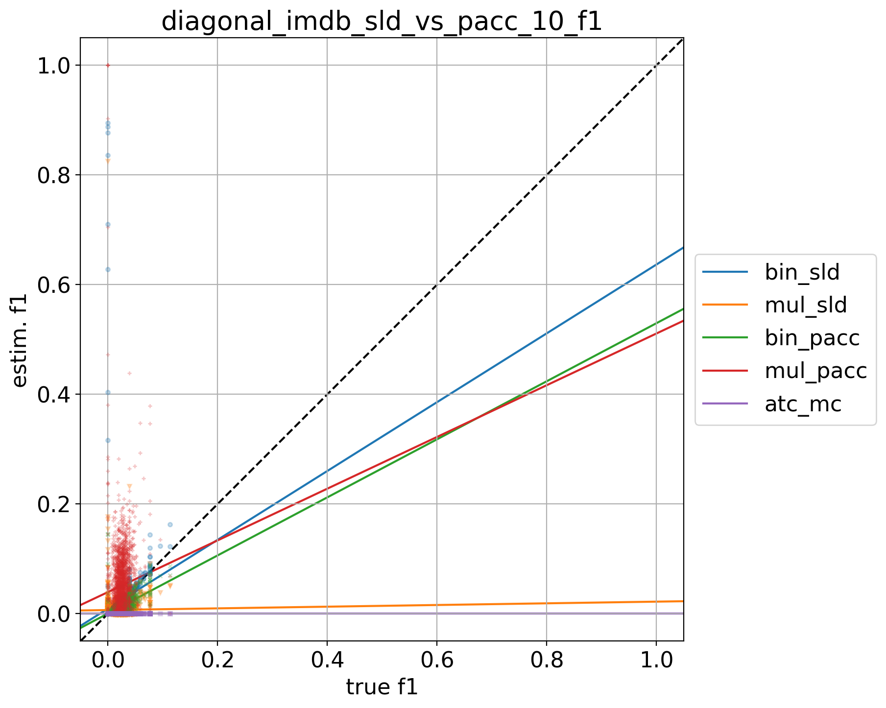
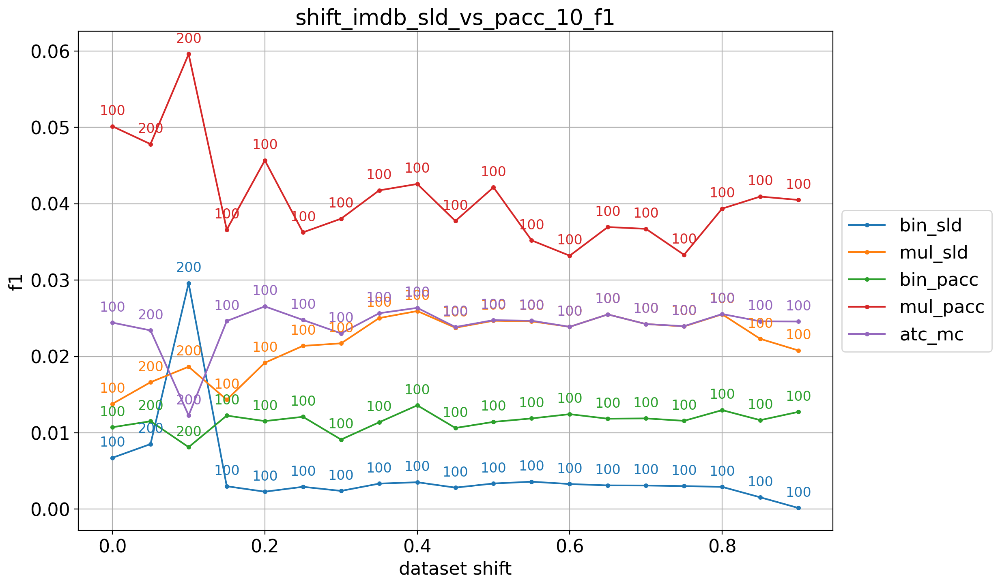

## 20% positives
> train: [0.7999712 0.2000288]  
> validation: [0.7999712 0.2000288]  
> bin_sld: 187.104s  
> mul_sld: 36.250s  
> binmc_sld: 185.481s  
> mulmc_sld: 31.669s  
> binne_sld: 187.316s  
> mulne_sld: 35.209s  
> bin_pacc: 177.023s  
> mul_pacc: 19.936s  
> ref: 13.278s  
> atc_mc: 17.449s  
> tot: 188.478s  

<table border="1" class="dataframe">
  <thead>
    <tr style="text-align: right;">
      <th></th>
      <th>bin_sld</th>
      <th>mul_sld</th>
      <th>bin_pacc</th>
      <th>mul_pacc</th>
      <th>atc_mc</th>
    </tr>
  </thead>
  <tbody>
    <tr>
      <th>0.0</th>
      <td>0.1705</td>
      <td>0.3756</td>
      <td>0.2170</td>
      <td>0.6409</td>
      <td>0.0183</td>
    </tr>
    <tr>
      <th>0.05</th>
      <td>0.2206</td>
      <td>0.1554</td>
      <td>0.1744</td>
      <td>0.1421</td>
      <td>0.2921</td>
    </tr>
    <tr>
      <th>0.1</th>
      <td>0.1383</td>
      <td>0.1079</td>
      <td>0.1243</td>
      <td>0.0998</td>
      <td>0.2745</td>
    </tr>
    <tr>
      <th>0.15</th>
      <td>0.0971</td>
      <td>0.1115</td>
      <td>0.1126</td>
      <td>0.0951</td>
      <td>0.2661</td>
    </tr>
    <tr>
      <th>0.2</th>
      <td>0.0581</td>
      <td>0.0995</td>
      <td>0.0963</td>
      <td>0.0828</td>
      <td>0.2539</td>
    </tr>
    <tr>
      <th>0.25</th>
      <td>0.0336</td>
      <td>0.0906</td>
      <td>0.0736</td>
      <td>0.0793</td>
      <td>0.2445</td>
    </tr>
    <tr>
      <th>0.3</th>
      <td>0.0298</td>
      <td>0.0919</td>
      <td>0.0757</td>
      <td>0.0817</td>
      <td>0.2483</td>
    </tr>
    <tr>
      <th>0.35</th>
      <td>0.0205</td>
      <td>0.1001</td>
      <td>0.0871</td>
      <td>0.0898</td>
      <td>0.2419</td>
    </tr>
    <tr>
      <th>0.4</th>
      <td>0.0178</td>
      <td>0.1043</td>
      <td>0.0865</td>
      <td>0.0915</td>
      <td>0.2441</td>
    </tr>
    <tr>
      <th>0.45</th>
      <td>0.0208</td>
      <td>0.0928</td>
      <td>0.0689</td>
      <td>0.0834</td>
      <td>0.2362</td>
    </tr>
    <tr>
      <th>0.5</th>
      <td>0.0133</td>
      <td>0.0907</td>
      <td>0.0617</td>
      <td>0.0784</td>
      <td>0.2307</td>
    </tr>
    <tr>
      <th>0.55</th>
      <td>0.0134</td>
      <td>0.0953</td>
      <td>0.0740</td>
      <td>0.0823</td>
      <td>0.2358</td>
    </tr>
    <tr>
      <th>0.6</th>
      <td>0.0170</td>
      <td>0.0957</td>
      <td>0.0702</td>
      <td>0.0847</td>
      <td>0.2318</td>
    </tr>
    <tr>
      <th>0.65</th>
      <td>0.0150</td>
      <td>0.0953</td>
      <td>0.0660</td>
      <td>0.0859</td>
      <td>0.2306</td>
    </tr>
    <tr>
      <th>0.7</th>
      <td>0.0227</td>
      <td>0.0971</td>
      <td>0.0716</td>
      <td>0.0905</td>
      <td>0.2291</td>
    </tr>
    <tr>
      <th>0.75</th>
      <td>0.0181</td>
      <td>0.0909</td>
      <td>0.0641</td>
      <td>0.0815</td>
      <td>0.2291</td>
    </tr>
    <tr>
      <th>0.8</th>
      <td>0.0222</td>
      <td>0.0969</td>
      <td>0.0708</td>
      <td>0.0891</td>
      <td>0.2310</td>
    </tr>
    <tr>
      <th>0.85</th>
      <td>0.0215</td>
      <td>0.0968</td>
      <td>0.0699</td>
      <td>0.0905</td>
      <td>0.2303</td>
    </tr>
    <tr>
      <th>0.9</th>
      <td>0.0218</td>
      <td>0.0976</td>
      <td>0.0662</td>
      <td>0.0921</td>
      <td>0.2295</td>
    </tr>
    <tr>
      <th>0.95</th>
      <td>0.0193</td>
      <td>0.0958</td>
      <td>0.0677</td>
      <td>0.0910</td>
      <td>0.2301</td>
    </tr>
    <tr>
      <th>1.0</th>
      <td>0.0027</td>
      <td>0.1049</td>
      <td>0.0632</td>
      <td>0.0909</td>
      <td>0.2308</td>
    </tr>
    <tr>
      <th>avg</th>
      <td>0.0473</td>
      <td>0.1136</td>
      <td>0.0887</td>
      <td>0.1163</td>
      <td>0.2314</td>
    </tr>
  </tbody>
</table>

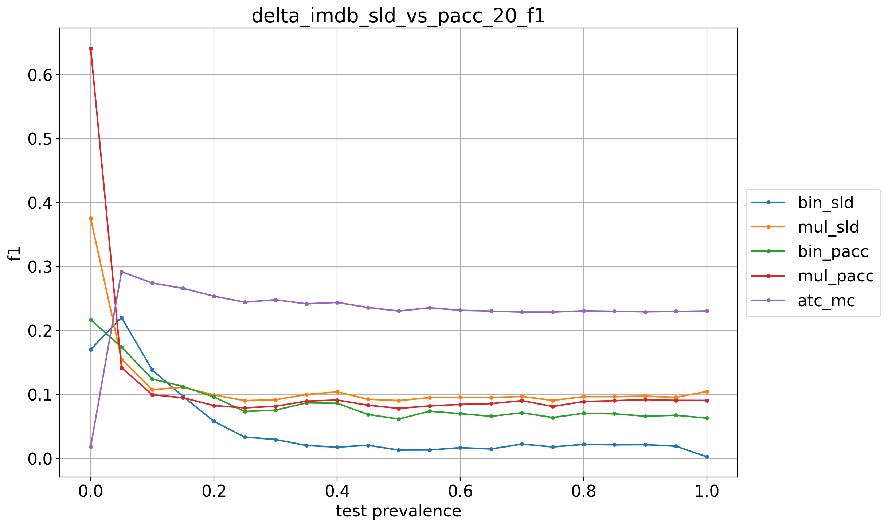
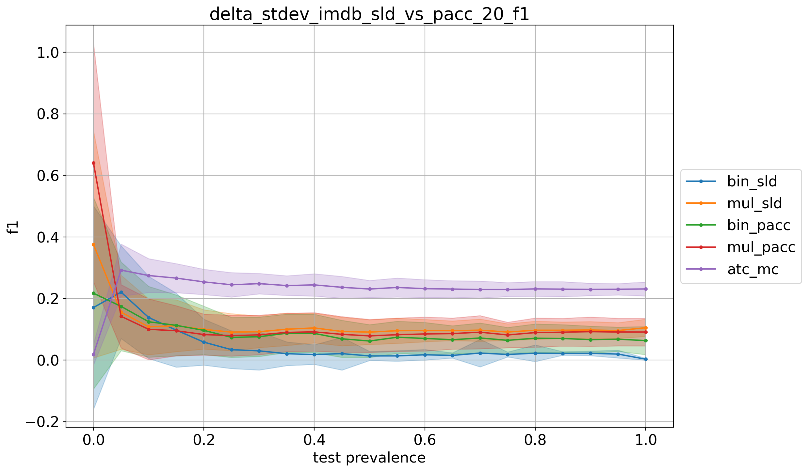
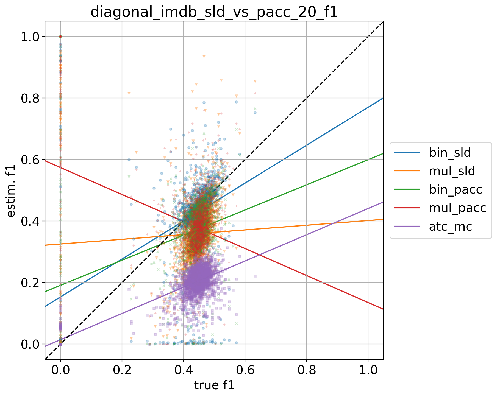
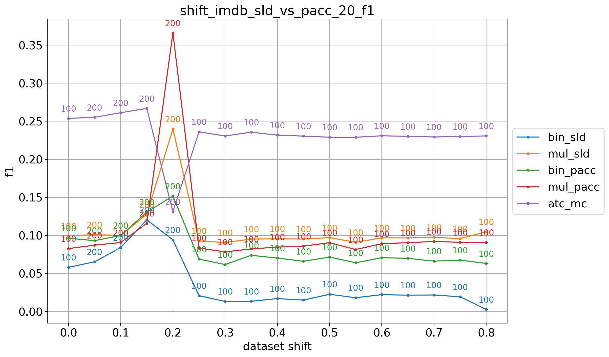

## 30% positives
> train: [0.7000288 0.2999712]  
> validation: [0.7000288 0.2999712]  
> bin_sld: 182.167s  
> mul_sld: 29.557s  
> binmc_sld: 180.200s  
> mulmc_sld: 28.430s  
> binne_sld: 181.220s  
> mulne_sld: 28.868s  
> bin_pacc: 174.026s  
> mul_pacc: 20.400s  
> ref: 13.451s  
> atc_mc: 18.102s  
> tot: 183.051s  

<table border="1" class="dataframe">
  <thead>
    <tr style="text-align: right;">
      <th></th>
      <th>bin_sld</th>
      <th>mul_sld</th>
      <th>bin_pacc</th>
      <th>mul_pacc</th>
      <th>atc_mc</th>
    </tr>
  </thead>
  <tbody>
    <tr>
      <th>0.0</th>
      <td>0.0199</td>
      <td>0.1538</td>
      <td>0.1765</td>
      <td>0.3618</td>
      <td>0.2272</td>
    </tr>
    <tr>
      <th>0.05</th>
      <td>0.1334</td>
      <td>0.1346</td>
      <td>0.0946</td>
      <td>0.1029</td>
      <td>0.1227</td>
    </tr>
    <tr>
      <th>0.1</th>
      <td>0.1017</td>
      <td>0.1009</td>
      <td>0.0641</td>
      <td>0.0655</td>
      <td>0.1024</td>
    </tr>
    <tr>
      <th>0.15</th>
      <td>0.0725</td>
      <td>0.0709</td>
      <td>0.0495</td>
      <td>0.0512</td>
      <td>0.0885</td>
    </tr>
    <tr>
      <th>0.2</th>
      <td>0.0540</td>
      <td>0.0505</td>
      <td>0.0411</td>
      <td>0.0431</td>
      <td>0.0813</td>
    </tr>
    <tr>
      <th>0.25</th>
      <td>0.0482</td>
      <td>0.0407</td>
      <td>0.0437</td>
      <td>0.0437</td>
      <td>0.0713</td>
    </tr>
    <tr>
      <th>0.3</th>
      <td>0.0381</td>
      <td>0.0344</td>
      <td>0.0326</td>
      <td>0.0352</td>
      <td>0.0552</td>
    </tr>
    <tr>
      <th>0.35</th>
      <td>0.0316</td>
      <td>0.0271</td>
      <td>0.0422</td>
      <td>0.0411</td>
      <td>0.0572</td>
    </tr>
    <tr>
      <th>0.4</th>
      <td>0.0235</td>
      <td>0.0233</td>
      <td>0.0372</td>
      <td>0.0369</td>
      <td>0.0500</td>
    </tr>
    <tr>
      <th>0.45</th>
      <td>0.0197</td>
      <td>0.0219</td>
      <td>0.0342</td>
      <td>0.0346</td>
      <td>0.0469</td>
    </tr>
    <tr>
      <th>0.5</th>
      <td>0.0177</td>
      <td>0.0237</td>
      <td>0.0342</td>
      <td>0.0341</td>
      <td>0.0429</td>
    </tr>
    <tr>
      <th>0.55</th>
      <td>0.0158</td>
      <td>0.0225</td>
      <td>0.0343</td>
      <td>0.0322</td>
      <td>0.0411</td>
    </tr>
    <tr>
      <th>0.6</th>
      <td>0.0117</td>
      <td>0.0243</td>
      <td>0.0318</td>
      <td>0.0301</td>
      <td>0.0383</td>
    </tr>
    <tr>
      <th>0.65</th>
      <td>0.0123</td>
      <td>0.0249</td>
      <td>0.0319</td>
      <td>0.0320</td>
      <td>0.0383</td>
    </tr>
    <tr>
      <th>0.7</th>
      <td>0.0172</td>
      <td>0.0314</td>
      <td>0.0362</td>
      <td>0.0344</td>
      <td>0.0372</td>
    </tr>
    <tr>
      <th>0.75</th>
      <td>0.0144</td>
      <td>0.0311</td>
      <td>0.0321</td>
      <td>0.0302</td>
      <td>0.0335</td>
    </tr>
    <tr>
      <th>0.8</th>
      <td>0.0153</td>
      <td>0.0318</td>
      <td>0.0328</td>
      <td>0.0316</td>
      <td>0.0340</td>
    </tr>
    <tr>
      <th>0.85</th>
      <td>0.0166</td>
      <td>0.0353</td>
      <td>0.0342</td>
      <td>0.0327</td>
      <td>0.0327</td>
    </tr>
    <tr>
      <th>0.9</th>
      <td>0.0173</td>
      <td>0.0352</td>
      <td>0.0337</td>
      <td>0.0322</td>
      <td>0.0326</td>
    </tr>
    <tr>
      <th>0.95</th>
      <td>0.0172</td>
      <td>0.0348</td>
      <td>0.0314</td>
      <td>0.0299</td>
      <td>0.0284</td>
    </tr>
    <tr>
      <th>1.0</th>
      <td>0.0025</td>
      <td>0.0182</td>
      <td>0.0278</td>
      <td>0.0306</td>
      <td>0.0295</td>
    </tr>
    <tr>
      <th>avg</th>
      <td>0.0334</td>
      <td>0.0462</td>
      <td>0.0465</td>
      <td>0.0555</td>
      <td>0.0615</td>
    </tr>
  </tbody>
</table>

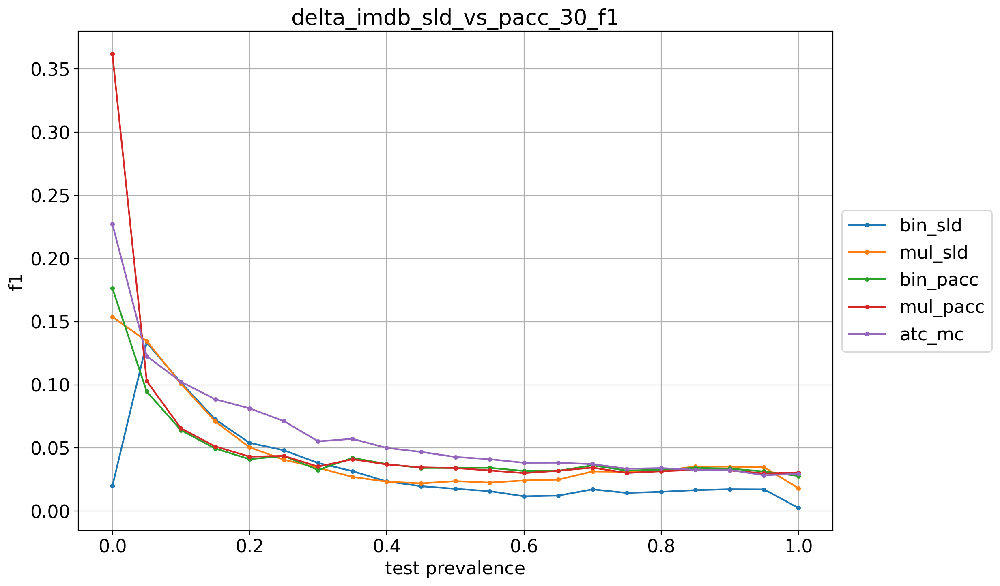
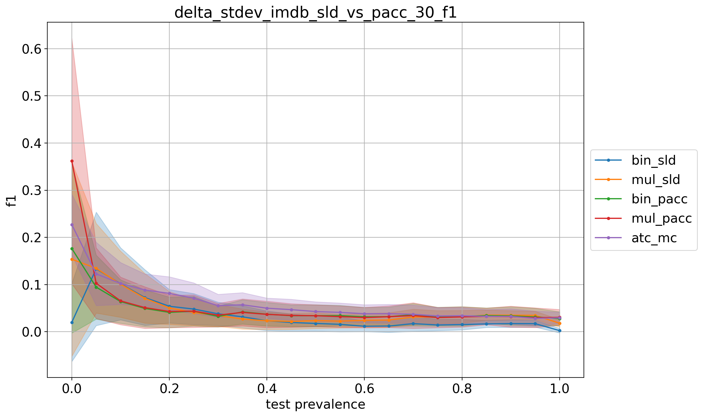
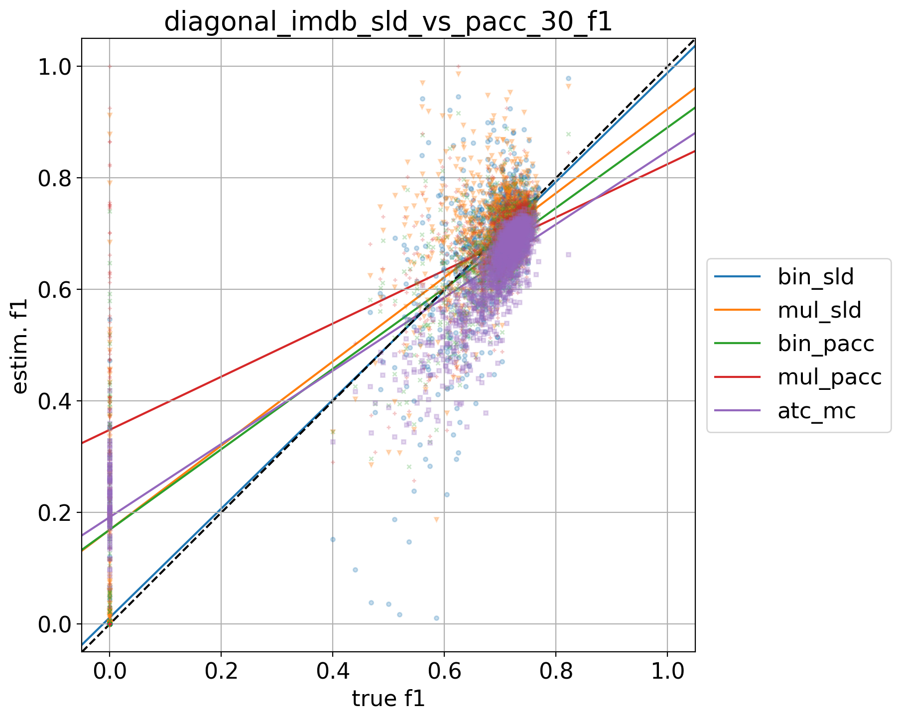
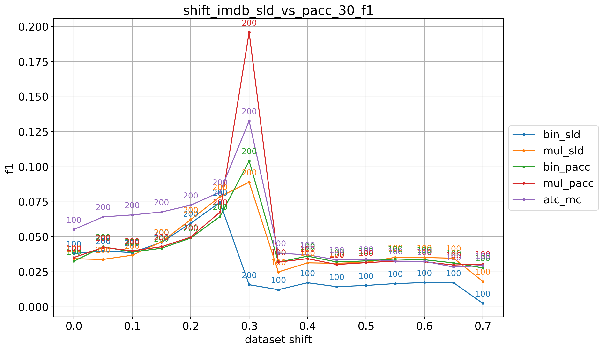

## 40% positives
> train: [0.5999424 0.4000576]  
> validation: [0.60008641 0.39991359]  
> bin_sld: 181.684s  
> mul_sld: 30.343s  
> binmc_sld: 179.998s  
> mulmc_sld: 29.275s  
> binne_sld: 182.085s  
> mulne_sld: 29.662s  
> bin_pacc: 176.735s  
> mul_pacc: 20.744s  
> ref: 13.516s  
> atc_mc: 17.986s  
> tot: 183.203s  

<table border="1" class="dataframe">
  <thead>
    <tr style="text-align: right;">
      <th></th>
      <th>bin_sld</th>
      <th>mul_sld</th>
      <th>bin_pacc</th>
      <th>mul_pacc</th>
      <th>atc_mc</th>
    </tr>
  </thead>
  <tbody>
    <tr>
      <th>0.0</th>
      <td>0.0071</td>
      <td>0.0516</td>
      <td>0.1426</td>
      <td>0.0599</td>
      <td>0.4335</td>
    </tr>
    <tr>
      <th>0.05</th>
      <td>0.1082</td>
      <td>0.0865</td>
      <td>0.0673</td>
      <td>0.0972</td>
      <td>0.0606</td>
    </tr>
    <tr>
      <th>0.1</th>
      <td>0.0651</td>
      <td>0.0651</td>
      <td>0.0506</td>
      <td>0.0621</td>
      <td>0.0339</td>
    </tr>
    <tr>
      <th>0.15</th>
      <td>0.0558</td>
      <td>0.0545</td>
      <td>0.0454</td>
      <td>0.0538</td>
      <td>0.0263</td>
    </tr>
    <tr>
      <th>0.2</th>
      <td>0.0451</td>
      <td>0.0465</td>
      <td>0.0363</td>
      <td>0.0416</td>
      <td>0.0248</td>
    </tr>
    <tr>
      <th>0.25</th>
      <td>0.0353</td>
      <td>0.0394</td>
      <td>0.0271</td>
      <td>0.0327</td>
      <td>0.0213</td>
    </tr>
    <tr>
      <th>0.3</th>
      <td>0.0367</td>
      <td>0.0400</td>
      <td>0.0279</td>
      <td>0.0319</td>
      <td>0.0219</td>
    </tr>
    <tr>
      <th>0.35</th>
      <td>0.0286</td>
      <td>0.0280</td>
      <td>0.0291</td>
      <td>0.0322</td>
      <td>0.0195</td>
    </tr>
    <tr>
      <th>0.4</th>
      <td>0.0237</td>
      <td>0.0234</td>
      <td>0.0274</td>
      <td>0.0296</td>
      <td>0.0164</td>
    </tr>
    <tr>
      <th>0.45</th>
      <td>0.0243</td>
      <td>0.0224</td>
      <td>0.0257</td>
      <td>0.0271</td>
      <td>0.0191</td>
    </tr>
    <tr>
      <th>0.5</th>
      <td>0.0237</td>
      <td>0.0202</td>
      <td>0.0278</td>
      <td>0.0272</td>
      <td>0.0164</td>
    </tr>
    <tr>
      <th>0.55</th>
      <td>0.0190</td>
      <td>0.0172</td>
      <td>0.0247</td>
      <td>0.0228</td>
      <td>0.0133</td>
    </tr>
    <tr>
      <th>0.6</th>
      <td>0.0161</td>
      <td>0.0146</td>
      <td>0.0260</td>
      <td>0.0236</td>
      <td>0.0131</td>
    </tr>
    <tr>
      <th>0.65</th>
      <td>0.0132</td>
      <td>0.0126</td>
      <td>0.0250</td>
      <td>0.0218</td>
      <td>0.0124</td>
    </tr>
    <tr>
      <th>0.7</th>
      <td>0.0132</td>
      <td>0.0131</td>
      <td>0.0247</td>
      <td>0.0212</td>
      <td>0.0116</td>
    </tr>
    <tr>
      <th>0.75</th>
      <td>0.0117</td>
      <td>0.0135</td>
      <td>0.0252</td>
      <td>0.0213</td>
      <td>0.0104</td>
    </tr>
    <tr>
      <th>0.8</th>
      <td>0.0109</td>
      <td>0.0136</td>
      <td>0.0244</td>
      <td>0.0199</td>
      <td>0.0107</td>
    </tr>
    <tr>
      <th>0.85</th>
      <td>0.0117</td>
      <td>0.0165</td>
      <td>0.0256</td>
      <td>0.0200</td>
      <td>0.0084</td>
    </tr>
    <tr>
      <th>0.9</th>
      <td>0.0115</td>
      <td>0.0160</td>
      <td>0.0231</td>
      <td>0.0180</td>
      <td>0.0080</td>
    </tr>
    <tr>
      <th>0.95</th>
      <td>0.0123</td>
      <td>0.0176</td>
      <td>0.0242</td>
      <td>0.0186</td>
      <td>0.0082</td>
    </tr>
    <tr>
      <th>1.0</th>
      <td>0.0024</td>
      <td>0.0071</td>
      <td>0.0212</td>
      <td>0.0176</td>
      <td>0.0072</td>
    </tr>
    <tr>
      <th>avg</th>
      <td>0.0274</td>
      <td>0.0295</td>
      <td>0.0358</td>
      <td>0.0333</td>
      <td>0.0380</td>
    </tr>
  </tbody>
</table>

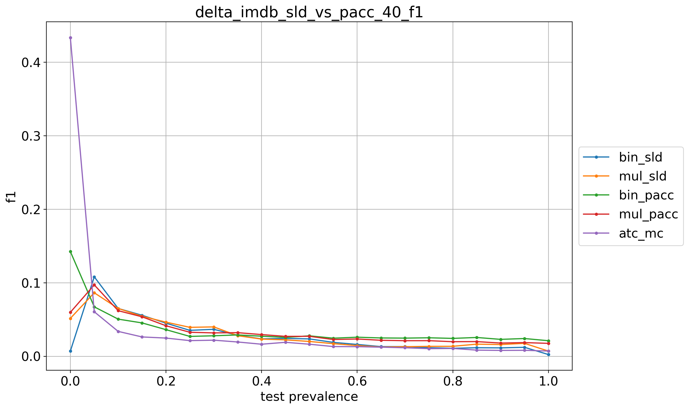
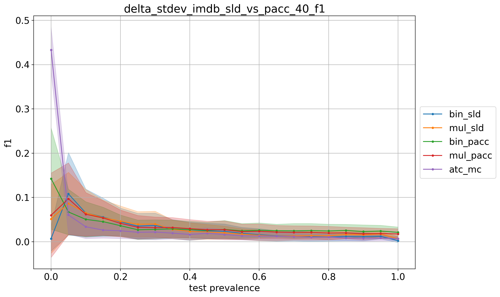
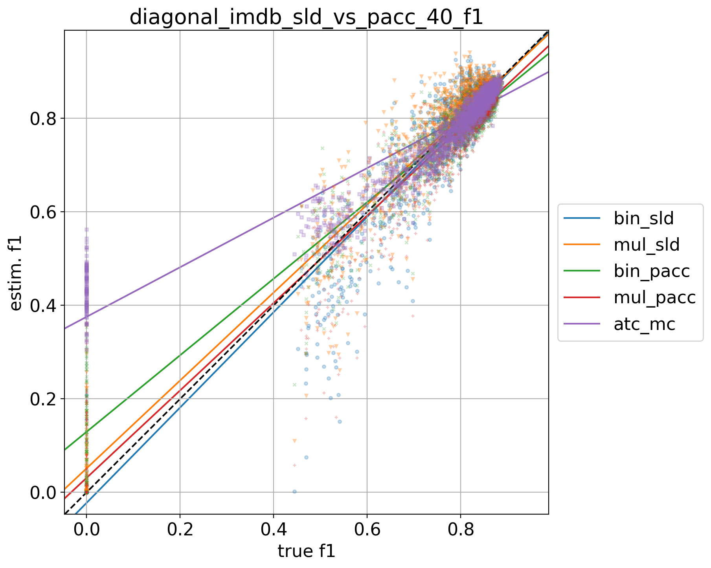
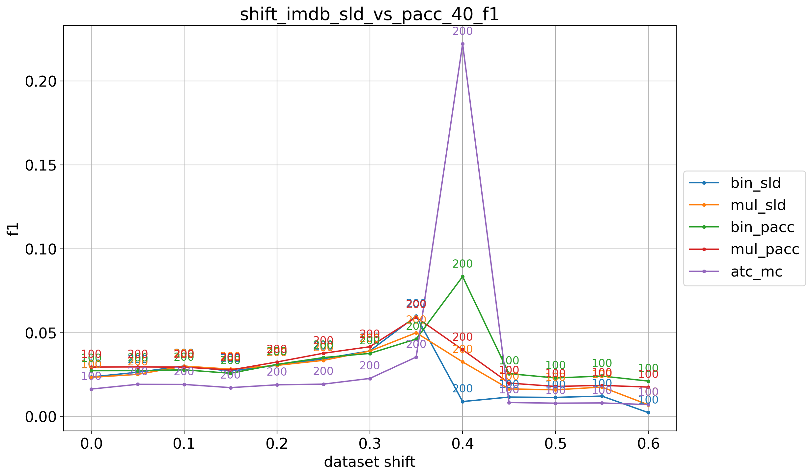

## 50% positives
> train: [0.5 0.5]  
> validation: [0.5 0.5]  
> bin_sld: 183.289s  
> mul_sld: 29.440s  
> binmc_sld: 180.043s  
> mulmc_sld: 29.019s  
> binne_sld: 182.581s  
> mulne_sld: 29.161s  
> bin_pacc: 175.513s  
> mul_pacc: 20.580s  
> ref: 13.469s  
> atc_mc: 18.022s  
> tot: 183.861s  

<table border="1" class="dataframe">
  <thead>
    <tr style="text-align: right;">
      <th></th>
      <th>bin_sld</th>
      <th>mul_sld</th>
      <th>bin_pacc</th>
      <th>mul_pacc</th>
      <th>atc_mc</th>
    </tr>
  </thead>
  <tbody>
    <tr>
      <th>0.0</th>
      <td>0.0041</td>
      <td>0.0125</td>
      <td>0.1279</td>
      <td>0.0355</td>
      <td>0.5313</td>
    </tr>
    <tr>
      <th>0.05</th>
      <td>0.0882</td>
      <td>0.0677</td>
      <td>0.0582</td>
      <td>0.0718</td>
      <td>0.2320</td>
    </tr>
    <tr>
      <th>0.1</th>
      <td>0.0510</td>
      <td>0.0458</td>
      <td>0.0406</td>
      <td>0.0583</td>
      <td>0.1230</td>
    </tr>
    <tr>
      <th>0.15</th>
      <td>0.0382</td>
      <td>0.0377</td>
      <td>0.0342</td>
      <td>0.0509</td>
      <td>0.0683</td>
    </tr>
    <tr>
      <th>0.2</th>
      <td>0.0273</td>
      <td>0.0326</td>
      <td>0.0275</td>
      <td>0.0445</td>
      <td>0.0417</td>
    </tr>
    <tr>
      <th>0.25</th>
      <td>0.0250</td>
      <td>0.0272</td>
      <td>0.0220</td>
      <td>0.0386</td>
      <td>0.0278</td>
    </tr>
    <tr>
      <th>0.3</th>
      <td>0.0259</td>
      <td>0.0302</td>
      <td>0.0219</td>
      <td>0.0340</td>
      <td>0.0169</td>
    </tr>
    <tr>
      <th>0.35</th>
      <td>0.0220</td>
      <td>0.0248</td>
      <td>0.0191</td>
      <td>0.0364</td>
      <td>0.0129</td>
    </tr>
    <tr>
      <th>0.4</th>
      <td>0.0192</td>
      <td>0.0225</td>
      <td>0.0162</td>
      <td>0.0340</td>
      <td>0.0113</td>
    </tr>
    <tr>
      <th>0.45</th>
      <td>0.0197</td>
      <td>0.0245</td>
      <td>0.0159</td>
      <td>0.0296</td>
      <td>0.0107</td>
    </tr>
    <tr>
      <th>0.5</th>
      <td>0.0183</td>
      <td>0.0193</td>
      <td>0.0173</td>
      <td>0.0313</td>
      <td>0.0121</td>
    </tr>
    <tr>
      <th>0.55</th>
      <td>0.0174</td>
      <td>0.0203</td>
      <td>0.0165</td>
      <td>0.0282</td>
      <td>0.0109</td>
    </tr>
    <tr>
      <th>0.6</th>
      <td>0.0170</td>
      <td>0.0191</td>
      <td>0.0159</td>
      <td>0.0273</td>
      <td>0.0105</td>
    </tr>
    <tr>
      <th>0.65</th>
      <td>0.0159</td>
      <td>0.0172</td>
      <td>0.0140</td>
      <td>0.0231</td>
      <td>0.0105</td>
    </tr>
    <tr>
      <th>0.7</th>
      <td>0.0129</td>
      <td>0.0124</td>
      <td>0.0139</td>
      <td>0.0247</td>
      <td>0.0106</td>
    </tr>
    <tr>
      <th>0.75</th>
      <td>0.0133</td>
      <td>0.0117</td>
      <td>0.0147</td>
      <td>0.0242</td>
      <td>0.0107</td>
    </tr>
    <tr>
      <th>0.8</th>
      <td>0.0116</td>
      <td>0.0100</td>
      <td>0.0137</td>
      <td>0.0220</td>
      <td>0.0105</td>
    </tr>
    <tr>
      <th>0.85</th>
      <td>0.0105</td>
      <td>0.0081</td>
      <td>0.0135</td>
      <td>0.0217</td>
      <td>0.0100</td>
    </tr>
    <tr>
      <th>0.9</th>
      <td>0.0081</td>
      <td>0.0060</td>
      <td>0.0123</td>
      <td>0.0192</td>
      <td>0.0111</td>
    </tr>
    <tr>
      <th>0.95</th>
      <td>0.0094</td>
      <td>0.0080</td>
      <td>0.0134</td>
      <td>0.0209</td>
      <td>0.0114</td>
    </tr>
    <tr>
      <th>1.0</th>
      <td>0.0036</td>
      <td>0.0043</td>
      <td>0.0119</td>
      <td>0.0185</td>
      <td>0.0102</td>
    </tr>
    <tr>
      <th>avg</th>
      <td>0.0218</td>
      <td>0.0220</td>
      <td>0.0257</td>
      <td>0.0331</td>
      <td>0.0569</td>
    </tr>
  </tbody>
</table>

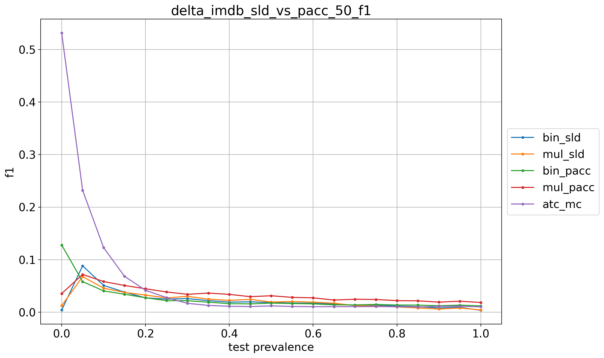
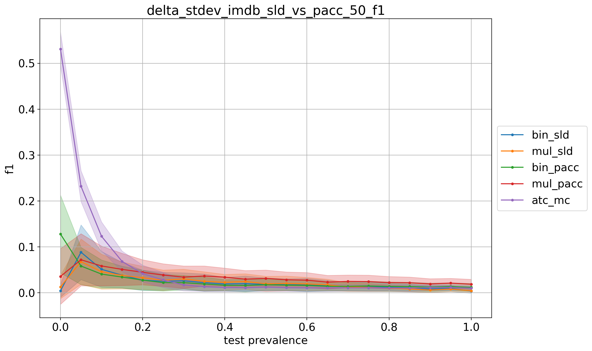
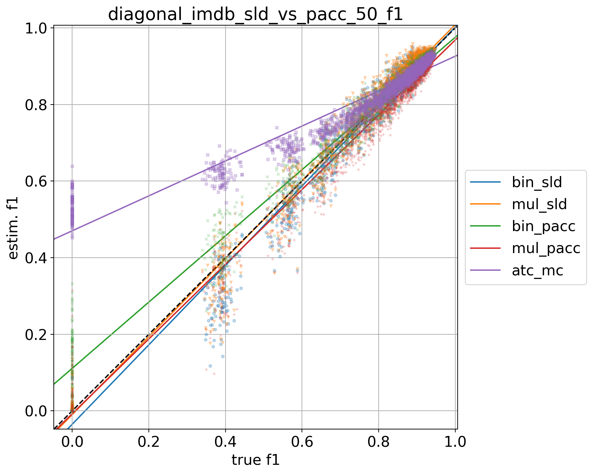
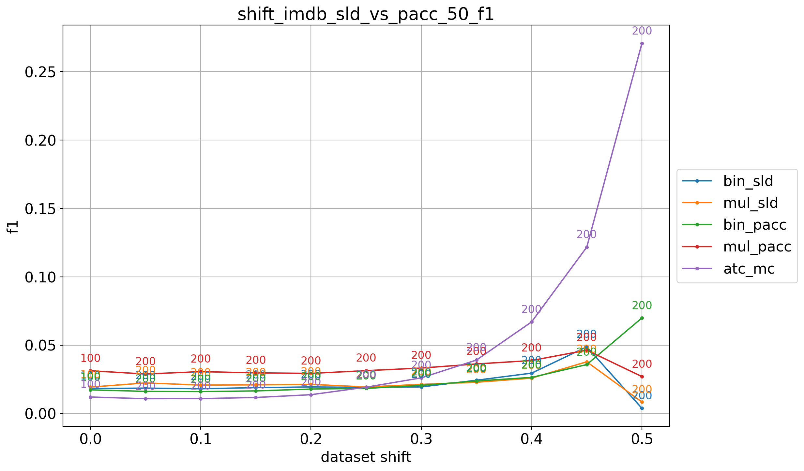

## 60% positives
> train: [0.39991359 0.60008641]  
> validation: [0.4000576 0.5999424]  
> bin_sld: 181.668s  
> mul_sld: 29.617s  
> binmc_sld: 180.480s  
> mulmc_sld: 28.823s  
> binne_sld: 182.053s  
> mulne_sld: 28.654s  
> bin_pacc: 176.533s  
> mul_pacc: 20.753s  
> ref: 13.464s  
> atc_mc: 17.977s  
> tot: 183.024s  

<table border="1" class="dataframe">
  <thead>
    <tr style="text-align: right;">
      <th></th>
      <th>bin_sld</th>
      <th>mul_sld</th>
      <th>bin_pacc</th>
      <th>mul_pacc</th>
      <th>atc_mc</th>
    </tr>
  </thead>
  <tbody>
    <tr>
      <th>0.0</th>
      <td>0.0004</td>
      <td>0.0002</td>
      <td>0.0032</td>
      <td>0.0036</td>
      <td>0.5686</td>
    </tr>
    <tr>
      <th>0.05</th>
      <td>0.1371</td>
      <td>0.1108</td>
      <td>0.0995</td>
      <td>0.1103</td>
      <td>0.3422</td>
    </tr>
    <tr>
      <th>0.1</th>
      <td>0.1027</td>
      <td>0.0815</td>
      <td>0.0733</td>
      <td>0.0783</td>
      <td>0.2281</td>
    </tr>
    <tr>
      <th>0.15</th>
      <td>0.0826</td>
      <td>0.0628</td>
      <td>0.0665</td>
      <td>0.0634</td>
      <td>0.1475</td>
    </tr>
    <tr>
      <th>0.2</th>
      <td>0.0571</td>
      <td>0.0464</td>
      <td>0.0534</td>
      <td>0.0507</td>
      <td>0.1066</td>
    </tr>
    <tr>
      <th>0.25</th>
      <td>0.0429</td>
      <td>0.0326</td>
      <td>0.0454</td>
      <td>0.0385</td>
      <td>0.0747</td>
    </tr>
    <tr>
      <th>0.3</th>
      <td>0.0315</td>
      <td>0.0276</td>
      <td>0.0387</td>
      <td>0.0351</td>
      <td>0.0515</td>
    </tr>
    <tr>
      <th>0.35</th>
      <td>0.0309</td>
      <td>0.0261</td>
      <td>0.0418</td>
      <td>0.0352</td>
      <td>0.0344</td>
    </tr>
    <tr>
      <th>0.4</th>
      <td>0.0235</td>
      <td>0.0205</td>
      <td>0.0375</td>
      <td>0.0327</td>
      <td>0.0235</td>
    </tr>
    <tr>
      <th>0.45</th>
      <td>0.0180</td>
      <td>0.0172</td>
      <td>0.0316</td>
      <td>0.0269</td>
      <td>0.0169</td>
    </tr>
    <tr>
      <th>0.5</th>
      <td>0.0189</td>
      <td>0.0175</td>
      <td>0.0334</td>
      <td>0.0287</td>
      <td>0.0121</td>
    </tr>
    <tr>
      <th>0.55</th>
      <td>0.0150</td>
      <td>0.0150</td>
      <td>0.0296</td>
      <td>0.0249</td>
      <td>0.0087</td>
    </tr>
    <tr>
      <th>0.6</th>
      <td>0.0152</td>
      <td>0.0151</td>
      <td>0.0298</td>
      <td>0.0253</td>
      <td>0.0082</td>
    </tr>
    <tr>
      <th>0.65</th>
      <td>0.0144</td>
      <td>0.0148</td>
      <td>0.0250</td>
      <td>0.0210</td>
      <td>0.0093</td>
    </tr>
    <tr>
      <th>0.7</th>
      <td>0.0140</td>
      <td>0.0111</td>
      <td>0.0279</td>
      <td>0.0243</td>
      <td>0.0122</td>
    </tr>
    <tr>
      <th>0.75</th>
      <td>0.0139</td>
      <td>0.0104</td>
      <td>0.0255</td>
      <td>0.0224</td>
      <td>0.0135</td>
    </tr>
    <tr>
      <th>0.8</th>
      <td>0.0129</td>
      <td>0.0113</td>
      <td>0.0223</td>
      <td>0.0204</td>
      <td>0.0156</td>
    </tr>
    <tr>
      <th>0.85</th>
      <td>0.0124</td>
      <td>0.0083</td>
      <td>0.0218</td>
      <td>0.0204</td>
      <td>0.0152</td>
    </tr>
    <tr>
      <th>0.9</th>
      <td>0.0112</td>
      <td>0.0065</td>
      <td>0.0205</td>
      <td>0.0190</td>
      <td>0.0178</td>
    </tr>
    <tr>
      <th>0.95</th>
      <td>0.0130</td>
      <td>0.0063</td>
      <td>0.0220</td>
      <td>0.0214</td>
      <td>0.0189</td>
    </tr>
    <tr>
      <th>1.0</th>
      <td>0.0060</td>
      <td>0.0040</td>
      <td>0.0197</td>
      <td>0.0202</td>
      <td>0.0197</td>
    </tr>
    <tr>
      <th>avg</th>
      <td>0.0321</td>
      <td>0.0260</td>
      <td>0.0366</td>
      <td>0.0344</td>
      <td>0.0831</td>
    </tr>
  </tbody>
</table>

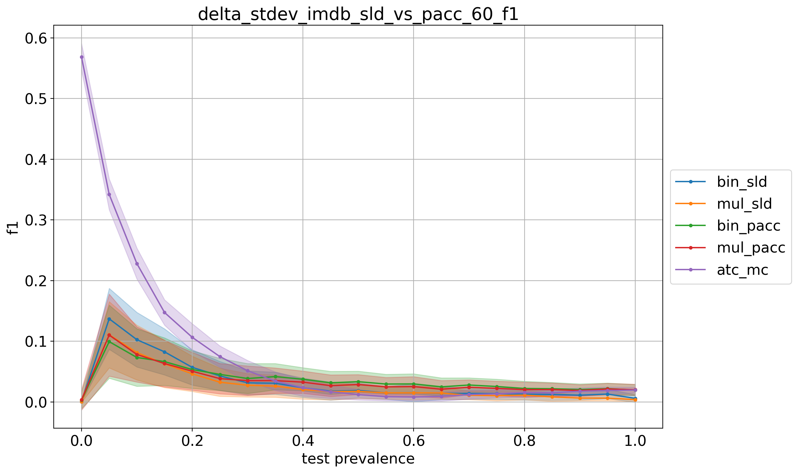
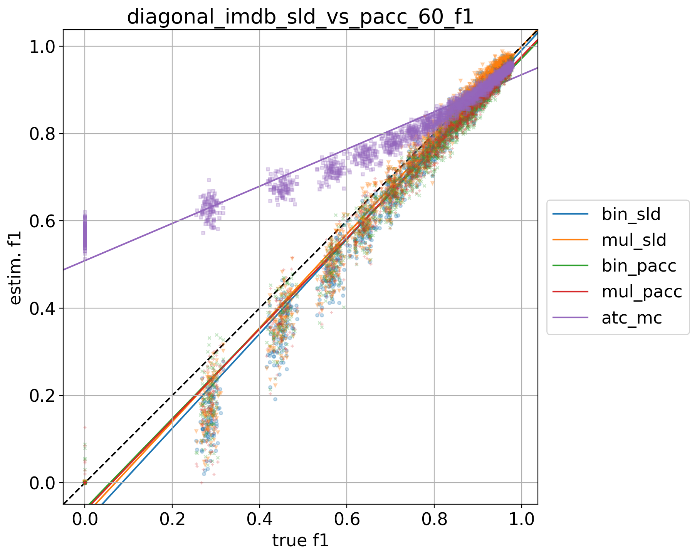
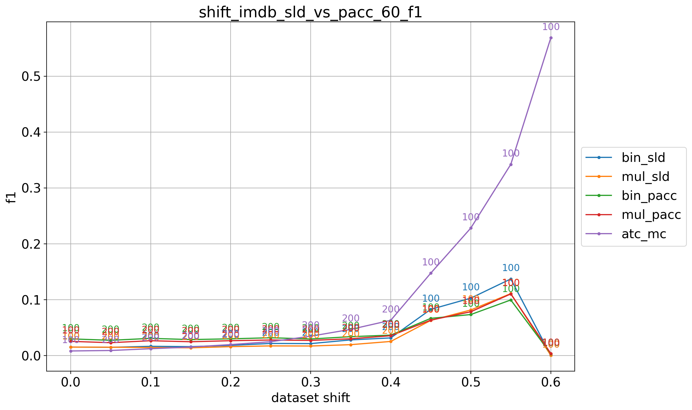

## 70% positives
> train: [0.2999712 0.7000288]  
> validation: [0.2999712 0.7000288]  
> bin_sld: 183.652s  
> mul_sld: 28.322s  
> binmc_sld: 181.431s  
> mulmc_sld: 27.437s  
> binne_sld: 182.010s  
> mulne_sld: 28.139s  
> bin_pacc: 175.741s  
> mul_pacc: 20.586s  
> ref: 13.757s  
> atc_mc: 17.949s  
> tot: 184.200s  

<table border="1" class="dataframe">
  <thead>
    <tr style="text-align: right;">
      <th></th>
      <th>bin_sld</th>
      <th>mul_sld</th>
      <th>bin_pacc</th>
      <th>mul_pacc</th>
      <th>atc_mc</th>
    </tr>
  </thead>
  <tbody>
    <tr>
      <th>0.0</th>
      <td>0.0003</td>
      <td>0.0000</td>
      <td>0.0309</td>
      <td>0.0136</td>
      <td>0.5833</td>
    </tr>
    <tr>
      <th>0.05</th>
      <td>0.1263</td>
      <td>0.1132</td>
      <td>0.0368</td>
      <td>0.0431</td>
      <td>0.4272</td>
    </tr>
    <tr>
      <th>0.1</th>
      <td>0.1016</td>
      <td>0.0917</td>
      <td>0.0305</td>
      <td>0.0364</td>
      <td>0.3236</td>
    </tr>
    <tr>
      <th>0.15</th>
      <td>0.0849</td>
      <td>0.0747</td>
      <td>0.0236</td>
      <td>0.0287</td>
      <td>0.2429</td>
    </tr>
    <tr>
      <th>0.2</th>
      <td>0.0645</td>
      <td>0.0551</td>
      <td>0.0243</td>
      <td>0.0263</td>
      <td>0.1899</td>
    </tr>
    <tr>
      <th>0.25</th>
      <td>0.0489</td>
      <td>0.0408</td>
      <td>0.0179</td>
      <td>0.0205</td>
      <td>0.1453</td>
    </tr>
    <tr>
      <th>0.3</th>
      <td>0.0369</td>
      <td>0.0297</td>
      <td>0.0161</td>
      <td>0.0154</td>
      <td>0.1125</td>
    </tr>
    <tr>
      <th>0.35</th>
      <td>0.0350</td>
      <td>0.0281</td>
      <td>0.0140</td>
      <td>0.0160</td>
      <td>0.0875</td>
    </tr>
    <tr>
      <th>0.4</th>
      <td>0.0265</td>
      <td>0.0233</td>
      <td>0.0136</td>
      <td>0.0153</td>
      <td>0.0688</td>
    </tr>
    <tr>
      <th>0.45</th>
      <td>0.0191</td>
      <td>0.0173</td>
      <td>0.0130</td>
      <td>0.0135</td>
      <td>0.0528</td>
    </tr>
    <tr>
      <th>0.5</th>
      <td>0.0165</td>
      <td>0.0158</td>
      <td>0.0126</td>
      <td>0.0136</td>
      <td>0.0385</td>
    </tr>
    <tr>
      <th>0.55</th>
      <td>0.0133</td>
      <td>0.0126</td>
      <td>0.0106</td>
      <td>0.0108</td>
      <td>0.0281</td>
    </tr>
    <tr>
      <th>0.6</th>
      <td>0.0098</td>
      <td>0.0111</td>
      <td>0.0091</td>
      <td>0.0093</td>
      <td>0.0209</td>
    </tr>
    <tr>
      <th>0.65</th>
      <td>0.0109</td>
      <td>0.0136</td>
      <td>0.0105</td>
      <td>0.0114</td>
      <td>0.0125</td>
    </tr>
    <tr>
      <th>0.7</th>
      <td>0.0080</td>
      <td>0.0089</td>
      <td>0.0097</td>
      <td>0.0079</td>
      <td>0.0077</td>
    </tr>
    <tr>
      <th>0.75</th>
      <td>0.0082</td>
      <td>0.0085</td>
      <td>0.0098</td>
      <td>0.0074</td>
      <td>0.0053</td>
    </tr>
    <tr>
      <th>0.8</th>
      <td>0.0086</td>
      <td>0.0104</td>
      <td>0.0099</td>
      <td>0.0078</td>
      <td>0.0065</td>
    </tr>
    <tr>
      <th>0.85</th>
      <td>0.0088</td>
      <td>0.0097</td>
      <td>0.0109</td>
      <td>0.0076</td>
      <td>0.0075</td>
    </tr>
    <tr>
      <th>0.9</th>
      <td>0.0083</td>
      <td>0.0089</td>
      <td>0.0102</td>
      <td>0.0079</td>
      <td>0.0101</td>
    </tr>
    <tr>
      <th>0.95</th>
      <td>0.0070</td>
      <td>0.0047</td>
      <td>0.0136</td>
      <td>0.0064</td>
      <td>0.0136</td>
    </tr>
    <tr>
      <th>1.0</th>
      <td>0.0017</td>
      <td>0.0019</td>
      <td>0.0112</td>
      <td>0.0058</td>
      <td>0.0151</td>
    </tr>
    <tr>
      <th>avg</th>
      <td>0.0307</td>
      <td>0.0276</td>
      <td>0.0161</td>
      <td>0.0155</td>
      <td>0.1143</td>
    </tr>
  </tbody>
</table>

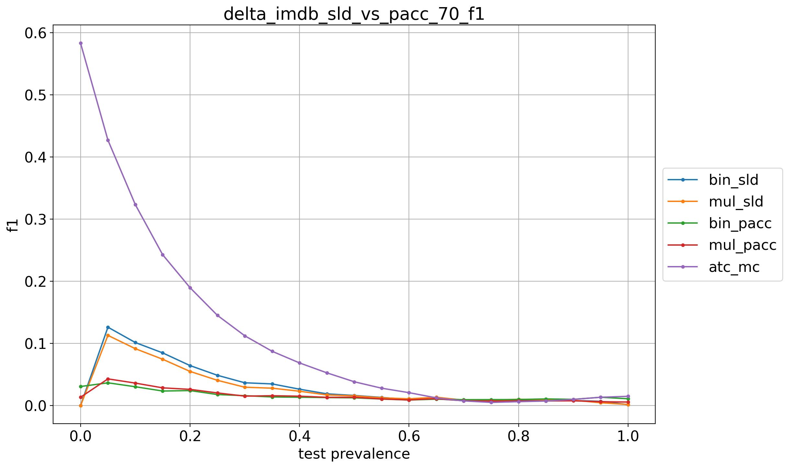
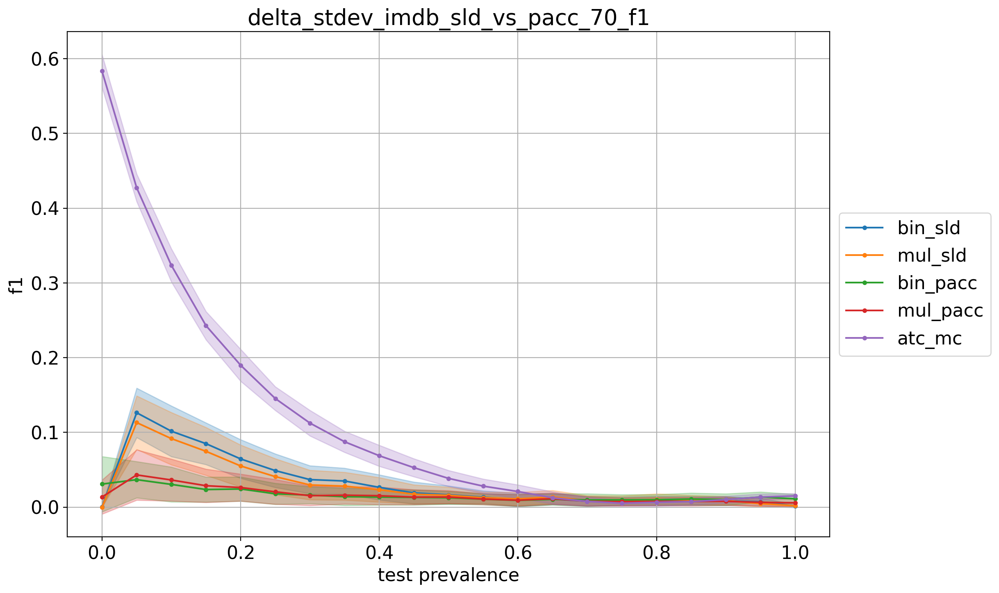
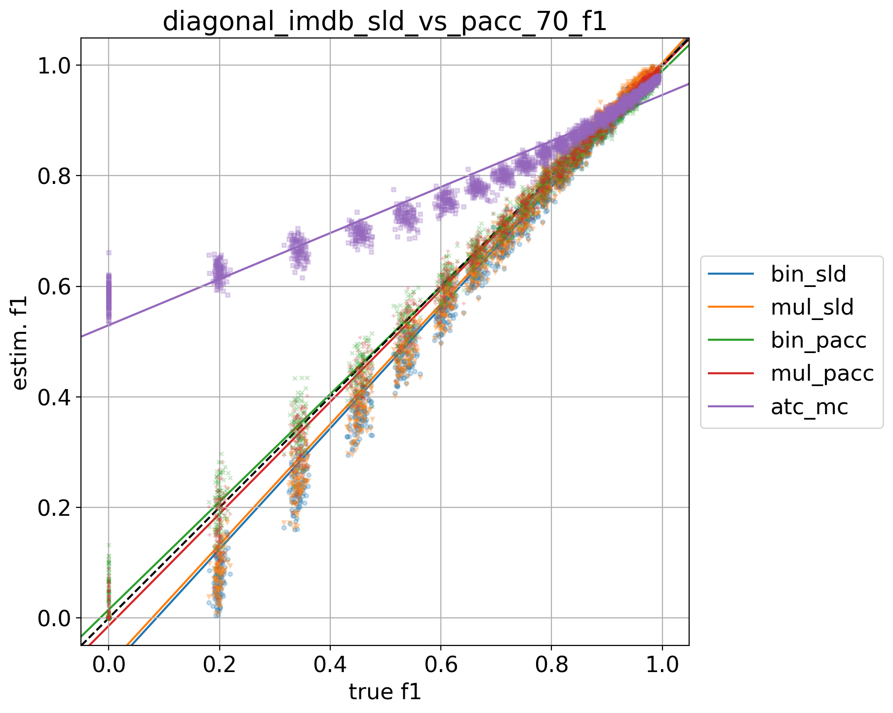
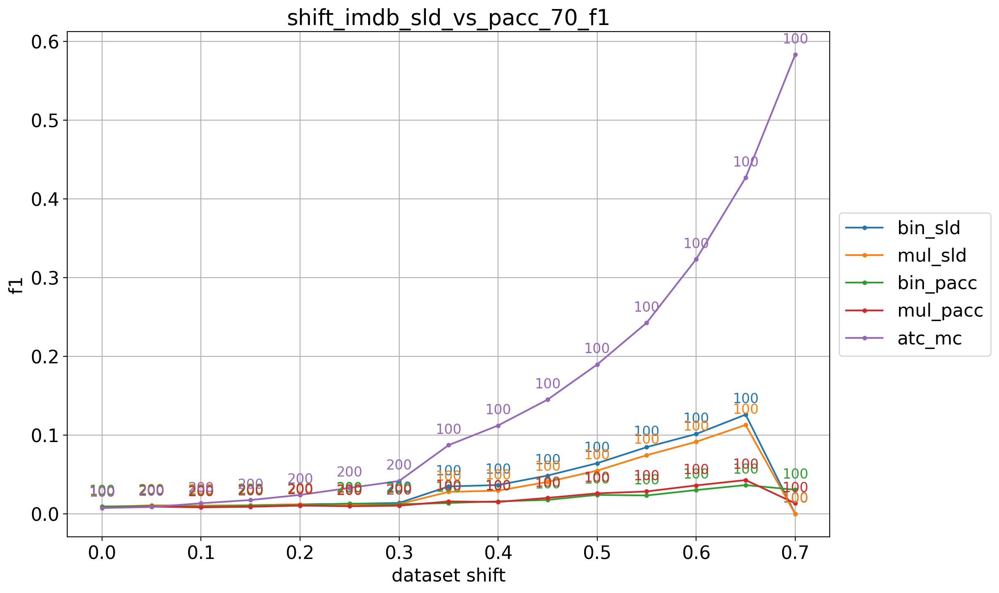

## 80% positives
> train: [0.2000288 0.7999712]  
> validation: [0.2000288 0.7999712]  
> bin_sld: 184.106s  
> mul_sld: 28.336s  
> binmc_sld: 183.242s  
> mulmc_sld: 27.274s  
> binne_sld: 184.907s  
> mulne_sld: 27.269s  
> bin_pacc: 175.764s  
> mul_pacc: 20.476s  
> ref: 13.542s  
> atc_mc: 17.815s  
> tot: 186.258s  

<table border="1" class="dataframe">
  <thead>
    <tr style="text-align: right;">
      <th></th>
      <th>bin_sld</th>
      <th>mul_sld</th>
      <th>bin_pacc</th>
      <th>mul_pacc</th>
      <th>atc_mc</th>
    </tr>
  </thead>
  <tbody>
    <tr>
      <th>0.0</th>
      <td>0.0002</td>
      <td>0.0000</td>
      <td>0.0413</td>
      <td>0.0946</td>
      <td>0.5690</td>
    </tr>
    <tr>
      <th>0.05</th>
      <td>0.1273</td>
      <td>0.1196</td>
      <td>0.0339</td>
      <td>0.0561</td>
      <td>0.4617</td>
    </tr>
    <tr>
      <th>0.1</th>
      <td>0.1246</td>
      <td>0.1176</td>
      <td>0.0323</td>
      <td>0.0510</td>
      <td>0.3805</td>
    </tr>
    <tr>
      <th>0.15</th>
      <td>0.1053</td>
      <td>0.1040</td>
      <td>0.0225</td>
      <td>0.0325</td>
      <td>0.3102</td>
    </tr>
    <tr>
      <th>0.2</th>
      <td>0.0819</td>
      <td>0.0836</td>
      <td>0.0254</td>
      <td>0.0326</td>
      <td>0.2550</td>
    </tr>
    <tr>
      <th>0.25</th>
      <td>0.0665</td>
      <td>0.0700</td>
      <td>0.0215</td>
      <td>0.0276</td>
      <td>0.2072</td>
    </tr>
    <tr>
      <th>0.3</th>
      <td>0.0501</td>
      <td>0.0545</td>
      <td>0.0181</td>
      <td>0.0233</td>
      <td>0.1705</td>
    </tr>
    <tr>
      <th>0.35</th>
      <td>0.0427</td>
      <td>0.0472</td>
      <td>0.0152</td>
      <td>0.0207</td>
      <td>0.1388</td>
    </tr>
    <tr>
      <th>0.4</th>
      <td>0.0341</td>
      <td>0.0391</td>
      <td>0.0165</td>
      <td>0.0217</td>
      <td>0.1144</td>
    </tr>
    <tr>
      <th>0.45</th>
      <td>0.0230</td>
      <td>0.0272</td>
      <td>0.0137</td>
      <td>0.0195</td>
      <td>0.0909</td>
    </tr>
    <tr>
      <th>0.5</th>
      <td>0.0192</td>
      <td>0.0220</td>
      <td>0.0133</td>
      <td>0.0191</td>
      <td>0.0727</td>
    </tr>
    <tr>
      <th>0.55</th>
      <td>0.0150</td>
      <td>0.0169</td>
      <td>0.0107</td>
      <td>0.0174</td>
      <td>0.0569</td>
    </tr>
    <tr>
      <th>0.6</th>
      <td>0.0115</td>
      <td>0.0138</td>
      <td>0.0093</td>
      <td>0.0194</td>
      <td>0.0441</td>
    </tr>
    <tr>
      <th>0.65</th>
      <td>0.0102</td>
      <td>0.0118</td>
      <td>0.0105</td>
      <td>0.0178</td>
      <td>0.0297</td>
    </tr>
    <tr>
      <th>0.7</th>
      <td>0.0080</td>
      <td>0.0095</td>
      <td>0.0087</td>
      <td>0.0168</td>
      <td>0.0198</td>
    </tr>
    <tr>
      <th>0.75</th>
      <td>0.0070</td>
      <td>0.0072</td>
      <td>0.0084</td>
      <td>0.0195</td>
      <td>0.0119</td>
    </tr>
    <tr>
      <th>0.8</th>
      <td>0.0073</td>
      <td>0.0076</td>
      <td>0.0081</td>
      <td>0.0178</td>
      <td>0.0068</td>
    </tr>
    <tr>
      <th>0.85</th>
      <td>0.0076</td>
      <td>0.0079</td>
      <td>0.0072</td>
      <td>0.0163</td>
      <td>0.0049</td>
    </tr>
    <tr>
      <th>0.9</th>
      <td>0.0079</td>
      <td>0.0074</td>
      <td>0.0059</td>
      <td>0.0152</td>
      <td>0.0076</td>
    </tr>
    <tr>
      <th>0.95</th>
      <td>0.0057</td>
      <td>0.0047</td>
      <td>0.0053</td>
      <td>0.0154</td>
      <td>0.0117</td>
    </tr>
    <tr>
      <th>1.0</th>
      <td>0.0018</td>
      <td>0.0014</td>
      <td>0.0025</td>
      <td>0.0148</td>
      <td>0.0150</td>
    </tr>
    <tr>
      <th>avg</th>
      <td>0.0360</td>
      <td>0.0368</td>
      <td>0.0157</td>
      <td>0.0271</td>
      <td>0.1419</td>
    </tr>
  </tbody>
</table>

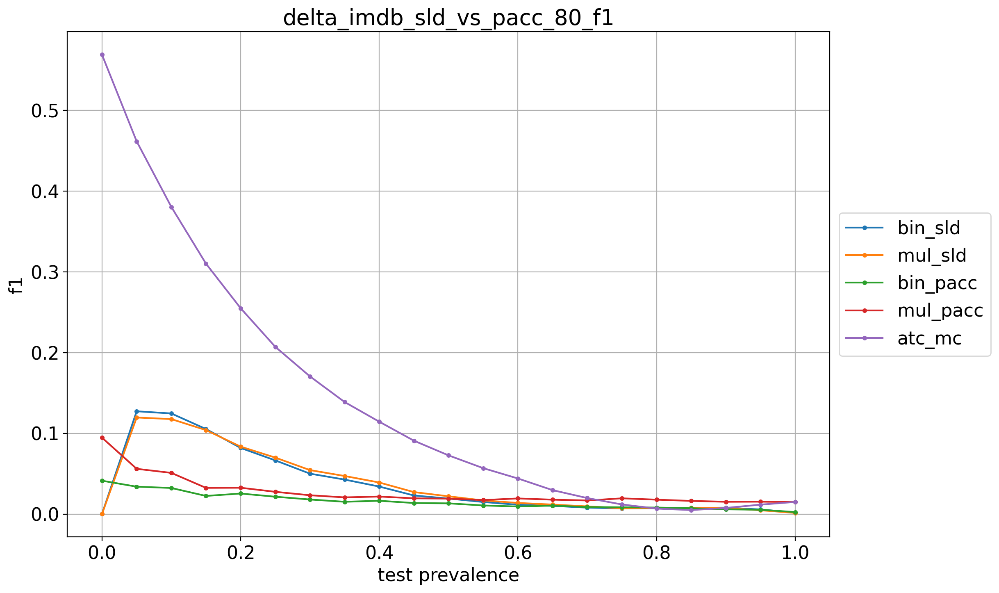
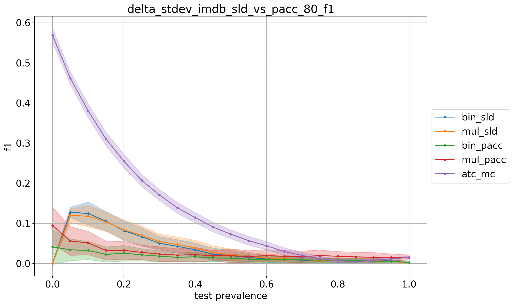
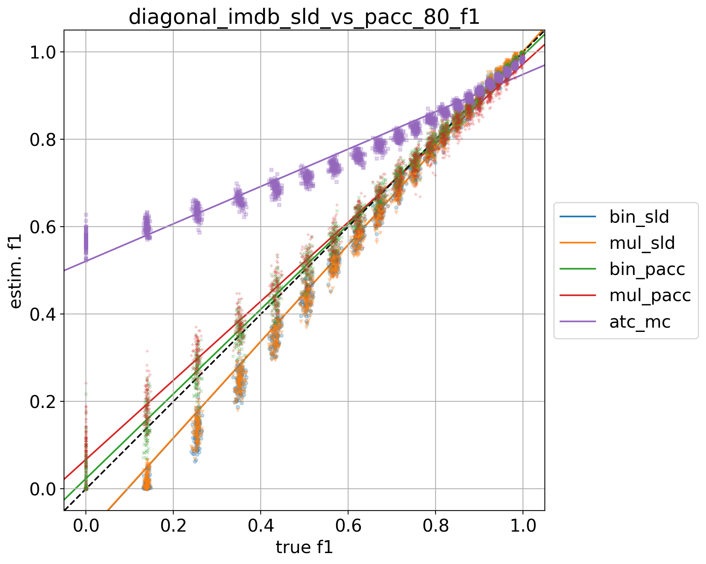
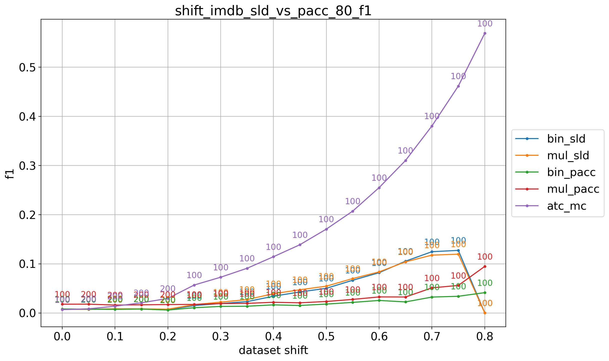

## 90% positives
> train: [0.0999424 0.9000576]  
> validation: [0.10008641 0.89991359]  
> bin_sld: 172.471s  
> mul_sld: 27.815s  
> binmc_sld: 172.819s  
> mulmc_sld: 22.238s  
> binne_sld: 171.872s  
> mulne_sld: 21.113s  
> ref: 11.632s  
> atc_mc: 15.307s  
> tot: 173.441s  

<table border="1" class="dataframe">
  <thead>
    <tr style="text-align: right;">
      <th></th>
      <th>bin_sld</th>
      <th>mul_sld</th>
      <th>atc_mc</th>
    </tr>
  </thead>
  <tbody>
    <tr>
      <th>0.0</th>
      <td>0.0001</td>
      <td>0.0000</td>
      <td>0.5298</td>
    </tr>
    <tr>
      <th>0.05</th>
      <td>0.1008</td>
      <td>0.1010</td>
      <td>0.4611</td>
    </tr>
    <tr>
      <th>0.1</th>
      <td>0.1910</td>
      <td>0.1895</td>
      <td>0.4018</td>
    </tr>
    <tr>
      <th>0.15</th>
      <td>0.2661</td>
      <td>0.2388</td>
      <td>0.3476</td>
    </tr>
    <tr>
      <th>0.2</th>
      <td>0.2564</td>
      <td>0.2559</td>
      <td>0.3036</td>
    </tr>
    <tr>
      <th>0.25</th>
      <td>0.2231</td>
      <td>0.2454</td>
      <td>0.2600</td>
    </tr>
    <tr>
      <th>0.3</th>
      <td>0.1857</td>
      <td>0.2215</td>
      <td>0.2236</td>
    </tr>
    <tr>
      <th>0.35</th>
      <td>0.1615</td>
      <td>0.2125</td>
      <td>0.1920</td>
    </tr>
    <tr>
      <th>0.4</th>
      <td>0.1319</td>
      <td>0.1868</td>
      <td>0.1657</td>
    </tr>
    <tr>
      <th>0.45</th>
      <td>0.1072</td>
      <td>0.1287</td>
      <td>0.1389</td>
    </tr>
    <tr>
      <th>0.5</th>
      <td>0.0860</td>
      <td>0.1060</td>
      <td>0.1160</td>
    </tr>
    <tr>
      <th>0.55</th>
      <td>0.0690</td>
      <td>0.0759</td>
      <td>0.0962</td>
    </tr>
    <tr>
      <th>0.6</th>
      <td>0.0519</td>
      <td>0.0623</td>
      <td>0.0783</td>
    </tr>
    <tr>
      <th>0.65</th>
      <td>0.0414</td>
      <td>0.0441</td>
      <td>0.0599</td>
    </tr>
    <tr>
      <th>0.7</th>
      <td>0.0301</td>
      <td>0.0297</td>
      <td>0.0461</td>
    </tr>
    <tr>
      <th>0.75</th>
      <td>0.0208</td>
      <td>0.0194</td>
      <td>0.0323</td>
    </tr>
    <tr>
      <th>0.8</th>
      <td>0.0134</td>
      <td>0.0122</td>
      <td>0.0201</td>
    </tr>
    <tr>
      <th>0.85</th>
      <td>0.0075</td>
      <td>0.0070</td>
      <td>0.0099</td>
    </tr>
    <tr>
      <th>0.9</th>
      <td>0.0054</td>
      <td>0.0054</td>
      <td>0.0033</td>
    </tr>
    <tr>
      <th>0.95</th>
      <td>0.0039</td>
      <td>0.0047</td>
      <td>0.0090</td>
    </tr>
    <tr>
      <th>1.0</th>
      <td>0.0007</td>
      <td>0.0007</td>
      <td>0.0172</td>
    </tr>
    <tr>
      <th>avg</th>
      <td>0.0930</td>
      <td>0.1023</td>
      <td>0.1672</td>
    </tr>
  </tbody>
</table>

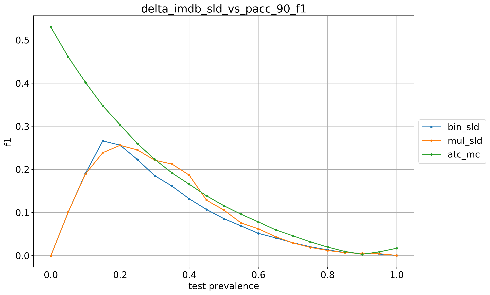
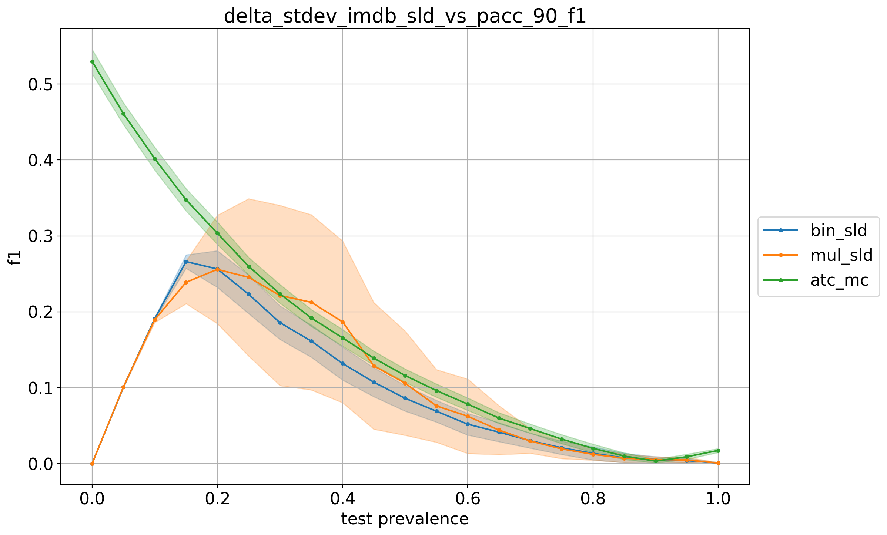
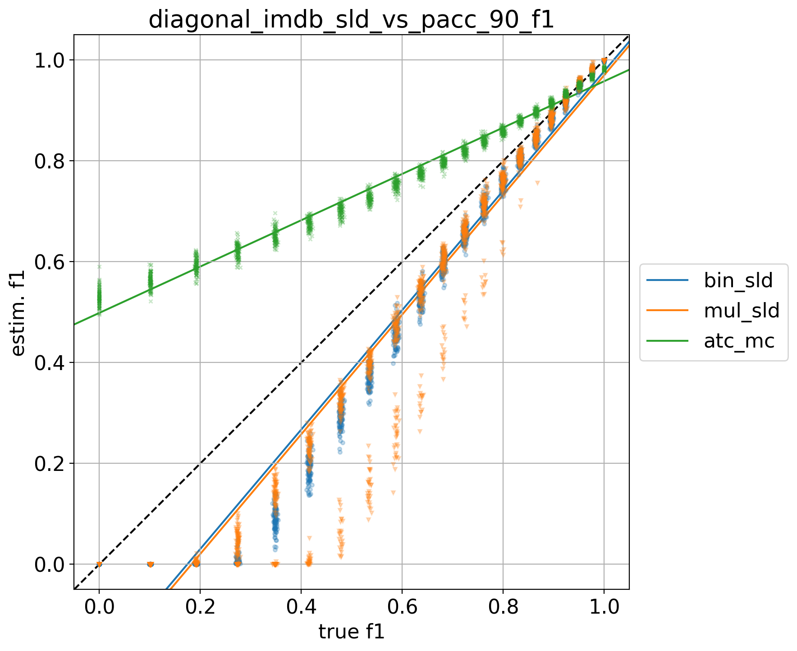
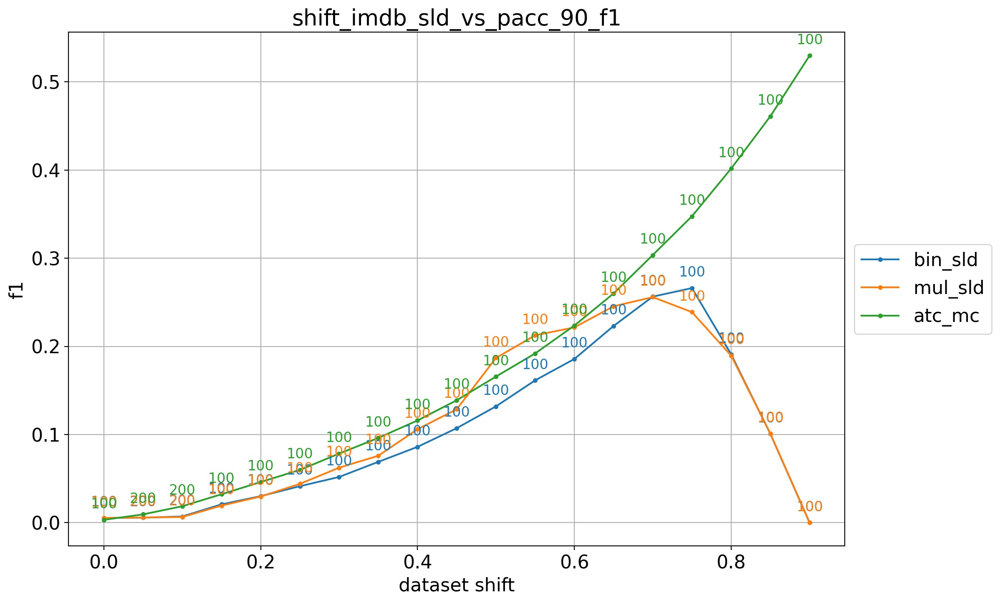

## avg
### avg on train
<table border="1" class="dataframe">
  <thead>
    <tr style="text-align: right;">
      <th></th>
      <th>bin_sld</th>
      <th>mul_sld</th>
      <th>bin_pacc</th>
      <th>mul_pacc</th>
      <th>atc_mc</th>
    </tr>
  </thead>
  <tbody>
    <tr>
      <th>0.0</th>
      <td>0.0287</td>
      <td>0.0689</td>
      <td>0.0930</td>
      <td>0.1608</td>
      <td>0.3846</td>
    </tr>
    <tr>
      <th>0.05</th>
      <td>0.1170</td>
      <td>0.1012</td>
      <td>0.0720</td>
      <td>0.0844</td>
      <td>0.2693</td>
    </tr>
    <tr>
      <th>0.1</th>
      <td>0.0981</td>
      <td>0.0904</td>
      <td>0.0533</td>
      <td>0.0627</td>
      <td>0.2102</td>
    </tr>
    <tr>
      <th>0.15</th>
      <td>0.0899</td>
      <td>0.0851</td>
      <td>0.0458</td>
      <td>0.0524</td>
      <td>0.1689</td>
    </tr>
    <tr>
      <th>0.2</th>
      <td>0.0720</td>
      <td>0.0757</td>
      <td>0.0395</td>
      <td>0.0456</td>
      <td>0.1424</td>
    </tr>
    <tr>
      <th>0.25</th>
      <td>0.0585</td>
      <td>0.0668</td>
      <td>0.0329</td>
      <td>0.0397</td>
      <td>0.1196</td>
    </tr>
    <tr>
      <th>0.3</th>
      <td>0.0486</td>
      <td>0.0610</td>
      <td>0.0303</td>
      <td>0.0378</td>
      <td>0.1030</td>
    </tr>
    <tr>
      <th>0.35</th>
      <td>0.0418</td>
      <td>0.0573</td>
      <td>0.0326</td>
      <td>0.0384</td>
      <td>0.0899</td>
    </tr>
    <tr>
      <th>0.4</th>
      <td>0.0336</td>
      <td>0.0517</td>
      <td>0.0305</td>
      <td>0.0375</td>
      <td>0.0797</td>
    </tr>
    <tr>
      <th>0.45</th>
      <td>0.0284</td>
      <td>0.0419</td>
      <td>0.0268</td>
      <td>0.0345</td>
      <td>0.0709</td>
    </tr>
    <tr>
      <th>0.5</th>
      <td>0.0241</td>
      <td>0.0379</td>
      <td>0.0268</td>
      <td>0.0344</td>
      <td>0.0631</td>
    </tr>
    <tr>
      <th>0.55</th>
      <td>0.0201</td>
      <td>0.0333</td>
      <td>0.0264</td>
      <td>0.0321</td>
      <td>0.0572</td>
    </tr>
    <tr>
      <th>0.6</th>
      <td>0.0171</td>
      <td>0.0312</td>
      <td>0.0254</td>
      <td>0.0327</td>
      <td>0.0522</td>
    </tr>
    <tr>
      <th>0.65</th>
      <td>0.0152</td>
      <td>0.0288</td>
      <td>0.0243</td>
      <td>0.0310</td>
      <td>0.0476</td>
    </tr>
    <tr>
      <th>0.7</th>
      <td>0.0144</td>
      <td>0.0263</td>
      <td>0.0257</td>
      <td>0.0316</td>
      <td>0.0443</td>
    </tr>
    <tr>
      <th>0.75</th>
      <td>0.0123</td>
      <td>0.0242</td>
      <td>0.0240</td>
      <td>0.0304</td>
      <td>0.0413</td>
    </tr>
    <tr>
      <th>0.8</th>
      <td>0.0117</td>
      <td>0.0242</td>
      <td>0.0242</td>
      <td>0.0307</td>
      <td>0.0399</td>
    </tr>
    <tr>
      <th>0.85</th>
      <td>0.0111</td>
      <td>0.0237</td>
      <td>0.0243</td>
      <td>0.0303</td>
      <td>0.0381</td>
    </tr>
    <tr>
      <th>0.9</th>
      <td>0.0105</td>
      <td>0.0231</td>
      <td>0.0231</td>
      <td>0.0304</td>
      <td>0.0384</td>
    </tr>
    <tr>
      <th>0.95</th>
      <td>0.0099</td>
      <td>0.0221</td>
      <td>0.0237</td>
      <td>0.0306</td>
      <td>0.0395</td>
    </tr>
    <tr>
      <th>1.0</th>
      <td>0.0024</td>
      <td>0.0181</td>
      <td>0.0213</td>
      <td>0.0299</td>
      <td>0.0410</td>
    </tr>
    <tr>
      <th>avg</th>
      <td>0.0364</td>
      <td>0.0473</td>
      <td>0.0346</td>
      <td>0.0447</td>
      <td>0.1020</td>
    </tr>
  </tbody>
</table>

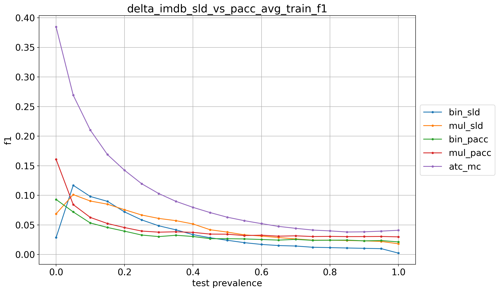
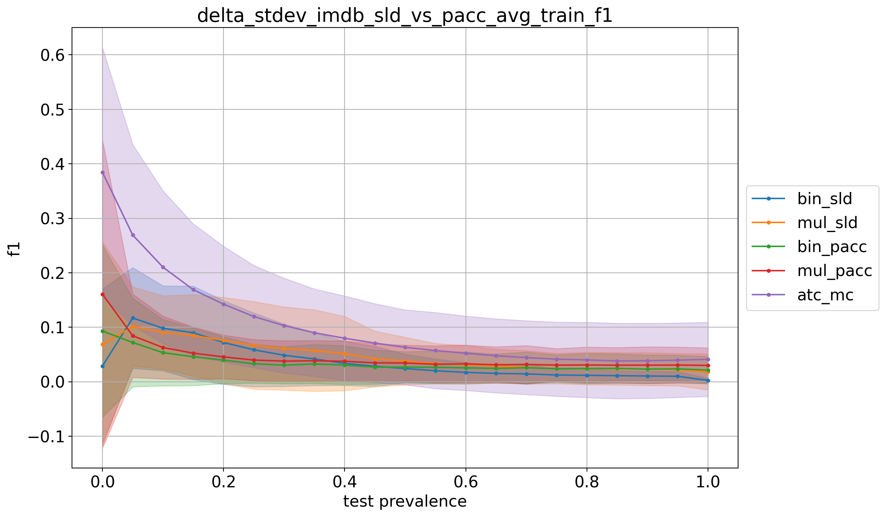
### avg on test
<table border="1" class="dataframe">
  <thead>
    <tr style="text-align: right;">
      <th></th>
      <th>bin_sld</th>
      <th>mul_sld</th>
      <th>bin_pacc</th>
      <th>mul_pacc</th>
      <th>atc_mc</th>
    </tr>
  </thead>
  <tbody>
    <tr>
      <th>0.1</th>
      <td>0.0061</td>
      <td>0.0215</td>
      <td>0.0114</td>
      <td>0.0420</td>
      <td>0.0234</td>
    </tr>
    <tr>
      <th>0.2</th>
      <td>0.0473</td>
      <td>0.1136</td>
      <td>0.0887</td>
      <td>0.1163</td>
      <td>0.2314</td>
    </tr>
    <tr>
      <th>0.3</th>
      <td>0.0334</td>
      <td>0.0462</td>
      <td>0.0465</td>
      <td>0.0555</td>
      <td>0.0615</td>
    </tr>
    <tr>
      <th>0.4</th>
      <td>0.0274</td>
      <td>0.0295</td>
      <td>0.0358</td>
      <td>0.0333</td>
      <td>0.0380</td>
    </tr>
    <tr>
      <th>0.5</th>
      <td>0.0218</td>
      <td>0.0220</td>
      <td>0.0257</td>
      <td>0.0331</td>
      <td>0.0569</td>
    </tr>
    <tr>
      <th>0.6</th>
      <td>0.0321</td>
      <td>0.0260</td>
      <td>0.0366</td>
      <td>0.0344</td>
      <td>0.0831</td>
    </tr>
    <tr>
      <th>0.7</th>
      <td>0.0307</td>
      <td>0.0276</td>
      <td>0.0161</td>
      <td>0.0155</td>
      <td>0.1143</td>
    </tr>
    <tr>
      <th>0.8</th>
      <td>0.0360</td>
      <td>0.0368</td>
      <td>0.0157</td>
      <td>0.0271</td>
      <td>0.1419</td>
    </tr>
    <tr>
      <th>0.9</th>
      <td>0.0930</td>
      <td>0.1023</td>
      <td>NaN</td>
      <td>NaN</td>
      <td>0.1672</td>
    </tr>
    <tr>
      <th>avg</th>
      <td>0.0364</td>
      <td>0.0473</td>
      <td>0.0346</td>
      <td>0.0447</td>
      <td>0.1020</td>
    </tr>
  </tbody>
</table>

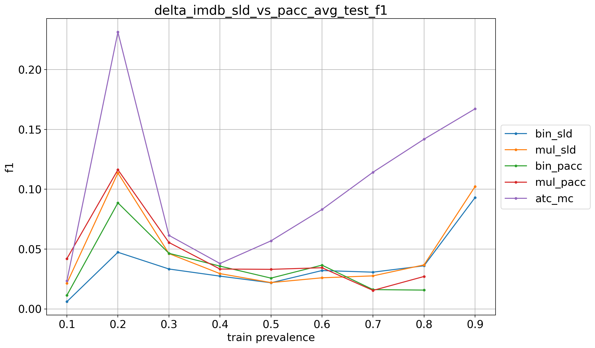
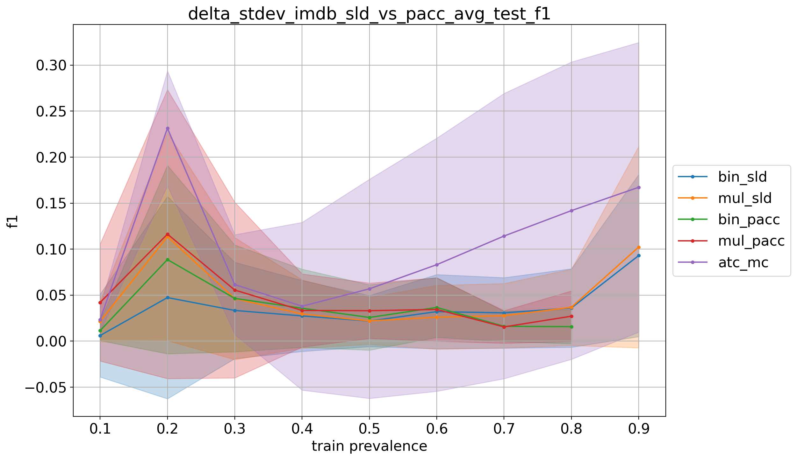
### avg dataset shift
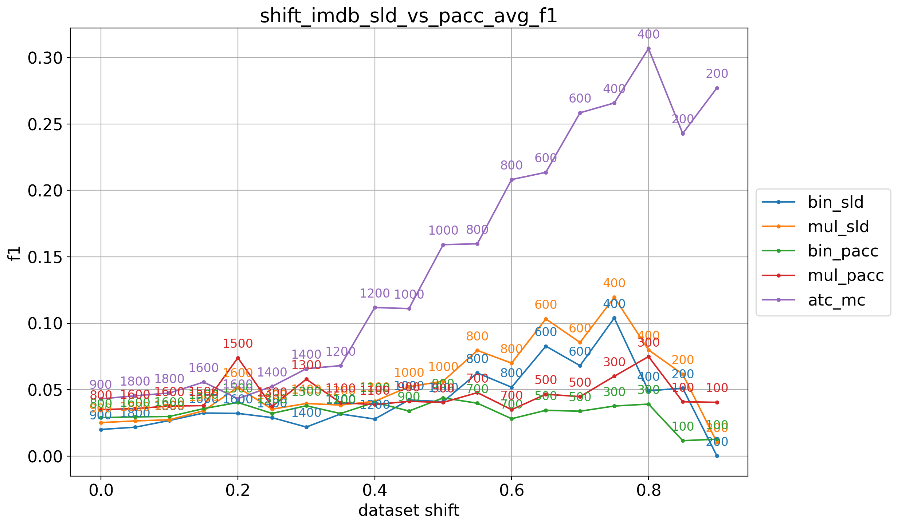
