# rcv1_CCAT_9prevs

## 10% positives
> train: [0.90003338 0.09996662]  
> validation: [0.90003338 0.09996662]  
> bin_sld: 426.003s  
> mul_sld: 199.118s  
> bin_sld_gs: 1070.285s  
> mul_sld_gs: 686.591s  
> bin_pacc: 409.897s  
> mul_pacc: 169.591s  
> binmc_pacc: 412.906s  
> mulmc_pacc: 173.043s  
> binne_pacc: 411.128s  
> mulne_pacc: 146.658s  
> bin_pacc_gs: 710.525s  
> mul_pacc_gs: 245.764s  
> bin_cc: 389.472s  
> mul_cc: 148.220s  
> kfcv: 130.095s  
> ref: 120.267s  
> atc_mc: 125.236s  
> atc_ne: 121.957s  
> doc_feat: 83.796s  
> tot: 1073.769s  

<table border="1" class="dataframe">
  <thead>
    <tr style="text-align: right;">
      <th></th>
      <th>bin_sld</th>
      <th>mul_sld</th>
      <th>bin_pacc</th>
      <th>mul_pacc</th>
      <th>bin_cc</th>
      <th>mul_cc</th>
    </tr>
  </thead>
  <tbody>
    <tr>
      <th>0.0</th>
      <td>0.0172</td>
      <td>0.0601</td>
      <td>0.0431</td>
      <td>0.5019</td>
      <td>0.0698</td>
      <td>0.0441</td>
    </tr>
    <tr>
      <th>0.05</th>
      <td>0.2360</td>
      <td>0.1726</td>
      <td>0.0397</td>
      <td>0.1504</td>
      <td>0.1237</td>
      <td>0.0684</td>
    </tr>
    <tr>
      <th>0.1</th>
      <td>0.1377</td>
      <td>0.0893</td>
      <td>0.0305</td>
      <td>0.0804</td>
      <td>0.1496</td>
      <td>0.0798</td>
    </tr>
    <tr>
      <th>0.15</th>
      <td>0.1179</td>
      <td>0.0463</td>
      <td>0.0240</td>
      <td>0.0614</td>
      <td>0.1546</td>
      <td>0.0812</td>
    </tr>
    <tr>
      <th>0.2</th>
      <td>0.0886</td>
      <td>0.0309</td>
      <td>0.0236</td>
      <td>0.0548</td>
      <td>0.1591</td>
      <td>0.0862</td>
    </tr>
    <tr>
      <th>0.25</th>
      <td>0.0596</td>
      <td>0.0232</td>
      <td>0.0238</td>
      <td>0.0541</td>
      <td>0.1609</td>
      <td>0.0864</td>
    </tr>
    <tr>
      <th>0.3</th>
      <td>0.0613</td>
      <td>0.0220</td>
      <td>0.0226</td>
      <td>0.0458</td>
      <td>0.1645</td>
      <td>0.0929</td>
    </tr>
    <tr>
      <th>0.35</th>
      <td>0.0462</td>
      <td>0.0238</td>
      <td>0.0253</td>
      <td>0.0417</td>
      <td>0.1701</td>
      <td>0.0976</td>
    </tr>
    <tr>
      <th>0.4</th>
      <td>0.0448</td>
      <td>0.0360</td>
      <td>0.0242</td>
      <td>0.0424</td>
      <td>0.1683</td>
      <td>0.0941</td>
    </tr>
    <tr>
      <th>0.45</th>
      <td>0.0420</td>
      <td>0.0463</td>
      <td>0.0227</td>
      <td>0.0444</td>
      <td>0.1683</td>
      <td>0.0967</td>
    </tr>
    <tr>
      <th>0.5</th>
      <td>0.0498</td>
      <td>0.0578</td>
      <td>0.0223</td>
      <td>0.0367</td>
      <td>0.1700</td>
      <td>0.0957</td>
    </tr>
    <tr>
      <th>0.55</th>
      <td>0.0402</td>
      <td>0.0685</td>
      <td>0.0231</td>
      <td>0.0386</td>
      <td>0.1691</td>
      <td>0.0999</td>
    </tr>
    <tr>
      <th>0.6</th>
      <td>0.0501</td>
      <td>0.0768</td>
      <td>0.0204</td>
      <td>0.0355</td>
      <td>0.1683</td>
      <td>0.0922</td>
    </tr>
    <tr>
      <th>0.65</th>
      <td>0.0559</td>
      <td>0.0899</td>
      <td>0.0227</td>
      <td>0.0332</td>
      <td>0.1706</td>
      <td>0.0945</td>
    </tr>
    <tr>
      <th>0.7</th>
      <td>0.0461</td>
      <td>0.0923</td>
      <td>0.0222</td>
      <td>0.0365</td>
      <td>0.1710</td>
      <td>0.0948</td>
    </tr>
    <tr>
      <th>0.75</th>
      <td>0.0492</td>
      <td>0.0968</td>
      <td>0.0222</td>
      <td>0.0347</td>
      <td>0.1717</td>
      <td>0.0972</td>
    </tr>
    <tr>
      <th>0.8</th>
      <td>0.0439</td>
      <td>0.1005</td>
      <td>0.0212</td>
      <td>0.0312</td>
      <td>0.1708</td>
      <td>0.0965</td>
    </tr>
    <tr>
      <th>0.85</th>
      <td>0.0435</td>
      <td>0.0994</td>
      <td>0.0223</td>
      <td>0.0307</td>
      <td>0.1712</td>
      <td>0.0971</td>
    </tr>
    <tr>
      <th>0.9</th>
      <td>0.0381</td>
      <td>0.0772</td>
      <td>0.0235</td>
      <td>0.0325</td>
      <td>0.1717</td>
      <td>0.0966</td>
    </tr>
    <tr>
      <th>0.95</th>
      <td>0.0316</td>
      <td>0.0473</td>
      <td>0.0220</td>
      <td>0.0333</td>
      <td>0.1709</td>
      <td>0.0953</td>
    </tr>
    <tr>
      <th>1.0</th>
      <td>0.0118</td>
      <td>0.0173</td>
      <td>0.0227</td>
      <td>0.0307</td>
      <td>0.1729</td>
      <td>0.0978</td>
    </tr>
    <tr>
      <th>avg</th>
      <td>0.0625</td>
      <td>0.0654</td>
      <td>0.0250</td>
      <td>0.0691</td>
      <td>0.1603</td>
      <td>0.0898</td>
    </tr>
  </tbody>
</table>

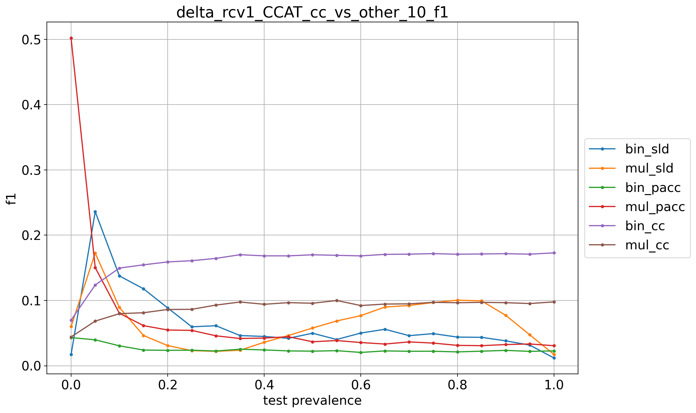
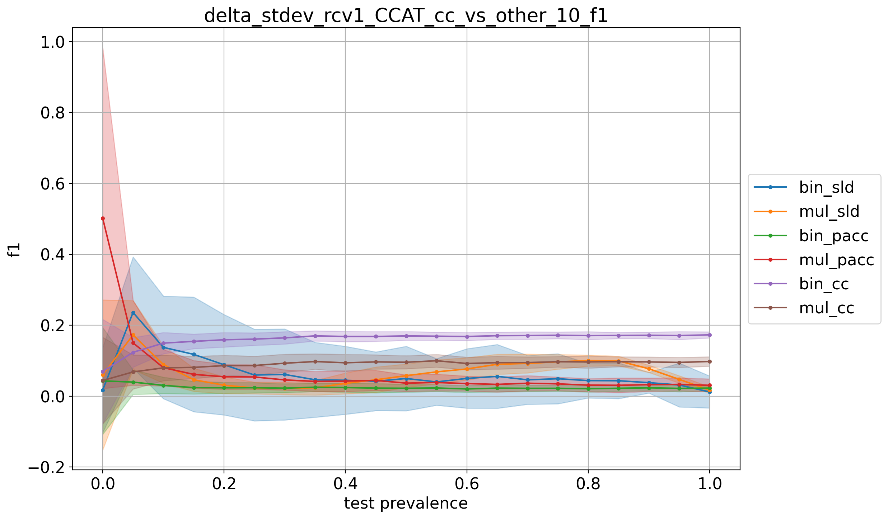
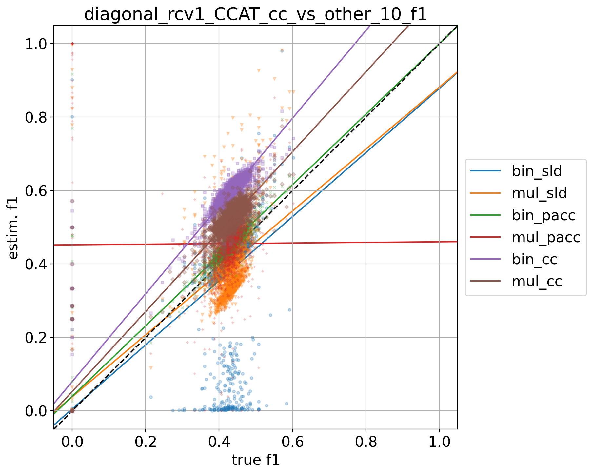
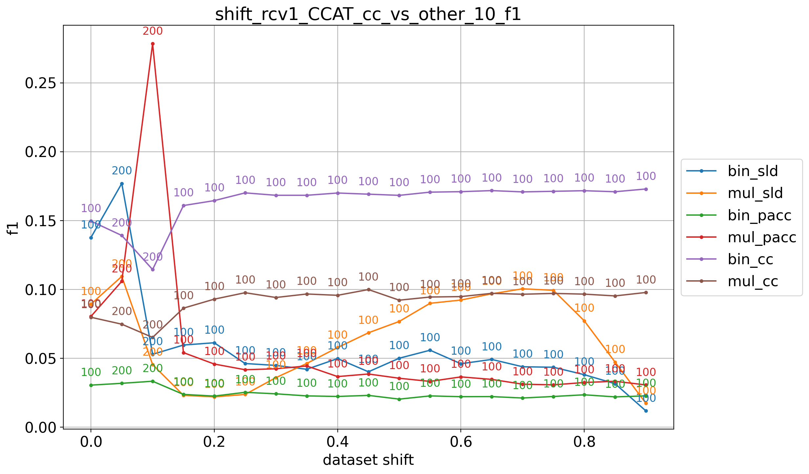

## 20% positives
> train: [0.79989987 0.20010013]  
> validation: [0.80006676 0.19993324]  
> bin_sld: 422.895s  
> mul_sld: 162.786s  
> bin_sld_gs: 1128.064s  
> mul_sld_gs: 683.619s  
> bin_sld_gsq: 524.432s  
> bin_pacc: 410.462s  
> mul_pacc: 155.872s  
> binmc_pacc: 407.039s  
> mulmc_pacc: 173.902s  
> binne_pacc: 410.358s  
> mulne_pacc: 167.292s  
> bin_pacc_gs: 732.626s  
> mul_pacc_gs: 261.935s  
> bin_cc: 396.948s  
> mul_cc: 147.743s  
> kfcv: 132.118s  
> ref: 106.145s  
> atc_mc: 127.911s  
> atc_ne: 121.613s  
> doc_feat: 80.220s  
> tot: 1132.799s  

<table border="1" class="dataframe">
  <thead>
    <tr style="text-align: right;">
      <th></th>
      <th>bin_sld</th>
      <th>mul_sld</th>
      <th>bin_pacc</th>
      <th>mul_pacc</th>
      <th>bin_cc</th>
      <th>mul_cc</th>
    </tr>
  </thead>
  <tbody>
    <tr>
      <th>0.0</th>
      <td>0.0003</td>
      <td>0.0910</td>
      <td>0.0411</td>
      <td>0.2338</td>
      <td>0.3329</td>
      <td>0.3668</td>
    </tr>
    <tr>
      <th>0.05</th>
      <td>0.1180</td>
      <td>0.0997</td>
      <td>0.0660</td>
      <td>0.0772</td>
      <td>0.0398</td>
      <td>0.0555</td>
    </tr>
    <tr>
      <th>0.1</th>
      <td>0.0605</td>
      <td>0.0606</td>
      <td>0.0365</td>
      <td>0.0482</td>
      <td>0.0623</td>
      <td>0.0830</td>
    </tr>
    <tr>
      <th>0.15</th>
      <td>0.0441</td>
      <td>0.0405</td>
      <td>0.0272</td>
      <td>0.0383</td>
      <td>0.0750</td>
      <td>0.0911</td>
    </tr>
    <tr>
      <th>0.2</th>
      <td>0.0313</td>
      <td>0.0353</td>
      <td>0.0234</td>
      <td>0.0308</td>
      <td>0.0841</td>
      <td>0.1011</td>
    </tr>
    <tr>
      <th>0.25</th>
      <td>0.0226</td>
      <td>0.0308</td>
      <td>0.0186</td>
      <td>0.0251</td>
      <td>0.0891</td>
      <td>0.1039</td>
    </tr>
    <tr>
      <th>0.3</th>
      <td>0.0185</td>
      <td>0.0255</td>
      <td>0.0168</td>
      <td>0.0260</td>
      <td>0.0941</td>
      <td>0.1094</td>
    </tr>
    <tr>
      <th>0.35</th>
      <td>0.0118</td>
      <td>0.0176</td>
      <td>0.0135</td>
      <td>0.0194</td>
      <td>0.0980</td>
      <td>0.1118</td>
    </tr>
    <tr>
      <th>0.4</th>
      <td>0.0126</td>
      <td>0.0205</td>
      <td>0.0158</td>
      <td>0.0218</td>
      <td>0.1006</td>
      <td>0.1145</td>
    </tr>
    <tr>
      <th>0.45</th>
      <td>0.0101</td>
      <td>0.0196</td>
      <td>0.0153</td>
      <td>0.0196</td>
      <td>0.1010</td>
      <td>0.1141</td>
    </tr>
    <tr>
      <th>0.5</th>
      <td>0.0105</td>
      <td>0.0194</td>
      <td>0.0139</td>
      <td>0.0198</td>
      <td>0.1007</td>
      <td>0.1133</td>
    </tr>
    <tr>
      <th>0.55</th>
      <td>0.0100</td>
      <td>0.0194</td>
      <td>0.0139</td>
      <td>0.0187</td>
      <td>0.1022</td>
      <td>0.1148</td>
    </tr>
    <tr>
      <th>0.6</th>
      <td>0.0125</td>
      <td>0.0200</td>
      <td>0.0130</td>
      <td>0.0179</td>
      <td>0.1011</td>
      <td>0.1145</td>
    </tr>
    <tr>
      <th>0.65</th>
      <td>0.0123</td>
      <td>0.0229</td>
      <td>0.0145</td>
      <td>0.0180</td>
      <td>0.1048</td>
      <td>0.1166</td>
    </tr>
    <tr>
      <th>0.7</th>
      <td>0.0130</td>
      <td>0.0214</td>
      <td>0.0141</td>
      <td>0.0148</td>
      <td>0.1055</td>
      <td>0.1181</td>
    </tr>
    <tr>
      <th>0.75</th>
      <td>0.0142</td>
      <td>0.0234</td>
      <td>0.0146</td>
      <td>0.0154</td>
      <td>0.1062</td>
      <td>0.1182</td>
    </tr>
    <tr>
      <th>0.8</th>
      <td>0.0160</td>
      <td>0.0262</td>
      <td>0.0130</td>
      <td>0.0148</td>
      <td>0.1046</td>
      <td>0.1162</td>
    </tr>
    <tr>
      <th>0.85</th>
      <td>0.0170</td>
      <td>0.0281</td>
      <td>0.0137</td>
      <td>0.0141</td>
      <td>0.1059</td>
      <td>0.1178</td>
    </tr>
    <tr>
      <th>0.9</th>
      <td>0.0177</td>
      <td>0.0281</td>
      <td>0.0133</td>
      <td>0.0144</td>
      <td>0.1057</td>
      <td>0.1184</td>
    </tr>
    <tr>
      <th>0.95</th>
      <td>0.0172</td>
      <td>0.0285</td>
      <td>0.0123</td>
      <td>0.0140</td>
      <td>0.1051</td>
      <td>0.1163</td>
    </tr>
    <tr>
      <th>1.0</th>
      <td>0.0011</td>
      <td>0.0174</td>
      <td>0.0142</td>
      <td>0.0126</td>
      <td>0.1069</td>
      <td>0.1185</td>
    </tr>
    <tr>
      <th>avg</th>
      <td>0.0224</td>
      <td>0.0331</td>
      <td>0.0202</td>
      <td>0.0340</td>
      <td>0.1060</td>
      <td>0.1207</td>
    </tr>
  </tbody>
</table>

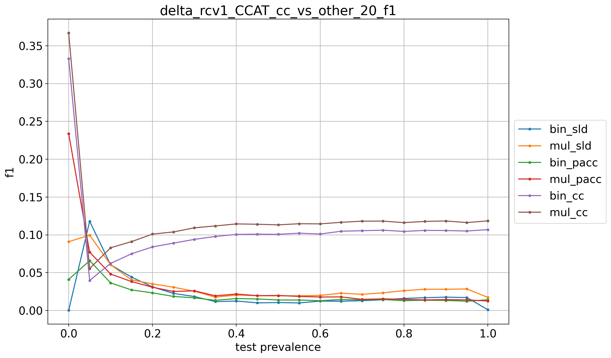
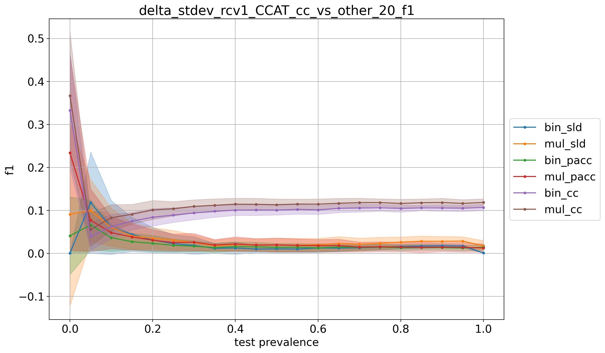
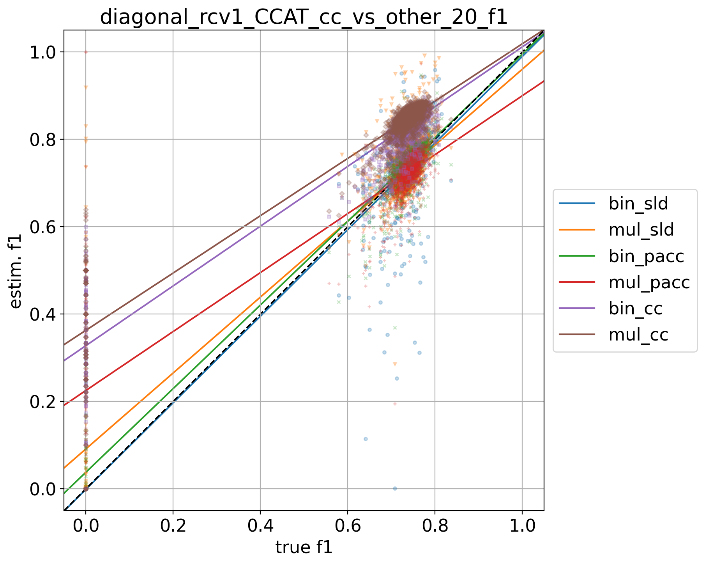
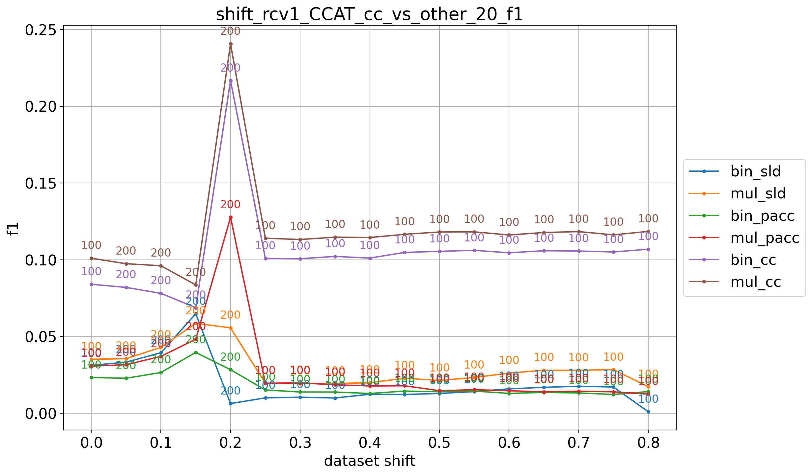

## 30% positives
> train: [0.69993324 0.30006676]  
> validation: [0.70010013 0.29989987]  
> bin_sld: 421.459s  
> mul_sld: 146.321s  
> bin_sld_gs: 1159.421s  
> mul_sld_gs: 690.743s  
> bin_sld_gsq: 531.736s  
> bin_pacc: 423.881s  
> mul_pacc: 166.104s  
> binmc_pacc: 422.818s  
> mulmc_pacc: 164.572s  
> binne_pacc: 409.704s  
> mulne_pacc: 155.476s  
> bin_pacc_gs: 737.229s  
> mul_pacc_gs: 269.465s  
> bin_cc: 400.220s  
> mul_cc: 118.299s  
> kfcv: 131.612s  
> ref: 122.392s  
> atc_mc: 119.095s  
> atc_ne: 108.266s  
> doc_feat: 96.341s  
> tot: 1163.937s  

<table border="1" class="dataframe">
  <thead>
    <tr style="text-align: right;">
      <th></th>
      <th>bin_sld</th>
      <th>mul_sld</th>
      <th>bin_pacc</th>
      <th>mul_pacc</th>
      <th>bin_cc</th>
      <th>mul_cc</th>
    </tr>
  </thead>
  <tbody>
    <tr>
      <th>0.0</th>
      <td>0.0002</td>
      <td>0.0086</td>
      <td>0.0275</td>
      <td>0.1629</td>
      <td>0.6704</td>
      <td>0.8232</td>
    </tr>
    <tr>
      <th>0.05</th>
      <td>0.0870</td>
      <td>0.0812</td>
      <td>0.0791</td>
      <td>0.0713</td>
      <td>0.1115</td>
      <td>0.1785</td>
    </tr>
    <tr>
      <th>0.1</th>
      <td>0.0633</td>
      <td>0.0718</td>
      <td>0.0441</td>
      <td>0.0448</td>
      <td>0.0885</td>
      <td>0.1379</td>
    </tr>
    <tr>
      <th>0.15</th>
      <td>0.0532</td>
      <td>0.0681</td>
      <td>0.0276</td>
      <td>0.0302</td>
      <td>0.0889</td>
      <td>0.1278</td>
    </tr>
    <tr>
      <th>0.2</th>
      <td>0.0417</td>
      <td>0.0599</td>
      <td>0.0237</td>
      <td>0.0248</td>
      <td>0.0883</td>
      <td>0.1238</td>
    </tr>
    <tr>
      <th>0.25</th>
      <td>0.0333</td>
      <td>0.0551</td>
      <td>0.0210</td>
      <td>0.0217</td>
      <td>0.0872</td>
      <td>0.1196</td>
    </tr>
    <tr>
      <th>0.3</th>
      <td>0.0231</td>
      <td>0.0401</td>
      <td>0.0165</td>
      <td>0.0170</td>
      <td>0.0884</td>
      <td>0.1195</td>
    </tr>
    <tr>
      <th>0.35</th>
      <td>0.0182</td>
      <td>0.0326</td>
      <td>0.0165</td>
      <td>0.0178</td>
      <td>0.0890</td>
      <td>0.1190</td>
    </tr>
    <tr>
      <th>0.4</th>
      <td>0.0150</td>
      <td>0.0289</td>
      <td>0.0163</td>
      <td>0.0161</td>
      <td>0.0892</td>
      <td>0.1175</td>
    </tr>
    <tr>
      <th>0.45</th>
      <td>0.0106</td>
      <td>0.0229</td>
      <td>0.0144</td>
      <td>0.0160</td>
      <td>0.0883</td>
      <td>0.1149</td>
    </tr>
    <tr>
      <th>0.5</th>
      <td>0.0090</td>
      <td>0.0181</td>
      <td>0.0148</td>
      <td>0.0153</td>
      <td>0.0876</td>
      <td>0.1130</td>
    </tr>
    <tr>
      <th>0.55</th>
      <td>0.0069</td>
      <td>0.0160</td>
      <td>0.0149</td>
      <td>0.0151</td>
      <td>0.0880</td>
      <td>0.1131</td>
    </tr>
    <tr>
      <th>0.6</th>
      <td>0.0080</td>
      <td>0.0123</td>
      <td>0.0124</td>
      <td>0.0145</td>
      <td>0.0854</td>
      <td>0.1104</td>
    </tr>
    <tr>
      <th>0.65</th>
      <td>0.0088</td>
      <td>0.0099</td>
      <td>0.0128</td>
      <td>0.0152</td>
      <td>0.0878</td>
      <td>0.1131</td>
    </tr>
    <tr>
      <th>0.7</th>
      <td>0.0092</td>
      <td>0.0097</td>
      <td>0.0129</td>
      <td>0.0146</td>
      <td>0.0882</td>
      <td>0.1123</td>
    </tr>
    <tr>
      <th>0.75</th>
      <td>0.0107</td>
      <td>0.0094</td>
      <td>0.0121</td>
      <td>0.0142</td>
      <td>0.0875</td>
      <td>0.1120</td>
    </tr>
    <tr>
      <th>0.8</th>
      <td>0.0118</td>
      <td>0.0089</td>
      <td>0.0120</td>
      <td>0.0146</td>
      <td>0.0871</td>
      <td>0.1108</td>
    </tr>
    <tr>
      <th>0.85</th>
      <td>0.0132</td>
      <td>0.0097</td>
      <td>0.0118</td>
      <td>0.0152</td>
      <td>0.0878</td>
      <td>0.1113</td>
    </tr>
    <tr>
      <th>0.9</th>
      <td>0.0147</td>
      <td>0.0115</td>
      <td>0.0111</td>
      <td>0.0148</td>
      <td>0.0869</td>
      <td>0.1101</td>
    </tr>
    <tr>
      <th>0.95</th>
      <td>0.0141</td>
      <td>0.0115</td>
      <td>0.0117</td>
      <td>0.0152</td>
      <td>0.0873</td>
      <td>0.1098</td>
    </tr>
    <tr>
      <th>1.0</th>
      <td>0.0004</td>
      <td>0.0038</td>
      <td>0.0122</td>
      <td>0.0157</td>
      <td>0.0879</td>
      <td>0.1109</td>
    </tr>
    <tr>
      <th>avg</th>
      <td>0.0215</td>
      <td>0.0281</td>
      <td>0.0203</td>
      <td>0.0279</td>
      <td>0.1167</td>
      <td>0.1528</td>
    </tr>
  </tbody>
</table>

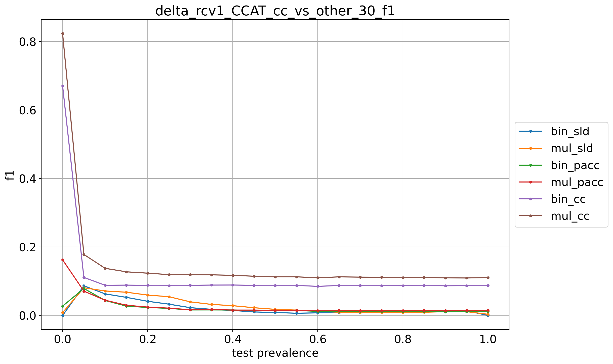
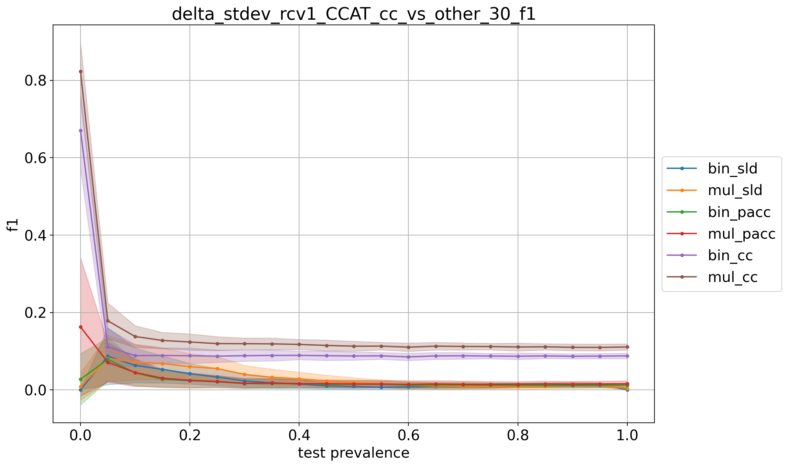
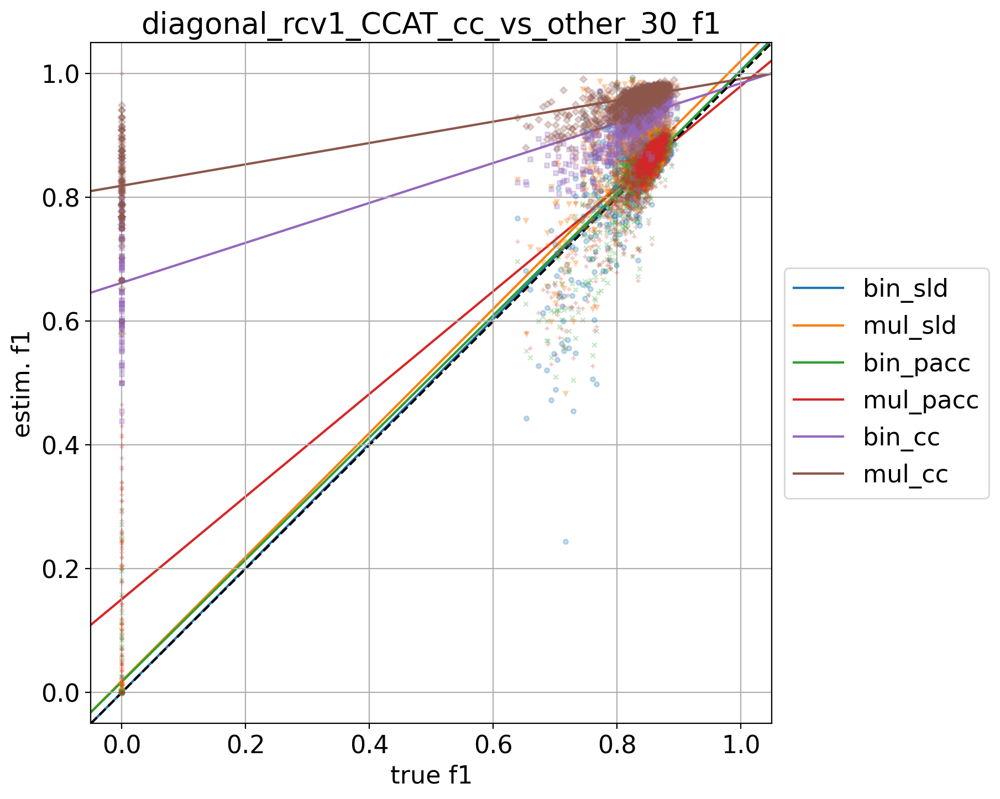
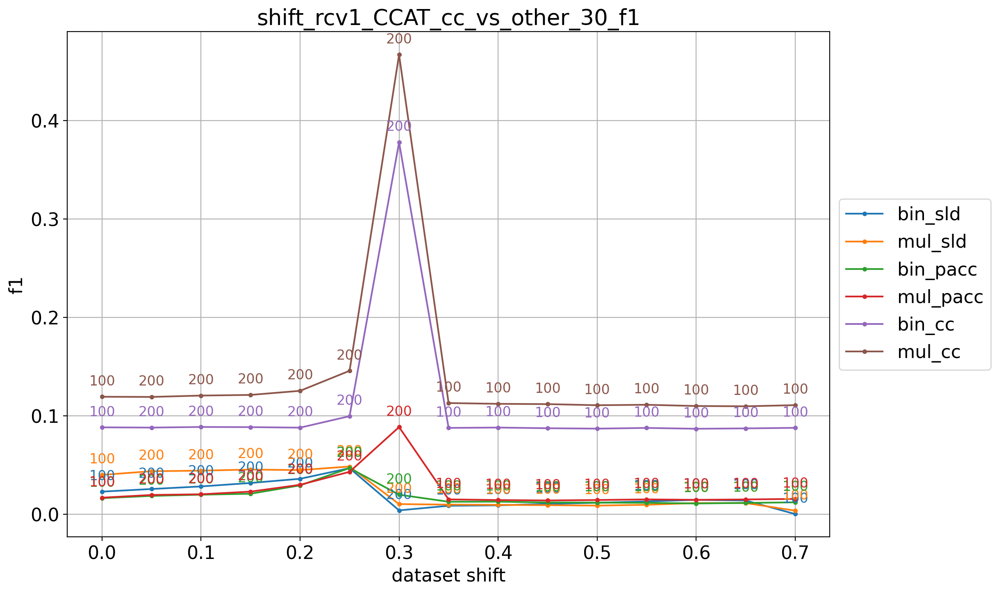

## 40% positives
> train: [0.59996662 0.40003338]  
> validation: [0.59996662 0.40003338]  
> bin_sld: 434.111s  
> mul_sld: 159.616s  
> bin_sld_gs: 1179.818s  
> mul_sld_gs: 695.793s  
> bin_sld_gsq: 546.801s  
> bin_pacc: 431.189s  
> mul_pacc: 143.236s  
> binmc_pacc: 422.668s  
> mulmc_pacc: 167.615s  
> binne_pacc: 427.798s  
> mulne_pacc: 166.144s  
> bin_pacc_gs: 739.438s  
> mul_pacc_gs: 261.609s  
> bin_cc: 402.646s  
> mul_cc: 152.045s  
> kfcv: 121.176s  
> ref: 127.991s  
> atc_mc: 129.960s  
> atc_ne: 115.970s  
> doc_feat: 79.386s  
> tot: 1183.412s  

<table border="1" class="dataframe">
  <thead>
    <tr style="text-align: right;">
      <th></th>
      <th>bin_sld</th>
      <th>mul_sld</th>
      <th>bin_pacc</th>
      <th>mul_pacc</th>
      <th>bin_cc</th>
      <th>mul_cc</th>
    </tr>
  </thead>
  <tbody>
    <tr>
      <th>0.0</th>
      <td>0.0002</td>
      <td>0.0027</td>
      <td>0.1030</td>
      <td>0.2496</td>
      <td>0.8488</td>
      <td>0.9273</td>
    </tr>
    <tr>
      <th>0.05</th>
      <td>0.0662</td>
      <td>0.0729</td>
      <td>0.0737</td>
      <td>0.0640</td>
      <td>0.2170</td>
      <td>0.2592</td>
    </tr>
    <tr>
      <th>0.1</th>
      <td>0.0438</td>
      <td>0.0607</td>
      <td>0.0471</td>
      <td>0.0367</td>
      <td>0.1471</td>
      <td>0.1726</td>
    </tr>
    <tr>
      <th>0.15</th>
      <td>0.0444</td>
      <td>0.0641</td>
      <td>0.0324</td>
      <td>0.0298</td>
      <td>0.1198</td>
      <td>0.1399</td>
    </tr>
    <tr>
      <th>0.2</th>
      <td>0.0408</td>
      <td>0.0592</td>
      <td>0.0248</td>
      <td>0.0238</td>
      <td>0.1053</td>
      <td>0.1227</td>
    </tr>
    <tr>
      <th>0.25</th>
      <td>0.0426</td>
      <td>0.0597</td>
      <td>0.0209</td>
      <td>0.0257</td>
      <td>0.0950</td>
      <td>0.1094</td>
    </tr>
    <tr>
      <th>0.3</th>
      <td>0.0315</td>
      <td>0.0463</td>
      <td>0.0171</td>
      <td>0.0189</td>
      <td>0.0891</td>
      <td>0.1032</td>
    </tr>
    <tr>
      <th>0.35</th>
      <td>0.0279</td>
      <td>0.0392</td>
      <td>0.0170</td>
      <td>0.0194</td>
      <td>0.0874</td>
      <td>0.1000</td>
    </tr>
    <tr>
      <th>0.4</th>
      <td>0.0231</td>
      <td>0.0361</td>
      <td>0.0153</td>
      <td>0.0194</td>
      <td>0.0818</td>
      <td>0.0934</td>
    </tr>
    <tr>
      <th>0.45</th>
      <td>0.0179</td>
      <td>0.0290</td>
      <td>0.0114</td>
      <td>0.0155</td>
      <td>0.0795</td>
      <td>0.0905</td>
    </tr>
    <tr>
      <th>0.5</th>
      <td>0.0152</td>
      <td>0.0259</td>
      <td>0.0116</td>
      <td>0.0157</td>
      <td>0.0764</td>
      <td>0.0870</td>
    </tr>
    <tr>
      <th>0.55</th>
      <td>0.0113</td>
      <td>0.0232</td>
      <td>0.0098</td>
      <td>0.0156</td>
      <td>0.0750</td>
      <td>0.0851</td>
    </tr>
    <tr>
      <th>0.6</th>
      <td>0.0097</td>
      <td>0.0193</td>
      <td>0.0097</td>
      <td>0.0155</td>
      <td>0.0725</td>
      <td>0.0821</td>
    </tr>
    <tr>
      <th>0.65</th>
      <td>0.0081</td>
      <td>0.0155</td>
      <td>0.0093</td>
      <td>0.0150</td>
      <td>0.0738</td>
      <td>0.0828</td>
    </tr>
    <tr>
      <th>0.7</th>
      <td>0.0077</td>
      <td>0.0125</td>
      <td>0.0089</td>
      <td>0.0146</td>
      <td>0.0723</td>
      <td>0.0811</td>
    </tr>
    <tr>
      <th>0.75</th>
      <td>0.0070</td>
      <td>0.0091</td>
      <td>0.0075</td>
      <td>0.0123</td>
      <td>0.0706</td>
      <td>0.0790</td>
    </tr>
    <tr>
      <th>0.8</th>
      <td>0.0062</td>
      <td>0.0080</td>
      <td>0.0070</td>
      <td>0.0126</td>
      <td>0.0701</td>
      <td>0.0778</td>
    </tr>
    <tr>
      <th>0.85</th>
      <td>0.0070</td>
      <td>0.0067</td>
      <td>0.0063</td>
      <td>0.0129</td>
      <td>0.0694</td>
      <td>0.0776</td>
    </tr>
    <tr>
      <th>0.9</th>
      <td>0.0078</td>
      <td>0.0057</td>
      <td>0.0058</td>
      <td>0.0121</td>
      <td>0.0683</td>
      <td>0.0761</td>
    </tr>
    <tr>
      <th>0.95</th>
      <td>0.0083</td>
      <td>0.0060</td>
      <td>0.0054</td>
      <td>0.0126</td>
      <td>0.0679</td>
      <td>0.0758</td>
    </tr>
    <tr>
      <th>1.0</th>
      <td>0.0003</td>
      <td>0.0022</td>
      <td>0.0057</td>
      <td>0.0119</td>
      <td>0.0681</td>
      <td>0.0759</td>
    </tr>
    <tr>
      <th>avg</th>
      <td>0.0203</td>
      <td>0.0288</td>
      <td>0.0214</td>
      <td>0.0311</td>
      <td>0.1264</td>
      <td>0.1428</td>
    </tr>
  </tbody>
</table>

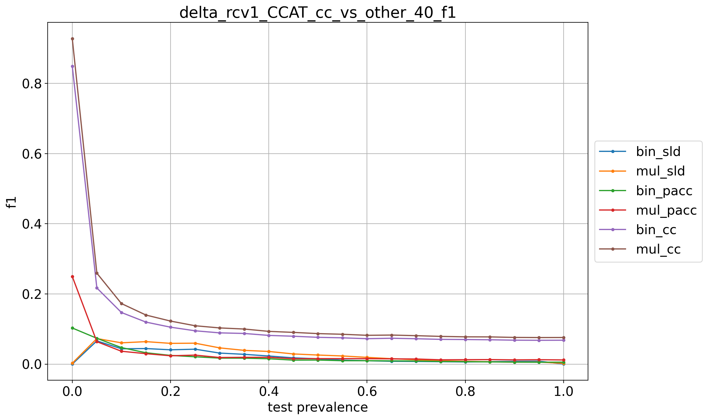
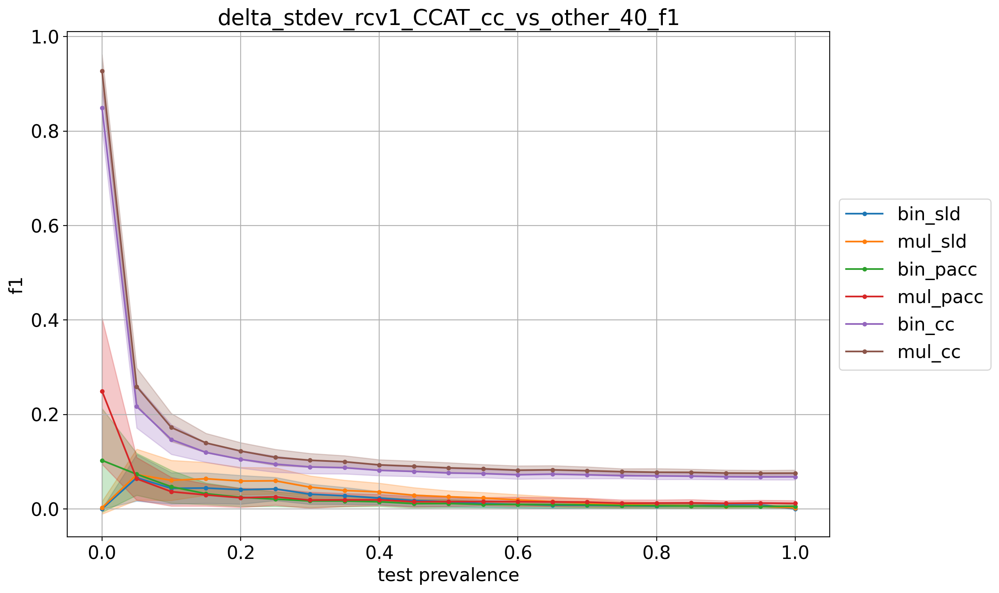
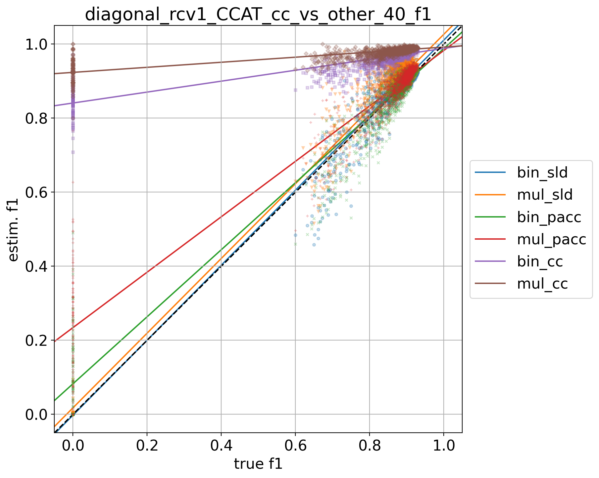
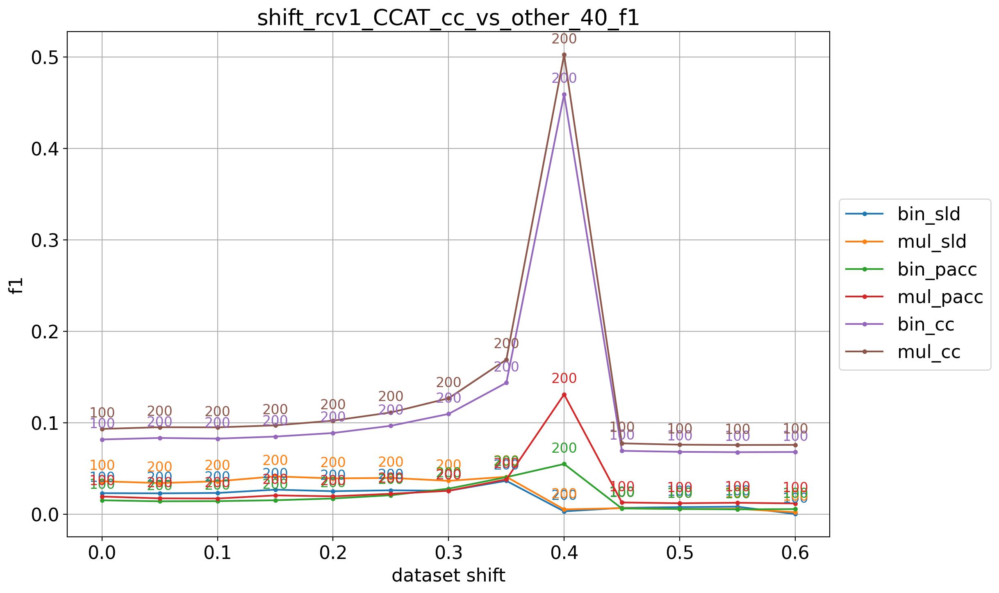

## 50% positives
> train: [0.5 0.5]  
> validation: [0.5 0.5]  
> bin_sld: 441.783s  
> mul_sld: 169.393s  
> bin_sld_gs: 1166.420s  
> mul_sld_gs: 689.481s  
> bin_sld_gsq: 549.038s  
> bin_pacc: 427.369s  
> mul_pacc: 166.563s  
> binmc_pacc: 426.636s  
> mulmc_pacc: 176.801s  
> binne_pacc: 435.657s  
> mulne_pacc: 161.090s  
> bin_pacc_gs: 730.060s  
> mul_pacc_gs: 266.437s  
> bin_cc: 412.726s  
> mul_cc: 152.522s  
> kfcv: 134.253s  
> ref: 128.737s  
> atc_mc: 129.517s  
> atc_ne: 122.889s  
> doc_feat: 88.896s  
> tot: 1170.874s  

<table border="1" class="dataframe">
  <thead>
    <tr style="text-align: right;">
      <th></th>
      <th>bin_sld</th>
      <th>mul_sld</th>
      <th>bin_pacc</th>
      <th>mul_pacc</th>
      <th>bin_cc</th>
      <th>mul_cc</th>
    </tr>
  </thead>
  <tbody>
    <tr>
      <th>0.0</th>
      <td>0.0001</td>
      <td>0.0001</td>
      <td>0.0510</td>
      <td>0.1875</td>
      <td>0.9932</td>
      <td>0.9897</td>
    </tr>
    <tr>
      <th>0.05</th>
      <td>0.1103</td>
      <td>0.0701</td>
      <td>0.0718</td>
      <td>0.0638</td>
      <td>0.4082</td>
      <td>0.4058</td>
    </tr>
    <tr>
      <th>0.1</th>
      <td>0.0477</td>
      <td>0.0384</td>
      <td>0.0492</td>
      <td>0.0389</td>
      <td>0.2666</td>
      <td>0.2644</td>
    </tr>
    <tr>
      <th>0.15</th>
      <td>0.0318</td>
      <td>0.0371</td>
      <td>0.0376</td>
      <td>0.0351</td>
      <td>0.1976</td>
      <td>0.1957</td>
    </tr>
    <tr>
      <th>0.2</th>
      <td>0.0271</td>
      <td>0.0350</td>
      <td>0.0267</td>
      <td>0.0250</td>
      <td>0.1626</td>
      <td>0.1617</td>
    </tr>
    <tr>
      <th>0.25</th>
      <td>0.0265</td>
      <td>0.0361</td>
      <td>0.0221</td>
      <td>0.0213</td>
      <td>0.1344</td>
      <td>0.1332</td>
    </tr>
    <tr>
      <th>0.3</th>
      <td>0.0258</td>
      <td>0.0314</td>
      <td>0.0212</td>
      <td>0.0212</td>
      <td>0.1195</td>
      <td>0.1186</td>
    </tr>
    <tr>
      <th>0.35</th>
      <td>0.0249</td>
      <td>0.0276</td>
      <td>0.0210</td>
      <td>0.0211</td>
      <td>0.1075</td>
      <td>0.1067</td>
    </tr>
    <tr>
      <th>0.4</th>
      <td>0.0231</td>
      <td>0.0264</td>
      <td>0.0162</td>
      <td>0.0174</td>
      <td>0.0950</td>
      <td>0.0944</td>
    </tr>
    <tr>
      <th>0.45</th>
      <td>0.0198</td>
      <td>0.0228</td>
      <td>0.0137</td>
      <td>0.0150</td>
      <td>0.0884</td>
      <td>0.0878</td>
    </tr>
    <tr>
      <th>0.5</th>
      <td>0.0183</td>
      <td>0.0204</td>
      <td>0.0125</td>
      <td>0.0139</td>
      <td>0.0810</td>
      <td>0.0803</td>
    </tr>
    <tr>
      <th>0.55</th>
      <td>0.0147</td>
      <td>0.0169</td>
      <td>0.0100</td>
      <td>0.0110</td>
      <td>0.0755</td>
      <td>0.0752</td>
    </tr>
    <tr>
      <th>0.6</th>
      <td>0.0151</td>
      <td>0.0163</td>
      <td>0.0111</td>
      <td>0.0104</td>
      <td>0.0706</td>
      <td>0.0701</td>
    </tr>
    <tr>
      <th>0.65</th>
      <td>0.0123</td>
      <td>0.0137</td>
      <td>0.0104</td>
      <td>0.0103</td>
      <td>0.0692</td>
      <td>0.0689</td>
    </tr>
    <tr>
      <th>0.7</th>
      <td>0.0108</td>
      <td>0.0120</td>
      <td>0.0104</td>
      <td>0.0111</td>
      <td>0.0654</td>
      <td>0.0650</td>
    </tr>
    <tr>
      <th>0.75</th>
      <td>0.0086</td>
      <td>0.0094</td>
      <td>0.0092</td>
      <td>0.0102</td>
      <td>0.0613</td>
      <td>0.0609</td>
    </tr>
    <tr>
      <th>0.8</th>
      <td>0.0064</td>
      <td>0.0086</td>
      <td>0.0080</td>
      <td>0.0092</td>
      <td>0.0591</td>
      <td>0.0587</td>
    </tr>
    <tr>
      <th>0.85</th>
      <td>0.0059</td>
      <td>0.0071</td>
      <td>0.0067</td>
      <td>0.0086</td>
      <td>0.0567</td>
      <td>0.0565</td>
    </tr>
    <tr>
      <th>0.9</th>
      <td>0.0065</td>
      <td>0.0067</td>
      <td>0.0064</td>
      <td>0.0081</td>
      <td>0.0553</td>
      <td>0.0550</td>
    </tr>
    <tr>
      <th>0.95</th>
      <td>0.0063</td>
      <td>0.0064</td>
      <td>0.0054</td>
      <td>0.0079</td>
      <td>0.0532</td>
      <td>0.0529</td>
    </tr>
    <tr>
      <th>1.0</th>
      <td>0.0005</td>
      <td>0.0024</td>
      <td>0.0035</td>
      <td>0.0077</td>
      <td>0.0527</td>
      <td>0.0525</td>
    </tr>
    <tr>
      <th>avg</th>
      <td>0.0211</td>
      <td>0.0212</td>
      <td>0.0202</td>
      <td>0.0264</td>
      <td>0.1558</td>
      <td>0.1550</td>
    </tr>
  </tbody>
</table>

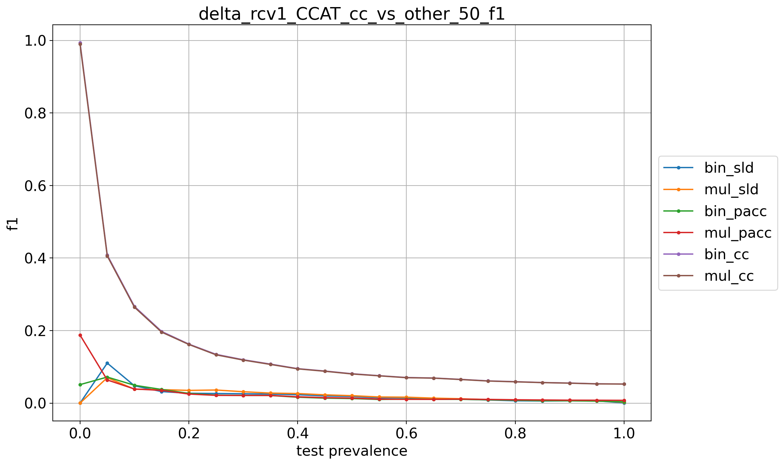
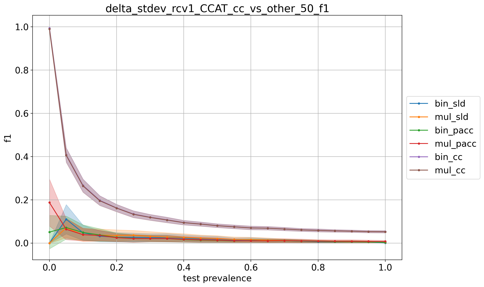
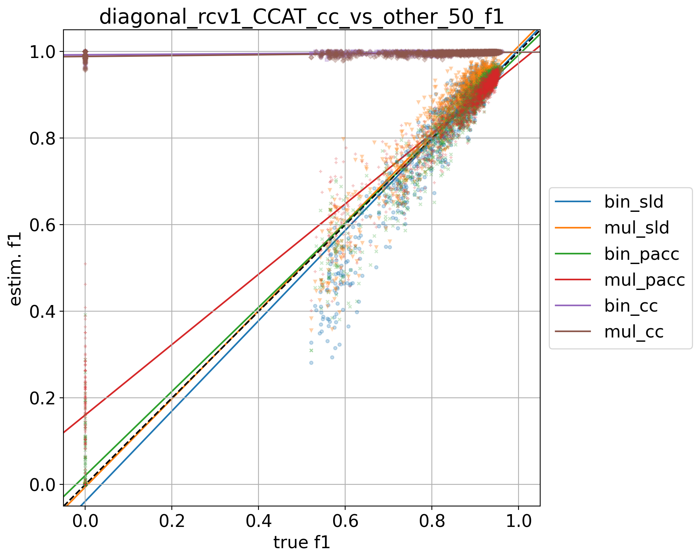
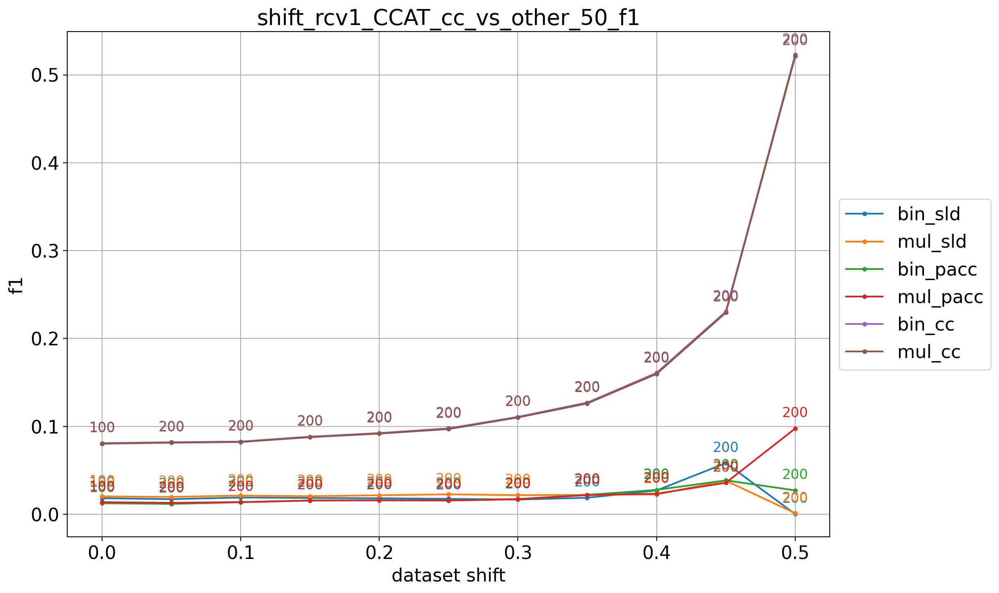

## 60% positives
> train: [0.40003338 0.59996662]  
> validation: [0.40003338 0.59996662]  
> bin_sld: 426.378s  
> mul_sld: 153.126s  
> bin_sld_gs: 1140.607s  
> mul_sld_gs: 673.397s  
> bin_sld_gsq: 528.696s  
> bin_pacc: 420.283s  
> mul_pacc: 148.016s  
> binmc_pacc: 405.920s  
> mulmc_pacc: 167.711s  
> binne_pacc: 417.205s  
> mulne_pacc: 145.013s  
> bin_pacc_gs: 730.537s  
> mul_pacc_gs: 261.004s  
> bin_cc: 394.352s  
> mul_cc: 143.652s  
> kfcv: 122.227s  
> ref: 122.352s  
> atc_mc: 120.259s  
> atc_ne: 113.567s  
> doc_feat: 80.306s  
> tot: 1146.639s  

<table border="1" class="dataframe">
  <thead>
    <tr style="text-align: right;">
      <th></th>
      <th>bin_sld</th>
      <th>mul_sld</th>
      <th>bin_pacc</th>
      <th>mul_pacc</th>
      <th>bin_cc</th>
      <th>mul_cc</th>
    </tr>
  </thead>
  <tbody>
    <tr>
      <th>0.0</th>
      <td>0.0001</td>
      <td>0.0000</td>
      <td>0.0341</td>
      <td>0.1107</td>
      <td>0.9206</td>
      <td>0.9459</td>
    </tr>
    <tr>
      <th>0.05</th>
      <td>0.1167</td>
      <td>0.0892</td>
      <td>0.0700</td>
      <td>0.0541</td>
      <td>0.4952</td>
      <td>0.5146</td>
    </tr>
    <tr>
      <th>0.1</th>
      <td>0.0728</td>
      <td>0.0521</td>
      <td>0.0628</td>
      <td>0.0662</td>
      <td>0.3341</td>
      <td>0.3508</td>
    </tr>
    <tr>
      <th>0.15</th>
      <td>0.0507</td>
      <td>0.0342</td>
      <td>0.0569</td>
      <td>0.0666</td>
      <td>0.2443</td>
      <td>0.2573</td>
    </tr>
    <tr>
      <th>0.2</th>
      <td>0.0318</td>
      <td>0.0240</td>
      <td>0.0410</td>
      <td>0.0541</td>
      <td>0.1957</td>
      <td>0.2058</td>
    </tr>
    <tr>
      <th>0.25</th>
      <td>0.0305</td>
      <td>0.0223</td>
      <td>0.0400</td>
      <td>0.0524</td>
      <td>0.1561</td>
      <td>0.1650</td>
    </tr>
    <tr>
      <th>0.3</th>
      <td>0.0287</td>
      <td>0.0211</td>
      <td>0.0344</td>
      <td>0.0458</td>
      <td>0.1327</td>
      <td>0.1408</td>
    </tr>
    <tr>
      <th>0.35</th>
      <td>0.0264</td>
      <td>0.0201</td>
      <td>0.0320</td>
      <td>0.0417</td>
      <td>0.1119</td>
      <td>0.1189</td>
    </tr>
    <tr>
      <th>0.4</th>
      <td>0.0241</td>
      <td>0.0180</td>
      <td>0.0273</td>
      <td>0.0353</td>
      <td>0.0962</td>
      <td>0.1022</td>
    </tr>
    <tr>
      <th>0.45</th>
      <td>0.0196</td>
      <td>0.0149</td>
      <td>0.0230</td>
      <td>0.0310</td>
      <td>0.0853</td>
      <td>0.0909</td>
    </tr>
    <tr>
      <th>0.5</th>
      <td>0.0208</td>
      <td>0.0162</td>
      <td>0.0211</td>
      <td>0.0274</td>
      <td>0.0736</td>
      <td>0.0785</td>
    </tr>
    <tr>
      <th>0.55</th>
      <td>0.0159</td>
      <td>0.0116</td>
      <td>0.0175</td>
      <td>0.0235</td>
      <td>0.0648</td>
      <td>0.0692</td>
    </tr>
    <tr>
      <th>0.6</th>
      <td>0.0143</td>
      <td>0.0115</td>
      <td>0.0138</td>
      <td>0.0180</td>
      <td>0.0580</td>
      <td>0.0618</td>
    </tr>
    <tr>
      <th>0.65</th>
      <td>0.0130</td>
      <td>0.0100</td>
      <td>0.0122</td>
      <td>0.0163</td>
      <td>0.0535</td>
      <td>0.0574</td>
    </tr>
    <tr>
      <th>0.7</th>
      <td>0.0146</td>
      <td>0.0104</td>
      <td>0.0136</td>
      <td>0.0162</td>
      <td>0.0472</td>
      <td>0.0503</td>
    </tr>
    <tr>
      <th>0.75</th>
      <td>0.0128</td>
      <td>0.0091</td>
      <td>0.0112</td>
      <td>0.0135</td>
      <td>0.0424</td>
      <td>0.0452</td>
    </tr>
    <tr>
      <th>0.8</th>
      <td>0.0118</td>
      <td>0.0086</td>
      <td>0.0095</td>
      <td>0.0106</td>
      <td>0.0389</td>
      <td>0.0417</td>
    </tr>
    <tr>
      <th>0.85</th>
      <td>0.0117</td>
      <td>0.0083</td>
      <td>0.0090</td>
      <td>0.0104</td>
      <td>0.0351</td>
      <td>0.0375</td>
    </tr>
    <tr>
      <th>0.9</th>
      <td>0.0107</td>
      <td>0.0075</td>
      <td>0.0083</td>
      <td>0.0086</td>
      <td>0.0316</td>
      <td>0.0340</td>
    </tr>
    <tr>
      <th>0.95</th>
      <td>0.0087</td>
      <td>0.0069</td>
      <td>0.0069</td>
      <td>0.0065</td>
      <td>0.0293</td>
      <td>0.0312</td>
    </tr>
    <tr>
      <th>1.0</th>
      <td>0.0021</td>
      <td>0.0033</td>
      <td>0.0057</td>
      <td>0.0055</td>
      <td>0.0276</td>
      <td>0.0294</td>
    </tr>
    <tr>
      <th>avg</th>
      <td>0.0256</td>
      <td>0.0190</td>
      <td>0.0262</td>
      <td>0.0340</td>
      <td>0.1559</td>
      <td>0.1633</td>
    </tr>
  </tbody>
</table>

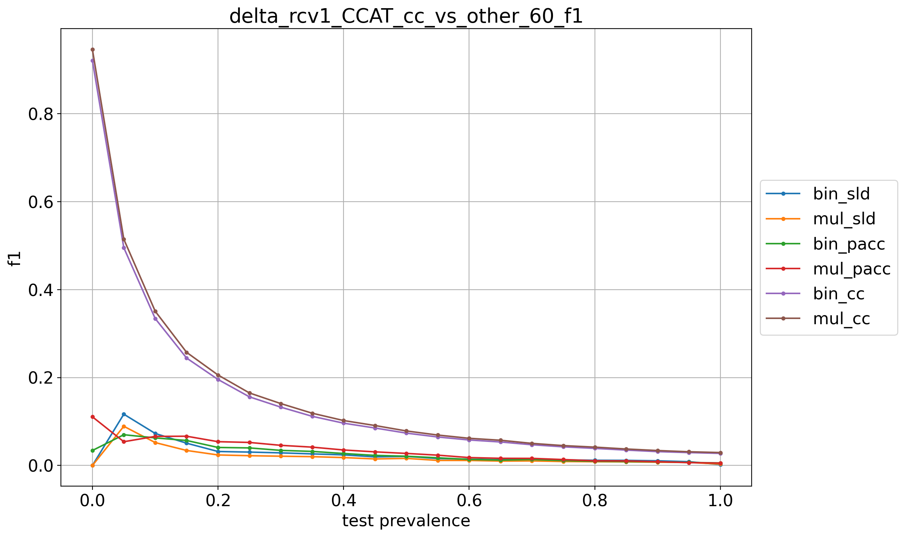
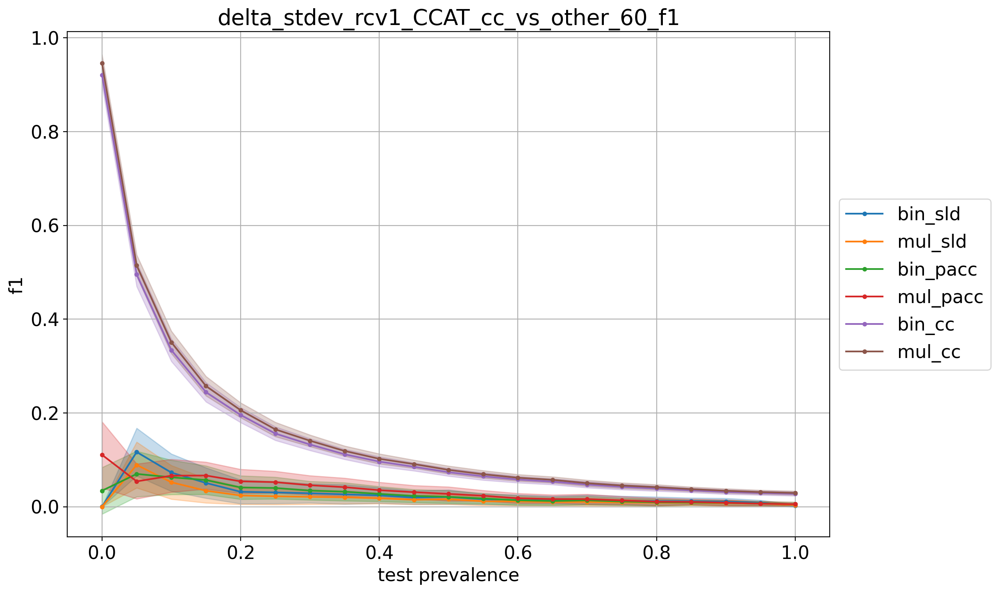
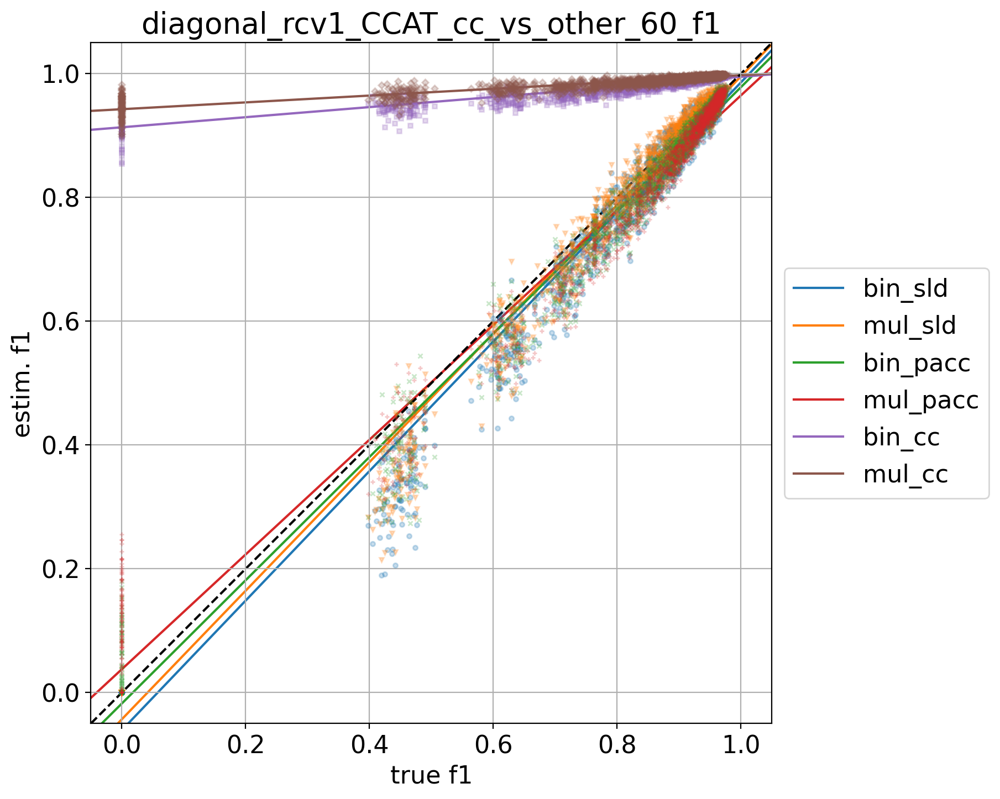
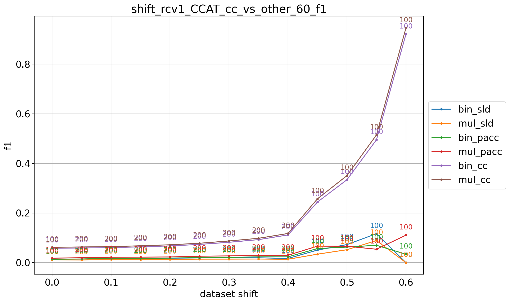

## 70% positives
> train: [0.29989987 0.70010013]  
> validation: [0.30006676 0.69993324]  
> bin_sld: 417.731s  
> mul_sld: 155.451s  
> bin_sld_gs: 1141.720s  
> mul_sld_gs: 680.203s  
> bin_sld_gsq: 527.251s  
> bin_pacc: 413.591s  
> mul_pacc: 130.941s  
> binmc_pacc: 410.011s  
> mulmc_pacc: 160.422s  
> binne_pacc: 411.824s  
> mulne_pacc: 150.120s  
> bin_pacc_gs: 731.866s  
> mul_pacc_gs: 262.250s  
> bin_cc: 396.501s  
> mul_cc: 145.444s  
> kfcv: 127.528s  
> ref: 121.369s  
> atc_mc: 106.641s  
> atc_ne: 101.076s  
> doc_feat: 86.241s  
> tot: 1146.268s  

<table border="1" class="dataframe">
  <thead>
    <tr style="text-align: right;">
      <th></th>
      <th>bin_sld</th>
      <th>mul_sld</th>
      <th>bin_pacc</th>
      <th>mul_pacc</th>
      <th>bin_cc</th>
      <th>mul_cc</th>
    </tr>
  </thead>
  <tbody>
    <tr>
      <th>0.0</th>
      <td>0.0001</td>
      <td>0.0000</td>
      <td>0.0048</td>
      <td>0.0014</td>
      <td>0.7616</td>
      <td>0.8935</td>
    </tr>
    <tr>
      <th>0.05</th>
      <td>0.1287</td>
      <td>0.1285</td>
      <td>0.1001</td>
      <td>0.1223</td>
      <td>0.4968</td>
      <td>0.6002</td>
    </tr>
    <tr>
      <th>0.1</th>
      <td>0.0930</td>
      <td>0.0992</td>
      <td>0.0849</td>
      <td>0.0992</td>
      <td>0.3602</td>
      <td>0.4457</td>
    </tr>
    <tr>
      <th>0.15</th>
      <td>0.0718</td>
      <td>0.0750</td>
      <td>0.0803</td>
      <td>0.0877</td>
      <td>0.2727</td>
      <td>0.3443</td>
    </tr>
    <tr>
      <th>0.2</th>
      <td>0.0497</td>
      <td>0.0545</td>
      <td>0.0633</td>
      <td>0.0706</td>
      <td>0.2164</td>
      <td>0.2755</td>
    </tr>
    <tr>
      <th>0.25</th>
      <td>0.0443</td>
      <td>0.0465</td>
      <td>0.0626</td>
      <td>0.0676</td>
      <td>0.1700</td>
      <td>0.2216</td>
    </tr>
    <tr>
      <th>0.3</th>
      <td>0.0375</td>
      <td>0.0378</td>
      <td>0.0521</td>
      <td>0.0575</td>
      <td>0.1418</td>
      <td>0.1848</td>
    </tr>
    <tr>
      <th>0.35</th>
      <td>0.0322</td>
      <td>0.0340</td>
      <td>0.0477</td>
      <td>0.0535</td>
      <td>0.1171</td>
      <td>0.1569</td>
    </tr>
    <tr>
      <th>0.4</th>
      <td>0.0266</td>
      <td>0.0259</td>
      <td>0.0427</td>
      <td>0.0473</td>
      <td>0.0974</td>
      <td>0.1309</td>
    </tr>
    <tr>
      <th>0.45</th>
      <td>0.0227</td>
      <td>0.0219</td>
      <td>0.0356</td>
      <td>0.0419</td>
      <td>0.0831</td>
      <td>0.1123</td>
    </tr>
    <tr>
      <th>0.5</th>
      <td>0.0200</td>
      <td>0.0188</td>
      <td>0.0300</td>
      <td>0.0351</td>
      <td>0.0688</td>
      <td>0.0939</td>
    </tr>
    <tr>
      <th>0.55</th>
      <td>0.0185</td>
      <td>0.0158</td>
      <td>0.0275</td>
      <td>0.0326</td>
      <td>0.0577</td>
      <td>0.0795</td>
    </tr>
    <tr>
      <th>0.6</th>
      <td>0.0141</td>
      <td>0.0120</td>
      <td>0.0202</td>
      <td>0.0258</td>
      <td>0.0488</td>
      <td>0.0684</td>
    </tr>
    <tr>
      <th>0.65</th>
      <td>0.0163</td>
      <td>0.0126</td>
      <td>0.0191</td>
      <td>0.0244</td>
      <td>0.0418</td>
      <td>0.0586</td>
    </tr>
    <tr>
      <th>0.7</th>
      <td>0.0133</td>
      <td>0.0096</td>
      <td>0.0161</td>
      <td>0.0228</td>
      <td>0.0336</td>
      <td>0.0489</td>
    </tr>
    <tr>
      <th>0.75</th>
      <td>0.0127</td>
      <td>0.0086</td>
      <td>0.0132</td>
      <td>0.0199</td>
      <td>0.0278</td>
      <td>0.0407</td>
    </tr>
    <tr>
      <th>0.8</th>
      <td>0.0133</td>
      <td>0.0087</td>
      <td>0.0111</td>
      <td>0.0173</td>
      <td>0.0221</td>
      <td>0.0335</td>
    </tr>
    <tr>
      <th>0.85</th>
      <td>0.0132</td>
      <td>0.0082</td>
      <td>0.0098</td>
      <td>0.0158</td>
      <td>0.0175</td>
      <td>0.0273</td>
    </tr>
    <tr>
      <th>0.9</th>
      <td>0.0111</td>
      <td>0.0060</td>
      <td>0.0067</td>
      <td>0.0131</td>
      <td>0.0139</td>
      <td>0.0218</td>
    </tr>
    <tr>
      <th>0.95</th>
      <td>0.0095</td>
      <td>0.0050</td>
      <td>0.0055</td>
      <td>0.0109</td>
      <td>0.0094</td>
      <td>0.0161</td>
    </tr>
    <tr>
      <th>1.0</th>
      <td>0.0030</td>
      <td>0.0029</td>
      <td>0.0044</td>
      <td>0.0106</td>
      <td>0.0071</td>
      <td>0.0123</td>
    </tr>
    <tr>
      <th>avg</th>
      <td>0.0310</td>
      <td>0.0301</td>
      <td>0.0351</td>
      <td>0.0418</td>
      <td>0.1460</td>
      <td>0.1841</td>
    </tr>
  </tbody>
</table>

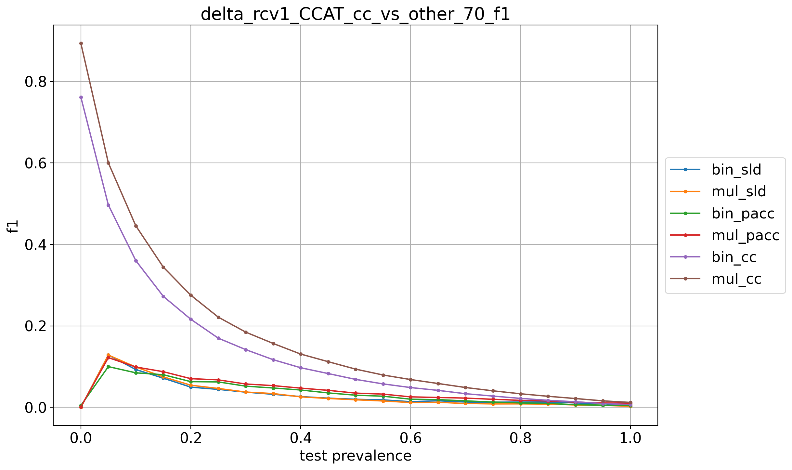
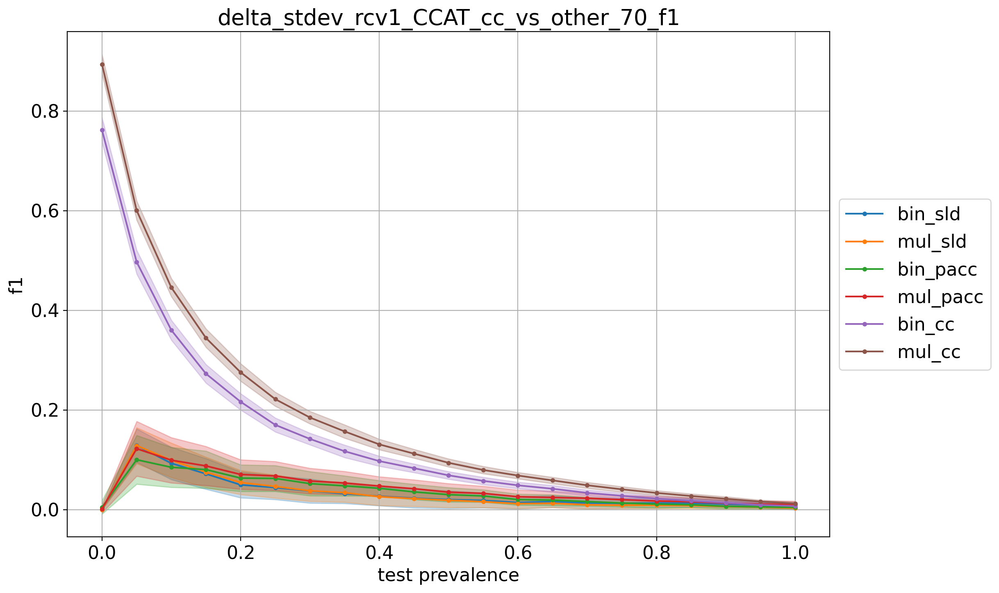
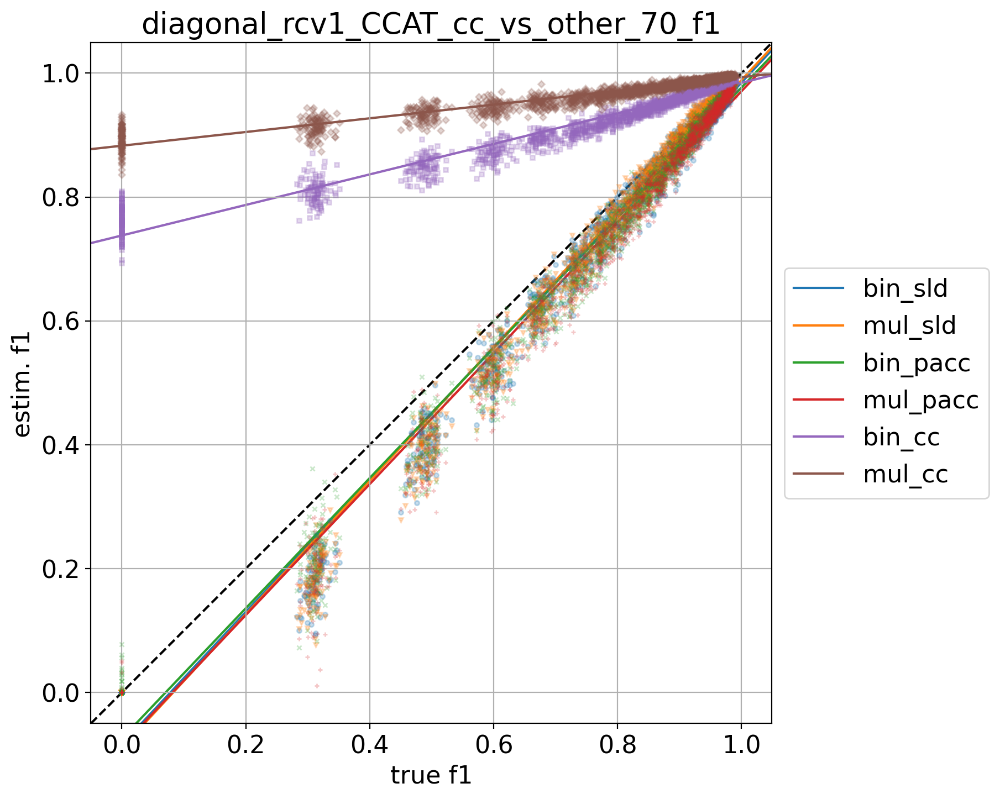
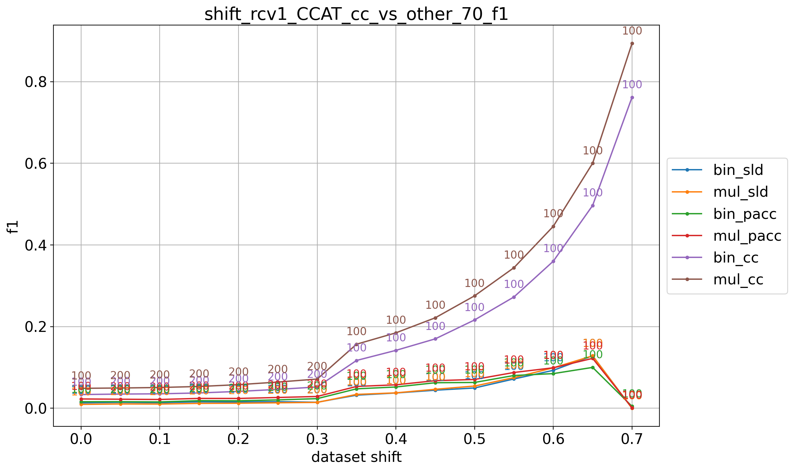

## 80% positives
> train: [0.19993324 0.80006676]  
> validation: [0.20010013 0.79989987]  
> bin_sld: 437.768s  
> mul_sld: 162.581s  
> bin_sld_gs: 1142.333s  
> mul_sld_gs: 680.247s  
> bin_sld_gsq: 532.404s  
> bin_pacc: 414.897s  
> mul_pacc: 158.907s  
> binmc_pacc: 406.361s  
> mulmc_pacc: 141.227s  
> binne_pacc: 414.412s  
> mulne_pacc: 158.498s  
> bin_pacc_gs: 720.921s  
> mul_pacc_gs: 272.540s  
> bin_cc: 395.525s  
> mul_cc: 139.596s  
> kfcv: 123.479s  
> ref: 124.418s  
> atc_mc: 126.354s  
> atc_ne: 101.451s  
> doc_feat: 111.799s  
> tot: 1146.771s  

<table border="1" class="dataframe">
  <thead>
    <tr style="text-align: right;">
      <th></th>
      <th>bin_sld</th>
      <th>mul_sld</th>
      <th>bin_pacc</th>
      <th>mul_pacc</th>
      <th>bin_cc</th>
      <th>mul_cc</th>
    </tr>
  </thead>
  <tbody>
    <tr>
      <th>0.0</th>
      <td>0.0001</td>
      <td>0.0000</td>
      <td>0.1760</td>
      <td>0.0293</td>
      <td>0.6272</td>
      <td>0.6786</td>
    </tr>
    <tr>
      <th>0.05</th>
      <td>0.1267</td>
      <td>0.1290</td>
      <td>0.1147</td>
      <td>0.0324</td>
      <td>0.4781</td>
      <td>0.5226</td>
    </tr>
    <tr>
      <th>0.1</th>
      <td>0.0989</td>
      <td>0.1103</td>
      <td>0.0838</td>
      <td>0.0292</td>
      <td>0.3819</td>
      <td>0.4200</td>
    </tr>
    <tr>
      <th>0.15</th>
      <td>0.0757</td>
      <td>0.0909</td>
      <td>0.0611</td>
      <td>0.0290</td>
      <td>0.3060</td>
      <td>0.3384</td>
    </tr>
    <tr>
      <th>0.2</th>
      <td>0.0552</td>
      <td>0.0707</td>
      <td>0.0485</td>
      <td>0.0264</td>
      <td>0.2520</td>
      <td>0.2798</td>
    </tr>
    <tr>
      <th>0.25</th>
      <td>0.0470</td>
      <td>0.0608</td>
      <td>0.0328</td>
      <td>0.0300</td>
      <td>0.2047</td>
      <td>0.2302</td>
    </tr>
    <tr>
      <th>0.3</th>
      <td>0.0374</td>
      <td>0.0510</td>
      <td>0.0265</td>
      <td>0.0279</td>
      <td>0.1723</td>
      <td>0.1930</td>
    </tr>
    <tr>
      <th>0.35</th>
      <td>0.0314</td>
      <td>0.0438</td>
      <td>0.0207</td>
      <td>0.0254</td>
      <td>0.1434</td>
      <td>0.1629</td>
    </tr>
    <tr>
      <th>0.4</th>
      <td>0.0249</td>
      <td>0.0347</td>
      <td>0.0164</td>
      <td>0.0246</td>
      <td>0.1186</td>
      <td>0.1351</td>
    </tr>
    <tr>
      <th>0.45</th>
      <td>0.0189</td>
      <td>0.0273</td>
      <td>0.0151</td>
      <td>0.0200</td>
      <td>0.1000</td>
      <td>0.1147</td>
    </tr>
    <tr>
      <th>0.5</th>
      <td>0.0147</td>
      <td>0.0214</td>
      <td>0.0110</td>
      <td>0.0181</td>
      <td>0.0823</td>
      <td>0.0956</td>
    </tr>
    <tr>
      <th>0.55</th>
      <td>0.0136</td>
      <td>0.0195</td>
      <td>0.0085</td>
      <td>0.0195</td>
      <td>0.0658</td>
      <td>0.0774</td>
    </tr>
    <tr>
      <th>0.6</th>
      <td>0.0084</td>
      <td>0.0128</td>
      <td>0.0085</td>
      <td>0.0143</td>
      <td>0.0546</td>
      <td>0.0643</td>
    </tr>
    <tr>
      <th>0.65</th>
      <td>0.0093</td>
      <td>0.0125</td>
      <td>0.0073</td>
      <td>0.0145</td>
      <td>0.0433</td>
      <td>0.0520</td>
    </tr>
    <tr>
      <th>0.7</th>
      <td>0.0076</td>
      <td>0.0097</td>
      <td>0.0059</td>
      <td>0.0122</td>
      <td>0.0332</td>
      <td>0.0411</td>
    </tr>
    <tr>
      <th>0.75</th>
      <td>0.0073</td>
      <td>0.0077</td>
      <td>0.0053</td>
      <td>0.0097</td>
      <td>0.0252</td>
      <td>0.0322</td>
    </tr>
    <tr>
      <th>0.8</th>
      <td>0.0083</td>
      <td>0.0072</td>
      <td>0.0043</td>
      <td>0.0093</td>
      <td>0.0178</td>
      <td>0.0236</td>
    </tr>
    <tr>
      <th>0.85</th>
      <td>0.0077</td>
      <td>0.0063</td>
      <td>0.0044</td>
      <td>0.0074</td>
      <td>0.0110</td>
      <td>0.0163</td>
    </tr>
    <tr>
      <th>0.9</th>
      <td>0.0084</td>
      <td>0.0055</td>
      <td>0.0035</td>
      <td>0.0060</td>
      <td>0.0057</td>
      <td>0.0093</td>
    </tr>
    <tr>
      <th>0.95</th>
      <td>0.0073</td>
      <td>0.0046</td>
      <td>0.0038</td>
      <td>0.0047</td>
      <td>0.0026</td>
      <td>0.0033</td>
    </tr>
    <tr>
      <th>1.0</th>
      <td>0.0027</td>
      <td>0.0023</td>
      <td>0.0034</td>
      <td>0.0052</td>
      <td>0.0060</td>
      <td>0.0037</td>
    </tr>
    <tr>
      <th>avg</th>
      <td>0.0291</td>
      <td>0.0347</td>
      <td>0.0315</td>
      <td>0.0188</td>
      <td>0.1491</td>
      <td>0.1664</td>
    </tr>
  </tbody>
</table>

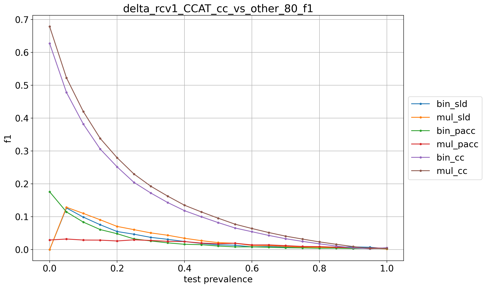
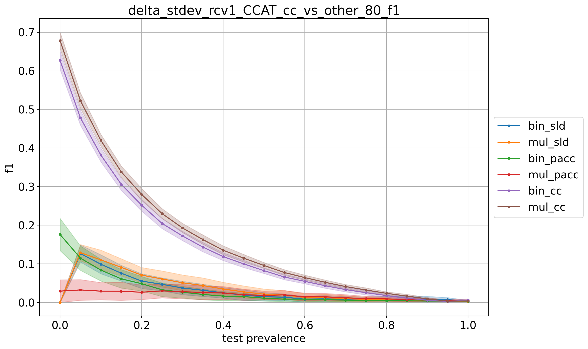
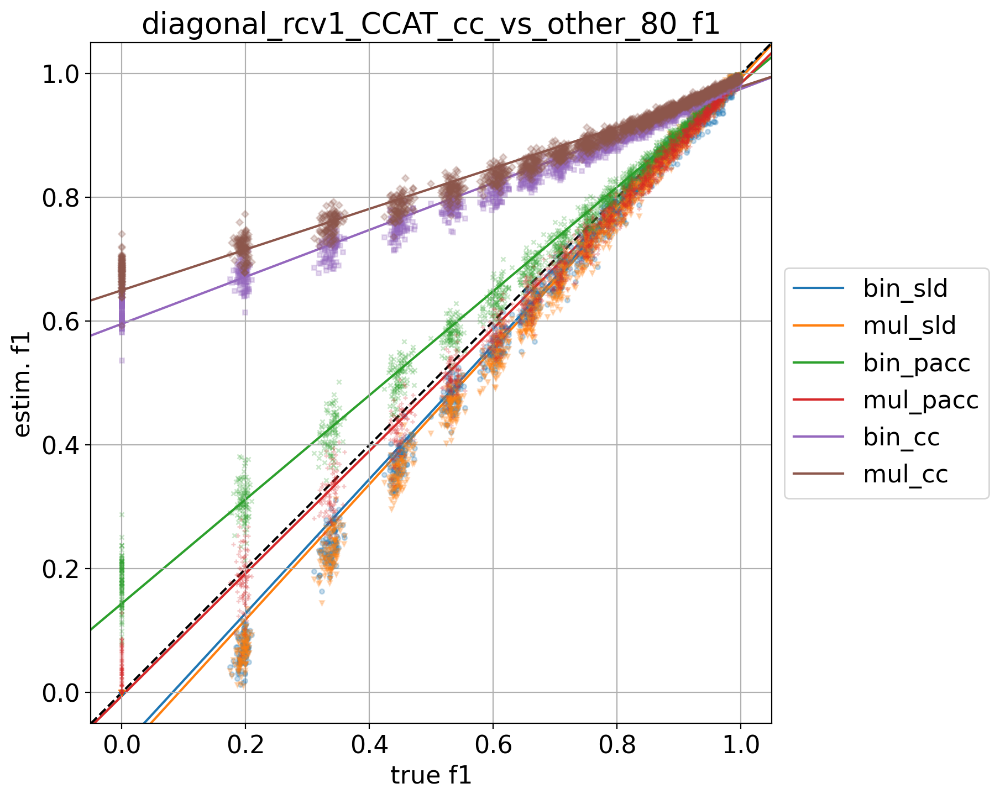
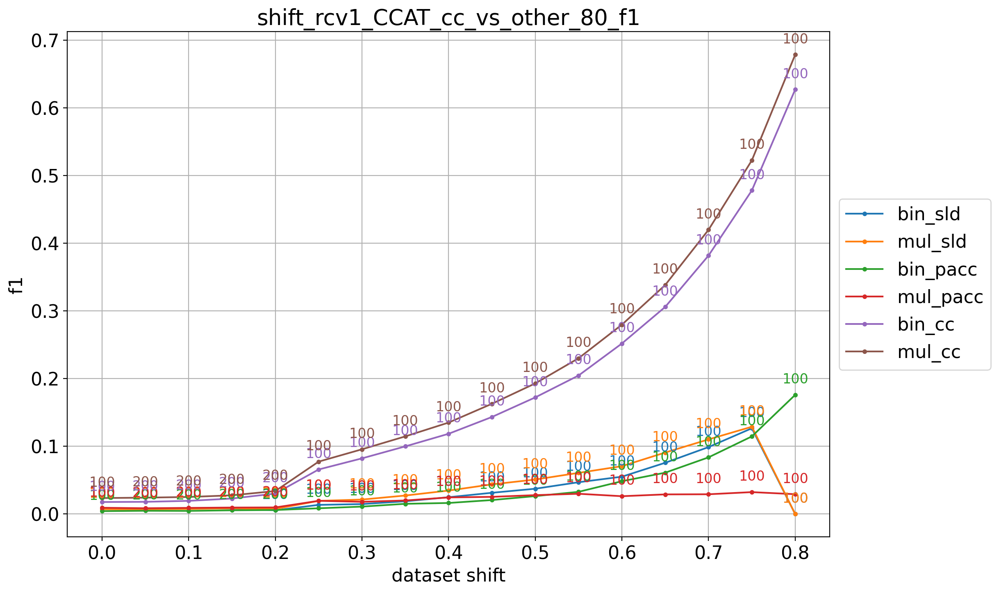

## 90% positives
> train: [0.09996662 0.90003338]  
> validation: [0.09996662 0.90003338]  
> bin_sld: 423.737s  
> mul_sld: 177.588s  
> bin_sld_gs: 1108.736s  
> mul_sld_gs: 666.006s  
> bin_sld_gsq: 518.900s  
> bin_pacc: 406.760s  
> mul_pacc: 133.174s  
> binmc_pacc: 401.789s  
> mulmc_pacc: 147.520s  
> binne_pacc: 400.414s  
> mulne_pacc: 148.167s  
> bin_pacc_gs: 722.523s  
> mul_pacc_gs: 252.340s  
> bin_cc: 378.760s  
> mul_cc: 126.045s  
> kfcv: 109.535s  
> ref: 87.159s  
> atc_mc: 99.104s  
> atc_ne: 101.467s  
> doc_feat: 83.819s  
> tot: 1113.236s  

<table border="1" class="dataframe">
  <thead>
    <tr style="text-align: right;">
      <th></th>
      <th>bin_sld</th>
      <th>mul_sld</th>
      <th>bin_pacc</th>
      <th>mul_pacc</th>
      <th>bin_cc</th>
      <th>mul_cc</th>
    </tr>
  </thead>
  <tbody>
    <tr>
      <th>0.0</th>
      <td>0.0000</td>
      <td>0.0000</td>
      <td>0.0176</td>
      <td>0.0053</td>
      <td>0.6063</td>
      <td>0.5872</td>
    </tr>
    <tr>
      <th>0.05</th>
      <td>0.1094</td>
      <td>0.1097</td>
      <td>0.0353</td>
      <td>0.0471</td>
      <td>0.5278</td>
      <td>0.5100</td>
    </tr>
    <tr>
      <th>0.1</th>
      <td>0.1816</td>
      <td>0.1513</td>
      <td>0.0274</td>
      <td>0.0393</td>
      <td>0.4605</td>
      <td>0.4413</td>
    </tr>
    <tr>
      <th>0.15</th>
      <td>0.1703</td>
      <td>0.1465</td>
      <td>0.0193</td>
      <td>0.0328</td>
      <td>0.4008</td>
      <td>0.3833</td>
    </tr>
    <tr>
      <th>0.2</th>
      <td>0.1472</td>
      <td>0.1315</td>
      <td>0.0209</td>
      <td>0.0292</td>
      <td>0.3500</td>
      <td>0.3335</td>
    </tr>
    <tr>
      <th>0.25</th>
      <td>0.1320</td>
      <td>0.1232</td>
      <td>0.0192</td>
      <td>0.0301</td>
      <td>0.3046</td>
      <td>0.2873</td>
    </tr>
    <tr>
      <th>0.3</th>
      <td>0.1123</td>
      <td>0.1082</td>
      <td>0.0169</td>
      <td>0.0256</td>
      <td>0.2650</td>
      <td>0.2494</td>
    </tr>
    <tr>
      <th>0.35</th>
      <td>0.0969</td>
      <td>0.0971</td>
      <td>0.0154</td>
      <td>0.0241</td>
      <td>0.2299</td>
      <td>0.2149</td>
    </tr>
    <tr>
      <th>0.4</th>
      <td>0.0828</td>
      <td>0.0853</td>
      <td>0.0143</td>
      <td>0.0231</td>
      <td>0.1987</td>
      <td>0.1846</td>
    </tr>
    <tr>
      <th>0.45</th>
      <td>0.0671</td>
      <td>0.0705</td>
      <td>0.0112</td>
      <td>0.0172</td>
      <td>0.1718</td>
      <td>0.1589</td>
    </tr>
    <tr>
      <th>0.5</th>
      <td>0.0552</td>
      <td>0.0600</td>
      <td>0.0117</td>
      <td>0.0174</td>
      <td>0.1457</td>
      <td>0.1336</td>
    </tr>
    <tr>
      <th>0.55</th>
      <td>0.0485</td>
      <td>0.0534</td>
      <td>0.0106</td>
      <td>0.0184</td>
      <td>0.1215</td>
      <td>0.1112</td>
    </tr>
    <tr>
      <th>0.6</th>
      <td>0.0353</td>
      <td>0.0401</td>
      <td>0.0086</td>
      <td>0.0137</td>
      <td>0.1023</td>
      <td>0.0928</td>
    </tr>
    <tr>
      <th>0.65</th>
      <td>0.0316</td>
      <td>0.0361</td>
      <td>0.0092</td>
      <td>0.0149</td>
      <td>0.0833</td>
      <td>0.0752</td>
    </tr>
    <tr>
      <th>0.7</th>
      <td>0.0235</td>
      <td>0.0273</td>
      <td>0.0085</td>
      <td>0.0125</td>
      <td>0.0665</td>
      <td>0.0592</td>
    </tr>
    <tr>
      <th>0.75</th>
      <td>0.0165</td>
      <td>0.0198</td>
      <td>0.0068</td>
      <td>0.0103</td>
      <td>0.0522</td>
      <td>0.0460</td>
    </tr>
    <tr>
      <th>0.8</th>
      <td>0.0128</td>
      <td>0.0143</td>
      <td>0.0068</td>
      <td>0.0101</td>
      <td>0.0377</td>
      <td>0.0334</td>
    </tr>
    <tr>
      <th>0.85</th>
      <td>0.0088</td>
      <td>0.0095</td>
      <td>0.0064</td>
      <td>0.0093</td>
      <td>0.0256</td>
      <td>0.0224</td>
    </tr>
    <tr>
      <th>0.9</th>
      <td>0.0055</td>
      <td>0.0050</td>
      <td>0.0054</td>
      <td>0.0075</td>
      <td>0.0139</td>
      <td>0.0122</td>
    </tr>
    <tr>
      <th>0.95</th>
      <td>0.0037</td>
      <td>0.0033</td>
      <td>0.0050</td>
      <td>0.0070</td>
      <td>0.0034</td>
      <td>0.0030</td>
    </tr>
    <tr>
      <th>1.0</th>
      <td>0.0026</td>
      <td>0.0021</td>
      <td>0.0052</td>
      <td>0.0065</td>
      <td>0.0071</td>
      <td>0.0065</td>
    </tr>
    <tr>
      <th>avg</th>
      <td>0.0640</td>
      <td>0.0616</td>
      <td>0.0134</td>
      <td>0.0191</td>
      <td>0.1988</td>
      <td>0.1879</td>
    </tr>
  </tbody>
</table>

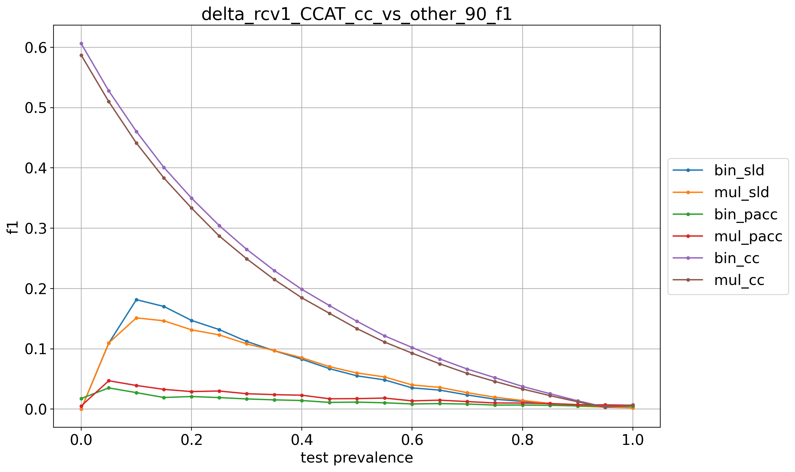
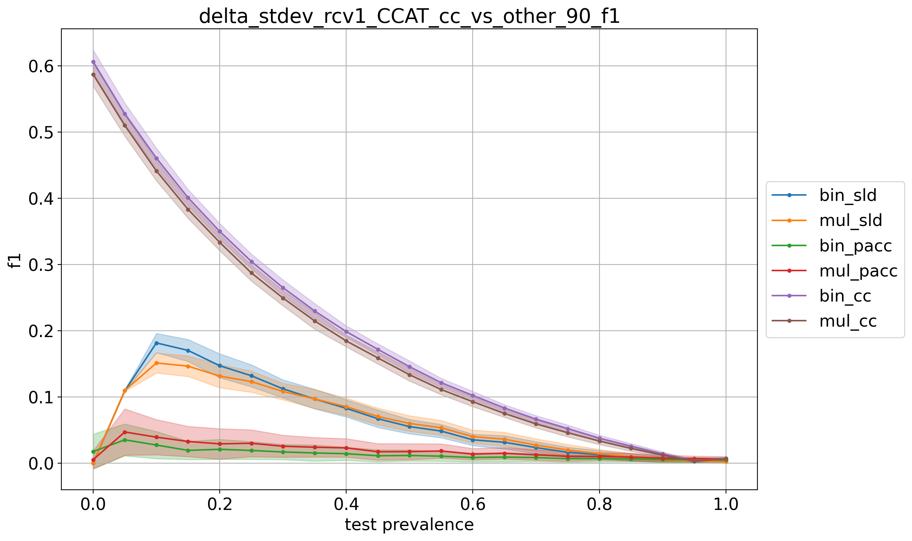
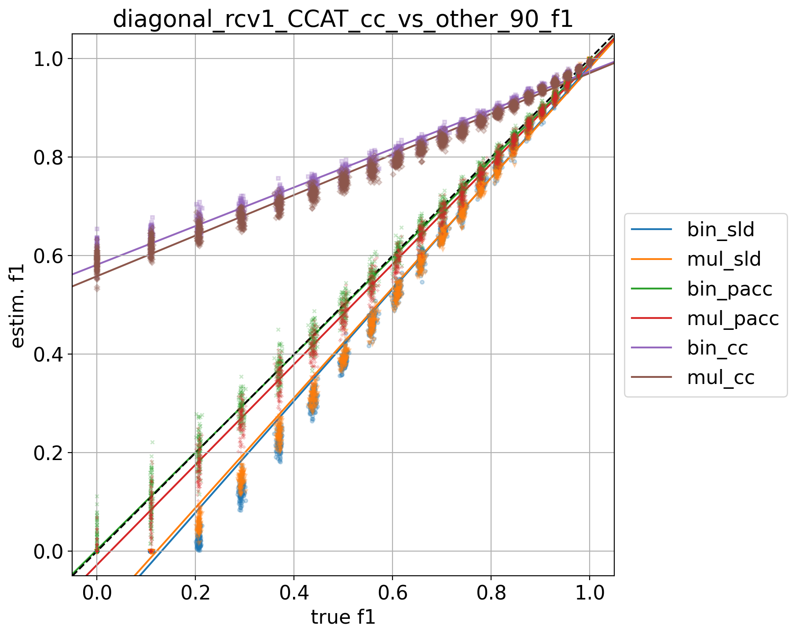
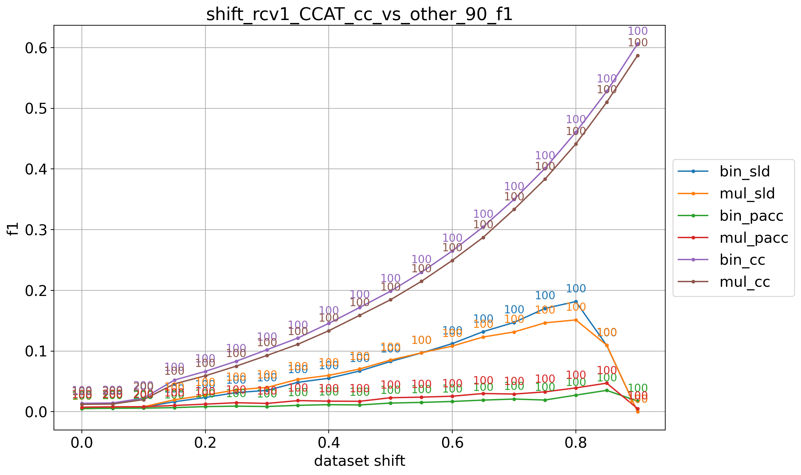

## avg
### avg on train
<table border="1" class="dataframe">
  <thead>
    <tr style="text-align: right;">
      <th></th>
      <th>bin_sld</th>
      <th>mul_sld</th>
      <th>bin_pacc</th>
      <th>mul_pacc</th>
      <th>bin_cc</th>
      <th>mul_cc</th>
    </tr>
  </thead>
  <tbody>
    <tr>
      <th>0.0</th>
      <td>0.0020</td>
      <td>0.0180</td>
      <td>0.0554</td>
      <td>0.1647</td>
      <td>0.6479</td>
      <td>0.6952</td>
    </tr>
    <tr>
      <th>0.05</th>
      <td>0.1221</td>
      <td>0.1059</td>
      <td>0.0723</td>
      <td>0.0758</td>
      <td>0.3220</td>
      <td>0.3461</td>
    </tr>
    <tr>
      <th>0.1</th>
      <td>0.0888</td>
      <td>0.0815</td>
      <td>0.0518</td>
      <td>0.0537</td>
      <td>0.2501</td>
      <td>0.2662</td>
    </tr>
    <tr>
      <th>0.15</th>
      <td>0.0733</td>
      <td>0.0670</td>
      <td>0.0407</td>
      <td>0.0457</td>
      <td>0.2066</td>
      <td>0.2177</td>
    </tr>
    <tr>
      <th>0.2</th>
      <td>0.0571</td>
      <td>0.0557</td>
      <td>0.0329</td>
      <td>0.0377</td>
      <td>0.1793</td>
      <td>0.1878</td>
    </tr>
    <tr>
      <th>0.25</th>
      <td>0.0487</td>
      <td>0.0508</td>
      <td>0.0290</td>
      <td>0.0365</td>
      <td>0.1558</td>
      <td>0.1618</td>
    </tr>
    <tr>
      <th>0.3</th>
      <td>0.0418</td>
      <td>0.0426</td>
      <td>0.0249</td>
      <td>0.0317</td>
      <td>0.1408</td>
      <td>0.1457</td>
    </tr>
    <tr>
      <th>0.35</th>
      <td>0.0351</td>
      <td>0.0373</td>
      <td>0.0232</td>
      <td>0.0293</td>
      <td>0.1283</td>
      <td>0.1321</td>
    </tr>
    <tr>
      <th>0.4</th>
      <td>0.0308</td>
      <td>0.0346</td>
      <td>0.0209</td>
      <td>0.0275</td>
      <td>0.1162</td>
      <td>0.1185</td>
    </tr>
    <tr>
      <th>0.45</th>
      <td>0.0254</td>
      <td>0.0306</td>
      <td>0.0180</td>
      <td>0.0245</td>
      <td>0.1073</td>
      <td>0.1090</td>
    </tr>
    <tr>
      <th>0.5</th>
      <td>0.0237</td>
      <td>0.0287</td>
      <td>0.0165</td>
      <td>0.0222</td>
      <td>0.0984</td>
      <td>0.0990</td>
    </tr>
    <tr>
      <th>0.55</th>
      <td>0.0199</td>
      <td>0.0272</td>
      <td>0.0151</td>
      <td>0.0214</td>
      <td>0.0911</td>
      <td>0.0917</td>
    </tr>
    <tr>
      <th>0.6</th>
      <td>0.0186</td>
      <td>0.0246</td>
      <td>0.0131</td>
      <td>0.0184</td>
      <td>0.0846</td>
      <td>0.0841</td>
    </tr>
    <tr>
      <th>0.65</th>
      <td>0.0186</td>
      <td>0.0248</td>
      <td>0.0131</td>
      <td>0.0180</td>
      <td>0.0809</td>
      <td>0.0799</td>
    </tr>
    <tr>
      <th>0.7</th>
      <td>0.0162</td>
      <td>0.0228</td>
      <td>0.0125</td>
      <td>0.0172</td>
      <td>0.0759</td>
      <td>0.0745</td>
    </tr>
    <tr>
      <th>0.75</th>
      <td>0.0154</td>
      <td>0.0215</td>
      <td>0.0113</td>
      <td>0.0156</td>
      <td>0.0717</td>
      <td>0.0701</td>
    </tr>
    <tr>
      <th>0.8</th>
      <td>0.0145</td>
      <td>0.0212</td>
      <td>0.0103</td>
      <td>0.0144</td>
      <td>0.0676</td>
      <td>0.0658</td>
    </tr>
    <tr>
      <th>0.85</th>
      <td>0.0142</td>
      <td>0.0204</td>
      <td>0.0100</td>
      <td>0.0138</td>
      <td>0.0645</td>
      <td>0.0626</td>
    </tr>
    <tr>
      <th>0.9</th>
      <td>0.0134</td>
      <td>0.0170</td>
      <td>0.0093</td>
      <td>0.0130</td>
      <td>0.0614</td>
      <td>0.0593</td>
    </tr>
    <tr>
      <th>0.95</th>
      <td>0.0118</td>
      <td>0.0133</td>
      <td>0.0087</td>
      <td>0.0125</td>
      <td>0.0588</td>
      <td>0.0560</td>
    </tr>
    <tr>
      <th>1.0</th>
      <td>0.0027</td>
      <td>0.0060</td>
      <td>0.0086</td>
      <td>0.0118</td>
      <td>0.0596</td>
      <td>0.0564</td>
    </tr>
    <tr>
      <th>avg</th>
      <td>0.0331</td>
      <td>0.0358</td>
      <td>0.0237</td>
      <td>0.0336</td>
      <td>0.1461</td>
      <td>0.1514</td>
    </tr>
  </tbody>
</table>

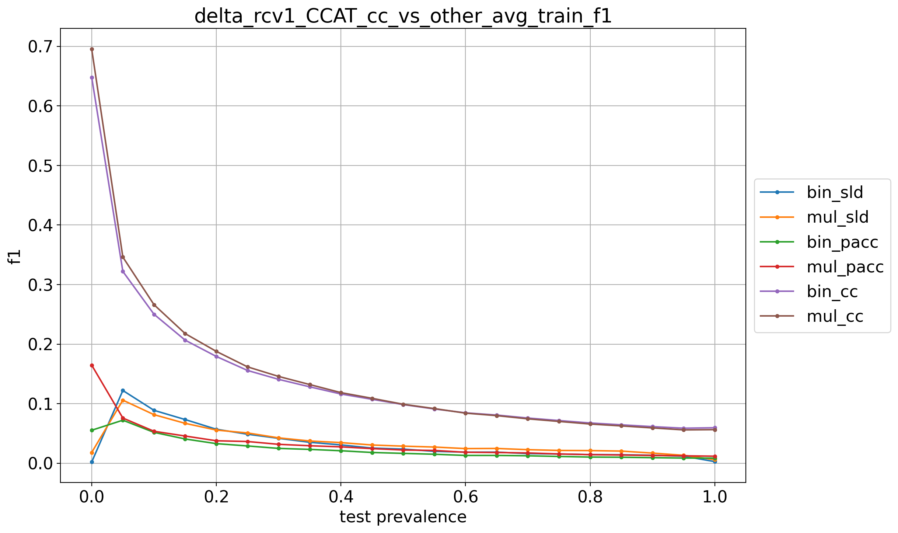
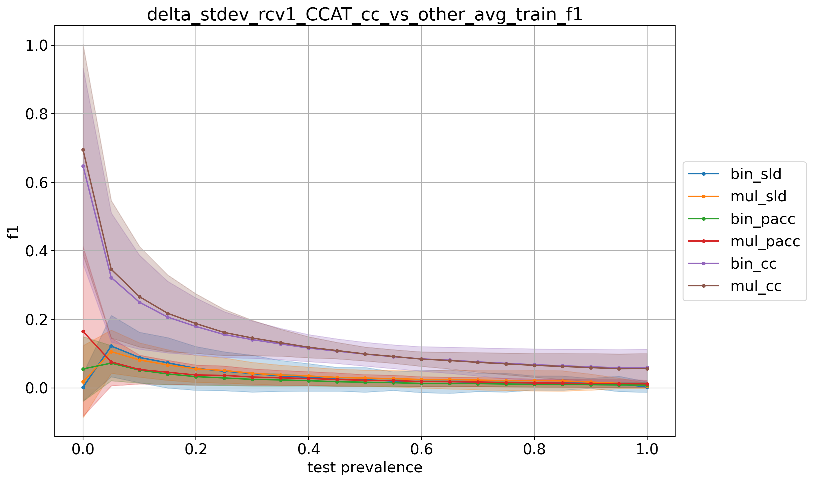
### avg on test
<table border="1" class="dataframe">
  <thead>
    <tr style="text-align: right;">
      <th></th>
      <th>bin_sld</th>
      <th>mul_sld</th>
      <th>bin_pacc</th>
      <th>mul_pacc</th>
      <th>bin_cc</th>
      <th>mul_cc</th>
    </tr>
  </thead>
  <tbody>
    <tr>
      <th>0.1</th>
      <td>0.0625</td>
      <td>0.0654</td>
      <td>0.0250</td>
      <td>0.0691</td>
      <td>0.1603</td>
      <td>0.0898</td>
    </tr>
    <tr>
      <th>0.2</th>
      <td>0.0224</td>
      <td>0.0331</td>
      <td>0.0202</td>
      <td>0.0340</td>
      <td>0.1060</td>
      <td>0.1207</td>
    </tr>
    <tr>
      <th>0.3</th>
      <td>0.0215</td>
      <td>0.0281</td>
      <td>0.0203</td>
      <td>0.0279</td>
      <td>0.1167</td>
      <td>0.1528</td>
    </tr>
    <tr>
      <th>0.4</th>
      <td>0.0203</td>
      <td>0.0288</td>
      <td>0.0214</td>
      <td>0.0311</td>
      <td>0.1264</td>
      <td>0.1428</td>
    </tr>
    <tr>
      <th>0.5</th>
      <td>0.0211</td>
      <td>0.0212</td>
      <td>0.0202</td>
      <td>0.0264</td>
      <td>0.1558</td>
      <td>0.1550</td>
    </tr>
    <tr>
      <th>0.6</th>
      <td>0.0256</td>
      <td>0.0190</td>
      <td>0.0262</td>
      <td>0.0340</td>
      <td>0.1559</td>
      <td>0.1633</td>
    </tr>
    <tr>
      <th>0.7</th>
      <td>0.0310</td>
      <td>0.0301</td>
      <td>0.0351</td>
      <td>0.0418</td>
      <td>0.1460</td>
      <td>0.1841</td>
    </tr>
    <tr>
      <th>0.8</th>
      <td>0.0291</td>
      <td>0.0347</td>
      <td>0.0315</td>
      <td>0.0188</td>
      <td>0.1491</td>
      <td>0.1664</td>
    </tr>
    <tr>
      <th>0.9</th>
      <td>0.0640</td>
      <td>0.0616</td>
      <td>0.0134</td>
      <td>0.0191</td>
      <td>0.1988</td>
      <td>0.1879</td>
    </tr>
    <tr>
      <th>avg</th>
      <td>0.0331</td>
      <td>0.0358</td>
      <td>0.0237</td>
      <td>0.0336</td>
      <td>0.1461</td>
      <td>0.1514</td>
    </tr>
  </tbody>
</table>

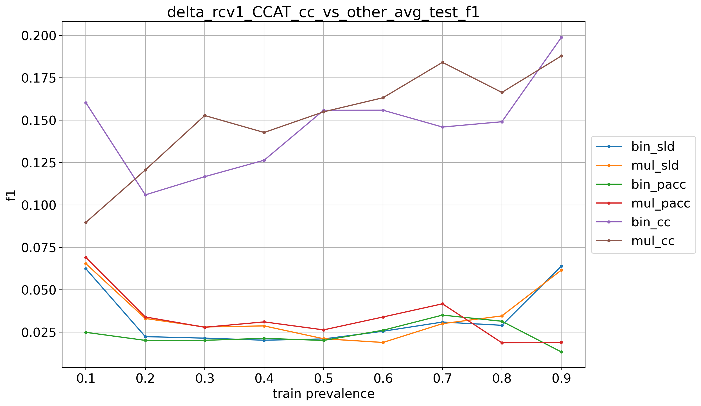
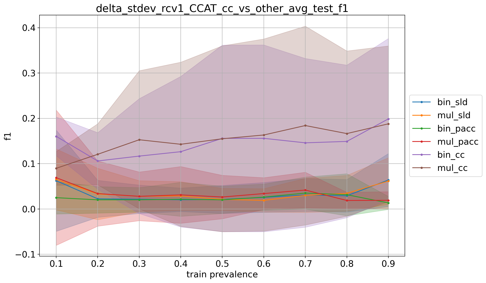
### avg dataset shift
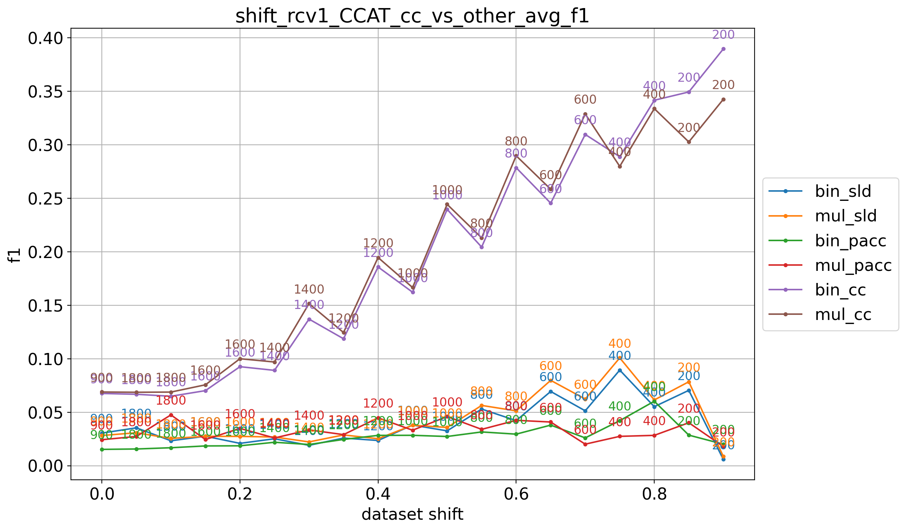
