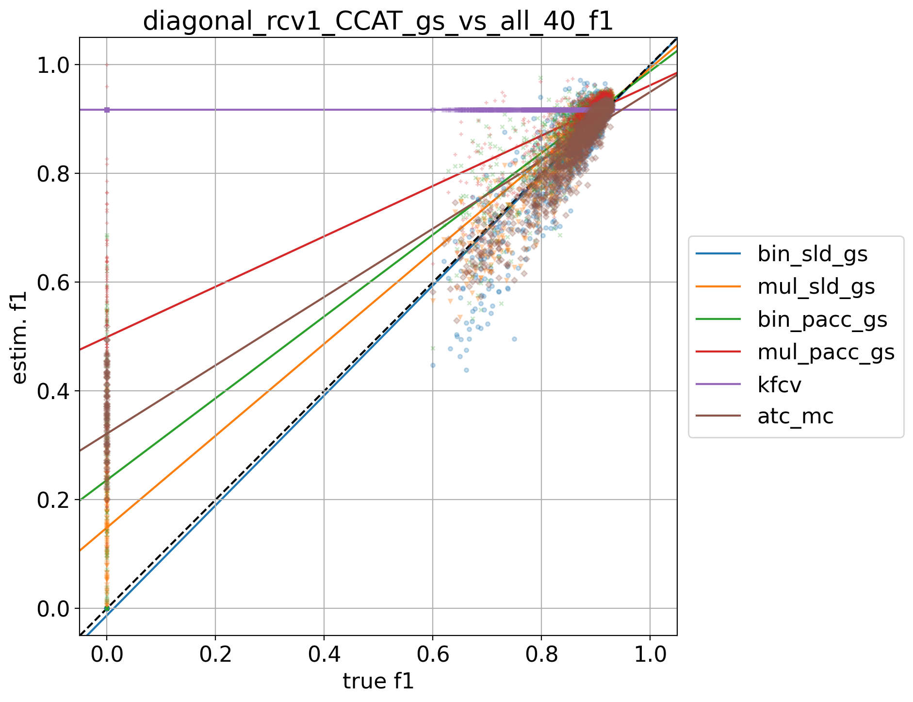
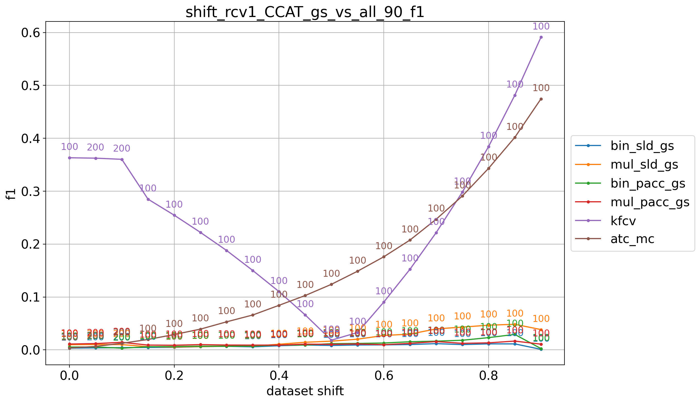
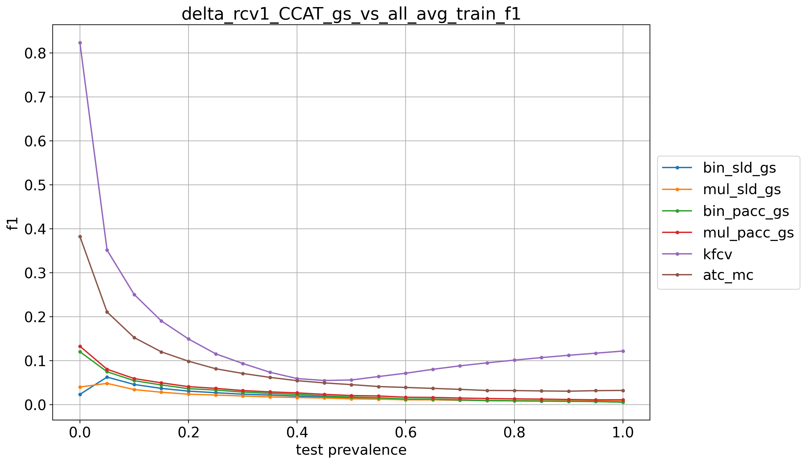

# rcv1_CCAT_9prevs

## 10% positives
> train: [0.90003338 0.09996662]  
> validation: [0.90003338 0.09996662]  
> bin_sld: 426.003s  
> mul_sld: 199.118s  
> bin_sld_gs: 1070.285s  
> mul_sld_gs: 686.591s  
> bin_pacc: 409.897s  
> mul_pacc: 169.591s  
> binmc_pacc: 412.906s  
> mulmc_pacc: 173.043s  
> binne_pacc: 411.128s  
> mulne_pacc: 146.658s  
> bin_pacc_gs: 710.525s  
> mul_pacc_gs: 245.764s  
> bin_cc: 389.472s  
> mul_cc: 148.220s  
> kfcv: 130.095s  
> ref: 120.267s  
> atc_mc: 125.236s  
> atc_ne: 121.957s  
> doc_feat: 83.796s  
> tot: 1073.769s  

<table border="1" class="dataframe">
  <thead>
    <tr style="text-align: right;">
      <th></th>
      <th>bin_sld_gs</th>
      <th>mul_sld_gs</th>
      <th>bin_pacc_gs</th>
      <th>mul_pacc_gs</th>
      <th>kfcv</th>
      <th>atc_mc</th>
    </tr>
  </thead>
  <tbody>
    <tr>
      <th>0.0</th>
      <td>0.0512</td>
      <td>0.0064</td>
      <td>0.0122</td>
      <td>0.0115</td>
      <td>0.6519</td>
      <td>0.0022</td>
    </tr>
    <tr>
      <th>0.05</th>
      <td>0.0481</td>
      <td>0.0503</td>
      <td>0.0472</td>
      <td>0.1149</td>
      <td>0.2258</td>
      <td>0.2253</td>
    </tr>
    <tr>
      <th>0.1</th>
      <td>0.0309</td>
      <td>0.0406</td>
      <td>0.0246</td>
      <td>0.0560</td>
      <td>0.2195</td>
      <td>0.1997</td>
    </tr>
    <tr>
      <th>0.15</th>
      <td>0.0231</td>
      <td>0.0331</td>
      <td>0.0189</td>
      <td>0.0335</td>
      <td>0.2215</td>
      <td>0.2018</td>
    </tr>
    <tr>
      <th>0.2</th>
      <td>0.0200</td>
      <td>0.0308</td>
      <td>0.0160</td>
      <td>0.0259</td>
      <td>0.2156</td>
      <td>0.1936</td>
    </tr>
    <tr>
      <th>0.25</th>
      <td>0.0178</td>
      <td>0.0277</td>
      <td>0.0123</td>
      <td>0.0187</td>
      <td>0.2145</td>
      <td>0.1943</td>
    </tr>
    <tr>
      <th>0.3</th>
      <td>0.0162</td>
      <td>0.0251</td>
      <td>0.0112</td>
      <td>0.0154</td>
      <td>0.2218</td>
      <td>0.1865</td>
    </tr>
    <tr>
      <th>0.35</th>
      <td>0.0152</td>
      <td>0.0220</td>
      <td>0.0090</td>
      <td>0.0126</td>
      <td>0.2188</td>
      <td>0.1849</td>
    </tr>
    <tr>
      <th>0.4</th>
      <td>0.0124</td>
      <td>0.0194</td>
      <td>0.0104</td>
      <td>0.0147</td>
      <td>0.2231</td>
      <td>0.1852</td>
    </tr>
    <tr>
      <th>0.45</th>
      <td>0.0113</td>
      <td>0.0190</td>
      <td>0.0103</td>
      <td>0.0147</td>
      <td>0.2188</td>
      <td>0.1824</td>
    </tr>
    <tr>
      <th>0.5</th>
      <td>0.0103</td>
      <td>0.0150</td>
      <td>0.0085</td>
      <td>0.0130</td>
      <td>0.2196</td>
      <td>0.1836</td>
    </tr>
    <tr>
      <th>0.55</th>
      <td>0.0095</td>
      <td>0.0151</td>
      <td>0.0098</td>
      <td>0.0155</td>
      <td>0.2237</td>
      <td>0.1801</td>
    </tr>
    <tr>
      <th>0.6</th>
      <td>0.0073</td>
      <td>0.0116</td>
      <td>0.0070</td>
      <td>0.0135</td>
      <td>0.2174</td>
      <td>0.1872</td>
    </tr>
    <tr>
      <th>0.65</th>
      <td>0.0081</td>
      <td>0.0107</td>
      <td>0.0092</td>
      <td>0.0136</td>
      <td>0.2193</td>
      <td>0.1871</td>
    </tr>
    <tr>
      <th>0.7</th>
      <td>0.0069</td>
      <td>0.0091</td>
      <td>0.0073</td>
      <td>0.0137</td>
      <td>0.2189</td>
      <td>0.1884</td>
    </tr>
    <tr>
      <th>0.75</th>
      <td>0.0063</td>
      <td>0.0082</td>
      <td>0.0079</td>
      <td>0.0162</td>
      <td>0.2184</td>
      <td>0.1829</td>
    </tr>
    <tr>
      <th>0.8</th>
      <td>0.0048</td>
      <td>0.0078</td>
      <td>0.0073</td>
      <td>0.0164</td>
      <td>0.2204</td>
      <td>0.1840</td>
    </tr>
    <tr>
      <th>0.85</th>
      <td>0.0040</td>
      <td>0.0069</td>
      <td>0.0081</td>
      <td>0.0170</td>
      <td>0.2182</td>
      <td>0.1816</td>
    </tr>
    <tr>
      <th>0.9</th>
      <td>0.0036</td>
      <td>0.0062</td>
      <td>0.0083</td>
      <td>0.0177</td>
      <td>0.2166</td>
      <td>0.1818</td>
    </tr>
    <tr>
      <th>0.95</th>
      <td>0.0029</td>
      <td>0.0065</td>
      <td>0.0083</td>
      <td>0.0160</td>
      <td>0.2154</td>
      <td>0.1848</td>
    </tr>
    <tr>
      <th>1.0</th>
      <td>0.0027</td>
      <td>0.0046</td>
      <td>0.0077</td>
      <td>0.0167</td>
      <td>0.2160</td>
      <td>0.1850</td>
    </tr>
    <tr>
      <th>avg</th>
      <td>0.0149</td>
      <td>0.0179</td>
      <td>0.0125</td>
      <td>0.0232</td>
      <td>0.2398</td>
      <td>0.1801</td>
    </tr>
  </tbody>
</table>

## 20% positives
> train: [0.79989987 0.20010013]  
> validation: [0.80006676 0.19993324]  
> bin_sld: 422.895s  
> mul_sld: 162.786s  
> bin_sld_gs: 1128.064s  
> mul_sld_gs: 683.619s  
> bin_sld_gsq: 524.432s  
> bin_pacc: 410.462s  
> mul_pacc: 155.872s  
> binmc_pacc: 407.039s  
> mulmc_pacc: 173.902s  
> binne_pacc: 410.358s  
> mulne_pacc: 167.292s  
> bin_pacc_gs: 732.626s  
> mul_pacc_gs: 261.935s  
> bin_cc: 396.948s  
> mul_cc: 147.743s  
> kfcv: 132.118s  
> ref: 106.145s  
> atc_mc: 127.911s  
> atc_ne: 121.613s  
> doc_feat: 80.220s  
> tot: 1132.799s  

<table border="1" class="dataframe">
  <thead>
    <tr style="text-align: right;">
      <th></th>
      <th>bin_sld_gs</th>
      <th>mul_sld_gs</th>
      <th>bin_pacc_gs</th>
      <th>mul_pacc_gs</th>
      <th>kfcv</th>
      <th>atc_mc</th>
    </tr>
  </thead>
  <tbody>
    <tr>
      <th>0.0</th>
      <td>0.0655</td>
      <td>0.0354</td>
      <td>0.0536</td>
      <td>0.3273</td>
      <td>0.8243</td>
      <td>0.1159</td>
    </tr>
    <tr>
      <th>0.05</th>
      <td>0.0845</td>
      <td>0.0846</td>
      <td>0.1246</td>
      <td>0.0783</td>
      <td>0.1171</td>
      <td>0.1303</td>
    </tr>
    <tr>
      <th>0.1</th>
      <td>0.0604</td>
      <td>0.0475</td>
      <td>0.0704</td>
      <td>0.0496</td>
      <td>0.0999</td>
      <td>0.0916</td>
    </tr>
    <tr>
      <th>0.15</th>
      <td>0.0462</td>
      <td>0.0286</td>
      <td>0.0431</td>
      <td>0.0359</td>
      <td>0.0888</td>
      <td>0.0794</td>
    </tr>
    <tr>
      <th>0.2</th>
      <td>0.0382</td>
      <td>0.0215</td>
      <td>0.0295</td>
      <td>0.0278</td>
      <td>0.0833</td>
      <td>0.0673</td>
    </tr>
    <tr>
      <th>0.25</th>
      <td>0.0334</td>
      <td>0.0185</td>
      <td>0.0209</td>
      <td>0.0227</td>
      <td>0.0811</td>
      <td>0.0623</td>
    </tr>
    <tr>
      <th>0.3</th>
      <td>0.0325</td>
      <td>0.0143</td>
      <td>0.0189</td>
      <td>0.0219</td>
      <td>0.0842</td>
      <td>0.0592</td>
    </tr>
    <tr>
      <th>0.35</th>
      <td>0.0276</td>
      <td>0.0118</td>
      <td>0.0149</td>
      <td>0.0174</td>
      <td>0.0878</td>
      <td>0.0518</td>
    </tr>
    <tr>
      <th>0.4</th>
      <td>0.0260</td>
      <td>0.0120</td>
      <td>0.0105</td>
      <td>0.0178</td>
      <td>0.0859</td>
      <td>0.0536</td>
    </tr>
    <tr>
      <th>0.45</th>
      <td>0.0252</td>
      <td>0.0112</td>
      <td>0.0100</td>
      <td>0.0160</td>
      <td>0.0806</td>
      <td>0.0510</td>
    </tr>
    <tr>
      <th>0.5</th>
      <td>0.0252</td>
      <td>0.0098</td>
      <td>0.0081</td>
      <td>0.0159</td>
      <td>0.0819</td>
      <td>0.0518</td>
    </tr>
    <tr>
      <th>0.55</th>
      <td>0.0237</td>
      <td>0.0098</td>
      <td>0.0068</td>
      <td>0.0146</td>
      <td>0.0811</td>
      <td>0.0533</td>
    </tr>
    <tr>
      <th>0.6</th>
      <td>0.0213</td>
      <td>0.0088</td>
      <td>0.0065</td>
      <td>0.0150</td>
      <td>0.0783</td>
      <td>0.0506</td>
    </tr>
    <tr>
      <th>0.65</th>
      <td>0.0223</td>
      <td>0.0095</td>
      <td>0.0064</td>
      <td>0.0144</td>
      <td>0.0809</td>
      <td>0.0480</td>
    </tr>
    <tr>
      <th>0.7</th>
      <td>0.0195</td>
      <td>0.0097</td>
      <td>0.0050</td>
      <td>0.0126</td>
      <td>0.0814</td>
      <td>0.0453</td>
    </tr>
    <tr>
      <th>0.75</th>
      <td>0.0203</td>
      <td>0.0091</td>
      <td>0.0045</td>
      <td>0.0128</td>
      <td>0.0804</td>
      <td>0.0428</td>
    </tr>
    <tr>
      <th>0.8</th>
      <td>0.0200</td>
      <td>0.0073</td>
      <td>0.0039</td>
      <td>0.0122</td>
      <td>0.0793</td>
      <td>0.0472</td>
    </tr>
    <tr>
      <th>0.85</th>
      <td>0.0202</td>
      <td>0.0066</td>
      <td>0.0041</td>
      <td>0.0116</td>
      <td>0.0790</td>
      <td>0.0461</td>
    </tr>
    <tr>
      <th>0.9</th>
      <td>0.0202</td>
      <td>0.0065</td>
      <td>0.0041</td>
      <td>0.0118</td>
      <td>0.0793</td>
      <td>0.0439</td>
    </tr>
    <tr>
      <th>0.95</th>
      <td>0.0202</td>
      <td>0.0055</td>
      <td>0.0041</td>
      <td>0.0114</td>
      <td>0.0785</td>
      <td>0.0468</td>
    </tr>
    <tr>
      <th>1.0</th>
      <td>0.0202</td>
      <td>0.0048</td>
      <td>0.0043</td>
      <td>0.0101</td>
      <td>0.0801</td>
      <td>0.0425</td>
    </tr>
    <tr>
      <th>avg</th>
      <td>0.0320</td>
      <td>0.0178</td>
      <td>0.0216</td>
      <td>0.0361</td>
      <td>0.1197</td>
      <td>0.0610</td>
    </tr>
  </tbody>
</table>

## 30% positives
> train: [0.69993324 0.30006676]  
> validation: [0.70010013 0.29989987]  
> bin_sld: 421.459s  
> mul_sld: 146.321s  
> bin_sld_gs: 1159.421s  
> mul_sld_gs: 690.743s  
> bin_sld_gsq: 531.736s  
> bin_pacc: 423.881s  
> mul_pacc: 166.104s  
> binmc_pacc: 422.818s  
> mulmc_pacc: 164.572s  
> binne_pacc: 409.704s  
> mulne_pacc: 155.476s  
> bin_pacc_gs: 737.229s  
> mul_pacc_gs: 269.465s  
> bin_cc: 400.220s  
> mul_cc: 118.299s  
> kfcv: 131.612s  
> ref: 122.392s  
> atc_mc: 119.095s  
> atc_ne: 108.266s  
> doc_feat: 96.341s  
> tot: 1163.937s  

<table border="1" class="dataframe">
  <thead>
    <tr style="text-align: right;">
      <th></th>
      <th>bin_sld_gs</th>
      <th>mul_sld_gs</th>
      <th>bin_pacc_gs</th>
      <th>mul_pacc_gs</th>
      <th>kfcv</th>
      <th>atc_mc</th>
    </tr>
  </thead>
  <tbody>
    <tr>
      <th>0.0</th>
      <td>0.0020</td>
      <td>0.0138</td>
      <td>0.5250</td>
      <td>0.2058</td>
      <td>0.8900</td>
      <td>0.3301</td>
    </tr>
    <tr>
      <th>0.05</th>
      <td>0.0673</td>
      <td>0.0644</td>
      <td>0.0866</td>
      <td>0.1000</td>
      <td>0.1418</td>
      <td>0.0519</td>
    </tr>
    <tr>
      <th>0.1</th>
      <td>0.0411</td>
      <td>0.0381</td>
      <td>0.0453</td>
      <td>0.0608</td>
      <td>0.0829</td>
      <td>0.0306</td>
    </tr>
    <tr>
      <th>0.15</th>
      <td>0.0324</td>
      <td>0.0313</td>
      <td>0.0326</td>
      <td>0.0503</td>
      <td>0.0641</td>
      <td>0.0252</td>
    </tr>
    <tr>
      <th>0.2</th>
      <td>0.0230</td>
      <td>0.0228</td>
      <td>0.0276</td>
      <td>0.0430</td>
      <td>0.0561</td>
      <td>0.0190</td>
    </tr>
    <tr>
      <th>0.25</th>
      <td>0.0199</td>
      <td>0.0229</td>
      <td>0.0224</td>
      <td>0.0376</td>
      <td>0.0457</td>
      <td>0.0167</td>
    </tr>
    <tr>
      <th>0.3</th>
      <td>0.0159</td>
      <td>0.0200</td>
      <td>0.0178</td>
      <td>0.0278</td>
      <td>0.0447</td>
      <td>0.0132</td>
    </tr>
    <tr>
      <th>0.35</th>
      <td>0.0158</td>
      <td>0.0177</td>
      <td>0.0174</td>
      <td>0.0254</td>
      <td>0.0432</td>
      <td>0.0170</td>
    </tr>
    <tr>
      <th>0.4</th>
      <td>0.0144</td>
      <td>0.0175</td>
      <td>0.0160</td>
      <td>0.0232</td>
      <td>0.0394</td>
      <td>0.0141</td>
    </tr>
    <tr>
      <th>0.45</th>
      <td>0.0114</td>
      <td>0.0161</td>
      <td>0.0134</td>
      <td>0.0188</td>
      <td>0.0370</td>
      <td>0.0135</td>
    </tr>
    <tr>
      <th>0.5</th>
      <td>0.0100</td>
      <td>0.0136</td>
      <td>0.0122</td>
      <td>0.0182</td>
      <td>0.0344</td>
      <td>0.0153</td>
    </tr>
    <tr>
      <th>0.55</th>
      <td>0.0086</td>
      <td>0.0136</td>
      <td>0.0108</td>
      <td>0.0178</td>
      <td>0.0327</td>
      <td>0.0146</td>
    </tr>
    <tr>
      <th>0.6</th>
      <td>0.0075</td>
      <td>0.0127</td>
      <td>0.0104</td>
      <td>0.0152</td>
      <td>0.0299</td>
      <td>0.0142</td>
    </tr>
    <tr>
      <th>0.65</th>
      <td>0.0071</td>
      <td>0.0122</td>
      <td>0.0095</td>
      <td>0.0147</td>
      <td>0.0327</td>
      <td>0.0159</td>
    </tr>
    <tr>
      <th>0.7</th>
      <td>0.0056</td>
      <td>0.0103</td>
      <td>0.0090</td>
      <td>0.0129</td>
      <td>0.0315</td>
      <td>0.0145</td>
    </tr>
    <tr>
      <th>0.75</th>
      <td>0.0055</td>
      <td>0.0090</td>
      <td>0.0071</td>
      <td>0.0121</td>
      <td>0.0310</td>
      <td>0.0144</td>
    </tr>
    <tr>
      <th>0.8</th>
      <td>0.0047</td>
      <td>0.0075</td>
      <td>0.0068</td>
      <td>0.0106</td>
      <td>0.0285</td>
      <td>0.0157</td>
    </tr>
    <tr>
      <th>0.85</th>
      <td>0.0041</td>
      <td>0.0078</td>
      <td>0.0067</td>
      <td>0.0112</td>
      <td>0.0295</td>
      <td>0.0168</td>
    </tr>
    <tr>
      <th>0.9</th>
      <td>0.0041</td>
      <td>0.0059</td>
      <td>0.0061</td>
      <td>0.0103</td>
      <td>0.0281</td>
      <td>0.0155</td>
    </tr>
    <tr>
      <th>0.95</th>
      <td>0.0039</td>
      <td>0.0054</td>
      <td>0.0071</td>
      <td>0.0110</td>
      <td>0.0268</td>
      <td>0.0152</td>
    </tr>
    <tr>
      <th>1.0</th>
      <td>0.0010</td>
      <td>0.0038</td>
      <td>0.0053</td>
      <td>0.0105</td>
      <td>0.0283</td>
      <td>0.0177</td>
    </tr>
    <tr>
      <th>avg</th>
      <td>0.0145</td>
      <td>0.0174</td>
      <td>0.0426</td>
      <td>0.0351</td>
      <td>0.0847</td>
      <td>0.0334</td>
    </tr>
  </tbody>
</table>

## 40% positives
> train: [0.59996662 0.40003338]  
> validation: [0.59996662 0.40003338]  
> bin_sld: 434.111s  
> mul_sld: 159.616s  
> bin_sld_gs: 1179.818s  
> mul_sld_gs: 695.793s  
> bin_sld_gsq: 546.801s  
> bin_pacc: 431.189s  
> mul_pacc: 143.236s  
> binmc_pacc: 422.668s  
> mulmc_pacc: 167.615s  
> binne_pacc: 427.798s  
> mulne_pacc: 166.144s  
> bin_pacc_gs: 739.438s  
> mul_pacc_gs: 261.609s  
> bin_cc: 402.646s  
> mul_cc: 152.045s  
> kfcv: 121.176s  
> ref: 127.991s  
> atc_mc: 129.960s  
> atc_ne: 115.970s  
> doc_feat: 79.386s  
> tot: 1183.412s  

<table border="1" class="dataframe">
  <thead>
    <tr style="text-align: right;">
      <th></th>
      <th>bin_sld_gs</th>
      <th>mul_sld_gs</th>
      <th>bin_pacc_gs</th>
      <th>mul_pacc_gs</th>
      <th>kfcv</th>
      <th>atc_mc</th>
    </tr>
  </thead>
  <tbody>
    <tr>
      <th>0.0</th>
      <td>0.0002</td>
      <td>0.1691</td>
      <td>0.2448</td>
      <td>0.5172</td>
      <td>0.9171</td>
      <td>0.3564</td>
    </tr>
    <tr>
      <th>0.05</th>
      <td>0.0794</td>
      <td>0.0520</td>
      <td>0.0774</td>
      <td>0.0811</td>
      <td>0.2146</td>
      <td>0.0506</td>
    </tr>
    <tr>
      <th>0.1</th>
      <td>0.0457</td>
      <td>0.0281</td>
      <td>0.0469</td>
      <td>0.0483</td>
      <td>0.1184</td>
      <td>0.0460</td>
    </tr>
    <tr>
      <th>0.15</th>
      <td>0.0349</td>
      <td>0.0247</td>
      <td>0.0349</td>
      <td>0.0389</td>
      <td>0.0799</td>
      <td>0.0318</td>
    </tr>
    <tr>
      <th>0.2</th>
      <td>0.0295</td>
      <td>0.0184</td>
      <td>0.0290</td>
      <td>0.0333</td>
      <td>0.0608</td>
      <td>0.0254</td>
    </tr>
    <tr>
      <th>0.25</th>
      <td>0.0277</td>
      <td>0.0177</td>
      <td>0.0291</td>
      <td>0.0321</td>
      <td>0.0441</td>
      <td>0.0197</td>
    </tr>
    <tr>
      <th>0.3</th>
      <td>0.0204</td>
      <td>0.0162</td>
      <td>0.0217</td>
      <td>0.0288</td>
      <td>0.0378</td>
      <td>0.0174</td>
    </tr>
    <tr>
      <th>0.35</th>
      <td>0.0203</td>
      <td>0.0160</td>
      <td>0.0202</td>
      <td>0.0235</td>
      <td>0.0332</td>
      <td>0.0129</td>
    </tr>
    <tr>
      <th>0.4</th>
      <td>0.0187</td>
      <td>0.0171</td>
      <td>0.0202</td>
      <td>0.0243</td>
      <td>0.0255</td>
      <td>0.0118</td>
    </tr>
    <tr>
      <th>0.45</th>
      <td>0.0138</td>
      <td>0.0170</td>
      <td>0.0184</td>
      <td>0.0226</td>
      <td>0.0218</td>
      <td>0.0095</td>
    </tr>
    <tr>
      <th>0.5</th>
      <td>0.0125</td>
      <td>0.0172</td>
      <td>0.0175</td>
      <td>0.0214</td>
      <td>0.0178</td>
      <td>0.0088</td>
    </tr>
    <tr>
      <th>0.55</th>
      <td>0.0099</td>
      <td>0.0192</td>
      <td>0.0167</td>
      <td>0.0217</td>
      <td>0.0156</td>
      <td>0.0085</td>
    </tr>
    <tr>
      <th>0.6</th>
      <td>0.0092</td>
      <td>0.0188</td>
      <td>0.0155</td>
      <td>0.0218</td>
      <td>0.0129</td>
      <td>0.0078</td>
    </tr>
    <tr>
      <th>0.65</th>
      <td>0.0081</td>
      <td>0.0198</td>
      <td>0.0160</td>
      <td>0.0216</td>
      <td>0.0137</td>
      <td>0.0093</td>
    </tr>
    <tr>
      <th>0.7</th>
      <td>0.0084</td>
      <td>0.0189</td>
      <td>0.0154</td>
      <td>0.0197</td>
      <td>0.0120</td>
      <td>0.0090</td>
    </tr>
    <tr>
      <th>0.75</th>
      <td>0.0068</td>
      <td>0.0187</td>
      <td>0.0151</td>
      <td>0.0192</td>
      <td>0.0097</td>
      <td>0.0075</td>
    </tr>
    <tr>
      <th>0.8</th>
      <td>0.0061</td>
      <td>0.0192</td>
      <td>0.0151</td>
      <td>0.0195</td>
      <td>0.0092</td>
      <td>0.0066</td>
    </tr>
    <tr>
      <th>0.85</th>
      <td>0.0068</td>
      <td>0.0192</td>
      <td>0.0148</td>
      <td>0.0197</td>
      <td>0.0082</td>
      <td>0.0084</td>
    </tr>
    <tr>
      <th>0.9</th>
      <td>0.0071</td>
      <td>0.0171</td>
      <td>0.0148</td>
      <td>0.0186</td>
      <td>0.0075</td>
      <td>0.0078</td>
    </tr>
    <tr>
      <th>0.95</th>
      <td>0.0072</td>
      <td>0.0167</td>
      <td>0.0156</td>
      <td>0.0191</td>
      <td>0.0064</td>
      <td>0.0097</td>
    </tr>
    <tr>
      <th>1.0</th>
      <td>0.0008</td>
      <td>0.0128</td>
      <td>0.0153</td>
      <td>0.0186</td>
      <td>0.0061</td>
      <td>0.0090</td>
    </tr>
    <tr>
      <th>avg</th>
      <td>0.0178</td>
      <td>0.0273</td>
      <td>0.0340</td>
      <td>0.0510</td>
      <td>0.0796</td>
      <td>0.0321</td>
    </tr>
  </tbody>
</table>

## 50% positives
> train: [0.5 0.5]  
> validation: [0.5 0.5]  
> bin_sld: 441.783s  
> mul_sld: 169.393s  
> bin_sld_gs: 1166.420s  
> mul_sld_gs: 689.481s  
> bin_sld_gsq: 549.038s  
> bin_pacc: 427.369s  
> mul_pacc: 166.563s  
> binmc_pacc: 426.636s  
> mulmc_pacc: 176.801s  
> binne_pacc: 435.657s  
> mulne_pacc: 161.090s  
> bin_pacc_gs: 730.060s  
> mul_pacc_gs: 266.437s  
> bin_cc: 412.726s  
> mul_cc: 152.522s  
> kfcv: 134.253s  
> ref: 128.737s  
> atc_mc: 129.517s  
> atc_ne: 122.889s  
> doc_feat: 88.896s  
> tot: 1170.874s  

<table border="1" class="dataframe">
  <thead>
    <tr style="text-align: right;">
      <th></th>
      <th>bin_sld_gs</th>
      <th>mul_sld_gs</th>
      <th>bin_pacc_gs</th>
      <th>mul_pacc_gs</th>
      <th>kfcv</th>
      <th>atc_mc</th>
    </tr>
  </thead>
  <tbody>
    <tr>
      <th>0.0</th>
      <td>0.0069</td>
      <td>0.0262</td>
      <td>0.1306</td>
      <td>0.1022</td>
      <td>0.9237</td>
      <td>0.5135</td>
    </tr>
    <tr>
      <th>0.05</th>
      <td>0.0691</td>
      <td>0.0584</td>
      <td>0.0648</td>
      <td>0.0731</td>
      <td>0.3360</td>
      <td>0.1066</td>
    </tr>
    <tr>
      <th>0.1</th>
      <td>0.0500</td>
      <td>0.0402</td>
      <td>0.0473</td>
      <td>0.0586</td>
      <td>0.1936</td>
      <td>0.0476</td>
    </tr>
    <tr>
      <th>0.15</th>
      <td>0.0381</td>
      <td>0.0335</td>
      <td>0.0382</td>
      <td>0.0451</td>
      <td>0.1243</td>
      <td>0.0306</td>
    </tr>
    <tr>
      <th>0.2</th>
      <td>0.0294</td>
      <td>0.0231</td>
      <td>0.0275</td>
      <td>0.0327</td>
      <td>0.0890</td>
      <td>0.0235</td>
    </tr>
    <tr>
      <th>0.25</th>
      <td>0.0237</td>
      <td>0.0193</td>
      <td>0.0225</td>
      <td>0.0277</td>
      <td>0.0600</td>
      <td>0.0158</td>
    </tr>
    <tr>
      <th>0.3</th>
      <td>0.0236</td>
      <td>0.0194</td>
      <td>0.0202</td>
      <td>0.0250</td>
      <td>0.0451</td>
      <td>0.0147</td>
    </tr>
    <tr>
      <th>0.35</th>
      <td>0.0221</td>
      <td>0.0181</td>
      <td>0.0186</td>
      <td>0.0251</td>
      <td>0.0328</td>
      <td>0.0151</td>
    </tr>
    <tr>
      <th>0.4</th>
      <td>0.0188</td>
      <td>0.0153</td>
      <td>0.0169</td>
      <td>0.0195</td>
      <td>0.0207</td>
      <td>0.0105</td>
    </tr>
    <tr>
      <th>0.45</th>
      <td>0.0161</td>
      <td>0.0133</td>
      <td>0.0143</td>
      <td>0.0164</td>
      <td>0.0143</td>
      <td>0.0119</td>
    </tr>
    <tr>
      <th>0.5</th>
      <td>0.0140</td>
      <td>0.0117</td>
      <td>0.0122</td>
      <td>0.0142</td>
      <td>0.0085</td>
      <td>0.0115</td>
    </tr>
    <tr>
      <th>0.55</th>
      <td>0.0113</td>
      <td>0.0092</td>
      <td>0.0097</td>
      <td>0.0114</td>
      <td>0.0068</td>
      <td>0.0105</td>
    </tr>
    <tr>
      <th>0.6</th>
      <td>0.0109</td>
      <td>0.0084</td>
      <td>0.0091</td>
      <td>0.0101</td>
      <td>0.0074</td>
      <td>0.0107</td>
    </tr>
    <tr>
      <th>0.65</th>
      <td>0.0106</td>
      <td>0.0093</td>
      <td>0.0100</td>
      <td>0.0099</td>
      <td>0.0079</td>
      <td>0.0114</td>
    </tr>
    <tr>
      <th>0.7</th>
      <td>0.0109</td>
      <td>0.0090</td>
      <td>0.0104</td>
      <td>0.0106</td>
      <td>0.0106</td>
      <td>0.0103</td>
    </tr>
    <tr>
      <th>0.75</th>
      <td>0.0098</td>
      <td>0.0082</td>
      <td>0.0089</td>
      <td>0.0097</td>
      <td>0.0140</td>
      <td>0.0097</td>
    </tr>
    <tr>
      <th>0.8</th>
      <td>0.0087</td>
      <td>0.0070</td>
      <td>0.0086</td>
      <td>0.0086</td>
      <td>0.0160</td>
      <td>0.0117</td>
    </tr>
    <tr>
      <th>0.85</th>
      <td>0.0073</td>
      <td>0.0056</td>
      <td>0.0071</td>
      <td>0.0076</td>
      <td>0.0182</td>
      <td>0.0104</td>
    </tr>
    <tr>
      <th>0.9</th>
      <td>0.0072</td>
      <td>0.0063</td>
      <td>0.0087</td>
      <td>0.0077</td>
      <td>0.0199</td>
      <td>0.0117</td>
    </tr>
    <tr>
      <th>0.95</th>
      <td>0.0060</td>
      <td>0.0053</td>
      <td>0.0081</td>
      <td>0.0078</td>
      <td>0.0218</td>
      <td>0.0117</td>
    </tr>
    <tr>
      <th>1.0</th>
      <td>0.0054</td>
      <td>0.0049</td>
      <td>0.0076</td>
      <td>0.0063</td>
      <td>0.0225</td>
      <td>0.0128</td>
    </tr>
    <tr>
      <th>avg</th>
      <td>0.0190</td>
      <td>0.0168</td>
      <td>0.0239</td>
      <td>0.0252</td>
      <td>0.0949</td>
      <td>0.0434</td>
    </tr>
  </tbody>
</table>

## 60% positives
> train: [0.40003338 0.59996662]  
> validation: [0.40003338 0.59996662]  
> bin_sld: 426.378s  
> mul_sld: 153.126s  
> bin_sld_gs: 1140.607s  
> mul_sld_gs: 673.397s  
> bin_sld_gsq: 528.696s  
> bin_pacc: 420.283s  
> mul_pacc: 148.016s  
> binmc_pacc: 405.920s  
> mulmc_pacc: 167.711s  
> binne_pacc: 417.205s  
> mulne_pacc: 145.013s  
> bin_pacc_gs: 730.537s  
> mul_pacc_gs: 261.004s  
> bin_cc: 394.352s  
> mul_cc: 143.652s  
> kfcv: 122.227s  
> ref: 122.352s  
> atc_mc: 120.259s  
> atc_ne: 113.567s  
> doc_feat: 80.306s  
> tot: 1146.639s  

<table border="1" class="dataframe">
  <thead>
    <tr style="text-align: right;">
      <th></th>
      <th>bin_sld_gs</th>
      <th>mul_sld_gs</th>
      <th>bin_pacc_gs</th>
      <th>mul_pacc_gs</th>
      <th>kfcv</th>
      <th>atc_mc</th>
    </tr>
  </thead>
  <tbody>
    <tr>
      <th>0.0</th>
      <td>0.0862</td>
      <td>0.0098</td>
      <td>0.1131</td>
      <td>0.0220</td>
      <td>0.9151</td>
      <td>0.5310</td>
    </tr>
    <tr>
      <th>0.05</th>
      <td>0.0666</td>
      <td>0.0357</td>
      <td>0.0384</td>
      <td>0.0933</td>
      <td>0.4639</td>
      <td>0.2044</td>
    </tr>
    <tr>
      <th>0.1</th>
      <td>0.0447</td>
      <td>0.0258</td>
      <td>0.0398</td>
      <td>0.0906</td>
      <td>0.2902</td>
      <td>0.1045</td>
    </tr>
    <tr>
      <th>0.15</th>
      <td>0.0304</td>
      <td>0.0202</td>
      <td>0.0379</td>
      <td>0.0832</td>
      <td>0.1934</td>
      <td>0.0571</td>
    </tr>
    <tr>
      <th>0.2</th>
      <td>0.0300</td>
      <td>0.0209</td>
      <td>0.0288</td>
      <td>0.0651</td>
      <td>0.1375</td>
      <td>0.0407</td>
    </tr>
    <tr>
      <th>0.25</th>
      <td>0.0217</td>
      <td>0.0187</td>
      <td>0.0290</td>
      <td>0.0594</td>
      <td>0.0942</td>
      <td>0.0228</td>
    </tr>
    <tr>
      <th>0.3</th>
      <td>0.0173</td>
      <td>0.0165</td>
      <td>0.0267</td>
      <td>0.0515</td>
      <td>0.0682</td>
      <td>0.0196</td>
    </tr>
    <tr>
      <th>0.35</th>
      <td>0.0152</td>
      <td>0.0148</td>
      <td>0.0251</td>
      <td>0.0480</td>
      <td>0.0446</td>
      <td>0.0125</td>
    </tr>
    <tr>
      <th>0.4</th>
      <td>0.0123</td>
      <td>0.0124</td>
      <td>0.0205</td>
      <td>0.0412</td>
      <td>0.0261</td>
      <td>0.0100</td>
    </tr>
    <tr>
      <th>0.45</th>
      <td>0.0117</td>
      <td>0.0126</td>
      <td>0.0183</td>
      <td>0.0346</td>
      <td>0.0148</td>
      <td>0.0101</td>
    </tr>
    <tr>
      <th>0.5</th>
      <td>0.0093</td>
      <td>0.0113</td>
      <td>0.0170</td>
      <td>0.0296</td>
      <td>0.0068</td>
      <td>0.0081</td>
    </tr>
    <tr>
      <th>0.55</th>
      <td>0.0085</td>
      <td>0.0095</td>
      <td>0.0132</td>
      <td>0.0258</td>
      <td>0.0106</td>
      <td>0.0076</td>
    </tr>
    <tr>
      <th>0.6</th>
      <td>0.0075</td>
      <td>0.0086</td>
      <td>0.0118</td>
      <td>0.0205</td>
      <td>0.0175</td>
      <td>0.0060</td>
    </tr>
    <tr>
      <th>0.65</th>
      <td>0.0070</td>
      <td>0.0078</td>
      <td>0.0108</td>
      <td>0.0185</td>
      <td>0.0227</td>
      <td>0.0060</td>
    </tr>
    <tr>
      <th>0.7</th>
      <td>0.0070</td>
      <td>0.0089</td>
      <td>0.0112</td>
      <td>0.0181</td>
      <td>0.0302</td>
      <td>0.0055</td>
    </tr>
    <tr>
      <th>0.75</th>
      <td>0.0061</td>
      <td>0.0076</td>
      <td>0.0088</td>
      <td>0.0160</td>
      <td>0.0355</td>
      <td>0.0051</td>
    </tr>
    <tr>
      <th>0.8</th>
      <td>0.0066</td>
      <td>0.0076</td>
      <td>0.0079</td>
      <td>0.0129</td>
      <td>0.0399</td>
      <td>0.0042</td>
    </tr>
    <tr>
      <th>0.85</th>
      <td>0.0065</td>
      <td>0.0075</td>
      <td>0.0073</td>
      <td>0.0120</td>
      <td>0.0442</td>
      <td>0.0042</td>
    </tr>
    <tr>
      <th>0.9</th>
      <td>0.0076</td>
      <td>0.0079</td>
      <td>0.0072</td>
      <td>0.0104</td>
      <td>0.0480</td>
      <td>0.0045</td>
    </tr>
    <tr>
      <th>0.95</th>
      <td>0.0079</td>
      <td>0.0068</td>
      <td>0.0060</td>
      <td>0.0082</td>
      <td>0.0512</td>
      <td>0.0037</td>
    </tr>
    <tr>
      <th>1.0</th>
      <td>0.0116</td>
      <td>0.0076</td>
      <td>0.0050</td>
      <td>0.0072</td>
      <td>0.0532</td>
      <td>0.0034</td>
    </tr>
    <tr>
      <th>avg</th>
      <td>0.0201</td>
      <td>0.0133</td>
      <td>0.0230</td>
      <td>0.0366</td>
      <td>0.1242</td>
      <td>0.0510</td>
    </tr>
  </tbody>
</table>

## 70% positives
> train: [0.29989987 0.70010013]  
> validation: [0.30006676 0.69993324]  
> bin_sld: 417.731s  
> mul_sld: 155.451s  
> bin_sld_gs: 1141.720s  
> mul_sld_gs: 680.203s  
> bin_sld_gsq: 527.251s  
> bin_pacc: 413.591s  
> mul_pacc: 130.941s  
> binmc_pacc: 410.011s  
> mulmc_pacc: 160.422s  
> binne_pacc: 411.824s  
> mulne_pacc: 150.120s  
> bin_pacc_gs: 731.866s  
> mul_pacc_gs: 262.250s  
> bin_cc: 396.501s  
> mul_cc: 145.444s  
> kfcv: 127.528s  
> ref: 121.369s  
> atc_mc: 106.641s  
> atc_ne: 101.076s  
> doc_feat: 86.241s  
> tot: 1146.268s  

<table border="1" class="dataframe">
  <thead>
    <tr style="text-align: right;">
      <th></th>
      <th>bin_sld_gs</th>
      <th>mul_sld_gs</th>
      <th>bin_pacc_gs</th>
      <th>mul_pacc_gs</th>
      <th>kfcv</th>
      <th>atc_mc</th>
    </tr>
  </thead>
  <tbody>
    <tr>
      <th>0.0</th>
      <td>0.0003</td>
      <td>0.0592</td>
      <td>0.0000</td>
      <td>0.0018</td>
      <td>0.8931</td>
      <td>0.5749</td>
    </tr>
    <tr>
      <th>0.05</th>
      <td>0.0772</td>
      <td>0.0263</td>
      <td>0.1431</td>
      <td>0.0847</td>
      <td>0.5801</td>
      <td>0.3336</td>
    </tr>
    <tr>
      <th>0.1</th>
      <td>0.0774</td>
      <td>0.0234</td>
      <td>0.1306</td>
      <td>0.0780</td>
      <td>0.4044</td>
      <td>0.2163</td>
    </tr>
    <tr>
      <th>0.15</th>
      <td>0.0745</td>
      <td>0.0271</td>
      <td>0.1193</td>
      <td>0.0710</td>
      <td>0.2935</td>
      <td>0.1450</td>
    </tr>
    <tr>
      <th>0.2</th>
      <td>0.0640</td>
      <td>0.0252</td>
      <td>0.0990</td>
      <td>0.0582</td>
      <td>0.2157</td>
      <td>0.1055</td>
    </tr>
    <tr>
      <th>0.25</th>
      <td>0.0604</td>
      <td>0.0294</td>
      <td>0.0915</td>
      <td>0.0558</td>
      <td>0.1560</td>
      <td>0.0703</td>
    </tr>
    <tr>
      <th>0.3</th>
      <td>0.0526</td>
      <td>0.0281</td>
      <td>0.0785</td>
      <td>0.0481</td>
      <td>0.1139</td>
      <td>0.0549</td>
    </tr>
    <tr>
      <th>0.35</th>
      <td>0.0482</td>
      <td>0.0270</td>
      <td>0.0693</td>
      <td>0.0441</td>
      <td>0.0808</td>
      <td>0.0403</td>
    </tr>
    <tr>
      <th>0.4</th>
      <td>0.0448</td>
      <td>0.0281</td>
      <td>0.0621</td>
      <td>0.0399</td>
      <td>0.0502</td>
      <td>0.0279</td>
    </tr>
    <tr>
      <th>0.45</th>
      <td>0.0380</td>
      <td>0.0257</td>
      <td>0.0501</td>
      <td>0.0339</td>
      <td>0.0286</td>
      <td>0.0225</td>
    </tr>
    <tr>
      <th>0.5</th>
      <td>0.0317</td>
      <td>0.0238</td>
      <td>0.0407</td>
      <td>0.0283</td>
      <td>0.0094</td>
      <td>0.0165</td>
    </tr>
    <tr>
      <th>0.55</th>
      <td>0.0296</td>
      <td>0.0232</td>
      <td>0.0372</td>
      <td>0.0261</td>
      <td>0.0102</td>
      <td>0.0120</td>
    </tr>
    <tr>
      <th>0.6</th>
      <td>0.0235</td>
      <td>0.0193</td>
      <td>0.0268</td>
      <td>0.0201</td>
      <td>0.0238</td>
      <td>0.0095</td>
    </tr>
    <tr>
      <th>0.65</th>
      <td>0.0217</td>
      <td>0.0196</td>
      <td>0.0247</td>
      <td>0.0198</td>
      <td>0.0348</td>
      <td>0.0089</td>
    </tr>
    <tr>
      <th>0.7</th>
      <td>0.0192</td>
      <td>0.0187</td>
      <td>0.0197</td>
      <td>0.0173</td>
      <td>0.0467</td>
      <td>0.0060</td>
    </tr>
    <tr>
      <th>0.75</th>
      <td>0.0167</td>
      <td>0.0172</td>
      <td>0.0156</td>
      <td>0.0150</td>
      <td>0.0563</td>
      <td>0.0047</td>
    </tr>
    <tr>
      <th>0.8</th>
      <td>0.0144</td>
      <td>0.0161</td>
      <td>0.0124</td>
      <td>0.0131</td>
      <td>0.0649</td>
      <td>0.0044</td>
    </tr>
    <tr>
      <th>0.85</th>
      <td>0.0130</td>
      <td>0.0149</td>
      <td>0.0103</td>
      <td>0.0117</td>
      <td>0.0726</td>
      <td>0.0045</td>
    </tr>
    <tr>
      <th>0.9</th>
      <td>0.0098</td>
      <td>0.0135</td>
      <td>0.0075</td>
      <td>0.0097</td>
      <td>0.0793</td>
      <td>0.0036</td>
    </tr>
    <tr>
      <th>0.95</th>
      <td>0.0079</td>
      <td>0.0120</td>
      <td>0.0052</td>
      <td>0.0073</td>
      <td>0.0858</td>
      <td>0.0035</td>
    </tr>
    <tr>
      <th>1.0</th>
      <td>0.0062</td>
      <td>0.0112</td>
      <td>0.0019</td>
      <td>0.0073</td>
      <td>0.0906</td>
      <td>0.0032</td>
    </tr>
    <tr>
      <th>avg</th>
      <td>0.0348</td>
      <td>0.0233</td>
      <td>0.0498</td>
      <td>0.0329</td>
      <td>0.1615</td>
      <td>0.0794</td>
    </tr>
  </tbody>
</table>

## 80% positives
> train: [0.19993324 0.80006676]  
> validation: [0.20010013 0.79989987]  
> bin_sld: 437.768s  
> mul_sld: 162.581s  
> bin_sld_gs: 1142.333s  
> mul_sld_gs: 680.247s  
> bin_sld_gsq: 532.404s  
> bin_pacc: 414.897s  
> mul_pacc: 158.907s  
> binmc_pacc: 406.361s  
> mulmc_pacc: 141.227s  
> binne_pacc: 414.412s  
> mulne_pacc: 158.498s  
> bin_pacc_gs: 720.921s  
> mul_pacc_gs: 272.540s  
> bin_cc: 395.525s  
> mul_cc: 139.596s  
> kfcv: 123.479s  
> ref: 124.418s  
> atc_mc: 126.354s  
> atc_ne: 101.451s  
> doc_feat: 111.799s  
> tot: 1146.771s  

<table border="1" class="dataframe">
  <thead>
    <tr style="text-align: right;">
      <th></th>
      <th>bin_sld_gs</th>
      <th>mul_sld_gs</th>
      <th>bin_pacc_gs</th>
      <th>mul_pacc_gs</th>
      <th>kfcv</th>
      <th>atc_mc</th>
    </tr>
  </thead>
  <tbody>
    <tr>
      <th>0.0</th>
      <td>0.0001</td>
      <td>0.0049</td>
      <td>0.0033</td>
      <td>0.0002</td>
      <td>0.8002</td>
      <td>0.5459</td>
    </tr>
    <tr>
      <th>0.05</th>
      <td>0.0634</td>
      <td>0.0179</td>
      <td>0.0648</td>
      <td>0.0852</td>
      <td>0.6047</td>
      <td>0.3941</td>
    </tr>
    <tr>
      <th>0.1</th>
      <td>0.0539</td>
      <td>0.0202</td>
      <td>0.0646</td>
      <td>0.0807</td>
      <td>0.4628</td>
      <td>0.2954</td>
    </tr>
    <tr>
      <th>0.15</th>
      <td>0.0455</td>
      <td>0.0151</td>
      <td>0.0630</td>
      <td>0.0789</td>
      <td>0.3520</td>
      <td>0.2206</td>
    </tr>
    <tr>
      <th>0.2</th>
      <td>0.0332</td>
      <td>0.0141</td>
      <td>0.0560</td>
      <td>0.0694</td>
      <td>0.2670</td>
      <td>0.1701</td>
    </tr>
    <tr>
      <th>0.25</th>
      <td>0.0322</td>
      <td>0.0147</td>
      <td>0.0583</td>
      <td>0.0698</td>
      <td>0.1952</td>
      <td>0.1277</td>
    </tr>
    <tr>
      <th>0.3</th>
      <td>0.0294</td>
      <td>0.0133</td>
      <td>0.0523</td>
      <td>0.0628</td>
      <td>0.1390</td>
      <td>0.0994</td>
    </tr>
    <tr>
      <th>0.35</th>
      <td>0.0248</td>
      <td>0.0130</td>
      <td>0.0465</td>
      <td>0.0561</td>
      <td>0.0911</td>
      <td>0.0774</td>
    </tr>
    <tr>
      <th>0.4</th>
      <td>0.0224</td>
      <td>0.0107</td>
      <td>0.0439</td>
      <td>0.0520</td>
      <td>0.0476</td>
      <td>0.0563</td>
    </tr>
    <tr>
      <th>0.45</th>
      <td>0.0189</td>
      <td>0.0093</td>
      <td>0.0373</td>
      <td>0.0450</td>
      <td>0.0145</td>
      <td>0.0440</td>
    </tr>
    <tr>
      <th>0.5</th>
      <td>0.0148</td>
      <td>0.0084</td>
      <td>0.0324</td>
      <td>0.0392</td>
      <td>0.0189</td>
      <td>0.0323</td>
    </tr>
    <tr>
      <th>0.55</th>
      <td>0.0158</td>
      <td>0.0088</td>
      <td>0.0326</td>
      <td>0.0381</td>
      <td>0.0467</td>
      <td>0.0206</td>
    </tr>
    <tr>
      <th>0.6</th>
      <td>0.0096</td>
      <td>0.0073</td>
      <td>0.0232</td>
      <td>0.0289</td>
      <td>0.0706</td>
      <td>0.0152</td>
    </tr>
    <tr>
      <th>0.65</th>
      <td>0.0119</td>
      <td>0.0071</td>
      <td>0.0235</td>
      <td>0.0280</td>
      <td>0.0913</td>
      <td>0.0098</td>
    </tr>
    <tr>
      <th>0.7</th>
      <td>0.0095</td>
      <td>0.0073</td>
      <td>0.0193</td>
      <td>0.0237</td>
      <td>0.1112</td>
      <td>0.0072</td>
    </tr>
    <tr>
      <th>0.75</th>
      <td>0.0093</td>
      <td>0.0066</td>
      <td>0.0145</td>
      <td>0.0185</td>
      <td>0.1282</td>
      <td>0.0056</td>
    </tr>
    <tr>
      <th>0.8</th>
      <td>0.0115</td>
      <td>0.0065</td>
      <td>0.0136</td>
      <td>0.0170</td>
      <td>0.1437</td>
      <td>0.0049</td>
    </tr>
    <tr>
      <th>0.85</th>
      <td>0.0108</td>
      <td>0.0063</td>
      <td>0.0109</td>
      <td>0.0136</td>
      <td>0.1575</td>
      <td>0.0053</td>
    </tr>
    <tr>
      <th>0.9</th>
      <td>0.0106</td>
      <td>0.0061</td>
      <td>0.0081</td>
      <td>0.0107</td>
      <td>0.1708</td>
      <td>0.0055</td>
    </tr>
    <tr>
      <th>0.95</th>
      <td>0.0077</td>
      <td>0.0059</td>
      <td>0.0058</td>
      <td>0.0074</td>
      <td>0.1833</td>
      <td>0.0068</td>
    </tr>
    <tr>
      <th>1.0</th>
      <td>0.0021</td>
      <td>0.0078</td>
      <td>0.0039</td>
      <td>0.0067</td>
      <td>0.1938</td>
      <td>0.0076</td>
    </tr>
    <tr>
      <th>avg</th>
      <td>0.0208</td>
      <td>0.0101</td>
      <td>0.0323</td>
      <td>0.0396</td>
      <td>0.2043</td>
      <td>0.1025</td>
    </tr>
  </tbody>
</table>

## 90% positives
> train: [0.09996662 0.90003338]  
> validation: [0.09996662 0.90003338]  
> bin_sld: 423.737s  
> mul_sld: 177.588s  
> bin_sld_gs: 1108.736s  
> mul_sld_gs: 666.006s  
> bin_sld_gsq: 518.900s  
> bin_pacc: 406.760s  
> mul_pacc: 133.174s  
> binmc_pacc: 401.789s  
> mulmc_pacc: 147.520s  
> binne_pacc: 400.414s  
> mulne_pacc: 148.167s  
> bin_pacc_gs: 722.523s  
> mul_pacc_gs: 252.340s  
> bin_cc: 378.760s  
> mul_cc: 126.045s  
> kfcv: 109.535s  
> ref: 87.159s  
> atc_mc: 99.104s  
> atc_ne: 101.467s  
> doc_feat: 83.819s  
> tot: 1113.236s  

<table border="1" class="dataframe">
  <thead>
    <tr style="text-align: right;">
      <th></th>
      <th>bin_sld_gs</th>
      <th>mul_sld_gs</th>
      <th>bin_pacc_gs</th>
      <th>mul_pacc_gs</th>
      <th>kfcv</th>
      <th>atc_mc</th>
    </tr>
  </thead>
  <tbody>
    <tr>
      <th>0.0</th>
      <td>0.0010</td>
      <td>0.0384</td>
      <td>0.0024</td>
      <td>0.0108</td>
      <td>0.5911</td>
      <td>0.4745</td>
    </tr>
    <tr>
      <th>0.05</th>
      <td>0.0113</td>
      <td>0.0484</td>
      <td>0.0292</td>
      <td>0.0166</td>
      <td>0.4813</td>
      <td>0.4016</td>
    </tr>
    <tr>
      <th>0.1</th>
      <td>0.0113</td>
      <td>0.0466</td>
      <td>0.0231</td>
      <td>0.0133</td>
      <td>0.3843</td>
      <td>0.3432</td>
    </tr>
    <tr>
      <th>0.15</th>
      <td>0.0100</td>
      <td>0.0430</td>
      <td>0.0182</td>
      <td>0.0123</td>
      <td>0.2983</td>
      <td>0.2909</td>
    </tr>
    <tr>
      <th>0.2</th>
      <td>0.0118</td>
      <td>0.0396</td>
      <td>0.0164</td>
      <td>0.0157</td>
      <td>0.2217</td>
      <td>0.2470</td>
    </tr>
    <tr>
      <th>0.25</th>
      <td>0.0100</td>
      <td>0.0298</td>
      <td>0.0153</td>
      <td>0.0122</td>
      <td>0.1524</td>
      <td>0.2076</td>
    </tr>
    <tr>
      <th>0.3</th>
      <td>0.0094</td>
      <td>0.0272</td>
      <td>0.0129</td>
      <td>0.0098</td>
      <td>0.0903</td>
      <td>0.1759</td>
    </tr>
    <tr>
      <th>0.35</th>
      <td>0.0092</td>
      <td>0.0202</td>
      <td>0.0122</td>
      <td>0.0112</td>
      <td>0.0329</td>
      <td>0.1487</td>
    </tr>
    <tr>
      <th>0.4</th>
      <td>0.0083</td>
      <td>0.0164</td>
      <td>0.0117</td>
      <td>0.0104</td>
      <td>0.0182</td>
      <td>0.1239</td>
    </tr>
    <tr>
      <th>0.45</th>
      <td>0.0092</td>
      <td>0.0144</td>
      <td>0.0092</td>
      <td>0.0108</td>
      <td>0.0661</td>
      <td>0.1027</td>
    </tr>
    <tr>
      <th>0.5</th>
      <td>0.0078</td>
      <td>0.0106</td>
      <td>0.0091</td>
      <td>0.0090</td>
      <td>0.1102</td>
      <td>0.0842</td>
    </tr>
    <tr>
      <th>0.55</th>
      <td>0.0057</td>
      <td>0.0070</td>
      <td>0.0071</td>
      <td>0.0090</td>
      <td>0.1500</td>
      <td>0.0659</td>
    </tr>
    <tr>
      <th>0.6</th>
      <td>0.0067</td>
      <td>0.0069</td>
      <td>0.0069</td>
      <td>0.0091</td>
      <td>0.1879</td>
      <td>0.0530</td>
    </tr>
    <tr>
      <th>0.65</th>
      <td>0.0061</td>
      <td>0.0063</td>
      <td>0.0070</td>
      <td>0.0099</td>
      <td>0.2221</td>
      <td>0.0392</td>
    </tr>
    <tr>
      <th>0.7</th>
      <td>0.0047</td>
      <td>0.0054</td>
      <td>0.0063</td>
      <td>0.0087</td>
      <td>0.2546</td>
      <td>0.0290</td>
    </tr>
    <tr>
      <th>0.75</th>
      <td>0.0046</td>
      <td>0.0061</td>
      <td>0.0059</td>
      <td>0.0090</td>
      <td>0.2849</td>
      <td>0.0196</td>
    </tr>
    <tr>
      <th>0.8</th>
      <td>0.0038</td>
      <td>0.0073</td>
      <td>0.0050</td>
      <td>0.0103</td>
      <td>0.3120</td>
      <td>0.0125</td>
    </tr>
    <tr>
      <th>0.85</th>
      <td>0.0039</td>
      <td>0.0086</td>
      <td>0.0054</td>
      <td>0.0113</td>
      <td>0.3382</td>
      <td>0.0061</td>
    </tr>
    <tr>
      <th>0.9</th>
      <td>0.0033</td>
      <td>0.0098</td>
      <td>0.0053</td>
      <td>0.0110</td>
      <td>0.3632</td>
      <td>0.0036</td>
    </tr>
    <tr>
      <th>0.95</th>
      <td>0.0036</td>
      <td>0.0115</td>
      <td>0.0054</td>
      <td>0.0125</td>
      <td>0.3866</td>
      <td>0.0069</td>
    </tr>
    <tr>
      <th>1.0</th>
      <td>0.0046</td>
      <td>0.0126</td>
      <td>0.0014</td>
      <td>0.0182</td>
      <td>0.4085</td>
      <td>0.0123</td>
    </tr>
    <tr>
      <th>avg</th>
      <td>0.0070</td>
      <td>0.0198</td>
      <td>0.0103</td>
      <td>0.0115</td>
      <td>0.2550</td>
      <td>0.1356</td>
    </tr>
  </tbody>
</table>

## avg
### avg on train
<table border="1" class="dataframe">
  <thead>
    <tr style="text-align: right;">
      <th></th>
      <th>bin_sld_gs</th>
      <th>mul_sld_gs</th>
      <th>bin_pacc_gs</th>
      <th>mul_pacc_gs</th>
      <th>kfcv</th>
      <th>atc_mc</th>
    </tr>
  </thead>
  <tbody>
    <tr>
      <th>0.0</th>
      <td>0.0237</td>
      <td>0.0404</td>
      <td>0.1206</td>
      <td>0.1332</td>
      <td>0.8229</td>
      <td>0.3827</td>
    </tr>
    <tr>
      <th>0.05</th>
      <td>0.0630</td>
      <td>0.0487</td>
      <td>0.0751</td>
      <td>0.0808</td>
      <td>0.3517</td>
      <td>0.2109</td>
    </tr>
    <tr>
      <th>0.1</th>
      <td>0.0462</td>
      <td>0.0345</td>
      <td>0.0547</td>
      <td>0.0595</td>
      <td>0.2507</td>
      <td>0.1528</td>
    </tr>
    <tr>
      <th>0.15</th>
      <td>0.0372</td>
      <td>0.0285</td>
      <td>0.0451</td>
      <td>0.0499</td>
      <td>0.1907</td>
      <td>0.1203</td>
    </tr>
    <tr>
      <th>0.2</th>
      <td>0.0310</td>
      <td>0.0240</td>
      <td>0.0366</td>
      <td>0.0412</td>
      <td>0.1496</td>
      <td>0.0991</td>
    </tr>
    <tr>
      <th>0.25</th>
      <td>0.0274</td>
      <td>0.0221</td>
      <td>0.0335</td>
      <td>0.0373</td>
      <td>0.1159</td>
      <td>0.0819</td>
    </tr>
    <tr>
      <th>0.3</th>
      <td>0.0242</td>
      <td>0.0200</td>
      <td>0.0289</td>
      <td>0.0323</td>
      <td>0.0939</td>
      <td>0.0712</td>
    </tr>
    <tr>
      <th>0.35</th>
      <td>0.0220</td>
      <td>0.0178</td>
      <td>0.0259</td>
      <td>0.0293</td>
      <td>0.0739</td>
      <td>0.0623</td>
    </tr>
    <tr>
      <th>0.4</th>
      <td>0.0198</td>
      <td>0.0166</td>
      <td>0.0236</td>
      <td>0.0270</td>
      <td>0.0596</td>
      <td>0.0548</td>
    </tr>
    <tr>
      <th>0.45</th>
      <td>0.0173</td>
      <td>0.0154</td>
      <td>0.0201</td>
      <td>0.0236</td>
      <td>0.0552</td>
      <td>0.0497</td>
    </tr>
    <tr>
      <th>0.5</th>
      <td>0.0151</td>
      <td>0.0135</td>
      <td>0.0175</td>
      <td>0.0210</td>
      <td>0.0564</td>
      <td>0.0458</td>
    </tr>
    <tr>
      <th>0.55</th>
      <td>0.0136</td>
      <td>0.0128</td>
      <td>0.0160</td>
      <td>0.0200</td>
      <td>0.0642</td>
      <td>0.0415</td>
    </tr>
    <tr>
      <th>0.6</th>
      <td>0.0115</td>
      <td>0.0114</td>
      <td>0.0130</td>
      <td>0.0171</td>
      <td>0.0717</td>
      <td>0.0394</td>
    </tr>
    <tr>
      <th>0.65</th>
      <td>0.0114</td>
      <td>0.0114</td>
      <td>0.0130</td>
      <td>0.0167</td>
      <td>0.0806</td>
      <td>0.0373</td>
    </tr>
    <tr>
      <th>0.7</th>
      <td>0.0102</td>
      <td>0.0108</td>
      <td>0.0115</td>
      <td>0.0152</td>
      <td>0.0886</td>
      <td>0.0350</td>
    </tr>
    <tr>
      <th>0.75</th>
      <td>0.0095</td>
      <td>0.0101</td>
      <td>0.0098</td>
      <td>0.0143</td>
      <td>0.0954</td>
      <td>0.0325</td>
    </tr>
    <tr>
      <th>0.8</th>
      <td>0.0090</td>
      <td>0.0096</td>
      <td>0.0089</td>
      <td>0.0134</td>
      <td>0.1015</td>
      <td>0.0323</td>
    </tr>
    <tr>
      <th>0.85</th>
      <td>0.0085</td>
      <td>0.0093</td>
      <td>0.0083</td>
      <td>0.0128</td>
      <td>0.1073</td>
      <td>0.0315</td>
    </tr>
    <tr>
      <th>0.9</th>
      <td>0.0082</td>
      <td>0.0088</td>
      <td>0.0078</td>
      <td>0.0120</td>
      <td>0.1125</td>
      <td>0.0309</td>
    </tr>
    <tr>
      <th>0.95</th>
      <td>0.0075</td>
      <td>0.0084</td>
      <td>0.0073</td>
      <td>0.0112</td>
      <td>0.1173</td>
      <td>0.0321</td>
    </tr>
    <tr>
      <th>1.0</th>
      <td>0.0061</td>
      <td>0.0078</td>
      <td>0.0058</td>
      <td>0.0113</td>
      <td>0.1221</td>
      <td>0.0326</td>
    </tr>
    <tr>
      <th>avg</th>
      <td>0.0201</td>
      <td>0.0182</td>
      <td>0.0278</td>
      <td>0.0324</td>
      <td>0.1515</td>
      <td>0.0798</td>
    </tr>
  </tbody>
</table>

### avg on test
<table border="1" class="dataframe">
  <thead>
    <tr style="text-align: right;">
      <th></th>
      <th>bin_sld_gs</th>
      <th>mul_sld_gs</th>
      <th>bin_pacc_gs</th>
      <th>mul_pacc_gs</th>
      <th>kfcv</th>
      <th>atc_mc</th>
    </tr>
  </thead>
  <tbody>
    <tr>
      <th>0.1</th>
      <td>0.0149</td>
      <td>0.0179</td>
      <td>0.0125</td>
      <td>0.0232</td>
      <td>0.2398</td>
      <td>0.1801</td>
    </tr>
    <tr>
      <th>0.2</th>
      <td>0.0320</td>
      <td>0.0178</td>
      <td>0.0216</td>
      <td>0.0361</td>
      <td>0.1197</td>
      <td>0.0610</td>
    </tr>
    <tr>
      <th>0.3</th>
      <td>0.0145</td>
      <td>0.0174</td>
      <td>0.0426</td>
      <td>0.0351</td>
      <td>0.0847</td>
      <td>0.0334</td>
    </tr>
    <tr>
      <th>0.4</th>
      <td>0.0178</td>
      <td>0.0273</td>
      <td>0.0340</td>
      <td>0.0510</td>
      <td>0.0796</td>
      <td>0.0321</td>
    </tr>
    <tr>
      <th>0.5</th>
      <td>0.0190</td>
      <td>0.0168</td>
      <td>0.0239</td>
      <td>0.0252</td>
      <td>0.0949</td>
      <td>0.0434</td>
    </tr>
    <tr>
      <th>0.6</th>
      <td>0.0201</td>
      <td>0.0133</td>
      <td>0.0230</td>
      <td>0.0366</td>
      <td>0.1242</td>
      <td>0.0510</td>
    </tr>
    <tr>
      <th>0.7</th>
      <td>0.0348</td>
      <td>0.0233</td>
      <td>0.0498</td>
      <td>0.0329</td>
      <td>0.1615</td>
      <td>0.0794</td>
    </tr>
    <tr>
      <th>0.8</th>
      <td>0.0208</td>
      <td>0.0101</td>
      <td>0.0323</td>
      <td>0.0396</td>
      <td>0.2043</td>
      <td>0.1025</td>
    </tr>
    <tr>
      <th>0.9</th>
      <td>0.0070</td>
      <td>0.0198</td>
      <td>0.0103</td>
      <td>0.0115</td>
      <td>0.2550</td>
      <td>0.1356</td>
    </tr>
    <tr>
      <th>avg</th>
      <td>0.0201</td>
      <td>0.0182</td>
      <td>0.0278</td>
      <td>0.0324</td>
      <td>0.1515</td>
      <td>0.0798</td>
    </tr>
  </tbody>
</table>

### avg dataset shift

