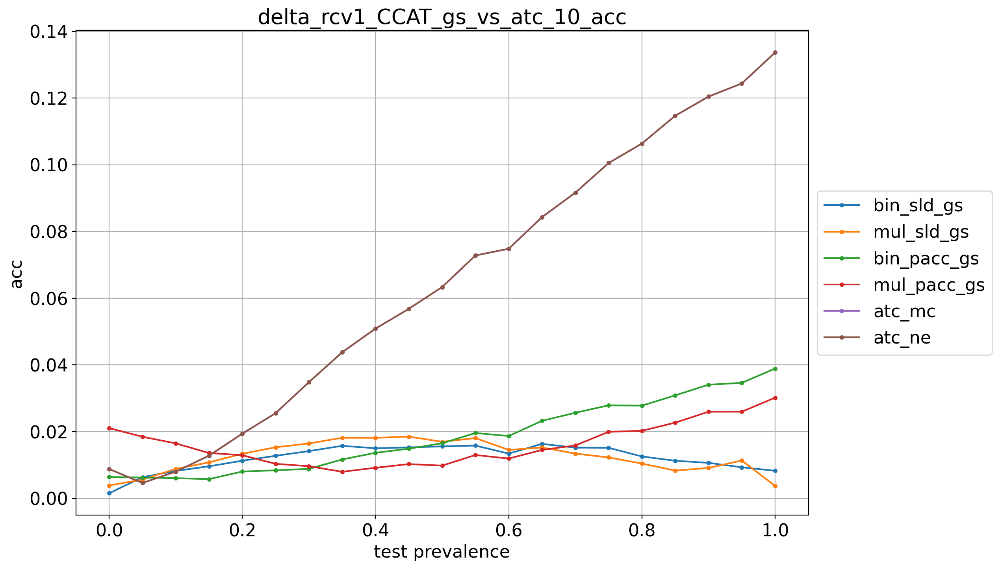
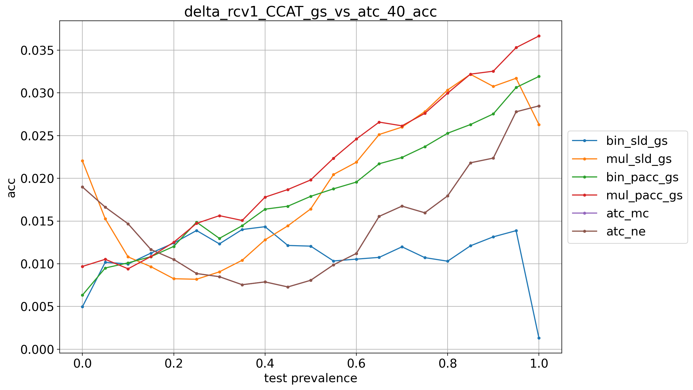
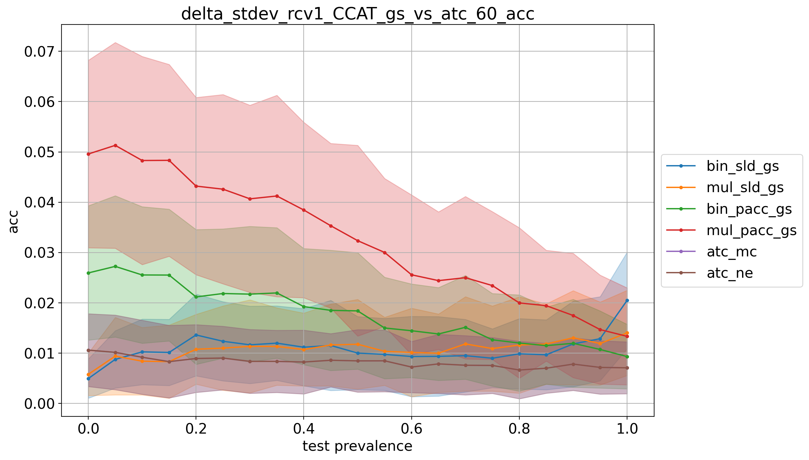

# rcv1_CCAT_9prevs

## 10% positives
> train: [0.90003338 0.09996662]  
> validation: [0.90003338 0.09996662]  
> bin_sld: 426.003s  
> mul_sld: 199.118s  
> bin_sld_gs: 1070.285s  
> mul_sld_gs: 686.591s  
> bin_pacc: 409.897s  
> mul_pacc: 169.591s  
> binmc_pacc: 412.906s  
> mulmc_pacc: 173.043s  
> binne_pacc: 411.128s  
> mulne_pacc: 146.658s  
> bin_pacc_gs: 710.525s  
> mul_pacc_gs: 245.764s  
> bin_cc: 389.472s  
> mul_cc: 148.220s  
> kfcv: 130.095s  
> ref: 120.267s  
> atc_mc: 125.236s  
> atc_ne: 121.957s  
> doc_feat: 83.796s  
> tot: 1073.769s  

<table border="1" class="dataframe">
  <thead>
    <tr style="text-align: right;">
      <th></th>
      <th>bin_sld_gs</th>
      <th>mul_sld_gs</th>
      <th>bin_pacc_gs</th>
      <th>mul_pacc_gs</th>
      <th>atc_mc</th>
      <th>atc_ne</th>
    </tr>
  </thead>
  <tbody>
    <tr>
      <th>0.0</th>
      <td>0.0016</td>
      <td>0.0039</td>
      <td>0.0064</td>
      <td>0.0211</td>
      <td>0.0088</td>
      <td>0.0088</td>
    </tr>
    <tr>
      <th>0.05</th>
      <td>0.0064</td>
      <td>0.0056</td>
      <td>0.0063</td>
      <td>0.0185</td>
      <td>0.0046</td>
      <td>0.0046</td>
    </tr>
    <tr>
      <th>0.1</th>
      <td>0.0082</td>
      <td>0.0088</td>
      <td>0.0061</td>
      <td>0.0165</td>
      <td>0.0080</td>
      <td>0.0080</td>
    </tr>
    <tr>
      <th>0.15</th>
      <td>0.0096</td>
      <td>0.0108</td>
      <td>0.0058</td>
      <td>0.0136</td>
      <td>0.0128</td>
      <td>0.0128</td>
    </tr>
    <tr>
      <th>0.2</th>
      <td>0.0113</td>
      <td>0.0134</td>
      <td>0.0081</td>
      <td>0.0129</td>
      <td>0.0194</td>
      <td>0.0194</td>
    </tr>
    <tr>
      <th>0.25</th>
      <td>0.0128</td>
      <td>0.0153</td>
      <td>0.0084</td>
      <td>0.0104</td>
      <td>0.0256</td>
      <td>0.0256</td>
    </tr>
    <tr>
      <th>0.3</th>
      <td>0.0142</td>
      <td>0.0165</td>
      <td>0.0089</td>
      <td>0.0097</td>
      <td>0.0348</td>
      <td>0.0348</td>
    </tr>
    <tr>
      <th>0.35</th>
      <td>0.0158</td>
      <td>0.0182</td>
      <td>0.0117</td>
      <td>0.0080</td>
      <td>0.0438</td>
      <td>0.0438</td>
    </tr>
    <tr>
      <th>0.4</th>
      <td>0.0150</td>
      <td>0.0182</td>
      <td>0.0137</td>
      <td>0.0092</td>
      <td>0.0509</td>
      <td>0.0509</td>
    </tr>
    <tr>
      <th>0.45</th>
      <td>0.0153</td>
      <td>0.0185</td>
      <td>0.0149</td>
      <td>0.0103</td>
      <td>0.0568</td>
      <td>0.0568</td>
    </tr>
    <tr>
      <th>0.5</th>
      <td>0.0156</td>
      <td>0.0170</td>
      <td>0.0165</td>
      <td>0.0098</td>
      <td>0.0633</td>
      <td>0.0633</td>
    </tr>
    <tr>
      <th>0.55</th>
      <td>0.0158</td>
      <td>0.0181</td>
      <td>0.0196</td>
      <td>0.0130</td>
      <td>0.0728</td>
      <td>0.0728</td>
    </tr>
    <tr>
      <th>0.6</th>
      <td>0.0134</td>
      <td>0.0145</td>
      <td>0.0187</td>
      <td>0.0119</td>
      <td>0.0748</td>
      <td>0.0748</td>
    </tr>
    <tr>
      <th>0.65</th>
      <td>0.0163</td>
      <td>0.0153</td>
      <td>0.0233</td>
      <td>0.0145</td>
      <td>0.0843</td>
      <td>0.0843</td>
    </tr>
    <tr>
      <th>0.7</th>
      <td>0.0152</td>
      <td>0.0134</td>
      <td>0.0257</td>
      <td>0.0159</td>
      <td>0.0916</td>
      <td>0.0916</td>
    </tr>
    <tr>
      <th>0.75</th>
      <td>0.0152</td>
      <td>0.0123</td>
      <td>0.0279</td>
      <td>0.0200</td>
      <td>0.1005</td>
      <td>0.1005</td>
    </tr>
    <tr>
      <th>0.8</th>
      <td>0.0126</td>
      <td>0.0104</td>
      <td>0.0278</td>
      <td>0.0203</td>
      <td>0.1064</td>
      <td>0.1064</td>
    </tr>
    <tr>
      <th>0.85</th>
      <td>0.0113</td>
      <td>0.0083</td>
      <td>0.0309</td>
      <td>0.0227</td>
      <td>0.1147</td>
      <td>0.1147</td>
    </tr>
    <tr>
      <th>0.9</th>
      <td>0.0107</td>
      <td>0.0091</td>
      <td>0.0341</td>
      <td>0.0260</td>
      <td>0.1204</td>
      <td>0.1204</td>
    </tr>
    <tr>
      <th>0.95</th>
      <td>0.0093</td>
      <td>0.0114</td>
      <td>0.0346</td>
      <td>0.0260</td>
      <td>0.1244</td>
      <td>0.1244</td>
    </tr>
    <tr>
      <th>1.0</th>
      <td>0.0083</td>
      <td>0.0038</td>
      <td>0.0389</td>
      <td>0.0302</td>
      <td>0.1336</td>
      <td>0.1336</td>
    </tr>
    <tr>
      <th>avg</th>
      <td>0.0121</td>
      <td>0.0125</td>
      <td>0.0185</td>
      <td>0.0162</td>
      <td>0.0644</td>
      <td>0.0644</td>
    </tr>
  </tbody>
</table>

## 20% positives
> train: [0.79989987 0.20010013]  
> validation: [0.80006676 0.19993324]  
> bin_sld: 422.895s  
> mul_sld: 162.786s  
> bin_sld_gs: 1128.064s  
> mul_sld_gs: 683.619s  
> bin_sld_gsq: 524.432s  
> bin_pacc: 410.462s  
> mul_pacc: 155.872s  
> binmc_pacc: 407.039s  
> mulmc_pacc: 173.902s  
> binne_pacc: 410.358s  
> mulne_pacc: 167.292s  
> bin_pacc_gs: 732.626s  
> mul_pacc_gs: 261.935s  
> bin_cc: 396.948s  
> mul_cc: 147.743s  
> kfcv: 132.118s  
> ref: 106.145s  
> atc_mc: 127.911s  
> atc_ne: 121.613s  
> doc_feat: 80.220s  
> tot: 1132.799s  

<table border="1" class="dataframe">
  <thead>
    <tr style="text-align: right;">
      <th></th>
      <th>bin_sld_gs</th>
      <th>mul_sld_gs</th>
      <th>bin_pacc_gs</th>
      <th>mul_pacc_gs</th>
      <th>atc_mc</th>
      <th>atc_ne</th>
    </tr>
  </thead>
  <tbody>
    <tr>
      <th>0.0</th>
      <td>0.0080</td>
      <td>0.0124</td>
      <td>0.0226</td>
      <td>0.0146</td>
      <td>0.0097</td>
      <td>0.0097</td>
    </tr>
    <tr>
      <th>0.05</th>
      <td>0.0096</td>
      <td>0.0108</td>
      <td>0.0206</td>
      <td>0.0126</td>
      <td>0.0071</td>
      <td>0.0071</td>
    </tr>
    <tr>
      <th>0.1</th>
      <td>0.0114</td>
      <td>0.0101</td>
      <td>0.0196</td>
      <td>0.0120</td>
      <td>0.0062</td>
      <td>0.0062</td>
    </tr>
    <tr>
      <th>0.15</th>
      <td>0.0114</td>
      <td>0.0085</td>
      <td>0.0169</td>
      <td>0.0106</td>
      <td>0.0064</td>
      <td>0.0064</td>
    </tr>
    <tr>
      <th>0.2</th>
      <td>0.0124</td>
      <td>0.0084</td>
      <td>0.0154</td>
      <td>0.0106</td>
      <td>0.0088</td>
      <td>0.0088</td>
    </tr>
    <tr>
      <th>0.25</th>
      <td>0.0124</td>
      <td>0.0086</td>
      <td>0.0128</td>
      <td>0.0095</td>
      <td>0.0093</td>
      <td>0.0093</td>
    </tr>
    <tr>
      <th>0.3</th>
      <td>0.0139</td>
      <td>0.0080</td>
      <td>0.0135</td>
      <td>0.0097</td>
      <td>0.0124</td>
      <td>0.0124</td>
    </tr>
    <tr>
      <th>0.35</th>
      <td>0.0130</td>
      <td>0.0082</td>
      <td>0.0126</td>
      <td>0.0085</td>
      <td>0.0161</td>
      <td>0.0161</td>
    </tr>
    <tr>
      <th>0.4</th>
      <td>0.0127</td>
      <td>0.0095</td>
      <td>0.0098</td>
      <td>0.0096</td>
      <td>0.0190</td>
      <td>0.0190</td>
    </tr>
    <tr>
      <th>0.45</th>
      <td>0.0149</td>
      <td>0.0102</td>
      <td>0.0104</td>
      <td>0.0099</td>
      <td>0.0207</td>
      <td>0.0207</td>
    </tr>
    <tr>
      <th>0.5</th>
      <td>0.0156</td>
      <td>0.0103</td>
      <td>0.0091</td>
      <td>0.0102</td>
      <td>0.0222</td>
      <td>0.0222</td>
    </tr>
    <tr>
      <th>0.55</th>
      <td>0.0147</td>
      <td>0.0120</td>
      <td>0.0082</td>
      <td>0.0104</td>
      <td>0.0247</td>
      <td>0.0247</td>
    </tr>
    <tr>
      <th>0.6</th>
      <td>0.0152</td>
      <td>0.0117</td>
      <td>0.0085</td>
      <td>0.0118</td>
      <td>0.0272</td>
      <td>0.0272</td>
    </tr>
    <tr>
      <th>0.65</th>
      <td>0.0163</td>
      <td>0.0140</td>
      <td>0.0087</td>
      <td>0.0127</td>
      <td>0.0331</td>
      <td>0.0331</td>
    </tr>
    <tr>
      <th>0.7</th>
      <td>0.0158</td>
      <td>0.0151</td>
      <td>0.0073</td>
      <td>0.0122</td>
      <td>0.0384</td>
      <td>0.0384</td>
    </tr>
    <tr>
      <th>0.75</th>
      <td>0.0172</td>
      <td>0.0151</td>
      <td>0.0072</td>
      <td>0.0133</td>
      <td>0.0425</td>
      <td>0.0425</td>
    </tr>
    <tr>
      <th>0.8</th>
      <td>0.0173</td>
      <td>0.0133</td>
      <td>0.0066</td>
      <td>0.0128</td>
      <td>0.0407</td>
      <td>0.0407</td>
    </tr>
    <tr>
      <th>0.85</th>
      <td>0.0185</td>
      <td>0.0134</td>
      <td>0.0072</td>
      <td>0.0133</td>
      <td>0.0447</td>
      <td>0.0447</td>
    </tr>
    <tr>
      <th>0.9</th>
      <td>0.0199</td>
      <td>0.0131</td>
      <td>0.0077</td>
      <td>0.0148</td>
      <td>0.0493</td>
      <td>0.0493</td>
    </tr>
    <tr>
      <th>0.95</th>
      <td>0.0205</td>
      <td>0.0113</td>
      <td>0.0083</td>
      <td>0.0142</td>
      <td>0.0492</td>
      <td>0.0492</td>
    </tr>
    <tr>
      <th>1.0</th>
      <td>0.0223</td>
      <td>0.0077</td>
      <td>0.0091</td>
      <td>0.0168</td>
      <td>0.0571</td>
      <td>0.0571</td>
    </tr>
    <tr>
      <th>avg</th>
      <td>0.0149</td>
      <td>0.0110</td>
      <td>0.0115</td>
      <td>0.0119</td>
      <td>0.0259</td>
      <td>0.0259</td>
    </tr>
  </tbody>
</table>

## 30% positives
> train: [0.69993324 0.30006676]  
> validation: [0.70010013 0.29989987]  
> bin_sld: 421.459s  
> mul_sld: 146.321s  
> bin_sld_gs: 1159.421s  
> mul_sld_gs: 690.743s  
> bin_sld_gsq: 531.736s  
> bin_pacc: 423.881s  
> mul_pacc: 166.104s  
> binmc_pacc: 422.818s  
> mulmc_pacc: 164.572s  
> binne_pacc: 409.704s  
> mulne_pacc: 155.476s  
> bin_pacc_gs: 737.229s  
> mul_pacc_gs: 269.465s  
> bin_cc: 400.220s  
> mul_cc: 118.299s  
> kfcv: 131.612s  
> ref: 122.392s  
> atc_mc: 119.095s  
> atc_ne: 108.266s  
> doc_feat: 96.341s  
> tot: 1163.937s  

<table border="1" class="dataframe">
  <thead>
    <tr style="text-align: right;">
      <th></th>
      <th>bin_sld_gs</th>
      <th>mul_sld_gs</th>
      <th>bin_pacc_gs</th>
      <th>mul_pacc_gs</th>
      <th>atc_mc</th>
      <th>atc_ne</th>
    </tr>
  </thead>
  <tbody>
    <tr>
      <th>0.0</th>
      <td>0.0059</td>
      <td>0.0081</td>
      <td>0.0076</td>
      <td>0.0067</td>
      <td>0.0103</td>
      <td>0.0103</td>
    </tr>
    <tr>
      <th>0.05</th>
      <td>0.0083</td>
      <td>0.0082</td>
      <td>0.0094</td>
      <td>0.0105</td>
      <td>0.0072</td>
      <td>0.0072</td>
    </tr>
    <tr>
      <th>0.1</th>
      <td>0.0087</td>
      <td>0.0080</td>
      <td>0.0095</td>
      <td>0.0113</td>
      <td>0.0049</td>
      <td>0.0049</td>
    </tr>
    <tr>
      <th>0.15</th>
      <td>0.0097</td>
      <td>0.0091</td>
      <td>0.0095</td>
      <td>0.0131</td>
      <td>0.0060</td>
      <td>0.0060</td>
    </tr>
    <tr>
      <th>0.2</th>
      <td>0.0089</td>
      <td>0.0087</td>
      <td>0.0102</td>
      <td>0.0140</td>
      <td>0.0082</td>
      <td>0.0082</td>
    </tr>
    <tr>
      <th>0.25</th>
      <td>0.0094</td>
      <td>0.0111</td>
      <td>0.0106</td>
      <td>0.0153</td>
      <td>0.0101</td>
      <td>0.0101</td>
    </tr>
    <tr>
      <th>0.3</th>
      <td>0.0091</td>
      <td>0.0115</td>
      <td>0.0101</td>
      <td>0.0128</td>
      <td>0.0119</td>
      <td>0.0119</td>
    </tr>
    <tr>
      <th>0.35</th>
      <td>0.0104</td>
      <td>0.0117</td>
      <td>0.0116</td>
      <td>0.0135</td>
      <td>0.0160</td>
      <td>0.0160</td>
    </tr>
    <tr>
      <th>0.4</th>
      <td>0.0108</td>
      <td>0.0133</td>
      <td>0.0118</td>
      <td>0.0139</td>
      <td>0.0190</td>
      <td>0.0190</td>
    </tr>
    <tr>
      <th>0.45</th>
      <td>0.0097</td>
      <td>0.0138</td>
      <td>0.0109</td>
      <td>0.0117</td>
      <td>0.0222</td>
      <td>0.0222</td>
    </tr>
    <tr>
      <th>0.5</th>
      <td>0.0095</td>
      <td>0.0131</td>
      <td>0.0115</td>
      <td>0.0126</td>
      <td>0.0259</td>
      <td>0.0259</td>
    </tr>
    <tr>
      <th>0.55</th>
      <td>0.0089</td>
      <td>0.0146</td>
      <td>0.0111</td>
      <td>0.0145</td>
      <td>0.0297</td>
      <td>0.0297</td>
    </tr>
    <tr>
      <th>0.6</th>
      <td>0.0086</td>
      <td>0.0147</td>
      <td>0.0119</td>
      <td>0.0128</td>
      <td>0.0307</td>
      <td>0.0307</td>
    </tr>
    <tr>
      <th>0.65</th>
      <td>0.0090</td>
      <td>0.0154</td>
      <td>0.0121</td>
      <td>0.0140</td>
      <td>0.0368</td>
      <td>0.0368</td>
    </tr>
    <tr>
      <th>0.7</th>
      <td>0.0077</td>
      <td>0.0141</td>
      <td>0.0123</td>
      <td>0.0132</td>
      <td>0.0400</td>
      <td>0.0400</td>
    </tr>
    <tr>
      <th>0.75</th>
      <td>0.0085</td>
      <td>0.0132</td>
      <td>0.0105</td>
      <td>0.0136</td>
      <td>0.0427</td>
      <td>0.0427</td>
    </tr>
    <tr>
      <th>0.8</th>
      <td>0.0078</td>
      <td>0.0116</td>
      <td>0.0106</td>
      <td>0.0122</td>
      <td>0.0464</td>
      <td>0.0464</td>
    </tr>
    <tr>
      <th>0.85</th>
      <td>0.0071</td>
      <td>0.0129</td>
      <td>0.0115</td>
      <td>0.0152</td>
      <td>0.0517</td>
      <td>0.0517</td>
    </tr>
    <tr>
      <th>0.9</th>
      <td>0.0074</td>
      <td>0.0101</td>
      <td>0.0111</td>
      <td>0.0146</td>
      <td>0.0521</td>
      <td>0.0521</td>
    </tr>
    <tr>
      <th>0.95</th>
      <td>0.0072</td>
      <td>0.0099</td>
      <td>0.0136</td>
      <td>0.0180</td>
      <td>0.0548</td>
      <td>0.0548</td>
    </tr>
    <tr>
      <th>1.0</th>
      <td>0.0017</td>
      <td>0.0067</td>
      <td>0.0108</td>
      <td>0.0181</td>
      <td>0.0625</td>
      <td>0.0625</td>
    </tr>
    <tr>
      <th>avg</th>
      <td>0.0083</td>
      <td>0.0114</td>
      <td>0.0109</td>
      <td>0.0134</td>
      <td>0.0280</td>
      <td>0.0280</td>
    </tr>
  </tbody>
</table>

## 40% positives
> train: [0.59996662 0.40003338]  
> validation: [0.59996662 0.40003338]  
> bin_sld: 434.111s  
> mul_sld: 159.616s  
> bin_sld_gs: 1179.818s  
> mul_sld_gs: 695.793s  
> bin_sld_gsq: 546.801s  
> bin_pacc: 431.189s  
> mul_pacc: 143.236s  
> binmc_pacc: 422.668s  
> mulmc_pacc: 167.615s  
> binne_pacc: 427.798s  
> mulne_pacc: 166.144s  
> bin_pacc_gs: 739.438s  
> mul_pacc_gs: 261.609s  
> bin_cc: 402.646s  
> mul_cc: 152.045s  
> kfcv: 121.176s  
> ref: 127.991s  
> atc_mc: 129.960s  
> atc_ne: 115.970s  
> doc_feat: 79.386s  
> tot: 1183.412s  

<table border="1" class="dataframe">
  <thead>
    <tr style="text-align: right;">
      <th></th>
      <th>bin_sld_gs</th>
      <th>mul_sld_gs</th>
      <th>bin_pacc_gs</th>
      <th>mul_pacc_gs</th>
      <th>atc_mc</th>
      <th>atc_ne</th>
    </tr>
  </thead>
  <tbody>
    <tr>
      <th>0.0</th>
      <td>0.0050</td>
      <td>0.0220</td>
      <td>0.0063</td>
      <td>0.0097</td>
      <td>0.0190</td>
      <td>0.0190</td>
    </tr>
    <tr>
      <th>0.05</th>
      <td>0.0102</td>
      <td>0.0153</td>
      <td>0.0095</td>
      <td>0.0105</td>
      <td>0.0166</td>
      <td>0.0166</td>
    </tr>
    <tr>
      <th>0.1</th>
      <td>0.0100</td>
      <td>0.0108</td>
      <td>0.0101</td>
      <td>0.0094</td>
      <td>0.0147</td>
      <td>0.0147</td>
    </tr>
    <tr>
      <th>0.15</th>
      <td>0.0112</td>
      <td>0.0097</td>
      <td>0.0108</td>
      <td>0.0108</td>
      <td>0.0117</td>
      <td>0.0117</td>
    </tr>
    <tr>
      <th>0.2</th>
      <td>0.0124</td>
      <td>0.0083</td>
      <td>0.0120</td>
      <td>0.0125</td>
      <td>0.0105</td>
      <td>0.0105</td>
    </tr>
    <tr>
      <th>0.25</th>
      <td>0.0139</td>
      <td>0.0082</td>
      <td>0.0149</td>
      <td>0.0147</td>
      <td>0.0089</td>
      <td>0.0089</td>
    </tr>
    <tr>
      <th>0.3</th>
      <td>0.0123</td>
      <td>0.0091</td>
      <td>0.0130</td>
      <td>0.0156</td>
      <td>0.0085</td>
      <td>0.0085</td>
    </tr>
    <tr>
      <th>0.35</th>
      <td>0.0140</td>
      <td>0.0104</td>
      <td>0.0145</td>
      <td>0.0151</td>
      <td>0.0076</td>
      <td>0.0076</td>
    </tr>
    <tr>
      <th>0.4</th>
      <td>0.0143</td>
      <td>0.0128</td>
      <td>0.0164</td>
      <td>0.0178</td>
      <td>0.0079</td>
      <td>0.0079</td>
    </tr>
    <tr>
      <th>0.45</th>
      <td>0.0121</td>
      <td>0.0144</td>
      <td>0.0167</td>
      <td>0.0187</td>
      <td>0.0073</td>
      <td>0.0073</td>
    </tr>
    <tr>
      <th>0.5</th>
      <td>0.0121</td>
      <td>0.0164</td>
      <td>0.0179</td>
      <td>0.0198</td>
      <td>0.0081</td>
      <td>0.0081</td>
    </tr>
    <tr>
      <th>0.55</th>
      <td>0.0103</td>
      <td>0.0205</td>
      <td>0.0188</td>
      <td>0.0224</td>
      <td>0.0099</td>
      <td>0.0099</td>
    </tr>
    <tr>
      <th>0.6</th>
      <td>0.0105</td>
      <td>0.0219</td>
      <td>0.0196</td>
      <td>0.0246</td>
      <td>0.0112</td>
      <td>0.0112</td>
    </tr>
    <tr>
      <th>0.65</th>
      <td>0.0107</td>
      <td>0.0251</td>
      <td>0.0217</td>
      <td>0.0266</td>
      <td>0.0156</td>
      <td>0.0156</td>
    </tr>
    <tr>
      <th>0.7</th>
      <td>0.0120</td>
      <td>0.0260</td>
      <td>0.0224</td>
      <td>0.0261</td>
      <td>0.0168</td>
      <td>0.0168</td>
    </tr>
    <tr>
      <th>0.75</th>
      <td>0.0107</td>
      <td>0.0278</td>
      <td>0.0237</td>
      <td>0.0276</td>
      <td>0.0160</td>
      <td>0.0160</td>
    </tr>
    <tr>
      <th>0.8</th>
      <td>0.0103</td>
      <td>0.0303</td>
      <td>0.0253</td>
      <td>0.0300</td>
      <td>0.0180</td>
      <td>0.0180</td>
    </tr>
    <tr>
      <th>0.85</th>
      <td>0.0121</td>
      <td>0.0322</td>
      <td>0.0263</td>
      <td>0.0322</td>
      <td>0.0218</td>
      <td>0.0218</td>
    </tr>
    <tr>
      <th>0.9</th>
      <td>0.0132</td>
      <td>0.0308</td>
      <td>0.0275</td>
      <td>0.0325</td>
      <td>0.0224</td>
      <td>0.0224</td>
    </tr>
    <tr>
      <th>0.95</th>
      <td>0.0139</td>
      <td>0.0317</td>
      <td>0.0306</td>
      <td>0.0353</td>
      <td>0.0278</td>
      <td>0.0278</td>
    </tr>
    <tr>
      <th>1.0</th>
      <td>0.0013</td>
      <td>0.0263</td>
      <td>0.0319</td>
      <td>0.0367</td>
      <td>0.0285</td>
      <td>0.0285</td>
    </tr>
    <tr>
      <th>avg</th>
      <td>0.0111</td>
      <td>0.0195</td>
      <td>0.0186</td>
      <td>0.0214</td>
      <td>0.0147</td>
      <td>0.0147</td>
    </tr>
  </tbody>
</table>

## 50% positives
> train: [0.5 0.5]  
> validation: [0.5 0.5]  
> bin_sld: 441.783s  
> mul_sld: 169.393s  
> bin_sld_gs: 1166.420s  
> mul_sld_gs: 689.481s  
> bin_sld_gsq: 549.038s  
> bin_pacc: 427.369s  
> mul_pacc: 166.563s  
> binmc_pacc: 426.636s  
> mulmc_pacc: 176.801s  
> binne_pacc: 435.657s  
> mulne_pacc: 161.090s  
> bin_pacc_gs: 730.060s  
> mul_pacc_gs: 266.437s  
> bin_cc: 412.726s  
> mul_cc: 152.522s  
> kfcv: 134.253s  
> ref: 128.737s  
> atc_mc: 129.517s  
> atc_ne: 122.889s  
> doc_feat: 88.896s  
> tot: 1170.874s  

<table border="1" class="dataframe">
  <thead>
    <tr style="text-align: right;">
      <th></th>
      <th>bin_sld_gs</th>
      <th>mul_sld_gs</th>
      <th>bin_pacc_gs</th>
      <th>mul_pacc_gs</th>
      <th>atc_mc</th>
      <th>atc_ne</th>
    </tr>
  </thead>
  <tbody>
    <tr>
      <th>0.0</th>
      <td>0.0129</td>
      <td>0.0158</td>
      <td>0.0179</td>
      <td>0.0238</td>
      <td>0.0088</td>
      <td>0.0088</td>
    </tr>
    <tr>
      <th>0.05</th>
      <td>0.0156</td>
      <td>0.0159</td>
      <td>0.0182</td>
      <td>0.0241</td>
      <td>0.0080</td>
      <td>0.0080</td>
    </tr>
    <tr>
      <th>0.1</th>
      <td>0.0149</td>
      <td>0.0133</td>
      <td>0.0173</td>
      <td>0.0219</td>
      <td>0.0082</td>
      <td>0.0082</td>
    </tr>
    <tr>
      <th>0.15</th>
      <td>0.0145</td>
      <td>0.0140</td>
      <td>0.0159</td>
      <td>0.0205</td>
      <td>0.0077</td>
      <td>0.0077</td>
    </tr>
    <tr>
      <th>0.2</th>
      <td>0.0137</td>
      <td>0.0116</td>
      <td>0.0143</td>
      <td>0.0174</td>
      <td>0.0083</td>
      <td>0.0083</td>
    </tr>
    <tr>
      <th>0.25</th>
      <td>0.0130</td>
      <td>0.0110</td>
      <td>0.0131</td>
      <td>0.0171</td>
      <td>0.0066</td>
      <td>0.0066</td>
    </tr>
    <tr>
      <th>0.3</th>
      <td>0.0150</td>
      <td>0.0127</td>
      <td>0.0133</td>
      <td>0.0172</td>
      <td>0.0082</td>
      <td>0.0082</td>
    </tr>
    <tr>
      <th>0.35</th>
      <td>0.0161</td>
      <td>0.0132</td>
      <td>0.0139</td>
      <td>0.0193</td>
      <td>0.0103</td>
      <td>0.0103</td>
    </tr>
    <tr>
      <th>0.4</th>
      <td>0.0151</td>
      <td>0.0125</td>
      <td>0.0139</td>
      <td>0.0164</td>
      <td>0.0085</td>
      <td>0.0085</td>
    </tr>
    <tr>
      <th>0.45</th>
      <td>0.0144</td>
      <td>0.0121</td>
      <td>0.0129</td>
      <td>0.0151</td>
      <td>0.0110</td>
      <td>0.0110</td>
    </tr>
    <tr>
      <th>0.5</th>
      <td>0.0137</td>
      <td>0.0116</td>
      <td>0.0119</td>
      <td>0.0142</td>
      <td>0.0122</td>
      <td>0.0122</td>
    </tr>
    <tr>
      <th>0.55</th>
      <td>0.0117</td>
      <td>0.0096</td>
      <td>0.0101</td>
      <td>0.0121</td>
      <td>0.0125</td>
      <td>0.0125</td>
    </tr>
    <tr>
      <th>0.6</th>
      <td>0.0126</td>
      <td>0.0097</td>
      <td>0.0103</td>
      <td>0.0116</td>
      <td>0.0144</td>
      <td>0.0144</td>
    </tr>
    <tr>
      <th>0.65</th>
      <td>0.0132</td>
      <td>0.0117</td>
      <td>0.0127</td>
      <td>0.0124</td>
      <td>0.0168</td>
      <td>0.0168</td>
    </tr>
    <tr>
      <th>0.7</th>
      <td>0.0145</td>
      <td>0.0120</td>
      <td>0.0139</td>
      <td>0.0140</td>
      <td>0.0164</td>
      <td>0.0164</td>
    </tr>
    <tr>
      <th>0.75</th>
      <td>0.0137</td>
      <td>0.0113</td>
      <td>0.0128</td>
      <td>0.0136</td>
      <td>0.0170</td>
      <td>0.0170</td>
    </tr>
    <tr>
      <th>0.8</th>
      <td>0.0130</td>
      <td>0.0105</td>
      <td>0.0132</td>
      <td>0.0128</td>
      <td>0.0211</td>
      <td>0.0211</td>
    </tr>
    <tr>
      <th>0.85</th>
      <td>0.0115</td>
      <td>0.0090</td>
      <td>0.0117</td>
      <td>0.0121</td>
      <td>0.0205</td>
      <td>0.0205</td>
    </tr>
    <tr>
      <th>0.9</th>
      <td>0.0121</td>
      <td>0.0107</td>
      <td>0.0150</td>
      <td>0.0132</td>
      <td>0.0239</td>
      <td>0.0239</td>
    </tr>
    <tr>
      <th>0.95</th>
      <td>0.0104</td>
      <td>0.0092</td>
      <td>0.0150</td>
      <td>0.0141</td>
      <td>0.0253</td>
      <td>0.0253</td>
    </tr>
    <tr>
      <th>1.0</th>
      <td>0.0096</td>
      <td>0.0085</td>
      <td>0.0150</td>
      <td>0.0119</td>
      <td>0.0289</td>
      <td>0.0289</td>
    </tr>
    <tr>
      <th>avg</th>
      <td>0.0134</td>
      <td>0.0117</td>
      <td>0.0139</td>
      <td>0.0159</td>
      <td>0.0140</td>
      <td>0.0140</td>
    </tr>
  </tbody>
</table>

## 60% positives
> train: [0.40003338 0.59996662]  
> validation: [0.40003338 0.59996662]  
> bin_sld: 426.378s  
> mul_sld: 153.126s  
> bin_sld_gs: 1140.607s  
> mul_sld_gs: 673.397s  
> bin_sld_gsq: 528.696s  
> bin_pacc: 420.283s  
> mul_pacc: 148.016s  
> binmc_pacc: 405.920s  
> mulmc_pacc: 167.711s  
> binne_pacc: 417.205s  
> mulne_pacc: 145.013s  
> bin_pacc_gs: 730.537s  
> mul_pacc_gs: 261.004s  
> bin_cc: 394.352s  
> mul_cc: 143.652s  
> kfcv: 122.227s  
> ref: 122.352s  
> atc_mc: 120.259s  
> atc_ne: 113.567s  
> doc_feat: 80.306s  
> tot: 1146.639s  

<table border="1" class="dataframe">
  <thead>
    <tr style="text-align: right;">
      <th></th>
      <th>bin_sld_gs</th>
      <th>mul_sld_gs</th>
      <th>bin_pacc_gs</th>
      <th>mul_pacc_gs</th>
      <th>atc_mc</th>
      <th>atc_ne</th>
    </tr>
  </thead>
  <tbody>
    <tr>
      <th>0.0</th>
      <td>0.0049</td>
      <td>0.0058</td>
      <td>0.0259</td>
      <td>0.0496</td>
      <td>0.0106</td>
      <td>0.0106</td>
    </tr>
    <tr>
      <th>0.05</th>
      <td>0.0087</td>
      <td>0.0094</td>
      <td>0.0272</td>
      <td>0.0513</td>
      <td>0.0101</td>
      <td>0.0101</td>
    </tr>
    <tr>
      <th>0.1</th>
      <td>0.0102</td>
      <td>0.0084</td>
      <td>0.0255</td>
      <td>0.0483</td>
      <td>0.0092</td>
      <td>0.0092</td>
    </tr>
    <tr>
      <th>0.15</th>
      <td>0.0101</td>
      <td>0.0083</td>
      <td>0.0255</td>
      <td>0.0483</td>
      <td>0.0083</td>
      <td>0.0083</td>
    </tr>
    <tr>
      <th>0.2</th>
      <td>0.0136</td>
      <td>0.0108</td>
      <td>0.0212</td>
      <td>0.0432</td>
      <td>0.0089</td>
      <td>0.0089</td>
    </tr>
    <tr>
      <th>0.25</th>
      <td>0.0123</td>
      <td>0.0110</td>
      <td>0.0218</td>
      <td>0.0426</td>
      <td>0.0090</td>
      <td>0.0090</td>
    </tr>
    <tr>
      <th>0.3</th>
      <td>0.0116</td>
      <td>0.0113</td>
      <td>0.0217</td>
      <td>0.0407</td>
      <td>0.0084</td>
      <td>0.0084</td>
    </tr>
    <tr>
      <th>0.35</th>
      <td>0.0120</td>
      <td>0.0113</td>
      <td>0.0220</td>
      <td>0.0412</td>
      <td>0.0084</td>
      <td>0.0084</td>
    </tr>
    <tr>
      <th>0.4</th>
      <td>0.0112</td>
      <td>0.0107</td>
      <td>0.0192</td>
      <td>0.0384</td>
      <td>0.0082</td>
      <td>0.0082</td>
    </tr>
    <tr>
      <th>0.45</th>
      <td>0.0115</td>
      <td>0.0116</td>
      <td>0.0185</td>
      <td>0.0353</td>
      <td>0.0086</td>
      <td>0.0086</td>
    </tr>
    <tr>
      <th>0.5</th>
      <td>0.0100</td>
      <td>0.0118</td>
      <td>0.0184</td>
      <td>0.0324</td>
      <td>0.0085</td>
      <td>0.0085</td>
    </tr>
    <tr>
      <th>0.55</th>
      <td>0.0097</td>
      <td>0.0103</td>
      <td>0.0150</td>
      <td>0.0300</td>
      <td>0.0085</td>
      <td>0.0085</td>
    </tr>
    <tr>
      <th>0.6</th>
      <td>0.0093</td>
      <td>0.0101</td>
      <td>0.0144</td>
      <td>0.0256</td>
      <td>0.0072</td>
      <td>0.0072</td>
    </tr>
    <tr>
      <th>0.65</th>
      <td>0.0093</td>
      <td>0.0100</td>
      <td>0.0138</td>
      <td>0.0244</td>
      <td>0.0079</td>
      <td>0.0079</td>
    </tr>
    <tr>
      <th>0.7</th>
      <td>0.0095</td>
      <td>0.0118</td>
      <td>0.0151</td>
      <td>0.0250</td>
      <td>0.0076</td>
      <td>0.0076</td>
    </tr>
    <tr>
      <th>0.75</th>
      <td>0.0090</td>
      <td>0.0109</td>
      <td>0.0126</td>
      <td>0.0234</td>
      <td>0.0075</td>
      <td>0.0075</td>
    </tr>
    <tr>
      <th>0.8</th>
      <td>0.0099</td>
      <td>0.0116</td>
      <td>0.0120</td>
      <td>0.0200</td>
      <td>0.0066</td>
      <td>0.0066</td>
    </tr>
    <tr>
      <th>0.85</th>
      <td>0.0097</td>
      <td>0.0118</td>
      <td>0.0115</td>
      <td>0.0194</td>
      <td>0.0070</td>
      <td>0.0070</td>
    </tr>
    <tr>
      <th>0.9</th>
      <td>0.0118</td>
      <td>0.0130</td>
      <td>0.0119</td>
      <td>0.0175</td>
      <td>0.0078</td>
      <td>0.0078</td>
    </tr>
    <tr>
      <th>0.95</th>
      <td>0.0129</td>
      <td>0.0119</td>
      <td>0.0107</td>
      <td>0.0147</td>
      <td>0.0071</td>
      <td>0.0071</td>
    </tr>
    <tr>
      <th>1.0</th>
      <td>0.0205</td>
      <td>0.0140</td>
      <td>0.0093</td>
      <td>0.0133</td>
      <td>0.0071</td>
      <td>0.0071</td>
    </tr>
    <tr>
      <th>avg</th>
      <td>0.0108</td>
      <td>0.0108</td>
      <td>0.0178</td>
      <td>0.0326</td>
      <td>0.0082</td>
      <td>0.0082</td>
    </tr>
  </tbody>
</table>

## 70% positives
> train: [0.29989987 0.70010013]  
> validation: [0.30006676 0.69993324]  
> bin_sld: 417.731s  
> mul_sld: 155.451s  
> bin_sld_gs: 1141.720s  
> mul_sld_gs: 680.203s  
> bin_sld_gsq: 527.251s  
> bin_pacc: 413.591s  
> mul_pacc: 130.941s  
> binmc_pacc: 410.011s  
> mulmc_pacc: 160.422s  
> binne_pacc: 411.824s  
> mulne_pacc: 150.120s  
> bin_pacc_gs: 731.866s  
> mul_pacc_gs: 262.250s  
> bin_cc: 396.501s  
> mul_cc: 145.444s  
> kfcv: 127.528s  
> ref: 121.369s  
> atc_mc: 106.641s  
> atc_ne: 101.076s  
> doc_feat: 86.241s  
> tot: 1146.268s  

<table border="1" class="dataframe">
  <thead>
    <tr style="text-align: right;">
      <th></th>
      <th>bin_sld_gs</th>
      <th>mul_sld_gs</th>
      <th>bin_pacc_gs</th>
      <th>mul_pacc_gs</th>
      <th>atc_mc</th>
      <th>atc_ne</th>
    </tr>
  </thead>
  <tbody>
    <tr>
      <th>0.0</th>
      <td>0.0654</td>
      <td>0.0381</td>
      <td>0.0869</td>
      <td>0.0476</td>
      <td>0.0238</td>
      <td>0.0238</td>
    </tr>
    <tr>
      <th>0.05</th>
      <td>0.0719</td>
      <td>0.0364</td>
      <td>0.1059</td>
      <td>0.0537</td>
      <td>0.0222</td>
      <td>0.0222</td>
    </tr>
    <tr>
      <th>0.1</th>
      <td>0.0657</td>
      <td>0.0332</td>
      <td>0.0961</td>
      <td>0.0493</td>
      <td>0.0216</td>
      <td>0.0216</td>
    </tr>
    <tr>
      <th>0.15</th>
      <td>0.0639</td>
      <td>0.0332</td>
      <td>0.0916</td>
      <td>0.0484</td>
      <td>0.0197</td>
      <td>0.0197</td>
    </tr>
    <tr>
      <th>0.2</th>
      <td>0.0589</td>
      <td>0.0295</td>
      <td>0.0835</td>
      <td>0.0433</td>
      <td>0.0206</td>
      <td>0.0206</td>
    </tr>
    <tr>
      <th>0.25</th>
      <td>0.0564</td>
      <td>0.0315</td>
      <td>0.0814</td>
      <td>0.0445</td>
      <td>0.0160</td>
      <td>0.0160</td>
    </tr>
    <tr>
      <th>0.3</th>
      <td>0.0528</td>
      <td>0.0306</td>
      <td>0.0760</td>
      <td>0.0422</td>
      <td>0.0160</td>
      <td>0.0160</td>
    </tr>
    <tr>
      <th>0.35</th>
      <td>0.0503</td>
      <td>0.0293</td>
      <td>0.0707</td>
      <td>0.0407</td>
      <td>0.0149</td>
      <td>0.0149</td>
    </tr>
    <tr>
      <th>0.4</th>
      <td>0.0496</td>
      <td>0.0316</td>
      <td>0.0677</td>
      <td>0.0400</td>
      <td>0.0122</td>
      <td>0.0122</td>
    </tr>
    <tr>
      <th>0.45</th>
      <td>0.0453</td>
      <td>0.0306</td>
      <td>0.0592</td>
      <td>0.0369</td>
      <td>0.0123</td>
      <td>0.0123</td>
    </tr>
    <tr>
      <th>0.5</th>
      <td>0.0394</td>
      <td>0.0289</td>
      <td>0.0507</td>
      <td>0.0325</td>
      <td>0.0111</td>
      <td>0.0111</td>
    </tr>
    <tr>
      <th>0.55</th>
      <td>0.0388</td>
      <td>0.0294</td>
      <td>0.0491</td>
      <td>0.0320</td>
      <td>0.0102</td>
      <td>0.0102</td>
    </tr>
    <tr>
      <th>0.6</th>
      <td>0.0329</td>
      <td>0.0259</td>
      <td>0.0379</td>
      <td>0.0263</td>
      <td>0.0096</td>
      <td>0.0096</td>
    </tr>
    <tr>
      <th>0.65</th>
      <td>0.0313</td>
      <td>0.0273</td>
      <td>0.0362</td>
      <td>0.0273</td>
      <td>0.0100</td>
      <td>0.0100</td>
    </tr>
    <tr>
      <th>0.7</th>
      <td>0.0289</td>
      <td>0.0271</td>
      <td>0.0302</td>
      <td>0.0250</td>
      <td>0.0080</td>
      <td>0.0080</td>
    </tr>
    <tr>
      <th>0.75</th>
      <td>0.0266</td>
      <td>0.0263</td>
      <td>0.0252</td>
      <td>0.0228</td>
      <td>0.0070</td>
      <td>0.0070</td>
    </tr>
    <tr>
      <th>0.8</th>
      <td>0.0239</td>
      <td>0.0258</td>
      <td>0.0208</td>
      <td>0.0211</td>
      <td>0.0071</td>
      <td>0.0071</td>
    </tr>
    <tr>
      <th>0.85</th>
      <td>0.0224</td>
      <td>0.0250</td>
      <td>0.0180</td>
      <td>0.0198</td>
      <td>0.0076</td>
      <td>0.0076</td>
    </tr>
    <tr>
      <th>0.9</th>
      <td>0.0176</td>
      <td>0.0236</td>
      <td>0.0135</td>
      <td>0.0171</td>
      <td>0.0062</td>
      <td>0.0062</td>
    </tr>
    <tr>
      <th>0.95</th>
      <td>0.0148</td>
      <td>0.0220</td>
      <td>0.0097</td>
      <td>0.0134</td>
      <td>0.0063</td>
      <td>0.0063</td>
    </tr>
    <tr>
      <th>1.0</th>
      <td>0.0118</td>
      <td>0.0214</td>
      <td>0.0037</td>
      <td>0.0140</td>
      <td>0.0059</td>
      <td>0.0059</td>
    </tr>
    <tr>
      <th>avg</th>
      <td>0.0414</td>
      <td>0.0289</td>
      <td>0.0531</td>
      <td>0.0332</td>
      <td>0.0128</td>
      <td>0.0128</td>
    </tr>
  </tbody>
</table>

## 80% positives
> train: [0.19993324 0.80006676]  
> validation: [0.20010013 0.79989987]  
> bin_sld: 437.768s  
> mul_sld: 162.581s  
> bin_sld_gs: 1142.333s  
> mul_sld_gs: 680.247s  
> bin_sld_gsq: 532.404s  
> bin_pacc: 414.897s  
> mul_pacc: 158.907s  
> binmc_pacc: 406.361s  
> mulmc_pacc: 141.227s  
> binne_pacc: 414.412s  
> mulne_pacc: 158.498s  
> bin_pacc_gs: 720.921s  
> mul_pacc_gs: 272.540s  
> bin_cc: 395.525s  
> mul_cc: 139.596s  
> kfcv: 123.479s  
> ref: 124.418s  
> atc_mc: 126.354s  
> atc_ne: 101.451s  
> doc_feat: 111.799s  
> tot: 1146.771s  

<table border="1" class="dataframe">
  <thead>
    <tr style="text-align: right;">
      <th></th>
      <th>bin_sld_gs</th>
      <th>mul_sld_gs</th>
      <th>bin_pacc_gs</th>
      <th>mul_pacc_gs</th>
      <th>atc_mc</th>
      <th>atc_ne</th>
    </tr>
  </thead>
  <tbody>
    <tr>
      <th>0.0</th>
      <td>0.0053</td>
      <td>0.0103</td>
      <td>0.0740</td>
      <td>0.0837</td>
      <td>0.0311</td>
      <td>0.0311</td>
    </tr>
    <tr>
      <th>0.05</th>
      <td>0.0241</td>
      <td>0.0129</td>
      <td>0.0857</td>
      <td>0.0931</td>
      <td>0.0274</td>
      <td>0.0274</td>
    </tr>
    <tr>
      <th>0.1</th>
      <td>0.0227</td>
      <td>0.0127</td>
      <td>0.0787</td>
      <td>0.0848</td>
      <td>0.0267</td>
      <td>0.0267</td>
    </tr>
    <tr>
      <th>0.15</th>
      <td>0.0232</td>
      <td>0.0114</td>
      <td>0.0749</td>
      <td>0.0816</td>
      <td>0.0227</td>
      <td>0.0227</td>
    </tr>
    <tr>
      <th>0.2</th>
      <td>0.0186</td>
      <td>0.0096</td>
      <td>0.0675</td>
      <td>0.0747</td>
      <td>0.0214</td>
      <td>0.0214</td>
    </tr>
    <tr>
      <th>0.25</th>
      <td>0.0203</td>
      <td>0.0110</td>
      <td>0.0682</td>
      <td>0.0748</td>
      <td>0.0201</td>
      <td>0.0201</td>
    </tr>
    <tr>
      <th>0.3</th>
      <td>0.0240</td>
      <td>0.0116</td>
      <td>0.0650</td>
      <td>0.0716</td>
      <td>0.0178</td>
      <td>0.0178</td>
    </tr>
    <tr>
      <th>0.35</th>
      <td>0.0202</td>
      <td>0.0117</td>
      <td>0.0580</td>
      <td>0.0648</td>
      <td>0.0196</td>
      <td>0.0196</td>
    </tr>
    <tr>
      <th>0.4</th>
      <td>0.0210</td>
      <td>0.0106</td>
      <td>0.0562</td>
      <td>0.0631</td>
      <td>0.0168</td>
      <td>0.0168</td>
    </tr>
    <tr>
      <th>0.45</th>
      <td>0.0203</td>
      <td>0.0094</td>
      <td>0.0504</td>
      <td>0.0572</td>
      <td>0.0147</td>
      <td>0.0147</td>
    </tr>
    <tr>
      <th>0.5</th>
      <td>0.0165</td>
      <td>0.0093</td>
      <td>0.0457</td>
      <td>0.0517</td>
      <td>0.0136</td>
      <td>0.0136</td>
    </tr>
    <tr>
      <th>0.55</th>
      <td>0.0195</td>
      <td>0.0104</td>
      <td>0.0468</td>
      <td>0.0518</td>
      <td>0.0111</td>
      <td>0.0111</td>
    </tr>
    <tr>
      <th>0.6</th>
      <td>0.0125</td>
      <td>0.0094</td>
      <td>0.0350</td>
      <td>0.0414</td>
      <td>0.0110</td>
      <td>0.0110</td>
    </tr>
    <tr>
      <th>0.65</th>
      <td>0.0171</td>
      <td>0.0094</td>
      <td>0.0361</td>
      <td>0.0415</td>
      <td>0.0097</td>
      <td>0.0097</td>
    </tr>
    <tr>
      <th>0.7</th>
      <td>0.0144</td>
      <td>0.0104</td>
      <td>0.0307</td>
      <td>0.0363</td>
      <td>0.0106</td>
      <td>0.0106</td>
    </tr>
    <tr>
      <th>0.75</th>
      <td>0.0152</td>
      <td>0.0100</td>
      <td>0.0239</td>
      <td>0.0294</td>
      <td>0.0091</td>
      <td>0.0091</td>
    </tr>
    <tr>
      <th>0.8</th>
      <td>0.0201</td>
      <td>0.0102</td>
      <td>0.0234</td>
      <td>0.0284</td>
      <td>0.0100</td>
      <td>0.0100</td>
    </tr>
    <tr>
      <th>0.85</th>
      <td>0.0198</td>
      <td>0.0105</td>
      <td>0.0194</td>
      <td>0.0234</td>
      <td>0.0104</td>
      <td>0.0104</td>
    </tr>
    <tr>
      <th>0.9</th>
      <td>0.0202</td>
      <td>0.0106</td>
      <td>0.0149</td>
      <td>0.0192</td>
      <td>0.0108</td>
      <td>0.0108</td>
    </tr>
    <tr>
      <th>0.95</th>
      <td>0.0150</td>
      <td>0.0109</td>
      <td>0.0111</td>
      <td>0.0137</td>
      <td>0.0130</td>
      <td>0.0130</td>
    </tr>
    <tr>
      <th>1.0</th>
      <td>0.0042</td>
      <td>0.0152</td>
      <td>0.0076</td>
      <td>0.0131</td>
      <td>0.0147</td>
      <td>0.0147</td>
    </tr>
    <tr>
      <th>avg</th>
      <td>0.0178</td>
      <td>0.0108</td>
      <td>0.0463</td>
      <td>0.0524</td>
      <td>0.0163</td>
      <td>0.0163</td>
    </tr>
  </tbody>
</table>

## 90% positives
> train: [0.09996662 0.90003338]  
> validation: [0.09996662 0.90003338]  
> bin_sld: 423.737s  
> mul_sld: 177.588s  
> bin_sld_gs: 1108.736s  
> mul_sld_gs: 666.006s  
> bin_sld_gsq: 518.900s  
> bin_pacc: 406.760s  
> mul_pacc: 133.174s  
> binmc_pacc: 401.789s  
> mulmc_pacc: 147.520s  
> binne_pacc: 400.414s  
> mulne_pacc: 148.167s  
> bin_pacc_gs: 722.523s  
> mul_pacc_gs: 252.340s  
> bin_cc: 378.760s  
> mul_cc: 126.045s  
> kfcv: 109.535s  
> ref: 87.159s  
> atc_mc: 99.104s  
> atc_ne: 101.467s  
> doc_feat: 83.819s  
> tot: 1113.236s  

<table border="1" class="dataframe">
  <thead>
    <tr style="text-align: right;">
      <th></th>
      <th>bin_sld_gs</th>
      <th>mul_sld_gs</th>
      <th>bin_pacc_gs</th>
      <th>mul_pacc_gs</th>
      <th>atc_mc</th>
      <th>atc_ne</th>
    </tr>
  </thead>
  <tbody>
    <tr>
      <th>0.0</th>
      <td>0.0004</td>
      <td>0.0093</td>
      <td>0.0010</td>
      <td>0.0507</td>
      <td>0.1704</td>
      <td>0.1704</td>
    </tr>
    <tr>
      <th>0.05</th>
      <td>0.0054</td>
      <td>0.0169</td>
      <td>0.0137</td>
      <td>0.0418</td>
      <td>0.1614</td>
      <td>0.1614</td>
    </tr>
    <tr>
      <th>0.1</th>
      <td>0.0061</td>
      <td>0.0189</td>
      <td>0.0122</td>
      <td>0.0401</td>
      <td>0.1528</td>
      <td>0.1528</td>
    </tr>
    <tr>
      <th>0.15</th>
      <td>0.0061</td>
      <td>0.0211</td>
      <td>0.0107</td>
      <td>0.0325</td>
      <td>0.1426</td>
      <td>0.1426</td>
    </tr>
    <tr>
      <th>0.2</th>
      <td>0.0079</td>
      <td>0.0226</td>
      <td>0.0107</td>
      <td>0.0338</td>
      <td>0.1334</td>
      <td>0.1334</td>
    </tr>
    <tr>
      <th>0.25</th>
      <td>0.0074</td>
      <td>0.0178</td>
      <td>0.0111</td>
      <td>0.0273</td>
      <td>0.1217</td>
      <td>0.1217</td>
    </tr>
    <tr>
      <th>0.3</th>
      <td>0.0077</td>
      <td>0.0186</td>
      <td>0.0101</td>
      <td>0.0218</td>
      <td>0.1131</td>
      <td>0.1131</td>
    </tr>
    <tr>
      <th>0.35</th>
      <td>0.0081</td>
      <td>0.0152</td>
      <td>0.0104</td>
      <td>0.0215</td>
      <td>0.1040</td>
      <td>0.1040</td>
    </tr>
    <tr>
      <th>0.4</th>
      <td>0.0080</td>
      <td>0.0135</td>
      <td>0.0108</td>
      <td>0.0168</td>
      <td>0.0943</td>
      <td>0.0943</td>
    </tr>
    <tr>
      <th>0.45</th>
      <td>0.0095</td>
      <td>0.0136</td>
      <td>0.0094</td>
      <td>0.0167</td>
      <td>0.0847</td>
      <td>0.0847</td>
    </tr>
    <tr>
      <th>0.5</th>
      <td>0.0087</td>
      <td>0.0110</td>
      <td>0.0100</td>
      <td>0.0136</td>
      <td>0.0749</td>
      <td>0.0749</td>
    </tr>
    <tr>
      <th>0.55</th>
      <td>0.0068</td>
      <td>0.0081</td>
      <td>0.0083</td>
      <td>0.0138</td>
      <td>0.0622</td>
      <td>0.0622</td>
    </tr>
    <tr>
      <th>0.6</th>
      <td>0.0086</td>
      <td>0.0086</td>
      <td>0.0088</td>
      <td>0.0141</td>
      <td>0.0541</td>
      <td>0.0541</td>
    </tr>
    <tr>
      <th>0.65</th>
      <td>0.0082</td>
      <td>0.0088</td>
      <td>0.0094</td>
      <td>0.0152</td>
      <td>0.0422</td>
      <td>0.0422</td>
    </tr>
    <tr>
      <th>0.7</th>
      <td>0.0068</td>
      <td>0.0081</td>
      <td>0.0090</td>
      <td>0.0138</td>
      <td>0.0334</td>
      <td>0.0334</td>
    </tr>
    <tr>
      <th>0.75</th>
      <td>0.0070</td>
      <td>0.0095</td>
      <td>0.0090</td>
      <td>0.0151</td>
      <td>0.0239</td>
      <td>0.0239</td>
    </tr>
    <tr>
      <th>0.8</th>
      <td>0.0062</td>
      <td>0.0119</td>
      <td>0.0081</td>
      <td>0.0184</td>
      <td>0.0168</td>
      <td>0.0168</td>
    </tr>
    <tr>
      <th>0.85</th>
      <td>0.0067</td>
      <td>0.0147</td>
      <td>0.0093</td>
      <td>0.0208</td>
      <td>0.0090</td>
      <td>0.0090</td>
    </tr>
    <tr>
      <th>0.9</th>
      <td>0.0059</td>
      <td>0.0175</td>
      <td>0.0097</td>
      <td>0.0207</td>
      <td>0.0070</td>
      <td>0.0070</td>
    </tr>
    <tr>
      <th>0.95</th>
      <td>0.0067</td>
      <td>0.0216</td>
      <td>0.0104</td>
      <td>0.0237</td>
      <td>0.0134</td>
      <td>0.0134</td>
    </tr>
    <tr>
      <th>1.0</th>
      <td>0.0091</td>
      <td>0.0247</td>
      <td>0.0027</td>
      <td>0.0356</td>
      <td>0.0243</td>
      <td>0.0243</td>
    </tr>
    <tr>
      <th>avg</th>
      <td>0.0070</td>
      <td>0.0149</td>
      <td>0.0093</td>
      <td>0.0242</td>
      <td>0.0781</td>
      <td>0.0781</td>
    </tr>
  </tbody>
</table>

## avg
### avg on train
<table border="1" class="dataframe">
  <thead>
    <tr style="text-align: right;">
      <th></th>
      <th>bin_sld_gs</th>
      <th>mul_sld_gs</th>
      <th>bin_pacc_gs</th>
      <th>mul_pacc_gs</th>
      <th>atc_mc</th>
      <th>atc_ne</th>
    </tr>
  </thead>
  <tbody>
    <tr>
      <th>0.0</th>
      <td>0.0122</td>
      <td>0.0140</td>
      <td>0.0276</td>
      <td>0.0342</td>
      <td>0.0325</td>
      <td>0.0325</td>
    </tr>
    <tr>
      <th>0.05</th>
      <td>0.0178</td>
      <td>0.0146</td>
      <td>0.0329</td>
      <td>0.0351</td>
      <td>0.0294</td>
      <td>0.0294</td>
    </tr>
    <tr>
      <th>0.1</th>
      <td>0.0176</td>
      <td>0.0138</td>
      <td>0.0306</td>
      <td>0.0326</td>
      <td>0.0280</td>
      <td>0.0280</td>
    </tr>
    <tr>
      <th>0.15</th>
      <td>0.0177</td>
      <td>0.0140</td>
      <td>0.0291</td>
      <td>0.0311</td>
      <td>0.0264</td>
      <td>0.0264</td>
    </tr>
    <tr>
      <th>0.2</th>
      <td>0.0175</td>
      <td>0.0136</td>
      <td>0.0270</td>
      <td>0.0292</td>
      <td>0.0266</td>
      <td>0.0266</td>
    </tr>
    <tr>
      <th>0.25</th>
      <td>0.0176</td>
      <td>0.0139</td>
      <td>0.0269</td>
      <td>0.0285</td>
      <td>0.0252</td>
      <td>0.0252</td>
    </tr>
    <tr>
      <th>0.3</th>
      <td>0.0178</td>
      <td>0.0144</td>
      <td>0.0257</td>
      <td>0.0268</td>
      <td>0.0257</td>
      <td>0.0257</td>
    </tr>
    <tr>
      <th>0.35</th>
      <td>0.0178</td>
      <td>0.0144</td>
      <td>0.0250</td>
      <td>0.0258</td>
      <td>0.0267</td>
      <td>0.0267</td>
    </tr>
    <tr>
      <th>0.4</th>
      <td>0.0175</td>
      <td>0.0147</td>
      <td>0.0244</td>
      <td>0.0250</td>
      <td>0.0263</td>
      <td>0.0263</td>
    </tr>
    <tr>
      <th>0.45</th>
      <td>0.0170</td>
      <td>0.0149</td>
      <td>0.0226</td>
      <td>0.0236</td>
      <td>0.0265</td>
      <td>0.0265</td>
    </tr>
    <tr>
      <th>0.5</th>
      <td>0.0157</td>
      <td>0.0144</td>
      <td>0.0213</td>
      <td>0.0219</td>
      <td>0.0266</td>
      <td>0.0266</td>
    </tr>
    <tr>
      <th>0.55</th>
      <td>0.0151</td>
      <td>0.0148</td>
      <td>0.0208</td>
      <td>0.0222</td>
      <td>0.0268</td>
      <td>0.0268</td>
    </tr>
    <tr>
      <th>0.6</th>
      <td>0.0137</td>
      <td>0.0141</td>
      <td>0.0183</td>
      <td>0.0200</td>
      <td>0.0267</td>
      <td>0.0267</td>
    </tr>
    <tr>
      <th>0.65</th>
      <td>0.0146</td>
      <td>0.0152</td>
      <td>0.0193</td>
      <td>0.0209</td>
      <td>0.0285</td>
      <td>0.0285</td>
    </tr>
    <tr>
      <th>0.7</th>
      <td>0.0139</td>
      <td>0.0153</td>
      <td>0.0185</td>
      <td>0.0202</td>
      <td>0.0292</td>
      <td>0.0292</td>
    </tr>
    <tr>
      <th>0.75</th>
      <td>0.0137</td>
      <td>0.0151</td>
      <td>0.0170</td>
      <td>0.0199</td>
      <td>0.0296</td>
      <td>0.0296</td>
    </tr>
    <tr>
      <th>0.8</th>
      <td>0.0134</td>
      <td>0.0151</td>
      <td>0.0164</td>
      <td>0.0195</td>
      <td>0.0303</td>
      <td>0.0303</td>
    </tr>
    <tr>
      <th>0.85</th>
      <td>0.0132</td>
      <td>0.0153</td>
      <td>0.0162</td>
      <td>0.0199</td>
      <td>0.0319</td>
      <td>0.0319</td>
    </tr>
    <tr>
      <th>0.9</th>
      <td>0.0132</td>
      <td>0.0154</td>
      <td>0.0161</td>
      <td>0.0195</td>
      <td>0.0333</td>
      <td>0.0333</td>
    </tr>
    <tr>
      <th>0.95</th>
      <td>0.0123</td>
      <td>0.0155</td>
      <td>0.0160</td>
      <td>0.0192</td>
      <td>0.0357</td>
      <td>0.0357</td>
    </tr>
    <tr>
      <th>1.0</th>
      <td>0.0099</td>
      <td>0.0143</td>
      <td>0.0143</td>
      <td>0.0211</td>
      <td>0.0403</td>
      <td>0.0403</td>
    </tr>
    <tr>
      <th>avg</th>
      <td>0.0152</td>
      <td>0.0146</td>
      <td>0.0222</td>
      <td>0.0246</td>
      <td>0.0292</td>
      <td>0.0292</td>
    </tr>
  </tbody>
</table>

### avg on test
<table border="1" class="dataframe">
  <thead>
    <tr style="text-align: right;">
      <th></th>
      <th>bin_sld_gs</th>
      <th>mul_sld_gs</th>
      <th>bin_pacc_gs</th>
      <th>mul_pacc_gs</th>
      <th>atc_mc</th>
      <th>atc_ne</th>
    </tr>
  </thead>
  <tbody>
    <tr>
      <th>0.1</th>
      <td>0.0121</td>
      <td>0.0125</td>
      <td>0.0185</td>
      <td>0.0162</td>
      <td>0.0644</td>
      <td>0.0644</td>
    </tr>
    <tr>
      <th>0.2</th>
      <td>0.0149</td>
      <td>0.0110</td>
      <td>0.0115</td>
      <td>0.0119</td>
      <td>0.0259</td>
      <td>0.0259</td>
    </tr>
    <tr>
      <th>0.3</th>
      <td>0.0083</td>
      <td>0.0114</td>
      <td>0.0109</td>
      <td>0.0134</td>
      <td>0.0280</td>
      <td>0.0280</td>
    </tr>
    <tr>
      <th>0.4</th>
      <td>0.0111</td>
      <td>0.0195</td>
      <td>0.0186</td>
      <td>0.0214</td>
      <td>0.0147</td>
      <td>0.0147</td>
    </tr>
    <tr>
      <th>0.5</th>
      <td>0.0134</td>
      <td>0.0117</td>
      <td>0.0139</td>
      <td>0.0159</td>
      <td>0.0140</td>
      <td>0.0140</td>
    </tr>
    <tr>
      <th>0.6</th>
      <td>0.0108</td>
      <td>0.0108</td>
      <td>0.0178</td>
      <td>0.0326</td>
      <td>0.0082</td>
      <td>0.0082</td>
    </tr>
    <tr>
      <th>0.7</th>
      <td>0.0414</td>
      <td>0.0289</td>
      <td>0.0531</td>
      <td>0.0332</td>
      <td>0.0128</td>
      <td>0.0128</td>
    </tr>
    <tr>
      <th>0.8</th>
      <td>0.0178</td>
      <td>0.0108</td>
      <td>0.0463</td>
      <td>0.0524</td>
      <td>0.0163</td>
      <td>0.0163</td>
    </tr>
    <tr>
      <th>0.9</th>
      <td>0.0070</td>
      <td>0.0149</td>
      <td>0.0093</td>
      <td>0.0242</td>
      <td>0.0781</td>
      <td>0.0781</td>
    </tr>
    <tr>
      <th>avg</th>
      <td>0.0152</td>
      <td>0.0146</td>
      <td>0.0222</td>
      <td>0.0246</td>
      <td>0.0292</td>
      <td>0.0292</td>
    </tr>
  </tbody>
</table>

### avg dataset shift

