# rcv1_CCAT_9prevs

## 10% positives
> train: [0.90003338 0.09996662]  
> validation: [0.90003338 0.09996662]  
> bin_sld_gs: 930.136s  
> mul_sld_gs: 542.605s  
> mul_sld_gsq: 364.070s  
> ref: 48.356s  
> atc_mc: 52.993s  
> atc_ne: 53.391s  
> tot: 931.432s  

<table border="1" class="dataframe">
  <thead>
    <tr style="text-align: right;">
      <th></th>
      <th>bin_sld_gs</th>
      <th>mul_sld_gs</th>
      <th>mul_sld_gsq</th>
      <th>atc_mc</th>
      <th>atc_ne</th>
    </tr>
  </thead>
  <tbody>
    <tr>
      <th>0.0</th>
      <td>0.0016</td>
      <td>0.0039</td>
      <td>0.0026</td>
      <td>0.0088</td>
      <td>0.0088</td>
    </tr>
    <tr>
      <th>0.05</th>
      <td>0.0064</td>
      <td>0.0056</td>
      <td>0.0120</td>
      <td>0.0046</td>
      <td>0.0046</td>
    </tr>
    <tr>
      <th>0.1</th>
      <td>0.0082</td>
      <td>0.0088</td>
      <td>0.0244</td>
      <td>0.0080</td>
      <td>0.0080</td>
    </tr>
    <tr>
      <th>0.15</th>
      <td>0.0096</td>
      <td>0.0108</td>
      <td>0.0364</td>
      <td>0.0128</td>
      <td>0.0128</td>
    </tr>
    <tr>
      <th>0.2</th>
      <td>0.0113</td>
      <td>0.0134</td>
      <td>0.0465</td>
      <td>0.0194</td>
      <td>0.0194</td>
    </tr>
    <tr>
      <th>0.25</th>
      <td>0.0128</td>
      <td>0.0153</td>
      <td>0.0574</td>
      <td>0.0256</td>
      <td>0.0256</td>
    </tr>
    <tr>
      <th>0.3</th>
      <td>0.0142</td>
      <td>0.0165</td>
      <td>0.0686</td>
      <td>0.0348</td>
      <td>0.0348</td>
    </tr>
    <tr>
      <th>0.35</th>
      <td>0.0158</td>
      <td>0.0182</td>
      <td>0.0807</td>
      <td>0.0438</td>
      <td>0.0438</td>
    </tr>
    <tr>
      <th>0.4</th>
      <td>0.0150</td>
      <td>0.0182</td>
      <td>0.0881</td>
      <td>0.0509</td>
      <td>0.0509</td>
    </tr>
    <tr>
      <th>0.45</th>
      <td>0.0153</td>
      <td>0.0185</td>
      <td>0.0971</td>
      <td>0.0568</td>
      <td>0.0568</td>
    </tr>
    <tr>
      <th>0.5</th>
      <td>0.0156</td>
      <td>0.0170</td>
      <td>0.1042</td>
      <td>0.0633</td>
      <td>0.0633</td>
    </tr>
    <tr>
      <th>0.55</th>
      <td>0.0158</td>
      <td>0.0181</td>
      <td>0.1140</td>
      <td>0.0728</td>
      <td>0.0728</td>
    </tr>
    <tr>
      <th>0.6</th>
      <td>0.0134</td>
      <td>0.0145</td>
      <td>0.1181</td>
      <td>0.0748</td>
      <td>0.0748</td>
    </tr>
    <tr>
      <th>0.65</th>
      <td>0.0163</td>
      <td>0.0153</td>
      <td>0.1282</td>
      <td>0.0843</td>
      <td>0.0843</td>
    </tr>
    <tr>
      <th>0.7</th>
      <td>0.0152</td>
      <td>0.0134</td>
      <td>0.1341</td>
      <td>0.0916</td>
      <td>0.0916</td>
    </tr>
    <tr>
      <th>0.75</th>
      <td>0.0152</td>
      <td>0.0123</td>
      <td>0.1405</td>
      <td>0.1005</td>
      <td>0.1005</td>
    </tr>
    <tr>
      <th>0.8</th>
      <td>0.0126</td>
      <td>0.0104</td>
      <td>0.1438</td>
      <td>0.1064</td>
      <td>0.1064</td>
    </tr>
    <tr>
      <th>0.85</th>
      <td>0.0113</td>
      <td>0.0083</td>
      <td>0.1479</td>
      <td>0.1147</td>
      <td>0.1147</td>
    </tr>
    <tr>
      <th>0.9</th>
      <td>0.0107</td>
      <td>0.0091</td>
      <td>0.1525</td>
      <td>0.1204</td>
      <td>0.1204</td>
    </tr>
    <tr>
      <th>0.95</th>
      <td>0.0093</td>
      <td>0.0114</td>
      <td>0.1497</td>
      <td>0.1244</td>
      <td>0.1244</td>
    </tr>
    <tr>
      <th>1.0</th>
      <td>0.0083</td>
      <td>0.0038</td>
      <td>0.1529</td>
      <td>0.1336</td>
      <td>0.1336</td>
    </tr>
    <tr>
      <th>avg</th>
      <td>0.0121</td>
      <td>0.0125</td>
      <td>0.0952</td>
      <td>0.0644</td>
      <td>0.0644</td>
    </tr>
  </tbody>
</table>

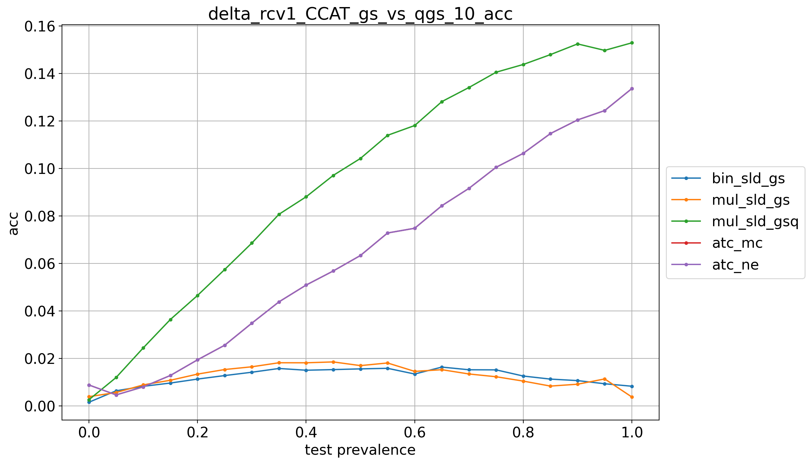
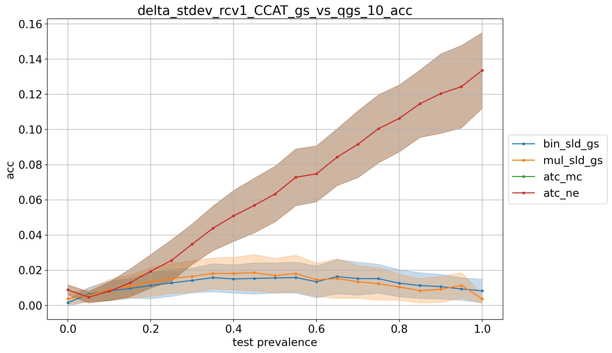
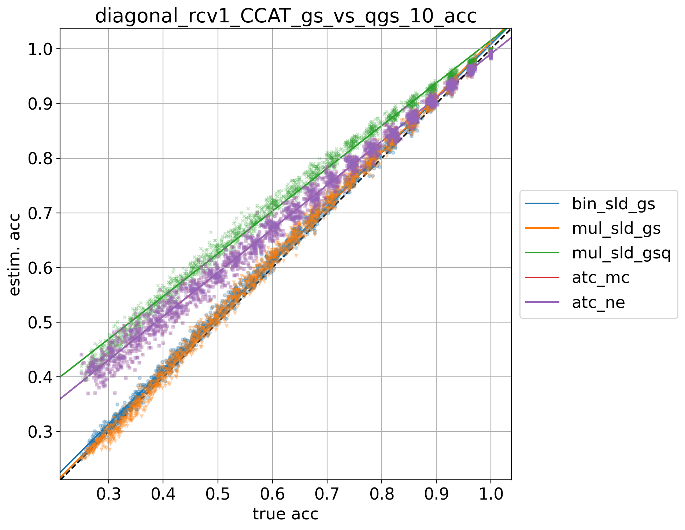
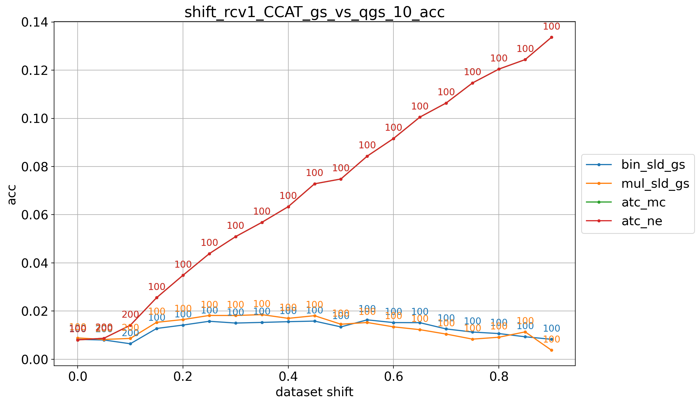

## 20% positives
> train: [0.79989987 0.20010013]  
> validation: [0.80006676 0.19993324]  
> bin_sld_gs: 982.326s  
> mul_sld_gs: 545.028s  
> bin_sld_gsq: 379.616s  
> mul_sld_gsq: 375.235s  
> ref: 55.221s  
> atc_mc: 59.389s  
> atc_ne: 59.739s  
> tot: 983.724s  

<table border="1" class="dataframe">
  <thead>
    <tr style="text-align: right;">
      <th></th>
      <th>bin_sld_gs</th>
      <th>mul_sld_gs</th>
      <th>bin_sld_gsq</th>
      <th>mul_sld_gsq</th>
      <th>atc_mc</th>
      <th>atc_ne</th>
    </tr>
  </thead>
  <tbody>
    <tr>
      <th>0.0</th>
      <td>0.0080</td>
      <td>0.0124</td>
      <td>0.0063</td>
      <td>0.0070</td>
      <td>0.0097</td>
      <td>0.0097</td>
    </tr>
    <tr>
      <th>0.05</th>
      <td>0.0096</td>
      <td>0.0108</td>
      <td>0.0068</td>
      <td>0.0044</td>
      <td>0.0071</td>
      <td>0.0071</td>
    </tr>
    <tr>
      <th>0.1</th>
      <td>0.0114</td>
      <td>0.0101</td>
      <td>0.0082</td>
      <td>0.0117</td>
      <td>0.0062</td>
      <td>0.0062</td>
    </tr>
    <tr>
      <th>0.15</th>
      <td>0.0114</td>
      <td>0.0085</td>
      <td>0.0081</td>
      <td>0.0191</td>
      <td>0.0064</td>
      <td>0.0064</td>
    </tr>
    <tr>
      <th>0.2</th>
      <td>0.0124</td>
      <td>0.0084</td>
      <td>0.0100</td>
      <td>0.0291</td>
      <td>0.0088</td>
      <td>0.0088</td>
    </tr>
    <tr>
      <th>0.25</th>
      <td>0.0124</td>
      <td>0.0086</td>
      <td>0.0099</td>
      <td>0.0369</td>
      <td>0.0093</td>
      <td>0.0093</td>
    </tr>
    <tr>
      <th>0.3</th>
      <td>0.0139</td>
      <td>0.0080</td>
      <td>0.0108</td>
      <td>0.0455</td>
      <td>0.0124</td>
      <td>0.0124</td>
    </tr>
    <tr>
      <th>0.35</th>
      <td>0.0130</td>
      <td>0.0082</td>
      <td>0.0108</td>
      <td>0.0540</td>
      <td>0.0161</td>
      <td>0.0161</td>
    </tr>
    <tr>
      <th>0.4</th>
      <td>0.0127</td>
      <td>0.0095</td>
      <td>0.0106</td>
      <td>0.0618</td>
      <td>0.0190</td>
      <td>0.0190</td>
    </tr>
    <tr>
      <th>0.45</th>
      <td>0.0149</td>
      <td>0.0102</td>
      <td>0.0132</td>
      <td>0.0679</td>
      <td>0.0207</td>
      <td>0.0207</td>
    </tr>
    <tr>
      <th>0.5</th>
      <td>0.0156</td>
      <td>0.0103</td>
      <td>0.0144</td>
      <td>0.0743</td>
      <td>0.0222</td>
      <td>0.0222</td>
    </tr>
    <tr>
      <th>0.55</th>
      <td>0.0147</td>
      <td>0.0120</td>
      <td>0.0153</td>
      <td>0.0832</td>
      <td>0.0247</td>
      <td>0.0247</td>
    </tr>
    <tr>
      <th>0.6</th>
      <td>0.0152</td>
      <td>0.0117</td>
      <td>0.0164</td>
      <td>0.0867</td>
      <td>0.0272</td>
      <td>0.0272</td>
    </tr>
    <tr>
      <th>0.65</th>
      <td>0.0163</td>
      <td>0.0140</td>
      <td>0.0177</td>
      <td>0.0948</td>
      <td>0.0331</td>
      <td>0.0331</td>
    </tr>
    <tr>
      <th>0.7</th>
      <td>0.0158</td>
      <td>0.0151</td>
      <td>0.0186</td>
      <td>0.1011</td>
      <td>0.0384</td>
      <td>0.0384</td>
    </tr>
    <tr>
      <th>0.75</th>
      <td>0.0172</td>
      <td>0.0151</td>
      <td>0.0221</td>
      <td>0.1045</td>
      <td>0.0425</td>
      <td>0.0425</td>
    </tr>
    <tr>
      <th>0.8</th>
      <td>0.0173</td>
      <td>0.0133</td>
      <td>0.0245</td>
      <td>0.1076</td>
      <td>0.0407</td>
      <td>0.0407</td>
    </tr>
    <tr>
      <th>0.85</th>
      <td>0.0185</td>
      <td>0.0134</td>
      <td>0.0274</td>
      <td>0.1124</td>
      <td>0.0447</td>
      <td>0.0447</td>
    </tr>
    <tr>
      <th>0.9</th>
      <td>0.0199</td>
      <td>0.0131</td>
      <td>0.0318</td>
      <td>0.1157</td>
      <td>0.0493</td>
      <td>0.0493</td>
    </tr>
    <tr>
      <th>0.95</th>
      <td>0.0205</td>
      <td>0.0113</td>
      <td>0.0339</td>
      <td>0.1164</td>
      <td>0.0492</td>
      <td>0.0492</td>
    </tr>
    <tr>
      <th>1.0</th>
      <td>0.0223</td>
      <td>0.0077</td>
      <td>0.0278</td>
      <td>0.1166</td>
      <td>0.0571</td>
      <td>0.0571</td>
    </tr>
    <tr>
      <th>avg</th>
      <td>0.0149</td>
      <td>0.0110</td>
      <td>0.0164</td>
      <td>0.0691</td>
      <td>0.0259</td>
      <td>0.0259</td>
    </tr>
  </tbody>
</table>

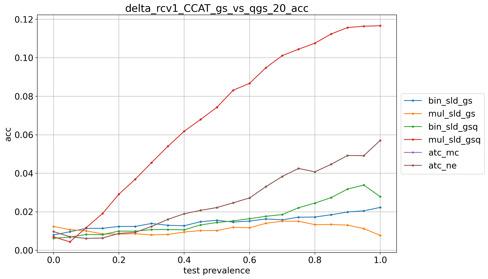
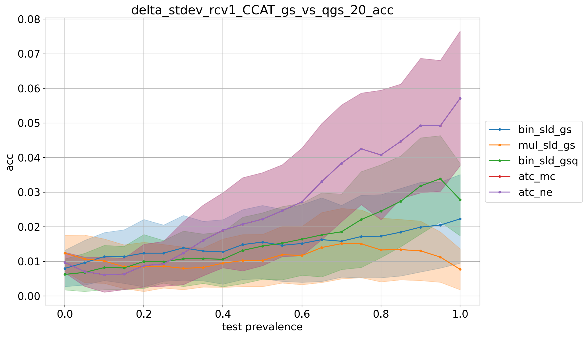
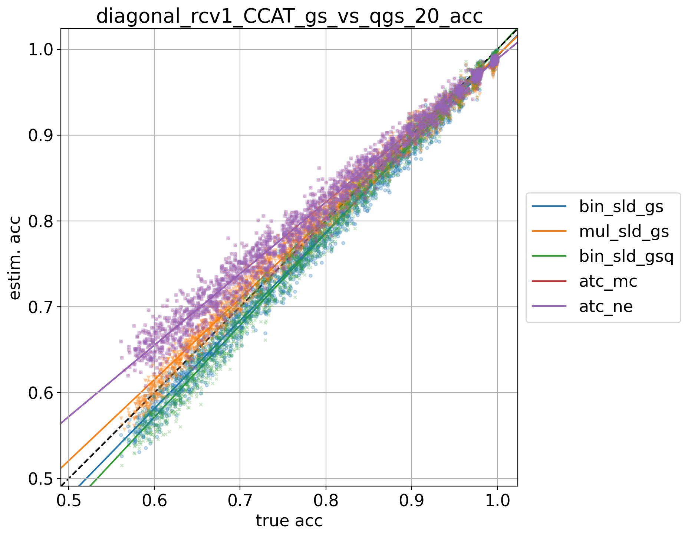
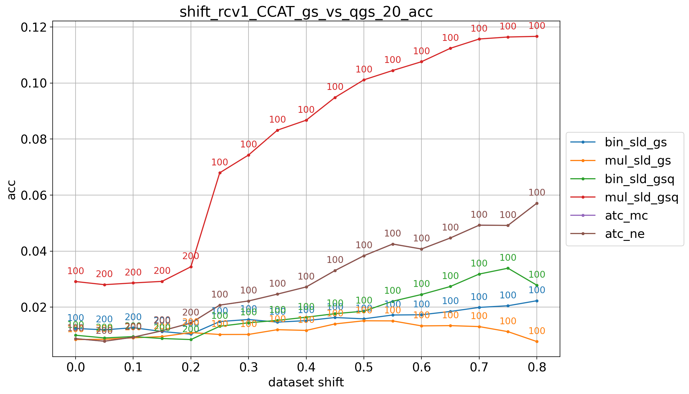

## 30% positives
> train: [0.69993324 0.30006676]  
> validation: [0.70010013 0.29989987]  
> bin_sld_gs: 1003.780s  
> mul_sld_gs: 540.827s  
> bin_sld_gsq: 377.338s  
> mul_sld_gsq: 372.261s  
> ref: 49.980s  
> atc_mc: 53.377s  
> atc_ne: 53.893s  
> tot: 1005.251s  

<table border="1" class="dataframe">
  <thead>
    <tr style="text-align: right;">
      <th></th>
      <th>bin_sld_gs</th>
      <th>mul_sld_gs</th>
      <th>bin_sld_gsq</th>
      <th>mul_sld_gsq</th>
      <th>atc_mc</th>
      <th>atc_ne</th>
    </tr>
  </thead>
  <tbody>
    <tr>
      <th>0.0</th>
      <td>0.0059</td>
      <td>0.0081</td>
      <td>0.0127</td>
      <td>0.0044</td>
      <td>0.0103</td>
      <td>0.0103</td>
    </tr>
    <tr>
      <th>0.05</th>
      <td>0.0083</td>
      <td>0.0082</td>
      <td>0.0150</td>
      <td>0.0130</td>
      <td>0.0072</td>
      <td>0.0072</td>
    </tr>
    <tr>
      <th>0.1</th>
      <td>0.0087</td>
      <td>0.0080</td>
      <td>0.0167</td>
      <td>0.0205</td>
      <td>0.0049</td>
      <td>0.0049</td>
    </tr>
    <tr>
      <th>0.15</th>
      <td>0.0097</td>
      <td>0.0091</td>
      <td>0.0175</td>
      <td>0.0284</td>
      <td>0.0060</td>
      <td>0.0060</td>
    </tr>
    <tr>
      <th>0.2</th>
      <td>0.0089</td>
      <td>0.0087</td>
      <td>0.0175</td>
      <td>0.0369</td>
      <td>0.0082</td>
      <td>0.0082</td>
    </tr>
    <tr>
      <th>0.25</th>
      <td>0.0094</td>
      <td>0.0111</td>
      <td>0.0180</td>
      <td>0.0435</td>
      <td>0.0101</td>
      <td>0.0101</td>
    </tr>
    <tr>
      <th>0.3</th>
      <td>0.0091</td>
      <td>0.0115</td>
      <td>0.0208</td>
      <td>0.0513</td>
      <td>0.0119</td>
      <td>0.0119</td>
    </tr>
    <tr>
      <th>0.35</th>
      <td>0.0104</td>
      <td>0.0117</td>
      <td>0.0221</td>
      <td>0.0586</td>
      <td>0.0160</td>
      <td>0.0160</td>
    </tr>
    <tr>
      <th>0.4</th>
      <td>0.0108</td>
      <td>0.0133</td>
      <td>0.0233</td>
      <td>0.0658</td>
      <td>0.0190</td>
      <td>0.0190</td>
    </tr>
    <tr>
      <th>0.45</th>
      <td>0.0097</td>
      <td>0.0138</td>
      <td>0.0250</td>
      <td>0.0717</td>
      <td>0.0222</td>
      <td>0.0222</td>
    </tr>
    <tr>
      <th>0.5</th>
      <td>0.0095</td>
      <td>0.0131</td>
      <td>0.0258</td>
      <td>0.0767</td>
      <td>0.0259</td>
      <td>0.0259</td>
    </tr>
    <tr>
      <th>0.55</th>
      <td>0.0089</td>
      <td>0.0146</td>
      <td>0.0265</td>
      <td>0.0834</td>
      <td>0.0297</td>
      <td>0.0297</td>
    </tr>
    <tr>
      <th>0.6</th>
      <td>0.0086</td>
      <td>0.0147</td>
      <td>0.0282</td>
      <td>0.0882</td>
      <td>0.0307</td>
      <td>0.0307</td>
    </tr>
    <tr>
      <th>0.65</th>
      <td>0.0090</td>
      <td>0.0154</td>
      <td>0.0307</td>
      <td>0.0956</td>
      <td>0.0368</td>
      <td>0.0368</td>
    </tr>
    <tr>
      <th>0.7</th>
      <td>0.0077</td>
      <td>0.0141</td>
      <td>0.0336</td>
      <td>0.1000</td>
      <td>0.0400</td>
      <td>0.0400</td>
    </tr>
    <tr>
      <th>0.75</th>
      <td>0.0085</td>
      <td>0.0132</td>
      <td>0.0359</td>
      <td>0.1031</td>
      <td>0.0427</td>
      <td>0.0427</td>
    </tr>
    <tr>
      <th>0.8</th>
      <td>0.0078</td>
      <td>0.0116</td>
      <td>0.0365</td>
      <td>0.1083</td>
      <td>0.0464</td>
      <td>0.0464</td>
    </tr>
    <tr>
      <th>0.85</th>
      <td>0.0071</td>
      <td>0.0129</td>
      <td>0.0386</td>
      <td>0.1116</td>
      <td>0.0517</td>
      <td>0.0517</td>
    </tr>
    <tr>
      <th>0.9</th>
      <td>0.0074</td>
      <td>0.0101</td>
      <td>0.0408</td>
      <td>0.1131</td>
      <td>0.0521</td>
      <td>0.0521</td>
    </tr>
    <tr>
      <th>0.95</th>
      <td>0.0072</td>
      <td>0.0099</td>
      <td>0.0413</td>
      <td>0.1146</td>
      <td>0.0548</td>
      <td>0.0548</td>
    </tr>
    <tr>
      <th>1.0</th>
      <td>0.0017</td>
      <td>0.0067</td>
      <td>0.0374</td>
      <td>0.1142</td>
      <td>0.0625</td>
      <td>0.0625</td>
    </tr>
    <tr>
      <th>avg</th>
      <td>0.0083</td>
      <td>0.0114</td>
      <td>0.0268</td>
      <td>0.0716</td>
      <td>0.0280</td>
      <td>0.0280</td>
    </tr>
  </tbody>
</table>

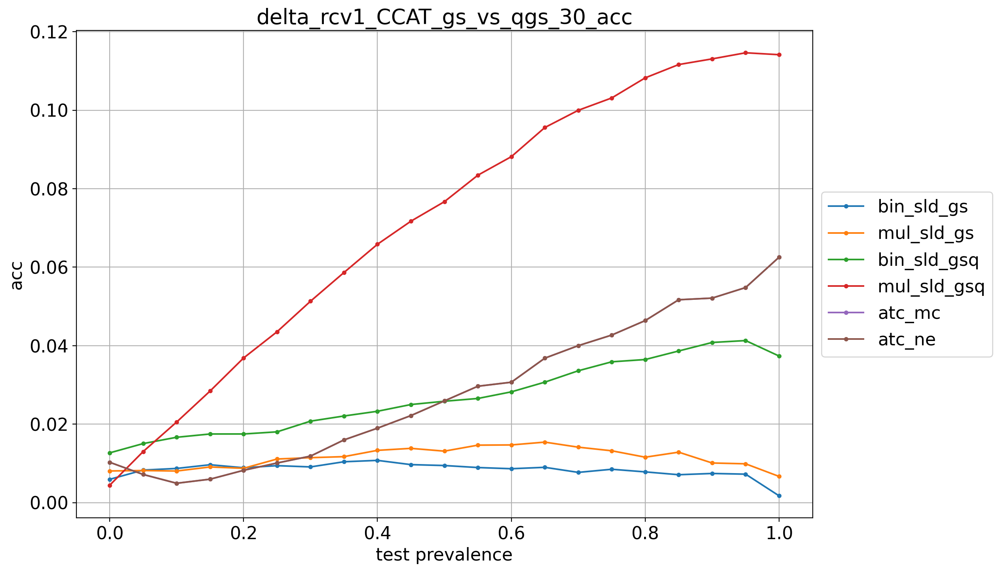
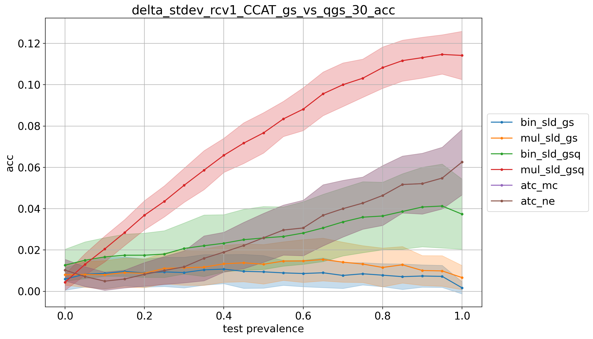
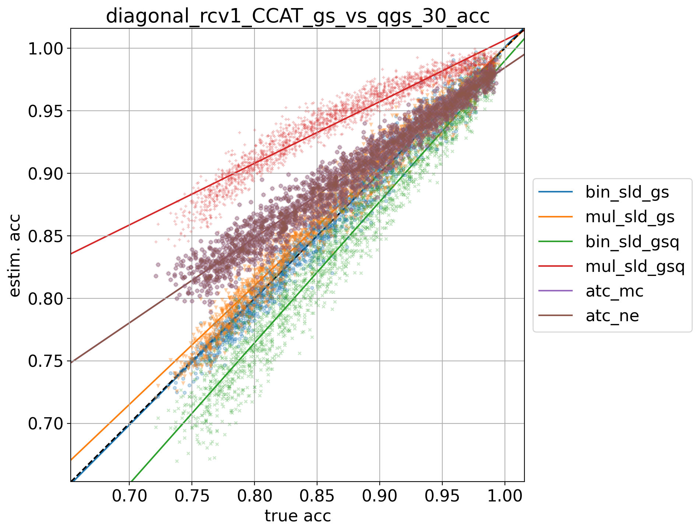
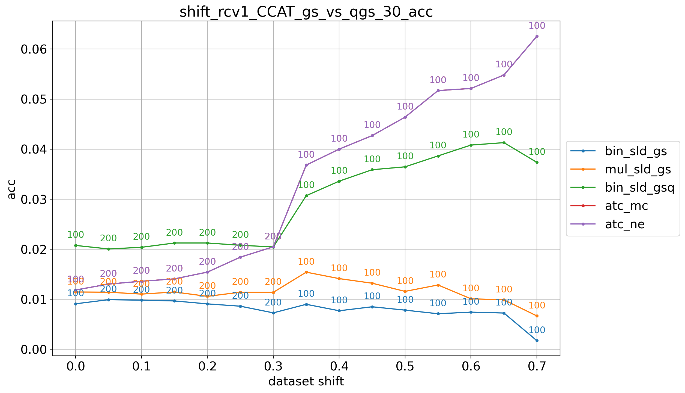

## 40% positives
> train: [0.59996662 0.40003338]  
> validation: [0.59996662 0.40003338]  
> bin_sld_gs: 1001.080s  
> mul_sld_gs: 539.153s  
> bin_sld_gsq: 387.618s  
> mul_sld_gsq: 371.446s  
> ref: 49.888s  
> atc_mc: 53.359s  
> atc_ne: 53.516s  
> tot: 1002.309s  

<table border="1" class="dataframe">
  <thead>
    <tr style="text-align: right;">
      <th></th>
      <th>bin_sld_gs</th>
      <th>mul_sld_gs</th>
      <th>bin_sld_gsq</th>
      <th>mul_sld_gsq</th>
      <th>atc_mc</th>
      <th>atc_ne</th>
    </tr>
  </thead>
  <tbody>
    <tr>
      <th>0.0</th>
      <td>0.0050</td>
      <td>0.0220</td>
      <td>0.0469</td>
      <td>0.0082</td>
      <td>0.0190</td>
      <td>0.0190</td>
    </tr>
    <tr>
      <th>0.05</th>
      <td>0.0102</td>
      <td>0.0153</td>
      <td>0.0442</td>
      <td>0.0165</td>
      <td>0.0166</td>
      <td>0.0166</td>
    </tr>
    <tr>
      <th>0.1</th>
      <td>0.0100</td>
      <td>0.0108</td>
      <td>0.0429</td>
      <td>0.0229</td>
      <td>0.0147</td>
      <td>0.0147</td>
    </tr>
    <tr>
      <th>0.15</th>
      <td>0.0112</td>
      <td>0.0097</td>
      <td>0.0386</td>
      <td>0.0285</td>
      <td>0.0117</td>
      <td>0.0117</td>
    </tr>
    <tr>
      <th>0.2</th>
      <td>0.0124</td>
      <td>0.0083</td>
      <td>0.0370</td>
      <td>0.0342</td>
      <td>0.0105</td>
      <td>0.0105</td>
    </tr>
    <tr>
      <th>0.25</th>
      <td>0.0139</td>
      <td>0.0082</td>
      <td>0.0316</td>
      <td>0.0387</td>
      <td>0.0089</td>
      <td>0.0089</td>
    </tr>
    <tr>
      <th>0.3</th>
      <td>0.0123</td>
      <td>0.0091</td>
      <td>0.0328</td>
      <td>0.0435</td>
      <td>0.0085</td>
      <td>0.0085</td>
    </tr>
    <tr>
      <th>0.35</th>
      <td>0.0140</td>
      <td>0.0104</td>
      <td>0.0311</td>
      <td>0.0482</td>
      <td>0.0076</td>
      <td>0.0076</td>
    </tr>
    <tr>
      <th>0.4</th>
      <td>0.0143</td>
      <td>0.0128</td>
      <td>0.0271</td>
      <td>0.0523</td>
      <td>0.0079</td>
      <td>0.0079</td>
    </tr>
    <tr>
      <th>0.45</th>
      <td>0.0121</td>
      <td>0.0144</td>
      <td>0.0272</td>
      <td>0.0569</td>
      <td>0.0073</td>
      <td>0.0073</td>
    </tr>
    <tr>
      <th>0.5</th>
      <td>0.0121</td>
      <td>0.0164</td>
      <td>0.0234</td>
      <td>0.0600</td>
      <td>0.0081</td>
      <td>0.0081</td>
    </tr>
    <tr>
      <th>0.55</th>
      <td>0.0103</td>
      <td>0.0205</td>
      <td>0.0202</td>
      <td>0.0646</td>
      <td>0.0099</td>
      <td>0.0099</td>
    </tr>
    <tr>
      <th>0.6</th>
      <td>0.0105</td>
      <td>0.0219</td>
      <td>0.0181</td>
      <td>0.0670</td>
      <td>0.0112</td>
      <td>0.0112</td>
    </tr>
    <tr>
      <th>0.65</th>
      <td>0.0107</td>
      <td>0.0251</td>
      <td>0.0163</td>
      <td>0.0733</td>
      <td>0.0156</td>
      <td>0.0156</td>
    </tr>
    <tr>
      <th>0.7</th>
      <td>0.0120</td>
      <td>0.0260</td>
      <td>0.0153</td>
      <td>0.0761</td>
      <td>0.0168</td>
      <td>0.0168</td>
    </tr>
    <tr>
      <th>0.75</th>
      <td>0.0107</td>
      <td>0.0278</td>
      <td>0.0146</td>
      <td>0.0786</td>
      <td>0.0160</td>
      <td>0.0160</td>
    </tr>
    <tr>
      <th>0.8</th>
      <td>0.0103</td>
      <td>0.0303</td>
      <td>0.0111</td>
      <td>0.0821</td>
      <td>0.0180</td>
      <td>0.0180</td>
    </tr>
    <tr>
      <th>0.85</th>
      <td>0.0121</td>
      <td>0.0322</td>
      <td>0.0114</td>
      <td>0.0855</td>
      <td>0.0218</td>
      <td>0.0218</td>
    </tr>
    <tr>
      <th>0.9</th>
      <td>0.0132</td>
      <td>0.0308</td>
      <td>0.0099</td>
      <td>0.0868</td>
      <td>0.0224</td>
      <td>0.0224</td>
    </tr>
    <tr>
      <th>0.95</th>
      <td>0.0139</td>
      <td>0.0317</td>
      <td>0.0087</td>
      <td>0.0876</td>
      <td>0.0278</td>
      <td>0.0278</td>
    </tr>
    <tr>
      <th>1.0</th>
      <td>0.0013</td>
      <td>0.0263</td>
      <td>0.0079</td>
      <td>0.0881</td>
      <td>0.0285</td>
      <td>0.0285</td>
    </tr>
    <tr>
      <th>avg</th>
      <td>0.0111</td>
      <td>0.0195</td>
      <td>0.0246</td>
      <td>0.0571</td>
      <td>0.0147</td>
      <td>0.0147</td>
    </tr>
  </tbody>
</table>

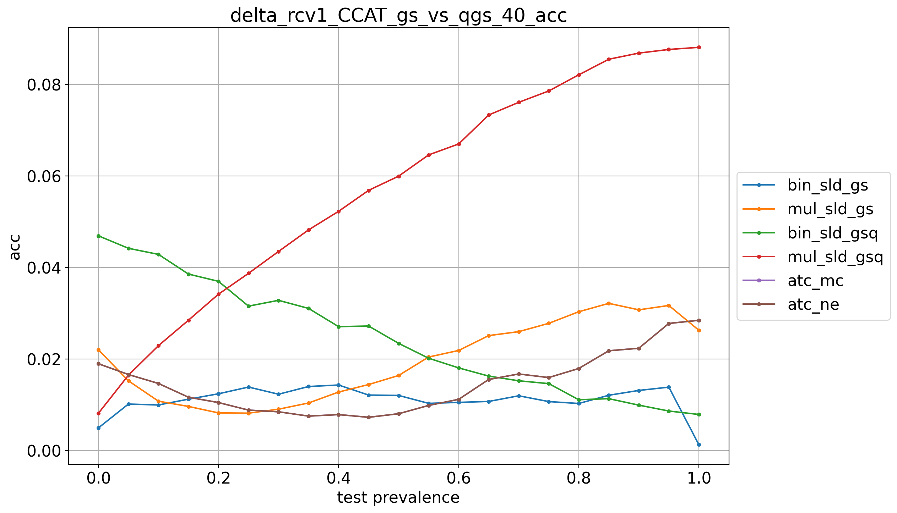
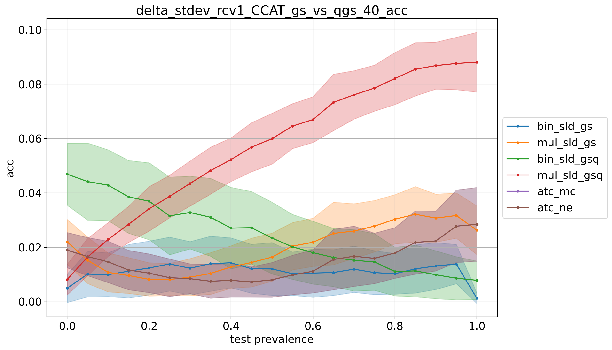
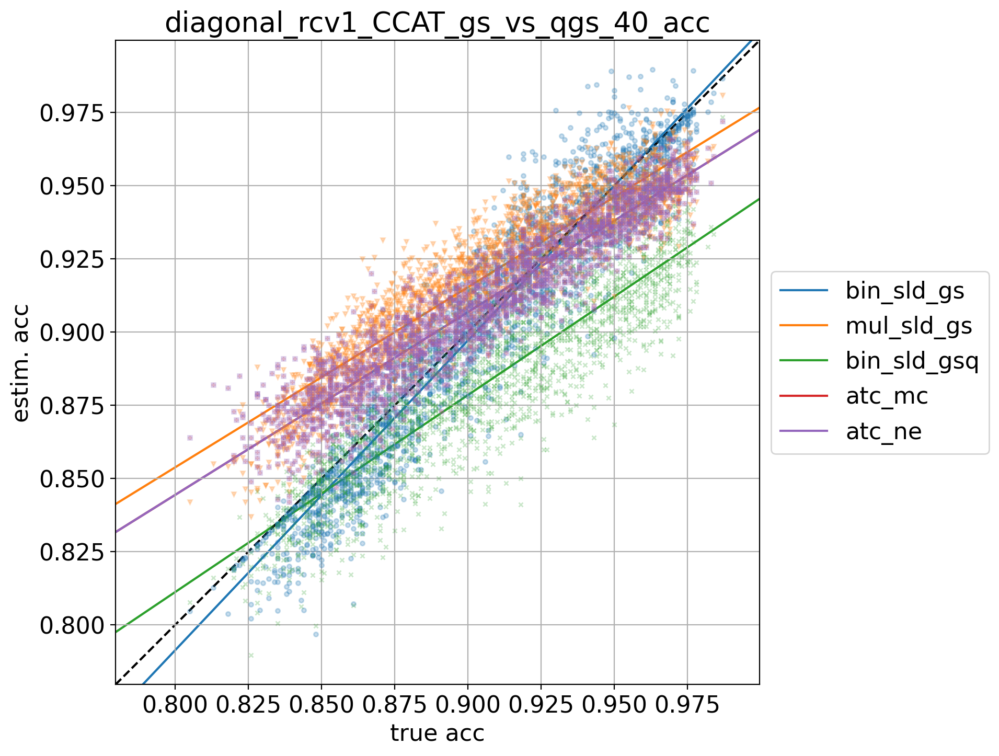
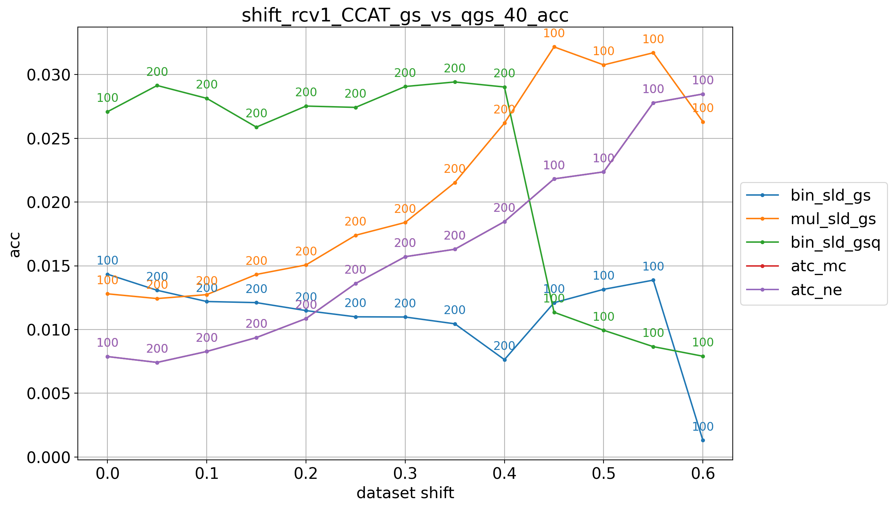

## 50% positives
> train: [0.5 0.5]  
> validation: [0.5 0.5]  
> bin_sld_gs: 982.440s  
> mul_sld_gs: 518.569s  
> bin_sld_gsq: 376.012s  
> mul_sld_gsq: 354.371s  
> ref: 47.222s  
> atc_mc: 49.635s  
> atc_ne: 50.908s  
> tot: 983.784s  

<table border="1" class="dataframe">
  <thead>
    <tr style="text-align: right;">
      <th></th>
      <th>bin_sld_gs</th>
      <th>mul_sld_gs</th>
      <th>bin_sld_gsq</th>
      <th>mul_sld_gsq</th>
      <th>atc_mc</th>
      <th>atc_ne</th>
    </tr>
  </thead>
  <tbody>
    <tr>
      <th>0.0</th>
      <td>0.0129</td>
      <td>0.0158</td>
      <td>0.0086</td>
      <td>0.0346</td>
      <td>0.0088</td>
      <td>0.0088</td>
    </tr>
    <tr>
      <th>0.05</th>
      <td>0.0156</td>
      <td>0.0159</td>
      <td>0.0111</td>
      <td>0.0425</td>
      <td>0.0080</td>
      <td>0.0080</td>
    </tr>
    <tr>
      <th>0.1</th>
      <td>0.0149</td>
      <td>0.0133</td>
      <td>0.0094</td>
      <td>0.0468</td>
      <td>0.0082</td>
      <td>0.0082</td>
    </tr>
    <tr>
      <th>0.15</th>
      <td>0.0145</td>
      <td>0.0140</td>
      <td>0.0121</td>
      <td>0.0499</td>
      <td>0.0077</td>
      <td>0.0077</td>
    </tr>
    <tr>
      <th>0.2</th>
      <td>0.0137</td>
      <td>0.0116</td>
      <td>0.0127</td>
      <td>0.0545</td>
      <td>0.0083</td>
      <td>0.0083</td>
    </tr>
    <tr>
      <th>0.25</th>
      <td>0.0130</td>
      <td>0.0110</td>
      <td>0.0127</td>
      <td>0.0545</td>
      <td>0.0066</td>
      <td>0.0066</td>
    </tr>
    <tr>
      <th>0.3</th>
      <td>0.0150</td>
      <td>0.0127</td>
      <td>0.0130</td>
      <td>0.0579</td>
      <td>0.0082</td>
      <td>0.0082</td>
    </tr>
    <tr>
      <th>0.35</th>
      <td>0.0161</td>
      <td>0.0132</td>
      <td>0.0147</td>
      <td>0.0591</td>
      <td>0.0103</td>
      <td>0.0103</td>
    </tr>
    <tr>
      <th>0.4</th>
      <td>0.0151</td>
      <td>0.0125</td>
      <td>0.0158</td>
      <td>0.0605</td>
      <td>0.0085</td>
      <td>0.0085</td>
    </tr>
    <tr>
      <th>0.45</th>
      <td>0.0144</td>
      <td>0.0121</td>
      <td>0.0146</td>
      <td>0.0629</td>
      <td>0.0110</td>
      <td>0.0110</td>
    </tr>
    <tr>
      <th>0.5</th>
      <td>0.0137</td>
      <td>0.0116</td>
      <td>0.0139</td>
      <td>0.0621</td>
      <td>0.0122</td>
      <td>0.0122</td>
    </tr>
    <tr>
      <th>0.55</th>
      <td>0.0117</td>
      <td>0.0096</td>
      <td>0.0133</td>
      <td>0.0647</td>
      <td>0.0125</td>
      <td>0.0125</td>
    </tr>
    <tr>
      <th>0.6</th>
      <td>0.0126</td>
      <td>0.0097</td>
      <td>0.0142</td>
      <td>0.0643</td>
      <td>0.0144</td>
      <td>0.0144</td>
    </tr>
    <tr>
      <th>0.65</th>
      <td>0.0132</td>
      <td>0.0117</td>
      <td>0.0137</td>
      <td>0.0677</td>
      <td>0.0168</td>
      <td>0.0168</td>
    </tr>
    <tr>
      <th>0.7</th>
      <td>0.0145</td>
      <td>0.0120</td>
      <td>0.0126</td>
      <td>0.0672</td>
      <td>0.0164</td>
      <td>0.0164</td>
    </tr>
    <tr>
      <th>0.75</th>
      <td>0.0137</td>
      <td>0.0113</td>
      <td>0.0126</td>
      <td>0.0682</td>
      <td>0.0170</td>
      <td>0.0170</td>
    </tr>
    <tr>
      <th>0.8</th>
      <td>0.0130</td>
      <td>0.0105</td>
      <td>0.0109</td>
      <td>0.0686</td>
      <td>0.0211</td>
      <td>0.0211</td>
    </tr>
    <tr>
      <th>0.85</th>
      <td>0.0115</td>
      <td>0.0090</td>
      <td>0.0084</td>
      <td>0.0680</td>
      <td>0.0205</td>
      <td>0.0205</td>
    </tr>
    <tr>
      <th>0.9</th>
      <td>0.0121</td>
      <td>0.0107</td>
      <td>0.0092</td>
      <td>0.0678</td>
      <td>0.0239</td>
      <td>0.0239</td>
    </tr>
    <tr>
      <th>0.95</th>
      <td>0.0104</td>
      <td>0.0092</td>
      <td>0.0061</td>
      <td>0.0657</td>
      <td>0.0253</td>
      <td>0.0253</td>
    </tr>
    <tr>
      <th>1.0</th>
      <td>0.0096</td>
      <td>0.0085</td>
      <td>0.0041</td>
      <td>0.0628</td>
      <td>0.0289</td>
      <td>0.0289</td>
    </tr>
    <tr>
      <th>avg</th>
      <td>0.0134</td>
      <td>0.0117</td>
      <td>0.0116</td>
      <td>0.0595</td>
      <td>0.0140</td>
      <td>0.0140</td>
    </tr>
  </tbody>
</table>

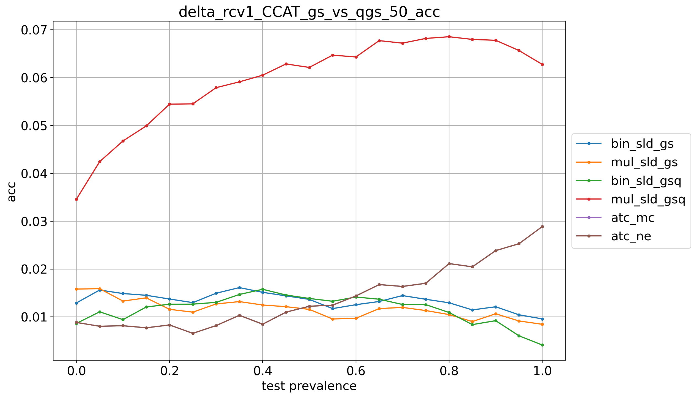
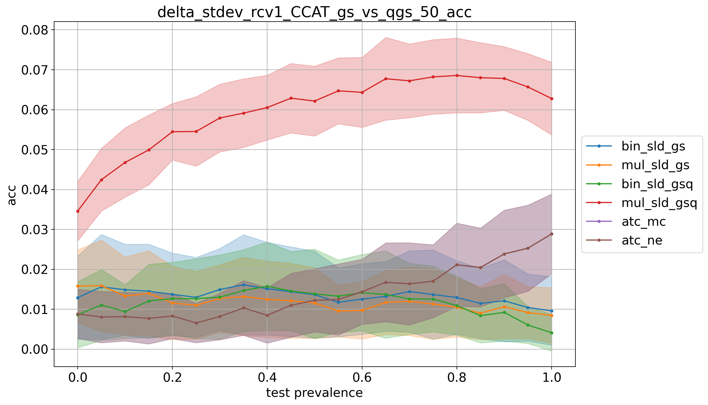
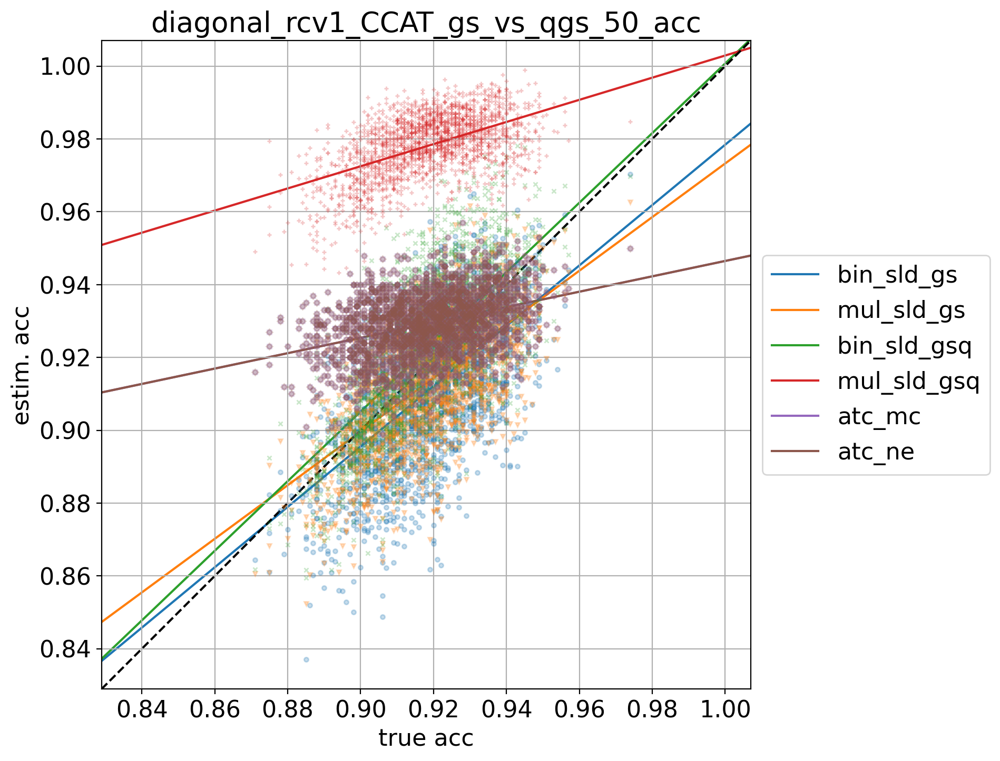
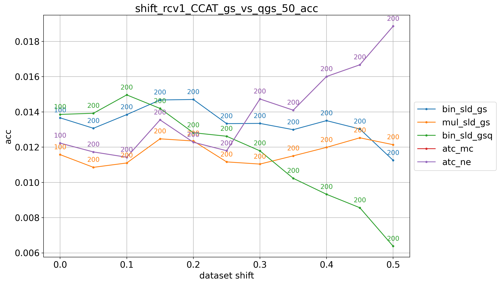

## 60% positives
> train: [0.40003338 0.59996662]  
> validation: [0.40003338 0.59996662]  
> bin_sld_gs: 960.633s  
> mul_sld_gs: 518.542s  
> bin_sld_gsq: 374.787s  
> mul_sld_gsq: 354.601s  
> ref: 46.619s  
> atc_mc: 50.354s  
> atc_ne: 51.660s  
> tot: 961.903s  

<table border="1" class="dataframe">
  <thead>
    <tr style="text-align: right;">
      <th></th>
      <th>bin_sld_gs</th>
      <th>mul_sld_gs</th>
      <th>bin_sld_gsq</th>
      <th>mul_sld_gsq</th>
      <th>atc_mc</th>
      <th>atc_ne</th>
    </tr>
  </thead>
  <tbody>
    <tr>
      <th>0.0</th>
      <td>0.0049</td>
      <td>0.0058</td>
      <td>0.0437</td>
      <td>0.0574</td>
      <td>0.0106</td>
      <td>0.0106</td>
    </tr>
    <tr>
      <th>0.05</th>
      <td>0.0087</td>
      <td>0.0094</td>
      <td>0.0452</td>
      <td>0.0634</td>
      <td>0.0101</td>
      <td>0.0101</td>
    </tr>
    <tr>
      <th>0.1</th>
      <td>0.0102</td>
      <td>0.0084</td>
      <td>0.0424</td>
      <td>0.0670</td>
      <td>0.0092</td>
      <td>0.0092</td>
    </tr>
    <tr>
      <th>0.15</th>
      <td>0.0101</td>
      <td>0.0083</td>
      <td>0.0432</td>
      <td>0.0666</td>
      <td>0.0083</td>
      <td>0.0083</td>
    </tr>
    <tr>
      <th>0.2</th>
      <td>0.0136</td>
      <td>0.0108</td>
      <td>0.0385</td>
      <td>0.0687</td>
      <td>0.0089</td>
      <td>0.0089</td>
    </tr>
    <tr>
      <th>0.25</th>
      <td>0.0123</td>
      <td>0.0110</td>
      <td>0.0394</td>
      <td>0.0664</td>
      <td>0.0090</td>
      <td>0.0090</td>
    </tr>
    <tr>
      <th>0.3</th>
      <td>0.0116</td>
      <td>0.0113</td>
      <td>0.0383</td>
      <td>0.0676</td>
      <td>0.0084</td>
      <td>0.0084</td>
    </tr>
    <tr>
      <th>0.35</th>
      <td>0.0120</td>
      <td>0.0113</td>
      <td>0.0403</td>
      <td>0.0657</td>
      <td>0.0084</td>
      <td>0.0084</td>
    </tr>
    <tr>
      <th>0.4</th>
      <td>0.0112</td>
      <td>0.0107</td>
      <td>0.0388</td>
      <td>0.0653</td>
      <td>0.0082</td>
      <td>0.0082</td>
    </tr>
    <tr>
      <th>0.45</th>
      <td>0.0115</td>
      <td>0.0116</td>
      <td>0.0363</td>
      <td>0.0648</td>
      <td>0.0086</td>
      <td>0.0086</td>
    </tr>
    <tr>
      <th>0.5</th>
      <td>0.0100</td>
      <td>0.0118</td>
      <td>0.0358</td>
      <td>0.0613</td>
      <td>0.0085</td>
      <td>0.0085</td>
    </tr>
    <tr>
      <th>0.55</th>
      <td>0.0097</td>
      <td>0.0103</td>
      <td>0.0346</td>
      <td>0.0589</td>
      <td>0.0085</td>
      <td>0.0085</td>
    </tr>
    <tr>
      <th>0.6</th>
      <td>0.0093</td>
      <td>0.0101</td>
      <td>0.0310</td>
      <td>0.0585</td>
      <td>0.0072</td>
      <td>0.0072</td>
    </tr>
    <tr>
      <th>0.65</th>
      <td>0.0093</td>
      <td>0.0100</td>
      <td>0.0307</td>
      <td>0.0594</td>
      <td>0.0079</td>
      <td>0.0079</td>
    </tr>
    <tr>
      <th>0.7</th>
      <td>0.0095</td>
      <td>0.0118</td>
      <td>0.0326</td>
      <td>0.0546</td>
      <td>0.0076</td>
      <td>0.0076</td>
    </tr>
    <tr>
      <th>0.75</th>
      <td>0.0090</td>
      <td>0.0109</td>
      <td>0.0320</td>
      <td>0.0534</td>
      <td>0.0075</td>
      <td>0.0075</td>
    </tr>
    <tr>
      <th>0.8</th>
      <td>0.0099</td>
      <td>0.0116</td>
      <td>0.0295</td>
      <td>0.0530</td>
      <td>0.0066</td>
      <td>0.0066</td>
    </tr>
    <tr>
      <th>0.85</th>
      <td>0.0097</td>
      <td>0.0118</td>
      <td>0.0290</td>
      <td>0.0494</td>
      <td>0.0070</td>
      <td>0.0070</td>
    </tr>
    <tr>
      <th>0.9</th>
      <td>0.0118</td>
      <td>0.0130</td>
      <td>0.0284</td>
      <td>0.0461</td>
      <td>0.0078</td>
      <td>0.0078</td>
    </tr>
    <tr>
      <th>0.95</th>
      <td>0.0129</td>
      <td>0.0119</td>
      <td>0.0235</td>
      <td>0.0441</td>
      <td>0.0071</td>
      <td>0.0071</td>
    </tr>
    <tr>
      <th>1.0</th>
      <td>0.0205</td>
      <td>0.0140</td>
      <td>0.0223</td>
      <td>0.0411</td>
      <td>0.0071</td>
      <td>0.0071</td>
    </tr>
    <tr>
      <th>avg</th>
      <td>0.0108</td>
      <td>0.0108</td>
      <td>0.0350</td>
      <td>0.0587</td>
      <td>0.0082</td>
      <td>0.0082</td>
    </tr>
  </tbody>
</table>

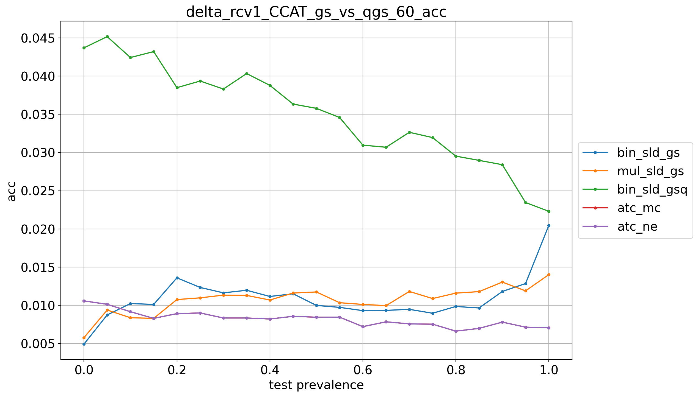
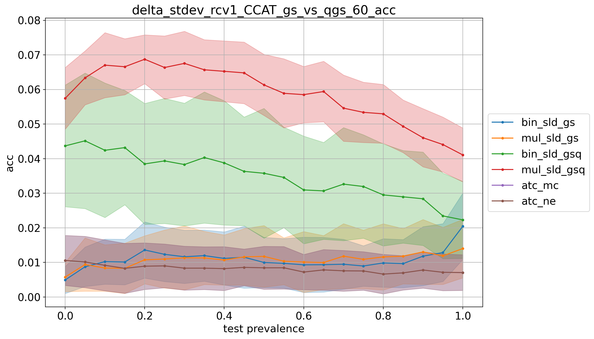
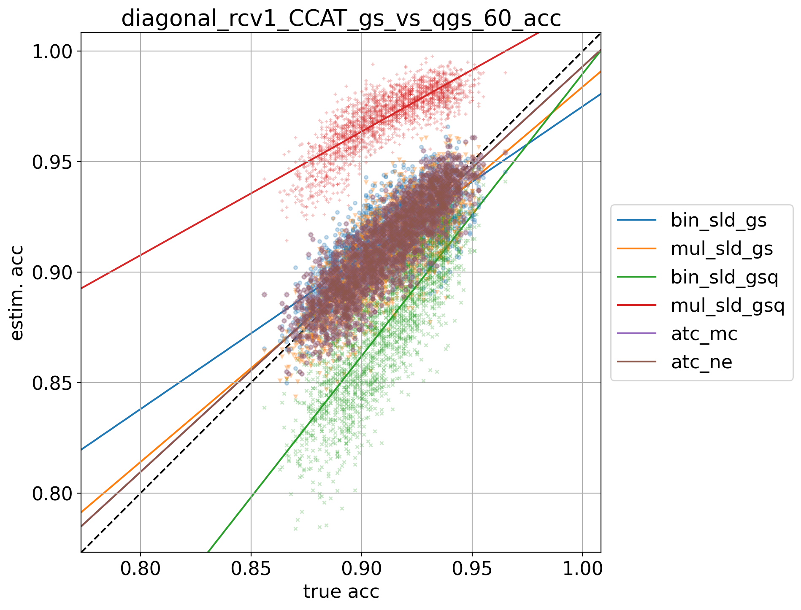
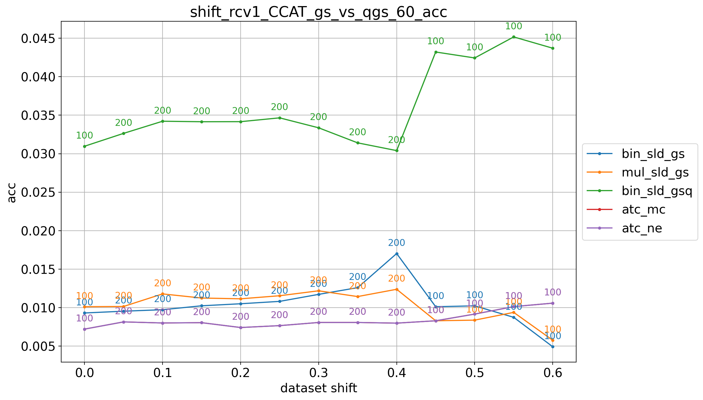

## 70% positives
> train: [0.29989987 0.70010013]  
> validation: [0.30006676 0.69993324]  
> bin_sld_gs: 968.765s  
> mul_sld_gs: 518.667s  
> bin_sld_gsq: 368.800s  
> mul_sld_gsq: 357.061s  
> ref: 47.123s  
> atc_mc: 49.987s  
> atc_ne: 50.916s  
> tot: 970.152s  

<table border="1" class="dataframe">
  <thead>
    <tr style="text-align: right;">
      <th></th>
      <th>bin_sld_gs</th>
      <th>mul_sld_gs</th>
      <th>bin_sld_gsq</th>
      <th>mul_sld_gsq</th>
      <th>atc_mc</th>
      <th>atc_ne</th>
    </tr>
  </thead>
  <tbody>
    <tr>
      <th>0.0</th>
      <td>0.0654</td>
      <td>0.0381</td>
      <td>0.0547</td>
      <td>0.0741</td>
      <td>0.0238</td>
      <td>0.0238</td>
    </tr>
    <tr>
      <th>0.05</th>
      <td>0.0719</td>
      <td>0.0364</td>
      <td>0.0624</td>
      <td>0.0819</td>
      <td>0.0222</td>
      <td>0.0222</td>
    </tr>
    <tr>
      <th>0.1</th>
      <td>0.0657</td>
      <td>0.0332</td>
      <td>0.0592</td>
      <td>0.0821</td>
      <td>0.0216</td>
      <td>0.0216</td>
    </tr>
    <tr>
      <th>0.15</th>
      <td>0.0639</td>
      <td>0.0332</td>
      <td>0.0593</td>
      <td>0.0842</td>
      <td>0.0197</td>
      <td>0.0197</td>
    </tr>
    <tr>
      <th>0.2</th>
      <td>0.0589</td>
      <td>0.0295</td>
      <td>0.0539</td>
      <td>0.0828</td>
      <td>0.0206</td>
      <td>0.0206</td>
    </tr>
    <tr>
      <th>0.25</th>
      <td>0.0564</td>
      <td>0.0315</td>
      <td>0.0542</td>
      <td>0.0775</td>
      <td>0.0160</td>
      <td>0.0160</td>
    </tr>
    <tr>
      <th>0.3</th>
      <td>0.0528</td>
      <td>0.0306</td>
      <td>0.0538</td>
      <td>0.0767</td>
      <td>0.0160</td>
      <td>0.0160</td>
    </tr>
    <tr>
      <th>0.35</th>
      <td>0.0503</td>
      <td>0.0293</td>
      <td>0.0521</td>
      <td>0.0736</td>
      <td>0.0149</td>
      <td>0.0149</td>
    </tr>
    <tr>
      <th>0.4</th>
      <td>0.0496</td>
      <td>0.0316</td>
      <td>0.0526</td>
      <td>0.0715</td>
      <td>0.0122</td>
      <td>0.0122</td>
    </tr>
    <tr>
      <th>0.45</th>
      <td>0.0453</td>
      <td>0.0306</td>
      <td>0.0505</td>
      <td>0.0672</td>
      <td>0.0123</td>
      <td>0.0123</td>
    </tr>
    <tr>
      <th>0.5</th>
      <td>0.0394</td>
      <td>0.0289</td>
      <td>0.0486</td>
      <td>0.0624</td>
      <td>0.0111</td>
      <td>0.0111</td>
    </tr>
    <tr>
      <th>0.55</th>
      <td>0.0388</td>
      <td>0.0294</td>
      <td>0.0486</td>
      <td>0.0577</td>
      <td>0.0102</td>
      <td>0.0102</td>
    </tr>
    <tr>
      <th>0.6</th>
      <td>0.0329</td>
      <td>0.0259</td>
      <td>0.0436</td>
      <td>0.0543</td>
      <td>0.0096</td>
      <td>0.0096</td>
    </tr>
    <tr>
      <th>0.65</th>
      <td>0.0313</td>
      <td>0.0273</td>
      <td>0.0433</td>
      <td>0.0505</td>
      <td>0.0100</td>
      <td>0.0100</td>
    </tr>
    <tr>
      <th>0.7</th>
      <td>0.0289</td>
      <td>0.0271</td>
      <td>0.0427</td>
      <td>0.0444</td>
      <td>0.0080</td>
      <td>0.0080</td>
    </tr>
    <tr>
      <th>0.75</th>
      <td>0.0266</td>
      <td>0.0263</td>
      <td>0.0406</td>
      <td>0.0403</td>
      <td>0.0070</td>
      <td>0.0070</td>
    </tr>
    <tr>
      <th>0.8</th>
      <td>0.0239</td>
      <td>0.0258</td>
      <td>0.0390</td>
      <td>0.0355</td>
      <td>0.0071</td>
      <td>0.0071</td>
    </tr>
    <tr>
      <th>0.85</th>
      <td>0.0224</td>
      <td>0.0250</td>
      <td>0.0372</td>
      <td>0.0302</td>
      <td>0.0076</td>
      <td>0.0076</td>
    </tr>
    <tr>
      <th>0.9</th>
      <td>0.0176</td>
      <td>0.0236</td>
      <td>0.0349</td>
      <td>0.0254</td>
      <td>0.0062</td>
      <td>0.0062</td>
    </tr>
    <tr>
      <th>0.95</th>
      <td>0.0148</td>
      <td>0.0220</td>
      <td>0.0323</td>
      <td>0.0193</td>
      <td>0.0063</td>
      <td>0.0063</td>
    </tr>
    <tr>
      <th>1.0</th>
      <td>0.0118</td>
      <td>0.0214</td>
      <td>0.0308</td>
      <td>0.0141</td>
      <td>0.0059</td>
      <td>0.0059</td>
    </tr>
    <tr>
      <th>avg</th>
      <td>0.0414</td>
      <td>0.0289</td>
      <td>0.0473</td>
      <td>0.0574</td>
      <td>0.0128</td>
      <td>0.0128</td>
    </tr>
  </tbody>
</table>

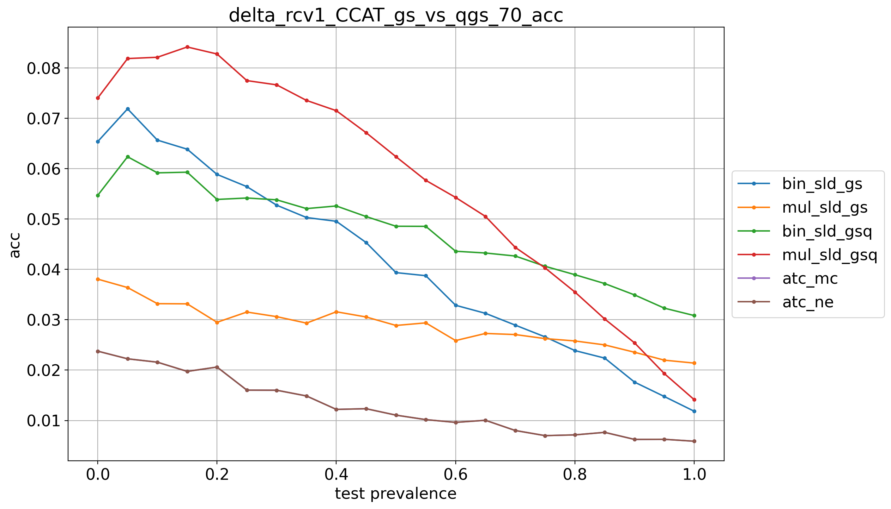
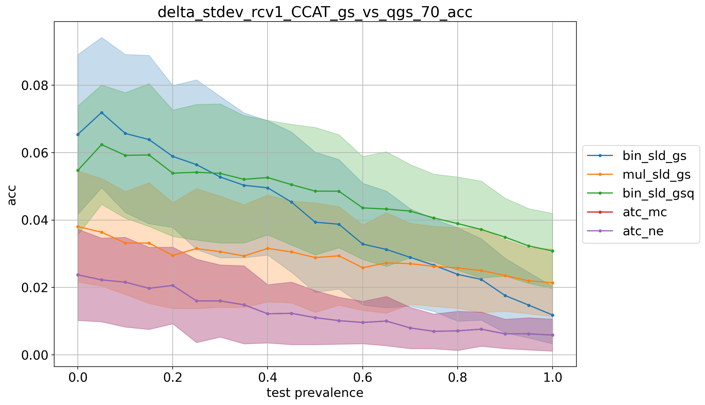
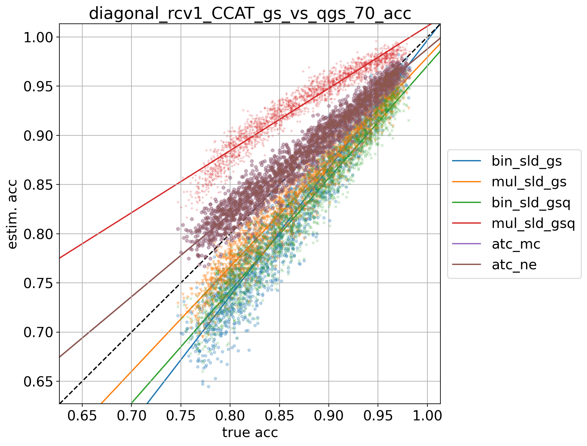
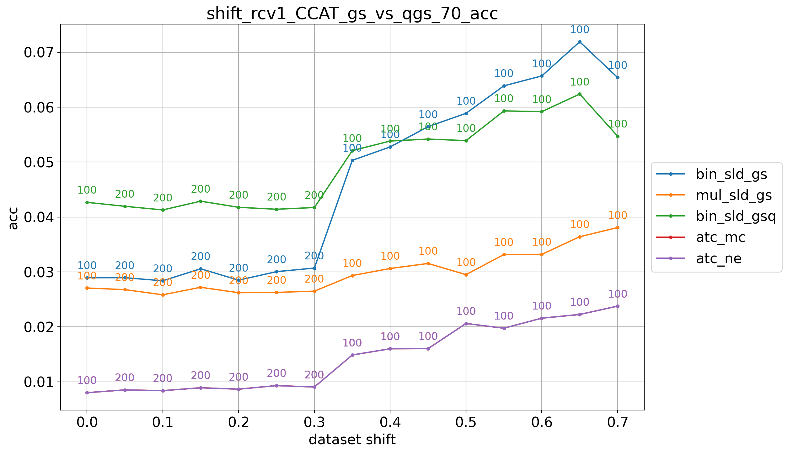

## 80% positives
> train: [0.19993324 0.80006676]  
> validation: [0.20010013 0.79989987]  
> bin_sld_gs: 959.358s  
> mul_sld_gs: 516.489s  
> bin_sld_gsq: 360.867s  
> mul_sld_gsq: 350.793s  
> ref: 46.990s  
> atc_mc: 49.877s  
> atc_ne: 49.632s  
> tot: 960.699s  

<table border="1" class="dataframe">
  <thead>
    <tr style="text-align: right;">
      <th></th>
      <th>bin_sld_gs</th>
      <th>mul_sld_gs</th>
      <th>bin_sld_gsq</th>
      <th>mul_sld_gsq</th>
      <th>atc_mc</th>
      <th>atc_ne</th>
    </tr>
  </thead>
  <tbody>
    <tr>
      <th>0.0</th>
      <td>0.0053</td>
      <td>0.0103</td>
      <td>0.0017</td>
      <td>0.1041</td>
      <td>0.0311</td>
      <td>0.0311</td>
    </tr>
    <tr>
      <th>0.05</th>
      <td>0.0241</td>
      <td>0.0129</td>
      <td>0.0077</td>
      <td>0.1100</td>
      <td>0.0274</td>
      <td>0.0274</td>
    </tr>
    <tr>
      <th>0.1</th>
      <td>0.0227</td>
      <td>0.0127</td>
      <td>0.0071</td>
      <td>0.1105</td>
      <td>0.0267</td>
      <td>0.0267</td>
    </tr>
    <tr>
      <th>0.15</th>
      <td>0.0232</td>
      <td>0.0114</td>
      <td>0.0076</td>
      <td>0.1094</td>
      <td>0.0227</td>
      <td>0.0227</td>
    </tr>
    <tr>
      <th>0.2</th>
      <td>0.0186</td>
      <td>0.0096</td>
      <td>0.0074</td>
      <td>0.1066</td>
      <td>0.0214</td>
      <td>0.0214</td>
    </tr>
    <tr>
      <th>0.25</th>
      <td>0.0203</td>
      <td>0.0110</td>
      <td>0.0079</td>
      <td>0.1020</td>
      <td>0.0201</td>
      <td>0.0201</td>
    </tr>
    <tr>
      <th>0.3</th>
      <td>0.0240</td>
      <td>0.0116</td>
      <td>0.0088</td>
      <td>0.0971</td>
      <td>0.0178</td>
      <td>0.0178</td>
    </tr>
    <tr>
      <th>0.35</th>
      <td>0.0202</td>
      <td>0.0117</td>
      <td>0.0099</td>
      <td>0.0929</td>
      <td>0.0196</td>
      <td>0.0196</td>
    </tr>
    <tr>
      <th>0.4</th>
      <td>0.0210</td>
      <td>0.0106</td>
      <td>0.0092</td>
      <td>0.0873</td>
      <td>0.0168</td>
      <td>0.0168</td>
    </tr>
    <tr>
      <th>0.45</th>
      <td>0.0203</td>
      <td>0.0094</td>
      <td>0.0102</td>
      <td>0.0822</td>
      <td>0.0147</td>
      <td>0.0147</td>
    </tr>
    <tr>
      <th>0.5</th>
      <td>0.0165</td>
      <td>0.0093</td>
      <td>0.0100</td>
      <td>0.0751</td>
      <td>0.0136</td>
      <td>0.0136</td>
    </tr>
    <tr>
      <th>0.55</th>
      <td>0.0195</td>
      <td>0.0104</td>
      <td>0.0108</td>
      <td>0.0663</td>
      <td>0.0111</td>
      <td>0.0111</td>
    </tr>
    <tr>
      <th>0.6</th>
      <td>0.0125</td>
      <td>0.0094</td>
      <td>0.0086</td>
      <td>0.0612</td>
      <td>0.0110</td>
      <td>0.0110</td>
    </tr>
    <tr>
      <th>0.65</th>
      <td>0.0171</td>
      <td>0.0094</td>
      <td>0.0122</td>
      <td>0.0544</td>
      <td>0.0097</td>
      <td>0.0097</td>
    </tr>
    <tr>
      <th>0.7</th>
      <td>0.0144</td>
      <td>0.0104</td>
      <td>0.0124</td>
      <td>0.0455</td>
      <td>0.0106</td>
      <td>0.0106</td>
    </tr>
    <tr>
      <th>0.75</th>
      <td>0.0152</td>
      <td>0.0100</td>
      <td>0.0128</td>
      <td>0.0392</td>
      <td>0.0091</td>
      <td>0.0091</td>
    </tr>
    <tr>
      <th>0.8</th>
      <td>0.0201</td>
      <td>0.0102</td>
      <td>0.0143</td>
      <td>0.0312</td>
      <td>0.0100</td>
      <td>0.0100</td>
    </tr>
    <tr>
      <th>0.85</th>
      <td>0.0198</td>
      <td>0.0105</td>
      <td>0.0148</td>
      <td>0.0236</td>
      <td>0.0104</td>
      <td>0.0104</td>
    </tr>
    <tr>
      <th>0.9</th>
      <td>0.0202</td>
      <td>0.0106</td>
      <td>0.0171</td>
      <td>0.0150</td>
      <td>0.0108</td>
      <td>0.0108</td>
    </tr>
    <tr>
      <th>0.95</th>
      <td>0.0150</td>
      <td>0.0109</td>
      <td>0.0191</td>
      <td>0.0072</td>
      <td>0.0130</td>
      <td>0.0130</td>
    </tr>
    <tr>
      <th>1.0</th>
      <td>0.0042</td>
      <td>0.0152</td>
      <td>0.0243</td>
      <td>0.0071</td>
      <td>0.0147</td>
      <td>0.0147</td>
    </tr>
    <tr>
      <th>avg</th>
      <td>0.0178</td>
      <td>0.0108</td>
      <td>0.0111</td>
      <td>0.0680</td>
      <td>0.0163</td>
      <td>0.0163</td>
    </tr>
  </tbody>
</table>

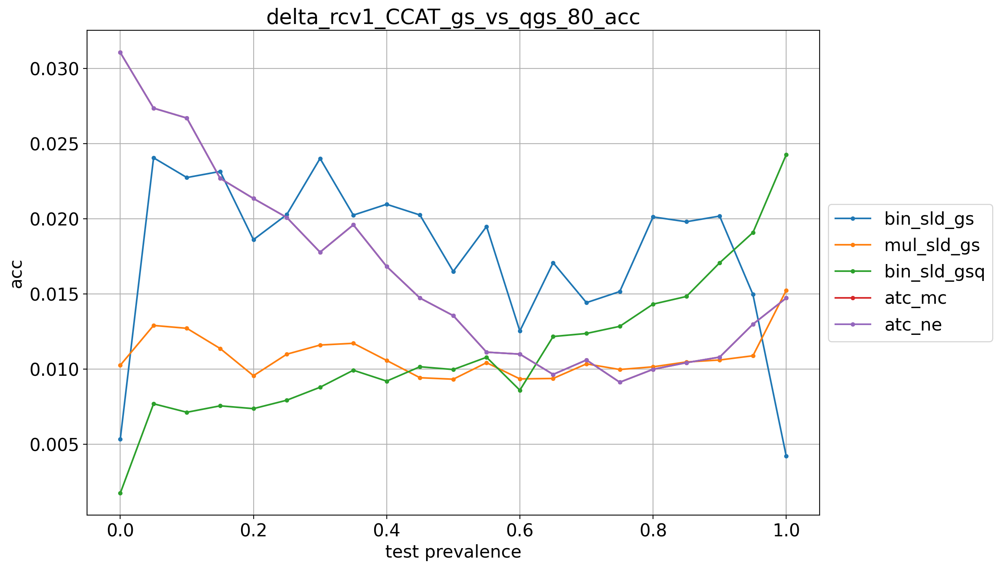
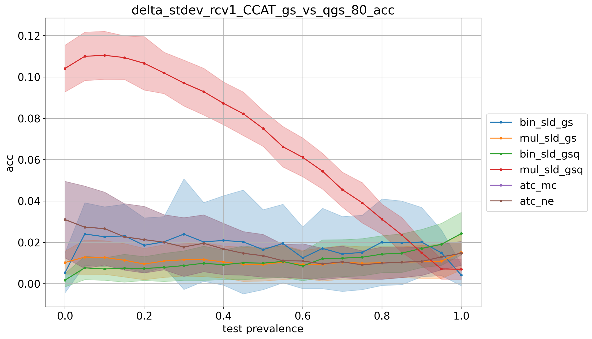
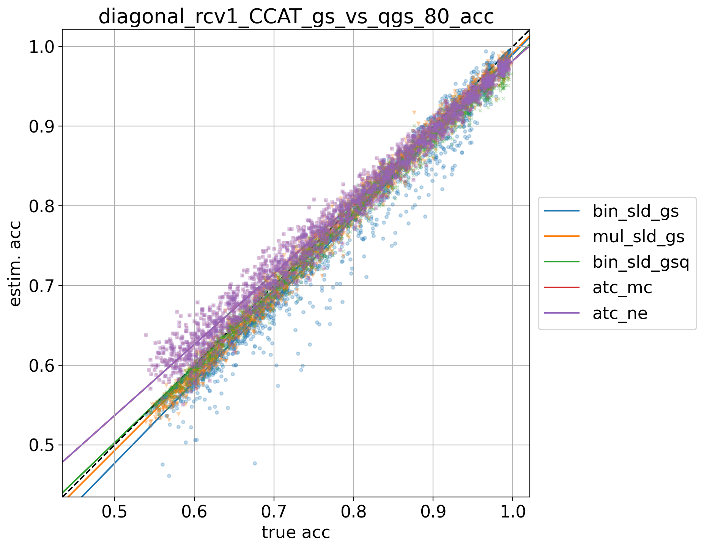
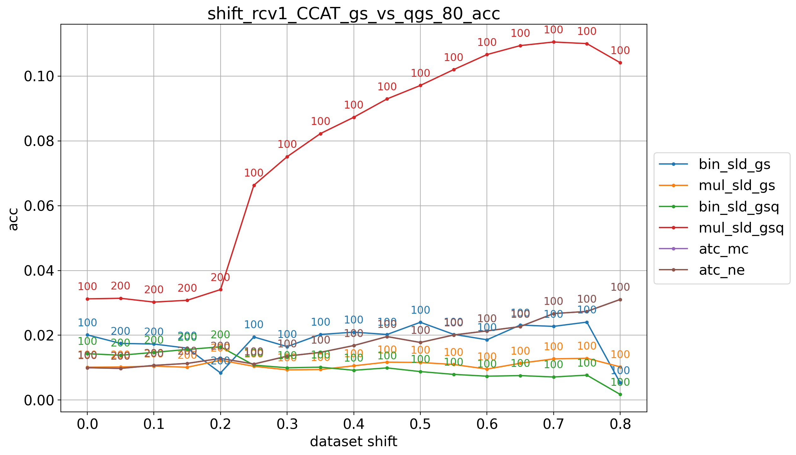

## 90% positives
> train: [0.09996662 0.90003338]  
> validation: [0.09996662 0.90003338]  
> bin_sld_gs: 930.393s  
> mul_sld_gs: 509.900s  
> bin_sld_gsq: 349.607s  
> mul_sld_gsq: 343.286s  
> ref: 47.328s  
> atc_mc: 49.802s  
> atc_ne: 51.229s  
> tot: 931.705s  

<table border="1" class="dataframe">
  <thead>
    <tr style="text-align: right;">
      <th></th>
      <th>bin_sld_gs</th>
      <th>mul_sld_gs</th>
      <th>bin_sld_gsq</th>
      <th>mul_sld_gsq</th>
      <th>atc_mc</th>
      <th>atc_ne</th>
    </tr>
  </thead>
  <tbody>
    <tr>
      <th>0.0</th>
      <td>0.0004</td>
      <td>0.0093</td>
      <td>0.0451</td>
      <td>0.1157</td>
      <td>0.1704</td>
      <td>0.1704</td>
    </tr>
    <tr>
      <th>0.05</th>
      <td>0.0054</td>
      <td>0.0169</td>
      <td>0.0642</td>
      <td>0.1212</td>
      <td>0.1614</td>
      <td>0.1614</td>
    </tr>
    <tr>
      <th>0.1</th>
      <td>0.0061</td>
      <td>0.0189</td>
      <td>0.0620</td>
      <td>0.1217</td>
      <td>0.1528</td>
      <td>0.1528</td>
    </tr>
    <tr>
      <th>0.15</th>
      <td>0.0061</td>
      <td>0.0211</td>
      <td>0.0592</td>
      <td>0.1205</td>
      <td>0.1426</td>
      <td>0.1426</td>
    </tr>
    <tr>
      <th>0.2</th>
      <td>0.0079</td>
      <td>0.0226</td>
      <td>0.0526</td>
      <td>0.1198</td>
      <td>0.1334</td>
      <td>0.1334</td>
    </tr>
    <tr>
      <th>0.25</th>
      <td>0.0074</td>
      <td>0.0178</td>
      <td>0.0500</td>
      <td>0.1121</td>
      <td>0.1217</td>
      <td>0.1217</td>
    </tr>
    <tr>
      <th>0.3</th>
      <td>0.0077</td>
      <td>0.0186</td>
      <td>0.0501</td>
      <td>0.1097</td>
      <td>0.1131</td>
      <td>0.1131</td>
    </tr>
    <tr>
      <th>0.35</th>
      <td>0.0081</td>
      <td>0.0152</td>
      <td>0.0458</td>
      <td>0.1031</td>
      <td>0.1040</td>
      <td>0.1040</td>
    </tr>
    <tr>
      <th>0.4</th>
      <td>0.0080</td>
      <td>0.0135</td>
      <td>0.0443</td>
      <td>0.0967</td>
      <td>0.0943</td>
      <td>0.0943</td>
    </tr>
    <tr>
      <th>0.45</th>
      <td>0.0095</td>
      <td>0.0136</td>
      <td>0.0415</td>
      <td>0.0931</td>
      <td>0.0847</td>
      <td>0.0847</td>
    </tr>
    <tr>
      <th>0.5</th>
      <td>0.0087</td>
      <td>0.0110</td>
      <td>0.0392</td>
      <td>0.0855</td>
      <td>0.0749</td>
      <td>0.0749</td>
    </tr>
    <tr>
      <th>0.55</th>
      <td>0.0068</td>
      <td>0.0081</td>
      <td>0.0390</td>
      <td>0.0754</td>
      <td>0.0622</td>
      <td>0.0622</td>
    </tr>
    <tr>
      <th>0.6</th>
      <td>0.0086</td>
      <td>0.0086</td>
      <td>0.0335</td>
      <td>0.0702</td>
      <td>0.0541</td>
      <td>0.0541</td>
    </tr>
    <tr>
      <th>0.65</th>
      <td>0.0082</td>
      <td>0.0088</td>
      <td>0.0347</td>
      <td>0.0602</td>
      <td>0.0422</td>
      <td>0.0422</td>
    </tr>
    <tr>
      <th>0.7</th>
      <td>0.0068</td>
      <td>0.0081</td>
      <td>0.0309</td>
      <td>0.0510</td>
      <td>0.0334</td>
      <td>0.0334</td>
    </tr>
    <tr>
      <th>0.75</th>
      <td>0.0070</td>
      <td>0.0095</td>
      <td>0.0277</td>
      <td>0.0425</td>
      <td>0.0239</td>
      <td>0.0239</td>
    </tr>
    <tr>
      <th>0.8</th>
      <td>0.0062</td>
      <td>0.0119</td>
      <td>0.0267</td>
      <td>0.0321</td>
      <td>0.0168</td>
      <td>0.0168</td>
    </tr>
    <tr>
      <th>0.85</th>
      <td>0.0067</td>
      <td>0.0147</td>
      <td>0.0252</td>
      <td>0.0228</td>
      <td>0.0090</td>
      <td>0.0090</td>
    </tr>
    <tr>
      <th>0.9</th>
      <td>0.0059</td>
      <td>0.0175</td>
      <td>0.0237</td>
      <td>0.0130</td>
      <td>0.0070</td>
      <td>0.0070</td>
    </tr>
    <tr>
      <th>0.95</th>
      <td>0.0067</td>
      <td>0.0216</td>
      <td>0.0222</td>
      <td>0.0044</td>
      <td>0.0134</td>
      <td>0.0134</td>
    </tr>
    <tr>
      <th>1.0</th>
      <td>0.0091</td>
      <td>0.0247</td>
      <td>0.0217</td>
      <td>0.0115</td>
      <td>0.0243</td>
      <td>0.0243</td>
    </tr>
    <tr>
      <th>avg</th>
      <td>0.0070</td>
      <td>0.0149</td>
      <td>0.0400</td>
      <td>0.0753</td>
      <td>0.0781</td>
      <td>0.0781</td>
    </tr>
  </tbody>
</table>

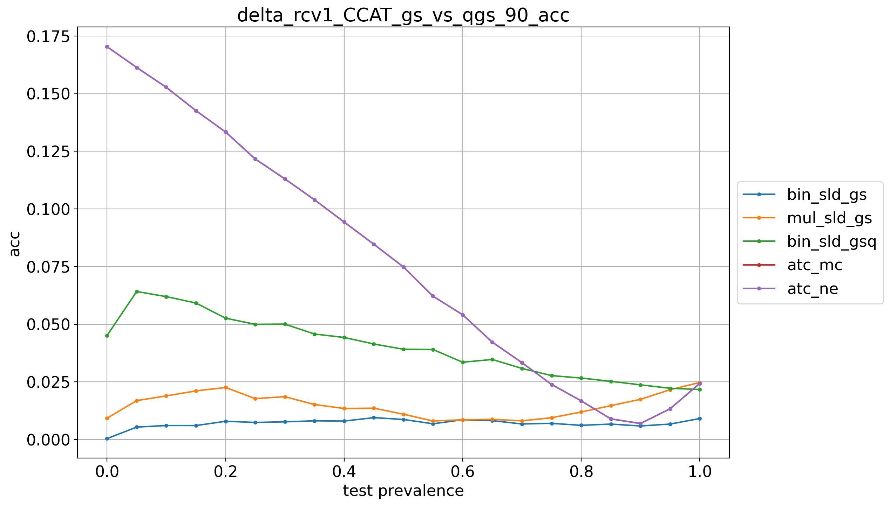
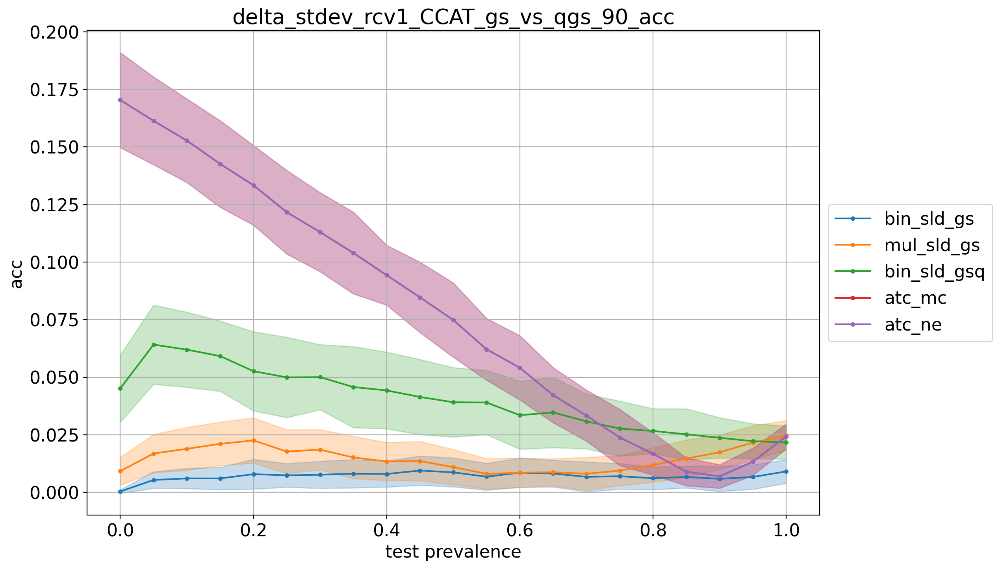
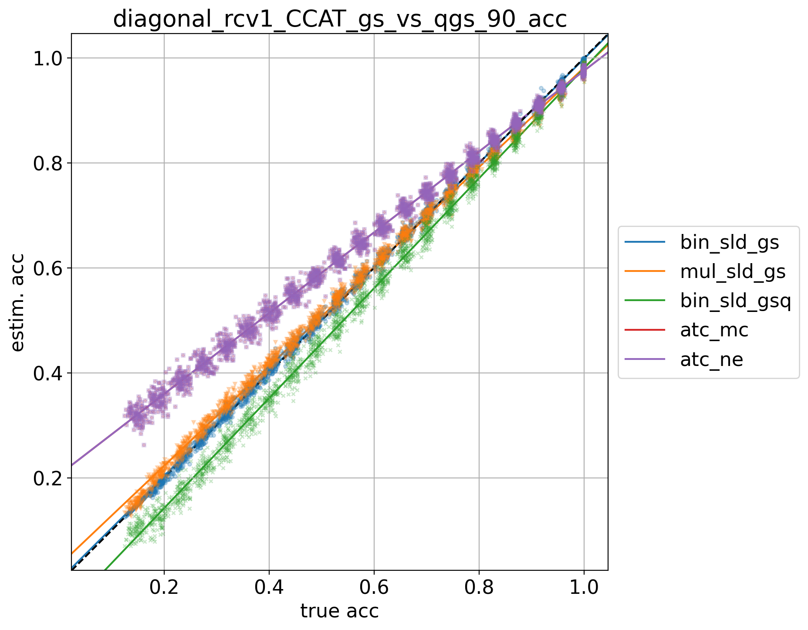
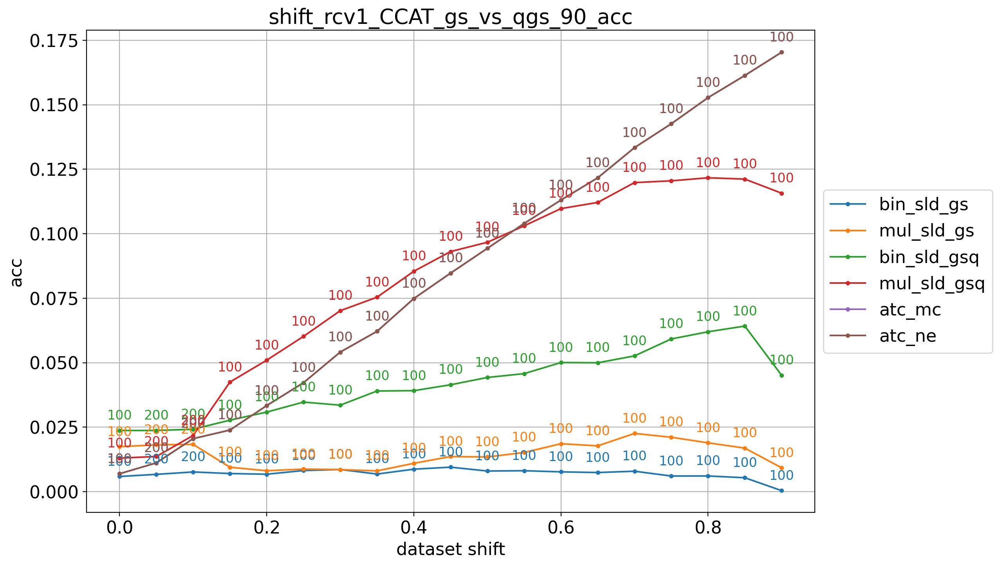

## avg
### avg on train
<table border="1" class="dataframe">
  <thead>
    <tr style="text-align: right;">
      <th></th>
      <th>bin_sld_gs</th>
      <th>mul_sld_gs</th>
      <th>bin_sld_gsq</th>
      <th>mul_sld_gsq</th>
      <th>atc_mc</th>
      <th>atc_ne</th>
    </tr>
  </thead>
  <tbody>
    <tr>
      <th>0.0</th>
      <td>0.0122</td>
      <td>0.0140</td>
      <td>0.0275</td>
      <td>0.0453</td>
      <td>0.0325</td>
      <td>0.0325</td>
    </tr>
    <tr>
      <th>0.05</th>
      <td>0.0178</td>
      <td>0.0146</td>
      <td>0.0321</td>
      <td>0.0516</td>
      <td>0.0294</td>
      <td>0.0294</td>
    </tr>
    <tr>
      <th>0.1</th>
      <td>0.0176</td>
      <td>0.0138</td>
      <td>0.0310</td>
      <td>0.0564</td>
      <td>0.0280</td>
      <td>0.0280</td>
    </tr>
    <tr>
      <th>0.15</th>
      <td>0.0177</td>
      <td>0.0140</td>
      <td>0.0307</td>
      <td>0.0603</td>
      <td>0.0264</td>
      <td>0.0264</td>
    </tr>
    <tr>
      <th>0.2</th>
      <td>0.0175</td>
      <td>0.0136</td>
      <td>0.0287</td>
      <td>0.0644</td>
      <td>0.0266</td>
      <td>0.0266</td>
    </tr>
    <tr>
      <th>0.25</th>
      <td>0.0176</td>
      <td>0.0139</td>
      <td>0.0280</td>
      <td>0.0655</td>
      <td>0.0252</td>
      <td>0.0252</td>
    </tr>
    <tr>
      <th>0.3</th>
      <td>0.0178</td>
      <td>0.0144</td>
      <td>0.0286</td>
      <td>0.0687</td>
      <td>0.0257</td>
      <td>0.0257</td>
    </tr>
    <tr>
      <th>0.35</th>
      <td>0.0178</td>
      <td>0.0144</td>
      <td>0.0283</td>
      <td>0.0707</td>
      <td>0.0267</td>
      <td>0.0267</td>
    </tr>
    <tr>
      <th>0.4</th>
      <td>0.0175</td>
      <td>0.0147</td>
      <td>0.0277</td>
      <td>0.0721</td>
      <td>0.0263</td>
      <td>0.0263</td>
    </tr>
    <tr>
      <th>0.45</th>
      <td>0.0170</td>
      <td>0.0149</td>
      <td>0.0273</td>
      <td>0.0738</td>
      <td>0.0265</td>
      <td>0.0265</td>
    </tr>
    <tr>
      <th>0.5</th>
      <td>0.0157</td>
      <td>0.0144</td>
      <td>0.0264</td>
      <td>0.0735</td>
      <td>0.0266</td>
      <td>0.0266</td>
    </tr>
    <tr>
      <th>0.55</th>
      <td>0.0151</td>
      <td>0.0148</td>
      <td>0.0260</td>
      <td>0.0742</td>
      <td>0.0268</td>
      <td>0.0268</td>
    </tr>
    <tr>
      <th>0.6</th>
      <td>0.0137</td>
      <td>0.0141</td>
      <td>0.0242</td>
      <td>0.0743</td>
      <td>0.0267</td>
      <td>0.0267</td>
    </tr>
    <tr>
      <th>0.65</th>
      <td>0.0146</td>
      <td>0.0152</td>
      <td>0.0249</td>
      <td>0.0760</td>
      <td>0.0285</td>
      <td>0.0285</td>
    </tr>
    <tr>
      <th>0.7</th>
      <td>0.0139</td>
      <td>0.0153</td>
      <td>0.0248</td>
      <td>0.0749</td>
      <td>0.0292</td>
      <td>0.0292</td>
    </tr>
    <tr>
      <th>0.75</th>
      <td>0.0137</td>
      <td>0.0151</td>
      <td>0.0248</td>
      <td>0.0745</td>
      <td>0.0296</td>
      <td>0.0296</td>
    </tr>
    <tr>
      <th>0.8</th>
      <td>0.0134</td>
      <td>0.0151</td>
      <td>0.0241</td>
      <td>0.0736</td>
      <td>0.0303</td>
      <td>0.0303</td>
    </tr>
    <tr>
      <th>0.85</th>
      <td>0.0132</td>
      <td>0.0153</td>
      <td>0.0240</td>
      <td>0.0724</td>
      <td>0.0319</td>
      <td>0.0319</td>
    </tr>
    <tr>
      <th>0.9</th>
      <td>0.0132</td>
      <td>0.0154</td>
      <td>0.0245</td>
      <td>0.0706</td>
      <td>0.0333</td>
      <td>0.0333</td>
    </tr>
    <tr>
      <th>0.95</th>
      <td>0.0123</td>
      <td>0.0155</td>
      <td>0.0234</td>
      <td>0.0677</td>
      <td>0.0357</td>
      <td>0.0357</td>
    </tr>
    <tr>
      <th>1.0</th>
      <td>0.0099</td>
      <td>0.0143</td>
      <td>0.0220</td>
      <td>0.0676</td>
      <td>0.0403</td>
      <td>0.0403</td>
    </tr>
    <tr>
      <th>avg</th>
      <td>0.0152</td>
      <td>0.0146</td>
      <td>0.0266</td>
      <td>0.0680</td>
      <td>0.0292</td>
      <td>0.0292</td>
    </tr>
  </tbody>
</table>

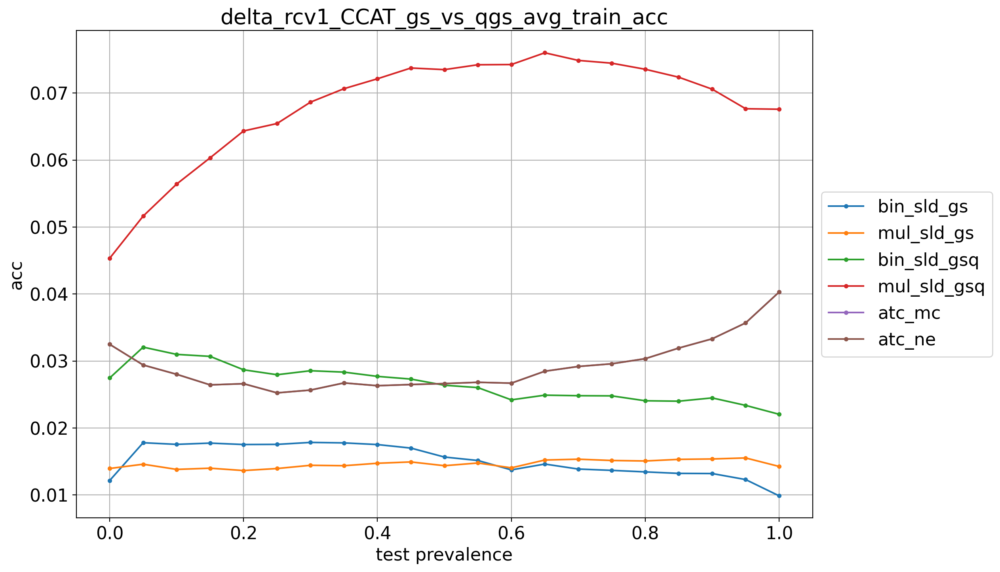
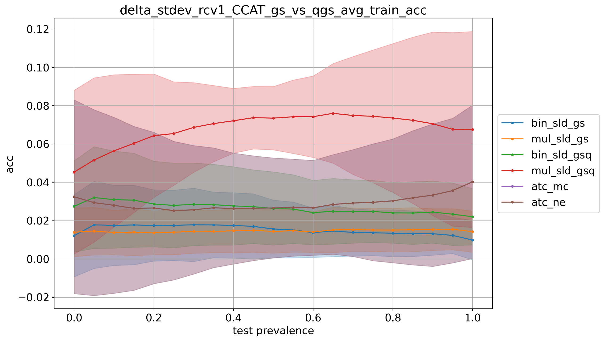
### avg on test
<table border="1" class="dataframe">
  <thead>
    <tr style="text-align: right;">
      <th></th>
      <th>bin_sld_gs</th>
      <th>mul_sld_gs</th>
      <th>bin_sld_gsq</th>
      <th>mul_sld_gsq</th>
      <th>atc_mc</th>
      <th>atc_ne</th>
    </tr>
  </thead>
  <tbody>
    <tr>
      <th>0.1</th>
      <td>0.0121</td>
      <td>0.0125</td>
      <td>NaN</td>
      <td>0.0952</td>
      <td>0.0644</td>
      <td>0.0644</td>
    </tr>
    <tr>
      <th>0.2</th>
      <td>0.0149</td>
      <td>0.0110</td>
      <td>0.0164</td>
      <td>0.0691</td>
      <td>0.0259</td>
      <td>0.0259</td>
    </tr>
    <tr>
      <th>0.3</th>
      <td>0.0083</td>
      <td>0.0114</td>
      <td>0.0268</td>
      <td>0.0716</td>
      <td>0.0280</td>
      <td>0.0280</td>
    </tr>
    <tr>
      <th>0.4</th>
      <td>0.0111</td>
      <td>0.0195</td>
      <td>0.0246</td>
      <td>0.0571</td>
      <td>0.0147</td>
      <td>0.0147</td>
    </tr>
    <tr>
      <th>0.5</th>
      <td>0.0134</td>
      <td>0.0117</td>
      <td>0.0116</td>
      <td>0.0595</td>
      <td>0.0140</td>
      <td>0.0140</td>
    </tr>
    <tr>
      <th>0.6</th>
      <td>0.0108</td>
      <td>0.0108</td>
      <td>0.0350</td>
      <td>0.0587</td>
      <td>0.0082</td>
      <td>0.0082</td>
    </tr>
    <tr>
      <th>0.7</th>
      <td>0.0414</td>
      <td>0.0289</td>
      <td>0.0473</td>
      <td>0.0574</td>
      <td>0.0128</td>
      <td>0.0128</td>
    </tr>
    <tr>
      <th>0.8</th>
      <td>0.0178</td>
      <td>0.0108</td>
      <td>0.0111</td>
      <td>0.0680</td>
      <td>0.0163</td>
      <td>0.0163</td>
    </tr>
    <tr>
      <th>0.9</th>
      <td>0.0070</td>
      <td>0.0149</td>
      <td>0.0400</td>
      <td>0.0753</td>
      <td>0.0781</td>
      <td>0.0781</td>
    </tr>
    <tr>
      <th>avg</th>
      <td>0.0152</td>
      <td>0.0146</td>
      <td>0.0266</td>
      <td>0.0680</td>
      <td>0.0292</td>
      <td>0.0292</td>
    </tr>
  </tbody>
</table>

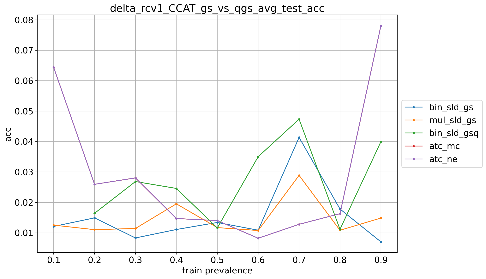
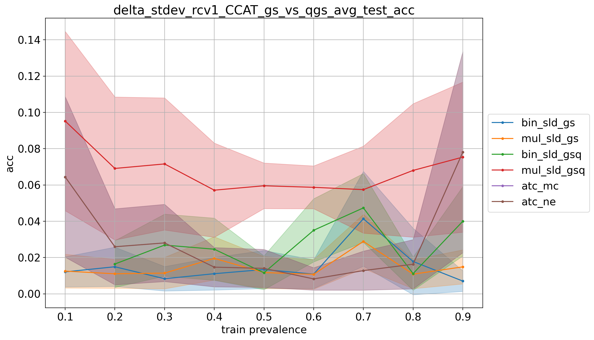
### avg dataset shift
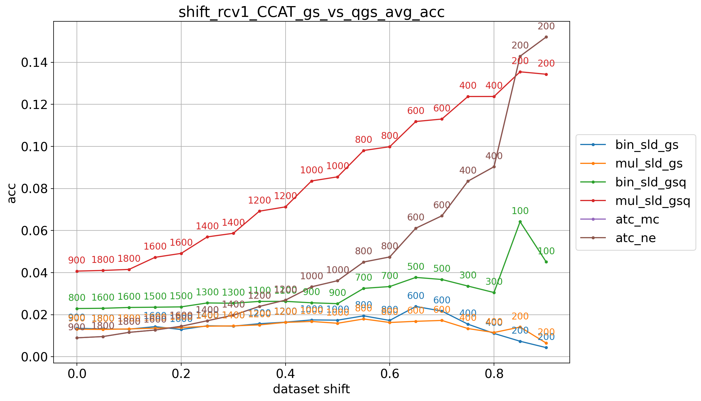
