# rcv1_CCAT_9prevs

## 10% positives
> train: [0.90003338 0.09996662]  
> validation: [0.90003338 0.09996662]  
> bin_sld_gs: 930.136s  
> mul_sld_gs: 542.605s  
> mul_sld_gsq: 364.070s  
> ref: 48.356s  
> atc_mc: 52.993s  
> atc_ne: 53.391s  
> tot: 931.432s  

<table border="1" class="dataframe">
  <thead>
    <tr style="text-align: right;">
      <th></th>
      <th>bin_sld_gs</th>
      <th>mul_sld_gs</th>
      <th>mul_sld_gsq</th>
      <th>atc_mc</th>
      <th>atc_ne</th>
    </tr>
  </thead>
  <tbody>
    <tr>
      <th>0.0</th>
      <td>0.0512</td>
      <td>0.0064</td>
      <td>0.0689</td>
      <td>0.0022</td>
      <td>0.0022</td>
    </tr>
    <tr>
      <th>0.05</th>
      <td>0.0481</td>
      <td>0.0503</td>
      <td>0.0919</td>
      <td>0.2253</td>
      <td>0.2253</td>
    </tr>
    <tr>
      <th>0.1</th>
      <td>0.0309</td>
      <td>0.0406</td>
      <td>0.0911</td>
      <td>0.1997</td>
      <td>0.1997</td>
    </tr>
    <tr>
      <th>0.15</th>
      <td>0.0231</td>
      <td>0.0331</td>
      <td>0.0898</td>
      <td>0.2018</td>
      <td>0.2018</td>
    </tr>
    <tr>
      <th>0.2</th>
      <td>0.0200</td>
      <td>0.0308</td>
      <td>0.0852</td>
      <td>0.1936</td>
      <td>0.1936</td>
    </tr>
    <tr>
      <th>0.25</th>
      <td>0.0178</td>
      <td>0.0277</td>
      <td>0.0826</td>
      <td>0.1943</td>
      <td>0.1943</td>
    </tr>
    <tr>
      <th>0.3</th>
      <td>0.0162</td>
      <td>0.0251</td>
      <td>0.0813</td>
      <td>0.1865</td>
      <td>0.1865</td>
    </tr>
    <tr>
      <th>0.35</th>
      <td>0.0152</td>
      <td>0.0220</td>
      <td>0.0825</td>
      <td>0.1849</td>
      <td>0.1849</td>
    </tr>
    <tr>
      <th>0.4</th>
      <td>0.0124</td>
      <td>0.0194</td>
      <td>0.0759</td>
      <td>0.1852</td>
      <td>0.1852</td>
    </tr>
    <tr>
      <th>0.45</th>
      <td>0.0113</td>
      <td>0.0190</td>
      <td>0.0752</td>
      <td>0.1824</td>
      <td>0.1824</td>
    </tr>
    <tr>
      <th>0.5</th>
      <td>0.0103</td>
      <td>0.0150</td>
      <td>0.0704</td>
      <td>0.1836</td>
      <td>0.1836</td>
    </tr>
    <tr>
      <th>0.55</th>
      <td>0.0095</td>
      <td>0.0151</td>
      <td>0.0702</td>
      <td>0.1801</td>
      <td>0.1801</td>
    </tr>
    <tr>
      <th>0.6</th>
      <td>0.0073</td>
      <td>0.0116</td>
      <td>0.0647</td>
      <td>0.1872</td>
      <td>0.1872</td>
    </tr>
    <tr>
      <th>0.65</th>
      <td>0.0081</td>
      <td>0.0107</td>
      <td>0.0643</td>
      <td>0.1871</td>
      <td>0.1871</td>
    </tr>
    <tr>
      <th>0.7</th>
      <td>0.0069</td>
      <td>0.0091</td>
      <td>0.0616</td>
      <td>0.1884</td>
      <td>0.1884</td>
    </tr>
    <tr>
      <th>0.75</th>
      <td>0.0063</td>
      <td>0.0082</td>
      <td>0.0598</td>
      <td>0.1829</td>
      <td>0.1829</td>
    </tr>
    <tr>
      <th>0.8</th>
      <td>0.0048</td>
      <td>0.0078</td>
      <td>0.0561</td>
      <td>0.1840</td>
      <td>0.1840</td>
    </tr>
    <tr>
      <th>0.85</th>
      <td>0.0040</td>
      <td>0.0069</td>
      <td>0.0534</td>
      <td>0.1816</td>
      <td>0.1816</td>
    </tr>
    <tr>
      <th>0.9</th>
      <td>0.0036</td>
      <td>0.0062</td>
      <td>0.0514</td>
      <td>0.1818</td>
      <td>0.1818</td>
    </tr>
    <tr>
      <th>0.95</th>
      <td>0.0029</td>
      <td>0.0065</td>
      <td>0.0461</td>
      <td>0.1848</td>
      <td>0.1848</td>
    </tr>
    <tr>
      <th>1.0</th>
      <td>0.0027</td>
      <td>0.0046</td>
      <td>0.0433</td>
      <td>0.1850</td>
      <td>0.1850</td>
    </tr>
    <tr>
      <th>avg</th>
      <td>0.0149</td>
      <td>0.0179</td>
      <td>0.0698</td>
      <td>0.1801</td>
      <td>0.1801</td>
    </tr>
  </tbody>
</table>

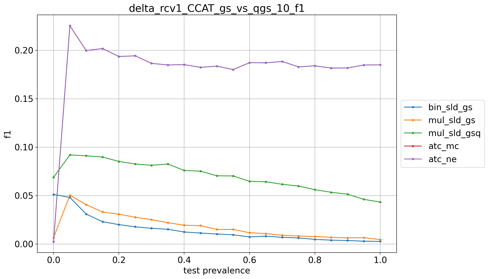
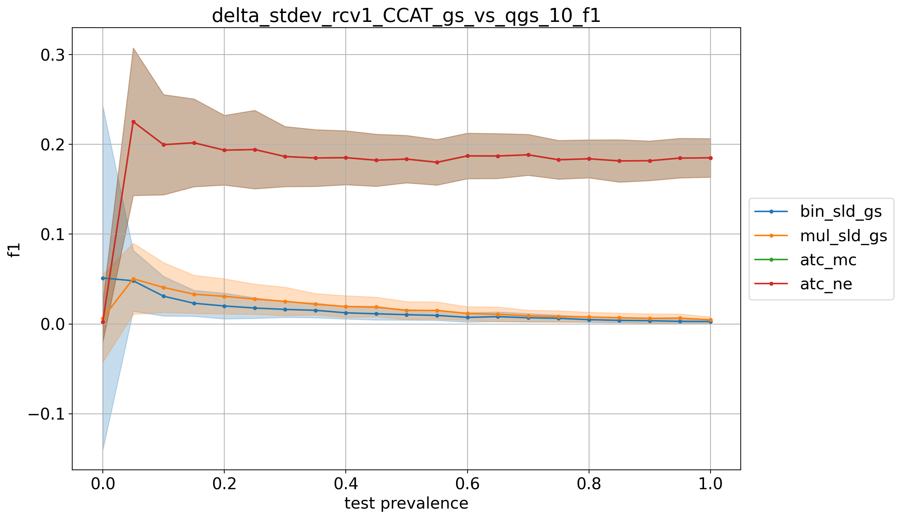
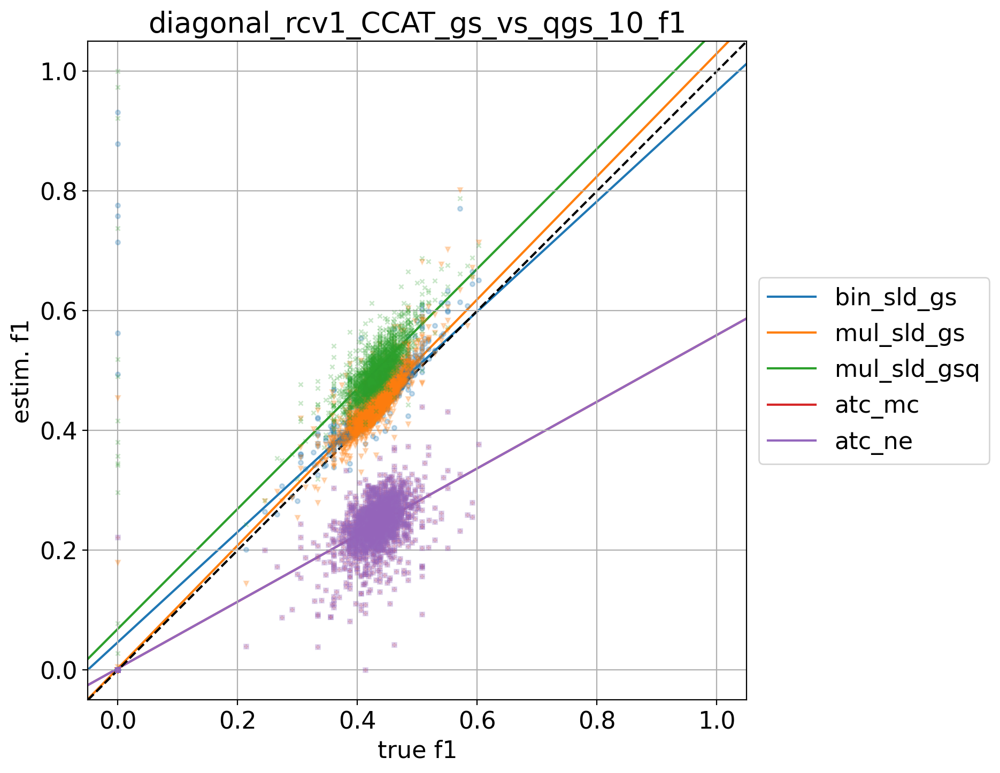
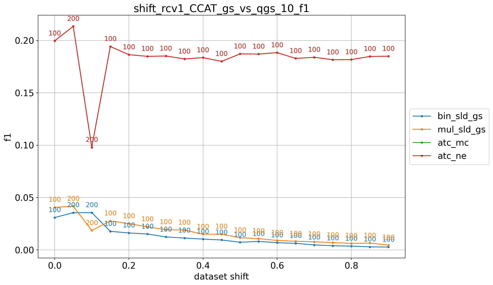

## 20% positives
> train: [0.79989987 0.20010013]  
> validation: [0.80006676 0.19993324]  
> bin_sld_gs: 982.326s  
> mul_sld_gs: 545.028s  
> bin_sld_gsq: 379.616s  
> mul_sld_gsq: 375.235s  
> ref: 55.221s  
> atc_mc: 59.389s  
> atc_ne: 59.739s  
> tot: 983.724s  

<table border="1" class="dataframe">
  <thead>
    <tr style="text-align: right;">
      <th></th>
      <th>bin_sld_gs</th>
      <th>mul_sld_gs</th>
      <th>bin_sld_gsq</th>
      <th>mul_sld_gsq</th>
      <th>atc_mc</th>
      <th>atc_ne</th>
    </tr>
  </thead>
  <tbody>
    <tr>
      <th>0.0</th>
      <td>0.0655</td>
      <td>0.0354</td>
      <td>0.0478</td>
      <td>0.3040</td>
      <td>0.1159</td>
      <td>0.1159</td>
    </tr>
    <tr>
      <th>0.05</th>
      <td>0.0845</td>
      <td>0.0846</td>
      <td>0.0662</td>
      <td>0.0521</td>
      <td>0.1303</td>
      <td>0.1303</td>
    </tr>
    <tr>
      <th>0.1</th>
      <td>0.0604</td>
      <td>0.0475</td>
      <td>0.0493</td>
      <td>0.0668</td>
      <td>0.0916</td>
      <td>0.0916</td>
    </tr>
    <tr>
      <th>0.15</th>
      <td>0.0462</td>
      <td>0.0286</td>
      <td>0.0344</td>
      <td>0.0694</td>
      <td>0.0794</td>
      <td>0.0794</td>
    </tr>
    <tr>
      <th>0.2</th>
      <td>0.0382</td>
      <td>0.0215</td>
      <td>0.0317</td>
      <td>0.0792</td>
      <td>0.0673</td>
      <td>0.0673</td>
    </tr>
    <tr>
      <th>0.25</th>
      <td>0.0334</td>
      <td>0.0185</td>
      <td>0.0261</td>
      <td>0.0796</td>
      <td>0.0623</td>
      <td>0.0623</td>
    </tr>
    <tr>
      <th>0.3</th>
      <td>0.0325</td>
      <td>0.0143</td>
      <td>0.0258</td>
      <td>0.0817</td>
      <td>0.0592</td>
      <td>0.0592</td>
    </tr>
    <tr>
      <th>0.35</th>
      <td>0.0276</td>
      <td>0.0118</td>
      <td>0.0224</td>
      <td>0.0824</td>
      <td>0.0518</td>
      <td>0.0518</td>
    </tr>
    <tr>
      <th>0.4</th>
      <td>0.0260</td>
      <td>0.0120</td>
      <td>0.0213</td>
      <td>0.0830</td>
      <td>0.0536</td>
      <td>0.0536</td>
    </tr>
    <tr>
      <th>0.45</th>
      <td>0.0252</td>
      <td>0.0112</td>
      <td>0.0229</td>
      <td>0.0807</td>
      <td>0.0510</td>
      <td>0.0510</td>
    </tr>
    <tr>
      <th>0.5</th>
      <td>0.0252</td>
      <td>0.0098</td>
      <td>0.0234</td>
      <td>0.0791</td>
      <td>0.0518</td>
      <td>0.0518</td>
    </tr>
    <tr>
      <th>0.55</th>
      <td>0.0237</td>
      <td>0.0098</td>
      <td>0.0230</td>
      <td>0.0807</td>
      <td>0.0533</td>
      <td>0.0533</td>
    </tr>
    <tr>
      <th>0.6</th>
      <td>0.0213</td>
      <td>0.0088</td>
      <td>0.0218</td>
      <td>0.0769</td>
      <td>0.0506</td>
      <td>0.0506</td>
    </tr>
    <tr>
      <th>0.65</th>
      <td>0.0223</td>
      <td>0.0095</td>
      <td>0.0217</td>
      <td>0.0773</td>
      <td>0.0480</td>
      <td>0.0480</td>
    </tr>
    <tr>
      <th>0.7</th>
      <td>0.0195</td>
      <td>0.0097</td>
      <td>0.0210</td>
      <td>0.0765</td>
      <td>0.0453</td>
      <td>0.0453</td>
    </tr>
    <tr>
      <th>0.75</th>
      <td>0.0203</td>
      <td>0.0091</td>
      <td>0.0232</td>
      <td>0.0734</td>
      <td>0.0428</td>
      <td>0.0428</td>
    </tr>
    <tr>
      <th>0.8</th>
      <td>0.0200</td>
      <td>0.0073</td>
      <td>0.0237</td>
      <td>0.0707</td>
      <td>0.0472</td>
      <td>0.0472</td>
    </tr>
    <tr>
      <th>0.85</th>
      <td>0.0202</td>
      <td>0.0066</td>
      <td>0.0246</td>
      <td>0.0695</td>
      <td>0.0461</td>
      <td>0.0461</td>
    </tr>
    <tr>
      <th>0.9</th>
      <td>0.0202</td>
      <td>0.0065</td>
      <td>0.0259</td>
      <td>0.0675</td>
      <td>0.0439</td>
      <td>0.0439</td>
    </tr>
    <tr>
      <th>0.95</th>
      <td>0.0202</td>
      <td>0.0055</td>
      <td>0.0259</td>
      <td>0.0640</td>
      <td>0.0468</td>
      <td>0.0468</td>
    </tr>
    <tr>
      <th>1.0</th>
      <td>0.0202</td>
      <td>0.0048</td>
      <td>0.0225</td>
      <td>0.0606</td>
      <td>0.0425</td>
      <td>0.0425</td>
    </tr>
    <tr>
      <th>avg</th>
      <td>0.0320</td>
      <td>0.0178</td>
      <td>0.0288</td>
      <td>0.0845</td>
      <td>0.0610</td>
      <td>0.0610</td>
    </tr>
  </tbody>
</table>

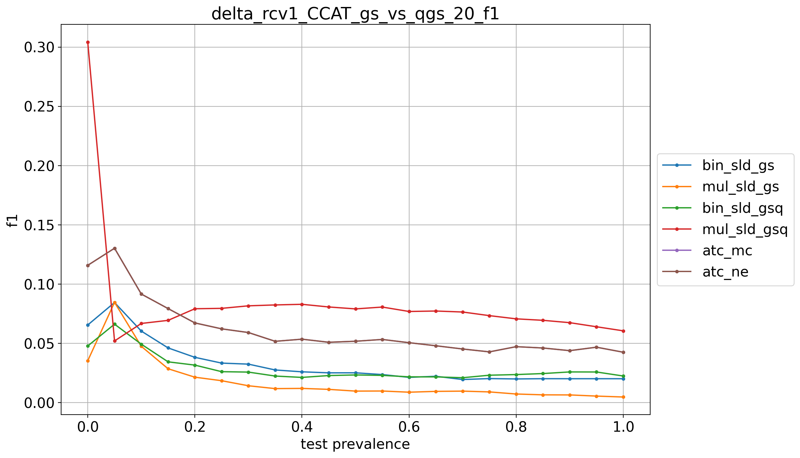
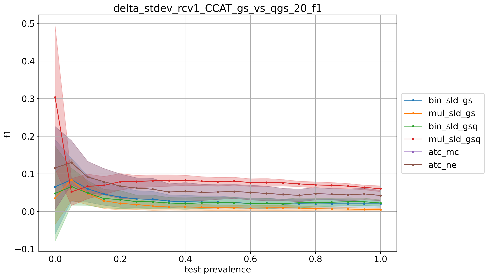
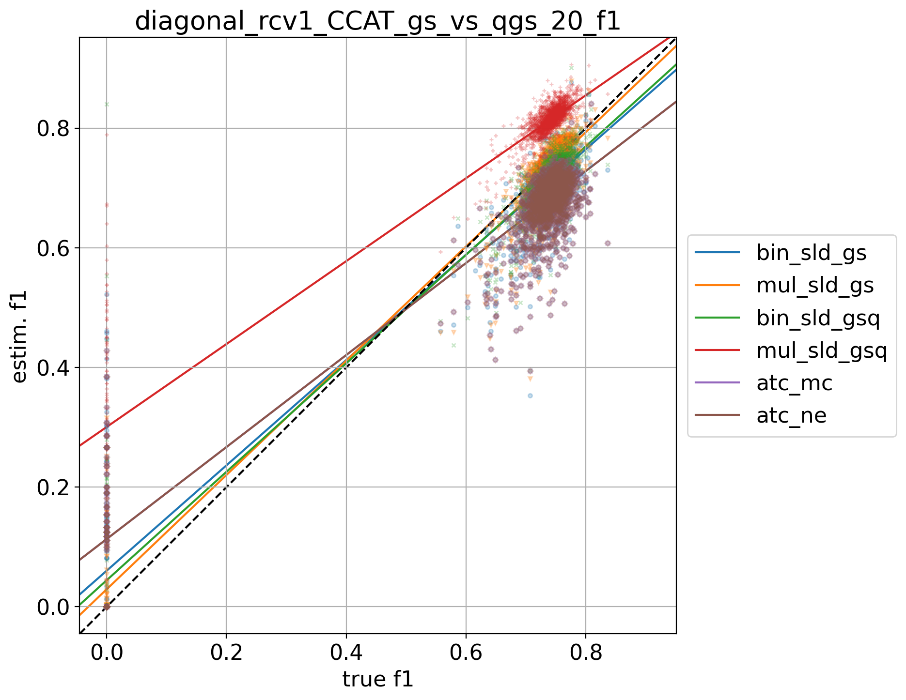
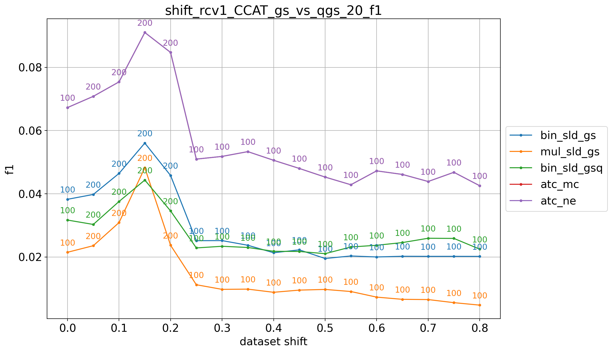

## 30% positives
> train: [0.69993324 0.30006676]  
> validation: [0.70010013 0.29989987]  
> bin_sld_gs: 1003.780s  
> mul_sld_gs: 540.827s  
> bin_sld_gsq: 377.338s  
> mul_sld_gsq: 372.261s  
> ref: 49.980s  
> atc_mc: 53.377s  
> atc_ne: 53.893s  
> tot: 1005.251s  

<table border="1" class="dataframe">
  <thead>
    <tr style="text-align: right;">
      <th></th>
      <th>bin_sld_gs</th>
      <th>mul_sld_gs</th>
      <th>bin_sld_gsq</th>
      <th>mul_sld_gsq</th>
      <th>atc_mc</th>
      <th>atc_ne</th>
    </tr>
  </thead>
  <tbody>
    <tr>
      <th>0.0</th>
      <td>0.0020</td>
      <td>0.0138</td>
      <td>0.0152</td>
      <td>0.5613</td>
      <td>0.3301</td>
      <td>0.3301</td>
    </tr>
    <tr>
      <th>0.05</th>
      <td>0.0673</td>
      <td>0.0644</td>
      <td>0.1145</td>
      <td>0.1410</td>
      <td>0.0519</td>
      <td>0.0519</td>
    </tr>
    <tr>
      <th>0.1</th>
      <td>0.0411</td>
      <td>0.0381</td>
      <td>0.0790</td>
      <td>0.1109</td>
      <td>0.0306</td>
      <td>0.0306</td>
    </tr>
    <tr>
      <th>0.15</th>
      <td>0.0324</td>
      <td>0.0313</td>
      <td>0.0603</td>
      <td>0.1025</td>
      <td>0.0252</td>
      <td>0.0252</td>
    </tr>
    <tr>
      <th>0.2</th>
      <td>0.0230</td>
      <td>0.0228</td>
      <td>0.0468</td>
      <td>0.0999</td>
      <td>0.0190</td>
      <td>0.0190</td>
    </tr>
    <tr>
      <th>0.25</th>
      <td>0.0199</td>
      <td>0.0229</td>
      <td>0.0417</td>
      <td>0.0946</td>
      <td>0.0167</td>
      <td>0.0167</td>
    </tr>
    <tr>
      <th>0.3</th>
      <td>0.0159</td>
      <td>0.0200</td>
      <td>0.0404</td>
      <td>0.0931</td>
      <td>0.0132</td>
      <td>0.0132</td>
    </tr>
    <tr>
      <th>0.35</th>
      <td>0.0158</td>
      <td>0.0177</td>
      <td>0.0380</td>
      <td>0.0913</td>
      <td>0.0170</td>
      <td>0.0170</td>
    </tr>
    <tr>
      <th>0.4</th>
      <td>0.0144</td>
      <td>0.0175</td>
      <td>0.0365</td>
      <td>0.0897</td>
      <td>0.0141</td>
      <td>0.0141</td>
    </tr>
    <tr>
      <th>0.45</th>
      <td>0.0114</td>
      <td>0.0161</td>
      <td>0.0338</td>
      <td>0.0868</td>
      <td>0.0135</td>
      <td>0.0135</td>
    </tr>
    <tr>
      <th>0.5</th>
      <td>0.0100</td>
      <td>0.0136</td>
      <td>0.0321</td>
      <td>0.0833</td>
      <td>0.0153</td>
      <td>0.0153</td>
    </tr>
    <tr>
      <th>0.55</th>
      <td>0.0086</td>
      <td>0.0136</td>
      <td>0.0310</td>
      <td>0.0824</td>
      <td>0.0146</td>
      <td>0.0146</td>
    </tr>
    <tr>
      <th>0.6</th>
      <td>0.0075</td>
      <td>0.0127</td>
      <td>0.0296</td>
      <td>0.0798</td>
      <td>0.0142</td>
      <td>0.0142</td>
    </tr>
    <tr>
      <th>0.65</th>
      <td>0.0071</td>
      <td>0.0122</td>
      <td>0.0298</td>
      <td>0.0800</td>
      <td>0.0159</td>
      <td>0.0159</td>
    </tr>
    <tr>
      <th>0.7</th>
      <td>0.0056</td>
      <td>0.0103</td>
      <td>0.0305</td>
      <td>0.0775</td>
      <td>0.0145</td>
      <td>0.0145</td>
    </tr>
    <tr>
      <th>0.75</th>
      <td>0.0055</td>
      <td>0.0090</td>
      <td>0.0306</td>
      <td>0.0745</td>
      <td>0.0144</td>
      <td>0.0144</td>
    </tr>
    <tr>
      <th>0.8</th>
      <td>0.0047</td>
      <td>0.0075</td>
      <td>0.0290</td>
      <td>0.0733</td>
      <td>0.0157</td>
      <td>0.0157</td>
    </tr>
    <tr>
      <th>0.85</th>
      <td>0.0041</td>
      <td>0.0078</td>
      <td>0.0290</td>
      <td>0.0711</td>
      <td>0.0168</td>
      <td>0.0168</td>
    </tr>
    <tr>
      <th>0.9</th>
      <td>0.0041</td>
      <td>0.0059</td>
      <td>0.0289</td>
      <td>0.0678</td>
      <td>0.0155</td>
      <td>0.0155</td>
    </tr>
    <tr>
      <th>0.95</th>
      <td>0.0039</td>
      <td>0.0054</td>
      <td>0.0280</td>
      <td>0.0651</td>
      <td>0.0152</td>
      <td>0.0152</td>
    </tr>
    <tr>
      <th>1.0</th>
      <td>0.0010</td>
      <td>0.0038</td>
      <td>0.0250</td>
      <td>0.0614</td>
      <td>0.0177</td>
      <td>0.0177</td>
    </tr>
    <tr>
      <th>avg</th>
      <td>0.0145</td>
      <td>0.0174</td>
      <td>0.0395</td>
      <td>0.1089</td>
      <td>0.0334</td>
      <td>0.0334</td>
    </tr>
  </tbody>
</table>

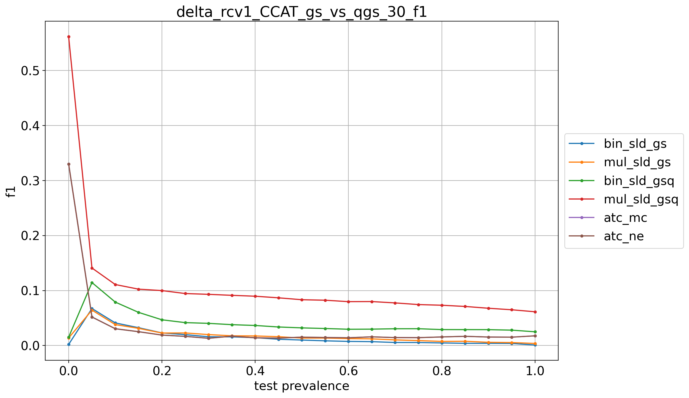
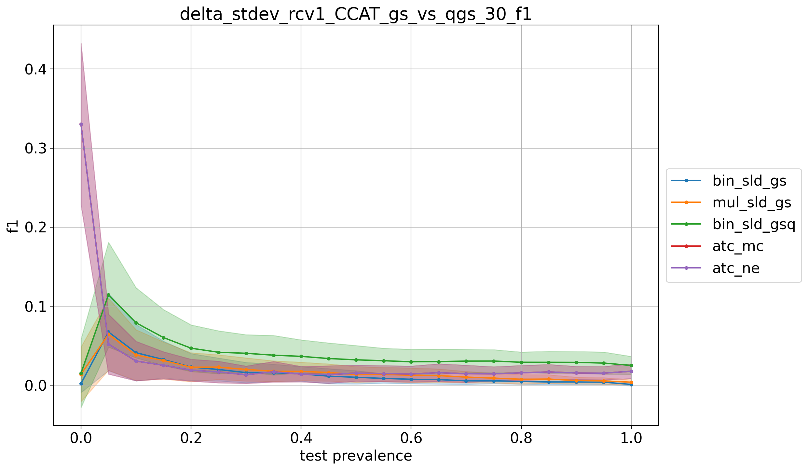
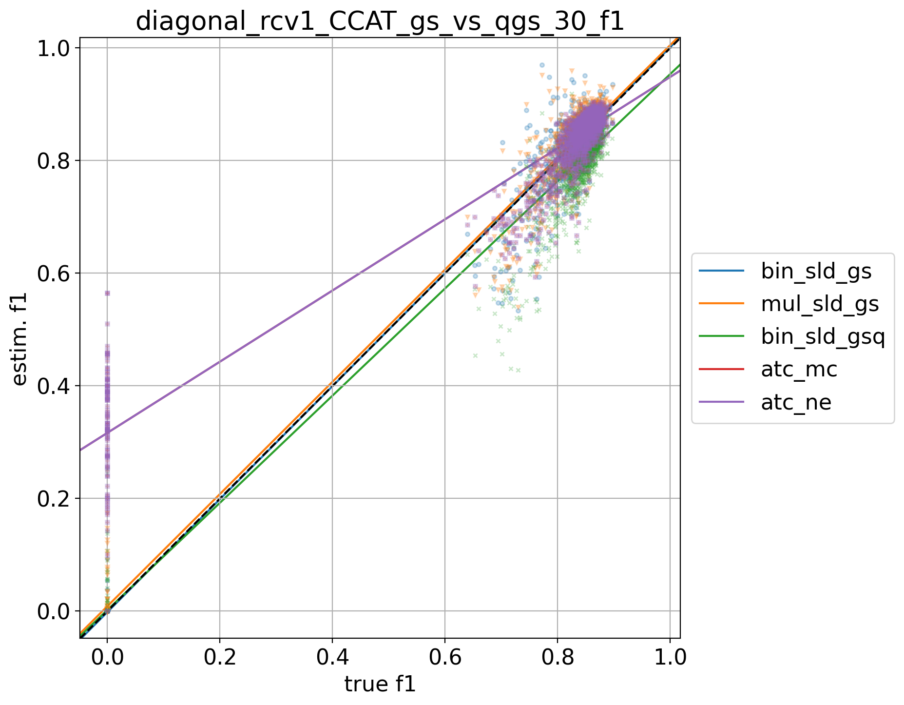
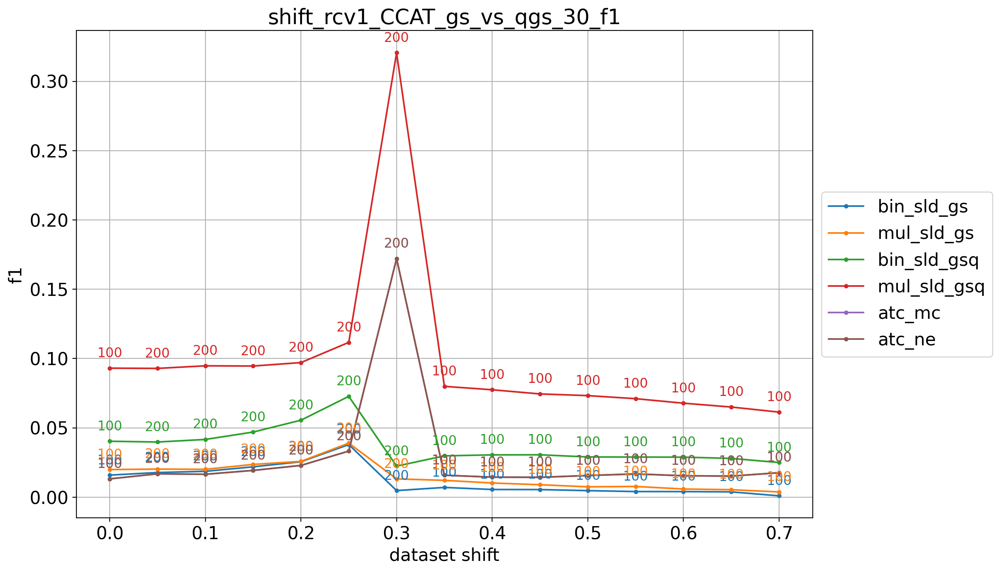

## 40% positives
> train: [0.59996662 0.40003338]  
> validation: [0.59996662 0.40003338]  
> bin_sld_gs: 1001.080s  
> mul_sld_gs: 539.153s  
> bin_sld_gsq: 387.618s  
> mul_sld_gsq: 371.446s  
> ref: 49.888s  
> atc_mc: 53.359s  
> atc_ne: 53.516s  
> tot: 1002.309s  

<table border="1" class="dataframe">
  <thead>
    <tr style="text-align: right;">
      <th></th>
      <th>bin_sld_gs</th>
      <th>mul_sld_gs</th>
      <th>bin_sld_gsq</th>
      <th>mul_sld_gsq</th>
      <th>atc_mc</th>
      <th>atc_ne</th>
    </tr>
  </thead>
  <tbody>
    <tr>
      <th>0.0</th>
      <td>0.0002</td>
      <td>0.1691</td>
      <td>0.0148</td>
      <td>0.5839</td>
      <td>0.3564</td>
      <td>0.3564</td>
    </tr>
    <tr>
      <th>0.05</th>
      <td>0.0794</td>
      <td>0.0520</td>
      <td>0.1774</td>
      <td>0.1627</td>
      <td>0.0506</td>
      <td>0.0506</td>
    </tr>
    <tr>
      <th>0.1</th>
      <td>0.0457</td>
      <td>0.0281</td>
      <td>0.1326</td>
      <td>0.1153</td>
      <td>0.0460</td>
      <td>0.0460</td>
    </tr>
    <tr>
      <th>0.15</th>
      <td>0.0349</td>
      <td>0.0247</td>
      <td>0.0929</td>
      <td>0.0968</td>
      <td>0.0318</td>
      <td>0.0318</td>
    </tr>
    <tr>
      <th>0.2</th>
      <td>0.0295</td>
      <td>0.0184</td>
      <td>0.0718</td>
      <td>0.0879</td>
      <td>0.0254</td>
      <td>0.0254</td>
    </tr>
    <tr>
      <th>0.25</th>
      <td>0.0277</td>
      <td>0.0177</td>
      <td>0.0522</td>
      <td>0.0803</td>
      <td>0.0197</td>
      <td>0.0197</td>
    </tr>
    <tr>
      <th>0.3</th>
      <td>0.0204</td>
      <td>0.0162</td>
      <td>0.0475</td>
      <td>0.0755</td>
      <td>0.0174</td>
      <td>0.0174</td>
    </tr>
    <tr>
      <th>0.35</th>
      <td>0.0203</td>
      <td>0.0160</td>
      <td>0.0404</td>
      <td>0.0719</td>
      <td>0.0129</td>
      <td>0.0129</td>
    </tr>
    <tr>
      <th>0.4</th>
      <td>0.0187</td>
      <td>0.0171</td>
      <td>0.0314</td>
      <td>0.0685</td>
      <td>0.0118</td>
      <td>0.0118</td>
    </tr>
    <tr>
      <th>0.45</th>
      <td>0.0138</td>
      <td>0.0170</td>
      <td>0.0287</td>
      <td>0.0662</td>
      <td>0.0095</td>
      <td>0.0095</td>
    </tr>
    <tr>
      <th>0.5</th>
      <td>0.0125</td>
      <td>0.0172</td>
      <td>0.0224</td>
      <td>0.0629</td>
      <td>0.0088</td>
      <td>0.0088</td>
    </tr>
    <tr>
      <th>0.55</th>
      <td>0.0099</td>
      <td>0.0192</td>
      <td>0.0181</td>
      <td>0.0617</td>
      <td>0.0085</td>
      <td>0.0085</td>
    </tr>
    <tr>
      <th>0.6</th>
      <td>0.0092</td>
      <td>0.0188</td>
      <td>0.0149</td>
      <td>0.0586</td>
      <td>0.0078</td>
      <td>0.0078</td>
    </tr>
    <tr>
      <th>0.65</th>
      <td>0.0081</td>
      <td>0.0198</td>
      <td>0.0126</td>
      <td>0.0594</td>
      <td>0.0093</td>
      <td>0.0093</td>
    </tr>
    <tr>
      <th>0.7</th>
      <td>0.0084</td>
      <td>0.0189</td>
      <td>0.0112</td>
      <td>0.0572</td>
      <td>0.0090</td>
      <td>0.0090</td>
    </tr>
    <tr>
      <th>0.75</th>
      <td>0.0068</td>
      <td>0.0187</td>
      <td>0.0104</td>
      <td>0.0551</td>
      <td>0.0075</td>
      <td>0.0075</td>
    </tr>
    <tr>
      <th>0.8</th>
      <td>0.0061</td>
      <td>0.0192</td>
      <td>0.0075</td>
      <td>0.0540</td>
      <td>0.0066</td>
      <td>0.0066</td>
    </tr>
    <tr>
      <th>0.85</th>
      <td>0.0068</td>
      <td>0.0192</td>
      <td>0.0073</td>
      <td>0.0530</td>
      <td>0.0084</td>
      <td>0.0084</td>
    </tr>
    <tr>
      <th>0.9</th>
      <td>0.0071</td>
      <td>0.0171</td>
      <td>0.0060</td>
      <td>0.0507</td>
      <td>0.0078</td>
      <td>0.0078</td>
    </tr>
    <tr>
      <th>0.95</th>
      <td>0.0072</td>
      <td>0.0167</td>
      <td>0.0051</td>
      <td>0.0484</td>
      <td>0.0097</td>
      <td>0.0097</td>
    </tr>
    <tr>
      <th>1.0</th>
      <td>0.0008</td>
      <td>0.0128</td>
      <td>0.0047</td>
      <td>0.0462</td>
      <td>0.0090</td>
      <td>0.0090</td>
    </tr>
    <tr>
      <th>avg</th>
      <td>0.0178</td>
      <td>0.0273</td>
      <td>0.0386</td>
      <td>0.0960</td>
      <td>0.0321</td>
      <td>0.0321</td>
    </tr>
  </tbody>
</table>

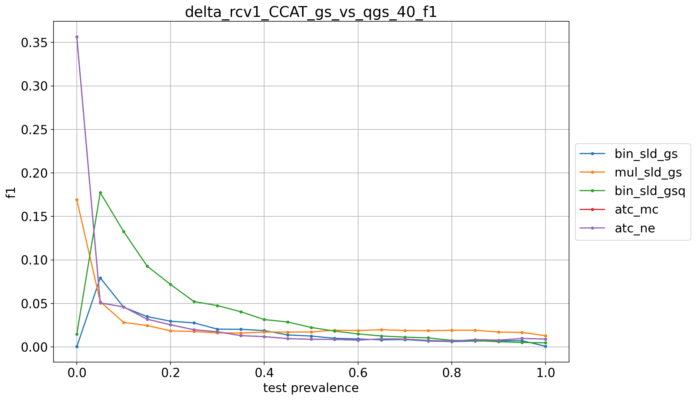
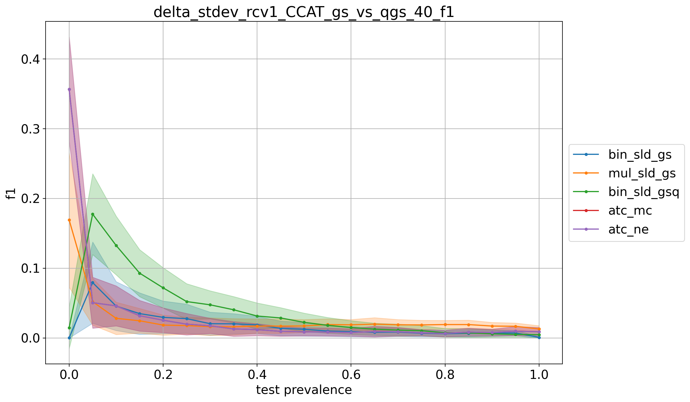
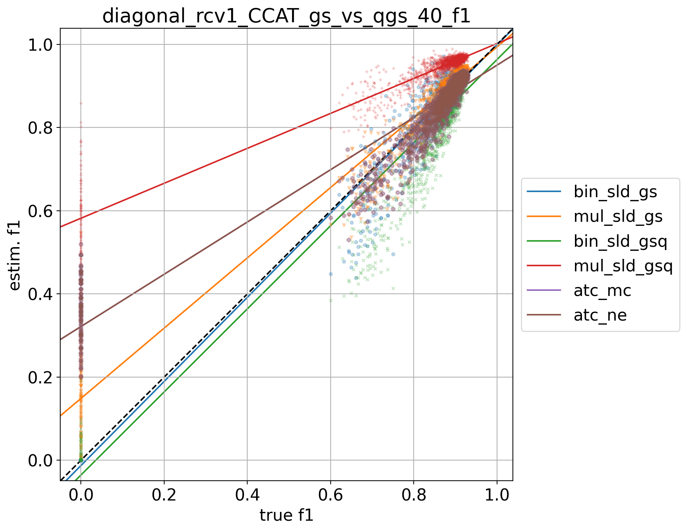
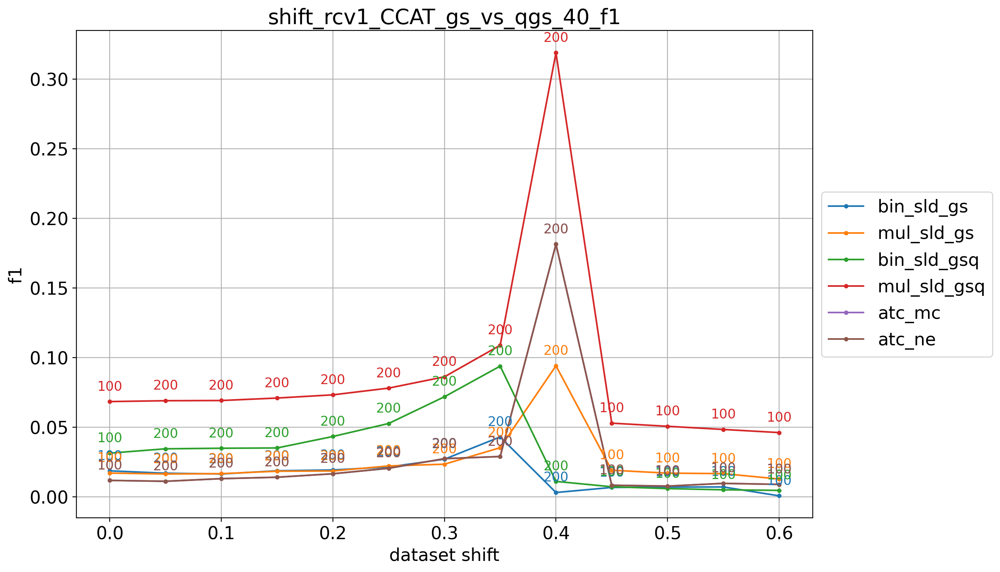

## 50% positives
> train: [0.5 0.5]  
> validation: [0.5 0.5]  
> bin_sld_gs: 982.440s  
> mul_sld_gs: 518.569s  
> bin_sld_gsq: 376.012s  
> mul_sld_gsq: 354.371s  
> ref: 47.222s  
> atc_mc: 49.635s  
> atc_ne: 50.908s  
> tot: 983.784s  

<table border="1" class="dataframe">
  <thead>
    <tr style="text-align: right;">
      <th></th>
      <th>bin_sld_gs</th>
      <th>mul_sld_gs</th>
      <th>bin_sld_gsq</th>
      <th>mul_sld_gsq</th>
      <th>atc_mc</th>
      <th>atc_ne</th>
    </tr>
  </thead>
  <tbody>
    <tr>
      <th>0.0</th>
      <td>0.0069</td>
      <td>0.0262</td>
      <td>0.0040</td>
      <td>0.7055</td>
      <td>0.5135</td>
      <td>0.5135</td>
    </tr>
    <tr>
      <th>0.05</th>
      <td>0.0691</td>
      <td>0.0584</td>
      <td>0.0553</td>
      <td>0.3014</td>
      <td>0.1066</td>
      <td>0.1066</td>
    </tr>
    <tr>
      <th>0.1</th>
      <td>0.0500</td>
      <td>0.0402</td>
      <td>0.0345</td>
      <td>0.1986</td>
      <td>0.0476</td>
      <td>0.0476</td>
    </tr>
    <tr>
      <th>0.15</th>
      <td>0.0381</td>
      <td>0.0335</td>
      <td>0.0333</td>
      <td>0.1516</td>
      <td>0.0306</td>
      <td>0.0306</td>
    </tr>
    <tr>
      <th>0.2</th>
      <td>0.0294</td>
      <td>0.0231</td>
      <td>0.0293</td>
      <td>0.1285</td>
      <td>0.0235</td>
      <td>0.0235</td>
    </tr>
    <tr>
      <th>0.25</th>
      <td>0.0237</td>
      <td>0.0193</td>
      <td>0.0249</td>
      <td>0.1058</td>
      <td>0.0158</td>
      <td>0.0158</td>
    </tr>
    <tr>
      <th>0.3</th>
      <td>0.0236</td>
      <td>0.0194</td>
      <td>0.0214</td>
      <td>0.0949</td>
      <td>0.0147</td>
      <td>0.0147</td>
    </tr>
    <tr>
      <th>0.35</th>
      <td>0.0221</td>
      <td>0.0181</td>
      <td>0.0206</td>
      <td>0.0842</td>
      <td>0.0151</td>
      <td>0.0151</td>
    </tr>
    <tr>
      <th>0.4</th>
      <td>0.0188</td>
      <td>0.0153</td>
      <td>0.0199</td>
      <td>0.0762</td>
      <td>0.0105</td>
      <td>0.0105</td>
    </tr>
    <tr>
      <th>0.45</th>
      <td>0.0161</td>
      <td>0.0133</td>
      <td>0.0167</td>
      <td>0.0707</td>
      <td>0.0119</td>
      <td>0.0119</td>
    </tr>
    <tr>
      <th>0.5</th>
      <td>0.0140</td>
      <td>0.0117</td>
      <td>0.0142</td>
      <td>0.0632</td>
      <td>0.0115</td>
      <td>0.0115</td>
    </tr>
    <tr>
      <th>0.55</th>
      <td>0.0113</td>
      <td>0.0092</td>
      <td>0.0126</td>
      <td>0.0602</td>
      <td>0.0105</td>
      <td>0.0105</td>
    </tr>
    <tr>
      <th>0.6</th>
      <td>0.0109</td>
      <td>0.0084</td>
      <td>0.0123</td>
      <td>0.0549</td>
      <td>0.0107</td>
      <td>0.0107</td>
    </tr>
    <tr>
      <th>0.65</th>
      <td>0.0106</td>
      <td>0.0093</td>
      <td>0.0110</td>
      <td>0.0537</td>
      <td>0.0114</td>
      <td>0.0114</td>
    </tr>
    <tr>
      <th>0.7</th>
      <td>0.0109</td>
      <td>0.0090</td>
      <td>0.0093</td>
      <td>0.0496</td>
      <td>0.0103</td>
      <td>0.0103</td>
    </tr>
    <tr>
      <th>0.75</th>
      <td>0.0098</td>
      <td>0.0082</td>
      <td>0.0087</td>
      <td>0.0470</td>
      <td>0.0097</td>
      <td>0.0097</td>
    </tr>
    <tr>
      <th>0.8</th>
      <td>0.0087</td>
      <td>0.0070</td>
      <td>0.0071</td>
      <td>0.0444</td>
      <td>0.0117</td>
      <td>0.0117</td>
    </tr>
    <tr>
      <th>0.85</th>
      <td>0.0073</td>
      <td>0.0056</td>
      <td>0.0050</td>
      <td>0.0415</td>
      <td>0.0104</td>
      <td>0.0104</td>
    </tr>
    <tr>
      <th>0.9</th>
      <td>0.0072</td>
      <td>0.0063</td>
      <td>0.0053</td>
      <td>0.0391</td>
      <td>0.0117</td>
      <td>0.0117</td>
    </tr>
    <tr>
      <th>0.95</th>
      <td>0.0060</td>
      <td>0.0053</td>
      <td>0.0033</td>
      <td>0.0358</td>
      <td>0.0117</td>
      <td>0.0117</td>
    </tr>
    <tr>
      <th>1.0</th>
      <td>0.0054</td>
      <td>0.0049</td>
      <td>0.0023</td>
      <td>0.0325</td>
      <td>0.0128</td>
      <td>0.0128</td>
    </tr>
    <tr>
      <th>avg</th>
      <td>0.0190</td>
      <td>0.0168</td>
      <td>0.0167</td>
      <td>0.1162</td>
      <td>0.0434</td>
      <td>0.0434</td>
    </tr>
  </tbody>
</table>

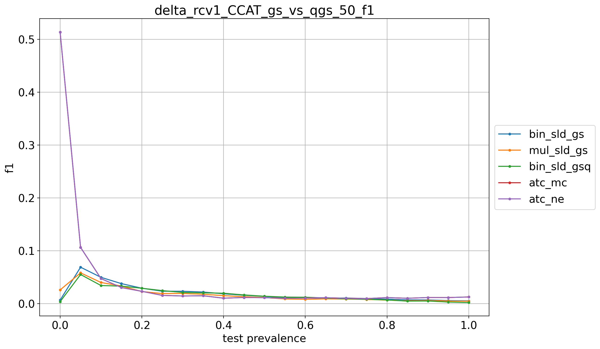
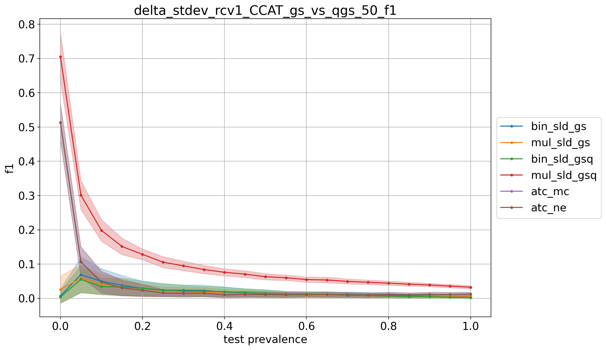
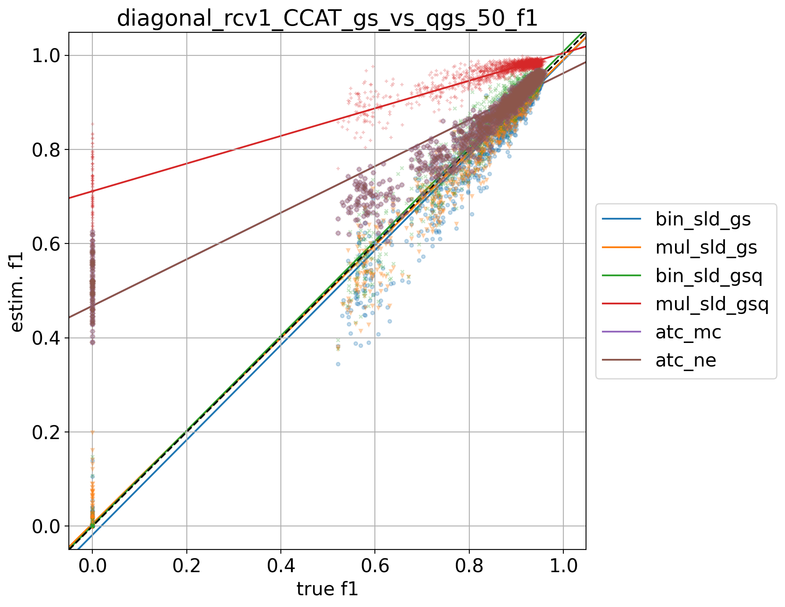
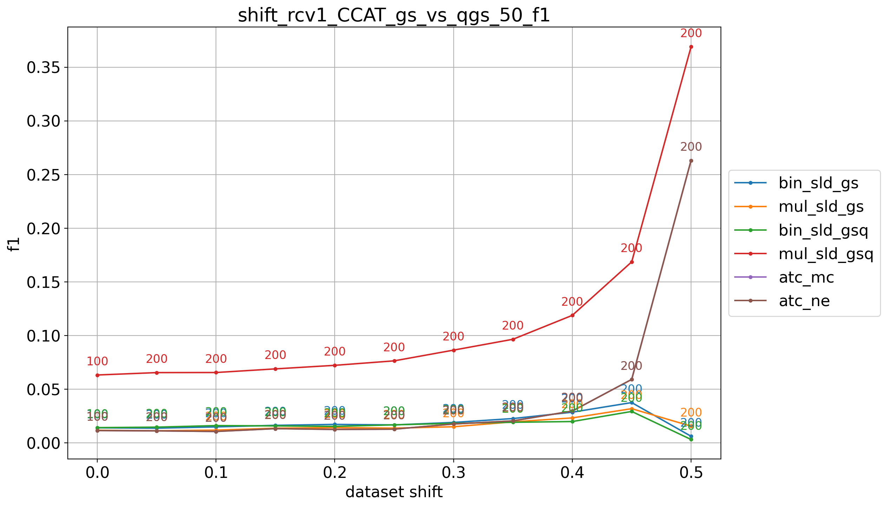

## 60% positives
> train: [0.40003338 0.59996662]  
> validation: [0.40003338 0.59996662]  
> bin_sld_gs: 960.633s  
> mul_sld_gs: 518.542s  
> bin_sld_gsq: 374.787s  
> mul_sld_gsq: 354.601s  
> ref: 46.619s  
> atc_mc: 50.354s  
> atc_ne: 51.660s  
> tot: 961.903s  

<table border="1" class="dataframe">
  <thead>
    <tr style="text-align: right;">
      <th></th>
      <th>bin_sld_gs</th>
      <th>mul_sld_gs</th>
      <th>bin_sld_gsq</th>
      <th>mul_sld_gsq</th>
      <th>atc_mc</th>
      <th>atc_ne</th>
    </tr>
  </thead>
  <tbody>
    <tr>
      <th>0.0</th>
      <td>0.0862</td>
      <td>0.0098</td>
      <td>0.0039</td>
      <td>0.6057</td>
      <td>0.5310</td>
      <td>0.5310</td>
    </tr>
    <tr>
      <th>0.05</th>
      <td>0.0666</td>
      <td>0.0357</td>
      <td>0.0854</td>
      <td>0.3442</td>
      <td>0.2044</td>
      <td>0.2044</td>
    </tr>
    <tr>
      <th>0.1</th>
      <td>0.0447</td>
      <td>0.0258</td>
      <td>0.0819</td>
      <td>0.2402</td>
      <td>0.1045</td>
      <td>0.1045</td>
    </tr>
    <tr>
      <th>0.15</th>
      <td>0.0304</td>
      <td>0.0202</td>
      <td>0.0752</td>
      <td>0.1791</td>
      <td>0.0571</td>
      <td>0.0571</td>
    </tr>
    <tr>
      <th>0.2</th>
      <td>0.0300</td>
      <td>0.0209</td>
      <td>0.0594</td>
      <td>0.1473</td>
      <td>0.0407</td>
      <td>0.0407</td>
    </tr>
    <tr>
      <th>0.25</th>
      <td>0.0217</td>
      <td>0.0187</td>
      <td>0.0557</td>
      <td>0.1187</td>
      <td>0.0228</td>
      <td>0.0228</td>
    </tr>
    <tr>
      <th>0.3</th>
      <td>0.0173</td>
      <td>0.0165</td>
      <td>0.0494</td>
      <td>0.1032</td>
      <td>0.0196</td>
      <td>0.0196</td>
    </tr>
    <tr>
      <th>0.35</th>
      <td>0.0152</td>
      <td>0.0148</td>
      <td>0.0476</td>
      <td>0.0879</td>
      <td>0.0125</td>
      <td>0.0125</td>
    </tr>
    <tr>
      <th>0.4</th>
      <td>0.0123</td>
      <td>0.0124</td>
      <td>0.0422</td>
      <td>0.0777</td>
      <td>0.0100</td>
      <td>0.0100</td>
    </tr>
    <tr>
      <th>0.45</th>
      <td>0.0117</td>
      <td>0.0126</td>
      <td>0.0362</td>
      <td>0.0694</td>
      <td>0.0101</td>
      <td>0.0101</td>
    </tr>
    <tr>
      <th>0.5</th>
      <td>0.0093</td>
      <td>0.0113</td>
      <td>0.0332</td>
      <td>0.0596</td>
      <td>0.0081</td>
      <td>0.0081</td>
    </tr>
    <tr>
      <th>0.55</th>
      <td>0.0085</td>
      <td>0.0095</td>
      <td>0.0301</td>
      <td>0.0525</td>
      <td>0.0076</td>
      <td>0.0076</td>
    </tr>
    <tr>
      <th>0.6</th>
      <td>0.0075</td>
      <td>0.0086</td>
      <td>0.0250</td>
      <td>0.0482</td>
      <td>0.0060</td>
      <td>0.0060</td>
    </tr>
    <tr>
      <th>0.65</th>
      <td>0.0070</td>
      <td>0.0078</td>
      <td>0.0236</td>
      <td>0.0455</td>
      <td>0.0060</td>
      <td>0.0060</td>
    </tr>
    <tr>
      <th>0.7</th>
      <td>0.0070</td>
      <td>0.0089</td>
      <td>0.0237</td>
      <td>0.0390</td>
      <td>0.0055</td>
      <td>0.0055</td>
    </tr>
    <tr>
      <th>0.75</th>
      <td>0.0061</td>
      <td>0.0076</td>
      <td>0.0218</td>
      <td>0.0358</td>
      <td>0.0051</td>
      <td>0.0051</td>
    </tr>
    <tr>
      <th>0.8</th>
      <td>0.0066</td>
      <td>0.0076</td>
      <td>0.0191</td>
      <td>0.0334</td>
      <td>0.0042</td>
      <td>0.0042</td>
    </tr>
    <tr>
      <th>0.85</th>
      <td>0.0065</td>
      <td>0.0075</td>
      <td>0.0178</td>
      <td>0.0294</td>
      <td>0.0042</td>
      <td>0.0042</td>
    </tr>
    <tr>
      <th>0.9</th>
      <td>0.0076</td>
      <td>0.0079</td>
      <td>0.0168</td>
      <td>0.0259</td>
      <td>0.0045</td>
      <td>0.0045</td>
    </tr>
    <tr>
      <th>0.95</th>
      <td>0.0079</td>
      <td>0.0068</td>
      <td>0.0132</td>
      <td>0.0236</td>
      <td>0.0037</td>
      <td>0.0037</td>
    </tr>
    <tr>
      <th>1.0</th>
      <td>0.0116</td>
      <td>0.0076</td>
      <td>0.0121</td>
      <td>0.0209</td>
      <td>0.0034</td>
      <td>0.0034</td>
    </tr>
    <tr>
      <th>avg</th>
      <td>0.0201</td>
      <td>0.0133</td>
      <td>0.0368</td>
      <td>0.1137</td>
      <td>0.0510</td>
      <td>0.0510</td>
    </tr>
  </tbody>
</table>

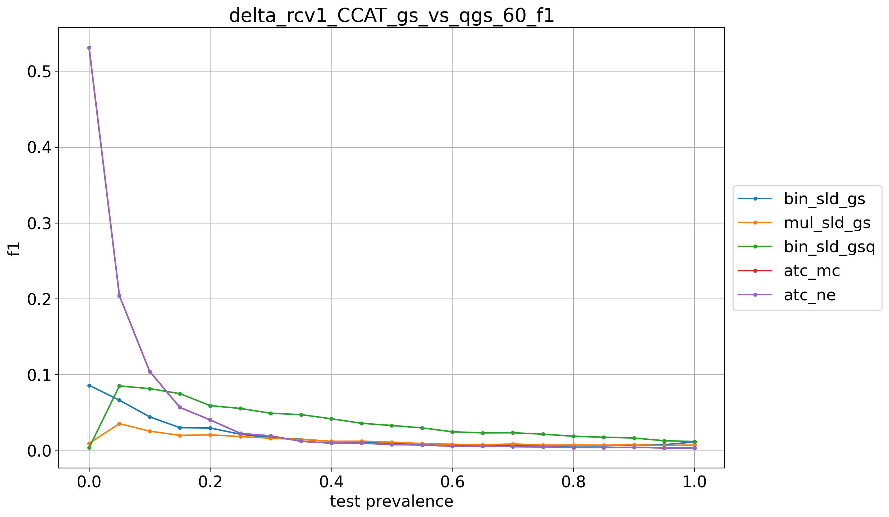
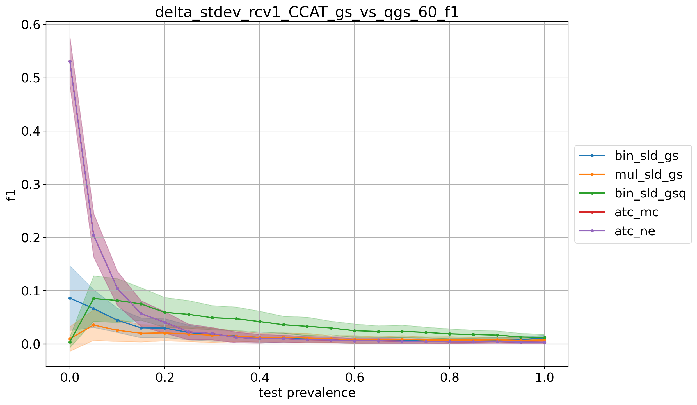
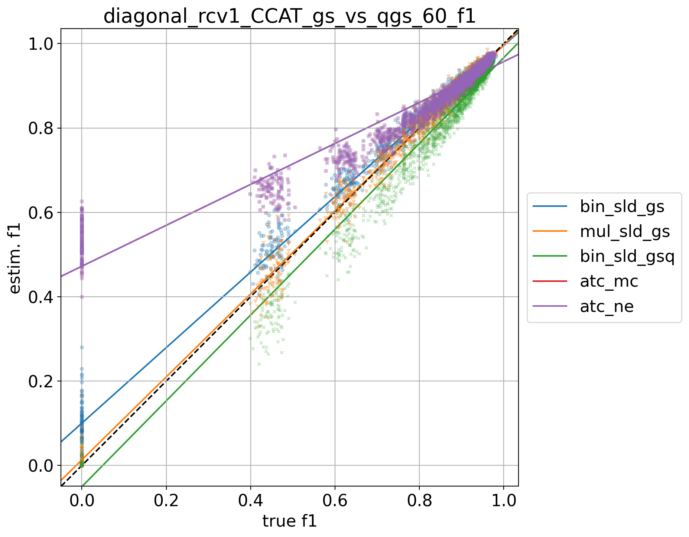
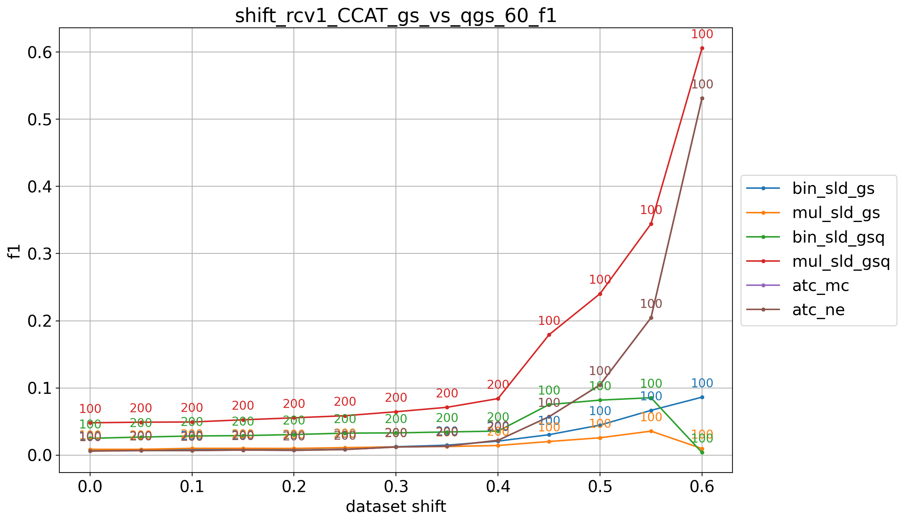

## 70% positives
> train: [0.29989987 0.70010013]  
> validation: [0.30006676 0.69993324]  
> bin_sld_gs: 968.765s  
> mul_sld_gs: 518.667s  
> bin_sld_gsq: 368.800s  
> mul_sld_gsq: 357.061s  
> ref: 47.123s  
> atc_mc: 49.987s  
> atc_ne: 50.916s  
> tot: 970.152s  

<table border="1" class="dataframe">
  <thead>
    <tr style="text-align: right;">
      <th></th>
      <th>bin_sld_gs</th>
      <th>mul_sld_gs</th>
      <th>bin_sld_gsq</th>
      <th>mul_sld_gsq</th>
      <th>atc_mc</th>
      <th>atc_ne</th>
    </tr>
  </thead>
  <tbody>
    <tr>
      <th>0.0</th>
      <td>0.0003</td>
      <td>0.0592</td>
      <td>0.0010</td>
      <td>0.4485</td>
      <td>0.5749</td>
      <td>0.5749</td>
    </tr>
    <tr>
      <th>0.05</th>
      <td>0.0772</td>
      <td>0.0263</td>
      <td>0.0706</td>
      <td>0.3255</td>
      <td>0.3336</td>
      <td>0.3336</td>
    </tr>
    <tr>
      <th>0.1</th>
      <td>0.0774</td>
      <td>0.0234</td>
      <td>0.0770</td>
      <td>0.2421</td>
      <td>0.2163</td>
      <td>0.2163</td>
    </tr>
    <tr>
      <th>0.15</th>
      <td>0.0745</td>
      <td>0.0271</td>
      <td>0.0771</td>
      <td>0.1946</td>
      <td>0.1450</td>
      <td>0.1450</td>
    </tr>
    <tr>
      <th>0.2</th>
      <td>0.0640</td>
      <td>0.0252</td>
      <td>0.0666</td>
      <td>0.1583</td>
      <td>0.1055</td>
      <td>0.1055</td>
    </tr>
    <tr>
      <th>0.25</th>
      <td>0.0604</td>
      <td>0.0294</td>
      <td>0.0655</td>
      <td>0.1265</td>
      <td>0.0703</td>
      <td>0.0703</td>
    </tr>
    <tr>
      <th>0.3</th>
      <td>0.0526</td>
      <td>0.0281</td>
      <td>0.0598</td>
      <td>0.1087</td>
      <td>0.0549</td>
      <td>0.0549</td>
    </tr>
    <tr>
      <th>0.35</th>
      <td>0.0482</td>
      <td>0.0270</td>
      <td>0.0555</td>
      <td>0.0920</td>
      <td>0.0403</td>
      <td>0.0403</td>
    </tr>
    <tr>
      <th>0.4</th>
      <td>0.0448</td>
      <td>0.0281</td>
      <td>0.0526</td>
      <td>0.0803</td>
      <td>0.0279</td>
      <td>0.0279</td>
    </tr>
    <tr>
      <th>0.45</th>
      <td>0.0380</td>
      <td>0.0257</td>
      <td>0.0467</td>
      <td>0.0682</td>
      <td>0.0225</td>
      <td>0.0225</td>
    </tr>
    <tr>
      <th>0.5</th>
      <td>0.0317</td>
      <td>0.0238</td>
      <td>0.0425</td>
      <td>0.0580</td>
      <td>0.0165</td>
      <td>0.0165</td>
    </tr>
    <tr>
      <th>0.55</th>
      <td>0.0296</td>
      <td>0.0232</td>
      <td>0.0401</td>
      <td>0.0494</td>
      <td>0.0120</td>
      <td>0.0120</td>
    </tr>
    <tr>
      <th>0.6</th>
      <td>0.0235</td>
      <td>0.0193</td>
      <td>0.0337</td>
      <td>0.0431</td>
      <td>0.0095</td>
      <td>0.0095</td>
    </tr>
    <tr>
      <th>0.65</th>
      <td>0.0217</td>
      <td>0.0196</td>
      <td>0.0321</td>
      <td>0.0373</td>
      <td>0.0089</td>
      <td>0.0089</td>
    </tr>
    <tr>
      <th>0.7</th>
      <td>0.0192</td>
      <td>0.0187</td>
      <td>0.0300</td>
      <td>0.0307</td>
      <td>0.0060</td>
      <td>0.0060</td>
    </tr>
    <tr>
      <th>0.75</th>
      <td>0.0167</td>
      <td>0.0172</td>
      <td>0.0270</td>
      <td>0.0262</td>
      <td>0.0047</td>
      <td>0.0047</td>
    </tr>
    <tr>
      <th>0.8</th>
      <td>0.0144</td>
      <td>0.0161</td>
      <td>0.0246</td>
      <td>0.0218</td>
      <td>0.0044</td>
      <td>0.0044</td>
    </tr>
    <tr>
      <th>0.85</th>
      <td>0.0130</td>
      <td>0.0149</td>
      <td>0.0224</td>
      <td>0.0175</td>
      <td>0.0045</td>
      <td>0.0045</td>
    </tr>
    <tr>
      <th>0.9</th>
      <td>0.0098</td>
      <td>0.0135</td>
      <td>0.0201</td>
      <td>0.0140</td>
      <td>0.0036</td>
      <td>0.0036</td>
    </tr>
    <tr>
      <th>0.95</th>
      <td>0.0079</td>
      <td>0.0120</td>
      <td>0.0178</td>
      <td>0.0101</td>
      <td>0.0035</td>
      <td>0.0035</td>
    </tr>
    <tr>
      <th>1.0</th>
      <td>0.0062</td>
      <td>0.0112</td>
      <td>0.0163</td>
      <td>0.0070</td>
      <td>0.0032</td>
      <td>0.0032</td>
    </tr>
    <tr>
      <th>avg</th>
      <td>0.0348</td>
      <td>0.0233</td>
      <td>0.0419</td>
      <td>0.1028</td>
      <td>0.0794</td>
      <td>0.0794</td>
    </tr>
  </tbody>
</table>

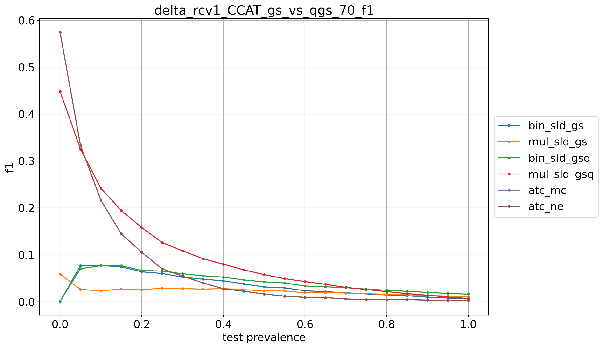
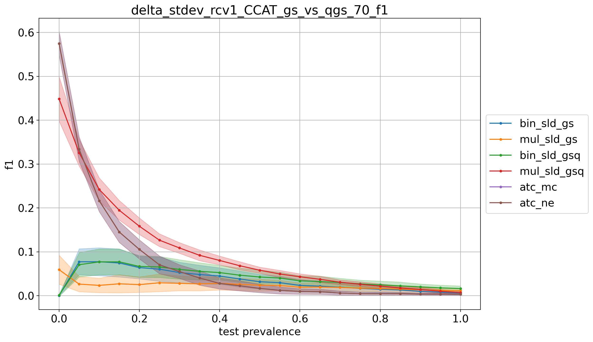
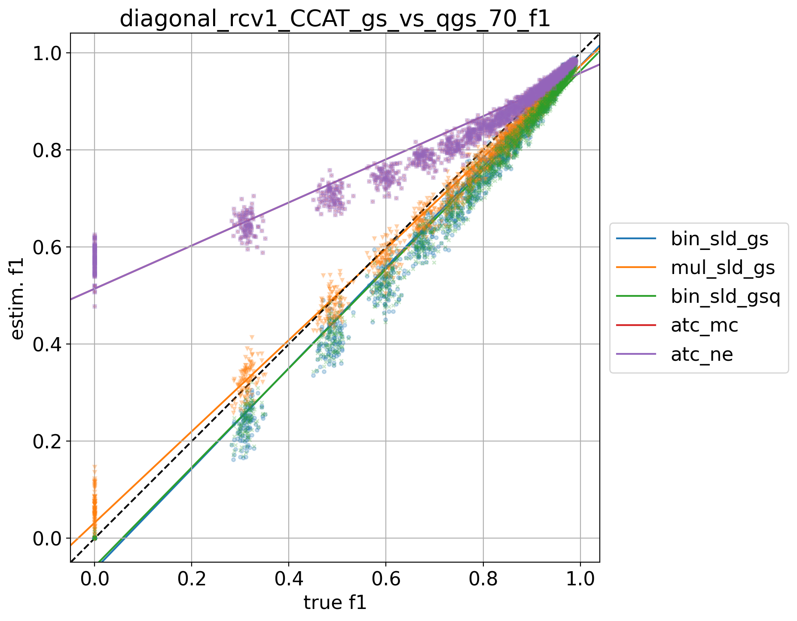
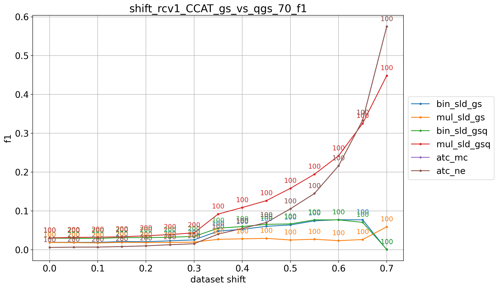

## 80% positives
> train: [0.19993324 0.80006676]  
> validation: [0.20010013 0.79989987]  
> bin_sld_gs: 959.358s  
> mul_sld_gs: 516.489s  
> bin_sld_gsq: 360.867s  
> mul_sld_gsq: 350.793s  
> ref: 46.990s  
> atc_mc: 49.877s  
> atc_ne: 49.632s  
> tot: 960.699s  

<table border="1" class="dataframe">
  <thead>
    <tr style="text-align: right;">
      <th></th>
      <th>bin_sld_gs</th>
      <th>mul_sld_gs</th>
      <th>bin_sld_gsq</th>
      <th>mul_sld_gsq</th>
      <th>atc_mc</th>
      <th>atc_ne</th>
    </tr>
  </thead>
  <tbody>
    <tr>
      <th>0.0</th>
      <td>0.0001</td>
      <td>0.0049</td>
      <td>0.0004</td>
      <td>0.3604</td>
      <td>0.5459</td>
      <td>0.5459</td>
    </tr>
    <tr>
      <th>0.05</th>
      <td>0.0634</td>
      <td>0.0179</td>
      <td>0.0231</td>
      <td>0.2988</td>
      <td>0.3941</td>
      <td>0.3941</td>
    </tr>
    <tr>
      <th>0.1</th>
      <td>0.0539</td>
      <td>0.0202</td>
      <td>0.0196</td>
      <td>0.2462</td>
      <td>0.2954</td>
      <td>0.2954</td>
    </tr>
    <tr>
      <th>0.15</th>
      <td>0.0455</td>
      <td>0.0151</td>
      <td>0.0159</td>
      <td>0.2071</td>
      <td>0.2206</td>
      <td>0.2206</td>
    </tr>
    <tr>
      <th>0.2</th>
      <td>0.0332</td>
      <td>0.0141</td>
      <td>0.0138</td>
      <td>0.1742</td>
      <td>0.1701</td>
      <td>0.1701</td>
    </tr>
    <tr>
      <th>0.25</th>
      <td>0.0322</td>
      <td>0.0147</td>
      <td>0.0134</td>
      <td>0.1465</td>
      <td>0.1277</td>
      <td>0.1277</td>
    </tr>
    <tr>
      <th>0.3</th>
      <td>0.0294</td>
      <td>0.0133</td>
      <td>0.0119</td>
      <td>0.1247</td>
      <td>0.0994</td>
      <td>0.0994</td>
    </tr>
    <tr>
      <th>0.35</th>
      <td>0.0248</td>
      <td>0.0130</td>
      <td>0.0126</td>
      <td>0.1073</td>
      <td>0.0774</td>
      <td>0.0774</td>
    </tr>
    <tr>
      <th>0.4</th>
      <td>0.0224</td>
      <td>0.0107</td>
      <td>0.0109</td>
      <td>0.0917</td>
      <td>0.0563</td>
      <td>0.0563</td>
    </tr>
    <tr>
      <th>0.45</th>
      <td>0.0189</td>
      <td>0.0093</td>
      <td>0.0107</td>
      <td>0.0791</td>
      <td>0.0440</td>
      <td>0.0440</td>
    </tr>
    <tr>
      <th>0.5</th>
      <td>0.0148</td>
      <td>0.0084</td>
      <td>0.0096</td>
      <td>0.0668</td>
      <td>0.0323</td>
      <td>0.0323</td>
    </tr>
    <tr>
      <th>0.55</th>
      <td>0.0158</td>
      <td>0.0088</td>
      <td>0.0101</td>
      <td>0.0546</td>
      <td>0.0206</td>
      <td>0.0206</td>
    </tr>
    <tr>
      <th>0.6</th>
      <td>0.0096</td>
      <td>0.0073</td>
      <td>0.0074</td>
      <td>0.0470</td>
      <td>0.0152</td>
      <td>0.0152</td>
    </tr>
    <tr>
      <th>0.65</th>
      <td>0.0119</td>
      <td>0.0071</td>
      <td>0.0097</td>
      <td>0.0391</td>
      <td>0.0098</td>
      <td>0.0098</td>
    </tr>
    <tr>
      <th>0.7</th>
      <td>0.0095</td>
      <td>0.0073</td>
      <td>0.0092</td>
      <td>0.0307</td>
      <td>0.0072</td>
      <td>0.0072</td>
    </tr>
    <tr>
      <th>0.75</th>
      <td>0.0093</td>
      <td>0.0066</td>
      <td>0.0089</td>
      <td>0.0249</td>
      <td>0.0056</td>
      <td>0.0056</td>
    </tr>
    <tr>
      <th>0.8</th>
      <td>0.0115</td>
      <td>0.0065</td>
      <td>0.0093</td>
      <td>0.0188</td>
      <td>0.0049</td>
      <td>0.0049</td>
    </tr>
    <tr>
      <th>0.85</th>
      <td>0.0108</td>
      <td>0.0063</td>
      <td>0.0091</td>
      <td>0.0135</td>
      <td>0.0053</td>
      <td>0.0053</td>
    </tr>
    <tr>
      <th>0.9</th>
      <td>0.0106</td>
      <td>0.0061</td>
      <td>0.0098</td>
      <td>0.0081</td>
      <td>0.0055</td>
      <td>0.0055</td>
    </tr>
    <tr>
      <th>0.95</th>
      <td>0.0077</td>
      <td>0.0059</td>
      <td>0.0104</td>
      <td>0.0037</td>
      <td>0.0068</td>
      <td>0.0068</td>
    </tr>
    <tr>
      <th>1.0</th>
      <td>0.0021</td>
      <td>0.0078</td>
      <td>0.0125</td>
      <td>0.0036</td>
      <td>0.0076</td>
      <td>0.0076</td>
    </tr>
    <tr>
      <th>avg</th>
      <td>0.0208</td>
      <td>0.0101</td>
      <td>0.0113</td>
      <td>0.1022</td>
      <td>0.1025</td>
      <td>0.1025</td>
    </tr>
  </tbody>
</table>

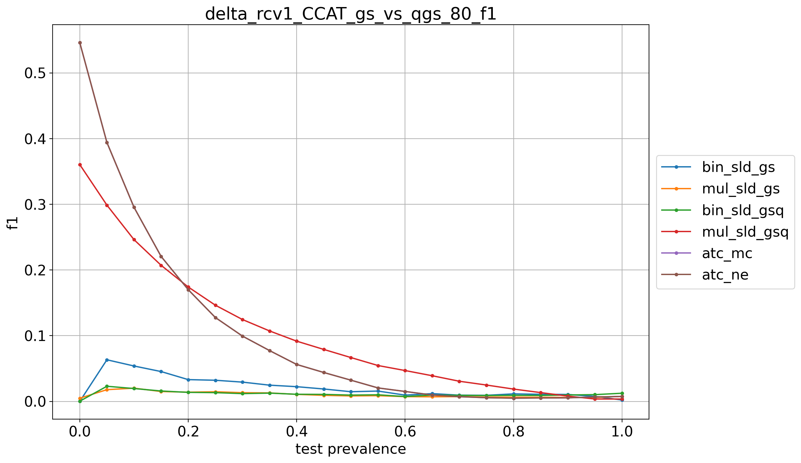
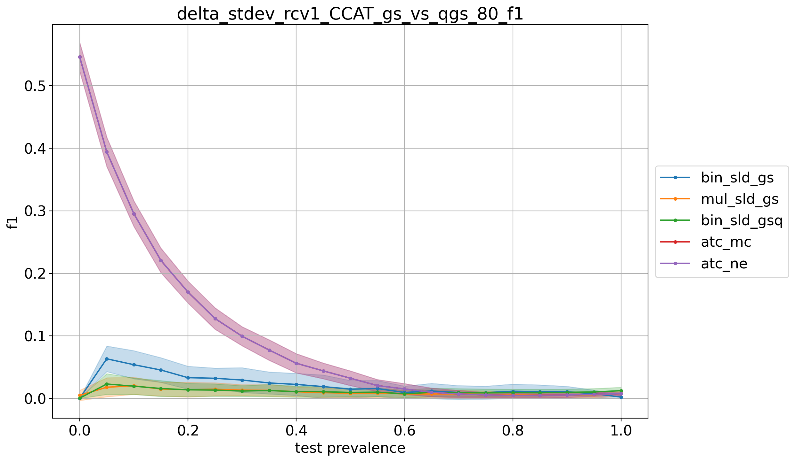
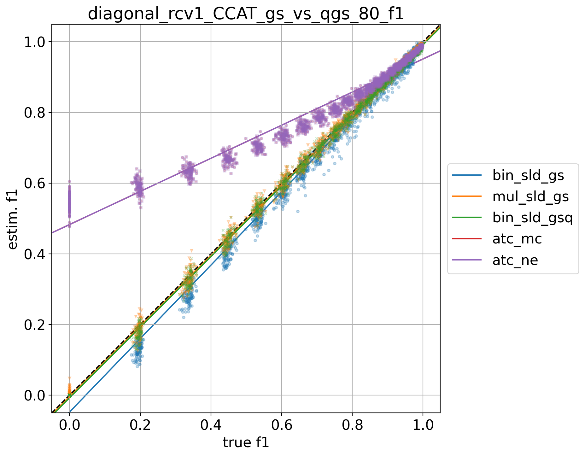
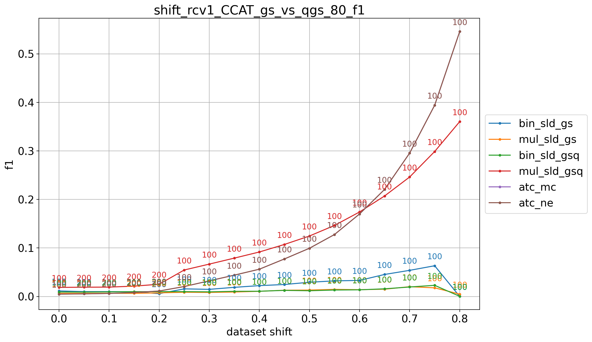

## 90% positives
> train: [0.09996662 0.90003338]  
> validation: [0.09996662 0.90003338]  
> bin_sld_gs: 930.393s  
> mul_sld_gs: 509.900s  
> bin_sld_gsq: 349.607s  
> mul_sld_gsq: 343.286s  
> ref: 47.328s  
> atc_mc: 49.802s  
> atc_ne: 51.229s  
> tot: 931.705s  

<table border="1" class="dataframe">
  <thead>
    <tr style="text-align: right;">
      <th></th>
      <th>bin_sld_gs</th>
      <th>mul_sld_gs</th>
      <th>bin_sld_gsq</th>
      <th>mul_sld_gsq</th>
      <th>atc_mc</th>
      <th>atc_ne</th>
    </tr>
  </thead>
  <tbody>
    <tr>
      <th>0.0</th>
      <td>0.0010</td>
      <td>0.0384</td>
      <td>0.0001</td>
      <td>0.2676</td>
      <td>0.4745</td>
      <td>0.4745</td>
    </tr>
    <tr>
      <th>0.05</th>
      <td>0.0113</td>
      <td>0.0484</td>
      <td>0.0485</td>
      <td>0.2432</td>
      <td>0.4016</td>
      <td>0.4016</td>
    </tr>
    <tr>
      <th>0.1</th>
      <td>0.0113</td>
      <td>0.0466</td>
      <td>0.0470</td>
      <td>0.2175</td>
      <td>0.3432</td>
      <td>0.3432</td>
    </tr>
    <tr>
      <th>0.15</th>
      <td>0.0100</td>
      <td>0.0430</td>
      <td>0.0444</td>
      <td>0.1930</td>
      <td>0.2909</td>
      <td>0.2909</td>
    </tr>
    <tr>
      <th>0.2</th>
      <td>0.0118</td>
      <td>0.0396</td>
      <td>0.0384</td>
      <td>0.1726</td>
      <td>0.2470</td>
      <td>0.2470</td>
    </tr>
    <tr>
      <th>0.25</th>
      <td>0.0100</td>
      <td>0.0298</td>
      <td>0.0384</td>
      <td>0.1487</td>
      <td>0.2076</td>
      <td>0.2076</td>
    </tr>
    <tr>
      <th>0.3</th>
      <td>0.0094</td>
      <td>0.0272</td>
      <td>0.0358</td>
      <td>0.1324</td>
      <td>0.1759</td>
      <td>0.1759</td>
    </tr>
    <tr>
      <th>0.35</th>
      <td>0.0092</td>
      <td>0.0202</td>
      <td>0.0328</td>
      <td>0.1150</td>
      <td>0.1487</td>
      <td>0.1487</td>
    </tr>
    <tr>
      <th>0.4</th>
      <td>0.0083</td>
      <td>0.0164</td>
      <td>0.0314</td>
      <td>0.0995</td>
      <td>0.1239</td>
      <td>0.1239</td>
    </tr>
    <tr>
      <th>0.45</th>
      <td>0.0092</td>
      <td>0.0144</td>
      <td>0.0278</td>
      <td>0.0884</td>
      <td>0.1027</td>
      <td>0.1027</td>
    </tr>
    <tr>
      <th>0.5</th>
      <td>0.0078</td>
      <td>0.0106</td>
      <td>0.0257</td>
      <td>0.0759</td>
      <td>0.0842</td>
      <td>0.0842</td>
    </tr>
    <tr>
      <th>0.55</th>
      <td>0.0057</td>
      <td>0.0070</td>
      <td>0.0256</td>
      <td>0.0626</td>
      <td>0.0659</td>
      <td>0.0659</td>
    </tr>
    <tr>
      <th>0.6</th>
      <td>0.0067</td>
      <td>0.0069</td>
      <td>0.0212</td>
      <td>0.0545</td>
      <td>0.0530</td>
      <td>0.0530</td>
    </tr>
    <tr>
      <th>0.65</th>
      <td>0.0061</td>
      <td>0.0063</td>
      <td>0.0220</td>
      <td>0.0440</td>
      <td>0.0392</td>
      <td>0.0392</td>
    </tr>
    <tr>
      <th>0.7</th>
      <td>0.0047</td>
      <td>0.0054</td>
      <td>0.0192</td>
      <td>0.0351</td>
      <td>0.0290</td>
      <td>0.0290</td>
    </tr>
    <tr>
      <th>0.75</th>
      <td>0.0046</td>
      <td>0.0061</td>
      <td>0.0167</td>
      <td>0.0276</td>
      <td>0.0196</td>
      <td>0.0196</td>
    </tr>
    <tr>
      <th>0.8</th>
      <td>0.0038</td>
      <td>0.0073</td>
      <td>0.0157</td>
      <td>0.0198</td>
      <td>0.0125</td>
      <td>0.0125</td>
    </tr>
    <tr>
      <th>0.85</th>
      <td>0.0039</td>
      <td>0.0086</td>
      <td>0.0143</td>
      <td>0.0133</td>
      <td>0.0061</td>
      <td>0.0061</td>
    </tr>
    <tr>
      <th>0.9</th>
      <td>0.0033</td>
      <td>0.0098</td>
      <td>0.0130</td>
      <td>0.0072</td>
      <td>0.0036</td>
      <td>0.0036</td>
    </tr>
    <tr>
      <th>0.95</th>
      <td>0.0036</td>
      <td>0.0115</td>
      <td>0.0118</td>
      <td>0.0023</td>
      <td>0.0069</td>
      <td>0.0069</td>
    </tr>
    <tr>
      <th>1.0</th>
      <td>0.0046</td>
      <td>0.0126</td>
      <td>0.0110</td>
      <td>0.0058</td>
      <td>0.0123</td>
      <td>0.0123</td>
    </tr>
    <tr>
      <th>avg</th>
      <td>0.0070</td>
      <td>0.0198</td>
      <td>0.0257</td>
      <td>0.0965</td>
      <td>0.1356</td>
      <td>0.1356</td>
    </tr>
  </tbody>
</table>

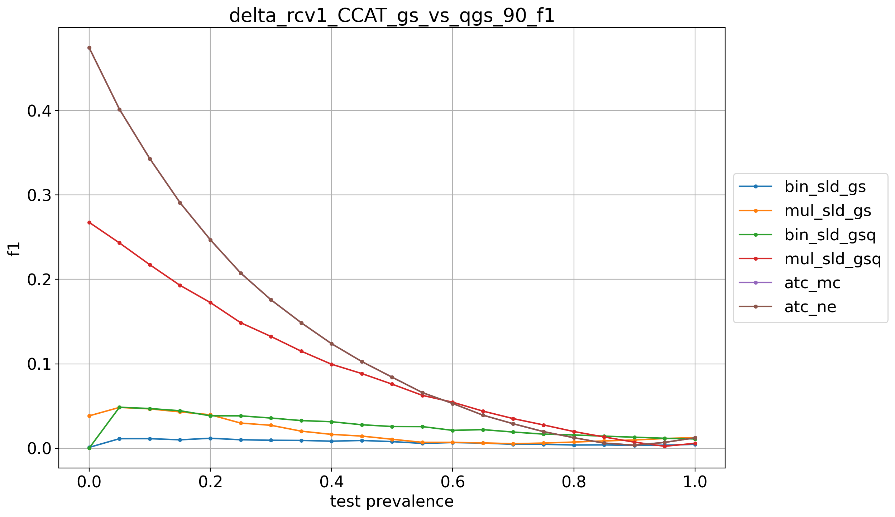
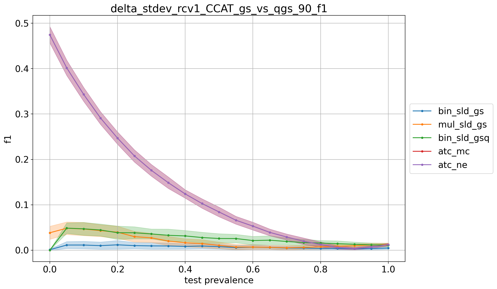
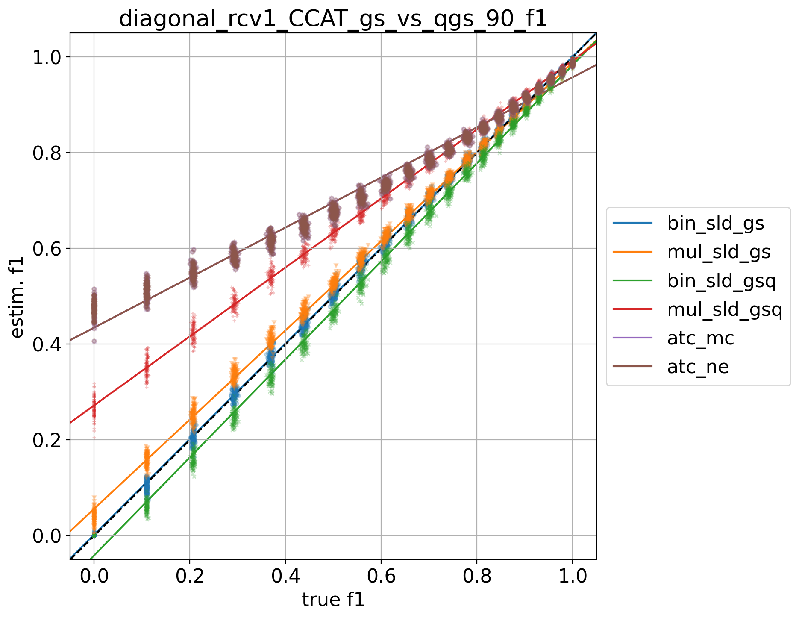
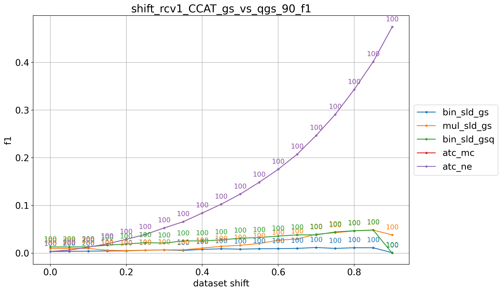

## avg
### avg on train
<table border="1" class="dataframe">
  <thead>
    <tr style="text-align: right;">
      <th></th>
      <th>bin_sld_gs</th>
      <th>mul_sld_gs</th>
      <th>bin_sld_gsq</th>
      <th>mul_sld_gsq</th>
      <th>atc_mc</th>
      <th>atc_ne</th>
    </tr>
  </thead>
  <tbody>
    <tr>
      <th>0.0</th>
      <td>0.0237</td>
      <td>0.0404</td>
      <td>0.0109</td>
      <td>0.4340</td>
      <td>0.3827</td>
      <td>0.3827</td>
    </tr>
    <tr>
      <th>0.05</th>
      <td>0.0630</td>
      <td>0.0487</td>
      <td>0.0801</td>
      <td>0.2179</td>
      <td>0.2109</td>
      <td>0.2109</td>
    </tr>
    <tr>
      <th>0.1</th>
      <td>0.0462</td>
      <td>0.0345</td>
      <td>0.0651</td>
      <td>0.1698</td>
      <td>0.1528</td>
      <td>0.1528</td>
    </tr>
    <tr>
      <th>0.15</th>
      <td>0.0372</td>
      <td>0.0285</td>
      <td>0.0542</td>
      <td>0.1427</td>
      <td>0.1203</td>
      <td>0.1203</td>
    </tr>
    <tr>
      <th>0.2</th>
      <td>0.0310</td>
      <td>0.0240</td>
      <td>0.0447</td>
      <td>0.1259</td>
      <td>0.0991</td>
      <td>0.0991</td>
    </tr>
    <tr>
      <th>0.25</th>
      <td>0.0274</td>
      <td>0.0221</td>
      <td>0.0397</td>
      <td>0.1092</td>
      <td>0.0819</td>
      <td>0.0819</td>
    </tr>
    <tr>
      <th>0.3</th>
      <td>0.0242</td>
      <td>0.0200</td>
      <td>0.0365</td>
      <td>0.0995</td>
      <td>0.0712</td>
      <td>0.0712</td>
    </tr>
    <tr>
      <th>0.35</th>
      <td>0.0220</td>
      <td>0.0178</td>
      <td>0.0338</td>
      <td>0.0905</td>
      <td>0.0623</td>
      <td>0.0623</td>
    </tr>
    <tr>
      <th>0.4</th>
      <td>0.0198</td>
      <td>0.0166</td>
      <td>0.0308</td>
      <td>0.0825</td>
      <td>0.0548</td>
      <td>0.0548</td>
    </tr>
    <tr>
      <th>0.45</th>
      <td>0.0173</td>
      <td>0.0154</td>
      <td>0.0279</td>
      <td>0.0761</td>
      <td>0.0497</td>
      <td>0.0497</td>
    </tr>
    <tr>
      <th>0.5</th>
      <td>0.0151</td>
      <td>0.0135</td>
      <td>0.0254</td>
      <td>0.0688</td>
      <td>0.0458</td>
      <td>0.0458</td>
    </tr>
    <tr>
      <th>0.55</th>
      <td>0.0136</td>
      <td>0.0128</td>
      <td>0.0238</td>
      <td>0.0638</td>
      <td>0.0415</td>
      <td>0.0415</td>
    </tr>
    <tr>
      <th>0.6</th>
      <td>0.0115</td>
      <td>0.0114</td>
      <td>0.0208</td>
      <td>0.0586</td>
      <td>0.0394</td>
      <td>0.0394</td>
    </tr>
    <tr>
      <th>0.65</th>
      <td>0.0114</td>
      <td>0.0114</td>
      <td>0.0203</td>
      <td>0.0556</td>
      <td>0.0373</td>
      <td>0.0373</td>
    </tr>
    <tr>
      <th>0.7</th>
      <td>0.0102</td>
      <td>0.0108</td>
      <td>0.0193</td>
      <td>0.0509</td>
      <td>0.0350</td>
      <td>0.0350</td>
    </tr>
    <tr>
      <th>0.75</th>
      <td>0.0095</td>
      <td>0.0101</td>
      <td>0.0184</td>
      <td>0.0472</td>
      <td>0.0325</td>
      <td>0.0325</td>
    </tr>
    <tr>
      <th>0.8</th>
      <td>0.0090</td>
      <td>0.0096</td>
      <td>0.0170</td>
      <td>0.0436</td>
      <td>0.0323</td>
      <td>0.0323</td>
    </tr>
    <tr>
      <th>0.85</th>
      <td>0.0085</td>
      <td>0.0093</td>
      <td>0.0162</td>
      <td>0.0402</td>
      <td>0.0315</td>
      <td>0.0315</td>
    </tr>
    <tr>
      <th>0.9</th>
      <td>0.0082</td>
      <td>0.0088</td>
      <td>0.0157</td>
      <td>0.0369</td>
      <td>0.0309</td>
      <td>0.0309</td>
    </tr>
    <tr>
      <th>0.95</th>
      <td>0.0075</td>
      <td>0.0084</td>
      <td>0.0144</td>
      <td>0.0332</td>
      <td>0.0321</td>
      <td>0.0321</td>
    </tr>
    <tr>
      <th>1.0</th>
      <td>0.0061</td>
      <td>0.0078</td>
      <td>0.0133</td>
      <td>0.0313</td>
      <td>0.0326</td>
      <td>0.0326</td>
    </tr>
    <tr>
      <th>avg</th>
      <td>0.0201</td>
      <td>0.0182</td>
      <td>0.0299</td>
      <td>0.0990</td>
      <td>0.0798</td>
      <td>0.0798</td>
    </tr>
  </tbody>
</table>

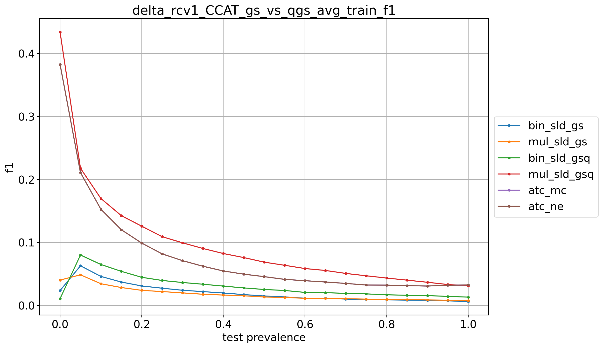
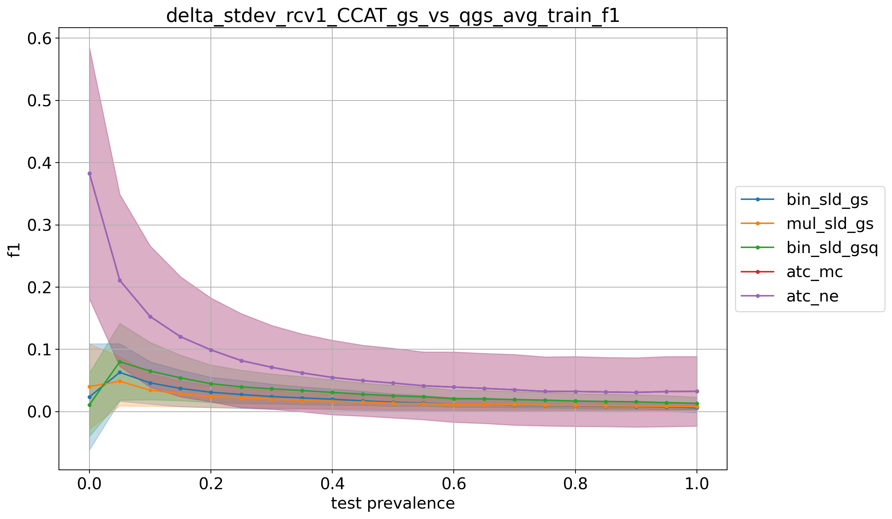
### avg on test
<table border="1" class="dataframe">
  <thead>
    <tr style="text-align: right;">
      <th></th>
      <th>bin_sld_gs</th>
      <th>mul_sld_gs</th>
      <th>bin_sld_gsq</th>
      <th>mul_sld_gsq</th>
      <th>atc_mc</th>
      <th>atc_ne</th>
    </tr>
  </thead>
  <tbody>
    <tr>
      <th>0.1</th>
      <td>0.0149</td>
      <td>0.0179</td>
      <td>NaN</td>
      <td>0.0698</td>
      <td>0.1801</td>
      <td>0.1801</td>
    </tr>
    <tr>
      <th>0.2</th>
      <td>0.0320</td>
      <td>0.0178</td>
      <td>0.0288</td>
      <td>0.0845</td>
      <td>0.0610</td>
      <td>0.0610</td>
    </tr>
    <tr>
      <th>0.3</th>
      <td>0.0145</td>
      <td>0.0174</td>
      <td>0.0395</td>
      <td>0.1089</td>
      <td>0.0334</td>
      <td>0.0334</td>
    </tr>
    <tr>
      <th>0.4</th>
      <td>0.0178</td>
      <td>0.0273</td>
      <td>0.0386</td>
      <td>0.0960</td>
      <td>0.0321</td>
      <td>0.0321</td>
    </tr>
    <tr>
      <th>0.5</th>
      <td>0.0190</td>
      <td>0.0168</td>
      <td>0.0167</td>
      <td>0.1162</td>
      <td>0.0434</td>
      <td>0.0434</td>
    </tr>
    <tr>
      <th>0.6</th>
      <td>0.0201</td>
      <td>0.0133</td>
      <td>0.0368</td>
      <td>0.1137</td>
      <td>0.0510</td>
      <td>0.0510</td>
    </tr>
    <tr>
      <th>0.7</th>
      <td>0.0348</td>
      <td>0.0233</td>
      <td>0.0419</td>
      <td>0.1028</td>
      <td>0.0794</td>
      <td>0.0794</td>
    </tr>
    <tr>
      <th>0.8</th>
      <td>0.0208</td>
      <td>0.0101</td>
      <td>0.0113</td>
      <td>0.1022</td>
      <td>0.1025</td>
      <td>0.1025</td>
    </tr>
    <tr>
      <th>0.9</th>
      <td>0.0070</td>
      <td>0.0198</td>
      <td>0.0257</td>
      <td>0.0965</td>
      <td>0.1356</td>
      <td>0.1356</td>
    </tr>
    <tr>
      <th>avg</th>
      <td>0.0201</td>
      <td>0.0182</td>
      <td>0.0299</td>
      <td>0.0990</td>
      <td>0.0798</td>
      <td>0.0798</td>
    </tr>
  </tbody>
</table>

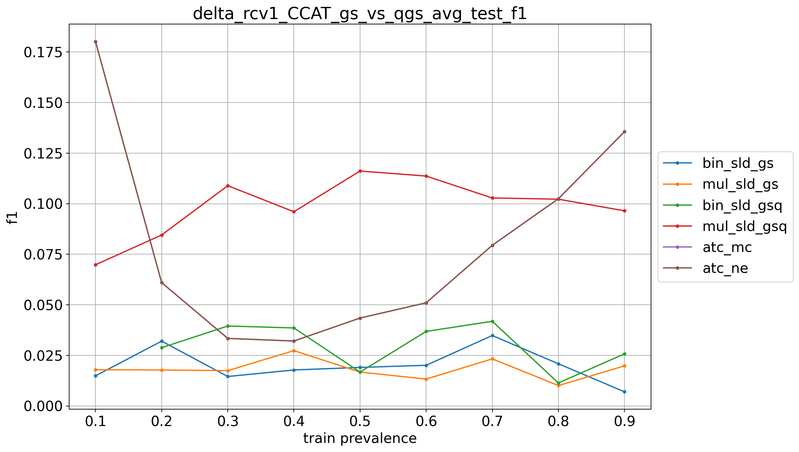
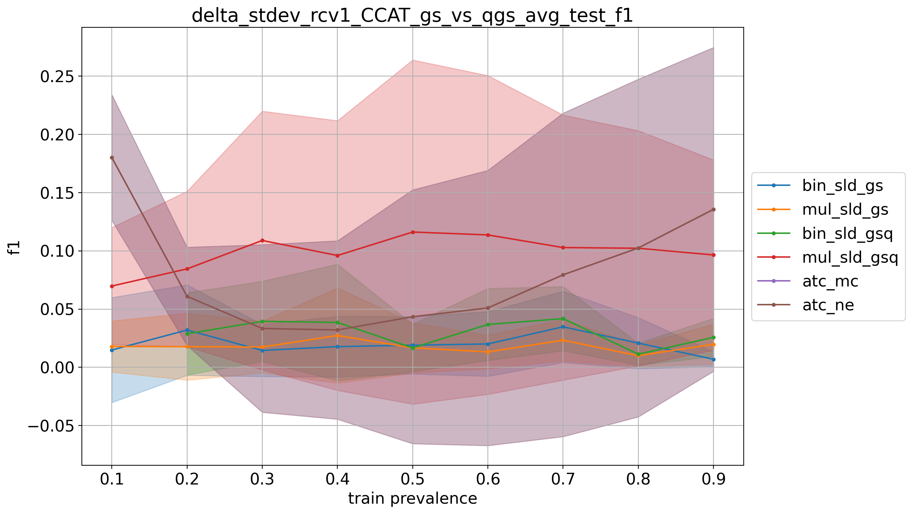
### avg dataset shift
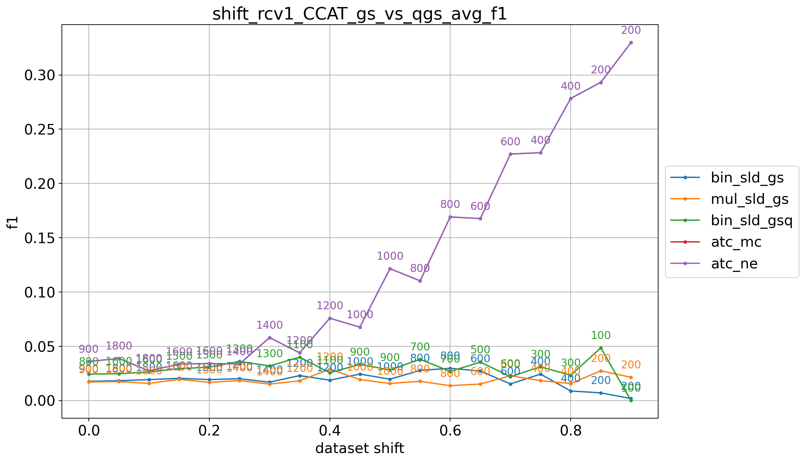
