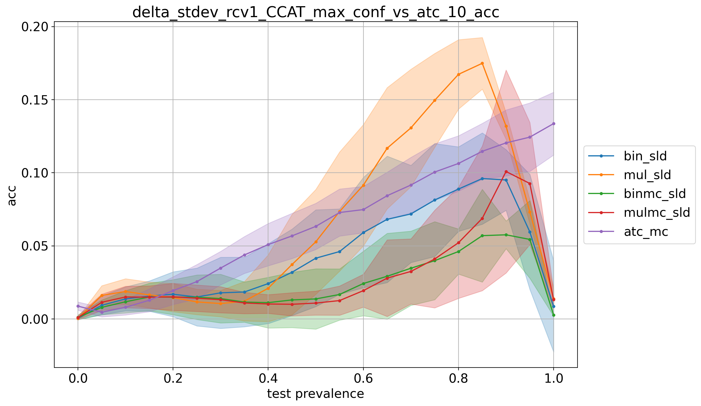
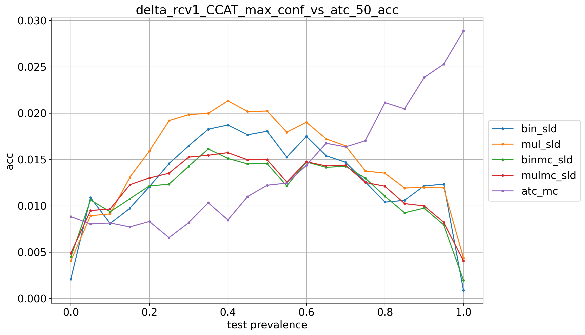

# rcv1_CCAT_9prevs

## 10% positives
> train: [0.90003338 0.09996662]  
> validation: [0.90003338 0.09996662]  
> bin_sld: 227.883s  
> mul_sld: 78.248s  
> binmc_sld: 226.732s  
> mulmc_sld: 66.259s  
> binne_sld: 223.276s  
> mulne_sld: 62.735s  
> bin_pacc: 217.001s  
> mul_pacc: 58.470s  
> ref: 48.024s  
> atc_mc: 51.785s  
> tot: 230.591s  

<table border="1" class="dataframe">
  <thead>
    <tr style="text-align: right;">
      <th></th>
      <th>bin_sld</th>
      <th>mul_sld</th>
      <th>binmc_sld</th>
      <th>mulmc_sld</th>
      <th>atc_mc</th>
    </tr>
  </thead>
  <tbody>
    <tr>
      <th>0.0</th>
      <td>0.0005</td>
      <td>0.0004</td>
      <td>0.0012</td>
      <td>0.0010</td>
      <td>0.0088</td>
    </tr>
    <tr>
      <th>0.05</th>
      <td>0.0093</td>
      <td>0.0161</td>
      <td>0.0080</td>
      <td>0.0114</td>
      <td>0.0046</td>
    </tr>
    <tr>
      <th>0.1</th>
      <td>0.0138</td>
      <td>0.0188</td>
      <td>0.0118</td>
      <td>0.0151</td>
      <td>0.0080</td>
    </tr>
    <tr>
      <th>0.15</th>
      <td>0.0157</td>
      <td>0.0165</td>
      <td>0.0151</td>
      <td>0.0149</td>
      <td>0.0128</td>
    </tr>
    <tr>
      <th>0.2</th>
      <td>0.0169</td>
      <td>0.0147</td>
      <td>0.0149</td>
      <td>0.0151</td>
      <td>0.0194</td>
    </tr>
    <tr>
      <th>0.25</th>
      <td>0.0150</td>
      <td>0.0117</td>
      <td>0.0149</td>
      <td>0.0142</td>
      <td>0.0256</td>
    </tr>
    <tr>
      <th>0.3</th>
      <td>0.0179</td>
      <td>0.0105</td>
      <td>0.0140</td>
      <td>0.0132</td>
      <td>0.0348</td>
    </tr>
    <tr>
      <th>0.35</th>
      <td>0.0185</td>
      <td>0.0122</td>
      <td>0.0116</td>
      <td>0.0109</td>
      <td>0.0438</td>
    </tr>
    <tr>
      <th>0.4</th>
      <td>0.0242</td>
      <td>0.0210</td>
      <td>0.0112</td>
      <td>0.0103</td>
      <td>0.0509</td>
    </tr>
    <tr>
      <th>0.45</th>
      <td>0.0320</td>
      <td>0.0373</td>
      <td>0.0130</td>
      <td>0.0101</td>
      <td>0.0568</td>
    </tr>
    <tr>
      <th>0.5</th>
      <td>0.0416</td>
      <td>0.0528</td>
      <td>0.0137</td>
      <td>0.0109</td>
      <td>0.0633</td>
    </tr>
    <tr>
      <th>0.55</th>
      <td>0.0461</td>
      <td>0.0735</td>
      <td>0.0168</td>
      <td>0.0126</td>
      <td>0.0728</td>
    </tr>
    <tr>
      <th>0.6</th>
      <td>0.0591</td>
      <td>0.0915</td>
      <td>0.0243</td>
      <td>0.0194</td>
      <td>0.0748</td>
    </tr>
    <tr>
      <th>0.65</th>
      <td>0.0682</td>
      <td>0.1168</td>
      <td>0.0292</td>
      <td>0.0279</td>
      <td>0.0843</td>
    </tr>
    <tr>
      <th>0.7</th>
      <td>0.0719</td>
      <td>0.1307</td>
      <td>0.0347</td>
      <td>0.0325</td>
      <td>0.0916</td>
    </tr>
    <tr>
      <th>0.75</th>
      <td>0.0814</td>
      <td>0.1495</td>
      <td>0.0399</td>
      <td>0.0410</td>
      <td>0.1005</td>
    </tr>
    <tr>
      <th>0.8</th>
      <td>0.0889</td>
      <td>0.1673</td>
      <td>0.0461</td>
      <td>0.0522</td>
      <td>0.1064</td>
    </tr>
    <tr>
      <th>0.85</th>
      <td>0.0961</td>
      <td>0.1749</td>
      <td>0.0570</td>
      <td>0.0688</td>
      <td>0.1147</td>
    </tr>
    <tr>
      <th>0.9</th>
      <td>0.0951</td>
      <td>0.1319</td>
      <td>0.0576</td>
      <td>0.1009</td>
      <td>0.1204</td>
    </tr>
    <tr>
      <th>0.95</th>
      <td>0.0596</td>
      <td>0.0732</td>
      <td>0.0544</td>
      <td>0.0927</td>
      <td>0.1244</td>
    </tr>
    <tr>
      <th>1.0</th>
      <td>0.0086</td>
      <td>0.0139</td>
      <td>0.0027</td>
      <td>0.0132</td>
      <td>0.1336</td>
    </tr>
    <tr>
      <th>avg</th>
      <td>0.0419</td>
      <td>0.0636</td>
      <td>0.0234</td>
      <td>0.0280</td>
      <td>0.0644</td>
    </tr>
  </tbody>
</table>

## 20% positives
> train: [0.79989987 0.20010013]  
> validation: [0.80006676 0.19993324]  
> bin_sld: 224.734s  
> mul_sld: 70.409s  
> binmc_sld: 223.361s  
> mulmc_sld: 67.028s  
> binne_sld: 223.604s  
> mulne_sld: 67.347s  
> bin_pacc: 218.304s  
> mul_pacc: 60.326s  
> ref: 49.515s  
> atc_mc: 54.802s  
> tot: 229.075s  

<table border="1" class="dataframe">
  <thead>
    <tr style="text-align: right;">
      <th></th>
      <th>bin_sld</th>
      <th>mul_sld</th>
      <th>binmc_sld</th>
      <th>mulmc_sld</th>
      <th>atc_mc</th>
    </tr>
  </thead>
  <tbody>
    <tr>
      <th>0.0</th>
      <td>0.0014</td>
      <td>0.0019</td>
      <td>0.0031</td>
      <td>0.0031</td>
      <td>0.0097</td>
    </tr>
    <tr>
      <th>0.05</th>
      <td>0.0083</td>
      <td>0.0093</td>
      <td>0.0068</td>
      <td>0.0063</td>
      <td>0.0071</td>
    </tr>
    <tr>
      <th>0.1</th>
      <td>0.0094</td>
      <td>0.0120</td>
      <td>0.0076</td>
      <td>0.0074</td>
      <td>0.0062</td>
    </tr>
    <tr>
      <th>0.15</th>
      <td>0.0103</td>
      <td>0.0123</td>
      <td>0.0088</td>
      <td>0.0081</td>
      <td>0.0064</td>
    </tr>
    <tr>
      <th>0.2</th>
      <td>0.0107</td>
      <td>0.0143</td>
      <td>0.0093</td>
      <td>0.0102</td>
      <td>0.0088</td>
    </tr>
    <tr>
      <th>0.25</th>
      <td>0.0098</td>
      <td>0.0143</td>
      <td>0.0092</td>
      <td>0.0104</td>
      <td>0.0093</td>
    </tr>
    <tr>
      <th>0.3</th>
      <td>0.0099</td>
      <td>0.0128</td>
      <td>0.0094</td>
      <td>0.0104</td>
      <td>0.0124</td>
    </tr>
    <tr>
      <th>0.35</th>
      <td>0.0084</td>
      <td>0.0106</td>
      <td>0.0076</td>
      <td>0.0094</td>
      <td>0.0161</td>
    </tr>
    <tr>
      <th>0.4</th>
      <td>0.0097</td>
      <td>0.0115</td>
      <td>0.0091</td>
      <td>0.0101</td>
      <td>0.0190</td>
    </tr>
    <tr>
      <th>0.45</th>
      <td>0.0099</td>
      <td>0.0122</td>
      <td>0.0090</td>
      <td>0.0106</td>
      <td>0.0207</td>
    </tr>
    <tr>
      <th>0.5</th>
      <td>0.0113</td>
      <td>0.0133</td>
      <td>0.0088</td>
      <td>0.0106</td>
      <td>0.0222</td>
    </tr>
    <tr>
      <th>0.55</th>
      <td>0.0120</td>
      <td>0.0143</td>
      <td>0.0090</td>
      <td>0.0102</td>
      <td>0.0247</td>
    </tr>
    <tr>
      <th>0.6</th>
      <td>0.0160</td>
      <td>0.0175</td>
      <td>0.0095</td>
      <td>0.0110</td>
      <td>0.0272</td>
    </tr>
    <tr>
      <th>0.65</th>
      <td>0.0171</td>
      <td>0.0215</td>
      <td>0.0103</td>
      <td>0.0124</td>
      <td>0.0331</td>
    </tr>
    <tr>
      <th>0.7</th>
      <td>0.0197</td>
      <td>0.0236</td>
      <td>0.0101</td>
      <td>0.0126</td>
      <td>0.0384</td>
    </tr>
    <tr>
      <th>0.75</th>
      <td>0.0229</td>
      <td>0.0282</td>
      <td>0.0115</td>
      <td>0.0142</td>
      <td>0.0425</td>
    </tr>
    <tr>
      <th>0.8</th>
      <td>0.0277</td>
      <td>0.0350</td>
      <td>0.0137</td>
      <td>0.0166</td>
      <td>0.0407</td>
    </tr>
    <tr>
      <th>0.85</th>
      <td>0.0310</td>
      <td>0.0401</td>
      <td>0.0163</td>
      <td>0.0186</td>
      <td>0.0447</td>
    </tr>
    <tr>
      <th>0.9</th>
      <td>0.0343</td>
      <td>0.0437</td>
      <td>0.0189</td>
      <td>0.0211</td>
      <td>0.0493</td>
    </tr>
    <tr>
      <th>0.95</th>
      <td>0.0349</td>
      <td>0.0465</td>
      <td>0.0206</td>
      <td>0.0236</td>
      <td>0.0492</td>
    </tr>
    <tr>
      <th>1.0</th>
      <td>0.0013</td>
      <td>0.0215</td>
      <td>0.0011</td>
      <td>0.0083</td>
      <td>0.0571</td>
    </tr>
    <tr>
      <th>avg</th>
      <td>0.0150</td>
      <td>0.0198</td>
      <td>0.0100</td>
      <td>0.0117</td>
      <td>0.0259</td>
    </tr>
  </tbody>
</table>

## 30% positives
> train: [0.69993324 0.30006676]  
> validation: [0.70010013 0.29989987]  
> bin_sld: 218.651s  
> mul_sld: 65.273s  
> binmc_sld: 221.260s  
> mulmc_sld: 64.594s  
> binne_sld: 218.686s  
> mulne_sld: 63.905s  
> bin_pacc: 215.149s  
> mul_pacc: 58.011s  
> ref: 48.157s  
> atc_mc: 52.112s  
> tot: 224.561s  

<table border="1" class="dataframe">
  <thead>
    <tr style="text-align: right;">
      <th></th>
      <th>bin_sld</th>
      <th>mul_sld</th>
      <th>binmc_sld</th>
      <th>mulmc_sld</th>
      <th>atc_mc</th>
    </tr>
  </thead>
  <tbody>
    <tr>
      <th>0.0</th>
      <td>0.0018</td>
      <td>0.0019</td>
      <td>0.0034</td>
      <td>0.0033</td>
      <td>0.0103</td>
    </tr>
    <tr>
      <th>0.05</th>
      <td>0.0076</td>
      <td>0.0085</td>
      <td>0.0077</td>
      <td>0.0075</td>
      <td>0.0072</td>
    </tr>
    <tr>
      <th>0.1</th>
      <td>0.0120</td>
      <td>0.0146</td>
      <td>0.0099</td>
      <td>0.0096</td>
      <td>0.0049</td>
    </tr>
    <tr>
      <th>0.15</th>
      <td>0.0146</td>
      <td>0.0201</td>
      <td>0.0114</td>
      <td>0.0120</td>
      <td>0.0060</td>
    </tr>
    <tr>
      <th>0.2</th>
      <td>0.0151</td>
      <td>0.0229</td>
      <td>0.0124</td>
      <td>0.0140</td>
      <td>0.0082</td>
    </tr>
    <tr>
      <th>0.25</th>
      <td>0.0151</td>
      <td>0.0261</td>
      <td>0.0127</td>
      <td>0.0165</td>
      <td>0.0101</td>
    </tr>
    <tr>
      <th>0.3</th>
      <td>0.0125</td>
      <td>0.0227</td>
      <td>0.0110</td>
      <td>0.0150</td>
      <td>0.0119</td>
    </tr>
    <tr>
      <th>0.35</th>
      <td>0.0119</td>
      <td>0.0213</td>
      <td>0.0114</td>
      <td>0.0154</td>
      <td>0.0160</td>
    </tr>
    <tr>
      <th>0.4</th>
      <td>0.0114</td>
      <td>0.0217</td>
      <td>0.0113</td>
      <td>0.0169</td>
      <td>0.0190</td>
    </tr>
    <tr>
      <th>0.45</th>
      <td>0.0095</td>
      <td>0.0190</td>
      <td>0.0094</td>
      <td>0.0155</td>
      <td>0.0222</td>
    </tr>
    <tr>
      <th>0.5</th>
      <td>0.0090</td>
      <td>0.0166</td>
      <td>0.0090</td>
      <td>0.0149</td>
      <td>0.0259</td>
    </tr>
    <tr>
      <th>0.55</th>
      <td>0.0080</td>
      <td>0.0163</td>
      <td>0.0081</td>
      <td>0.0155</td>
      <td>0.0297</td>
    </tr>
    <tr>
      <th>0.6</th>
      <td>0.0106</td>
      <td>0.0133</td>
      <td>0.0086</td>
      <td>0.0138</td>
      <td>0.0307</td>
    </tr>
    <tr>
      <th>0.65</th>
      <td>0.0127</td>
      <td>0.0119</td>
      <td>0.0091</td>
      <td>0.0128</td>
      <td>0.0368</td>
    </tr>
    <tr>
      <th>0.7</th>
      <td>0.0142</td>
      <td>0.0125</td>
      <td>0.0093</td>
      <td>0.0123</td>
      <td>0.0400</td>
    </tr>
    <tr>
      <th>0.75</th>
      <td>0.0176</td>
      <td>0.0137</td>
      <td>0.0109</td>
      <td>0.0118</td>
      <td>0.0427</td>
    </tr>
    <tr>
      <th>0.8</th>
      <td>0.0205</td>
      <td>0.0142</td>
      <td>0.0117</td>
      <td>0.0107</td>
      <td>0.0464</td>
    </tr>
    <tr>
      <th>0.85</th>
      <td>0.0239</td>
      <td>0.0166</td>
      <td>0.0138</td>
      <td>0.0103</td>
      <td>0.0517</td>
    </tr>
    <tr>
      <th>0.9</th>
      <td>0.0278</td>
      <td>0.0208</td>
      <td>0.0168</td>
      <td>0.0107</td>
      <td>0.0521</td>
    </tr>
    <tr>
      <th>0.95</th>
      <td>0.0279</td>
      <td>0.0222</td>
      <td>0.0175</td>
      <td>0.0105</td>
      <td>0.0548</td>
    </tr>
    <tr>
      <th>1.0</th>
      <td>0.0005</td>
      <td>0.0059</td>
      <td>0.0005</td>
      <td>0.0061</td>
      <td>0.0625</td>
    </tr>
    <tr>
      <th>avg</th>
      <td>0.0135</td>
      <td>0.0163</td>
      <td>0.0103</td>
      <td>0.0122</td>
      <td>0.0280</td>
    </tr>
  </tbody>
</table>

## 40% positives
> train: [0.59996662 0.40003338]  
> validation: [0.59996662 0.40003338]  
> bin_sld: 213.191s  
> mul_sld: 64.472s  
> binmc_sld: 212.647s  
> mulmc_sld: 64.187s  
> binne_sld: 214.524s  
> mulne_sld: 63.741s  
> bin_pacc: 208.132s  
> mul_pacc: 57.195s  
> ref: 48.218s  
> atc_mc: 52.342s  
> tot: 219.577s  

<table border="1" class="dataframe">
  <thead>
    <tr style="text-align: right;">
      <th></th>
      <th>bin_sld</th>
      <th>mul_sld</th>
      <th>binmc_sld</th>
      <th>mulmc_sld</th>
      <th>atc_mc</th>
    </tr>
  </thead>
  <tbody>
    <tr>
      <th>0.0</th>
      <td>0.0020</td>
      <td>0.0022</td>
      <td>0.0047</td>
      <td>0.0033</td>
      <td>0.0190</td>
    </tr>
    <tr>
      <th>0.05</th>
      <td>0.0070</td>
      <td>0.0086</td>
      <td>0.0089</td>
      <td>0.0081</td>
      <td>0.0166</td>
    </tr>
    <tr>
      <th>0.1</th>
      <td>0.0096</td>
      <td>0.0135</td>
      <td>0.0089</td>
      <td>0.0094</td>
      <td>0.0147</td>
    </tr>
    <tr>
      <th>0.15</th>
      <td>0.0140</td>
      <td>0.0202</td>
      <td>0.0108</td>
      <td>0.0120</td>
      <td>0.0117</td>
    </tr>
    <tr>
      <th>0.2</th>
      <td>0.0163</td>
      <td>0.0237</td>
      <td>0.0120</td>
      <td>0.0131</td>
      <td>0.0105</td>
    </tr>
    <tr>
      <th>0.25</th>
      <td>0.0203</td>
      <td>0.0292</td>
      <td>0.0147</td>
      <td>0.0169</td>
      <td>0.0089</td>
    </tr>
    <tr>
      <th>0.3</th>
      <td>0.0176</td>
      <td>0.0269</td>
      <td>0.0126</td>
      <td>0.0148</td>
      <td>0.0085</td>
    </tr>
    <tr>
      <th>0.35</th>
      <td>0.0184</td>
      <td>0.0265</td>
      <td>0.0142</td>
      <td>0.0160</td>
      <td>0.0076</td>
    </tr>
    <tr>
      <th>0.4</th>
      <td>0.0172</td>
      <td>0.0277</td>
      <td>0.0147</td>
      <td>0.0176</td>
      <td>0.0079</td>
    </tr>
    <tr>
      <th>0.45</th>
      <td>0.0149</td>
      <td>0.0247</td>
      <td>0.0126</td>
      <td>0.0154</td>
      <td>0.0073</td>
    </tr>
    <tr>
      <th>0.5</th>
      <td>0.0141</td>
      <td>0.0244</td>
      <td>0.0127</td>
      <td>0.0160</td>
      <td>0.0081</td>
    </tr>
    <tr>
      <th>0.55</th>
      <td>0.0114</td>
      <td>0.0241</td>
      <td>0.0110</td>
      <td>0.0168</td>
      <td>0.0099</td>
    </tr>
    <tr>
      <th>0.6</th>
      <td>0.0109</td>
      <td>0.0216</td>
      <td>0.0112</td>
      <td>0.0161</td>
      <td>0.0112</td>
    </tr>
    <tr>
      <th>0.65</th>
      <td>0.0106</td>
      <td>0.0188</td>
      <td>0.0103</td>
      <td>0.0153</td>
      <td>0.0156</td>
    </tr>
    <tr>
      <th>0.7</th>
      <td>0.0111</td>
      <td>0.0164</td>
      <td>0.0105</td>
      <td>0.0145</td>
      <td>0.0168</td>
    </tr>
    <tr>
      <th>0.75</th>
      <td>0.0111</td>
      <td>0.0131</td>
      <td>0.0095</td>
      <td>0.0119</td>
      <td>0.0160</td>
    </tr>
    <tr>
      <th>0.8</th>
      <td>0.0107</td>
      <td>0.0122</td>
      <td>0.0083</td>
      <td>0.0121</td>
      <td>0.0180</td>
    </tr>
    <tr>
      <th>0.85</th>
      <td>0.0128</td>
      <td>0.0108</td>
      <td>0.0082</td>
      <td>0.0108</td>
      <td>0.0218</td>
    </tr>
    <tr>
      <th>0.9</th>
      <td>0.0148</td>
      <td>0.0102</td>
      <td>0.0090</td>
      <td>0.0090</td>
      <td>0.0224</td>
    </tr>
    <tr>
      <th>0.95</th>
      <td>0.0163</td>
      <td>0.0111</td>
      <td>0.0093</td>
      <td>0.0087</td>
      <td>0.0278</td>
    </tr>
    <tr>
      <th>1.0</th>
      <td>0.0005</td>
      <td>0.0038</td>
      <td>0.0007</td>
      <td>0.0043</td>
      <td>0.0285</td>
    </tr>
    <tr>
      <th>avg</th>
      <td>0.0125</td>
      <td>0.0176</td>
      <td>0.0102</td>
      <td>0.0125</td>
      <td>0.0147</td>
    </tr>
  </tbody>
</table>

## 50% positives
> train: [0.5 0.5]  
> validation: [0.5 0.5]  
> bin_sld: 214.324s  
> mul_sld: 66.924s  
> binmc_sld: 214.469s  
> mulmc_sld: 65.323s  
> binne_sld: 214.727s  
> mulne_sld: 65.665s  
> bin_pacc: 209.386s  
> mul_pacc: 57.380s  
> ref: 47.729s  
> atc_mc: 52.153s  
> tot: 220.021s  

<table border="1" class="dataframe">
  <thead>
    <tr style="text-align: right;">
      <th></th>
      <th>bin_sld</th>
      <th>mul_sld</th>
      <th>binmc_sld</th>
      <th>mulmc_sld</th>
      <th>atc_mc</th>
    </tr>
  </thead>
  <tbody>
    <tr>
      <th>0.0</th>
      <td>0.0021</td>
      <td>0.0041</td>
      <td>0.0045</td>
      <td>0.0049</td>
      <td>0.0088</td>
    </tr>
    <tr>
      <th>0.05</th>
      <td>0.0109</td>
      <td>0.0089</td>
      <td>0.0106</td>
      <td>0.0095</td>
      <td>0.0080</td>
    </tr>
    <tr>
      <th>0.1</th>
      <td>0.0081</td>
      <td>0.0091</td>
      <td>0.0094</td>
      <td>0.0097</td>
      <td>0.0082</td>
    </tr>
    <tr>
      <th>0.15</th>
      <td>0.0097</td>
      <td>0.0131</td>
      <td>0.0108</td>
      <td>0.0123</td>
      <td>0.0077</td>
    </tr>
    <tr>
      <th>0.2</th>
      <td>0.0121</td>
      <td>0.0159</td>
      <td>0.0122</td>
      <td>0.0130</td>
      <td>0.0083</td>
    </tr>
    <tr>
      <th>0.25</th>
      <td>0.0146</td>
      <td>0.0192</td>
      <td>0.0123</td>
      <td>0.0135</td>
      <td>0.0066</td>
    </tr>
    <tr>
      <th>0.3</th>
      <td>0.0165</td>
      <td>0.0198</td>
      <td>0.0143</td>
      <td>0.0153</td>
      <td>0.0082</td>
    </tr>
    <tr>
      <th>0.35</th>
      <td>0.0183</td>
      <td>0.0200</td>
      <td>0.0161</td>
      <td>0.0155</td>
      <td>0.0103</td>
    </tr>
    <tr>
      <th>0.4</th>
      <td>0.0187</td>
      <td>0.0213</td>
      <td>0.0151</td>
      <td>0.0157</td>
      <td>0.0085</td>
    </tr>
    <tr>
      <th>0.45</th>
      <td>0.0177</td>
      <td>0.0202</td>
      <td>0.0145</td>
      <td>0.0150</td>
      <td>0.0110</td>
    </tr>
    <tr>
      <th>0.5</th>
      <td>0.0181</td>
      <td>0.0202</td>
      <td>0.0146</td>
      <td>0.0150</td>
      <td>0.0122</td>
    </tr>
    <tr>
      <th>0.55</th>
      <td>0.0153</td>
      <td>0.0179</td>
      <td>0.0121</td>
      <td>0.0126</td>
      <td>0.0125</td>
    </tr>
    <tr>
      <th>0.6</th>
      <td>0.0175</td>
      <td>0.0190</td>
      <td>0.0147</td>
      <td>0.0148</td>
      <td>0.0144</td>
    </tr>
    <tr>
      <th>0.65</th>
      <td>0.0154</td>
      <td>0.0172</td>
      <td>0.0142</td>
      <td>0.0143</td>
      <td>0.0168</td>
    </tr>
    <tr>
      <th>0.7</th>
      <td>0.0147</td>
      <td>0.0165</td>
      <td>0.0143</td>
      <td>0.0144</td>
      <td>0.0164</td>
    </tr>
    <tr>
      <th>0.75</th>
      <td>0.0126</td>
      <td>0.0138</td>
      <td>0.0130</td>
      <td>0.0125</td>
      <td>0.0170</td>
    </tr>
    <tr>
      <th>0.8</th>
      <td>0.0104</td>
      <td>0.0135</td>
      <td>0.0110</td>
      <td>0.0121</td>
      <td>0.0211</td>
    </tr>
    <tr>
      <th>0.85</th>
      <td>0.0106</td>
      <td>0.0119</td>
      <td>0.0093</td>
      <td>0.0102</td>
      <td>0.0205</td>
    </tr>
    <tr>
      <th>0.9</th>
      <td>0.0122</td>
      <td>0.0120</td>
      <td>0.0098</td>
      <td>0.0100</td>
      <td>0.0239</td>
    </tr>
    <tr>
      <th>0.95</th>
      <td>0.0123</td>
      <td>0.0119</td>
      <td>0.0079</td>
      <td>0.0082</td>
      <td>0.0253</td>
    </tr>
    <tr>
      <th>1.0</th>
      <td>0.0009</td>
      <td>0.0044</td>
      <td>0.0020</td>
      <td>0.0041</td>
      <td>0.0289</td>
    </tr>
    <tr>
      <th>avg</th>
      <td>0.0128</td>
      <td>0.0148</td>
      <td>0.0116</td>
      <td>0.0120</td>
      <td>0.0140</td>
    </tr>
  </tbody>
</table>

## 60% positives
> train: [0.40003338 0.59996662]  
> validation: [0.40003338 0.59996662]  
> bin_sld: 214.994s  
> mul_sld: 67.090s  
> binmc_sld: 213.157s  
> mulmc_sld: 66.108s  
> binne_sld: 214.970s  
> mulne_sld: 66.024s  
> bin_pacc: 209.135s  
> mul_pacc: 57.235s  
> ref: 48.002s  
> atc_mc: 52.217s  
> tot: 220.124s  

<table border="1" class="dataframe">
  <thead>
    <tr style="text-align: right;">
      <th></th>
      <th>bin_sld</th>
      <th>mul_sld</th>
      <th>binmc_sld</th>
      <th>mulmc_sld</th>
      <th>atc_mc</th>
    </tr>
  </thead>
  <tbody>
    <tr>
      <th>0.0</th>
      <td>0.0054</td>
      <td>0.0059</td>
      <td>0.0118</td>
      <td>0.0066</td>
      <td>0.0106</td>
    </tr>
    <tr>
      <th>0.05</th>
      <td>0.0199</td>
      <td>0.0165</td>
      <td>0.0215</td>
      <td>0.0131</td>
      <td>0.0101</td>
    </tr>
    <tr>
      <th>0.1</th>
      <td>0.0177</td>
      <td>0.0133</td>
      <td>0.0195</td>
      <td>0.0111</td>
      <td>0.0092</td>
    </tr>
    <tr>
      <th>0.15</th>
      <td>0.0177</td>
      <td>0.0127</td>
      <td>0.0206</td>
      <td>0.0120</td>
      <td>0.0083</td>
    </tr>
    <tr>
      <th>0.2</th>
      <td>0.0141</td>
      <td>0.0118</td>
      <td>0.0170</td>
      <td>0.0124</td>
      <td>0.0089</td>
    </tr>
    <tr>
      <th>0.25</th>
      <td>0.0173</td>
      <td>0.0130</td>
      <td>0.0203</td>
      <td>0.0135</td>
      <td>0.0090</td>
    </tr>
    <tr>
      <th>0.3</th>
      <td>0.0192</td>
      <td>0.0144</td>
      <td>0.0211</td>
      <td>0.0151</td>
      <td>0.0084</td>
    </tr>
    <tr>
      <th>0.35</th>
      <td>0.0206</td>
      <td>0.0157</td>
      <td>0.0231</td>
      <td>0.0161</td>
      <td>0.0084</td>
    </tr>
    <tr>
      <th>0.4</th>
      <td>0.0209</td>
      <td>0.0156</td>
      <td>0.0225</td>
      <td>0.0157</td>
      <td>0.0082</td>
    </tr>
    <tr>
      <th>0.45</th>
      <td>0.0187</td>
      <td>0.0141</td>
      <td>0.0202</td>
      <td>0.0143</td>
      <td>0.0086</td>
    </tr>
    <tr>
      <th>0.5</th>
      <td>0.0222</td>
      <td>0.0174</td>
      <td>0.0226</td>
      <td>0.0174</td>
      <td>0.0085</td>
    </tr>
    <tr>
      <th>0.55</th>
      <td>0.0183</td>
      <td>0.0133</td>
      <td>0.0193</td>
      <td>0.0145</td>
      <td>0.0085</td>
    </tr>
    <tr>
      <th>0.6</th>
      <td>0.0179</td>
      <td>0.0142</td>
      <td>0.0184</td>
      <td>0.0135</td>
      <td>0.0072</td>
    </tr>
    <tr>
      <th>0.65</th>
      <td>0.0174</td>
      <td>0.0134</td>
      <td>0.0181</td>
      <td>0.0139</td>
      <td>0.0079</td>
    </tr>
    <tr>
      <th>0.7</th>
      <td>0.0206</td>
      <td>0.0148</td>
      <td>0.0212</td>
      <td>0.0162</td>
      <td>0.0076</td>
    </tr>
    <tr>
      <th>0.75</th>
      <td>0.0197</td>
      <td>0.0140</td>
      <td>0.0203</td>
      <td>0.0151</td>
      <td>0.0075</td>
    </tr>
    <tr>
      <th>0.8</th>
      <td>0.0193</td>
      <td>0.0140</td>
      <td>0.0195</td>
      <td>0.0145</td>
      <td>0.0066</td>
    </tr>
    <tr>
      <th>0.85</th>
      <td>0.0202</td>
      <td>0.0143</td>
      <td>0.0203</td>
      <td>0.0155</td>
      <td>0.0070</td>
    </tr>
    <tr>
      <th>0.9</th>
      <td>0.0194</td>
      <td>0.0135</td>
      <td>0.0195</td>
      <td>0.0143</td>
      <td>0.0078</td>
    </tr>
    <tr>
      <th>0.95</th>
      <td>0.0166</td>
      <td>0.0131</td>
      <td>0.0154</td>
      <td>0.0119</td>
      <td>0.0071</td>
    </tr>
    <tr>
      <th>1.0</th>
      <td>0.0039</td>
      <td>0.0062</td>
      <td>0.0078</td>
      <td>0.0075</td>
      <td>0.0071</td>
    </tr>
    <tr>
      <th>avg</th>
      <td>0.0175</td>
      <td>0.0134</td>
      <td>0.0190</td>
      <td>0.0135</td>
      <td>0.0082</td>
    </tr>
  </tbody>
</table>

## 70% positives
> train: [0.29989987 0.70010013]  
> validation: [0.30006676 0.69993324]  
> bin_sld: 217.809s  
> mul_sld: 67.454s  
> binmc_sld: 215.345s  
> mulmc_sld: 65.596s  
> binne_sld: 216.897s  
> mulne_sld: 66.048s  
> bin_pacc: 210.063s  
> mul_pacc: 56.905s  
> ref: 47.823s  
> atc_mc: 51.936s  
> tot: 222.297s  

<table border="1" class="dataframe">
  <thead>
    <tr style="text-align: right;">
      <th></th>
      <th>bin_sld</th>
      <th>mul_sld</th>
      <th>binmc_sld</th>
      <th>mulmc_sld</th>
      <th>atc_mc</th>
    </tr>
  </thead>
  <tbody>
    <tr>
      <th>0.0</th>
      <td>0.0050</td>
      <td>0.0144</td>
      <td>0.0116</td>
      <td>0.0100</td>
      <td>0.0238</td>
    </tr>
    <tr>
      <th>0.05</th>
      <td>0.0276</td>
      <td>0.0372</td>
      <td>0.0279</td>
      <td>0.0217</td>
      <td>0.0222</td>
    </tr>
    <tr>
      <th>0.1</th>
      <td>0.0260</td>
      <td>0.0357</td>
      <td>0.0259</td>
      <td>0.0207</td>
      <td>0.0216</td>
    </tr>
    <tr>
      <th>0.15</th>
      <td>0.0273</td>
      <td>0.0346</td>
      <td>0.0279</td>
      <td>0.0209</td>
      <td>0.0197</td>
    </tr>
    <tr>
      <th>0.2</th>
      <td>0.0226</td>
      <td>0.0296</td>
      <td>0.0232</td>
      <td>0.0176</td>
      <td>0.0206</td>
    </tr>
    <tr>
      <th>0.25</th>
      <td>0.0240</td>
      <td>0.0291</td>
      <td>0.0252</td>
      <td>0.0192</td>
      <td>0.0160</td>
    </tr>
    <tr>
      <th>0.3</th>
      <td>0.0252</td>
      <td>0.0276</td>
      <td>0.0270</td>
      <td>0.0195</td>
      <td>0.0160</td>
    </tr>
    <tr>
      <th>0.35</th>
      <td>0.0235</td>
      <td>0.0273</td>
      <td>0.0256</td>
      <td>0.0200</td>
      <td>0.0149</td>
    </tr>
    <tr>
      <th>0.4</th>
      <td>0.0219</td>
      <td>0.0233</td>
      <td>0.0253</td>
      <td>0.0187</td>
      <td>0.0122</td>
    </tr>
    <tr>
      <th>0.45</th>
      <td>0.0219</td>
      <td>0.0222</td>
      <td>0.0251</td>
      <td>0.0188</td>
      <td>0.0123</td>
    </tr>
    <tr>
      <th>0.5</th>
      <td>0.0211</td>
      <td>0.0205</td>
      <td>0.0235</td>
      <td>0.0187</td>
      <td>0.0111</td>
    </tr>
    <tr>
      <th>0.55</th>
      <td>0.0216</td>
      <td>0.0188</td>
      <td>0.0251</td>
      <td>0.0186</td>
      <td>0.0102</td>
    </tr>
    <tr>
      <th>0.6</th>
      <td>0.0179</td>
      <td>0.0152</td>
      <td>0.0211</td>
      <td>0.0153</td>
      <td>0.0096</td>
    </tr>
    <tr>
      <th>0.65</th>
      <td>0.0223</td>
      <td>0.0173</td>
      <td>0.0240</td>
      <td>0.0179</td>
      <td>0.0100</td>
    </tr>
    <tr>
      <th>0.7</th>
      <td>0.0192</td>
      <td>0.0140</td>
      <td>0.0215</td>
      <td>0.0158</td>
      <td>0.0080</td>
    </tr>
    <tr>
      <th>0.75</th>
      <td>0.0199</td>
      <td>0.0134</td>
      <td>0.0220</td>
      <td>0.0164</td>
      <td>0.0070</td>
    </tr>
    <tr>
      <th>0.8</th>
      <td>0.0220</td>
      <td>0.0144</td>
      <td>0.0226</td>
      <td>0.0163</td>
      <td>0.0071</td>
    </tr>
    <tr>
      <th>0.85</th>
      <td>0.0230</td>
      <td>0.0143</td>
      <td>0.0231</td>
      <td>0.0175</td>
      <td>0.0076</td>
    </tr>
    <tr>
      <th>0.9</th>
      <td>0.0204</td>
      <td>0.0111</td>
      <td>0.0204</td>
      <td>0.0150</td>
      <td>0.0062</td>
    </tr>
    <tr>
      <th>0.95</th>
      <td>0.0183</td>
      <td>0.0095</td>
      <td>0.0184</td>
      <td>0.0130</td>
      <td>0.0063</td>
    </tr>
    <tr>
      <th>1.0</th>
      <td>0.0057</td>
      <td>0.0056</td>
      <td>0.0102</td>
      <td>0.0096</td>
      <td>0.0059</td>
    </tr>
    <tr>
      <th>avg</th>
      <td>0.0208</td>
      <td>0.0207</td>
      <td>0.0227</td>
      <td>0.0172</td>
      <td>0.0128</td>
    </tr>
  </tbody>
</table>

## 80% positives
> train: [0.19993324 0.80006676]  
> validation: [0.20010013 0.79989987]  
> bin_sld: 216.605s  
> mul_sld: 66.881s  
> binmc_sld: 215.549s  
> mulmc_sld: 65.843s  
> binne_sld: 217.993s  
> mulne_sld: 64.859s  
> bin_pacc: 208.788s  
> mul_pacc: 56.643s  
> ref: 47.697s  
> atc_mc: 52.089s  
> tot: 223.227s  

<table border="1" class="dataframe">
  <thead>
    <tr style="text-align: right;">
      <th></th>
      <th>bin_sld</th>
      <th>mul_sld</th>
      <th>binmc_sld</th>
      <th>mulmc_sld</th>
      <th>atc_mc</th>
    </tr>
  </thead>
  <tbody>
    <tr>
      <th>0.0</th>
      <td>0.0023</td>
      <td>0.0323</td>
      <td>0.0098</td>
      <td>0.0158</td>
      <td>0.0311</td>
    </tr>
    <tr>
      <th>0.05</th>
      <td>0.0356</td>
      <td>0.0660</td>
      <td>0.0354</td>
      <td>0.0379</td>
      <td>0.0274</td>
    </tr>
    <tr>
      <th>0.1</th>
      <td>0.0339</td>
      <td>0.0624</td>
      <td>0.0304</td>
      <td>0.0337</td>
      <td>0.0267</td>
    </tr>
    <tr>
      <th>0.15</th>
      <td>0.0315</td>
      <td>0.0599</td>
      <td>0.0288</td>
      <td>0.0319</td>
      <td>0.0227</td>
    </tr>
    <tr>
      <th>0.2</th>
      <td>0.0270</td>
      <td>0.0524</td>
      <td>0.0237</td>
      <td>0.0261</td>
      <td>0.0214</td>
    </tr>
    <tr>
      <th>0.25</th>
      <td>0.0262</td>
      <td>0.0494</td>
      <td>0.0233</td>
      <td>0.0247</td>
      <td>0.0201</td>
    </tr>
    <tr>
      <th>0.3</th>
      <td>0.0254</td>
      <td>0.0473</td>
      <td>0.0272</td>
      <td>0.0252</td>
      <td>0.0178</td>
    </tr>
    <tr>
      <th>0.35</th>
      <td>0.0230</td>
      <td>0.0435</td>
      <td>0.0225</td>
      <td>0.0232</td>
      <td>0.0196</td>
    </tr>
    <tr>
      <th>0.4</th>
      <td>0.0202</td>
      <td>0.0375</td>
      <td>0.0219</td>
      <td>0.0203</td>
      <td>0.0168</td>
    </tr>
    <tr>
      <th>0.45</th>
      <td>0.0175</td>
      <td>0.0327</td>
      <td>0.0202</td>
      <td>0.0183</td>
      <td>0.0147</td>
    </tr>
    <tr>
      <th>0.5</th>
      <td>0.0149</td>
      <td>0.0271</td>
      <td>0.0168</td>
      <td>0.0160</td>
      <td>0.0136</td>
    </tr>
    <tr>
      <th>0.55</th>
      <td>0.0149</td>
      <td>0.0264</td>
      <td>0.0193</td>
      <td>0.0169</td>
      <td>0.0111</td>
    </tr>
    <tr>
      <th>0.6</th>
      <td>0.0101</td>
      <td>0.0184</td>
      <td>0.0148</td>
      <td>0.0134</td>
      <td>0.0110</td>
    </tr>
    <tr>
      <th>0.65</th>
      <td>0.0125</td>
      <td>0.0190</td>
      <td>0.0167</td>
      <td>0.0145</td>
      <td>0.0097</td>
    </tr>
    <tr>
      <th>0.7</th>
      <td>0.0109</td>
      <td>0.0153</td>
      <td>0.0152</td>
      <td>0.0130</td>
      <td>0.0106</td>
    </tr>
    <tr>
      <th>0.75</th>
      <td>0.0114</td>
      <td>0.0125</td>
      <td>0.0141</td>
      <td>0.0114</td>
      <td>0.0091</td>
    </tr>
    <tr>
      <th>0.8</th>
      <td>0.0141</td>
      <td>0.0128</td>
      <td>0.0180</td>
      <td>0.0134</td>
      <td>0.0100</td>
    </tr>
    <tr>
      <th>0.85</th>
      <td>0.0138</td>
      <td>0.0113</td>
      <td>0.0159</td>
      <td>0.0122</td>
      <td>0.0104</td>
    </tr>
    <tr>
      <th>0.9</th>
      <td>0.0159</td>
      <td>0.0103</td>
      <td>0.0168</td>
      <td>0.0129</td>
      <td>0.0108</td>
    </tr>
    <tr>
      <th>0.95</th>
      <td>0.0142</td>
      <td>0.0088</td>
      <td>0.0144</td>
      <td>0.0112</td>
      <td>0.0130</td>
    </tr>
    <tr>
      <th>1.0</th>
      <td>0.0052</td>
      <td>0.0046</td>
      <td>0.0084</td>
      <td>0.0074</td>
      <td>0.0147</td>
    </tr>
    <tr>
      <th>avg</th>
      <td>0.0181</td>
      <td>0.0309</td>
      <td>0.0197</td>
      <td>0.0190</td>
      <td>0.0163</td>
    </tr>
  </tbody>
</table>

## 90% positives
> train: [0.09996662 0.90003338]  
> validation: [0.09996662 0.90003338]  
> bin_sld: 218.933s  
> mul_sld: 73.768s  
> binmc_sld: 218.003s  
> mulmc_sld: 61.731s  
> binne_sld: 219.245s  
> mulne_sld: 62.751s  
> bin_pacc: 208.227s  
> mul_pacc: 56.657s  
> ref: 48.071s  
> atc_mc: 52.099s  
> tot: 224.345s  

<table border="1" class="dataframe">
  <thead>
    <tr style="text-align: right;">
      <th></th>
      <th>bin_sld</th>
      <th>mul_sld</th>
      <th>binmc_sld</th>
      <th>mulmc_sld</th>
      <th>atc_mc</th>
    </tr>
  </thead>
  <tbody>
    <tr>
      <th>0.0</th>
      <td>0.0008</td>
      <td>0.0924</td>
      <td>0.0007</td>
      <td>0.0454</td>
      <td>0.1704</td>
    </tr>
    <tr>
      <th>0.05</th>
      <td>0.0505</td>
      <td>0.1359</td>
      <td>0.0499</td>
      <td>0.0900</td>
      <td>0.1614</td>
    </tr>
    <tr>
      <th>0.1</th>
      <td>0.0894</td>
      <td>0.1503</td>
      <td>0.0647</td>
      <td>0.0934</td>
      <td>0.1528</td>
    </tr>
    <tr>
      <th>0.15</th>
      <td>0.0935</td>
      <td>0.1446</td>
      <td>0.0641</td>
      <td>0.0912</td>
      <td>0.1426</td>
    </tr>
    <tr>
      <th>0.2</th>
      <td>0.0897</td>
      <td>0.1345</td>
      <td>0.0597</td>
      <td>0.0827</td>
      <td>0.1334</td>
    </tr>
    <tr>
      <th>0.25</th>
      <td>0.0895</td>
      <td>0.1321</td>
      <td>0.0598</td>
      <td>0.0830</td>
      <td>0.1217</td>
    </tr>
    <tr>
      <th>0.3</th>
      <td>0.0835</td>
      <td>0.1247</td>
      <td>0.0544</td>
      <td>0.0759</td>
      <td>0.1131</td>
    </tr>
    <tr>
      <th>0.35</th>
      <td>0.0789</td>
      <td>0.1154</td>
      <td>0.0510</td>
      <td>0.0708</td>
      <td>0.1040</td>
    </tr>
    <tr>
      <th>0.4</th>
      <td>0.0737</td>
      <td>0.1069</td>
      <td>0.0474</td>
      <td>0.0655</td>
      <td>0.0943</td>
    </tr>
    <tr>
      <th>0.45</th>
      <td>0.0659</td>
      <td>0.0949</td>
      <td>0.0421</td>
      <td>0.0581</td>
      <td>0.0847</td>
    </tr>
    <tr>
      <th>0.5</th>
      <td>0.0582</td>
      <td>0.0840</td>
      <td>0.0365</td>
      <td>0.0512</td>
      <td>0.0749</td>
    </tr>
    <tr>
      <th>0.55</th>
      <td>0.0560</td>
      <td>0.0787</td>
      <td>0.0367</td>
      <td>0.0491</td>
      <td>0.0622</td>
    </tr>
    <tr>
      <th>0.6</th>
      <td>0.0433</td>
      <td>0.0627</td>
      <td>0.0272</td>
      <td>0.0382</td>
      <td>0.0541</td>
    </tr>
    <tr>
      <th>0.65</th>
      <td>0.0420</td>
      <td>0.0584</td>
      <td>0.0284</td>
      <td>0.0364</td>
      <td>0.0422</td>
    </tr>
    <tr>
      <th>0.7</th>
      <td>0.0333</td>
      <td>0.0456</td>
      <td>0.0228</td>
      <td>0.0288</td>
      <td>0.0334</td>
    </tr>
    <tr>
      <th>0.75</th>
      <td>0.0248</td>
      <td>0.0347</td>
      <td>0.0177</td>
      <td>0.0220</td>
      <td>0.0239</td>
    </tr>
    <tr>
      <th>0.8</th>
      <td>0.0208</td>
      <td>0.0260</td>
      <td>0.0163</td>
      <td>0.0193</td>
      <td>0.0168</td>
    </tr>
    <tr>
      <th>0.85</th>
      <td>0.0152</td>
      <td>0.0179</td>
      <td>0.0138</td>
      <td>0.0156</td>
      <td>0.0090</td>
    </tr>
    <tr>
      <th>0.9</th>
      <td>0.0100</td>
      <td>0.0096</td>
      <td>0.0107</td>
      <td>0.0102</td>
      <td>0.0070</td>
    </tr>
    <tr>
      <th>0.95</th>
      <td>0.0071</td>
      <td>0.0064</td>
      <td>0.0091</td>
      <td>0.0086</td>
      <td>0.0134</td>
    </tr>
    <tr>
      <th>1.0</th>
      <td>0.0051</td>
      <td>0.0041</td>
      <td>0.0089</td>
      <td>0.0078</td>
      <td>0.0243</td>
    </tr>
    <tr>
      <th>avg</th>
      <td>0.0491</td>
      <td>0.0790</td>
      <td>0.0344</td>
      <td>0.0497</td>
      <td>0.0781</td>
    </tr>
  </tbody>
</table>

## avg
### avg on train
<table border="1" class="dataframe">
  <thead>
    <tr style="text-align: right;">
      <th></th>
      <th>bin_sld</th>
      <th>mul_sld</th>
      <th>binmc_sld</th>
      <th>mulmc_sld</th>
      <th>atc_mc</th>
    </tr>
  </thead>
  <tbody>
    <tr>
      <th>0.0</th>
      <td>0.0024</td>
      <td>0.0173</td>
      <td>0.0056</td>
      <td>0.0104</td>
      <td>0.0325</td>
    </tr>
    <tr>
      <th>0.05</th>
      <td>0.0196</td>
      <td>0.0341</td>
      <td>0.0196</td>
      <td>0.0228</td>
      <td>0.0294</td>
    </tr>
    <tr>
      <th>0.1</th>
      <td>0.0244</td>
      <td>0.0366</td>
      <td>0.0209</td>
      <td>0.0233</td>
      <td>0.0280</td>
    </tr>
    <tr>
      <th>0.15</th>
      <td>0.0260</td>
      <td>0.0371</td>
      <td>0.0220</td>
      <td>0.0239</td>
      <td>0.0264</td>
    </tr>
    <tr>
      <th>0.2</th>
      <td>0.0249</td>
      <td>0.0355</td>
      <td>0.0205</td>
      <td>0.0227</td>
      <td>0.0266</td>
    </tr>
    <tr>
      <th>0.25</th>
      <td>0.0258</td>
      <td>0.0360</td>
      <td>0.0214</td>
      <td>0.0236</td>
      <td>0.0252</td>
    </tr>
    <tr>
      <th>0.3</th>
      <td>0.0253</td>
      <td>0.0341</td>
      <td>0.0212</td>
      <td>0.0227</td>
      <td>0.0257</td>
    </tr>
    <tr>
      <th>0.35</th>
      <td>0.0246</td>
      <td>0.0325</td>
      <td>0.0203</td>
      <td>0.0219</td>
      <td>0.0267</td>
    </tr>
    <tr>
      <th>0.4</th>
      <td>0.0242</td>
      <td>0.0318</td>
      <td>0.0198</td>
      <td>0.0212</td>
      <td>0.0263</td>
    </tr>
    <tr>
      <th>0.45</th>
      <td>0.0231</td>
      <td>0.0308</td>
      <td>0.0185</td>
      <td>0.0196</td>
      <td>0.0265</td>
    </tr>
    <tr>
      <th>0.5</th>
      <td>0.0234</td>
      <td>0.0307</td>
      <td>0.0176</td>
      <td>0.0189</td>
      <td>0.0266</td>
    </tr>
    <tr>
      <th>0.55</th>
      <td>0.0226</td>
      <td>0.0315</td>
      <td>0.0175</td>
      <td>0.0185</td>
      <td>0.0268</td>
    </tr>
    <tr>
      <th>0.6</th>
      <td>0.0226</td>
      <td>0.0304</td>
      <td>0.0166</td>
      <td>0.0173</td>
      <td>0.0267</td>
    </tr>
    <tr>
      <th>0.65</th>
      <td>0.0242</td>
      <td>0.0327</td>
      <td>0.0178</td>
      <td>0.0184</td>
      <td>0.0285</td>
    </tr>
    <tr>
      <th>0.7</th>
      <td>0.0240</td>
      <td>0.0322</td>
      <td>0.0177</td>
      <td>0.0178</td>
      <td>0.0292</td>
    </tr>
    <tr>
      <th>0.75</th>
      <td>0.0246</td>
      <td>0.0325</td>
      <td>0.0177</td>
      <td>0.0174</td>
      <td>0.0296</td>
    </tr>
    <tr>
      <th>0.8</th>
      <td>0.0260</td>
      <td>0.0344</td>
      <td>0.0186</td>
      <td>0.0186</td>
      <td>0.0303</td>
    </tr>
    <tr>
      <th>0.85</th>
      <td>0.0274</td>
      <td>0.0347</td>
      <td>0.0197</td>
      <td>0.0200</td>
      <td>0.0319</td>
    </tr>
    <tr>
      <th>0.9</th>
      <td>0.0278</td>
      <td>0.0292</td>
      <td>0.0199</td>
      <td>0.0227</td>
      <td>0.0333</td>
    </tr>
    <tr>
      <th>0.95</th>
      <td>0.0230</td>
      <td>0.0225</td>
      <td>0.0186</td>
      <td>0.0209</td>
      <td>0.0357</td>
    </tr>
    <tr>
      <th>1.0</th>
      <td>0.0035</td>
      <td>0.0078</td>
      <td>0.0047</td>
      <td>0.0076</td>
      <td>0.0403</td>
    </tr>
    <tr>
      <th>avg</th>
      <td>0.0224</td>
      <td>0.0307</td>
      <td>0.0179</td>
      <td>0.0195</td>
      <td>0.0292</td>
    </tr>
  </tbody>
</table>

### avg on test
<table border="1" class="dataframe">
  <thead>
    <tr style="text-align: right;">
      <th></th>
      <th>bin_sld</th>
      <th>mul_sld</th>
      <th>binmc_sld</th>
      <th>mulmc_sld</th>
      <th>atc_mc</th>
    </tr>
  </thead>
  <tbody>
    <tr>
      <th>0.1</th>
      <td>0.0419</td>
      <td>0.0636</td>
      <td>0.0234</td>
      <td>0.0280</td>
      <td>0.0644</td>
    </tr>
    <tr>
      <th>0.2</th>
      <td>0.0150</td>
      <td>0.0198</td>
      <td>0.0100</td>
      <td>0.0117</td>
      <td>0.0259</td>
    </tr>
    <tr>
      <th>0.3</th>
      <td>0.0135</td>
      <td>0.0163</td>
      <td>0.0103</td>
      <td>0.0122</td>
      <td>0.0280</td>
    </tr>
    <tr>
      <th>0.4</th>
      <td>0.0125</td>
      <td>0.0176</td>
      <td>0.0102</td>
      <td>0.0125</td>
      <td>0.0147</td>
    </tr>
    <tr>
      <th>0.5</th>
      <td>0.0128</td>
      <td>0.0148</td>
      <td>0.0116</td>
      <td>0.0120</td>
      <td>0.0140</td>
    </tr>
    <tr>
      <th>0.6</th>
      <td>0.0175</td>
      <td>0.0134</td>
      <td>0.0190</td>
      <td>0.0135</td>
      <td>0.0082</td>
    </tr>
    <tr>
      <th>0.7</th>
      <td>0.0208</td>
      <td>0.0207</td>
      <td>0.0227</td>
      <td>0.0172</td>
      <td>0.0128</td>
    </tr>
    <tr>
      <th>0.8</th>
      <td>0.0181</td>
      <td>0.0309</td>
      <td>0.0197</td>
      <td>0.0190</td>
      <td>0.0163</td>
    </tr>
    <tr>
      <th>0.9</th>
      <td>0.0491</td>
      <td>0.0790</td>
      <td>0.0344</td>
      <td>0.0497</td>
      <td>0.0781</td>
    </tr>
    <tr>
      <th>avg</th>
      <td>0.0224</td>
      <td>0.0307</td>
      <td>0.0179</td>
      <td>0.0195</td>
      <td>0.0292</td>
    </tr>
  </tbody>
</table>

### avg dataset shift

