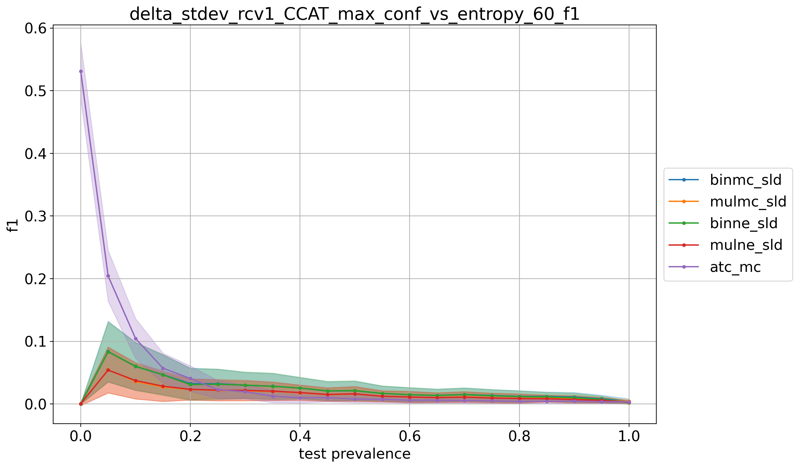

# rcv1_CCAT_9prevs

## 10% positives
> train: [0.90003338 0.09996662]  
> validation: [0.90003338 0.09996662]  
> bin_sld: 227.883s  
> mul_sld: 78.248s  
> binmc_sld: 226.732s  
> mulmc_sld: 66.259s  
> binne_sld: 223.276s  
> mulne_sld: 62.735s  
> bin_pacc: 217.001s  
> mul_pacc: 58.470s  
> ref: 48.024s  
> atc_mc: 51.785s  
> tot: 230.591s  

<table border="1" class="dataframe">
  <thead>
    <tr style="text-align: right;">
      <th></th>
      <th>binmc_sld</th>
      <th>mulmc_sld</th>
      <th>binne_sld</th>
      <th>mulne_sld</th>
      <th>atc_mc</th>
    </tr>
  </thead>
  <tbody>
    <tr>
      <th>0.0</th>
      <td>0.0060</td>
      <td>0.0303</td>
      <td>0.0178</td>
      <td>0.0473</td>
      <td>0.0022</td>
    </tr>
    <tr>
      <th>0.05</th>
      <td>0.2103</td>
      <td>0.1076</td>
      <td>0.2183</td>
      <td>0.1130</td>
      <td>0.2253</td>
    </tr>
    <tr>
      <th>0.1</th>
      <td>0.0993</td>
      <td>0.0664</td>
      <td>0.1152</td>
      <td>0.0584</td>
      <td>0.1997</td>
    </tr>
    <tr>
      <th>0.15</th>
      <td>0.1033</td>
      <td>0.0388</td>
      <td>0.1011</td>
      <td>0.0319</td>
      <td>0.2018</td>
    </tr>
    <tr>
      <th>0.2</th>
      <td>0.0624</td>
      <td>0.0297</td>
      <td>0.0672</td>
      <td>0.0244</td>
      <td>0.1936</td>
    </tr>
    <tr>
      <th>0.25</th>
      <td>0.0498</td>
      <td>0.0226</td>
      <td>0.0533</td>
      <td>0.0201</td>
      <td>0.1943</td>
    </tr>
    <tr>
      <th>0.3</th>
      <td>0.0395</td>
      <td>0.0195</td>
      <td>0.0491</td>
      <td>0.0178</td>
      <td>0.1865</td>
    </tr>
    <tr>
      <th>0.35</th>
      <td>0.0264</td>
      <td>0.0126</td>
      <td>0.0338</td>
      <td>0.0127</td>
      <td>0.1849</td>
    </tr>
    <tr>
      <th>0.4</th>
      <td>0.0212</td>
      <td>0.0161</td>
      <td>0.0312</td>
      <td>0.0164</td>
      <td>0.1852</td>
    </tr>
    <tr>
      <th>0.45</th>
      <td>0.0179</td>
      <td>0.0154</td>
      <td>0.0214</td>
      <td>0.0150</td>
      <td>0.1824</td>
    </tr>
    <tr>
      <th>0.5</th>
      <td>0.0163</td>
      <td>0.0183</td>
      <td>0.0313</td>
      <td>0.0170</td>
      <td>0.1836</td>
    </tr>
    <tr>
      <th>0.55</th>
      <td>0.0156</td>
      <td>0.0183</td>
      <td>0.0205</td>
      <td>0.0157</td>
      <td>0.1801</td>
    </tr>
    <tr>
      <th>0.6</th>
      <td>0.0214</td>
      <td>0.0241</td>
      <td>0.0319</td>
      <td>0.0194</td>
      <td>0.1872</td>
    </tr>
    <tr>
      <th>0.65</th>
      <td>0.0259</td>
      <td>0.0335</td>
      <td>0.0350</td>
      <td>0.0211</td>
      <td>0.1871</td>
    </tr>
    <tr>
      <th>0.7</th>
      <td>0.0258</td>
      <td>0.0330</td>
      <td>0.0263</td>
      <td>0.0209</td>
      <td>0.1884</td>
    </tr>
    <tr>
      <th>0.75</th>
      <td>0.0255</td>
      <td>0.0381</td>
      <td>0.0252</td>
      <td>0.0207</td>
      <td>0.1829</td>
    </tr>
    <tr>
      <th>0.8</th>
      <td>0.0224</td>
      <td>0.0428</td>
      <td>0.0229</td>
      <td>0.0224</td>
      <td>0.1840</td>
    </tr>
    <tr>
      <th>0.85</th>
      <td>0.0306</td>
      <td>0.0552</td>
      <td>0.0271</td>
      <td>0.0229</td>
      <td>0.1816</td>
    </tr>
    <tr>
      <th>0.9</th>
      <td>0.0229</td>
      <td>0.0841</td>
      <td>0.0198</td>
      <td>0.0227</td>
      <td>0.1818</td>
    </tr>
    <tr>
      <th>0.95</th>
      <td>0.0254</td>
      <td>0.0788</td>
      <td>0.0262</td>
      <td>0.0225</td>
      <td>0.1848</td>
    </tr>
    <tr>
      <th>1.0</th>
      <td>0.0034</td>
      <td>0.0165</td>
      <td>0.0038</td>
      <td>0.0120</td>
      <td>0.1850</td>
    </tr>
    <tr>
      <th>avg</th>
      <td>0.0415</td>
      <td>0.0382</td>
      <td>0.0466</td>
      <td>0.0274</td>
      <td>0.1801</td>
    </tr>
  </tbody>
</table>

## 20% positives
> train: [0.79989987 0.20010013]  
> validation: [0.80006676 0.19993324]  
> bin_sld: 224.734s  
> mul_sld: 70.409s  
> binmc_sld: 223.361s  
> mulmc_sld: 67.028s  
> binne_sld: 223.604s  
> mulne_sld: 67.347s  
> bin_pacc: 218.304s  
> mul_pacc: 60.326s  
> ref: 49.515s  
> atc_mc: 54.802s  
> tot: 229.075s  

<table border="1" class="dataframe">
  <thead>
    <tr style="text-align: right;">
      <th></th>
      <th>binmc_sld</th>
      <th>mulmc_sld</th>
      <th>binne_sld</th>
      <th>mulne_sld</th>
      <th>atc_mc</th>
    </tr>
  </thead>
  <tbody>
    <tr>
      <th>0.0</th>
      <td>0.0034</td>
      <td>0.0313</td>
      <td>0.0009</td>
      <td>0.0924</td>
      <td>0.1159</td>
    </tr>
    <tr>
      <th>0.05</th>
      <td>0.0799</td>
      <td>0.0743</td>
      <td>0.1030</td>
      <td>0.0861</td>
      <td>0.1303</td>
    </tr>
    <tr>
      <th>0.1</th>
      <td>0.0458</td>
      <td>0.0454</td>
      <td>0.0537</td>
      <td>0.0472</td>
      <td>0.0916</td>
    </tr>
    <tr>
      <th>0.15</th>
      <td>0.0355</td>
      <td>0.0352</td>
      <td>0.0378</td>
      <td>0.0349</td>
      <td>0.0794</td>
    </tr>
    <tr>
      <th>0.2</th>
      <td>0.0262</td>
      <td>0.0293</td>
      <td>0.0260</td>
      <td>0.0300</td>
      <td>0.0673</td>
    </tr>
    <tr>
      <th>0.25</th>
      <td>0.0209</td>
      <td>0.0247</td>
      <td>0.0195</td>
      <td>0.0261</td>
      <td>0.0623</td>
    </tr>
    <tr>
      <th>0.3</th>
      <td>0.0175</td>
      <td>0.0207</td>
      <td>0.0163</td>
      <td>0.0237</td>
      <td>0.0592</td>
    </tr>
    <tr>
      <th>0.35</th>
      <td>0.0109</td>
      <td>0.0149</td>
      <td>0.0118</td>
      <td>0.0175</td>
      <td>0.0518</td>
    </tr>
    <tr>
      <th>0.4</th>
      <td>0.0123</td>
      <td>0.0153</td>
      <td>0.0117</td>
      <td>0.0190</td>
      <td>0.0536</td>
    </tr>
    <tr>
      <th>0.45</th>
      <td>0.0097</td>
      <td>0.0136</td>
      <td>0.0095</td>
      <td>0.0165</td>
      <td>0.0510</td>
    </tr>
    <tr>
      <th>0.5</th>
      <td>0.0088</td>
      <td>0.0127</td>
      <td>0.0092</td>
      <td>0.0174</td>
      <td>0.0518</td>
    </tr>
    <tr>
      <th>0.55</th>
      <td>0.0080</td>
      <td>0.0115</td>
      <td>0.0082</td>
      <td>0.0161</td>
      <td>0.0533</td>
    </tr>
    <tr>
      <th>0.6</th>
      <td>0.0078</td>
      <td>0.0115</td>
      <td>0.0095</td>
      <td>0.0156</td>
      <td>0.0506</td>
    </tr>
    <tr>
      <th>0.65</th>
      <td>0.0078</td>
      <td>0.0119</td>
      <td>0.0090</td>
      <td>0.0164</td>
      <td>0.0480</td>
    </tr>
    <tr>
      <th>0.7</th>
      <td>0.0069</td>
      <td>0.0113</td>
      <td>0.0086</td>
      <td>0.0135</td>
      <td>0.0453</td>
    </tr>
    <tr>
      <th>0.75</th>
      <td>0.0074</td>
      <td>0.0120</td>
      <td>0.0086</td>
      <td>0.0139</td>
      <td>0.0428</td>
    </tr>
    <tr>
      <th>0.8</th>
      <td>0.0080</td>
      <td>0.0128</td>
      <td>0.0092</td>
      <td>0.0137</td>
      <td>0.0472</td>
    </tr>
    <tr>
      <th>0.85</th>
      <td>0.0093</td>
      <td>0.0136</td>
      <td>0.0093</td>
      <td>0.0138</td>
      <td>0.0461</td>
    </tr>
    <tr>
      <th>0.9</th>
      <td>0.0099</td>
      <td>0.0139</td>
      <td>0.0090</td>
      <td>0.0120</td>
      <td>0.0439</td>
    </tr>
    <tr>
      <th>0.95</th>
      <td>0.0104</td>
      <td>0.0147</td>
      <td>0.0080</td>
      <td>0.0114</td>
      <td>0.0468</td>
    </tr>
    <tr>
      <th>1.0</th>
      <td>0.0009</td>
      <td>0.0066</td>
      <td>0.0008</td>
      <td>0.0073</td>
      <td>0.0425</td>
    </tr>
    <tr>
      <th>avg</th>
      <td>0.0165</td>
      <td>0.0208</td>
      <td>0.0181</td>
      <td>0.0259</td>
      <td>0.0610</td>
    </tr>
  </tbody>
</table>

## 30% positives
> train: [0.69993324 0.30006676]  
> validation: [0.70010013 0.29989987]  
> bin_sld: 218.651s  
> mul_sld: 65.273s  
> binmc_sld: 221.260s  
> mulmc_sld: 64.594s  
> binne_sld: 218.686s  
> mulne_sld: 63.905s  
> bin_pacc: 215.149s  
> mul_pacc: 58.011s  
> ref: 48.157s  
> atc_mc: 52.112s  
> tot: 224.561s  

<table border="1" class="dataframe">
  <thead>
    <tr style="text-align: right;">
      <th></th>
      <th>binmc_sld</th>
      <th>mulmc_sld</th>
      <th>binne_sld</th>
      <th>mulne_sld</th>
      <th>atc_mc</th>
    </tr>
  </thead>
  <tbody>
    <tr>
      <th>0.0</th>
      <td>0.0005</td>
      <td>0.0089</td>
      <td>0.0003</td>
      <td>0.0143</td>
      <td>0.3301</td>
    </tr>
    <tr>
      <th>0.05</th>
      <td>0.0759</td>
      <td>0.0712</td>
      <td>0.0807</td>
      <td>0.0817</td>
      <td>0.0519</td>
    </tr>
    <tr>
      <th>0.1</th>
      <td>0.0513</td>
      <td>0.0479</td>
      <td>0.0617</td>
      <td>0.0617</td>
      <td>0.0306</td>
    </tr>
    <tr>
      <th>0.15</th>
      <td>0.0417</td>
      <td>0.0419</td>
      <td>0.0488</td>
      <td>0.0501</td>
      <td>0.0252</td>
    </tr>
    <tr>
      <th>0.2</th>
      <td>0.0340</td>
      <td>0.0372</td>
      <td>0.0377</td>
      <td>0.0418</td>
      <td>0.0190</td>
    </tr>
    <tr>
      <th>0.25</th>
      <td>0.0281</td>
      <td>0.0350</td>
      <td>0.0297</td>
      <td>0.0368</td>
      <td>0.0167</td>
    </tr>
    <tr>
      <th>0.3</th>
      <td>0.0205</td>
      <td>0.0268</td>
      <td>0.0201</td>
      <td>0.0270</td>
      <td>0.0132</td>
    </tr>
    <tr>
      <th>0.35</th>
      <td>0.0177</td>
      <td>0.0239</td>
      <td>0.0165</td>
      <td>0.0225</td>
      <td>0.0170</td>
    </tr>
    <tr>
      <th>0.4</th>
      <td>0.0153</td>
      <td>0.0227</td>
      <td>0.0135</td>
      <td>0.0204</td>
      <td>0.0141</td>
    </tr>
    <tr>
      <th>0.45</th>
      <td>0.0111</td>
      <td>0.0189</td>
      <td>0.0101</td>
      <td>0.0166</td>
      <td>0.0135</td>
    </tr>
    <tr>
      <th>0.5</th>
      <td>0.0097</td>
      <td>0.0164</td>
      <td>0.0088</td>
      <td>0.0140</td>
      <td>0.0153</td>
    </tr>
    <tr>
      <th>0.55</th>
      <td>0.0077</td>
      <td>0.0154</td>
      <td>0.0065</td>
      <td>0.0123</td>
      <td>0.0146</td>
    </tr>
    <tr>
      <th>0.6</th>
      <td>0.0072</td>
      <td>0.0129</td>
      <td>0.0078</td>
      <td>0.0106</td>
      <td>0.0142</td>
    </tr>
    <tr>
      <th>0.65</th>
      <td>0.0066</td>
      <td>0.0110</td>
      <td>0.0079</td>
      <td>0.0090</td>
      <td>0.0159</td>
    </tr>
    <tr>
      <th>0.7</th>
      <td>0.0062</td>
      <td>0.0098</td>
      <td>0.0079</td>
      <td>0.0090</td>
      <td>0.0145</td>
    </tr>
    <tr>
      <th>0.75</th>
      <td>0.0067</td>
      <td>0.0085</td>
      <td>0.0084</td>
      <td>0.0079</td>
      <td>0.0144</td>
    </tr>
    <tr>
      <th>0.8</th>
      <td>0.0067</td>
      <td>0.0073</td>
      <td>0.0087</td>
      <td>0.0071</td>
      <td>0.0157</td>
    </tr>
    <tr>
      <th>0.85</th>
      <td>0.0076</td>
      <td>0.0066</td>
      <td>0.0090</td>
      <td>0.0066</td>
      <td>0.0168</td>
    </tr>
    <tr>
      <th>0.9</th>
      <td>0.0089</td>
      <td>0.0062</td>
      <td>0.0094</td>
      <td>0.0059</td>
      <td>0.0155</td>
    </tr>
    <tr>
      <th>0.95</th>
      <td>0.0089</td>
      <td>0.0057</td>
      <td>0.0080</td>
      <td>0.0050</td>
      <td>0.0152</td>
    </tr>
    <tr>
      <th>1.0</th>
      <td>0.0003</td>
      <td>0.0039</td>
      <td>0.0003</td>
      <td>0.0054</td>
      <td>0.0177</td>
    </tr>
    <tr>
      <th>avg</th>
      <td>0.0177</td>
      <td>0.0209</td>
      <td>0.0191</td>
      <td>0.0222</td>
      <td>0.0334</td>
    </tr>
  </tbody>
</table>

## 40% positives
> train: [0.59996662 0.40003338]  
> validation: [0.59996662 0.40003338]  
> bin_sld: 213.191s  
> mul_sld: 64.472s  
> binmc_sld: 212.647s  
> mulmc_sld: 64.187s  
> binne_sld: 214.524s  
> mulne_sld: 63.741s  
> bin_pacc: 208.132s  
> mul_pacc: 57.195s  
> ref: 48.218s  
> atc_mc: 52.342s  
> tot: 219.577s  

<table border="1" class="dataframe">
  <thead>
    <tr style="text-align: right;">
      <th></th>
      <th>binmc_sld</th>
      <th>mulmc_sld</th>
      <th>binne_sld</th>
      <th>mulne_sld</th>
      <th>atc_mc</th>
    </tr>
  </thead>
  <tbody>
    <tr>
      <th>0.0</th>
      <td>0.0010</td>
      <td>0.0076</td>
      <td>0.0002</td>
      <td>0.0070</td>
      <td>0.3564</td>
    </tr>
    <tr>
      <th>0.05</th>
      <td>0.0652</td>
      <td>0.0630</td>
      <td>0.0600</td>
      <td>0.0774</td>
      <td>0.0506</td>
    </tr>
    <tr>
      <th>0.1</th>
      <td>0.0398</td>
      <td>0.0416</td>
      <td>0.0450</td>
      <td>0.0609</td>
      <td>0.0460</td>
    </tr>
    <tr>
      <th>0.15</th>
      <td>0.0335</td>
      <td>0.0383</td>
      <td>0.0442</td>
      <td>0.0578</td>
      <td>0.0318</td>
    </tr>
    <tr>
      <th>0.2</th>
      <td>0.0289</td>
      <td>0.0319</td>
      <td>0.0400</td>
      <td>0.0501</td>
      <td>0.0254</td>
    </tr>
    <tr>
      <th>0.25</th>
      <td>0.0300</td>
      <td>0.0346</td>
      <td>0.0408</td>
      <td>0.0493</td>
      <td>0.0197</td>
    </tr>
    <tr>
      <th>0.3</th>
      <td>0.0220</td>
      <td>0.0254</td>
      <td>0.0299</td>
      <td>0.0367</td>
      <td>0.0174</td>
    </tr>
    <tr>
      <th>0.35</th>
      <td>0.0208</td>
      <td>0.0237</td>
      <td>0.0264</td>
      <td>0.0310</td>
      <td>0.0129</td>
    </tr>
    <tr>
      <th>0.4</th>
      <td>0.0197</td>
      <td>0.0232</td>
      <td>0.0218</td>
      <td>0.0282</td>
      <td>0.0118</td>
    </tr>
    <tr>
      <th>0.45</th>
      <td>0.0149</td>
      <td>0.0181</td>
      <td>0.0169</td>
      <td>0.0224</td>
      <td>0.0095</td>
    </tr>
    <tr>
      <th>0.5</th>
      <td>0.0136</td>
      <td>0.0170</td>
      <td>0.0145</td>
      <td>0.0202</td>
      <td>0.0088</td>
    </tr>
    <tr>
      <th>0.55</th>
      <td>0.0108</td>
      <td>0.0162</td>
      <td>0.0108</td>
      <td>0.0186</td>
      <td>0.0085</td>
    </tr>
    <tr>
      <th>0.6</th>
      <td>0.0100</td>
      <td>0.0144</td>
      <td>0.0094</td>
      <td>0.0157</td>
      <td>0.0078</td>
    </tr>
    <tr>
      <th>0.65</th>
      <td>0.0083</td>
      <td>0.0127</td>
      <td>0.0080</td>
      <td>0.0132</td>
      <td>0.0093</td>
    </tr>
    <tr>
      <th>0.7</th>
      <td>0.0076</td>
      <td>0.0111</td>
      <td>0.0074</td>
      <td>0.0111</td>
      <td>0.0090</td>
    </tr>
    <tr>
      <th>0.75</th>
      <td>0.0063</td>
      <td>0.0083</td>
      <td>0.0066</td>
      <td>0.0084</td>
      <td>0.0075</td>
    </tr>
    <tr>
      <th>0.8</th>
      <td>0.0051</td>
      <td>0.0081</td>
      <td>0.0056</td>
      <td>0.0078</td>
      <td>0.0066</td>
    </tr>
    <tr>
      <th>0.85</th>
      <td>0.0046</td>
      <td>0.0069</td>
      <td>0.0057</td>
      <td>0.0068</td>
      <td>0.0084</td>
    </tr>
    <tr>
      <th>0.9</th>
      <td>0.0048</td>
      <td>0.0052</td>
      <td>0.0058</td>
      <td>0.0051</td>
      <td>0.0078</td>
    </tr>
    <tr>
      <th>0.95</th>
      <td>0.0048</td>
      <td>0.0049</td>
      <td>0.0054</td>
      <td>0.0048</td>
      <td>0.0097</td>
    </tr>
    <tr>
      <th>1.0</th>
      <td>0.0004</td>
      <td>0.0025</td>
      <td>0.0003</td>
      <td>0.0031</td>
      <td>0.0090</td>
    </tr>
    <tr>
      <th>avg</th>
      <td>0.0168</td>
      <td>0.0198</td>
      <td>0.0193</td>
      <td>0.0255</td>
      <td>0.0321</td>
    </tr>
  </tbody>
</table>

## 50% positives
> train: [0.5 0.5]  
> validation: [0.5 0.5]  
> bin_sld: 214.324s  
> mul_sld: 66.924s  
> binmc_sld: 214.469s  
> mulmc_sld: 65.323s  
> binne_sld: 214.727s  
> mulne_sld: 65.665s  
> bin_pacc: 209.386s  
> mul_pacc: 57.380s  
> ref: 47.729s  
> atc_mc: 52.153s  
> tot: 220.021s  

<table border="1" class="dataframe">
  <thead>
    <tr style="text-align: right;">
      <th></th>
      <th>binmc_sld</th>
      <th>mulmc_sld</th>
      <th>binne_sld</th>
      <th>mulne_sld</th>
      <th>atc_mc</th>
    </tr>
  </thead>
  <tbody>
    <tr>
      <th>0.0</th>
      <td>0.0002</td>
      <td>0.0010</td>
      <td>0.0002</td>
      <td>0.0011</td>
      <td>0.5135</td>
    </tr>
    <tr>
      <th>0.05</th>
      <td>0.0778</td>
      <td>0.0616</td>
      <td>0.0827</td>
      <td>0.0607</td>
      <td>0.1066</td>
    </tr>
    <tr>
      <th>0.1</th>
      <td>0.0407</td>
      <td>0.0362</td>
      <td>0.0405</td>
      <td>0.0383</td>
      <td>0.0476</td>
    </tr>
    <tr>
      <th>0.15</th>
      <td>0.0310</td>
      <td>0.0339</td>
      <td>0.0301</td>
      <td>0.0362</td>
      <td>0.0306</td>
    </tr>
    <tr>
      <th>0.2</th>
      <td>0.0270</td>
      <td>0.0283</td>
      <td>0.0272</td>
      <td>0.0332</td>
      <td>0.0235</td>
    </tr>
    <tr>
      <th>0.25</th>
      <td>0.0226</td>
      <td>0.0257</td>
      <td>0.0265</td>
      <td>0.0318</td>
      <td>0.0158</td>
    </tr>
    <tr>
      <th>0.3</th>
      <td>0.0224</td>
      <td>0.0241</td>
      <td>0.0252</td>
      <td>0.0282</td>
      <td>0.0147</td>
    </tr>
    <tr>
      <th>0.35</th>
      <td>0.0219</td>
      <td>0.0210</td>
      <td>0.0241</td>
      <td>0.0238</td>
      <td>0.0151</td>
    </tr>
    <tr>
      <th>0.4</th>
      <td>0.0187</td>
      <td>0.0192</td>
      <td>0.0219</td>
      <td>0.0227</td>
      <td>0.0105</td>
    </tr>
    <tr>
      <th>0.45</th>
      <td>0.0162</td>
      <td>0.0166</td>
      <td>0.0188</td>
      <td>0.0194</td>
      <td>0.0119</td>
    </tr>
    <tr>
      <th>0.5</th>
      <td>0.0147</td>
      <td>0.0151</td>
      <td>0.0177</td>
      <td>0.0178</td>
      <td>0.0115</td>
    </tr>
    <tr>
      <th>0.55</th>
      <td>0.0115</td>
      <td>0.0119</td>
      <td>0.0137</td>
      <td>0.0139</td>
      <td>0.0105</td>
    </tr>
    <tr>
      <th>0.6</th>
      <td>0.0126</td>
      <td>0.0126</td>
      <td>0.0143</td>
      <td>0.0141</td>
      <td>0.0107</td>
    </tr>
    <tr>
      <th>0.65</th>
      <td>0.0112</td>
      <td>0.0112</td>
      <td>0.0117</td>
      <td>0.0121</td>
      <td>0.0114</td>
    </tr>
    <tr>
      <th>0.7</th>
      <td>0.0105</td>
      <td>0.0104</td>
      <td>0.0105</td>
      <td>0.0110</td>
      <td>0.0103</td>
    </tr>
    <tr>
      <th>0.75</th>
      <td>0.0090</td>
      <td>0.0086</td>
      <td>0.0086</td>
      <td>0.0089</td>
      <td>0.0097</td>
    </tr>
    <tr>
      <th>0.8</th>
      <td>0.0071</td>
      <td>0.0078</td>
      <td>0.0064</td>
      <td>0.0081</td>
      <td>0.0117</td>
    </tr>
    <tr>
      <th>0.85</th>
      <td>0.0055</td>
      <td>0.0061</td>
      <td>0.0055</td>
      <td>0.0065</td>
      <td>0.0104</td>
    </tr>
    <tr>
      <th>0.9</th>
      <td>0.0054</td>
      <td>0.0057</td>
      <td>0.0055</td>
      <td>0.0058</td>
      <td>0.0117</td>
    </tr>
    <tr>
      <th>0.95</th>
      <td>0.0041</td>
      <td>0.0044</td>
      <td>0.0045</td>
      <td>0.0045</td>
      <td>0.0117</td>
    </tr>
    <tr>
      <th>1.0</th>
      <td>0.0011</td>
      <td>0.0023</td>
      <td>0.0005</td>
      <td>0.0021</td>
      <td>0.0128</td>
    </tr>
    <tr>
      <th>avg</th>
      <td>0.0177</td>
      <td>0.0173</td>
      <td>0.0189</td>
      <td>0.0191</td>
      <td>0.0434</td>
    </tr>
  </tbody>
</table>

## 60% positives
> train: [0.40003338 0.59996662]  
> validation: [0.40003338 0.59996662]  
> bin_sld: 214.994s  
> mul_sld: 67.090s  
> binmc_sld: 213.157s  
> mulmc_sld: 66.108s  
> binne_sld: 214.970s  
> mulne_sld: 66.024s  
> bin_pacc: 209.135s  
> mul_pacc: 57.235s  
> ref: 48.002s  
> atc_mc: 52.217s  
> tot: 220.124s  

<table border="1" class="dataframe">
  <thead>
    <tr style="text-align: right;">
      <th></th>
      <th>binmc_sld</th>
      <th>mulmc_sld</th>
      <th>binne_sld</th>
      <th>mulne_sld</th>
      <th>atc_mc</th>
    </tr>
  </thead>
  <tbody>
    <tr>
      <th>0.0</th>
      <td>0.0002</td>
      <td>0.0002</td>
      <td>0.0002</td>
      <td>0.0004</td>
      <td>0.5310</td>
    </tr>
    <tr>
      <th>0.05</th>
      <td>0.0837</td>
      <td>0.0546</td>
      <td>0.0832</td>
      <td>0.0542</td>
      <td>0.2044</td>
    </tr>
    <tr>
      <th>0.1</th>
      <td>0.0599</td>
      <td>0.0360</td>
      <td>0.0603</td>
      <td>0.0374</td>
      <td>0.1045</td>
    </tr>
    <tr>
      <th>0.15</th>
      <td>0.0468</td>
      <td>0.0271</td>
      <td>0.0465</td>
      <td>0.0284</td>
      <td>0.0571</td>
    </tr>
    <tr>
      <th>0.2</th>
      <td>0.0324</td>
      <td>0.0231</td>
      <td>0.0310</td>
      <td>0.0234</td>
      <td>0.0407</td>
    </tr>
    <tr>
      <th>0.25</th>
      <td>0.0324</td>
      <td>0.0217</td>
      <td>0.0315</td>
      <td>0.0221</td>
      <td>0.0228</td>
    </tr>
    <tr>
      <th>0.3</th>
      <td>0.0299</td>
      <td>0.0209</td>
      <td>0.0302</td>
      <td>0.0217</td>
      <td>0.0196</td>
    </tr>
    <tr>
      <th>0.35</th>
      <td>0.0284</td>
      <td>0.0200</td>
      <td>0.0282</td>
      <td>0.0205</td>
      <td>0.0125</td>
    </tr>
    <tr>
      <th>0.4</th>
      <td>0.0254</td>
      <td>0.0178</td>
      <td>0.0255</td>
      <td>0.0183</td>
      <td>0.0100</td>
    </tr>
    <tr>
      <th>0.45</th>
      <td>0.0207</td>
      <td>0.0148</td>
      <td>0.0210</td>
      <td>0.0152</td>
      <td>0.0101</td>
    </tr>
    <tr>
      <th>0.5</th>
      <td>0.0211</td>
      <td>0.0160</td>
      <td>0.0214</td>
      <td>0.0163</td>
      <td>0.0081</td>
    </tr>
    <tr>
      <th>0.55</th>
      <td>0.0168</td>
      <td>0.0125</td>
      <td>0.0169</td>
      <td>0.0123</td>
      <td>0.0076</td>
    </tr>
    <tr>
      <th>0.6</th>
      <td>0.0148</td>
      <td>0.0109</td>
      <td>0.0148</td>
      <td>0.0112</td>
      <td>0.0060</td>
    </tr>
    <tr>
      <th>0.65</th>
      <td>0.0137</td>
      <td>0.0103</td>
      <td>0.0136</td>
      <td>0.0102</td>
      <td>0.0060</td>
    </tr>
    <tr>
      <th>0.7</th>
      <td>0.0152</td>
      <td>0.0116</td>
      <td>0.0149</td>
      <td>0.0110</td>
      <td>0.0055</td>
    </tr>
    <tr>
      <th>0.75</th>
      <td>0.0135</td>
      <td>0.0099</td>
      <td>0.0131</td>
      <td>0.0095</td>
      <td>0.0051</td>
    </tr>
    <tr>
      <th>0.8</th>
      <td>0.0122</td>
      <td>0.0090</td>
      <td>0.0117</td>
      <td>0.0087</td>
      <td>0.0042</td>
    </tr>
    <tr>
      <th>0.85</th>
      <td>0.0120</td>
      <td>0.0091</td>
      <td>0.0113</td>
      <td>0.0084</td>
      <td>0.0042</td>
    </tr>
    <tr>
      <th>0.9</th>
      <td>0.0110</td>
      <td>0.0081</td>
      <td>0.0099</td>
      <td>0.0071</td>
      <td>0.0045</td>
    </tr>
    <tr>
      <th>0.95</th>
      <td>0.0083</td>
      <td>0.0064</td>
      <td>0.0074</td>
      <td>0.0059</td>
      <td>0.0037</td>
    </tr>
    <tr>
      <th>1.0</th>
      <td>0.0042</td>
      <td>0.0040</td>
      <td>0.0021</td>
      <td>0.0028</td>
      <td>0.0034</td>
    </tr>
    <tr>
      <th>avg</th>
      <td>0.0239</td>
      <td>0.0164</td>
      <td>0.0236</td>
      <td>0.0164</td>
      <td>0.0510</td>
    </tr>
  </tbody>
</table>

## 70% positives
> train: [0.29989987 0.70010013]  
> validation: [0.30006676 0.69993324]  
> bin_sld: 217.809s  
> mul_sld: 67.454s  
> binmc_sld: 215.345s  
> mulmc_sld: 65.596s  
> binne_sld: 216.897s  
> mulne_sld: 66.048s  
> bin_pacc: 210.063s  
> mul_pacc: 56.905s  
> ref: 47.823s  
> atc_mc: 51.936s  
> tot: 222.297s  

<table border="1" class="dataframe">
  <thead>
    <tr style="text-align: right;">
      <th></th>
      <th>binmc_sld</th>
      <th>mulmc_sld</th>
      <th>binne_sld</th>
      <th>mulne_sld</th>
      <th>atc_mc</th>
    </tr>
  </thead>
  <tbody>
    <tr>
      <th>0.0</th>
      <td>0.0001</td>
      <td>0.0000</td>
      <td>0.0001</td>
      <td>0.0001</td>
      <td>0.5749</td>
    </tr>
    <tr>
      <th>0.05</th>
      <td>0.0875</td>
      <td>0.0694</td>
      <td>0.0774</td>
      <td>0.0566</td>
      <td>0.3336</td>
    </tr>
    <tr>
      <th>0.1</th>
      <td>0.0668</td>
      <td>0.0546</td>
      <td>0.0642</td>
      <td>0.0515</td>
      <td>0.2163</td>
    </tr>
    <tr>
      <th>0.15</th>
      <td>0.0559</td>
      <td>0.0434</td>
      <td>0.0555</td>
      <td>0.0449</td>
      <td>0.1450</td>
    </tr>
    <tr>
      <th>0.2</th>
      <td>0.0405</td>
      <td>0.0319</td>
      <td>0.0407</td>
      <td>0.0343</td>
      <td>0.1055</td>
    </tr>
    <tr>
      <th>0.25</th>
      <td>0.0387</td>
      <td>0.0303</td>
      <td>0.0389</td>
      <td>0.0336</td>
      <td>0.0703</td>
    </tr>
    <tr>
      <th>0.3</th>
      <td>0.0350</td>
      <td>0.0266</td>
      <td>0.0361</td>
      <td>0.0302</td>
      <td>0.0549</td>
    </tr>
    <tr>
      <th>0.35</th>
      <td>0.0311</td>
      <td>0.0251</td>
      <td>0.0319</td>
      <td>0.0288</td>
      <td>0.0403</td>
    </tr>
    <tr>
      <th>0.4</th>
      <td>0.0276</td>
      <td>0.0211</td>
      <td>0.0276</td>
      <td>0.0239</td>
      <td>0.0279</td>
    </tr>
    <tr>
      <th>0.45</th>
      <td>0.0244</td>
      <td>0.0190</td>
      <td>0.0244</td>
      <td>0.0213</td>
      <td>0.0225</td>
    </tr>
    <tr>
      <th>0.5</th>
      <td>0.0213</td>
      <td>0.0174</td>
      <td>0.0214</td>
      <td>0.0189</td>
      <td>0.0165</td>
    </tr>
    <tr>
      <th>0.55</th>
      <td>0.0210</td>
      <td>0.0161</td>
      <td>0.0206</td>
      <td>0.0171</td>
      <td>0.0120</td>
    </tr>
    <tr>
      <th>0.6</th>
      <td>0.0163</td>
      <td>0.0123</td>
      <td>0.0159</td>
      <td>0.0130</td>
      <td>0.0095</td>
    </tr>
    <tr>
      <th>0.65</th>
      <td>0.0175</td>
      <td>0.0134</td>
      <td>0.0180</td>
      <td>0.0138</td>
      <td>0.0089</td>
    </tr>
    <tr>
      <th>0.7</th>
      <td>0.0149</td>
      <td>0.0112</td>
      <td>0.0147</td>
      <td>0.0110</td>
      <td>0.0060</td>
    </tr>
    <tr>
      <th>0.75</th>
      <td>0.0142</td>
      <td>0.0108</td>
      <td>0.0138</td>
      <td>0.0101</td>
      <td>0.0047</td>
    </tr>
    <tr>
      <th>0.8</th>
      <td>0.0138</td>
      <td>0.0101</td>
      <td>0.0139</td>
      <td>0.0094</td>
      <td>0.0044</td>
    </tr>
    <tr>
      <th>0.85</th>
      <td>0.0135</td>
      <td>0.0103</td>
      <td>0.0135</td>
      <td>0.0091</td>
      <td>0.0045</td>
    </tr>
    <tr>
      <th>0.9</th>
      <td>0.0113</td>
      <td>0.0083</td>
      <td>0.0111</td>
      <td>0.0068</td>
      <td>0.0036</td>
    </tr>
    <tr>
      <th>0.95</th>
      <td>0.0098</td>
      <td>0.0069</td>
      <td>0.0088</td>
      <td>0.0051</td>
      <td>0.0035</td>
    </tr>
    <tr>
      <th>1.0</th>
      <td>0.0053</td>
      <td>0.0050</td>
      <td>0.0029</td>
      <td>0.0027</td>
      <td>0.0032</td>
    </tr>
    <tr>
      <th>avg</th>
      <td>0.0270</td>
      <td>0.0211</td>
      <td>0.0263</td>
      <td>0.0211</td>
      <td>0.0794</td>
    </tr>
  </tbody>
</table>

## 80% positives
> train: [0.19993324 0.80006676]  
> validation: [0.20010013 0.79989987]  
> bin_sld: 216.605s  
> mul_sld: 66.881s  
> binmc_sld: 215.549s  
> mulmc_sld: 65.843s  
> binne_sld: 217.993s  
> mulne_sld: 64.859s  
> bin_pacc: 208.788s  
> mul_pacc: 56.643s  
> ref: 47.697s  
> atc_mc: 52.089s  
> tot: 223.227s  

<table border="1" class="dataframe">
  <thead>
    <tr style="text-align: right;">
      <th></th>
      <th>binmc_sld</th>
      <th>mulmc_sld</th>
      <th>binne_sld</th>
      <th>mulne_sld</th>
      <th>atc_mc</th>
    </tr>
  </thead>
  <tbody>
    <tr>
      <th>0.0</th>
      <td>0.0001</td>
      <td>0.0000</td>
      <td>0.0001</td>
      <td>0.0001</td>
      <td>0.5459</td>
    </tr>
    <tr>
      <th>0.05</th>
      <td>0.0870</td>
      <td>0.0767</td>
      <td>0.0615</td>
      <td>0.0466</td>
      <td>0.3941</td>
    </tr>
    <tr>
      <th>0.1</th>
      <td>0.0656</td>
      <td>0.0597</td>
      <td>0.0526</td>
      <td>0.0447</td>
      <td>0.2954</td>
    </tr>
    <tr>
      <th>0.15</th>
      <td>0.0510</td>
      <td>0.0472</td>
      <td>0.0441</td>
      <td>0.0415</td>
      <td>0.2206</td>
    </tr>
    <tr>
      <th>0.2</th>
      <td>0.0363</td>
      <td>0.0339</td>
      <td>0.0334</td>
      <td>0.0332</td>
      <td>0.1701</td>
    </tr>
    <tr>
      <th>0.25</th>
      <td>0.0333</td>
      <td>0.0306</td>
      <td>0.0318</td>
      <td>0.0332</td>
      <td>0.1277</td>
    </tr>
    <tr>
      <th>0.3</th>
      <td>0.0303</td>
      <td>0.0268</td>
      <td>0.0289</td>
      <td>0.0315</td>
      <td>0.0994</td>
    </tr>
    <tr>
      <th>0.35</th>
      <td>0.0247</td>
      <td>0.0233</td>
      <td>0.0250</td>
      <td>0.0292</td>
      <td>0.0774</td>
    </tr>
    <tr>
      <th>0.4</th>
      <td>0.0216</td>
      <td>0.0188</td>
      <td>0.0218</td>
      <td>0.0254</td>
      <td>0.0563</td>
    </tr>
    <tr>
      <th>0.45</th>
      <td>0.0180</td>
      <td>0.0156</td>
      <td>0.0179</td>
      <td>0.0217</td>
      <td>0.0440</td>
    </tr>
    <tr>
      <th>0.5</th>
      <td>0.0140</td>
      <td>0.0128</td>
      <td>0.0147</td>
      <td>0.0183</td>
      <td>0.0323</td>
    </tr>
    <tr>
      <th>0.55</th>
      <td>0.0151</td>
      <td>0.0129</td>
      <td>0.0148</td>
      <td>0.0184</td>
      <td>0.0206</td>
    </tr>
    <tr>
      <th>0.6</th>
      <td>0.0106</td>
      <td>0.0096</td>
      <td>0.0096</td>
      <td>0.0128</td>
      <td>0.0152</td>
    </tr>
    <tr>
      <th>0.65</th>
      <td>0.0116</td>
      <td>0.0099</td>
      <td>0.0110</td>
      <td>0.0136</td>
      <td>0.0098</td>
    </tr>
    <tr>
      <th>0.7</th>
      <td>0.0100</td>
      <td>0.0085</td>
      <td>0.0092</td>
      <td>0.0111</td>
      <td>0.0072</td>
    </tr>
    <tr>
      <th>0.75</th>
      <td>0.0087</td>
      <td>0.0072</td>
      <td>0.0088</td>
      <td>0.0087</td>
      <td>0.0056</td>
    </tr>
    <tr>
      <th>0.8</th>
      <td>0.0105</td>
      <td>0.0078</td>
      <td>0.0098</td>
      <td>0.0090</td>
      <td>0.0049</td>
    </tr>
    <tr>
      <th>0.85</th>
      <td>0.0089</td>
      <td>0.0069</td>
      <td>0.0090</td>
      <td>0.0072</td>
      <td>0.0053</td>
    </tr>
    <tr>
      <th>0.9</th>
      <td>0.0090</td>
      <td>0.0069</td>
      <td>0.0091</td>
      <td>0.0062</td>
      <td>0.0055</td>
    </tr>
    <tr>
      <th>0.95</th>
      <td>0.0075</td>
      <td>0.0058</td>
      <td>0.0072</td>
      <td>0.0048</td>
      <td>0.0068</td>
    </tr>
    <tr>
      <th>1.0</th>
      <td>0.0043</td>
      <td>0.0038</td>
      <td>0.0023</td>
      <td>0.0019</td>
      <td>0.0076</td>
    </tr>
    <tr>
      <th>avg</th>
      <td>0.0228</td>
      <td>0.0202</td>
      <td>0.0201</td>
      <td>0.0200</td>
      <td>0.1025</td>
    </tr>
  </tbody>
</table>

## 90% positives
> train: [0.09996662 0.90003338]  
> validation: [0.09996662 0.90003338]  
> bin_sld: 218.933s  
> mul_sld: 73.768s  
> binmc_sld: 218.003s  
> mulmc_sld: 61.731s  
> binne_sld: 219.245s  
> mulne_sld: 62.751s  
> bin_pacc: 208.227s  
> mul_pacc: 56.657s  
> ref: 48.071s  
> atc_mc: 52.099s  
> tot: 224.345s  

<table border="1" class="dataframe">
  <thead>
    <tr style="text-align: right;">
      <th></th>
      <th>binmc_sld</th>
      <th>mulmc_sld</th>
      <th>binne_sld</th>
      <th>mulne_sld</th>
      <th>atc_mc</th>
    </tr>
  </thead>
  <tbody>
    <tr>
      <th>0.0</th>
      <td>0.0000</td>
      <td>0.0000</td>
      <td>0.0000</td>
      <td>0.0000</td>
      <td>0.4745</td>
    </tr>
    <tr>
      <th>0.05</th>
      <td>0.1081</td>
      <td>0.1023</td>
      <td>0.0873</td>
      <td>0.0657</td>
      <td>0.4016</td>
    </tr>
    <tr>
      <th>0.1</th>
      <td>0.1276</td>
      <td>0.1099</td>
      <td>0.0908</td>
      <td>0.0715</td>
      <td>0.3432</td>
    </tr>
    <tr>
      <th>0.15</th>
      <td>0.1131</td>
      <td>0.1009</td>
      <td>0.0852</td>
      <td>0.0697</td>
      <td>0.2909</td>
    </tr>
    <tr>
      <th>0.2</th>
      <td>0.0950</td>
      <td>0.0873</td>
      <td>0.0747</td>
      <td>0.0633</td>
      <td>0.2470</td>
    </tr>
    <tr>
      <th>0.25</th>
      <td>0.0855</td>
      <td>0.0819</td>
      <td>0.0706</td>
      <td>0.0641</td>
      <td>0.2076</td>
    </tr>
    <tr>
      <th>0.3</th>
      <td>0.0712</td>
      <td>0.0701</td>
      <td>0.0615</td>
      <td>0.0576</td>
      <td>0.1759</td>
    </tr>
    <tr>
      <th>0.35</th>
      <td>0.0611</td>
      <td>0.0623</td>
      <td>0.0551</td>
      <td>0.0537</td>
      <td>0.1487</td>
    </tr>
    <tr>
      <th>0.4</th>
      <td>0.0523</td>
      <td>0.0545</td>
      <td>0.0490</td>
      <td>0.0497</td>
      <td>0.1239</td>
    </tr>
    <tr>
      <th>0.45</th>
      <td>0.0418</td>
      <td>0.0446</td>
      <td>0.0407</td>
      <td>0.0419</td>
      <td>0.1027</td>
    </tr>
    <tr>
      <th>0.5</th>
      <td>0.0341</td>
      <td>0.0375</td>
      <td>0.0345</td>
      <td>0.0371</td>
      <td>0.0842</td>
    </tr>
    <tr>
      <th>0.55</th>
      <td>0.0311</td>
      <td>0.0344</td>
      <td>0.0324</td>
      <td>0.0355</td>
      <td>0.0659</td>
    </tr>
    <tr>
      <th>0.6</th>
      <td>0.0219</td>
      <td>0.0252</td>
      <td>0.0240</td>
      <td>0.0272</td>
      <td>0.0530</td>
    </tr>
    <tr>
      <th>0.65</th>
      <td>0.0210</td>
      <td>0.0235</td>
      <td>0.0236</td>
      <td>0.0271</td>
      <td>0.0392</td>
    </tr>
    <tr>
      <th>0.7</th>
      <td>0.0160</td>
      <td>0.0180</td>
      <td>0.0186</td>
      <td>0.0216</td>
      <td>0.0290</td>
    </tr>
    <tr>
      <th>0.75</th>
      <td>0.0116</td>
      <td>0.0131</td>
      <td>0.0143</td>
      <td>0.0173</td>
      <td>0.0196</td>
    </tr>
    <tr>
      <th>0.8</th>
      <td>0.0100</td>
      <td>0.0111</td>
      <td>0.0122</td>
      <td>0.0139</td>
      <td>0.0125</td>
    </tr>
    <tr>
      <th>0.85</th>
      <td>0.0080</td>
      <td>0.0087</td>
      <td>0.0095</td>
      <td>0.0109</td>
      <td>0.0061</td>
    </tr>
    <tr>
      <th>0.9</th>
      <td>0.0059</td>
      <td>0.0056</td>
      <td>0.0068</td>
      <td>0.0072</td>
      <td>0.0036</td>
    </tr>
    <tr>
      <th>0.95</th>
      <td>0.0048</td>
      <td>0.0045</td>
      <td>0.0048</td>
      <td>0.0049</td>
      <td>0.0069</td>
    </tr>
    <tr>
      <th>1.0</th>
      <td>0.0045</td>
      <td>0.0039</td>
      <td>0.0029</td>
      <td>0.0023</td>
      <td>0.0123</td>
    </tr>
    <tr>
      <th>avg</th>
      <td>0.0440</td>
      <td>0.0428</td>
      <td>0.0380</td>
      <td>0.0353</td>
      <td>0.1356</td>
    </tr>
  </tbody>
</table>

## avg
### avg on train
<table border="1" class="dataframe">
  <thead>
    <tr style="text-align: right;">
      <th></th>
      <th>binmc_sld</th>
      <th>mulmc_sld</th>
      <th>binne_sld</th>
      <th>mulne_sld</th>
      <th>atc_mc</th>
    </tr>
  </thead>
  <tbody>
    <tr>
      <th>0.0</th>
      <td>0.0013</td>
      <td>0.0088</td>
      <td>0.0022</td>
      <td>0.0181</td>
      <td>0.3827</td>
    </tr>
    <tr>
      <th>0.05</th>
      <td>0.0973</td>
      <td>0.0756</td>
      <td>0.0949</td>
      <td>0.0713</td>
      <td>0.2109</td>
    </tr>
    <tr>
      <th>0.1</th>
      <td>0.0663</td>
      <td>0.0553</td>
      <td>0.0649</td>
      <td>0.0524</td>
      <td>0.1528</td>
    </tr>
    <tr>
      <th>0.15</th>
      <td>0.0569</td>
      <td>0.0452</td>
      <td>0.0548</td>
      <td>0.0439</td>
      <td>0.1203</td>
    </tr>
    <tr>
      <th>0.2</th>
      <td>0.0425</td>
      <td>0.0370</td>
      <td>0.0420</td>
      <td>0.0371</td>
      <td>0.0991</td>
    </tr>
    <tr>
      <th>0.25</th>
      <td>0.0379</td>
      <td>0.0341</td>
      <td>0.0381</td>
      <td>0.0352</td>
      <td>0.0819</td>
    </tr>
    <tr>
      <th>0.3</th>
      <td>0.0320</td>
      <td>0.0290</td>
      <td>0.0330</td>
      <td>0.0305</td>
      <td>0.0712</td>
    </tr>
    <tr>
      <th>0.35</th>
      <td>0.0270</td>
      <td>0.0252</td>
      <td>0.0281</td>
      <td>0.0266</td>
      <td>0.0623</td>
    </tr>
    <tr>
      <th>0.4</th>
      <td>0.0238</td>
      <td>0.0232</td>
      <td>0.0249</td>
      <td>0.0249</td>
      <td>0.0548</td>
    </tr>
    <tr>
      <th>0.45</th>
      <td>0.0194</td>
      <td>0.0196</td>
      <td>0.0201</td>
      <td>0.0211</td>
      <td>0.0497</td>
    </tr>
    <tr>
      <th>0.5</th>
      <td>0.0171</td>
      <td>0.0181</td>
      <td>0.0193</td>
      <td>0.0197</td>
      <td>0.0458</td>
    </tr>
    <tr>
      <th>0.55</th>
      <td>0.0153</td>
      <td>0.0166</td>
      <td>0.0160</td>
      <td>0.0178</td>
      <td>0.0415</td>
    </tr>
    <tr>
      <th>0.6</th>
      <td>0.0136</td>
      <td>0.0148</td>
      <td>0.0152</td>
      <td>0.0155</td>
      <td>0.0394</td>
    </tr>
    <tr>
      <th>0.65</th>
      <td>0.0137</td>
      <td>0.0153</td>
      <td>0.0153</td>
      <td>0.0152</td>
      <td>0.0373</td>
    </tr>
    <tr>
      <th>0.7</th>
      <td>0.0126</td>
      <td>0.0139</td>
      <td>0.0131</td>
      <td>0.0134</td>
      <td>0.0350</td>
    </tr>
    <tr>
      <th>0.75</th>
      <td>0.0114</td>
      <td>0.0129</td>
      <td>0.0119</td>
      <td>0.0117</td>
      <td>0.0325</td>
    </tr>
    <tr>
      <th>0.8</th>
      <td>0.0107</td>
      <td>0.0130</td>
      <td>0.0112</td>
      <td>0.0111</td>
      <td>0.0323</td>
    </tr>
    <tr>
      <th>0.85</th>
      <td>0.0111</td>
      <td>0.0137</td>
      <td>0.0111</td>
      <td>0.0102</td>
      <td>0.0315</td>
    </tr>
    <tr>
      <th>0.9</th>
      <td>0.0099</td>
      <td>0.0160</td>
      <td>0.0096</td>
      <td>0.0087</td>
      <td>0.0309</td>
    </tr>
    <tr>
      <th>0.95</th>
      <td>0.0093</td>
      <td>0.0147</td>
      <td>0.0089</td>
      <td>0.0077</td>
      <td>0.0321</td>
    </tr>
    <tr>
      <th>1.0</th>
      <td>0.0027</td>
      <td>0.0054</td>
      <td>0.0018</td>
      <td>0.0044</td>
      <td>0.0326</td>
    </tr>
    <tr>
      <th>avg</th>
      <td>0.0253</td>
      <td>0.0242</td>
      <td>0.0255</td>
      <td>0.0236</td>
      <td>0.0798</td>
    </tr>
  </tbody>
</table>

### avg on test
<table border="1" class="dataframe">
  <thead>
    <tr style="text-align: right;">
      <th></th>
      <th>binmc_sld</th>
      <th>mulmc_sld</th>
      <th>binne_sld</th>
      <th>mulne_sld</th>
      <th>atc_mc</th>
    </tr>
  </thead>
  <tbody>
    <tr>
      <th>0.1</th>
      <td>0.0415</td>
      <td>0.0382</td>
      <td>0.0466</td>
      <td>0.0274</td>
      <td>0.1801</td>
    </tr>
    <tr>
      <th>0.2</th>
      <td>0.0165</td>
      <td>0.0208</td>
      <td>0.0181</td>
      <td>0.0259</td>
      <td>0.0610</td>
    </tr>
    <tr>
      <th>0.3</th>
      <td>0.0177</td>
      <td>0.0209</td>
      <td>0.0191</td>
      <td>0.0222</td>
      <td>0.0334</td>
    </tr>
    <tr>
      <th>0.4</th>
      <td>0.0168</td>
      <td>0.0198</td>
      <td>0.0193</td>
      <td>0.0255</td>
      <td>0.0321</td>
    </tr>
    <tr>
      <th>0.5</th>
      <td>0.0177</td>
      <td>0.0173</td>
      <td>0.0189</td>
      <td>0.0191</td>
      <td>0.0434</td>
    </tr>
    <tr>
      <th>0.6</th>
      <td>0.0239</td>
      <td>0.0164</td>
      <td>0.0236</td>
      <td>0.0164</td>
      <td>0.0510</td>
    </tr>
    <tr>
      <th>0.7</th>
      <td>0.0270</td>
      <td>0.0211</td>
      <td>0.0263</td>
      <td>0.0211</td>
      <td>0.0794</td>
    </tr>
    <tr>
      <th>0.8</th>
      <td>0.0228</td>
      <td>0.0202</td>
      <td>0.0201</td>
      <td>0.0200</td>
      <td>0.1025</td>
    </tr>
    <tr>
      <th>0.9</th>
      <td>0.0440</td>
      <td>0.0428</td>
      <td>0.0380</td>
      <td>0.0353</td>
      <td>0.1356</td>
    </tr>
    <tr>
      <th>avg</th>
      <td>0.0253</td>
      <td>0.0242</td>
      <td>0.0255</td>
      <td>0.0236</td>
      <td>0.0798</td>
    </tr>
  </tbody>
</table>

### avg dataset shift

