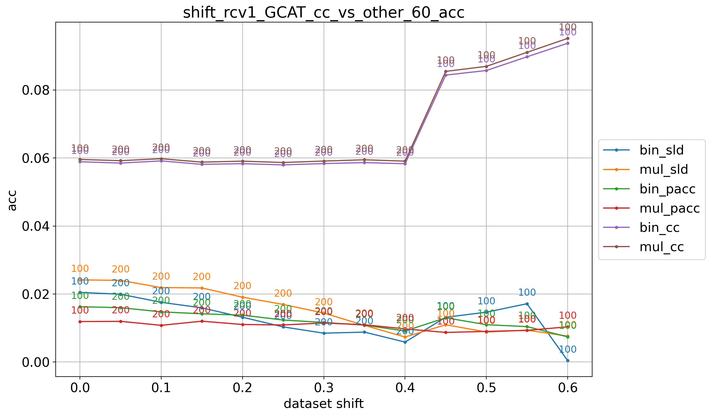
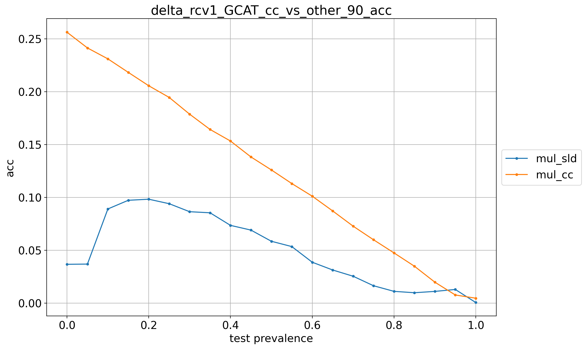
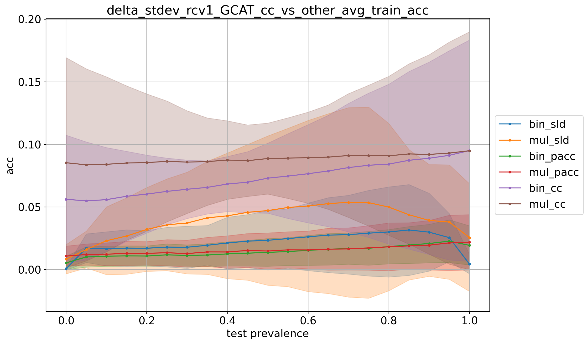

# rcv1_GCAT_9prevs

## 10% positives
> train: [0.90005165 0.09994835]  
> validation: [0.90005165 0.09994835]  
> bin_sld: 238.632s  
> mul_sld: 101.343s  
> mul_sld_gs: 441.747s  
> bin_cc: 230.303s  
> mul_cc: 77.603s  
> kfcv: 66.959s  
> ref: 65.305s  
> atc_mc: 66.465s  
> atc_ne: 65.103s  
> doc_feat: 56.750s  
> tot: 446.654s  

<table border="1" class="dataframe">
  <thead>
    <tr style="text-align: right;">
      <th></th>
      <th>bin_sld</th>
      <th>mul_sld</th>
      <th>bin_cc</th>
      <th>mul_cc</th>
    </tr>
  </thead>
  <tbody>
    <tr>
      <th>0.0</th>
      <td>0.0009</td>
      <td>0.0006</td>
      <td>0.0061</td>
      <td>0.0052</td>
    </tr>
    <tr>
      <th>0.05</th>
      <td>0.0058</td>
      <td>0.0086</td>
      <td>0.0089</td>
      <td>0.0095</td>
    </tr>
    <tr>
      <th>0.1</th>
      <td>0.0068</td>
      <td>0.0106</td>
      <td>0.0229</td>
      <td>0.0230</td>
    </tr>
    <tr>
      <th>0.15</th>
      <td>0.0108</td>
      <td>0.0310</td>
      <td>0.0391</td>
      <td>0.0385</td>
    </tr>
    <tr>
      <th>0.2</th>
      <td>0.0179</td>
      <td>0.0680</td>
      <td>0.0532</td>
      <td>0.0526</td>
    </tr>
    <tr>
      <th>0.25</th>
      <td>0.0265</td>
      <td>0.1009</td>
      <td>0.0670</td>
      <td>0.0657</td>
    </tr>
    <tr>
      <th>0.3</th>
      <td>0.0347</td>
      <td>0.1255</td>
      <td>0.0825</td>
      <td>0.0803</td>
    </tr>
    <tr>
      <th>0.35</th>
      <td>0.0428</td>
      <td>0.1470</td>
      <td>0.0966</td>
      <td>0.0949</td>
    </tr>
    <tr>
      <th>0.4</th>
      <td>0.0521</td>
      <td>0.1685</td>
      <td>0.1115</td>
      <td>0.1092</td>
    </tr>
    <tr>
      <th>0.45</th>
      <td>0.0600</td>
      <td>0.1853</td>
      <td>0.1266</td>
      <td>0.1239</td>
    </tr>
    <tr>
      <th>0.5</th>
      <td>0.0708</td>
      <td>0.2041</td>
      <td>0.1402</td>
      <td>0.1373</td>
    </tr>
    <tr>
      <th>0.55</th>
      <td>0.0767</td>
      <td>0.2168</td>
      <td>0.1561</td>
      <td>0.1524</td>
    </tr>
    <tr>
      <th>0.6</th>
      <td>0.0869</td>
      <td>0.2332</td>
      <td>0.1713</td>
      <td>0.1660</td>
    </tr>
    <tr>
      <th>0.65</th>
      <td>0.0960</td>
      <td>0.2435</td>
      <td>0.1844</td>
      <td>0.1790</td>
    </tr>
    <tr>
      <th>0.7</th>
      <td>0.1029</td>
      <td>0.2534</td>
      <td>0.2006</td>
      <td>0.1955</td>
    </tr>
    <tr>
      <th>0.75</th>
      <td>0.1078</td>
      <td>0.2530</td>
      <td>0.2148</td>
      <td>0.2093</td>
    </tr>
    <tr>
      <th>0.8</th>
      <td>0.1146</td>
      <td>0.2157</td>
      <td>0.2279</td>
      <td>0.2218</td>
    </tr>
    <tr>
      <th>0.85</th>
      <td>0.1184</td>
      <td>0.1519</td>
      <td>0.2453</td>
      <td>0.2387</td>
    </tr>
    <tr>
      <th>0.9</th>
      <td>0.1010</td>
      <td>0.1016</td>
      <td>0.2568</td>
      <td>0.2495</td>
    </tr>
    <tr>
      <th>0.95</th>
      <td>0.0518</td>
      <td>0.0770</td>
      <td>0.2736</td>
      <td>0.2685</td>
    </tr>
    <tr>
      <th>1.0</th>
      <td>0.0021</td>
      <td>0.0139</td>
      <td>0.2878</td>
      <td>0.2808</td>
    </tr>
    <tr>
      <th>avg</th>
      <td>0.0565</td>
      <td>0.1338</td>
      <td>0.1416</td>
      <td>0.1382</td>
    </tr>
  </tbody>
</table>

## 20% positives
> train: [0.79984504 0.20015496]  
> validation: [0.80010331 0.19989669]  
> bin_sld: 431.443s  
> mul_sld: 188.845s  
> bin_sld_gs: 1093.467s  
> mul_sld_gs: 642.106s  
> bin_sld_gsq: 522.073s  
> bin_pacc: 422.062s  
> mul_pacc: 154.976s  
> binmc_pacc: 417.137s  
> mulmc_pacc: 140.524s  
> binne_pacc: 421.581s  
> mulne_pacc: 157.883s  
> bin_pacc_gs: 723.261s  
> mul_pacc_gs: 258.223s  
> bin_cc: 402.467s  
> mul_cc: 144.805s  
> kfcv: 108.333s  
> ref: 118.158s  
> atc_mc: 118.502s  
> atc_ne: 96.965s  
> doc_feat: 91.141s  
> tot: 1096.718s  

<table border="1" class="dataframe">
  <thead>
    <tr style="text-align: right;">
      <th></th>
      <th>bin_sld</th>
      <th>mul_sld</th>
      <th>bin_pacc</th>
      <th>mul_pacc</th>
      <th>bin_cc</th>
      <th>mul_cc</th>
    </tr>
  </thead>
  <tbody>
    <tr>
      <th>0.0</th>
      <td>0.0020</td>
      <td>0.0030</td>
      <td>0.0087</td>
      <td>0.0104</td>
      <td>0.0082</td>
      <td>0.0041</td>
    </tr>
    <tr>
      <th>0.05</th>
      <td>0.0162</td>
      <td>0.0088</td>
      <td>0.0105</td>
      <td>0.0133</td>
      <td>0.0042</td>
      <td>0.0082</td>
    </tr>
    <tr>
      <th>0.1</th>
      <td>0.0200</td>
      <td>0.0104</td>
      <td>0.0118</td>
      <td>0.0159</td>
      <td>0.0088</td>
      <td>0.0187</td>
    </tr>
    <tr>
      <th>0.15</th>
      <td>0.0189</td>
      <td>0.0137</td>
      <td>0.0144</td>
      <td>0.0198</td>
      <td>0.0165</td>
      <td>0.0290</td>
    </tr>
    <tr>
      <th>0.2</th>
      <td>0.0174</td>
      <td>0.0168</td>
      <td>0.0158</td>
      <td>0.0212</td>
      <td>0.0245</td>
      <td>0.0396</td>
    </tr>
    <tr>
      <th>0.25</th>
      <td>0.0185</td>
      <td>0.0215</td>
      <td>0.0177</td>
      <td>0.0242</td>
      <td>0.0326</td>
      <td>0.0509</td>
    </tr>
    <tr>
      <th>0.3</th>
      <td>0.0166</td>
      <td>0.0255</td>
      <td>0.0184</td>
      <td>0.0259</td>
      <td>0.0405</td>
      <td>0.0611</td>
    </tr>
    <tr>
      <th>0.35</th>
      <td>0.0152</td>
      <td>0.0310</td>
      <td>0.0195</td>
      <td>0.0287</td>
      <td>0.0495</td>
      <td>0.0725</td>
    </tr>
    <tr>
      <th>0.4</th>
      <td>0.0238</td>
      <td>0.0412</td>
      <td>0.0227</td>
      <td>0.0340</td>
      <td>0.0571</td>
      <td>0.0832</td>
    </tr>
    <tr>
      <th>0.45</th>
      <td>0.0221</td>
      <td>0.0475</td>
      <td>0.0246</td>
      <td>0.0366</td>
      <td>0.0644</td>
      <td>0.0922</td>
    </tr>
    <tr>
      <th>0.5</th>
      <td>0.0239</td>
      <td>0.0569</td>
      <td>0.0268</td>
      <td>0.0400</td>
      <td>0.0731</td>
      <td>0.1034</td>
    </tr>
    <tr>
      <th>0.55</th>
      <td>0.0216</td>
      <td>0.0618</td>
      <td>0.0258</td>
      <td>0.0395</td>
      <td>0.0821</td>
      <td>0.1157</td>
    </tr>
    <tr>
      <th>0.6</th>
      <td>0.0269</td>
      <td>0.0709</td>
      <td>0.0297</td>
      <td>0.0422</td>
      <td>0.0890</td>
      <td>0.1261</td>
    </tr>
    <tr>
      <th>0.65</th>
      <td>0.0318</td>
      <td>0.0813</td>
      <td>0.0315</td>
      <td>0.0466</td>
      <td>0.0970</td>
      <td>0.1354</td>
    </tr>
    <tr>
      <th>0.7</th>
      <td>0.0343</td>
      <td>0.0914</td>
      <td>0.0305</td>
      <td>0.0471</td>
      <td>0.1068</td>
      <td>0.1491</td>
    </tr>
    <tr>
      <th>0.75</th>
      <td>0.0391</td>
      <td>0.0997</td>
      <td>0.0319</td>
      <td>0.0490</td>
      <td>0.1144</td>
      <td>0.1570</td>
    </tr>
    <tr>
      <th>0.8</th>
      <td>0.0420</td>
      <td>0.1095</td>
      <td>0.0344</td>
      <td>0.0536</td>
      <td>0.1211</td>
      <td>0.1674</td>
    </tr>
    <tr>
      <th>0.85</th>
      <td>0.0451</td>
      <td>0.1200</td>
      <td>0.0325</td>
      <td>0.0510</td>
      <td>0.1305</td>
      <td>0.1790</td>
    </tr>
    <tr>
      <th>0.9</th>
      <td>0.0464</td>
      <td>0.1308</td>
      <td>0.0365</td>
      <td>0.0553</td>
      <td>0.1391</td>
      <td>0.1904</td>
    </tr>
    <tr>
      <th>0.95</th>
      <td>0.0481</td>
      <td>0.1431</td>
      <td>0.0403</td>
      <td>0.0613</td>
      <td>0.1462</td>
      <td>0.2016</td>
    </tr>
    <tr>
      <th>1.0</th>
      <td>0.0058</td>
      <td>0.1340</td>
      <td>0.0321</td>
      <td>0.0630</td>
      <td>0.1544</td>
      <td>0.2122</td>
    </tr>
    <tr>
      <th>avg</th>
      <td>0.0255</td>
      <td>0.0628</td>
      <td>0.0246</td>
      <td>0.0371</td>
      <td>0.0743</td>
      <td>0.1046</td>
    </tr>
  </tbody>
</table>

## 30% positives
> train: [0.69989669 0.30010331]  
> validation: [0.70015496 0.29984504]  
> bin_sld: 440.439s  
> mul_sld: 181.173s  
> bin_sld_gs: 1117.061s  
> mul_sld_gs: 644.511s  
> bin_sld_gsq: 529.624s  
> bin_pacc: 425.791s  
> mul_pacc: 174.577s  
> binmc_pacc: 425.760s  
> mulmc_pacc: 147.208s  
> binne_pacc: 424.010s  
> mulne_pacc: 137.064s  
> bin_pacc_gs: 729.394s  
> mul_pacc_gs: 256.419s  
> bin_cc: 407.241s  
> mul_cc: 148.864s  
> kfcv: 129.860s  
> ref: 89.336s  
> atc_mc: 117.685s  
> atc_ne: 123.998s  
> doc_feat: 91.912s  
> tot: 1120.968s  

<table border="1" class="dataframe">
  <thead>
    <tr style="text-align: right;">
      <th></th>
      <th>bin_sld</th>
      <th>mul_sld</th>
      <th>bin_pacc</th>
      <th>mul_pacc</th>
      <th>bin_cc</th>
      <th>mul_cc</th>
    </tr>
  </thead>
  <tbody>
    <tr>
      <th>0.0</th>
      <td>0.0008</td>
      <td>0.0020</td>
      <td>0.0056</td>
      <td>0.0064</td>
      <td>0.0057</td>
      <td>0.0127</td>
    </tr>
    <tr>
      <th>0.05</th>
      <td>0.0159</td>
      <td>0.0080</td>
      <td>0.0069</td>
      <td>0.0068</td>
      <td>0.0111</td>
      <td>0.0209</td>
    </tr>
    <tr>
      <th>0.1</th>
      <td>0.0162</td>
      <td>0.0106</td>
      <td>0.0090</td>
      <td>0.0086</td>
      <td>0.0165</td>
      <td>0.0274</td>
    </tr>
    <tr>
      <th>0.15</th>
      <td>0.0206</td>
      <td>0.0109</td>
      <td>0.0077</td>
      <td>0.0090</td>
      <td>0.0213</td>
      <td>0.0348</td>
    </tr>
    <tr>
      <th>0.2</th>
      <td>0.0196</td>
      <td>0.0130</td>
      <td>0.0085</td>
      <td>0.0091</td>
      <td>0.0269</td>
      <td>0.0407</td>
    </tr>
    <tr>
      <th>0.25</th>
      <td>0.0200</td>
      <td>0.0133</td>
      <td>0.0094</td>
      <td>0.0100</td>
      <td>0.0330</td>
      <td>0.0485</td>
    </tr>
    <tr>
      <th>0.3</th>
      <td>0.0199</td>
      <td>0.0131</td>
      <td>0.0092</td>
      <td>0.0095</td>
      <td>0.0377</td>
      <td>0.0543</td>
    </tr>
    <tr>
      <th>0.35</th>
      <td>0.0198</td>
      <td>0.0142</td>
      <td>0.0092</td>
      <td>0.0098</td>
      <td>0.0427</td>
      <td>0.0618</td>
    </tr>
    <tr>
      <th>0.4</th>
      <td>0.0213</td>
      <td>0.0153</td>
      <td>0.0115</td>
      <td>0.0101</td>
      <td>0.0486</td>
      <td>0.0689</td>
    </tr>
    <tr>
      <th>0.45</th>
      <td>0.0220</td>
      <td>0.0172</td>
      <td>0.0121</td>
      <td>0.0107</td>
      <td>0.0547</td>
      <td>0.0757</td>
    </tr>
    <tr>
      <th>0.5</th>
      <td>0.0191</td>
      <td>0.0181</td>
      <td>0.0122</td>
      <td>0.0102</td>
      <td>0.0610</td>
      <td>0.0836</td>
    </tr>
    <tr>
      <th>0.55</th>
      <td>0.0211</td>
      <td>0.0204</td>
      <td>0.0126</td>
      <td>0.0116</td>
      <td>0.0671</td>
      <td>0.0916</td>
    </tr>
    <tr>
      <th>0.6</th>
      <td>0.0240</td>
      <td>0.0256</td>
      <td>0.0150</td>
      <td>0.0109</td>
      <td>0.0705</td>
      <td>0.0967</td>
    </tr>
    <tr>
      <th>0.65</th>
      <td>0.0263</td>
      <td>0.0288</td>
      <td>0.0167</td>
      <td>0.0116</td>
      <td>0.0769</td>
      <td>0.1044</td>
    </tr>
    <tr>
      <th>0.7</th>
      <td>0.0244</td>
      <td>0.0325</td>
      <td>0.0163</td>
      <td>0.0107</td>
      <td>0.0840</td>
      <td>0.1135</td>
    </tr>
    <tr>
      <th>0.75</th>
      <td>0.0258</td>
      <td>0.0334</td>
      <td>0.0174</td>
      <td>0.0112</td>
      <td>0.0893</td>
      <td>0.1187</td>
    </tr>
    <tr>
      <th>0.8</th>
      <td>0.0297</td>
      <td>0.0384</td>
      <td>0.0188</td>
      <td>0.0109</td>
      <td>0.0931</td>
      <td>0.1245</td>
    </tr>
    <tr>
      <th>0.85</th>
      <td>0.0309</td>
      <td>0.0426</td>
      <td>0.0202</td>
      <td>0.0123</td>
      <td>0.1001</td>
      <td>0.1342</td>
    </tr>
    <tr>
      <th>0.9</th>
      <td>0.0314</td>
      <td>0.0457</td>
      <td>0.0204</td>
      <td>0.0120</td>
      <td>0.1055</td>
      <td>0.1394</td>
    </tr>
    <tr>
      <th>0.95</th>
      <td>0.0384</td>
      <td>0.0558</td>
      <td>0.0247</td>
      <td>0.0140</td>
      <td>0.1100</td>
      <td>0.1457</td>
    </tr>
    <tr>
      <th>1.0</th>
      <td>0.0141</td>
      <td>0.0553</td>
      <td>0.0200</td>
      <td>0.0133</td>
      <td>0.1162</td>
      <td>0.1533</td>
    </tr>
    <tr>
      <th>avg</th>
      <td>0.0220</td>
      <td>0.0245</td>
      <td>0.0135</td>
      <td>0.0104</td>
      <td>0.0606</td>
      <td>0.0834</td>
    </tr>
  </tbody>
</table>

## 40% positives
> train: [0.59994835 0.40005165]  
> validation: [0.59994835 0.40005165]  
> bin_sld: 441.902s  
> mul_sld: 171.147s  
> bin_sld_gs: 1129.143s  
> mul_sld_gs: 661.698s  
> bin_sld_gsq: 534.997s  
> bin_pacc: 438.840s  
> mul_pacc: 172.945s  
> binmc_pacc: 434.527s  
> mulmc_pacc: 166.147s  
> binne_pacc: 431.135s  
> mulne_pacc: 144.562s  
> bin_pacc_gs: 735.193s  
> mul_pacc_gs: 266.608s  
> bin_cc: 412.883s  
> mul_cc: 159.067s  
> kfcv: 137.954s  
> ref: 132.249s  
> atc_mc: 137.719s  
> atc_ne: 134.107s  
> doc_feat: 79.638s  
> tot: 1133.285s  

<table border="1" class="dataframe">
  <thead>
    <tr style="text-align: right;">
      <th></th>
      <th>bin_sld</th>
      <th>mul_sld</th>
      <th>bin_pacc</th>
      <th>mul_pacc</th>
      <th>bin_cc</th>
      <th>mul_cc</th>
    </tr>
  </thead>
  <tbody>
    <tr>
      <th>0.0</th>
      <td>0.0005</td>
      <td>0.0033</td>
      <td>0.0044</td>
      <td>0.0062</td>
      <td>0.0326</td>
      <td>0.0329</td>
    </tr>
    <tr>
      <th>0.05</th>
      <td>0.0119</td>
      <td>0.0074</td>
      <td>0.0071</td>
      <td>0.0080</td>
      <td>0.0368</td>
      <td>0.0372</td>
    </tr>
    <tr>
      <th>0.1</th>
      <td>0.0084</td>
      <td>0.0098</td>
      <td>0.0096</td>
      <td>0.0104</td>
      <td>0.0387</td>
      <td>0.0393</td>
    </tr>
    <tr>
      <th>0.15</th>
      <td>0.0096</td>
      <td>0.0108</td>
      <td>0.0094</td>
      <td>0.0099</td>
      <td>0.0431</td>
      <td>0.0436</td>
    </tr>
    <tr>
      <th>0.2</th>
      <td>0.0117</td>
      <td>0.0137</td>
      <td>0.0091</td>
      <td>0.0106</td>
      <td>0.0438</td>
      <td>0.0447</td>
    </tr>
    <tr>
      <th>0.25</th>
      <td>0.0136</td>
      <td>0.0153</td>
      <td>0.0101</td>
      <td>0.0114</td>
      <td>0.0481</td>
      <td>0.0487</td>
    </tr>
    <tr>
      <th>0.3</th>
      <td>0.0150</td>
      <td>0.0159</td>
      <td>0.0094</td>
      <td>0.0102</td>
      <td>0.0492</td>
      <td>0.0499</td>
    </tr>
    <tr>
      <th>0.35</th>
      <td>0.0168</td>
      <td>0.0192</td>
      <td>0.0092</td>
      <td>0.0110</td>
      <td>0.0533</td>
      <td>0.0543</td>
    </tr>
    <tr>
      <th>0.4</th>
      <td>0.0157</td>
      <td>0.0178</td>
      <td>0.0103</td>
      <td>0.0102</td>
      <td>0.0563</td>
      <td>0.0570</td>
    </tr>
    <tr>
      <th>0.45</th>
      <td>0.0177</td>
      <td>0.0203</td>
      <td>0.0109</td>
      <td>0.0110</td>
      <td>0.0593</td>
      <td>0.0601</td>
    </tr>
    <tr>
      <th>0.5</th>
      <td>0.0161</td>
      <td>0.0200</td>
      <td>0.0128</td>
      <td>0.0116</td>
      <td>0.0631</td>
      <td>0.0643</td>
    </tr>
    <tr>
      <th>0.55</th>
      <td>0.0167</td>
      <td>0.0204</td>
      <td>0.0153</td>
      <td>0.0116</td>
      <td>0.0666</td>
      <td>0.0676</td>
    </tr>
    <tr>
      <th>0.6</th>
      <td>0.0139</td>
      <td>0.0175</td>
      <td>0.0178</td>
      <td>0.0121</td>
      <td>0.0690</td>
      <td>0.0699</td>
    </tr>
    <tr>
      <th>0.65</th>
      <td>0.0114</td>
      <td>0.0162</td>
      <td>0.0198</td>
      <td>0.0117</td>
      <td>0.0726</td>
      <td>0.0737</td>
    </tr>
    <tr>
      <th>0.7</th>
      <td>0.0114</td>
      <td>0.0143</td>
      <td>0.0235</td>
      <td>0.0119</td>
      <td>0.0764</td>
      <td>0.0776</td>
    </tr>
    <tr>
      <th>0.75</th>
      <td>0.0096</td>
      <td>0.0126</td>
      <td>0.0247</td>
      <td>0.0128</td>
      <td>0.0798</td>
      <td>0.0809</td>
    </tr>
    <tr>
      <th>0.8</th>
      <td>0.0095</td>
      <td>0.0110</td>
      <td>0.0267</td>
      <td>0.0126</td>
      <td>0.0816</td>
      <td>0.0828</td>
    </tr>
    <tr>
      <th>0.85</th>
      <td>0.0141</td>
      <td>0.0112</td>
      <td>0.0320</td>
      <td>0.0161</td>
      <td>0.0846</td>
      <td>0.0859</td>
    </tr>
    <tr>
      <th>0.9</th>
      <td>0.0157</td>
      <td>0.0109</td>
      <td>0.0341</td>
      <td>0.0154</td>
      <td>0.0879</td>
      <td>0.0892</td>
    </tr>
    <tr>
      <th>0.95</th>
      <td>0.0198</td>
      <td>0.0147</td>
      <td>0.0378</td>
      <td>0.0181</td>
      <td>0.0904</td>
      <td>0.0917</td>
    </tr>
    <tr>
      <th>1.0</th>
      <td>0.0039</td>
      <td>0.0103</td>
      <td>0.0374</td>
      <td>0.0195</td>
      <td>0.0939</td>
      <td>0.0952</td>
    </tr>
    <tr>
      <th>avg</th>
      <td>0.0125</td>
      <td>0.0139</td>
      <td>0.0177</td>
      <td>0.0120</td>
      <td>0.0632</td>
      <td>0.0641</td>
    </tr>
  </tbody>
</table>

## 50% positives
> train: [0.5 0.5]  
> validation: [0.5 0.5]  
> bin_sld: 432.840s  
> mul_sld: 159.373s  
> bin_sld_gs: 1148.243s  
> mul_sld_gs: 657.176s  
> bin_sld_gsq: 539.408s  
> bin_pacc: 430.121s  
> mul_pacc: 173.440s  
> binmc_pacc: 433.871s  
> mulmc_pacc: 158.794s  
> binne_pacc: 435.732s  
> mulne_pacc: 158.199s  
> bin_pacc_gs: 728.918s  
> mul_pacc_gs: 263.162s  
> bin_cc: 405.769s  
> mul_cc: 134.145s  
> kfcv: 125.438s  
> ref: 127.690s  
> atc_mc: 108.387s  
> atc_ne: 115.014s  
> doc_feat: 90.803s  
> tot: 1152.446s  

<table border="1" class="dataframe">
  <thead>
    <tr style="text-align: right;">
      <th></th>
      <th>bin_sld</th>
      <th>mul_sld</th>
      <th>bin_pacc</th>
      <th>mul_pacc</th>
      <th>bin_cc</th>
      <th>mul_cc</th>
    </tr>
  </thead>
  <tbody>
    <tr>
      <th>0.0</th>
      <td>0.0004</td>
      <td>0.0064</td>
      <td>0.0018</td>
      <td>0.0209</td>
      <td>0.0539</td>
      <td>0.0536</td>
    </tr>
    <tr>
      <th>0.05</th>
      <td>0.0122</td>
      <td>0.0078</td>
      <td>0.0063</td>
      <td>0.0231</td>
      <td>0.0556</td>
      <td>0.0554</td>
    </tr>
    <tr>
      <th>0.1</th>
      <td>0.0089</td>
      <td>0.0118</td>
      <td>0.0069</td>
      <td>0.0223</td>
      <td>0.0545</td>
      <td>0.0541</td>
    </tr>
    <tr>
      <th>0.15</th>
      <td>0.0100</td>
      <td>0.0136</td>
      <td>0.0080</td>
      <td>0.0222</td>
      <td>0.0565</td>
      <td>0.0561</td>
    </tr>
    <tr>
      <th>0.2</th>
      <td>0.0084</td>
      <td>0.0166</td>
      <td>0.0094</td>
      <td>0.0198</td>
      <td>0.0556</td>
      <td>0.0553</td>
    </tr>
    <tr>
      <th>0.25</th>
      <td>0.0097</td>
      <td>0.0199</td>
      <td>0.0105</td>
      <td>0.0201</td>
      <td>0.0558</td>
      <td>0.0554</td>
    </tr>
    <tr>
      <th>0.3</th>
      <td>0.0115</td>
      <td>0.0202</td>
      <td>0.0102</td>
      <td>0.0182</td>
      <td>0.0557</td>
      <td>0.0552</td>
    </tr>
    <tr>
      <th>0.35</th>
      <td>0.0167</td>
      <td>0.0243</td>
      <td>0.0104</td>
      <td>0.0188</td>
      <td>0.0562</td>
      <td>0.0558</td>
    </tr>
    <tr>
      <th>0.4</th>
      <td>0.0185</td>
      <td>0.0236</td>
      <td>0.0122</td>
      <td>0.0163</td>
      <td>0.0571</td>
      <td>0.0567</td>
    </tr>
    <tr>
      <th>0.45</th>
      <td>0.0227</td>
      <td>0.0260</td>
      <td>0.0110</td>
      <td>0.0164</td>
      <td>0.0568</td>
      <td>0.0564</td>
    </tr>
    <tr>
      <th>0.5</th>
      <td>0.0224</td>
      <td>0.0245</td>
      <td>0.0127</td>
      <td>0.0137</td>
      <td>0.0580</td>
      <td>0.0574</td>
    </tr>
    <tr>
      <th>0.55</th>
      <td>0.0233</td>
      <td>0.0249</td>
      <td>0.0141</td>
      <td>0.0131</td>
      <td>0.0586</td>
      <td>0.0578</td>
    </tr>
    <tr>
      <th>0.6</th>
      <td>0.0215</td>
      <td>0.0241</td>
      <td>0.0138</td>
      <td>0.0119</td>
      <td>0.0588</td>
      <td>0.0582</td>
    </tr>
    <tr>
      <th>0.65</th>
      <td>0.0184</td>
      <td>0.0221</td>
      <td>0.0147</td>
      <td>0.0099</td>
      <td>0.0588</td>
      <td>0.0581</td>
    </tr>
    <tr>
      <th>0.7</th>
      <td>0.0150</td>
      <td>0.0186</td>
      <td>0.0166</td>
      <td>0.0097</td>
      <td>0.0604</td>
      <td>0.0597</td>
    </tr>
    <tr>
      <th>0.75</th>
      <td>0.0126</td>
      <td>0.0171</td>
      <td>0.0150</td>
      <td>0.0098</td>
      <td>0.0607</td>
      <td>0.0601</td>
    </tr>
    <tr>
      <th>0.8</th>
      <td>0.0095</td>
      <td>0.0154</td>
      <td>0.0149</td>
      <td>0.0095</td>
      <td>0.0610</td>
      <td>0.0603</td>
    </tr>
    <tr>
      <th>0.85</th>
      <td>0.0098</td>
      <td>0.0120</td>
      <td>0.0185</td>
      <td>0.0119</td>
      <td>0.0608</td>
      <td>0.0602</td>
    </tr>
    <tr>
      <th>0.9</th>
      <td>0.0111</td>
      <td>0.0105</td>
      <td>0.0173</td>
      <td>0.0113</td>
      <td>0.0610</td>
      <td>0.0603</td>
    </tr>
    <tr>
      <th>0.95</th>
      <td>0.0154</td>
      <td>0.0101</td>
      <td>0.0182</td>
      <td>0.0117</td>
      <td>0.0615</td>
      <td>0.0606</td>
    </tr>
    <tr>
      <th>1.0</th>
      <td>0.0030</td>
      <td>0.0067</td>
      <td>0.0125</td>
      <td>0.0141</td>
      <td>0.0617</td>
      <td>0.0608</td>
    </tr>
    <tr>
      <th>avg</th>
      <td>0.0134</td>
      <td>0.0170</td>
      <td>0.0121</td>
      <td>0.0155</td>
      <td>0.0581</td>
      <td>0.0575</td>
    </tr>
  </tbody>
</table>

## 60% positives
> train: [0.40005165 0.59994835]  
> validation: [0.40005165 0.59994835]  
> bin_sld: 423.693s  
> mul_sld: 164.785s  
> bin_sld_gs: 1105.830s  
> mul_sld_gs: 648.000s  
> bin_sld_gsq: 523.679s  
> bin_pacc: 415.735s  
> mul_pacc: 142.337s  
> binmc_pacc: 422.073s  
> mulmc_pacc: 162.522s  
> binne_pacc: 411.703s  
> mulne_pacc: 159.753s  
> bin_pacc_gs: 722.307s  
> mul_pacc_gs: 263.296s  
> bin_cc: 394.807s  
> mul_cc: 127.886s  
> kfcv: 118.430s  
> ref: 114.366s  
> atc_mc: 111.695s  
> atc_ne: 96.170s  
> doc_feat: 92.012s  
> tot: 1110.535s  

<table border="1" class="dataframe">
  <thead>
    <tr style="text-align: right;">
      <th></th>
      <th>bin_sld</th>
      <th>mul_sld</th>
      <th>bin_pacc</th>
      <th>mul_pacc</th>
      <th>bin_cc</th>
      <th>mul_cc</th>
    </tr>
  </thead>
  <tbody>
    <tr>
      <th>0.0</th>
      <td>0.0004</td>
      <td>0.0076</td>
      <td>0.0074</td>
      <td>0.0104</td>
      <td>0.0937</td>
      <td>0.0952</td>
    </tr>
    <tr>
      <th>0.05</th>
      <td>0.0172</td>
      <td>0.0094</td>
      <td>0.0104</td>
      <td>0.0093</td>
      <td>0.0897</td>
      <td>0.0911</td>
    </tr>
    <tr>
      <th>0.1</th>
      <td>0.0147</td>
      <td>0.0088</td>
      <td>0.0110</td>
      <td>0.0090</td>
      <td>0.0857</td>
      <td>0.0869</td>
    </tr>
    <tr>
      <th>0.15</th>
      <td>0.0132</td>
      <td>0.0110</td>
      <td>0.0130</td>
      <td>0.0087</td>
      <td>0.0844</td>
      <td>0.0855</td>
    </tr>
    <tr>
      <th>0.2</th>
      <td>0.0104</td>
      <td>0.0118</td>
      <td>0.0122</td>
      <td>0.0101</td>
      <td>0.0817</td>
      <td>0.0829</td>
    </tr>
    <tr>
      <th>0.25</th>
      <td>0.0095</td>
      <td>0.0141</td>
      <td>0.0139</td>
      <td>0.0100</td>
      <td>0.0789</td>
      <td>0.0803</td>
    </tr>
    <tr>
      <th>0.3</th>
      <td>0.0079</td>
      <td>0.0153</td>
      <td>0.0136</td>
      <td>0.0096</td>
      <td>0.0757</td>
      <td>0.0767</td>
    </tr>
    <tr>
      <th>0.35</th>
      <td>0.0083</td>
      <td>0.0180</td>
      <td>0.0147</td>
      <td>0.0097</td>
      <td>0.0717</td>
      <td>0.0728</td>
    </tr>
    <tr>
      <th>0.4</th>
      <td>0.0107</td>
      <td>0.0196</td>
      <td>0.0163</td>
      <td>0.0092</td>
      <td>0.0701</td>
      <td>0.0711</td>
    </tr>
    <tr>
      <th>0.45</th>
      <td>0.0120</td>
      <td>0.0216</td>
      <td>0.0159</td>
      <td>0.0109</td>
      <td>0.0657</td>
      <td>0.0665</td>
    </tr>
    <tr>
      <th>0.5</th>
      <td>0.0152</td>
      <td>0.0219</td>
      <td>0.0168</td>
      <td>0.0103</td>
      <td>0.0651</td>
      <td>0.0659</td>
    </tr>
    <tr>
      <th>0.55</th>
      <td>0.0186</td>
      <td>0.0237</td>
      <td>0.0169</td>
      <td>0.0116</td>
      <td>0.0614</td>
      <td>0.0623</td>
    </tr>
    <tr>
      <th>0.6</th>
      <td>0.0205</td>
      <td>0.0242</td>
      <td>0.0163</td>
      <td>0.0119</td>
      <td>0.0589</td>
      <td>0.0596</td>
    </tr>
    <tr>
      <th>0.65</th>
      <td>0.0213</td>
      <td>0.0243</td>
      <td>0.0151</td>
      <td>0.0123</td>
      <td>0.0557</td>
      <td>0.0562</td>
    </tr>
    <tr>
      <th>0.7</th>
      <td>0.0199</td>
      <td>0.0219</td>
      <td>0.0127</td>
      <td>0.0113</td>
      <td>0.0531</td>
      <td>0.0537</td>
    </tr>
    <tr>
      <th>0.75</th>
      <td>0.0199</td>
      <td>0.0220</td>
      <td>0.0125</td>
      <td>0.0132</td>
      <td>0.0506</td>
      <td>0.0511</td>
    </tr>
    <tr>
      <th>0.8</th>
      <td>0.0156</td>
      <td>0.0185</td>
      <td>0.0113</td>
      <td>0.0129</td>
      <td>0.0466</td>
      <td>0.0470</td>
    </tr>
    <tr>
      <th>0.85</th>
      <td>0.0124</td>
      <td>0.0159</td>
      <td>0.0100</td>
      <td>0.0121</td>
      <td>0.0442</td>
      <td>0.0446</td>
    </tr>
    <tr>
      <th>0.9</th>
      <td>0.0091</td>
      <td>0.0136</td>
      <td>0.0097</td>
      <td>0.0134</td>
      <td>0.0411</td>
      <td>0.0415</td>
    </tr>
    <tr>
      <th>0.95</th>
      <td>0.0081</td>
      <td>0.0075</td>
      <td>0.0078</td>
      <td>0.0120</td>
      <td>0.0384</td>
      <td>0.0387</td>
    </tr>
    <tr>
      <th>1.0</th>
      <td>0.0014</td>
      <td>0.0029</td>
      <td>0.0061</td>
      <td>0.0094</td>
      <td>0.0349</td>
      <td>0.0352</td>
    </tr>
    <tr>
      <th>avg</th>
      <td>0.0127</td>
      <td>0.0159</td>
      <td>0.0126</td>
      <td>0.0108</td>
      <td>0.0642</td>
      <td>0.0650</td>
    </tr>
  </tbody>
</table>

## 70% positives
> train: [0.29984504 0.70015496]  
> validation: [0.30010331 0.69989669]  
> bin_sld: 446.445s  
> mul_sld: 164.730s  
> bin_sld_gs: 1117.398s  
> mul_sld_gs: 661.430s  
> bin_sld_gsq: 528.925s  
> bin_pacc: 431.969s  
> mul_pacc: 151.272s  
> binmc_pacc: 430.157s  
> mulmc_pacc: 180.251s  
> binne_pacc: 438.442s  
> mulne_pacc: 173.700s  
> bin_pacc_gs: 733.397s  
> mul_pacc_gs: 262.705s  
> bin_cc: 407.885s  
> mul_cc: 153.959s  
> kfcv: 132.641s  
> ref: 136.486s  
> atc_mc: 135.594s  
> atc_ne: 129.372s  
> doc_feat: 95.722s  
> tot: 1121.806s  

<table border="1" class="dataframe">
  <thead>
    <tr style="text-align: right;">
      <th></th>
      <th>bin_sld</th>
      <th>mul_sld</th>
      <th>bin_pacc</th>
      <th>mul_pacc</th>
      <th>bin_cc</th>
      <th>mul_cc</th>
    </tr>
  </thead>
  <tbody>
    <tr>
      <th>0.0</th>
      <td>0.0005</td>
      <td>0.0091</td>
      <td>0.0083</td>
      <td>0.0120</td>
      <td>0.0941</td>
      <td>0.1235</td>
    </tr>
    <tr>
      <th>0.05</th>
      <td>0.0209</td>
      <td>0.0177</td>
      <td>0.0087</td>
      <td>0.0118</td>
      <td>0.0881</td>
      <td>0.1164</td>
    </tr>
    <tr>
      <th>0.1</th>
      <td>0.0208</td>
      <td>0.0165</td>
      <td>0.0085</td>
      <td>0.0101</td>
      <td>0.0829</td>
      <td>0.1111</td>
    </tr>
    <tr>
      <th>0.15</th>
      <td>0.0199</td>
      <td>0.0153</td>
      <td>0.0088</td>
      <td>0.0105</td>
      <td>0.0787</td>
      <td>0.1058</td>
    </tr>
    <tr>
      <th>0.2</th>
      <td>0.0191</td>
      <td>0.0156</td>
      <td>0.0070</td>
      <td>0.0099</td>
      <td>0.0736</td>
      <td>0.1001</td>
    </tr>
    <tr>
      <th>0.25</th>
      <td>0.0176</td>
      <td>0.0141</td>
      <td>0.0071</td>
      <td>0.0094</td>
      <td>0.0693</td>
      <td>0.0947</td>
    </tr>
    <tr>
      <th>0.3</th>
      <td>0.0142</td>
      <td>0.0107</td>
      <td>0.0076</td>
      <td>0.0081</td>
      <td>0.0654</td>
      <td>0.0885</td>
    </tr>
    <tr>
      <th>0.35</th>
      <td>0.0139</td>
      <td>0.0111</td>
      <td>0.0069</td>
      <td>0.0105</td>
      <td>0.0587</td>
      <td>0.0818</td>
    </tr>
    <tr>
      <th>0.4</th>
      <td>0.0117</td>
      <td>0.0106</td>
      <td>0.0061</td>
      <td>0.0092</td>
      <td>0.0553</td>
      <td>0.0772</td>
    </tr>
    <tr>
      <th>0.45</th>
      <td>0.0106</td>
      <td>0.0107</td>
      <td>0.0071</td>
      <td>0.0119</td>
      <td>0.0503</td>
      <td>0.0707</td>
    </tr>
    <tr>
      <th>0.5</th>
      <td>0.0095</td>
      <td>0.0099</td>
      <td>0.0075</td>
      <td>0.0103</td>
      <td>0.0470</td>
      <td>0.0668</td>
    </tr>
    <tr>
      <th>0.55</th>
      <td>0.0101</td>
      <td>0.0124</td>
      <td>0.0086</td>
      <td>0.0137</td>
      <td>0.0408</td>
      <td>0.0596</td>
    </tr>
    <tr>
      <th>0.6</th>
      <td>0.0086</td>
      <td>0.0125</td>
      <td>0.0084</td>
      <td>0.0134</td>
      <td>0.0370</td>
      <td>0.0543</td>
    </tr>
    <tr>
      <th>0.65</th>
      <td>0.0082</td>
      <td>0.0125</td>
      <td>0.0089</td>
      <td>0.0140</td>
      <td>0.0338</td>
      <td>0.0503</td>
    </tr>
    <tr>
      <th>0.7</th>
      <td>0.0079</td>
      <td>0.0127</td>
      <td>0.0108</td>
      <td>0.0172</td>
      <td>0.0282</td>
      <td>0.0444</td>
    </tr>
    <tr>
      <th>0.75</th>
      <td>0.0099</td>
      <td>0.0128</td>
      <td>0.0114</td>
      <td>0.0185</td>
      <td>0.0231</td>
      <td>0.0380</td>
    </tr>
    <tr>
      <th>0.8</th>
      <td>0.0100</td>
      <td>0.0122</td>
      <td>0.0144</td>
      <td>0.0210</td>
      <td>0.0177</td>
      <td>0.0319</td>
    </tr>
    <tr>
      <th>0.85</th>
      <td>0.0109</td>
      <td>0.0122</td>
      <td>0.0161</td>
      <td>0.0225</td>
      <td>0.0146</td>
      <td>0.0271</td>
    </tr>
    <tr>
      <th>0.9</th>
      <td>0.0105</td>
      <td>0.0104</td>
      <td>0.0168</td>
      <td>0.0231</td>
      <td>0.0096</td>
      <td>0.0206</td>
    </tr>
    <tr>
      <th>0.95</th>
      <td>0.0110</td>
      <td>0.0080</td>
      <td>0.0202</td>
      <td>0.0260</td>
      <td>0.0060</td>
      <td>0.0155</td>
    </tr>
    <tr>
      <th>1.0</th>
      <td>0.0044</td>
      <td>0.0045</td>
      <td>0.0235</td>
      <td>0.0288</td>
      <td>0.0048</td>
      <td>0.0094</td>
    </tr>
    <tr>
      <th>avg</th>
      <td>0.0119</td>
      <td>0.0120</td>
      <td>0.0106</td>
      <td>0.0149</td>
      <td>0.0466</td>
      <td>0.0661</td>
    </tr>
  </tbody>
</table>

## 80% positives
> train: [0.19989669 0.80010331]  
> validation: [0.20015496 0.79984504]  
> bin_sld: 407.545s  
> mul_sld: 147.073s  
> bin_sld_gs: 4046.450s  
> mul_sld_gs: 3606.019s  
> bin_sld_gsq: 490.593s  
> bin_pacc: 399.480s  
> mul_pacc: 162.231s  
> binmc_pacc: 403.466s  
> mulmc_pacc: 179.691s  
> binne_pacc: 403.638s  
> mulne_pacc: 171.078s  
> bin_pacc_gs: 3446.185s  
> mul_pacc_gs: 257.968s  
> bin_cc: 374.905s  
> mul_cc: 150.379s  
> kfcv: 133.439s  
> ref: 132.673s  
> atc_mc: 130.594s  
> atc_ne: 131.031s  
> doc_feat: 81.112s  
> tot: 4051.202s  

<table border="1" class="dataframe">
  <thead>
    <tr style="text-align: right;">
      <th></th>
      <th>bin_sld</th>
      <th>mul_sld</th>
      <th>bin_pacc</th>
      <th>mul_pacc</th>
      <th>bin_cc</th>
      <th>mul_cc</th>
    </tr>
  </thead>
  <tbody>
    <tr>
      <th>0.0</th>
      <td>0.0008</td>
      <td>0.0067</td>
      <td>0.0019</td>
      <td>0.0095</td>
      <td>0.1553</td>
      <td>0.1847</td>
    </tr>
    <tr>
      <th>0.05</th>
      <td>0.0371</td>
      <td>0.0401</td>
      <td>0.0211</td>
      <td>0.0122</td>
      <td>0.1447</td>
      <td>0.1731</td>
    </tr>
    <tr>
      <th>0.1</th>
      <td>0.0374</td>
      <td>0.0398</td>
      <td>0.0183</td>
      <td>0.0100</td>
      <td>0.1372</td>
      <td>0.1653</td>
    </tr>
    <tr>
      <th>0.15</th>
      <td>0.0347</td>
      <td>0.0381</td>
      <td>0.0157</td>
      <td>0.0109</td>
      <td>0.1293</td>
      <td>0.1547</td>
    </tr>
    <tr>
      <th>0.2</th>
      <td>0.0322</td>
      <td>0.0350</td>
      <td>0.0141</td>
      <td>0.0105</td>
      <td>0.1231</td>
      <td>0.1479</td>
    </tr>
    <tr>
      <th>0.25</th>
      <td>0.0284</td>
      <td>0.0292</td>
      <td>0.0141</td>
      <td>0.0094</td>
      <td>0.1151</td>
      <td>0.1390</td>
    </tr>
    <tr>
      <th>0.3</th>
      <td>0.0232</td>
      <td>0.0223</td>
      <td>0.0107</td>
      <td>0.0084</td>
      <td>0.1067</td>
      <td>0.1281</td>
    </tr>
    <tr>
      <th>0.35</th>
      <td>0.0222</td>
      <td>0.0221</td>
      <td>0.0119</td>
      <td>0.0105</td>
      <td>0.0968</td>
      <td>0.1183</td>
    </tr>
    <tr>
      <th>0.4</th>
      <td>0.0169</td>
      <td>0.0166</td>
      <td>0.0090</td>
      <td>0.0095</td>
      <td>0.0909</td>
      <td>0.1111</td>
    </tr>
    <tr>
      <th>0.45</th>
      <td>0.0148</td>
      <td>0.0142</td>
      <td>0.0105</td>
      <td>0.0098</td>
      <td>0.0809</td>
      <td>0.0994</td>
    </tr>
    <tr>
      <th>0.5</th>
      <td>0.0104</td>
      <td>0.0104</td>
      <td>0.0077</td>
      <td>0.0079</td>
      <td>0.0769</td>
      <td>0.0939</td>
    </tr>
    <tr>
      <th>0.55</th>
      <td>0.0105</td>
      <td>0.0127</td>
      <td>0.0076</td>
      <td>0.0094</td>
      <td>0.0651</td>
      <td>0.0813</td>
    </tr>
    <tr>
      <th>0.6</th>
      <td>0.0074</td>
      <td>0.0107</td>
      <td>0.0069</td>
      <td>0.0078</td>
      <td>0.0582</td>
      <td>0.0727</td>
    </tr>
    <tr>
      <th>0.65</th>
      <td>0.0072</td>
      <td>0.0145</td>
      <td>0.0074</td>
      <td>0.0084</td>
      <td>0.0512</td>
      <td>0.0644</td>
    </tr>
    <tr>
      <th>0.7</th>
      <td>0.0077</td>
      <td>0.0135</td>
      <td>0.0074</td>
      <td>0.0080</td>
      <td>0.0425</td>
      <td>0.0539</td>
    </tr>
    <tr>
      <th>0.75</th>
      <td>0.0082</td>
      <td>0.0146</td>
      <td>0.0066</td>
      <td>0.0072</td>
      <td>0.0342</td>
      <td>0.0445</td>
    </tr>
    <tr>
      <th>0.8</th>
      <td>0.0099</td>
      <td>0.0179</td>
      <td>0.0081</td>
      <td>0.0070</td>
      <td>0.0253</td>
      <td>0.0350</td>
    </tr>
    <tr>
      <th>0.85</th>
      <td>0.0118</td>
      <td>0.0189</td>
      <td>0.0086</td>
      <td>0.0067</td>
      <td>0.0184</td>
      <td>0.0269</td>
    </tr>
    <tr>
      <th>0.9</th>
      <td>0.0142</td>
      <td>0.0193</td>
      <td>0.0112</td>
      <td>0.0063</td>
      <td>0.0107</td>
      <td>0.0174</td>
    </tr>
    <tr>
      <th>0.95</th>
      <td>0.0118</td>
      <td>0.0129</td>
      <td>0.0104</td>
      <td>0.0067</td>
      <td>0.0043</td>
      <td>0.0079</td>
    </tr>
    <tr>
      <th>1.0</th>
      <td>0.0006</td>
      <td>0.0025</td>
      <td>0.0041</td>
      <td>0.0049</td>
      <td>0.0067</td>
      <td>0.0032</td>
    </tr>
    <tr>
      <th>avg</th>
      <td>0.0165</td>
      <td>0.0196</td>
      <td>0.0101</td>
      <td>0.0086</td>
      <td>0.0749</td>
      <td>0.0916</td>
    </tr>
  </tbody>
</table>

## 90% positives
> train: [0.09994835 0.90005165]  
> validation: [0.09994835 0.90005165]  
> mul_sld: 56.896s  
> mul_sld_gs: 351.569s  
> mul_cc: 51.884s  
> kfcv: 46.187s  
> ref: 44.331s  
> atc_mc: 47.954s  
> atc_ne: 47.496s  
> doc_feat: 41.155s  
> tot: 357.732s  

<table border="1" class="dataframe">
  <thead>
    <tr style="text-align: right;">
      <th></th>
      <th>mul_sld</th>
      <th>mul_cc</th>
    </tr>
  </thead>
  <tbody>
    <tr>
      <th>0.0</th>
      <td>0.0367</td>
      <td>0.2564</td>
    </tr>
    <tr>
      <th>0.05</th>
      <td>0.0369</td>
      <td>0.2415</td>
    </tr>
    <tr>
      <th>0.1</th>
      <td>0.0891</td>
      <td>0.2312</td>
    </tr>
    <tr>
      <th>0.15</th>
      <td>0.0973</td>
      <td>0.2183</td>
    </tr>
    <tr>
      <th>0.2</th>
      <td>0.0983</td>
      <td>0.2057</td>
    </tr>
    <tr>
      <th>0.25</th>
      <td>0.0941</td>
      <td>0.1947</td>
    </tr>
    <tr>
      <th>0.3</th>
      <td>0.0865</td>
      <td>0.1788</td>
    </tr>
    <tr>
      <th>0.35</th>
      <td>0.0855</td>
      <td>0.1644</td>
    </tr>
    <tr>
      <th>0.4</th>
      <td>0.0736</td>
      <td>0.1534</td>
    </tr>
    <tr>
      <th>0.45</th>
      <td>0.0691</td>
      <td>0.1383</td>
    </tr>
    <tr>
      <th>0.5</th>
      <td>0.0585</td>
      <td>0.1260</td>
    </tr>
    <tr>
      <th>0.55</th>
      <td>0.0535</td>
      <td>0.1131</td>
    </tr>
    <tr>
      <th>0.6</th>
      <td>0.0387</td>
      <td>0.1012</td>
    </tr>
    <tr>
      <th>0.65</th>
      <td>0.0313</td>
      <td>0.0872</td>
    </tr>
    <tr>
      <th>0.7</th>
      <td>0.0254</td>
      <td>0.0728</td>
    </tr>
    <tr>
      <th>0.75</th>
      <td>0.0164</td>
      <td>0.0599</td>
    </tr>
    <tr>
      <th>0.8</th>
      <td>0.0111</td>
      <td>0.0475</td>
    </tr>
    <tr>
      <th>0.85</th>
      <td>0.0098</td>
      <td>0.0349</td>
    </tr>
    <tr>
      <th>0.9</th>
      <td>0.0111</td>
      <td>0.0198</td>
    </tr>
    <tr>
      <th>0.95</th>
      <td>0.0129</td>
      <td>0.0077</td>
    </tr>
    <tr>
      <th>1.0</th>
      <td>0.0005</td>
      <td>0.0046</td>
    </tr>
    <tr>
      <th>avg</th>
      <td>0.0494</td>
      <td>0.1265</td>
    </tr>
  </tbody>
</table>

## avg
### avg on train
<table border="1" class="dataframe">
  <thead>
    <tr style="text-align: right;">
      <th></th>
      <th>bin_sld</th>
      <th>mul_sld</th>
      <th>bin_pacc</th>
      <th>mul_pacc</th>
      <th>bin_cc</th>
      <th>mul_cc</th>
    </tr>
  </thead>
  <tbody>
    <tr>
      <th>0.0</th>
      <td>0.0008</td>
      <td>0.0084</td>
      <td>0.0054</td>
      <td>0.0108</td>
      <td>0.0562</td>
      <td>0.0854</td>
    </tr>
    <tr>
      <th>0.05</th>
      <td>0.0172</td>
      <td>0.0161</td>
      <td>0.0101</td>
      <td>0.0121</td>
      <td>0.0549</td>
      <td>0.0837</td>
    </tr>
    <tr>
      <th>0.1</th>
      <td>0.0166</td>
      <td>0.0231</td>
      <td>0.0107</td>
      <td>0.0123</td>
      <td>0.0559</td>
      <td>0.0841</td>
    </tr>
    <tr>
      <th>0.15</th>
      <td>0.0172</td>
      <td>0.0269</td>
      <td>0.0110</td>
      <td>0.0130</td>
      <td>0.0586</td>
      <td>0.0851</td>
    </tr>
    <tr>
      <th>0.2</th>
      <td>0.0171</td>
      <td>0.0321</td>
      <td>0.0109</td>
      <td>0.0130</td>
      <td>0.0603</td>
      <td>0.0855</td>
    </tr>
    <tr>
      <th>0.25</th>
      <td>0.0180</td>
      <td>0.0358</td>
      <td>0.0118</td>
      <td>0.0135</td>
      <td>0.0625</td>
      <td>0.0864</td>
    </tr>
    <tr>
      <th>0.3</th>
      <td>0.0179</td>
      <td>0.0372</td>
      <td>0.0113</td>
      <td>0.0128</td>
      <td>0.0642</td>
      <td>0.0859</td>
    </tr>
    <tr>
      <th>0.35</th>
      <td>0.0194</td>
      <td>0.0414</td>
      <td>0.0117</td>
      <td>0.0141</td>
      <td>0.0657</td>
      <td>0.0863</td>
    </tr>
    <tr>
      <th>0.4</th>
      <td>0.0213</td>
      <td>0.0430</td>
      <td>0.0126</td>
      <td>0.0141</td>
      <td>0.0684</td>
      <td>0.0875</td>
    </tr>
    <tr>
      <th>0.45</th>
      <td>0.0227</td>
      <td>0.0458</td>
      <td>0.0131</td>
      <td>0.0153</td>
      <td>0.0698</td>
      <td>0.0870</td>
    </tr>
    <tr>
      <th>0.5</th>
      <td>0.0234</td>
      <td>0.0472</td>
      <td>0.0138</td>
      <td>0.0149</td>
      <td>0.0731</td>
      <td>0.0887</td>
    </tr>
    <tr>
      <th>0.55</th>
      <td>0.0248</td>
      <td>0.0496</td>
      <td>0.0144</td>
      <td>0.0158</td>
      <td>0.0747</td>
      <td>0.0891</td>
    </tr>
    <tr>
      <th>0.6</th>
      <td>0.0262</td>
      <td>0.0508</td>
      <td>0.0154</td>
      <td>0.0158</td>
      <td>0.0766</td>
      <td>0.0894</td>
    </tr>
    <tr>
      <th>0.65</th>
      <td>0.0276</td>
      <td>0.0527</td>
      <td>0.0163</td>
      <td>0.0164</td>
      <td>0.0788</td>
      <td>0.0899</td>
    </tr>
    <tr>
      <th>0.7</th>
      <td>0.0279</td>
      <td>0.0537</td>
      <td>0.0168</td>
      <td>0.0166</td>
      <td>0.0815</td>
      <td>0.0911</td>
    </tr>
    <tr>
      <th>0.75</th>
      <td>0.0291</td>
      <td>0.0535</td>
      <td>0.0171</td>
      <td>0.0174</td>
      <td>0.0834</td>
      <td>0.0910</td>
    </tr>
    <tr>
      <th>0.8</th>
      <td>0.0301</td>
      <td>0.0500</td>
      <td>0.0184</td>
      <td>0.0182</td>
      <td>0.0843</td>
      <td>0.0909</td>
    </tr>
    <tr>
      <th>0.85</th>
      <td>0.0317</td>
      <td>0.0438</td>
      <td>0.0197</td>
      <td>0.0190</td>
      <td>0.0873</td>
      <td>0.0924</td>
    </tr>
    <tr>
      <th>0.9</th>
      <td>0.0299</td>
      <td>0.0393</td>
      <td>0.0209</td>
      <td>0.0195</td>
      <td>0.0890</td>
      <td>0.0920</td>
    </tr>
    <tr>
      <th>0.95</th>
      <td>0.0256</td>
      <td>0.0380</td>
      <td>0.0228</td>
      <td>0.0214</td>
      <td>0.0913</td>
      <td>0.0931</td>
    </tr>
    <tr>
      <th>1.0</th>
      <td>0.0044</td>
      <td>0.0256</td>
      <td>0.0194</td>
      <td>0.0219</td>
      <td>0.0951</td>
      <td>0.0950</td>
    </tr>
    <tr>
      <th>avg</th>
      <td>0.0214</td>
      <td>0.0388</td>
      <td>0.0145</td>
      <td>0.0156</td>
      <td>0.0729</td>
      <td>0.0886</td>
    </tr>
  </tbody>
</table>

### avg on test
<table border="1" class="dataframe">
  <thead>
    <tr style="text-align: right;">
      <th></th>
      <th>bin_sld</th>
      <th>mul_sld</th>
      <th>bin_pacc</th>
      <th>mul_pacc</th>
      <th>bin_cc</th>
      <th>mul_cc</th>
    </tr>
  </thead>
  <tbody>
    <tr>
      <th>0.1</th>
      <td>0.0565</td>
      <td>0.1338</td>
      <td>NaN</td>
      <td>NaN</td>
      <td>0.1416</td>
      <td>0.1382</td>
    </tr>
    <tr>
      <th>0.2</th>
      <td>0.0255</td>
      <td>0.0628</td>
      <td>0.0246</td>
      <td>0.0371</td>
      <td>0.0743</td>
      <td>0.1046</td>
    </tr>
    <tr>
      <th>0.3</th>
      <td>0.0220</td>
      <td>0.0245</td>
      <td>0.0135</td>
      <td>0.0104</td>
      <td>0.0606</td>
      <td>0.0834</td>
    </tr>
    <tr>
      <th>0.4</th>
      <td>0.0125</td>
      <td>0.0139</td>
      <td>0.0177</td>
      <td>0.0120</td>
      <td>0.0632</td>
      <td>0.0641</td>
    </tr>
    <tr>
      <th>0.5</th>
      <td>0.0134</td>
      <td>0.0170</td>
      <td>0.0121</td>
      <td>0.0155</td>
      <td>0.0581</td>
      <td>0.0575</td>
    </tr>
    <tr>
      <th>0.6</th>
      <td>0.0127</td>
      <td>0.0159</td>
      <td>0.0126</td>
      <td>0.0108</td>
      <td>0.0642</td>
      <td>0.0650</td>
    </tr>
    <tr>
      <th>0.7</th>
      <td>0.0119</td>
      <td>0.0120</td>
      <td>0.0106</td>
      <td>0.0149</td>
      <td>0.0466</td>
      <td>0.0661</td>
    </tr>
    <tr>
      <th>0.8</th>
      <td>0.0165</td>
      <td>0.0196</td>
      <td>0.0101</td>
      <td>0.0086</td>
      <td>0.0749</td>
      <td>0.0916</td>
    </tr>
    <tr>
      <th>0.9</th>
      <td>NaN</td>
      <td>0.0494</td>
      <td>NaN</td>
      <td>NaN</td>
      <td>NaN</td>
      <td>0.1265</td>
    </tr>
    <tr>
      <th>avg</th>
      <td>0.0214</td>
      <td>0.0388</td>
      <td>0.0145</td>
      <td>0.0156</td>
      <td>0.0729</td>
      <td>0.0886</td>
    </tr>
  </tbody>
</table>

### avg dataset shift

