# rcv1_GCAT_9prevs

## 10% positives
> train: [0.90005165 0.09994835]  
> validation: [0.90005165 0.09994835]  
> bin_sld: 238.632s  
> mul_sld: 101.343s  
> mul_sld_gs: 441.747s  
> bin_cc: 230.303s  
> mul_cc: 77.603s  
> kfcv: 66.959s  
> ref: 65.305s  
> atc_mc: 66.465s  
> atc_ne: 65.103s  
> doc_feat: 56.750s  
> tot: 446.654s  

<table border="1" class="dataframe">
  <thead>
    <tr style="text-align: right;">
      <th></th>
      <th>mul_sld_gs</th>
      <th>kfcv</th>
      <th>atc_mc</th>
      <th>doc_feat</th>
    </tr>
  </thead>
  <tbody>
    <tr>
      <th>0.0</th>
      <td>0.0125</td>
      <td>0.0731</td>
      <td>0.0050</td>
      <td>0.0657</td>
    </tr>
    <tr>
      <th>0.05</th>
      <td>0.0145</td>
      <td>0.0374</td>
      <td>0.0044</td>
      <td>0.0300</td>
    </tr>
    <tr>
      <th>0.1</th>
      <td>0.0129</td>
      <td>0.0036</td>
      <td>0.0067</td>
      <td>0.0065</td>
    </tr>
    <tr>
      <th>0.15</th>
      <td>0.0116</td>
      <td>0.0342</td>
      <td>0.0110</td>
      <td>0.0413</td>
    </tr>
    <tr>
      <th>0.2</th>
      <td>0.0090</td>
      <td>0.0697</td>
      <td>0.0136</td>
      <td>0.0767</td>
    </tr>
    <tr>
      <th>0.25</th>
      <td>0.0074</td>
      <td>0.1051</td>
      <td>0.0172</td>
      <td>0.1119</td>
    </tr>
    <tr>
      <th>0.3</th>
      <td>0.0070</td>
      <td>0.1399</td>
      <td>0.0217</td>
      <td>0.1466</td>
    </tr>
    <tr>
      <th>0.35</th>
      <td>0.0066</td>
      <td>0.1772</td>
      <td>0.0270</td>
      <td>0.1837</td>
    </tr>
    <tr>
      <th>0.4</th>
      <td>0.0069</td>
      <td>0.2125</td>
      <td>0.0300</td>
      <td>0.2189</td>
    </tr>
    <tr>
      <th>0.45</th>
      <td>0.0086</td>
      <td>0.2490</td>
      <td>0.0367</td>
      <td>0.2553</td>
    </tr>
    <tr>
      <th>0.5</th>
      <td>0.0108</td>
      <td>0.2850</td>
      <td>0.0391</td>
      <td>0.2911</td>
    </tr>
    <tr>
      <th>0.55</th>
      <td>0.0138</td>
      <td>0.3195</td>
      <td>0.0445</td>
      <td>0.3255</td>
    </tr>
    <tr>
      <th>0.6</th>
      <td>0.0144</td>
      <td>0.3546</td>
      <td>0.0467</td>
      <td>0.3605</td>
    </tr>
    <tr>
      <th>0.65</th>
      <td>0.0166</td>
      <td>0.3916</td>
      <td>0.0527</td>
      <td>0.3974</td>
    </tr>
    <tr>
      <th>0.7</th>
      <td>0.0202</td>
      <td>0.4274</td>
      <td>0.0592</td>
      <td>0.4330</td>
    </tr>
    <tr>
      <th>0.75</th>
      <td>0.0231</td>
      <td>0.4621</td>
      <td>0.0617</td>
      <td>0.4676</td>
    </tr>
    <tr>
      <th>0.8</th>
      <td>0.0236</td>
      <td>0.4969</td>
      <td>0.0647</td>
      <td>0.5023</td>
    </tr>
    <tr>
      <th>0.85</th>
      <td>0.0261</td>
      <td>0.5308</td>
      <td>0.0679</td>
      <td>0.5360</td>
    </tr>
    <tr>
      <th>0.9</th>
      <td>0.0272</td>
      <td>0.5685</td>
      <td>0.0714</td>
      <td>0.5736</td>
    </tr>
    <tr>
      <th>0.95</th>
      <td>0.0284</td>
      <td>0.6055</td>
      <td>0.0803</td>
      <td>0.6105</td>
    </tr>
    <tr>
      <th>1.0</th>
      <td>0.0223</td>
      <td>0.6393</td>
      <td>0.0817</td>
      <td>0.6441</td>
    </tr>
    <tr>
      <th>avg</th>
      <td>0.0154</td>
      <td>0.2944</td>
      <td>0.0402</td>
      <td>0.2990</td>
    </tr>
  </tbody>
</table>

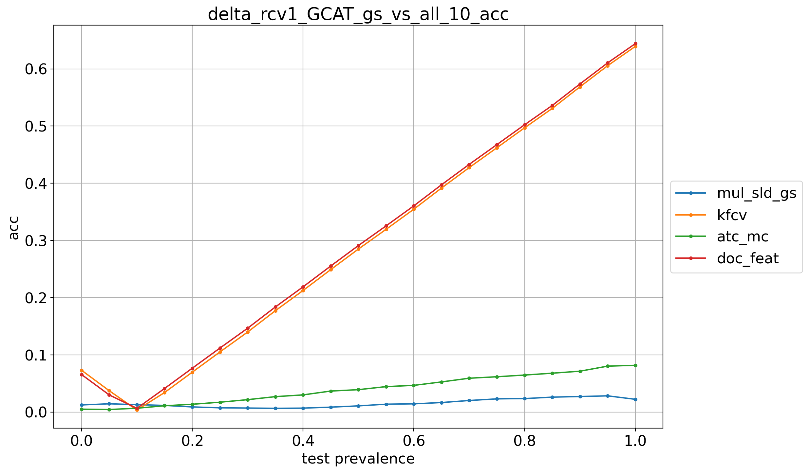

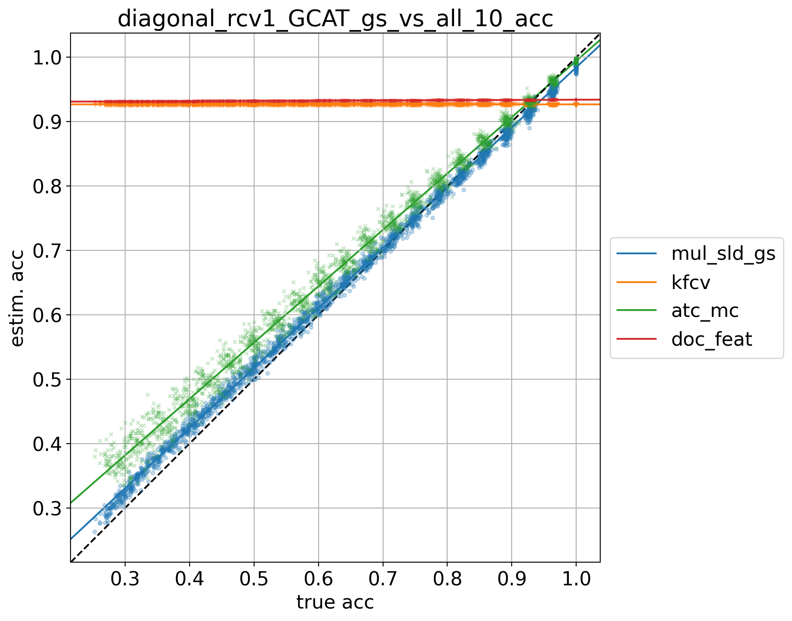
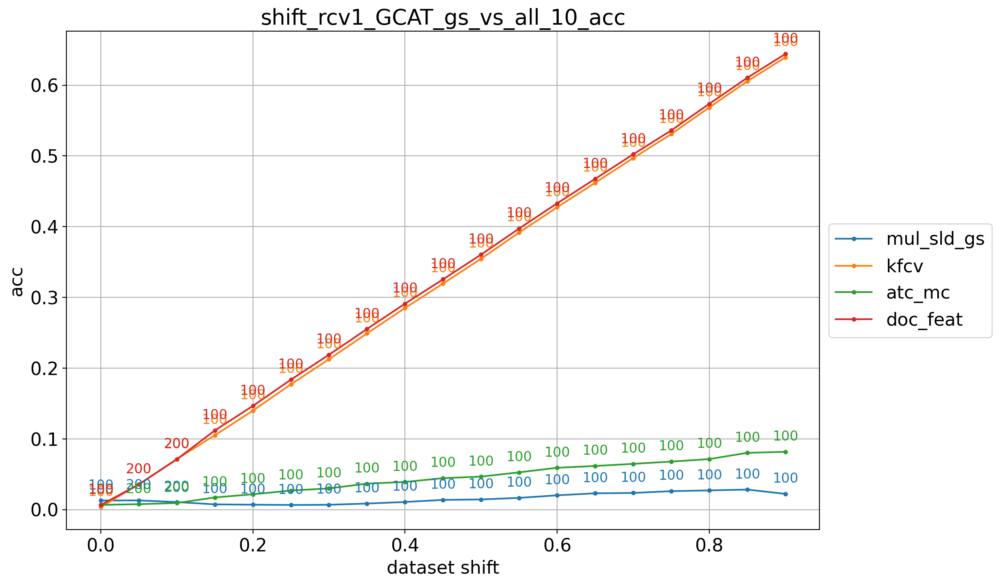

## 20% positives
> train: [0.79984504 0.20015496]  
> validation: [0.80010331 0.19989669]  
> bin_sld: 431.443s  
> mul_sld: 188.845s  
> bin_sld_gs: 1093.467s  
> mul_sld_gs: 642.106s  
> bin_sld_gsq: 522.073s  
> bin_pacc: 422.062s  
> mul_pacc: 154.976s  
> binmc_pacc: 417.137s  
> mulmc_pacc: 140.524s  
> binne_pacc: 421.581s  
> mulne_pacc: 157.883s  
> bin_pacc_gs: 723.261s  
> mul_pacc_gs: 258.223s  
> bin_cc: 402.467s  
> mul_cc: 144.805s  
> kfcv: 108.333s  
> ref: 118.158s  
> atc_mc: 118.502s  
> atc_ne: 96.965s  
> doc_feat: 91.141s  
> tot: 1096.718s  

<table border="1" class="dataframe">
  <thead>
    <tr style="text-align: right;">
      <th></th>
      <th>bin_sld_gs</th>
      <th>mul_sld_gs</th>
      <th>bin_pacc_gs</th>
      <th>mul_pacc_gs</th>
      <th>kfcv</th>
      <th>atc_mc</th>
      <th>doc_feat</th>
    </tr>
  </thead>
  <tbody>
    <tr>
      <th>0.0</th>
      <td>0.0100</td>
      <td>0.0125</td>
      <td>0.0140</td>
      <td>0.0076</td>
      <td>0.0669</td>
      <td>0.0086</td>
      <td>0.0585</td>
    </tr>
    <tr>
      <th>0.05</th>
      <td>0.0098</td>
      <td>0.0081</td>
      <td>0.0124</td>
      <td>0.0087</td>
      <td>0.0501</td>
      <td>0.0076</td>
      <td>0.0418</td>
    </tr>
    <tr>
      <th>0.1</th>
      <td>0.0089</td>
      <td>0.0065</td>
      <td>0.0109</td>
      <td>0.0098</td>
      <td>0.0345</td>
      <td>0.0084</td>
      <td>0.0263</td>
    </tr>
    <tr>
      <th>0.15</th>
      <td>0.0091</td>
      <td>0.0057</td>
      <td>0.0105</td>
      <td>0.0095</td>
      <td>0.0175</td>
      <td>0.0087</td>
      <td>0.0096</td>
    </tr>
    <tr>
      <th>0.2</th>
      <td>0.0090</td>
      <td>0.0074</td>
      <td>0.0096</td>
      <td>0.0097</td>
      <td>0.0057</td>
      <td>0.0079</td>
      <td>0.0065</td>
    </tr>
    <tr>
      <th>0.25</th>
      <td>0.0092</td>
      <td>0.0089</td>
      <td>0.0093</td>
      <td>0.0108</td>
      <td>0.0138</td>
      <td>0.0084</td>
      <td>0.0214</td>
    </tr>
    <tr>
      <th>0.3</th>
      <td>0.0092</td>
      <td>0.0114</td>
      <td>0.0086</td>
      <td>0.0140</td>
      <td>0.0289</td>
      <td>0.0089</td>
      <td>0.0366</td>
    </tr>
    <tr>
      <th>0.35</th>
      <td>0.0073</td>
      <td>0.0154</td>
      <td>0.0066</td>
      <td>0.0171</td>
      <td>0.0457</td>
      <td>0.0090</td>
      <td>0.0533</td>
    </tr>
    <tr>
      <th>0.4</th>
      <td>0.0078</td>
      <td>0.0166</td>
      <td>0.0066</td>
      <td>0.0194</td>
      <td>0.0621</td>
      <td>0.0091</td>
      <td>0.0697</td>
    </tr>
    <tr>
      <th>0.45</th>
      <td>0.0080</td>
      <td>0.0195</td>
      <td>0.0066</td>
      <td>0.0238</td>
      <td>0.0775</td>
      <td>0.0111</td>
      <td>0.0849</td>
    </tr>
    <tr>
      <th>0.5</th>
      <td>0.0082</td>
      <td>0.0206</td>
      <td>0.0063</td>
      <td>0.0274</td>
      <td>0.0923</td>
      <td>0.0107</td>
      <td>0.0996</td>
    </tr>
    <tr>
      <th>0.55</th>
      <td>0.0070</td>
      <td>0.0245</td>
      <td>0.0064</td>
      <td>0.0351</td>
      <td>0.1104</td>
      <td>0.0124</td>
      <td>0.1176</td>
    </tr>
    <tr>
      <th>0.6</th>
      <td>0.0072</td>
      <td>0.0261</td>
      <td>0.0056</td>
      <td>0.0423</td>
      <td>0.1273</td>
      <td>0.0101</td>
      <td>0.1344</td>
    </tr>
    <tr>
      <th>0.65</th>
      <td>0.0080</td>
      <td>0.0270</td>
      <td>0.0061</td>
      <td>0.0477</td>
      <td>0.1414</td>
      <td>0.0126</td>
      <td>0.1484</td>
    </tr>
    <tr>
      <th>0.7</th>
      <td>0.0074</td>
      <td>0.0284</td>
      <td>0.0070</td>
      <td>0.0518</td>
      <td>0.1605</td>
      <td>0.0127</td>
      <td>0.1673</td>
    </tr>
    <tr>
      <th>0.75</th>
      <td>0.0073</td>
      <td>0.0293</td>
      <td>0.0081</td>
      <td>0.0581</td>
      <td>0.1737</td>
      <td>0.0129</td>
      <td>0.1804</td>
    </tr>
    <tr>
      <th>0.8</th>
      <td>0.0072</td>
      <td>0.0292</td>
      <td>0.0086</td>
      <td>0.0633</td>
      <td>0.1885</td>
      <td>0.0139</td>
      <td>0.1951</td>
    </tr>
    <tr>
      <th>0.85</th>
      <td>0.0090</td>
      <td>0.0281</td>
      <td>0.0100</td>
      <td>0.0671</td>
      <td>0.2063</td>
      <td>0.0140</td>
      <td>0.2129</td>
    </tr>
    <tr>
      <th>0.9</th>
      <td>0.0091</td>
      <td>0.0266</td>
      <td>0.0113</td>
      <td>0.0666</td>
      <td>0.2204</td>
      <td>0.0149</td>
      <td>0.2268</td>
    </tr>
    <tr>
      <th>0.95</th>
      <td>0.0113</td>
      <td>0.0237</td>
      <td>0.0114</td>
      <td>0.0678</td>
      <td>0.2392</td>
      <td>0.0166</td>
      <td>0.2455</td>
    </tr>
    <tr>
      <th>1.0</th>
      <td>0.0082</td>
      <td>0.0120</td>
      <td>0.0121</td>
      <td>0.0678</td>
      <td>0.2548</td>
      <td>0.0157</td>
      <td>0.2610</td>
    </tr>
    <tr>
      <th>avg</th>
      <td>0.0085</td>
      <td>0.0185</td>
      <td>0.0089</td>
      <td>0.0345</td>
      <td>0.1103</td>
      <td>0.0111</td>
      <td>0.1142</td>
    </tr>
  </tbody>
</table>

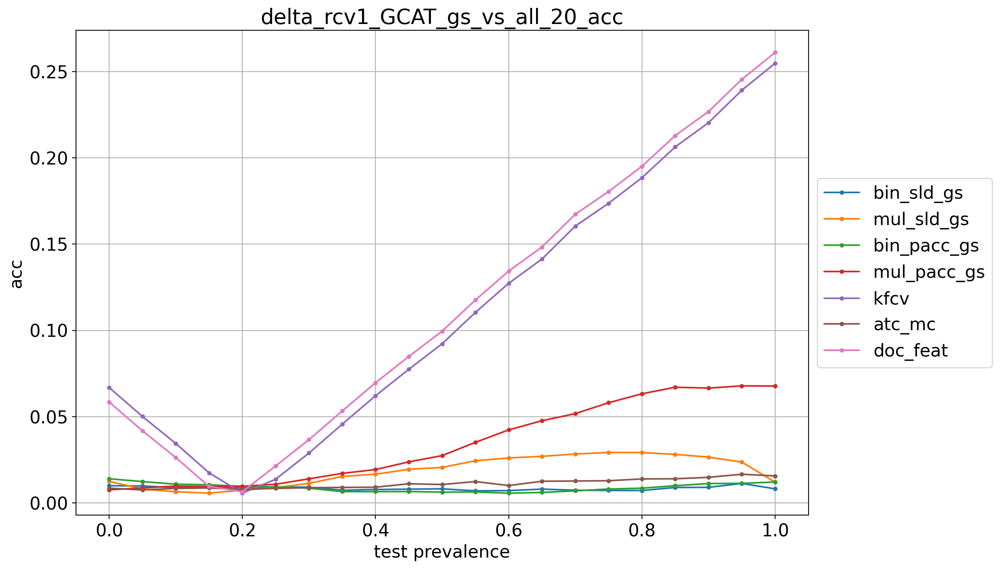
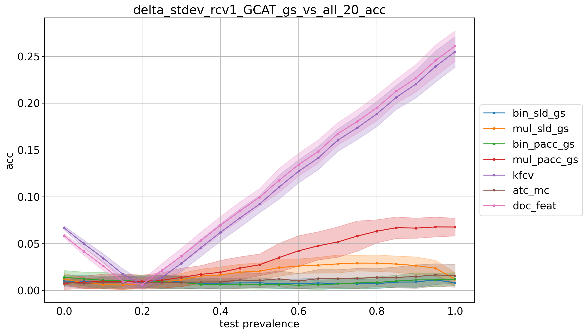
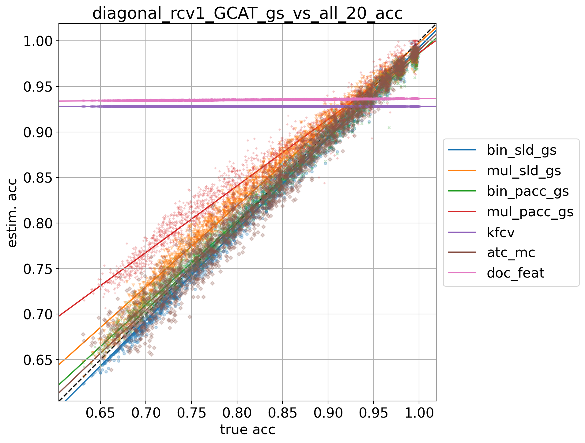
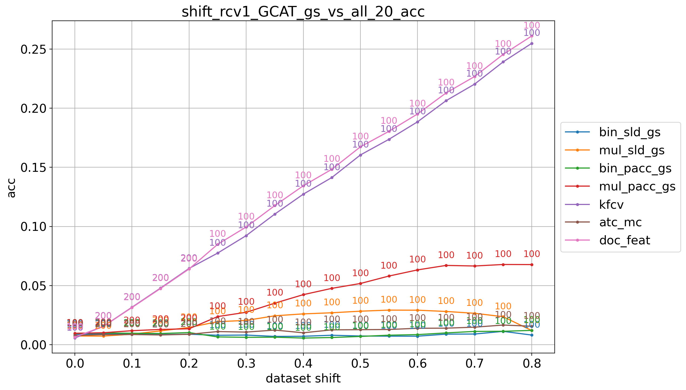

## 30% positives
> train: [0.69989669 0.30010331]  
> validation: [0.70015496 0.29984504]  
> bin_sld: 440.439s  
> mul_sld: 181.173s  
> bin_sld_gs: 1117.061s  
> mul_sld_gs: 644.511s  
> bin_sld_gsq: 529.624s  
> bin_pacc: 425.791s  
> mul_pacc: 174.577s  
> binmc_pacc: 425.760s  
> mulmc_pacc: 147.208s  
> binne_pacc: 424.010s  
> mulne_pacc: 137.064s  
> bin_pacc_gs: 729.394s  
> mul_pacc_gs: 256.419s  
> bin_cc: 407.241s  
> mul_cc: 148.864s  
> kfcv: 129.860s  
> ref: 89.336s  
> atc_mc: 117.685s  
> atc_ne: 123.998s  
> doc_feat: 91.912s  
> tot: 1120.968s  

<table border="1" class="dataframe">
  <thead>
    <tr style="text-align: right;">
      <th></th>
      <th>bin_sld_gs</th>
      <th>mul_sld_gs</th>
      <th>bin_pacc_gs</th>
      <th>mul_pacc_gs</th>
      <th>kfcv</th>
      <th>atc_mc</th>
      <th>doc_feat</th>
    </tr>
  </thead>
  <tbody>
    <tr>
      <th>0.0</th>
      <td>0.0082</td>
      <td>0.0095</td>
      <td>0.0049</td>
      <td>0.0060</td>
      <td>0.0453</td>
      <td>0.0079</td>
      <td>0.0395</td>
    </tr>
    <tr>
      <th>0.05</th>
      <td>0.0079</td>
      <td>0.0065</td>
      <td>0.0087</td>
      <td>0.0091</td>
      <td>0.0363</td>
      <td>0.0073</td>
      <td>0.0305</td>
    </tr>
    <tr>
      <th>0.1</th>
      <td>0.0079</td>
      <td>0.0071</td>
      <td>0.0097</td>
      <td>0.0105</td>
      <td>0.0287</td>
      <td>0.0060</td>
      <td>0.0230</td>
    </tr>
    <tr>
      <th>0.15</th>
      <td>0.0091</td>
      <td>0.0064</td>
      <td>0.0096</td>
      <td>0.0089</td>
      <td>0.0200</td>
      <td>0.0071</td>
      <td>0.0145</td>
    </tr>
    <tr>
      <th>0.2</th>
      <td>0.0090</td>
      <td>0.0079</td>
      <td>0.0101</td>
      <td>0.0090</td>
      <td>0.0135</td>
      <td>0.0072</td>
      <td>0.0081</td>
    </tr>
    <tr>
      <th>0.25</th>
      <td>0.0098</td>
      <td>0.0091</td>
      <td>0.0112</td>
      <td>0.0102</td>
      <td>0.0070</td>
      <td>0.0069</td>
      <td>0.0055</td>
    </tr>
    <tr>
      <th>0.3</th>
      <td>0.0083</td>
      <td>0.0081</td>
      <td>0.0106</td>
      <td>0.0095</td>
      <td>0.0066</td>
      <td>0.0079</td>
      <td>0.0091</td>
    </tr>
    <tr>
      <th>0.35</th>
      <td>0.0085</td>
      <td>0.0089</td>
      <td>0.0093</td>
      <td>0.0098</td>
      <td>0.0113</td>
      <td>0.0073</td>
      <td>0.0160</td>
    </tr>
    <tr>
      <th>0.4</th>
      <td>0.0090</td>
      <td>0.0097</td>
      <td>0.0111</td>
      <td>0.0116</td>
      <td>0.0192</td>
      <td>0.0074</td>
      <td>0.0244</td>
    </tr>
    <tr>
      <th>0.45</th>
      <td>0.0093</td>
      <td>0.0106</td>
      <td>0.0109</td>
      <td>0.0120</td>
      <td>0.0263</td>
      <td>0.0076</td>
      <td>0.0315</td>
    </tr>
    <tr>
      <th>0.5</th>
      <td>0.0090</td>
      <td>0.0104</td>
      <td>0.0099</td>
      <td>0.0126</td>
      <td>0.0355</td>
      <td>0.0075</td>
      <td>0.0406</td>
    </tr>
    <tr>
      <th>0.55</th>
      <td>0.0096</td>
      <td>0.0118</td>
      <td>0.0104</td>
      <td>0.0138</td>
      <td>0.0443</td>
      <td>0.0102</td>
      <td>0.0494</td>
    </tr>
    <tr>
      <th>0.6</th>
      <td>0.0087</td>
      <td>0.0100</td>
      <td>0.0103</td>
      <td>0.0168</td>
      <td>0.0504</td>
      <td>0.0084</td>
      <td>0.0554</td>
    </tr>
    <tr>
      <th>0.65</th>
      <td>0.0084</td>
      <td>0.0101</td>
      <td>0.0099</td>
      <td>0.0187</td>
      <td>0.0587</td>
      <td>0.0091</td>
      <td>0.0636</td>
    </tr>
    <tr>
      <th>0.7</th>
      <td>0.0080</td>
      <td>0.0106</td>
      <td>0.0094</td>
      <td>0.0195</td>
      <td>0.0692</td>
      <td>0.0107</td>
      <td>0.0740</td>
    </tr>
    <tr>
      <th>0.75</th>
      <td>0.0090</td>
      <td>0.0094</td>
      <td>0.0093</td>
      <td>0.0203</td>
      <td>0.0760</td>
      <td>0.0134</td>
      <td>0.0808</td>
    </tr>
    <tr>
      <th>0.8</th>
      <td>0.0086</td>
      <td>0.0084</td>
      <td>0.0094</td>
      <td>0.0225</td>
      <td>0.0823</td>
      <td>0.0119</td>
      <td>0.0870</td>
    </tr>
    <tr>
      <th>0.85</th>
      <td>0.0078</td>
      <td>0.0069</td>
      <td>0.0080</td>
      <td>0.0251</td>
      <td>0.0935</td>
      <td>0.0132</td>
      <td>0.0981</td>
    </tr>
    <tr>
      <th>0.9</th>
      <td>0.0076</td>
      <td>0.0067</td>
      <td>0.0077</td>
      <td>0.0247</td>
      <td>0.0999</td>
      <td>0.0141</td>
      <td>0.1044</td>
    </tr>
    <tr>
      <th>0.95</th>
      <td>0.0078</td>
      <td>0.0061</td>
      <td>0.0097</td>
      <td>0.0295</td>
      <td>0.1071</td>
      <td>0.0129</td>
      <td>0.1116</td>
    </tr>
    <tr>
      <th>1.0</th>
      <td>0.0078</td>
      <td>0.0123</td>
      <td>0.0065</td>
      <td>0.0293</td>
      <td>0.1159</td>
      <td>0.0146</td>
      <td>0.1203</td>
    </tr>
    <tr>
      <th>avg</th>
      <td>0.0085</td>
      <td>0.0089</td>
      <td>0.0094</td>
      <td>0.0157</td>
      <td>0.0499</td>
      <td>0.0095</td>
      <td>0.0518</td>
    </tr>
  </tbody>
</table>

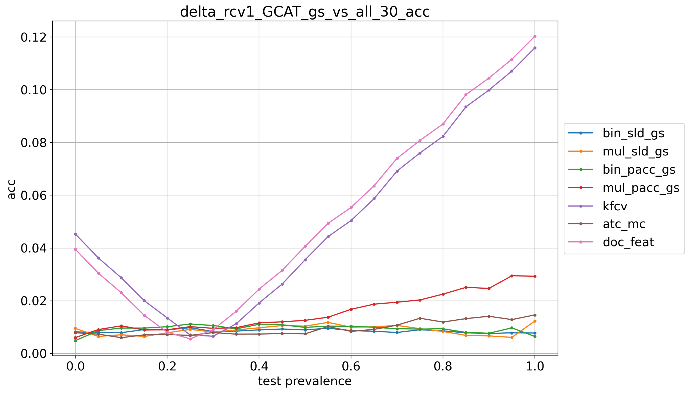
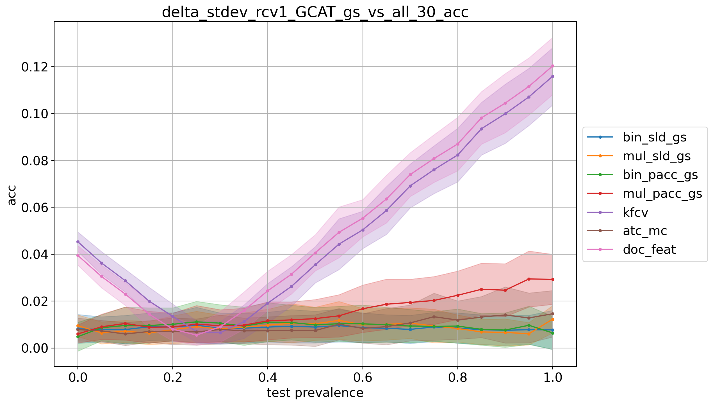

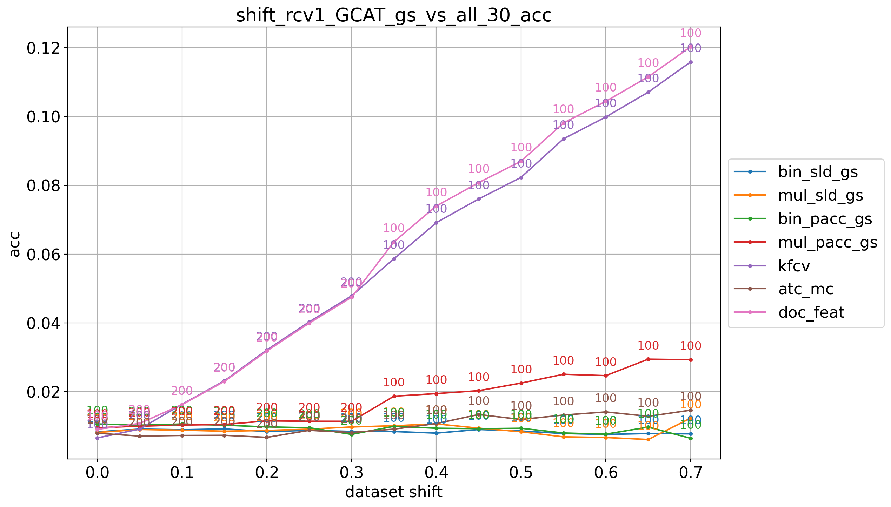

## 40% positives
> train: [0.59994835 0.40005165]  
> validation: [0.59994835 0.40005165]  
> bin_sld: 441.902s  
> mul_sld: 171.147s  
> bin_sld_gs: 1129.143s  
> mul_sld_gs: 661.698s  
> bin_sld_gsq: 534.997s  
> bin_pacc: 438.840s  
> mul_pacc: 172.945s  
> binmc_pacc: 434.527s  
> mulmc_pacc: 166.147s  
> binne_pacc: 431.135s  
> mulne_pacc: 144.562s  
> bin_pacc_gs: 735.193s  
> mul_pacc_gs: 266.608s  
> bin_cc: 412.883s  
> mul_cc: 159.067s  
> kfcv: 137.954s  
> ref: 132.249s  
> atc_mc: 137.719s  
> atc_ne: 134.107s  
> doc_feat: 79.638s  
> tot: 1133.285s  

<table border="1" class="dataframe">
  <thead>
    <tr style="text-align: right;">
      <th></th>
      <th>bin_sld_gs</th>
      <th>mul_sld_gs</th>
      <th>bin_pacc_gs</th>
      <th>mul_pacc_gs</th>
      <th>kfcv</th>
      <th>atc_mc</th>
      <th>doc_feat</th>
    </tr>
  </thead>
  <tbody>
    <tr>
      <th>0.0</th>
      <td>0.0077</td>
      <td>0.0085</td>
      <td>0.0077</td>
      <td>0.0064</td>
      <td>0.0272</td>
      <td>0.0059</td>
      <td>0.0205</td>
    </tr>
    <tr>
      <th>0.05</th>
      <td>0.0058</td>
      <td>0.0067</td>
      <td>0.0100</td>
      <td>0.0073</td>
      <td>0.0228</td>
      <td>0.0049</td>
      <td>0.0162</td>
    </tr>
    <tr>
      <th>0.1</th>
      <td>0.0063</td>
      <td>0.0061</td>
      <td>0.0111</td>
      <td>0.0086</td>
      <td>0.0205</td>
      <td>0.0053</td>
      <td>0.0139</td>
    </tr>
    <tr>
      <th>0.15</th>
      <td>0.0074</td>
      <td>0.0075</td>
      <td>0.0114</td>
      <td>0.0096</td>
      <td>0.0161</td>
      <td>0.0058</td>
      <td>0.0099</td>
    </tr>
    <tr>
      <th>0.2</th>
      <td>0.0076</td>
      <td>0.0078</td>
      <td>0.0101</td>
      <td>0.0115</td>
      <td>0.0151</td>
      <td>0.0062</td>
      <td>0.0091</td>
    </tr>
    <tr>
      <th>0.25</th>
      <td>0.0084</td>
      <td>0.0086</td>
      <td>0.0109</td>
      <td>0.0123</td>
      <td>0.0113</td>
      <td>0.0073</td>
      <td>0.0067</td>
    </tr>
    <tr>
      <th>0.3</th>
      <td>0.0084</td>
      <td>0.0088</td>
      <td>0.0109</td>
      <td>0.0134</td>
      <td>0.0097</td>
      <td>0.0071</td>
      <td>0.0061</td>
    </tr>
    <tr>
      <th>0.35</th>
      <td>0.0108</td>
      <td>0.0079</td>
      <td>0.0130</td>
      <td>0.0126</td>
      <td>0.0073</td>
      <td>0.0069</td>
      <td>0.0060</td>
    </tr>
    <tr>
      <th>0.4</th>
      <td>0.0097</td>
      <td>0.0083</td>
      <td>0.0116</td>
      <td>0.0162</td>
      <td>0.0064</td>
      <td>0.0069</td>
      <td>0.0074</td>
    </tr>
    <tr>
      <th>0.45</th>
      <td>0.0116</td>
      <td>0.0085</td>
      <td>0.0141</td>
      <td>0.0159</td>
      <td>0.0055</td>
      <td>0.0065</td>
      <td>0.0086</td>
    </tr>
    <tr>
      <th>0.5</th>
      <td>0.0126</td>
      <td>0.0095</td>
      <td>0.0144</td>
      <td>0.0163</td>
      <td>0.0067</td>
      <td>0.0074</td>
      <td>0.0121</td>
    </tr>
    <tr>
      <th>0.55</th>
      <td>0.0123</td>
      <td>0.0099</td>
      <td>0.0149</td>
      <td>0.0192</td>
      <td>0.0108</td>
      <td>0.0085</td>
      <td>0.0158</td>
    </tr>
    <tr>
      <th>0.6</th>
      <td>0.0114</td>
      <td>0.0089</td>
      <td>0.0138</td>
      <td>0.0186</td>
      <td>0.0119</td>
      <td>0.0083</td>
      <td>0.0181</td>
    </tr>
    <tr>
      <th>0.65</th>
      <td>0.0120</td>
      <td>0.0083</td>
      <td>0.0143</td>
      <td>0.0198</td>
      <td>0.0159</td>
      <td>0.0081</td>
      <td>0.0220</td>
    </tr>
    <tr>
      <th>0.7</th>
      <td>0.0117</td>
      <td>0.0085</td>
      <td>0.0148</td>
      <td>0.0242</td>
      <td>0.0195</td>
      <td>0.0090</td>
      <td>0.0258</td>
    </tr>
    <tr>
      <th>0.75</th>
      <td>0.0123</td>
      <td>0.0087</td>
      <td>0.0155</td>
      <td>0.0233</td>
      <td>0.0235</td>
      <td>0.0104</td>
      <td>0.0297</td>
    </tr>
    <tr>
      <th>0.8</th>
      <td>0.0115</td>
      <td>0.0082</td>
      <td>0.0157</td>
      <td>0.0264</td>
      <td>0.0253</td>
      <td>0.0104</td>
      <td>0.0315</td>
    </tr>
    <tr>
      <th>0.85</th>
      <td>0.0104</td>
      <td>0.0088</td>
      <td>0.0149</td>
      <td>0.0309</td>
      <td>0.0289</td>
      <td>0.0107</td>
      <td>0.0350</td>
    </tr>
    <tr>
      <th>0.9</th>
      <td>0.0091</td>
      <td>0.0080</td>
      <td>0.0155</td>
      <td>0.0327</td>
      <td>0.0322</td>
      <td>0.0101</td>
      <td>0.0383</td>
    </tr>
    <tr>
      <th>0.95</th>
      <td>0.0081</td>
      <td>0.0077</td>
      <td>0.0158</td>
      <td>0.0414</td>
      <td>0.0349</td>
      <td>0.0117</td>
      <td>0.0410</td>
    </tr>
    <tr>
      <th>1.0</th>
      <td>0.0061</td>
      <td>0.0127</td>
      <td>0.0146</td>
      <td>0.0448</td>
      <td>0.0384</td>
      <td>0.0123</td>
      <td>0.0444</td>
    </tr>
    <tr>
      <th>avg</th>
      <td>0.0096</td>
      <td>0.0085</td>
      <td>0.0131</td>
      <td>0.0196</td>
      <td>0.0186</td>
      <td>0.0081</td>
      <td>0.0199</td>
    </tr>
  </tbody>
</table>

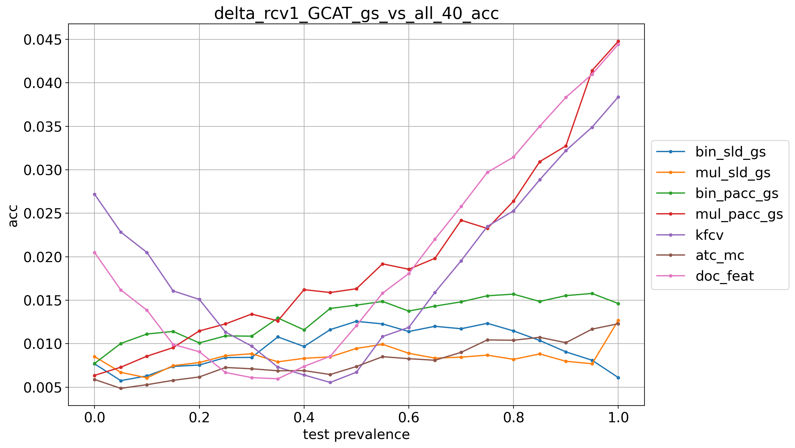
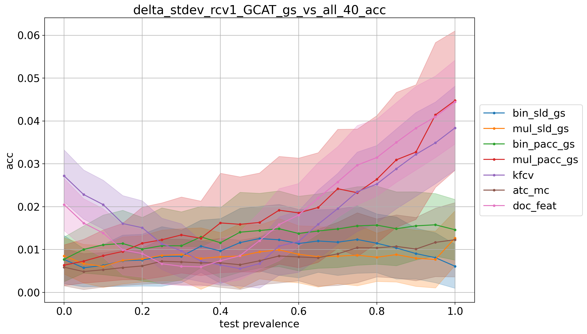
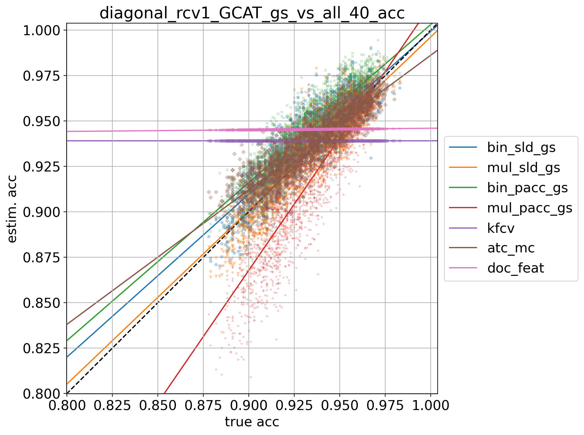
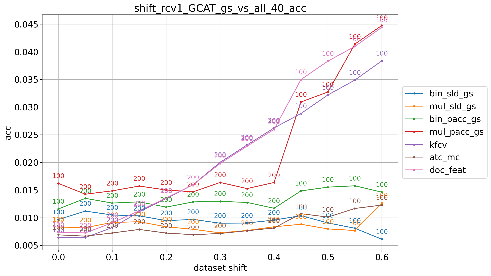

## 50% positives
> train: [0.5 0.5]  
> validation: [0.5 0.5]  
> bin_sld: 432.840s  
> mul_sld: 159.373s  
> bin_sld_gs: 1148.243s  
> mul_sld_gs: 657.176s  
> bin_sld_gsq: 539.408s  
> bin_pacc: 430.121s  
> mul_pacc: 173.440s  
> binmc_pacc: 433.871s  
> mulmc_pacc: 158.794s  
> binne_pacc: 435.732s  
> mulne_pacc: 158.199s  
> bin_pacc_gs: 728.918s  
> mul_pacc_gs: 263.162s  
> bin_cc: 405.769s  
> mul_cc: 134.145s  
> kfcv: 125.438s  
> ref: 127.690s  
> atc_mc: 108.387s  
> atc_ne: 115.014s  
> doc_feat: 90.803s  
> tot: 1152.446s  

<table border="1" class="dataframe">
  <thead>
    <tr style="text-align: right;">
      <th></th>
      <th>bin_sld_gs</th>
      <th>mul_sld_gs</th>
      <th>bin_pacc_gs</th>
      <th>mul_pacc_gs</th>
      <th>kfcv</th>
      <th>atc_mc</th>
      <th>doc_feat</th>
    </tr>
  </thead>
  <tbody>
    <tr>
      <th>0.0</th>
      <td>0.0043</td>
      <td>0.0098</td>
      <td>0.0089</td>
      <td>0.0084</td>
      <td>0.0061</td>
      <td>0.0081</td>
      <td>0.0055</td>
    </tr>
    <tr>
      <th>0.05</th>
      <td>0.0088</td>
      <td>0.0066</td>
      <td>0.0108</td>
      <td>0.0105</td>
      <td>0.0058</td>
      <td>0.0102</td>
      <td>0.0062</td>
    </tr>
    <tr>
      <th>0.1</th>
      <td>0.0089</td>
      <td>0.0088</td>
      <td>0.0116</td>
      <td>0.0117</td>
      <td>0.0068</td>
      <td>0.0093</td>
      <td>0.0060</td>
    </tr>
    <tr>
      <th>0.15</th>
      <td>0.0109</td>
      <td>0.0095</td>
      <td>0.0131</td>
      <td>0.0117</td>
      <td>0.0056</td>
      <td>0.0100</td>
      <td>0.0068</td>
    </tr>
    <tr>
      <th>0.2</th>
      <td>0.0103</td>
      <td>0.0087</td>
      <td>0.0122</td>
      <td>0.0111</td>
      <td>0.0062</td>
      <td>0.0085</td>
      <td>0.0066</td>
    </tr>
    <tr>
      <th>0.25</th>
      <td>0.0110</td>
      <td>0.0106</td>
      <td>0.0134</td>
      <td>0.0126</td>
      <td>0.0061</td>
      <td>0.0091</td>
      <td>0.0063</td>
    </tr>
    <tr>
      <th>0.3</th>
      <td>0.0101</td>
      <td>0.0087</td>
      <td>0.0126</td>
      <td>0.0111</td>
      <td>0.0062</td>
      <td>0.0078</td>
      <td>0.0068</td>
    </tr>
    <tr>
      <th>0.35</th>
      <td>0.0110</td>
      <td>0.0110</td>
      <td>0.0129</td>
      <td>0.0135</td>
      <td>0.0067</td>
      <td>0.0096</td>
      <td>0.0076</td>
    </tr>
    <tr>
      <th>0.4</th>
      <td>0.0098</td>
      <td>0.0113</td>
      <td>0.0115</td>
      <td>0.0123</td>
      <td>0.0066</td>
      <td>0.0092</td>
      <td>0.0082</td>
    </tr>
    <tr>
      <th>0.45</th>
      <td>0.0103</td>
      <td>0.0102</td>
      <td>0.0126</td>
      <td>0.0130</td>
      <td>0.0057</td>
      <td>0.0079</td>
      <td>0.0067</td>
    </tr>
    <tr>
      <th>0.5</th>
      <td>0.0101</td>
      <td>0.0105</td>
      <td>0.0126</td>
      <td>0.0117</td>
      <td>0.0062</td>
      <td>0.0097</td>
      <td>0.0077</td>
    </tr>
    <tr>
      <th>0.55</th>
      <td>0.0097</td>
      <td>0.0110</td>
      <td>0.0130</td>
      <td>0.0124</td>
      <td>0.0066</td>
      <td>0.0096</td>
      <td>0.0088</td>
    </tr>
    <tr>
      <th>0.6</th>
      <td>0.0085</td>
      <td>0.0101</td>
      <td>0.0117</td>
      <td>0.0117</td>
      <td>0.0055</td>
      <td>0.0098</td>
      <td>0.0081</td>
    </tr>
    <tr>
      <th>0.65</th>
      <td>0.0085</td>
      <td>0.0096</td>
      <td>0.0120</td>
      <td>0.0111</td>
      <td>0.0062</td>
      <td>0.0097</td>
      <td>0.0088</td>
    </tr>
    <tr>
      <th>0.7</th>
      <td>0.0078</td>
      <td>0.0086</td>
      <td>0.0100</td>
      <td>0.0123</td>
      <td>0.0063</td>
      <td>0.0091</td>
      <td>0.0094</td>
    </tr>
    <tr>
      <th>0.75</th>
      <td>0.0075</td>
      <td>0.0090</td>
      <td>0.0105</td>
      <td>0.0126</td>
      <td>0.0068</td>
      <td>0.0102</td>
      <td>0.0100</td>
    </tr>
    <tr>
      <th>0.8</th>
      <td>0.0078</td>
      <td>0.0086</td>
      <td>0.0091</td>
      <td>0.0130</td>
      <td>0.0068</td>
      <td>0.0107</td>
      <td>0.0106</td>
    </tr>
    <tr>
      <th>0.85</th>
      <td>0.0074</td>
      <td>0.0094</td>
      <td>0.0096</td>
      <td>0.0174</td>
      <td>0.0065</td>
      <td>0.0094</td>
      <td>0.0099</td>
    </tr>
    <tr>
      <th>0.9</th>
      <td>0.0089</td>
      <td>0.0098</td>
      <td>0.0091</td>
      <td>0.0182</td>
      <td>0.0060</td>
      <td>0.0096</td>
      <td>0.0100</td>
    </tr>
    <tr>
      <th>0.95</th>
      <td>0.0094</td>
      <td>0.0108</td>
      <td>0.0086</td>
      <td>0.0191</td>
      <td>0.0068</td>
      <td>0.0108</td>
      <td>0.0107</td>
    </tr>
    <tr>
      <th>1.0</th>
      <td>0.0184</td>
      <td>0.0228</td>
      <td>0.0059</td>
      <td>0.0232</td>
      <td>0.0068</td>
      <td>0.0103</td>
      <td>0.0109</td>
    </tr>
    <tr>
      <th>avg</th>
      <td>0.0095</td>
      <td>0.0103</td>
      <td>0.0110</td>
      <td>0.0133</td>
      <td>0.0063</td>
      <td>0.0095</td>
      <td>0.0082</td>
    </tr>
  </tbody>
</table>

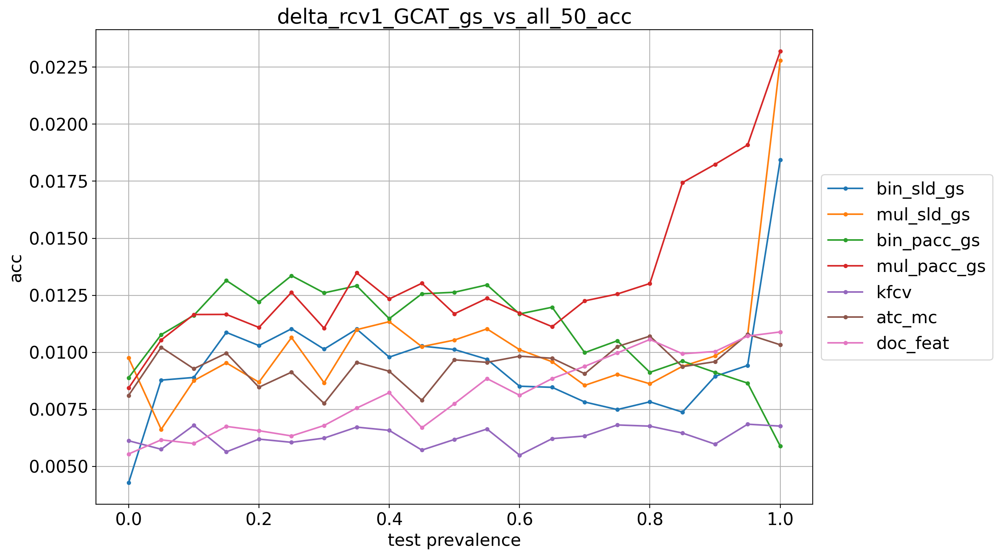
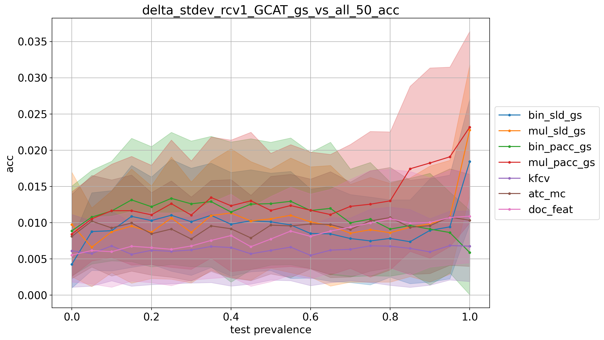
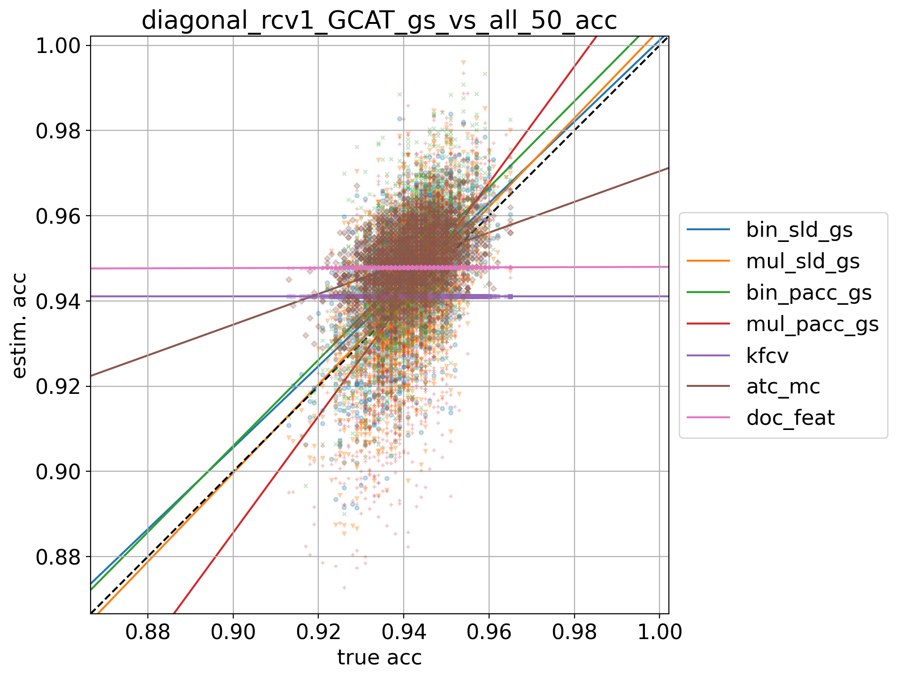
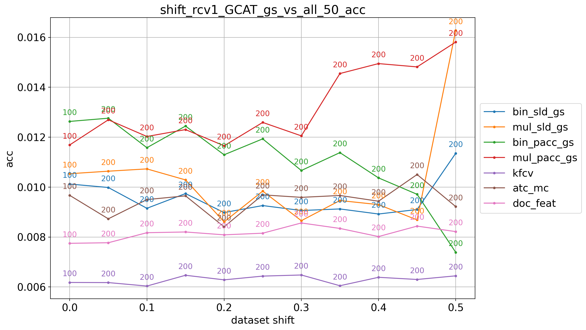

## 60% positives
> train: [0.40005165 0.59994835]  
> validation: [0.40005165 0.59994835]  
> bin_sld: 423.693s  
> mul_sld: 164.785s  
> bin_sld_gs: 1105.830s  
> mul_sld_gs: 648.000s  
> bin_sld_gsq: 523.679s  
> bin_pacc: 415.735s  
> mul_pacc: 142.337s  
> binmc_pacc: 422.073s  
> mulmc_pacc: 162.522s  
> binne_pacc: 411.703s  
> mulne_pacc: 159.753s  
> bin_pacc_gs: 722.307s  
> mul_pacc_gs: 263.296s  
> bin_cc: 394.807s  
> mul_cc: 127.886s  
> kfcv: 118.430s  
> ref: 114.366s  
> atc_mc: 111.695s  
> atc_ne: 96.170s  
> doc_feat: 92.012s  
> tot: 1110.535s  

<table border="1" class="dataframe">
  <thead>
    <tr style="text-align: right;">
      <th></th>
      <th>bin_sld_gs</th>
      <th>mul_sld_gs</th>
      <th>bin_pacc_gs</th>
      <th>mul_pacc_gs</th>
      <th>kfcv</th>
      <th>atc_mc</th>
      <th>doc_feat</th>
    </tr>
  </thead>
  <tbody>
    <tr>
      <th>0.0</th>
      <td>0.0048</td>
      <td>0.0061</td>
      <td>0.0136</td>
      <td>0.0219</td>
      <td>0.0419</td>
      <td>0.0170</td>
      <td>0.0464</td>
    </tr>
    <tr>
      <th>0.05</th>
      <td>0.0117</td>
      <td>0.0066</td>
      <td>0.0163</td>
      <td>0.0225</td>
      <td>0.0377</td>
      <td>0.0192</td>
      <td>0.0423</td>
    </tr>
    <tr>
      <th>0.1</th>
      <td>0.0130</td>
      <td>0.0078</td>
      <td>0.0143</td>
      <td>0.0206</td>
      <td>0.0337</td>
      <td>0.0147</td>
      <td>0.0383</td>
    </tr>
    <tr>
      <th>0.15</th>
      <td>0.0147</td>
      <td>0.0097</td>
      <td>0.0172</td>
      <td>0.0217</td>
      <td>0.0321</td>
      <td>0.0173</td>
      <td>0.0367</td>
    </tr>
    <tr>
      <th>0.2</th>
      <td>0.0140</td>
      <td>0.0095</td>
      <td>0.0141</td>
      <td>0.0190</td>
      <td>0.0297</td>
      <td>0.0141</td>
      <td>0.0343</td>
    </tr>
    <tr>
      <th>0.25</th>
      <td>0.0151</td>
      <td>0.0106</td>
      <td>0.0151</td>
      <td>0.0188</td>
      <td>0.0270</td>
      <td>0.0149</td>
      <td>0.0317</td>
    </tr>
    <tr>
      <th>0.3</th>
      <td>0.0141</td>
      <td>0.0100</td>
      <td>0.0139</td>
      <td>0.0170</td>
      <td>0.0234</td>
      <td>0.0132</td>
      <td>0.0281</td>
    </tr>
    <tr>
      <th>0.35</th>
      <td>0.0149</td>
      <td>0.0108</td>
      <td>0.0123</td>
      <td>0.0169</td>
      <td>0.0196</td>
      <td>0.0123</td>
      <td>0.0242</td>
    </tr>
    <tr>
      <th>0.4</th>
      <td>0.0150</td>
      <td>0.0098</td>
      <td>0.0120</td>
      <td>0.0159</td>
      <td>0.0180</td>
      <td>0.0120</td>
      <td>0.0226</td>
    </tr>
    <tr>
      <th>0.45</th>
      <td>0.0143</td>
      <td>0.0099</td>
      <td>0.0117</td>
      <td>0.0152</td>
      <td>0.0133</td>
      <td>0.0105</td>
      <td>0.0180</td>
    </tr>
    <tr>
      <th>0.5</th>
      <td>0.0137</td>
      <td>0.0098</td>
      <td>0.0113</td>
      <td>0.0144</td>
      <td>0.0128</td>
      <td>0.0108</td>
      <td>0.0174</td>
    </tr>
    <tr>
      <th>0.55</th>
      <td>0.0134</td>
      <td>0.0102</td>
      <td>0.0115</td>
      <td>0.0127</td>
      <td>0.0097</td>
      <td>0.0102</td>
      <td>0.0139</td>
    </tr>
    <tr>
      <th>0.6</th>
      <td>0.0136</td>
      <td>0.0091</td>
      <td>0.0098</td>
      <td>0.0124</td>
      <td>0.0077</td>
      <td>0.0101</td>
      <td>0.0114</td>
    </tr>
    <tr>
      <th>0.65</th>
      <td>0.0122</td>
      <td>0.0085</td>
      <td>0.0094</td>
      <td>0.0110</td>
      <td>0.0063</td>
      <td>0.0088</td>
      <td>0.0087</td>
    </tr>
    <tr>
      <th>0.7</th>
      <td>0.0100</td>
      <td>0.0075</td>
      <td>0.0086</td>
      <td>0.0099</td>
      <td>0.0061</td>
      <td>0.0080</td>
      <td>0.0074</td>
    </tr>
    <tr>
      <th>0.75</th>
      <td>0.0090</td>
      <td>0.0073</td>
      <td>0.0084</td>
      <td>0.0100</td>
      <td>0.0063</td>
      <td>0.0078</td>
      <td>0.0061</td>
    </tr>
    <tr>
      <th>0.8</th>
      <td>0.0088</td>
      <td>0.0073</td>
      <td>0.0084</td>
      <td>0.0091</td>
      <td>0.0080</td>
      <td>0.0075</td>
      <td>0.0058</td>
    </tr>
    <tr>
      <th>0.85</th>
      <td>0.0077</td>
      <td>0.0074</td>
      <td>0.0082</td>
      <td>0.0092</td>
      <td>0.0094</td>
      <td>0.0067</td>
      <td>0.0061</td>
    </tr>
    <tr>
      <th>0.9</th>
      <td>0.0076</td>
      <td>0.0078</td>
      <td>0.0089</td>
      <td>0.0089</td>
      <td>0.0122</td>
      <td>0.0068</td>
      <td>0.0079</td>
    </tr>
    <tr>
      <th>0.95</th>
      <td>0.0076</td>
      <td>0.0077</td>
      <td>0.0091</td>
      <td>0.0092</td>
      <td>0.0148</td>
      <td>0.0051</td>
      <td>0.0098</td>
    </tr>
    <tr>
      <th>1.0</th>
      <td>0.0141</td>
      <td>0.0110</td>
      <td>0.0067</td>
      <td>0.0094</td>
      <td>0.0183</td>
      <td>0.0051</td>
      <td>0.0132</td>
    </tr>
    <tr>
      <th>avg</th>
      <td>0.0119</td>
      <td>0.0088</td>
      <td>0.0115</td>
      <td>0.0146</td>
      <td>0.0185</td>
      <td>0.0111</td>
      <td>0.0205</td>
    </tr>
  </tbody>
</table>

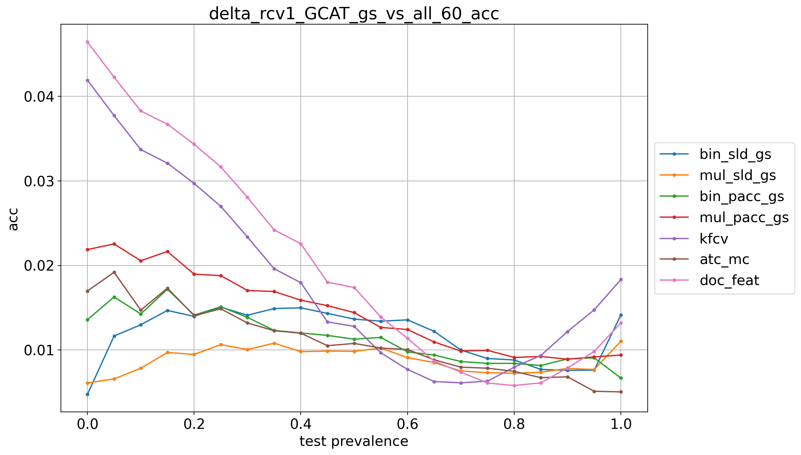
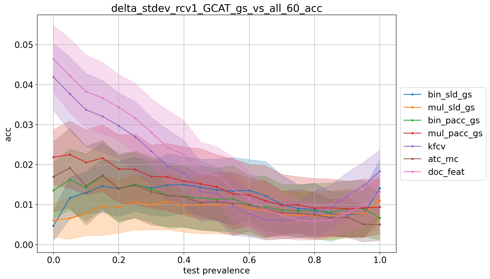
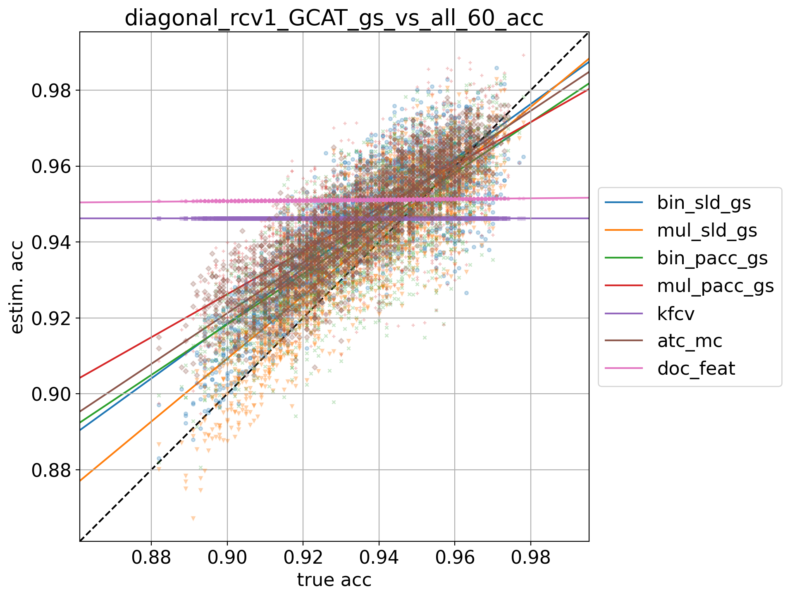
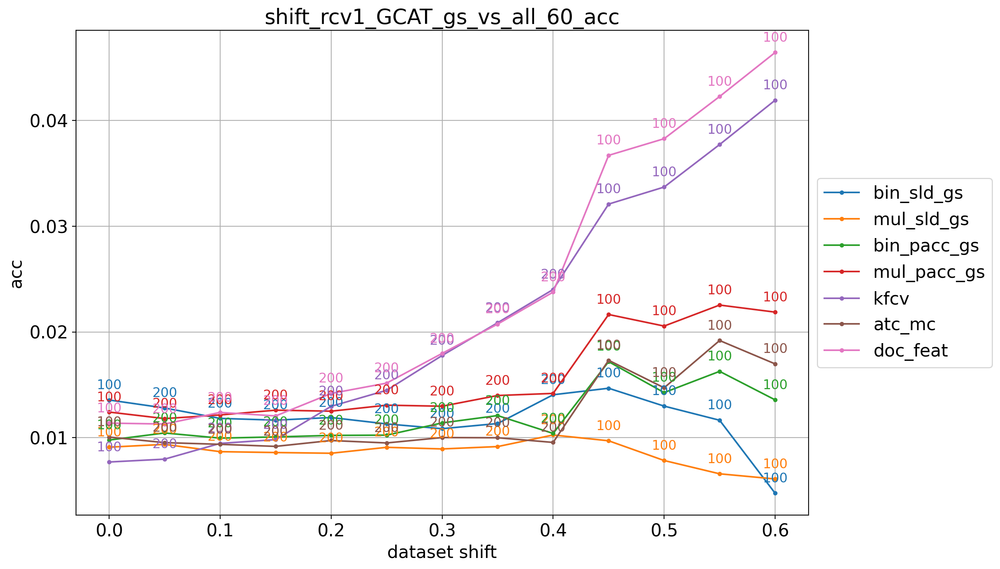

## 70% positives
> train: [0.29984504 0.70015496]  
> validation: [0.30010331 0.69989669]  
> bin_sld: 446.445s  
> mul_sld: 164.730s  
> bin_sld_gs: 1117.398s  
> mul_sld_gs: 661.430s  
> bin_sld_gsq: 528.925s  
> bin_pacc: 431.969s  
> mul_pacc: 151.272s  
> binmc_pacc: 430.157s  
> mulmc_pacc: 180.251s  
> binne_pacc: 438.442s  
> mulne_pacc: 173.700s  
> bin_pacc_gs: 733.397s  
> mul_pacc_gs: 262.705s  
> bin_cc: 407.885s  
> mul_cc: 153.959s  
> kfcv: 132.641s  
> ref: 136.486s  
> atc_mc: 135.594s  
> atc_ne: 129.372s  
> doc_feat: 95.722s  
> tot: 1121.806s  

<table border="1" class="dataframe">
  <thead>
    <tr style="text-align: right;">
      <th></th>
      <th>bin_sld_gs</th>
      <th>mul_sld_gs</th>
      <th>bin_pacc_gs</th>
      <th>mul_pacc_gs</th>
      <th>kfcv</th>
      <th>atc_mc</th>
      <th>doc_feat</th>
    </tr>
  </thead>
  <tbody>
    <tr>
      <th>0.0</th>
      <td>0.0017</td>
      <td>0.0052</td>
      <td>0.0024</td>
      <td>0.0121</td>
      <td>0.1101</td>
      <td>0.0135</td>
      <td>0.1052</td>
    </tr>
    <tr>
      <th>0.05</th>
      <td>0.0052</td>
      <td>0.0062</td>
      <td>0.0052</td>
      <td>0.0109</td>
      <td>0.0997</td>
      <td>0.0133</td>
      <td>0.0949</td>
    </tr>
    <tr>
      <th>0.1</th>
      <td>0.0052</td>
      <td>0.0066</td>
      <td>0.0055</td>
      <td>0.0089</td>
      <td>0.0927</td>
      <td>0.0119</td>
      <td>0.0879</td>
    </tr>
    <tr>
      <th>0.15</th>
      <td>0.0061</td>
      <td>0.0073</td>
      <td>0.0071</td>
      <td>0.0095</td>
      <td>0.0841</td>
      <td>0.0107</td>
      <td>0.0794</td>
    </tr>
    <tr>
      <th>0.2</th>
      <td>0.0051</td>
      <td>0.0093</td>
      <td>0.0069</td>
      <td>0.0087</td>
      <td>0.0782</td>
      <td>0.0090</td>
      <td>0.0736</td>
    </tr>
    <tr>
      <th>0.25</th>
      <td>0.0055</td>
      <td>0.0091</td>
      <td>0.0087</td>
      <td>0.0095</td>
      <td>0.0705</td>
      <td>0.0104</td>
      <td>0.0660</td>
    </tr>
    <tr>
      <th>0.3</th>
      <td>0.0059</td>
      <td>0.0080</td>
      <td>0.0074</td>
      <td>0.0085</td>
      <td>0.0612</td>
      <td>0.0103</td>
      <td>0.0567</td>
    </tr>
    <tr>
      <th>0.35</th>
      <td>0.0059</td>
      <td>0.0091</td>
      <td>0.0092</td>
      <td>0.0104</td>
      <td>0.0526</td>
      <td>0.0099</td>
      <td>0.0482</td>
    </tr>
    <tr>
      <th>0.4</th>
      <td>0.0052</td>
      <td>0.0085</td>
      <td>0.0094</td>
      <td>0.0100</td>
      <td>0.0461</td>
      <td>0.0093</td>
      <td>0.0418</td>
    </tr>
    <tr>
      <th>0.45</th>
      <td>0.0061</td>
      <td>0.0107</td>
      <td>0.0113</td>
      <td>0.0131</td>
      <td>0.0367</td>
      <td>0.0099</td>
      <td>0.0325</td>
    </tr>
    <tr>
      <th>0.5</th>
      <td>0.0066</td>
      <td>0.0102</td>
      <td>0.0112</td>
      <td>0.0129</td>
      <td>0.0322</td>
      <td>0.0088</td>
      <td>0.0280</td>
    </tr>
    <tr>
      <th>0.55</th>
      <td>0.0075</td>
      <td>0.0111</td>
      <td>0.0140</td>
      <td>0.0158</td>
      <td>0.0222</td>
      <td>0.0074</td>
      <td>0.0181</td>
    </tr>
    <tr>
      <th>0.6</th>
      <td>0.0071</td>
      <td>0.0110</td>
      <td>0.0137</td>
      <td>0.0167</td>
      <td>0.0144</td>
      <td>0.0076</td>
      <td>0.0107</td>
    </tr>
    <tr>
      <th>0.65</th>
      <td>0.0065</td>
      <td>0.0108</td>
      <td>0.0139</td>
      <td>0.0173</td>
      <td>0.0088</td>
      <td>0.0075</td>
      <td>0.0070</td>
    </tr>
    <tr>
      <th>0.7</th>
      <td>0.0074</td>
      <td>0.0118</td>
      <td>0.0171</td>
      <td>0.0205</td>
      <td>0.0060</td>
      <td>0.0072</td>
      <td>0.0071</td>
    </tr>
    <tr>
      <th>0.75</th>
      <td>0.0088</td>
      <td>0.0129</td>
      <td>0.0179</td>
      <td>0.0220</td>
      <td>0.0098</td>
      <td>0.0068</td>
      <td>0.0130</td>
    </tr>
    <tr>
      <th>0.8</th>
      <td>0.0100</td>
      <td>0.0130</td>
      <td>0.0199</td>
      <td>0.0233</td>
      <td>0.0181</td>
      <td>0.0088</td>
      <td>0.0218</td>
    </tr>
    <tr>
      <th>0.85</th>
      <td>0.0108</td>
      <td>0.0136</td>
      <td>0.0229</td>
      <td>0.0256</td>
      <td>0.0243</td>
      <td>0.0080</td>
      <td>0.0280</td>
    </tr>
    <tr>
      <th>0.9</th>
      <td>0.0123</td>
      <td>0.0141</td>
      <td>0.0235</td>
      <td>0.0260</td>
      <td>0.0330</td>
      <td>0.0081</td>
      <td>0.0366</td>
    </tr>
    <tr>
      <th>0.95</th>
      <td>0.0153</td>
      <td>0.0146</td>
      <td>0.0287</td>
      <td>0.0283</td>
      <td>0.0408</td>
      <td>0.0081</td>
      <td>0.0443</td>
    </tr>
    <tr>
      <th>1.0</th>
      <td>0.0167</td>
      <td>0.0169</td>
      <td>0.0339</td>
      <td>0.0313</td>
      <td>0.0490</td>
      <td>0.0097</td>
      <td>0.0525</td>
    </tr>
    <tr>
      <th>avg</th>
      <td>0.0077</td>
      <td>0.0105</td>
      <td>0.0138</td>
      <td>0.0163</td>
      <td>0.0472</td>
      <td>0.0093</td>
      <td>0.0454</td>
    </tr>
  </tbody>
</table>

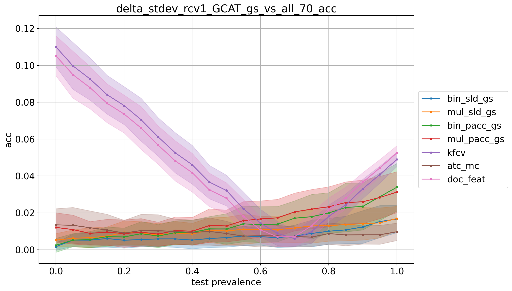
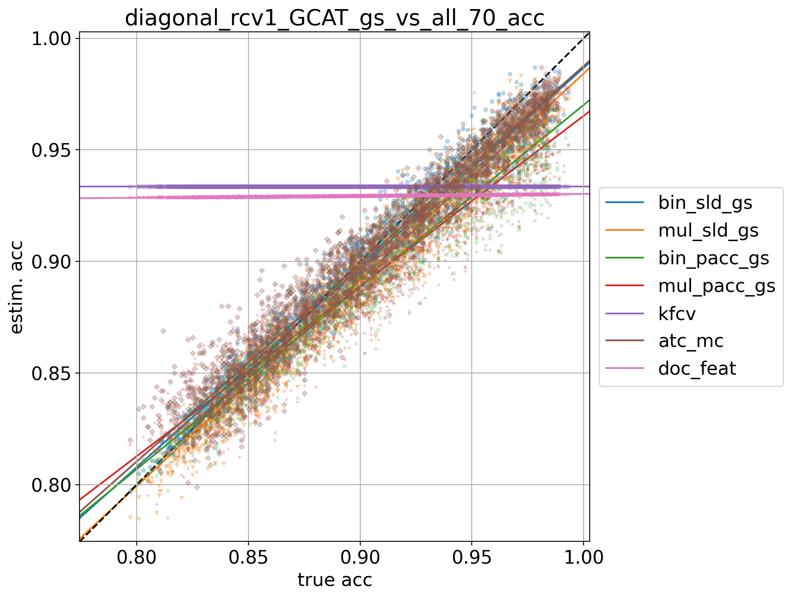
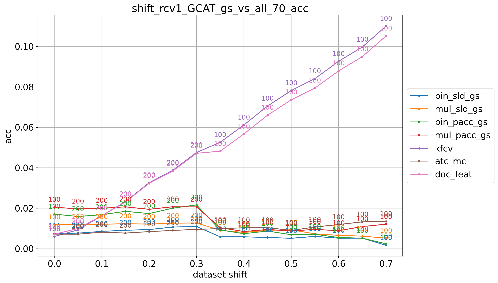

## 80% positives
> train: [0.19989669 0.80010331]  
> validation: [0.20015496 0.79984504]  
> bin_sld: 407.545s  
> mul_sld: 147.073s  
> bin_sld_gs: 4046.450s  
> mul_sld_gs: 3606.019s  
> bin_sld_gsq: 490.593s  
> bin_pacc: 399.480s  
> mul_pacc: 162.231s  
> binmc_pacc: 403.466s  
> mulmc_pacc: 179.691s  
> binne_pacc: 403.638s  
> mulne_pacc: 171.078s  
> bin_pacc_gs: 3446.185s  
> mul_pacc_gs: 257.968s  
> bin_cc: 374.905s  
> mul_cc: 150.379s  
> kfcv: 133.439s  
> ref: 132.673s  
> atc_mc: 130.594s  
> atc_ne: 131.031s  
> doc_feat: 81.112s  
> tot: 4051.202s  

<table border="1" class="dataframe">
  <thead>
    <tr style="text-align: right;">
      <th></th>
      <th>bin_sld_gs</th>
      <th>mul_sld_gs</th>
      <th>bin_pacc_gs</th>
      <th>mul_pacc_gs</th>
      <th>kfcv</th>
      <th>atc_mc</th>
      <th>doc_feat</th>
    </tr>
  </thead>
  <tbody>
    <tr>
      <th>0.0</th>
      <td>0.0008</td>
      <td>0.0046</td>
      <td>0.0087</td>
      <td>0.0107</td>
      <td>0.2318</td>
      <td>0.0197</td>
      <td>0.2401</td>
    </tr>
    <tr>
      <th>0.05</th>
      <td>0.0050</td>
      <td>0.0065</td>
      <td>0.0073</td>
      <td>0.0148</td>
      <td>0.2164</td>
      <td>0.0154</td>
      <td>0.2249</td>
    </tr>
    <tr>
      <th>0.1</th>
      <td>0.0052</td>
      <td>0.0066</td>
      <td>0.0072</td>
      <td>0.0140</td>
      <td>0.2020</td>
      <td>0.0160</td>
      <td>0.2105</td>
    </tr>
    <tr>
      <th>0.15</th>
      <td>0.0062</td>
      <td>0.0080</td>
      <td>0.0068</td>
      <td>0.0139</td>
      <td>0.1848</td>
      <td>0.0150</td>
      <td>0.1934</td>
    </tr>
    <tr>
      <th>0.2</th>
      <td>0.0054</td>
      <td>0.0071</td>
      <td>0.0064</td>
      <td>0.0131</td>
      <td>0.1710</td>
      <td>0.0169</td>
      <td>0.1798</td>
    </tr>
    <tr>
      <th>0.25</th>
      <td>0.0062</td>
      <td>0.0070</td>
      <td>0.0064</td>
      <td>0.0129</td>
      <td>0.1567</td>
      <td>0.0165</td>
      <td>0.1656</td>
    </tr>
    <tr>
      <th>0.3</th>
      <td>0.0065</td>
      <td>0.0072</td>
      <td>0.0064</td>
      <td>0.0113</td>
      <td>0.1389</td>
      <td>0.0146</td>
      <td>0.1479</td>
    </tr>
    <tr>
      <th>0.35</th>
      <td>0.0057</td>
      <td>0.0072</td>
      <td>0.0058</td>
      <td>0.0131</td>
      <td>0.1234</td>
      <td>0.0123</td>
      <td>0.1325</td>
    </tr>
    <tr>
      <th>0.4</th>
      <td>0.0061</td>
      <td>0.0077</td>
      <td>0.0059</td>
      <td>0.0108</td>
      <td>0.1088</td>
      <td>0.0134</td>
      <td>0.1180</td>
    </tr>
    <tr>
      <th>0.45</th>
      <td>0.0064</td>
      <td>0.0084</td>
      <td>0.0068</td>
      <td>0.0115</td>
      <td>0.0927</td>
      <td>0.0109</td>
      <td>0.1020</td>
    </tr>
    <tr>
      <th>0.5</th>
      <td>0.0066</td>
      <td>0.0078</td>
      <td>0.0060</td>
      <td>0.0093</td>
      <td>0.0803</td>
      <td>0.0113</td>
      <td>0.0897</td>
    </tr>
    <tr>
      <th>0.55</th>
      <td>0.0061</td>
      <td>0.0097</td>
      <td>0.0083</td>
      <td>0.0115</td>
      <td>0.0638</td>
      <td>0.0112</td>
      <td>0.0734</td>
    </tr>
    <tr>
      <th>0.6</th>
      <td>0.0063</td>
      <td>0.0084</td>
      <td>0.0073</td>
      <td>0.0092</td>
      <td>0.0489</td>
      <td>0.0097</td>
      <td>0.0585</td>
    </tr>
    <tr>
      <th>0.65</th>
      <td>0.0065</td>
      <td>0.0089</td>
      <td>0.0077</td>
      <td>0.0092</td>
      <td>0.0333</td>
      <td>0.0085</td>
      <td>0.0431</td>
    </tr>
    <tr>
      <th>0.7</th>
      <td>0.0066</td>
      <td>0.0097</td>
      <td>0.0089</td>
      <td>0.0094</td>
      <td>0.0177</td>
      <td>0.0091</td>
      <td>0.0273</td>
    </tr>
    <tr>
      <th>0.75</th>
      <td>0.0058</td>
      <td>0.0094</td>
      <td>0.0094</td>
      <td>0.0082</td>
      <td>0.0059</td>
      <td>0.0080</td>
      <td>0.0117</td>
    </tr>
    <tr>
      <th>0.8</th>
      <td>0.0066</td>
      <td>0.0095</td>
      <td>0.0100</td>
      <td>0.0085</td>
      <td>0.0139</td>
      <td>0.0083</td>
      <td>0.0067</td>
    </tr>
    <tr>
      <th>0.85</th>
      <td>0.0059</td>
      <td>0.0093</td>
      <td>0.0110</td>
      <td>0.0081</td>
      <td>0.0281</td>
      <td>0.0068</td>
      <td>0.0179</td>
    </tr>
    <tr>
      <th>0.9</th>
      <td>0.0065</td>
      <td>0.0083</td>
      <td>0.0103</td>
      <td>0.0071</td>
      <td>0.0441</td>
      <td>0.0066</td>
      <td>0.0338</td>
    </tr>
    <tr>
      <th>0.95</th>
      <td>0.0060</td>
      <td>0.0082</td>
      <td>0.0122</td>
      <td>0.0077</td>
      <td>0.0593</td>
      <td>0.0068</td>
      <td>0.0489</td>
    </tr>
    <tr>
      <th>1.0</th>
      <td>0.0054</td>
      <td>0.0073</td>
      <td>0.0128</td>
      <td>0.0066</td>
      <td>0.0749</td>
      <td>0.0081</td>
      <td>0.0644</td>
    </tr>
    <tr>
      <th>avg</th>
      <td>0.0058</td>
      <td>0.0080</td>
      <td>0.0082</td>
      <td>0.0105</td>
      <td>0.0998</td>
      <td>0.0117</td>
      <td>0.1043</td>
    </tr>
  </tbody>
</table>

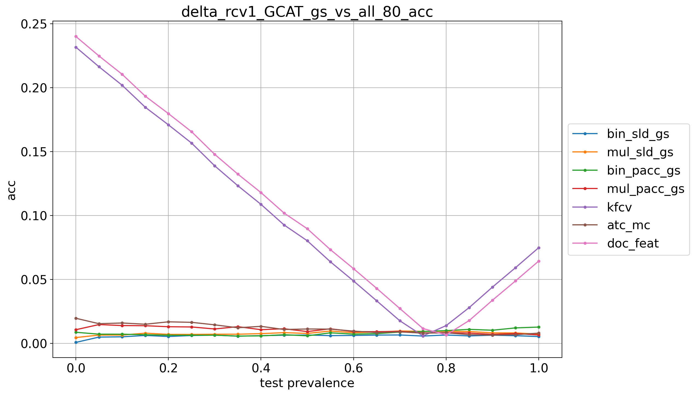
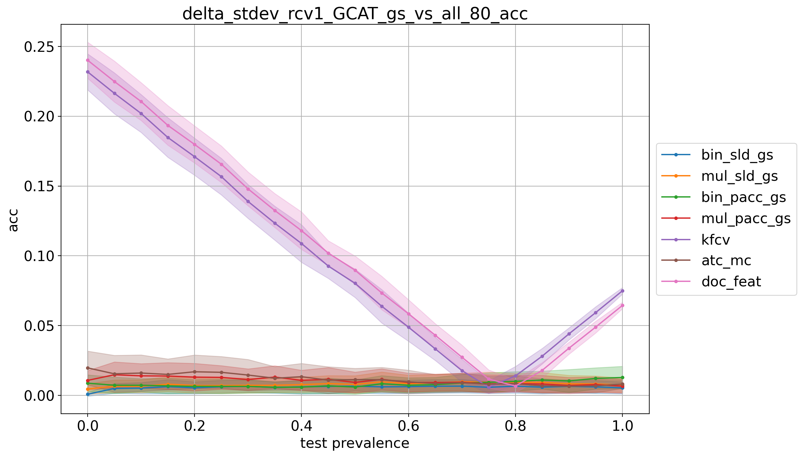
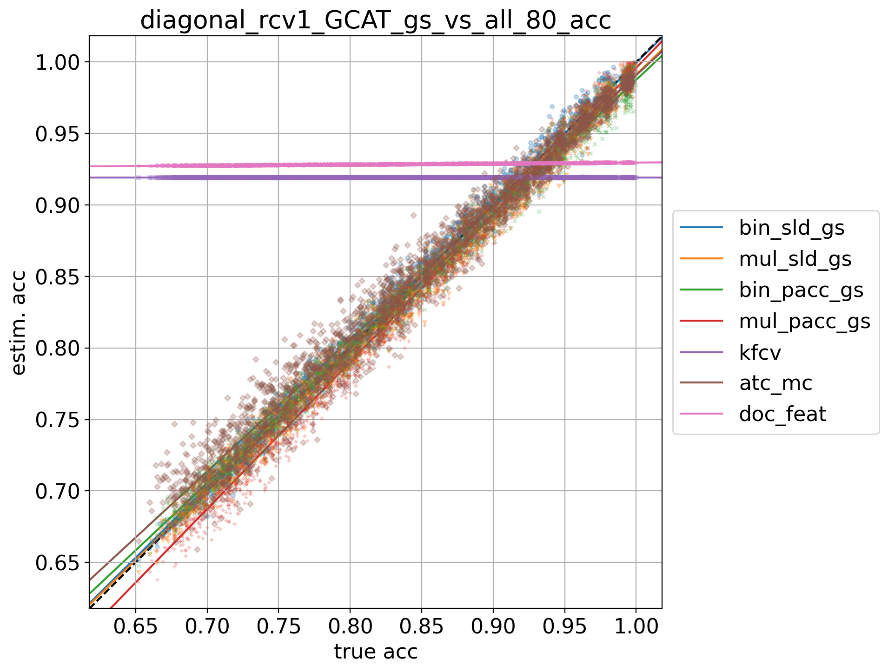
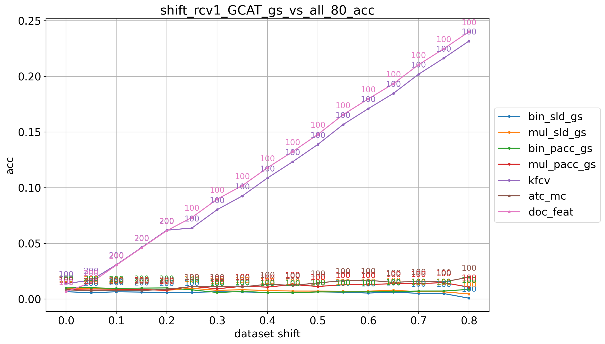

## 90% positives
> train: [0.09994835 0.90005165]  
> validation: [0.09994835 0.90005165]  
> mul_sld: 56.896s  
> mul_sld_gs: 351.569s  
> mul_cc: 51.884s  
> kfcv: 46.187s  
> ref: 44.331s  
> atc_mc: 47.954s  
> atc_ne: 47.496s  
> doc_feat: 41.155s  
> tot: 357.732s  

<table border="1" class="dataframe">
  <thead>
    <tr style="text-align: right;">
      <th></th>
      <th>mul_sld_gs</th>
      <th>kfcv</th>
      <th>atc_mc</th>
      <th>doc_feat</th>
    </tr>
  </thead>
  <tbody>
    <tr>
      <th>0.0</th>
      <td>0.0067</td>
      <td>0.6356</td>
      <td>0.0533</td>
      <td>0.6441</td>
    </tr>
    <tr>
      <th>0.05</th>
      <td>0.0101</td>
      <td>0.6025</td>
      <td>0.0503</td>
      <td>0.6111</td>
    </tr>
    <tr>
      <th>0.1</th>
      <td>0.0131</td>
      <td>0.5644</td>
      <td>0.0476</td>
      <td>0.5732</td>
    </tr>
    <tr>
      <th>0.15</th>
      <td>0.0160</td>
      <td>0.5296</td>
      <td>0.0449</td>
      <td>0.5384</td>
    </tr>
    <tr>
      <th>0.2</th>
      <td>0.0150</td>
      <td>0.4933</td>
      <td>0.0438</td>
      <td>0.5023</td>
    </tr>
    <tr>
      <th>0.25</th>
      <td>0.0159</td>
      <td>0.4577</td>
      <td>0.0410</td>
      <td>0.4669</td>
    </tr>
    <tr>
      <th>0.3</th>
      <td>0.0163</td>
      <td>0.4188</td>
      <td>0.0351</td>
      <td>0.4281</td>
    </tr>
    <tr>
      <th>0.35</th>
      <td>0.0133</td>
      <td>0.3853</td>
      <td>0.0321</td>
      <td>0.3947</td>
    </tr>
    <tr>
      <th>0.4</th>
      <td>0.0153</td>
      <td>0.3485</td>
      <td>0.0303</td>
      <td>0.3581</td>
    </tr>
    <tr>
      <th>0.45</th>
      <td>0.0124</td>
      <td>0.3133</td>
      <td>0.0252</td>
      <td>0.3229</td>
    </tr>
    <tr>
      <th>0.5</th>
      <td>0.0123</td>
      <td>0.2771</td>
      <td>0.0238</td>
      <td>0.2869</td>
    </tr>
    <tr>
      <th>0.55</th>
      <td>0.0099</td>
      <td>0.2422</td>
      <td>0.0204</td>
      <td>0.2521</td>
    </tr>
    <tr>
      <th>0.6</th>
      <td>0.0101</td>
      <td>0.2050</td>
      <td>0.0185</td>
      <td>0.2151</td>
    </tr>
    <tr>
      <th>0.65</th>
      <td>0.0082</td>
      <td>0.1704</td>
      <td>0.0163</td>
      <td>0.1806</td>
    </tr>
    <tr>
      <th>0.7</th>
      <td>0.0075</td>
      <td>0.1350</td>
      <td>0.0131</td>
      <td>0.1453</td>
    </tr>
    <tr>
      <th>0.75</th>
      <td>0.0056</td>
      <td>0.0974</td>
      <td>0.0102</td>
      <td>0.1078</td>
    </tr>
    <tr>
      <th>0.8</th>
      <td>0.0054</td>
      <td>0.0606</td>
      <td>0.0080</td>
      <td>0.0712</td>
    </tr>
    <tr>
      <th>0.85</th>
      <td>0.0053</td>
      <td>0.0261</td>
      <td>0.0061</td>
      <td>0.0368</td>
    </tr>
    <tr>
      <th>0.9</th>
      <td>0.0069</td>
      <td>0.0107</td>
      <td>0.0069</td>
      <td>0.0033</td>
    </tr>
    <tr>
      <th>0.95</th>
      <td>0.0083</td>
      <td>0.0461</td>
      <td>0.0077</td>
      <td>0.0351</td>
    </tr>
    <tr>
      <th>1.0</th>
      <td>0.0083</td>
      <td>0.0818</td>
      <td>0.0090</td>
      <td>0.0707</td>
    </tr>
    <tr>
      <th>avg</th>
      <td>0.0106</td>
      <td>0.2905</td>
      <td>0.0259</td>
      <td>0.2974</td>
    </tr>
  </tbody>
</table>

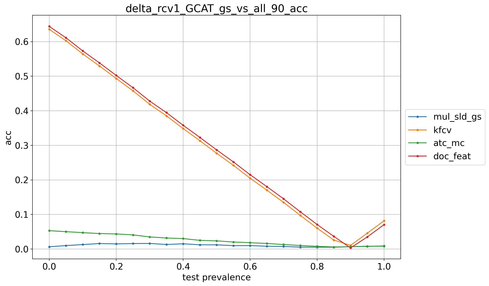
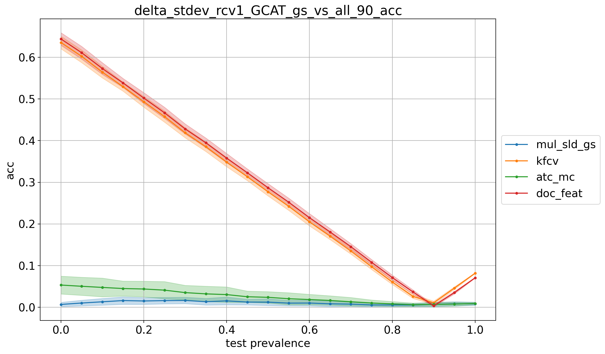
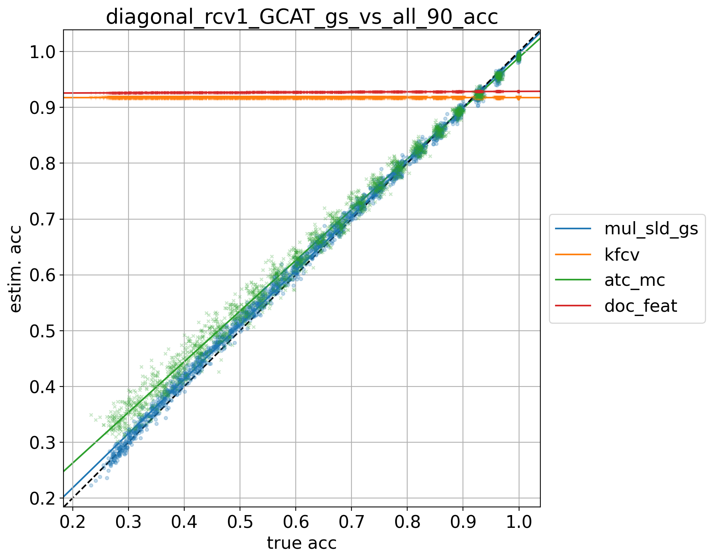

## avg
### avg on train
<table border="1" class="dataframe">
  <thead>
    <tr style="text-align: right;">
      <th></th>
      <th>bin_sld_gs</th>
      <th>mul_sld_gs</th>
      <th>bin_pacc_gs</th>
      <th>mul_pacc_gs</th>
      <th>kfcv</th>
      <th>atc_mc</th>
      <th>doc_feat</th>
    </tr>
  </thead>
  <tbody>
    <tr>
      <th>0.0</th>
      <td>0.0053</td>
      <td>0.0084</td>
      <td>0.0086</td>
      <td>0.0105</td>
      <td>0.1376</td>
      <td>0.0154</td>
      <td>0.1362</td>
    </tr>
    <tr>
      <th>0.05</th>
      <td>0.0077</td>
      <td>0.0080</td>
      <td>0.0101</td>
      <td>0.0120</td>
      <td>0.1232</td>
      <td>0.0147</td>
      <td>0.1220</td>
    </tr>
    <tr>
      <th>0.1</th>
      <td>0.0079</td>
      <td>0.0084</td>
      <td>0.0100</td>
      <td>0.0120</td>
      <td>0.1097</td>
      <td>0.0140</td>
      <td>0.1095</td>
    </tr>
    <tr>
      <th>0.15</th>
      <td>0.0091</td>
      <td>0.0091</td>
      <td>0.0108</td>
      <td>0.0121</td>
      <td>0.1027</td>
      <td>0.0145</td>
      <td>0.1033</td>
    </tr>
    <tr>
      <th>0.2</th>
      <td>0.0086</td>
      <td>0.0091</td>
      <td>0.0099</td>
      <td>0.0117</td>
      <td>0.0980</td>
      <td>0.0141</td>
      <td>0.0997</td>
    </tr>
    <tr>
      <th>0.25</th>
      <td>0.0093</td>
      <td>0.0097</td>
      <td>0.0107</td>
      <td>0.0124</td>
      <td>0.0950</td>
      <td>0.0146</td>
      <td>0.0980</td>
    </tr>
    <tr>
      <th>0.3</th>
      <td>0.0089</td>
      <td>0.0095</td>
      <td>0.0100</td>
      <td>0.0121</td>
      <td>0.0926</td>
      <td>0.0141</td>
      <td>0.0962</td>
    </tr>
    <tr>
      <th>0.35</th>
      <td>0.0092</td>
      <td>0.0100</td>
      <td>0.0099</td>
      <td>0.0134</td>
      <td>0.0921</td>
      <td>0.0140</td>
      <td>0.0962</td>
    </tr>
    <tr>
      <th>0.4</th>
      <td>0.0089</td>
      <td>0.0105</td>
      <td>0.0097</td>
      <td>0.0137</td>
      <td>0.0920</td>
      <td>0.0142</td>
      <td>0.0966</td>
    </tr>
    <tr>
      <th>0.45</th>
      <td>0.0094</td>
      <td>0.0110</td>
      <td>0.0106</td>
      <td>0.0149</td>
      <td>0.0911</td>
      <td>0.0140</td>
      <td>0.0958</td>
    </tr>
    <tr>
      <th>0.5</th>
      <td>0.0095</td>
      <td>0.0113</td>
      <td>0.0102</td>
      <td>0.0149</td>
      <td>0.0920</td>
      <td>0.0143</td>
      <td>0.0970</td>
    </tr>
    <tr>
      <th>0.55</th>
      <td>0.0094</td>
      <td>0.0124</td>
      <td>0.0112</td>
      <td>0.0172</td>
      <td>0.0922</td>
      <td>0.0149</td>
      <td>0.0972</td>
    </tr>
    <tr>
      <th>0.6</th>
      <td>0.0090</td>
      <td>0.0120</td>
      <td>0.0103</td>
      <td>0.0183</td>
      <td>0.0917</td>
      <td>0.0143</td>
      <td>0.0969</td>
    </tr>
    <tr>
      <th>0.65</th>
      <td>0.0089</td>
      <td>0.0120</td>
      <td>0.0105</td>
      <td>0.0193</td>
      <td>0.0925</td>
      <td>0.0148</td>
      <td>0.0977</td>
    </tr>
    <tr>
      <th>0.7</th>
      <td>0.0084</td>
      <td>0.0125</td>
      <td>0.0108</td>
      <td>0.0211</td>
      <td>0.0942</td>
      <td>0.0153</td>
      <td>0.0996</td>
    </tr>
    <tr>
      <th>0.75</th>
      <td>0.0085</td>
      <td>0.0127</td>
      <td>0.0113</td>
      <td>0.0221</td>
      <td>0.0957</td>
      <td>0.0157</td>
      <td>0.1008</td>
    </tr>
    <tr>
      <th>0.8</th>
      <td>0.0086</td>
      <td>0.0126</td>
      <td>0.0116</td>
      <td>0.0237</td>
      <td>0.1000</td>
      <td>0.0160</td>
      <td>0.1035</td>
    </tr>
    <tr>
      <th>0.85</th>
      <td>0.0084</td>
      <td>0.0128</td>
      <td>0.0121</td>
      <td>0.0262</td>
      <td>0.1060</td>
      <td>0.0159</td>
      <td>0.1090</td>
    </tr>
    <tr>
      <th>0.9</th>
      <td>0.0087</td>
      <td>0.0128</td>
      <td>0.0123</td>
      <td>0.0263</td>
      <td>0.1141</td>
      <td>0.0165</td>
      <td>0.1150</td>
    </tr>
    <tr>
      <th>0.95</th>
      <td>0.0094</td>
      <td>0.0128</td>
      <td>0.0136</td>
      <td>0.0290</td>
      <td>0.1283</td>
      <td>0.0178</td>
      <td>0.1286</td>
    </tr>
    <tr>
      <th>1.0</th>
      <td>0.0110</td>
      <td>0.0140</td>
      <td>0.0132</td>
      <td>0.0303</td>
      <td>0.1421</td>
      <td>0.0185</td>
      <td>0.1424</td>
    </tr>
    <tr>
      <th>avg</th>
      <td>0.0088</td>
      <td>0.0110</td>
      <td>0.0108</td>
      <td>0.0178</td>
      <td>0.1039</td>
      <td>0.0151</td>
      <td>0.1067</td>
    </tr>
  </tbody>
</table>

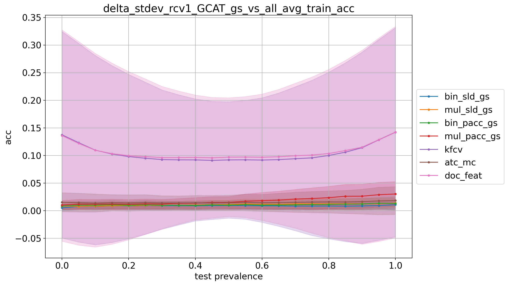
### avg on test
<table border="1" class="dataframe">
  <thead>
    <tr style="text-align: right;">
      <th></th>
      <th>bin_sld_gs</th>
      <th>mul_sld_gs</th>
      <th>bin_pacc_gs</th>
      <th>mul_pacc_gs</th>
      <th>kfcv</th>
      <th>atc_mc</th>
      <th>doc_feat</th>
    </tr>
  </thead>
  <tbody>
    <tr>
      <th>0.1</th>
      <td>NaN</td>
      <td>0.0154</td>
      <td>NaN</td>
      <td>NaN</td>
      <td>0.2944</td>
      <td>0.0402</td>
      <td>0.2990</td>
    </tr>
    <tr>
      <th>0.2</th>
      <td>0.0085</td>
      <td>0.0185</td>
      <td>0.0089</td>
      <td>0.0345</td>
      <td>0.1103</td>
      <td>0.0111</td>
      <td>0.1142</td>
    </tr>
    <tr>
      <th>0.3</th>
      <td>0.0085</td>
      <td>0.0089</td>
      <td>0.0094</td>
      <td>0.0157</td>
      <td>0.0499</td>
      <td>0.0095</td>
      <td>0.0518</td>
    </tr>
    <tr>
      <th>0.4</th>
      <td>0.0096</td>
      <td>0.0085</td>
      <td>0.0131</td>
      <td>0.0196</td>
      <td>0.0186</td>
      <td>0.0081</td>
      <td>0.0199</td>
    </tr>
    <tr>
      <th>0.5</th>
      <td>0.0095</td>
      <td>0.0103</td>
      <td>0.0110</td>
      <td>0.0133</td>
      <td>0.0063</td>
      <td>0.0095</td>
      <td>0.0082</td>
    </tr>
    <tr>
      <th>0.6</th>
      <td>0.0119</td>
      <td>0.0088</td>
      <td>0.0115</td>
      <td>0.0146</td>
      <td>0.0185</td>
      <td>0.0111</td>
      <td>0.0205</td>
    </tr>
    <tr>
      <th>0.7</th>
      <td>0.0077</td>
      <td>0.0105</td>
      <td>0.0138</td>
      <td>0.0163</td>
      <td>0.0472</td>
      <td>0.0093</td>
      <td>0.0454</td>
    </tr>
    <tr>
      <th>0.8</th>
      <td>0.0058</td>
      <td>0.0080</td>
      <td>0.0082</td>
      <td>0.0105</td>
      <td>0.0998</td>
      <td>0.0117</td>
      <td>0.1043</td>
    </tr>
    <tr>
      <th>0.9</th>
      <td>NaN</td>
      <td>0.0106</td>
      <td>NaN</td>
      <td>NaN</td>
      <td>0.2905</td>
      <td>0.0259</td>
      <td>0.2974</td>
    </tr>
    <tr>
      <th>avg</th>
      <td>0.0088</td>
      <td>0.0110</td>
      <td>0.0108</td>
      <td>0.0178</td>
      <td>0.1039</td>
      <td>0.0151</td>
      <td>0.1067</td>
    </tr>
  </tbody>
</table>

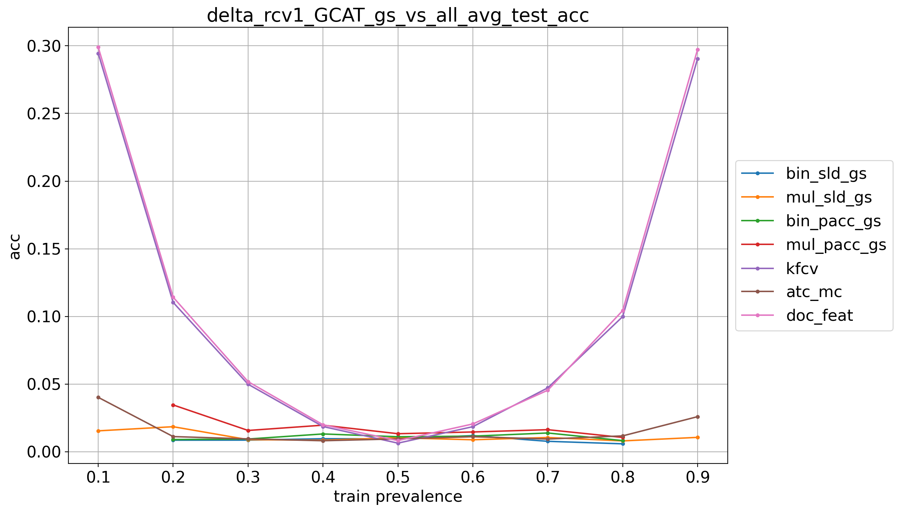
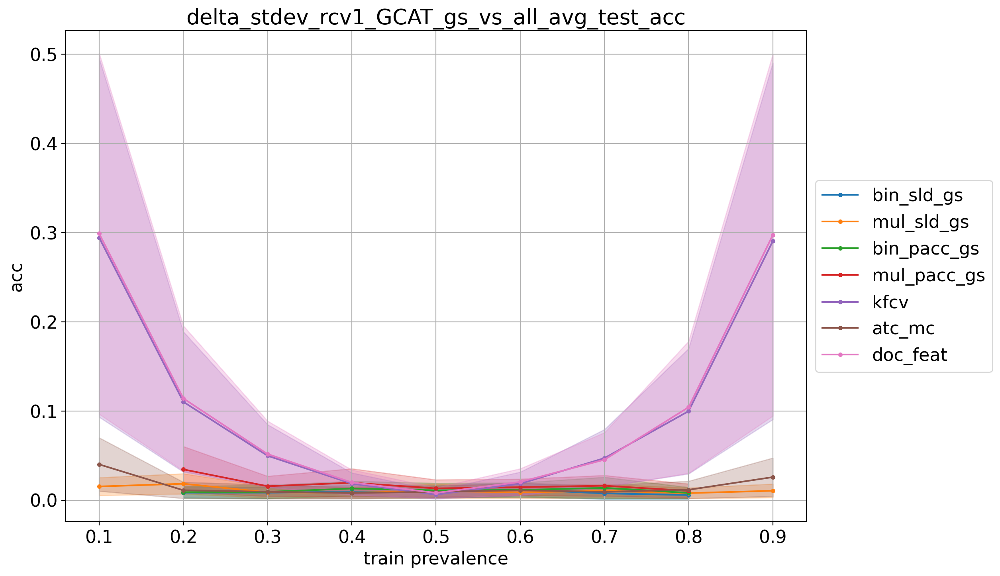
### avg dataset shift
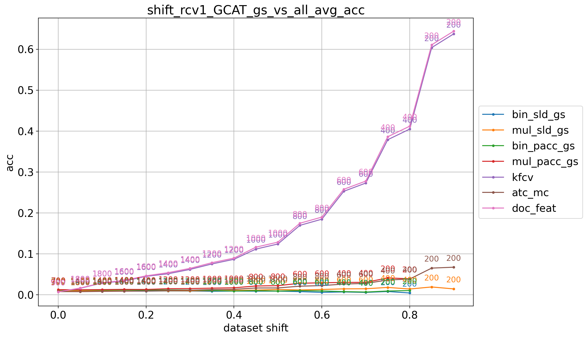
