# rcv1_GCAT_9prevs

## 10% positives
> train: [0.90005165 0.09994835]  
> validation: [0.90005165 0.09994835]  
> bin_sld: 203.037s  
> mul_sld: 73.117s  
> binmc_sld: 203.298s  
> mulmc_sld: 72.193s  
> binne_sld: 202.750s  
> mulne_sld: 66.052s  
> ref: 42.077s  
> atc_mc: 45.501s  
> tot: 210.220s  

<table border="1" class="dataframe">
  <thead>
    <tr style="text-align: right;">
      <th></th>
      <th>bin_sld</th>
      <th>mul_sld</th>
      <th>binmc_sld</th>
      <th>mulmc_sld</th>
      <th>atc_mc</th>
    </tr>
  </thead>
  <tbody>
    <tr>
      <th>0.0</th>
      <td>0.0009</td>
      <td>0.0006</td>
      <td>0.0029</td>
      <td>0.0023</td>
      <td>0.0050</td>
    </tr>
    <tr>
      <th>0.05</th>
      <td>0.0058</td>
      <td>0.0086</td>
      <td>0.0074</td>
      <td>0.0059</td>
      <td>0.0044</td>
    </tr>
    <tr>
      <th>0.1</th>
      <td>0.0068</td>
      <td>0.0106</td>
      <td>0.0110</td>
      <td>0.0083</td>
      <td>0.0067</td>
    </tr>
    <tr>
      <th>0.15</th>
      <td>0.0108</td>
      <td>0.0310</td>
      <td>0.0130</td>
      <td>0.0125</td>
      <td>0.0110</td>
    </tr>
    <tr>
      <th>0.2</th>
      <td>0.0179</td>
      <td>0.0680</td>
      <td>0.0164</td>
      <td>0.0157</td>
      <td>0.0136</td>
    </tr>
    <tr>
      <th>0.25</th>
      <td>0.0265</td>
      <td>0.1009</td>
      <td>0.0205</td>
      <td>0.0292</td>
      <td>0.0172</td>
    </tr>
    <tr>
      <th>0.3</th>
      <td>0.0347</td>
      <td>0.1255</td>
      <td>0.0228</td>
      <td>0.0485</td>
      <td>0.0217</td>
    </tr>
    <tr>
      <th>0.35</th>
      <td>0.0428</td>
      <td>0.1470</td>
      <td>0.0240</td>
      <td>0.0696</td>
      <td>0.0270</td>
    </tr>
    <tr>
      <th>0.4</th>
      <td>0.0521</td>
      <td>0.1685</td>
      <td>0.0301</td>
      <td>0.1162</td>
      <td>0.0300</td>
    </tr>
    <tr>
      <th>0.45</th>
      <td>0.0600</td>
      <td>0.1853</td>
      <td>0.0345</td>
      <td>0.1384</td>
      <td>0.0367</td>
    </tr>
    <tr>
      <th>0.5</th>
      <td>0.0708</td>
      <td>0.2041</td>
      <td>0.0413</td>
      <td>0.1723</td>
      <td>0.0391</td>
    </tr>
    <tr>
      <th>0.55</th>
      <td>0.0767</td>
      <td>0.2168</td>
      <td>0.0410</td>
      <td>0.1952</td>
      <td>0.0445</td>
    </tr>
    <tr>
      <th>0.6</th>
      <td>0.0869</td>
      <td>0.2332</td>
      <td>0.0508</td>
      <td>0.2188</td>
      <td>0.0467</td>
    </tr>
    <tr>
      <th>0.65</th>
      <td>0.0960</td>
      <td>0.2435</td>
      <td>0.0534</td>
      <td>0.2333</td>
      <td>0.0527</td>
    </tr>
    <tr>
      <th>0.7</th>
      <td>0.1029</td>
      <td>0.2534</td>
      <td>0.0573</td>
      <td>0.2457</td>
      <td>0.0592</td>
    </tr>
    <tr>
      <th>0.75</th>
      <td>0.1078</td>
      <td>0.2530</td>
      <td>0.0606</td>
      <td>0.2530</td>
      <td>0.0617</td>
    </tr>
    <tr>
      <th>0.8</th>
      <td>0.1146</td>
      <td>0.2157</td>
      <td>0.0661</td>
      <td>0.2595</td>
      <td>0.0647</td>
    </tr>
    <tr>
      <th>0.85</th>
      <td>0.1184</td>
      <td>0.1519</td>
      <td>0.0703</td>
      <td>0.2597</td>
      <td>0.0679</td>
    </tr>
    <tr>
      <th>0.9</th>
      <td>0.1010</td>
      <td>0.1016</td>
      <td>0.0716</td>
      <td>0.1977</td>
      <td>0.0714</td>
    </tr>
    <tr>
      <th>0.95</th>
      <td>0.0518</td>
      <td>0.0770</td>
      <td>0.0517</td>
      <td>0.1174</td>
      <td>0.0803</td>
    </tr>
    <tr>
      <th>1.0</th>
      <td>0.0021</td>
      <td>0.0139</td>
      <td>0.0021</td>
      <td>0.0203</td>
      <td>0.0817</td>
    </tr>
    <tr>
      <th>avg</th>
      <td>0.0565</td>
      <td>0.1338</td>
      <td>0.0357</td>
      <td>0.1247</td>
      <td>0.0402</td>
    </tr>
  </tbody>
</table>

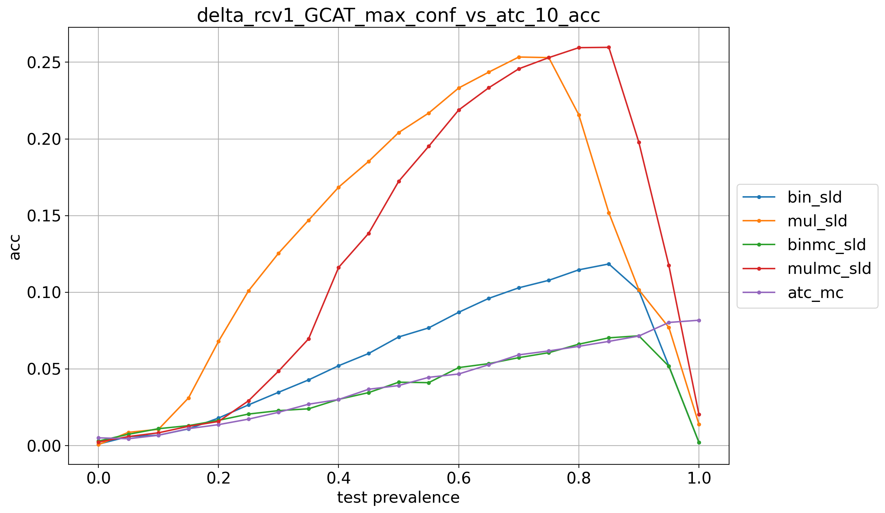
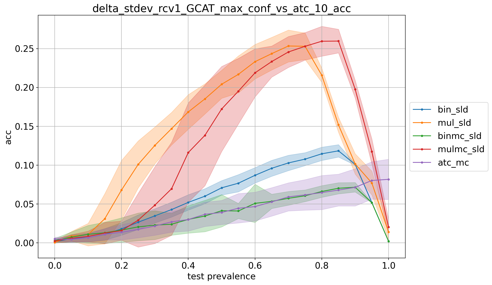
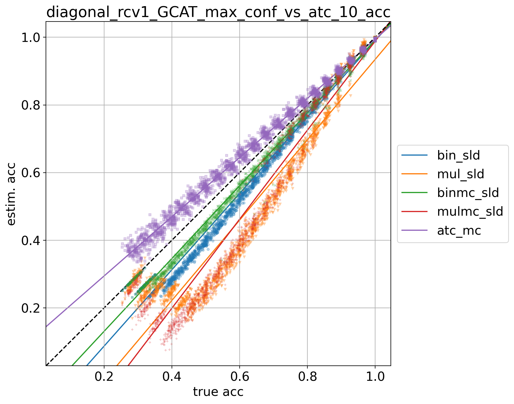
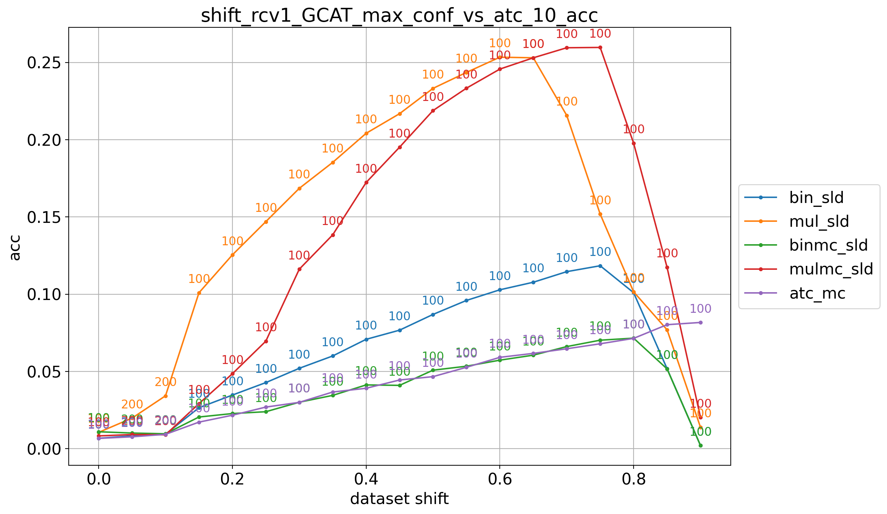

## 20% positives
> train: [0.79984504 0.20015496]  
> validation: [0.80010331 0.19989669]  
> bin_sld: 217.889s  
> mul_sld: 74.904s  
> binmc_sld: 220.775s  
> mulmc_sld: 80.875s  
> binne_sld: 219.751s  
> mulne_sld: 76.270s  
> bin_pacc: 209.775s  
> mul_pacc: 54.926s  
> ref: 46.602s  
> atc_mc: 50.329s  
> tot: 224.927s  

<table border="1" class="dataframe">
  <thead>
    <tr style="text-align: right;">
      <th></th>
      <th>bin_sld</th>
      <th>mul_sld</th>
      <th>binmc_sld</th>
      <th>mulmc_sld</th>
      <th>atc_mc</th>
    </tr>
  </thead>
  <tbody>
    <tr>
      <th>0.0</th>
      <td>0.0020</td>
      <td>0.0030</td>
      <td>0.0057</td>
      <td>0.0061</td>
      <td>0.0086</td>
    </tr>
    <tr>
      <th>0.05</th>
      <td>0.0162</td>
      <td>0.0088</td>
      <td>0.0173</td>
      <td>0.0131</td>
      <td>0.0076</td>
    </tr>
    <tr>
      <th>0.1</th>
      <td>0.0200</td>
      <td>0.0104</td>
      <td>0.0241</td>
      <td>0.0200</td>
      <td>0.0084</td>
    </tr>
    <tr>
      <th>0.15</th>
      <td>0.0189</td>
      <td>0.0137</td>
      <td>0.0255</td>
      <td>0.0267</td>
      <td>0.0087</td>
    </tr>
    <tr>
      <th>0.2</th>
      <td>0.0174</td>
      <td>0.0168</td>
      <td>0.0276</td>
      <td>0.0339</td>
      <td>0.0079</td>
    </tr>
    <tr>
      <th>0.25</th>
      <td>0.0185</td>
      <td>0.0215</td>
      <td>0.0303</td>
      <td>0.0415</td>
      <td>0.0084</td>
    </tr>
    <tr>
      <th>0.3</th>
      <td>0.0166</td>
      <td>0.0255</td>
      <td>0.0281</td>
      <td>0.0472</td>
      <td>0.0089</td>
    </tr>
    <tr>
      <th>0.35</th>
      <td>0.0152</td>
      <td>0.0310</td>
      <td>0.0309</td>
      <td>0.0547</td>
      <td>0.0090</td>
    </tr>
    <tr>
      <th>0.4</th>
      <td>0.0238</td>
      <td>0.0412</td>
      <td>0.0413</td>
      <td>0.0664</td>
      <td>0.0091</td>
    </tr>
    <tr>
      <th>0.45</th>
      <td>0.0221</td>
      <td>0.0475</td>
      <td>0.0404</td>
      <td>0.0738</td>
      <td>0.0111</td>
    </tr>
    <tr>
      <th>0.5</th>
      <td>0.0239</td>
      <td>0.0569</td>
      <td>0.0431</td>
      <td>0.0839</td>
      <td>0.0107</td>
    </tr>
    <tr>
      <th>0.55</th>
      <td>0.0216</td>
      <td>0.0618</td>
      <td>0.0409</td>
      <td>0.0875</td>
      <td>0.0124</td>
    </tr>
    <tr>
      <th>0.6</th>
      <td>0.0269</td>
      <td>0.0709</td>
      <td>0.0377</td>
      <td>0.0960</td>
      <td>0.0101</td>
    </tr>
    <tr>
      <th>0.65</th>
      <td>0.0318</td>
      <td>0.0813</td>
      <td>0.0442</td>
      <td>0.1060</td>
      <td>0.0126</td>
    </tr>
    <tr>
      <th>0.7</th>
      <td>0.0343</td>
      <td>0.0914</td>
      <td>0.0407</td>
      <td>0.1133</td>
      <td>0.0127</td>
    </tr>
    <tr>
      <th>0.75</th>
      <td>0.0391</td>
      <td>0.0997</td>
      <td>0.0490</td>
      <td>0.1195</td>
      <td>0.0129</td>
    </tr>
    <tr>
      <th>0.8</th>
      <td>0.0420</td>
      <td>0.1095</td>
      <td>0.0508</td>
      <td>0.1254</td>
      <td>0.0139</td>
    </tr>
    <tr>
      <th>0.85</th>
      <td>0.0451</td>
      <td>0.1200</td>
      <td>0.0467</td>
      <td>0.1304</td>
      <td>0.0140</td>
    </tr>
    <tr>
      <th>0.9</th>
      <td>0.0464</td>
      <td>0.1308</td>
      <td>0.0557</td>
      <td>0.1370</td>
      <td>0.0149</td>
    </tr>
    <tr>
      <th>0.95</th>
      <td>0.0481</td>
      <td>0.1431</td>
      <td>0.0632</td>
      <td>0.1429</td>
      <td>0.0166</td>
    </tr>
    <tr>
      <th>1.0</th>
      <td>0.0058</td>
      <td>0.1340</td>
      <td>0.0299</td>
      <td>0.1388</td>
      <td>0.0157</td>
    </tr>
    <tr>
      <th>avg</th>
      <td>0.0255</td>
      <td>0.0628</td>
      <td>0.0368</td>
      <td>0.0792</td>
      <td>0.0111</td>
    </tr>
  </tbody>
</table>

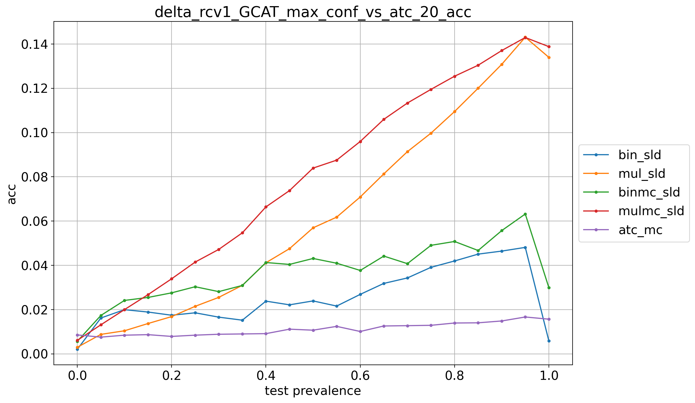
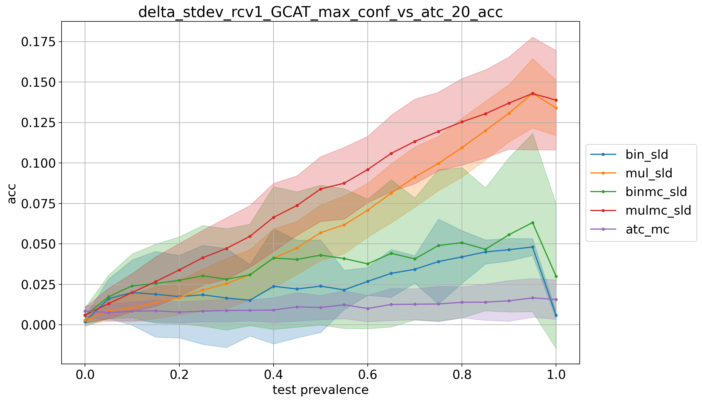
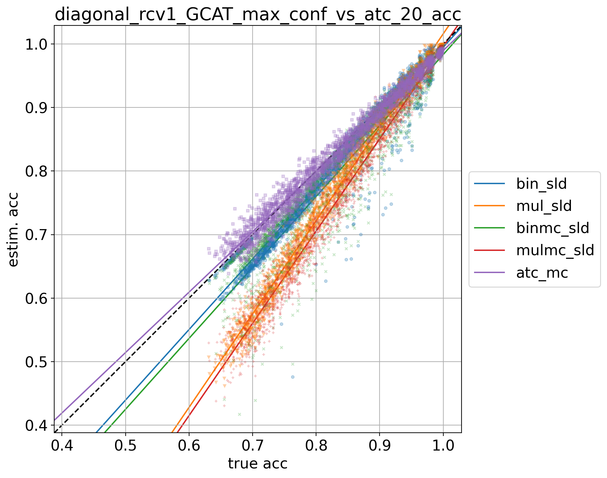
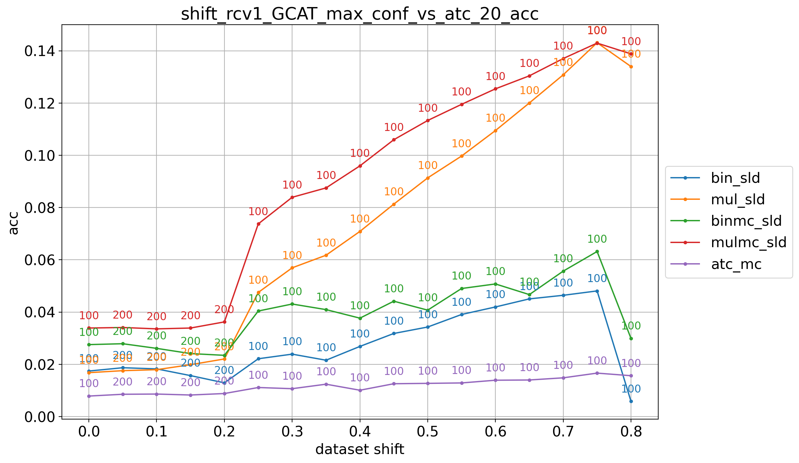

## 30% positives
> train: [0.69989669 0.30010331]  
> validation: [0.70015496 0.29984504]  
> bin_sld: 215.816s  
> mul_sld: 70.089s  
> binmc_sld: 213.798s  
> mulmc_sld: 67.714s  
> binne_sld: 215.552s  
> mulne_sld: 68.181s  
> bin_pacc: 208.609s  
> mul_pacc: 55.495s  
> ref: 46.494s  
> atc_mc: 50.590s  
> tot: 220.459s  

<table border="1" class="dataframe">
  <thead>
    <tr style="text-align: right;">
      <th></th>
      <th>bin_sld</th>
      <th>mul_sld</th>
      <th>binmc_sld</th>
      <th>mulmc_sld</th>
      <th>atc_mc</th>
    </tr>
  </thead>
  <tbody>
    <tr>
      <th>0.0</th>
      <td>0.0008</td>
      <td>0.0020</td>
      <td>0.0031</td>
      <td>0.0034</td>
      <td>0.0079</td>
    </tr>
    <tr>
      <th>0.05</th>
      <td>0.0159</td>
      <td>0.0080</td>
      <td>0.0112</td>
      <td>0.0087</td>
      <td>0.0073</td>
    </tr>
    <tr>
      <th>0.1</th>
      <td>0.0162</td>
      <td>0.0106</td>
      <td>0.0117</td>
      <td>0.0098</td>
      <td>0.0060</td>
    </tr>
    <tr>
      <th>0.15</th>
      <td>0.0206</td>
      <td>0.0109</td>
      <td>0.0157</td>
      <td>0.0128</td>
      <td>0.0071</td>
    </tr>
    <tr>
      <th>0.2</th>
      <td>0.0196</td>
      <td>0.0130</td>
      <td>0.0149</td>
      <td>0.0131</td>
      <td>0.0072</td>
    </tr>
    <tr>
      <th>0.25</th>
      <td>0.0200</td>
      <td>0.0133</td>
      <td>0.0154</td>
      <td>0.0139</td>
      <td>0.0069</td>
    </tr>
    <tr>
      <th>0.3</th>
      <td>0.0199</td>
      <td>0.0131</td>
      <td>0.0158</td>
      <td>0.0144</td>
      <td>0.0079</td>
    </tr>
    <tr>
      <th>0.35</th>
      <td>0.0198</td>
      <td>0.0142</td>
      <td>0.0158</td>
      <td>0.0152</td>
      <td>0.0073</td>
    </tr>
    <tr>
      <th>0.4</th>
      <td>0.0213</td>
      <td>0.0153</td>
      <td>0.0173</td>
      <td>0.0168</td>
      <td>0.0074</td>
    </tr>
    <tr>
      <th>0.45</th>
      <td>0.0220</td>
      <td>0.0172</td>
      <td>0.0178</td>
      <td>0.0182</td>
      <td>0.0076</td>
    </tr>
    <tr>
      <th>0.5</th>
      <td>0.0191</td>
      <td>0.0181</td>
      <td>0.0159</td>
      <td>0.0170</td>
      <td>0.0075</td>
    </tr>
    <tr>
      <th>0.55</th>
      <td>0.0211</td>
      <td>0.0204</td>
      <td>0.0180</td>
      <td>0.0184</td>
      <td>0.0102</td>
    </tr>
    <tr>
      <th>0.6</th>
      <td>0.0240</td>
      <td>0.0256</td>
      <td>0.0196</td>
      <td>0.0209</td>
      <td>0.0084</td>
    </tr>
    <tr>
      <th>0.65</th>
      <td>0.0263</td>
      <td>0.0288</td>
      <td>0.0209</td>
      <td>0.0212</td>
      <td>0.0091</td>
    </tr>
    <tr>
      <th>0.7</th>
      <td>0.0244</td>
      <td>0.0325</td>
      <td>0.0191</td>
      <td>0.0208</td>
      <td>0.0107</td>
    </tr>
    <tr>
      <th>0.75</th>
      <td>0.0258</td>
      <td>0.0334</td>
      <td>0.0192</td>
      <td>0.0196</td>
      <td>0.0134</td>
    </tr>
    <tr>
      <th>0.8</th>
      <td>0.0297</td>
      <td>0.0384</td>
      <td>0.0221</td>
      <td>0.0204</td>
      <td>0.0119</td>
    </tr>
    <tr>
      <th>0.85</th>
      <td>0.0309</td>
      <td>0.0426</td>
      <td>0.0223</td>
      <td>0.0214</td>
      <td>0.0132</td>
    </tr>
    <tr>
      <th>0.9</th>
      <td>0.0314</td>
      <td>0.0457</td>
      <td>0.0217</td>
      <td>0.0213</td>
      <td>0.0141</td>
    </tr>
    <tr>
      <th>0.95</th>
      <td>0.0384</td>
      <td>0.0558</td>
      <td>0.0300</td>
      <td>0.0279</td>
      <td>0.0129</td>
    </tr>
    <tr>
      <th>1.0</th>
      <td>0.0141</td>
      <td>0.0553</td>
      <td>0.0186</td>
      <td>0.0243</td>
      <td>0.0146</td>
    </tr>
    <tr>
      <th>avg</th>
      <td>0.0220</td>
      <td>0.0245</td>
      <td>0.0174</td>
      <td>0.0171</td>
      <td>0.0095</td>
    </tr>
  </tbody>
</table>

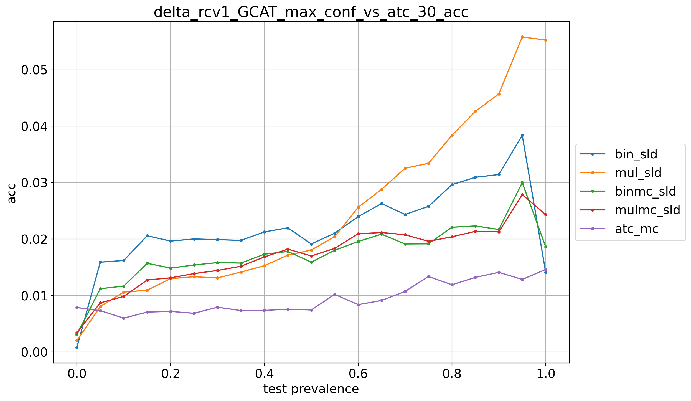
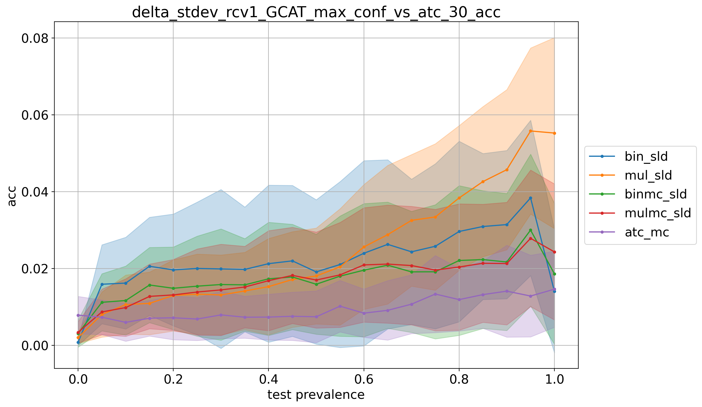
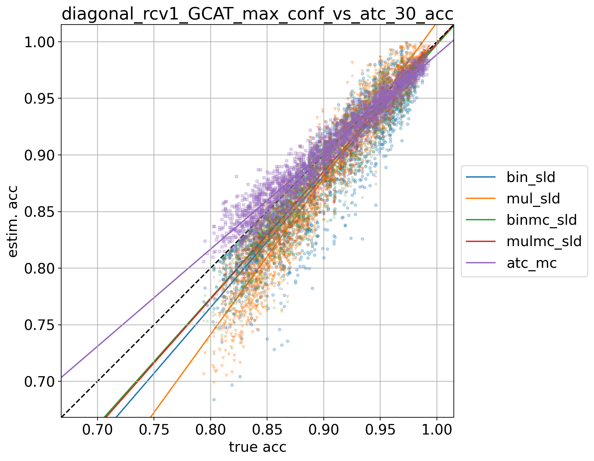
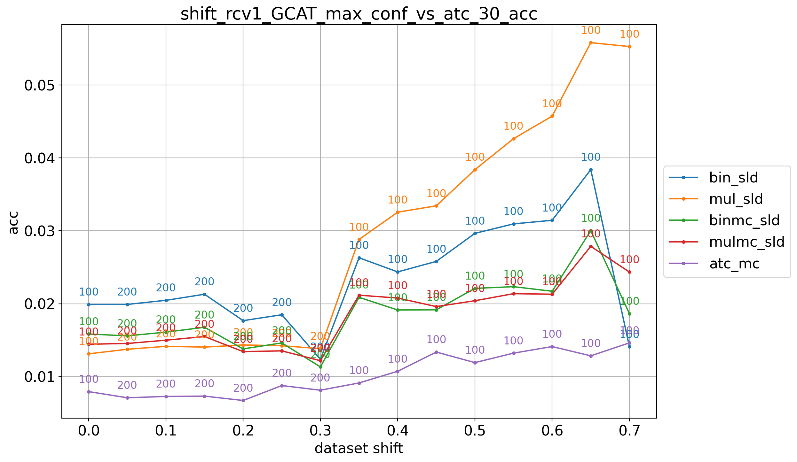

## 40% positives
> train: [0.59994835 0.40005165]  
> validation: [0.59994835 0.40005165]  
> bin_sld: 213.272s  
> mul_sld: 64.236s  
> binmc_sld: 213.186s  
> mulmc_sld: 63.510s  
> binne_sld: 213.277s  
> mulne_sld: 62.919s  
> bin_pacc: 208.657s  
> mul_pacc: 55.226s  
> ref: 46.375s  
> atc_mc: 50.706s  
> tot: 218.174s  

<table border="1" class="dataframe">
  <thead>
    <tr style="text-align: right;">
      <th></th>
      <th>bin_sld</th>
      <th>mul_sld</th>
      <th>binmc_sld</th>
      <th>mulmc_sld</th>
      <th>atc_mc</th>
    </tr>
  </thead>
  <tbody>
    <tr>
      <th>0.0</th>
      <td>0.0005</td>
      <td>0.0033</td>
      <td>0.0010</td>
      <td>0.0037</td>
      <td>0.0059</td>
    </tr>
    <tr>
      <th>0.05</th>
      <td>0.0119</td>
      <td>0.0074</td>
      <td>0.0059</td>
      <td>0.0063</td>
      <td>0.0049</td>
    </tr>
    <tr>
      <th>0.1</th>
      <td>0.0084</td>
      <td>0.0098</td>
      <td>0.0065</td>
      <td>0.0085</td>
      <td>0.0053</td>
    </tr>
    <tr>
      <th>0.15</th>
      <td>0.0096</td>
      <td>0.0108</td>
      <td>0.0084</td>
      <td>0.0089</td>
      <td>0.0058</td>
    </tr>
    <tr>
      <th>0.2</th>
      <td>0.0117</td>
      <td>0.0137</td>
      <td>0.0103</td>
      <td>0.0103</td>
      <td>0.0062</td>
    </tr>
    <tr>
      <th>0.25</th>
      <td>0.0136</td>
      <td>0.0153</td>
      <td>0.0115</td>
      <td>0.0111</td>
      <td>0.0073</td>
    </tr>
    <tr>
      <th>0.3</th>
      <td>0.0150</td>
      <td>0.0159</td>
      <td>0.0120</td>
      <td>0.0113</td>
      <td>0.0071</td>
    </tr>
    <tr>
      <th>0.35</th>
      <td>0.0168</td>
      <td>0.0192</td>
      <td>0.0127</td>
      <td>0.0130</td>
      <td>0.0069</td>
    </tr>
    <tr>
      <th>0.4</th>
      <td>0.0157</td>
      <td>0.0178</td>
      <td>0.0121</td>
      <td>0.0118</td>
      <td>0.0069</td>
    </tr>
    <tr>
      <th>0.45</th>
      <td>0.0177</td>
      <td>0.0203</td>
      <td>0.0136</td>
      <td>0.0141</td>
      <td>0.0065</td>
    </tr>
    <tr>
      <th>0.5</th>
      <td>0.0161</td>
      <td>0.0200</td>
      <td>0.0133</td>
      <td>0.0144</td>
      <td>0.0074</td>
    </tr>
    <tr>
      <th>0.55</th>
      <td>0.0167</td>
      <td>0.0204</td>
      <td>0.0141</td>
      <td>0.0151</td>
      <td>0.0085</td>
    </tr>
    <tr>
      <th>0.6</th>
      <td>0.0139</td>
      <td>0.0175</td>
      <td>0.0122</td>
      <td>0.0131</td>
      <td>0.0083</td>
    </tr>
    <tr>
      <th>0.65</th>
      <td>0.0114</td>
      <td>0.0162</td>
      <td>0.0107</td>
      <td>0.0125</td>
      <td>0.0081</td>
    </tr>
    <tr>
      <th>0.7</th>
      <td>0.0114</td>
      <td>0.0143</td>
      <td>0.0107</td>
      <td>0.0117</td>
      <td>0.0090</td>
    </tr>
    <tr>
      <th>0.75</th>
      <td>0.0096</td>
      <td>0.0126</td>
      <td>0.0091</td>
      <td>0.0116</td>
      <td>0.0104</td>
    </tr>
    <tr>
      <th>0.8</th>
      <td>0.0095</td>
      <td>0.0110</td>
      <td>0.0083</td>
      <td>0.0106</td>
      <td>0.0104</td>
    </tr>
    <tr>
      <th>0.85</th>
      <td>0.0141</td>
      <td>0.0112</td>
      <td>0.0104</td>
      <td>0.0102</td>
      <td>0.0107</td>
    </tr>
    <tr>
      <th>0.9</th>
      <td>0.0157</td>
      <td>0.0109</td>
      <td>0.0100</td>
      <td>0.0090</td>
      <td>0.0101</td>
    </tr>
    <tr>
      <th>0.95</th>
      <td>0.0198</td>
      <td>0.0147</td>
      <td>0.0123</td>
      <td>0.0087</td>
      <td>0.0117</td>
    </tr>
    <tr>
      <th>1.0</th>
      <td>0.0039</td>
      <td>0.0103</td>
      <td>0.0061</td>
      <td>0.0069</td>
      <td>0.0123</td>
    </tr>
    <tr>
      <th>avg</th>
      <td>0.0125</td>
      <td>0.0139</td>
      <td>0.0100</td>
      <td>0.0106</td>
      <td>0.0081</td>
    </tr>
  </tbody>
</table>

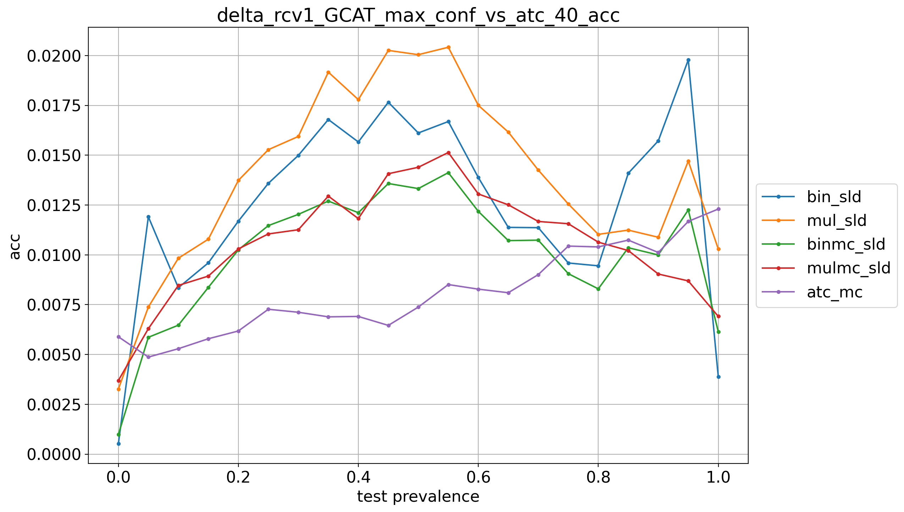
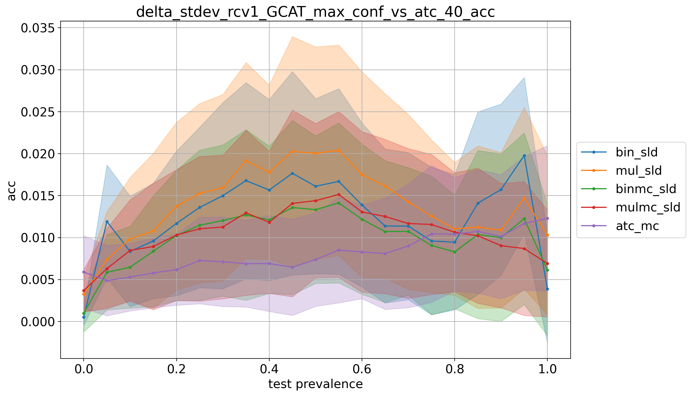
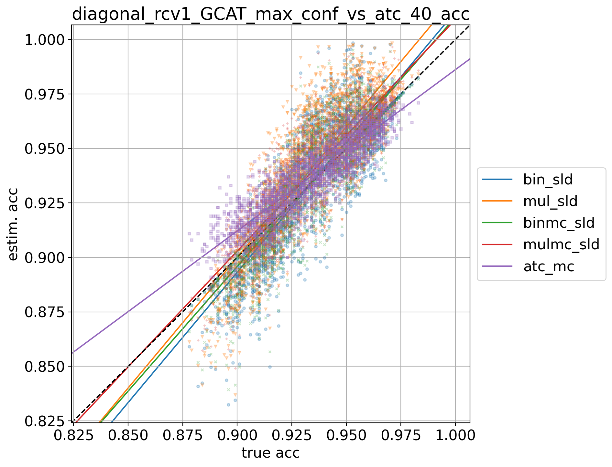
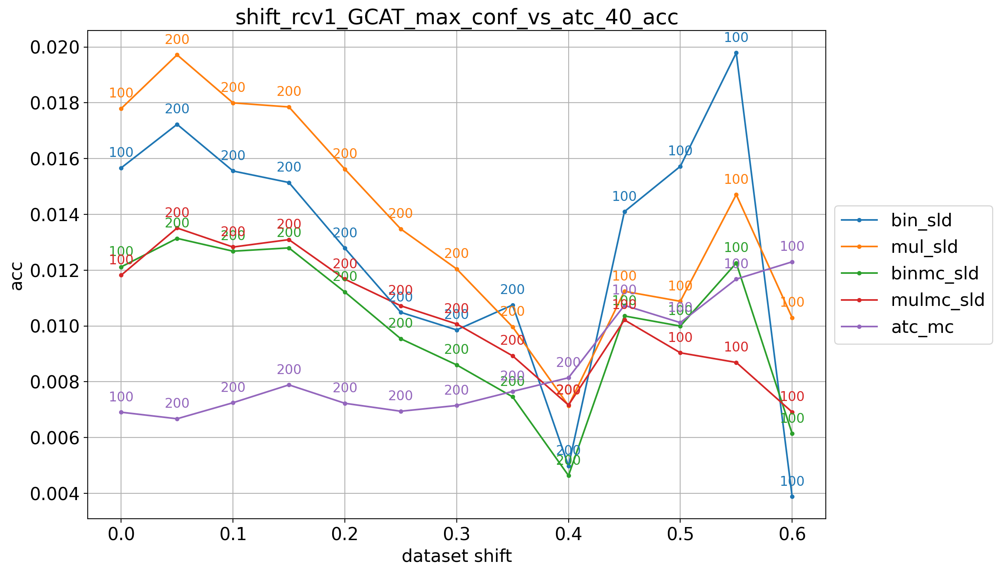

## 50% positives
> train: [0.5 0.5]  
> validation: [0.5 0.5]  
> bin_sld: 213.794s  
> mul_sld: 63.132s  
> binmc_sld: 212.621s  
> mulmc_sld: 62.747s  
> binne_sld: 213.874s  
> mulne_sld: 62.130s  
> bin_pacc: 207.785s  
> mul_pacc: 55.973s  
> ref: 46.679s  
> atc_mc: 50.991s  
> tot: 218.726s  

<table border="1" class="dataframe">
  <thead>
    <tr style="text-align: right;">
      <th></th>
      <th>bin_sld</th>
      <th>mul_sld</th>
      <th>binmc_sld</th>
      <th>mulmc_sld</th>
      <th>atc_mc</th>
    </tr>
  </thead>
  <tbody>
    <tr>
      <th>0.0</th>
      <td>0.0004</td>
      <td>0.0064</td>
      <td>0.0004</td>
      <td>0.0065</td>
      <td>0.0081</td>
    </tr>
    <tr>
      <th>0.05</th>
      <td>0.0122</td>
      <td>0.0078</td>
      <td>0.0048</td>
      <td>0.0105</td>
      <td>0.0102</td>
    </tr>
    <tr>
      <th>0.1</th>
      <td>0.0089</td>
      <td>0.0118</td>
      <td>0.0051</td>
      <td>0.0134</td>
      <td>0.0093</td>
    </tr>
    <tr>
      <th>0.15</th>
      <td>0.0100</td>
      <td>0.0136</td>
      <td>0.0074</td>
      <td>0.0136</td>
      <td>0.0100</td>
    </tr>
    <tr>
      <th>0.2</th>
      <td>0.0084</td>
      <td>0.0166</td>
      <td>0.0086</td>
      <td>0.0141</td>
      <td>0.0085</td>
    </tr>
    <tr>
      <th>0.25</th>
      <td>0.0097</td>
      <td>0.0199</td>
      <td>0.0108</td>
      <td>0.0156</td>
      <td>0.0091</td>
    </tr>
    <tr>
      <th>0.3</th>
      <td>0.0115</td>
      <td>0.0202</td>
      <td>0.0118</td>
      <td>0.0143</td>
      <td>0.0078</td>
    </tr>
    <tr>
      <th>0.35</th>
      <td>0.0167</td>
      <td>0.0243</td>
      <td>0.0154</td>
      <td>0.0171</td>
      <td>0.0096</td>
    </tr>
    <tr>
      <th>0.4</th>
      <td>0.0185</td>
      <td>0.0236</td>
      <td>0.0155</td>
      <td>0.0159</td>
      <td>0.0092</td>
    </tr>
    <tr>
      <th>0.45</th>
      <td>0.0227</td>
      <td>0.0260</td>
      <td>0.0178</td>
      <td>0.0167</td>
      <td>0.0079</td>
    </tr>
    <tr>
      <th>0.5</th>
      <td>0.0224</td>
      <td>0.0245</td>
      <td>0.0161</td>
      <td>0.0155</td>
      <td>0.0097</td>
    </tr>
    <tr>
      <th>0.55</th>
      <td>0.0233</td>
      <td>0.0249</td>
      <td>0.0164</td>
      <td>0.0156</td>
      <td>0.0096</td>
    </tr>
    <tr>
      <th>0.6</th>
      <td>0.0215</td>
      <td>0.0241</td>
      <td>0.0146</td>
      <td>0.0143</td>
      <td>0.0098</td>
    </tr>
    <tr>
      <th>0.65</th>
      <td>0.0184</td>
      <td>0.0221</td>
      <td>0.0127</td>
      <td>0.0131</td>
      <td>0.0097</td>
    </tr>
    <tr>
      <th>0.7</th>
      <td>0.0150</td>
      <td>0.0186</td>
      <td>0.0116</td>
      <td>0.0113</td>
      <td>0.0091</td>
    </tr>
    <tr>
      <th>0.75</th>
      <td>0.0126</td>
      <td>0.0171</td>
      <td>0.0110</td>
      <td>0.0109</td>
      <td>0.0102</td>
    </tr>
    <tr>
      <th>0.8</th>
      <td>0.0095</td>
      <td>0.0154</td>
      <td>0.0098</td>
      <td>0.0107</td>
      <td>0.0107</td>
    </tr>
    <tr>
      <th>0.85</th>
      <td>0.0098</td>
      <td>0.0120</td>
      <td>0.0113</td>
      <td>0.0104</td>
      <td>0.0094</td>
    </tr>
    <tr>
      <th>0.9</th>
      <td>0.0111</td>
      <td>0.0105</td>
      <td>0.0112</td>
      <td>0.0100</td>
      <td>0.0096</td>
    </tr>
    <tr>
      <th>0.95</th>
      <td>0.0154</td>
      <td>0.0101</td>
      <td>0.0127</td>
      <td>0.0093</td>
      <td>0.0108</td>
    </tr>
    <tr>
      <th>1.0</th>
      <td>0.0030</td>
      <td>0.0067</td>
      <td>0.0070</td>
      <td>0.0081</td>
      <td>0.0103</td>
    </tr>
    <tr>
      <th>avg</th>
      <td>0.0134</td>
      <td>0.0170</td>
      <td>0.0111</td>
      <td>0.0127</td>
      <td>0.0095</td>
    </tr>
  </tbody>
</table>

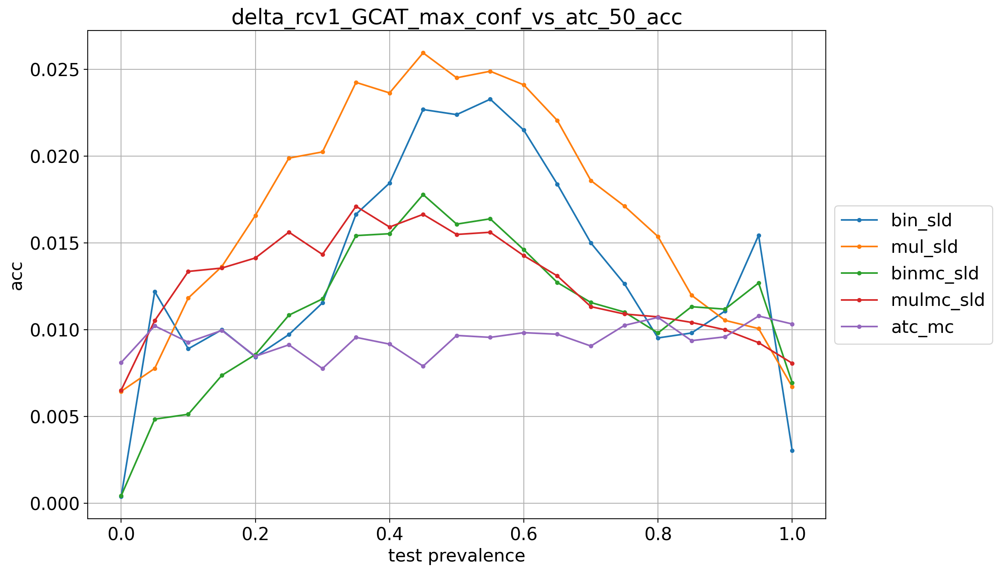
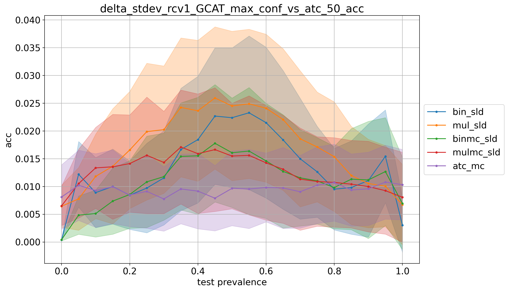
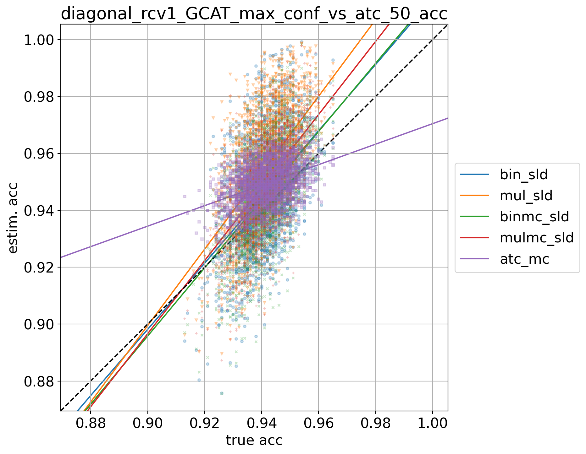
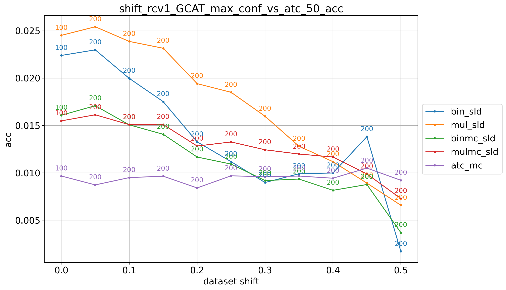

## 60% positives
> train: [0.40005165 0.59994835]  
> validation: [0.40005165 0.59994835]  
> bin_sld: 213.635s  
> mul_sld: 63.211s  
> binmc_sld: 212.836s  
> mulmc_sld: 62.226s  
> binne_sld: 212.259s  
> mulne_sld: 61.992s  
> bin_pacc: 207.509s  
> mul_pacc: 55.534s  
> ref: 46.606s  
> atc_mc: 51.106s  
> tot: 217.198s  

<table border="1" class="dataframe">
  <thead>
    <tr style="text-align: right;">
      <th></th>
      <th>bin_sld</th>
      <th>mul_sld</th>
      <th>binmc_sld</th>
      <th>mulmc_sld</th>
      <th>atc_mc</th>
    </tr>
  </thead>
  <tbody>
    <tr>
      <th>0.0</th>
      <td>0.0004</td>
      <td>0.0076</td>
      <td>0.0004</td>
      <td>0.0066</td>
      <td>0.0170</td>
    </tr>
    <tr>
      <th>0.05</th>
      <td>0.0172</td>
      <td>0.0094</td>
      <td>0.0068</td>
      <td>0.0074</td>
      <td>0.0192</td>
    </tr>
    <tr>
      <th>0.1</th>
      <td>0.0147</td>
      <td>0.0088</td>
      <td>0.0055</td>
      <td>0.0099</td>
      <td>0.0147</td>
    </tr>
    <tr>
      <th>0.15</th>
      <td>0.0132</td>
      <td>0.0110</td>
      <td>0.0067</td>
      <td>0.0116</td>
      <td>0.0173</td>
    </tr>
    <tr>
      <th>0.2</th>
      <td>0.0104</td>
      <td>0.0118</td>
      <td>0.0063</td>
      <td>0.0116</td>
      <td>0.0141</td>
    </tr>
    <tr>
      <th>0.25</th>
      <td>0.0095</td>
      <td>0.0141</td>
      <td>0.0084</td>
      <td>0.0134</td>
      <td>0.0149</td>
    </tr>
    <tr>
      <th>0.3</th>
      <td>0.0079</td>
      <td>0.0153</td>
      <td>0.0079</td>
      <td>0.0134</td>
      <td>0.0132</td>
    </tr>
    <tr>
      <th>0.35</th>
      <td>0.0083</td>
      <td>0.0180</td>
      <td>0.0098</td>
      <td>0.0144</td>
      <td>0.0123</td>
    </tr>
    <tr>
      <th>0.4</th>
      <td>0.0107</td>
      <td>0.0196</td>
      <td>0.0123</td>
      <td>0.0147</td>
      <td>0.0120</td>
    </tr>
    <tr>
      <th>0.45</th>
      <td>0.0120</td>
      <td>0.0216</td>
      <td>0.0129</td>
      <td>0.0151</td>
      <td>0.0105</td>
    </tr>
    <tr>
      <th>0.5</th>
      <td>0.0152</td>
      <td>0.0219</td>
      <td>0.0146</td>
      <td>0.0148</td>
      <td>0.0108</td>
    </tr>
    <tr>
      <th>0.55</th>
      <td>0.0186</td>
      <td>0.0237</td>
      <td>0.0167</td>
      <td>0.0160</td>
      <td>0.0102</td>
    </tr>
    <tr>
      <th>0.6</th>
      <td>0.0205</td>
      <td>0.0242</td>
      <td>0.0166</td>
      <td>0.0151</td>
      <td>0.0101</td>
    </tr>
    <tr>
      <th>0.65</th>
      <td>0.0213</td>
      <td>0.0243</td>
      <td>0.0161</td>
      <td>0.0148</td>
      <td>0.0088</td>
    </tr>
    <tr>
      <th>0.7</th>
      <td>0.0199</td>
      <td>0.0219</td>
      <td>0.0147</td>
      <td>0.0132</td>
      <td>0.0080</td>
    </tr>
    <tr>
      <th>0.75</th>
      <td>0.0199</td>
      <td>0.0220</td>
      <td>0.0145</td>
      <td>0.0136</td>
      <td>0.0078</td>
    </tr>
    <tr>
      <th>0.8</th>
      <td>0.0156</td>
      <td>0.0185</td>
      <td>0.0120</td>
      <td>0.0115</td>
      <td>0.0075</td>
    </tr>
    <tr>
      <th>0.85</th>
      <td>0.0124</td>
      <td>0.0159</td>
      <td>0.0106</td>
      <td>0.0107</td>
      <td>0.0067</td>
    </tr>
    <tr>
      <th>0.9</th>
      <td>0.0091</td>
      <td>0.0136</td>
      <td>0.0091</td>
      <td>0.0105</td>
      <td>0.0068</td>
    </tr>
    <tr>
      <th>0.95</th>
      <td>0.0081</td>
      <td>0.0075</td>
      <td>0.0065</td>
      <td>0.0071</td>
      <td>0.0051</td>
    </tr>
    <tr>
      <th>1.0</th>
      <td>0.0014</td>
      <td>0.0029</td>
      <td>0.0032</td>
      <td>0.0040</td>
      <td>0.0051</td>
    </tr>
    <tr>
      <th>avg</th>
      <td>0.0127</td>
      <td>0.0159</td>
      <td>0.0101</td>
      <td>0.0119</td>
      <td>0.0111</td>
    </tr>
  </tbody>
</table>

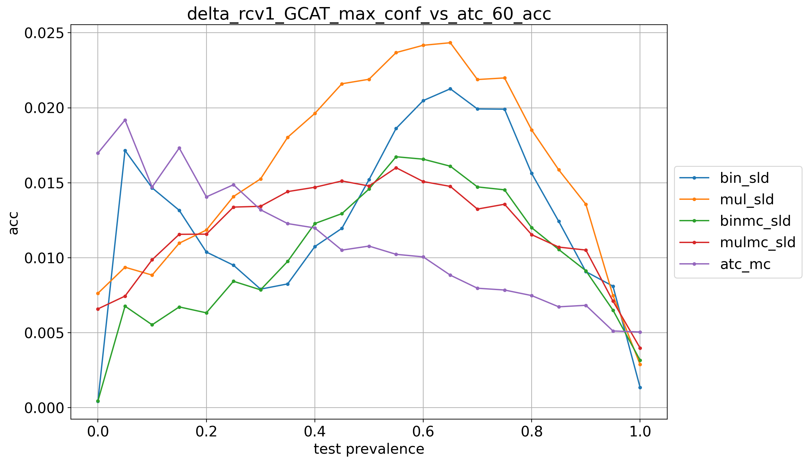
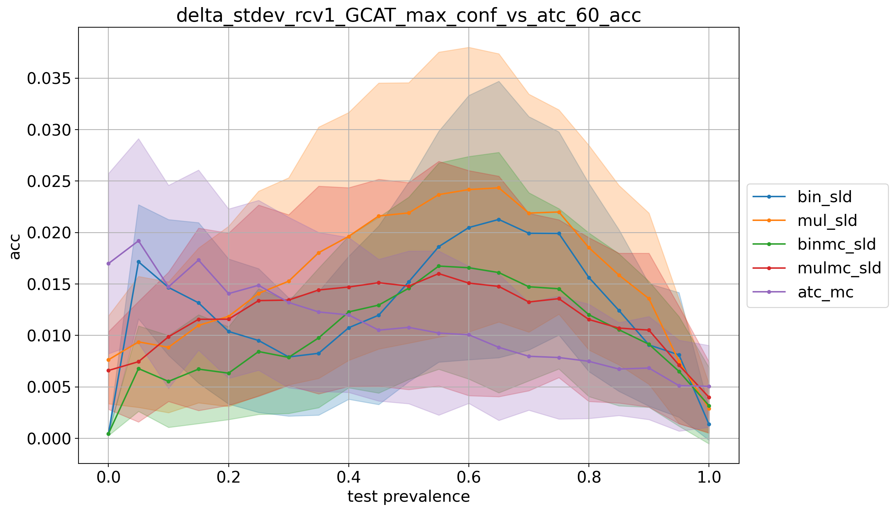
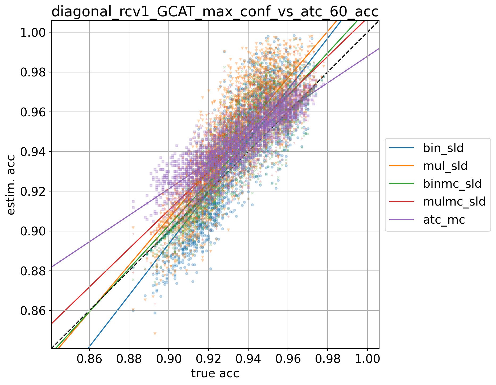
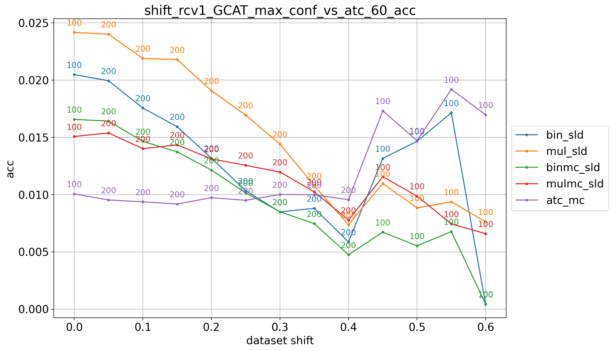

## 70% positives
> train: [0.29984504 0.70015496]  
> validation: [0.30010331 0.69989669]  
> bin_sld: 212.599s  
> mul_sld: 62.605s  
> binmc_sld: 212.279s  
> mulmc_sld: 61.417s  
> binne_sld: 212.832s  
> mulne_sld: 61.371s  
> bin_pacc: 207.524s  
> mul_pacc: 62.649s  
> ref: 45.958s  
> atc_mc: 50.040s  
> tot: 217.791s  

<table border="1" class="dataframe">
  <thead>
    <tr style="text-align: right;">
      <th></th>
      <th>bin_sld</th>
      <th>mul_sld</th>
      <th>binmc_sld</th>
      <th>mulmc_sld</th>
      <th>atc_mc</th>
    </tr>
  </thead>
  <tbody>
    <tr>
      <th>0.0</th>
      <td>0.0005</td>
      <td>0.0091</td>
      <td>0.0005</td>
      <td>0.0066</td>
      <td>0.0135</td>
    </tr>
    <tr>
      <th>0.05</th>
      <td>0.0209</td>
      <td>0.0177</td>
      <td>0.0096</td>
      <td>0.0066</td>
      <td>0.0133</td>
    </tr>
    <tr>
      <th>0.1</th>
      <td>0.0208</td>
      <td>0.0165</td>
      <td>0.0090</td>
      <td>0.0070</td>
      <td>0.0119</td>
    </tr>
    <tr>
      <th>0.15</th>
      <td>0.0199</td>
      <td>0.0153</td>
      <td>0.0095</td>
      <td>0.0088</td>
      <td>0.0107</td>
    </tr>
    <tr>
      <th>0.2</th>
      <td>0.0191</td>
      <td>0.0156</td>
      <td>0.0089</td>
      <td>0.0094</td>
      <td>0.0090</td>
    </tr>
    <tr>
      <th>0.25</th>
      <td>0.0176</td>
      <td>0.0141</td>
      <td>0.0087</td>
      <td>0.0094</td>
      <td>0.0104</td>
    </tr>
    <tr>
      <th>0.3</th>
      <td>0.0142</td>
      <td>0.0107</td>
      <td>0.0068</td>
      <td>0.0079</td>
      <td>0.0103</td>
    </tr>
    <tr>
      <th>0.35</th>
      <td>0.0139</td>
      <td>0.0111</td>
      <td>0.0081</td>
      <td>0.0087</td>
      <td>0.0099</td>
    </tr>
    <tr>
      <th>0.4</th>
      <td>0.0117</td>
      <td>0.0106</td>
      <td>0.0068</td>
      <td>0.0084</td>
      <td>0.0093</td>
    </tr>
    <tr>
      <th>0.45</th>
      <td>0.0106</td>
      <td>0.0107</td>
      <td>0.0070</td>
      <td>0.0088</td>
      <td>0.0099</td>
    </tr>
    <tr>
      <th>0.5</th>
      <td>0.0095</td>
      <td>0.0099</td>
      <td>0.0076</td>
      <td>0.0084</td>
      <td>0.0088</td>
    </tr>
    <tr>
      <th>0.55</th>
      <td>0.0101</td>
      <td>0.0124</td>
      <td>0.0085</td>
      <td>0.0099</td>
      <td>0.0074</td>
    </tr>
    <tr>
      <th>0.6</th>
      <td>0.0086</td>
      <td>0.0125</td>
      <td>0.0081</td>
      <td>0.0096</td>
      <td>0.0076</td>
    </tr>
    <tr>
      <th>0.65</th>
      <td>0.0082</td>
      <td>0.0125</td>
      <td>0.0077</td>
      <td>0.0088</td>
      <td>0.0075</td>
    </tr>
    <tr>
      <th>0.7</th>
      <td>0.0079</td>
      <td>0.0127</td>
      <td>0.0076</td>
      <td>0.0090</td>
      <td>0.0072</td>
    </tr>
    <tr>
      <th>0.75</th>
      <td>0.0099</td>
      <td>0.0128</td>
      <td>0.0088</td>
      <td>0.0087</td>
      <td>0.0068</td>
    </tr>
    <tr>
      <th>0.8</th>
      <td>0.0100</td>
      <td>0.0122</td>
      <td>0.0091</td>
      <td>0.0092</td>
      <td>0.0088</td>
    </tr>
    <tr>
      <th>0.85</th>
      <td>0.0109</td>
      <td>0.0122</td>
      <td>0.0103</td>
      <td>0.0101</td>
      <td>0.0080</td>
    </tr>
    <tr>
      <th>0.9</th>
      <td>0.0105</td>
      <td>0.0104</td>
      <td>0.0098</td>
      <td>0.0094</td>
      <td>0.0081</td>
    </tr>
    <tr>
      <th>0.95</th>
      <td>0.0110</td>
      <td>0.0080</td>
      <td>0.0118</td>
      <td>0.0095</td>
      <td>0.0081</td>
    </tr>
    <tr>
      <th>1.0</th>
      <td>0.0044</td>
      <td>0.0045</td>
      <td>0.0098</td>
      <td>0.0080</td>
      <td>0.0097</td>
    </tr>
    <tr>
      <th>avg</th>
      <td>0.0119</td>
      <td>0.0120</td>
      <td>0.0083</td>
      <td>0.0087</td>
      <td>0.0093</td>
    </tr>
  </tbody>
</table>

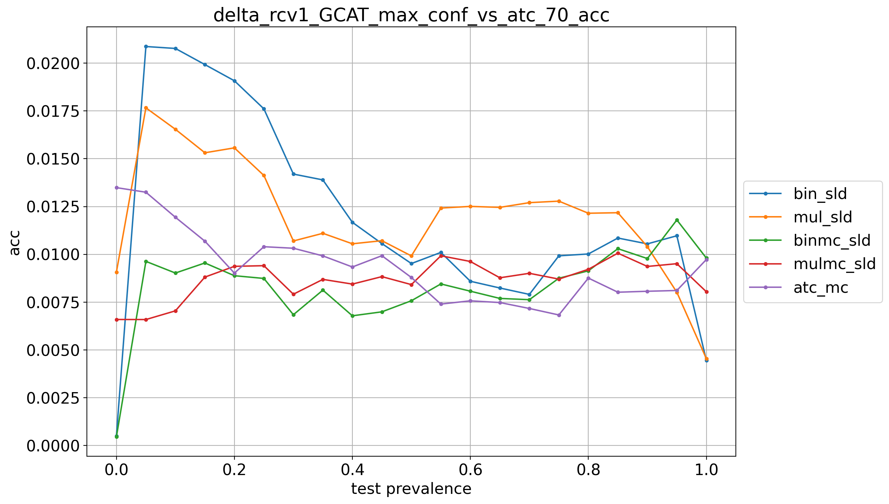
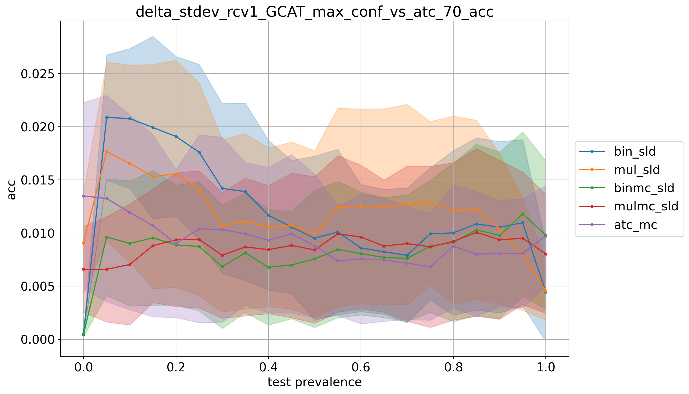
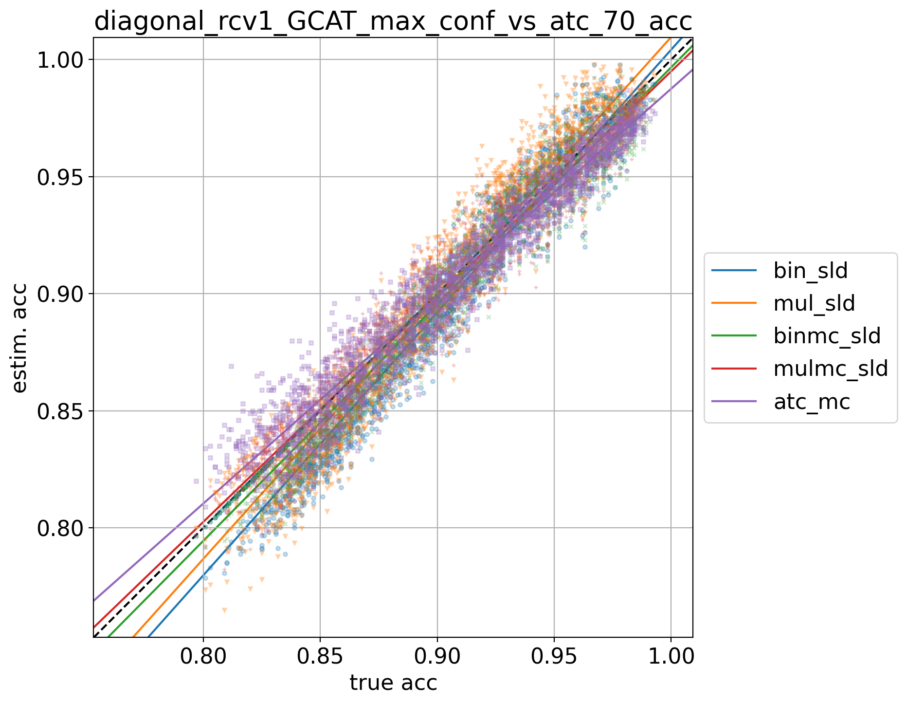
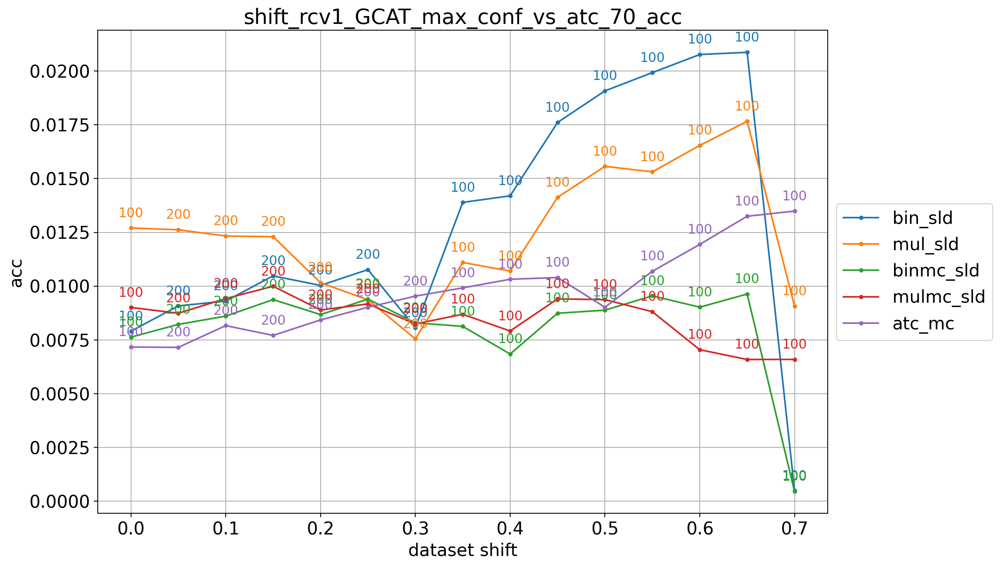

## 80% positives
> train: [0.19989669 0.80010331]  
> validation: [0.20015496 0.79984504]  
> bin_sld: 213.706s  
> mul_sld: 61.535s  
> binmc_sld: 213.790s  
> mulmc_sld: 60.661s  
> binne_sld: 212.442s  
> mulne_sld: 60.162s  
> bin_pacc: 207.754s  
> mul_pacc: 55.905s  
> ref: 46.700s  
> atc_mc: 50.642s  
> tot: 217.447s  

<table border="1" class="dataframe">
  <thead>
    <tr style="text-align: right;">
      <th></th>
      <th>bin_sld</th>
      <th>mul_sld</th>
      <th>binmc_sld</th>
      <th>mulmc_sld</th>
      <th>atc_mc</th>
    </tr>
  </thead>
  <tbody>
    <tr>
      <th>0.0</th>
      <td>0.0008</td>
      <td>0.0067</td>
      <td>0.0007</td>
      <td>0.0048</td>
      <td>0.0197</td>
    </tr>
    <tr>
      <th>0.05</th>
      <td>0.0371</td>
      <td>0.0401</td>
      <td>0.0213</td>
      <td>0.0197</td>
      <td>0.0154</td>
    </tr>
    <tr>
      <th>0.1</th>
      <td>0.0374</td>
      <td>0.0398</td>
      <td>0.0197</td>
      <td>0.0166</td>
      <td>0.0160</td>
    </tr>
    <tr>
      <th>0.15</th>
      <td>0.0347</td>
      <td>0.0381</td>
      <td>0.0169</td>
      <td>0.0157</td>
      <td>0.0150</td>
    </tr>
    <tr>
      <th>0.2</th>
      <td>0.0322</td>
      <td>0.0350</td>
      <td>0.0150</td>
      <td>0.0140</td>
      <td>0.0169</td>
    </tr>
    <tr>
      <th>0.25</th>
      <td>0.0284</td>
      <td>0.0292</td>
      <td>0.0128</td>
      <td>0.0122</td>
      <td>0.0165</td>
    </tr>
    <tr>
      <th>0.3</th>
      <td>0.0232</td>
      <td>0.0223</td>
      <td>0.0091</td>
      <td>0.0095</td>
      <td>0.0146</td>
    </tr>
    <tr>
      <th>0.35</th>
      <td>0.0222</td>
      <td>0.0221</td>
      <td>0.0093</td>
      <td>0.0100</td>
      <td>0.0123</td>
    </tr>
    <tr>
      <th>0.4</th>
      <td>0.0169</td>
      <td>0.0166</td>
      <td>0.0076</td>
      <td>0.0096</td>
      <td>0.0134</td>
    </tr>
    <tr>
      <th>0.45</th>
      <td>0.0148</td>
      <td>0.0142</td>
      <td>0.0078</td>
      <td>0.0098</td>
      <td>0.0109</td>
    </tr>
    <tr>
      <th>0.5</th>
      <td>0.0104</td>
      <td>0.0104</td>
      <td>0.0064</td>
      <td>0.0084</td>
      <td>0.0113</td>
    </tr>
    <tr>
      <th>0.55</th>
      <td>0.0105</td>
      <td>0.0127</td>
      <td>0.0065</td>
      <td>0.0100</td>
      <td>0.0112</td>
    </tr>
    <tr>
      <th>0.6</th>
      <td>0.0074</td>
      <td>0.0107</td>
      <td>0.0067</td>
      <td>0.0094</td>
      <td>0.0097</td>
    </tr>
    <tr>
      <th>0.65</th>
      <td>0.0072</td>
      <td>0.0145</td>
      <td>0.0079</td>
      <td>0.0120</td>
      <td>0.0085</td>
    </tr>
    <tr>
      <th>0.7</th>
      <td>0.0077</td>
      <td>0.0135</td>
      <td>0.0077</td>
      <td>0.0103</td>
      <td>0.0091</td>
    </tr>
    <tr>
      <th>0.75</th>
      <td>0.0082</td>
      <td>0.0146</td>
      <td>0.0076</td>
      <td>0.0097</td>
      <td>0.0080</td>
    </tr>
    <tr>
      <th>0.8</th>
      <td>0.0099</td>
      <td>0.0179</td>
      <td>0.0084</td>
      <td>0.0104</td>
      <td>0.0083</td>
    </tr>
    <tr>
      <th>0.85</th>
      <td>0.0118</td>
      <td>0.0189</td>
      <td>0.0088</td>
      <td>0.0103</td>
      <td>0.0068</td>
    </tr>
    <tr>
      <th>0.9</th>
      <td>0.0142</td>
      <td>0.0193</td>
      <td>0.0093</td>
      <td>0.0097</td>
      <td>0.0066</td>
    </tr>
    <tr>
      <th>0.95</th>
      <td>0.0118</td>
      <td>0.0129</td>
      <td>0.0081</td>
      <td>0.0079</td>
      <td>0.0068</td>
    </tr>
    <tr>
      <th>1.0</th>
      <td>0.0006</td>
      <td>0.0025</td>
      <td>0.0020</td>
      <td>0.0025</td>
      <td>0.0081</td>
    </tr>
    <tr>
      <th>avg</th>
      <td>0.0165</td>
      <td>0.0196</td>
      <td>0.0095</td>
      <td>0.0106</td>
      <td>0.0117</td>
    </tr>
  </tbody>
</table>

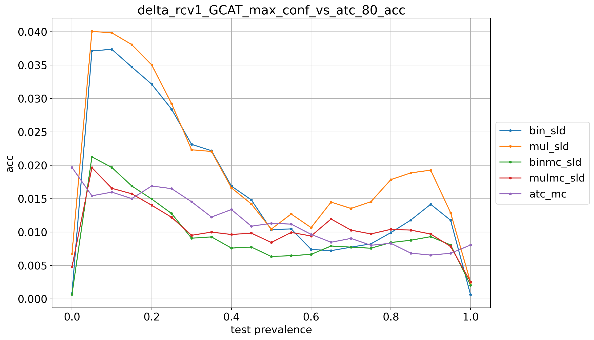
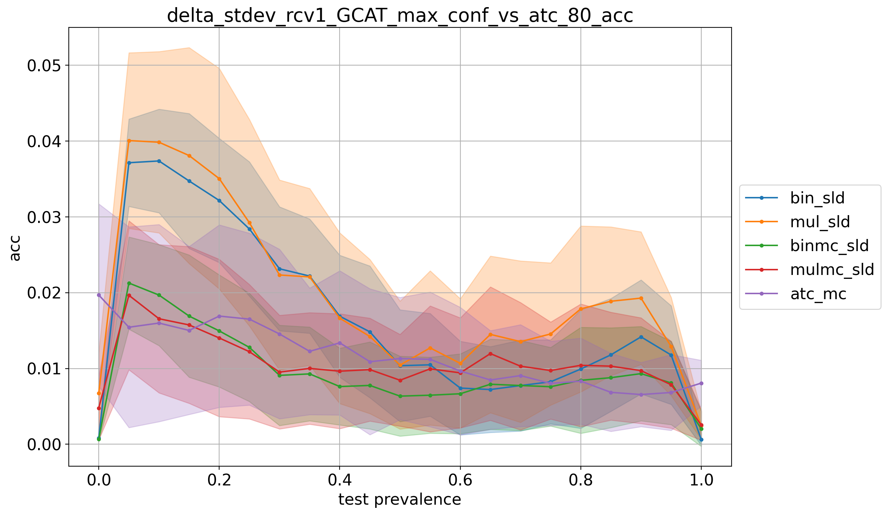
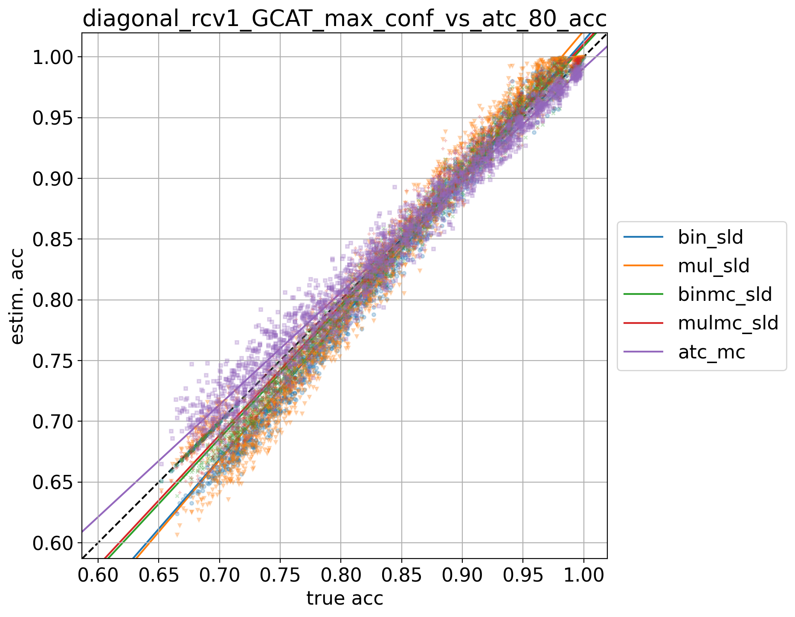
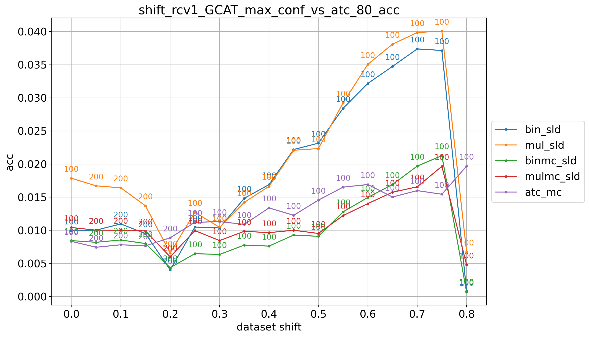

## 90% positives
> train: [0.09994835 0.90005165]  
> validation: [0.09994835 0.90005165]  
> mul_sld: 53.914s  
> mulmc_sld: 46.025s  
> mulne_sld: 45.194s  
> ref: 36.408s  
> atc_mc: 39.138s  
> tot: 55.916s  

<table border="1" class="dataframe">
  <thead>
    <tr style="text-align: right;">
      <th></th>
      <th>mul_sld</th>
      <th>mulmc_sld</th>
      <th>atc_mc</th>
    </tr>
  </thead>
  <tbody>
    <tr>
      <th>0.0</th>
      <td>0.0367</td>
      <td>0.0170</td>
      <td>0.0533</td>
    </tr>
    <tr>
      <th>0.05</th>
      <td>0.0369</td>
      <td>0.0485</td>
      <td>0.0503</td>
    </tr>
    <tr>
      <th>0.1</th>
      <td>0.0891</td>
      <td>0.0651</td>
      <td>0.0476</td>
    </tr>
    <tr>
      <th>0.15</th>
      <td>0.0973</td>
      <td>0.0652</td>
      <td>0.0449</td>
    </tr>
    <tr>
      <th>0.2</th>
      <td>0.0983</td>
      <td>0.0638</td>
      <td>0.0438</td>
    </tr>
    <tr>
      <th>0.25</th>
      <td>0.0941</td>
      <td>0.0590</td>
      <td>0.0410</td>
    </tr>
    <tr>
      <th>0.3</th>
      <td>0.0865</td>
      <td>0.0526</td>
      <td>0.0351</td>
    </tr>
    <tr>
      <th>0.35</th>
      <td>0.0855</td>
      <td>0.0524</td>
      <td>0.0321</td>
    </tr>
    <tr>
      <th>0.4</th>
      <td>0.0736</td>
      <td>0.0430</td>
      <td>0.0303</td>
    </tr>
    <tr>
      <th>0.45</th>
      <td>0.0691</td>
      <td>0.0410</td>
      <td>0.0252</td>
    </tr>
    <tr>
      <th>0.5</th>
      <td>0.0585</td>
      <td>0.0334</td>
      <td>0.0238</td>
    </tr>
    <tr>
      <th>0.55</th>
      <td>0.0535</td>
      <td>0.0313</td>
      <td>0.0204</td>
    </tr>
    <tr>
      <th>0.6</th>
      <td>0.0387</td>
      <td>0.0216</td>
      <td>0.0185</td>
    </tr>
    <tr>
      <th>0.65</th>
      <td>0.0313</td>
      <td>0.0179</td>
      <td>0.0163</td>
    </tr>
    <tr>
      <th>0.7</th>
      <td>0.0254</td>
      <td>0.0158</td>
      <td>0.0131</td>
    </tr>
    <tr>
      <th>0.75</th>
      <td>0.0164</td>
      <td>0.0111</td>
      <td>0.0102</td>
    </tr>
    <tr>
      <th>0.8</th>
      <td>0.0111</td>
      <td>0.0089</td>
      <td>0.0080</td>
    </tr>
    <tr>
      <th>0.85</th>
      <td>0.0098</td>
      <td>0.0079</td>
      <td>0.0061</td>
    </tr>
    <tr>
      <th>0.9</th>
      <td>0.0111</td>
      <td>0.0072</td>
      <td>0.0069</td>
    </tr>
    <tr>
      <th>0.95</th>
      <td>0.0129</td>
      <td>0.0064</td>
      <td>0.0077</td>
    </tr>
    <tr>
      <th>1.0</th>
      <td>0.0005</td>
      <td>0.0016</td>
      <td>0.0090</td>
    </tr>
    <tr>
      <th>avg</th>
      <td>0.0494</td>
      <td>0.0319</td>
      <td>0.0259</td>
    </tr>
  </tbody>
</table>

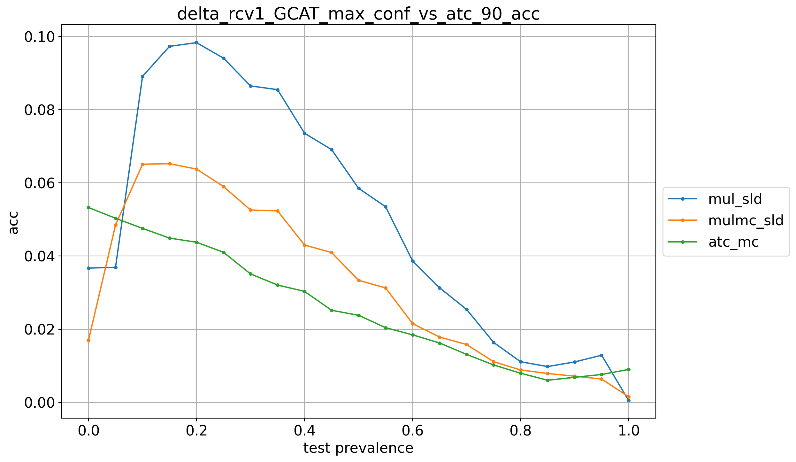
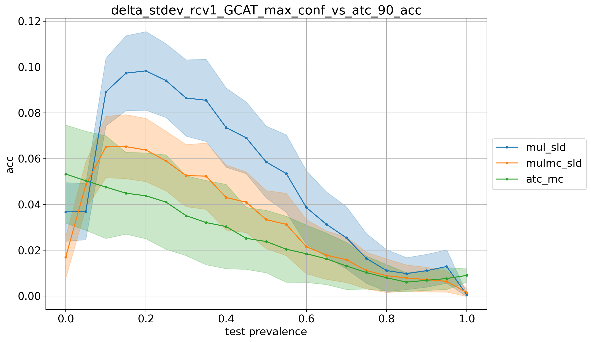
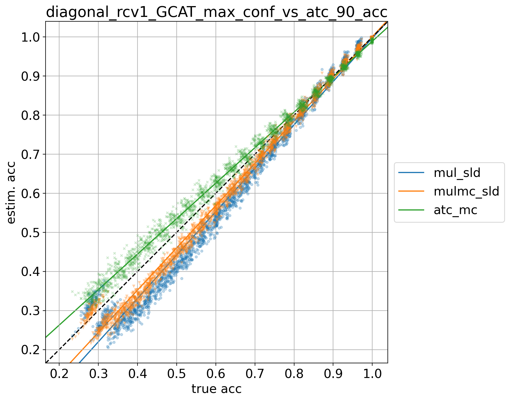
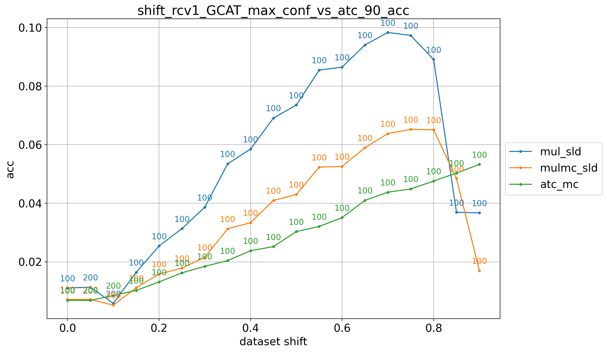

## avg
### avg on train
<table border="1" class="dataframe">
  <thead>
    <tr style="text-align: right;">
      <th></th>
      <th>bin_sld</th>
      <th>mul_sld</th>
      <th>binmc_sld</th>
      <th>mulmc_sld</th>
      <th>atc_mc</th>
    </tr>
  </thead>
  <tbody>
    <tr>
      <th>0.0</th>
      <td>0.0008</td>
      <td>0.0084</td>
      <td>0.0018</td>
      <td>0.0063</td>
      <td>0.0154</td>
    </tr>
    <tr>
      <th>0.05</th>
      <td>0.0172</td>
      <td>0.0161</td>
      <td>0.0105</td>
      <td>0.0141</td>
      <td>0.0147</td>
    </tr>
    <tr>
      <th>0.1</th>
      <td>0.0166</td>
      <td>0.0231</td>
      <td>0.0116</td>
      <td>0.0176</td>
      <td>0.0140</td>
    </tr>
    <tr>
      <th>0.15</th>
      <td>0.0172</td>
      <td>0.0269</td>
      <td>0.0129</td>
      <td>0.0195</td>
      <td>0.0145</td>
    </tr>
    <tr>
      <th>0.2</th>
      <td>0.0171</td>
      <td>0.0321</td>
      <td>0.0135</td>
      <td>0.0207</td>
      <td>0.0141</td>
    </tr>
    <tr>
      <th>0.25</th>
      <td>0.0180</td>
      <td>0.0358</td>
      <td>0.0148</td>
      <td>0.0228</td>
      <td>0.0146</td>
    </tr>
    <tr>
      <th>0.3</th>
      <td>0.0179</td>
      <td>0.0372</td>
      <td>0.0143</td>
      <td>0.0244</td>
      <td>0.0141</td>
    </tr>
    <tr>
      <th>0.35</th>
      <td>0.0194</td>
      <td>0.0414</td>
      <td>0.0157</td>
      <td>0.0283</td>
      <td>0.0140</td>
    </tr>
    <tr>
      <th>0.4</th>
      <td>0.0213</td>
      <td>0.0430</td>
      <td>0.0179</td>
      <td>0.0337</td>
      <td>0.0142</td>
    </tr>
    <tr>
      <th>0.45</th>
      <td>0.0227</td>
      <td>0.0458</td>
      <td>0.0190</td>
      <td>0.0373</td>
      <td>0.0140</td>
    </tr>
    <tr>
      <th>0.5</th>
      <td>0.0234</td>
      <td>0.0472</td>
      <td>0.0198</td>
      <td>0.0409</td>
      <td>0.0143</td>
    </tr>
    <tr>
      <th>0.55</th>
      <td>0.0248</td>
      <td>0.0496</td>
      <td>0.0203</td>
      <td>0.0443</td>
      <td>0.0149</td>
    </tr>
    <tr>
      <th>0.6</th>
      <td>0.0262</td>
      <td>0.0508</td>
      <td>0.0208</td>
      <td>0.0465</td>
      <td>0.0143</td>
    </tr>
    <tr>
      <th>0.65</th>
      <td>0.0276</td>
      <td>0.0527</td>
      <td>0.0217</td>
      <td>0.0488</td>
      <td>0.0148</td>
    </tr>
    <tr>
      <th>0.7</th>
      <td>0.0279</td>
      <td>0.0537</td>
      <td>0.0212</td>
      <td>0.0501</td>
      <td>0.0153</td>
    </tr>
    <tr>
      <th>0.75</th>
      <td>0.0291</td>
      <td>0.0535</td>
      <td>0.0225</td>
      <td>0.0509</td>
      <td>0.0157</td>
    </tr>
    <tr>
      <th>0.8</th>
      <td>0.0301</td>
      <td>0.0500</td>
      <td>0.0233</td>
      <td>0.0519</td>
      <td>0.0160</td>
    </tr>
    <tr>
      <th>0.85</th>
      <td>0.0317</td>
      <td>0.0438</td>
      <td>0.0238</td>
      <td>0.0523</td>
      <td>0.0159</td>
    </tr>
    <tr>
      <th>0.9</th>
      <td>0.0299</td>
      <td>0.0393</td>
      <td>0.0248</td>
      <td>0.0458</td>
      <td>0.0165</td>
    </tr>
    <tr>
      <th>0.95</th>
      <td>0.0256</td>
      <td>0.0380</td>
      <td>0.0245</td>
      <td>0.0375</td>
      <td>0.0178</td>
    </tr>
    <tr>
      <th>1.0</th>
      <td>0.0044</td>
      <td>0.0256</td>
      <td>0.0099</td>
      <td>0.0238</td>
      <td>0.0185</td>
    </tr>
    <tr>
      <th>avg</th>
      <td>0.0214</td>
      <td>0.0388</td>
      <td>0.0174</td>
      <td>0.0342</td>
      <td>0.0151</td>
    </tr>
  </tbody>
</table>

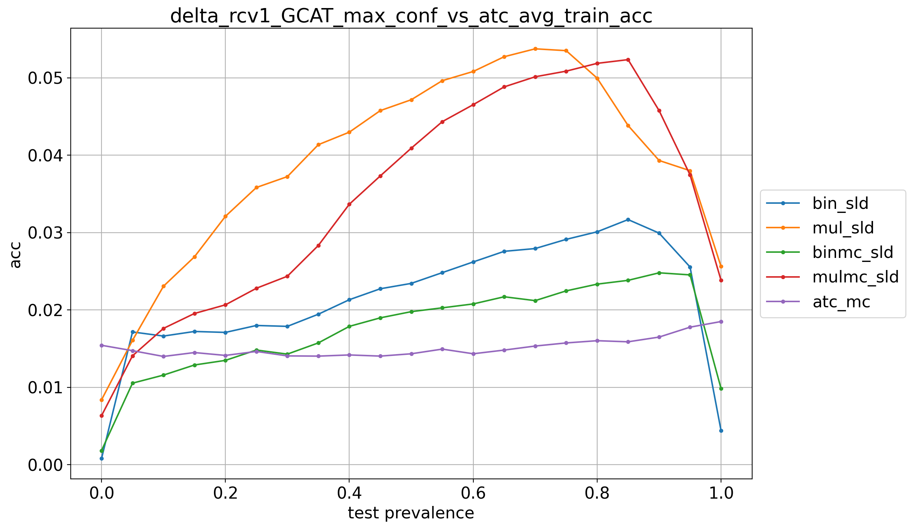
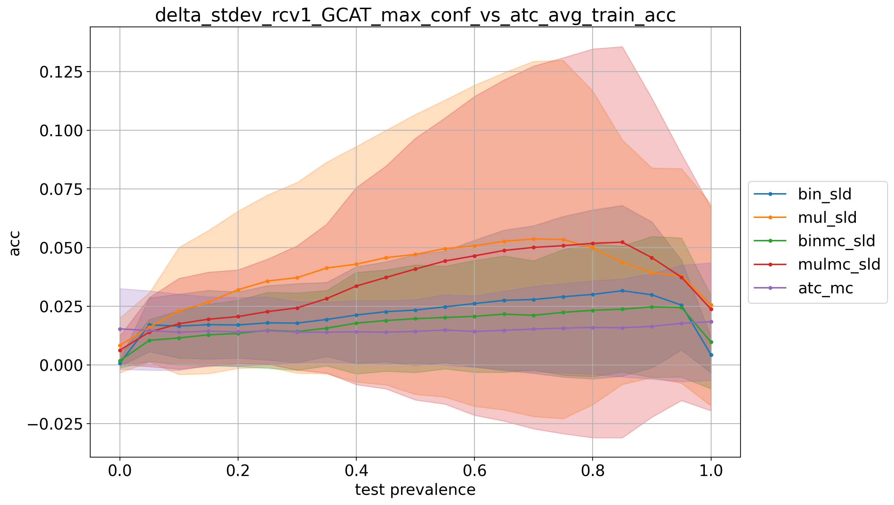
### avg on test
<table border="1" class="dataframe">
  <thead>
    <tr style="text-align: right;">
      <th></th>
      <th>bin_sld</th>
      <th>mul_sld</th>
      <th>binmc_sld</th>
      <th>mulmc_sld</th>
      <th>atc_mc</th>
    </tr>
  </thead>
  <tbody>
    <tr>
      <th>0.1</th>
      <td>0.0565</td>
      <td>0.1338</td>
      <td>0.0357</td>
      <td>0.1247</td>
      <td>0.0402</td>
    </tr>
    <tr>
      <th>0.2</th>
      <td>0.0255</td>
      <td>0.0628</td>
      <td>0.0368</td>
      <td>0.0792</td>
      <td>0.0111</td>
    </tr>
    <tr>
      <th>0.3</th>
      <td>0.0220</td>
      <td>0.0245</td>
      <td>0.0174</td>
      <td>0.0171</td>
      <td>0.0095</td>
    </tr>
    <tr>
      <th>0.4</th>
      <td>0.0125</td>
      <td>0.0139</td>
      <td>0.0100</td>
      <td>0.0106</td>
      <td>0.0081</td>
    </tr>
    <tr>
      <th>0.5</th>
      <td>0.0134</td>
      <td>0.0170</td>
      <td>0.0111</td>
      <td>0.0127</td>
      <td>0.0095</td>
    </tr>
    <tr>
      <th>0.6</th>
      <td>0.0127</td>
      <td>0.0159</td>
      <td>0.0101</td>
      <td>0.0119</td>
      <td>0.0111</td>
    </tr>
    <tr>
      <th>0.7</th>
      <td>0.0119</td>
      <td>0.0120</td>
      <td>0.0083</td>
      <td>0.0087</td>
      <td>0.0093</td>
    </tr>
    <tr>
      <th>0.8</th>
      <td>0.0165</td>
      <td>0.0196</td>
      <td>0.0095</td>
      <td>0.0106</td>
      <td>0.0117</td>
    </tr>
    <tr>
      <th>0.9</th>
      <td>NaN</td>
      <td>0.0494</td>
      <td>NaN</td>
      <td>0.0319</td>
      <td>0.0259</td>
    </tr>
    <tr>
      <th>avg</th>
      <td>0.0214</td>
      <td>0.0388</td>
      <td>0.0174</td>
      <td>0.0342</td>
      <td>0.0151</td>
    </tr>
  </tbody>
</table>

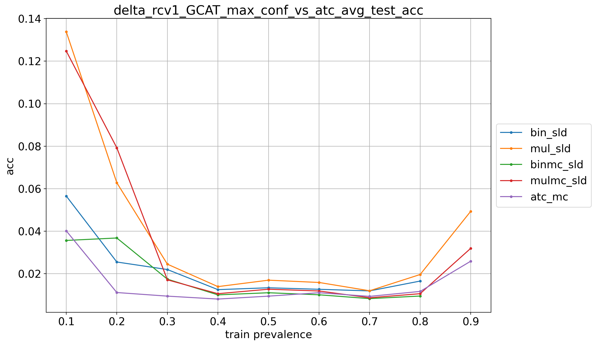
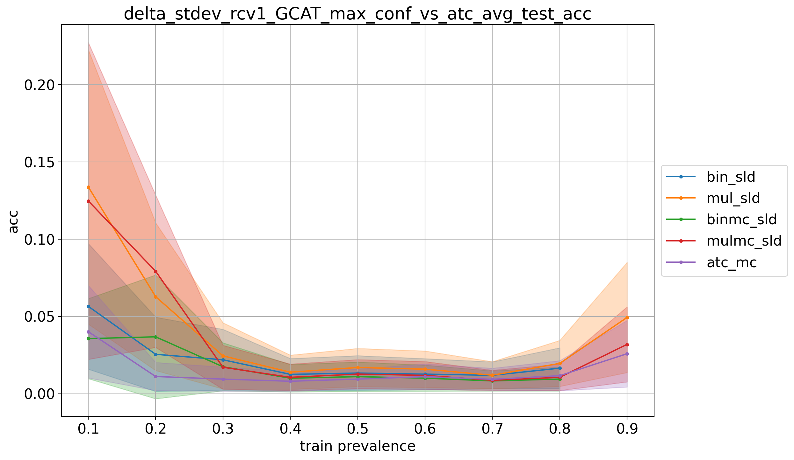
### avg dataset shift
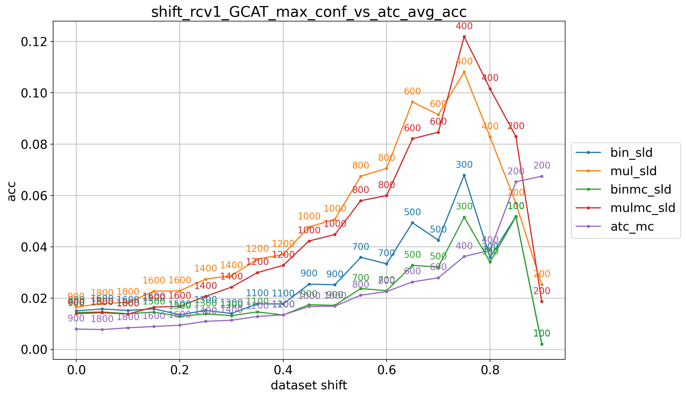
