# rcv1_GCAT_9prevs

## 10% positives
> train: [0.90005165 0.09994835]  
> validation: [0.90005165 0.09994835]  
> bin_sld: 203.037s  
> mul_sld: 73.117s  
> binmc_sld: 203.298s  
> mulmc_sld: 72.193s  
> binne_sld: 202.750s  
> mulne_sld: 66.052s  
> ref: 42.077s  
> atc_mc: 45.501s  
> tot: 210.220s  

<table border="1" class="dataframe">
  <thead>
    <tr style="text-align: right;">
      <th></th>
      <th>binmc_sld</th>
      <th>mulmc_sld</th>
      <th>binne_sld</th>
      <th>mulne_sld</th>
      <th>atc_mc</th>
    </tr>
  </thead>
  <tbody>
    <tr>
      <th>0.0</th>
      <td>0.0517</td>
      <td>0.0421</td>
      <td>0.1046</td>
      <td>0.0436</td>
      <td>0.0062</td>
    </tr>
    <tr>
      <th>0.05</th>
      <td>0.1077</td>
      <td>0.0700</td>
      <td>0.0633</td>
      <td>0.0724</td>
      <td>0.3429</td>
    </tr>
    <tr>
      <th>0.1</th>
      <td>0.0874</td>
      <td>0.0575</td>
      <td>0.0266</td>
      <td>0.0601</td>
      <td>0.3260</td>
    </tr>
    <tr>
      <th>0.15</th>
      <td>0.0651</td>
      <td>0.0599</td>
      <td>0.0223</td>
      <td>0.0603</td>
      <td>0.3360</td>
    </tr>
    <tr>
      <th>0.2</th>
      <td>0.0570</td>
      <td>0.0608</td>
      <td>0.0231</td>
      <td>0.0677</td>
      <td>0.3402</td>
    </tr>
    <tr>
      <th>0.25</th>
      <td>0.0513</td>
      <td>0.0796</td>
      <td>0.0251</td>
      <td>0.0669</td>
      <td>0.3351</td>
    </tr>
    <tr>
      <th>0.3</th>
      <td>0.0388</td>
      <td>0.1079</td>
      <td>0.0258</td>
      <td>0.0743</td>
      <td>0.3371</td>
    </tr>
    <tr>
      <th>0.35</th>
      <td>0.0268</td>
      <td>0.1330</td>
      <td>0.0253</td>
      <td>0.0947</td>
      <td>0.3313</td>
    </tr>
    <tr>
      <th>0.4</th>
      <td>0.0316</td>
      <td>0.1944</td>
      <td>0.0261</td>
      <td>0.1278</td>
      <td>0.3378</td>
    </tr>
    <tr>
      <th>0.45</th>
      <td>0.0326</td>
      <td>0.2072</td>
      <td>0.0258</td>
      <td>0.1378</td>
      <td>0.3337</td>
    </tr>
    <tr>
      <th>0.5</th>
      <td>0.0348</td>
      <td>0.2305</td>
      <td>0.0270</td>
      <td>0.1798</td>
      <td>0.3346</td>
    </tr>
    <tr>
      <th>0.55</th>
      <td>0.0259</td>
      <td>0.2402</td>
      <td>0.0257</td>
      <td>0.1629</td>
      <td>0.3327</td>
    </tr>
    <tr>
      <th>0.6</th>
      <td>0.0349</td>
      <td>0.2483</td>
      <td>0.0267</td>
      <td>0.1792</td>
      <td>0.3406</td>
    </tr>
    <tr>
      <th>0.65</th>
      <td>0.0282</td>
      <td>0.2437</td>
      <td>0.0266</td>
      <td>0.1779</td>
      <td>0.3326</td>
    </tr>
    <tr>
      <th>0.7</th>
      <td>0.0282</td>
      <td>0.2406</td>
      <td>0.0260</td>
      <td>0.1874</td>
      <td>0.3335</td>
    </tr>
    <tr>
      <th>0.75</th>
      <td>0.0280</td>
      <td>0.2342</td>
      <td>0.0250</td>
      <td>0.1843</td>
      <td>0.3359</td>
    </tr>
    <tr>
      <th>0.8</th>
      <td>0.0286</td>
      <td>0.2255</td>
      <td>0.0249</td>
      <td>0.1575</td>
      <td>0.3324</td>
    </tr>
    <tr>
      <th>0.85</th>
      <td>0.0288</td>
      <td>0.2165</td>
      <td>0.0242</td>
      <td>0.1478</td>
      <td>0.3378</td>
    </tr>
    <tr>
      <th>0.9</th>
      <td>0.0277</td>
      <td>0.1697</td>
      <td>0.0222</td>
      <td>0.0935</td>
      <td>0.3373</td>
    </tr>
    <tr>
      <th>0.95</th>
      <td>0.0198</td>
      <td>0.1061</td>
      <td>0.0188</td>
      <td>0.0555</td>
      <td>0.3323</td>
    </tr>
    <tr>
      <th>1.0</th>
      <td>0.0026</td>
      <td>0.0252</td>
      <td>0.0025</td>
      <td>0.0179</td>
      <td>0.3353</td>
    </tr>
    <tr>
      <th>avg</th>
      <td>0.0399</td>
      <td>0.1520</td>
      <td>0.0294</td>
      <td>0.1119</td>
      <td>0.3196</td>
    </tr>
  </tbody>
</table>

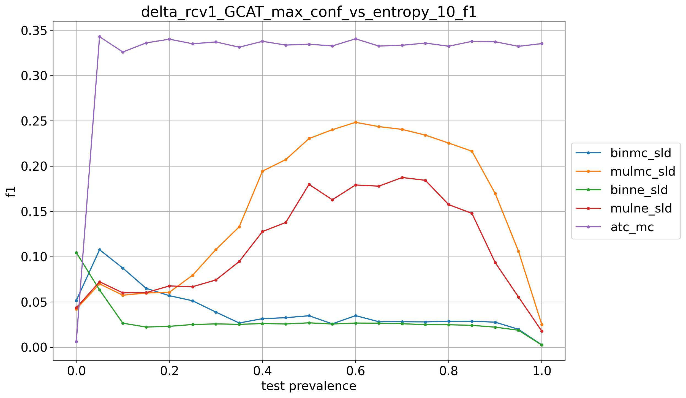
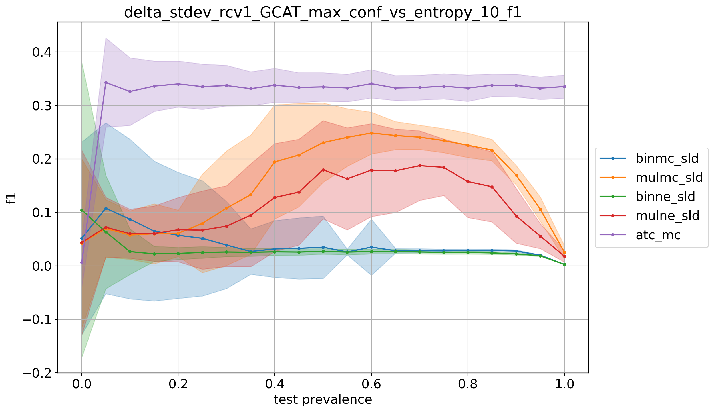
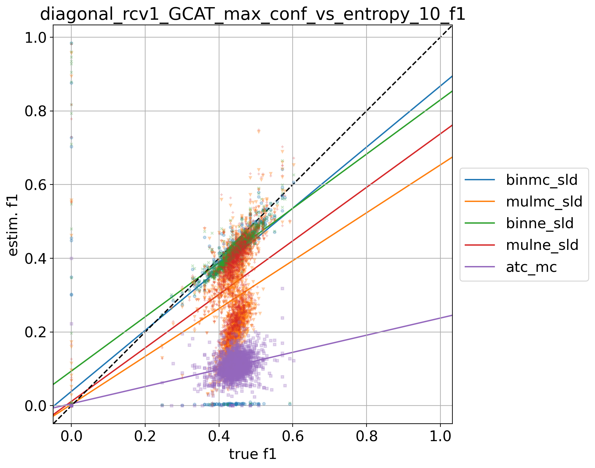
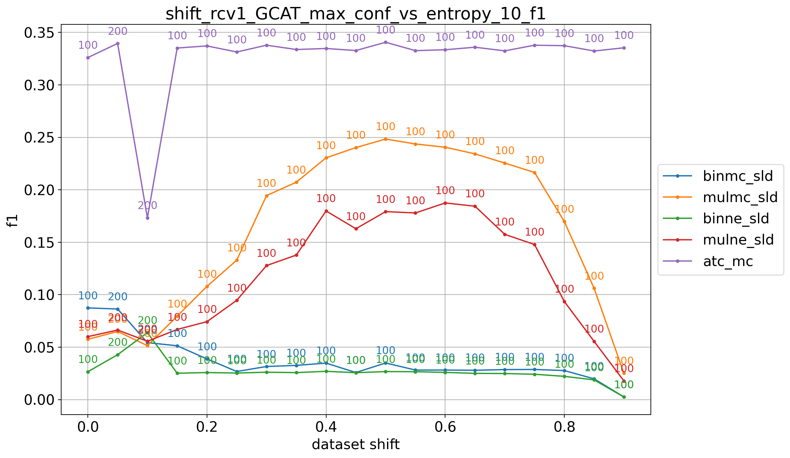

## 20% positives
> train: [0.79984504 0.20015496]  
> validation: [0.80010331 0.19989669]  
> bin_sld: 217.889s  
> mul_sld: 74.904s  
> binmc_sld: 220.775s  
> mulmc_sld: 80.875s  
> binne_sld: 219.751s  
> mulne_sld: 76.270s  
> bin_pacc: 209.775s  
> mul_pacc: 54.926s  
> ref: 46.602s  
> atc_mc: 50.329s  
> tot: 224.927s  

<table border="1" class="dataframe">
  <thead>
    <tr style="text-align: right;">
      <th></th>
      <th>binmc_sld</th>
      <th>mulmc_sld</th>
      <th>binne_sld</th>
      <th>mulne_sld</th>
      <th>atc_mc</th>
    </tr>
  </thead>
  <tbody>
    <tr>
      <th>0.0</th>
      <td>0.0099</td>
      <td>0.0374</td>
      <td>0.0039</td>
      <td>0.1201</td>
      <td>0.1580</td>
    </tr>
    <tr>
      <th>0.05</th>
      <td>0.2696</td>
      <td>0.1658</td>
      <td>0.2961</td>
      <td>0.1377</td>
      <td>0.1115</td>
    </tr>
    <tr>
      <th>0.1</th>
      <td>0.2013</td>
      <td>0.1490</td>
      <td>0.2190</td>
      <td>0.1233</td>
      <td>0.0899</td>
    </tr>
    <tr>
      <th>0.15</th>
      <td>0.1333</td>
      <td>0.1405</td>
      <td>0.1215</td>
      <td>0.1226</td>
      <td>0.0782</td>
    </tr>
    <tr>
      <th>0.2</th>
      <td>0.1074</td>
      <td>0.1389</td>
      <td>0.1011</td>
      <td>0.1199</td>
      <td>0.0673</td>
    </tr>
    <tr>
      <th>0.25</th>
      <td>0.0939</td>
      <td>0.1351</td>
      <td>0.0821</td>
      <td>0.1243</td>
      <td>0.0637</td>
    </tr>
    <tr>
      <th>0.3</th>
      <td>0.0686</td>
      <td>0.1286</td>
      <td>0.0548</td>
      <td>0.1196</td>
      <td>0.0612</td>
    </tr>
    <tr>
      <th>0.35</th>
      <td>0.0647</td>
      <td>0.1296</td>
      <td>0.0430</td>
      <td>0.1211</td>
      <td>0.0553</td>
    </tr>
    <tr>
      <th>0.4</th>
      <td>0.0788</td>
      <td>0.1373</td>
      <td>0.0601</td>
      <td>0.1291</td>
      <td>0.0605</td>
    </tr>
    <tr>
      <th>0.45</th>
      <td>0.0672</td>
      <td>0.1360</td>
      <td>0.0470</td>
      <td>0.1293</td>
      <td>0.0589</td>
    </tr>
    <tr>
      <th>0.5</th>
      <td>0.0627</td>
      <td>0.1373</td>
      <td>0.0449</td>
      <td>0.1309</td>
      <td>0.0587</td>
    </tr>
    <tr>
      <th>0.55</th>
      <td>0.0536</td>
      <td>0.1311</td>
      <td>0.0311</td>
      <td>0.1270</td>
      <td>0.0550</td>
    </tr>
    <tr>
      <th>0.6</th>
      <td>0.0427</td>
      <td>0.1300</td>
      <td>0.0292</td>
      <td>0.1266</td>
      <td>0.0526</td>
    </tr>
    <tr>
      <th>0.65</th>
      <td>0.0465</td>
      <td>0.1313</td>
      <td>0.0304</td>
      <td>0.1279</td>
      <td>0.0541</td>
    </tr>
    <tr>
      <th>0.7</th>
      <td>0.0382</td>
      <td>0.1304</td>
      <td>0.0198</td>
      <td>0.1284</td>
      <td>0.0511</td>
    </tr>
    <tr>
      <th>0.75</th>
      <td>0.0445</td>
      <td>0.1273</td>
      <td>0.0243</td>
      <td>0.1248</td>
      <td>0.0521</td>
    </tr>
    <tr>
      <th>0.8</th>
      <td>0.0422</td>
      <td>0.1234</td>
      <td>0.0208</td>
      <td>0.1225</td>
      <td>0.0526</td>
    </tr>
    <tr>
      <th>0.85</th>
      <td>0.0344</td>
      <td>0.1189</td>
      <td>0.0177</td>
      <td>0.1185</td>
      <td>0.0488</td>
    </tr>
    <tr>
      <th>0.9</th>
      <td>0.0401</td>
      <td>0.1168</td>
      <td>0.0182</td>
      <td>0.1169</td>
      <td>0.0503</td>
    </tr>
    <tr>
      <th>0.95</th>
      <td>0.0433</td>
      <td>0.1139</td>
      <td>0.0203</td>
      <td>0.1166</td>
      <td>0.0518</td>
    </tr>
    <tr>
      <th>1.0</th>
      <td>0.0228</td>
      <td>0.1087</td>
      <td>0.0065</td>
      <td>0.1050</td>
      <td>0.0495</td>
    </tr>
    <tr>
      <th>avg</th>
      <td>0.0746</td>
      <td>0.1270</td>
      <td>0.0615</td>
      <td>0.1234</td>
      <td>0.0658</td>
    </tr>
  </tbody>
</table>

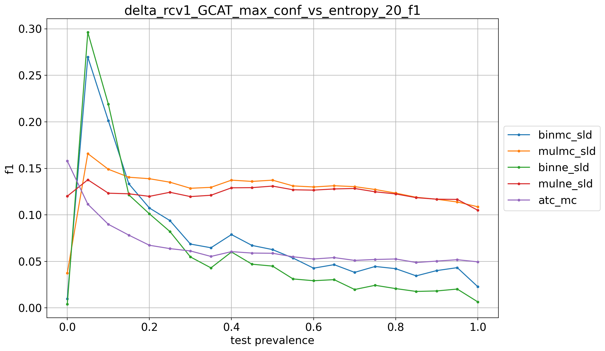
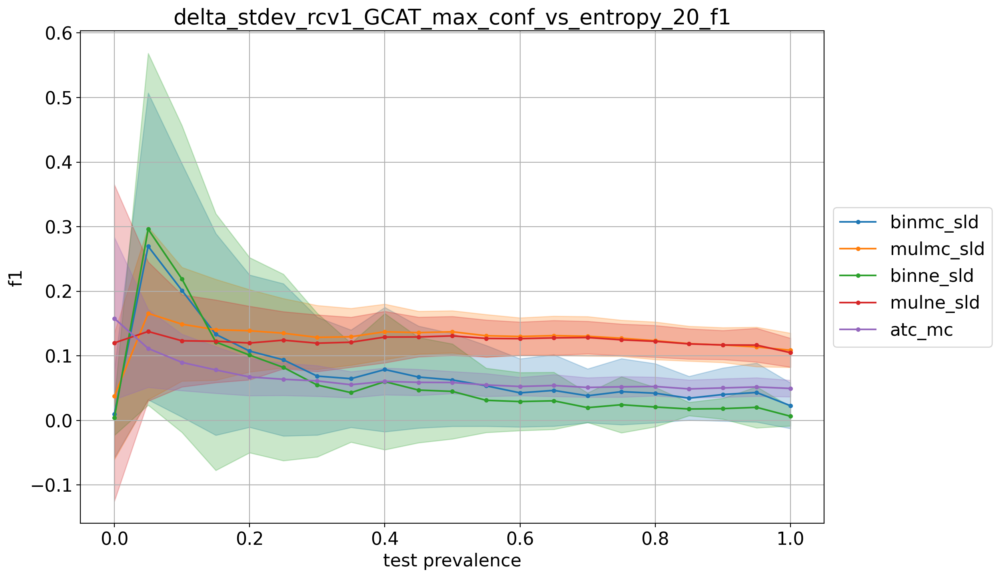
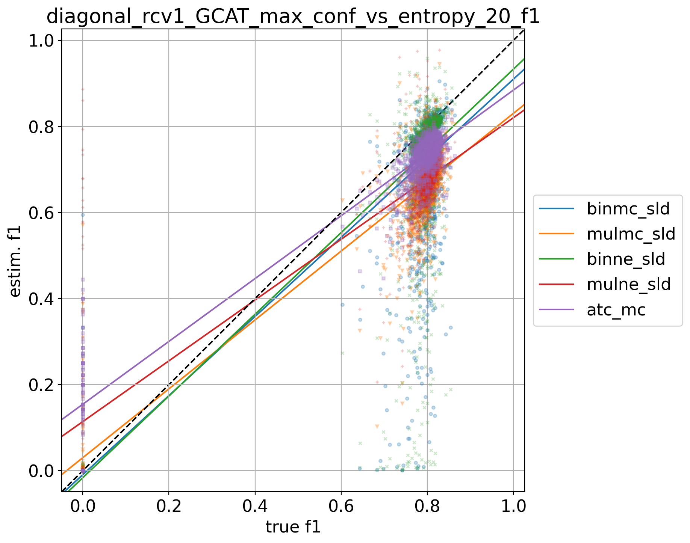
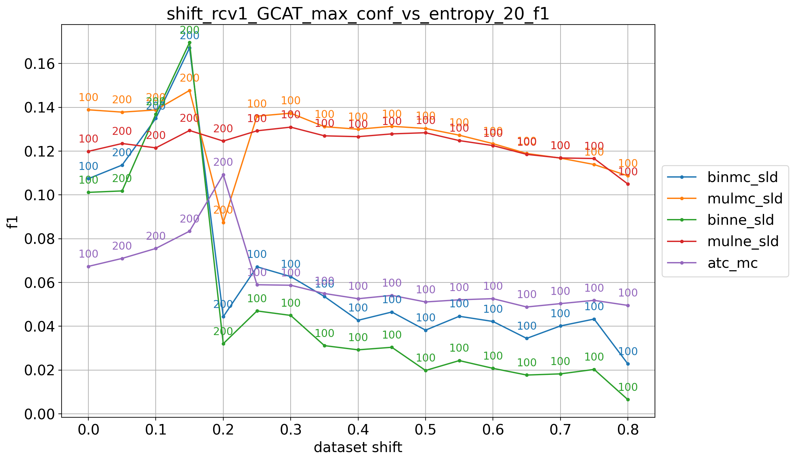

## 30% positives
> train: [0.69989669 0.30010331]  
> validation: [0.70015496 0.29984504]  
> bin_sld: 215.816s  
> mul_sld: 70.089s  
> binmc_sld: 213.798s  
> mulmc_sld: 67.714s  
> binne_sld: 215.552s  
> mulne_sld: 68.181s  
> bin_pacc: 208.609s  
> mul_pacc: 55.495s  
> ref: 46.494s  
> atc_mc: 50.590s  
> tot: 220.459s  

<table border="1" class="dataframe">
  <thead>
    <tr style="text-align: right;">
      <th></th>
      <th>binmc_sld</th>
      <th>mulmc_sld</th>
      <th>binne_sld</th>
      <th>mulne_sld</th>
      <th>atc_mc</th>
    </tr>
  </thead>
  <tbody>
    <tr>
      <th>0.0</th>
      <td>0.0010</td>
      <td>0.0161</td>
      <td>0.0002</td>
      <td>0.0267</td>
      <td>0.3913</td>
    </tr>
    <tr>
      <th>0.05</th>
      <td>0.1505</td>
      <td>0.1010</td>
      <td>0.2145</td>
      <td>0.0931</td>
      <td>0.0484</td>
    </tr>
    <tr>
      <th>0.1</th>
      <td>0.0731</td>
      <td>0.0592</td>
      <td>0.0999</td>
      <td>0.0598</td>
      <td>0.0293</td>
    </tr>
    <tr>
      <th>0.15</th>
      <td>0.0658</td>
      <td>0.0555</td>
      <td>0.0816</td>
      <td>0.0510</td>
      <td>0.0291</td>
    </tr>
    <tr>
      <th>0.2</th>
      <td>0.0455</td>
      <td>0.0424</td>
      <td>0.0572</td>
      <td>0.0420</td>
      <td>0.0239</td>
    </tr>
    <tr>
      <th>0.25</th>
      <td>0.0372</td>
      <td>0.0366</td>
      <td>0.0456</td>
      <td>0.0358</td>
      <td>0.0193</td>
    </tr>
    <tr>
      <th>0.3</th>
      <td>0.0329</td>
      <td>0.0324</td>
      <td>0.0387</td>
      <td>0.0332</td>
      <td>0.0189</td>
    </tr>
    <tr>
      <th>0.35</th>
      <td>0.0270</td>
      <td>0.0289</td>
      <td>0.0326</td>
      <td>0.0311</td>
      <td>0.0161</td>
    </tr>
    <tr>
      <th>0.4</th>
      <td>0.0263</td>
      <td>0.0286</td>
      <td>0.0311</td>
      <td>0.0328</td>
      <td>0.0145</td>
    </tr>
    <tr>
      <th>0.45</th>
      <td>0.0242</td>
      <td>0.0273</td>
      <td>0.0288</td>
      <td>0.0324</td>
      <td>0.0131</td>
    </tr>
    <tr>
      <th>0.5</th>
      <td>0.0190</td>
      <td>0.0225</td>
      <td>0.0221</td>
      <td>0.0286</td>
      <td>0.0110</td>
    </tr>
    <tr>
      <th>0.55</th>
      <td>0.0199</td>
      <td>0.0223</td>
      <td>0.0226</td>
      <td>0.0292</td>
      <td>0.0115</td>
    </tr>
    <tr>
      <th>0.6</th>
      <td>0.0196</td>
      <td>0.0231</td>
      <td>0.0226</td>
      <td>0.0310</td>
      <td>0.0109</td>
    </tr>
    <tr>
      <th>0.65</th>
      <td>0.0193</td>
      <td>0.0212</td>
      <td>0.0223</td>
      <td>0.0297</td>
      <td>0.0113</td>
    </tr>
    <tr>
      <th>0.7</th>
      <td>0.0163</td>
      <td>0.0195</td>
      <td>0.0183</td>
      <td>0.0289</td>
      <td>0.0088</td>
    </tr>
    <tr>
      <th>0.75</th>
      <td>0.0153</td>
      <td>0.0168</td>
      <td>0.0173</td>
      <td>0.0252</td>
      <td>0.0093</td>
    </tr>
    <tr>
      <th>0.8</th>
      <td>0.0164</td>
      <td>0.0161</td>
      <td>0.0180</td>
      <td>0.0253</td>
      <td>0.0089</td>
    </tr>
    <tr>
      <th>0.85</th>
      <td>0.0151</td>
      <td>0.0153</td>
      <td>0.0157</td>
      <td>0.0234</td>
      <td>0.0087</td>
    </tr>
    <tr>
      <th>0.9</th>
      <td>0.0139</td>
      <td>0.0145</td>
      <td>0.0144</td>
      <td>0.0227</td>
      <td>0.0083</td>
    </tr>
    <tr>
      <th>0.95</th>
      <td>0.0182</td>
      <td>0.0177</td>
      <td>0.0177</td>
      <td>0.0258</td>
      <td>0.0086</td>
    </tr>
    <tr>
      <th>1.0</th>
      <td>0.0115</td>
      <td>0.0150</td>
      <td>0.0101</td>
      <td>0.0222</td>
      <td>0.0073</td>
    </tr>
    <tr>
      <th>avg</th>
      <td>0.0318</td>
      <td>0.0301</td>
      <td>0.0396</td>
      <td>0.0347</td>
      <td>0.0337</td>
    </tr>
  </tbody>
</table>

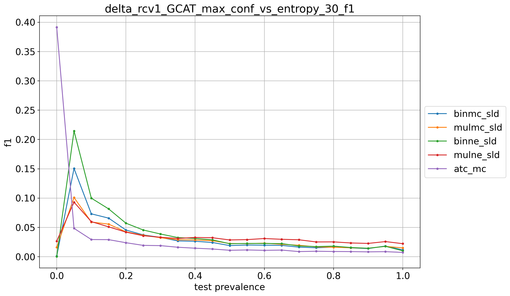

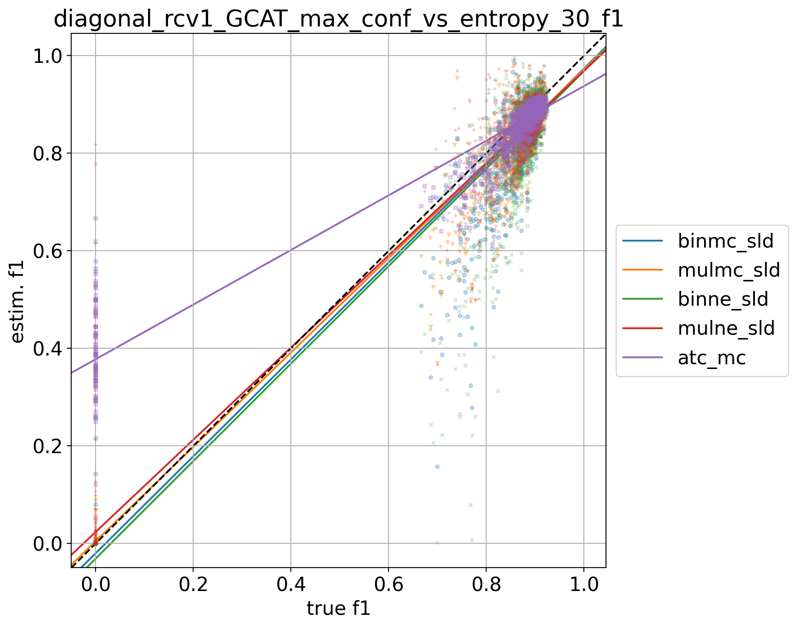
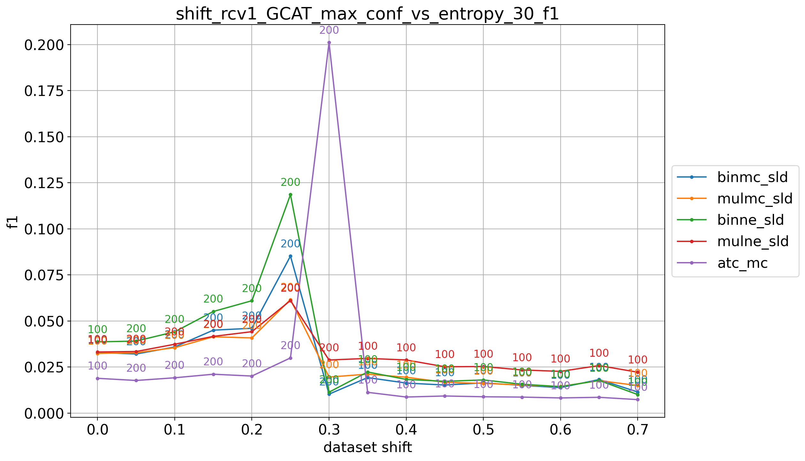

## 40% positives
> train: [0.59994835 0.40005165]  
> validation: [0.59994835 0.40005165]  
> bin_sld: 213.272s  
> mul_sld: 64.236s  
> binmc_sld: 213.186s  
> mulmc_sld: 63.510s  
> binne_sld: 213.277s  
> mulne_sld: 62.919s  
> bin_pacc: 208.657s  
> mul_pacc: 55.226s  
> ref: 46.375s  
> atc_mc: 50.706s  
> tot: 218.174s  

<table border="1" class="dataframe">
  <thead>
    <tr style="text-align: right;">
      <th></th>
      <th>binmc_sld</th>
      <th>mulmc_sld</th>
      <th>binne_sld</th>
      <th>mulne_sld</th>
      <th>atc_mc</th>
    </tr>
  </thead>
  <tbody>
    <tr>
      <th>0.0</th>
      <td>0.0002</td>
      <td>0.0044</td>
      <td>0.0001</td>
      <td>0.0045</td>
      <td>0.5122</td>
    </tr>
    <tr>
      <th>0.05</th>
      <td>0.0778</td>
      <td>0.0586</td>
      <td>0.1174</td>
      <td>0.0617</td>
      <td>0.0575</td>
    </tr>
    <tr>
      <th>0.1</th>
      <td>0.0339</td>
      <td>0.0385</td>
      <td>0.0461</td>
      <td>0.0443</td>
      <td>0.0264</td>
    </tr>
    <tr>
      <th>0.15</th>
      <td>0.0312</td>
      <td>0.0313</td>
      <td>0.0361</td>
      <td>0.0337</td>
      <td>0.0185</td>
    </tr>
    <tr>
      <th>0.2</th>
      <td>0.0268</td>
      <td>0.0266</td>
      <td>0.0305</td>
      <td>0.0320</td>
      <td>0.0141</td>
    </tr>
    <tr>
      <th>0.25</th>
      <td>0.0228</td>
      <td>0.0222</td>
      <td>0.0265</td>
      <td>0.0274</td>
      <td>0.0145</td>
    </tr>
    <tr>
      <th>0.3</th>
      <td>0.0207</td>
      <td>0.0195</td>
      <td>0.0246</td>
      <td>0.0233</td>
      <td>0.0119</td>
    </tr>
    <tr>
      <th>0.35</th>
      <td>0.0187</td>
      <td>0.0184</td>
      <td>0.0230</td>
      <td>0.0229</td>
      <td>0.0098</td>
    </tr>
    <tr>
      <th>0.4</th>
      <td>0.0157</td>
      <td>0.0149</td>
      <td>0.0187</td>
      <td>0.0181</td>
      <td>0.0093</td>
    </tr>
    <tr>
      <th>0.45</th>
      <td>0.0155</td>
      <td>0.0158</td>
      <td>0.0186</td>
      <td>0.0187</td>
      <td>0.0074</td>
    </tr>
    <tr>
      <th>0.5</th>
      <td>0.0141</td>
      <td>0.0149</td>
      <td>0.0160</td>
      <td>0.0170</td>
      <td>0.0071</td>
    </tr>
    <tr>
      <th>0.55</th>
      <td>0.0136</td>
      <td>0.0144</td>
      <td>0.0156</td>
      <td>0.0161</td>
      <td>0.0076</td>
    </tr>
    <tr>
      <th>0.6</th>
      <td>0.0108</td>
      <td>0.0112</td>
      <td>0.0119</td>
      <td>0.0126</td>
      <td>0.0067</td>
    </tr>
    <tr>
      <th>0.65</th>
      <td>0.0089</td>
      <td>0.0101</td>
      <td>0.0094</td>
      <td>0.0109</td>
      <td>0.0059</td>
    </tr>
    <tr>
      <th>0.7</th>
      <td>0.0083</td>
      <td>0.0088</td>
      <td>0.0089</td>
      <td>0.0095</td>
      <td>0.0057</td>
    </tr>
    <tr>
      <th>0.75</th>
      <td>0.0064</td>
      <td>0.0081</td>
      <td>0.0064</td>
      <td>0.0082</td>
      <td>0.0063</td>
    </tr>
    <tr>
      <th>0.8</th>
      <td>0.0055</td>
      <td>0.0069</td>
      <td>0.0056</td>
      <td>0.0069</td>
      <td>0.0053</td>
    </tr>
    <tr>
      <th>0.85</th>
      <td>0.0064</td>
      <td>0.0065</td>
      <td>0.0070</td>
      <td>0.0070</td>
      <td>0.0055</td>
    </tr>
    <tr>
      <th>0.9</th>
      <td>0.0059</td>
      <td>0.0054</td>
      <td>0.0065</td>
      <td>0.0059</td>
      <td>0.0050</td>
    </tr>
    <tr>
      <th>0.95</th>
      <td>0.0068</td>
      <td>0.0050</td>
      <td>0.0077</td>
      <td>0.0057</td>
      <td>0.0049</td>
    </tr>
    <tr>
      <th>1.0</th>
      <td>0.0034</td>
      <td>0.0038</td>
      <td>0.0029</td>
      <td>0.0047</td>
      <td>0.0054</td>
    </tr>
    <tr>
      <th>avg</th>
      <td>0.0168</td>
      <td>0.0164</td>
      <td>0.0209</td>
      <td>0.0186</td>
      <td>0.0356</td>
    </tr>
  </tbody>
</table>

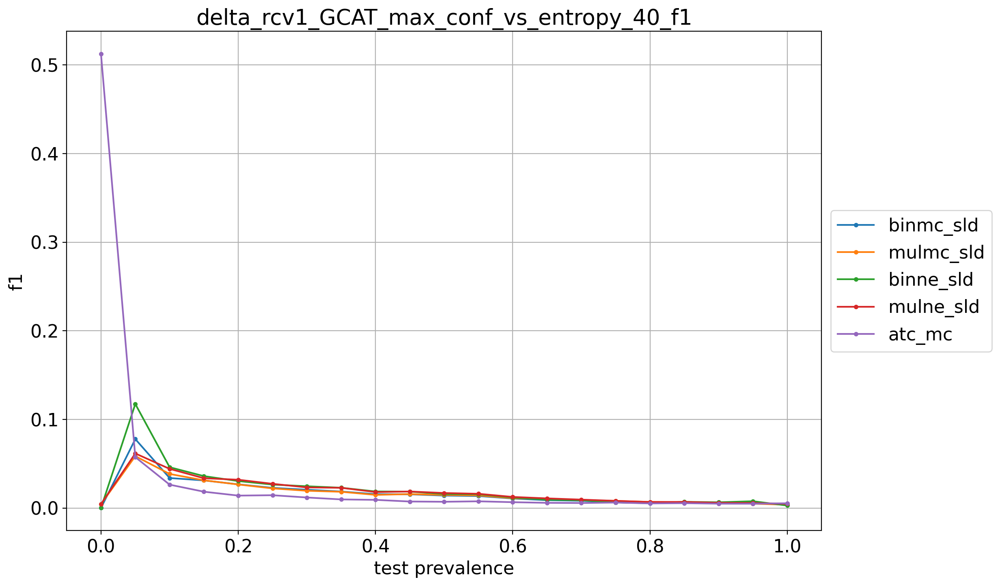
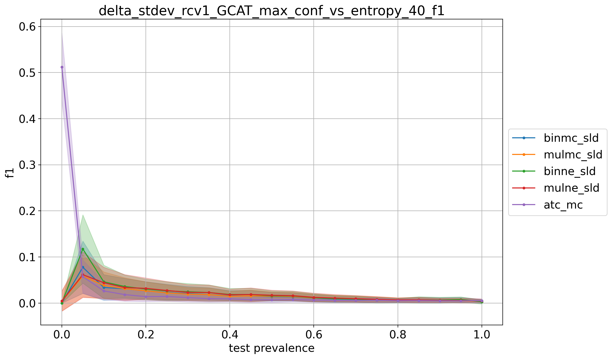
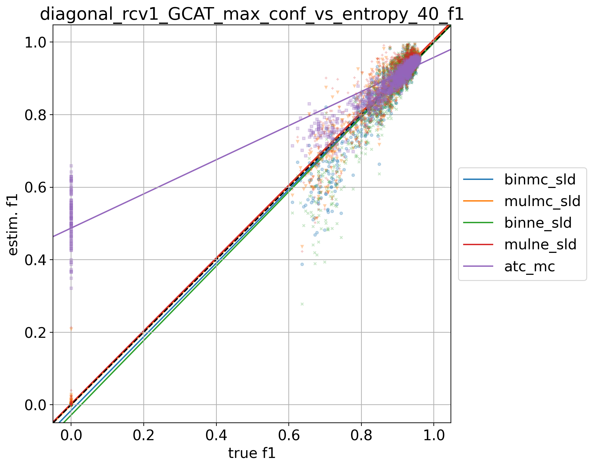
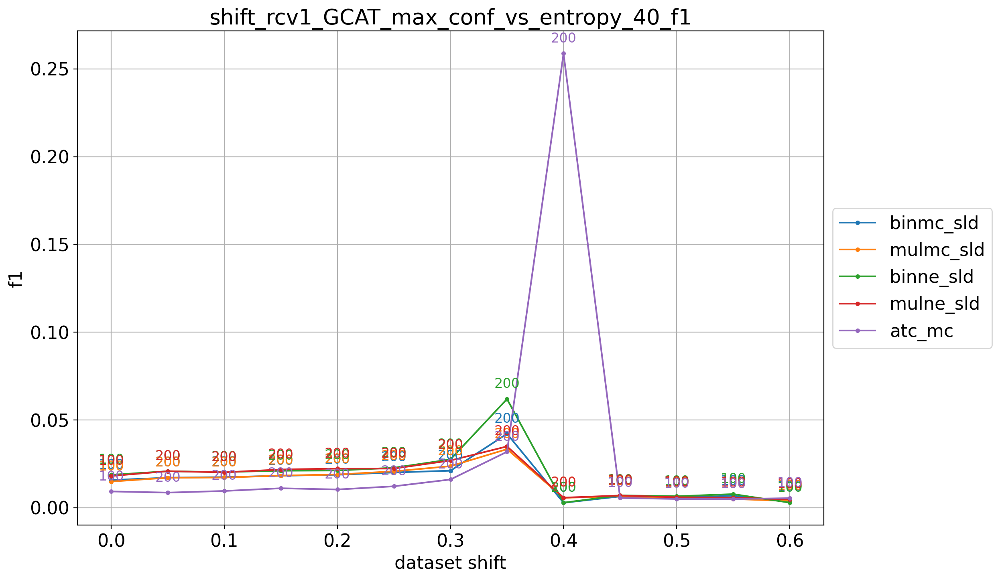

## 50% positives
> train: [0.5 0.5]  
> validation: [0.5 0.5]  
> bin_sld: 213.794s  
> mul_sld: 63.132s  
> binmc_sld: 212.621s  
> mulmc_sld: 62.747s  
> binne_sld: 213.874s  
> mulne_sld: 62.130s  
> bin_pacc: 207.785s  
> mul_pacc: 55.973s  
> ref: 46.679s  
> atc_mc: 50.991s  
> tot: 218.726s  

<table border="1" class="dataframe">
  <thead>
    <tr style="text-align: right;">
      <th></th>
      <th>binmc_sld</th>
      <th>mulmc_sld</th>
      <th>binne_sld</th>
      <th>mulne_sld</th>
      <th>atc_mc</th>
    </tr>
  </thead>
  <tbody>
    <tr>
      <th>0.0</th>
      <td>0.0003</td>
      <td>0.0107</td>
      <td>0.0002</td>
      <td>0.0062</td>
      <td>0.5861</td>
    </tr>
    <tr>
      <th>0.05</th>
      <td>0.0553</td>
      <td>0.0604</td>
      <td>0.0906</td>
      <td>0.0567</td>
      <td>0.1441</td>
    </tr>
    <tr>
      <th>0.1</th>
      <td>0.0252</td>
      <td>0.0510</td>
      <td>0.0392</td>
      <td>0.0497</td>
      <td>0.0650</td>
    </tr>
    <tr>
      <th>0.15</th>
      <td>0.0251</td>
      <td>0.0376</td>
      <td>0.0330</td>
      <td>0.0390</td>
      <td>0.0438</td>
    </tr>
    <tr>
      <th>0.2</th>
      <td>0.0199</td>
      <td>0.0313</td>
      <td>0.0211</td>
      <td>0.0352</td>
      <td>0.0258</td>
    </tr>
    <tr>
      <th>0.25</th>
      <td>0.0195</td>
      <td>0.0287</td>
      <td>0.0193</td>
      <td>0.0333</td>
      <td>0.0206</td>
    </tr>
    <tr>
      <th>0.3</th>
      <td>0.0180</td>
      <td>0.0222</td>
      <td>0.0186</td>
      <td>0.0278</td>
      <td>0.0140</td>
    </tr>
    <tr>
      <th>0.35</th>
      <td>0.0205</td>
      <td>0.0232</td>
      <td>0.0221</td>
      <td>0.0288</td>
      <td>0.0145</td>
    </tr>
    <tr>
      <th>0.4</th>
      <td>0.0187</td>
      <td>0.0191</td>
      <td>0.0217</td>
      <td>0.0243</td>
      <td>0.0118</td>
    </tr>
    <tr>
      <th>0.45</th>
      <td>0.0190</td>
      <td>0.0178</td>
      <td>0.0235</td>
      <td>0.0236</td>
      <td>0.0089</td>
    </tr>
    <tr>
      <th>0.5</th>
      <td>0.0158</td>
      <td>0.0153</td>
      <td>0.0207</td>
      <td>0.0202</td>
      <td>0.0096</td>
    </tr>
    <tr>
      <th>0.55</th>
      <td>0.0148</td>
      <td>0.0141</td>
      <td>0.0197</td>
      <td>0.0186</td>
      <td>0.0084</td>
    </tr>
    <tr>
      <th>0.6</th>
      <td>0.0122</td>
      <td>0.0118</td>
      <td>0.0165</td>
      <td>0.0161</td>
      <td>0.0079</td>
    </tr>
    <tr>
      <th>0.65</th>
      <td>0.0099</td>
      <td>0.0101</td>
      <td>0.0132</td>
      <td>0.0137</td>
      <td>0.0072</td>
    </tr>
    <tr>
      <th>0.7</th>
      <td>0.0085</td>
      <td>0.0082</td>
      <td>0.0105</td>
      <td>0.0109</td>
      <td>0.0060</td>
    </tr>
    <tr>
      <th>0.75</th>
      <td>0.0077</td>
      <td>0.0075</td>
      <td>0.0084</td>
      <td>0.0096</td>
      <td>0.0064</td>
    </tr>
    <tr>
      <th>0.8</th>
      <td>0.0064</td>
      <td>0.0069</td>
      <td>0.0062</td>
      <td>0.0085</td>
      <td>0.0062</td>
    </tr>
    <tr>
      <th>0.85</th>
      <td>0.0069</td>
      <td>0.0064</td>
      <td>0.0056</td>
      <td>0.0069</td>
      <td>0.0051</td>
    </tr>
    <tr>
      <th>0.9</th>
      <td>0.0065</td>
      <td>0.0059</td>
      <td>0.0053</td>
      <td>0.0060</td>
      <td>0.0048</td>
    </tr>
    <tr>
      <th>0.95</th>
      <td>0.0068</td>
      <td>0.0051</td>
      <td>0.0062</td>
      <td>0.0047</td>
      <td>0.0051</td>
    </tr>
    <tr>
      <th>1.0</th>
      <td>0.0037</td>
      <td>0.0043</td>
      <td>0.0020</td>
      <td>0.0036</td>
      <td>0.0047</td>
    </tr>
    <tr>
      <th>avg</th>
      <td>0.0153</td>
      <td>0.0189</td>
      <td>0.0192</td>
      <td>0.0211</td>
      <td>0.0479</td>
    </tr>
  </tbody>
</table>

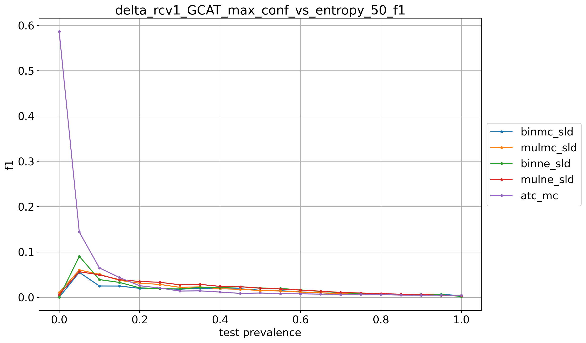
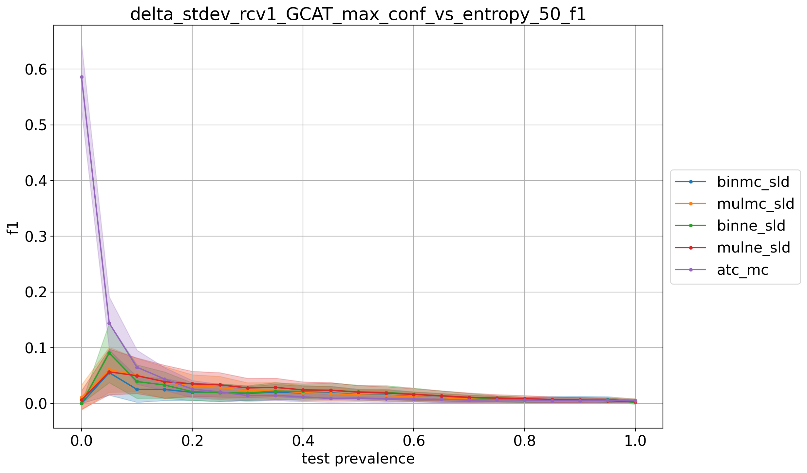
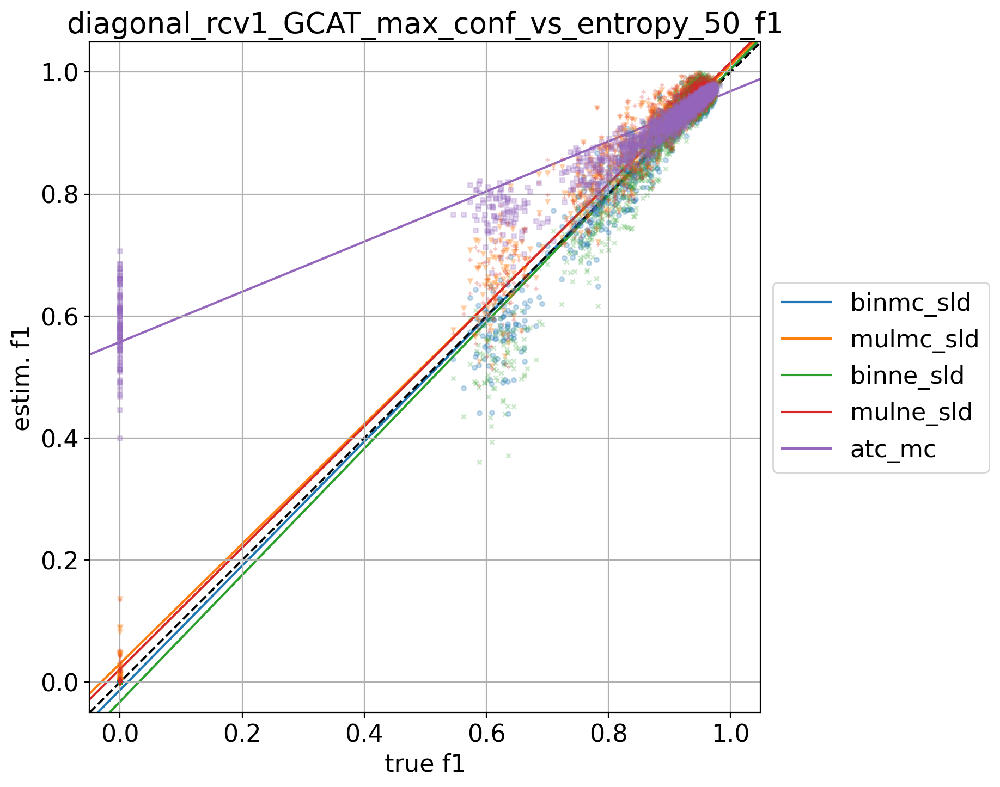
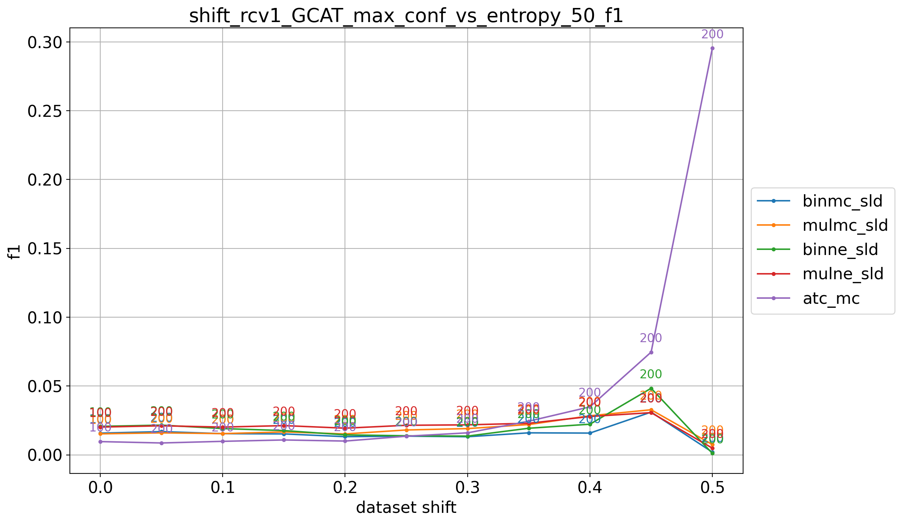

## 60% positives
> train: [0.40005165 0.59994835]  
> validation: [0.40005165 0.59994835]  
> bin_sld: 213.635s  
> mul_sld: 63.211s  
> binmc_sld: 212.836s  
> mulmc_sld: 62.226s  
> binne_sld: 212.259s  
> mulne_sld: 61.992s  
> bin_pacc: 207.509s  
> mul_pacc: 55.534s  
> ref: 46.606s  
> atc_mc: 51.106s  
> tot: 217.198s  

<table border="1" class="dataframe">
  <thead>
    <tr style="text-align: right;">
      <th></th>
      <th>binmc_sld</th>
      <th>mulmc_sld</th>
      <th>binne_sld</th>
      <th>mulne_sld</th>
      <th>atc_mc</th>
    </tr>
  </thead>
  <tbody>
    <tr>
      <th>0.0</th>
      <td>0.0002</td>
      <td>0.0016</td>
      <td>0.0001</td>
      <td>0.0007</td>
      <td>0.6121</td>
    </tr>
    <tr>
      <th>0.05</th>
      <td>0.0631</td>
      <td>0.0387</td>
      <td>0.0989</td>
      <td>0.0441</td>
      <td>0.2334</td>
    </tr>
    <tr>
      <th>0.1</th>
      <td>0.0295</td>
      <td>0.0326</td>
      <td>0.0544</td>
      <td>0.0304</td>
      <td>0.1135</td>
    </tr>
    <tr>
      <th>0.15</th>
      <td>0.0239</td>
      <td>0.0307</td>
      <td>0.0385</td>
      <td>0.0294</td>
      <td>0.0789</td>
    </tr>
    <tr>
      <th>0.2</th>
      <td>0.0159</td>
      <td>0.0242</td>
      <td>0.0241</td>
      <td>0.0240</td>
      <td>0.0503</td>
    </tr>
    <tr>
      <th>0.25</th>
      <td>0.0161</td>
      <td>0.0231</td>
      <td>0.0187</td>
      <td>0.0226</td>
      <td>0.0383</td>
    </tr>
    <tr>
      <th>0.3</th>
      <td>0.0125</td>
      <td>0.0198</td>
      <td>0.0130</td>
      <td>0.0193</td>
      <td>0.0278</td>
    </tr>
    <tr>
      <th>0.35</th>
      <td>0.0125</td>
      <td>0.0187</td>
      <td>0.0114</td>
      <td>0.0199</td>
      <td>0.0211</td>
    </tr>
    <tr>
      <th>0.4</th>
      <td>0.0141</td>
      <td>0.0171</td>
      <td>0.0122</td>
      <td>0.0184</td>
      <td>0.0176</td>
    </tr>
    <tr>
      <th>0.45</th>
      <td>0.0134</td>
      <td>0.0158</td>
      <td>0.0120</td>
      <td>0.0179</td>
      <td>0.0130</td>
    </tr>
    <tr>
      <th>0.5</th>
      <td>0.0137</td>
      <td>0.0141</td>
      <td>0.0134</td>
      <td>0.0163</td>
      <td>0.0118</td>
    </tr>
    <tr>
      <th>0.55</th>
      <td>0.0147</td>
      <td>0.0141</td>
      <td>0.0151</td>
      <td>0.0165</td>
      <td>0.0098</td>
    </tr>
    <tr>
      <th>0.6</th>
      <td>0.0133</td>
      <td>0.0123</td>
      <td>0.0147</td>
      <td>0.0149</td>
      <td>0.0088</td>
    </tr>
    <tr>
      <th>0.65</th>
      <td>0.0121</td>
      <td>0.0112</td>
      <td>0.0143</td>
      <td>0.0141</td>
      <td>0.0069</td>
    </tr>
    <tr>
      <th>0.7</th>
      <td>0.0104</td>
      <td>0.0094</td>
      <td>0.0126</td>
      <td>0.0121</td>
      <td>0.0057</td>
    </tr>
    <tr>
      <th>0.75</th>
      <td>0.0097</td>
      <td>0.0090</td>
      <td>0.0120</td>
      <td>0.0116</td>
      <td>0.0052</td>
    </tr>
    <tr>
      <th>0.8</th>
      <td>0.0076</td>
      <td>0.0072</td>
      <td>0.0092</td>
      <td>0.0095</td>
      <td>0.0046</td>
    </tr>
    <tr>
      <th>0.85</th>
      <td>0.0063</td>
      <td>0.0064</td>
      <td>0.0071</td>
      <td>0.0080</td>
      <td>0.0039</td>
    </tr>
    <tr>
      <th>0.9</th>
      <td>0.0052</td>
      <td>0.0059</td>
      <td>0.0053</td>
      <td>0.0072</td>
      <td>0.0038</td>
    </tr>
    <tr>
      <th>0.95</th>
      <td>0.0035</td>
      <td>0.0038</td>
      <td>0.0036</td>
      <td>0.0042</td>
      <td>0.0027</td>
    </tr>
    <tr>
      <th>1.0</th>
      <td>0.0017</td>
      <td>0.0021</td>
      <td>0.0009</td>
      <td>0.0017</td>
      <td>0.0026</td>
    </tr>
    <tr>
      <th>avg</th>
      <td>0.0142</td>
      <td>0.0151</td>
      <td>0.0186</td>
      <td>0.0163</td>
      <td>0.0606</td>
    </tr>
  </tbody>
</table>

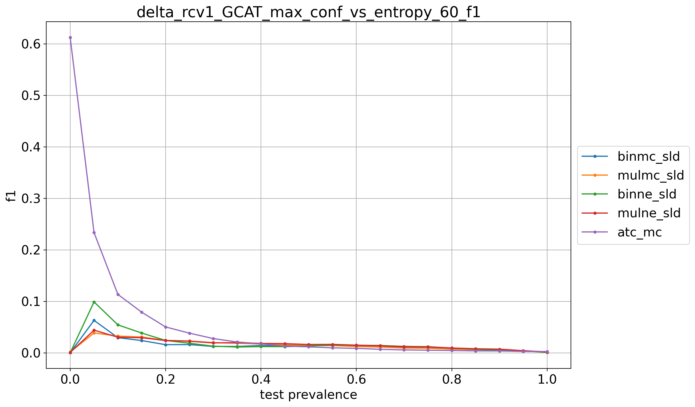
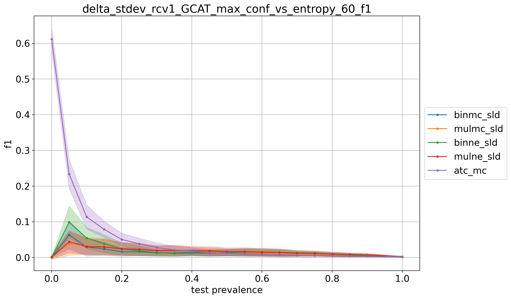
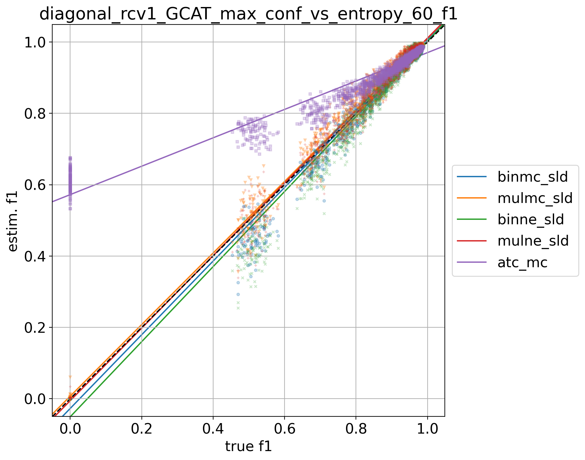
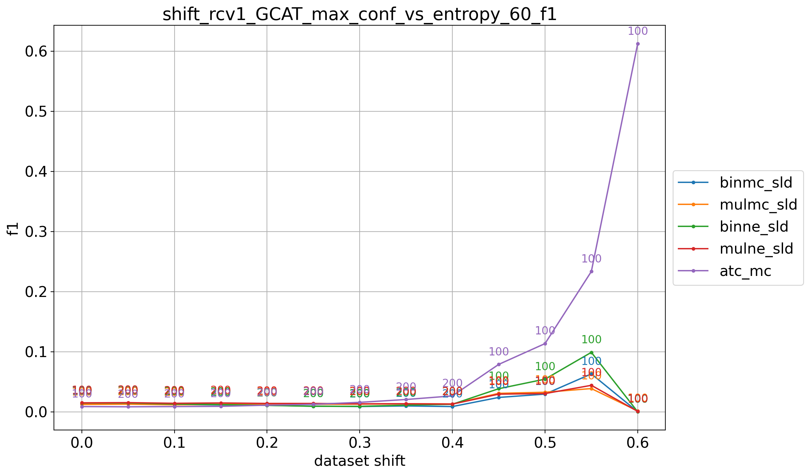

## 70% positives
> train: [0.29984504 0.70015496]  
> validation: [0.30010331 0.69989669]  
> bin_sld: 212.599s  
> mul_sld: 62.605s  
> binmc_sld: 212.279s  
> mulmc_sld: 61.417s  
> binne_sld: 212.832s  
> mulne_sld: 61.371s  
> bin_pacc: 207.524s  
> mul_pacc: 62.649s  
> ref: 45.958s  
> atc_mc: 50.040s  
> tot: 217.791s  

<table border="1" class="dataframe">
  <thead>
    <tr style="text-align: right;">
      <th></th>
      <th>binmc_sld</th>
      <th>mulmc_sld</th>
      <th>binne_sld</th>
      <th>mulne_sld</th>
      <th>atc_mc</th>
    </tr>
  </thead>
  <tbody>
    <tr>
      <th>0.0</th>
      <td>0.0002</td>
      <td>0.0002</td>
      <td>0.0001</td>
      <td>0.0004</td>
      <td>0.5530</td>
    </tr>
    <tr>
      <th>0.05</th>
      <td>0.0644</td>
      <td>0.0408</td>
      <td>0.0724</td>
      <td>0.0367</td>
      <td>0.2717</td>
    </tr>
    <tr>
      <th>0.1</th>
      <td>0.0415</td>
      <td>0.0266</td>
      <td>0.0543</td>
      <td>0.0261</td>
      <td>0.1554</td>
    </tr>
    <tr>
      <th>0.15</th>
      <td>0.0321</td>
      <td>0.0238</td>
      <td>0.0437</td>
      <td>0.0263</td>
      <td>0.0993</td>
    </tr>
    <tr>
      <th>0.2</th>
      <td>0.0239</td>
      <td>0.0203</td>
      <td>0.0343</td>
      <td>0.0225</td>
      <td>0.0643</td>
    </tr>
    <tr>
      <th>0.25</th>
      <td>0.0189</td>
      <td>0.0169</td>
      <td>0.0279</td>
      <td>0.0187</td>
      <td>0.0433</td>
    </tr>
    <tr>
      <th>0.3</th>
      <td>0.0127</td>
      <td>0.0118</td>
      <td>0.0201</td>
      <td>0.0132</td>
      <td>0.0320</td>
    </tr>
    <tr>
      <th>0.35</th>
      <td>0.0128</td>
      <td>0.0116</td>
      <td>0.0181</td>
      <td>0.0130</td>
      <td>0.0194</td>
    </tr>
    <tr>
      <th>0.4</th>
      <td>0.0095</td>
      <td>0.0100</td>
      <td>0.0140</td>
      <td>0.0110</td>
      <td>0.0151</td>
    </tr>
    <tr>
      <th>0.45</th>
      <td>0.0085</td>
      <td>0.0095</td>
      <td>0.0120</td>
      <td>0.0110</td>
      <td>0.0116</td>
    </tr>
    <tr>
      <th>0.5</th>
      <td>0.0079</td>
      <td>0.0082</td>
      <td>0.0097</td>
      <td>0.0089</td>
      <td>0.0101</td>
    </tr>
    <tr>
      <th>0.55</th>
      <td>0.0080</td>
      <td>0.0089</td>
      <td>0.0096</td>
      <td>0.0102</td>
      <td>0.0058</td>
    </tr>
    <tr>
      <th>0.6</th>
      <td>0.0068</td>
      <td>0.0080</td>
      <td>0.0073</td>
      <td>0.0088</td>
      <td>0.0054</td>
    </tr>
    <tr>
      <th>0.65</th>
      <td>0.0059</td>
      <td>0.0067</td>
      <td>0.0060</td>
      <td>0.0073</td>
      <td>0.0054</td>
    </tr>
    <tr>
      <th>0.7</th>
      <td>0.0056</td>
      <td>0.0065</td>
      <td>0.0057</td>
      <td>0.0070</td>
      <td>0.0044</td>
    </tr>
    <tr>
      <th>0.75</th>
      <td>0.0059</td>
      <td>0.0058</td>
      <td>0.0063</td>
      <td>0.0065</td>
      <td>0.0042</td>
    </tr>
    <tr>
      <th>0.8</th>
      <td>0.0057</td>
      <td>0.0058</td>
      <td>0.0060</td>
      <td>0.0061</td>
      <td>0.0051</td>
    </tr>
    <tr>
      <th>0.85</th>
      <td>0.0061</td>
      <td>0.0060</td>
      <td>0.0063</td>
      <td>0.0061</td>
      <td>0.0046</td>
    </tr>
    <tr>
      <th>0.9</th>
      <td>0.0056</td>
      <td>0.0053</td>
      <td>0.0058</td>
      <td>0.0054</td>
      <td>0.0045</td>
    </tr>
    <tr>
      <th>0.95</th>
      <td>0.0063</td>
      <td>0.0051</td>
      <td>0.0058</td>
      <td>0.0043</td>
      <td>0.0044</td>
    </tr>
    <tr>
      <th>1.0</th>
      <td>0.0050</td>
      <td>0.0041</td>
      <td>0.0028</td>
      <td>0.0024</td>
      <td>0.0051</td>
    </tr>
    <tr>
      <th>avg</th>
      <td>0.0140</td>
      <td>0.0115</td>
      <td>0.0175</td>
      <td>0.0120</td>
      <td>0.0631</td>
    </tr>
  </tbody>
</table>

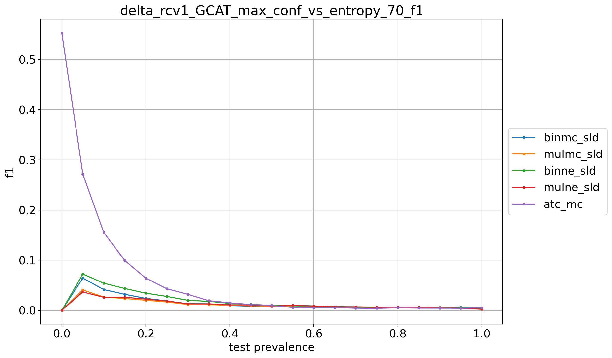
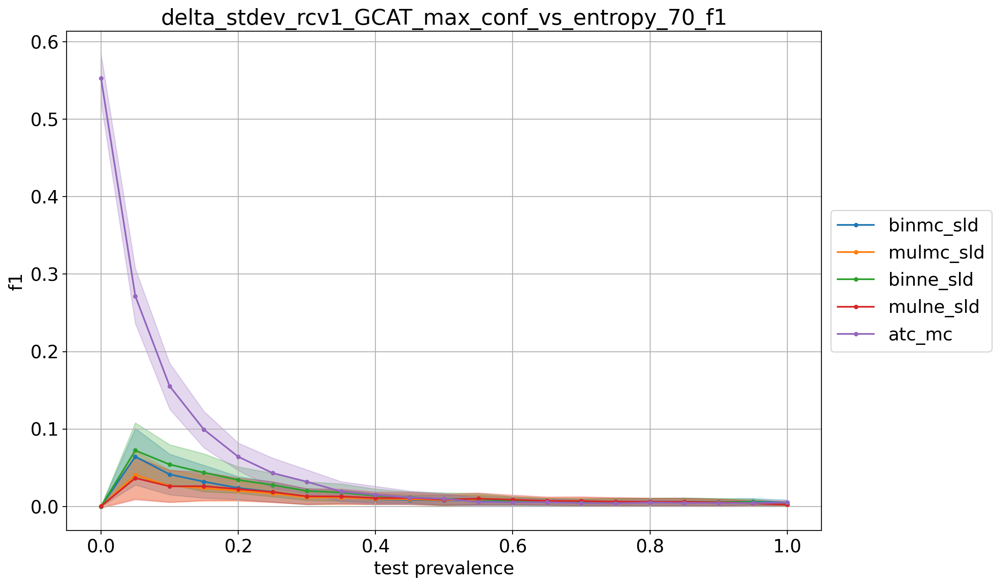
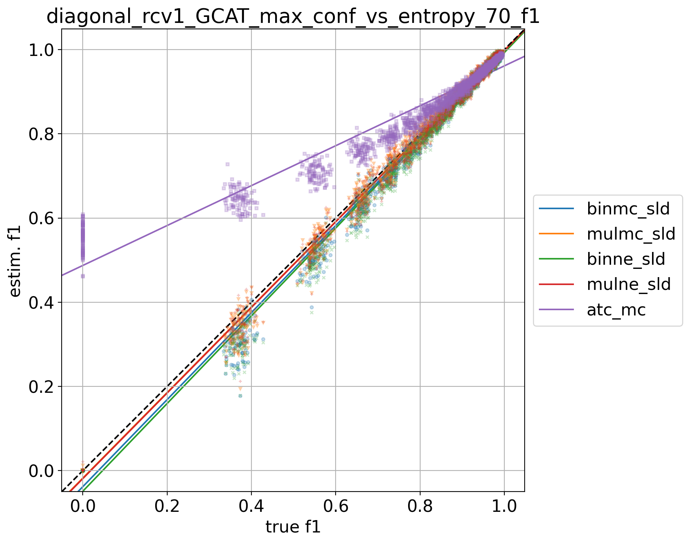

## 80% positives
> train: [0.19989669 0.80010331]  
> validation: [0.20015496 0.79984504]  
> bin_sld: 213.706s  
> mul_sld: 61.535s  
> binmc_sld: 213.790s  
> mulmc_sld: 60.661s  
> binne_sld: 212.442s  
> mulne_sld: 60.162s  
> bin_pacc: 207.754s  
> mul_pacc: 55.905s  
> ref: 46.700s  
> atc_mc: 50.642s  
> tot: 217.447s  

<table border="1" class="dataframe">
  <thead>
    <tr style="text-align: right;">
      <th></th>
      <th>binmc_sld</th>
      <th>mulmc_sld</th>
      <th>binne_sld</th>
      <th>mulne_sld</th>
      <th>atc_mc</th>
    </tr>
  </thead>
  <tbody>
    <tr>
      <th>0.0</th>
      <td>0.0001</td>
      <td>0.0000</td>
      <td>0.0001</td>
      <td>0.0001</td>
      <td>0.5543</td>
    </tr>
    <tr>
      <th>0.05</th>
      <td>0.0973</td>
      <td>0.0725</td>
      <td>0.0812</td>
      <td>0.0453</td>
      <td>0.3560</td>
    </tr>
    <tr>
      <th>0.1</th>
      <td>0.0681</td>
      <td>0.0495</td>
      <td>0.0662</td>
      <td>0.0359</td>
      <td>0.2466</td>
    </tr>
    <tr>
      <th>0.15</th>
      <td>0.0463</td>
      <td>0.0357</td>
      <td>0.0516</td>
      <td>0.0317</td>
      <td>0.1736</td>
    </tr>
    <tr>
      <th>0.2</th>
      <td>0.0336</td>
      <td>0.0263</td>
      <td>0.0409</td>
      <td>0.0259</td>
      <td>0.1294</td>
    </tr>
    <tr>
      <th>0.25</th>
      <td>0.0244</td>
      <td>0.0193</td>
      <td>0.0319</td>
      <td>0.0203</td>
      <td>0.0960</td>
    </tr>
    <tr>
      <th>0.3</th>
      <td>0.0150</td>
      <td>0.0130</td>
      <td>0.0224</td>
      <td>0.0147</td>
      <td>0.0688</td>
    </tr>
    <tr>
      <th>0.35</th>
      <td>0.0134</td>
      <td>0.0120</td>
      <td>0.0205</td>
      <td>0.0141</td>
      <td>0.0486</td>
    </tr>
    <tr>
      <th>0.4</th>
      <td>0.0096</td>
      <td>0.0104</td>
      <td>0.0147</td>
      <td>0.0119</td>
      <td>0.0379</td>
    </tr>
    <tr>
      <th>0.45</th>
      <td>0.0088</td>
      <td>0.0098</td>
      <td>0.0126</td>
      <td>0.0104</td>
      <td>0.0268</td>
    </tr>
    <tr>
      <th>0.5</th>
      <td>0.0062</td>
      <td>0.0078</td>
      <td>0.0084</td>
      <td>0.0077</td>
      <td>0.0223</td>
    </tr>
    <tr>
      <th>0.55</th>
      <td>0.0059</td>
      <td>0.0083</td>
      <td>0.0087</td>
      <td>0.0095</td>
      <td>0.0150</td>
    </tr>
    <tr>
      <th>0.6</th>
      <td>0.0054</td>
      <td>0.0073</td>
      <td>0.0060</td>
      <td>0.0069</td>
      <td>0.0119</td>
    </tr>
    <tr>
      <th>0.65</th>
      <td>0.0058</td>
      <td>0.0086</td>
      <td>0.0053</td>
      <td>0.0081</td>
      <td>0.0086</td>
    </tr>
    <tr>
      <th>0.7</th>
      <td>0.0054</td>
      <td>0.0071</td>
      <td>0.0052</td>
      <td>0.0070</td>
      <td>0.0067</td>
    </tr>
    <tr>
      <th>0.75</th>
      <td>0.0049</td>
      <td>0.0063</td>
      <td>0.0047</td>
      <td>0.0062</td>
      <td>0.0046</td>
    </tr>
    <tr>
      <th>0.8</th>
      <td>0.0052</td>
      <td>0.0063</td>
      <td>0.0053</td>
      <td>0.0066</td>
      <td>0.0044</td>
    </tr>
    <tr>
      <th>0.85</th>
      <td>0.0051</td>
      <td>0.0060</td>
      <td>0.0057</td>
      <td>0.0066</td>
      <td>0.0036</td>
    </tr>
    <tr>
      <th>0.9</th>
      <td>0.0051</td>
      <td>0.0054</td>
      <td>0.0070</td>
      <td>0.0071</td>
      <td>0.0034</td>
    </tr>
    <tr>
      <th>0.95</th>
      <td>0.0042</td>
      <td>0.0041</td>
      <td>0.0057</td>
      <td>0.0057</td>
      <td>0.0036</td>
    </tr>
    <tr>
      <th>1.0</th>
      <td>0.0010</td>
      <td>0.0013</td>
      <td>0.0003</td>
      <td>0.0016</td>
      <td>0.0041</td>
    </tr>
    <tr>
      <th>avg</th>
      <td>0.0177</td>
      <td>0.0151</td>
      <td>0.0193</td>
      <td>0.0135</td>
      <td>0.0870</td>
    </tr>
  </tbody>
</table>

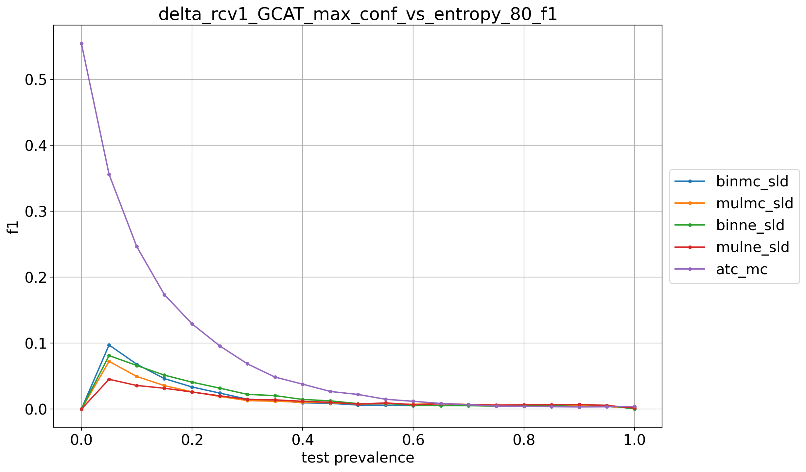
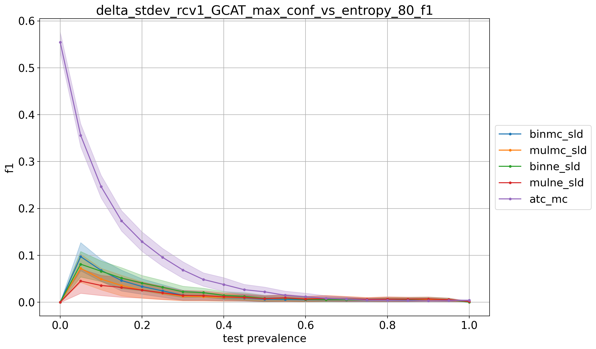

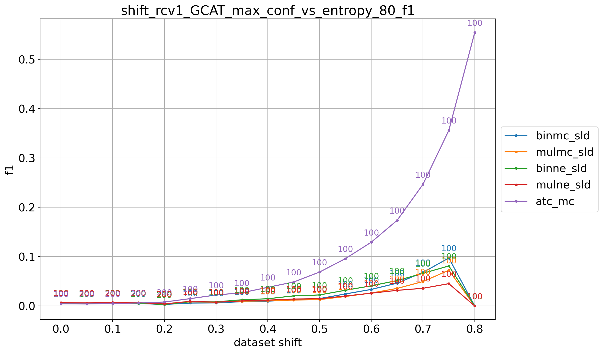

## 90% positives
> train: [0.09994835 0.90005165]  
> validation: [0.09994835 0.90005165]  
> mul_sld: 53.914s  
> mulmc_sld: 46.025s  
> mulne_sld: 45.194s  
> ref: 36.408s  
> atc_mc: 39.138s  
> tot: 55.916s  

<table border="1" class="dataframe">
  <thead>
    <tr style="text-align: right;">
      <th></th>
      <th>mulmc_sld</th>
      <th>mulne_sld</th>
      <th>atc_mc</th>
    </tr>
  </thead>
  <tbody>
    <tr>
      <th>0.0</th>
      <td>0.0000</td>
      <td>0.0000</td>
      <td>0.4608</td>
    </tr>
    <tr>
      <th>0.05</th>
      <td>0.1235</td>
      <td>0.0834</td>
      <td>0.3731</td>
    </tr>
    <tr>
      <th>0.1</th>
      <td>0.1423</td>
      <td>0.0855</td>
      <td>0.3053</td>
    </tr>
    <tr>
      <th>0.15</th>
      <td>0.1251</td>
      <td>0.0780</td>
      <td>0.2498</td>
    </tr>
    <tr>
      <th>0.2</th>
      <td>0.1065</td>
      <td>0.0686</td>
      <td>0.2053</td>
    </tr>
    <tr>
      <th>0.25</th>
      <td>0.0883</td>
      <td>0.0588</td>
      <td>0.1687</td>
    </tr>
    <tr>
      <th>0.3</th>
      <td>0.0714</td>
      <td>0.0485</td>
      <td>0.1354</td>
    </tr>
    <tr>
      <th>0.35</th>
      <td>0.0632</td>
      <td>0.0452</td>
      <td>0.1093</td>
    </tr>
    <tr>
      <th>0.4</th>
      <td>0.0485</td>
      <td>0.0351</td>
      <td>0.0883</td>
    </tr>
    <tr>
      <th>0.45</th>
      <td>0.0420</td>
      <td>0.0316</td>
      <td>0.0693</td>
    </tr>
    <tr>
      <th>0.5</th>
      <td>0.0316</td>
      <td>0.0248</td>
      <td>0.0554</td>
    </tr>
    <tr>
      <th>0.55</th>
      <td>0.0274</td>
      <td>0.0225</td>
      <td>0.0420</td>
    </tr>
    <tr>
      <th>0.6</th>
      <td>0.0178</td>
      <td>0.0151</td>
      <td>0.0326</td>
    </tr>
    <tr>
      <th>0.65</th>
      <td>0.0136</td>
      <td>0.0124</td>
      <td>0.0245</td>
    </tr>
    <tr>
      <th>0.7</th>
      <td>0.0110</td>
      <td>0.0107</td>
      <td>0.0169</td>
    </tr>
    <tr>
      <th>0.75</th>
      <td>0.0073</td>
      <td>0.0076</td>
      <td>0.0103</td>
    </tr>
    <tr>
      <th>0.8</th>
      <td>0.0053</td>
      <td>0.0055</td>
      <td>0.0063</td>
    </tr>
    <tr>
      <th>0.85</th>
      <td>0.0045</td>
      <td>0.0045</td>
      <td>0.0038</td>
    </tr>
    <tr>
      <th>0.9</th>
      <td>0.0039</td>
      <td>0.0039</td>
      <td>0.0032</td>
    </tr>
    <tr>
      <th>0.95</th>
      <td>0.0033</td>
      <td>0.0037</td>
      <td>0.0038</td>
    </tr>
    <tr>
      <th>1.0</th>
      <td>0.0008</td>
      <td>0.0003</td>
      <td>0.0045</td>
    </tr>
    <tr>
      <th>avg</th>
      <td>0.0446</td>
      <td>0.0307</td>
      <td>0.1128</td>
    </tr>
  </tbody>
</table>

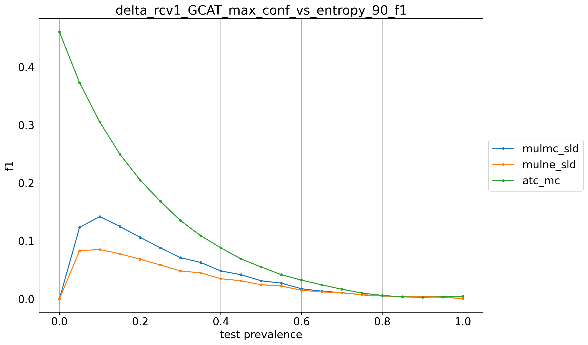
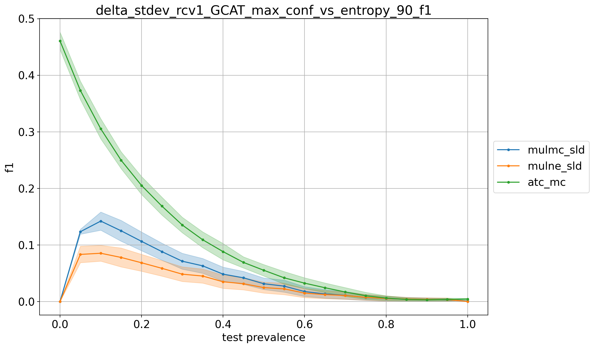
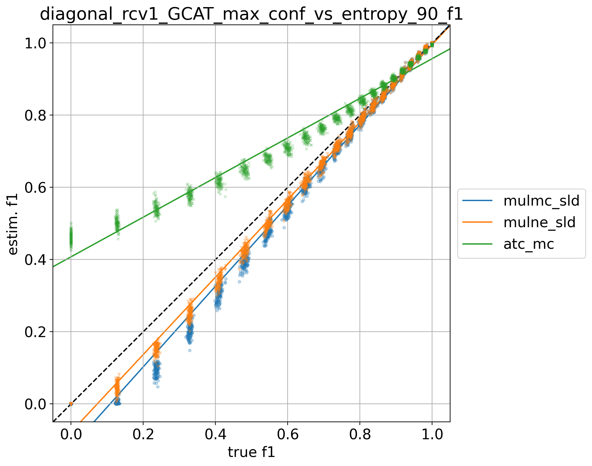
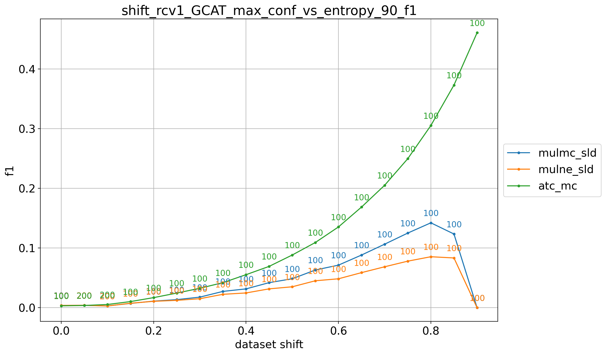

## avg
### avg on train
<table border="1" class="dataframe">
  <thead>
    <tr style="text-align: right;">
      <th></th>
      <th>binmc_sld</th>
      <th>mulmc_sld</th>
      <th>binne_sld</th>
      <th>mulne_sld</th>
      <th>atc_mc</th>
    </tr>
  </thead>
  <tbody>
    <tr>
      <th>0.0</th>
      <td>0.0079</td>
      <td>0.0125</td>
      <td>0.0137</td>
      <td>0.0225</td>
      <td>0.4260</td>
    </tr>
    <tr>
      <th>0.05</th>
      <td>0.1107</td>
      <td>0.0813</td>
      <td>0.1293</td>
      <td>0.0701</td>
      <td>0.2154</td>
    </tr>
    <tr>
      <th>0.1</th>
      <td>0.0700</td>
      <td>0.0674</td>
      <td>0.0757</td>
      <td>0.0572</td>
      <td>0.1508</td>
    </tr>
    <tr>
      <th>0.15</th>
      <td>0.0529</td>
      <td>0.0600</td>
      <td>0.0535</td>
      <td>0.0525</td>
      <td>0.1230</td>
    </tr>
    <tr>
      <th>0.2</th>
      <td>0.0413</td>
      <td>0.0530</td>
      <td>0.0416</td>
      <td>0.0486</td>
      <td>0.1023</td>
    </tr>
    <tr>
      <th>0.25</th>
      <td>0.0355</td>
      <td>0.0500</td>
      <td>0.0346</td>
      <td>0.0453</td>
      <td>0.0888</td>
    </tr>
    <tr>
      <th>0.3</th>
      <td>0.0274</td>
      <td>0.0474</td>
      <td>0.0272</td>
      <td>0.0416</td>
      <td>0.0786</td>
    </tr>
    <tr>
      <th>0.35</th>
      <td>0.0245</td>
      <td>0.0487</td>
      <td>0.0245</td>
      <td>0.0434</td>
      <td>0.0695</td>
    </tr>
    <tr>
      <th>0.4</th>
      <td>0.0256</td>
      <td>0.0534</td>
      <td>0.0248</td>
      <td>0.0454</td>
      <td>0.0659</td>
    </tr>
    <tr>
      <th>0.45</th>
      <td>0.0237</td>
      <td>0.0535</td>
      <td>0.0225</td>
      <td>0.0459</td>
      <td>0.0603</td>
    </tr>
    <tr>
      <th>0.5</th>
      <td>0.0218</td>
      <td>0.0536</td>
      <td>0.0203</td>
      <td>0.0482</td>
      <td>0.0578</td>
    </tr>
    <tr>
      <th>0.55</th>
      <td>0.0196</td>
      <td>0.0534</td>
      <td>0.0185</td>
      <td>0.0458</td>
      <td>0.0542</td>
    </tr>
    <tr>
      <th>0.6</th>
      <td>0.0182</td>
      <td>0.0522</td>
      <td>0.0169</td>
      <td>0.0457</td>
      <td>0.0530</td>
    </tr>
    <tr>
      <th>0.65</th>
      <td>0.0171</td>
      <td>0.0507</td>
      <td>0.0160</td>
      <td>0.0447</td>
      <td>0.0507</td>
    </tr>
    <tr>
      <th>0.7</th>
      <td>0.0151</td>
      <td>0.0490</td>
      <td>0.0134</td>
      <td>0.0447</td>
      <td>0.0488</td>
    </tr>
    <tr>
      <th>0.75</th>
      <td>0.0153</td>
      <td>0.0469</td>
      <td>0.0130</td>
      <td>0.0427</td>
      <td>0.0483</td>
    </tr>
    <tr>
      <th>0.8</th>
      <td>0.0147</td>
      <td>0.0448</td>
      <td>0.0120</td>
      <td>0.0387</td>
      <td>0.0473</td>
    </tr>
    <tr>
      <th>0.85</th>
      <td>0.0136</td>
      <td>0.0429</td>
      <td>0.0112</td>
      <td>0.0365</td>
      <td>0.0469</td>
    </tr>
    <tr>
      <th>0.9</th>
      <td>0.0137</td>
      <td>0.0370</td>
      <td>0.0106</td>
      <td>0.0298</td>
      <td>0.0467</td>
    </tr>
    <tr>
      <th>0.95</th>
      <td>0.0136</td>
      <td>0.0293</td>
      <td>0.0107</td>
      <td>0.0251</td>
      <td>0.0464</td>
    </tr>
    <tr>
      <th>1.0</th>
      <td>0.0065</td>
      <td>0.0184</td>
      <td>0.0035</td>
      <td>0.0177</td>
      <td>0.0465</td>
    </tr>
    <tr>
      <th>avg</th>
      <td>0.0280</td>
      <td>0.0479</td>
      <td>0.0283</td>
      <td>0.0425</td>
      <td>0.0918</td>
    </tr>
  </tbody>
</table>

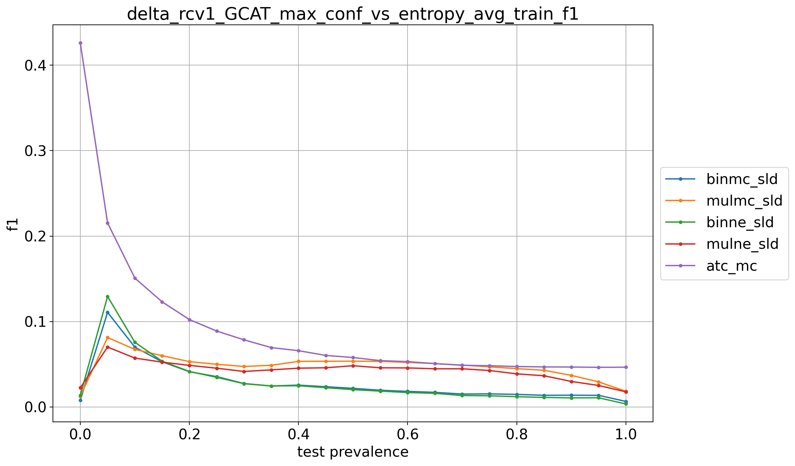
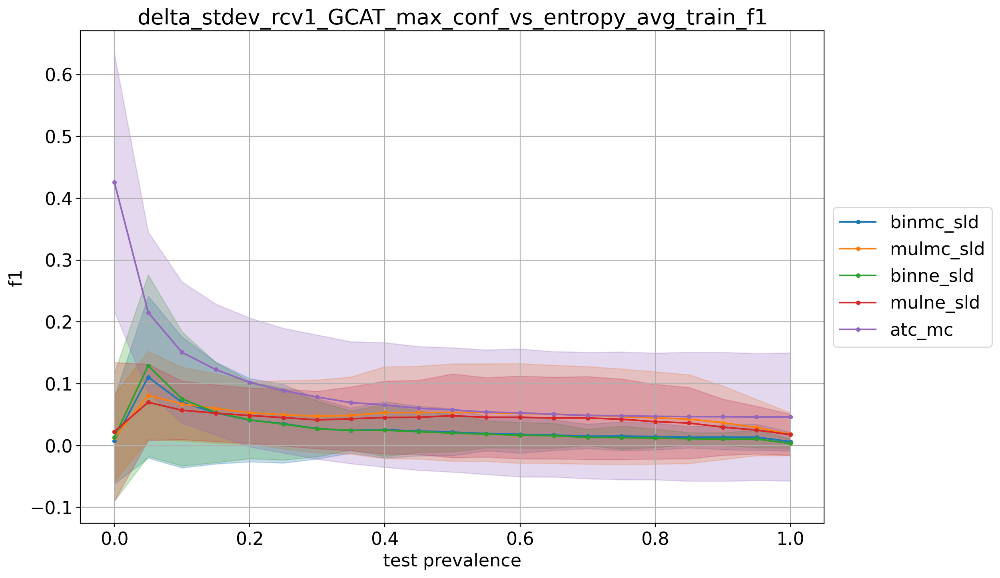
### avg on test
<table border="1" class="dataframe">
  <thead>
    <tr style="text-align: right;">
      <th></th>
      <th>binmc_sld</th>
      <th>mulmc_sld</th>
      <th>binne_sld</th>
      <th>mulne_sld</th>
      <th>atc_mc</th>
    </tr>
  </thead>
  <tbody>
    <tr>
      <th>0.1</th>
      <td>0.0399</td>
      <td>0.1520</td>
      <td>0.0294</td>
      <td>0.1119</td>
      <td>0.3196</td>
    </tr>
    <tr>
      <th>0.2</th>
      <td>0.0746</td>
      <td>0.1270</td>
      <td>0.0615</td>
      <td>0.1234</td>
      <td>0.0658</td>
    </tr>
    <tr>
      <th>0.3</th>
      <td>0.0318</td>
      <td>0.0301</td>
      <td>0.0396</td>
      <td>0.0347</td>
      <td>0.0337</td>
    </tr>
    <tr>
      <th>0.4</th>
      <td>0.0168</td>
      <td>0.0164</td>
      <td>0.0209</td>
      <td>0.0186</td>
      <td>0.0356</td>
    </tr>
    <tr>
      <th>0.5</th>
      <td>0.0153</td>
      <td>0.0189</td>
      <td>0.0192</td>
      <td>0.0211</td>
      <td>0.0479</td>
    </tr>
    <tr>
      <th>0.6</th>
      <td>0.0142</td>
      <td>0.0151</td>
      <td>0.0186</td>
      <td>0.0163</td>
      <td>0.0606</td>
    </tr>
    <tr>
      <th>0.7</th>
      <td>0.0140</td>
      <td>0.0115</td>
      <td>0.0175</td>
      <td>0.0120</td>
      <td>0.0631</td>
    </tr>
    <tr>
      <th>0.8</th>
      <td>0.0177</td>
      <td>0.0151</td>
      <td>0.0193</td>
      <td>0.0135</td>
      <td>0.0870</td>
    </tr>
    <tr>
      <th>0.9</th>
      <td>NaN</td>
      <td>0.0446</td>
      <td>NaN</td>
      <td>0.0307</td>
      <td>0.1128</td>
    </tr>
    <tr>
      <th>avg</th>
      <td>0.0280</td>
      <td>0.0479</td>
      <td>0.0283</td>
      <td>0.0425</td>
      <td>0.0918</td>
    </tr>
  </tbody>
</table>

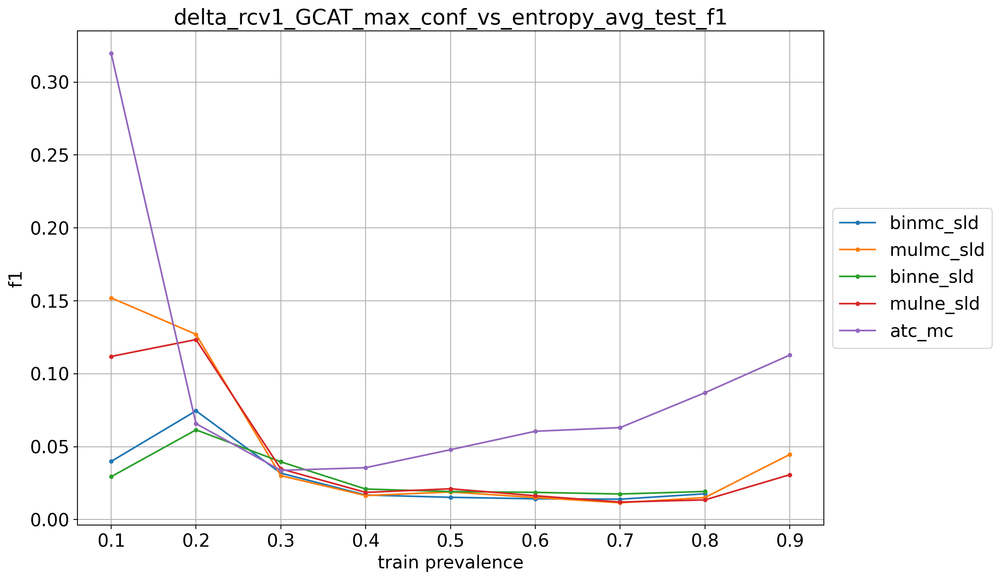
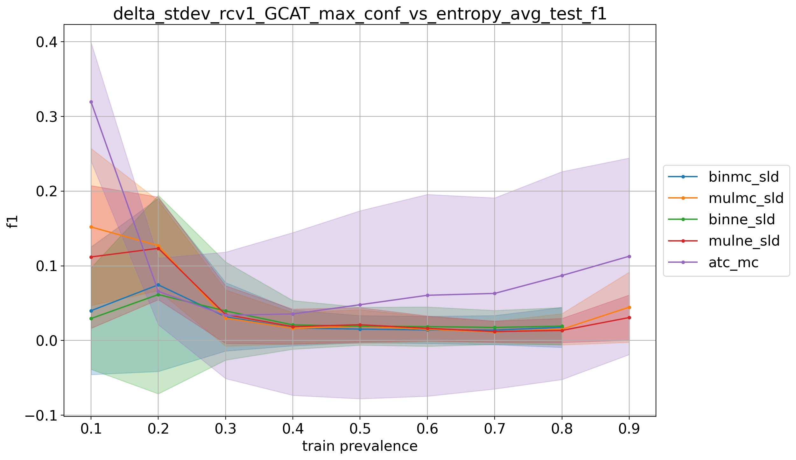
### avg dataset shift
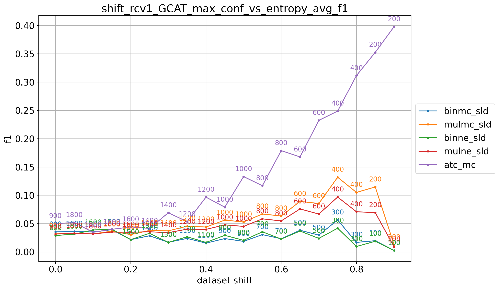
