# rcv1_GCAT_9prevs

## 10% positives
> train: [0.90005165 0.09994835]  
> validation: [0.90005165 0.09994835]  
> bin_sld: 203.037s  
> mul_sld: 73.117s  
> binmc_sld: 203.298s  
> mulmc_sld: 72.193s  
> binne_sld: 202.750s  
> mulne_sld: 66.052s  
> ref: 42.077s  
> atc_mc: 45.501s  
> tot: 210.220s  

<table border="1" class="dataframe">
  <thead>
    <tr style="text-align: right;">
      <th></th>
      <th>bin_sld</th>
      <th>mul_sld</th>
      <th>atc_mc</th>
    </tr>
  </thead>
  <tbody>
    <tr>
      <th>0.0</th>
      <td>0.1168</td>
      <td>0.0697</td>
      <td>0.0062</td>
    </tr>
    <tr>
      <th>0.05</th>
      <td>0.0681</td>
      <td>0.1060</td>
      <td>0.3429</td>
    </tr>
    <tr>
      <th>0.1</th>
      <td>0.0250</td>
      <td>0.0641</td>
      <td>0.3260</td>
    </tr>
    <tr>
      <th>0.15</th>
      <td>0.0237</td>
      <td>0.0929</td>
      <td>0.3360</td>
    </tr>
    <tr>
      <th>0.2</th>
      <td>0.0292</td>
      <td>0.1340</td>
      <td>0.3402</td>
    </tr>
    <tr>
      <th>0.25</th>
      <td>0.0346</td>
      <td>0.1463</td>
      <td>0.3351</td>
    </tr>
    <tr>
      <th>0.3</th>
      <td>0.0378</td>
      <td>0.1499</td>
      <td>0.3371</td>
    </tr>
    <tr>
      <th>0.35</th>
      <td>0.0396</td>
      <td>0.1493</td>
      <td>0.3313</td>
    </tr>
    <tr>
      <th>0.4</th>
      <td>0.0419</td>
      <td>0.1520</td>
      <td>0.3378</td>
    </tr>
    <tr>
      <th>0.45</th>
      <td>0.0429</td>
      <td>0.1488</td>
      <td>0.3337</td>
    </tr>
    <tr>
      <th>0.5</th>
      <td>0.0452</td>
      <td>0.1461</td>
      <td>0.3346</td>
    </tr>
    <tr>
      <th>0.55</th>
      <td>0.0448</td>
      <td>0.1426</td>
      <td>0.3327</td>
    </tr>
    <tr>
      <th>0.6</th>
      <td>0.0465</td>
      <td>0.1416</td>
      <td>0.3406</td>
    </tr>
    <tr>
      <th>0.65</th>
      <td>0.0471</td>
      <td>0.1342</td>
      <td>0.3326</td>
    </tr>
    <tr>
      <th>0.7</th>
      <td>0.0470</td>
      <td>0.1302</td>
      <td>0.3335</td>
    </tr>
    <tr>
      <th>0.75</th>
      <td>0.0463</td>
      <td>0.1214</td>
      <td>0.3359</td>
    </tr>
    <tr>
      <th>0.8</th>
      <td>0.0463</td>
      <td>0.0940</td>
      <td>0.3324</td>
    </tr>
    <tr>
      <th>0.85</th>
      <td>0.0454</td>
      <td>0.0566</td>
      <td>0.3378</td>
    </tr>
    <tr>
      <th>0.9</th>
      <td>0.0374</td>
      <td>0.0378</td>
      <td>0.3373</td>
    </tr>
    <tr>
      <th>0.95</th>
      <td>0.0198</td>
      <td>0.0522</td>
      <td>0.3323</td>
    </tr>
    <tr>
      <th>1.0</th>
      <td>0.0025</td>
      <td>0.0171</td>
      <td>0.3353</td>
    </tr>
    <tr>
      <th>avg</th>
      <td>0.0423</td>
      <td>0.1089</td>
      <td>0.3196</td>
    </tr>
  </tbody>
</table>

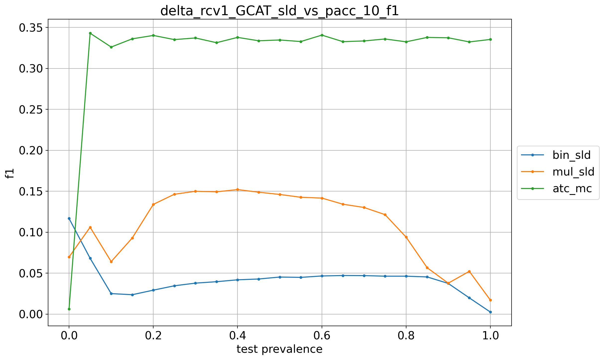
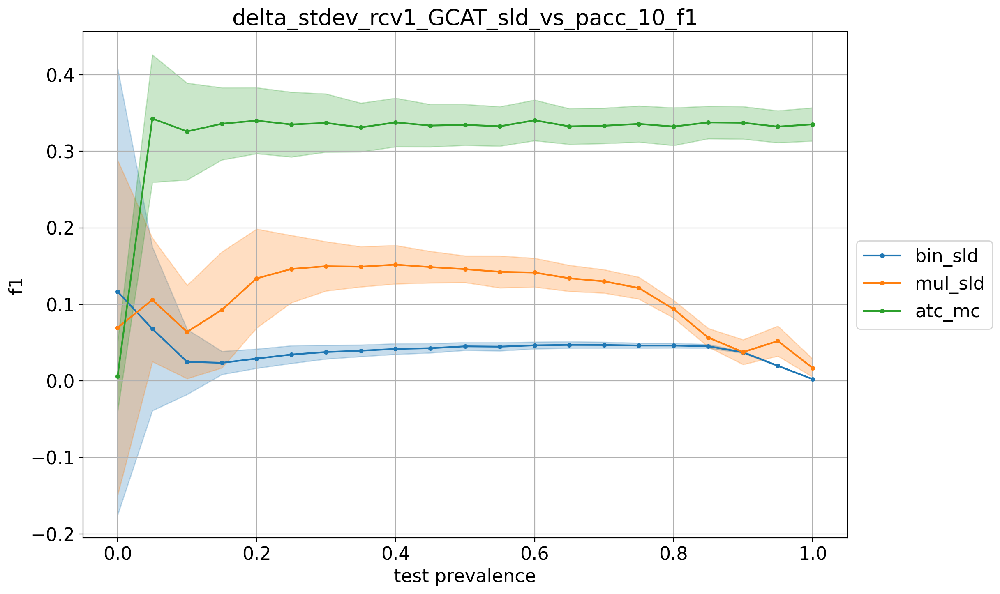
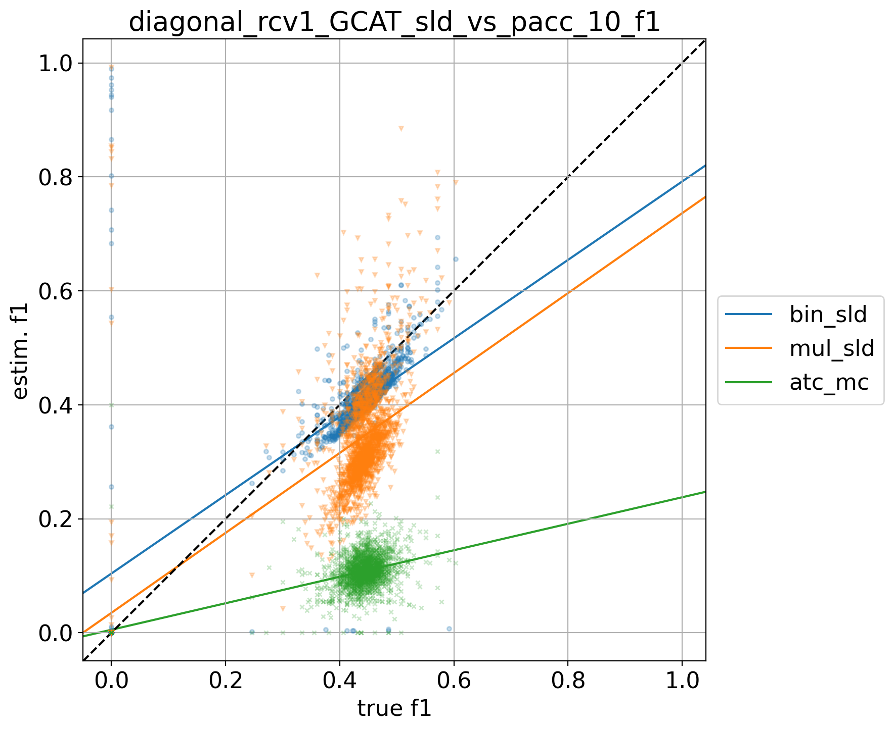
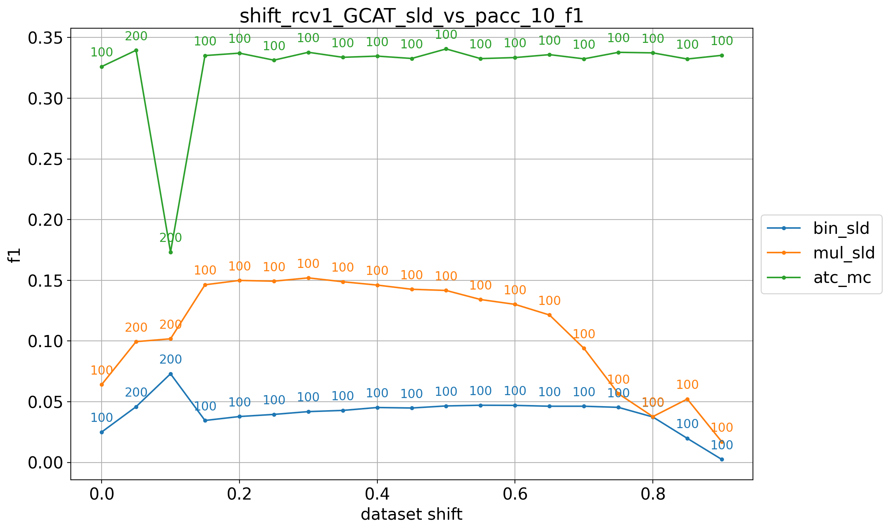

## 20% positives
> train: [0.79984504 0.20015496]  
> validation: [0.80010331 0.19989669]  
> bin_sld: 217.889s  
> mul_sld: 74.904s  
> binmc_sld: 220.775s  
> mulmc_sld: 80.875s  
> binne_sld: 219.751s  
> mulne_sld: 76.270s  
> bin_pacc: 209.775s  
> mul_pacc: 54.926s  
> ref: 46.602s  
> atc_mc: 50.329s  
> tot: 224.927s  

<table border="1" class="dataframe">
  <thead>
    <tr style="text-align: right;">
      <th></th>
      <th>bin_sld</th>
      <th>mul_sld</th>
      <th>bin_pacc</th>
      <th>mul_pacc</th>
      <th>atc_mc</th>
    </tr>
  </thead>
  <tbody>
    <tr>
      <th>0.0</th>
      <td>0.0152</td>
      <td>0.1268</td>
      <td>0.0741</td>
      <td>0.5484</td>
      <td>0.1580</td>
    </tr>
    <tr>
      <th>0.05</th>
      <td>0.2912</td>
      <td>0.1094</td>
      <td>0.0846</td>
      <td>0.2902</td>
      <td>0.1115</td>
    </tr>
    <tr>
      <th>0.1</th>
      <td>0.1858</td>
      <td>0.0749</td>
      <td>0.0558</td>
      <td>0.1849</td>
      <td>0.0899</td>
    </tr>
    <tr>
      <th>0.15</th>
      <td>0.1062</td>
      <td>0.0741</td>
      <td>0.0433</td>
      <td>0.1390</td>
      <td>0.0782</td>
    </tr>
    <tr>
      <th>0.2</th>
      <td>0.0662</td>
      <td>0.0709</td>
      <td>0.0366</td>
      <td>0.1453</td>
      <td>0.0673</td>
    </tr>
    <tr>
      <th>0.25</th>
      <td>0.0557</td>
      <td>0.0757</td>
      <td>0.0330</td>
      <td>0.1283</td>
      <td>0.0637</td>
    </tr>
    <tr>
      <th>0.3</th>
      <td>0.0383</td>
      <td>0.0748</td>
      <td>0.0288</td>
      <td>0.1364</td>
      <td>0.0612</td>
    </tr>
    <tr>
      <th>0.35</th>
      <td>0.0261</td>
      <td>0.0780</td>
      <td>0.0251</td>
      <td>0.1409</td>
      <td>0.0553</td>
    </tr>
    <tr>
      <th>0.4</th>
      <td>0.0384</td>
      <td>0.0879</td>
      <td>0.0285</td>
      <td>0.0980</td>
      <td>0.0605</td>
    </tr>
    <tr>
      <th>0.45</th>
      <td>0.0296</td>
      <td>0.0899</td>
      <td>0.0259</td>
      <td>0.0562</td>
      <td>0.0589</td>
    </tr>
    <tr>
      <th>0.5</th>
      <td>0.0270</td>
      <td>0.0942</td>
      <td>0.0246</td>
      <td>0.0695</td>
      <td>0.0587</td>
    </tr>
    <tr>
      <th>0.55</th>
      <td>0.0195</td>
      <td>0.0939</td>
      <td>0.0217</td>
      <td>0.0495</td>
      <td>0.0550</td>
    </tr>
    <tr>
      <th>0.6</th>
      <td>0.0216</td>
      <td>0.0966</td>
      <td>0.0215</td>
      <td>0.0478</td>
      <td>0.0526</td>
    </tr>
    <tr>
      <th>0.65</th>
      <td>0.0243</td>
      <td>0.1006</td>
      <td>0.0223</td>
      <td>0.0396</td>
      <td>0.0541</td>
    </tr>
    <tr>
      <th>0.7</th>
      <td>0.0238</td>
      <td>0.1047</td>
      <td>0.0186</td>
      <td>0.0496</td>
      <td>0.0511</td>
    </tr>
    <tr>
      <th>0.75</th>
      <td>0.0270</td>
      <td>0.1055</td>
      <td>0.0195</td>
      <td>0.0315</td>
      <td>0.0521</td>
    </tr>
    <tr>
      <th>0.8</th>
      <td>0.0263</td>
      <td>0.1066</td>
      <td>0.0191</td>
      <td>0.0294</td>
      <td>0.0526</td>
    </tr>
    <tr>
      <th>0.85</th>
      <td>0.0259</td>
      <td>0.1083</td>
      <td>0.0171</td>
      <td>0.0287</td>
      <td>0.0488</td>
    </tr>
    <tr>
      <th>0.9</th>
      <td>0.0255</td>
      <td>0.1097</td>
      <td>0.0178</td>
      <td>0.0410</td>
      <td>0.0503</td>
    </tr>
    <tr>
      <th>0.95</th>
      <td>0.0251</td>
      <td>0.1117</td>
      <td>0.0192</td>
      <td>0.0414</td>
      <td>0.0518</td>
    </tr>
    <tr>
      <th>1.0</th>
      <td>0.0042</td>
      <td>0.1043</td>
      <td>0.0029</td>
      <td>0.0350</td>
      <td>0.0495</td>
    </tr>
    <tr>
      <th>avg</th>
      <td>0.0525</td>
      <td>0.0952</td>
      <td>0.0305</td>
      <td>0.1110</td>
      <td>0.0658</td>
    </tr>
  </tbody>
</table>

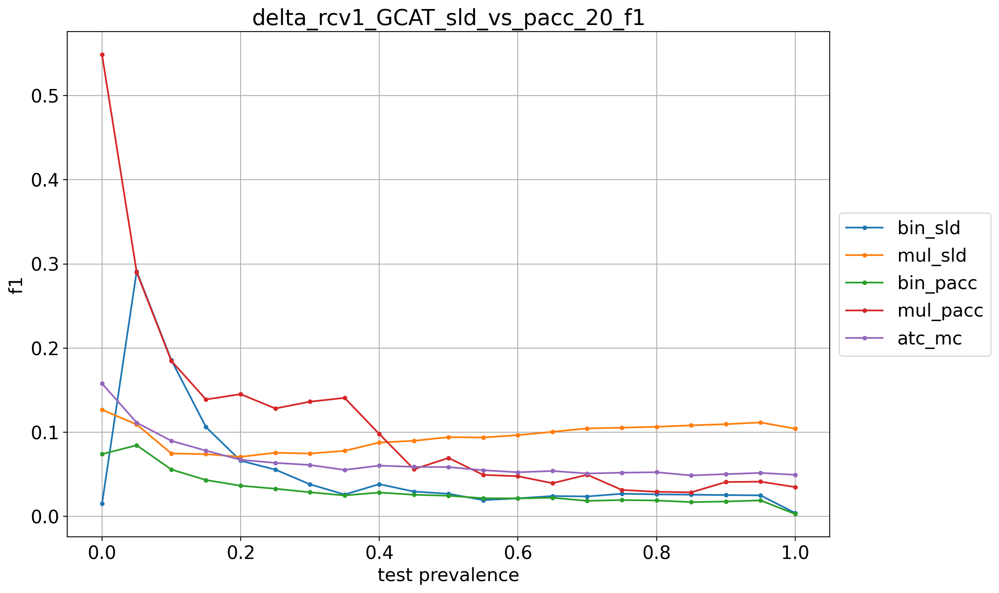
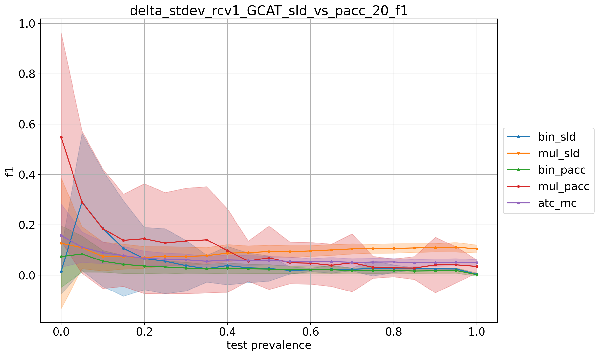
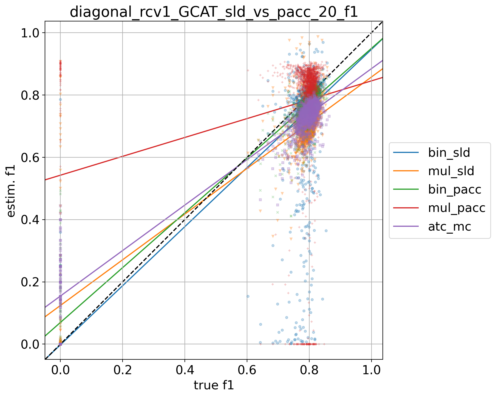
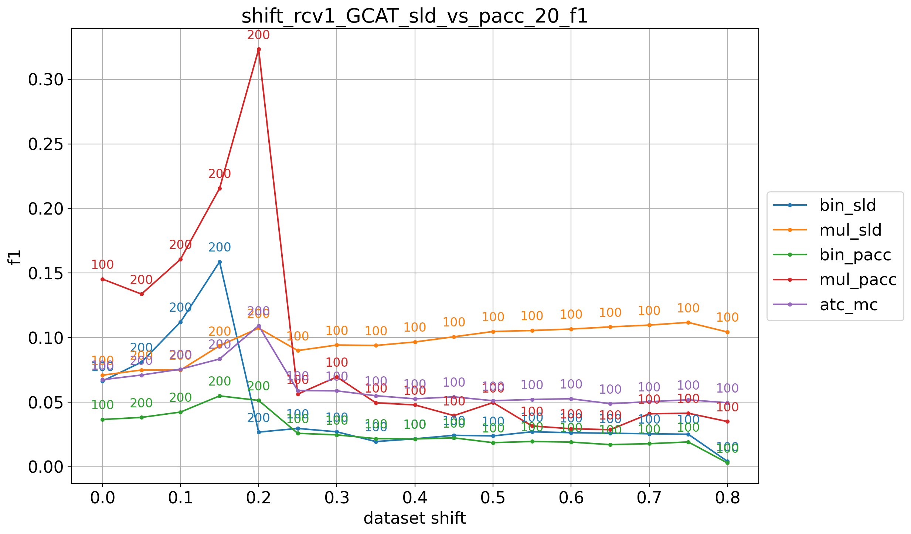

## 30% positives
> train: [0.69989669 0.30010331]  
> validation: [0.70015496 0.29984504]  
> bin_sld: 215.816s  
> mul_sld: 70.089s  
> binmc_sld: 213.798s  
> mulmc_sld: 67.714s  
> binne_sld: 215.552s  
> mulne_sld: 68.181s  
> bin_pacc: 208.609s  
> mul_pacc: 55.495s  
> ref: 46.494s  
> atc_mc: 50.590s  
> tot: 220.459s  

<table border="1" class="dataframe">
  <thead>
    <tr style="text-align: right;">
      <th></th>
      <th>bin_sld</th>
      <th>mul_sld</th>
      <th>bin_pacc</th>
      <th>mul_pacc</th>
      <th>atc_mc</th>
    </tr>
  </thead>
  <tbody>
    <tr>
      <th>0.0</th>
      <td>0.0002</td>
      <td>0.0197</td>
      <td>0.2729</td>
      <td>0.0575</td>
      <td>0.3913</td>
    </tr>
    <tr>
      <th>0.05</th>
      <td>0.3052</td>
      <td>0.0897</td>
      <td>0.0563</td>
      <td>0.1380</td>
      <td>0.0484</td>
    </tr>
    <tr>
      <th>0.1</th>
      <td>0.1280</td>
      <td>0.0582</td>
      <td>0.0428</td>
      <td>0.0865</td>
      <td>0.0293</td>
    </tr>
    <tr>
      <th>0.15</th>
      <td>0.0982</td>
      <td>0.0453</td>
      <td>0.0287</td>
      <td>0.0806</td>
      <td>0.0291</td>
    </tr>
    <tr>
      <th>0.2</th>
      <td>0.0656</td>
      <td>0.0392</td>
      <td>0.0248</td>
      <td>0.0659</td>
      <td>0.0239</td>
    </tr>
    <tr>
      <th>0.25</th>
      <td>0.0516</td>
      <td>0.0324</td>
      <td>0.0219</td>
      <td>0.0578</td>
      <td>0.0193</td>
    </tr>
    <tr>
      <th>0.3</th>
      <td>0.0434</td>
      <td>0.0280</td>
      <td>0.0194</td>
      <td>0.0539</td>
      <td>0.0189</td>
    </tr>
    <tr>
      <th>0.35</th>
      <td>0.0345</td>
      <td>0.0262</td>
      <td>0.0179</td>
      <td>0.0478</td>
      <td>0.0161</td>
    </tr>
    <tr>
      <th>0.4</th>
      <td>0.0330</td>
      <td>0.0269</td>
      <td>0.0193</td>
      <td>0.0481</td>
      <td>0.0145</td>
    </tr>
    <tr>
      <th>0.45</th>
      <td>0.0302</td>
      <td>0.0271</td>
      <td>0.0187</td>
      <td>0.0447</td>
      <td>0.0131</td>
    </tr>
    <tr>
      <th>0.5</th>
      <td>0.0226</td>
      <td>0.0253</td>
      <td>0.0165</td>
      <td>0.0409</td>
      <td>0.0110</td>
    </tr>
    <tr>
      <th>0.55</th>
      <td>0.0230</td>
      <td>0.0266</td>
      <td>0.0166</td>
      <td>0.0396</td>
      <td>0.0115</td>
    </tr>
    <tr>
      <th>0.6</th>
      <td>0.0234</td>
      <td>0.0300</td>
      <td>0.0182</td>
      <td>0.0409</td>
      <td>0.0109</td>
    </tr>
    <tr>
      <th>0.65</th>
      <td>0.0234</td>
      <td>0.0305</td>
      <td>0.0184</td>
      <td>0.0394</td>
      <td>0.0113</td>
    </tr>
    <tr>
      <th>0.7</th>
      <td>0.0195</td>
      <td>0.0313</td>
      <td>0.0172</td>
      <td>0.0383</td>
      <td>0.0088</td>
    </tr>
    <tr>
      <th>0.75</th>
      <td>0.0193</td>
      <td>0.0291</td>
      <td>0.0164</td>
      <td>0.0358</td>
      <td>0.0093</td>
    </tr>
    <tr>
      <th>0.8</th>
      <td>0.0206</td>
      <td>0.0303</td>
      <td>0.0172</td>
      <td>0.0361</td>
      <td>0.0089</td>
    </tr>
    <tr>
      <th>0.85</th>
      <td>0.0195</td>
      <td>0.0305</td>
      <td>0.0165</td>
      <td>0.0342</td>
      <td>0.0087</td>
    </tr>
    <tr>
      <th>0.9</th>
      <td>0.0187</td>
      <td>0.0305</td>
      <td>0.0161</td>
      <td>0.0331</td>
      <td>0.0083</td>
    </tr>
    <tr>
      <th>0.95</th>
      <td>0.0219</td>
      <td>0.0348</td>
      <td>0.0188</td>
      <td>0.0359</td>
      <td>0.0086</td>
    </tr>
    <tr>
      <th>1.0</th>
      <td>0.0087</td>
      <td>0.0346</td>
      <td>0.0152</td>
      <td>0.0331</td>
      <td>0.0073</td>
    </tr>
    <tr>
      <th>avg</th>
      <td>0.0481</td>
      <td>0.0346</td>
      <td>0.0338</td>
      <td>0.0518</td>
      <td>0.0337</td>
    </tr>
  </tbody>
</table>

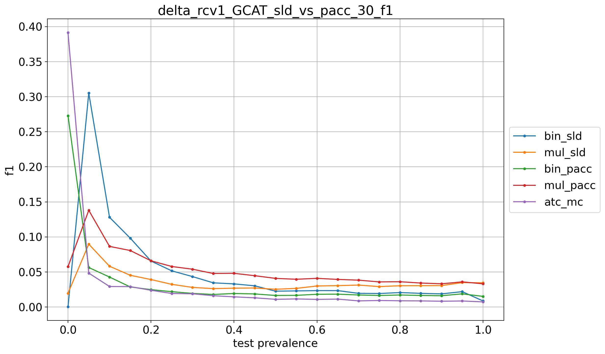

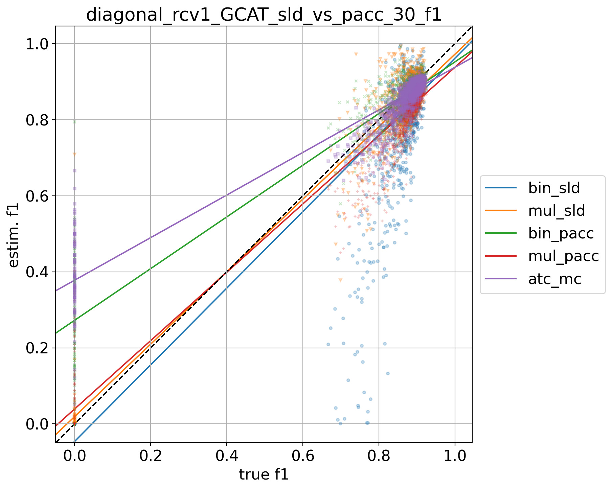
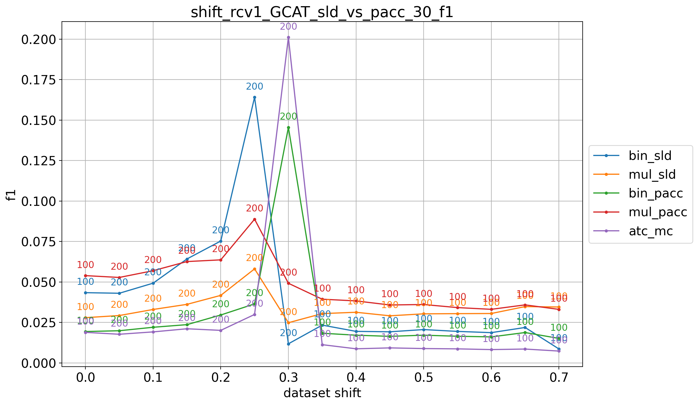

## 40% positives
> train: [0.59994835 0.40005165]  
> validation: [0.59994835 0.40005165]  
> bin_sld: 213.272s  
> mul_sld: 64.236s  
> binmc_sld: 213.186s  
> mulmc_sld: 63.510s  
> binne_sld: 213.277s  
> mulne_sld: 62.919s  
> bin_pacc: 208.657s  
> mul_pacc: 55.226s  
> ref: 46.375s  
> atc_mc: 50.706s  
> tot: 218.174s  

<table border="1" class="dataframe">
  <thead>
    <tr style="text-align: right;">
      <th></th>
      <th>bin_sld</th>
      <th>mul_sld</th>
      <th>bin_pacc</th>
      <th>mul_pacc</th>
      <th>atc_mc</th>
    </tr>
  </thead>
  <tbody>
    <tr>
      <th>0.0</th>
      <td>0.0001</td>
      <td>0.0011</td>
      <td>0.1592</td>
      <td>0.0777</td>
      <td>0.5122</td>
    </tr>
    <tr>
      <th>0.05</th>
      <td>0.1734</td>
      <td>0.0744</td>
      <td>0.0449</td>
      <td>0.0602</td>
      <td>0.0575</td>
    </tr>
    <tr>
      <th>0.1</th>
      <td>0.0607</td>
      <td>0.0467</td>
      <td>0.0312</td>
      <td>0.0393</td>
      <td>0.0264</td>
    </tr>
    <tr>
      <th>0.15</th>
      <td>0.0443</td>
      <td>0.0368</td>
      <td>0.0244</td>
      <td>0.0284</td>
      <td>0.0185</td>
    </tr>
    <tr>
      <th>0.2</th>
      <td>0.0325</td>
      <td>0.0348</td>
      <td>0.0218</td>
      <td>0.0243</td>
      <td>0.0141</td>
    </tr>
    <tr>
      <th>0.25</th>
      <td>0.0269</td>
      <td>0.0303</td>
      <td>0.0217</td>
      <td>0.0218</td>
      <td>0.0145</td>
    </tr>
    <tr>
      <th>0.3</th>
      <td>0.0261</td>
      <td>0.0267</td>
      <td>0.0211</td>
      <td>0.0181</td>
      <td>0.0119</td>
    </tr>
    <tr>
      <th>0.35</th>
      <td>0.0246</td>
      <td>0.0269</td>
      <td>0.0184</td>
      <td>0.0157</td>
      <td>0.0098</td>
    </tr>
    <tr>
      <th>0.4</th>
      <td>0.0203</td>
      <td>0.0222</td>
      <td>0.0200</td>
      <td>0.0143</td>
      <td>0.0093</td>
    </tr>
    <tr>
      <th>0.45</th>
      <td>0.0202</td>
      <td>0.0226</td>
      <td>0.0203</td>
      <td>0.0143</td>
      <td>0.0074</td>
    </tr>
    <tr>
      <th>0.5</th>
      <td>0.0170</td>
      <td>0.0204</td>
      <td>0.0203</td>
      <td>0.0138</td>
      <td>0.0071</td>
    </tr>
    <tr>
      <th>0.55</th>
      <td>0.0161</td>
      <td>0.0191</td>
      <td>0.0208</td>
      <td>0.0130</td>
      <td>0.0076</td>
    </tr>
    <tr>
      <th>0.6</th>
      <td>0.0122</td>
      <td>0.0149</td>
      <td>0.0221</td>
      <td>0.0131</td>
      <td>0.0067</td>
    </tr>
    <tr>
      <th>0.65</th>
      <td>0.0093</td>
      <td>0.0129</td>
      <td>0.0221</td>
      <td>0.0118</td>
      <td>0.0059</td>
    </tr>
    <tr>
      <th>0.7</th>
      <td>0.0086</td>
      <td>0.0107</td>
      <td>0.0236</td>
      <td>0.0130</td>
      <td>0.0057</td>
    </tr>
    <tr>
      <th>0.75</th>
      <td>0.0065</td>
      <td>0.0088</td>
      <td>0.0228</td>
      <td>0.0115</td>
      <td>0.0063</td>
    </tr>
    <tr>
      <th>0.8</th>
      <td>0.0059</td>
      <td>0.0072</td>
      <td>0.0229</td>
      <td>0.0107</td>
      <td>0.0053</td>
    </tr>
    <tr>
      <th>0.85</th>
      <td>0.0083</td>
      <td>0.0071</td>
      <td>0.0250</td>
      <td>0.0126</td>
      <td>0.0055</td>
    </tr>
    <tr>
      <th>0.9</th>
      <td>0.0087</td>
      <td>0.0064</td>
      <td>0.0245</td>
      <td>0.0116</td>
      <td>0.0050</td>
    </tr>
    <tr>
      <th>0.95</th>
      <td>0.0105</td>
      <td>0.0082</td>
      <td>0.0252</td>
      <td>0.0130</td>
      <td>0.0049</td>
    </tr>
    <tr>
      <th>1.0</th>
      <td>0.0022</td>
      <td>0.0058</td>
      <td>0.0248</td>
      <td>0.0125</td>
      <td>0.0054</td>
    </tr>
    <tr>
      <th>avg</th>
      <td>0.0254</td>
      <td>0.0211</td>
      <td>0.0303</td>
      <td>0.0215</td>
      <td>0.0356</td>
    </tr>
  </tbody>
</table>

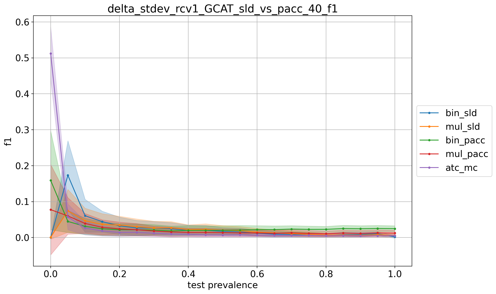
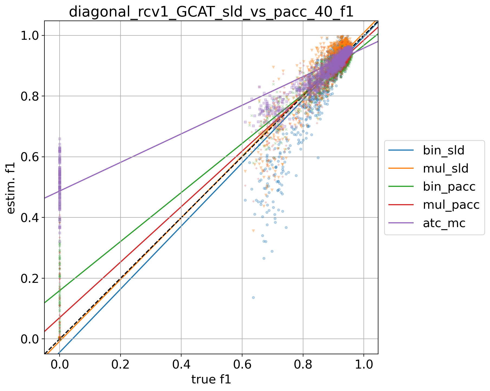
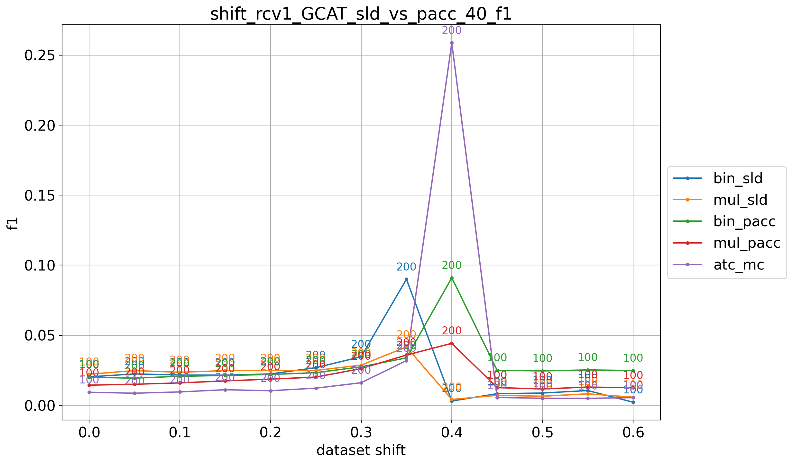

## 50% positives
> train: [0.5 0.5]  
> validation: [0.5 0.5]  
> bin_sld: 213.794s  
> mul_sld: 63.132s  
> binmc_sld: 212.621s  
> mulmc_sld: 62.747s  
> binne_sld: 213.874s  
> mulne_sld: 62.130s  
> bin_pacc: 207.785s  
> mul_pacc: 55.973s  
> ref: 46.679s  
> atc_mc: 50.991s  
> tot: 218.726s  

<table border="1" class="dataframe">
  <thead>
    <tr style="text-align: right;">
      <th></th>
      <th>bin_sld</th>
      <th>mul_sld</th>
      <th>bin_pacc</th>
      <th>mul_pacc</th>
      <th>atc_mc</th>
    </tr>
  </thead>
  <tbody>
    <tr>
      <th>0.0</th>
      <td>0.0001</td>
      <td>0.0007</td>
      <td>0.2001</td>
      <td>0.2243</td>
      <td>0.5861</td>
    </tr>
    <tr>
      <th>0.05</th>
      <td>0.1482</td>
      <td>0.0543</td>
      <td>0.0634</td>
      <td>0.0769</td>
      <td>0.1441</td>
    </tr>
    <tr>
      <th>0.1</th>
      <td>0.0586</td>
      <td>0.0474</td>
      <td>0.0409</td>
      <td>0.0448</td>
      <td>0.0650</td>
    </tr>
    <tr>
      <th>0.15</th>
      <td>0.0424</td>
      <td>0.0396</td>
      <td>0.0309</td>
      <td>0.0312</td>
      <td>0.0438</td>
    </tr>
    <tr>
      <th>0.2</th>
      <td>0.0240</td>
      <td>0.0380</td>
      <td>0.0244</td>
      <td>0.0215</td>
      <td>0.0258</td>
    </tr>
    <tr>
      <th>0.25</th>
      <td>0.0198</td>
      <td>0.0372</td>
      <td>0.0223</td>
      <td>0.0201</td>
      <td>0.0206</td>
    </tr>
    <tr>
      <th>0.3</th>
      <td>0.0189</td>
      <td>0.0318</td>
      <td>0.0181</td>
      <td>0.0143</td>
      <td>0.0140</td>
    </tr>
    <tr>
      <th>0.35</th>
      <td>0.0226</td>
      <td>0.0334</td>
      <td>0.0177</td>
      <td>0.0128</td>
      <td>0.0145</td>
    </tr>
    <tr>
      <th>0.4</th>
      <td>0.0224</td>
      <td>0.0288</td>
      <td>0.0140</td>
      <td>0.0122</td>
      <td>0.0118</td>
    </tr>
    <tr>
      <th>0.45</th>
      <td>0.0245</td>
      <td>0.0282</td>
      <td>0.0134</td>
      <td>0.0103</td>
      <td>0.0089</td>
    </tr>
    <tr>
      <th>0.5</th>
      <td>0.0220</td>
      <td>0.0242</td>
      <td>0.0108</td>
      <td>0.0109</td>
      <td>0.0096</td>
    </tr>
    <tr>
      <th>0.55</th>
      <td>0.0211</td>
      <td>0.0225</td>
      <td>0.0109</td>
      <td>0.0106</td>
      <td>0.0084</td>
    </tr>
    <tr>
      <th>0.6</th>
      <td>0.0178</td>
      <td>0.0200</td>
      <td>0.0094</td>
      <td>0.0098</td>
      <td>0.0079</td>
    </tr>
    <tr>
      <th>0.65</th>
      <td>0.0143</td>
      <td>0.0170</td>
      <td>0.0087</td>
      <td>0.0099</td>
      <td>0.0072</td>
    </tr>
    <tr>
      <th>0.7</th>
      <td>0.0109</td>
      <td>0.0134</td>
      <td>0.0097</td>
      <td>0.0110</td>
      <td>0.0060</td>
    </tr>
    <tr>
      <th>0.75</th>
      <td>0.0087</td>
      <td>0.0116</td>
      <td>0.0092</td>
      <td>0.0098</td>
      <td>0.0064</td>
    </tr>
    <tr>
      <th>0.8</th>
      <td>0.0061</td>
      <td>0.0098</td>
      <td>0.0093</td>
      <td>0.0092</td>
      <td>0.0062</td>
    </tr>
    <tr>
      <th>0.85</th>
      <td>0.0058</td>
      <td>0.0072</td>
      <td>0.0122</td>
      <td>0.0113</td>
      <td>0.0051</td>
    </tr>
    <tr>
      <th>0.9</th>
      <td>0.0061</td>
      <td>0.0061</td>
      <td>0.0122</td>
      <td>0.0107</td>
      <td>0.0048</td>
    </tr>
    <tr>
      <th>0.95</th>
      <td>0.0081</td>
      <td>0.0054</td>
      <td>0.0129</td>
      <td>0.0107</td>
      <td>0.0051</td>
    </tr>
    <tr>
      <th>1.0</th>
      <td>0.0016</td>
      <td>0.0036</td>
      <td>0.0133</td>
      <td>0.0113</td>
      <td>0.0047</td>
    </tr>
    <tr>
      <th>avg</th>
      <td>0.0240</td>
      <td>0.0229</td>
      <td>0.0268</td>
      <td>0.0278</td>
      <td>0.0479</td>
    </tr>
  </tbody>
</table>

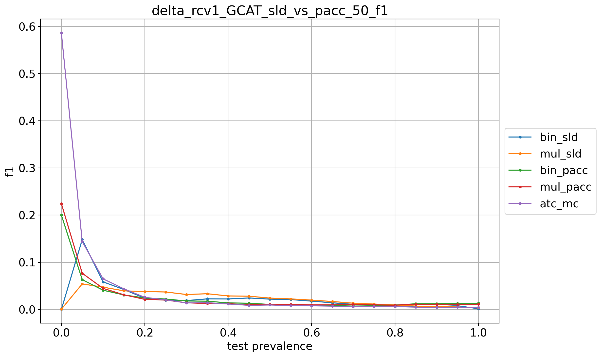

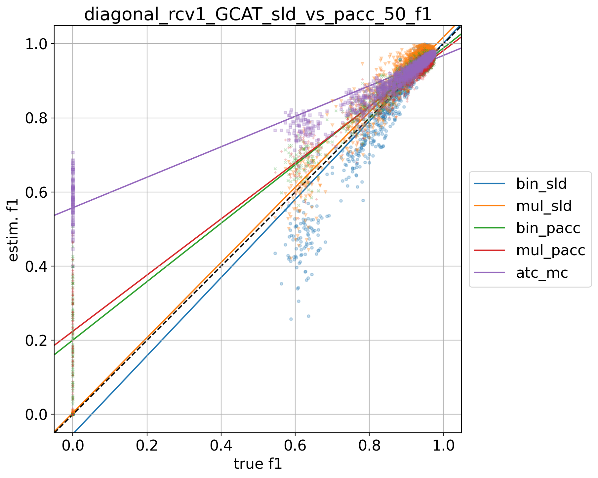
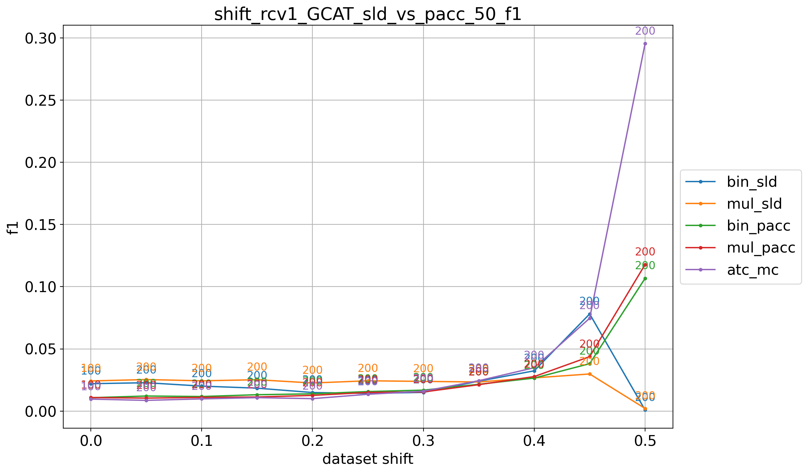

## 60% positives
> train: [0.40005165 0.59994835]  
> validation: [0.40005165 0.59994835]  
> bin_sld: 213.635s  
> mul_sld: 63.211s  
> binmc_sld: 212.836s  
> mulmc_sld: 62.226s  
> binne_sld: 212.259s  
> mulne_sld: 61.992s  
> bin_pacc: 207.509s  
> mul_pacc: 55.534s  
> ref: 46.606s  
> atc_mc: 51.106s  
> tot: 217.198s  

<table border="1" class="dataframe">
  <thead>
    <tr style="text-align: right;">
      <th></th>
      <th>bin_sld</th>
      <th>mul_sld</th>
      <th>bin_pacc</th>
      <th>mul_pacc</th>
      <th>atc_mc</th>
    </tr>
  </thead>
  <tbody>
    <tr>
      <th>0.0</th>
      <td>0.0001</td>
      <td>0.0000</td>
      <td>0.0384</td>
      <td>0.0446</td>
      <td>0.6121</td>
    </tr>
    <tr>
      <th>0.05</th>
      <td>0.1627</td>
      <td>0.0784</td>
      <td>0.0403</td>
      <td>0.0469</td>
      <td>0.2334</td>
    </tr>
    <tr>
      <th>0.1</th>
      <td>0.0822</td>
      <td>0.0352</td>
      <td>0.0327</td>
      <td>0.0317</td>
      <td>0.1135</td>
    </tr>
    <tr>
      <th>0.15</th>
      <td>0.0516</td>
      <td>0.0326</td>
      <td>0.0216</td>
      <td>0.0243</td>
      <td>0.0789</td>
    </tr>
    <tr>
      <th>0.2</th>
      <td>0.0318</td>
      <td>0.0260</td>
      <td>0.0180</td>
      <td>0.0215</td>
      <td>0.0503</td>
    </tr>
    <tr>
      <th>0.25</th>
      <td>0.0217</td>
      <td>0.0250</td>
      <td>0.0168</td>
      <td>0.0187</td>
      <td>0.0383</td>
    </tr>
    <tr>
      <th>0.3</th>
      <td>0.0149</td>
      <td>0.0230</td>
      <td>0.0126</td>
      <td>0.0155</td>
      <td>0.0278</td>
    </tr>
    <tr>
      <th>0.35</th>
      <td>0.0120</td>
      <td>0.0237</td>
      <td>0.0108</td>
      <td>0.0127</td>
      <td>0.0211</td>
    </tr>
    <tr>
      <th>0.4</th>
      <td>0.0127</td>
      <td>0.0230</td>
      <td>0.0105</td>
      <td>0.0104</td>
      <td>0.0176</td>
    </tr>
    <tr>
      <th>0.45</th>
      <td>0.0125</td>
      <td>0.0228</td>
      <td>0.0094</td>
      <td>0.0107</td>
      <td>0.0130</td>
    </tr>
    <tr>
      <th>0.5</th>
      <td>0.0144</td>
      <td>0.0211</td>
      <td>0.0091</td>
      <td>0.0094</td>
      <td>0.0118</td>
    </tr>
    <tr>
      <th>0.55</th>
      <td>0.0163</td>
      <td>0.0210</td>
      <td>0.0102</td>
      <td>0.0099</td>
      <td>0.0098</td>
    </tr>
    <tr>
      <th>0.6</th>
      <td>0.0164</td>
      <td>0.0197</td>
      <td>0.0083</td>
      <td>0.0089</td>
      <td>0.0088</td>
    </tr>
    <tr>
      <th>0.65</th>
      <td>0.0159</td>
      <td>0.0185</td>
      <td>0.0077</td>
      <td>0.0081</td>
      <td>0.0069</td>
    </tr>
    <tr>
      <th>0.7</th>
      <td>0.0141</td>
      <td>0.0156</td>
      <td>0.0067</td>
      <td>0.0082</td>
      <td>0.0057</td>
    </tr>
    <tr>
      <th>0.75</th>
      <td>0.0133</td>
      <td>0.0147</td>
      <td>0.0060</td>
      <td>0.0072</td>
      <td>0.0052</td>
    </tr>
    <tr>
      <th>0.8</th>
      <td>0.0099</td>
      <td>0.0116</td>
      <td>0.0062</td>
      <td>0.0077</td>
      <td>0.0046</td>
    </tr>
    <tr>
      <th>0.85</th>
      <td>0.0074</td>
      <td>0.0094</td>
      <td>0.0061</td>
      <td>0.0079</td>
      <td>0.0039</td>
    </tr>
    <tr>
      <th>0.9</th>
      <td>0.0051</td>
      <td>0.0076</td>
      <td>0.0058</td>
      <td>0.0073</td>
      <td>0.0038</td>
    </tr>
    <tr>
      <th>0.95</th>
      <td>0.0042</td>
      <td>0.0040</td>
      <td>0.0058</td>
      <td>0.0077</td>
      <td>0.0027</td>
    </tr>
    <tr>
      <th>1.0</th>
      <td>0.0007</td>
      <td>0.0015</td>
      <td>0.0052</td>
      <td>0.0078</td>
      <td>0.0026</td>
    </tr>
    <tr>
      <th>avg</th>
      <td>0.0248</td>
      <td>0.0207</td>
      <td>0.0137</td>
      <td>0.0156</td>
      <td>0.0606</td>
    </tr>
  </tbody>
</table>

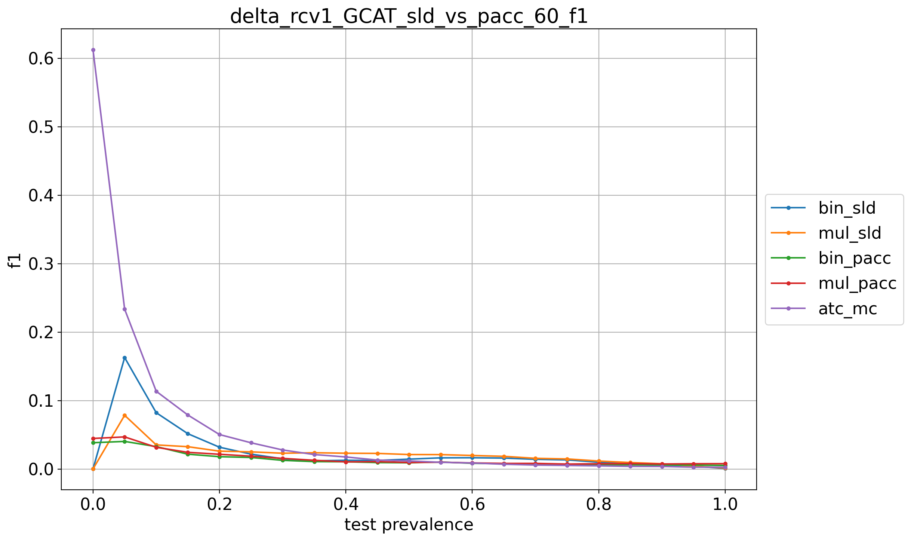
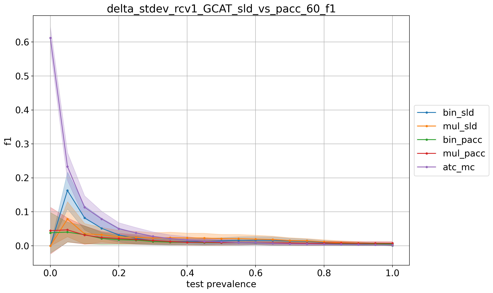
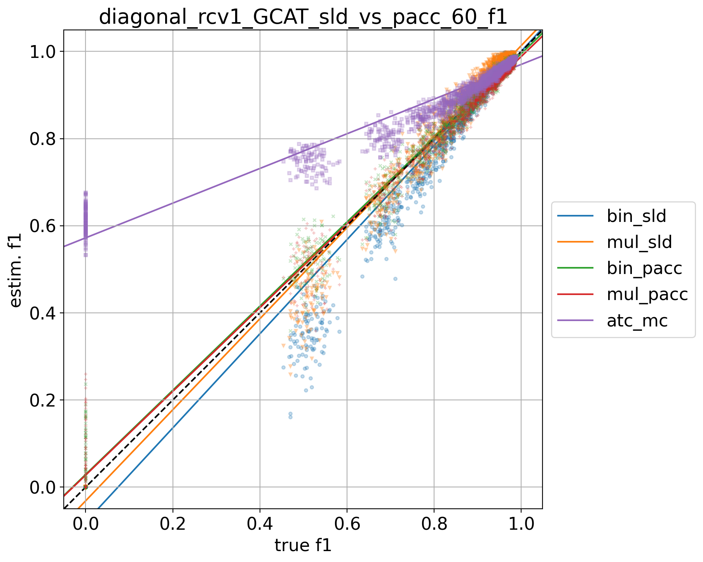
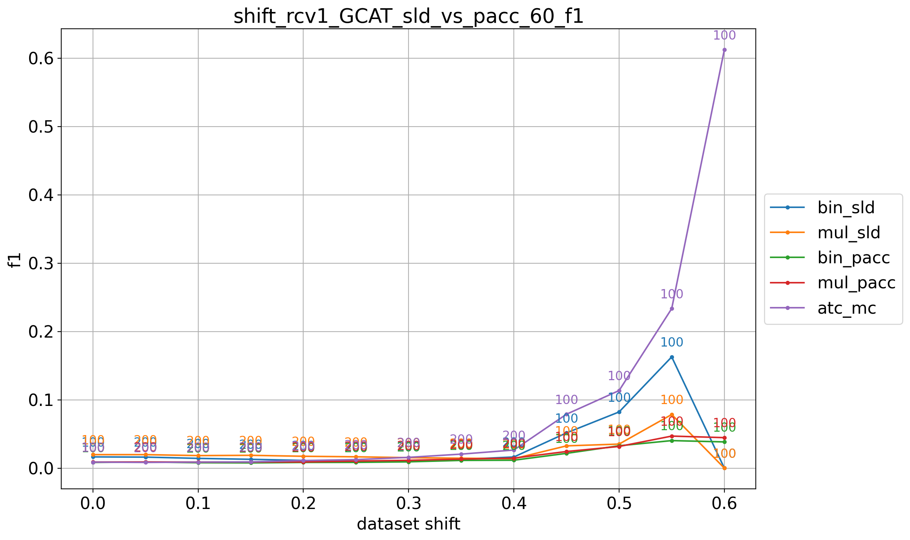

## 70% positives
> train: [0.29984504 0.70015496]  
> validation: [0.30010331 0.69989669]  
> bin_sld: 212.599s  
> mul_sld: 62.605s  
> binmc_sld: 212.279s  
> mulmc_sld: 61.417s  
> binne_sld: 212.832s  
> mulne_sld: 61.371s  
> bin_pacc: 207.524s  
> mul_pacc: 62.649s  
> ref: 45.958s  
> atc_mc: 50.040s  
> tot: 217.791s  

<table border="1" class="dataframe">
  <thead>
    <tr style="text-align: right;">
      <th></th>
      <th>bin_sld</th>
      <th>mul_sld</th>
      <th>bin_pacc</th>
      <th>mul_pacc</th>
      <th>atc_mc</th>
    </tr>
  </thead>
  <tbody>
    <tr>
      <th>0.0</th>
      <td>0.0001</td>
      <td>0.0000</td>
      <td>0.0455</td>
      <td>0.0702</td>
      <td>0.5530</td>
    </tr>
    <tr>
      <th>0.05</th>
      <td>0.1432</td>
      <td>0.1208</td>
      <td>0.0391</td>
      <td>0.0485</td>
      <td>0.2717</td>
    </tr>
    <tr>
      <th>0.1</th>
      <td>0.0948</td>
      <td>0.0741</td>
      <td>0.0310</td>
      <td>0.0315</td>
      <td>0.1554</td>
    </tr>
    <tr>
      <th>0.15</th>
      <td>0.0672</td>
      <td>0.0492</td>
      <td>0.0257</td>
      <td>0.0251</td>
      <td>0.0993</td>
    </tr>
    <tr>
      <th>0.2</th>
      <td>0.0507</td>
      <td>0.0378</td>
      <td>0.0213</td>
      <td>0.0188</td>
      <td>0.0643</td>
    </tr>
    <tr>
      <th>0.25</th>
      <td>0.0382</td>
      <td>0.0276</td>
      <td>0.0189</td>
      <td>0.0159</td>
      <td>0.0433</td>
    </tr>
    <tr>
      <th>0.3</th>
      <td>0.0264</td>
      <td>0.0179</td>
      <td>0.0131</td>
      <td>0.0111</td>
      <td>0.0320</td>
    </tr>
    <tr>
      <th>0.35</th>
      <td>0.0223</td>
      <td>0.0159</td>
      <td>0.0164</td>
      <td>0.0121</td>
      <td>0.0194</td>
    </tr>
    <tr>
      <th>0.4</th>
      <td>0.0165</td>
      <td>0.0130</td>
      <td>0.0126</td>
      <td>0.0091</td>
      <td>0.0151</td>
    </tr>
    <tr>
      <th>0.45</th>
      <td>0.0131</td>
      <td>0.0117</td>
      <td>0.0134</td>
      <td>0.0106</td>
      <td>0.0116</td>
    </tr>
    <tr>
      <th>0.5</th>
      <td>0.0105</td>
      <td>0.0096</td>
      <td>0.0108</td>
      <td>0.0083</td>
      <td>0.0101</td>
    </tr>
    <tr>
      <th>0.55</th>
      <td>0.0099</td>
      <td>0.0110</td>
      <td>0.0125</td>
      <td>0.0095</td>
      <td>0.0058</td>
    </tr>
    <tr>
      <th>0.6</th>
      <td>0.0073</td>
      <td>0.0101</td>
      <td>0.0104</td>
      <td>0.0087</td>
      <td>0.0054</td>
    </tr>
    <tr>
      <th>0.65</th>
      <td>0.0063</td>
      <td>0.0093</td>
      <td>0.0099</td>
      <td>0.0079</td>
      <td>0.0054</td>
    </tr>
    <tr>
      <th>0.7</th>
      <td>0.0057</td>
      <td>0.0089</td>
      <td>0.0104</td>
      <td>0.0088</td>
      <td>0.0044</td>
    </tr>
    <tr>
      <th>0.75</th>
      <td>0.0065</td>
      <td>0.0084</td>
      <td>0.0094</td>
      <td>0.0086</td>
      <td>0.0042</td>
    </tr>
    <tr>
      <th>0.8</th>
      <td>0.0062</td>
      <td>0.0075</td>
      <td>0.0096</td>
      <td>0.0091</td>
      <td>0.0051</td>
    </tr>
    <tr>
      <th>0.85</th>
      <td>0.0064</td>
      <td>0.0071</td>
      <td>0.0094</td>
      <td>0.0096</td>
      <td>0.0046</td>
    </tr>
    <tr>
      <th>0.9</th>
      <td>0.0059</td>
      <td>0.0058</td>
      <td>0.0083</td>
      <td>0.0094</td>
      <td>0.0045</td>
    </tr>
    <tr>
      <th>0.95</th>
      <td>0.0058</td>
      <td>0.0042</td>
      <td>0.0086</td>
      <td>0.0103</td>
      <td>0.0044</td>
    </tr>
    <tr>
      <th>1.0</th>
      <td>0.0023</td>
      <td>0.0023</td>
      <td>0.0084</td>
      <td>0.0114</td>
      <td>0.0051</td>
    </tr>
    <tr>
      <th>avg</th>
      <td>0.0260</td>
      <td>0.0215</td>
      <td>0.0164</td>
      <td>0.0169</td>
      <td>0.0631</td>
    </tr>
  </tbody>
</table>

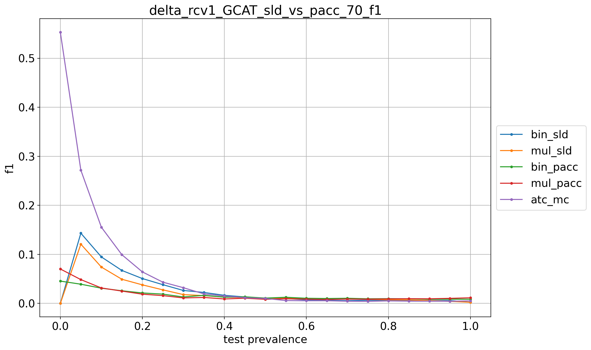
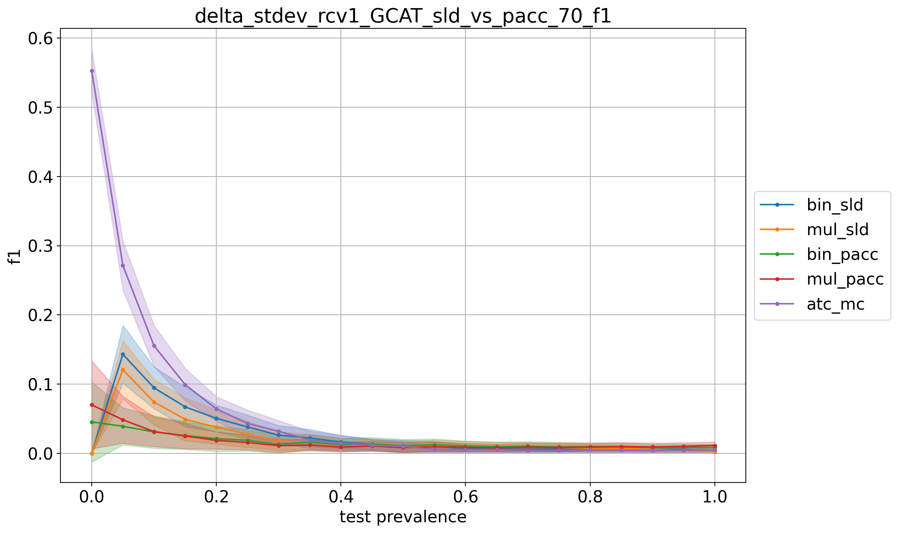
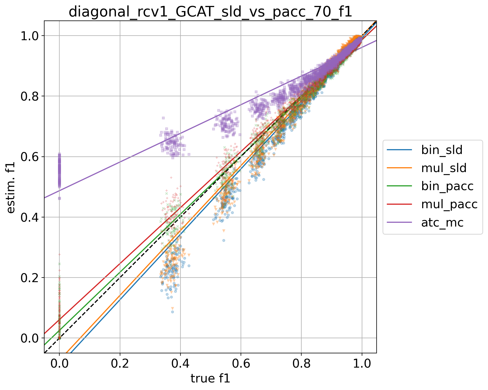
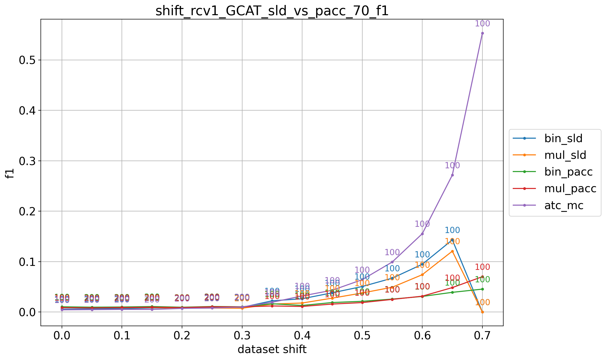

## 80% positives
> train: [0.19989669 0.80010331]  
> validation: [0.20015496 0.79984504]  
> bin_sld: 213.706s  
> mul_sld: 61.535s  
> binmc_sld: 213.790s  
> mulmc_sld: 60.661s  
> binne_sld: 212.442s  
> mulne_sld: 60.162s  
> bin_pacc: 207.754s  
> mul_pacc: 55.905s  
> ref: 46.700s  
> atc_mc: 50.642s  
> tot: 217.447s  

<table border="1" class="dataframe">
  <thead>
    <tr style="text-align: right;">
      <th></th>
      <th>bin_sld</th>
      <th>mul_sld</th>
      <th>bin_pacc</th>
      <th>mul_pacc</th>
      <th>atc_mc</th>
    </tr>
  </thead>
  <tbody>
    <tr>
      <th>0.0</th>
      <td>0.0000</td>
      <td>0.0000</td>
      <td>0.0824</td>
      <td>0.0000</td>
      <td>0.5543</td>
    </tr>
    <tr>
      <th>0.05</th>
      <td>0.1781</td>
      <td>0.1554</td>
      <td>0.0444</td>
      <td>0.1467</td>
      <td>0.3560</td>
    </tr>
    <tr>
      <th>0.1</th>
      <td>0.1338</td>
      <td>0.1191</td>
      <td>0.0326</td>
      <td>0.1073</td>
      <td>0.2466</td>
    </tr>
    <tr>
      <th>0.15</th>
      <td>0.0973</td>
      <td>0.0894</td>
      <td>0.0237</td>
      <td>0.0824</td>
      <td>0.1736</td>
    </tr>
    <tr>
      <th>0.2</th>
      <td>0.0733</td>
      <td>0.0681</td>
      <td>0.0193</td>
      <td>0.0637</td>
      <td>0.1294</td>
    </tr>
    <tr>
      <th>0.25</th>
      <td>0.0544</td>
      <td>0.0487</td>
      <td>0.0143</td>
      <td>0.0510</td>
      <td>0.0960</td>
    </tr>
    <tr>
      <th>0.3</th>
      <td>0.0381</td>
      <td>0.0324</td>
      <td>0.0131</td>
      <td>0.0390</td>
      <td>0.0688</td>
    </tr>
    <tr>
      <th>0.35</th>
      <td>0.0319</td>
      <td>0.0282</td>
      <td>0.0095</td>
      <td>0.0383</td>
      <td>0.0486</td>
    </tr>
    <tr>
      <th>0.4</th>
      <td>0.0217</td>
      <td>0.0188</td>
      <td>0.0083</td>
      <td>0.0270</td>
      <td>0.0379</td>
    </tr>
    <tr>
      <th>0.45</th>
      <td>0.0171</td>
      <td>0.0146</td>
      <td>0.0090</td>
      <td>0.0257</td>
      <td>0.0268</td>
    </tr>
    <tr>
      <th>0.5</th>
      <td>0.0109</td>
      <td>0.0097</td>
      <td>0.0069</td>
      <td>0.0190</td>
      <td>0.0223</td>
    </tr>
    <tr>
      <th>0.55</th>
      <td>0.0100</td>
      <td>0.0107</td>
      <td>0.0060</td>
      <td>0.0181</td>
      <td>0.0150</td>
    </tr>
    <tr>
      <th>0.6</th>
      <td>0.0064</td>
      <td>0.0082</td>
      <td>0.0053</td>
      <td>0.0131</td>
      <td>0.0119</td>
    </tr>
    <tr>
      <th>0.65</th>
      <td>0.0056</td>
      <td>0.0105</td>
      <td>0.0052</td>
      <td>0.0105</td>
      <td>0.0086</td>
    </tr>
    <tr>
      <th>0.7</th>
      <td>0.0055</td>
      <td>0.0092</td>
      <td>0.0049</td>
      <td>0.0098</td>
      <td>0.0067</td>
    </tr>
    <tr>
      <th>0.75</th>
      <td>0.0053</td>
      <td>0.0094</td>
      <td>0.0040</td>
      <td>0.0072</td>
      <td>0.0046</td>
    </tr>
    <tr>
      <th>0.8</th>
      <td>0.0061</td>
      <td>0.0109</td>
      <td>0.0043</td>
      <td>0.0060</td>
      <td>0.0044</td>
    </tr>
    <tr>
      <th>0.85</th>
      <td>0.0068</td>
      <td>0.0109</td>
      <td>0.0037</td>
      <td>0.0046</td>
      <td>0.0036</td>
    </tr>
    <tr>
      <th>0.9</th>
      <td>0.0078</td>
      <td>0.0106</td>
      <td>0.0034</td>
      <td>0.0040</td>
      <td>0.0034</td>
    </tr>
    <tr>
      <th>0.95</th>
      <td>0.0061</td>
      <td>0.0068</td>
      <td>0.0033</td>
      <td>0.0039</td>
      <td>0.0036</td>
    </tr>
    <tr>
      <th>1.0</th>
      <td>0.0003</td>
      <td>0.0012</td>
      <td>0.0024</td>
      <td>0.0022</td>
      <td>0.0041</td>
    </tr>
    <tr>
      <th>avg</th>
      <td>0.0341</td>
      <td>0.0320</td>
      <td>0.0146</td>
      <td>0.0324</td>
      <td>0.0870</td>
    </tr>
  </tbody>
</table>

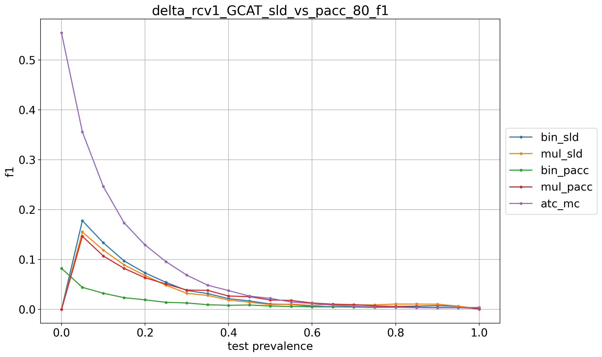
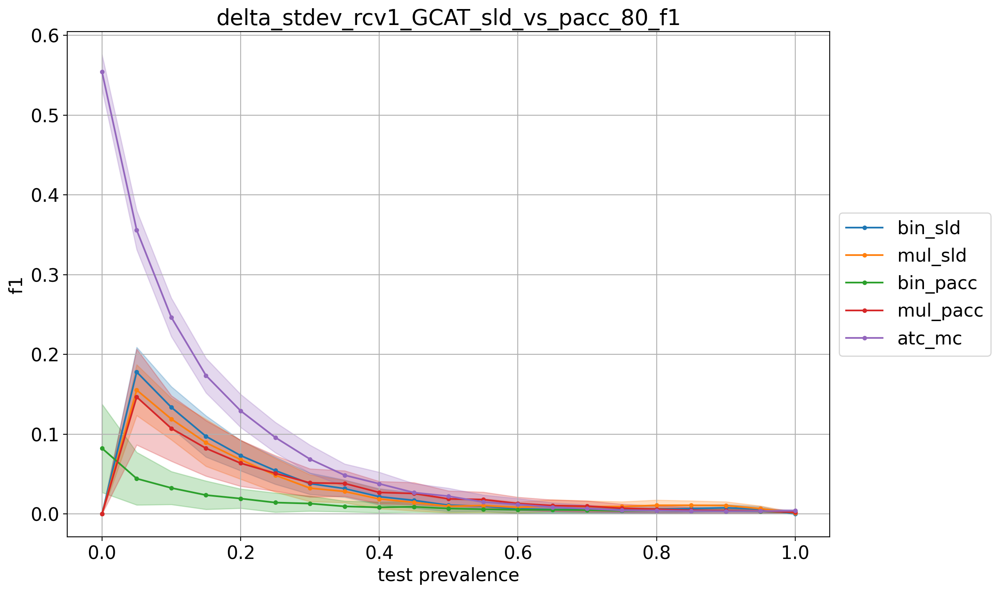
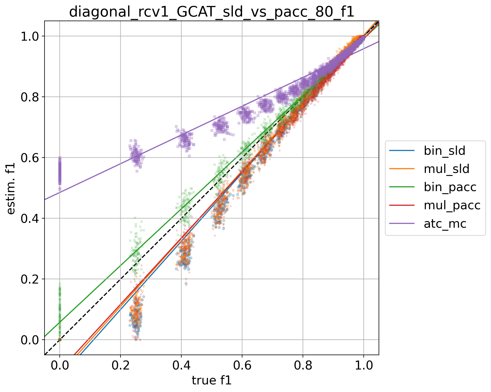
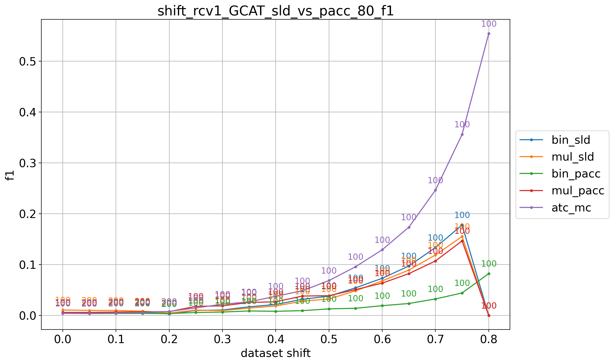

## 90% positives
> train: [0.09994835 0.90005165]  
> validation: [0.09994835 0.90005165]  
> mul_sld: 53.914s  
> mulmc_sld: 46.025s  
> mulne_sld: 45.194s  
> ref: 36.408s  
> atc_mc: 39.138s  
> tot: 55.916s  

<table border="1" class="dataframe">
  <thead>
    <tr style="text-align: right;">
      <th></th>
      <th>mul_sld</th>
      <th>atc_mc</th>
    </tr>
  </thead>
  <tbody>
    <tr>
      <th>0.0</th>
      <td>0.0000</td>
      <td>0.4608</td>
    </tr>
    <tr>
      <th>0.05</th>
      <td>0.1271</td>
      <td>0.3731</td>
    </tr>
    <tr>
      <th>0.1</th>
      <td>0.2088</td>
      <td>0.3053</td>
    </tr>
    <tr>
      <th>0.15</th>
      <td>0.1951</td>
      <td>0.2498</td>
    </tr>
    <tr>
      <th>0.2</th>
      <td>0.1705</td>
      <td>0.2053</td>
    </tr>
    <tr>
      <th>0.25</th>
      <td>0.1446</td>
      <td>0.1687</td>
    </tr>
    <tr>
      <th>0.3</th>
      <td>0.1199</td>
      <td>0.1354</td>
    </tr>
    <tr>
      <th>0.35</th>
      <td>0.1054</td>
      <td>0.1093</td>
    </tr>
    <tr>
      <th>0.4</th>
      <td>0.0838</td>
      <td>0.0883</td>
    </tr>
    <tr>
      <th>0.45</th>
      <td>0.0717</td>
      <td>0.0693</td>
    </tr>
    <tr>
      <th>0.5</th>
      <td>0.0557</td>
      <td>0.0554</td>
    </tr>
    <tr>
      <th>0.55</th>
      <td>0.0471</td>
      <td>0.0420</td>
    </tr>
    <tr>
      <th>0.6</th>
      <td>0.0321</td>
      <td>0.0326</td>
    </tr>
    <tr>
      <th>0.65</th>
      <td>0.0240</td>
      <td>0.0245</td>
    </tr>
    <tr>
      <th>0.7</th>
      <td>0.0180</td>
      <td>0.0169</td>
    </tr>
    <tr>
      <th>0.75</th>
      <td>0.0109</td>
      <td>0.0103</td>
    </tr>
    <tr>
      <th>0.8</th>
      <td>0.0067</td>
      <td>0.0063</td>
    </tr>
    <tr>
      <th>0.85</th>
      <td>0.0055</td>
      <td>0.0038</td>
    </tr>
    <tr>
      <th>0.9</th>
      <td>0.0059</td>
      <td>0.0032</td>
    </tr>
    <tr>
      <th>0.95</th>
      <td>0.0067</td>
      <td>0.0038</td>
    </tr>
    <tr>
      <th>1.0</th>
      <td>0.0003</td>
      <td>0.0045</td>
    </tr>
    <tr>
      <th>avg</th>
      <td>0.0686</td>
      <td>0.1128</td>
    </tr>
  </tbody>
</table>

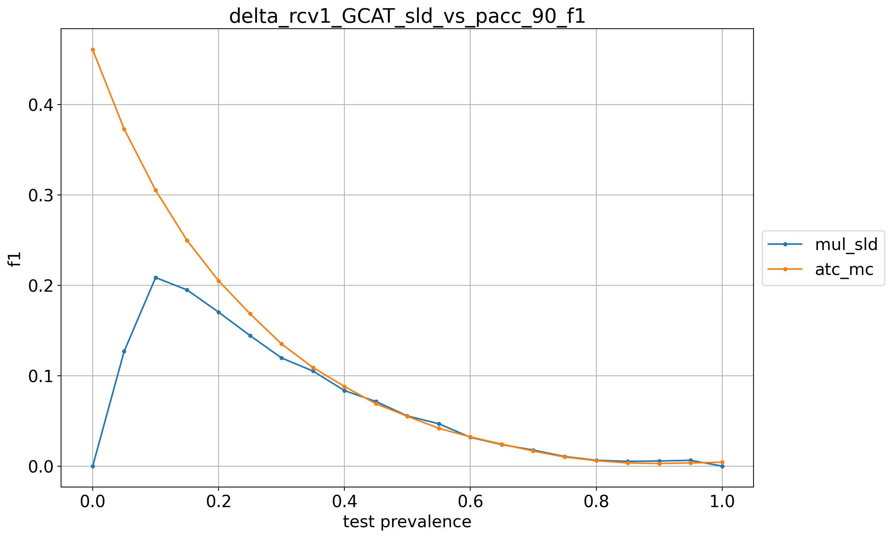
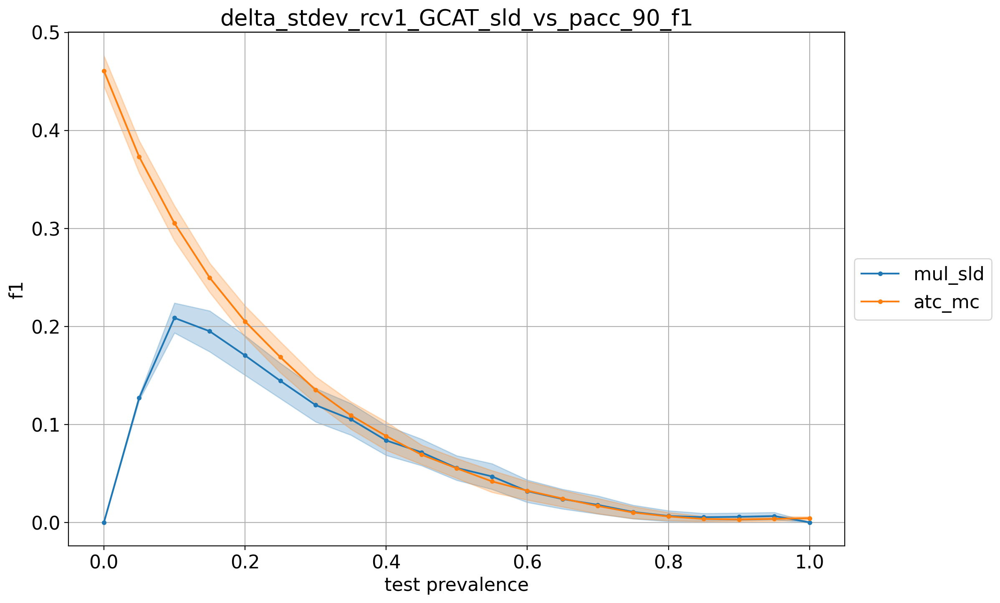
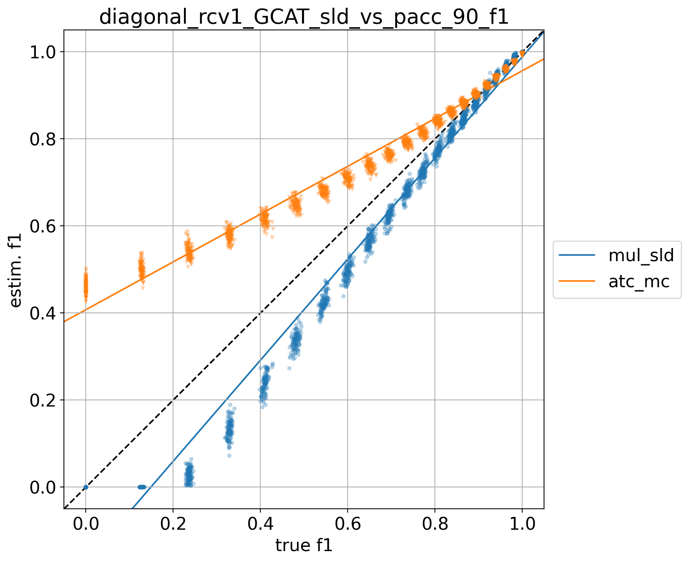
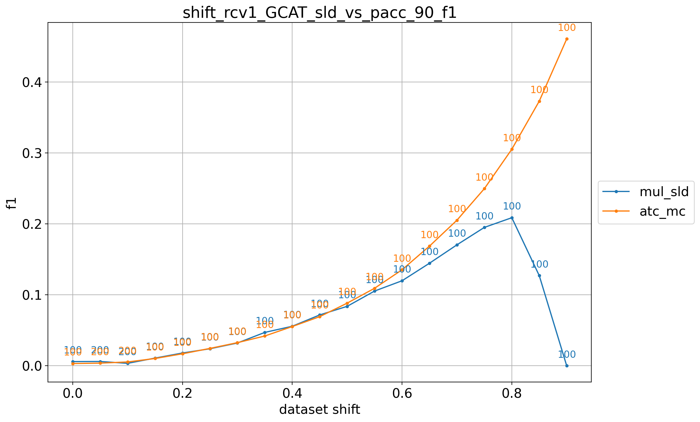

## avg
### avg on train
<table border="1" class="dataframe">
  <thead>
    <tr style="text-align: right;">
      <th></th>
      <th>bin_sld</th>
      <th>mul_sld</th>
      <th>bin_pacc</th>
      <th>mul_pacc</th>
      <th>atc_mc</th>
    </tr>
  </thead>
  <tbody>
    <tr>
      <th>0.0</th>
      <td>0.0166</td>
      <td>0.0242</td>
      <td>0.1246</td>
      <td>0.1461</td>
      <td>0.4260</td>
    </tr>
    <tr>
      <th>0.05</th>
      <td>0.1838</td>
      <td>0.1017</td>
      <td>0.0533</td>
      <td>0.1153</td>
      <td>0.2154</td>
    </tr>
    <tr>
      <th>0.1</th>
      <td>0.0961</td>
      <td>0.0809</td>
      <td>0.0381</td>
      <td>0.0751</td>
      <td>0.1508</td>
    </tr>
    <tr>
      <th>0.15</th>
      <td>0.0664</td>
      <td>0.0728</td>
      <td>0.0283</td>
      <td>0.0587</td>
      <td>0.1230</td>
    </tr>
    <tr>
      <th>0.2</th>
      <td>0.0467</td>
      <td>0.0688</td>
      <td>0.0237</td>
      <td>0.0516</td>
      <td>0.1023</td>
    </tr>
    <tr>
      <th>0.25</th>
      <td>0.0379</td>
      <td>0.0631</td>
      <td>0.0213</td>
      <td>0.0448</td>
      <td>0.0888</td>
    </tr>
    <tr>
      <th>0.3</th>
      <td>0.0305</td>
      <td>0.0560</td>
      <td>0.0180</td>
      <td>0.0412</td>
      <td>0.0786</td>
    </tr>
    <tr>
      <th>0.35</th>
      <td>0.0267</td>
      <td>0.0541</td>
      <td>0.0166</td>
      <td>0.0400</td>
      <td>0.0695</td>
    </tr>
    <tr>
      <th>0.4</th>
      <td>0.0259</td>
      <td>0.0507</td>
      <td>0.0162</td>
      <td>0.0313</td>
      <td>0.0659</td>
    </tr>
    <tr>
      <th>0.45</th>
      <td>0.0238</td>
      <td>0.0486</td>
      <td>0.0157</td>
      <td>0.0246</td>
      <td>0.0603</td>
    </tr>
    <tr>
      <th>0.5</th>
      <td>0.0212</td>
      <td>0.0451</td>
      <td>0.0141</td>
      <td>0.0246</td>
      <td>0.0578</td>
    </tr>
    <tr>
      <th>0.55</th>
      <td>0.0201</td>
      <td>0.0438</td>
      <td>0.0141</td>
      <td>0.0215</td>
      <td>0.0542</td>
    </tr>
    <tr>
      <th>0.6</th>
      <td>0.0190</td>
      <td>0.0415</td>
      <td>0.0136</td>
      <td>0.0203</td>
      <td>0.0530</td>
    </tr>
    <tr>
      <th>0.65</th>
      <td>0.0183</td>
      <td>0.0397</td>
      <td>0.0135</td>
      <td>0.0182</td>
      <td>0.0507</td>
    </tr>
    <tr>
      <th>0.7</th>
      <td>0.0169</td>
      <td>0.0380</td>
      <td>0.0130</td>
      <td>0.0198</td>
      <td>0.0488</td>
    </tr>
    <tr>
      <th>0.75</th>
      <td>0.0166</td>
      <td>0.0355</td>
      <td>0.0125</td>
      <td>0.0160</td>
      <td>0.0483</td>
    </tr>
    <tr>
      <th>0.8</th>
      <td>0.0159</td>
      <td>0.0316</td>
      <td>0.0126</td>
      <td>0.0155</td>
      <td>0.0473</td>
    </tr>
    <tr>
      <th>0.85</th>
      <td>0.0157</td>
      <td>0.0270</td>
      <td>0.0129</td>
      <td>0.0156</td>
      <td>0.0469</td>
    </tr>
    <tr>
      <th>0.9</th>
      <td>0.0144</td>
      <td>0.0245</td>
      <td>0.0126</td>
      <td>0.0167</td>
      <td>0.0467</td>
    </tr>
    <tr>
      <th>0.95</th>
      <td>0.0127</td>
      <td>0.0260</td>
      <td>0.0134</td>
      <td>0.0175</td>
      <td>0.0464</td>
    </tr>
    <tr>
      <th>1.0</th>
      <td>0.0028</td>
      <td>0.0190</td>
      <td>0.0103</td>
      <td>0.0162</td>
      <td>0.0465</td>
    </tr>
    <tr>
      <th>avg</th>
      <td>0.0347</td>
      <td>0.0473</td>
      <td>0.0237</td>
      <td>0.0396</td>
      <td>0.0918</td>
    </tr>
  </tbody>
</table>

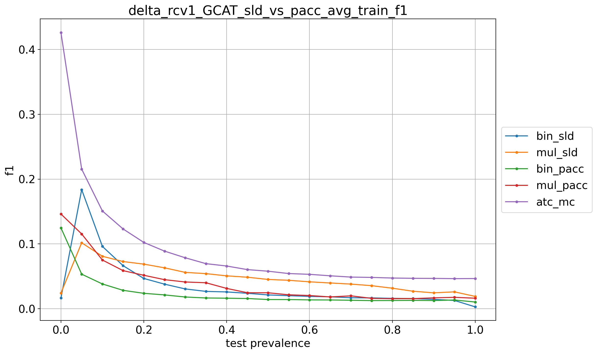
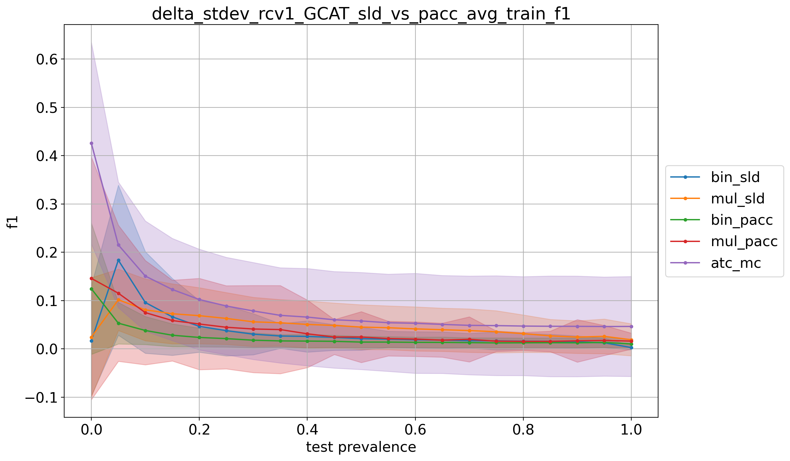
### avg on test
<table border="1" class="dataframe">
  <thead>
    <tr style="text-align: right;">
      <th></th>
      <th>bin_sld</th>
      <th>mul_sld</th>
      <th>bin_pacc</th>
      <th>mul_pacc</th>
      <th>atc_mc</th>
    </tr>
  </thead>
  <tbody>
    <tr>
      <th>0.1</th>
      <td>0.0423</td>
      <td>0.1089</td>
      <td>NaN</td>
      <td>NaN</td>
      <td>0.3196</td>
    </tr>
    <tr>
      <th>0.2</th>
      <td>0.0525</td>
      <td>0.0952</td>
      <td>0.0305</td>
      <td>0.1110</td>
      <td>0.0658</td>
    </tr>
    <tr>
      <th>0.3</th>
      <td>0.0481</td>
      <td>0.0346</td>
      <td>0.0338</td>
      <td>0.0518</td>
      <td>0.0337</td>
    </tr>
    <tr>
      <th>0.4</th>
      <td>0.0254</td>
      <td>0.0211</td>
      <td>0.0303</td>
      <td>0.0215</td>
      <td>0.0356</td>
    </tr>
    <tr>
      <th>0.5</th>
      <td>0.0240</td>
      <td>0.0229</td>
      <td>0.0268</td>
      <td>0.0278</td>
      <td>0.0479</td>
    </tr>
    <tr>
      <th>0.6</th>
      <td>0.0248</td>
      <td>0.0207</td>
      <td>0.0137</td>
      <td>0.0156</td>
      <td>0.0606</td>
    </tr>
    <tr>
      <th>0.7</th>
      <td>0.0260</td>
      <td>0.0215</td>
      <td>0.0164</td>
      <td>0.0169</td>
      <td>0.0631</td>
    </tr>
    <tr>
      <th>0.8</th>
      <td>0.0341</td>
      <td>0.0320</td>
      <td>0.0146</td>
      <td>0.0324</td>
      <td>0.0870</td>
    </tr>
    <tr>
      <th>0.9</th>
      <td>NaN</td>
      <td>0.0686</td>
      <td>NaN</td>
      <td>NaN</td>
      <td>0.1128</td>
    </tr>
    <tr>
      <th>avg</th>
      <td>0.0347</td>
      <td>0.0473</td>
      <td>0.0237</td>
      <td>0.0396</td>
      <td>0.0918</td>
    </tr>
  </tbody>
</table>

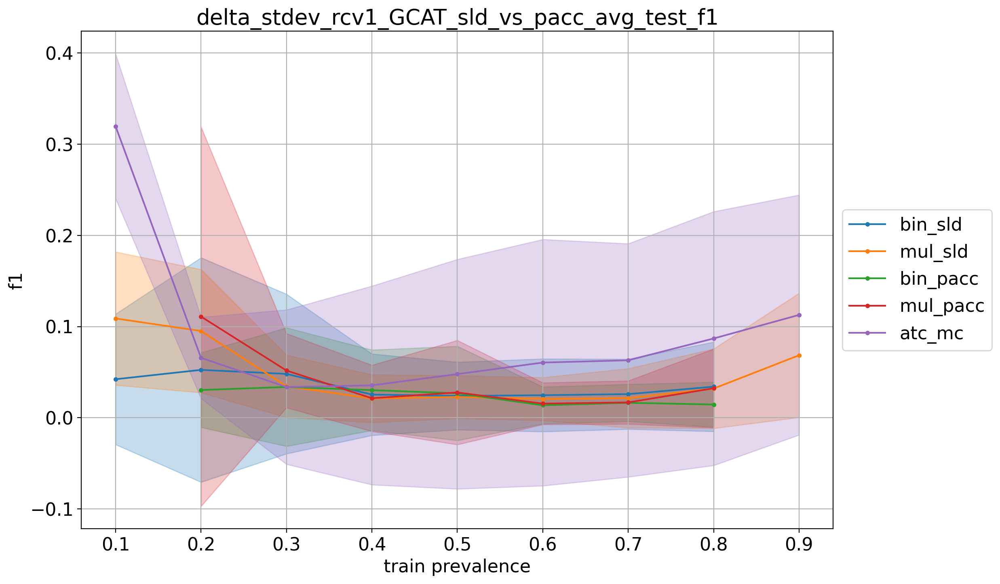
### avg dataset shift
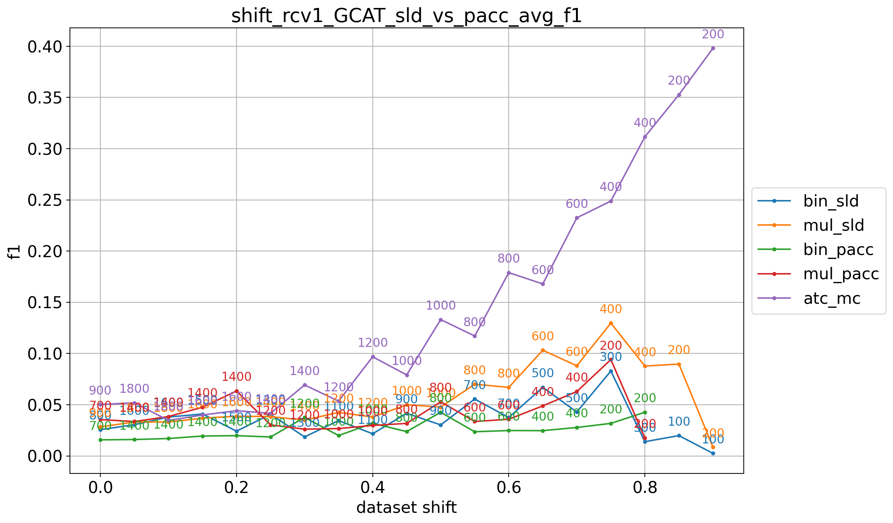
