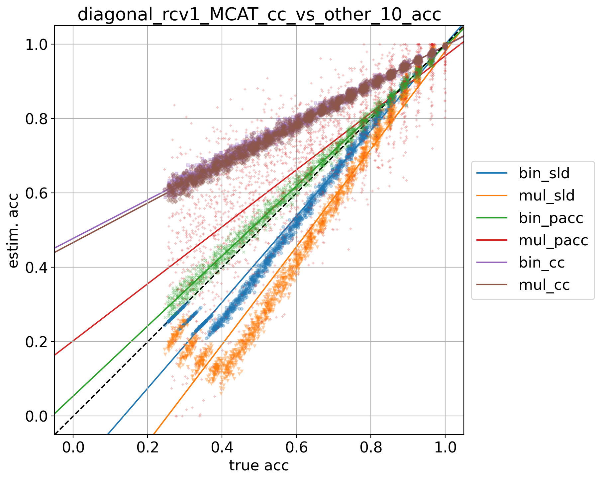

# rcv1_MCAT_9prevs

## 10% positives
> train: [0.90021426 0.09978574]  
> validation: [0.8999388 0.1000612]  
> bin_sld: 492.046s  
> mul_sld: 249.698s  
> bin_sld_gs: 1146.562s  
> mul_sld_gs: 704.644s  
> bin_sld_gsq: 539.255s  
> mul_sld_gsq: 529.819s  
> bin_pacc: 475.786s  
> mul_pacc: 168.324s  
> binmc_pacc: 472.270s  
> mulmc_pacc: 173.273s  
> binne_pacc: 443.131s  
> mulne_pacc: 185.335s  
> bin_pacc_gs: 763.354s  
> mul_pacc_gs: 287.763s  
> bin_cc: 427.742s  
> mul_cc: 164.350s  
> kfcv: 136.304s  
> ref: 125.561s  
> atc_mc: 115.380s  
> atc_ne: 129.775s  
> doc_feat: 81.285s  
> tot: 1152.170s  

<table border="1" class="dataframe">
  <thead>
    <tr style="text-align: right;">
      <th></th>
      <th>bin_sld</th>
      <th>mul_sld</th>
      <th>bin_pacc</th>
      <th>mul_pacc</th>
      <th>bin_cc</th>
      <th>mul_cc</th>
    </tr>
  </thead>
  <tbody>
    <tr>
      <th>0.0</th>
      <td>0.0005</td>
      <td>0.0004</td>
      <td>0.0035</td>
      <td>0.0233</td>
      <td>0.0042</td>
      <td>0.0036</td>
    </tr>
    <tr>
      <th>0.05</th>
      <td>0.0084</td>
      <td>0.0105</td>
      <td>0.0060</td>
      <td>0.0434</td>
      <td>0.0128</td>
      <td>0.0134</td>
    </tr>
    <tr>
      <th>0.1</th>
      <td>0.0075</td>
      <td>0.0149</td>
      <td>0.0059</td>
      <td>0.0439</td>
      <td>0.0313</td>
      <td>0.0307</td>
    </tr>
    <tr>
      <th>0.15</th>
      <td>0.0080</td>
      <td>0.0266</td>
      <td>0.0080</td>
      <td>0.0653</td>
      <td>0.0488</td>
      <td>0.0484</td>
    </tr>
    <tr>
      <th>0.2</th>
      <td>0.0103</td>
      <td>0.0439</td>
      <td>0.0091</td>
      <td>0.0708</td>
      <td>0.0651</td>
      <td>0.0648</td>
    </tr>
    <tr>
      <th>0.25</th>
      <td>0.0165</td>
      <td>0.0612</td>
      <td>0.0110</td>
      <td>0.0699</td>
      <td>0.0838</td>
      <td>0.0821</td>
    </tr>
    <tr>
      <th>0.3</th>
      <td>0.0235</td>
      <td>0.0801</td>
      <td>0.0134</td>
      <td>0.0790</td>
      <td>0.1023</td>
      <td>0.1006</td>
    </tr>
    <tr>
      <th>0.35</th>
      <td>0.0350</td>
      <td>0.1015</td>
      <td>0.0144</td>
      <td>0.0953</td>
      <td>0.1190</td>
      <td>0.1167</td>
    </tr>
    <tr>
      <th>0.4</th>
      <td>0.0473</td>
      <td>0.1247</td>
      <td>0.0143</td>
      <td>0.0875</td>
      <td>0.1347</td>
      <td>0.1320</td>
    </tr>
    <tr>
      <th>0.45</th>
      <td>0.0563</td>
      <td>0.1447</td>
      <td>0.0169</td>
      <td>0.1157</td>
      <td>0.1541</td>
      <td>0.1514</td>
    </tr>
    <tr>
      <th>0.5</th>
      <td>0.0676</td>
      <td>0.1624</td>
      <td>0.0192</td>
      <td>0.0982</td>
      <td>0.1722</td>
      <td>0.1694</td>
    </tr>
    <tr>
      <th>0.55</th>
      <td>0.0803</td>
      <td>0.1881</td>
      <td>0.0205</td>
      <td>0.1158</td>
      <td>0.1875</td>
      <td>0.1832</td>
    </tr>
    <tr>
      <th>0.6</th>
      <td>0.0905</td>
      <td>0.2041</td>
      <td>0.0252</td>
      <td>0.1284</td>
      <td>0.2085</td>
      <td>0.2038</td>
    </tr>
    <tr>
      <th>0.65</th>
      <td>0.1034</td>
      <td>0.2280</td>
      <td>0.0248</td>
      <td>0.1432</td>
      <td>0.2244</td>
      <td>0.2194</td>
    </tr>
    <tr>
      <th>0.7</th>
      <td>0.1165</td>
      <td>0.2499</td>
      <td>0.0252</td>
      <td>0.1414</td>
      <td>0.2410</td>
      <td>0.2350</td>
    </tr>
    <tr>
      <th>0.75</th>
      <td>0.1271</td>
      <td>0.2660</td>
      <td>0.0281</td>
      <td>0.1622</td>
      <td>0.2584</td>
      <td>0.2519</td>
    </tr>
    <tr>
      <th>0.8</th>
      <td>0.1381</td>
      <td>0.2853</td>
      <td>0.0284</td>
      <td>0.1732</td>
      <td>0.2756</td>
      <td>0.2681</td>
    </tr>
    <tr>
      <th>0.85</th>
      <td>0.1419</td>
      <td>0.2570</td>
      <td>0.0315</td>
      <td>0.1648</td>
      <td>0.2924</td>
      <td>0.2861</td>
    </tr>
    <tr>
      <th>0.9</th>
      <td>0.1005</td>
      <td>0.1951</td>
      <td>0.0330</td>
      <td>0.1652</td>
      <td>0.3104</td>
      <td>0.3040</td>
    </tr>
    <tr>
      <th>0.95</th>
      <td>0.0508</td>
      <td>0.1306</td>
      <td>0.0364</td>
      <td>0.1852</td>
      <td>0.3280</td>
      <td>0.3212</td>
    </tr>
    <tr>
      <th>1.0</th>
      <td>0.0010</td>
      <td>0.0574</td>
      <td>0.0375</td>
      <td>0.2159</td>
      <td>0.3445</td>
      <td>0.3366</td>
    </tr>
    <tr>
      <th>avg</th>
      <td>0.0586</td>
      <td>0.1349</td>
      <td>0.0196</td>
      <td>0.1137</td>
      <td>0.1714</td>
      <td>0.1677</td>
    </tr>
  </tbody>
</table>

## 20% positives
> train: [0.80012244 0.19987756]  
> validation: [0.7998776 0.2001224]  
> bin_sld: 448.690s  
> mul_sld: 179.540s  
> bin_sld_gs: 1128.970s  
> mul_sld_gs: 661.362s  
> bin_sld_gsq: 542.638s  
> mul_sld_gsq: 485.856s  
> bin_pacc: 435.959s  
> mul_pacc: 162.000s  
> binmc_pacc: 436.717s  
> mulmc_pacc: 159.011s  
> binne_pacc: 430.393s  
> mulne_pacc: 170.319s  
> bin_pacc_gs: 747.860s  
> mul_pacc_gs: 259.443s  
> bin_cc: 413.372s  
> mul_cc: 153.995s  
> kfcv: 138.378s  
> ref: 133.916s  
> atc_mc: 127.515s  
> atc_ne: 133.986s  
> doc_feat: 88.997s  
> tot: 1133.804s  

<table border="1" class="dataframe">
  <thead>
    <tr style="text-align: right;">
      <th></th>
      <th>bin_sld</th>
      <th>mul_sld</th>
      <th>bin_pacc</th>
      <th>mul_pacc</th>
      <th>bin_cc</th>
      <th>mul_cc</th>
    </tr>
  </thead>
  <tbody>
    <tr>
      <th>0.0</th>
      <td>0.0007</td>
      <td>0.0019</td>
      <td>0.0020</td>
      <td>0.0159</td>
      <td>0.0068</td>
      <td>0.0029</td>
    </tr>
    <tr>
      <th>0.05</th>
      <td>0.0103</td>
      <td>0.0099</td>
      <td>0.0063</td>
      <td>0.0146</td>
      <td>0.0044</td>
      <td>0.0099</td>
    </tr>
    <tr>
      <th>0.1</th>
      <td>0.0113</td>
      <td>0.0138</td>
      <td>0.0073</td>
      <td>0.0147</td>
      <td>0.0141</td>
      <td>0.0225</td>
    </tr>
    <tr>
      <th>0.15</th>
      <td>0.0122</td>
      <td>0.0161</td>
      <td>0.0081</td>
      <td>0.0160</td>
      <td>0.0245</td>
      <td>0.0347</td>
    </tr>
    <tr>
      <th>0.2</th>
      <td>0.0114</td>
      <td>0.0156</td>
      <td>0.0090</td>
      <td>0.0157</td>
      <td>0.0349</td>
      <td>0.0467</td>
    </tr>
    <tr>
      <th>0.25</th>
      <td>0.0089</td>
      <td>0.0122</td>
      <td>0.0082</td>
      <td>0.0154</td>
      <td>0.0445</td>
      <td>0.0586</td>
    </tr>
    <tr>
      <th>0.3</th>
      <td>0.0089</td>
      <td>0.0124</td>
      <td>0.0094</td>
      <td>0.0147</td>
      <td>0.0565</td>
      <td>0.0709</td>
    </tr>
    <tr>
      <th>0.35</th>
      <td>0.0097</td>
      <td>0.0124</td>
      <td>0.0103</td>
      <td>0.0158</td>
      <td>0.0660</td>
      <td>0.0830</td>
    </tr>
    <tr>
      <th>0.4</th>
      <td>0.0083</td>
      <td>0.0121</td>
      <td>0.0092</td>
      <td>0.0154</td>
      <td>0.0749</td>
      <td>0.0947</td>
    </tr>
    <tr>
      <th>0.45</th>
      <td>0.0098</td>
      <td>0.0147</td>
      <td>0.0096</td>
      <td>0.0161</td>
      <td>0.0875</td>
      <td>0.1084</td>
    </tr>
    <tr>
      <th>0.5</th>
      <td>0.0123</td>
      <td>0.0195</td>
      <td>0.0107</td>
      <td>0.0178</td>
      <td>0.0977</td>
      <td>0.1211</td>
    </tr>
    <tr>
      <th>0.55</th>
      <td>0.0160</td>
      <td>0.0270</td>
      <td>0.0116</td>
      <td>0.0176</td>
      <td>0.1078</td>
      <td>0.1319</td>
    </tr>
    <tr>
      <th>0.6</th>
      <td>0.0201</td>
      <td>0.0319</td>
      <td>0.0126</td>
      <td>0.0163</td>
      <td>0.1199</td>
      <td>0.1472</td>
    </tr>
    <tr>
      <th>0.65</th>
      <td>0.0267</td>
      <td>0.0424</td>
      <td>0.0126</td>
      <td>0.0171</td>
      <td>0.1298</td>
      <td>0.1573</td>
    </tr>
    <tr>
      <th>0.7</th>
      <td>0.0332</td>
      <td>0.0521</td>
      <td>0.0111</td>
      <td>0.0197</td>
      <td>0.1371</td>
      <td>0.1669</td>
    </tr>
    <tr>
      <th>0.75</th>
      <td>0.0388</td>
      <td>0.0599</td>
      <td>0.0118</td>
      <td>0.0184</td>
      <td>0.1477</td>
      <td>0.1804</td>
    </tr>
    <tr>
      <th>0.8</th>
      <td>0.0449</td>
      <td>0.0674</td>
      <td>0.0126</td>
      <td>0.0201</td>
      <td>0.1588</td>
      <td>0.1927</td>
    </tr>
    <tr>
      <th>0.85</th>
      <td>0.0496</td>
      <td>0.0739</td>
      <td>0.0144</td>
      <td>0.0176</td>
      <td>0.1702</td>
      <td>0.2048</td>
    </tr>
    <tr>
      <th>0.9</th>
      <td>0.0575</td>
      <td>0.0862</td>
      <td>0.0133</td>
      <td>0.0186</td>
      <td>0.1796</td>
      <td>0.2176</td>
    </tr>
    <tr>
      <th>0.95</th>
      <td>0.0494</td>
      <td>0.0802</td>
      <td>0.0123</td>
      <td>0.0158</td>
      <td>0.1915</td>
      <td>0.2291</td>
    </tr>
    <tr>
      <th>1.0</th>
      <td>0.0010</td>
      <td>0.0193</td>
      <td>0.0148</td>
      <td>0.0204</td>
      <td>0.2010</td>
      <td>0.2410</td>
    </tr>
    <tr>
      <th>avg</th>
      <td>0.0210</td>
      <td>0.0324</td>
      <td>0.0103</td>
      <td>0.0168</td>
      <td>0.0979</td>
      <td>0.1201</td>
    </tr>
  </tbody>
</table>

## 30% positives
> train: [0.70003061 0.29996939]  
> validation: [0.6998164 0.3001836]  
> bin_sld: 455.442s  
> mul_sld: 198.713s  
> bin_sld_gs: 1122.566s  
> mul_sld_gs: 641.405s  
> bin_sld_gsq: 542.437s  
> mul_sld_gsq: 490.757s  
> bin_pacc: 433.945s  
> mul_pacc: 157.898s  
> binmc_pacc: 435.757s  
> mulmc_pacc: 171.337s  
> binne_pacc: 432.522s  
> mulne_pacc: 175.766s  
> bin_pacc_gs: 742.842s  
> mul_pacc_gs: 248.789s  
> bin_cc: 409.971s  
> mul_cc: 156.701s  
> kfcv: 138.862s  
> ref: 117.506s  
> atc_mc: 134.572s  
> atc_ne: 127.451s  
> doc_feat: 91.628s  
> tot: 1126.987s  

<table border="1" class="dataframe">
  <thead>
    <tr style="text-align: right;">
      <th></th>
      <th>bin_sld</th>
      <th>mul_sld</th>
      <th>bin_pacc</th>
      <th>mul_pacc</th>
      <th>bin_cc</th>
      <th>mul_cc</th>
    </tr>
  </thead>
  <tbody>
    <tr>
      <th>0.0</th>
      <td>0.0005</td>
      <td>0.0020</td>
      <td>0.0027</td>
      <td>0.0066</td>
      <td>0.0037</td>
      <td>0.0074</td>
    </tr>
    <tr>
      <th>0.05</th>
      <td>0.0119</td>
      <td>0.0083</td>
      <td>0.0062</td>
      <td>0.0082</td>
      <td>0.0070</td>
      <td>0.0156</td>
    </tr>
    <tr>
      <th>0.1</th>
      <td>0.0148</td>
      <td>0.0110</td>
      <td>0.0083</td>
      <td>0.0111</td>
      <td>0.0144</td>
      <td>0.0252</td>
    </tr>
    <tr>
      <th>0.15</th>
      <td>0.0178</td>
      <td>0.0114</td>
      <td>0.0087</td>
      <td>0.0147</td>
      <td>0.0209</td>
      <td>0.0334</td>
    </tr>
    <tr>
      <th>0.2</th>
      <td>0.0156</td>
      <td>0.0110</td>
      <td>0.0087</td>
      <td>0.0150</td>
      <td>0.0282</td>
      <td>0.0427</td>
    </tr>
    <tr>
      <th>0.25</th>
      <td>0.0191</td>
      <td>0.0121</td>
      <td>0.0094</td>
      <td>0.0218</td>
      <td>0.0350</td>
      <td>0.0516</td>
    </tr>
    <tr>
      <th>0.3</th>
      <td>0.0205</td>
      <td>0.0141</td>
      <td>0.0108</td>
      <td>0.0235</td>
      <td>0.0425</td>
      <td>0.0610</td>
    </tr>
    <tr>
      <th>0.35</th>
      <td>0.0211</td>
      <td>0.0148</td>
      <td>0.0117</td>
      <td>0.0296</td>
      <td>0.0492</td>
      <td>0.0701</td>
    </tr>
    <tr>
      <th>0.4</th>
      <td>0.0194</td>
      <td>0.0156</td>
      <td>0.0104</td>
      <td>0.0310</td>
      <td>0.0552</td>
      <td>0.0770</td>
    </tr>
    <tr>
      <th>0.45</th>
      <td>0.0209</td>
      <td>0.0191</td>
      <td>0.0113</td>
      <td>0.0340</td>
      <td>0.0636</td>
      <td>0.0876</td>
    </tr>
    <tr>
      <th>0.5</th>
      <td>0.0220</td>
      <td>0.0225</td>
      <td>0.0122</td>
      <td>0.0393</td>
      <td>0.0709</td>
      <td>0.0961</td>
    </tr>
    <tr>
      <th>0.55</th>
      <td>0.0233</td>
      <td>0.0256</td>
      <td>0.0139</td>
      <td>0.0409</td>
      <td>0.0777</td>
      <td>0.1061</td>
    </tr>
    <tr>
      <th>0.6</th>
      <td>0.0272</td>
      <td>0.0313</td>
      <td>0.0131</td>
      <td>0.0460</td>
      <td>0.0866</td>
      <td>0.1163</td>
    </tr>
    <tr>
      <th>0.65</th>
      <td>0.0318</td>
      <td>0.0377</td>
      <td>0.0128</td>
      <td>0.0517</td>
      <td>0.0925</td>
      <td>0.1243</td>
    </tr>
    <tr>
      <th>0.7</th>
      <td>0.0378</td>
      <td>0.0462</td>
      <td>0.0132</td>
      <td>0.0596</td>
      <td>0.0975</td>
      <td>0.1304</td>
    </tr>
    <tr>
      <th>0.75</th>
      <td>0.0417</td>
      <td>0.0501</td>
      <td>0.0143</td>
      <td>0.0619</td>
      <td>0.1043</td>
      <td>0.1396</td>
    </tr>
    <tr>
      <th>0.8</th>
      <td>0.0446</td>
      <td>0.0575</td>
      <td>0.0134</td>
      <td>0.0642</td>
      <td>0.1117</td>
      <td>0.1489</td>
    </tr>
    <tr>
      <th>0.85</th>
      <td>0.0455</td>
      <td>0.0609</td>
      <td>0.0154</td>
      <td>0.0659</td>
      <td>0.1195</td>
      <td>0.1592</td>
    </tr>
    <tr>
      <th>0.9</th>
      <td>0.0548</td>
      <td>0.0732</td>
      <td>0.0151</td>
      <td>0.0770</td>
      <td>0.1260</td>
      <td>0.1666</td>
    </tr>
    <tr>
      <th>0.95</th>
      <td>0.0532</td>
      <td>0.0724</td>
      <td>0.0145</td>
      <td>0.0739</td>
      <td>0.1339</td>
      <td>0.1770</td>
    </tr>
    <tr>
      <th>1.0</th>
      <td>0.0083</td>
      <td>0.0523</td>
      <td>0.0175</td>
      <td>0.0751</td>
      <td>0.1417</td>
      <td>0.1864</td>
    </tr>
    <tr>
      <th>avg</th>
      <td>0.0263</td>
      <td>0.0309</td>
      <td>0.0116</td>
      <td>0.0405</td>
      <td>0.0706</td>
      <td>0.0963</td>
    </tr>
  </tbody>
</table>

## 40% positives
> train: [0.59993878 0.40006122]  
> validation: [0.6000612 0.3999388]  
> bin_sld: 431.626s  
> mul_sld: 173.772s  
> bin_sld_gs: 1126.713s  
> mul_sld_gs: 637.068s  
> bin_sld_gsq: 515.944s  
> mul_sld_gsq: 474.062s  
> bin_pacc: 411.245s  
> mul_pacc: 163.461s  
> binmc_pacc: 400.757s  
> mulmc_pacc: 138.383s  
> binne_pacc: 414.550s  
> mulne_pacc: 162.850s  
> bin_pacc_gs: 725.895s  
> mul_pacc_gs: 248.814s  
> bin_cc: 389.288s  
> mul_cc: 123.416s  
> kfcv: 114.502s  
> ref: 85.633s  
> atc_mc: 124.150s  
> atc_ne: 99.674s  
> doc_feat: 84.284s  
> tot: 1130.557s  

<table border="1" class="dataframe">
  <thead>
    <tr style="text-align: right;">
      <th></th>
      <th>bin_sld</th>
      <th>mul_sld</th>
      <th>bin_pacc</th>
      <th>mul_pacc</th>
      <th>bin_cc</th>
      <th>mul_cc</th>
    </tr>
  </thead>
  <tbody>
    <tr>
      <th>0.0</th>
      <td>0.0004</td>
      <td>0.0031</td>
      <td>0.0048</td>
      <td>0.0099</td>
      <td>0.0196</td>
      <td>0.0252</td>
    </tr>
    <tr>
      <th>0.05</th>
      <td>0.0087</td>
      <td>0.0086</td>
      <td>0.0099</td>
      <td>0.0100</td>
      <td>0.0232</td>
      <td>0.0301</td>
    </tr>
    <tr>
      <th>0.1</th>
      <td>0.0097</td>
      <td>0.0112</td>
      <td>0.0111</td>
      <td>0.0123</td>
      <td>0.0272</td>
      <td>0.0351</td>
    </tr>
    <tr>
      <th>0.15</th>
      <td>0.0109</td>
      <td>0.0119</td>
      <td>0.0110</td>
      <td>0.0137</td>
      <td>0.0318</td>
      <td>0.0405</td>
    </tr>
    <tr>
      <th>0.2</th>
      <td>0.0125</td>
      <td>0.0152</td>
      <td>0.0130</td>
      <td>0.0108</td>
      <td>0.0350</td>
      <td>0.0444</td>
    </tr>
    <tr>
      <th>0.25</th>
      <td>0.0140</td>
      <td>0.0159</td>
      <td>0.0126</td>
      <td>0.0120</td>
      <td>0.0411</td>
      <td>0.0514</td>
    </tr>
    <tr>
      <th>0.3</th>
      <td>0.0168</td>
      <td>0.0164</td>
      <td>0.0124</td>
      <td>0.0127</td>
      <td>0.0461</td>
      <td>0.0566</td>
    </tr>
    <tr>
      <th>0.35</th>
      <td>0.0157</td>
      <td>0.0149</td>
      <td>0.0106</td>
      <td>0.0144</td>
      <td>0.0498</td>
      <td>0.0615</td>
    </tr>
    <tr>
      <th>0.4</th>
      <td>0.0153</td>
      <td>0.0153</td>
      <td>0.0113</td>
      <td>0.0123</td>
      <td>0.0544</td>
      <td>0.0671</td>
    </tr>
    <tr>
      <th>0.45</th>
      <td>0.0144</td>
      <td>0.0134</td>
      <td>0.0107</td>
      <td>0.0142</td>
      <td>0.0595</td>
      <td>0.0727</td>
    </tr>
    <tr>
      <th>0.5</th>
      <td>0.0150</td>
      <td>0.0126</td>
      <td>0.0120</td>
      <td>0.0133</td>
      <td>0.0641</td>
      <td>0.0777</td>
    </tr>
    <tr>
      <th>0.55</th>
      <td>0.0125</td>
      <td>0.0117</td>
      <td>0.0114</td>
      <td>0.0142</td>
      <td>0.0678</td>
      <td>0.0832</td>
    </tr>
    <tr>
      <th>0.6</th>
      <td>0.0142</td>
      <td>0.0138</td>
      <td>0.0108</td>
      <td>0.0155</td>
      <td>0.0738</td>
      <td>0.0896</td>
    </tr>
    <tr>
      <th>0.65</th>
      <td>0.0138</td>
      <td>0.0160</td>
      <td>0.0105</td>
      <td>0.0161</td>
      <td>0.0768</td>
      <td>0.0933</td>
    </tr>
    <tr>
      <th>0.7</th>
      <td>0.0159</td>
      <td>0.0184</td>
      <td>0.0111</td>
      <td>0.0171</td>
      <td>0.0793</td>
      <td>0.0969</td>
    </tr>
    <tr>
      <th>0.75</th>
      <td>0.0164</td>
      <td>0.0200</td>
      <td>0.0112</td>
      <td>0.0166</td>
      <td>0.0845</td>
      <td>0.1024</td>
    </tr>
    <tr>
      <th>0.8</th>
      <td>0.0176</td>
      <td>0.0262</td>
      <td>0.0102</td>
      <td>0.0165</td>
      <td>0.0897</td>
      <td>0.1086</td>
    </tr>
    <tr>
      <th>0.85</th>
      <td>0.0212</td>
      <td>0.0310</td>
      <td>0.0117</td>
      <td>0.0185</td>
      <td>0.0940</td>
      <td>0.1135</td>
    </tr>
    <tr>
      <th>0.9</th>
      <td>0.0265</td>
      <td>0.0389</td>
      <td>0.0111</td>
      <td>0.0189</td>
      <td>0.0988</td>
      <td>0.1195</td>
    </tr>
    <tr>
      <th>0.95</th>
      <td>0.0274</td>
      <td>0.0430</td>
      <td>0.0098</td>
      <td>0.0166</td>
      <td>0.1035</td>
      <td>0.1251</td>
    </tr>
    <tr>
      <th>1.0</th>
      <td>0.0053</td>
      <td>0.0183</td>
      <td>0.0117</td>
      <td>0.0167</td>
      <td>0.1083</td>
      <td>0.1304</td>
    </tr>
    <tr>
      <th>avg</th>
      <td>0.0145</td>
      <td>0.0179</td>
      <td>0.0109</td>
      <td>0.0144</td>
      <td>0.0633</td>
      <td>0.0774</td>
    </tr>
  </tbody>
</table>

## 50% positives
> train: [0.50015305 0.49984695]  
> validation: [0.5 0.5]  
> bin_sld: 458.494s  
> mul_sld: 201.711s  
> bin_sld_gs: 1164.733s  
> mul_sld_gs: 676.355s  
> bin_sld_gsq: 562.768s  
> mul_sld_gsq: 514.459s  
> bin_pacc: 442.701s  
> mul_pacc: 170.811s  
> binmc_pacc: 438.974s  
> mulmc_pacc: 169.154s  
> binne_pacc: 443.046s  
> mulne_pacc: 181.715s  
> bin_pacc_gs: 768.357s  
> mul_pacc_gs: 264.111s  
> bin_cc: 423.636s  
> mul_cc: 156.950s  
> kfcv: 144.505s  
> ref: 134.555s  
> atc_mc: 141.161s  
> atc_ne: 127.587s  
> doc_feat: 76.400s  
> tot: 1169.275s  

<table border="1" class="dataframe">
  <thead>
    <tr style="text-align: right;">
      <th></th>
      <th>bin_sld</th>
      <th>mul_sld</th>
      <th>bin_pacc</th>
      <th>mul_pacc</th>
      <th>bin_cc</th>
      <th>mul_cc</th>
    </tr>
  </thead>
  <tbody>
    <tr>
      <th>0.0</th>
      <td>0.0009</td>
      <td>0.0039</td>
      <td>0.0174</td>
      <td>0.0113</td>
      <td>0.0427</td>
      <td>0.0435</td>
    </tr>
    <tr>
      <th>0.05</th>
      <td>0.0160</td>
      <td>0.0094</td>
      <td>0.0192</td>
      <td>0.0108</td>
      <td>0.0447</td>
      <td>0.0457</td>
    </tr>
    <tr>
      <th>0.1</th>
      <td>0.0159</td>
      <td>0.0116</td>
      <td>0.0217</td>
      <td>0.0109</td>
      <td>0.0470</td>
      <td>0.0483</td>
    </tr>
    <tr>
      <th>0.15</th>
      <td>0.0156</td>
      <td>0.0127</td>
      <td>0.0223</td>
      <td>0.0120</td>
      <td>0.0490</td>
      <td>0.0501</td>
    </tr>
    <tr>
      <th>0.2</th>
      <td>0.0134</td>
      <td>0.0121</td>
      <td>0.0195</td>
      <td>0.0117</td>
      <td>0.0497</td>
      <td>0.0509</td>
    </tr>
    <tr>
      <th>0.25</th>
      <td>0.0136</td>
      <td>0.0122</td>
      <td>0.0198</td>
      <td>0.0115</td>
      <td>0.0542</td>
      <td>0.0555</td>
    </tr>
    <tr>
      <th>0.3</th>
      <td>0.0150</td>
      <td>0.0123</td>
      <td>0.0210</td>
      <td>0.0113</td>
      <td>0.0556</td>
      <td>0.0571</td>
    </tr>
    <tr>
      <th>0.35</th>
      <td>0.0195</td>
      <td>0.0150</td>
      <td>0.0241</td>
      <td>0.0145</td>
      <td>0.0581</td>
      <td>0.0597</td>
    </tr>
    <tr>
      <th>0.4</th>
      <td>0.0170</td>
      <td>0.0133</td>
      <td>0.0213</td>
      <td>0.0128</td>
      <td>0.0595</td>
      <td>0.0611</td>
    </tr>
    <tr>
      <th>0.45</th>
      <td>0.0207</td>
      <td>0.0159</td>
      <td>0.0234</td>
      <td>0.0161</td>
      <td>0.0631</td>
      <td>0.0648</td>
    </tr>
    <tr>
      <th>0.5</th>
      <td>0.0186</td>
      <td>0.0140</td>
      <td>0.0220</td>
      <td>0.0156</td>
      <td>0.0650</td>
      <td>0.0668</td>
    </tr>
    <tr>
      <th>0.55</th>
      <td>0.0213</td>
      <td>0.0165</td>
      <td>0.0238</td>
      <td>0.0170</td>
      <td>0.0672</td>
      <td>0.0692</td>
    </tr>
    <tr>
      <th>0.6</th>
      <td>0.0245</td>
      <td>0.0197</td>
      <td>0.0248</td>
      <td>0.0190</td>
      <td>0.0700</td>
      <td>0.0721</td>
    </tr>
    <tr>
      <th>0.65</th>
      <td>0.0254</td>
      <td>0.0212</td>
      <td>0.0255</td>
      <td>0.0204</td>
      <td>0.0711</td>
      <td>0.0732</td>
    </tr>
    <tr>
      <th>0.7</th>
      <td>0.0278</td>
      <td>0.0249</td>
      <td>0.0261</td>
      <td>0.0226</td>
      <td>0.0715</td>
      <td>0.0738</td>
    </tr>
    <tr>
      <th>0.75</th>
      <td>0.0283</td>
      <td>0.0255</td>
      <td>0.0251</td>
      <td>0.0226</td>
      <td>0.0741</td>
      <td>0.0761</td>
    </tr>
    <tr>
      <th>0.8</th>
      <td>0.0291</td>
      <td>0.0291</td>
      <td>0.0242</td>
      <td>0.0237</td>
      <td>0.0779</td>
      <td>0.0803</td>
    </tr>
    <tr>
      <th>0.85</th>
      <td>0.0290</td>
      <td>0.0306</td>
      <td>0.0240</td>
      <td>0.0238</td>
      <td>0.0803</td>
      <td>0.0827</td>
    </tr>
    <tr>
      <th>0.9</th>
      <td>0.0365</td>
      <td>0.0384</td>
      <td>0.0272</td>
      <td>0.0277</td>
      <td>0.0816</td>
      <td>0.0840</td>
    </tr>
    <tr>
      <th>0.95</th>
      <td>0.0341</td>
      <td>0.0386</td>
      <td>0.0249</td>
      <td>0.0270</td>
      <td>0.0848</td>
      <td>0.0877</td>
    </tr>
    <tr>
      <th>1.0</th>
      <td>0.0101</td>
      <td>0.0165</td>
      <td>0.0253</td>
      <td>0.0282</td>
      <td>0.0864</td>
      <td>0.0895</td>
    </tr>
    <tr>
      <th>avg</th>
      <td>0.0206</td>
      <td>0.0187</td>
      <td>0.0230</td>
      <td>0.0176</td>
      <td>0.0645</td>
      <td>0.0663</td>
    </tr>
  </tbody>
</table>

## 60% positives
> train: [0.40006122 0.59993878]  
> validation: [0.3999388 0.6000612]  
> bin_sld: 466.968s  
> mul_sld: 209.948s  
> bin_sld_gs: 1150.214s  
> mul_sld_gs: 682.183s  
> bin_sld_gsq: 556.758s  
> mul_sld_gsq: 509.058s  
> bin_pacc: 464.142s  
> mul_pacc: 197.052s  
> binmc_pacc: 456.950s  
> mulmc_pacc: 198.891s  
> binne_pacc: 466.343s  
> mulne_pacc: 211.900s  
> bin_pacc_gs: 772.058s  
> mul_pacc_gs: 283.572s  
> bin_cc: 445.830s  
> mul_cc: 179.010s  
> kfcv: 150.241s  
> ref: 148.770s  
> atc_mc: 151.278s  
> atc_ne: 143.773s  
> doc_feat: 112.638s  
> tot: 1155.458s  

<table border="1" class="dataframe">
  <thead>
    <tr style="text-align: right;">
      <th></th>
      <th>bin_sld</th>
      <th>mul_sld</th>
      <th>bin_pacc</th>
      <th>mul_pacc</th>
      <th>bin_cc</th>
      <th>mul_cc</th>
    </tr>
  </thead>
  <tbody>
    <tr>
      <th>0.0</th>
      <td>0.0012</td>
      <td>0.0054</td>
      <td>0.0184</td>
      <td>0.0331</td>
      <td>0.0722</td>
      <td>0.0721</td>
    </tr>
    <tr>
      <th>0.05</th>
      <td>0.0233</td>
      <td>0.0184</td>
      <td>0.0194</td>
      <td>0.0343</td>
      <td>0.0714</td>
      <td>0.0712</td>
    </tr>
    <tr>
      <th>0.1</th>
      <td>0.0263</td>
      <td>0.0220</td>
      <td>0.0211</td>
      <td>0.0358</td>
      <td>0.0719</td>
      <td>0.0718</td>
    </tr>
    <tr>
      <th>0.15</th>
      <td>0.0272</td>
      <td>0.0249</td>
      <td>0.0236</td>
      <td>0.0376</td>
      <td>0.0698</td>
      <td>0.0695</td>
    </tr>
    <tr>
      <th>0.2</th>
      <td>0.0237</td>
      <td>0.0210</td>
      <td>0.0211</td>
      <td>0.0325</td>
      <td>0.0666</td>
      <td>0.0664</td>
    </tr>
    <tr>
      <th>0.25</th>
      <td>0.0230</td>
      <td>0.0216</td>
      <td>0.0209</td>
      <td>0.0325</td>
      <td>0.0684</td>
      <td>0.0680</td>
    </tr>
    <tr>
      <th>0.3</th>
      <td>0.0238</td>
      <td>0.0231</td>
      <td>0.0229</td>
      <td>0.0331</td>
      <td>0.0658</td>
      <td>0.0654</td>
    </tr>
    <tr>
      <th>0.35</th>
      <td>0.0266</td>
      <td>0.0264</td>
      <td>0.0245</td>
      <td>0.0351</td>
      <td>0.0659</td>
      <td>0.0655</td>
    </tr>
    <tr>
      <th>0.4</th>
      <td>0.0234</td>
      <td>0.0226</td>
      <td>0.0243</td>
      <td>0.0323</td>
      <td>0.0645</td>
      <td>0.0641</td>
    </tr>
    <tr>
      <th>0.45</th>
      <td>0.0282</td>
      <td>0.0262</td>
      <td>0.0271</td>
      <td>0.0346</td>
      <td>0.0639</td>
      <td>0.0635</td>
    </tr>
    <tr>
      <th>0.5</th>
      <td>0.0281</td>
      <td>0.0252</td>
      <td>0.0260</td>
      <td>0.0321</td>
      <td>0.0626</td>
      <td>0.0622</td>
    </tr>
    <tr>
      <th>0.55</th>
      <td>0.0330</td>
      <td>0.0281</td>
      <td>0.0282</td>
      <td>0.0340</td>
      <td>0.0621</td>
      <td>0.0616</td>
    </tr>
    <tr>
      <th>0.6</th>
      <td>0.0368</td>
      <td>0.0297</td>
      <td>0.0295</td>
      <td>0.0344</td>
      <td>0.0611</td>
      <td>0.0606</td>
    </tr>
    <tr>
      <th>0.65</th>
      <td>0.0367</td>
      <td>0.0288</td>
      <td>0.0296</td>
      <td>0.0327</td>
      <td>0.0592</td>
      <td>0.0588</td>
    </tr>
    <tr>
      <th>0.7</th>
      <td>0.0397</td>
      <td>0.0306</td>
      <td>0.0313</td>
      <td>0.0333</td>
      <td>0.0558</td>
      <td>0.0553</td>
    </tr>
    <tr>
      <th>0.75</th>
      <td>0.0394</td>
      <td>0.0292</td>
      <td>0.0298</td>
      <td>0.0311</td>
      <td>0.0564</td>
      <td>0.0558</td>
    </tr>
    <tr>
      <th>0.8</th>
      <td>0.0429</td>
      <td>0.0311</td>
      <td>0.0306</td>
      <td>0.0305</td>
      <td>0.0564</td>
      <td>0.0559</td>
    </tr>
    <tr>
      <th>0.85</th>
      <td>0.0454</td>
      <td>0.0327</td>
      <td>0.0313</td>
      <td>0.0311</td>
      <td>0.0555</td>
      <td>0.0547</td>
    </tr>
    <tr>
      <th>0.9</th>
      <td>0.0513</td>
      <td>0.0371</td>
      <td>0.0359</td>
      <td>0.0343</td>
      <td>0.0528</td>
      <td>0.0523</td>
    </tr>
    <tr>
      <th>0.95</th>
      <td>0.0478</td>
      <td>0.0344</td>
      <td>0.0344</td>
      <td>0.0311</td>
      <td>0.0530</td>
      <td>0.0522</td>
    </tr>
    <tr>
      <th>1.0</th>
      <td>0.0258</td>
      <td>0.0214</td>
      <td>0.0359</td>
      <td>0.0320</td>
      <td>0.0516</td>
      <td>0.0509</td>
    </tr>
    <tr>
      <th>avg</th>
      <td>0.0311</td>
      <td>0.0257</td>
      <td>0.0269</td>
      <td>0.0332</td>
      <td>0.0622</td>
      <td>0.0618</td>
    </tr>
  </tbody>
</table>

## 70% positives
> train: [0.29996939 0.70003061]  
> validation: [0.2998776 0.7001224]  
> bin_sld: 480.500s  
> mul_sld: 213.550s  
> bin_sld_gs: 1132.131s  
> mul_sld_gs: 654.288s  
> bin_sld_gsq: 554.789s  
> mul_sld_gsq: 514.007s  
> bin_pacc: 458.638s  
> mul_pacc: 176.110s  
> binmc_pacc: 454.887s  
> mulmc_pacc: 140.659s  
> binne_pacc: 444.727s  
> mulne_pacc: 168.258s  
> bin_pacc_gs: 767.825s  
> mul_pacc_gs: 271.862s  
> bin_cc: 432.108s  
> mul_cc: 156.381s  
> kfcv: 150.856s  
> ref: 138.967s  
> atc_mc: 140.786s  
> atc_ne: 133.837s  
> doc_feat: 93.537s  
> tot: 1140.674s  

<table border="1" class="dataframe">
  <thead>
    <tr style="text-align: right;">
      <th></th>
      <th>bin_sld</th>
      <th>mul_sld</th>
      <th>bin_pacc</th>
      <th>mul_pacc</th>
      <th>bin_cc</th>
      <th>mul_cc</th>
    </tr>
  </thead>
  <tbody>
    <tr>
      <th>0.0</th>
      <td>0.0045</td>
      <td>0.0143</td>
      <td>0.0471</td>
      <td>0.0299</td>
      <td>0.1250</td>
      <td>0.1280</td>
    </tr>
    <tr>
      <th>0.05</th>
      <td>0.0355</td>
      <td>0.0346</td>
      <td>0.0581</td>
      <td>0.0276</td>
      <td>0.1209</td>
      <td>0.1241</td>
    </tr>
    <tr>
      <th>0.1</th>
      <td>0.0397</td>
      <td>0.0395</td>
      <td>0.0581</td>
      <td>0.0280</td>
      <td>0.1172</td>
      <td>0.1199</td>
    </tr>
    <tr>
      <th>0.15</th>
      <td>0.0442</td>
      <td>0.0429</td>
      <td>0.0601</td>
      <td>0.0300</td>
      <td>0.1115</td>
      <td>0.1143</td>
    </tr>
    <tr>
      <th>0.2</th>
      <td>0.0392</td>
      <td>0.0379</td>
      <td>0.0562</td>
      <td>0.0276</td>
      <td>0.1044</td>
      <td>0.1069</td>
    </tr>
    <tr>
      <th>0.25</th>
      <td>0.0363</td>
      <td>0.0356</td>
      <td>0.0530</td>
      <td>0.0252</td>
      <td>0.1010</td>
      <td>0.1034</td>
    </tr>
    <tr>
      <th>0.3</th>
      <td>0.0354</td>
      <td>0.0365</td>
      <td>0.0547</td>
      <td>0.0271</td>
      <td>0.0949</td>
      <td>0.0975</td>
    </tr>
    <tr>
      <th>0.35</th>
      <td>0.0338</td>
      <td>0.0356</td>
      <td>0.0509</td>
      <td>0.0249</td>
      <td>0.0922</td>
      <td>0.0941</td>
    </tr>
    <tr>
      <th>0.4</th>
      <td>0.0348</td>
      <td>0.0348</td>
      <td>0.0523</td>
      <td>0.0265</td>
      <td>0.0862</td>
      <td>0.0881</td>
    </tr>
    <tr>
      <th>0.45</th>
      <td>0.0364</td>
      <td>0.0360</td>
      <td>0.0528</td>
      <td>0.0268</td>
      <td>0.0833</td>
      <td>0.0850</td>
    </tr>
    <tr>
      <th>0.5</th>
      <td>0.0328</td>
      <td>0.0318</td>
      <td>0.0491</td>
      <td>0.0239</td>
      <td>0.0767</td>
      <td>0.0784</td>
    </tr>
    <tr>
      <th>0.55</th>
      <td>0.0366</td>
      <td>0.0331</td>
      <td>0.0505</td>
      <td>0.0254</td>
      <td>0.0729</td>
      <td>0.0745</td>
    </tr>
    <tr>
      <th>0.6</th>
      <td>0.0395</td>
      <td>0.0348</td>
      <td>0.0511</td>
      <td>0.0270</td>
      <td>0.0670</td>
      <td>0.0687</td>
    </tr>
    <tr>
      <th>0.65</th>
      <td>0.0372</td>
      <td>0.0309</td>
      <td>0.0480</td>
      <td>0.0241</td>
      <td>0.0612</td>
      <td>0.0625</td>
    </tr>
    <tr>
      <th>0.7</th>
      <td>0.0337</td>
      <td>0.0268</td>
      <td>0.0435</td>
      <td>0.0216</td>
      <td>0.0564</td>
      <td>0.0574</td>
    </tr>
    <tr>
      <th>0.75</th>
      <td>0.0334</td>
      <td>0.0249</td>
      <td>0.0415</td>
      <td>0.0204</td>
      <td>0.0525</td>
      <td>0.0533</td>
    </tr>
    <tr>
      <th>0.8</th>
      <td>0.0377</td>
      <td>0.0262</td>
      <td>0.0427</td>
      <td>0.0216</td>
      <td>0.0480</td>
      <td>0.0487</td>
    </tr>
    <tr>
      <th>0.85</th>
      <td>0.0344</td>
      <td>0.0227</td>
      <td>0.0405</td>
      <td>0.0196</td>
      <td>0.0425</td>
      <td>0.0434</td>
    </tr>
    <tr>
      <th>0.9</th>
      <td>0.0403</td>
      <td>0.0261</td>
      <td>0.0436</td>
      <td>0.0227</td>
      <td>0.0367</td>
      <td>0.0375</td>
    </tr>
    <tr>
      <th>0.95</th>
      <td>0.0353</td>
      <td>0.0228</td>
      <td>0.0407</td>
      <td>0.0204</td>
      <td>0.0328</td>
      <td>0.0332</td>
    </tr>
    <tr>
      <th>1.0</th>
      <td>0.0064</td>
      <td>0.0044</td>
      <td>0.0349</td>
      <td>0.0197</td>
      <td>0.0278</td>
      <td>0.0281</td>
    </tr>
    <tr>
      <th>avg</th>
      <td>0.0337</td>
      <td>0.0301</td>
      <td>0.0490</td>
      <td>0.0248</td>
      <td>0.0767</td>
      <td>0.0784</td>
    </tr>
  </tbody>
</table>

## 80% positives
> train: [0.19987756 0.80012244]  
> validation: [0.2001224 0.7998776]  
> bin_sld: 500.397s  
> mul_sld: 258.490s  
> bin_sld_gs: 1170.341s  
> mul_sld_gs: 683.747s  
> bin_sld_gsq: 563.279s  
> mul_sld_gsq: 515.921s  
> bin_pacc: 490.203s  
> mul_pacc: 224.016s  
> binmc_pacc: 471.840s  
> mulmc_pacc: 210.841s  
> binne_pacc: 470.692s  
> mulne_pacc: 198.506s  
> bin_pacc_gs: 769.514s  
> mul_pacc_gs: 297.055s  
> bin_cc: 463.272s  
> mul_cc: 198.142s  
> kfcv: 178.022s  
> ref: 176.128s  
> atc_mc: 173.015s  
> atc_ne: 124.585s  
> doc_feat: 101.631s  
> tot: 1175.400s  

<table border="1" class="dataframe">
  <thead>
    <tr style="text-align: right;">
      <th></th>
      <th>bin_sld</th>
      <th>mul_sld</th>
      <th>bin_pacc</th>
      <th>mul_pacc</th>
      <th>bin_cc</th>
      <th>mul_cc</th>
    </tr>
  </thead>
  <tbody>
    <tr>
      <th>0.0</th>
      <td>0.0026</td>
      <td>0.0893</td>
      <td>0.0157</td>
      <td>0.0157</td>
      <td>0.1517</td>
      <td>0.2284</td>
    </tr>
    <tr>
      <th>0.05</th>
      <td>0.0435</td>
      <td>0.1025</td>
      <td>0.0147</td>
      <td>0.0169</td>
      <td>0.1442</td>
      <td>0.2166</td>
    </tr>
    <tr>
      <th>0.1</th>
      <td>0.0489</td>
      <td>0.1074</td>
      <td>0.0135</td>
      <td>0.0174</td>
      <td>0.1372</td>
      <td>0.2068</td>
    </tr>
    <tr>
      <th>0.15</th>
      <td>0.0502</td>
      <td>0.1089</td>
      <td>0.0124</td>
      <td>0.0179</td>
      <td>0.1290</td>
      <td>0.1951</td>
    </tr>
    <tr>
      <th>0.2</th>
      <td>0.0475</td>
      <td>0.1005</td>
      <td>0.0108</td>
      <td>0.0165</td>
      <td>0.1190</td>
      <td>0.1813</td>
    </tr>
    <tr>
      <th>0.25</th>
      <td>0.0454</td>
      <td>0.0924</td>
      <td>0.0114</td>
      <td>0.0148</td>
      <td>0.1126</td>
      <td>0.1722</td>
    </tr>
    <tr>
      <th>0.3</th>
      <td>0.0446</td>
      <td>0.0904</td>
      <td>0.0084</td>
      <td>0.0171</td>
      <td>0.1041</td>
      <td>0.1601</td>
    </tr>
    <tr>
      <th>0.35</th>
      <td>0.0402</td>
      <td>0.0818</td>
      <td>0.0099</td>
      <td>0.0151</td>
      <td>0.0979</td>
      <td>0.1510</td>
    </tr>
    <tr>
      <th>0.4</th>
      <td>0.0363</td>
      <td>0.0777</td>
      <td>0.0081</td>
      <td>0.0169</td>
      <td>0.0901</td>
      <td>0.1389</td>
    </tr>
    <tr>
      <th>0.45</th>
      <td>0.0365</td>
      <td>0.0744</td>
      <td>0.0067</td>
      <td>0.0184</td>
      <td>0.0820</td>
      <td>0.1295</td>
    </tr>
    <tr>
      <th>0.5</th>
      <td>0.0305</td>
      <td>0.0636</td>
      <td>0.0063</td>
      <td>0.0168</td>
      <td>0.0733</td>
      <td>0.1151</td>
    </tr>
    <tr>
      <th>0.55</th>
      <td>0.0270</td>
      <td>0.0624</td>
      <td>0.0072</td>
      <td>0.0213</td>
      <td>0.0665</td>
      <td>0.1049</td>
    </tr>
    <tr>
      <th>0.6</th>
      <td>0.0254</td>
      <td>0.0553</td>
      <td>0.0080</td>
      <td>0.0225</td>
      <td>0.0574</td>
      <td>0.0940</td>
    </tr>
    <tr>
      <th>0.65</th>
      <td>0.0201</td>
      <td>0.0450</td>
      <td>0.0070</td>
      <td>0.0214</td>
      <td>0.0494</td>
      <td>0.0816</td>
    </tr>
    <tr>
      <th>0.7</th>
      <td>0.0147</td>
      <td>0.0334</td>
      <td>0.0078</td>
      <td>0.0193</td>
      <td>0.0421</td>
      <td>0.0712</td>
    </tr>
    <tr>
      <th>0.75</th>
      <td>0.0110</td>
      <td>0.0302</td>
      <td>0.0070</td>
      <td>0.0230</td>
      <td>0.0341</td>
      <td>0.0596</td>
    </tr>
    <tr>
      <th>0.8</th>
      <td>0.0101</td>
      <td>0.0263</td>
      <td>0.0082</td>
      <td>0.0251</td>
      <td>0.0258</td>
      <td>0.0486</td>
    </tr>
    <tr>
      <th>0.85</th>
      <td>0.0082</td>
      <td>0.0192</td>
      <td>0.0092</td>
      <td>0.0259</td>
      <td>0.0176</td>
      <td>0.0362</td>
    </tr>
    <tr>
      <th>0.9</th>
      <td>0.0125</td>
      <td>0.0179</td>
      <td>0.0126</td>
      <td>0.0295</td>
      <td>0.0099</td>
      <td>0.0255</td>
    </tr>
    <tr>
      <th>0.95</th>
      <td>0.0142</td>
      <td>0.0131</td>
      <td>0.0136</td>
      <td>0.0309</td>
      <td>0.0048</td>
      <td>0.0153</td>
    </tr>
    <tr>
      <th>1.0</th>
      <td>0.0015</td>
      <td>0.0031</td>
      <td>0.0169</td>
      <td>0.0307</td>
      <td>0.0052</td>
      <td>0.0041</td>
    </tr>
    <tr>
      <th>avg</th>
      <td>0.0272</td>
      <td>0.0617</td>
      <td>0.0103</td>
      <td>0.0206</td>
      <td>0.0740</td>
      <td>0.1160</td>
    </tr>
  </tbody>
</table>

## 90% positives
> train: [0.09978574 0.90021426]  
> validation: [0.1000612 0.8999388]  
> mul_sld: 64.550s  
> mul_sld_gs: 336.201s  
> mul_cc: 54.742s  
> kfcv: 48.726s  
> ref: 46.562s  
> atc_mc: 49.917s  
> atc_ne: 49.863s  
> doc_feat: 43.425s  
> tot: 344.139s  

<table border="1" class="dataframe">
  <thead>
    <tr style="text-align: right;">
      <th></th>
      <th>mul_sld</th>
      <th>mul_cc</th>
    </tr>
  </thead>
  <tbody>
    <tr>
      <th>0.0</th>
      <td>0.0789</td>
      <td>0.1355</td>
    </tr>
    <tr>
      <th>0.05</th>
      <td>0.1444</td>
      <td>0.1284</td>
    </tr>
    <tr>
      <th>0.1</th>
      <td>0.1835</td>
      <td>0.1232</td>
    </tr>
    <tr>
      <th>0.15</th>
      <td>0.1859</td>
      <td>0.1156</td>
    </tr>
    <tr>
      <th>0.2</th>
      <td>0.1794</td>
      <td>0.1061</td>
    </tr>
    <tr>
      <th>0.25</th>
      <td>0.1701</td>
      <td>0.1012</td>
    </tr>
    <tr>
      <th>0.3</th>
      <td>0.1650</td>
      <td>0.0911</td>
    </tr>
    <tr>
      <th>0.35</th>
      <td>0.1539</td>
      <td>0.0854</td>
    </tr>
    <tr>
      <th>0.4</th>
      <td>0.1404</td>
      <td>0.0800</td>
    </tr>
    <tr>
      <th>0.45</th>
      <td>0.1328</td>
      <td>0.0740</td>
    </tr>
    <tr>
      <th>0.5</th>
      <td>0.1199</td>
      <td>0.0629</td>
    </tr>
    <tr>
      <th>0.55</th>
      <td>0.1092</td>
      <td>0.0580</td>
    </tr>
    <tr>
      <th>0.6</th>
      <td>0.0971</td>
      <td>0.0497</td>
    </tr>
    <tr>
      <th>0.65</th>
      <td>0.0840</td>
      <td>0.0412</td>
    </tr>
    <tr>
      <th>0.7</th>
      <td>0.0699</td>
      <td>0.0348</td>
    </tr>
    <tr>
      <th>0.75</th>
      <td>0.0574</td>
      <td>0.0258</td>
    </tr>
    <tr>
      <th>0.8</th>
      <td>0.0435</td>
      <td>0.0202</td>
    </tr>
    <tr>
      <th>0.85</th>
      <td>0.0295</td>
      <td>0.0128</td>
    </tr>
    <tr>
      <th>0.9</th>
      <td>0.0158</td>
      <td>0.0069</td>
    </tr>
    <tr>
      <th>0.95</th>
      <td>0.0066</td>
      <td>0.0047</td>
    </tr>
    <tr>
      <th>1.0</th>
      <td>0.0002</td>
      <td>0.0081</td>
    </tr>
    <tr>
      <th>avg</th>
      <td>0.1032</td>
      <td>0.0650</td>
    </tr>
  </tbody>
</table>

## avg
### avg on train
<table border="1" class="dataframe">
  <thead>
    <tr style="text-align: right;">
      <th></th>
      <th>bin_sld</th>
      <th>mul_sld</th>
      <th>bin_pacc</th>
      <th>mul_pacc</th>
      <th>bin_cc</th>
      <th>mul_cc</th>
    </tr>
  </thead>
  <tbody>
    <tr>
      <th>0.0</th>
      <td>0.0014</td>
      <td>0.0221</td>
      <td>0.0140</td>
      <td>0.0182</td>
      <td>0.0532</td>
      <td>0.0718</td>
    </tr>
    <tr>
      <th>0.05</th>
      <td>0.0197</td>
      <td>0.0385</td>
      <td>0.0175</td>
      <td>0.0207</td>
      <td>0.0536</td>
      <td>0.0728</td>
    </tr>
    <tr>
      <th>0.1</th>
      <td>0.0218</td>
      <td>0.0461</td>
      <td>0.0184</td>
      <td>0.0218</td>
      <td>0.0575</td>
      <td>0.0759</td>
    </tr>
    <tr>
      <th>0.15</th>
      <td>0.0233</td>
      <td>0.0490</td>
      <td>0.0193</td>
      <td>0.0259</td>
      <td>0.0606</td>
      <td>0.0780</td>
    </tr>
    <tr>
      <th>0.2</th>
      <td>0.0217</td>
      <td>0.0485</td>
      <td>0.0184</td>
      <td>0.0251</td>
      <td>0.0629</td>
      <td>0.0789</td>
    </tr>
    <tr>
      <th>0.25</th>
      <td>0.0221</td>
      <td>0.0481</td>
      <td>0.0183</td>
      <td>0.0254</td>
      <td>0.0676</td>
      <td>0.0827</td>
    </tr>
    <tr>
      <th>0.3</th>
      <td>0.0236</td>
      <td>0.0500</td>
      <td>0.0191</td>
      <td>0.0273</td>
      <td>0.0710</td>
      <td>0.0845</td>
    </tr>
    <tr>
      <th>0.35</th>
      <td>0.0252</td>
      <td>0.0507</td>
      <td>0.0195</td>
      <td>0.0306</td>
      <td>0.0748</td>
      <td>0.0875</td>
    </tr>
    <tr>
      <th>0.4</th>
      <td>0.0252</td>
      <td>0.0507</td>
      <td>0.0189</td>
      <td>0.0293</td>
      <td>0.0775</td>
      <td>0.0892</td>
    </tr>
    <tr>
      <th>0.45</th>
      <td>0.0279</td>
      <td>0.0530</td>
      <td>0.0198</td>
      <td>0.0345</td>
      <td>0.0821</td>
      <td>0.0930</td>
    </tr>
    <tr>
      <th>0.5</th>
      <td>0.0284</td>
      <td>0.0524</td>
      <td>0.0197</td>
      <td>0.0321</td>
      <td>0.0853</td>
      <td>0.0944</td>
    </tr>
    <tr>
      <th>0.55</th>
      <td>0.0312</td>
      <td>0.0558</td>
      <td>0.0209</td>
      <td>0.0358</td>
      <td>0.0887</td>
      <td>0.0969</td>
    </tr>
    <tr>
      <th>0.6</th>
      <td>0.0348</td>
      <td>0.0575</td>
      <td>0.0219</td>
      <td>0.0386</td>
      <td>0.0930</td>
      <td>0.1002</td>
    </tr>
    <tr>
      <th>0.65</th>
      <td>0.0369</td>
      <td>0.0593</td>
      <td>0.0214</td>
      <td>0.0408</td>
      <td>0.0956</td>
      <td>0.1013</td>
    </tr>
    <tr>
      <th>0.7</th>
      <td>0.0399</td>
      <td>0.0613</td>
      <td>0.0211</td>
      <td>0.0418</td>
      <td>0.0976</td>
      <td>0.1024</td>
    </tr>
    <tr>
      <th>0.75</th>
      <td>0.0420</td>
      <td>0.0626</td>
      <td>0.0211</td>
      <td>0.0445</td>
      <td>0.1015</td>
      <td>0.1050</td>
    </tr>
    <tr>
      <th>0.8</th>
      <td>0.0456</td>
      <td>0.0658</td>
      <td>0.0213</td>
      <td>0.0469</td>
      <td>0.1055</td>
      <td>0.1080</td>
    </tr>
    <tr>
      <th>0.85</th>
      <td>0.0469</td>
      <td>0.0619</td>
      <td>0.0223</td>
      <td>0.0459</td>
      <td>0.1090</td>
      <td>0.1104</td>
    </tr>
    <tr>
      <th>0.9</th>
      <td>0.0475</td>
      <td>0.0587</td>
      <td>0.0240</td>
      <td>0.0493</td>
      <td>0.1120</td>
      <td>0.1127</td>
    </tr>
    <tr>
      <th>0.95</th>
      <td>0.0390</td>
      <td>0.0491</td>
      <td>0.0233</td>
      <td>0.0501</td>
      <td>0.1165</td>
      <td>0.1161</td>
    </tr>
    <tr>
      <th>1.0</th>
      <td>0.0074</td>
      <td>0.0214</td>
      <td>0.0243</td>
      <td>0.0548</td>
      <td>0.1208</td>
      <td>0.1195</td>
    </tr>
    <tr>
      <th>avg</th>
      <td>0.0291</td>
      <td>0.0506</td>
      <td>0.0202</td>
      <td>0.0352</td>
      <td>0.0851</td>
      <td>0.0943</td>
    </tr>
  </tbody>
</table>

### avg on test
<table border="1" class="dataframe">
  <thead>
    <tr style="text-align: right;">
      <th></th>
      <th>bin_sld</th>
      <th>mul_sld</th>
      <th>bin_pacc</th>
      <th>mul_pacc</th>
      <th>bin_cc</th>
      <th>mul_cc</th>
    </tr>
  </thead>
  <tbody>
    <tr>
      <th>0.1</th>
      <td>0.0586</td>
      <td>0.1349</td>
      <td>0.0196</td>
      <td>0.1137</td>
      <td>0.1714</td>
      <td>0.1677</td>
    </tr>
    <tr>
      <th>0.2</th>
      <td>0.0210</td>
      <td>0.0324</td>
      <td>0.0103</td>
      <td>0.0168</td>
      <td>0.0979</td>
      <td>0.1201</td>
    </tr>
    <tr>
      <th>0.3</th>
      <td>0.0263</td>
      <td>0.0309</td>
      <td>0.0116</td>
      <td>0.0405</td>
      <td>0.0706</td>
      <td>0.0963</td>
    </tr>
    <tr>
      <th>0.4</th>
      <td>0.0145</td>
      <td>0.0179</td>
      <td>0.0109</td>
      <td>0.0144</td>
      <td>0.0633</td>
      <td>0.0774</td>
    </tr>
    <tr>
      <th>0.5</th>
      <td>0.0206</td>
      <td>0.0187</td>
      <td>0.0230</td>
      <td>0.0176</td>
      <td>0.0645</td>
      <td>0.0663</td>
    </tr>
    <tr>
      <th>0.6</th>
      <td>0.0311</td>
      <td>0.0257</td>
      <td>0.0269</td>
      <td>0.0332</td>
      <td>0.0622</td>
      <td>0.0618</td>
    </tr>
    <tr>
      <th>0.7</th>
      <td>0.0337</td>
      <td>0.0301</td>
      <td>0.0490</td>
      <td>0.0248</td>
      <td>0.0767</td>
      <td>0.0784</td>
    </tr>
    <tr>
      <th>0.8</th>
      <td>0.0272</td>
      <td>0.0617</td>
      <td>0.0103</td>
      <td>0.0206</td>
      <td>0.0740</td>
      <td>0.1160</td>
    </tr>
    <tr>
      <th>0.9</th>
      <td>NaN</td>
      <td>0.1032</td>
      <td>NaN</td>
      <td>NaN</td>
      <td>NaN</td>
      <td>0.0650</td>
    </tr>
    <tr>
      <th>avg</th>
      <td>0.0291</td>
      <td>0.0506</td>
      <td>0.0202</td>
      <td>0.0352</td>
      <td>0.0851</td>
      <td>0.0943</td>
    </tr>
  </tbody>
</table>

### avg dataset shift

