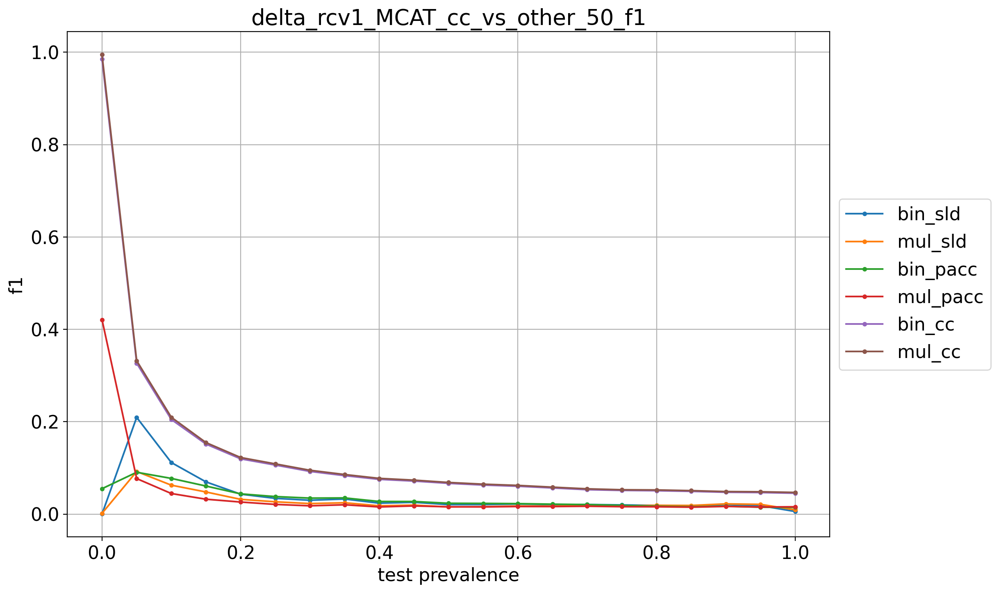

# rcv1_MCAT_9prevs

## 10% positives
> train: [0.90021426 0.09978574]  
> validation: [0.8999388 0.1000612]  
> bin_sld: 492.046s  
> mul_sld: 249.698s  
> bin_sld_gs: 1146.562s  
> mul_sld_gs: 704.644s  
> bin_sld_gsq: 539.255s  
> mul_sld_gsq: 529.819s  
> bin_pacc: 475.786s  
> mul_pacc: 168.324s  
> binmc_pacc: 472.270s  
> mulmc_pacc: 173.273s  
> binne_pacc: 443.131s  
> mulne_pacc: 185.335s  
> bin_pacc_gs: 763.354s  
> mul_pacc_gs: 287.763s  
> bin_cc: 427.742s  
> mul_cc: 164.350s  
> kfcv: 136.304s  
> ref: 125.561s  
> atc_mc: 115.380s  
> atc_ne: 129.775s  
> doc_feat: 81.285s  
> tot: 1152.170s  

<table border="1" class="dataframe">
  <thead>
    <tr style="text-align: right;">
      <th></th>
      <th>bin_sld</th>
      <th>mul_sld</th>
      <th>bin_pacc</th>
      <th>mul_pacc</th>
      <th>bin_cc</th>
      <th>mul_cc</th>
    </tr>
  </thead>
  <tbody>
    <tr>
      <th>0.0</th>
      <td>0.1549</td>
      <td>0.1431</td>
      <td>0.1561</td>
      <td>0.6052</td>
      <td>0.1807</td>
      <td>0.1629</td>
    </tr>
    <tr>
      <th>0.05</th>
      <td>0.1105</td>
      <td>0.1315</td>
      <td>0.0971</td>
      <td>0.4170</td>
      <td>0.1144</td>
      <td>0.1072</td>
    </tr>
    <tr>
      <th>0.1</th>
      <td>0.0431</td>
      <td>0.1114</td>
      <td>0.0393</td>
      <td>0.3442</td>
      <td>0.1417</td>
      <td>0.1188</td>
    </tr>
    <tr>
      <th>0.15</th>
      <td>0.0282</td>
      <td>0.1454</td>
      <td>0.0356</td>
      <td>0.3377</td>
      <td>0.1488</td>
      <td>0.1298</td>
    </tr>
    <tr>
      <th>0.2</th>
      <td>0.0177</td>
      <td>0.1723</td>
      <td>0.0272</td>
      <td>0.3196</td>
      <td>0.1478</td>
      <td>0.1289</td>
    </tr>
    <tr>
      <th>0.25</th>
      <td>0.0206</td>
      <td>0.1829</td>
      <td>0.0206</td>
      <td>0.2728</td>
      <td>0.1539</td>
      <td>0.1308</td>
    </tr>
    <tr>
      <th>0.3</th>
      <td>0.0242</td>
      <td>0.1948</td>
      <td>0.0193</td>
      <td>0.2722</td>
      <td>0.1577</td>
      <td>0.1353</td>
    </tr>
    <tr>
      <th>0.35</th>
      <td>0.0311</td>
      <td>0.2025</td>
      <td>0.0149</td>
      <td>0.2892</td>
      <td>0.1566</td>
      <td>0.1329</td>
    </tr>
    <tr>
      <th>0.4</th>
      <td>0.0367</td>
      <td>0.2117</td>
      <td>0.0137</td>
      <td>0.2373</td>
      <td>0.1552</td>
      <td>0.1315</td>
    </tr>
    <tr>
      <th>0.45</th>
      <td>0.0384</td>
      <td>0.2181</td>
      <td>0.0137</td>
      <td>0.2682</td>
      <td>0.1579</td>
      <td>0.1343</td>
    </tr>
    <tr>
      <th>0.5</th>
      <td>0.0412</td>
      <td>0.2160</td>
      <td>0.0139</td>
      <td>0.2107</td>
      <td>0.1587</td>
      <td>0.1369</td>
    </tr>
    <tr>
      <th>0.55</th>
      <td>0.0446</td>
      <td>0.2252</td>
      <td>0.0133</td>
      <td>0.2281</td>
      <td>0.1572</td>
      <td>0.1321</td>
    </tr>
    <tr>
      <th>0.6</th>
      <td>0.0456</td>
      <td>0.2217</td>
      <td>0.0151</td>
      <td>0.2190</td>
      <td>0.1608</td>
      <td>0.1369</td>
    </tr>
    <tr>
      <th>0.65</th>
      <td>0.0480</td>
      <td>0.2280</td>
      <td>0.0134</td>
      <td>0.2234</td>
      <td>0.1591</td>
      <td>0.1344</td>
    </tr>
    <tr>
      <th>0.7</th>
      <td>0.0503</td>
      <td>0.2300</td>
      <td>0.0133</td>
      <td>0.2076</td>
      <td>0.1592</td>
      <td>0.1338</td>
    </tr>
    <tr>
      <th>0.75</th>
      <td>0.0513</td>
      <td>0.2271</td>
      <td>0.0133</td>
      <td>0.2153</td>
      <td>0.1598</td>
      <td>0.1348</td>
    </tr>
    <tr>
      <th>0.8</th>
      <td>0.0521</td>
      <td>0.2293</td>
      <td>0.0125</td>
      <td>0.2076</td>
      <td>0.1596</td>
      <td>0.1335</td>
    </tr>
    <tr>
      <th>0.85</th>
      <td>0.0509</td>
      <td>0.2066</td>
      <td>0.0131</td>
      <td>0.1905</td>
      <td>0.1598</td>
      <td>0.1359</td>
    </tr>
    <tr>
      <th>0.9</th>
      <td>0.0353</td>
      <td>0.1677</td>
      <td>0.0129</td>
      <td>0.1809</td>
      <td>0.1593</td>
      <td>0.1356</td>
    </tr>
    <tr>
      <th>0.95</th>
      <td>0.0181</td>
      <td>0.1258</td>
      <td>0.0134</td>
      <td>0.1847</td>
      <td>0.1600</td>
      <td>0.1370</td>
    </tr>
    <tr>
      <th>1.0</th>
      <td>0.0012</td>
      <td>0.0743</td>
      <td>0.0132</td>
      <td>0.2025</td>
      <td>0.1599</td>
      <td>0.1361</td>
    </tr>
    <tr>
      <th>avg</th>
      <td>0.0450</td>
      <td>0.1841</td>
      <td>0.0279</td>
      <td>0.2683</td>
      <td>0.1556</td>
      <td>0.1333</td>
    </tr>
  </tbody>
</table>

## 20% positives
> train: [0.80012244 0.19987756]  
> validation: [0.7998776 0.2001224]  
> bin_sld: 448.690s  
> mul_sld: 179.540s  
> bin_sld_gs: 1128.970s  
> mul_sld_gs: 661.362s  
> bin_sld_gsq: 542.638s  
> mul_sld_gsq: 485.856s  
> bin_pacc: 435.959s  
> mul_pacc: 162.000s  
> binmc_pacc: 436.717s  
> mulmc_pacc: 159.011s  
> binne_pacc: 430.393s  
> mulne_pacc: 170.319s  
> bin_pacc_gs: 747.860s  
> mul_pacc_gs: 259.443s  
> bin_cc: 413.372s  
> mul_cc: 153.995s  
> kfcv: 138.378s  
> ref: 133.916s  
> atc_mc: 127.515s  
> atc_ne: 133.986s  
> doc_feat: 88.997s  
> tot: 1133.804s  

<table border="1" class="dataframe">
  <thead>
    <tr style="text-align: right;">
      <th></th>
      <th>bin_sld</th>
      <th>mul_sld</th>
      <th>bin_pacc</th>
      <th>mul_pacc</th>
      <th>bin_cc</th>
      <th>mul_cc</th>
    </tr>
  </thead>
  <tbody>
    <tr>
      <th>0.0</th>
      <td>0.0228</td>
      <td>0.1905</td>
      <td>0.4049</td>
      <td>0.0739</td>
      <td>0.4569</td>
      <td>0.6558</td>
    </tr>
    <tr>
      <th>0.05</th>
      <td>0.1732</td>
      <td>0.1173</td>
      <td>0.0640</td>
      <td>0.2490</td>
      <td>0.0577</td>
      <td>0.1221</td>
    </tr>
    <tr>
      <th>0.1</th>
      <td>0.0755</td>
      <td>0.0757</td>
      <td>0.0364</td>
      <td>0.1198</td>
      <td>0.0792</td>
      <td>0.1309</td>
    </tr>
    <tr>
      <th>0.15</th>
      <td>0.0486</td>
      <td>0.0568</td>
      <td>0.0258</td>
      <td>0.0852</td>
      <td>0.0888</td>
      <td>0.1329</td>
    </tr>
    <tr>
      <th>0.2</th>
      <td>0.0329</td>
      <td>0.0411</td>
      <td>0.0230</td>
      <td>0.0619</td>
      <td>0.0942</td>
      <td>0.1333</td>
    </tr>
    <tr>
      <th>0.25</th>
      <td>0.0193</td>
      <td>0.0262</td>
      <td>0.0168</td>
      <td>0.0505</td>
      <td>0.0956</td>
      <td>0.1339</td>
    </tr>
    <tr>
      <th>0.3</th>
      <td>0.0164</td>
      <td>0.0252</td>
      <td>0.0160</td>
      <td>0.0393</td>
      <td>0.1013</td>
      <td>0.1344</td>
    </tr>
    <tr>
      <th>0.35</th>
      <td>0.0138</td>
      <td>0.0213</td>
      <td>0.0149</td>
      <td>0.0355</td>
      <td>0.1014</td>
      <td>0.1349</td>
    </tr>
    <tr>
      <th>0.4</th>
      <td>0.0096</td>
      <td>0.0202</td>
      <td>0.0118</td>
      <td>0.0303</td>
      <td>0.1007</td>
      <td>0.1349</td>
    </tr>
    <tr>
      <th>0.45</th>
      <td>0.0095</td>
      <td>0.0225</td>
      <td>0.0113</td>
      <td>0.0291</td>
      <td>0.1047</td>
      <td>0.1375</td>
    </tr>
    <tr>
      <th>0.5</th>
      <td>0.0106</td>
      <td>0.0261</td>
      <td>0.0116</td>
      <td>0.0286</td>
      <td>0.1053</td>
      <td>0.1382</td>
    </tr>
    <tr>
      <th>0.55</th>
      <td>0.0128</td>
      <td>0.0318</td>
      <td>0.0113</td>
      <td>0.0259</td>
      <td>0.1056</td>
      <td>0.1366</td>
    </tr>
    <tr>
      <th>0.6</th>
      <td>0.0147</td>
      <td>0.0336</td>
      <td>0.0100</td>
      <td>0.0222</td>
      <td>0.1079</td>
      <td>0.1403</td>
    </tr>
    <tr>
      <th>0.65</th>
      <td>0.0184</td>
      <td>0.0398</td>
      <td>0.0099</td>
      <td>0.0206</td>
      <td>0.1078</td>
      <td>0.1379</td>
    </tr>
    <tr>
      <th>0.7</th>
      <td>0.0215</td>
      <td>0.0444</td>
      <td>0.0102</td>
      <td>0.0238</td>
      <td>0.1055</td>
      <td>0.1357</td>
    </tr>
    <tr>
      <th>0.75</th>
      <td>0.0235</td>
      <td>0.0471</td>
      <td>0.0091</td>
      <td>0.0203</td>
      <td>0.1061</td>
      <td>0.1371</td>
    </tr>
    <tr>
      <th>0.8</th>
      <td>0.0255</td>
      <td>0.0489</td>
      <td>0.0094</td>
      <td>0.0197</td>
      <td>0.1070</td>
      <td>0.1374</td>
    </tr>
    <tr>
      <th>0.85</th>
      <td>0.0266</td>
      <td>0.0502</td>
      <td>0.0080</td>
      <td>0.0160</td>
      <td>0.1081</td>
      <td>0.1373</td>
    </tr>
    <tr>
      <th>0.9</th>
      <td>0.0292</td>
      <td>0.0551</td>
      <td>0.0085</td>
      <td>0.0169</td>
      <td>0.1076</td>
      <td>0.1378</td>
    </tr>
    <tr>
      <th>0.95</th>
      <td>0.0240</td>
      <td>0.0494</td>
      <td>0.0069</td>
      <td>0.0141</td>
      <td>0.1089</td>
      <td>0.1373</td>
    </tr>
    <tr>
      <th>1.0</th>
      <td>0.0007</td>
      <td>0.0149</td>
      <td>0.0080</td>
      <td>0.0149</td>
      <td>0.1086</td>
      <td>0.1373</td>
    </tr>
    <tr>
      <th>avg</th>
      <td>0.0299</td>
      <td>0.0494</td>
      <td>0.0347</td>
      <td>0.0475</td>
      <td>0.1171</td>
      <td>0.1602</td>
    </tr>
  </tbody>
</table>

## 30% positives
> train: [0.70003061 0.29996939]  
> validation: [0.6998164 0.3001836]  
> bin_sld: 455.442s  
> mul_sld: 198.713s  
> bin_sld_gs: 1122.566s  
> mul_sld_gs: 641.405s  
> bin_sld_gsq: 542.437s  
> mul_sld_gsq: 490.757s  
> bin_pacc: 433.945s  
> mul_pacc: 157.898s  
> binmc_pacc: 435.757s  
> mulmc_pacc: 171.337s  
> binne_pacc: 432.522s  
> mulne_pacc: 175.766s  
> bin_pacc_gs: 742.842s  
> mul_pacc_gs: 248.789s  
> bin_cc: 409.971s  
> mul_cc: 156.701s  
> kfcv: 138.862s  
> ref: 117.506s  
> atc_mc: 134.572s  
> atc_ne: 127.451s  
> doc_feat: 91.628s  
> tot: 1126.987s  

<table border="1" class="dataframe">
  <thead>
    <tr style="text-align: right;">
      <th></th>
      <th>bin_sld</th>
      <th>mul_sld</th>
      <th>bin_pacc</th>
      <th>mul_pacc</th>
      <th>bin_cc</th>
      <th>mul_cc</th>
    </tr>
  </thead>
  <tbody>
    <tr>
      <th>0.0</th>
      <td>0.0033</td>
      <td>0.1082</td>
      <td>0.0937</td>
      <td>0.5165</td>
      <td>0.6648</td>
      <td>0.8638</td>
    </tr>
    <tr>
      <th>0.05</th>
      <td>0.2430</td>
      <td>0.0874</td>
      <td>0.0584</td>
      <td>0.0814</td>
      <td>0.0876</td>
      <td>0.1639</td>
    </tr>
    <tr>
      <th>0.1</th>
      <td>0.1186</td>
      <td>0.0639</td>
      <td>0.0447</td>
      <td>0.0641</td>
      <td>0.0806</td>
      <td>0.1366</td>
    </tr>
    <tr>
      <th>0.15</th>
      <td>0.0911</td>
      <td>0.0471</td>
      <td>0.0328</td>
      <td>0.0626</td>
      <td>0.0756</td>
      <td>0.1212</td>
    </tr>
    <tr>
      <th>0.2</th>
      <td>0.0560</td>
      <td>0.0325</td>
      <td>0.0232</td>
      <td>0.0502</td>
      <td>0.0756</td>
      <td>0.1167</td>
    </tr>
    <tr>
      <th>0.25</th>
      <td>0.0533</td>
      <td>0.0337</td>
      <td>0.0219</td>
      <td>0.0607</td>
      <td>0.0750</td>
      <td>0.1132</td>
    </tr>
    <tr>
      <th>0.3</th>
      <td>0.0466</td>
      <td>0.0336</td>
      <td>0.0206</td>
      <td>0.0556</td>
      <td>0.0758</td>
      <td>0.1119</td>
    </tr>
    <tr>
      <th>0.35</th>
      <td>0.0391</td>
      <td>0.0317</td>
      <td>0.0191</td>
      <td>0.0603</td>
      <td>0.0750</td>
      <td>0.1105</td>
    </tr>
    <tr>
      <th>0.4</th>
      <td>0.0300</td>
      <td>0.0289</td>
      <td>0.0149</td>
      <td>0.0550</td>
      <td>0.0736</td>
      <td>0.1060</td>
    </tr>
    <tr>
      <th>0.45</th>
      <td>0.0282</td>
      <td>0.0305</td>
      <td>0.0140</td>
      <td>0.0545</td>
      <td>0.0754</td>
      <td>0.1074</td>
    </tr>
    <tr>
      <th>0.5</th>
      <td>0.0263</td>
      <td>0.0322</td>
      <td>0.0138</td>
      <td>0.0571</td>
      <td>0.0757</td>
      <td>0.1061</td>
    </tr>
    <tr>
      <th>0.55</th>
      <td>0.0236</td>
      <td>0.0310</td>
      <td>0.0141</td>
      <td>0.0544</td>
      <td>0.0754</td>
      <td>0.1067</td>
    </tr>
    <tr>
      <th>0.6</th>
      <td>0.0254</td>
      <td>0.0339</td>
      <td>0.0118</td>
      <td>0.0568</td>
      <td>0.0771</td>
      <td>0.1073</td>
    </tr>
    <tr>
      <th>0.65</th>
      <td>0.0267</td>
      <td>0.0360</td>
      <td>0.0109</td>
      <td>0.0589</td>
      <td>0.0759</td>
      <td>0.1059</td>
    </tr>
    <tr>
      <th>0.7</th>
      <td>0.0292</td>
      <td>0.0395</td>
      <td>0.0106</td>
      <td>0.0620</td>
      <td>0.0743</td>
      <td>0.1029</td>
    </tr>
    <tr>
      <th>0.75</th>
      <td>0.0300</td>
      <td>0.0397</td>
      <td>0.0107</td>
      <td>0.0607</td>
      <td>0.0742</td>
      <td>0.1029</td>
    </tr>
    <tr>
      <th>0.8</th>
      <td>0.0291</td>
      <td>0.0414</td>
      <td>0.0091</td>
      <td>0.0592</td>
      <td>0.0745</td>
      <td>0.1030</td>
    </tr>
    <tr>
      <th>0.85</th>
      <td>0.0276</td>
      <td>0.0408</td>
      <td>0.0096</td>
      <td>0.0574</td>
      <td>0.0751</td>
      <td>0.1037</td>
    </tr>
    <tr>
      <th>0.9</th>
      <td>0.0316</td>
      <td>0.0459</td>
      <td>0.0090</td>
      <td>0.0630</td>
      <td>0.0747</td>
      <td>0.1025</td>
    </tr>
    <tr>
      <th>0.95</th>
      <td>0.0290</td>
      <td>0.0428</td>
      <td>0.0079</td>
      <td>0.0579</td>
      <td>0.0752</td>
      <td>0.1032</td>
    </tr>
    <tr>
      <th>1.0</th>
      <td>0.0054</td>
      <td>0.0346</td>
      <td>0.0089</td>
      <td>0.0558</td>
      <td>0.0757</td>
      <td>0.1033</td>
    </tr>
    <tr>
      <th>avg</th>
      <td>0.0473</td>
      <td>0.0436</td>
      <td>0.0219</td>
      <td>0.0812</td>
      <td>0.1041</td>
      <td>0.1476</td>
    </tr>
  </tbody>
</table>

## 40% positives
> train: [0.59993878 0.40006122]  
> validation: [0.6000612 0.3999388]  
> bin_sld: 431.626s  
> mul_sld: 173.772s  
> bin_sld_gs: 1126.713s  
> mul_sld_gs: 637.068s  
> bin_sld_gsq: 515.944s  
> mul_sld_gsq: 474.062s  
> bin_pacc: 411.245s  
> mul_pacc: 163.461s  
> binmc_pacc: 400.757s  
> mulmc_pacc: 138.383s  
> binne_pacc: 414.550s  
> mulne_pacc: 162.850s  
> bin_pacc_gs: 725.895s  
> mul_pacc_gs: 248.814s  
> bin_cc: 389.288s  
> mul_cc: 123.416s  
> kfcv: 114.502s  
> ref: 85.633s  
> atc_mc: 124.150s  
> atc_ne: 99.674s  
> doc_feat: 84.284s  
> tot: 1130.557s  

<table border="1" class="dataframe">
  <thead>
    <tr style="text-align: right;">
      <th></th>
      <th>bin_sld</th>
      <th>mul_sld</th>
      <th>bin_pacc</th>
      <th>mul_pacc</th>
      <th>bin_cc</th>
      <th>mul_cc</th>
    </tr>
  </thead>
  <tbody>
    <tr>
      <th>0.0</th>
      <td>0.0002</td>
      <td>0.0294</td>
      <td>0.3014</td>
      <td>0.0670</td>
      <td>0.8838</td>
      <td>0.9783</td>
    </tr>
    <tr>
      <th>0.05</th>
      <td>0.1436</td>
      <td>0.0758</td>
      <td>0.0813</td>
      <td>0.0834</td>
      <td>0.2097</td>
      <td>0.2570</td>
    </tr>
    <tr>
      <th>0.1</th>
      <td>0.0691</td>
      <td>0.0575</td>
      <td>0.0499</td>
      <td>0.0624</td>
      <td>0.1344</td>
      <td>0.1689</td>
    </tr>
    <tr>
      <th>0.15</th>
      <td>0.0453</td>
      <td>0.0397</td>
      <td>0.0343</td>
      <td>0.0496</td>
      <td>0.1073</td>
      <td>0.1352</td>
    </tr>
    <tr>
      <th>0.2</th>
      <td>0.0330</td>
      <td>0.0365</td>
      <td>0.0309</td>
      <td>0.0297</td>
      <td>0.0899</td>
      <td>0.1135</td>
    </tr>
    <tr>
      <th>0.25</th>
      <td>0.0304</td>
      <td>0.0315</td>
      <td>0.0240</td>
      <td>0.0277</td>
      <td>0.0849</td>
      <td>0.1061</td>
    </tr>
    <tr>
      <th>0.3</th>
      <td>0.0314</td>
      <td>0.0283</td>
      <td>0.0201</td>
      <td>0.0258</td>
      <td>0.0798</td>
      <td>0.0982</td>
    </tr>
    <tr>
      <th>0.35</th>
      <td>0.0262</td>
      <td>0.0226</td>
      <td>0.0152</td>
      <td>0.0253</td>
      <td>0.0740</td>
      <td>0.0921</td>
    </tr>
    <tr>
      <th>0.4</th>
      <td>0.0205</td>
      <td>0.0196</td>
      <td>0.0138</td>
      <td>0.0187</td>
      <td>0.0710</td>
      <td>0.0883</td>
    </tr>
    <tr>
      <th>0.45</th>
      <td>0.0179</td>
      <td>0.0161</td>
      <td>0.0119</td>
      <td>0.0199</td>
      <td>0.0692</td>
      <td>0.0855</td>
    </tr>
    <tr>
      <th>0.5</th>
      <td>0.0167</td>
      <td>0.0132</td>
      <td>0.0120</td>
      <td>0.0169</td>
      <td>0.0671</td>
      <td>0.0823</td>
    </tr>
    <tr>
      <th>0.55</th>
      <td>0.0127</td>
      <td>0.0119</td>
      <td>0.0104</td>
      <td>0.0168</td>
      <td>0.0647</td>
      <td>0.0803</td>
    </tr>
    <tr>
      <th>0.6</th>
      <td>0.0134</td>
      <td>0.0131</td>
      <td>0.0093</td>
      <td>0.0171</td>
      <td>0.0647</td>
      <td>0.0795</td>
    </tr>
    <tr>
      <th>0.65</th>
      <td>0.0114</td>
      <td>0.0136</td>
      <td>0.0084</td>
      <td>0.0163</td>
      <td>0.0622</td>
      <td>0.0765</td>
    </tr>
    <tr>
      <th>0.7</th>
      <td>0.0122</td>
      <td>0.0147</td>
      <td>0.0085</td>
      <td>0.0161</td>
      <td>0.0596</td>
      <td>0.0737</td>
    </tr>
    <tr>
      <th>0.75</th>
      <td>0.0118</td>
      <td>0.0150</td>
      <td>0.0081</td>
      <td>0.0149</td>
      <td>0.0593</td>
      <td>0.0728</td>
    </tr>
    <tr>
      <th>0.8</th>
      <td>0.0115</td>
      <td>0.0180</td>
      <td>0.0069</td>
      <td>0.0141</td>
      <td>0.0591</td>
      <td>0.0725</td>
    </tr>
    <tr>
      <th>0.85</th>
      <td>0.0130</td>
      <td>0.0200</td>
      <td>0.0075</td>
      <td>0.0147</td>
      <td>0.0583</td>
      <td>0.0714</td>
    </tr>
    <tr>
      <th>0.9</th>
      <td>0.0151</td>
      <td>0.0234</td>
      <td>0.0071</td>
      <td>0.0142</td>
      <td>0.0579</td>
      <td>0.0711</td>
    </tr>
    <tr>
      <th>0.95</th>
      <td>0.0146</td>
      <td>0.0245</td>
      <td>0.0057</td>
      <td>0.0123</td>
      <td>0.0575</td>
      <td>0.0705</td>
    </tr>
    <tr>
      <th>1.0</th>
      <td>0.0031</td>
      <td>0.0108</td>
      <td>0.0065</td>
      <td>0.0116</td>
      <td>0.0572</td>
      <td>0.0699</td>
    </tr>
    <tr>
      <th>avg</th>
      <td>0.0263</td>
      <td>0.0255</td>
      <td>0.0321</td>
      <td>0.0274</td>
      <td>0.1177</td>
      <td>0.1402</td>
    </tr>
  </tbody>
</table>

## 50% positives
> train: [0.50015305 0.49984695]  
> validation: [0.5 0.5]  
> bin_sld: 458.494s  
> mul_sld: 201.711s  
> bin_sld_gs: 1164.733s  
> mul_sld_gs: 676.355s  
> bin_sld_gsq: 562.768s  
> mul_sld_gsq: 514.459s  
> bin_pacc: 442.701s  
> mul_pacc: 170.811s  
> binmc_pacc: 438.974s  
> mulmc_pacc: 169.154s  
> binne_pacc: 443.046s  
> mulne_pacc: 181.715s  
> bin_pacc_gs: 768.357s  
> mul_pacc_gs: 264.111s  
> bin_cc: 423.636s  
> mul_cc: 156.950s  
> kfcv: 144.505s  
> ref: 134.555s  
> atc_mc: 141.161s  
> atc_ne: 127.587s  
> doc_feat: 76.400s  
> tot: 1169.275s  

<table border="1" class="dataframe">
  <thead>
    <tr style="text-align: right;">
      <th></th>
      <th>bin_sld</th>
      <th>mul_sld</th>
      <th>bin_pacc</th>
      <th>mul_pacc</th>
      <th>bin_cc</th>
      <th>mul_cc</th>
    </tr>
  </thead>
  <tbody>
    <tr>
      <th>0.0</th>
      <td>0.0001</td>
      <td>0.0017</td>
      <td>0.0550</td>
      <td>0.4209</td>
      <td>0.9849</td>
      <td>0.9946</td>
    </tr>
    <tr>
      <th>0.05</th>
      <td>0.2094</td>
      <td>0.0922</td>
      <td>0.0905</td>
      <td>0.0769</td>
      <td>0.3267</td>
      <td>0.3321</td>
    </tr>
    <tr>
      <th>0.1</th>
      <td>0.1116</td>
      <td>0.0626</td>
      <td>0.0773</td>
      <td>0.0445</td>
      <td>0.2048</td>
      <td>0.2096</td>
    </tr>
    <tr>
      <th>0.15</th>
      <td>0.0697</td>
      <td>0.0479</td>
      <td>0.0607</td>
      <td>0.0322</td>
      <td>0.1516</td>
      <td>0.1548</td>
    </tr>
    <tr>
      <th>0.2</th>
      <td>0.0432</td>
      <td>0.0319</td>
      <td>0.0438</td>
      <td>0.0261</td>
      <td>0.1196</td>
      <td>0.1225</td>
    </tr>
    <tr>
      <th>0.25</th>
      <td>0.0341</td>
      <td>0.0266</td>
      <td>0.0379</td>
      <td>0.0210</td>
      <td>0.1062</td>
      <td>0.1087</td>
    </tr>
    <tr>
      <th>0.3</th>
      <td>0.0299</td>
      <td>0.0228</td>
      <td>0.0346</td>
      <td>0.0179</td>
      <td>0.0924</td>
      <td>0.0949</td>
    </tr>
    <tr>
      <th>0.35</th>
      <td>0.0326</td>
      <td>0.0245</td>
      <td>0.0350</td>
      <td>0.0202</td>
      <td>0.0832</td>
      <td>0.0857</td>
    </tr>
    <tr>
      <th>0.4</th>
      <td>0.0237</td>
      <td>0.0179</td>
      <td>0.0273</td>
      <td>0.0155</td>
      <td>0.0752</td>
      <td>0.0773</td>
    </tr>
    <tr>
      <th>0.45</th>
      <td>0.0255</td>
      <td>0.0194</td>
      <td>0.0272</td>
      <td>0.0177</td>
      <td>0.0715</td>
      <td>0.0735</td>
    </tr>
    <tr>
      <th>0.5</th>
      <td>0.0205</td>
      <td>0.0155</td>
      <td>0.0234</td>
      <td>0.0158</td>
      <td>0.0666</td>
      <td>0.0685</td>
    </tr>
    <tr>
      <th>0.55</th>
      <td>0.0207</td>
      <td>0.0160</td>
      <td>0.0231</td>
      <td>0.0156</td>
      <td>0.0629</td>
      <td>0.0647</td>
    </tr>
    <tr>
      <th>0.6</th>
      <td>0.0218</td>
      <td>0.0175</td>
      <td>0.0226</td>
      <td>0.0164</td>
      <td>0.0603</td>
      <td>0.0621</td>
    </tr>
    <tr>
      <th>0.65</th>
      <td>0.0207</td>
      <td>0.0172</td>
      <td>0.0215</td>
      <td>0.0163</td>
      <td>0.0566</td>
      <td>0.0583</td>
    </tr>
    <tr>
      <th>0.7</th>
      <td>0.0207</td>
      <td>0.0185</td>
      <td>0.0206</td>
      <td>0.0170</td>
      <td>0.0528</td>
      <td>0.0547</td>
    </tr>
    <tr>
      <th>0.75</th>
      <td>0.0198</td>
      <td>0.0178</td>
      <td>0.0188</td>
      <td>0.0161</td>
      <td>0.0512</td>
      <td>0.0527</td>
    </tr>
    <tr>
      <th>0.8</th>
      <td>0.0187</td>
      <td>0.0189</td>
      <td>0.0170</td>
      <td>0.0158</td>
      <td>0.0506</td>
      <td>0.0523</td>
    </tr>
    <tr>
      <th>0.85</th>
      <td>0.0174</td>
      <td>0.0187</td>
      <td>0.0159</td>
      <td>0.0150</td>
      <td>0.0492</td>
      <td>0.0508</td>
    </tr>
    <tr>
      <th>0.9</th>
      <td>0.0207</td>
      <td>0.0221</td>
      <td>0.0171</td>
      <td>0.0166</td>
      <td>0.0473</td>
      <td>0.0488</td>
    </tr>
    <tr>
      <th>0.95</th>
      <td>0.0182</td>
      <td>0.0211</td>
      <td>0.0149</td>
      <td>0.0153</td>
      <td>0.0466</td>
      <td>0.0483</td>
    </tr>
    <tr>
      <th>1.0</th>
      <td>0.0056</td>
      <td>0.0092</td>
      <td>0.0145</td>
      <td>0.0158</td>
      <td>0.0452</td>
      <td>0.0469</td>
    </tr>
    <tr>
      <th>avg</th>
      <td>0.0374</td>
      <td>0.0257</td>
      <td>0.0333</td>
      <td>0.0414</td>
      <td>0.1336</td>
      <td>0.1363</td>
    </tr>
  </tbody>
</table>

## 60% positives
> train: [0.40006122 0.59993878]  
> validation: [0.3999388 0.6000612]  
> bin_sld: 466.968s  
> mul_sld: 209.948s  
> bin_sld_gs: 1150.214s  
> mul_sld_gs: 682.183s  
> bin_sld_gsq: 556.758s  
> mul_sld_gsq: 509.058s  
> bin_pacc: 464.142s  
> mul_pacc: 197.052s  
> binmc_pacc: 456.950s  
> mulmc_pacc: 198.891s  
> binne_pacc: 466.343s  
> mulne_pacc: 211.900s  
> bin_pacc_gs: 772.058s  
> mul_pacc_gs: 283.572s  
> bin_cc: 445.830s  
> mul_cc: 179.010s  
> kfcv: 150.241s  
> ref: 148.770s  
> atc_mc: 151.278s  
> atc_ne: 143.773s  
> doc_feat: 112.638s  
> tot: 1155.458s  

<table border="1" class="dataframe">
  <thead>
    <tr style="text-align: right;">
      <th></th>
      <th>bin_sld</th>
      <th>mul_sld</th>
      <th>bin_pacc</th>
      <th>mul_pacc</th>
      <th>bin_cc</th>
      <th>mul_cc</th>
    </tr>
  </thead>
  <tbody>
    <tr>
      <th>0.0</th>
      <td>0.0001</td>
      <td>0.0001</td>
      <td>0.1478</td>
      <td>0.0105</td>
      <td>0.9997</td>
      <td>0.9983</td>
    </tr>
    <tr>
      <th>0.05</th>
      <td>0.2459</td>
      <td>0.1557</td>
      <td>0.0485</td>
      <td>0.1678</td>
      <td>0.4272</td>
      <td>0.4264</td>
    </tr>
    <tr>
      <th>0.1</th>
      <td>0.1572</td>
      <td>0.1095</td>
      <td>0.0524</td>
      <td>0.1253</td>
      <td>0.2744</td>
      <td>0.2740</td>
    </tr>
    <tr>
      <th>0.15</th>
      <td>0.1080</td>
      <td>0.0843</td>
      <td>0.0510</td>
      <td>0.1001</td>
      <td>0.1965</td>
      <td>0.1959</td>
    </tr>
    <tr>
      <th>0.2</th>
      <td>0.0719</td>
      <td>0.0555</td>
      <td>0.0408</td>
      <td>0.0714</td>
      <td>0.1490</td>
      <td>0.1486</td>
    </tr>
    <tr>
      <th>0.25</th>
      <td>0.0569</td>
      <td>0.0469</td>
      <td>0.0353</td>
      <td>0.0606</td>
      <td>0.1261</td>
      <td>0.1254</td>
    </tr>
    <tr>
      <th>0.3</th>
      <td>0.0473</td>
      <td>0.0418</td>
      <td>0.0343</td>
      <td>0.0528</td>
      <td>0.1037</td>
      <td>0.1031</td>
    </tr>
    <tr>
      <th>0.35</th>
      <td>0.0444</td>
      <td>0.0408</td>
      <td>0.0331</td>
      <td>0.0497</td>
      <td>0.0902</td>
      <td>0.0896</td>
    </tr>
    <tr>
      <th>0.4</th>
      <td>0.0335</td>
      <td>0.0304</td>
      <td>0.0294</td>
      <td>0.0401</td>
      <td>0.0783</td>
      <td>0.0778</td>
    </tr>
    <tr>
      <th>0.45</th>
      <td>0.0346</td>
      <td>0.0312</td>
      <td>0.0299</td>
      <td>0.0391</td>
      <td>0.0698</td>
      <td>0.0693</td>
    </tr>
    <tr>
      <th>0.5</th>
      <td>0.0306</td>
      <td>0.0268</td>
      <td>0.0264</td>
      <td>0.0331</td>
      <td>0.0620</td>
      <td>0.0616</td>
    </tr>
    <tr>
      <th>0.55</th>
      <td>0.0322</td>
      <td>0.0271</td>
      <td>0.0264</td>
      <td>0.0322</td>
      <td>0.0562</td>
      <td>0.0558</td>
    </tr>
    <tr>
      <th>0.6</th>
      <td>0.0326</td>
      <td>0.0261</td>
      <td>0.0258</td>
      <td>0.0302</td>
      <td>0.0510</td>
      <td>0.0506</td>
    </tr>
    <tr>
      <th>0.65</th>
      <td>0.0299</td>
      <td>0.0233</td>
      <td>0.0241</td>
      <td>0.0267</td>
      <td>0.0459</td>
      <td>0.0455</td>
    </tr>
    <tr>
      <th>0.7</th>
      <td>0.0296</td>
      <td>0.0226</td>
      <td>0.0237</td>
      <td>0.0252</td>
      <td>0.0402</td>
      <td>0.0399</td>
    </tr>
    <tr>
      <th>0.75</th>
      <td>0.0272</td>
      <td>0.0202</td>
      <td>0.0213</td>
      <td>0.0222</td>
      <td>0.0381</td>
      <td>0.0377</td>
    </tr>
    <tr>
      <th>0.8</th>
      <td>0.0278</td>
      <td>0.0200</td>
      <td>0.0207</td>
      <td>0.0205</td>
      <td>0.0359</td>
      <td>0.0355</td>
    </tr>
    <tr>
      <th>0.85</th>
      <td>0.0276</td>
      <td>0.0199</td>
      <td>0.0200</td>
      <td>0.0198</td>
      <td>0.0333</td>
      <td>0.0328</td>
    </tr>
    <tr>
      <th>0.9</th>
      <td>0.0293</td>
      <td>0.0212</td>
      <td>0.0216</td>
      <td>0.0207</td>
      <td>0.0300</td>
      <td>0.0297</td>
    </tr>
    <tr>
      <th>0.95</th>
      <td>0.0259</td>
      <td>0.0186</td>
      <td>0.0198</td>
      <td>0.0178</td>
      <td>0.0286</td>
      <td>0.0282</td>
    </tr>
    <tr>
      <th>1.0</th>
      <td>0.0139</td>
      <td>0.0115</td>
      <td>0.0196</td>
      <td>0.0174</td>
      <td>0.0265</td>
      <td>0.0261</td>
    </tr>
    <tr>
      <th>avg</th>
      <td>0.0527</td>
      <td>0.0397</td>
      <td>0.0358</td>
      <td>0.0468</td>
      <td>0.1411</td>
      <td>0.1406</td>
    </tr>
  </tbody>
</table>

## 70% positives
> train: [0.29996939 0.70003061]  
> validation: [0.2998776 0.7001224]  
> bin_sld: 480.500s  
> mul_sld: 213.550s  
> bin_sld_gs: 1132.131s  
> mul_sld_gs: 654.288s  
> bin_sld_gsq: 554.789s  
> mul_sld_gsq: 514.007s  
> bin_pacc: 458.638s  
> mul_pacc: 176.110s  
> binmc_pacc: 454.887s  
> mulmc_pacc: 140.659s  
> binne_pacc: 444.727s  
> mulne_pacc: 168.258s  
> bin_pacc_gs: 767.825s  
> mul_pacc_gs: 271.862s  
> bin_cc: 432.108s  
> mul_cc: 156.381s  
> kfcv: 150.856s  
> ref: 138.967s  
> atc_mc: 140.786s  
> atc_ne: 133.837s  
> doc_feat: 93.537s  
> tot: 1140.674s  

<table border="1" class="dataframe">
  <thead>
    <tr style="text-align: right;">
      <th></th>
      <th>bin_sld</th>
      <th>mul_sld</th>
      <th>bin_pacc</th>
      <th>mul_pacc</th>
      <th>bin_cc</th>
      <th>mul_cc</th>
    </tr>
  </thead>
  <tbody>
    <tr>
      <th>0.0</th>
      <td>0.0000</td>
      <td>0.0000</td>
      <td>0.0048</td>
      <td>0.0728</td>
      <td>0.9772</td>
      <td>0.9871</td>
    </tr>
    <tr>
      <th>0.05</th>
      <td>0.2732</td>
      <td>0.1932</td>
      <td>0.1634</td>
      <td>0.0490</td>
      <td>0.5478</td>
      <td>0.5562</td>
    </tr>
    <tr>
      <th>0.1</th>
      <td>0.1896</td>
      <td>0.1445</td>
      <td>0.1373</td>
      <td>0.0451</td>
      <td>0.3739</td>
      <td>0.3798</td>
    </tr>
    <tr>
      <th>0.15</th>
      <td>0.1436</td>
      <td>0.1153</td>
      <td>0.1209</td>
      <td>0.0483</td>
      <td>0.2746</td>
      <td>0.2799</td>
    </tr>
    <tr>
      <th>0.2</th>
      <td>0.1010</td>
      <td>0.0814</td>
      <td>0.0999</td>
      <td>0.0413</td>
      <td>0.2108</td>
      <td>0.2148</td>
    </tr>
    <tr>
      <th>0.25</th>
      <td>0.0770</td>
      <td>0.0640</td>
      <td>0.0820</td>
      <td>0.0340</td>
      <td>0.1716</td>
      <td>0.1750</td>
    </tr>
    <tr>
      <th>0.3</th>
      <td>0.0630</td>
      <td>0.0552</td>
      <td>0.0757</td>
      <td>0.0338</td>
      <td>0.1396</td>
      <td>0.1429</td>
    </tr>
    <tr>
      <th>0.35</th>
      <td>0.0513</td>
      <td>0.0467</td>
      <td>0.0628</td>
      <td>0.0281</td>
      <td>0.1191</td>
      <td>0.1213</td>
    </tr>
    <tr>
      <th>0.4</th>
      <td>0.0445</td>
      <td>0.0393</td>
      <td>0.0583</td>
      <td>0.0275</td>
      <td>0.0995</td>
      <td>0.1015</td>
    </tr>
    <tr>
      <th>0.45</th>
      <td>0.0414</td>
      <td>0.0368</td>
      <td>0.0543</td>
      <td>0.0261</td>
      <td>0.0869</td>
      <td>0.0885</td>
    </tr>
    <tr>
      <th>0.5</th>
      <td>0.0332</td>
      <td>0.0293</td>
      <td>0.0465</td>
      <td>0.0217</td>
      <td>0.0731</td>
      <td>0.0746</td>
    </tr>
    <tr>
      <th>0.55</th>
      <td>0.0332</td>
      <td>0.0279</td>
      <td>0.0443</td>
      <td>0.0215</td>
      <td>0.0637</td>
      <td>0.0651</td>
    </tr>
    <tr>
      <th>0.6</th>
      <td>0.0327</td>
      <td>0.0272</td>
      <td>0.0419</td>
      <td>0.0216</td>
      <td>0.0543</td>
      <td>0.0556</td>
    </tr>
    <tr>
      <th>0.65</th>
      <td>0.0283</td>
      <td>0.0222</td>
      <td>0.0368</td>
      <td>0.0179</td>
      <td>0.0461</td>
      <td>0.0471</td>
    </tr>
    <tr>
      <th>0.7</th>
      <td>0.0236</td>
      <td>0.0181</td>
      <td>0.0313</td>
      <td>0.0152</td>
      <td>0.0397</td>
      <td>0.0404</td>
    </tr>
    <tr>
      <th>0.75</th>
      <td>0.0217</td>
      <td>0.0158</td>
      <td>0.0281</td>
      <td>0.0135</td>
      <td>0.0347</td>
      <td>0.0353</td>
    </tr>
    <tr>
      <th>0.8</th>
      <td>0.0230</td>
      <td>0.0158</td>
      <td>0.0274</td>
      <td>0.0136</td>
      <td>0.0299</td>
      <td>0.0304</td>
    </tr>
    <tr>
      <th>0.85</th>
      <td>0.0198</td>
      <td>0.0130</td>
      <td>0.0246</td>
      <td>0.0117</td>
      <td>0.0251</td>
      <td>0.0256</td>
    </tr>
    <tr>
      <th>0.9</th>
      <td>0.0220</td>
      <td>0.0143</td>
      <td>0.0251</td>
      <td>0.0129</td>
      <td>0.0205</td>
      <td>0.0210</td>
    </tr>
    <tr>
      <th>0.95</th>
      <td>0.0183</td>
      <td>0.0120</td>
      <td>0.0223</td>
      <td>0.0110</td>
      <td>0.0174</td>
      <td>0.0177</td>
    </tr>
    <tr>
      <th>1.0</th>
      <td>0.0033</td>
      <td>0.0023</td>
      <td>0.0184</td>
      <td>0.0103</td>
      <td>0.0141</td>
      <td>0.0143</td>
    </tr>
    <tr>
      <th>avg</th>
      <td>0.0592</td>
      <td>0.0464</td>
      <td>0.0574</td>
      <td>0.0275</td>
      <td>0.1629</td>
      <td>0.1654</td>
    </tr>
  </tbody>
</table>

## 80% positives
> train: [0.19987756 0.80012244]  
> validation: [0.2001224 0.7998776]  
> bin_sld: 500.397s  
> mul_sld: 258.490s  
> bin_sld_gs: 1170.341s  
> mul_sld_gs: 683.747s  
> bin_sld_gsq: 563.279s  
> mul_sld_gsq: 515.921s  
> bin_pacc: 490.203s  
> mul_pacc: 224.016s  
> binmc_pacc: 471.840s  
> mulmc_pacc: 210.841s  
> binne_pacc: 470.692s  
> mulne_pacc: 198.506s  
> bin_pacc_gs: 769.514s  
> mul_pacc_gs: 297.055s  
> bin_cc: 463.272s  
> mul_cc: 198.142s  
> kfcv: 178.022s  
> ref: 176.128s  
> atc_mc: 173.015s  
> atc_ne: 124.585s  
> doc_feat: 101.631s  
> tot: 1175.400s  

<table border="1" class="dataframe">
  <thead>
    <tr style="text-align: right;">
      <th></th>
      <th>bin_sld</th>
      <th>mul_sld</th>
      <th>bin_pacc</th>
      <th>mul_pacc</th>
      <th>bin_cc</th>
      <th>mul_cc</th>
    </tr>
  </thead>
  <tbody>
    <tr>
      <th>0.0</th>
      <td>0.0000</td>
      <td>0.0000</td>
      <td>0.0999</td>
      <td>0.0469</td>
      <td>0.6804</td>
      <td>0.8379</td>
    </tr>
    <tr>
      <th>0.05</th>
      <td>0.2137</td>
      <td>0.1403</td>
      <td>0.0634</td>
      <td>0.0424</td>
      <td>0.4788</td>
      <td>0.6082</td>
    </tr>
    <tr>
      <th>0.1</th>
      <td>0.1789</td>
      <td>0.1389</td>
      <td>0.0425</td>
      <td>0.0304</td>
      <td>0.3572</td>
      <td>0.4665</td>
    </tr>
    <tr>
      <th>0.15</th>
      <td>0.1428</td>
      <td>0.1304</td>
      <td>0.0310</td>
      <td>0.0263</td>
      <td>0.2759</td>
      <td>0.3690</td>
    </tr>
    <tr>
      <th>0.2</th>
      <td>0.1103</td>
      <td>0.1112</td>
      <td>0.0220</td>
      <td>0.0216</td>
      <td>0.2166</td>
      <td>0.2967</td>
    </tr>
    <tr>
      <th>0.25</th>
      <td>0.0881</td>
      <td>0.0952</td>
      <td>0.0193</td>
      <td>0.0195</td>
      <td>0.1765</td>
      <td>0.2464</td>
    </tr>
    <tr>
      <th>0.3</th>
      <td>0.0743</td>
      <td>0.0868</td>
      <td>0.0123</td>
      <td>0.0188</td>
      <td>0.1437</td>
      <td>0.2040</td>
    </tr>
    <tr>
      <th>0.35</th>
      <td>0.0583</td>
      <td>0.0730</td>
      <td>0.0129</td>
      <td>0.0167</td>
      <td>0.1201</td>
      <td>0.1730</td>
    </tr>
    <tr>
      <th>0.4</th>
      <td>0.0464</td>
      <td>0.0645</td>
      <td>0.0094</td>
      <td>0.0164</td>
      <td>0.0998</td>
      <td>0.1449</td>
    </tr>
    <tr>
      <th>0.45</th>
      <td>0.0419</td>
      <td>0.0588</td>
      <td>0.0071</td>
      <td>0.0172</td>
      <td>0.0826</td>
      <td>0.1237</td>
    </tr>
    <tr>
      <th>0.5</th>
      <td>0.0317</td>
      <td>0.0475</td>
      <td>0.0061</td>
      <td>0.0150</td>
      <td>0.0677</td>
      <td>0.1018</td>
    </tr>
    <tr>
      <th>0.55</th>
      <td>0.0255</td>
      <td>0.0439</td>
      <td>0.0064</td>
      <td>0.0169</td>
      <td>0.0567</td>
      <td>0.0862</td>
    </tr>
    <tr>
      <th>0.6</th>
      <td>0.0222</td>
      <td>0.0375</td>
      <td>0.0068</td>
      <td>0.0174</td>
      <td>0.0454</td>
      <td>0.0720</td>
    </tr>
    <tr>
      <th>0.65</th>
      <td>0.0161</td>
      <td>0.0292</td>
      <td>0.0056</td>
      <td>0.0154</td>
      <td>0.0365</td>
      <td>0.0587</td>
    </tr>
    <tr>
      <th>0.7</th>
      <td>0.0109</td>
      <td>0.0206</td>
      <td>0.0057</td>
      <td>0.0132</td>
      <td>0.0291</td>
      <td>0.0482</td>
    </tr>
    <tr>
      <th>0.75</th>
      <td>0.0076</td>
      <td>0.0180</td>
      <td>0.0049</td>
      <td>0.0149</td>
      <td>0.0221</td>
      <td>0.0381</td>
    </tr>
    <tr>
      <th>0.8</th>
      <td>0.0065</td>
      <td>0.0152</td>
      <td>0.0053</td>
      <td>0.0153</td>
      <td>0.0158</td>
      <td>0.0295</td>
    </tr>
    <tr>
      <th>0.85</th>
      <td>0.0049</td>
      <td>0.0107</td>
      <td>0.0056</td>
      <td>0.0151</td>
      <td>0.0102</td>
      <td>0.0208</td>
    </tr>
    <tr>
      <th>0.9</th>
      <td>0.0068</td>
      <td>0.0096</td>
      <td>0.0072</td>
      <td>0.0163</td>
      <td>0.0054</td>
      <td>0.0139</td>
    </tr>
    <tr>
      <th>0.95</th>
      <td>0.0073</td>
      <td>0.0068</td>
      <td>0.0074</td>
      <td>0.0163</td>
      <td>0.0025</td>
      <td>0.0080</td>
    </tr>
    <tr>
      <th>1.0</th>
      <td>0.0007</td>
      <td>0.0015</td>
      <td>0.0086</td>
      <td>0.0157</td>
      <td>0.0027</td>
      <td>0.0021</td>
    </tr>
    <tr>
      <th>avg</th>
      <td>0.0521</td>
      <td>0.0543</td>
      <td>0.0185</td>
      <td>0.0204</td>
      <td>0.1393</td>
      <td>0.1881</td>
    </tr>
  </tbody>
</table>

## 90% positives
> train: [0.09978574 0.90021426]  
> validation: [0.1000612 0.8999388]  
> mul_sld: 64.550s  
> mul_sld_gs: 336.201s  
> mul_cc: 54.742s  
> kfcv: 48.726s  
> ref: 46.562s  
> atc_mc: 49.917s  
> atc_ne: 49.863s  
> doc_feat: 43.425s  
> tot: 344.139s  

<table border="1" class="dataframe">
  <thead>
    <tr style="text-align: right;">
      <th></th>
      <th>mul_sld</th>
      <th>mul_cc</th>
    </tr>
  </thead>
  <tbody>
    <tr>
      <th>0.0</th>
      <td>0.0000</td>
      <td>0.4160</td>
    </tr>
    <tr>
      <th>0.05</th>
      <td>0.1087</td>
      <td>0.3503</td>
    </tr>
    <tr>
      <th>0.1</th>
      <td>0.1674</td>
      <td>0.2993</td>
    </tr>
    <tr>
      <th>0.15</th>
      <td>0.1681</td>
      <td>0.2539</td>
    </tr>
    <tr>
      <th>0.2</th>
      <td>0.1595</td>
      <td>0.2131</td>
    </tr>
    <tr>
      <th>0.25</th>
      <td>0.1475</td>
      <td>0.1821</td>
    </tr>
    <tr>
      <th>0.3</th>
      <td>0.1377</td>
      <td>0.1520</td>
    </tr>
    <tr>
      <th>0.35</th>
      <td>0.1228</td>
      <td>0.1291</td>
    </tr>
    <tr>
      <th>0.4</th>
      <td>0.1080</td>
      <td>0.1089</td>
    </tr>
    <tr>
      <th>0.45</th>
      <td>0.0983</td>
      <td>0.0918</td>
    </tr>
    <tr>
      <th>0.5</th>
      <td>0.0858</td>
      <td>0.0732</td>
    </tr>
    <tr>
      <th>0.55</th>
      <td>0.0743</td>
      <td>0.0613</td>
    </tr>
    <tr>
      <th>0.6</th>
      <td>0.0640</td>
      <td>0.0488</td>
    </tr>
    <tr>
      <th>0.65</th>
      <td>0.0534</td>
      <td>0.0376</td>
    </tr>
    <tr>
      <th>0.7</th>
      <td>0.0425</td>
      <td>0.0292</td>
    </tr>
    <tr>
      <th>0.75</th>
      <td>0.0338</td>
      <td>0.0204</td>
    </tr>
    <tr>
      <th>0.8</th>
      <td>0.0247</td>
      <td>0.0146</td>
    </tr>
    <tr>
      <th>0.85</th>
      <td>0.0162</td>
      <td>0.0085</td>
    </tr>
    <tr>
      <th>0.9</th>
      <td>0.0083</td>
      <td>0.0041</td>
    </tr>
    <tr>
      <th>0.95</th>
      <td>0.0034</td>
      <td>0.0024</td>
    </tr>
    <tr>
      <th>1.0</th>
      <td>0.0001</td>
      <td>0.0041</td>
    </tr>
    <tr>
      <th>avg</th>
      <td>0.0774</td>
      <td>0.1191</td>
    </tr>
  </tbody>
</table>

## avg
### avg on train
<table border="1" class="dataframe">
  <thead>
    <tr style="text-align: right;">
      <th></th>
      <th>bin_sld</th>
      <th>mul_sld</th>
      <th>bin_pacc</th>
      <th>mul_pacc</th>
      <th>bin_cc</th>
      <th>mul_cc</th>
    </tr>
  </thead>
  <tbody>
    <tr>
      <th>0.0</th>
      <td>0.0227</td>
      <td>0.0526</td>
      <td>0.1579</td>
      <td>0.2267</td>
      <td>0.7285</td>
      <td>0.7661</td>
    </tr>
    <tr>
      <th>0.05</th>
      <td>0.2016</td>
      <td>0.1225</td>
      <td>0.0833</td>
      <td>0.1459</td>
      <td>0.2812</td>
      <td>0.3248</td>
    </tr>
    <tr>
      <th>0.1</th>
      <td>0.1179</td>
      <td>0.1035</td>
      <td>0.0600</td>
      <td>0.1045</td>
      <td>0.2058</td>
      <td>0.2427</td>
    </tr>
    <tr>
      <th>0.15</th>
      <td>0.0847</td>
      <td>0.0928</td>
      <td>0.0490</td>
      <td>0.0927</td>
      <td>0.1649</td>
      <td>0.1969</td>
    </tr>
    <tr>
      <th>0.2</th>
      <td>0.0582</td>
      <td>0.0802</td>
      <td>0.0388</td>
      <td>0.0777</td>
      <td>0.1379</td>
      <td>0.1654</td>
    </tr>
    <tr>
      <th>0.25</th>
      <td>0.0475</td>
      <td>0.0727</td>
      <td>0.0322</td>
      <td>0.0683</td>
      <td>0.1237</td>
      <td>0.1468</td>
    </tr>
    <tr>
      <th>0.3</th>
      <td>0.0417</td>
      <td>0.0696</td>
      <td>0.0291</td>
      <td>0.0645</td>
      <td>0.1117</td>
      <td>0.1307</td>
    </tr>
    <tr>
      <th>0.35</th>
      <td>0.0371</td>
      <td>0.0651</td>
      <td>0.0260</td>
      <td>0.0656</td>
      <td>0.1025</td>
      <td>0.1188</td>
    </tr>
    <tr>
      <th>0.4</th>
      <td>0.0306</td>
      <td>0.0601</td>
      <td>0.0223</td>
      <td>0.0551</td>
      <td>0.0942</td>
      <td>0.1079</td>
    </tr>
    <tr>
      <th>0.45</th>
      <td>0.0297</td>
      <td>0.0591</td>
      <td>0.0212</td>
      <td>0.0590</td>
      <td>0.0897</td>
      <td>0.1013</td>
    </tr>
    <tr>
      <th>0.5</th>
      <td>0.0264</td>
      <td>0.0547</td>
      <td>0.0192</td>
      <td>0.0499</td>
      <td>0.0845</td>
      <td>0.0937</td>
    </tr>
    <tr>
      <th>0.55</th>
      <td>0.0257</td>
      <td>0.0544</td>
      <td>0.0187</td>
      <td>0.0514</td>
      <td>0.0803</td>
      <td>0.0876</td>
    </tr>
    <tr>
      <th>0.6</th>
      <td>0.0261</td>
      <td>0.0527</td>
      <td>0.0179</td>
      <td>0.0501</td>
      <td>0.0777</td>
      <td>0.0837</td>
    </tr>
    <tr>
      <th>0.65</th>
      <td>0.0249</td>
      <td>0.0514</td>
      <td>0.0163</td>
      <td>0.0495</td>
      <td>0.0738</td>
      <td>0.0780</td>
    </tr>
    <tr>
      <th>0.7</th>
      <td>0.0247</td>
      <td>0.0501</td>
      <td>0.0155</td>
      <td>0.0475</td>
      <td>0.0701</td>
      <td>0.0732</td>
    </tr>
    <tr>
      <th>0.75</th>
      <td>0.0241</td>
      <td>0.0483</td>
      <td>0.0143</td>
      <td>0.0472</td>
      <td>0.0682</td>
      <td>0.0702</td>
    </tr>
    <tr>
      <th>0.8</th>
      <td>0.0243</td>
      <td>0.0480</td>
      <td>0.0135</td>
      <td>0.0457</td>
      <td>0.0666</td>
      <td>0.0676</td>
    </tr>
    <tr>
      <th>0.85</th>
      <td>0.0235</td>
      <td>0.0440</td>
      <td>0.0130</td>
      <td>0.0425</td>
      <td>0.0649</td>
      <td>0.0652</td>
    </tr>
    <tr>
      <th>0.9</th>
      <td>0.0237</td>
      <td>0.0409</td>
      <td>0.0135</td>
      <td>0.0427</td>
      <td>0.0628</td>
      <td>0.0627</td>
    </tr>
    <tr>
      <th>0.95</th>
      <td>0.0194</td>
      <td>0.0338</td>
      <td>0.0123</td>
      <td>0.0412</td>
      <td>0.0621</td>
      <td>0.0614</td>
    </tr>
    <tr>
      <th>1.0</th>
      <td>0.0043</td>
      <td>0.0177</td>
      <td>0.0122</td>
      <td>0.0430</td>
      <td>0.0612</td>
      <td>0.0600</td>
    </tr>
    <tr>
      <th>avg</th>
      <td>0.0437</td>
      <td>0.0607</td>
      <td>0.0327</td>
      <td>0.0700</td>
      <td>0.1339</td>
      <td>0.1478</td>
    </tr>
  </tbody>
</table>

### avg on test
<table border="1" class="dataframe">
  <thead>
    <tr style="text-align: right;">
      <th></th>
      <th>bin_sld</th>
      <th>mul_sld</th>
      <th>bin_pacc</th>
      <th>mul_pacc</th>
      <th>bin_cc</th>
      <th>mul_cc</th>
    </tr>
  </thead>
  <tbody>
    <tr>
      <th>0.1</th>
      <td>0.0450</td>
      <td>0.1841</td>
      <td>0.0279</td>
      <td>0.2683</td>
      <td>0.1556</td>
      <td>0.1333</td>
    </tr>
    <tr>
      <th>0.2</th>
      <td>0.0299</td>
      <td>0.0494</td>
      <td>0.0347</td>
      <td>0.0475</td>
      <td>0.1171</td>
      <td>0.1602</td>
    </tr>
    <tr>
      <th>0.3</th>
      <td>0.0473</td>
      <td>0.0436</td>
      <td>0.0219</td>
      <td>0.0812</td>
      <td>0.1041</td>
      <td>0.1476</td>
    </tr>
    <tr>
      <th>0.4</th>
      <td>0.0263</td>
      <td>0.0255</td>
      <td>0.0321</td>
      <td>0.0274</td>
      <td>0.1177</td>
      <td>0.1402</td>
    </tr>
    <tr>
      <th>0.5</th>
      <td>0.0374</td>
      <td>0.0257</td>
      <td>0.0333</td>
      <td>0.0414</td>
      <td>0.1336</td>
      <td>0.1363</td>
    </tr>
    <tr>
      <th>0.6</th>
      <td>0.0527</td>
      <td>0.0397</td>
      <td>0.0358</td>
      <td>0.0468</td>
      <td>0.1411</td>
      <td>0.1406</td>
    </tr>
    <tr>
      <th>0.7</th>
      <td>0.0592</td>
      <td>0.0464</td>
      <td>0.0574</td>
      <td>0.0275</td>
      <td>0.1629</td>
      <td>0.1654</td>
    </tr>
    <tr>
      <th>0.8</th>
      <td>0.0521</td>
      <td>0.0543</td>
      <td>0.0185</td>
      <td>0.0204</td>
      <td>0.1393</td>
      <td>0.1881</td>
    </tr>
    <tr>
      <th>0.9</th>
      <td>NaN</td>
      <td>0.0774</td>
      <td>NaN</td>
      <td>NaN</td>
      <td>NaN</td>
      <td>0.1191</td>
    </tr>
    <tr>
      <th>avg</th>
      <td>0.0437</td>
      <td>0.0607</td>
      <td>0.0327</td>
      <td>0.0700</td>
      <td>0.1339</td>
      <td>0.1478</td>
    </tr>
  </tbody>
</table>

### avg dataset shift

