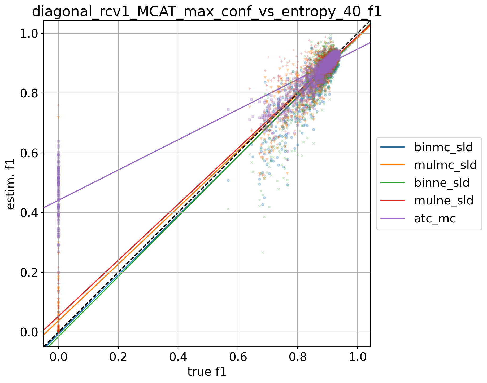
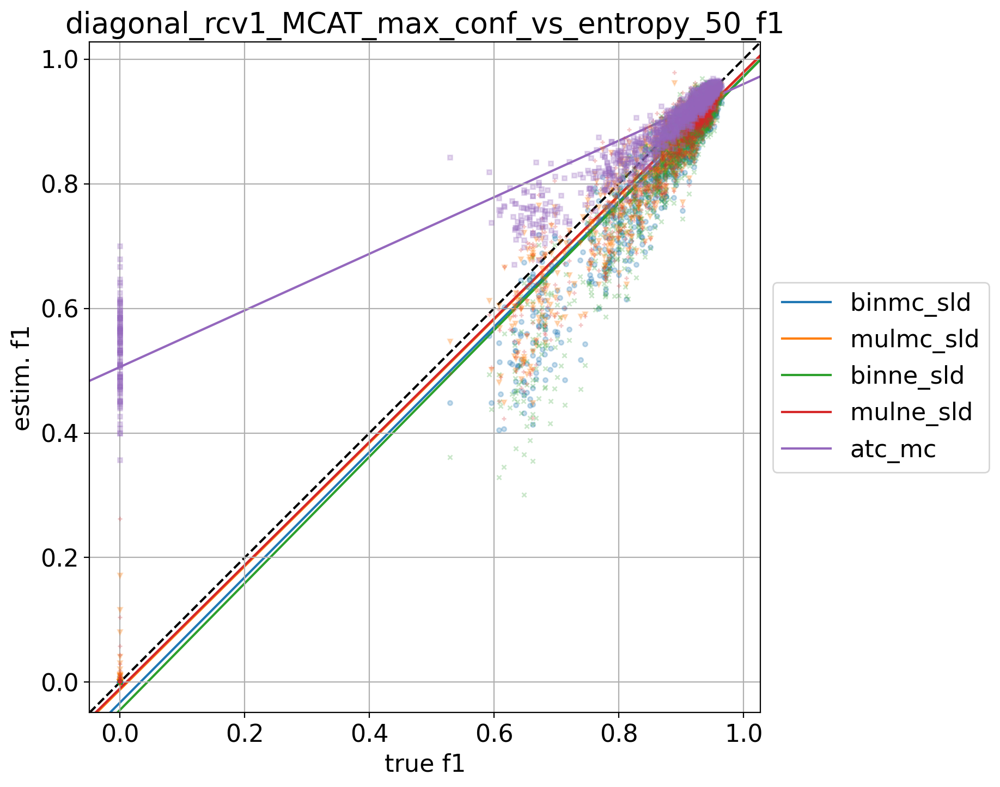
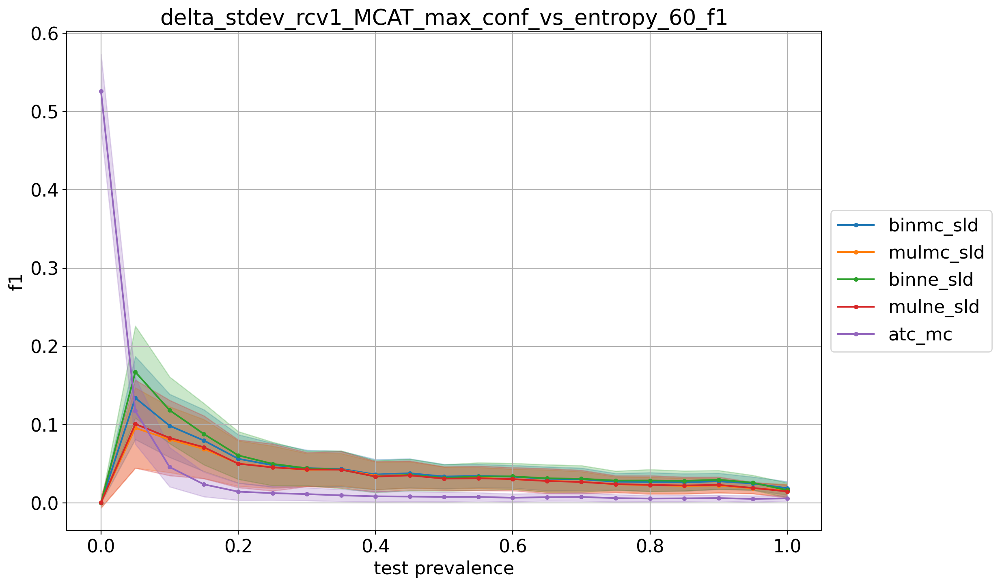
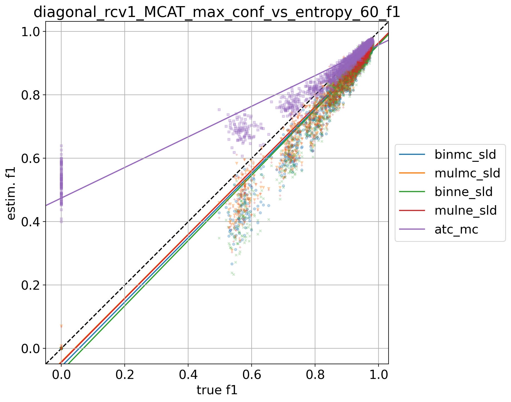
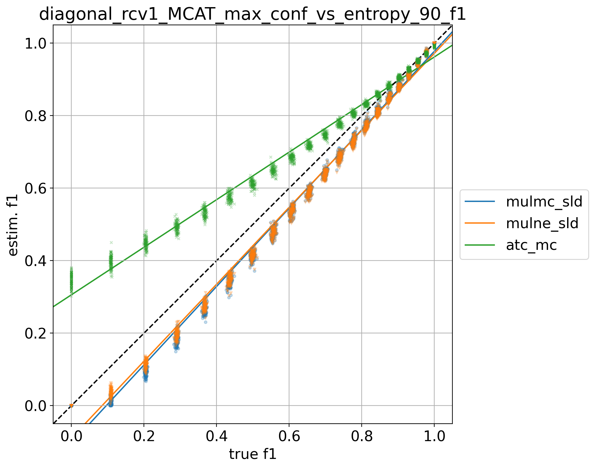

# rcv1_MCAT_9prevs

## 10% positives
> train: [0.90021426 0.09978574]  
> validation: [0.8999388 0.1000612]  
> bin_sld: 226.692s  
> mul_sld: 90.640s  
> binmc_sld: 226.949s  
> mulmc_sld: 100.373s  
> binne_sld: 224.579s  
> mulne_sld: 85.858s  
> bin_pacc: 217.884s  
> mul_pacc: 56.877s  
> ref: 47.843s  
> atc_mc: 51.242s  
> tot: 229.926s  

<table border="1" class="dataframe">
  <thead>
    <tr style="text-align: right;">
      <th></th>
      <th>binmc_sld</th>
      <th>mulmc_sld</th>
      <th>binne_sld</th>
      <th>mulne_sld</th>
      <th>atc_mc</th>
    </tr>
  </thead>
  <tbody>
    <tr>
      <th>0.0</th>
      <td>0.1065</td>
      <td>0.1129</td>
      <td>0.1463</td>
      <td>0.1179</td>
      <td>0.0100</td>
    </tr>
    <tr>
      <th>0.05</th>
      <td>0.0837</td>
      <td>0.0927</td>
      <td>0.0915</td>
      <td>0.0950</td>
      <td>0.2695</td>
    </tr>
    <tr>
      <th>0.1</th>
      <td>0.0553</td>
      <td>0.0659</td>
      <td>0.0375</td>
      <td>0.0703</td>
      <td>0.2793</td>
    </tr>
    <tr>
      <th>0.15</th>
      <td>0.0248</td>
      <td>0.1089</td>
      <td>0.0266</td>
      <td>0.0929</td>
      <td>0.2727</td>
    </tr>
    <tr>
      <th>0.2</th>
      <td>0.0152</td>
      <td>0.1342</td>
      <td>0.0145</td>
      <td>0.1098</td>
      <td>0.2684</td>
    </tr>
    <tr>
      <th>0.25</th>
      <td>0.0114</td>
      <td>0.1927</td>
      <td>0.0140</td>
      <td>0.1233</td>
      <td>0.2606</td>
    </tr>
    <tr>
      <th>0.3</th>
      <td>0.0093</td>
      <td>0.2190</td>
      <td>0.0135</td>
      <td>0.1462</td>
      <td>0.2614</td>
    </tr>
    <tr>
      <th>0.35</th>
      <td>0.0127</td>
      <td>0.2849</td>
      <td>0.0175</td>
      <td>0.1590</td>
      <td>0.2657</td>
    </tr>
    <tr>
      <th>0.4</th>
      <td>0.0161</td>
      <td>0.3372</td>
      <td>0.0208</td>
      <td>0.1976</td>
      <td>0.2653</td>
    </tr>
    <tr>
      <th>0.45</th>
      <td>0.0170</td>
      <td>0.3688</td>
      <td>0.0211</td>
      <td>0.2031</td>
      <td>0.2652</td>
    </tr>
    <tr>
      <th>0.5</th>
      <td>0.0191</td>
      <td>0.3742</td>
      <td>0.0224</td>
      <td>0.1957</td>
      <td>0.2598</td>
    </tr>
    <tr>
      <th>0.55</th>
      <td>0.0219</td>
      <td>0.3767</td>
      <td>0.0245</td>
      <td>0.2260</td>
      <td>0.2666</td>
    </tr>
    <tr>
      <th>0.6</th>
      <td>0.0227</td>
      <td>0.3633</td>
      <td>0.0246</td>
      <td>0.1982</td>
      <td>0.2595</td>
    </tr>
    <tr>
      <th>0.65</th>
      <td>0.0252</td>
      <td>0.3797</td>
      <td>0.0261</td>
      <td>0.2045</td>
      <td>0.2623</td>
    </tr>
    <tr>
      <th>0.7</th>
      <td>0.0276</td>
      <td>0.3894</td>
      <td>0.0276</td>
      <td>0.2127</td>
      <td>0.2670</td>
    </tr>
    <tr>
      <th>0.75</th>
      <td>0.0289</td>
      <td>0.3892</td>
      <td>0.0279</td>
      <td>0.1896</td>
      <td>0.2638</td>
    </tr>
    <tr>
      <th>0.8</th>
      <td>0.0303</td>
      <td>0.3810</td>
      <td>0.0282</td>
      <td>0.1948</td>
      <td>0.2665</td>
    </tr>
    <tr>
      <th>0.85</th>
      <td>0.0312</td>
      <td>0.3888</td>
      <td>0.0280</td>
      <td>0.1935</td>
      <td>0.2690</td>
    </tr>
    <tr>
      <th>0.9</th>
      <td>0.0319</td>
      <td>0.3723</td>
      <td>0.0278</td>
      <td>0.1634</td>
      <td>0.2639</td>
    </tr>
    <tr>
      <th>0.95</th>
      <td>0.0181</td>
      <td>0.2737</td>
      <td>0.0181</td>
      <td>0.0908</td>
      <td>0.2660</td>
    </tr>
    <tr>
      <th>1.0</th>
      <td>0.0012</td>
      <td>0.1070</td>
      <td>0.0012</td>
      <td>0.0387</td>
      <td>0.2621</td>
    </tr>
    <tr>
      <th>avg</th>
      <td>0.0290</td>
      <td>0.2720</td>
      <td>0.0314</td>
      <td>0.1535</td>
      <td>0.2535</td>
    </tr>
  </tbody>
</table>

## 20% positives
> train: [0.80012244 0.19987756]  
> validation: [0.7998776 0.2001224]  
> bin_sld: 217.346s  
> mul_sld: 64.811s  
> binmc_sld: 216.660s  
> mulmc_sld: 62.046s  
> binne_sld: 216.967s  
> mulne_sld: 61.675s  
> bin_pacc: 210.890s  
> mul_pacc: 55.836s  
> ref: 46.732s  
> atc_mc: 51.013s  
> tot: 222.345s  

<table border="1" class="dataframe">
  <thead>
    <tr style="text-align: right;">
      <th></th>
      <th>binmc_sld</th>
      <th>mulmc_sld</th>
      <th>binne_sld</th>
      <th>mulne_sld</th>
      <th>atc_mc</th>
    </tr>
  </thead>
  <tbody>
    <tr>
      <th>0.0</th>
      <td>0.0272</td>
      <td>0.0667</td>
      <td>0.0230</td>
      <td>0.1995</td>
      <td>0.1676</td>
    </tr>
    <tr>
      <th>0.05</th>
      <td>0.1170</td>
      <td>0.0976</td>
      <td>0.1604</td>
      <td>0.1109</td>
      <td>0.0959</td>
    </tr>
    <tr>
      <th>0.1</th>
      <td>0.0585</td>
      <td>0.0524</td>
      <td>0.0707</td>
      <td>0.0603</td>
      <td>0.0583</td>
    </tr>
    <tr>
      <th>0.15</th>
      <td>0.0409</td>
      <td>0.0384</td>
      <td>0.0449</td>
      <td>0.0428</td>
      <td>0.0517</td>
    </tr>
    <tr>
      <th>0.2</th>
      <td>0.0322</td>
      <td>0.0301</td>
      <td>0.0301</td>
      <td>0.0318</td>
      <td>0.0442</td>
    </tr>
    <tr>
      <th>0.25</th>
      <td>0.0206</td>
      <td>0.0198</td>
      <td>0.0179</td>
      <td>0.0231</td>
      <td>0.0392</td>
    </tr>
    <tr>
      <th>0.3</th>
      <td>0.0194</td>
      <td>0.0194</td>
      <td>0.0161</td>
      <td>0.0217</td>
      <td>0.0332</td>
    </tr>
    <tr>
      <th>0.35</th>
      <td>0.0162</td>
      <td>0.0163</td>
      <td>0.0136</td>
      <td>0.0194</td>
      <td>0.0305</td>
    </tr>
    <tr>
      <th>0.4</th>
      <td>0.0115</td>
      <td>0.0140</td>
      <td>0.0090</td>
      <td>0.0186</td>
      <td>0.0322</td>
    </tr>
    <tr>
      <th>0.45</th>
      <td>0.0103</td>
      <td>0.0136</td>
      <td>0.0083</td>
      <td>0.0190</td>
      <td>0.0297</td>
    </tr>
    <tr>
      <th>0.5</th>
      <td>0.0094</td>
      <td>0.0146</td>
      <td>0.0083</td>
      <td>0.0193</td>
      <td>0.0290</td>
    </tr>
    <tr>
      <th>0.55</th>
      <td>0.0083</td>
      <td>0.0165</td>
      <td>0.0088</td>
      <td>0.0219</td>
      <td>0.0288</td>
    </tr>
    <tr>
      <th>0.6</th>
      <td>0.0071</td>
      <td>0.0159</td>
      <td>0.0083</td>
      <td>0.0204</td>
      <td>0.0243</td>
    </tr>
    <tr>
      <th>0.65</th>
      <td>0.0074</td>
      <td>0.0192</td>
      <td>0.0104</td>
      <td>0.0230</td>
      <td>0.0247</td>
    </tr>
    <tr>
      <th>0.7</th>
      <td>0.0094</td>
      <td>0.0226</td>
      <td>0.0122</td>
      <td>0.0249</td>
      <td>0.0273</td>
    </tr>
    <tr>
      <th>0.75</th>
      <td>0.0105</td>
      <td>0.0245</td>
      <td>0.0130</td>
      <td>0.0250</td>
      <td>0.0256</td>
    </tr>
    <tr>
      <th>0.8</th>
      <td>0.0120</td>
      <td>0.0255</td>
      <td>0.0139</td>
      <td>0.0245</td>
      <td>0.0238</td>
    </tr>
    <tr>
      <th>0.85</th>
      <td>0.0129</td>
      <td>0.0268</td>
      <td>0.0141</td>
      <td>0.0240</td>
      <td>0.0223</td>
    </tr>
    <tr>
      <th>0.9</th>
      <td>0.0164</td>
      <td>0.0320</td>
      <td>0.0159</td>
      <td>0.0270</td>
      <td>0.0215</td>
    </tr>
    <tr>
      <th>0.95</th>
      <td>0.0170</td>
      <td>0.0334</td>
      <td>0.0147</td>
      <td>0.0260</td>
      <td>0.0228</td>
    </tr>
    <tr>
      <th>1.0</th>
      <td>0.0012</td>
      <td>0.0133</td>
      <td>0.0008</td>
      <td>0.0103</td>
      <td>0.0224</td>
    </tr>
    <tr>
      <th>avg</th>
      <td>0.0222</td>
      <td>0.0292</td>
      <td>0.0245</td>
      <td>0.0378</td>
      <td>0.0407</td>
    </tr>
  </tbody>
</table>

## 30% positives
> train: [0.70003061 0.29996939]  
> validation: [0.6998164 0.3001836]  
> bin_sld: 219.389s  
> mul_sld: 68.837s  
> binmc_sld: 219.147s  
> mulmc_sld: 65.023s  
> binne_sld: 218.371s  
> mulne_sld: 65.296s  
> bin_pacc: 212.357s  
> mul_pacc: 56.167s  
> ref: 47.599s  
> atc_mc: 51.508s  
> tot: 223.231s  

<table border="1" class="dataframe">
  <thead>
    <tr style="text-align: right;">
      <th></th>
      <th>binmc_sld</th>
      <th>mulmc_sld</th>
      <th>binne_sld</th>
      <th>mulne_sld</th>
      <th>atc_mc</th>
    </tr>
  </thead>
  <tbody>
    <tr>
      <th>0.0</th>
      <td>0.0049</td>
      <td>0.0793</td>
      <td>0.0049</td>
      <td>0.1339</td>
      <td>0.3293</td>
    </tr>
    <tr>
      <th>0.05</th>
      <td>0.1277</td>
      <td>0.0864</td>
      <td>0.1827</td>
      <td>0.0880</td>
      <td>0.0568</td>
    </tr>
    <tr>
      <th>0.1</th>
      <td>0.0760</td>
      <td>0.0604</td>
      <td>0.0989</td>
      <td>0.0651</td>
      <td>0.0372</td>
    </tr>
    <tr>
      <th>0.15</th>
      <td>0.0641</td>
      <td>0.0506</td>
      <td>0.0810</td>
      <td>0.0514</td>
      <td>0.0269</td>
    </tr>
    <tr>
      <th>0.2</th>
      <td>0.0433</td>
      <td>0.0361</td>
      <td>0.0524</td>
      <td>0.0374</td>
      <td>0.0223</td>
    </tr>
    <tr>
      <th>0.25</th>
      <td>0.0422</td>
      <td>0.0376</td>
      <td>0.0504</td>
      <td>0.0415</td>
      <td>0.0182</td>
    </tr>
    <tr>
      <th>0.3</th>
      <td>0.0393</td>
      <td>0.0320</td>
      <td>0.0451</td>
      <td>0.0371</td>
      <td>0.0143</td>
    </tr>
    <tr>
      <th>0.35</th>
      <td>0.0345</td>
      <td>0.0281</td>
      <td>0.0379</td>
      <td>0.0350</td>
      <td>0.0149</td>
    </tr>
    <tr>
      <th>0.4</th>
      <td>0.0274</td>
      <td>0.0234</td>
      <td>0.0310</td>
      <td>0.0307</td>
      <td>0.0127</td>
    </tr>
    <tr>
      <th>0.45</th>
      <td>0.0278</td>
      <td>0.0215</td>
      <td>0.0298</td>
      <td>0.0292</td>
      <td>0.0124</td>
    </tr>
    <tr>
      <th>0.5</th>
      <td>0.0276</td>
      <td>0.0215</td>
      <td>0.0280</td>
      <td>0.0300</td>
      <td>0.0111</td>
    </tr>
    <tr>
      <th>0.55</th>
      <td>0.0231</td>
      <td>0.0194</td>
      <td>0.0245</td>
      <td>0.0271</td>
      <td>0.0111</td>
    </tr>
    <tr>
      <th>0.6</th>
      <td>0.0257</td>
      <td>0.0201</td>
      <td>0.0256</td>
      <td>0.0278</td>
      <td>0.0103</td>
    </tr>
    <tr>
      <th>0.65</th>
      <td>0.0250</td>
      <td>0.0202</td>
      <td>0.0259</td>
      <td>0.0281</td>
      <td>0.0104</td>
    </tr>
    <tr>
      <th>0.7</th>
      <td>0.0275</td>
      <td>0.0221</td>
      <td>0.0272</td>
      <td>0.0293</td>
      <td>0.0087</td>
    </tr>
    <tr>
      <th>0.75</th>
      <td>0.0267</td>
      <td>0.0219</td>
      <td>0.0267</td>
      <td>0.0282</td>
      <td>0.0085</td>
    </tr>
    <tr>
      <th>0.8</th>
      <td>0.0263</td>
      <td>0.0225</td>
      <td>0.0252</td>
      <td>0.0280</td>
      <td>0.0092</td>
    </tr>
    <tr>
      <th>0.85</th>
      <td>0.0240</td>
      <td>0.0220</td>
      <td>0.0224</td>
      <td>0.0258</td>
      <td>0.0092</td>
    </tr>
    <tr>
      <th>0.9</th>
      <td>0.0290</td>
      <td>0.0259</td>
      <td>0.0255</td>
      <td>0.0290</td>
      <td>0.0081</td>
    </tr>
    <tr>
      <th>0.95</th>
      <td>0.0272</td>
      <td>0.0248</td>
      <td>0.0227</td>
      <td>0.0252</td>
      <td>0.0076</td>
    </tr>
    <tr>
      <th>1.0</th>
      <td>0.0112</td>
      <td>0.0123</td>
      <td>0.0068</td>
      <td>0.0150</td>
      <td>0.0092</td>
    </tr>
    <tr>
      <th>avg</th>
      <td>0.0362</td>
      <td>0.0328</td>
      <td>0.0417</td>
      <td>0.0401</td>
      <td>0.0309</td>
    </tr>
  </tbody>
</table>

## 40% positives
> train: [0.59993878 0.40006122]  
> validation: [0.6000612 0.3999388]  
> bin_sld: 218.273s  
> mul_sld: 64.926s  
> binmc_sld: 216.495s  
> mulmc_sld: 63.652s  
> binne_sld: 217.602s  
> mulne_sld: 63.801s  
> bin_pacc: 211.842s  
> mul_pacc: 56.383s  
> ref: 47.351s  
> atc_mc: 51.386s  
> tot: 222.442s  

<table border="1" class="dataframe">
  <thead>
    <tr style="text-align: right;">
      <th></th>
      <th>binmc_sld</th>
      <th>mulmc_sld</th>
      <th>binne_sld</th>
      <th>mulne_sld</th>
      <th>atc_mc</th>
    </tr>
  </thead>
  <tbody>
    <tr>
      <th>0.0</th>
      <td>0.0029</td>
      <td>0.0394</td>
      <td>0.0007</td>
      <td>0.0457</td>
      <td>0.4631</td>
    </tr>
    <tr>
      <th>0.05</th>
      <td>0.0780</td>
      <td>0.0622</td>
      <td>0.1044</td>
      <td>0.0746</td>
      <td>0.0388</td>
    </tr>
    <tr>
      <th>0.1</th>
      <td>0.0527</td>
      <td>0.0502</td>
      <td>0.0581</td>
      <td>0.0556</td>
      <td>0.0294</td>
    </tr>
    <tr>
      <th>0.15</th>
      <td>0.0390</td>
      <td>0.0359</td>
      <td>0.0415</td>
      <td>0.0379</td>
      <td>0.0228</td>
    </tr>
    <tr>
      <th>0.2</th>
      <td>0.0273</td>
      <td>0.0246</td>
      <td>0.0308</td>
      <td>0.0301</td>
      <td>0.0159</td>
    </tr>
    <tr>
      <th>0.25</th>
      <td>0.0244</td>
      <td>0.0223</td>
      <td>0.0278</td>
      <td>0.0260</td>
      <td>0.0149</td>
    </tr>
    <tr>
      <th>0.3</th>
      <td>0.0254</td>
      <td>0.0218</td>
      <td>0.0293</td>
      <td>0.0241</td>
      <td>0.0120</td>
    </tr>
    <tr>
      <th>0.35</th>
      <td>0.0236</td>
      <td>0.0197</td>
      <td>0.0251</td>
      <td>0.0203</td>
      <td>0.0113</td>
    </tr>
    <tr>
      <th>0.4</th>
      <td>0.0161</td>
      <td>0.0137</td>
      <td>0.0184</td>
      <td>0.0154</td>
      <td>0.0091</td>
    </tr>
    <tr>
      <th>0.45</th>
      <td>0.0179</td>
      <td>0.0139</td>
      <td>0.0183</td>
      <td>0.0150</td>
      <td>0.0083</td>
    </tr>
    <tr>
      <th>0.5</th>
      <td>0.0164</td>
      <td>0.0123</td>
      <td>0.0166</td>
      <td>0.0125</td>
      <td>0.0092</td>
    </tr>
    <tr>
      <th>0.55</th>
      <td>0.0142</td>
      <td>0.0116</td>
      <td>0.0136</td>
      <td>0.0127</td>
      <td>0.0080</td>
    </tr>
    <tr>
      <th>0.6</th>
      <td>0.0154</td>
      <td>0.0123</td>
      <td>0.0146</td>
      <td>0.0139</td>
      <td>0.0076</td>
    </tr>
    <tr>
      <th>0.65</th>
      <td>0.0148</td>
      <td>0.0118</td>
      <td>0.0131</td>
      <td>0.0135</td>
      <td>0.0076</td>
    </tr>
    <tr>
      <th>0.7</th>
      <td>0.0148</td>
      <td>0.0117</td>
      <td>0.0137</td>
      <td>0.0142</td>
      <td>0.0074</td>
    </tr>
    <tr>
      <th>0.75</th>
      <td>0.0140</td>
      <td>0.0110</td>
      <td>0.0129</td>
      <td>0.0139</td>
      <td>0.0061</td>
    </tr>
    <tr>
      <th>0.8</th>
      <td>0.0138</td>
      <td>0.0116</td>
      <td>0.0120</td>
      <td>0.0148</td>
      <td>0.0056</td>
    </tr>
    <tr>
      <th>0.85</th>
      <td>0.0149</td>
      <td>0.0124</td>
      <td>0.0128</td>
      <td>0.0156</td>
      <td>0.0069</td>
    </tr>
    <tr>
      <th>0.9</th>
      <td>0.0158</td>
      <td>0.0136</td>
      <td>0.0138</td>
      <td>0.0168</td>
      <td>0.0071</td>
    </tr>
    <tr>
      <th>0.95</th>
      <td>0.0149</td>
      <td>0.0140</td>
      <td>0.0124</td>
      <td>0.0162</td>
      <td>0.0068</td>
    </tr>
    <tr>
      <th>1.0</th>
      <td>0.0101</td>
      <td>0.0100</td>
      <td>0.0049</td>
      <td>0.0093</td>
      <td>0.0057</td>
    </tr>
    <tr>
      <th>avg</th>
      <td>0.0222</td>
      <td>0.0208</td>
      <td>0.0236</td>
      <td>0.0237</td>
      <td>0.0335</td>
    </tr>
  </tbody>
</table>

## 50% positives
> train: [0.50015305 0.49984695]  
> validation: [0.5 0.5]  
> bin_sld: 216.810s  
> mul_sld: 66.656s  
> binmc_sld: 214.455s  
> mulmc_sld: 65.245s  
> binne_sld: 215.501s  
> mulne_sld: 65.656s  
> bin_pacc: 211.948s  
> mul_pacc: 56.312s  
> ref: 47.378s  
> atc_mc: 51.192s  
> tot: 220.479s  

<table border="1" class="dataframe">
  <thead>
    <tr style="text-align: right;">
      <th></th>
      <th>binmc_sld</th>
      <th>mulmc_sld</th>
      <th>binne_sld</th>
      <th>mulne_sld</th>
      <th>atc_mc</th>
    </tr>
  </thead>
  <tbody>
    <tr>
      <th>0.0</th>
      <td>0.0003</td>
      <td>0.0056</td>
      <td>0.0001</td>
      <td>0.0059</td>
      <td>0.5337</td>
    </tr>
    <tr>
      <th>0.05</th>
      <td>0.1099</td>
      <td>0.0710</td>
      <td>0.1468</td>
      <td>0.0752</td>
      <td>0.0902</td>
    </tr>
    <tr>
      <th>0.1</th>
      <td>0.0738</td>
      <td>0.0579</td>
      <td>0.0867</td>
      <td>0.0571</td>
      <td>0.0381</td>
    </tr>
    <tr>
      <th>0.15</th>
      <td>0.0553</td>
      <td>0.0462</td>
      <td>0.0603</td>
      <td>0.0462</td>
      <td>0.0210</td>
    </tr>
    <tr>
      <th>0.2</th>
      <td>0.0367</td>
      <td>0.0311</td>
      <td>0.0394</td>
      <td>0.0317</td>
      <td>0.0145</td>
    </tr>
    <tr>
      <th>0.25</th>
      <td>0.0327</td>
      <td>0.0277</td>
      <td>0.0333</td>
      <td>0.0270</td>
      <td>0.0137</td>
    </tr>
    <tr>
      <th>0.3</th>
      <td>0.0302</td>
      <td>0.0253</td>
      <td>0.0307</td>
      <td>0.0242</td>
      <td>0.0111</td>
    </tr>
    <tr>
      <th>0.35</th>
      <td>0.0328</td>
      <td>0.0283</td>
      <td>0.0329</td>
      <td>0.0270</td>
      <td>0.0098</td>
    </tr>
    <tr>
      <th>0.4</th>
      <td>0.0239</td>
      <td>0.0199</td>
      <td>0.0244</td>
      <td>0.0193</td>
      <td>0.0108</td>
    </tr>
    <tr>
      <th>0.45</th>
      <td>0.0252</td>
      <td>0.0214</td>
      <td>0.0267</td>
      <td>0.0219</td>
      <td>0.0084</td>
    </tr>
    <tr>
      <th>0.5</th>
      <td>0.0214</td>
      <td>0.0184</td>
      <td>0.0224</td>
      <td>0.0188</td>
      <td>0.0094</td>
    </tr>
    <tr>
      <th>0.55</th>
      <td>0.0219</td>
      <td>0.0181</td>
      <td>0.0228</td>
      <td>0.0187</td>
      <td>0.0076</td>
    </tr>
    <tr>
      <th>0.6</th>
      <td>0.0225</td>
      <td>0.0187</td>
      <td>0.0237</td>
      <td>0.0198</td>
      <td>0.0068</td>
    </tr>
    <tr>
      <th>0.65</th>
      <td>0.0212</td>
      <td>0.0176</td>
      <td>0.0221</td>
      <td>0.0187</td>
      <td>0.0062</td>
    </tr>
    <tr>
      <th>0.7</th>
      <td>0.0211</td>
      <td>0.0174</td>
      <td>0.0218</td>
      <td>0.0192</td>
      <td>0.0054</td>
    </tr>
    <tr>
      <th>0.75</th>
      <td>0.0197</td>
      <td>0.0157</td>
      <td>0.0208</td>
      <td>0.0177</td>
      <td>0.0061</td>
    </tr>
    <tr>
      <th>0.8</th>
      <td>0.0184</td>
      <td>0.0150</td>
      <td>0.0191</td>
      <td>0.0173</td>
      <td>0.0065</td>
    </tr>
    <tr>
      <th>0.85</th>
      <td>0.0169</td>
      <td>0.0137</td>
      <td>0.0173</td>
      <td>0.0159</td>
      <td>0.0063</td>
    </tr>
    <tr>
      <th>0.9</th>
      <td>0.0194</td>
      <td>0.0155</td>
      <td>0.0199</td>
      <td>0.0178</td>
      <td>0.0058</td>
    </tr>
    <tr>
      <th>0.95</th>
      <td>0.0173</td>
      <td>0.0142</td>
      <td>0.0166</td>
      <td>0.0156</td>
      <td>0.0057</td>
    </tr>
    <tr>
      <th>1.0</th>
      <td>0.0112</td>
      <td>0.0093</td>
      <td>0.0074</td>
      <td>0.0086</td>
      <td>0.0048</td>
    </tr>
    <tr>
      <th>avg</th>
      <td>0.0301</td>
      <td>0.0242</td>
      <td>0.0331</td>
      <td>0.0249</td>
      <td>0.0391</td>
    </tr>
  </tbody>
</table>

## 60% positives
> train: [0.40006122 0.59993878]  
> validation: [0.3999388 0.6000612]  
> bin_sld: 214.524s  
> mul_sld: 67.289s  
> binmc_sld: 212.382s  
> mulmc_sld: 64.717s  
> binne_sld: 212.511s  
> mulne_sld: 64.931s  
> bin_pacc: 207.692s  
> mul_pacc: 55.877s  
> ref: 47.088s  
> atc_mc: 51.183s  
> tot: 217.360s  

<table border="1" class="dataframe">
  <thead>
    <tr style="text-align: right;">
      <th></th>
      <th>binmc_sld</th>
      <th>mulmc_sld</th>
      <th>binne_sld</th>
      <th>mulne_sld</th>
      <th>atc_mc</th>
    </tr>
  </thead>
  <tbody>
    <tr>
      <th>0.0</th>
      <td>0.0001</td>
      <td>0.0008</td>
      <td>0.0001</td>
      <td>0.0008</td>
      <td>0.5258</td>
    </tr>
    <tr>
      <th>0.05</th>
      <td>0.1342</td>
      <td>0.0959</td>
      <td>0.1673</td>
      <td>0.1009</td>
      <td>0.1176</td>
    </tr>
    <tr>
      <th>0.1</th>
      <td>0.0987</td>
      <td>0.0810</td>
      <td>0.1185</td>
      <td>0.0831</td>
      <td>0.0459</td>
    </tr>
    <tr>
      <th>0.15</th>
      <td>0.0798</td>
      <td>0.0690</td>
      <td>0.0880</td>
      <td>0.0713</td>
      <td>0.0238</td>
    </tr>
    <tr>
      <th>0.2</th>
      <td>0.0565</td>
      <td>0.0505</td>
      <td>0.0608</td>
      <td>0.0502</td>
      <td>0.0145</td>
    </tr>
    <tr>
      <th>0.25</th>
      <td>0.0484</td>
      <td>0.0458</td>
      <td>0.0500</td>
      <td>0.0455</td>
      <td>0.0126</td>
    </tr>
    <tr>
      <th>0.3</th>
      <td>0.0445</td>
      <td>0.0424</td>
      <td>0.0444</td>
      <td>0.0428</td>
      <td>0.0114</td>
    </tr>
    <tr>
      <th>0.35</th>
      <td>0.0436</td>
      <td>0.0427</td>
      <td>0.0426</td>
      <td>0.0426</td>
      <td>0.0098</td>
    </tr>
    <tr>
      <th>0.4</th>
      <td>0.0364</td>
      <td>0.0349</td>
      <td>0.0337</td>
      <td>0.0338</td>
      <td>0.0085</td>
    </tr>
    <tr>
      <th>0.45</th>
      <td>0.0380</td>
      <td>0.0358</td>
      <td>0.0359</td>
      <td>0.0352</td>
      <td>0.0082</td>
    </tr>
    <tr>
      <th>0.5</th>
      <td>0.0338</td>
      <td>0.0319</td>
      <td>0.0322</td>
      <td>0.0311</td>
      <td>0.0078</td>
    </tr>
    <tr>
      <th>0.55</th>
      <td>0.0345</td>
      <td>0.0320</td>
      <td>0.0338</td>
      <td>0.0316</td>
      <td>0.0079</td>
    </tr>
    <tr>
      <th>0.6</th>
      <td>0.0336</td>
      <td>0.0305</td>
      <td>0.0340</td>
      <td>0.0305</td>
      <td>0.0067</td>
    </tr>
    <tr>
      <th>0.65</th>
      <td>0.0310</td>
      <td>0.0282</td>
      <td>0.0315</td>
      <td>0.0281</td>
      <td>0.0075</td>
    </tr>
    <tr>
      <th>0.7</th>
      <td>0.0304</td>
      <td>0.0271</td>
      <td>0.0310</td>
      <td>0.0269</td>
      <td>0.0078</td>
    </tr>
    <tr>
      <th>0.75</th>
      <td>0.0272</td>
      <td>0.0239</td>
      <td>0.0286</td>
      <td>0.0241</td>
      <td>0.0062</td>
    </tr>
    <tr>
      <th>0.8</th>
      <td>0.0270</td>
      <td>0.0226</td>
      <td>0.0287</td>
      <td>0.0231</td>
      <td>0.0057</td>
    </tr>
    <tr>
      <th>0.85</th>
      <td>0.0265</td>
      <td>0.0218</td>
      <td>0.0283</td>
      <td>0.0224</td>
      <td>0.0059</td>
    </tr>
    <tr>
      <th>0.9</th>
      <td>0.0277</td>
      <td>0.0223</td>
      <td>0.0297</td>
      <td>0.0231</td>
      <td>0.0063</td>
    </tr>
    <tr>
      <th>0.95</th>
      <td>0.0249</td>
      <td>0.0188</td>
      <td>0.0260</td>
      <td>0.0193</td>
      <td>0.0053</td>
    </tr>
    <tr>
      <th>1.0</th>
      <td>0.0189</td>
      <td>0.0161</td>
      <td>0.0164</td>
      <td>0.0148</td>
      <td>0.0059</td>
    </tr>
    <tr>
      <th>avg</th>
      <td>0.0427</td>
      <td>0.0369</td>
      <td>0.0458</td>
      <td>0.0372</td>
      <td>0.0405</td>
    </tr>
  </tbody>
</table>

## 70% positives
> train: [0.29996939 0.70003061]  
> validation: [0.2998776 0.7001224]  
> bin_sld: 214.649s  
> mul_sld: 67.063s  
> binmc_sld: 213.217s  
> mulmc_sld: 64.765s  
> binne_sld: 215.565s  
> mulne_sld: 65.253s  
> bin_pacc: 207.954s  
> mul_pacc: 55.495s  
> ref: 46.537s  
> atc_mc: 51.012s  
> tot: 220.485s  

<table border="1" class="dataframe">
  <thead>
    <tr style="text-align: right;">
      <th></th>
      <th>binmc_sld</th>
      <th>mulmc_sld</th>
      <th>binne_sld</th>
      <th>mulne_sld</th>
      <th>atc_mc</th>
    </tr>
  </thead>
  <tbody>
    <tr>
      <th>0.0</th>
      <td>0.0001</td>
      <td>0.0001</td>
      <td>0.0001</td>
      <td>0.0002</td>
      <td>0.6387</td>
    </tr>
    <tr>
      <th>0.05</th>
      <td>0.1516</td>
      <td>0.1053</td>
      <td>0.1683</td>
      <td>0.1052</td>
      <td>0.2932</td>
    </tr>
    <tr>
      <th>0.1</th>
      <td>0.1153</td>
      <td>0.0856</td>
      <td>0.1313</td>
      <td>0.0912</td>
      <td>0.1729</td>
    </tr>
    <tr>
      <th>0.15</th>
      <td>0.0953</td>
      <td>0.0744</td>
      <td>0.1088</td>
      <td>0.0814</td>
      <td>0.1108</td>
    </tr>
    <tr>
      <th>0.2</th>
      <td>0.0707</td>
      <td>0.0566</td>
      <td>0.0792</td>
      <td>0.0620</td>
      <td>0.0734</td>
    </tr>
    <tr>
      <th>0.25</th>
      <td>0.0556</td>
      <td>0.0458</td>
      <td>0.0627</td>
      <td>0.0510</td>
      <td>0.0566</td>
    </tr>
    <tr>
      <th>0.3</th>
      <td>0.0497</td>
      <td>0.0421</td>
      <td>0.0538</td>
      <td>0.0475</td>
      <td>0.0406</td>
    </tr>
    <tr>
      <th>0.35</th>
      <td>0.0419</td>
      <td>0.0367</td>
      <td>0.0457</td>
      <td>0.0423</td>
      <td>0.0345</td>
    </tr>
    <tr>
      <th>0.4</th>
      <td>0.0393</td>
      <td>0.0335</td>
      <td>0.0411</td>
      <td>0.0377</td>
      <td>0.0246</td>
    </tr>
    <tr>
      <th>0.45</th>
      <td>0.0373</td>
      <td>0.0322</td>
      <td>0.0392</td>
      <td>0.0364</td>
      <td>0.0209</td>
    </tr>
    <tr>
      <th>0.5</th>
      <td>0.0313</td>
      <td>0.0269</td>
      <td>0.0321</td>
      <td>0.0301</td>
      <td>0.0140</td>
    </tr>
    <tr>
      <th>0.55</th>
      <td>0.0306</td>
      <td>0.0263</td>
      <td>0.0328</td>
      <td>0.0298</td>
      <td>0.0127</td>
    </tr>
    <tr>
      <th>0.6</th>
      <td>0.0308</td>
      <td>0.0261</td>
      <td>0.0327</td>
      <td>0.0292</td>
      <td>0.0089</td>
    </tr>
    <tr>
      <th>0.65</th>
      <td>0.0265</td>
      <td>0.0221</td>
      <td>0.0284</td>
      <td>0.0250</td>
      <td>0.0069</td>
    </tr>
    <tr>
      <th>0.7</th>
      <td>0.0221</td>
      <td>0.0185</td>
      <td>0.0240</td>
      <td>0.0206</td>
      <td>0.0061</td>
    </tr>
    <tr>
      <th>0.75</th>
      <td>0.0198</td>
      <td>0.0157</td>
      <td>0.0221</td>
      <td>0.0179</td>
      <td>0.0046</td>
    </tr>
    <tr>
      <th>0.8</th>
      <td>0.0201</td>
      <td>0.0156</td>
      <td>0.0230</td>
      <td>0.0176</td>
      <td>0.0040</td>
    </tr>
    <tr>
      <th>0.85</th>
      <td>0.0173</td>
      <td>0.0132</td>
      <td>0.0197</td>
      <td>0.0144</td>
      <td>0.0029</td>
    </tr>
    <tr>
      <th>0.9</th>
      <td>0.0184</td>
      <td>0.0136</td>
      <td>0.0212</td>
      <td>0.0148</td>
      <td>0.0036</td>
    </tr>
    <tr>
      <th>0.95</th>
      <td>0.0153</td>
      <td>0.0108</td>
      <td>0.0176</td>
      <td>0.0117</td>
      <td>0.0034</td>
    </tr>
    <tr>
      <th>1.0</th>
      <td>0.0066</td>
      <td>0.0051</td>
      <td>0.0046</td>
      <td>0.0035</td>
      <td>0.0030</td>
    </tr>
    <tr>
      <th>avg</th>
      <td>0.0426</td>
      <td>0.0336</td>
      <td>0.0471</td>
      <td>0.0366</td>
      <td>0.0732</td>
    </tr>
  </tbody>
</table>

## 80% positives
> train: [0.19987756 0.80012244]  
> validation: [0.2001224 0.7998776]  
> bin_sld: 216.905s  
> mul_sld: 78.500s  
> binmc_sld: 216.274s  
> mulmc_sld: 78.752s  
> binne_sld: 214.957s  
> mulne_sld: 78.429s  
> bin_pacc: 208.520s  
> mul_pacc: 55.495s  
> ref: 46.765s  
> atc_mc: 50.943s  
> tot: 219.759s  

<table border="1" class="dataframe">
  <thead>
    <tr style="text-align: right;">
      <th></th>
      <th>binmc_sld</th>
      <th>mulmc_sld</th>
      <th>binne_sld</th>
      <th>mulne_sld</th>
      <th>atc_mc</th>
    </tr>
  </thead>
  <tbody>
    <tr>
      <th>0.0</th>
      <td>0.0000</td>
      <td>0.0000</td>
      <td>0.0000</td>
      <td>0.0001</td>
      <td>0.5853</td>
    </tr>
    <tr>
      <th>0.05</th>
      <td>0.1285</td>
      <td>0.0850</td>
      <td>0.1238</td>
      <td>0.0896</td>
      <td>0.3775</td>
    </tr>
    <tr>
      <th>0.1</th>
      <td>0.1053</td>
      <td>0.0825</td>
      <td>0.1139</td>
      <td>0.1019</td>
      <td>0.2622</td>
    </tr>
    <tr>
      <th>0.15</th>
      <td>0.0847</td>
      <td>0.0797</td>
      <td>0.0980</td>
      <td>0.1046</td>
      <td>0.1849</td>
    </tr>
    <tr>
      <th>0.2</th>
      <td>0.0653</td>
      <td>0.0710</td>
      <td>0.0794</td>
      <td>0.0945</td>
      <td>0.1334</td>
    </tr>
    <tr>
      <th>0.25</th>
      <td>0.0520</td>
      <td>0.0593</td>
      <td>0.0663</td>
      <td>0.0828</td>
      <td>0.1025</td>
    </tr>
    <tr>
      <th>0.3</th>
      <td>0.0451</td>
      <td>0.0581</td>
      <td>0.0587</td>
      <td>0.0796</td>
      <td>0.0752</td>
    </tr>
    <tr>
      <th>0.35</th>
      <td>0.0350</td>
      <td>0.0502</td>
      <td>0.0479</td>
      <td>0.0688</td>
      <td>0.0582</td>
    </tr>
    <tr>
      <th>0.4</th>
      <td>0.0281</td>
      <td>0.0473</td>
      <td>0.0393</td>
      <td>0.0638</td>
      <td>0.0449</td>
    </tr>
    <tr>
      <th>0.45</th>
      <td>0.0269</td>
      <td>0.0454</td>
      <td>0.0371</td>
      <td>0.0597</td>
      <td>0.0363</td>
    </tr>
    <tr>
      <th>0.5</th>
      <td>0.0204</td>
      <td>0.0396</td>
      <td>0.0292</td>
      <td>0.0509</td>
      <td>0.0254</td>
    </tr>
    <tr>
      <th>0.55</th>
      <td>0.0171</td>
      <td>0.0396</td>
      <td>0.0247</td>
      <td>0.0495</td>
      <td>0.0193</td>
    </tr>
    <tr>
      <th>0.6</th>
      <td>0.0159</td>
      <td>0.0355</td>
      <td>0.0223</td>
      <td>0.0434</td>
      <td>0.0139</td>
    </tr>
    <tr>
      <th>0.65</th>
      <td>0.0124</td>
      <td>0.0308</td>
      <td>0.0173</td>
      <td>0.0364</td>
      <td>0.0099</td>
    </tr>
    <tr>
      <th>0.7</th>
      <td>0.0092</td>
      <td>0.0235</td>
      <td>0.0123</td>
      <td>0.0274</td>
      <td>0.0080</td>
    </tr>
    <tr>
      <th>0.75</th>
      <td>0.0075</td>
      <td>0.0218</td>
      <td>0.0092</td>
      <td>0.0243</td>
      <td>0.0057</td>
    </tr>
    <tr>
      <th>0.8</th>
      <td>0.0075</td>
      <td>0.0202</td>
      <td>0.0080</td>
      <td>0.0212</td>
      <td>0.0041</td>
    </tr>
    <tr>
      <th>0.85</th>
      <td>0.0061</td>
      <td>0.0158</td>
      <td>0.0057</td>
      <td>0.0154</td>
      <td>0.0038</td>
    </tr>
    <tr>
      <th>0.9</th>
      <td>0.0082</td>
      <td>0.0138</td>
      <td>0.0072</td>
      <td>0.0128</td>
      <td>0.0032</td>
    </tr>
    <tr>
      <th>0.95</th>
      <td>0.0083</td>
      <td>0.0098</td>
      <td>0.0076</td>
      <td>0.0082</td>
      <td>0.0032</td>
    </tr>
    <tr>
      <th>1.0</th>
      <td>0.0022</td>
      <td>0.0022</td>
      <td>0.0012</td>
      <td>0.0016</td>
      <td>0.0034</td>
    </tr>
    <tr>
      <th>avg</th>
      <td>0.0327</td>
      <td>0.0396</td>
      <td>0.0385</td>
      <td>0.0494</td>
      <td>0.0934</td>
    </tr>
  </tbody>
</table>

## 90% positives
> train: [0.09978574 0.90021426]  
> validation: [0.1000612 0.8999388]  
> mul_sld: 50.214s  
> mulmc_sld: 48.094s  
> mulne_sld: 47.975s  
> ref: 36.698s  
> atc_mc: 39.829s  
> tot: 53.564s  

<table border="1" class="dataframe">
  <thead>
    <tr style="text-align: right;">
      <th></th>
      <th>mulmc_sld</th>
      <th>mulne_sld</th>
      <th>atc_mc</th>
    </tr>
  </thead>
  <tbody>
    <tr>
      <th>0.0</th>
      <td>0.0000</td>
      <td>0.0000</td>
      <td>0.3456</td>
    </tr>
    <tr>
      <th>0.05</th>
      <td>0.0971</td>
      <td>0.0739</td>
      <td>0.2883</td>
    </tr>
    <tr>
      <th>0.1</th>
      <td>0.1098</td>
      <td>0.0899</td>
      <td>0.2429</td>
    </tr>
    <tr>
      <th>0.15</th>
      <td>0.1081</td>
      <td>0.0940</td>
      <td>0.2023</td>
    </tr>
    <tr>
      <th>0.2</th>
      <td>0.1018</td>
      <td>0.0923</td>
      <td>0.1655</td>
    </tr>
    <tr>
      <th>0.25</th>
      <td>0.0930</td>
      <td>0.0877</td>
      <td>0.1394</td>
    </tr>
    <tr>
      <th>0.3</th>
      <td>0.0880</td>
      <td>0.0856</td>
      <td>0.1133</td>
    </tr>
    <tr>
      <th>0.35</th>
      <td>0.0783</td>
      <td>0.0784</td>
      <td>0.0940</td>
    </tr>
    <tr>
      <th>0.4</th>
      <td>0.0691</td>
      <td>0.0708</td>
      <td>0.0776</td>
    </tr>
    <tr>
      <th>0.45</th>
      <td>0.0644</td>
      <td>0.0675</td>
      <td>0.0632</td>
    </tr>
    <tr>
      <th>0.5</th>
      <td>0.0565</td>
      <td>0.0603</td>
      <td>0.0477</td>
    </tr>
    <tr>
      <th>0.55</th>
      <td>0.0505</td>
      <td>0.0550</td>
      <td>0.0392</td>
    </tr>
    <tr>
      <th>0.6</th>
      <td>0.0437</td>
      <td>0.0488</td>
      <td>0.0288</td>
    </tr>
    <tr>
      <th>0.65</th>
      <td>0.0370</td>
      <td>0.0421</td>
      <td>0.0201</td>
    </tr>
    <tr>
      <th>0.7</th>
      <td>0.0301</td>
      <td>0.0349</td>
      <td>0.0144</td>
    </tr>
    <tr>
      <th>0.75</th>
      <td>0.0250</td>
      <td>0.0293</td>
      <td>0.0079</td>
    </tr>
    <tr>
      <th>0.8</th>
      <td>0.0198</td>
      <td>0.0235</td>
      <td>0.0046</td>
    </tr>
    <tr>
      <th>0.85</th>
      <td>0.0141</td>
      <td>0.0170</td>
      <td>0.0037</td>
    </tr>
    <tr>
      <th>0.9</th>
      <td>0.0090</td>
      <td>0.0108</td>
      <td>0.0045</td>
    </tr>
    <tr>
      <th>0.95</th>
      <td>0.0049</td>
      <td>0.0052</td>
      <td>0.0064</td>
    </tr>
    <tr>
      <th>1.0</th>
      <td>0.0007</td>
      <td>0.0002</td>
      <td>0.0086</td>
    </tr>
    <tr>
      <th>avg</th>
      <td>0.0524</td>
      <td>0.0508</td>
      <td>0.0913</td>
    </tr>
  </tbody>
</table>

## avg
### avg on train
<table border="1" class="dataframe">
  <thead>
    <tr style="text-align: right;">
      <th></th>
      <th>binmc_sld</th>
      <th>mulmc_sld</th>
      <th>binne_sld</th>
      <th>mulne_sld</th>
      <th>atc_mc</th>
    </tr>
  </thead>
  <tbody>
    <tr>
      <th>0.0</th>
      <td>0.0177</td>
      <td>0.0339</td>
      <td>0.0219</td>
      <td>0.0560</td>
      <td>0.3999</td>
    </tr>
    <tr>
      <th>0.05</th>
      <td>0.1163</td>
      <td>0.0881</td>
      <td>0.1432</td>
      <td>0.0904</td>
      <td>0.1809</td>
    </tr>
    <tr>
      <th>0.1</th>
      <td>0.0794</td>
      <td>0.0717</td>
      <td>0.0895</td>
      <td>0.0750</td>
      <td>0.1296</td>
    </tr>
    <tr>
      <th>0.15</th>
      <td>0.0605</td>
      <td>0.0679</td>
      <td>0.0686</td>
      <td>0.0692</td>
      <td>0.1019</td>
    </tr>
    <tr>
      <th>0.2</th>
      <td>0.0434</td>
      <td>0.0596</td>
      <td>0.0483</td>
      <td>0.0600</td>
      <td>0.0836</td>
    </tr>
    <tr>
      <th>0.25</th>
      <td>0.0359</td>
      <td>0.0604</td>
      <td>0.0403</td>
      <td>0.0564</td>
      <td>0.0731</td>
    </tr>
    <tr>
      <th>0.3</th>
      <td>0.0329</td>
      <td>0.0609</td>
      <td>0.0364</td>
      <td>0.0566</td>
      <td>0.0636</td>
    </tr>
    <tr>
      <th>0.35</th>
      <td>0.0300</td>
      <td>0.0650</td>
      <td>0.0329</td>
      <td>0.0548</td>
      <td>0.0587</td>
    </tr>
    <tr>
      <th>0.4</th>
      <td>0.0248</td>
      <td>0.0659</td>
      <td>0.0272</td>
      <td>0.0542</td>
      <td>0.0540</td>
    </tr>
    <tr>
      <th>0.45</th>
      <td>0.0250</td>
      <td>0.0686</td>
      <td>0.0271</td>
      <td>0.0541</td>
      <td>0.0503</td>
    </tr>
    <tr>
      <th>0.5</th>
      <td>0.0224</td>
      <td>0.0662</td>
      <td>0.0239</td>
      <td>0.0499</td>
      <td>0.0459</td>
    </tr>
    <tr>
      <th>0.55</th>
      <td>0.0214</td>
      <td>0.0656</td>
      <td>0.0232</td>
      <td>0.0525</td>
      <td>0.0446</td>
    </tr>
    <tr>
      <th>0.6</th>
      <td>0.0217</td>
      <td>0.0629</td>
      <td>0.0232</td>
      <td>0.0480</td>
      <td>0.0408</td>
    </tr>
    <tr>
      <th>0.65</th>
      <td>0.0204</td>
      <td>0.0630</td>
      <td>0.0218</td>
      <td>0.0466</td>
      <td>0.0395</td>
    </tr>
    <tr>
      <th>0.7</th>
      <td>0.0203</td>
      <td>0.0625</td>
      <td>0.0212</td>
      <td>0.0456</td>
      <td>0.0391</td>
    </tr>
    <tr>
      <th>0.75</th>
      <td>0.0193</td>
      <td>0.0610</td>
      <td>0.0202</td>
      <td>0.0411</td>
      <td>0.0372</td>
    </tr>
    <tr>
      <th>0.8</th>
      <td>0.0194</td>
      <td>0.0593</td>
      <td>0.0198</td>
      <td>0.0405</td>
      <td>0.0367</td>
    </tr>
    <tr>
      <th>0.85</th>
      <td>0.0187</td>
      <td>0.0588</td>
      <td>0.0185</td>
      <td>0.0382</td>
      <td>0.0367</td>
    </tr>
    <tr>
      <th>0.9</th>
      <td>0.0209</td>
      <td>0.0575</td>
      <td>0.0201</td>
      <td>0.0351</td>
      <td>0.0360</td>
    </tr>
    <tr>
      <th>0.95</th>
      <td>0.0179</td>
      <td>0.0449</td>
      <td>0.0170</td>
      <td>0.0242</td>
      <td>0.0364</td>
    </tr>
    <tr>
      <th>1.0</th>
      <td>0.0078</td>
      <td>0.0196</td>
      <td>0.0054</td>
      <td>0.0113</td>
      <td>0.0361</td>
    </tr>
    <tr>
      <th>avg</th>
      <td>0.0322</td>
      <td>0.0602</td>
      <td>0.0357</td>
      <td>0.0505</td>
      <td>0.0773</td>
    </tr>
  </tbody>
</table>

### avg on test
<table border="1" class="dataframe">
  <thead>
    <tr style="text-align: right;">
      <th></th>
      <th>binmc_sld</th>
      <th>mulmc_sld</th>
      <th>binne_sld</th>
      <th>mulne_sld</th>
      <th>atc_mc</th>
    </tr>
  </thead>
  <tbody>
    <tr>
      <th>0.1</th>
      <td>0.0290</td>
      <td>0.2720</td>
      <td>0.0314</td>
      <td>0.1535</td>
      <td>0.2535</td>
    </tr>
    <tr>
      <th>0.2</th>
      <td>0.0222</td>
      <td>0.0292</td>
      <td>0.0245</td>
      <td>0.0378</td>
      <td>0.0407</td>
    </tr>
    <tr>
      <th>0.3</th>
      <td>0.0362</td>
      <td>0.0328</td>
      <td>0.0417</td>
      <td>0.0401</td>
      <td>0.0309</td>
    </tr>
    <tr>
      <th>0.4</th>
      <td>0.0222</td>
      <td>0.0208</td>
      <td>0.0236</td>
      <td>0.0237</td>
      <td>0.0335</td>
    </tr>
    <tr>
      <th>0.5</th>
      <td>0.0301</td>
      <td>0.0242</td>
      <td>0.0331</td>
      <td>0.0249</td>
      <td>0.0391</td>
    </tr>
    <tr>
      <th>0.6</th>
      <td>0.0427</td>
      <td>0.0369</td>
      <td>0.0458</td>
      <td>0.0372</td>
      <td>0.0405</td>
    </tr>
    <tr>
      <th>0.7</th>
      <td>0.0426</td>
      <td>0.0336</td>
      <td>0.0471</td>
      <td>0.0366</td>
      <td>0.0732</td>
    </tr>
    <tr>
      <th>0.8</th>
      <td>0.0327</td>
      <td>0.0396</td>
      <td>0.0385</td>
      <td>0.0494</td>
      <td>0.0934</td>
    </tr>
    <tr>
      <th>0.9</th>
      <td>NaN</td>
      <td>0.0524</td>
      <td>NaN</td>
      <td>0.0508</td>
      <td>0.0913</td>
    </tr>
    <tr>
      <th>avg</th>
      <td>0.0322</td>
      <td>0.0602</td>
      <td>0.0357</td>
      <td>0.0505</td>
      <td>0.0773</td>
    </tr>
  </tbody>
</table>

### avg dataset shift

