# rcv1_CCAT

## 90% positives
> train: [0.09996662 0.90003338]  
> validation: [0.09996662 0.90003338]  
> bin_sld: 234.941s  
> mul_sld: 75.002s  
> bin_sld_bcts: 230.912s  
> mul_sld_bcts: 79.197s  
> bin_sld_gs: 478.630s  
> mul_sld_gs: 251.343s  
> kfcv: 55.369s  
> ref: 52.475s  
> atc_mc: 54.633s  
> atc_ne: 54.569s  
> doc_feat: 46.647s  
> tot: 486.773s  

<table border="1" class="dataframe">
  <thead>
    <tr style="text-align: right;">
      <th></th>
      <th>bin_sld</th>
      <th>mul_sld</th>
      <th>bin_sld_bcts</th>
      <th>mul_sld_bcts</th>
      <th>bin_sld_gs</th>
      <th>mul_sld_gs</th>
      <th>atc_mc</th>
      <th>atc_ne</th>
    </tr>
  </thead>
  <tbody>
    <tr>
      <th>0.0</th>
      <td>0.0004</td>
      <td>0.0358</td>
      <td>0.0055</td>
      <td>0.0153</td>
      <td>0.0001</td>
      <td>0.0048</td>
      <td>0.1704</td>
      <td>0.1704</td>
    </tr>
    <tr>
      <th>0.05</th>
      <td>0.0501</td>
      <td>0.0961</td>
      <td>0.0384</td>
      <td>0.0417</td>
      <td>0.0240</td>
      <td>0.0275</td>
      <td>0.1614</td>
      <td>0.1614</td>
    </tr>
    <tr>
      <th>0.1</th>
      <td>0.0887</td>
      <td>0.1250</td>
      <td>0.0399</td>
      <td>0.0431</td>
      <td>0.0283</td>
      <td>0.0293</td>
      <td>0.1528</td>
      <td>0.1528</td>
    </tr>
    <tr>
      <th>0.15</th>
      <td>0.0926</td>
      <td>0.1269</td>
      <td>0.0390</td>
      <td>0.0420</td>
      <td>0.0289</td>
      <td>0.0292</td>
      <td>0.1426</td>
      <td>0.1426</td>
    </tr>
    <tr>
      <th>0.2</th>
      <td>0.0887</td>
      <td>0.1192</td>
      <td>0.0357</td>
      <td>0.0368</td>
      <td>0.0289</td>
      <td>0.0253</td>
      <td>0.1334</td>
      <td>0.1334</td>
    </tr>
    <tr>
      <th>0.25</th>
      <td>0.0879</td>
      <td>0.1197</td>
      <td>0.0366</td>
      <td>0.0401</td>
      <td>0.0303</td>
      <td>0.0282</td>
      <td>0.1217</td>
      <td>0.1217</td>
    </tr>
    <tr>
      <th>0.3</th>
      <td>0.0825</td>
      <td>0.1118</td>
      <td>0.0334</td>
      <td>0.0362</td>
      <td>0.0285</td>
      <td>0.0252</td>
      <td>0.1131</td>
      <td>0.1131</td>
    </tr>
    <tr>
      <th>0.35</th>
      <td>0.0778</td>
      <td>0.1062</td>
      <td>0.0319</td>
      <td>0.0352</td>
      <td>0.0294</td>
      <td>0.0241</td>
      <td>0.1040</td>
      <td>0.1040</td>
    </tr>
    <tr>
      <th>0.4</th>
      <td>0.0727</td>
      <td>0.0999</td>
      <td>0.0303</td>
      <td>0.0342</td>
      <td>0.0276</td>
      <td>0.0236</td>
      <td>0.0943</td>
      <td>0.0943</td>
    </tr>
    <tr>
      <th>0.45</th>
      <td>0.0637</td>
      <td>0.0867</td>
      <td>0.0261</td>
      <td>0.0286</td>
      <td>0.0247</td>
      <td>0.0194</td>
      <td>0.0847</td>
      <td>0.0847</td>
    </tr>
    <tr>
      <th>0.5</th>
      <td>0.0569</td>
      <td>0.0771</td>
      <td>0.0238</td>
      <td>0.0256</td>
      <td>0.0235</td>
      <td>0.0182</td>
      <td>0.0749</td>
      <td>0.0749</td>
    </tr>
    <tr>
      <th>0.55</th>
      <td>0.0527</td>
      <td>0.0715</td>
      <td>0.0239</td>
      <td>0.0263</td>
      <td>0.0241</td>
      <td>0.0184</td>
      <td>0.0622</td>
      <td>0.0622</td>
    </tr>
    <tr>
      <th>0.6</th>
      <td>0.0418</td>
      <td>0.0563</td>
      <td>0.0188</td>
      <td>0.0200</td>
      <td>0.0191</td>
      <td>0.0146</td>
      <td>0.0541</td>
      <td>0.0541</td>
    </tr>
    <tr>
      <th>0.65</th>
      <td>0.0392</td>
      <td>0.0536</td>
      <td>0.0206</td>
      <td>0.0236</td>
      <td>0.0210</td>
      <td>0.0177</td>
      <td>0.0422</td>
      <td>0.0422</td>
    </tr>
    <tr>
      <th>0.7</th>
      <td>0.0313</td>
      <td>0.0426</td>
      <td>0.0182</td>
      <td>0.0205</td>
      <td>0.0194</td>
      <td>0.0161</td>
      <td>0.0334</td>
      <td>0.0334</td>
    </tr>
    <tr>
      <th>0.75</th>
      <td>0.0231</td>
      <td>0.0318</td>
      <td>0.0152</td>
      <td>0.0169</td>
      <td>0.0162</td>
      <td>0.0130</td>
      <td>0.0239</td>
      <td>0.0239</td>
    </tr>
    <tr>
      <th>0.8</th>
      <td>0.0184</td>
      <td>0.0246</td>
      <td>0.0146</td>
      <td>0.0168</td>
      <td>0.0163</td>
      <td>0.0134</td>
      <td>0.0168</td>
      <td>0.0168</td>
    </tr>
    <tr>
      <th>0.85</th>
      <td>0.0127</td>
      <td>0.0172</td>
      <td>0.0129</td>
      <td>0.0154</td>
      <td>0.0142</td>
      <td>0.0128</td>
      <td>0.0090</td>
      <td>0.0090</td>
    </tr>
    <tr>
      <th>0.9</th>
      <td>0.0084</td>
      <td>0.0103</td>
      <td>0.0119</td>
      <td>0.0132</td>
      <td>0.0118</td>
      <td>0.0120</td>
      <td>0.0070</td>
      <td>0.0070</td>
    </tr>
    <tr>
      <th>0.95</th>
      <td>0.0060</td>
      <td>0.0072</td>
      <td>0.0112</td>
      <td>0.0131</td>
      <td>0.0104</td>
      <td>0.0127</td>
      <td>0.0134</td>
      <td>0.0134</td>
    </tr>
    <tr>
      <th>1.0</th>
      <td>0.0048</td>
      <td>0.0040</td>
      <td>0.0125</td>
      <td>0.0128</td>
      <td>0.0100</td>
      <td>0.0146</td>
      <td>0.0243</td>
      <td>0.0243</td>
    </tr>
    <tr>
      <th>tot</th>
      <td>0.0476</td>
      <td>0.0678</td>
      <td>0.0238</td>
      <td>0.0265</td>
      <td>0.0208</td>
      <td>0.0191</td>
      <td>0.0781</td>
      <td>0.0781</td>
    </tr>
  </tbody>
</table>

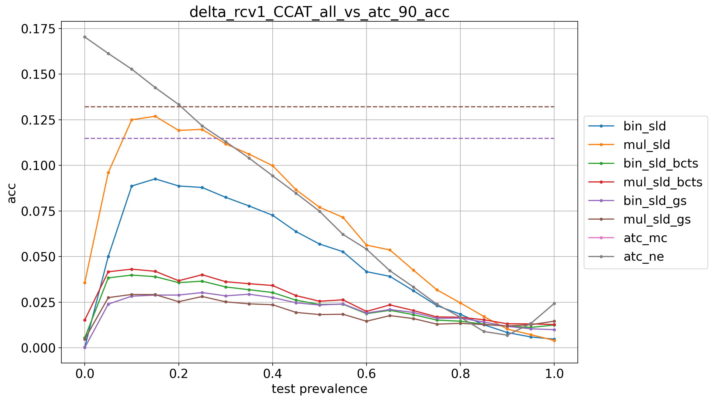

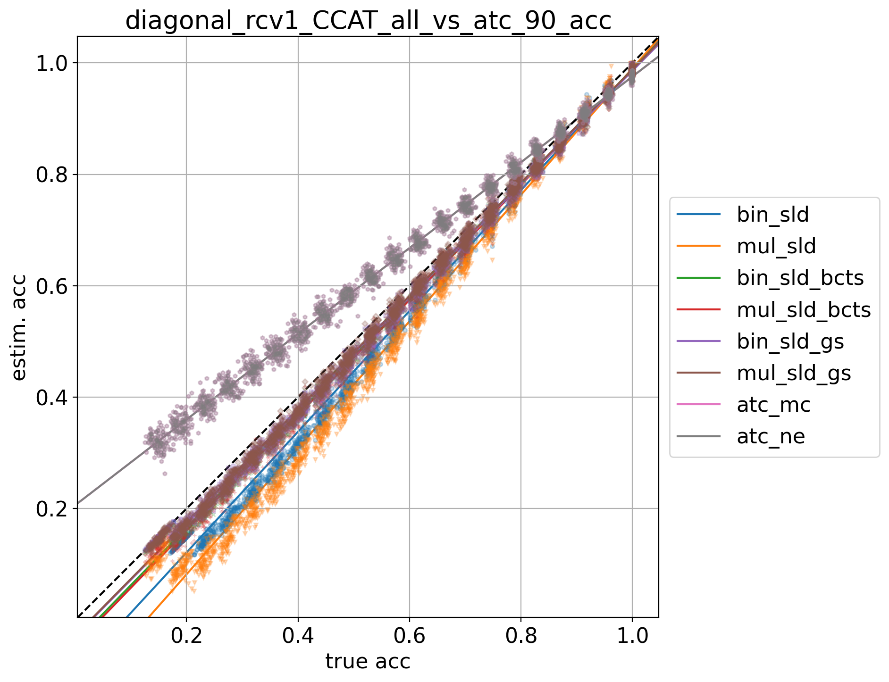
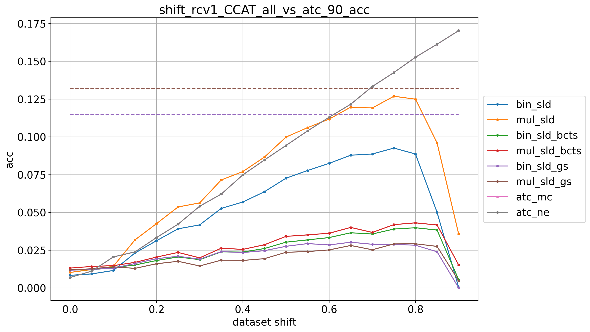

## 80% positives
> train: [0.19993324 0.80006676]  
> validation: [0.20010013 0.79989987]  
> bin_sld: 229.883s  
> mul_sld: 73.128s  
> bin_sld_bcts: 226.915s  
> mul_sld_bcts: 75.715s  
> bin_sld_gs: 456.287s  
> mul_sld_gs: 284.706s  
> kfcv: 51.186s  
> ref: 49.290s  
> atc_mc: 52.169s  
> atc_ne: 51.718s  
> doc_feat: 44.179s  
> tot: 462.366s  

<table border="1" class="dataframe">
  <thead>
    <tr style="text-align: right;">
      <th></th>
      <th>bin_sld</th>
      <th>mul_sld</th>
      <th>bin_sld_bcts</th>
      <th>mul_sld_bcts</th>
      <th>bin_sld_gs</th>
      <th>mul_sld_gs</th>
      <th>atc_mc</th>
      <th>atc_ne</th>
    </tr>
  </thead>
  <tbody>
    <tr>
      <th>0.0</th>
      <td>0.0019</td>
      <td>0.0162</td>
      <td>0.0026</td>
      <td>0.0163</td>
      <td>0.0503</td>
      <td>0.0229</td>
      <td>0.0311</td>
      <td>0.0311</td>
    </tr>
    <tr>
      <th>0.05</th>
      <td>0.0261</td>
      <td>0.0393</td>
      <td>0.0125</td>
      <td>0.0141</td>
      <td>0.0537</td>
      <td>0.0171</td>
      <td>0.0274</td>
      <td>0.0274</td>
    </tr>
    <tr>
      <th>0.1</th>
      <td>0.0233</td>
      <td>0.0340</td>
      <td>0.0100</td>
      <td>0.0118</td>
      <td>0.0452</td>
      <td>0.0132</td>
      <td>0.0267</td>
      <td>0.0267</td>
    </tr>
    <tr>
      <th>0.15</th>
      <td>0.0207</td>
      <td>0.0320</td>
      <td>0.0091</td>
      <td>0.0105</td>
      <td>0.0436</td>
      <td>0.0118</td>
      <td>0.0227</td>
      <td>0.0227</td>
    </tr>
    <tr>
      <th>0.2</th>
      <td>0.0161</td>
      <td>0.0248</td>
      <td>0.0076</td>
      <td>0.0087</td>
      <td>0.0381</td>
      <td>0.0102</td>
      <td>0.0214</td>
      <td>0.0214</td>
    </tr>
    <tr>
      <th>0.25</th>
      <td>0.0162</td>
      <td>0.0238</td>
      <td>0.0082</td>
      <td>0.0103</td>
      <td>0.0360</td>
      <td>0.0112</td>
      <td>0.0201</td>
      <td>0.0201</td>
    </tr>
    <tr>
      <th>0.3</th>
      <td>0.0134</td>
      <td>0.0242</td>
      <td>0.0095</td>
      <td>0.0108</td>
      <td>0.0364</td>
      <td>0.0126</td>
      <td>0.0178</td>
      <td>0.0178</td>
    </tr>
    <tr>
      <th>0.35</th>
      <td>0.0129</td>
      <td>0.0212</td>
      <td>0.0102</td>
      <td>0.0113</td>
      <td>0.0324</td>
      <td>0.0124</td>
      <td>0.0196</td>
      <td>0.0196</td>
    </tr>
    <tr>
      <th>0.4</th>
      <td>0.0108</td>
      <td>0.0193</td>
      <td>0.0093</td>
      <td>0.0103</td>
      <td>0.0319</td>
      <td>0.0116</td>
      <td>0.0168</td>
      <td>0.0168</td>
    </tr>
    <tr>
      <th>0.45</th>
      <td>0.0104</td>
      <td>0.0164</td>
      <td>0.0102</td>
      <td>0.0100</td>
      <td>0.0289</td>
      <td>0.0107</td>
      <td>0.0147</td>
      <td>0.0147</td>
    </tr>
    <tr>
      <th>0.5</th>
      <td>0.0081</td>
      <td>0.0152</td>
      <td>0.0079</td>
      <td>0.0098</td>
      <td>0.0270</td>
      <td>0.0103</td>
      <td>0.0136</td>
      <td>0.0136</td>
    </tr>
    <tr>
      <th>0.55</th>
      <td>0.0082</td>
      <td>0.0148</td>
      <td>0.0086</td>
      <td>0.0092</td>
      <td>0.0277</td>
      <td>0.0111</td>
      <td>0.0111</td>
      <td>0.0111</td>
    </tr>
    <tr>
      <th>0.6</th>
      <td>0.0074</td>
      <td>0.0143</td>
      <td>0.0084</td>
      <td>0.0094</td>
      <td>0.0229</td>
      <td>0.0102</td>
      <td>0.0110</td>
      <td>0.0110</td>
    </tr>
    <tr>
      <th>0.65</th>
      <td>0.0087</td>
      <td>0.0154</td>
      <td>0.0101</td>
      <td>0.0095</td>
      <td>0.0248</td>
      <td>0.0115</td>
      <td>0.0097</td>
      <td>0.0097</td>
    </tr>
    <tr>
      <th>0.7</th>
      <td>0.0079</td>
      <td>0.0131</td>
      <td>0.0091</td>
      <td>0.0097</td>
      <td>0.0226</td>
      <td>0.0114</td>
      <td>0.0106</td>
      <td>0.0106</td>
    </tr>
    <tr>
      <th>0.75</th>
      <td>0.0098</td>
      <td>0.0124</td>
      <td>0.0091</td>
      <td>0.0089</td>
      <td>0.0209</td>
      <td>0.0106</td>
      <td>0.0091</td>
      <td>0.0091</td>
    </tr>
    <tr>
      <th>0.8</th>
      <td>0.0120</td>
      <td>0.0116</td>
      <td>0.0101</td>
      <td>0.0099</td>
      <td>0.0226</td>
      <td>0.0116</td>
      <td>0.0100</td>
      <td>0.0100</td>
    </tr>
    <tr>
      <th>0.85</th>
      <td>0.0141</td>
      <td>0.0111</td>
      <td>0.0104</td>
      <td>0.0105</td>
      <td>0.0209</td>
      <td>0.0122</td>
      <td>0.0104</td>
      <td>0.0104</td>
    </tr>
    <tr>
      <th>0.9</th>
      <td>0.0154</td>
      <td>0.0099</td>
      <td>0.0099</td>
      <td>0.0111</td>
      <td>0.0211</td>
      <td>0.0141</td>
      <td>0.0108</td>
      <td>0.0108</td>
    </tr>
    <tr>
      <th>0.95</th>
      <td>0.0157</td>
      <td>0.0084</td>
      <td>0.0107</td>
      <td>0.0119</td>
      <td>0.0180</td>
      <td>0.0154</td>
      <td>0.0130</td>
      <td>0.0130</td>
    </tr>
    <tr>
      <th>1.0</th>
      <td>0.0055</td>
      <td>0.0058</td>
      <td>0.0115</td>
      <td>0.0141</td>
      <td>0.0179</td>
      <td>0.0193</td>
      <td>0.0147</td>
      <td>0.0147</td>
    </tr>
    <tr>
      <th>tot</th>
      <td>0.0126</td>
      <td>0.0182</td>
      <td>0.0093</td>
      <td>0.0109</td>
      <td>0.0306</td>
      <td>0.0129</td>
      <td>0.0163</td>
      <td>0.0163</td>
    </tr>
  </tbody>
</table>

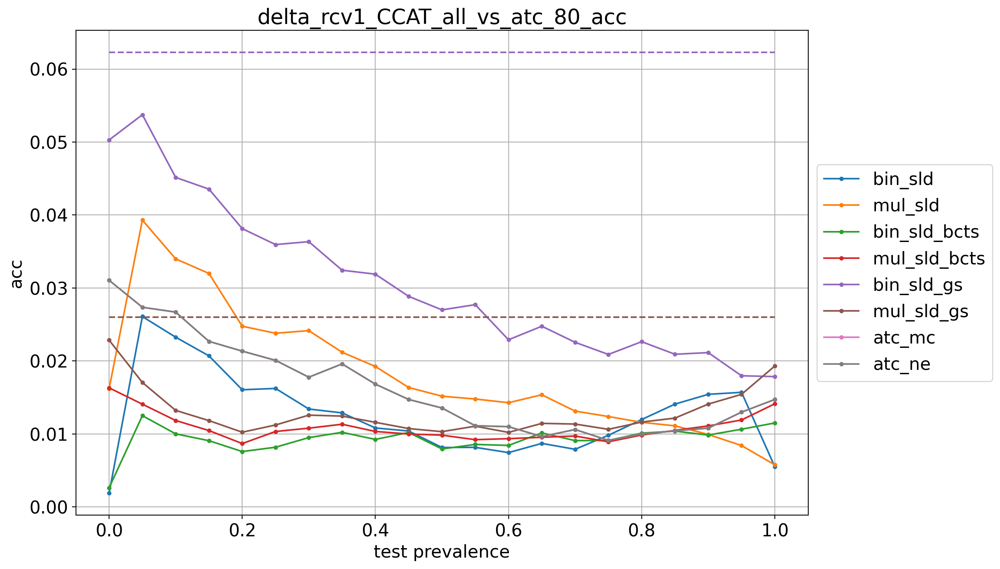
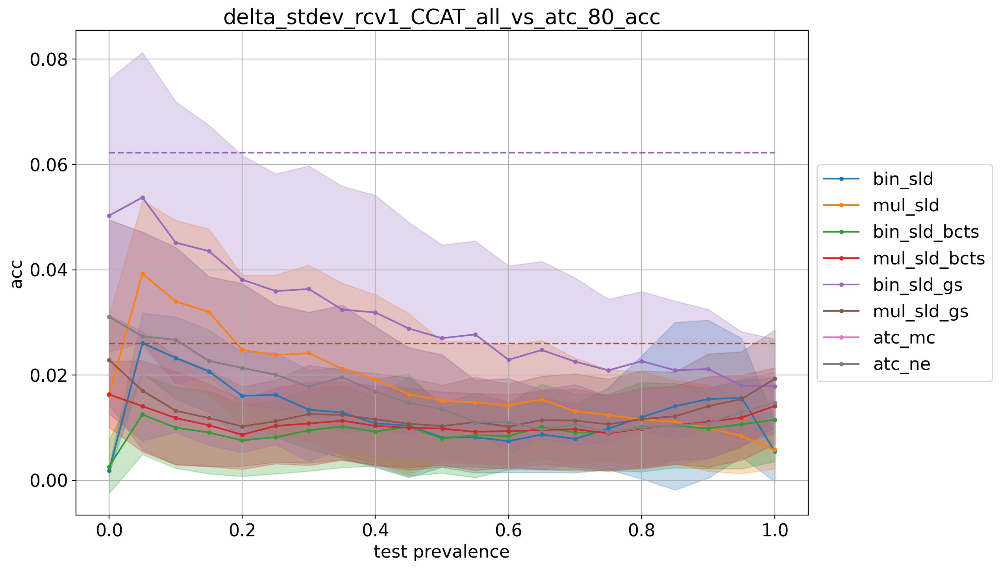
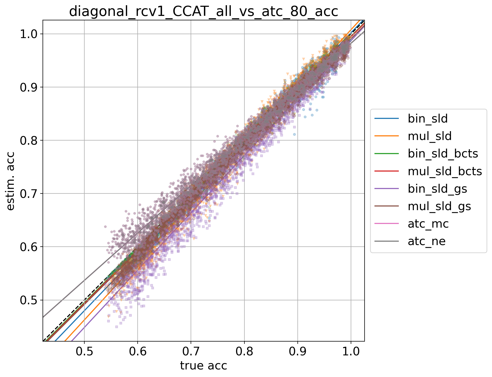
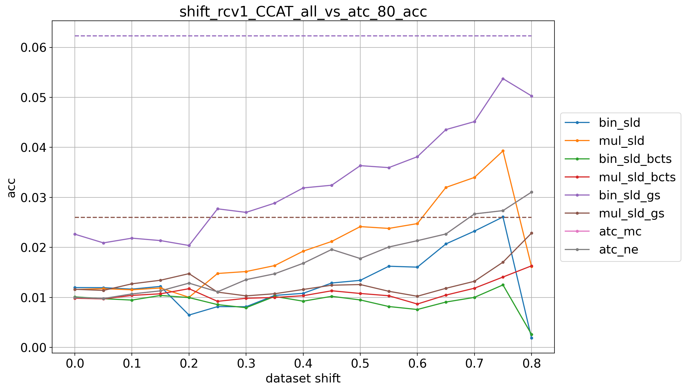

## 70% positives
> train: [0.29989987 0.70010013]  
> validation: [0.30006676 0.69993324]  
> bin_sld: 225.630s  
> mul_sld: 71.930s  
> bin_sld_bcts: 223.728s  
> mul_sld_bcts: 76.593s  
> bin_sld_gs: 431.047s  
> mul_sld_gs: 291.843s  
> kfcv: 51.915s  
> ref: 49.281s  
> atc_mc: 51.662s  
> atc_ne: 51.127s  
> doc_feat: 43.648s  
> tot: 436.749s  

<table border="1" class="dataframe">
  <thead>
    <tr style="text-align: right;">
      <th></th>
      <th>bin_sld</th>
      <th>mul_sld</th>
      <th>bin_sld_bcts</th>
      <th>mul_sld_bcts</th>
      <th>bin_sld_gs</th>
      <th>mul_sld_gs</th>
      <th>atc_mc</th>
      <th>atc_ne</th>
    </tr>
  </thead>
  <tbody>
    <tr>
      <th>0.0</th>
      <td>0.0007</td>
      <td>0.0099</td>
      <td>0.0052</td>
      <td>0.0141</td>
      <td>0.0044</td>
      <td>0.0215</td>
      <td>0.0238</td>
      <td>0.0238</td>
    </tr>
    <tr>
      <th>0.05</th>
      <td>0.0184</td>
      <td>0.0145</td>
      <td>0.0141</td>
      <td>0.0136</td>
      <td>0.0180</td>
      <td>0.0182</td>
      <td>0.0222</td>
      <td>0.0222</td>
    </tr>
    <tr>
      <th>0.1</th>
      <td>0.0167</td>
      <td>0.0137</td>
      <td>0.0134</td>
      <td>0.0126</td>
      <td>0.0178</td>
      <td>0.0161</td>
      <td>0.0216</td>
      <td>0.0216</td>
    </tr>
    <tr>
      <th>0.15</th>
      <td>0.0149</td>
      <td>0.0119</td>
      <td>0.0141</td>
      <td>0.0112</td>
      <td>0.0177</td>
      <td>0.0176</td>
      <td>0.0197</td>
      <td>0.0197</td>
    </tr>
    <tr>
      <th>0.2</th>
      <td>0.0112</td>
      <td>0.0093</td>
      <td>0.0115</td>
      <td>0.0092</td>
      <td>0.0140</td>
      <td>0.0146</td>
      <td>0.0206</td>
      <td>0.0206</td>
    </tr>
    <tr>
      <th>0.25</th>
      <td>0.0111</td>
      <td>0.0108</td>
      <td>0.0135</td>
      <td>0.0111</td>
      <td>0.0151</td>
      <td>0.0180</td>
      <td>0.0160</td>
      <td>0.0160</td>
    </tr>
    <tr>
      <th>0.3</th>
      <td>0.0098</td>
      <td>0.0115</td>
      <td>0.0140</td>
      <td>0.0104</td>
      <td>0.0154</td>
      <td>0.0185</td>
      <td>0.0160</td>
      <td>0.0160</td>
    </tr>
    <tr>
      <th>0.35</th>
      <td>0.0102</td>
      <td>0.0123</td>
      <td>0.0132</td>
      <td>0.0115</td>
      <td>0.0145</td>
      <td>0.0196</td>
      <td>0.0149</td>
      <td>0.0149</td>
    </tr>
    <tr>
      <th>0.4</th>
      <td>0.0086</td>
      <td>0.0132</td>
      <td>0.0139</td>
      <td>0.0121</td>
      <td>0.0139</td>
      <td>0.0212</td>
      <td>0.0122</td>
      <td>0.0122</td>
    </tr>
    <tr>
      <th>0.45</th>
      <td>0.0095</td>
      <td>0.0135</td>
      <td>0.0139</td>
      <td>0.0112</td>
      <td>0.0138</td>
      <td>0.0213</td>
      <td>0.0123</td>
      <td>0.0123</td>
    </tr>
    <tr>
      <th>0.5</th>
      <td>0.0094</td>
      <td>0.0160</td>
      <td>0.0140</td>
      <td>0.0123</td>
      <td>0.0135</td>
      <td>0.0221</td>
      <td>0.0111</td>
      <td>0.0111</td>
    </tr>
    <tr>
      <th>0.55</th>
      <td>0.0102</td>
      <td>0.0149</td>
      <td>0.0143</td>
      <td>0.0124</td>
      <td>0.0144</td>
      <td>0.0233</td>
      <td>0.0102</td>
      <td>0.0102</td>
    </tr>
    <tr>
      <th>0.6</th>
      <td>0.0130</td>
      <td>0.0180</td>
      <td>0.0118</td>
      <td>0.0101</td>
      <td>0.0105</td>
      <td>0.0213</td>
      <td>0.0096</td>
      <td>0.0096</td>
    </tr>
    <tr>
      <th>0.65</th>
      <td>0.0138</td>
      <td>0.0178</td>
      <td>0.0148</td>
      <td>0.0128</td>
      <td>0.0132</td>
      <td>0.0245</td>
      <td>0.0100</td>
      <td>0.0100</td>
    </tr>
    <tr>
      <th>0.7</th>
      <td>0.0134</td>
      <td>0.0162</td>
      <td>0.0121</td>
      <td>0.0111</td>
      <td>0.0110</td>
      <td>0.0259</td>
      <td>0.0080</td>
      <td>0.0080</td>
    </tr>
    <tr>
      <th>0.75</th>
      <td>0.0147</td>
      <td>0.0158</td>
      <td>0.0132</td>
      <td>0.0131</td>
      <td>0.0122</td>
      <td>0.0272</td>
      <td>0.0070</td>
      <td>0.0070</td>
    </tr>
    <tr>
      <th>0.8</th>
      <td>0.0158</td>
      <td>0.0162</td>
      <td>0.0144</td>
      <td>0.0139</td>
      <td>0.0133</td>
      <td>0.0279</td>
      <td>0.0071</td>
      <td>0.0071</td>
    </tr>
    <tr>
      <th>0.85</th>
      <td>0.0147</td>
      <td>0.0145</td>
      <td>0.0153</td>
      <td>0.0154</td>
      <td>0.0124</td>
      <td>0.0288</td>
      <td>0.0076</td>
      <td>0.0076</td>
    </tr>
    <tr>
      <th>0.9</th>
      <td>0.0127</td>
      <td>0.0110</td>
      <td>0.0130</td>
      <td>0.0152</td>
      <td>0.0129</td>
      <td>0.0301</td>
      <td>0.0062</td>
      <td>0.0062</td>
    </tr>
    <tr>
      <th>0.95</th>
      <td>0.0108</td>
      <td>0.0082</td>
      <td>0.0124</td>
      <td>0.0150</td>
      <td>0.0106</td>
      <td>0.0304</td>
      <td>0.0063</td>
      <td>0.0063</td>
    </tr>
    <tr>
      <th>1.0</th>
      <td>0.0051</td>
      <td>0.0059</td>
      <td>0.0126</td>
      <td>0.0174</td>
      <td>0.0147</td>
      <td>0.0321</td>
      <td>0.0059</td>
      <td>0.0059</td>
    </tr>
    <tr>
      <th>tot</th>
      <td>0.0116</td>
      <td>0.0131</td>
      <td>0.0131</td>
      <td>0.0126</td>
      <td>0.0135</td>
      <td>0.0229</td>
      <td>0.0128</td>
      <td>0.0128</td>
    </tr>
  </tbody>
</table>

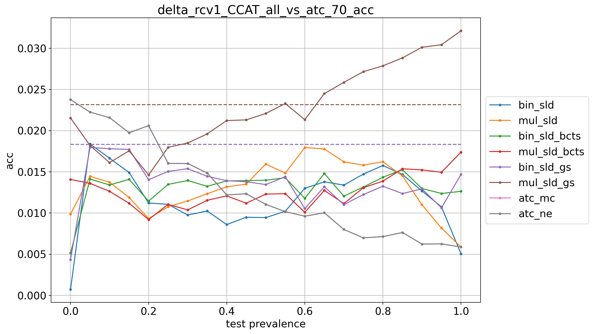
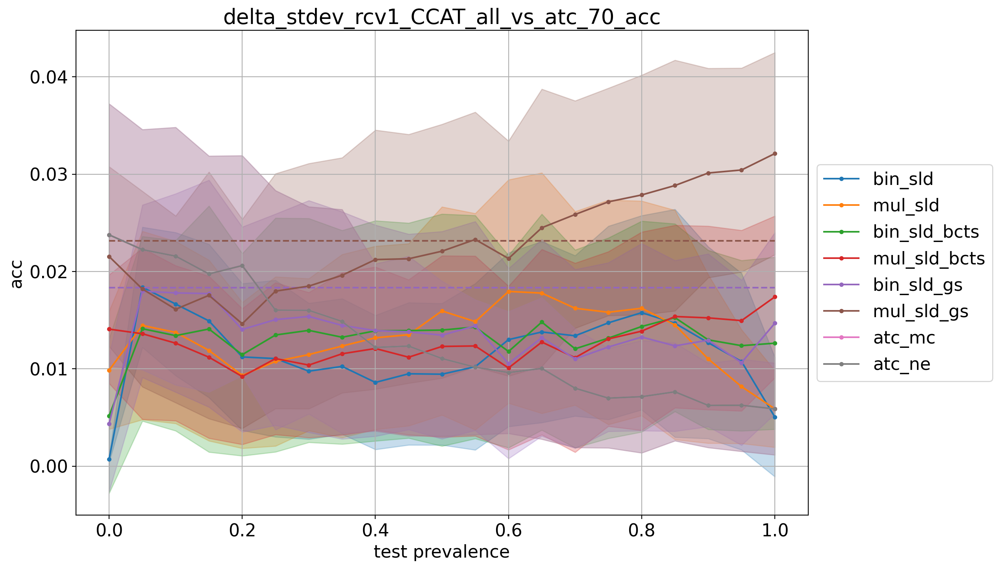
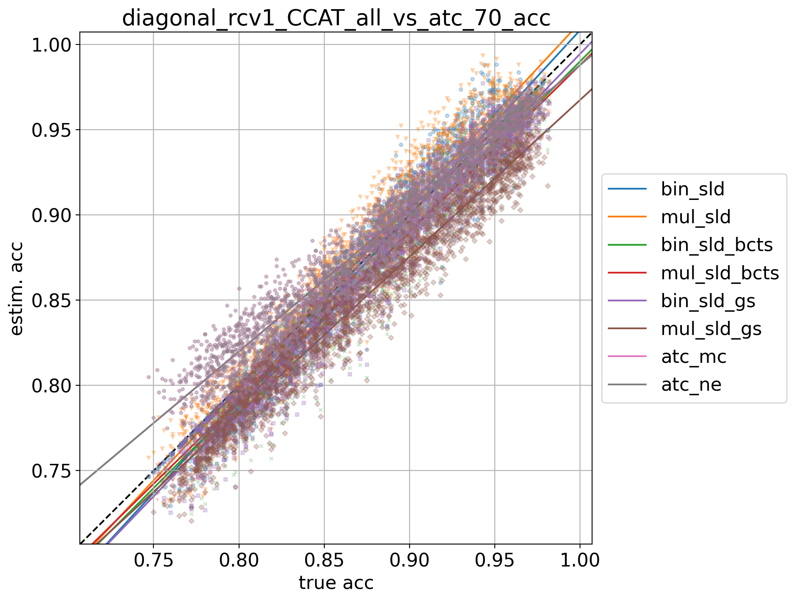
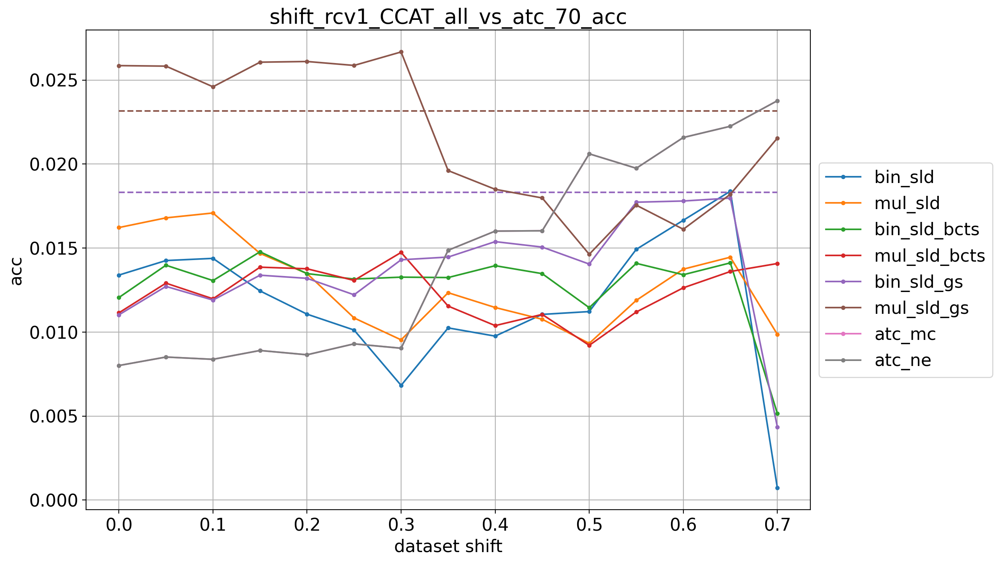

## 60% positives
> train: [0.40003338 0.59996662]  
> validation: [0.40003338 0.59996662]  
> bin_sld: 226.621s  
> mul_sld: 71.844s  
> bin_sld_bcts: 225.379s  
> mul_sld_bcts: 77.086s  
> bin_sld_gs: 471.820s  
> mul_sld_gs: 283.935s  
> kfcv: 51.035s  
> ref: 49.046s  
> atc_mc: 51.951s  
> atc_ne: 51.208s  
> doc_feat: 43.717s  
> tot: 477.247s  

<table border="1" class="dataframe">
  <thead>
    <tr style="text-align: right;">
      <th></th>
      <th>bin_sld</th>
      <th>mul_sld</th>
      <th>bin_sld_bcts</th>
      <th>mul_sld_bcts</th>
      <th>bin_sld_gs</th>
      <th>mul_sld_gs</th>
      <th>atc_mc</th>
      <th>atc_ne</th>
    </tr>
  </thead>
  <tbody>
    <tr>
      <th>0.0</th>
      <td>0.0007</td>
      <td>0.0064</td>
      <td>0.0047</td>
      <td>0.0106</td>
      <td>0.0070</td>
      <td>0.0132</td>
      <td>0.0106</td>
      <td>0.0106</td>
    </tr>
    <tr>
      <th>0.05</th>
      <td>0.0050</td>
      <td>0.0091</td>
      <td>0.0084</td>
      <td>0.0074</td>
      <td>0.0096</td>
      <td>0.0095</td>
      <td>0.0101</td>
      <td>0.0101</td>
    </tr>
    <tr>
      <th>0.1</th>
      <td>0.0057</td>
      <td>0.0134</td>
      <td>0.0095</td>
      <td>0.0073</td>
      <td>0.0094</td>
      <td>0.0081</td>
      <td>0.0092</td>
      <td>0.0092</td>
    </tr>
    <tr>
      <th>0.15</th>
      <td>0.0084</td>
      <td>0.0180</td>
      <td>0.0100</td>
      <td>0.0079</td>
      <td>0.0109</td>
      <td>0.0084</td>
      <td>0.0083</td>
      <td>0.0083</td>
    </tr>
    <tr>
      <th>0.2</th>
      <td>0.0130</td>
      <td>0.0235</td>
      <td>0.0126</td>
      <td>0.0102</td>
      <td>0.0108</td>
      <td>0.0095</td>
      <td>0.0089</td>
      <td>0.0089</td>
    </tr>
    <tr>
      <th>0.25</th>
      <td>0.0158</td>
      <td>0.0261</td>
      <td>0.0118</td>
      <td>0.0099</td>
      <td>0.0110</td>
      <td>0.0092</td>
      <td>0.0090</td>
      <td>0.0090</td>
    </tr>
    <tr>
      <th>0.3</th>
      <td>0.0186</td>
      <td>0.0288</td>
      <td>0.0128</td>
      <td>0.0109</td>
      <td>0.0119</td>
      <td>0.0095</td>
      <td>0.0084</td>
      <td>0.0084</td>
    </tr>
    <tr>
      <th>0.35</th>
      <td>0.0208</td>
      <td>0.0290</td>
      <td>0.0128</td>
      <td>0.0107</td>
      <td>0.0128</td>
      <td>0.0113</td>
      <td>0.0084</td>
      <td>0.0084</td>
    </tr>
    <tr>
      <th>0.4</th>
      <td>0.0239</td>
      <td>0.0320</td>
      <td>0.0134</td>
      <td>0.0117</td>
      <td>0.0121</td>
      <td>0.0117</td>
      <td>0.0082</td>
      <td>0.0082</td>
    </tr>
    <tr>
      <th>0.45</th>
      <td>0.0273</td>
      <td>0.0331</td>
      <td>0.0126</td>
      <td>0.0112</td>
      <td>0.0117</td>
      <td>0.0110</td>
      <td>0.0086</td>
      <td>0.0086</td>
    </tr>
    <tr>
      <th>0.5</th>
      <td>0.0267</td>
      <td>0.0317</td>
      <td>0.0147</td>
      <td>0.0121</td>
      <td>0.0146</td>
      <td>0.0133</td>
      <td>0.0085</td>
      <td>0.0085</td>
    </tr>
    <tr>
      <th>0.55</th>
      <td>0.0283</td>
      <td>0.0313</td>
      <td>0.0113</td>
      <td>0.0100</td>
      <td>0.0114</td>
      <td>0.0116</td>
      <td>0.0085</td>
      <td>0.0085</td>
    </tr>
    <tr>
      <th>0.6</th>
      <td>0.0296</td>
      <td>0.0335</td>
      <td>0.0117</td>
      <td>0.0104</td>
      <td>0.0118</td>
      <td>0.0112</td>
      <td>0.0072</td>
      <td>0.0072</td>
    </tr>
    <tr>
      <th>0.65</th>
      <td>0.0273</td>
      <td>0.0306</td>
      <td>0.0113</td>
      <td>0.0105</td>
      <td>0.0112</td>
      <td>0.0111</td>
      <td>0.0079</td>
      <td>0.0079</td>
    </tr>
    <tr>
      <th>0.7</th>
      <td>0.0235</td>
      <td>0.0260</td>
      <td>0.0125</td>
      <td>0.0112</td>
      <td>0.0134</td>
      <td>0.0156</td>
      <td>0.0076</td>
      <td>0.0076</td>
    </tr>
    <tr>
      <th>0.75</th>
      <td>0.0208</td>
      <td>0.0230</td>
      <td>0.0112</td>
      <td>0.0099</td>
      <td>0.0142</td>
      <td>0.0155</td>
      <td>0.0075</td>
      <td>0.0075</td>
    </tr>
    <tr>
      <th>0.8</th>
      <td>0.0183</td>
      <td>0.0200</td>
      <td>0.0113</td>
      <td>0.0098</td>
      <td>0.0144</td>
      <td>0.0158</td>
      <td>0.0066</td>
      <td>0.0066</td>
    </tr>
    <tr>
      <th>0.85</th>
      <td>0.0127</td>
      <td>0.0149</td>
      <td>0.0111</td>
      <td>0.0099</td>
      <td>0.0155</td>
      <td>0.0172</td>
      <td>0.0070</td>
      <td>0.0070</td>
    </tr>
    <tr>
      <th>0.9</th>
      <td>0.0092</td>
      <td>0.0107</td>
      <td>0.0116</td>
      <td>0.0108</td>
      <td>0.0183</td>
      <td>0.0192</td>
      <td>0.0078</td>
      <td>0.0078</td>
    </tr>
    <tr>
      <th>0.95</th>
      <td>0.0076</td>
      <td>0.0084</td>
      <td>0.0097</td>
      <td>0.0094</td>
      <td>0.0160</td>
      <td>0.0180</td>
      <td>0.0071</td>
      <td>0.0071</td>
    </tr>
    <tr>
      <th>1.0</th>
      <td>0.0013</td>
      <td>0.0048</td>
      <td>0.0087</td>
      <td>0.0131</td>
      <td>0.0187</td>
      <td>0.0220</td>
      <td>0.0071</td>
      <td>0.0071</td>
    </tr>
    <tr>
      <th>tot</th>
      <td>0.0164</td>
      <td>0.0216</td>
      <td>0.0111</td>
      <td>0.0102</td>
      <td>0.0127</td>
      <td>0.0129</td>
      <td>0.0082</td>
      <td>0.0082</td>
    </tr>
  </tbody>
</table>

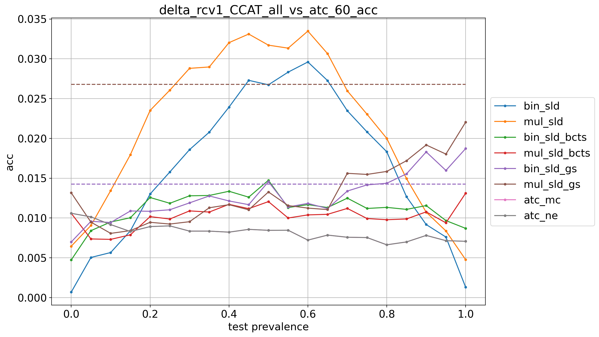

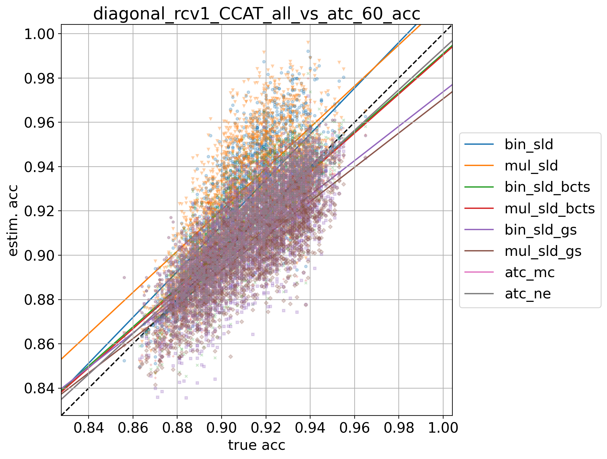
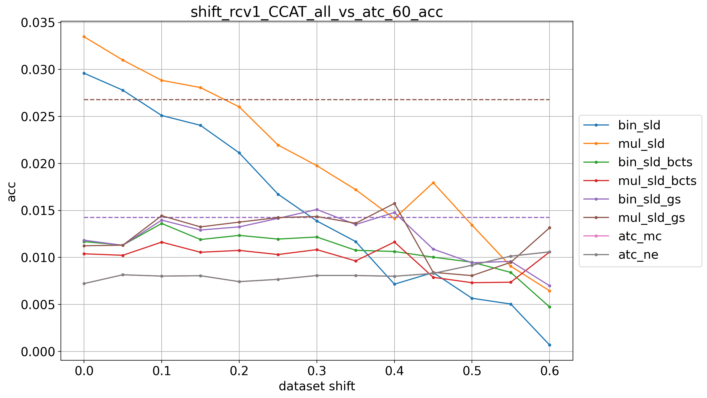

## 50% positives
> train: [0.5 0.5]  
> validation: [0.5 0.5]  
> bin_sld: 223.735s  
> mul_sld: 70.315s  
> bin_sld_bcts: 224.203s  
> mul_sld_bcts: 75.746s  
> bin_sld_gs: 459.866s  
> mul_sld_gs: 285.490s  
> kfcv: 51.093s  
> ref: 48.870s  
> atc_mc: 51.664s  
> atc_ne: 50.999s  
> doc_feat: 43.777s  
> tot: 465.257s  

<table border="1" class="dataframe">
  <thead>
    <tr style="text-align: right;">
      <th></th>
      <th>bin_sld</th>
      <th>mul_sld</th>
      <th>bin_sld_bcts</th>
      <th>mul_sld_bcts</th>
      <th>bin_sld_gs</th>
      <th>mul_sld_gs</th>
      <th>atc_mc</th>
      <th>atc_ne</th>
    </tr>
  </thead>
  <tbody>
    <tr>
      <th>0.0</th>
      <td>0.0007</td>
      <td>0.0046</td>
      <td>0.0024</td>
      <td>0.0105</td>
      <td>0.0088</td>
      <td>0.0305</td>
      <td>0.0088</td>
      <td>0.0088</td>
    </tr>
    <tr>
      <th>0.05</th>
      <td>0.0055</td>
      <td>0.0098</td>
      <td>0.0074</td>
      <td>0.0077</td>
      <td>0.0111</td>
      <td>0.0330</td>
      <td>0.0080</td>
      <td>0.0080</td>
    </tr>
    <tr>
      <th>0.1</th>
      <td>0.0083</td>
      <td>0.0157</td>
      <td>0.0099</td>
      <td>0.0068</td>
      <td>0.0105</td>
      <td>0.0290</td>
      <td>0.0082</td>
      <td>0.0082</td>
    </tr>
    <tr>
      <th>0.15</th>
      <td>0.0154</td>
      <td>0.0244</td>
      <td>0.0141</td>
      <td>0.0094</td>
      <td>0.0112</td>
      <td>0.0252</td>
      <td>0.0077</td>
      <td>0.0077</td>
    </tr>
    <tr>
      <th>0.2</th>
      <td>0.0235</td>
      <td>0.0302</td>
      <td>0.0167</td>
      <td>0.0109</td>
      <td>0.0120</td>
      <td>0.0207</td>
      <td>0.0083</td>
      <td>0.0083</td>
    </tr>
    <tr>
      <th>0.25</th>
      <td>0.0298</td>
      <td>0.0358</td>
      <td>0.0182</td>
      <td>0.0124</td>
      <td>0.0107</td>
      <td>0.0194</td>
      <td>0.0066</td>
      <td>0.0066</td>
    </tr>
    <tr>
      <th>0.3</th>
      <td>0.0319</td>
      <td>0.0370</td>
      <td>0.0177</td>
      <td>0.0137</td>
      <td>0.0127</td>
      <td>0.0189</td>
      <td>0.0082</td>
      <td>0.0082</td>
    </tr>
    <tr>
      <th>0.35</th>
      <td>0.0357</td>
      <td>0.0385</td>
      <td>0.0189</td>
      <td>0.0150</td>
      <td>0.0141</td>
      <td>0.0184</td>
      <td>0.0103</td>
      <td>0.0103</td>
    </tr>
    <tr>
      <th>0.4</th>
      <td>0.0368</td>
      <td>0.0398</td>
      <td>0.0185</td>
      <td>0.0153</td>
      <td>0.0124</td>
      <td>0.0162</td>
      <td>0.0085</td>
      <td>0.0085</td>
    </tr>
    <tr>
      <th>0.45</th>
      <td>0.0373</td>
      <td>0.0398</td>
      <td>0.0175</td>
      <td>0.0150</td>
      <td>0.0121</td>
      <td>0.0157</td>
      <td>0.0110</td>
      <td>0.0110</td>
    </tr>
    <tr>
      <th>0.5</th>
      <td>0.0369</td>
      <td>0.0386</td>
      <td>0.0169</td>
      <td>0.0146</td>
      <td>0.0117</td>
      <td>0.0162</td>
      <td>0.0122</td>
      <td>0.0122</td>
    </tr>
    <tr>
      <th>0.55</th>
      <td>0.0358</td>
      <td>0.0390</td>
      <td>0.0166</td>
      <td>0.0146</td>
      <td>0.0100</td>
      <td>0.0126</td>
      <td>0.0125</td>
      <td>0.0125</td>
    </tr>
    <tr>
      <th>0.6</th>
      <td>0.0350</td>
      <td>0.0371</td>
      <td>0.0181</td>
      <td>0.0158</td>
      <td>0.0117</td>
      <td>0.0151</td>
      <td>0.0144</td>
      <td>0.0144</td>
    </tr>
    <tr>
      <th>0.65</th>
      <td>0.0309</td>
      <td>0.0338</td>
      <td>0.0174</td>
      <td>0.0160</td>
      <td>0.0124</td>
      <td>0.0123</td>
      <td>0.0168</td>
      <td>0.0168</td>
    </tr>
    <tr>
      <th>0.7</th>
      <td>0.0230</td>
      <td>0.0287</td>
      <td>0.0157</td>
      <td>0.0144</td>
      <td>0.0134</td>
      <td>0.0120</td>
      <td>0.0164</td>
      <td>0.0164</td>
    </tr>
    <tr>
      <th>0.75</th>
      <td>0.0194</td>
      <td>0.0245</td>
      <td>0.0149</td>
      <td>0.0135</td>
      <td>0.0120</td>
      <td>0.0121</td>
      <td>0.0170</td>
      <td>0.0170</td>
    </tr>
    <tr>
      <th>0.8</th>
      <td>0.0139</td>
      <td>0.0198</td>
      <td>0.0132</td>
      <td>0.0120</td>
      <td>0.0119</td>
      <td>0.0124</td>
      <td>0.0211</td>
      <td>0.0211</td>
    </tr>
    <tr>
      <th>0.85</th>
      <td>0.0102</td>
      <td>0.0148</td>
      <td>0.0104</td>
      <td>0.0100</td>
      <td>0.0103</td>
      <td>0.0097</td>
      <td>0.0205</td>
      <td>0.0205</td>
    </tr>
    <tr>
      <th>0.9</th>
      <td>0.0081</td>
      <td>0.0122</td>
      <td>0.0103</td>
      <td>0.0098</td>
      <td>0.0109</td>
      <td>0.0111</td>
      <td>0.0239</td>
      <td>0.0239</td>
    </tr>
    <tr>
      <th>0.95</th>
      <td>0.0075</td>
      <td>0.0085</td>
      <td>0.0070</td>
      <td>0.0071</td>
      <td>0.0092</td>
      <td>0.0088</td>
      <td>0.0253</td>
      <td>0.0253</td>
    </tr>
    <tr>
      <th>1.0</th>
      <td>0.0004</td>
      <td>0.0035</td>
      <td>0.0038</td>
      <td>0.0092</td>
      <td>0.0084</td>
      <td>0.0079</td>
      <td>0.0289</td>
      <td>0.0289</td>
    </tr>
    <tr>
      <th>tot</th>
      <td>0.0212</td>
      <td>0.0255</td>
      <td>0.0136</td>
      <td>0.0121</td>
      <td>0.0113</td>
      <td>0.0170</td>
      <td>0.0140</td>
      <td>0.0140</td>
    </tr>
  </tbody>
</table>

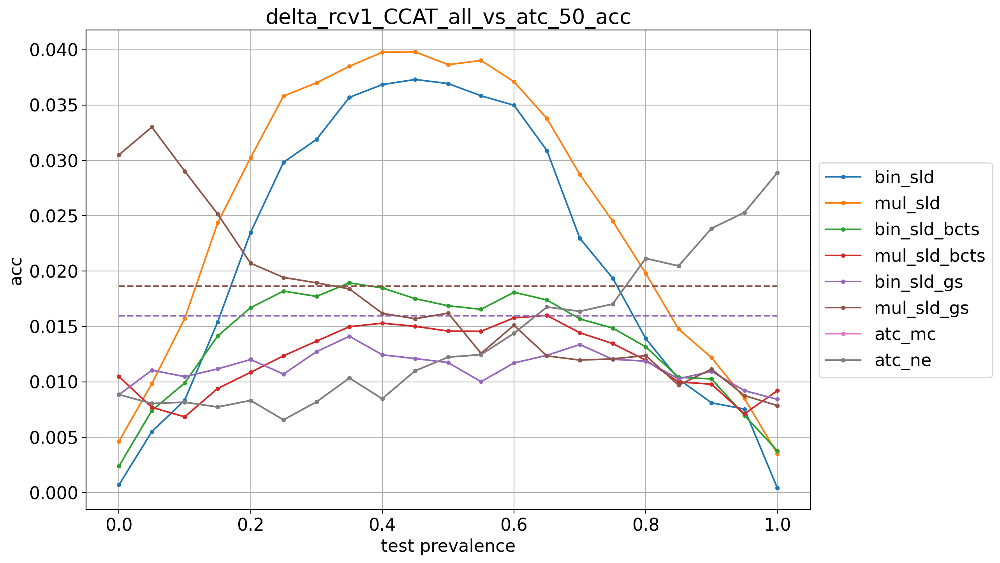
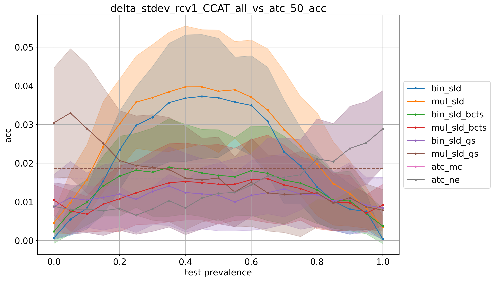
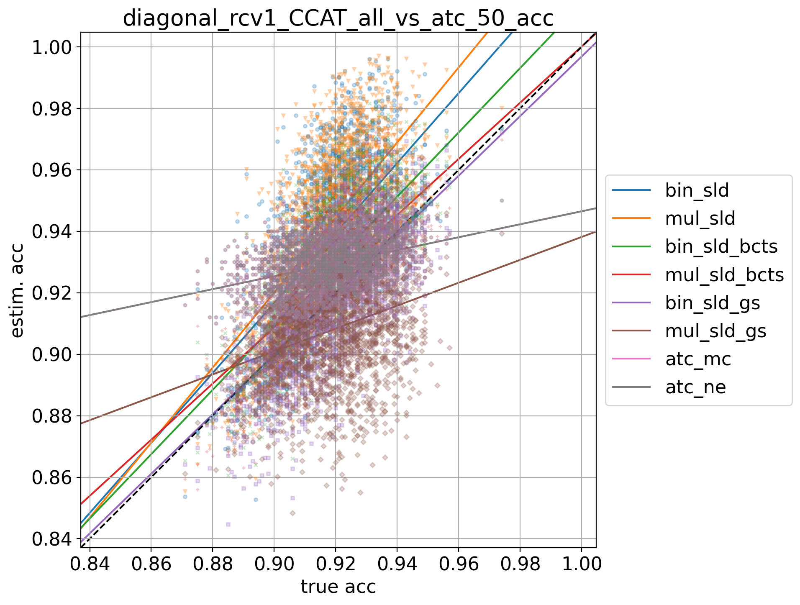
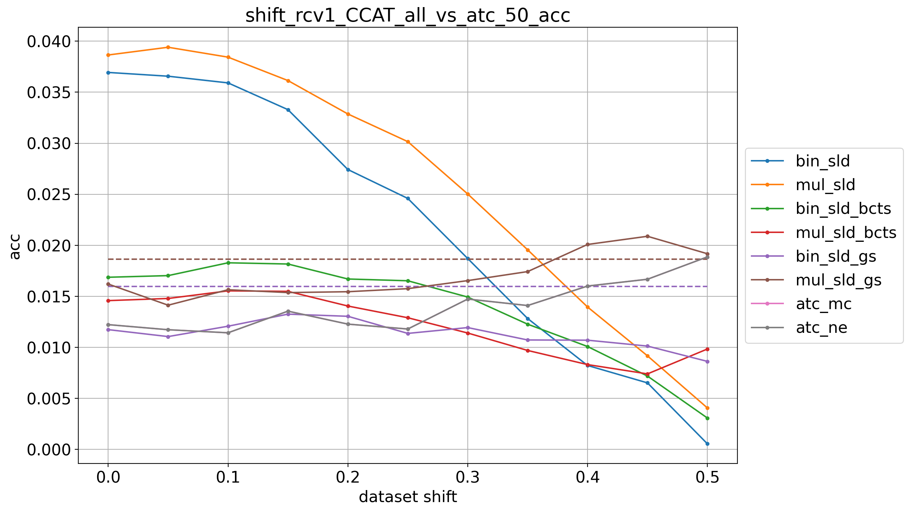

## 40% positives
> train: [0.59996662 0.40003338]  
> validation: [0.59996662 0.40003338]  
> bin_sld: 220.011s  
> mul_sld: 68.308s  
> bin_sld_bcts: 222.232s  
> mul_sld_bcts: 74.741s  
> bin_sld_gs: 463.188s  
> mul_sld_gs: 286.703s  
> kfcv: 50.329s  
> ref: 48.512s  
> atc_mc: 51.494s  
> atc_ne: 51.091s  
> doc_feat: 43.512s  
> tot: 468.313s  

<table border="1" class="dataframe">
  <thead>
    <tr style="text-align: right;">
      <th></th>
      <th>bin_sld</th>
      <th>mul_sld</th>
      <th>bin_sld_bcts</th>
      <th>mul_sld_bcts</th>
      <th>bin_sld_gs</th>
      <th>mul_sld_gs</th>
      <th>atc_mc</th>
      <th>atc_ne</th>
    </tr>
  </thead>
  <tbody>
    <tr>
      <th>0.0</th>
      <td>0.0005</td>
      <td>0.0034</td>
      <td>0.0019</td>
      <td>0.0078</td>
      <td>0.0044</td>
      <td>0.0564</td>
      <td>0.0190</td>
      <td>0.0190</td>
    </tr>
    <tr>
      <th>0.05</th>
      <td>0.0079</td>
      <td>0.0154</td>
      <td>0.0073</td>
      <td>0.0060</td>
      <td>0.0076</td>
      <td>0.0563</td>
      <td>0.0166</td>
      <td>0.0166</td>
    </tr>
    <tr>
      <th>0.1</th>
      <td>0.0192</td>
      <td>0.0254</td>
      <td>0.0114</td>
      <td>0.0070</td>
      <td>0.0090</td>
      <td>0.0560</td>
      <td>0.0147</td>
      <td>0.0147</td>
    </tr>
    <tr>
      <th>0.15</th>
      <td>0.0319</td>
      <td>0.0348</td>
      <td>0.0157</td>
      <td>0.0109</td>
      <td>0.0123</td>
      <td>0.0534</td>
      <td>0.0117</td>
      <td>0.0117</td>
    </tr>
    <tr>
      <th>0.2</th>
      <td>0.0412</td>
      <td>0.0419</td>
      <td>0.0183</td>
      <td>0.0143</td>
      <td>0.0149</td>
      <td>0.0509</td>
      <td>0.0105</td>
      <td>0.0105</td>
    </tr>
    <tr>
      <th>0.25</th>
      <td>0.0458</td>
      <td>0.0483</td>
      <td>0.0222</td>
      <td>0.0183</td>
      <td>0.0190</td>
      <td>0.0476</td>
      <td>0.0089</td>
      <td>0.0089</td>
    </tr>
    <tr>
      <th>0.3</th>
      <td>0.0438</td>
      <td>0.0502</td>
      <td>0.0215</td>
      <td>0.0190</td>
      <td>0.0184</td>
      <td>0.0482</td>
      <td>0.0085</td>
      <td>0.0085</td>
    </tr>
    <tr>
      <th>0.35</th>
      <td>0.0444</td>
      <td>0.0517</td>
      <td>0.0229</td>
      <td>0.0212</td>
      <td>0.0201</td>
      <td>0.0481</td>
      <td>0.0076</td>
      <td>0.0076</td>
    </tr>
    <tr>
      <th>0.4</th>
      <td>0.0410</td>
      <td>0.0537</td>
      <td>0.0243</td>
      <td>0.0233</td>
      <td>0.0213</td>
      <td>0.0449</td>
      <td>0.0079</td>
      <td>0.0079</td>
    </tr>
    <tr>
      <th>0.45</th>
      <td>0.0374</td>
      <td>0.0519</td>
      <td>0.0228</td>
      <td>0.0229</td>
      <td>0.0211</td>
      <td>0.0457</td>
      <td>0.0073</td>
      <td>0.0073</td>
    </tr>
    <tr>
      <th>0.5</th>
      <td>0.0342</td>
      <td>0.0516</td>
      <td>0.0244</td>
      <td>0.0244</td>
      <td>0.0220</td>
      <td>0.0426</td>
      <td>0.0081</td>
      <td>0.0081</td>
    </tr>
    <tr>
      <th>0.55</th>
      <td>0.0318</td>
      <td>0.0515</td>
      <td>0.0242</td>
      <td>0.0260</td>
      <td>0.0225</td>
      <td>0.0405</td>
      <td>0.0099</td>
      <td>0.0099</td>
    </tr>
    <tr>
      <th>0.6</th>
      <td>0.0284</td>
      <td>0.0491</td>
      <td>0.0245</td>
      <td>0.0265</td>
      <td>0.0226</td>
      <td>0.0371</td>
      <td>0.0112</td>
      <td>0.0112</td>
    </tr>
    <tr>
      <th>0.65</th>
      <td>0.0248</td>
      <td>0.0459</td>
      <td>0.0236</td>
      <td>0.0267</td>
      <td>0.0221</td>
      <td>0.0351</td>
      <td>0.0156</td>
      <td>0.0156</td>
    </tr>
    <tr>
      <th>0.7</th>
      <td>0.0205</td>
      <td>0.0409</td>
      <td>0.0215</td>
      <td>0.0256</td>
      <td>0.0204</td>
      <td>0.0344</td>
      <td>0.0168</td>
      <td>0.0168</td>
    </tr>
    <tr>
      <th>0.75</th>
      <td>0.0165</td>
      <td>0.0338</td>
      <td>0.0198</td>
      <td>0.0225</td>
      <td>0.0188</td>
      <td>0.0334</td>
      <td>0.0160</td>
      <td>0.0160</td>
    </tr>
    <tr>
      <th>0.8</th>
      <td>0.0135</td>
      <td>0.0308</td>
      <td>0.0191</td>
      <td>0.0232</td>
      <td>0.0185</td>
      <td>0.0293</td>
      <td>0.0180</td>
      <td>0.0180</td>
    </tr>
    <tr>
      <th>0.85</th>
      <td>0.0100</td>
      <td>0.0257</td>
      <td>0.0165</td>
      <td>0.0218</td>
      <td>0.0162</td>
      <td>0.0265</td>
      <td>0.0218</td>
      <td>0.0218</td>
    </tr>
    <tr>
      <th>0.9</th>
      <td>0.0072</td>
      <td>0.0172</td>
      <td>0.0134</td>
      <td>0.0172</td>
      <td>0.0135</td>
      <td>0.0262</td>
      <td>0.0224</td>
      <td>0.0224</td>
    </tr>
    <tr>
      <th>0.95</th>
      <td>0.0065</td>
      <td>0.0127</td>
      <td>0.0102</td>
      <td>0.0150</td>
      <td>0.0106</td>
      <td>0.0182</td>
      <td>0.0278</td>
      <td>0.0278</td>
    </tr>
    <tr>
      <th>1.0</th>
      <td>0.0003</td>
      <td>0.0055</td>
      <td>0.0033</td>
      <td>0.0067</td>
      <td>0.0040</td>
      <td>0.0155</td>
      <td>0.0285</td>
      <td>0.0285</td>
    </tr>
    <tr>
      <th>tot</th>
      <td>0.0241</td>
      <td>0.0353</td>
      <td>0.0176</td>
      <td>0.0184</td>
      <td>0.0162</td>
      <td>0.0403</td>
      <td>0.0147</td>
      <td>0.0147</td>
    </tr>
  </tbody>
</table>

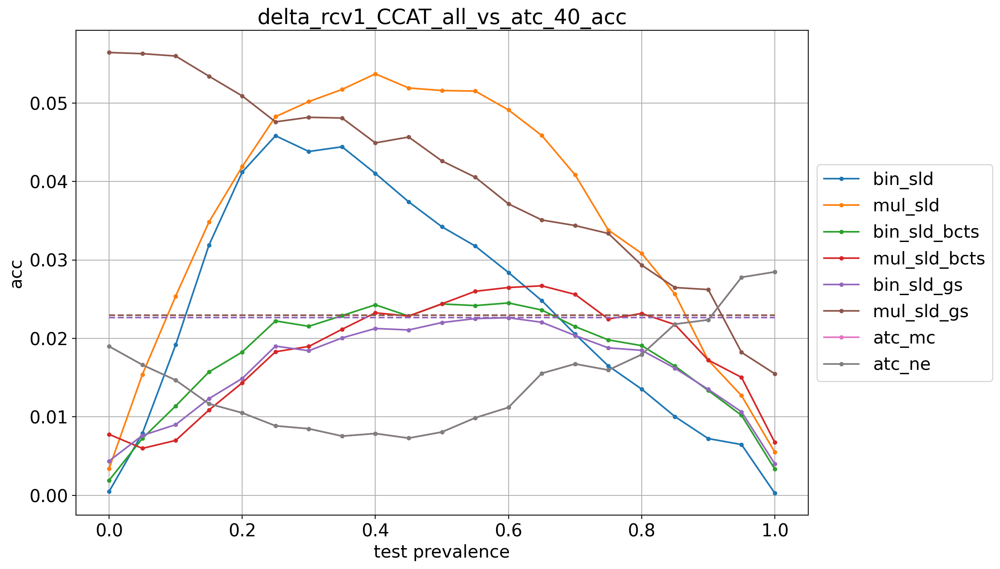
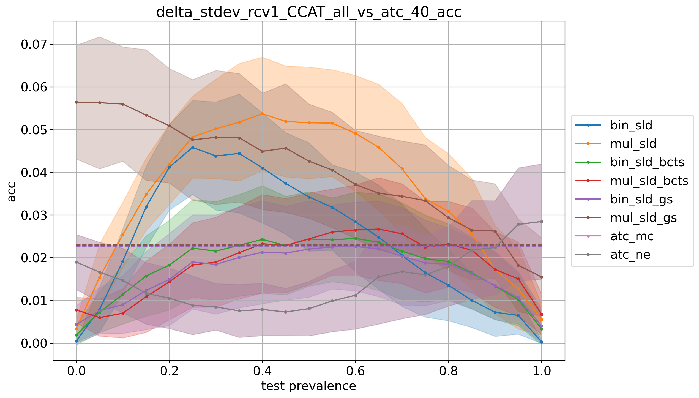
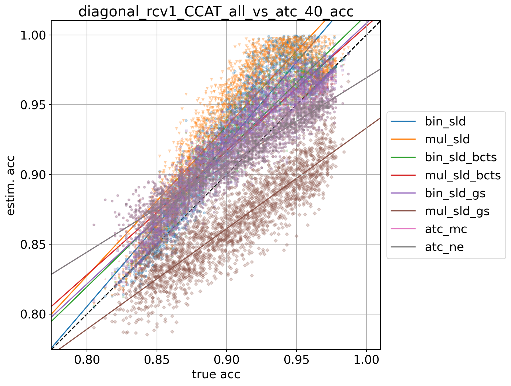
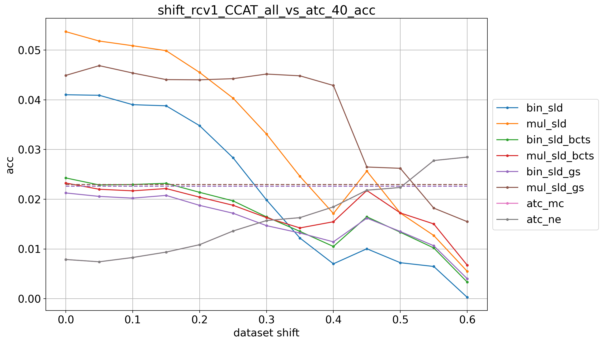

## 30% positives
> train: [0.69993324 0.30006676]  
> validation: [0.70010013 0.29989987]  
> bin_sld: 241.690s  
> mul_sld: 76.036s  
> bin_sld_bcts: 241.023s  
> mul_sld_bcts: 81.654s  
> bin_sld_gs: 468.354s  
> mul_sld_gs: 303.186s  
> kfcv: 56.346s  
> ref: 53.070s  
> atc_mc: 56.339s  
> atc_ne: 55.112s  
> doc_feat: 46.850s  
> tot: 474.244s  

<table border="1" class="dataframe">
  <thead>
    <tr style="text-align: right;">
      <th></th>
      <th>bin_sld</th>
      <th>mul_sld</th>
      <th>bin_sld_bcts</th>
      <th>mul_sld_bcts</th>
      <th>bin_sld_gs</th>
      <th>mul_sld_gs</th>
      <th>atc_mc</th>
      <th>atc_ne</th>
    </tr>
  </thead>
  <tbody>
    <tr>
      <th>0.0</th>
      <td>0.0014</td>
      <td>0.0024</td>
      <td>0.0049</td>
      <td>0.0101</td>
      <td>0.0349</td>
      <td>0.0060</td>
      <td>0.0103</td>
      <td>0.0103</td>
    </tr>
    <tr>
      <th>0.05</th>
      <td>0.0097</td>
      <td>0.0117</td>
      <td>0.0067</td>
      <td>0.0080</td>
      <td>0.0227</td>
      <td>0.0080</td>
      <td>0.0072</td>
      <td>0.0072</td>
    </tr>
    <tr>
      <th>0.1</th>
      <td>0.0180</td>
      <td>0.0202</td>
      <td>0.0079</td>
      <td>0.0073</td>
      <td>0.0228</td>
      <td>0.0095</td>
      <td>0.0049</td>
      <td>0.0049</td>
    </tr>
    <tr>
      <th>0.15</th>
      <td>0.0227</td>
      <td>0.0282</td>
      <td>0.0089</td>
      <td>0.0082</td>
      <td>0.0186</td>
      <td>0.0099</td>
      <td>0.0060</td>
      <td>0.0060</td>
    </tr>
    <tr>
      <th>0.2</th>
      <td>0.0237</td>
      <td>0.0333</td>
      <td>0.0102</td>
      <td>0.0102</td>
      <td>0.0170</td>
      <td>0.0110</td>
      <td>0.0082</td>
      <td>0.0082</td>
    </tr>
    <tr>
      <th>0.25</th>
      <td>0.0250</td>
      <td>0.0378</td>
      <td>0.0113</td>
      <td>0.0125</td>
      <td>0.0135</td>
      <td>0.0130</td>
      <td>0.0101</td>
      <td>0.0101</td>
    </tr>
    <tr>
      <th>0.3</th>
      <td>0.0229</td>
      <td>0.0371</td>
      <td>0.0108</td>
      <td>0.0130</td>
      <td>0.0134</td>
      <td>0.0146</td>
      <td>0.0119</td>
      <td>0.0119</td>
    </tr>
    <tr>
      <th>0.35</th>
      <td>0.0218</td>
      <td>0.0364</td>
      <td>0.0124</td>
      <td>0.0147</td>
      <td>0.0123</td>
      <td>0.0134</td>
      <td>0.0160</td>
      <td>0.0160</td>
    </tr>
    <tr>
      <th>0.4</th>
      <td>0.0220</td>
      <td>0.0379</td>
      <td>0.0136</td>
      <td>0.0174</td>
      <td>0.0105</td>
      <td>0.0157</td>
      <td>0.0190</td>
      <td>0.0190</td>
    </tr>
    <tr>
      <th>0.45</th>
      <td>0.0189</td>
      <td>0.0369</td>
      <td>0.0130</td>
      <td>0.0179</td>
      <td>0.0102</td>
      <td>0.0155</td>
      <td>0.0222</td>
      <td>0.0222</td>
    </tr>
    <tr>
      <th>0.5</th>
      <td>0.0183</td>
      <td>0.0359</td>
      <td>0.0136</td>
      <td>0.0191</td>
      <td>0.0082</td>
      <td>0.0155</td>
      <td>0.0259</td>
      <td>0.0259</td>
    </tr>
    <tr>
      <th>0.55</th>
      <td>0.0179</td>
      <td>0.0365</td>
      <td>0.0146</td>
      <td>0.0218</td>
      <td>0.0067</td>
      <td>0.0159</td>
      <td>0.0297</td>
      <td>0.0297</td>
    </tr>
    <tr>
      <th>0.6</th>
      <td>0.0144</td>
      <td>0.0333</td>
      <td>0.0127</td>
      <td>0.0213</td>
      <td>0.0080</td>
      <td>0.0169</td>
      <td>0.0307</td>
      <td>0.0307</td>
    </tr>
    <tr>
      <th>0.65</th>
      <td>0.0131</td>
      <td>0.0309</td>
      <td>0.0133</td>
      <td>0.0224</td>
      <td>0.0077</td>
      <td>0.0150</td>
      <td>0.0368</td>
      <td>0.0368</td>
    </tr>
    <tr>
      <th>0.7</th>
      <td>0.0117</td>
      <td>0.0272</td>
      <td>0.0128</td>
      <td>0.0219</td>
      <td>0.0084</td>
      <td>0.0141</td>
      <td>0.0400</td>
      <td>0.0400</td>
    </tr>
    <tr>
      <th>0.75</th>
      <td>0.0095</td>
      <td>0.0225</td>
      <td>0.0117</td>
      <td>0.0205</td>
      <td>0.0084</td>
      <td>0.0129</td>
      <td>0.0427</td>
      <td>0.0427</td>
    </tr>
    <tr>
      <th>0.8</th>
      <td>0.0081</td>
      <td>0.0196</td>
      <td>0.0110</td>
      <td>0.0203</td>
      <td>0.0090</td>
      <td>0.0121</td>
      <td>0.0464</td>
      <td>0.0464</td>
    </tr>
    <tr>
      <th>0.85</th>
      <td>0.0073</td>
      <td>0.0155</td>
      <td>0.0101</td>
      <td>0.0191</td>
      <td>0.0099</td>
      <td>0.0114</td>
      <td>0.0517</td>
      <td>0.0517</td>
    </tr>
    <tr>
      <th>0.9</th>
      <td>0.0078</td>
      <td>0.0121</td>
      <td>0.0091</td>
      <td>0.0161</td>
      <td>0.0099</td>
      <td>0.0104</td>
      <td>0.0521</td>
      <td>0.0521</td>
    </tr>
    <tr>
      <th>0.95</th>
      <td>0.0089</td>
      <td>0.0102</td>
      <td>0.0085</td>
      <td>0.0140</td>
      <td>0.0115</td>
      <td>0.0110</td>
      <td>0.0548</td>
      <td>0.0548</td>
    </tr>
    <tr>
      <th>1.0</th>
      <td>0.0003</td>
      <td>0.0071</td>
      <td>0.0057</td>
      <td>0.0071</td>
      <td>0.0092</td>
      <td>0.0101</td>
      <td>0.0625</td>
      <td>0.0625</td>
    </tr>
    <tr>
      <th>tot</th>
      <td>0.0144</td>
      <td>0.0254</td>
      <td>0.0106</td>
      <td>0.0154</td>
      <td>0.0130</td>
      <td>0.0125</td>
      <td>0.0280</td>
      <td>0.0280</td>
    </tr>
  </tbody>
</table>

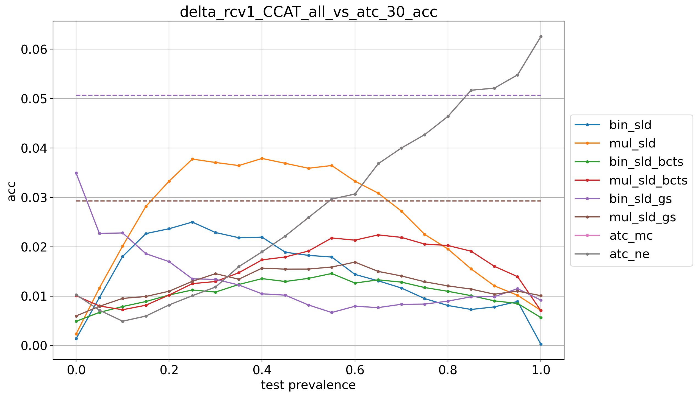
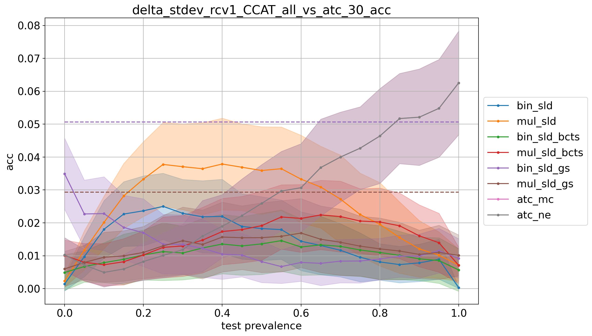
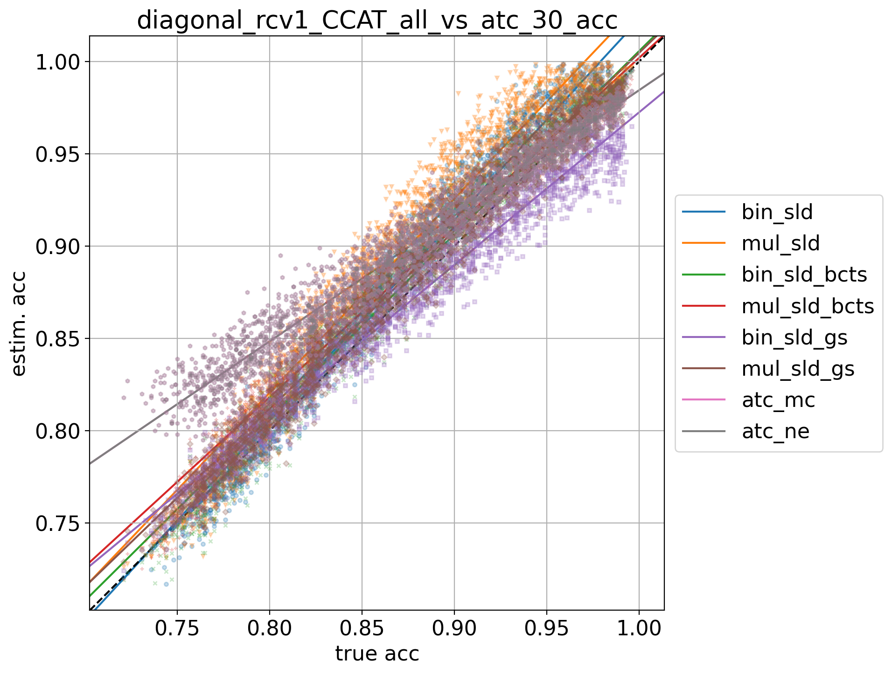
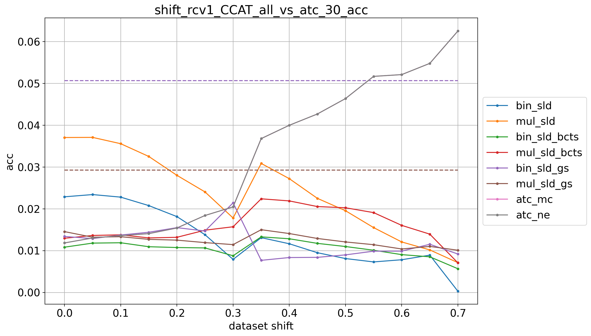

## 20% positives
> train: [0.79989987 0.20010013]  
> validation: [0.80006676 0.19993324]  
> bin_sld: 249.327s  
> mul_sld: 79.485s  
> bin_sld_bcts: 248.816s  
> mul_sld_bcts: 83.568s  
> bin_sld_gs: 471.330s  
> mul_sld_gs: 282.407s  
> kfcv: 59.365s  
> ref: 56.664s  
> atc_mc: 58.956s  
> atc_ne: 57.529s  
> doc_feat: 49.376s  
> tot: 478.051s  

<table border="1" class="dataframe">
  <thead>
    <tr style="text-align: right;">
      <th></th>
      <th>bin_sld</th>
      <th>mul_sld</th>
      <th>bin_sld_bcts</th>
      <th>mul_sld_bcts</th>
      <th>bin_sld_gs</th>
      <th>mul_sld_gs</th>
      <th>atc_mc</th>
      <th>atc_ne</th>
    </tr>
  </thead>
  <tbody>
    <tr>
      <th>0.0</th>
      <td>0.0011</td>
      <td>0.0019</td>
      <td>0.0047</td>
      <td>0.0078</td>
      <td>0.0028</td>
      <td>0.0134</td>
      <td>0.0097</td>
      <td>0.0097</td>
    </tr>
    <tr>
      <th>0.05</th>
      <td>0.0092</td>
      <td>0.0117</td>
      <td>0.0065</td>
      <td>0.0068</td>
      <td>0.0063</td>
      <td>0.0125</td>
      <td>0.0071</td>
      <td>0.0071</td>
    </tr>
    <tr>
      <th>0.1</th>
      <td>0.0103</td>
      <td>0.0164</td>
      <td>0.0071</td>
      <td>0.0068</td>
      <td>0.0082</td>
      <td>0.0121</td>
      <td>0.0062</td>
      <td>0.0062</td>
    </tr>
    <tr>
      <th>0.15</th>
      <td>0.0103</td>
      <td>0.0178</td>
      <td>0.0079</td>
      <td>0.0067</td>
      <td>0.0096</td>
      <td>0.0105</td>
      <td>0.0064</td>
      <td>0.0064</td>
    </tr>
    <tr>
      <th>0.2</th>
      <td>0.0117</td>
      <td>0.0208</td>
      <td>0.0094</td>
      <td>0.0088</td>
      <td>0.0112</td>
      <td>0.0104</td>
      <td>0.0088</td>
      <td>0.0088</td>
    </tr>
    <tr>
      <th>0.25</th>
      <td>0.0101</td>
      <td>0.0218</td>
      <td>0.0088</td>
      <td>0.0094</td>
      <td>0.0112</td>
      <td>0.0094</td>
      <td>0.0093</td>
      <td>0.0093</td>
    </tr>
    <tr>
      <th>0.3</th>
      <td>0.0093</td>
      <td>0.0197</td>
      <td>0.0090</td>
      <td>0.0102</td>
      <td>0.0127</td>
      <td>0.0093</td>
      <td>0.0124</td>
      <td>0.0124</td>
    </tr>
    <tr>
      <th>0.35</th>
      <td>0.0087</td>
      <td>0.0178</td>
      <td>0.0083</td>
      <td>0.0105</td>
      <td>0.0107</td>
      <td>0.0084</td>
      <td>0.0161</td>
      <td>0.0161</td>
    </tr>
    <tr>
      <th>0.4</th>
      <td>0.0092</td>
      <td>0.0173</td>
      <td>0.0090</td>
      <td>0.0118</td>
      <td>0.0117</td>
      <td>0.0090</td>
      <td>0.0190</td>
      <td>0.0190</td>
    </tr>
    <tr>
      <th>0.45</th>
      <td>0.0092</td>
      <td>0.0155</td>
      <td>0.0104</td>
      <td>0.0118</td>
      <td>0.0119</td>
      <td>0.0093</td>
      <td>0.0207</td>
      <td>0.0207</td>
    </tr>
    <tr>
      <th>0.5</th>
      <td>0.0088</td>
      <td>0.0135</td>
      <td>0.0104</td>
      <td>0.0118</td>
      <td>0.0127</td>
      <td>0.0089</td>
      <td>0.0222</td>
      <td>0.0222</td>
    </tr>
    <tr>
      <th>0.55</th>
      <td>0.0093</td>
      <td>0.0135</td>
      <td>0.0100</td>
      <td>0.0135</td>
      <td>0.0125</td>
      <td>0.0092</td>
      <td>0.0247</td>
      <td>0.0247</td>
    </tr>
    <tr>
      <th>0.6</th>
      <td>0.0113</td>
      <td>0.0110</td>
      <td>0.0109</td>
      <td>0.0119</td>
      <td>0.0116</td>
      <td>0.0088</td>
      <td>0.0272</td>
      <td>0.0272</td>
    </tr>
    <tr>
      <th>0.65</th>
      <td>0.0125</td>
      <td>0.0113</td>
      <td>0.0132</td>
      <td>0.0128</td>
      <td>0.0161</td>
      <td>0.0105</td>
      <td>0.0331</td>
      <td>0.0331</td>
    </tr>
    <tr>
      <th>0.7</th>
      <td>0.0146</td>
      <td>0.0126</td>
      <td>0.0114</td>
      <td>0.0137</td>
      <td>0.0134</td>
      <td>0.0108</td>
      <td>0.0384</td>
      <td>0.0384</td>
    </tr>
    <tr>
      <th>0.75</th>
      <td>0.0170</td>
      <td>0.0136</td>
      <td>0.0133</td>
      <td>0.0128</td>
      <td>0.0149</td>
      <td>0.0107</td>
      <td>0.0425</td>
      <td>0.0425</td>
    </tr>
    <tr>
      <th>0.8</th>
      <td>0.0216</td>
      <td>0.0156</td>
      <td>0.0135</td>
      <td>0.0115</td>
      <td>0.0145</td>
      <td>0.0096</td>
      <td>0.0407</td>
      <td>0.0407</td>
    </tr>
    <tr>
      <th>0.85</th>
      <td>0.0247</td>
      <td>0.0182</td>
      <td>0.0162</td>
      <td>0.0103</td>
      <td>0.0187</td>
      <td>0.0092</td>
      <td>0.0447</td>
      <td>0.0447</td>
    </tr>
    <tr>
      <th>0.9</th>
      <td>0.0283</td>
      <td>0.0209</td>
      <td>0.0180</td>
      <td>0.0104</td>
      <td>0.0153</td>
      <td>0.0101</td>
      <td>0.0492</td>
      <td>0.0492</td>
    </tr>
    <tr>
      <th>0.95</th>
      <td>0.0297</td>
      <td>0.0223</td>
      <td>0.0193</td>
      <td>0.0092</td>
      <td>0.0177</td>
      <td>0.0087</td>
      <td>0.0492</td>
      <td>0.0492</td>
    </tr>
    <tr>
      <th>1.0</th>
      <td>0.0009</td>
      <td>0.0082</td>
      <td>0.0116</td>
      <td>0.0055</td>
      <td>0.0135</td>
      <td>0.0074</td>
      <td>0.0571</td>
      <td>0.0571</td>
    </tr>
    <tr>
      <th>tot</th>
      <td>0.0128</td>
      <td>0.0153</td>
      <td>0.0109</td>
      <td>0.0102</td>
      <td>0.0122</td>
      <td>0.0099</td>
      <td>0.0259</td>
      <td>0.0259</td>
    </tr>
  </tbody>
</table>

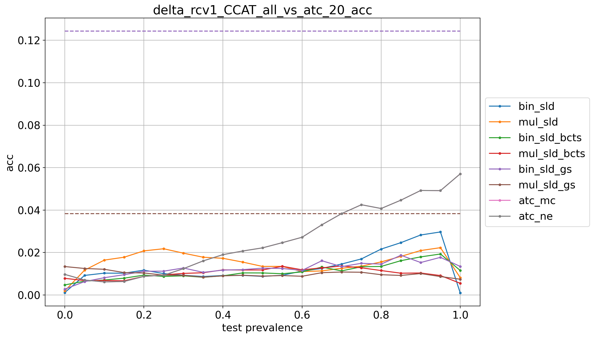
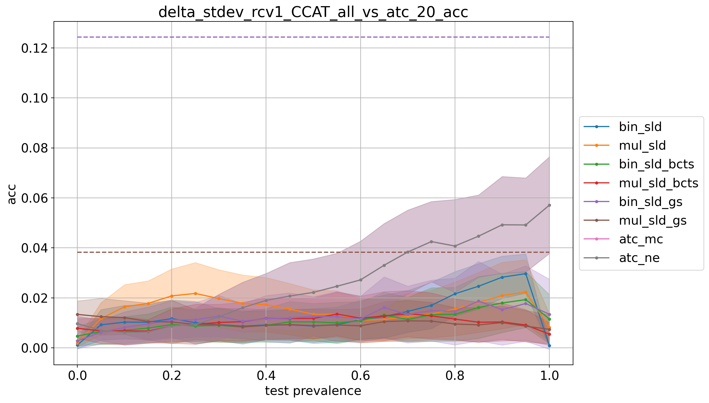
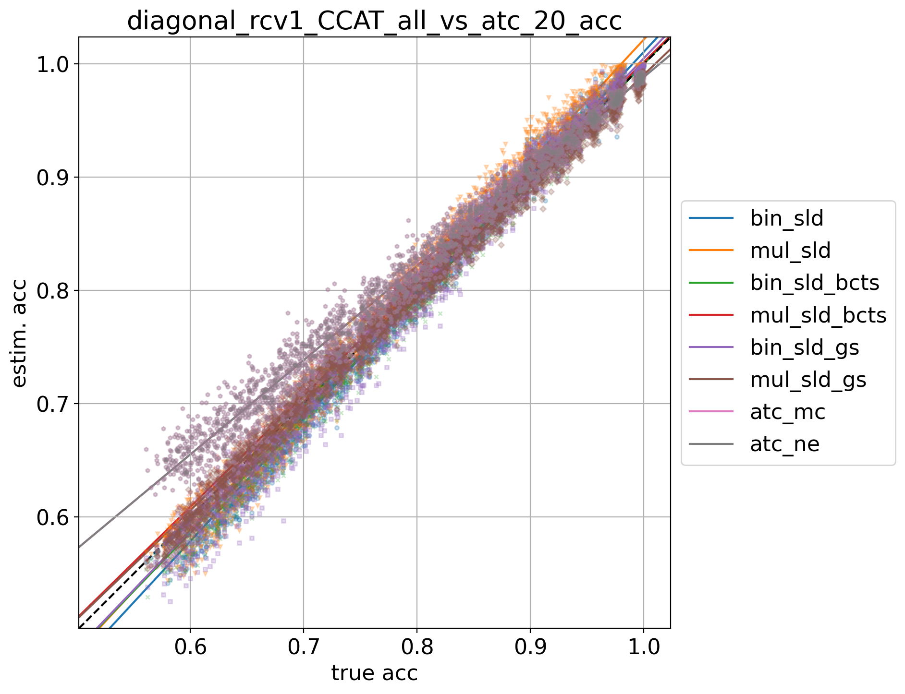
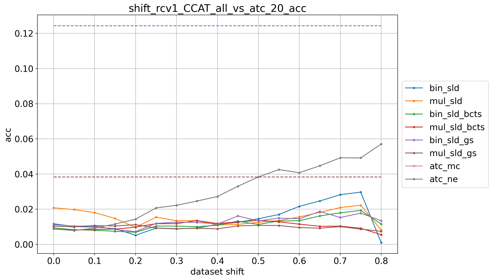

## 10% positives
> train: [0.90003338 0.09996662]  
> validation: [0.90003338 0.09996662]  
> bin_sld: 217.756s  
> mul_sld: 63.422s  
> kfcv: 47.542s  
> ref: 45.622s  
> atc_mc: 48.127s  
> atc_ne: 47.746s  
> doc_feat: 41.031s  
> tot: 219.250s  

<table border="1" class="dataframe">
  <thead>
    <tr style="text-align: right;">
      <th></th>
      <th>bin_sld</th>
      <th>mul_sld</th>
      <th>atc_mc</th>
      <th>atc_ne</th>
    </tr>
  </thead>
  <tbody>
    <tr>
      <th>0.0</th>
      <td>0.0010</td>
      <td>0.0010</td>
      <td>0.0088</td>
      <td>0.0088</td>
    </tr>
    <tr>
      <th>0.05</th>
      <td>0.0077</td>
      <td>0.0085</td>
      <td>0.0046</td>
      <td>0.0046</td>
    </tr>
    <tr>
      <th>0.1</th>
      <td>0.0129</td>
      <td>0.0093</td>
      <td>0.0080</td>
      <td>0.0080</td>
    </tr>
    <tr>
      <th>0.15</th>
      <td>0.0181</td>
      <td>0.0075</td>
      <td>0.0128</td>
      <td>0.0128</td>
    </tr>
    <tr>
      <th>0.2</th>
      <td>0.0248</td>
      <td>0.0110</td>
      <td>0.0194</td>
      <td>0.0194</td>
    </tr>
    <tr>
      <th>0.25</th>
      <td>0.0262</td>
      <td>0.0122</td>
      <td>0.0256</td>
      <td>0.0256</td>
    </tr>
    <tr>
      <th>0.3</th>
      <td>0.0372</td>
      <td>0.0178</td>
      <td>0.0348</td>
      <td>0.0348</td>
    </tr>
    <tr>
      <th>0.35</th>
      <td>0.0403</td>
      <td>0.0226</td>
      <td>0.0438</td>
      <td>0.0438</td>
    </tr>
    <tr>
      <th>0.4</th>
      <td>0.0505</td>
      <td>0.0317</td>
      <td>0.0509</td>
      <td>0.0509</td>
    </tr>
    <tr>
      <th>0.45</th>
      <td>0.0550</td>
      <td>0.0393</td>
      <td>0.0568</td>
      <td>0.0568</td>
    </tr>
    <tr>
      <th>0.5</th>
      <td>0.0716</td>
      <td>0.0473</td>
      <td>0.0633</td>
      <td>0.0633</td>
    </tr>
    <tr>
      <th>0.55</th>
      <td>0.0735</td>
      <td>0.0533</td>
      <td>0.0728</td>
      <td>0.0728</td>
    </tr>
    <tr>
      <th>0.6</th>
      <td>0.0795</td>
      <td>0.0639</td>
      <td>0.0748</td>
      <td>0.0748</td>
    </tr>
    <tr>
      <th>0.65</th>
      <td>0.0966</td>
      <td>0.0709</td>
      <td>0.0843</td>
      <td>0.0843</td>
    </tr>
    <tr>
      <th>0.7</th>
      <td>0.0945</td>
      <td>0.0775</td>
      <td>0.0916</td>
      <td>0.0916</td>
    </tr>
    <tr>
      <th>0.75</th>
      <td>0.1032</td>
      <td>0.0830</td>
      <td>0.1005</td>
      <td>0.1005</td>
    </tr>
    <tr>
      <th>0.8</th>
      <td>0.1081</td>
      <td>0.0916</td>
      <td>0.1064</td>
      <td>0.1064</td>
    </tr>
    <tr>
      <th>0.85</th>
      <td>0.1154</td>
      <td>0.0971</td>
      <td>0.1147</td>
      <td>0.1147</td>
    </tr>
    <tr>
      <th>0.9</th>
      <td>0.1080</td>
      <td>0.0976</td>
      <td>0.1204</td>
      <td>0.1204</td>
    </tr>
    <tr>
      <th>0.95</th>
      <td>0.0835</td>
      <td>0.0729</td>
      <td>0.1244</td>
      <td>0.1244</td>
    </tr>
    <tr>
      <th>1.0</th>
      <td>0.0321</td>
      <td>0.0184</td>
      <td>0.1336</td>
      <td>0.1336</td>
    </tr>
    <tr>
      <th>tot</th>
      <td>0.0590</td>
      <td>0.0445</td>
      <td>0.0644</td>
      <td>0.0644</td>
    </tr>
  </tbody>
</table>

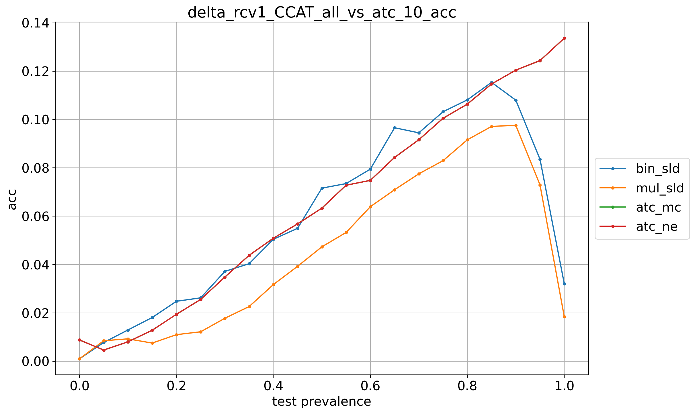
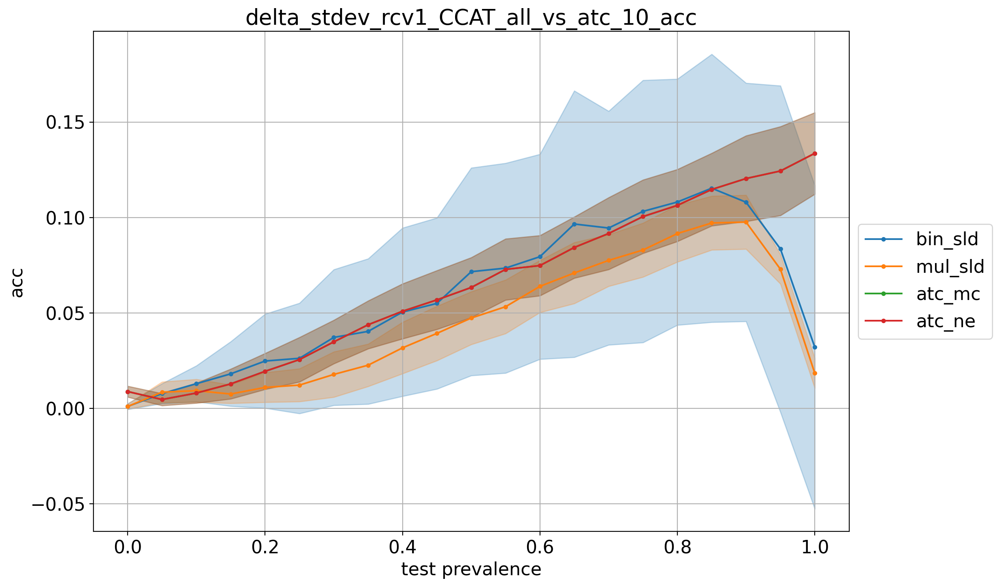
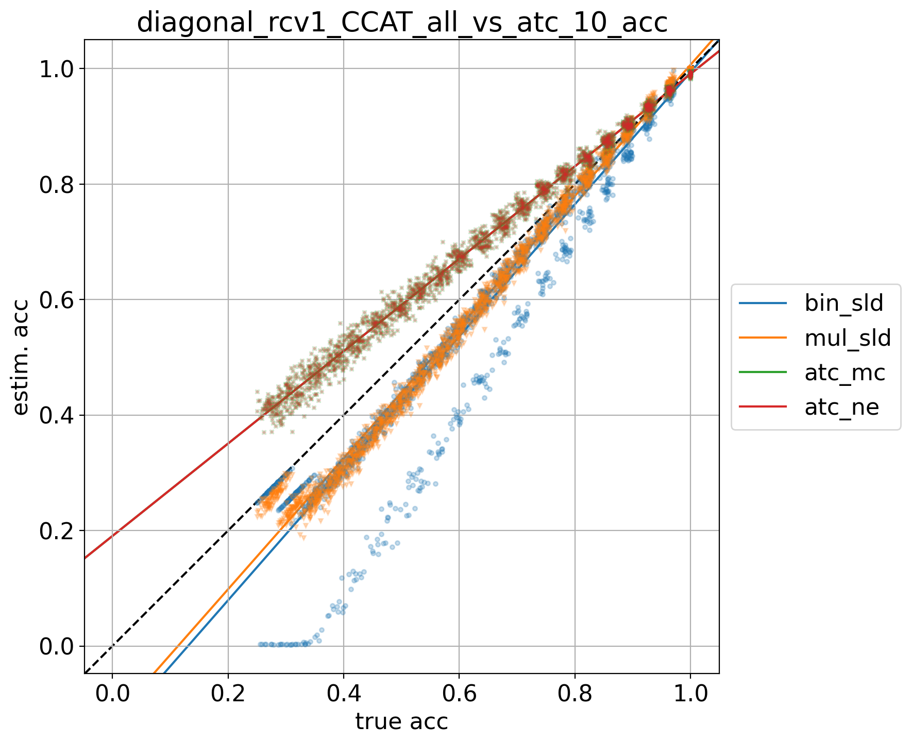
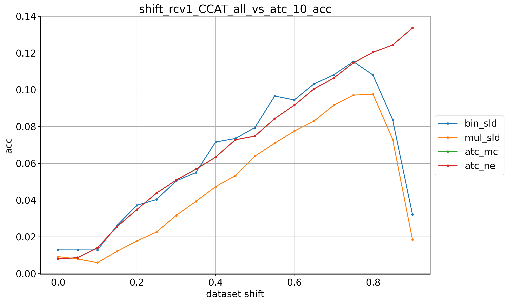

## avg
<table border="1" class="dataframe">
  <thead>
    <tr style="text-align: right;">
      <th></th>
      <th>bin_sld</th>
      <th>mul_sld</th>
      <th>bin_sld_bcts</th>
      <th>mul_sld_bcts</th>
      <th>bin_sld_gs</th>
      <th>mul_sld_gs</th>
      <th>atc_mc</th>
      <th>atc_ne</th>
    </tr>
  </thead>
  <tbody>
    <tr>
      <th>0.0</th>
      <td>0.0009</td>
      <td>0.0091</td>
      <td>0.0040</td>
      <td>0.0116</td>
      <td>0.0141</td>
      <td>0.0211</td>
      <td>0.0325</td>
      <td>0.0325</td>
    </tr>
    <tr>
      <th>0.05</th>
      <td>0.0155</td>
      <td>0.0240</td>
      <td>0.0127</td>
      <td>0.0132</td>
      <td>0.0191</td>
      <td>0.0228</td>
      <td>0.0294</td>
      <td>0.0294</td>
    </tr>
    <tr>
      <th>0.1</th>
      <td>0.0226</td>
      <td>0.0303</td>
      <td>0.0136</td>
      <td>0.0129</td>
      <td>0.0189</td>
      <td>0.0217</td>
      <td>0.0280</td>
      <td>0.0280</td>
    </tr>
    <tr>
      <th>0.15</th>
      <td>0.0261</td>
      <td>0.0335</td>
      <td>0.0149</td>
      <td>0.0133</td>
      <td>0.0191</td>
      <td>0.0208</td>
      <td>0.0264</td>
      <td>0.0264</td>
    </tr>
    <tr>
      <th>0.2</th>
      <td>0.0282</td>
      <td>0.0349</td>
      <td>0.0152</td>
      <td>0.0136</td>
      <td>0.0184</td>
      <td>0.0191</td>
      <td>0.0266</td>
      <td>0.0266</td>
    </tr>
    <tr>
      <th>0.25</th>
      <td>0.0298</td>
      <td>0.0374</td>
      <td>0.0163</td>
      <td>0.0155</td>
      <td>0.0184</td>
      <td>0.0195</td>
      <td>0.0252</td>
      <td>0.0252</td>
    </tr>
    <tr>
      <th>0.3</th>
      <td>0.0299</td>
      <td>0.0376</td>
      <td>0.0161</td>
      <td>0.0155</td>
      <td>0.0187</td>
      <td>0.0196</td>
      <td>0.0257</td>
      <td>0.0257</td>
    </tr>
    <tr>
      <th>0.35</th>
      <td>0.0303</td>
      <td>0.0373</td>
      <td>0.0163</td>
      <td>0.0163</td>
      <td>0.0183</td>
      <td>0.0195</td>
      <td>0.0267</td>
      <td>0.0267</td>
    </tr>
    <tr>
      <th>0.4</th>
      <td>0.0306</td>
      <td>0.0383</td>
      <td>0.0165</td>
      <td>0.0170</td>
      <td>0.0177</td>
      <td>0.0192</td>
      <td>0.0263</td>
      <td>0.0263</td>
    </tr>
    <tr>
      <th>0.45</th>
      <td>0.0299</td>
      <td>0.0370</td>
      <td>0.0158</td>
      <td>0.0161</td>
      <td>0.0168</td>
      <td>0.0186</td>
      <td>0.0265</td>
      <td>0.0265</td>
    </tr>
    <tr>
      <th>0.5</th>
      <td>0.0301</td>
      <td>0.0363</td>
      <td>0.0157</td>
      <td>0.0162</td>
      <td>0.0166</td>
      <td>0.0184</td>
      <td>0.0266</td>
      <td>0.0266</td>
    </tr>
    <tr>
      <th>0.55</th>
      <td>0.0297</td>
      <td>0.0362</td>
      <td>0.0154</td>
      <td>0.0167</td>
      <td>0.0162</td>
      <td>0.0178</td>
      <td>0.0268</td>
      <td>0.0268</td>
    </tr>
    <tr>
      <th>0.6</th>
      <td>0.0289</td>
      <td>0.0352</td>
      <td>0.0146</td>
      <td>0.0157</td>
      <td>0.0148</td>
      <td>0.0169</td>
      <td>0.0267</td>
      <td>0.0267</td>
    </tr>
    <tr>
      <th>0.65</th>
      <td>0.0297</td>
      <td>0.0345</td>
      <td>0.0155</td>
      <td>0.0168</td>
      <td>0.0161</td>
      <td>0.0172</td>
      <td>0.0285</td>
      <td>0.0285</td>
    </tr>
    <tr>
      <th>0.7</th>
      <td>0.0267</td>
      <td>0.0317</td>
      <td>0.0142</td>
      <td>0.0160</td>
      <td>0.0152</td>
      <td>0.0175</td>
      <td>0.0292</td>
      <td>0.0292</td>
    </tr>
    <tr>
      <th>0.75</th>
      <td>0.0260</td>
      <td>0.0289</td>
      <td>0.0135</td>
      <td>0.0148</td>
      <td>0.0147</td>
      <td>0.0169</td>
      <td>0.0296</td>
      <td>0.0296</td>
    </tr>
    <tr>
      <th>0.8</th>
      <td>0.0255</td>
      <td>0.0278</td>
      <td>0.0134</td>
      <td>0.0147</td>
      <td>0.0151</td>
      <td>0.0165</td>
      <td>0.0303</td>
      <td>0.0303</td>
    </tr>
    <tr>
      <th>0.85</th>
      <td>0.0246</td>
      <td>0.0255</td>
      <td>0.0129</td>
      <td>0.0140</td>
      <td>0.0148</td>
      <td>0.0160</td>
      <td>0.0319</td>
      <td>0.0319</td>
    </tr>
    <tr>
      <th>0.9</th>
      <td>0.0228</td>
      <td>0.0224</td>
      <td>0.0121</td>
      <td>0.0130</td>
      <td>0.0142</td>
      <td>0.0167</td>
      <td>0.0333</td>
      <td>0.0333</td>
    </tr>
    <tr>
      <th>0.95</th>
      <td>0.0196</td>
      <td>0.0176</td>
      <td>0.0111</td>
      <td>0.0118</td>
      <td>0.0130</td>
      <td>0.0154</td>
      <td>0.0357</td>
      <td>0.0357</td>
    </tr>
    <tr>
      <th>1.0</th>
      <td>0.0056</td>
      <td>0.0070</td>
      <td>0.0087</td>
      <td>0.0107</td>
      <td>0.0120</td>
      <td>0.0161</td>
      <td>0.0403</td>
      <td>0.0403</td>
    </tr>
    <tr>
      <th>tot</th>
      <td>0.0244</td>
      <td>0.0296</td>
      <td>0.0137</td>
      <td>0.0145</td>
      <td>0.0163</td>
      <td>0.0184</td>
      <td>0.0292</td>
      <td>0.0292</td>
    </tr>
  </tbody>
</table>

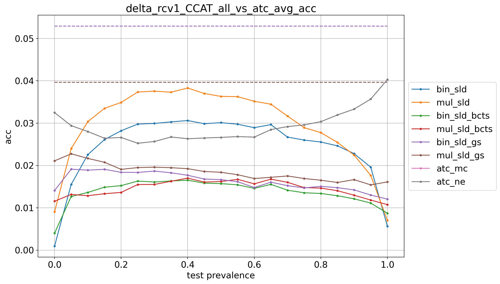
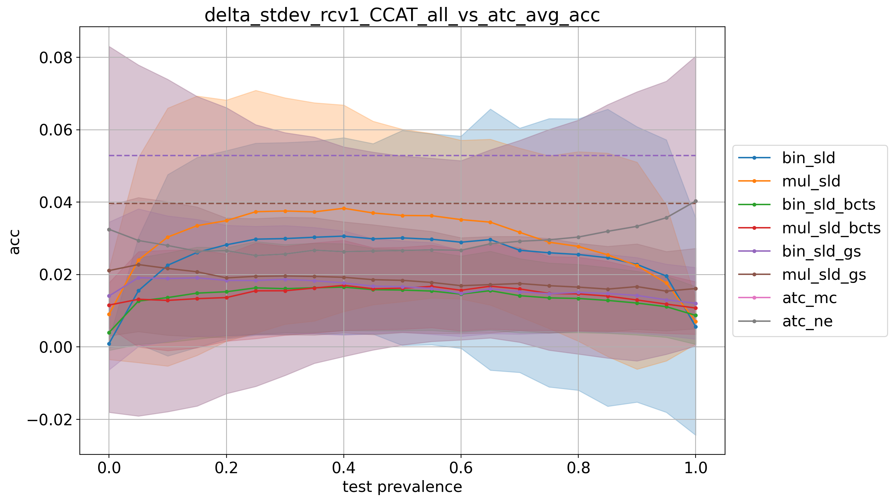
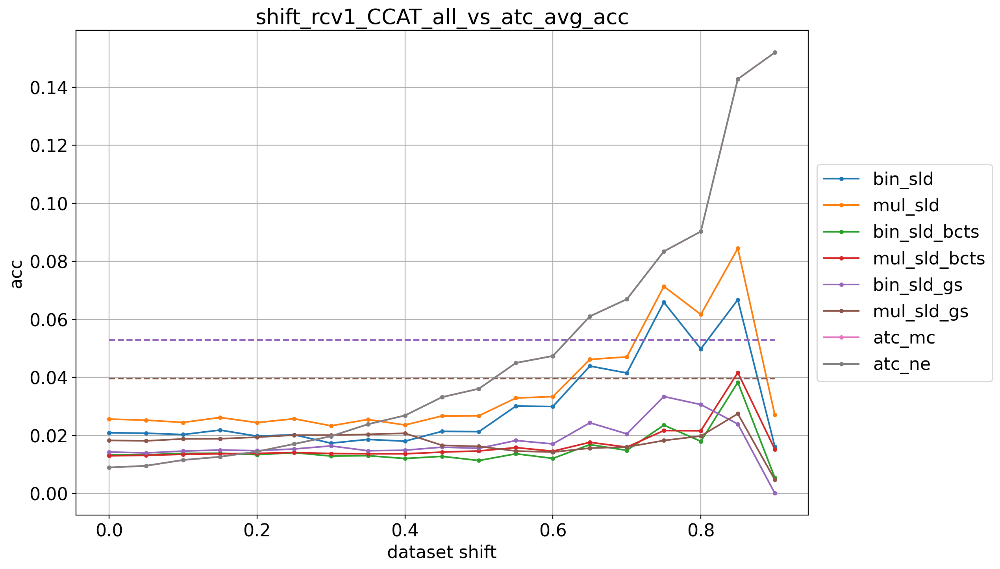
