# rcv1_CCAT

## 90% positives
> train: [0.09996662 0.90003338]  
> validation: [0.09996662 0.90003338]  
> bin_sld: 234.941s  
> mul_sld: 75.002s  
> bin_sld_bcts: 230.912s  
> mul_sld_bcts: 79.197s  
> bin_sld_gs: 478.630s  
> mul_sld_gs: 251.343s  
> kfcv: 55.369s  
> ref: 52.475s  
> atc_mc: 54.633s  
> atc_ne: 54.569s  
> doc_feat: 46.647s  
> tot: 486.773s  

<table border="1" class="dataframe">
  <thead>
    <tr style="text-align: right;">
      <th></th>
      <th>bin_sld</th>
      <th>mul_sld</th>
      <th>bin_sld_bcts</th>
      <th>mul_sld_bcts</th>
      <th>bin_sld_gs</th>
      <th>mul_sld_gs</th>
      <th>atc_mc</th>
      <th>atc_ne</th>
    </tr>
  </thead>
  <tbody>
    <tr>
      <th>0.0</th>
      <td>0.0000</td>
      <td>0.0000</td>
      <td>0.0000</td>
      <td>0.0000</td>
      <td>0.0003</td>
      <td>0.0001</td>
      <td>0.4745</td>
      <td>0.4745</td>
    </tr>
    <tr>
      <th>0.05</th>
      <td>0.1094</td>
      <td>0.1090</td>
      <td>0.0719</td>
      <td>0.0502</td>
      <td>0.0514</td>
      <td>0.0490</td>
      <td>0.4016</td>
      <td>0.4016</td>
    </tr>
    <tr>
      <th>0.1</th>
      <td>0.1807</td>
      <td>0.1536</td>
      <td>0.0683</td>
      <td>0.0501</td>
      <td>0.0545</td>
      <td>0.0477</td>
      <td>0.3432</td>
      <td>0.3432</td>
    </tr>
    <tr>
      <th>0.15</th>
      <td>0.1695</td>
      <td>0.1491</td>
      <td>0.0607</td>
      <td>0.0461</td>
      <td>0.0499</td>
      <td>0.0435</td>
      <td>0.2909</td>
      <td>0.2909</td>
    </tr>
    <tr>
      <th>0.2</th>
      <td>0.1458</td>
      <td>0.1326</td>
      <td>0.0505</td>
      <td>0.0388</td>
      <td>0.0453</td>
      <td>0.0352</td>
      <td>0.2470</td>
      <td>0.2470</td>
    </tr>
    <tr>
      <th>0.25</th>
      <td>0.1307</td>
      <td>0.1245</td>
      <td>0.0476</td>
      <td>0.0397</td>
      <td>0.0431</td>
      <td>0.0349</td>
      <td>0.2076</td>
      <td>0.2076</td>
    </tr>
    <tr>
      <th>0.3</th>
      <td>0.1112</td>
      <td>0.1091</td>
      <td>0.0399</td>
      <td>0.0340</td>
      <td>0.0370</td>
      <td>0.0292</td>
      <td>0.1759</td>
      <td>0.1759</td>
    </tr>
    <tr>
      <th>0.35</th>
      <td>0.0955</td>
      <td>0.0975</td>
      <td>0.0351</td>
      <td>0.0314</td>
      <td>0.0349</td>
      <td>0.0260</td>
      <td>0.1487</td>
      <td>0.1487</td>
    </tr>
    <tr>
      <th>0.4</th>
      <td>0.0818</td>
      <td>0.0862</td>
      <td>0.0311</td>
      <td>0.0288</td>
      <td>0.0302</td>
      <td>0.0236</td>
      <td>0.1239</td>
      <td>0.1239</td>
    </tr>
    <tr>
      <th>0.45</th>
      <td>0.0658</td>
      <td>0.0707</td>
      <td>0.0248</td>
      <td>0.0231</td>
      <td>0.0250</td>
      <td>0.0182</td>
      <td>0.1027</td>
      <td>0.1027</td>
    </tr>
    <tr>
      <th>0.5</th>
      <td>0.0541</td>
      <td>0.0596</td>
      <td>0.0210</td>
      <td>0.0198</td>
      <td>0.0220</td>
      <td>0.0160</td>
      <td>0.0842</td>
      <td>0.0842</td>
    </tr>
    <tr>
      <th>0.55</th>
      <td>0.0465</td>
      <td>0.0526</td>
      <td>0.0199</td>
      <td>0.0196</td>
      <td>0.0210</td>
      <td>0.0152</td>
      <td>0.0659</td>
      <td>0.0659</td>
    </tr>
    <tr>
      <th>0.6</th>
      <td>0.0342</td>
      <td>0.0392</td>
      <td>0.0146</td>
      <td>0.0142</td>
      <td>0.0155</td>
      <td>0.0113</td>
      <td>0.0530</td>
      <td>0.0530</td>
    </tr>
    <tr>
      <th>0.65</th>
      <td>0.0300</td>
      <td>0.0357</td>
      <td>0.0152</td>
      <td>0.0160</td>
      <td>0.0160</td>
      <td>0.0129</td>
      <td>0.0392</td>
      <td>0.0392</td>
    </tr>
    <tr>
      <th>0.7</th>
      <td>0.0224</td>
      <td>0.0271</td>
      <td>0.0127</td>
      <td>0.0135</td>
      <td>0.0138</td>
      <td>0.0111</td>
      <td>0.0290</td>
      <td>0.0290</td>
    </tr>
    <tr>
      <th>0.75</th>
      <td>0.0156</td>
      <td>0.0193</td>
      <td>0.0100</td>
      <td>0.0107</td>
      <td>0.0109</td>
      <td>0.0086</td>
      <td>0.0196</td>
      <td>0.0196</td>
    </tr>
    <tr>
      <th>0.8</th>
      <td>0.0116</td>
      <td>0.0143</td>
      <td>0.0091</td>
      <td>0.0101</td>
      <td>0.0103</td>
      <td>0.0083</td>
      <td>0.0125</td>
      <td>0.0125</td>
    </tr>
    <tr>
      <th>0.85</th>
      <td>0.0075</td>
      <td>0.0096</td>
      <td>0.0076</td>
      <td>0.0089</td>
      <td>0.0084</td>
      <td>0.0075</td>
      <td>0.0061</td>
      <td>0.0061</td>
    </tr>
    <tr>
      <th>0.9</th>
      <td>0.0047</td>
      <td>0.0056</td>
      <td>0.0067</td>
      <td>0.0073</td>
      <td>0.0066</td>
      <td>0.0067</td>
      <td>0.0036</td>
      <td>0.0036</td>
    </tr>
    <tr>
      <th>0.95</th>
      <td>0.0032</td>
      <td>0.0038</td>
      <td>0.0060</td>
      <td>0.0069</td>
      <td>0.0056</td>
      <td>0.0067</td>
      <td>0.0069</td>
      <td>0.0069</td>
    </tr>
    <tr>
      <th>1.0</th>
      <td>0.0024</td>
      <td>0.0020</td>
      <td>0.0063</td>
      <td>0.0065</td>
      <td>0.0050</td>
      <td>0.0074</td>
      <td>0.0123</td>
      <td>0.0123</td>
    </tr>
    <tr>
      <th>tot</th>
      <td>0.0630</td>
      <td>0.0620</td>
      <td>0.0266</td>
      <td>0.0227</td>
      <td>0.0241</td>
      <td>0.0200</td>
      <td>0.1356</td>
      <td>0.1356</td>
    </tr>
  </tbody>
</table>

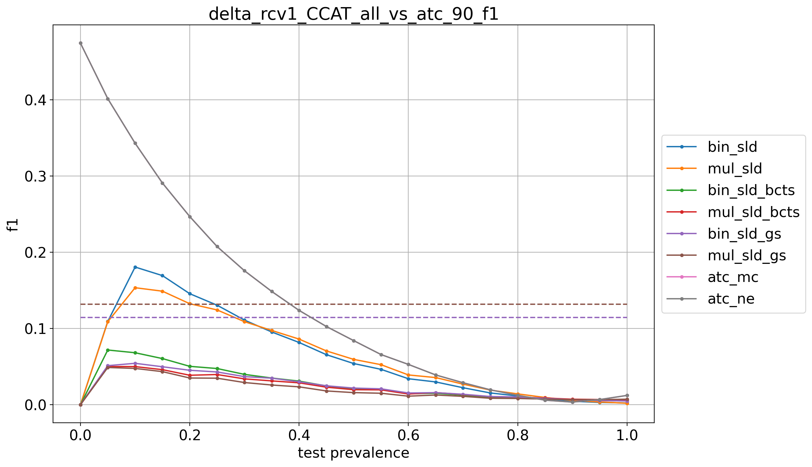
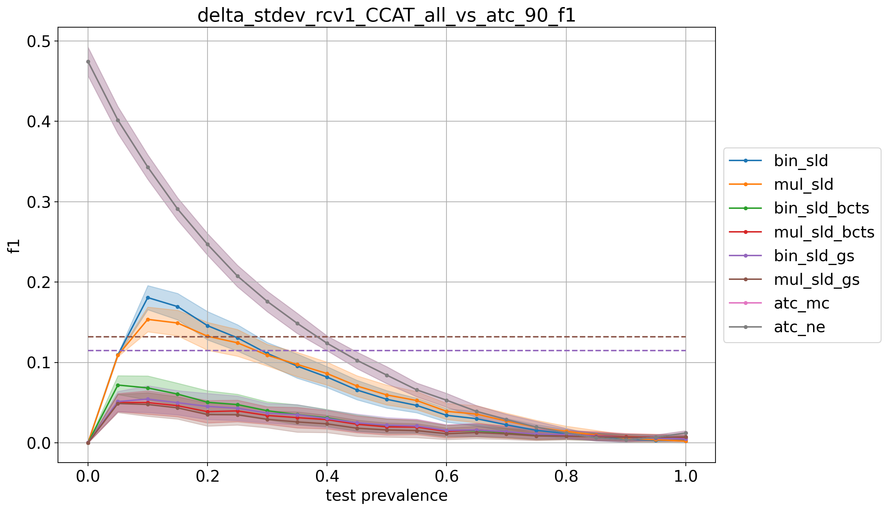
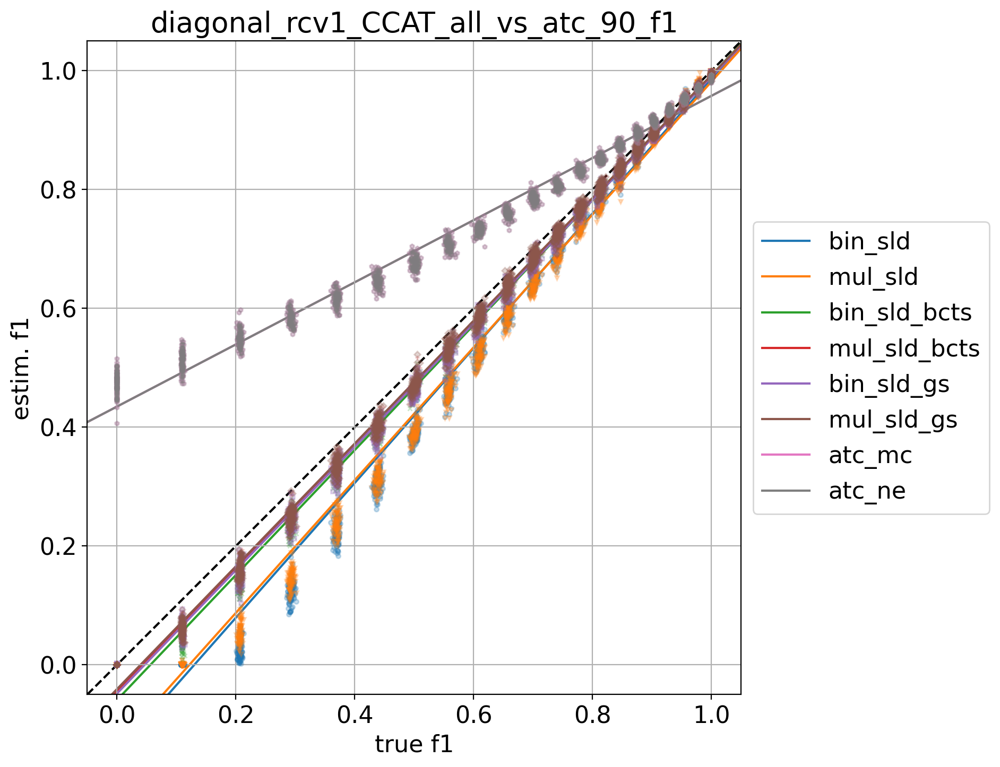
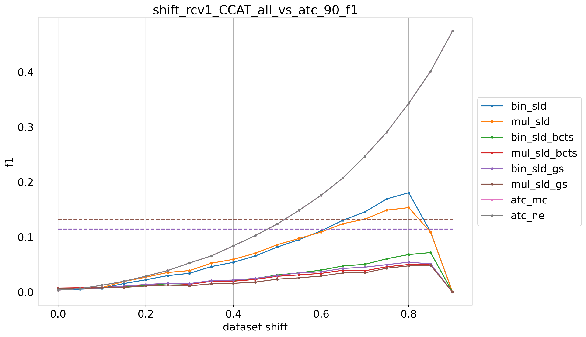

## 80% positives
> train: [0.19993324 0.80006676]  
> validation: [0.20010013 0.79989987]  
> bin_sld: 229.883s  
> mul_sld: 73.128s  
> bin_sld_bcts: 226.915s  
> mul_sld_bcts: 75.715s  
> bin_sld_gs: 456.287s  
> mul_sld_gs: 284.706s  
> kfcv: 51.186s  
> ref: 49.290s  
> atc_mc: 52.169s  
> atc_ne: 51.718s  
> doc_feat: 44.179s  
> tot: 462.366s  

<table border="1" class="dataframe">
  <thead>
    <tr style="text-align: right;">
      <th></th>
      <th>bin_sld</th>
      <th>mul_sld</th>
      <th>bin_sld_bcts</th>
      <th>mul_sld_bcts</th>
      <th>bin_sld_gs</th>
      <th>mul_sld_gs</th>
      <th>atc_mc</th>
      <th>atc_ne</th>
    </tr>
  </thead>
  <tbody>
    <tr>
      <th>0.0</th>
      <td>0.0001</td>
      <td>0.0000</td>
      <td>0.0002</td>
      <td>0.0015</td>
      <td>0.0006</td>
      <td>0.0031</td>
      <td>0.5459</td>
      <td>0.5459</td>
    </tr>
    <tr>
      <th>0.05</th>
      <td>0.0933</td>
      <td>0.0886</td>
      <td>0.0385</td>
      <td>0.0162</td>
      <td>0.0255</td>
      <td>0.0181</td>
      <td>0.3941</td>
      <td>0.3941</td>
    </tr>
    <tr>
      <th>0.1</th>
      <td>0.0682</td>
      <td>0.0677</td>
      <td>0.0271</td>
      <td>0.0180</td>
      <td>0.0266</td>
      <td>0.0197</td>
      <td>0.2954</td>
      <td>0.2954</td>
    </tr>
    <tr>
      <th>0.15</th>
      <td>0.0501</td>
      <td>0.0512</td>
      <td>0.0189</td>
      <td>0.0152</td>
      <td>0.0256</td>
      <td>0.0169</td>
      <td>0.2206</td>
      <td>0.2206</td>
    </tr>
    <tr>
      <th>0.2</th>
      <td>0.0337</td>
      <td>0.0349</td>
      <td>0.0143</td>
      <td>0.0140</td>
      <td>0.0218</td>
      <td>0.0166</td>
      <td>0.1701</td>
      <td>0.1701</td>
    </tr>
    <tr>
      <th>0.25</th>
      <td>0.0296</td>
      <td>0.0303</td>
      <td>0.0136</td>
      <td>0.0133</td>
      <td>0.0250</td>
      <td>0.0136</td>
      <td>0.1277</td>
      <td>0.1277</td>
    </tr>
    <tr>
      <th>0.3</th>
      <td>0.0215</td>
      <td>0.0257</td>
      <td>0.0120</td>
      <td>0.0116</td>
      <td>0.0250</td>
      <td>0.0122</td>
      <td>0.0994</td>
      <td>0.0994</td>
    </tr>
    <tr>
      <th>0.35</th>
      <td>0.0184</td>
      <td>0.0214</td>
      <td>0.0123</td>
      <td>0.0124</td>
      <td>0.0229</td>
      <td>0.0128</td>
      <td>0.0774</td>
      <td>0.0774</td>
    </tr>
    <tr>
      <th>0.4</th>
      <td>0.0141</td>
      <td>0.0172</td>
      <td>0.0101</td>
      <td>0.0106</td>
      <td>0.0222</td>
      <td>0.0111</td>
      <td>0.0563</td>
      <td>0.0563</td>
    </tr>
    <tr>
      <th>0.45</th>
      <td>0.0114</td>
      <td>0.0137</td>
      <td>0.0101</td>
      <td>0.0096</td>
      <td>0.0194</td>
      <td>0.0097</td>
      <td>0.0440</td>
      <td>0.0440</td>
    </tr>
    <tr>
      <th>0.5</th>
      <td>0.0083</td>
      <td>0.0119</td>
      <td>0.0073</td>
      <td>0.0084</td>
      <td>0.0181</td>
      <td>0.0085</td>
      <td>0.0323</td>
      <td>0.0323</td>
    </tr>
    <tr>
      <th>0.55</th>
      <td>0.0078</td>
      <td>0.0105</td>
      <td>0.0073</td>
      <td>0.0076</td>
      <td>0.0186</td>
      <td>0.0083</td>
      <td>0.0206</td>
      <td>0.0206</td>
    </tr>
    <tr>
      <th>0.6</th>
      <td>0.0060</td>
      <td>0.0099</td>
      <td>0.0064</td>
      <td>0.0071</td>
      <td>0.0147</td>
      <td>0.0076</td>
      <td>0.0152</td>
      <td>0.0152</td>
    </tr>
    <tr>
      <th>0.65</th>
      <td>0.0066</td>
      <td>0.0099</td>
      <td>0.0074</td>
      <td>0.0069</td>
      <td>0.0159</td>
      <td>0.0081</td>
      <td>0.0098</td>
      <td>0.0098</td>
    </tr>
    <tr>
      <th>0.7</th>
      <td>0.0054</td>
      <td>0.0083</td>
      <td>0.0061</td>
      <td>0.0066</td>
      <td>0.0141</td>
      <td>0.0076</td>
      <td>0.0072</td>
      <td>0.0072</td>
    </tr>
    <tr>
      <th>0.75</th>
      <td>0.0062</td>
      <td>0.0077</td>
      <td>0.0059</td>
      <td>0.0059</td>
      <td>0.0127</td>
      <td>0.0069</td>
      <td>0.0056</td>
      <td>0.0056</td>
    </tr>
    <tr>
      <th>0.8</th>
      <td>0.0070</td>
      <td>0.0067</td>
      <td>0.0061</td>
      <td>0.0060</td>
      <td>0.0132</td>
      <td>0.0071</td>
      <td>0.0049</td>
      <td>0.0049</td>
    </tr>
    <tr>
      <th>0.85</th>
      <td>0.0078</td>
      <td>0.0062</td>
      <td>0.0060</td>
      <td>0.0062</td>
      <td>0.0119</td>
      <td>0.0072</td>
      <td>0.0053</td>
      <td>0.0053</td>
    </tr>
    <tr>
      <th>0.9</th>
      <td>0.0081</td>
      <td>0.0053</td>
      <td>0.0055</td>
      <td>0.0062</td>
      <td>0.0116</td>
      <td>0.0079</td>
      <td>0.0055</td>
      <td>0.0055</td>
    </tr>
    <tr>
      <th>0.95</th>
      <td>0.0081</td>
      <td>0.0044</td>
      <td>0.0057</td>
      <td>0.0064</td>
      <td>0.0096</td>
      <td>0.0083</td>
      <td>0.0068</td>
      <td>0.0068</td>
    </tr>
    <tr>
      <th>1.0</th>
      <td>0.0028</td>
      <td>0.0029</td>
      <td>0.0059</td>
      <td>0.0072</td>
      <td>0.0091</td>
      <td>0.0099</td>
      <td>0.0076</td>
      <td>0.0076</td>
    </tr>
    <tr>
      <th>tot</th>
      <td>0.0197</td>
      <td>0.0207</td>
      <td>0.0108</td>
      <td>0.0094</td>
      <td>0.0173</td>
      <td>0.0105</td>
      <td>0.1025</td>
      <td>0.1025</td>
    </tr>
  </tbody>
</table>

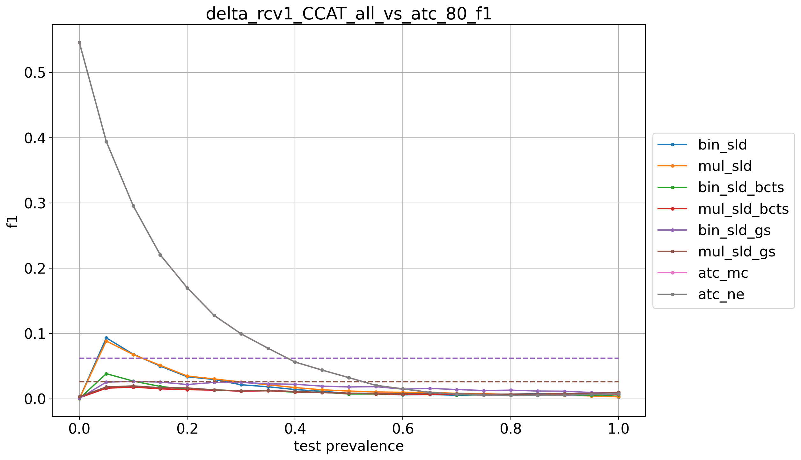
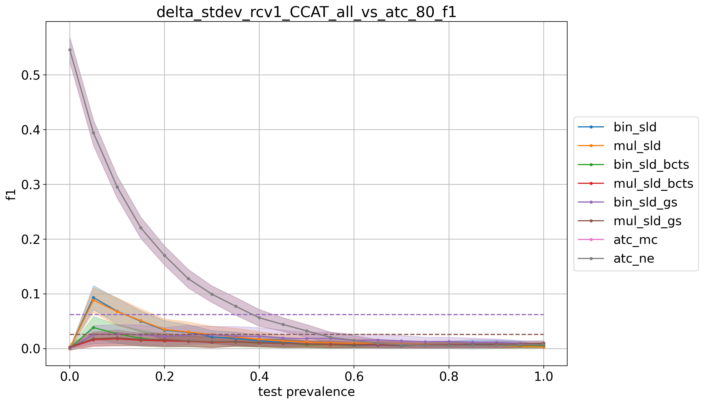
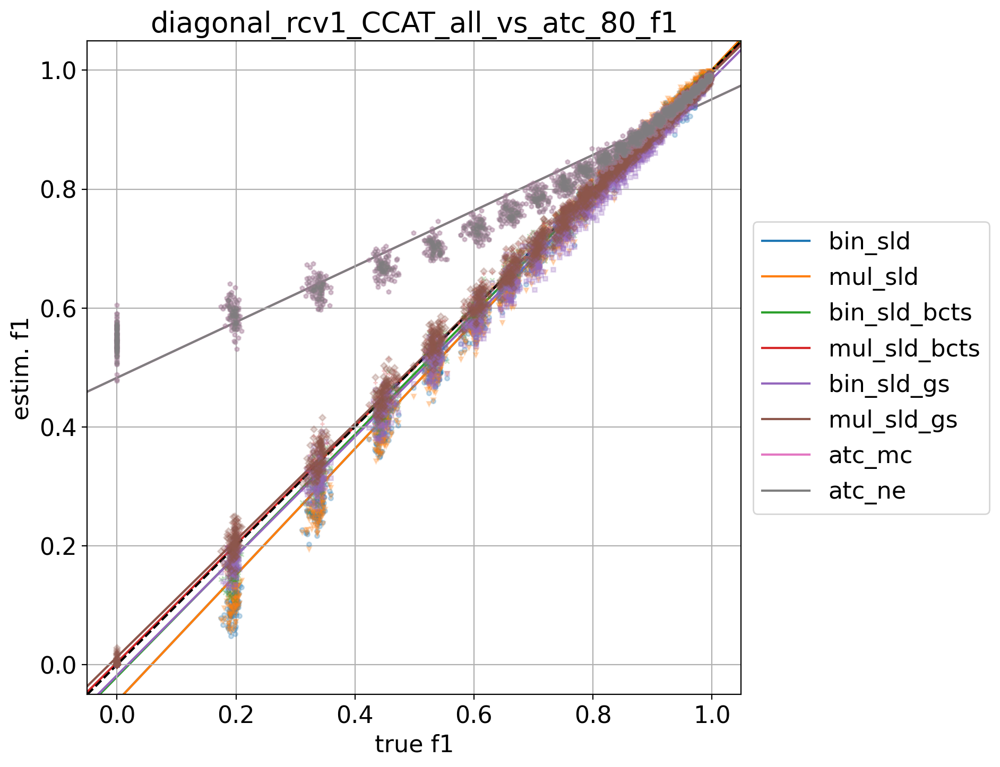
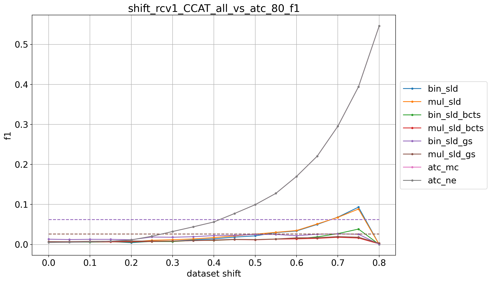

## 70% positives
> train: [0.29989987 0.70010013]  
> validation: [0.30006676 0.69993324]  
> bin_sld: 225.630s  
> mul_sld: 71.930s  
> bin_sld_bcts: 223.728s  
> mul_sld_bcts: 76.593s  
> bin_sld_gs: 431.047s  
> mul_sld_gs: 291.843s  
> kfcv: 51.915s  
> ref: 49.281s  
> atc_mc: 51.662s  
> atc_ne: 51.127s  
> doc_feat: 43.648s  
> tot: 436.749s  

<table border="1" class="dataframe">
  <thead>
    <tr style="text-align: right;">
      <th></th>
      <th>bin_sld</th>
      <th>mul_sld</th>
      <th>bin_sld_bcts</th>
      <th>mul_sld_bcts</th>
      <th>bin_sld_gs</th>
      <th>mul_sld_gs</th>
      <th>atc_mc</th>
      <th>atc_ne</th>
    </tr>
  </thead>
  <tbody>
    <tr>
      <th>0.0</th>
      <td>0.0001</td>
      <td>0.0000</td>
      <td>0.0002</td>
      <td>0.0018</td>
      <td>0.0002</td>
      <td>0.0252</td>
      <td>0.5749</td>
      <td>0.5749</td>
    </tr>
    <tr>
      <th>0.05</th>
      <td>0.1119</td>
      <td>0.0927</td>
      <td>0.0554</td>
      <td>0.0270</td>
      <td>0.0855</td>
      <td>0.0261</td>
      <td>0.3336</td>
      <td>0.3336</td>
    </tr>
    <tr>
      <th>0.1</th>
      <td>0.0743</td>
      <td>0.0592</td>
      <td>0.0411</td>
      <td>0.0251</td>
      <td>0.0659</td>
      <td>0.0215</td>
      <td>0.2163</td>
      <td>0.2163</td>
    </tr>
    <tr>
      <th>0.15</th>
      <td>0.0513</td>
      <td>0.0367</td>
      <td>0.0332</td>
      <td>0.0207</td>
      <td>0.0488</td>
      <td>0.0213</td>
      <td>0.1450</td>
      <td>0.1450</td>
    </tr>
    <tr>
      <th>0.2</th>
      <td>0.0324</td>
      <td>0.0230</td>
      <td>0.0233</td>
      <td>0.0157</td>
      <td>0.0335</td>
      <td>0.0175</td>
      <td>0.1055</td>
      <td>0.1055</td>
    </tr>
    <tr>
      <th>0.25</th>
      <td>0.0266</td>
      <td>0.0205</td>
      <td>0.0226</td>
      <td>0.0168</td>
      <td>0.0288</td>
      <td>0.0214</td>
      <td>0.0703</td>
      <td>0.0703</td>
    </tr>
    <tr>
      <th>0.3</th>
      <td>0.0190</td>
      <td>0.0169</td>
      <td>0.0199</td>
      <td>0.0145</td>
      <td>0.0245</td>
      <td>0.0209</td>
      <td>0.0549</td>
      <td>0.0549</td>
    </tr>
    <tr>
      <th>0.35</th>
      <td>0.0175</td>
      <td>0.0160</td>
      <td>0.0179</td>
      <td>0.0148</td>
      <td>0.0212</td>
      <td>0.0216</td>
      <td>0.0403</td>
      <td>0.0403</td>
    </tr>
    <tr>
      <th>0.4</th>
      <td>0.0124</td>
      <td>0.0149</td>
      <td>0.0164</td>
      <td>0.0139</td>
      <td>0.0175</td>
      <td>0.0218</td>
      <td>0.0279</td>
      <td>0.0279</td>
    </tr>
    <tr>
      <th>0.45</th>
      <td>0.0105</td>
      <td>0.0135</td>
      <td>0.0145</td>
      <td>0.0118</td>
      <td>0.0154</td>
      <td>0.0203</td>
      <td>0.0225</td>
      <td>0.0225</td>
    </tr>
    <tr>
      <th>0.5</th>
      <td>0.0093</td>
      <td>0.0145</td>
      <td>0.0133</td>
      <td>0.0119</td>
      <td>0.0137</td>
      <td>0.0202</td>
      <td>0.0165</td>
      <td>0.0165</td>
    </tr>
    <tr>
      <th>0.55</th>
      <td>0.0090</td>
      <td>0.0123</td>
      <td>0.0127</td>
      <td>0.0112</td>
      <td>0.0132</td>
      <td>0.0201</td>
      <td>0.0120</td>
      <td>0.0120</td>
    </tr>
    <tr>
      <th>0.6</th>
      <td>0.0095</td>
      <td>0.0138</td>
      <td>0.0097</td>
      <td>0.0085</td>
      <td>0.0089</td>
      <td>0.0173</td>
      <td>0.0095</td>
      <td>0.0095</td>
    </tr>
    <tr>
      <th>0.65</th>
      <td>0.0098</td>
      <td>0.0130</td>
      <td>0.0112</td>
      <td>0.0099</td>
      <td>0.0102</td>
      <td>0.0188</td>
      <td>0.0089</td>
      <td>0.0089</td>
    </tr>
    <tr>
      <th>0.7</th>
      <td>0.0091</td>
      <td>0.0112</td>
      <td>0.0088</td>
      <td>0.0083</td>
      <td>0.0082</td>
      <td>0.0189</td>
      <td>0.0060</td>
      <td>0.0060</td>
    </tr>
    <tr>
      <th>0.75</th>
      <td>0.0093</td>
      <td>0.0102</td>
      <td>0.0088</td>
      <td>0.0091</td>
      <td>0.0083</td>
      <td>0.0186</td>
      <td>0.0047</td>
      <td>0.0047</td>
    </tr>
    <tr>
      <th>0.8</th>
      <td>0.0096</td>
      <td>0.0100</td>
      <td>0.0091</td>
      <td>0.0090</td>
      <td>0.0084</td>
      <td>0.0180</td>
      <td>0.0044</td>
      <td>0.0044</td>
    </tr>
    <tr>
      <th>0.85</th>
      <td>0.0086</td>
      <td>0.0085</td>
      <td>0.0091</td>
      <td>0.0094</td>
      <td>0.0075</td>
      <td>0.0177</td>
      <td>0.0045</td>
      <td>0.0045</td>
    </tr>
    <tr>
      <th>0.9</th>
      <td>0.0070</td>
      <td>0.0061</td>
      <td>0.0074</td>
      <td>0.0088</td>
      <td>0.0074</td>
      <td>0.0175</td>
      <td>0.0036</td>
      <td>0.0036</td>
    </tr>
    <tr>
      <th>0.95</th>
      <td>0.0057</td>
      <td>0.0043</td>
      <td>0.0068</td>
      <td>0.0082</td>
      <td>0.0059</td>
      <td>0.0168</td>
      <td>0.0035</td>
      <td>0.0035</td>
    </tr>
    <tr>
      <th>1.0</th>
      <td>0.0026</td>
      <td>0.0031</td>
      <td>0.0066</td>
      <td>0.0091</td>
      <td>0.0077</td>
      <td>0.0169</td>
      <td>0.0032</td>
      <td>0.0032</td>
    </tr>
    <tr>
      <th>tot</th>
      <td>0.0212</td>
      <td>0.0191</td>
      <td>0.0166</td>
      <td>0.0127</td>
      <td>0.0210</td>
      <td>0.0199</td>
      <td>0.0794</td>
      <td>0.0794</td>
    </tr>
  </tbody>
</table>

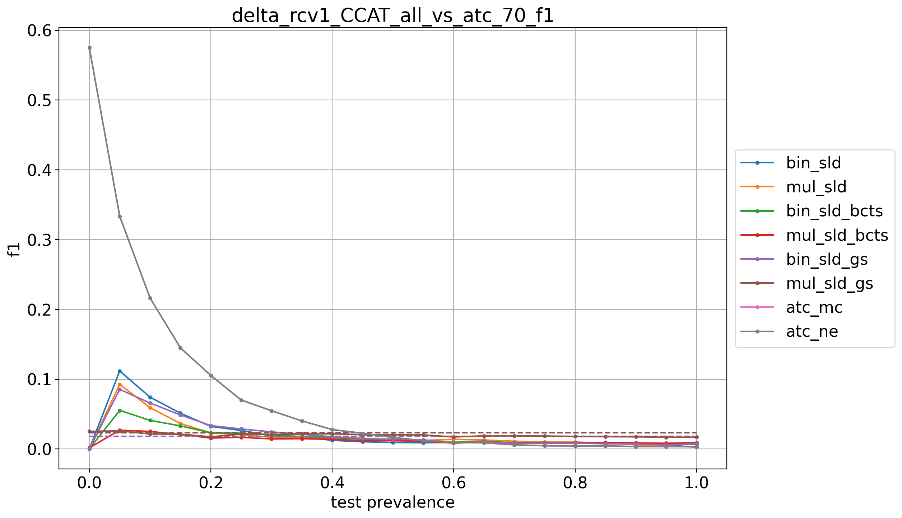
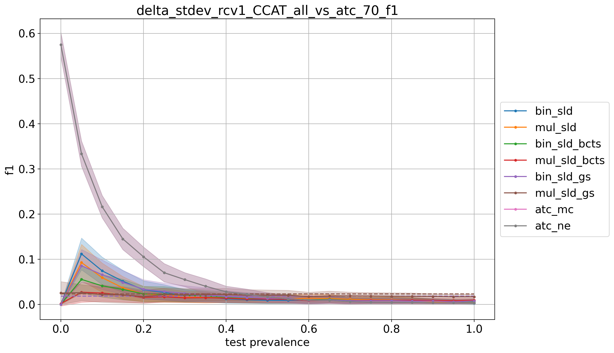
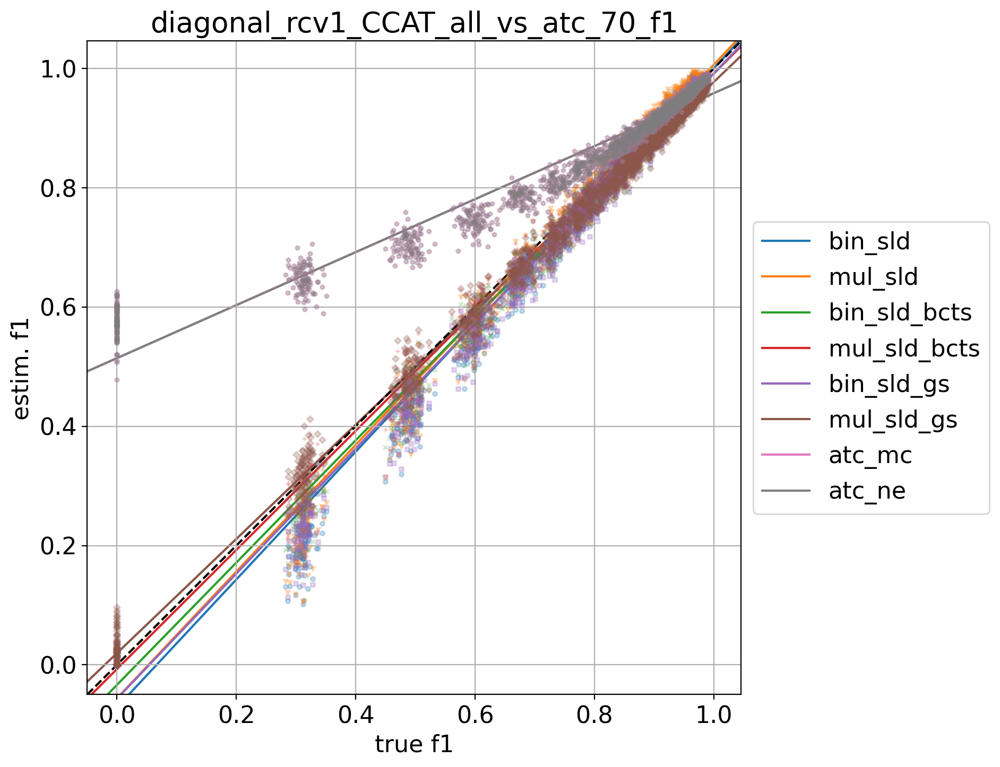
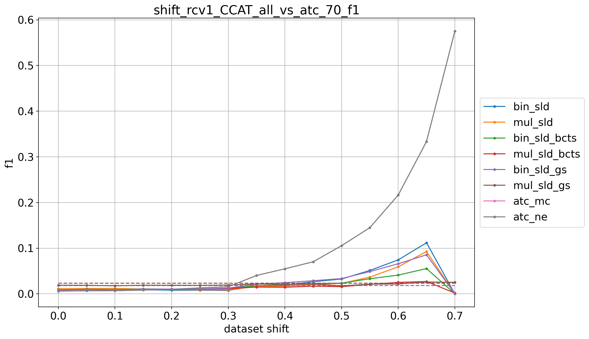

## 60% positives
> train: [0.40003338 0.59996662]  
> validation: [0.40003338 0.59996662]  
> bin_sld: 226.621s  
> mul_sld: 71.844s  
> bin_sld_bcts: 225.379s  
> mul_sld_bcts: 77.086s  
> bin_sld_gs: 471.820s  
> mul_sld_gs: 283.935s  
> kfcv: 51.035s  
> ref: 49.046s  
> atc_mc: 51.951s  
> atc_ne: 51.208s  
> doc_feat: 43.717s  
> tot: 477.247s  

<table border="1" class="dataframe">
  <thead>
    <tr style="text-align: right;">
      <th></th>
      <th>bin_sld</th>
      <th>mul_sld</th>
      <th>bin_sld_bcts</th>
      <th>mul_sld_bcts</th>
      <th>bin_sld_gs</th>
      <th>mul_sld_gs</th>
      <th>atc_mc</th>
      <th>atc_ne</th>
    </tr>
  </thead>
  <tbody>
    <tr>
      <th>0.0</th>
      <td>0.0003</td>
      <td>0.0010</td>
      <td>0.0158</td>
      <td>0.0391</td>
      <td>0.0188</td>
      <td>0.0769</td>
      <td>0.5310</td>
      <td>0.5310</td>
    </tr>
    <tr>
      <th>0.05</th>
      <td>0.0431</td>
      <td>0.0445</td>
      <td>0.0399</td>
      <td>0.0442</td>
      <td>0.0372</td>
      <td>0.0444</td>
      <td>0.2044</td>
      <td>0.2044</td>
    </tr>
    <tr>
      <th>0.1</th>
      <td>0.0250</td>
      <td>0.0411</td>
      <td>0.0315</td>
      <td>0.0313</td>
      <td>0.0287</td>
      <td>0.0289</td>
      <td>0.1045</td>
      <td>0.1045</td>
    </tr>
    <tr>
      <th>0.15</th>
      <td>0.0225</td>
      <td>0.0431</td>
      <td>0.0248</td>
      <td>0.0236</td>
      <td>0.0245</td>
      <td>0.0205</td>
      <td>0.0571</td>
      <td>0.0571</td>
    </tr>
    <tr>
      <th>0.2</th>
      <td>0.0250</td>
      <td>0.0467</td>
      <td>0.0252</td>
      <td>0.0231</td>
      <td>0.0212</td>
      <td>0.0195</td>
      <td>0.0407</td>
      <td>0.0407</td>
    </tr>
    <tr>
      <th>0.25</th>
      <td>0.0255</td>
      <td>0.0442</td>
      <td>0.0195</td>
      <td>0.0181</td>
      <td>0.0178</td>
      <td>0.0152</td>
      <td>0.0228</td>
      <td>0.0228</td>
    </tr>
    <tr>
      <th>0.3</th>
      <td>0.0257</td>
      <td>0.0422</td>
      <td>0.0185</td>
      <td>0.0166</td>
      <td>0.0166</td>
      <td>0.0138</td>
      <td>0.0196</td>
      <td>0.0196</td>
    </tr>
    <tr>
      <th>0.35</th>
      <td>0.0257</td>
      <td>0.0377</td>
      <td>0.0162</td>
      <td>0.0141</td>
      <td>0.0161</td>
      <td>0.0144</td>
      <td>0.0125</td>
      <td>0.0125</td>
    </tr>
    <tr>
      <th>0.4</th>
      <td>0.0268</td>
      <td>0.0373</td>
      <td>0.0151</td>
      <td>0.0135</td>
      <td>0.0138</td>
      <td>0.0138</td>
      <td>0.0100</td>
      <td>0.0100</td>
    </tr>
    <tr>
      <th>0.45</th>
      <td>0.0279</td>
      <td>0.0351</td>
      <td>0.0133</td>
      <td>0.0119</td>
      <td>0.0125</td>
      <td>0.0119</td>
      <td>0.0101</td>
      <td>0.0101</td>
    </tr>
    <tr>
      <th>0.5</th>
      <td>0.0252</td>
      <td>0.0307</td>
      <td>0.0141</td>
      <td>0.0117</td>
      <td>0.0141</td>
      <td>0.0131</td>
      <td>0.0081</td>
      <td>0.0081</td>
    </tr>
    <tr>
      <th>0.55</th>
      <td>0.0247</td>
      <td>0.0280</td>
      <td>0.0100</td>
      <td>0.0090</td>
      <td>0.0104</td>
      <td>0.0108</td>
      <td>0.0076</td>
      <td>0.0076</td>
    </tr>
    <tr>
      <th>0.6</th>
      <td>0.0242</td>
      <td>0.0278</td>
      <td>0.0096</td>
      <td>0.0086</td>
      <td>0.0099</td>
      <td>0.0097</td>
      <td>0.0060</td>
      <td>0.0060</td>
    </tr>
    <tr>
      <th>0.65</th>
      <td>0.0206</td>
      <td>0.0236</td>
      <td>0.0087</td>
      <td>0.0080</td>
      <td>0.0088</td>
      <td>0.0092</td>
      <td>0.0060</td>
      <td>0.0060</td>
    </tr>
    <tr>
      <th>0.7</th>
      <td>0.0167</td>
      <td>0.0187</td>
      <td>0.0090</td>
      <td>0.0082</td>
      <td>0.0101</td>
      <td>0.0121</td>
      <td>0.0055</td>
      <td>0.0055</td>
    </tr>
    <tr>
      <th>0.75</th>
      <td>0.0139</td>
      <td>0.0155</td>
      <td>0.0075</td>
      <td>0.0067</td>
      <td>0.0099</td>
      <td>0.0112</td>
      <td>0.0051</td>
      <td>0.0051</td>
    </tr>
    <tr>
      <th>0.8</th>
      <td>0.0116</td>
      <td>0.0127</td>
      <td>0.0072</td>
      <td>0.0063</td>
      <td>0.0095</td>
      <td>0.0108</td>
      <td>0.0042</td>
      <td>0.0042</td>
    </tr>
    <tr>
      <th>0.85</th>
      <td>0.0076</td>
      <td>0.0090</td>
      <td>0.0068</td>
      <td>0.0061</td>
      <td>0.0098</td>
      <td>0.0111</td>
      <td>0.0042</td>
      <td>0.0042</td>
    </tr>
    <tr>
      <th>0.9</th>
      <td>0.0051</td>
      <td>0.0060</td>
      <td>0.0068</td>
      <td>0.0064</td>
      <td>0.0110</td>
      <td>0.0118</td>
      <td>0.0045</td>
      <td>0.0045</td>
    </tr>
    <tr>
      <th>0.95</th>
      <td>0.0039</td>
      <td>0.0045</td>
      <td>0.0053</td>
      <td>0.0053</td>
      <td>0.0091</td>
      <td>0.0105</td>
      <td>0.0037</td>
      <td>0.0037</td>
    </tr>
    <tr>
      <th>1.0</th>
      <td>0.0007</td>
      <td>0.0025</td>
      <td>0.0047</td>
      <td>0.0071</td>
      <td>0.0102</td>
      <td>0.0121</td>
      <td>0.0034</td>
      <td>0.0034</td>
    </tr>
    <tr>
      <th>tot</th>
      <td>0.0191</td>
      <td>0.0263</td>
      <td>0.0147</td>
      <td>0.0152</td>
      <td>0.0152</td>
      <td>0.0182</td>
      <td>0.0510</td>
      <td>0.0510</td>
    </tr>
  </tbody>
</table>

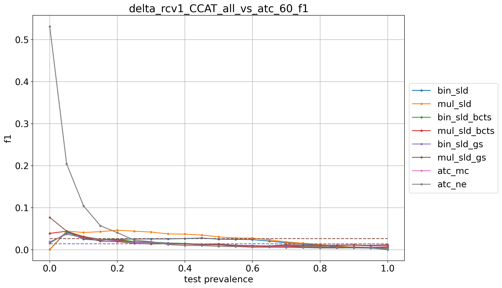
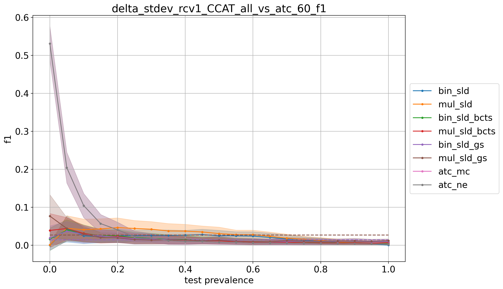
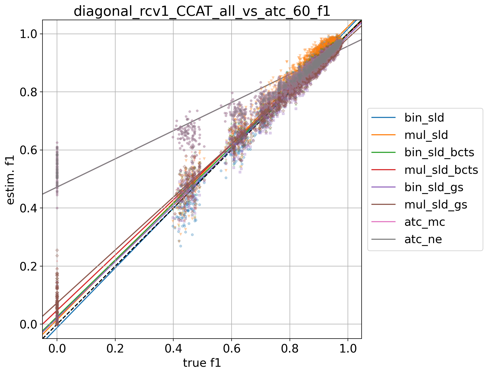
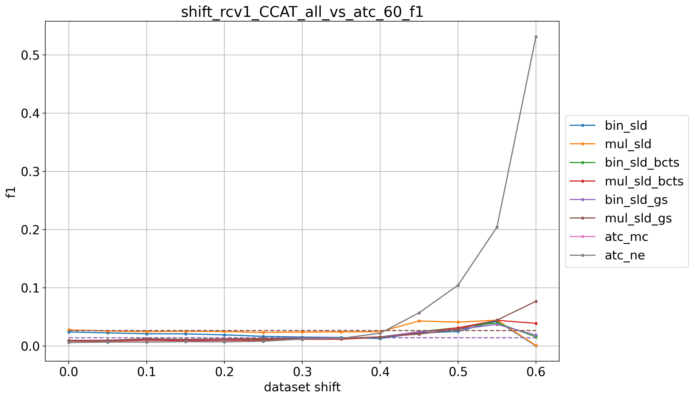

## 50% positives
> train: [0.5 0.5]  
> validation: [0.5 0.5]  
> bin_sld: 223.735s  
> mul_sld: 70.315s  
> bin_sld_bcts: 224.203s  
> mul_sld_bcts: 75.746s  
> bin_sld_gs: 459.866s  
> mul_sld_gs: 285.490s  
> kfcv: 51.093s  
> ref: 48.870s  
> atc_mc: 51.664s  
> atc_ne: 50.999s  
> doc_feat: 43.777s  
> tot: 465.257s  

<table border="1" class="dataframe">
  <thead>
    <tr style="text-align: right;">
      <th></th>
      <th>bin_sld</th>
      <th>mul_sld</th>
      <th>bin_sld_bcts</th>
      <th>mul_sld_bcts</th>
      <th>bin_sld_gs</th>
      <th>mul_sld_gs</th>
      <th>atc_mc</th>
      <th>atc_ne</th>
    </tr>
  </thead>
  <tbody>
    <tr>
      <th>0.0</th>
      <td>0.0003</td>
      <td>0.0015</td>
      <td>0.0105</td>
      <td>0.0147</td>
      <td>0.0223</td>
      <td>0.0019</td>
      <td>0.5135</td>
      <td>0.5135</td>
    </tr>
    <tr>
      <th>0.05</th>
      <td>0.0562</td>
      <td>0.0657</td>
      <td>0.0485</td>
      <td>0.0444</td>
      <td>0.0525</td>
      <td>0.1122</td>
      <td>0.1066</td>
      <td>0.1066</td>
    </tr>
    <tr>
      <th>0.1</th>
      <td>0.0322</td>
      <td>0.0601</td>
      <td>0.0388</td>
      <td>0.0289</td>
      <td>0.0350</td>
      <td>0.0771</td>
      <td>0.0476</td>
      <td>0.0476</td>
    </tr>
    <tr>
      <th>0.15</th>
      <td>0.0417</td>
      <td>0.0691</td>
      <td>0.0400</td>
      <td>0.0288</td>
      <td>0.0300</td>
      <td>0.0528</td>
      <td>0.0306</td>
      <td>0.0306</td>
    </tr>
    <tr>
      <th>0.2</th>
      <td>0.0515</td>
      <td>0.0687</td>
      <td>0.0369</td>
      <td>0.0250</td>
      <td>0.0258</td>
      <td>0.0367</td>
      <td>0.0235</td>
      <td>0.0235</td>
    </tr>
    <tr>
      <th>0.25</th>
      <td>0.0554</td>
      <td>0.0679</td>
      <td>0.0337</td>
      <td>0.0234</td>
      <td>0.0197</td>
      <td>0.0300</td>
      <td>0.0158</td>
      <td>0.0158</td>
    </tr>
    <tr>
      <th>0.3</th>
      <td>0.0505</td>
      <td>0.0594</td>
      <td>0.0280</td>
      <td>0.0216</td>
      <td>0.0197</td>
      <td>0.0257</td>
      <td>0.0147</td>
      <td>0.0147</td>
    </tr>
    <tr>
      <th>0.35</th>
      <td>0.0498</td>
      <td>0.0542</td>
      <td>0.0258</td>
      <td>0.0204</td>
      <td>0.0190</td>
      <td>0.0221</td>
      <td>0.0151</td>
      <td>0.0151</td>
    </tr>
    <tr>
      <th>0.4</th>
      <td>0.0459</td>
      <td>0.0496</td>
      <td>0.0225</td>
      <td>0.0185</td>
      <td>0.0151</td>
      <td>0.0180</td>
      <td>0.0105</td>
      <td>0.0105</td>
    </tr>
    <tr>
      <th>0.45</th>
      <td>0.0420</td>
      <td>0.0447</td>
      <td>0.0195</td>
      <td>0.0166</td>
      <td>0.0133</td>
      <td>0.0158</td>
      <td>0.0119</td>
      <td>0.0119</td>
    </tr>
    <tr>
      <th>0.5</th>
      <td>0.0378</td>
      <td>0.0395</td>
      <td>0.0169</td>
      <td>0.0146</td>
      <td>0.0118</td>
      <td>0.0151</td>
      <td>0.0115</td>
      <td>0.0115</td>
    </tr>
    <tr>
      <th>0.55</th>
      <td>0.0337</td>
      <td>0.0363</td>
      <td>0.0153</td>
      <td>0.0132</td>
      <td>0.0094</td>
      <td>0.0109</td>
      <td>0.0105</td>
      <td>0.0105</td>
    </tr>
    <tr>
      <th>0.6</th>
      <td>0.0303</td>
      <td>0.0318</td>
      <td>0.0154</td>
      <td>0.0133</td>
      <td>0.0100</td>
      <td>0.0121</td>
      <td>0.0107</td>
      <td>0.0107</td>
    </tr>
    <tr>
      <th>0.65</th>
      <td>0.0249</td>
      <td>0.0269</td>
      <td>0.0137</td>
      <td>0.0124</td>
      <td>0.0099</td>
      <td>0.0094</td>
      <td>0.0114</td>
      <td>0.0114</td>
    </tr>
    <tr>
      <th>0.7</th>
      <td>0.0173</td>
      <td>0.0213</td>
      <td>0.0117</td>
      <td>0.0105</td>
      <td>0.0099</td>
      <td>0.0086</td>
      <td>0.0103</td>
      <td>0.0103</td>
    </tr>
    <tr>
      <th>0.75</th>
      <td>0.0136</td>
      <td>0.0170</td>
      <td>0.0102</td>
      <td>0.0091</td>
      <td>0.0084</td>
      <td>0.0083</td>
      <td>0.0097</td>
      <td>0.0097</td>
    </tr>
    <tr>
      <th>0.8</th>
      <td>0.0092</td>
      <td>0.0129</td>
      <td>0.0086</td>
      <td>0.0076</td>
      <td>0.0079</td>
      <td>0.0079</td>
      <td>0.0117</td>
      <td>0.0117</td>
    </tr>
    <tr>
      <th>0.85</th>
      <td>0.0062</td>
      <td>0.0090</td>
      <td>0.0063</td>
      <td>0.0059</td>
      <td>0.0064</td>
      <td>0.0059</td>
      <td>0.0104</td>
      <td>0.0104</td>
    </tr>
    <tr>
      <th>0.9</th>
      <td>0.0045</td>
      <td>0.0070</td>
      <td>0.0060</td>
      <td>0.0055</td>
      <td>0.0064</td>
      <td>0.0065</td>
      <td>0.0117</td>
      <td>0.0117</td>
    </tr>
    <tr>
      <th>0.95</th>
      <td>0.0038</td>
      <td>0.0046</td>
      <td>0.0038</td>
      <td>0.0039</td>
      <td>0.0052</td>
      <td>0.0049</td>
      <td>0.0117</td>
      <td>0.0117</td>
    </tr>
    <tr>
      <th>1.0</th>
      <td>0.0002</td>
      <td>0.0019</td>
      <td>0.0021</td>
      <td>0.0053</td>
      <td>0.0047</td>
      <td>0.0043</td>
      <td>0.0128</td>
      <td>0.0128</td>
    </tr>
    <tr>
      <th>tot</th>
      <td>0.0289</td>
      <td>0.0357</td>
      <td>0.0197</td>
      <td>0.0164</td>
      <td>0.0163</td>
      <td>0.0231</td>
      <td>0.0434</td>
      <td>0.0434</td>
    </tr>
  </tbody>
</table>

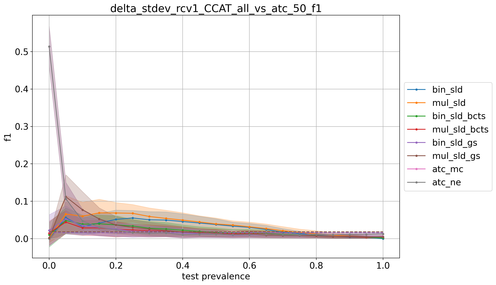
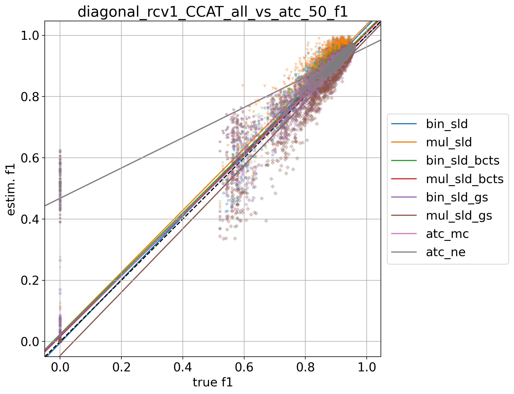
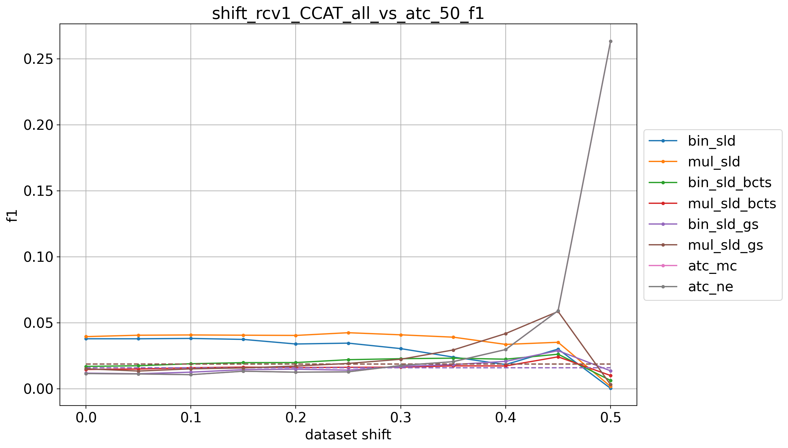

## 40% positives
> train: [0.59996662 0.40003338]  
> validation: [0.59996662 0.40003338]  
> bin_sld: 220.011s  
> mul_sld: 68.308s  
> bin_sld_bcts: 222.232s  
> mul_sld_bcts: 74.741s  
> bin_sld_gs: 463.188s  
> mul_sld_gs: 286.703s  
> kfcv: 50.329s  
> ref: 48.512s  
> atc_mc: 51.494s  
> atc_ne: 51.091s  
> doc_feat: 43.512s  
> tot: 468.313s  

<table border="1" class="dataframe">
  <thead>
    <tr style="text-align: right;">
      <th></th>
      <th>bin_sld</th>
      <th>mul_sld</th>
      <th>bin_sld_bcts</th>
      <th>mul_sld_bcts</th>
      <th>bin_sld_gs</th>
      <th>mul_sld_gs</th>
      <th>atc_mc</th>
      <th>atc_ne</th>
    </tr>
  </thead>
  <tbody>
    <tr>
      <th>0.0</th>
      <td>0.0002</td>
      <td>0.0082</td>
      <td>0.0125</td>
      <td>0.0146</td>
      <td>0.0135</td>
      <td>0.0064</td>
      <td>0.3564</td>
      <td>0.3564</td>
    </tr>
    <tr>
      <th>0.05</th>
      <td>0.0686</td>
      <td>0.1237</td>
      <td>0.0583</td>
      <td>0.0489</td>
      <td>0.0575</td>
      <td>0.2227</td>
      <td>0.0506</td>
      <td>0.0506</td>
    </tr>
    <tr>
      <th>0.1</th>
      <td>0.0857</td>
      <td>0.1167</td>
      <td>0.0497</td>
      <td>0.0329</td>
      <td>0.0408</td>
      <td>0.1706</td>
      <td>0.0460</td>
      <td>0.0460</td>
    </tr>
    <tr>
      <th>0.15</th>
      <td>0.1039</td>
      <td>0.1138</td>
      <td>0.0497</td>
      <td>0.0358</td>
      <td>0.0399</td>
      <td>0.1271</td>
      <td>0.0318</td>
      <td>0.0318</td>
    </tr>
    <tr>
      <th>0.2</th>
      <td>0.1048</td>
      <td>0.1060</td>
      <td>0.0453</td>
      <td>0.0358</td>
      <td>0.0378</td>
      <td>0.0991</td>
      <td>0.0254</td>
      <td>0.0254</td>
    </tr>
    <tr>
      <th>0.25</th>
      <td>0.0950</td>
      <td>0.0996</td>
      <td>0.0453</td>
      <td>0.0375</td>
      <td>0.0399</td>
      <td>0.0801</td>
      <td>0.0197</td>
      <td>0.0197</td>
    </tr>
    <tr>
      <th>0.3</th>
      <td>0.0766</td>
      <td>0.0871</td>
      <td>0.0371</td>
      <td>0.0326</td>
      <td>0.0324</td>
      <td>0.0699</td>
      <td>0.0174</td>
      <td>0.0174</td>
    </tr>
    <tr>
      <th>0.35</th>
      <td>0.0668</td>
      <td>0.0773</td>
      <td>0.0337</td>
      <td>0.0312</td>
      <td>0.0300</td>
      <td>0.0623</td>
      <td>0.0129</td>
      <td>0.0129</td>
    </tr>
    <tr>
      <th>0.4</th>
      <td>0.0541</td>
      <td>0.0706</td>
      <td>0.0316</td>
      <td>0.0301</td>
      <td>0.0282</td>
      <td>0.0523</td>
      <td>0.0118</td>
      <td>0.0118</td>
    </tr>
    <tr>
      <th>0.45</th>
      <td>0.0441</td>
      <td>0.0608</td>
      <td>0.0265</td>
      <td>0.0263</td>
      <td>0.0250</td>
      <td>0.0483</td>
      <td>0.0095</td>
      <td>0.0095</td>
    </tr>
    <tr>
      <th>0.5</th>
      <td>0.0363</td>
      <td>0.0545</td>
      <td>0.0256</td>
      <td>0.0253</td>
      <td>0.0235</td>
      <td>0.0414</td>
      <td>0.0088</td>
      <td>0.0088</td>
    </tr>
    <tr>
      <th>0.55</th>
      <td>0.0306</td>
      <td>0.0496</td>
      <td>0.0230</td>
      <td>0.0244</td>
      <td>0.0217</td>
      <td>0.0366</td>
      <td>0.0085</td>
      <td>0.0085</td>
    </tr>
    <tr>
      <th>0.6</th>
      <td>0.0251</td>
      <td>0.0434</td>
      <td>0.0214</td>
      <td>0.0228</td>
      <td>0.0200</td>
      <td>0.0308</td>
      <td>0.0078</td>
      <td>0.0078</td>
    </tr>
    <tr>
      <th>0.65</th>
      <td>0.0202</td>
      <td>0.0375</td>
      <td>0.0190</td>
      <td>0.0211</td>
      <td>0.0179</td>
      <td>0.0273</td>
      <td>0.0093</td>
      <td>0.0093</td>
    </tr>
    <tr>
      <th>0.7</th>
      <td>0.0155</td>
      <td>0.0310</td>
      <td>0.0160</td>
      <td>0.0187</td>
      <td>0.0153</td>
      <td>0.0253</td>
      <td>0.0090</td>
      <td>0.0090</td>
    </tr>
    <tr>
      <th>0.75</th>
      <td>0.0116</td>
      <td>0.0240</td>
      <td>0.0137</td>
      <td>0.0151</td>
      <td>0.0131</td>
      <td>0.0233</td>
      <td>0.0075</td>
      <td>0.0075</td>
    </tr>
    <tr>
      <th>0.8</th>
      <td>0.0089</td>
      <td>0.0206</td>
      <td>0.0124</td>
      <td>0.0146</td>
      <td>0.0121</td>
      <td>0.0193</td>
      <td>0.0066</td>
      <td>0.0066</td>
    </tr>
    <tr>
      <th>0.85</th>
      <td>0.0061</td>
      <td>0.0162</td>
      <td>0.0100</td>
      <td>0.0129</td>
      <td>0.0099</td>
      <td>0.0166</td>
      <td>0.0084</td>
      <td>0.0084</td>
    </tr>
    <tr>
      <th>0.9</th>
      <td>0.0040</td>
      <td>0.0103</td>
      <td>0.0076</td>
      <td>0.0093</td>
      <td>0.0077</td>
      <td>0.0161</td>
      <td>0.0078</td>
      <td>0.0078</td>
    </tr>
    <tr>
      <th>0.95</th>
      <td>0.0033</td>
      <td>0.0073</td>
      <td>0.0054</td>
      <td>0.0077</td>
      <td>0.0057</td>
      <td>0.0108</td>
      <td>0.0097</td>
      <td>0.0097</td>
    </tr>
    <tr>
      <th>1.0</th>
      <td>0.0002</td>
      <td>0.0032</td>
      <td>0.0017</td>
      <td>0.0035</td>
      <td>0.0020</td>
      <td>0.0094</td>
      <td>0.0090</td>
      <td>0.0090</td>
    </tr>
    <tr>
      <th>tot</th>
      <td>0.0410</td>
      <td>0.0553</td>
      <td>0.0260</td>
      <td>0.0238</td>
      <td>0.0235</td>
      <td>0.0569</td>
      <td>0.0321</td>
      <td>0.0321</td>
    </tr>
  </tbody>
</table>

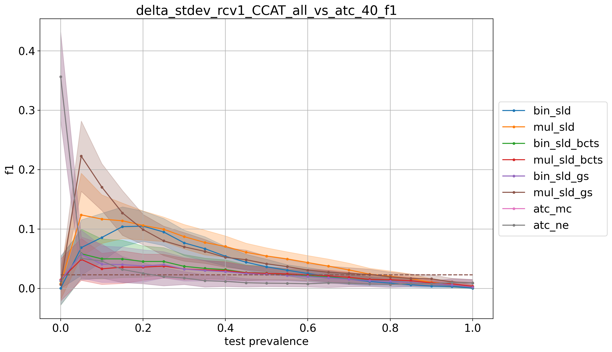
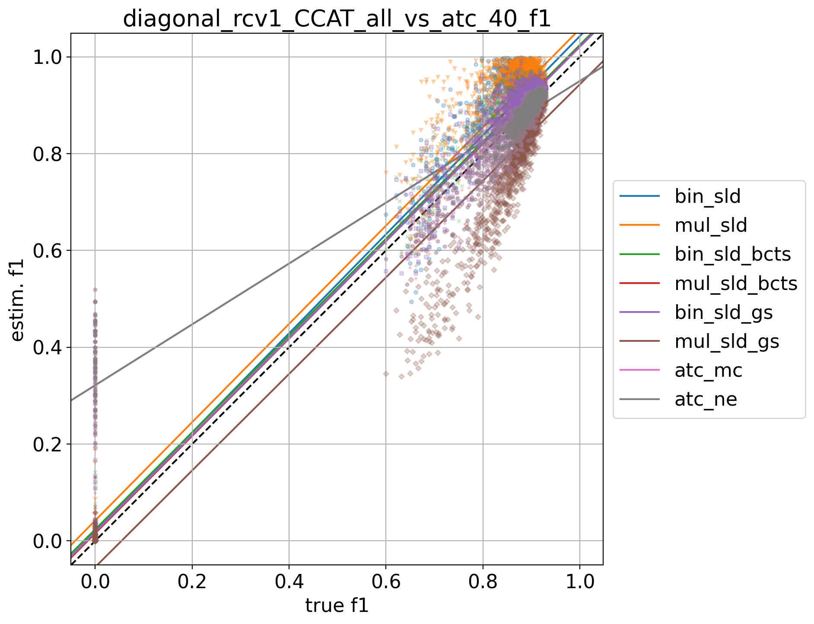
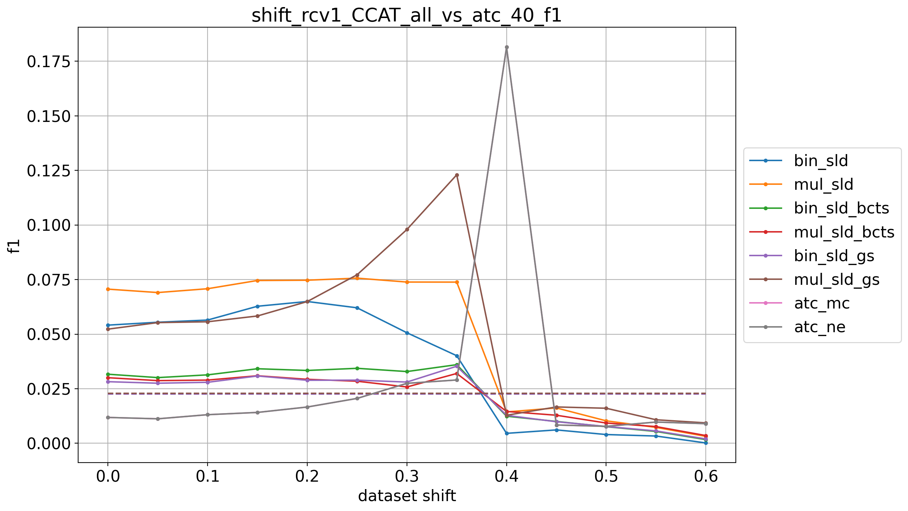

## 30% positives
> train: [0.69993324 0.30006676]  
> validation: [0.70010013 0.29989987]  
> bin_sld: 241.690s  
> mul_sld: 76.036s  
> bin_sld_bcts: 241.023s  
> mul_sld_bcts: 81.654s  
> bin_sld_gs: 468.354s  
> mul_sld_gs: 303.186s  
> kfcv: 56.346s  
> ref: 53.070s  
> atc_mc: 56.339s  
> atc_ne: 55.112s  
> doc_feat: 46.850s  
> tot: 474.244s  

<table border="1" class="dataframe">
  <thead>
    <tr style="text-align: right;">
      <th></th>
      <th>bin_sld</th>
      <th>mul_sld</th>
      <th>bin_sld_bcts</th>
      <th>mul_sld_bcts</th>
      <th>bin_sld_gs</th>
      <th>mul_sld_gs</th>
      <th>atc_mc</th>
      <th>atc_ne</th>
    </tr>
  </thead>
  <tbody>
    <tr>
      <th>0.0</th>
      <td>0.0002</td>
      <td>0.0303</td>
      <td>0.0542</td>
      <td>0.0193</td>
      <td>0.0416</td>
      <td>0.0466</td>
      <td>0.3301</td>
      <td>0.3301</td>
    </tr>
    <tr>
      <th>0.05</th>
      <td>0.0936</td>
      <td>0.1107</td>
      <td>0.0564</td>
      <td>0.0612</td>
      <td>0.0791</td>
      <td>0.0640</td>
      <td>0.0519</td>
      <td>0.0519</td>
    </tr>
    <tr>
      <th>0.1</th>
      <td>0.0956</td>
      <td>0.1038</td>
      <td>0.0383</td>
      <td>0.0341</td>
      <td>0.0618</td>
      <td>0.0461</td>
      <td>0.0306</td>
      <td>0.0306</td>
    </tr>
    <tr>
      <th>0.15</th>
      <td>0.0815</td>
      <td>0.0995</td>
      <td>0.0306</td>
      <td>0.0287</td>
      <td>0.0377</td>
      <td>0.0347</td>
      <td>0.0252</td>
      <td>0.0252</td>
    </tr>
    <tr>
      <th>0.2</th>
      <td>0.0648</td>
      <td>0.0897</td>
      <td>0.0263</td>
      <td>0.0275</td>
      <td>0.0277</td>
      <td>0.0296</td>
      <td>0.0190</td>
      <td>0.0190</td>
    </tr>
    <tr>
      <th>0.25</th>
      <td>0.0546</td>
      <td>0.0818</td>
      <td>0.0237</td>
      <td>0.0269</td>
      <td>0.0193</td>
      <td>0.0278</td>
      <td>0.0167</td>
      <td>0.0167</td>
    </tr>
    <tr>
      <th>0.3</th>
      <td>0.0418</td>
      <td>0.0671</td>
      <td>0.0187</td>
      <td>0.0232</td>
      <td>0.0169</td>
      <td>0.0257</td>
      <td>0.0132</td>
      <td>0.0132</td>
    </tr>
    <tr>
      <th>0.35</th>
      <td>0.0342</td>
      <td>0.0568</td>
      <td>0.0189</td>
      <td>0.0224</td>
      <td>0.0141</td>
      <td>0.0206</td>
      <td>0.0170</td>
      <td>0.0170</td>
    </tr>
    <tr>
      <th>0.4</th>
      <td>0.0299</td>
      <td>0.0515</td>
      <td>0.0177</td>
      <td>0.0228</td>
      <td>0.0115</td>
      <td>0.0211</td>
      <td>0.0141</td>
      <td>0.0141</td>
    </tr>
    <tr>
      <th>0.45</th>
      <td>0.0231</td>
      <td>0.0449</td>
      <td>0.0151</td>
      <td>0.0210</td>
      <td>0.0095</td>
      <td>0.0185</td>
      <td>0.0135</td>
      <td>0.0135</td>
    </tr>
    <tr>
      <th>0.5</th>
      <td>0.0199</td>
      <td>0.0393</td>
      <td>0.0141</td>
      <td>0.0200</td>
      <td>0.0076</td>
      <td>0.0167</td>
      <td>0.0153</td>
      <td>0.0153</td>
    </tr>
    <tr>
      <th>0.55</th>
      <td>0.0176</td>
      <td>0.0362</td>
      <td>0.0135</td>
      <td>0.0204</td>
      <td>0.0058</td>
      <td>0.0156</td>
      <td>0.0146</td>
      <td>0.0146</td>
    </tr>
    <tr>
      <th>0.6</th>
      <td>0.0129</td>
      <td>0.0306</td>
      <td>0.0107</td>
      <td>0.0183</td>
      <td>0.0068</td>
      <td>0.0153</td>
      <td>0.0142</td>
      <td>0.0142</td>
    </tr>
    <tr>
      <th>0.65</th>
      <td>0.0107</td>
      <td>0.0262</td>
      <td>0.0104</td>
      <td>0.0175</td>
      <td>0.0061</td>
      <td>0.0126</td>
      <td>0.0159</td>
      <td>0.0159</td>
    </tr>
    <tr>
      <th>0.7</th>
      <td>0.0087</td>
      <td>0.0214</td>
      <td>0.0091</td>
      <td>0.0156</td>
      <td>0.0063</td>
      <td>0.0108</td>
      <td>0.0145</td>
      <td>0.0145</td>
    </tr>
    <tr>
      <th>0.75</th>
      <td>0.0065</td>
      <td>0.0166</td>
      <td>0.0078</td>
      <td>0.0134</td>
      <td>0.0059</td>
      <td>0.0093</td>
      <td>0.0144</td>
      <td>0.0144</td>
    </tr>
    <tr>
      <th>0.8</th>
      <td>0.0052</td>
      <td>0.0138</td>
      <td>0.0071</td>
      <td>0.0124</td>
      <td>0.0058</td>
      <td>0.0084</td>
      <td>0.0157</td>
      <td>0.0157</td>
    </tr>
    <tr>
      <th>0.85</th>
      <td>0.0042</td>
      <td>0.0104</td>
      <td>0.0062</td>
      <td>0.0109</td>
      <td>0.0060</td>
      <td>0.0074</td>
      <td>0.0168</td>
      <td>0.0168</td>
    </tr>
    <tr>
      <th>0.9</th>
      <td>0.0042</td>
      <td>0.0076</td>
      <td>0.0054</td>
      <td>0.0086</td>
      <td>0.0056</td>
      <td>0.0063</td>
      <td>0.0155</td>
      <td>0.0155</td>
    </tr>
    <tr>
      <th>0.95</th>
      <td>0.0045</td>
      <td>0.0059</td>
      <td>0.0050</td>
      <td>0.0070</td>
      <td>0.0061</td>
      <td>0.0065</td>
      <td>0.0152</td>
      <td>0.0152</td>
    </tr>
    <tr>
      <th>1.0</th>
      <td>0.0002</td>
      <td>0.0045</td>
      <td>0.0037</td>
      <td>0.0040</td>
      <td>0.0045</td>
      <td>0.0058</td>
      <td>0.0177</td>
      <td>0.0177</td>
    </tr>
    <tr>
      <th>tot</th>
      <td>0.0292</td>
      <td>0.0452</td>
      <td>0.0187</td>
      <td>0.0207</td>
      <td>0.0184</td>
      <td>0.0214</td>
      <td>0.0334</td>
      <td>0.0334</td>
    </tr>
  </tbody>
</table>

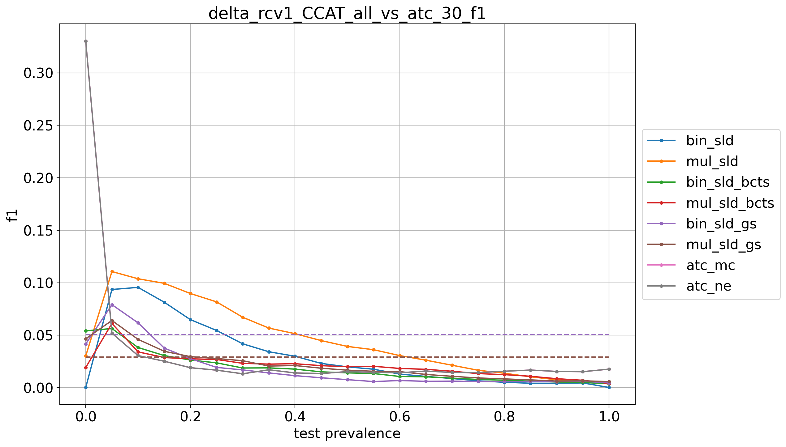
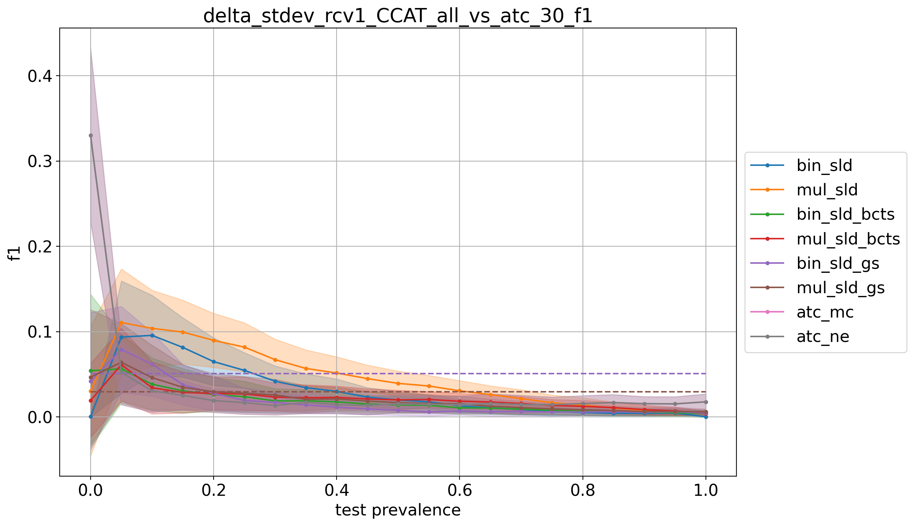
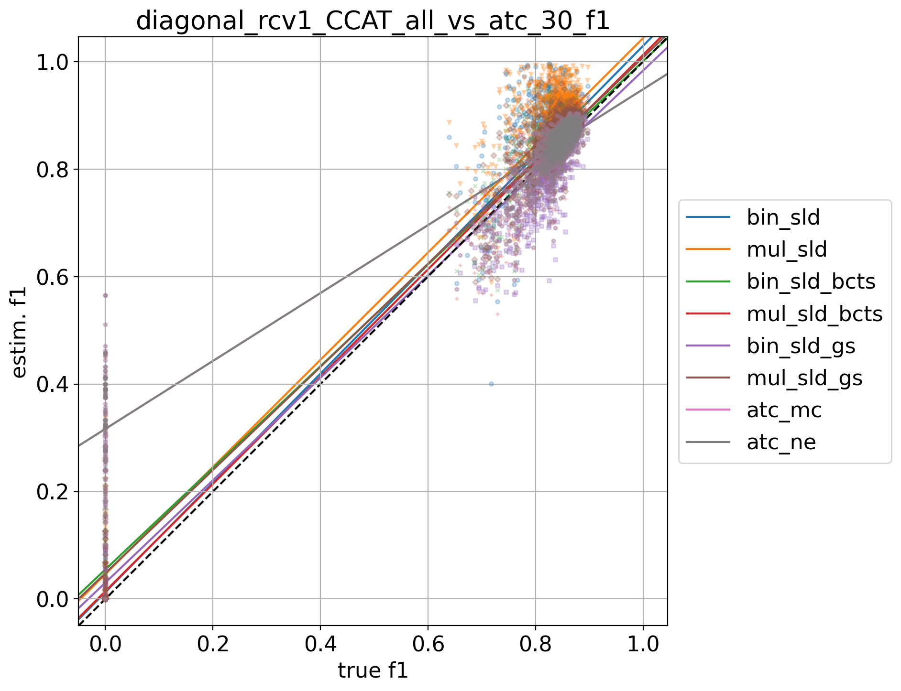
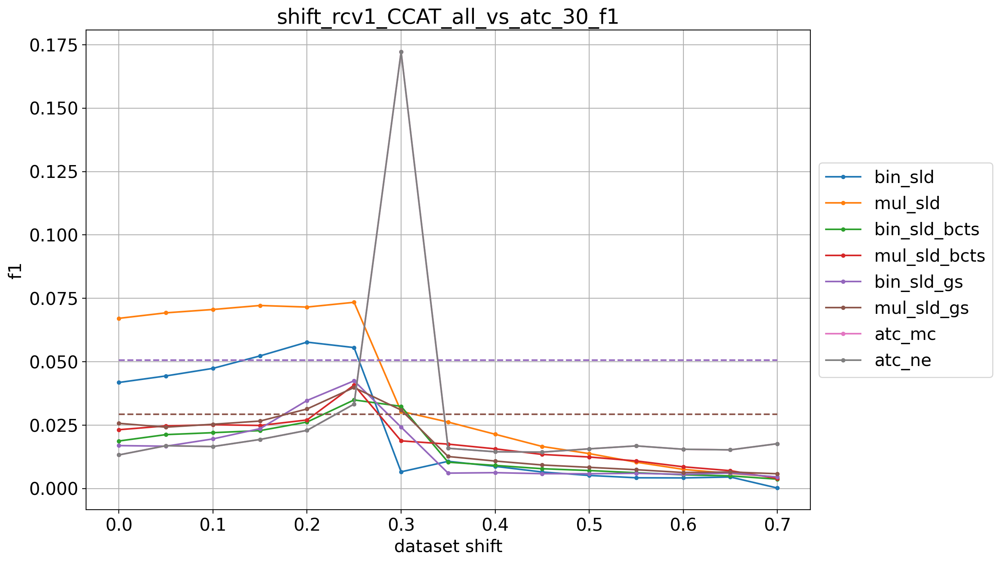

## 20% positives
> train: [0.79989987 0.20010013]  
> validation: [0.80006676 0.19993324]  
> bin_sld: 249.327s  
> mul_sld: 79.485s  
> bin_sld_bcts: 248.816s  
> mul_sld_bcts: 83.568s  
> bin_sld_gs: 471.330s  
> mul_sld_gs: 282.407s  
> kfcv: 59.365s  
> ref: 56.664s  
> atc_mc: 58.956s  
> atc_ne: 57.529s  
> doc_feat: 49.376s  
> tot: 478.051s  

<table border="1" class="dataframe">
  <thead>
    <tr style="text-align: right;">
      <th></th>
      <th>bin_sld</th>
      <th>mul_sld</th>
      <th>bin_sld_bcts</th>
      <th>mul_sld_bcts</th>
      <th>bin_sld_gs</th>
      <th>mul_sld_gs</th>
      <th>atc_mc</th>
      <th>atc_ne</th>
    </tr>
  </thead>
  <tbody>
    <tr>
      <th>0.0</th>
      <td>0.0003</td>
      <td>0.1710</td>
      <td>0.0141</td>
      <td>0.0772</td>
      <td>0.0054</td>
      <td>0.0277</td>
      <td>0.1159</td>
      <td>0.1159</td>
    </tr>
    <tr>
      <th>0.05</th>
      <td>0.1241</td>
      <td>0.1318</td>
      <td>0.0644</td>
      <td>0.0569</td>
      <td>0.0798</td>
      <td>0.0963</td>
      <td>0.1303</td>
      <td>0.1303</td>
    </tr>
    <tr>
      <th>0.1</th>
      <td>0.0622</td>
      <td>0.0908</td>
      <td>0.0397</td>
      <td>0.0349</td>
      <td>0.0515</td>
      <td>0.0562</td>
      <td>0.0916</td>
      <td>0.0916</td>
    </tr>
    <tr>
      <th>0.15</th>
      <td>0.0390</td>
      <td>0.0631</td>
      <td>0.0331</td>
      <td>0.0227</td>
      <td>0.0450</td>
      <td>0.0366</td>
      <td>0.0794</td>
      <td>0.0794</td>
    </tr>
    <tr>
      <th>0.2</th>
      <td>0.0320</td>
      <td>0.0569</td>
      <td>0.0278</td>
      <td>0.0236</td>
      <td>0.0348</td>
      <td>0.0271</td>
      <td>0.0673</td>
      <td>0.0673</td>
    </tr>
    <tr>
      <th>0.25</th>
      <td>0.0213</td>
      <td>0.0485</td>
      <td>0.0205</td>
      <td>0.0213</td>
      <td>0.0275</td>
      <td>0.0205</td>
      <td>0.0623</td>
      <td>0.0623</td>
    </tr>
    <tr>
      <th>0.3</th>
      <td>0.0155</td>
      <td>0.0364</td>
      <td>0.0194</td>
      <td>0.0183</td>
      <td>0.0280</td>
      <td>0.0184</td>
      <td>0.0592</td>
      <td>0.0592</td>
    </tr>
    <tr>
      <th>0.35</th>
      <td>0.0121</td>
      <td>0.0290</td>
      <td>0.0152</td>
      <td>0.0162</td>
      <td>0.0200</td>
      <td>0.0137</td>
      <td>0.0518</td>
      <td>0.0518</td>
    </tr>
    <tr>
      <th>0.4</th>
      <td>0.0115</td>
      <td>0.0244</td>
      <td>0.0152</td>
      <td>0.0160</td>
      <td>0.0212</td>
      <td>0.0132</td>
      <td>0.0536</td>
      <td>0.0536</td>
    </tr>
    <tr>
      <th>0.45</th>
      <td>0.0097</td>
      <td>0.0196</td>
      <td>0.0152</td>
      <td>0.0137</td>
      <td>0.0194</td>
      <td>0.0119</td>
      <td>0.0510</td>
      <td>0.0510</td>
    </tr>
    <tr>
      <th>0.5</th>
      <td>0.0081</td>
      <td>0.0158</td>
      <td>0.0140</td>
      <td>0.0126</td>
      <td>0.0178</td>
      <td>0.0108</td>
      <td>0.0518</td>
      <td>0.0518</td>
    </tr>
    <tr>
      <th>0.55</th>
      <td>0.0077</td>
      <td>0.0139</td>
      <td>0.0124</td>
      <td>0.0127</td>
      <td>0.0151</td>
      <td>0.0094</td>
      <td>0.0533</td>
      <td>0.0533</td>
    </tr>
    <tr>
      <th>0.6</th>
      <td>0.0084</td>
      <td>0.0112</td>
      <td>0.0125</td>
      <td>0.0105</td>
      <td>0.0142</td>
      <td>0.0085</td>
      <td>0.0506</td>
      <td>0.0506</td>
    </tr>
    <tr>
      <th>0.65</th>
      <td>0.0087</td>
      <td>0.0098</td>
      <td>0.0135</td>
      <td>0.0100</td>
      <td>0.0172</td>
      <td>0.0087</td>
      <td>0.0480</td>
      <td>0.0480</td>
    </tr>
    <tr>
      <th>0.7</th>
      <td>0.0094</td>
      <td>0.0106</td>
      <td>0.0110</td>
      <td>0.0105</td>
      <td>0.0135</td>
      <td>0.0082</td>
      <td>0.0453</td>
      <td>0.0453</td>
    </tr>
    <tr>
      <th>0.75</th>
      <td>0.0104</td>
      <td>0.0101</td>
      <td>0.0121</td>
      <td>0.0090</td>
      <td>0.0145</td>
      <td>0.0076</td>
      <td>0.0428</td>
      <td>0.0428</td>
    </tr>
    <tr>
      <th>0.8</th>
      <td>0.0124</td>
      <td>0.0099</td>
      <td>0.0115</td>
      <td>0.0077</td>
      <td>0.0130</td>
      <td>0.0066</td>
      <td>0.0472</td>
      <td>0.0472</td>
    </tr>
    <tr>
      <th>0.85</th>
      <td>0.0134</td>
      <td>0.0105</td>
      <td>0.0131</td>
      <td>0.0068</td>
      <td>0.0163</td>
      <td>0.0065</td>
      <td>0.0461</td>
      <td>0.0461</td>
    </tr>
    <tr>
      <th>0.9</th>
      <td>0.0146</td>
      <td>0.0111</td>
      <td>0.0133</td>
      <td>0.0067</td>
      <td>0.0125</td>
      <td>0.0066</td>
      <td>0.0439</td>
      <td>0.0439</td>
    </tr>
    <tr>
      <th>0.95</th>
      <td>0.0146</td>
      <td>0.0108</td>
      <td>0.0133</td>
      <td>0.0059</td>
      <td>0.0137</td>
      <td>0.0063</td>
      <td>0.0468</td>
      <td>0.0468</td>
    </tr>
    <tr>
      <th>1.0</th>
      <td>0.0008</td>
      <td>0.0063</td>
      <td>0.0093</td>
      <td>0.0041</td>
      <td>0.0110</td>
      <td>0.0063</td>
      <td>0.0425</td>
      <td>0.0425</td>
    </tr>
    <tr>
      <th>tot</th>
      <td>0.0208</td>
      <td>0.0377</td>
      <td>0.0191</td>
      <td>0.0189</td>
      <td>0.0234</td>
      <td>0.0194</td>
      <td>0.0610</td>
      <td>0.0610</td>
    </tr>
  </tbody>
</table>

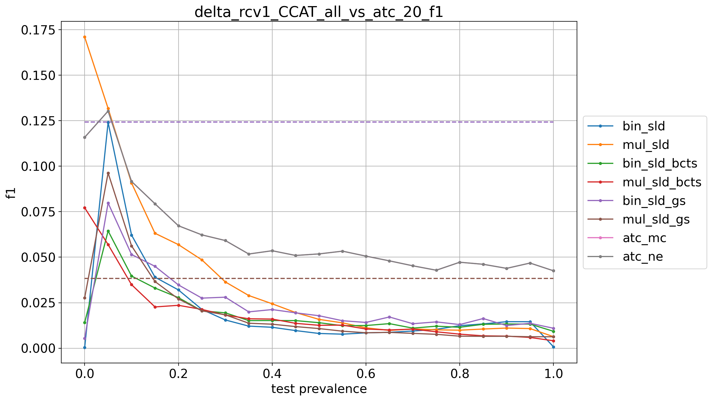
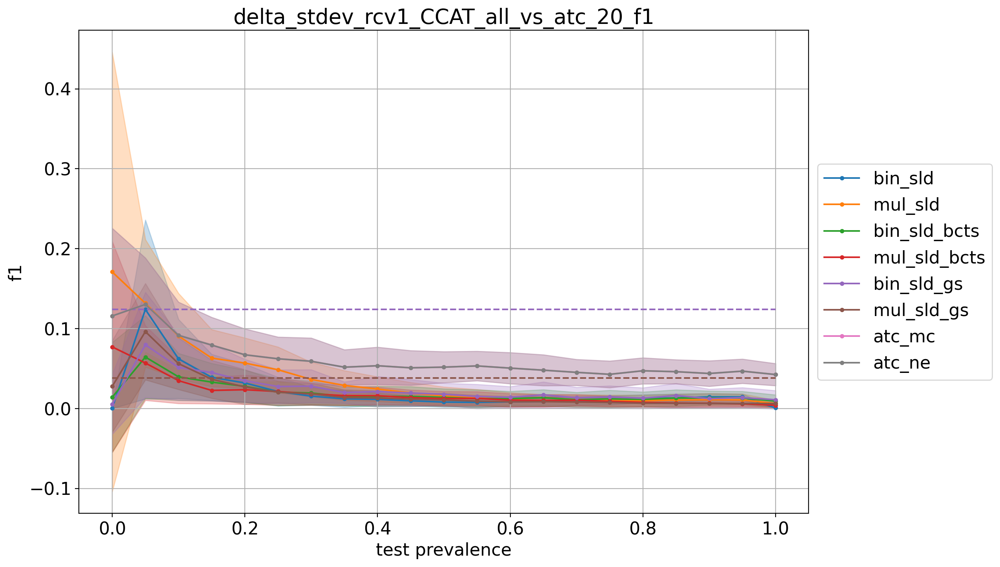
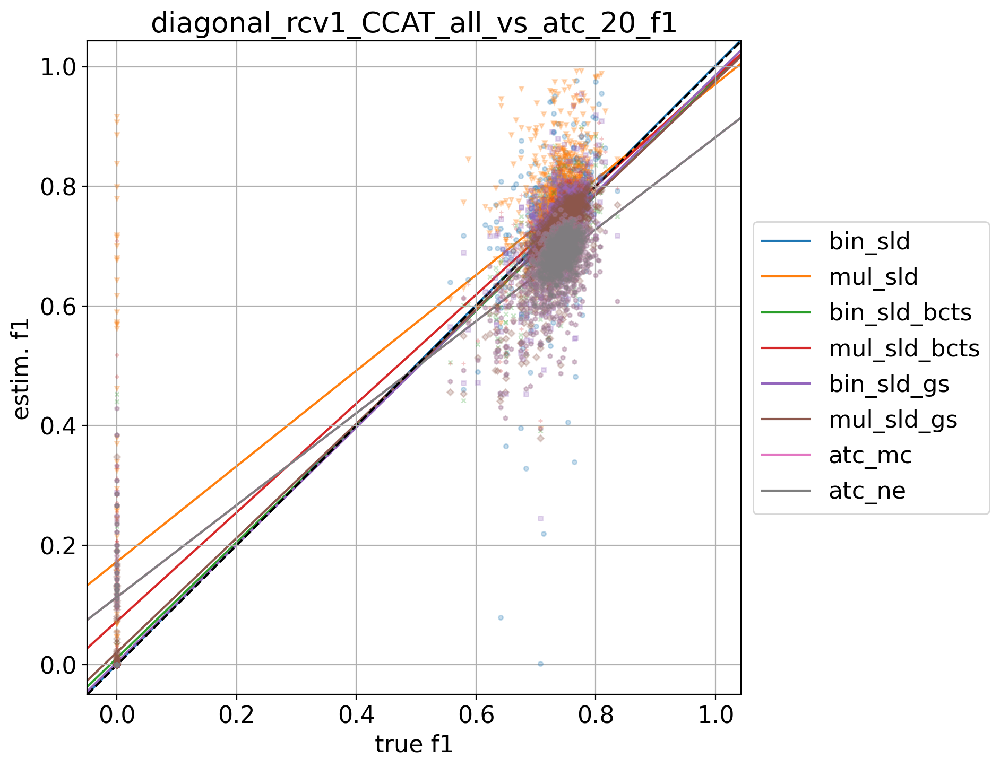
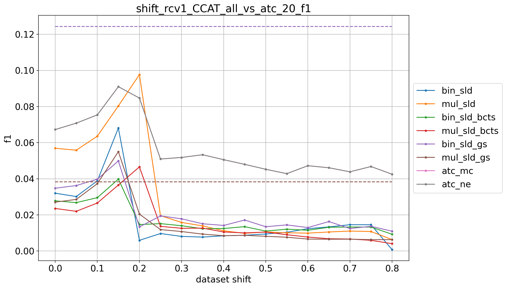

## 10% positives
> train: [0.90003338 0.09996662]  
> validation: [0.90003338 0.09996662]  
> bin_sld: 217.756s  
> mul_sld: 63.422s  
> kfcv: 47.542s  
> ref: 45.622s  
> atc_mc: 48.127s  
> atc_ne: 47.746s  
> doc_feat: 41.031s  
> tot: 219.250s  

<table border="1" class="dataframe">
  <thead>
    <tr style="text-align: right;">
      <th></th>
      <th>bin_sld</th>
      <th>mul_sld</th>
      <th>atc_mc</th>
      <th>atc_ne</th>
    </tr>
  </thead>
  <tbody>
    <tr>
      <th>0.0</th>
      <td>0.0155</td>
      <td>0.0469</td>
      <td>0.0022</td>
      <td>0.0022</td>
    </tr>
    <tr>
      <th>0.05</th>
      <td>0.2219</td>
      <td>0.0840</td>
      <td>0.2253</td>
      <td>0.2253</td>
    </tr>
    <tr>
      <th>0.1</th>
      <td>0.1663</td>
      <td>0.0459</td>
      <td>0.1997</td>
      <td>0.1997</td>
    </tr>
    <tr>
      <th>0.15</th>
      <td>0.1556</td>
      <td>0.0312</td>
      <td>0.2018</td>
      <td>0.2018</td>
    </tr>
    <tr>
      <th>0.2</th>
      <td>0.1368</td>
      <td>0.0327</td>
      <td>0.1936</td>
      <td>0.1936</td>
    </tr>
    <tr>
      <th>0.25</th>
      <td>0.1054</td>
      <td>0.0329</td>
      <td>0.1943</td>
      <td>0.1943</td>
    </tr>
    <tr>
      <th>0.3</th>
      <td>0.1181</td>
      <td>0.0379</td>
      <td>0.1865</td>
      <td>0.1865</td>
    </tr>
    <tr>
      <th>0.35</th>
      <td>0.0996</td>
      <td>0.0423</td>
      <td>0.1849</td>
      <td>0.1849</td>
    </tr>
    <tr>
      <th>0.4</th>
      <td>0.1031</td>
      <td>0.0495</td>
      <td>0.1852</td>
      <td>0.1852</td>
    </tr>
    <tr>
      <th>0.45</th>
      <td>0.0840</td>
      <td>0.0506</td>
      <td>0.1824</td>
      <td>0.1824</td>
    </tr>
    <tr>
      <th>0.5</th>
      <td>0.1091</td>
      <td>0.0546</td>
      <td>0.1836</td>
      <td>0.1836</td>
    </tr>
    <tr>
      <th>0.55</th>
      <td>0.0893</td>
      <td>0.0541</td>
      <td>0.1801</td>
      <td>0.1801</td>
    </tr>
    <tr>
      <th>0.6</th>
      <td>0.0801</td>
      <td>0.0588</td>
      <td>0.1872</td>
      <td>0.1872</td>
    </tr>
    <tr>
      <th>0.65</th>
      <td>0.1038</td>
      <td>0.0618</td>
      <td>0.1871</td>
      <td>0.1871</td>
    </tr>
    <tr>
      <th>0.7</th>
      <td>0.0810</td>
      <td>0.0616</td>
      <td>0.1884</td>
      <td>0.1884</td>
    </tr>
    <tr>
      <th>0.75</th>
      <td>0.0827</td>
      <td>0.0606</td>
      <td>0.1829</td>
      <td>0.1829</td>
    </tr>
    <tr>
      <th>0.8</th>
      <td>0.0746</td>
      <td>0.0616</td>
      <td>0.1840</td>
      <td>0.1840</td>
    </tr>
    <tr>
      <th>0.85</th>
      <td>0.0754</td>
      <td>0.0617</td>
      <td>0.1816</td>
      <td>0.1816</td>
    </tr>
    <tr>
      <th>0.9</th>
      <td>0.0613</td>
      <td>0.0592</td>
      <td>0.1818</td>
      <td>0.1818</td>
    </tr>
    <tr>
      <th>0.95</th>
      <td>0.0696</td>
      <td>0.0476</td>
      <td>0.1848</td>
      <td>0.1848</td>
    </tr>
    <tr>
      <th>1.0</th>
      <td>0.0495</td>
      <td>0.0231</td>
      <td>0.1850</td>
      <td>0.1850</td>
    </tr>
    <tr>
      <th>tot</th>
      <td>0.0992</td>
      <td>0.0504</td>
      <td>0.1801</td>
      <td>0.1801</td>
    </tr>
  </tbody>
</table>

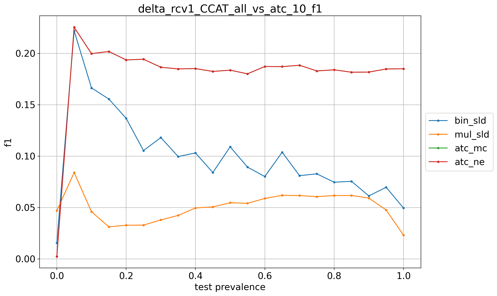
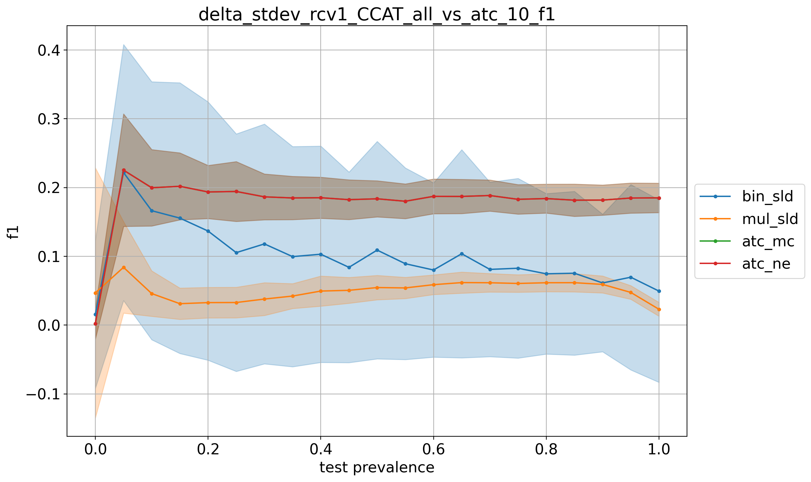
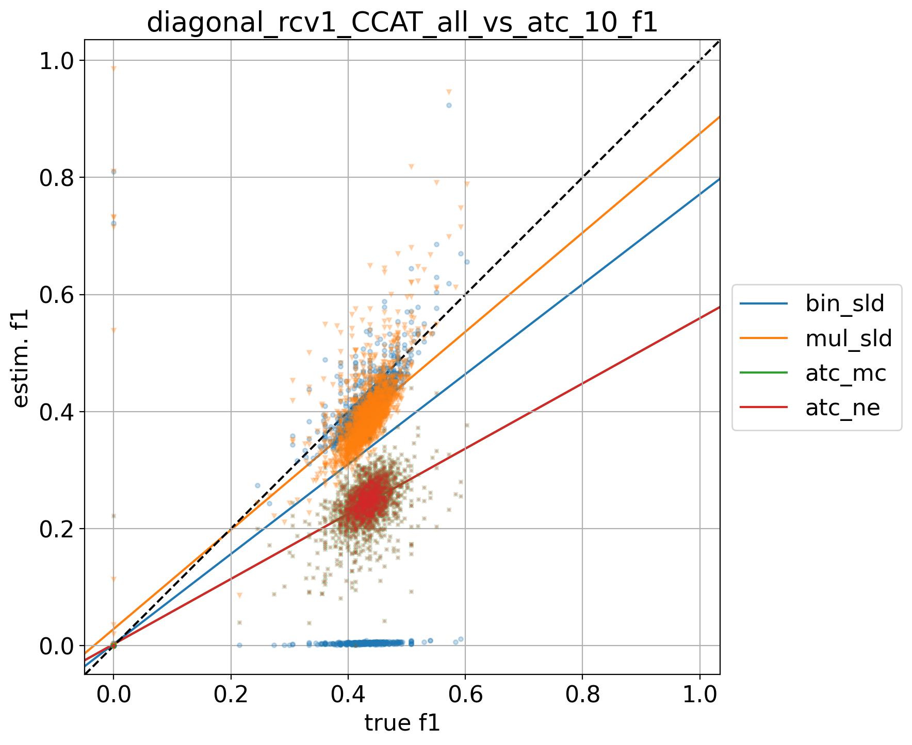
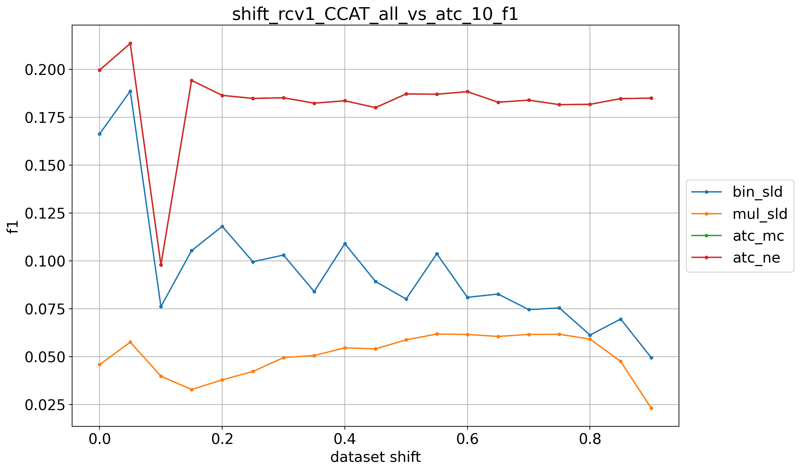

## avg
<table border="1" class="dataframe">
  <thead>
    <tr style="text-align: right;">
      <th></th>
      <th>bin_sld</th>
      <th>mul_sld</th>
      <th>bin_sld_bcts</th>
      <th>mul_sld_bcts</th>
      <th>bin_sld_gs</th>
      <th>mul_sld_gs</th>
      <th>atc_mc</th>
      <th>atc_ne</th>
    </tr>
  </thead>
  <tbody>
    <tr>
      <th>0.0</th>
      <td>0.0019</td>
      <td>0.0288</td>
      <td>0.0134</td>
      <td>0.0210</td>
      <td>0.0129</td>
      <td>0.0235</td>
      <td>0.3827</td>
      <td>0.3827</td>
    </tr>
    <tr>
      <th>0.05</th>
      <td>0.1024</td>
      <td>0.0945</td>
      <td>0.0542</td>
      <td>0.0436</td>
      <td>0.0586</td>
      <td>0.0791</td>
      <td>0.2109</td>
      <td>0.2109</td>
    </tr>
    <tr>
      <th>0.1</th>
      <td>0.0878</td>
      <td>0.0821</td>
      <td>0.0418</td>
      <td>0.0319</td>
      <td>0.0456</td>
      <td>0.0585</td>
      <td>0.1528</td>
      <td>0.1528</td>
    </tr>
    <tr>
      <th>0.15</th>
      <td>0.0795</td>
      <td>0.0730</td>
      <td>0.0363</td>
      <td>0.0277</td>
      <td>0.0377</td>
      <td>0.0442</td>
      <td>0.1203</td>
      <td>0.1203</td>
    </tr>
    <tr>
      <th>0.2</th>
      <td>0.0697</td>
      <td>0.0657</td>
      <td>0.0312</td>
      <td>0.0254</td>
      <td>0.0310</td>
      <td>0.0351</td>
      <td>0.0991</td>
      <td>0.0991</td>
    </tr>
    <tr>
      <th>0.25</th>
      <td>0.0604</td>
      <td>0.0611</td>
      <td>0.0283</td>
      <td>0.0246</td>
      <td>0.0276</td>
      <td>0.0304</td>
      <td>0.0819</td>
      <td>0.0819</td>
    </tr>
    <tr>
      <th>0.3</th>
      <td>0.0533</td>
      <td>0.0535</td>
      <td>0.0242</td>
      <td>0.0215</td>
      <td>0.0250</td>
      <td>0.0270</td>
      <td>0.0712</td>
      <td>0.0712</td>
    </tr>
    <tr>
      <th>0.35</th>
      <td>0.0466</td>
      <td>0.0480</td>
      <td>0.0219</td>
      <td>0.0204</td>
      <td>0.0223</td>
      <td>0.0242</td>
      <td>0.0623</td>
      <td>0.0623</td>
    </tr>
    <tr>
      <th>0.4</th>
      <td>0.0422</td>
      <td>0.0446</td>
      <td>0.0200</td>
      <td>0.0193</td>
      <td>0.0200</td>
      <td>0.0219</td>
      <td>0.0548</td>
      <td>0.0548</td>
    </tr>
    <tr>
      <th>0.45</th>
      <td>0.0354</td>
      <td>0.0393</td>
      <td>0.0174</td>
      <td>0.0167</td>
      <td>0.0174</td>
      <td>0.0193</td>
      <td>0.0497</td>
      <td>0.0497</td>
    </tr>
    <tr>
      <th>0.5</th>
      <td>0.0342</td>
      <td>0.0356</td>
      <td>0.0158</td>
      <td>0.0155</td>
      <td>0.0161</td>
      <td>0.0177</td>
      <td>0.0458</td>
      <td>0.0458</td>
    </tr>
    <tr>
      <th>0.55</th>
      <td>0.0297</td>
      <td>0.0326</td>
      <td>0.0142</td>
      <td>0.0148</td>
      <td>0.0144</td>
      <td>0.0159</td>
      <td>0.0415</td>
      <td>0.0415</td>
    </tr>
    <tr>
      <th>0.6</th>
      <td>0.0256</td>
      <td>0.0296</td>
      <td>0.0125</td>
      <td>0.0129</td>
      <td>0.0125</td>
      <td>0.0141</td>
      <td>0.0394</td>
      <td>0.0394</td>
    </tr>
    <tr>
      <th>0.65</th>
      <td>0.0262</td>
      <td>0.0272</td>
      <td>0.0124</td>
      <td>0.0127</td>
      <td>0.0127</td>
      <td>0.0134</td>
      <td>0.0373</td>
      <td>0.0373</td>
    </tr>
    <tr>
      <th>0.7</th>
      <td>0.0206</td>
      <td>0.0235</td>
      <td>0.0106</td>
      <td>0.0115</td>
      <td>0.0114</td>
      <td>0.0128</td>
      <td>0.0350</td>
      <td>0.0350</td>
    </tr>
    <tr>
      <th>0.75</th>
      <td>0.0189</td>
      <td>0.0201</td>
      <td>0.0095</td>
      <td>0.0099</td>
      <td>0.0104</td>
      <td>0.0117</td>
      <td>0.0325</td>
      <td>0.0325</td>
    </tr>
    <tr>
      <th>0.8</th>
      <td>0.0167</td>
      <td>0.0180</td>
      <td>0.0089</td>
      <td>0.0092</td>
      <td>0.0100</td>
      <td>0.0108</td>
      <td>0.0323</td>
      <td>0.0323</td>
    </tr>
    <tr>
      <th>0.85</th>
      <td>0.0152</td>
      <td>0.0157</td>
      <td>0.0082</td>
      <td>0.0084</td>
      <td>0.0095</td>
      <td>0.0100</td>
      <td>0.0315</td>
      <td>0.0315</td>
    </tr>
    <tr>
      <th>0.9</th>
      <td>0.0126</td>
      <td>0.0131</td>
      <td>0.0073</td>
      <td>0.0073</td>
      <td>0.0086</td>
      <td>0.0099</td>
      <td>0.0309</td>
      <td>0.0309</td>
    </tr>
    <tr>
      <th>0.95</th>
      <td>0.0130</td>
      <td>0.0103</td>
      <td>0.0064</td>
      <td>0.0064</td>
      <td>0.0076</td>
      <td>0.0089</td>
      <td>0.0321</td>
      <td>0.0321</td>
    </tr>
    <tr>
      <th>1.0</th>
      <td>0.0066</td>
      <td>0.0055</td>
      <td>0.0050</td>
      <td>0.0059</td>
      <td>0.0068</td>
      <td>0.0090</td>
      <td>0.0326</td>
      <td>0.0326</td>
    </tr>
    <tr>
      <th>tot</th>
      <td>0.0380</td>
      <td>0.0391</td>
      <td>0.0190</td>
      <td>0.0175</td>
      <td>0.0199</td>
      <td>0.0237</td>
      <td>0.0798</td>
      <td>0.0798</td>
    </tr>
  </tbody>
</table>

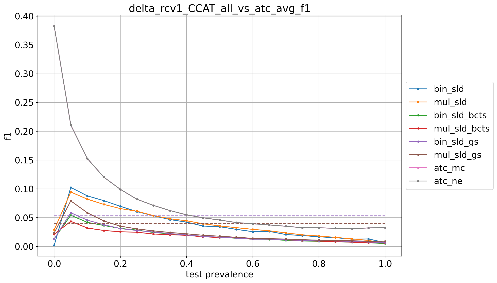
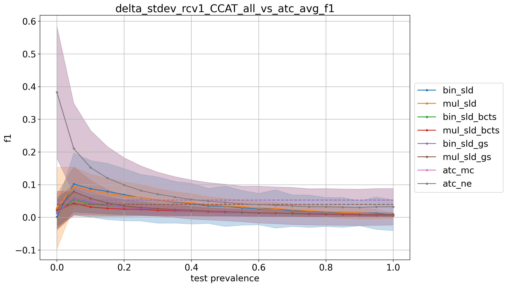
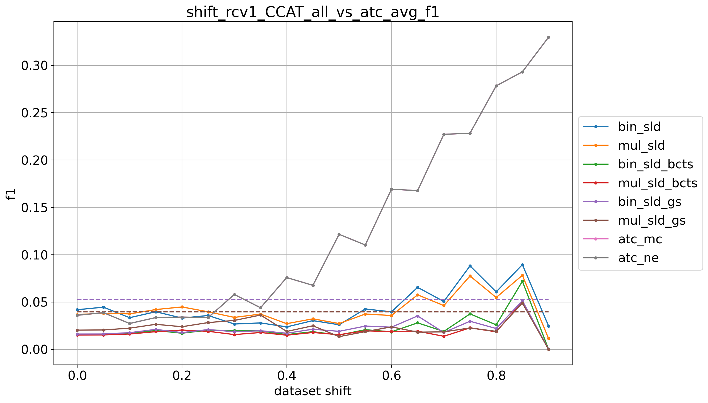
